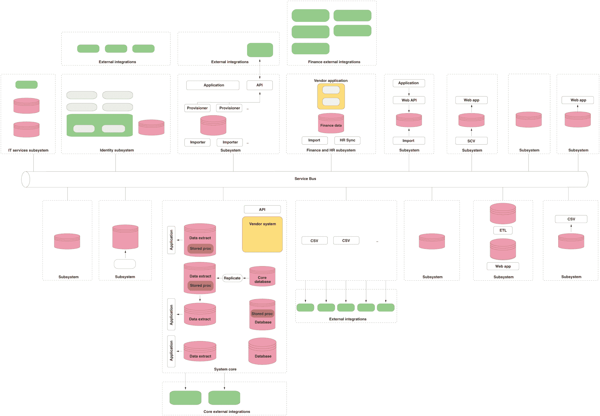
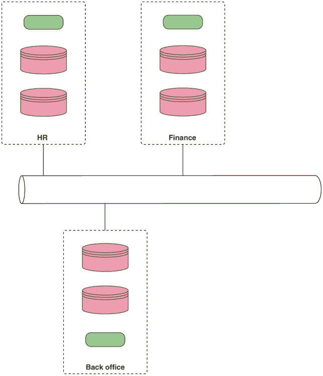
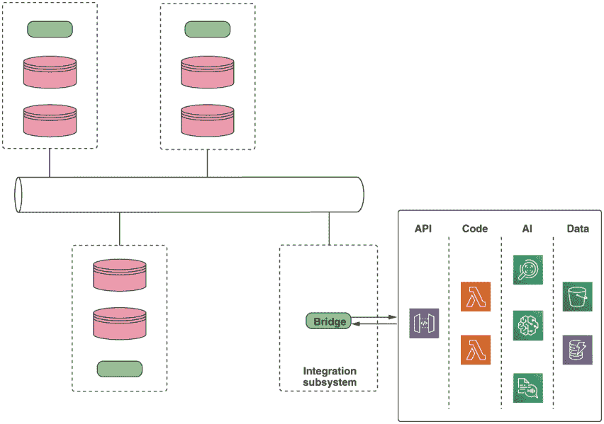
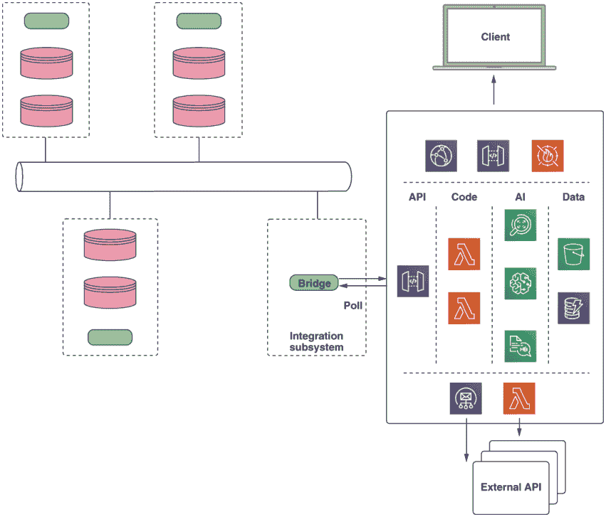
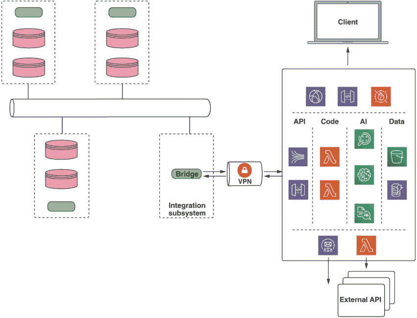
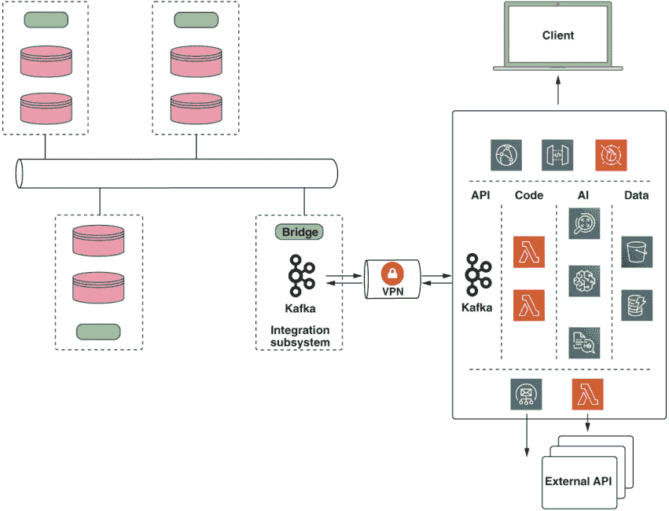
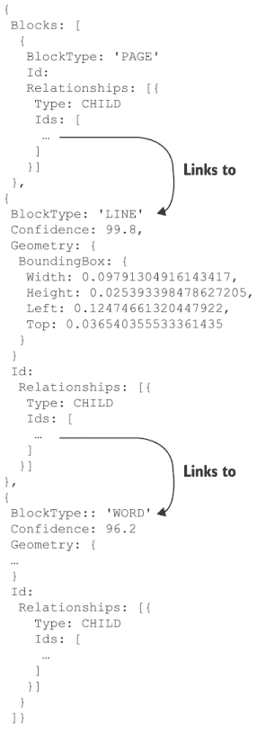
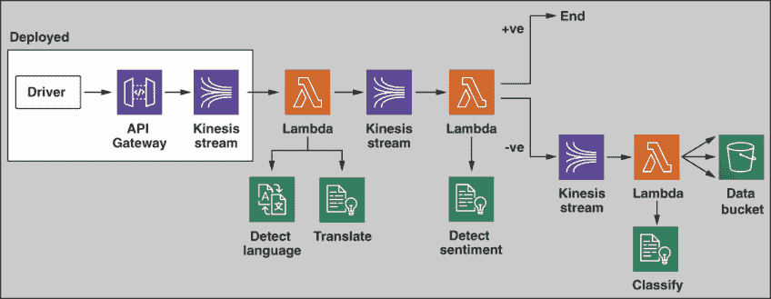
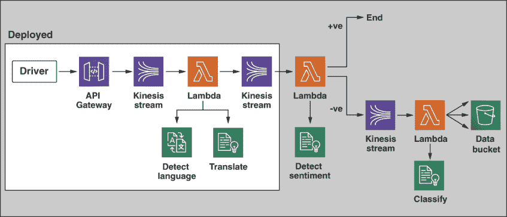
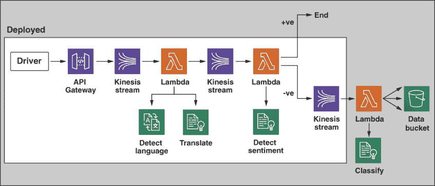

# 7 将 AI 应用于现有平台

本章涵盖

+   无服务器 AI 的集成模式

+   使用 Textract 改进身份验证

+   基于 Kinesis 的 AI 赋能数据处理管道

+   即时翻译使用 Translate

+   使用 Comprehend 进行情感分析

+   使用 Comprehend 训练自定义文档分类器

在第 2-5 章中，我们从零开始创建系统，并从一开始就应用 AI 服务。当然，现实世界并不总是这么干净和简单。我们几乎所有人都要处理遗留系统和技术债务。在本章中，我们将探讨将 AI 服务应用于现有系统的一些策略。我们将首先查看一些适用于此的架构模式，然后从那里开发一些从实际经验中汲取的具体示例。

## 7.1 无服务器 AI 的集成模式

不可避免的事实是，现实世界的企业计算是“混乱”的。对于中型到大型企业，技术资产通常是庞大的、分散的，并且随着时间的推移通常是有机增长的。

一个组织的计算基础设施可以根据财务、人力资源、市场营销、业务线系统等域线进行分解。这些域中的每一个都可能由来自不同供应商的许多系统组成，包括自建软件，并且通常会将遗留系统与现代软件即服务（SaaS）交付的应用程序混合在一起。

与此同时，各种系统通常以混合模式运行，混合本地、共址和基于云的部署。此外，这些操作元素通常必须与域内和域外的其他系统进行集成。这些集成可以通过批量 ETL 作业、点对点连接或通过某种形式的企业服务总线（ESB）来实现

ETL、点对点和 ESB

企业系统集成是一个大主题，我们在这里不会涉及，只是指出，有几种方式可以将系统连接在一起。例如，一家公司可能需要从其人力资源数据库中导出记录以与费用跟踪系统匹配。*提取、转换和加载（ETL）*指的是从数据库（通常为 CSV 格式）导出记录、转换，然后加载到另一个数据库的过程。

连接系统的另一种方法是使用点对点集成。例如，可以创建一些代码来调用一个系统的 API 并将数据推送到另一个系统的 API。当然，这取决于提供合适的 API。随着时间的推移，ETL 和点对点集成的使用可能会积累成一个非常复杂且难以管理的系统。

*企业服务总线（ESB）*试图通过提供一个中心系统来管理这种复杂性，这些连接可以在该系统中进行。ESB 方法有其自身的特定病理，并且常常造成的问题与解决的问题一样多。

图 7.1 说明了典型中型组织的技术地产。在这个例子中，通过一个中央总线将不同的领域连接在一起。在每一个领域内，都有独立的 ETL 和批量处理过程将系统连接起来。

不言而喻，对所有这种复杂性的描述超出了本书的范围。我们将关注的问题是，我们如何在这个环境中采用和利用无服务器 AI。幸运的是，有一些简单的模式我们可以遵循来实现我们的目标，但首先让我们简化这个问题。



图 7.1 典型企业技术地产，按逻辑领域分解。此图像旨在说明典型技术地产的复杂性质。架构的细节并不重要。

在接下来的讨论中，我们将使用图 7.2 来表示我们的“企业地产”，以便我们将其余的基础设施视为一个黑盒。在下一节中，我们将检查四种常见的连接 AI 服务模式。然后，我们将构建一些具体的例子来展示如何使用 AI 服务在企业内部增强或替换现有的业务流程。

例如，如果一家公司的业务流程需要通过水电费账单或护照证明身份，这可以作为一个 AI 赋能的服务提供，从而减少人工工作量。

另一个例子是预测。许多组织需要提前规划，以预测在特定时间段内所需的库存或员工水平。AI 服务可以集成到这一过程中，以构建更复杂和准确的模型，为公司节省金钱或机会成本。



图 7.2 简化的企业表示

我们将检查四种方法：

+   同步 API

+   异步 API

+   VPN 流入

+   VPN 全连接流

请记住，这些方法仅仅代表将适当的数据放入所需位置以使我们能够执行 AI 服务以实现业务目标的方式。

### 7.1.1 模式 1：同步 API

第一种也是最简单的方法是创建一个小的系统，就像我们在前几章中所做的那样，与企业其他部分隔离。功能通过安全的 API 暴露，并通过公共互联网访问。如果需要更高层次的安全性，可以建立 VPN 连接，通过该连接调用 API。这种简单的模式在图 7.3 中得到了说明。



图 7.3 集成模式 1：同步 API

为了使用该服务，必须创建一小段桥接代码来调用 API 并消费服务的输出。当结果可以快速获得，并且 API 以请求/响应方式调用时，此模式是合适的。

### 7.1.2 模式 2：异步 API

我们的第二个模式非常相似，即我们通过 API 公开功能；然而，在这种情况下，API 是异步的。这种模式适用于运行时间较长的 AI 服务，如图 7.4 所示。



图 7.4 集成模式 2：异步 API

在这个“点火后即忘”模型下，桥梁代码调用 API 但不立即接收结果，除了状态信息。一个例子可能是一个处理大量文本的文档分类系统。该系统的输出可以通过多种方式被更广泛的企业所消费：

+   通过构建一个用户可以与之交互以查看结果的 Web 应用程序

+   通过系统通过电子邮件或其他渠道发送结果消息

+   通过系统调用外部 API 以转发任何分析详情

+   通过桥梁代码轮询 API 以获取结果

### 7.1.3 模式 3：VPN 流入

第三种方法是通过 VPN 将企业连接到云服务。一旦建立了安全连接，桥梁代码可以更直接地与云服务交互。例如，而不是使用 API 网关来访问系统，桥梁代码可以直接将数据流入 Kinesis 管道。

结果可以通过多种方式访问：通过 API、通过出站消息、通过 Web GUI 或通过输出流。如图 7.5 所示。



图 7.5 集成模式 3：流入

VPN

*虚拟专用网络（VPN）*可以用来在设备或网络之间提供安全的网络连接。VPN 通常使用 IPSec 协议套件来提供身份验证、授权和安全的加密通信。使用 IPSec 可以让您使用不安全的协议，例如用于远程节点之间文件共享的协议。

VPN 可以用来为远程工作者提供对企业的安全访问，或者将企业网络安全地连接到云中。尽管有几种设置和配置 VPN 的方法，但我们建议使用 AWS VPN 服务来实现无服务器方法。

### 7.1.4 模式 4 VPN：完全连接的流式传输

我们的最后一个模式涉及企业与云 AI 服务之间更深层次的连接。在这个模型下，我们像以前一样建立 VPN 连接，并使用它来双向流数据。尽管有几种流式传输技术可用，但我们使用 Apache Kafka 取得了良好的效果。如图 7.6 所示



图 7.6 集成模式 4：全流式传输

这种方法涉及在 VPN 两端运行 Kafka 集群，并在集群之间复制数据。在云环境中，服务通过从适当的 Kafka 主题中拉取数据来消费数据，并将结果放回不同的主题，以便更广泛的企业消费。

Kafka

Apache Kafka 是一个开源的分布式流式平台。Kafka 最初是在 LinkedIn 开发的，后来捐赠给了 Apache 基金会。尽管有其他流式技术可用，但 Kafka 的设计独特之处在于它被实现为一个分布式提交日志。

Kafka 越来越多地被 Netflix 和 Uber 等公司用于高吞吐量数据流场景。当然，您可以安装、运行和管理自己的 Kafka 集群；然而，我们建议您采用无服务器方法，并采用 AWS Managed Streaming for Kafka (MSK)等系统。

对这种方法以及 Kafka 的一般优点的全面讨论超出了本书的范围。如果您不熟悉 Kafka，我们建议您阅读 Dylan Scott 所著的 Manning 出版社的《Kafka in Action》一书，以了解相关知识。

### 7.1.5 哪种模式？

与所有架构决策一样，采取哪种方法实际上取决于用例。我们的指导原则是尽可能保持简单。如果简单的 API 集成可以实现您的目标，那么就选择它。如果随着时间的推移，外部 API 集开始增长，那么考虑将集成模型改为流式解决方案，以避免 API 的过度扩散。关键点是持续审查 AI 服务的集成，并准备好根据需要重构。

表 7.1 总结了上下文以及何时应用每种模式。

表 7.1 AI as Service 传统集成模式适用性

| 模式 | 上下文 | 示例 |
| --- | --- | --- |
| 1: 同步 API | 单个服务，快速响应 | 从文档中提取文本 |
| 2: 异步 API | 单个服务，运行时间更长 | 文档转录 |
| 3: VPN 流入 | 多个服务，人类消费的结果 | 情感分析管道 |
| 4: VPN 完全连接 | 多个服务，机器消费的结果 | 文档批处理翻译 |

在本章中，我们将构建两个示例系统：

+   模式 1：同步 API 方法

+   模式 2：异步 API

虽然我们不会详细探讨流式处理方法，但请记住，我们的两个示例系统也可以通过这种方法与企业连接，只需用适当的技术（如 Apache Kafka）替换 API 层即可。

## 7.2 使用 Textract 改进身份验证

对于我们的第一个示例，我们将通过创建一个小的、自包含的 API 来扩展现有平台，该 API 可以直接调用。让我们想象一个组织需要验证身份。我们中的大多数人都在某个时候经历过这个过程；例如，在申请抵押贷款或汽车贷款时。

这通常需要扫描几份文件以证明您的身份和地址给贷款人。尽管需要有人查看这些扫描件，但从这些扫描件中提取信息并将信息手动输入到贷款人的系统中既耗时又容易出错。这是我们现在可以通过应用 AI 来实现的事情。

我们的小型、自包含的服务如图 7.7 所示。它使用 AWS Textract 从扫描的文档中提取详细信息。在这个例子中，我们将使用护照，但其他身份证明文件也可以同样工作，例如水电费账单或银行对账单。


图 7.7 文档识别 API

我们的 API 有两部分。首先，我们需要将扫描的图像上传到 S3。最简单的方法是使用预签名的 S3 URL，我们的 API 提供了一个生成此类 URL 并将其返回给客户端的功能。一旦我们的图像在 S3 中，我们将使用 Lambda 函数调用 Textract，它将分析扫描的图像，并以文本格式返回数据。我们的 API 将将这些数据返回给客户端以进行进一步处理。

个人可识别信息

任何个人可识别信息都必须非常小心地处理。每当系统必须处理用户提供的个人信息时，尤其是身份证明文件时，它必须遵守信息收集地的所有法定法律要求。

在欧盟，这意味着系统必须遵守通用数据保护条例（GDPR）。作为开发人员和系统架构师，我们需要了解这些法规并确保合规。

### 7.2.1 获取代码

API 的代码位于 `chapter7/text-analysis` 目录中。这包含两个目录：`text-analysis-api`，其中包含我们的 API 服务的代码，以及 `client`，其中包含一些用于测试 API 的代码。在部署和测试之前，我们将通过一些示例数据来了解整个系统。

### 7.2.2 文本分析 API

我们的 API 代码库包括一个 `serverless.yml` 配置文件，`package.json` 用于我们的节点模块依赖项，以及包含 API 逻辑的 `handler.js`。`serverless.yml` 是相当标准的，定义了两个 Lambda 函数：`upload` 和 `analyze`，它们可以通过 API Gateway 访问。它还定义了一个用于 API 的 S3 桶，并设置了分析服务的 IAM 权限，如下所示。

列表 7.1 Textract 权限

```
iamRoleStatements:
    - Effect: Allow                     ❶
      Action:
        - s3:GetObject
        - s3:PutObject
        - s3:ListBucket
      Resource: "arn:aws:s3:::${self:custom.imagebucket}/*"
    - Effect: Allow
      Action:
        - textract:AnalyzeDocument      ❷
      Resource: "*"
```

❶ 启用桶对 Lambda 的访问

❷ 启用 Textract 权限

除了为 Textract 允许访问上传的文档外，还需要桶权限以使我们的 Lambda 函数生成有效的预签名 URL。

下一个列表显示了调用 `S3` API 生成预签名 URL 的调用。URL 以及桶密钥被返回给客户端，客户端执行 `PUT` 请求上传相关的文档。

列表 7.2 获取预签名 URL

```
const params = {
    Bucket: process.env.CHAPTER7_IMAGE_BUCKET,
    Key: key,
    Expires: 300                                 ❶
  }
  s3.getSignedUrl('putObject', params, function (err, url) {
    respond(err, {key: key, url: url}, cb)
  })
```

❶ 设置五分钟的过期时间

预签名的 URL 仅限于为该特定键和文件指定的特定操作——在本例中为 `PUT` 请求。注意，我们还在 URL 上设置了 300 秒的过期时间。这意味着如果在五分钟内未启动文件传输，预签名 URL 将失效，并且没有生成新的 URL 的情况下无法进行传输。

一旦文档上传到存储桶，我们就可以调用 Textract 来执行分析。下一列表显示了这是如何在 `handler.js` 中完成的。

列表 7.3 调用 Textract

```
const params = {
    Document: {
      S3Object: {                                   ❶
        Bucket: process.env.CHAPTER7_IMAGE_BUCKET,
        Name: data.imageKey
      }
    },
    FeatureTypes: ['TABLES', 'FORMS']               ❷
  }

  txt.analyzeDocument(params, (err, data) => {      ❸
    respond(err, data, cb)
  })
```

❶ 指向上传的文档

❷ 设置特征类型

❸ 调用 Textract

Textract 可以执行两种类型的分析，`TABLES` 和 `FORMS`。`TABLES` 分析类型指示 Textract 在其分析中保留表格信息，而 `FORMS` 类型则请求 Textract 在可能的情况下将信息提取为键值对。如果需要，这两种分析类型可以在同一调用中执行。

分析完成后，Textract 返回一个包含结果的 JSON 块。结果结构如图 7.8 所示。



图 7.8 Textract 输出 JSON

结构应该是相当直观的，因为它由一个根 `PAGE` 元素组成，该元素链接到子 `LINE` 元素，每个子 `LINE` 元素又链接到多个子 `WORD` 元素。每个 `WORD` 和 `LINE` 元素都有一个相关的置信区间：一个介于 0 和 100 之间的数字，表示 Textract 认为每个元素的分析有多准确。每个 `LINE` 和 `WORD` 元素还有一个 `Geometry` 部分；这包含围绕元素边界框的坐标信息。这可以用于需要一些额外人工验证的应用程序。例如，一个 UI 可以显示带有叠加边界框的扫描文档，以确认提取的文本与预期的文档区域相匹配。

### 7.2.3 客户端代码

测试 API 的代码位于 `client` 目录中。主要的 API 调用代码在 `client.js` 中。有三个函数：`getSignedUrl`、`uploadImage` 和 `analyze`。这些函数与 API 的一对一映射，如前所述。

以下列表显示了 `analyze` 函数。

列表 7.4 调用 API

```
function analyze (key, cb) {
    req({                                     ❶
      method: 'POST',
      url: env.CHAPTER7_ANALYZE_URL,
      body: JSON.stringify({imageKey: key})
    }, (err, res, body) => {
      if (err || res.statusCode !== 200) {
        return cb({statusCode: res.statusCode,
          err: err,
          body: body.toString()})
      }
      cb(null, JSON.parse(body))             ❷
    })
  }
```

❶ 向 API 发送 POST 请求

❷ 返回结果

代码使用 `request` 模块向 `analyze` API 发送 `POST` 请求，该请求将 Textract 的结果块返回给客户端。

### 7.2.4 部署 API

在我们部署 API 之前，我们需要配置一些环境变量。API 和客户端都从 `chapter7/text-analysis` 目录中的 `.env` 文件中读取其配置。打开您最喜欢的编辑器并创建此文件，内容如下一列表所示。

列表 7.5 Textract 示例的 `.env` 文件

```
TARGET_REGION=eu-west-1
CHAPTER7_IMAGE_BUCKET=<your bucket name>
```

将 `<your bucket name>` 替换为您选择的全球唯一存储桶名称。

为了部署 API，我们需要像之前一样使用 Serverless Framework。打开命令行，`cd`到`chapter7/text-analysis/text-analysis-api`目录，并运行

```
$ npm install
$ serverless deploy
```

这将创建文档图像存储桶，设置 API 网关，并部署我们的两个 Lambda 函数。一旦部署，Serverless 将输出两个函数的网关 URL，这些 URL 将类似于下一条列表中所示。

列表 7.6 端点 URL

```
endpoints:
GET - https://63tat1jze6.execute-api.eu-west-1.amazonaws.com/dev/upload    ❶
POST - https://63tat1jze6.execute-api.eu-west-1.amazonaws.com/dev/analyze  ❷
functions:
upload: c7textanalysis-dev-upload
analyze: c7textanalysis-dev-analyze
```

❶ 上传 URL

❷ 分析 URL

我们将使用这些 URL 来调用我们的文本分析 API。

### 7.2.5 测试 API

现在我们已经部署了我们的 API，是时候用一些真实数据来测试它了。我们刚刚部署的服务能够读取和识别文档中的文本字段，例如账单或护照。我们在`data`子目录中提供了一些示例护照图像，其中之一如图 7.9 所示。当然，这些是由模拟数据组成的。


图 7.9 示例护照

为了测试 API，我们首先需要更新我们的`.env`文件。在文本编辑器中打开文件，并添加两个 URL 和存储桶名称，如下所示，使用您特定的名称。

列表 7.7 环境文件

```
TARGET_REGION=eu-west-1
CHAPTER7_IMAGE_BUCKET=<your bucket name>
CHAPTER7_ANALYZE_URL=<your analyze url>       ❶
CHAPTER7_GETUPLOAD_URL=<your upload url>      ❷
```

❶ 替换为分析 URL

❷ 替换为上传 URL

接下来，`cd`到`chapter7/text-analysis/client`目录。在`data`子目录中有一些示例图像。在`index.js`中有练习客户端的代码。要运行代码，打开命令行并执行

```
$ npm install
$ node index.js
```

客户端代码将使用 API 将示例文档上传到图像存储桶，然后调用我们的`analyze` API。`analyze` API 将调用 Textract 来分析图像并将结果返回给我们的客户端。最后，客户端代码将解析输出 JSON 结构并挑选出几个关键字段，将它们显示在控制台上。你应该看到类似以下列表的输出。

列表 7.8 客户端输出

```
{
  "passportNumber": "340020013 (confidence: 99.8329086303711)",
  "surname": "TRAVELER (confidence: 75.3625717163086)",
  "givenNames": "HAPPY (confidence: 96.09229278564453)",
  "nationality": "UNITED STATES OF AMERICA (confidence: 82.67759704589844)",
  "dob": "01 Jan 1980 (confidence: 88.6818618774414)",
  "placeOfBirth": "WASHINGTON D.C. U.S.A. (confidence: 84.47944641113281)",
  "dateOfIssue": "06 May 2099 (confidence: 88.30438995361328)",
  "dateOfExpiration": "05 May 2019 (confidence: 88.60911560058594)"
}
```

重要的是要注意，Textract 正在应用多种技术来为我们提取这些信息。首先，它执行一个*光学字符识别（OCR）*分析来识别图像中的文本。作为分析的一部分，它保留了识别字符的坐标信息，将它们分组到块和行中。然后，它使用坐标信息将表单字段关联为名称-值对。

为了准确起见，我们需要向 Textract 提供高质量的图像：图像质量越好，分析结果越好。你可以通过创建或下载自己的低质量图像并将这些图像传递给 API 来测试这一点。你应该会发现 Textract 在低质量图像中难以识别相同的字段。

列表 7.8 显示了 Textract 识别的字段，以及一个置信度级别。大多数人工智能服务都会返回一些相关的置信度级别，而作为服务的消费者，我们则需要弄清楚我们应该如何处理这个数字。例如，如果我们的用例对错误非常敏感，那么可能只接受 99% 或更好的置信度级别是正确的。置信度较低的成果应发送给人类进行验证或修正。然而，许多商业用例可以容忍较低的准确性。这种判断非常特定于领域，应涉及业务和技术利益相关者。

考虑你自己的组织中的业务流程：是否有可以通过此类分析自动化的领域？你是否需要从客户提供的文档中收集和输入信息？也许你可以通过调整此示例以满足自己的需求来改进该流程。

### 7.2.6 删除 API

在进入下一节之前，我们需要删除 API 以避免产生额外费用。为此，请使用 `cd` 命令进入 `chapter7/text-analysis/text-analysis -api` 目录，并运行

```
$ source ../.env && aws s3 rm s3://${CHAPTER7_IMAGE_BUCKET} --recursive
$ serverless remove
```

这将删除桶中所有上传的图像并拆除堆栈。

## 7.3 带有 Kinesis 的 AI 驱动数据处理管道

对于我们的第二个示例，我们将构建一个数据处理管道。这个管道将通过异步 API 公开，并作为我们的模式 2 示例。在构建这个示例时，我们将详细探讨包括 Kinesis、Translate 和 Comprehend 在内的一系列新服务和技术的使用：

+   Kinesis 是亚马逊的实时流服务，用于创建数据和处理视频的管道。

+   Translate 是亚马逊的机器驱动语言翻译服务。

+   Comprehend 是亚马逊的自然语言处理（NLP）服务，可用于执行情感分析或关键词检测等任务。

考虑零售和电子商务领域。大型零售店可能有多个产品部门，如“户外”、“汽车”、“宠物”等。客户服务是零售贸易的重要组成部分。特别是，快速有效地回应客户投诉非常重要，因为如果处理得当，它可以把一个不满的客户转变为品牌倡导者。问题是客户有多个渠道可以投诉，包括网站产品评论、电子邮件、Twitter、Facebook、Instagram、博客文章等等。

不仅有许多渠道可以放置产品反馈，全球零售商还必须处理多种语言的反馈。尽管需要人类来处理客户，但检测所有这些渠道和地理区域的负面反馈是适合人工智能驱动解决方案的。

我们的示例系统将是一个具有 AI 功能的管道，可以用于过滤来自多个渠道和多种语言的反馈。我们管道的目标是在检测到关于他们产品之一的负面反馈时，向适当的部门发出警报。

这个具有 AI 功能的管道增强了零售商的数字能力，同时不会直接干扰业务线系统。

我们在图 7.10 中展示了我们的管道。管道的起始处，原始数据被发送到一个收集 API；这些数据可以来自多个来源，例如 Twitter 流、Facebook 评论、入站电子邮件以及其他社交媒体渠道。API 将原始文本输入到 Kinesis 流中。


图 7.10 处理管道

AWS 提供了两种关键的流技术：管理的 Kafka（MSK）和 Kinesis。在这些技术中，Kinesis 是最容易使用的，因此我们将专注于它来构建这个系统。流中的数据会触发下游的 Lambda 函数，该函数使用 Comprehend 来确定入站文本的语言。如果语言不是英语，Lambda 函数将使用 AWS Translate 进行即时翻译，然后再将其发送到管道中。下一个下游的 Lambda 函数将对翻译后的文本进行情感分析，使用 Comprehend。如果检测到积极情感，则不会对消息进行进一步处理。然而，如果情感非常负面，文本将被发送到使用 AWS Comprehend 构建的客户分类器。该分类器分析文本并尝试确定与消息相关的产品部门。一旦确定了部门，消息就可以被发送到适当的团队，以便他们处理负面评论。在这种情况下，我们将输出结果到 S3 存储桶。

通过这种方式结合使用 AI 服务，这样的管道可以为企业节省巨大的成本，因为反馈的过滤和分类是自动完成的，无需团队人员。

Kinesis 与 Kafka 的比较

直到最近，选择 Kinesis 而不是 Kafka 的一个原因是 Kafka 需要在 EC2 实例上安装、设置和管理。随着 AWS 管理的 Kafka（MSK）的发布，这种情况已经改变。尽管关于 Kafka 优点的全面讨论超出了本书的范围，但我们想指出，这项技术具有高度可扩展性和多功能性。我们建议，如果您正在构建一个需要大量流处理的系统，您应该更深入地研究 Kafka。

即使考虑到 MSK，Kinesis 仍然更完全地集成到 AWS 堆栈中，并且更容易快速启动，因此我们将使用它作为示例系统。Kinesis 可以用几种方式使用：

+   Kinesis Video Streams--用于视频和音频内容

+   Kinesis Data Streams--用于通用数据流

+   Kinesis Data Firehose--支持将 Kinesis 数据流式传输到 S3、Redshift 或 Elasticsearch 等目标

+   Kinesis Analytics--支持使用 SQL 进行实时流处理

在本章中，我们使用 Kinesis Data Streams 构建我们的管道。

### 7.3.1 获取代码

我们管道的代码位于书籍仓库中`chapter7/pipeline`目录下。该目录包含以下子目录，它们对应于处理过程中的每个阶段：

+   `pipeline-api`--包含系统的 API Gateway 设置

+   `translate`--包含语言检测和翻译服务

+   `sentiment`--包含情感分析代码

+   `training`--包含帮助训练自定义分类器的实用脚本

+   `classify`--包含触发我们的自定义分类器的代码

+   `driver`--包含用于测试管道的代码

与前面的示例一样，在部署之前，我们将简要描述每个服务的代码。一旦我们所有的单元都已部署，我们将对管道进行端到端测试。让我们从简单的第一步开始，部署 API。

### 7.3.2 部署 API

API 的代码位于`chapter7/pipeline/pipeline-api`目录中，包括一个`serverless.yml`文件和一个简单的 API。Serverless 配置定义了一个单一的`ingest`方法，该方法将 API 发布的数据推送到 Kinesis。Kinesis 流也在 Serverless 配置中定义，如下所示。

列表 7.9 `serverless.yml` Kinesis 定义

```
resources:
  Resources:
    KinesisStream:                    ❶
      Type: AWS::Kinesis::Stream
      Properties:
        Name: ${env:CHAPTER7_PIPELINE_TRANSLATE_STREAM}
        ShardCount: ${env:CHAPTER7_PIPELINE_SHARD_COUNT}
```

❶ 定义 Kinesis 流

API 的代码非常简单，它只是将传入的数据转发到 Kinesis 流。API 接受传入的 JSON `POST`请求，并期望格式如下一列表所示。

列表 7.10 管道 API 的 JSON 数据格式

```
{
  originalText: ...                      ❶
  source: 'twitter' | 'facebook'...      ❷
  originator: '@pelger'                  ❸
}
```

❶ 原始文本

❷ 反馈来源

❸ 反馈发起者的 ID

在部署 API 之前，我们需要设置我们的环境。我们在`chapter7/pipeline`目录中提供了一个名为`default-environment.env`的模板`.env`文件。在`chapter7/pipeline`目录中创建此文件的副本，文件名为`.env`。该文件应包含下一列表中概述的内容。

列表 7.11 管道的环境文件

```
TARGET_REGION=eu-west-1
CHAPTER7_PIPELINE_SHARD_COUNT=1                          ❶
CHAPTER7_PIPELINE_TRANSLATE_STREAM=c7ptransstream        ❷
CHAPTER7_PIPELINE_SENTIMENT_STREAM=c7psentstream         ❸
CHAPTER7_PIPELINE_CLASSIFY_STREAM=c7pclassifystream      ❹
CHAPTER7_PIPELINE_TRANSLATE_STREAM_ARN=...
CHAPTER7_PIPELINE_SENTIMENT_STREAM_ARN=...
CHAPTER7_PIPELINE_CLASSIFY_STREAM_ARN=...
CHAPTER7_CLASSIFIER_NAME=chap7classifier
CHAPTER7_CLASSIFIER_ARN=...
...
```

❶ Kinesis 分片数量

❷ Kinesis 翻译流名称

❸ Kinesis 情感流名称

❹ Kinesis 分类流名称

接下来，我们可以在`chapter7/pipeline/pipeline-api`目录中打开命令行，并执行以下操作来部署 API。

```
$ npm install
$ serverless deploy
```

这将创建我们的第一个 Kinesis 流，以及我们的摄取 API。图 7.11 说明了 API 部署后的管道状态。高亮部分表示到目前为止已部署的内容。



图 7.11 API 部署后的管道

在部署后，框架将输出我们 API 的 URL。在进入下一阶段之前，请将其添加到`.env`文件中，如下所示，并用您的具体值替换。

列表 7.12 API 部署后的`.env`文件中的附加条目

```
CHAPTER7_PIPELINE_API=<your API url>
```

## 7.4 使用 Translate 进行即时翻译

在数据摄取后的我们管道的第一个阶段是检测语言，如果需要则翻译成英语。这些任务由我们的翻译服务处理，其代码位于`chapter8/pipeline/translate`目录中。Serverless 配置相当标准，除了主要处理函数是由我们在 API 部署中定义的 Kinesis 流触发的。这将在下面的列表中展示。

列表 7.13 由 Kinesis 触发的处理程序

```
functions:
  translate:
    handler: handler.translate
    events:
      - stream:                 ❶
          type: kinesis
          arn: ${env:CHAPTER7_PIPELINE_TRANSLATE_STREAM_ARN}
          batchSize: 100
          startingPosition: LATEST
          enabled: true
          async: true
```

❶ 连接到流。

该配置定义了一个第二个 Kinesis 流，我们的情感服务将连接到它，并设置了适当的权限来发布到流和调用所需的翻译服务。这将在下面的列表中展示。

列表 7.14 处理程序 IAM 权限

```
- Effect: Allow
      Action:
        - comprehend:DetectDominantLanguage      ❶
         - translate:TranslateText               ❷
         - kinesis:PutRecord                     ❸
         - kinesis:PutRecords
      Resource: "*"
```

❶ Comprehend 权限

❷ 翻译权限

❸ Kinesis 权限

我们翻译服务的代码在`handler.js`中，由我们的 API 定义的 Kinesis 流中的数据触发。这作为事件参数中 Base64 编码记录的一个块。下一个列表展示了我们的服务如何消费这些记录。

列表 7.15 翻译服务

```
module.exports.translate = function (event, context, cb) {
  let out = []
  asnc.eachSeries(event.Records, (record, asnCb) => {     ❶
    const payload = new Buffer(record.kinesis.data,
      'base64').toString('utf8')                          ❷
    let message
    try {
      message = JSON.parse(payload)                       ❸
    } catch (exp) {
  ...
  })
```

❶ 遍历每个记录。

❷ 解码记录。

❸ 转换为对象

我们的服务结合使用 Comprehend 和 Translate。Comprehend 用于检测我们的消息中的语言，Translate 用于在检测到的语言需要时将其转换为英语。下一个列表展示了源代码中的相关调用。

列表 7.16 检测语言和翻译

```
...
let params = {
  Text: message.originalText
}
comp.detectDominantLanguage(params, (err, data) => {     ❶
...
  params = {
    SourceLanguageCode: data.Languages[0].LanguageCode,
    TargetLanguageCode: 'en',
    Text: message.originalText
  }
  trans.translateText(params, (err, data) => {           ❷
  ...
```

❶ 检测语言

❷ 翻译成英语

一旦服务翻译了文本，如果需要，它将更新后的消息发布到第二个 Kinesis 流。这将稍后被我们的情感检测服务获取，我们将在不久后部署它。

要部署翻译服务，请在`chapter7/pipeline/translate`目录中打开命令行并运行

```
$ npm install
$ serverless deploy
```

这将在我们的管道中创建第二个阶段。图 7.12 展示了最新部署后我们的管道状态。



图 7.12 API 部署后的管道

我们已经完成了管道部署的一半。在下一节中，我们将检查到目前为止一切是否正常工作。

## 7.5 测试管道

现在我们已经部署了管道的一部分，让我们通过一些数据来检查它是否正常工作。为此，我们将利用一个免费的开源公共数据集。让我们现在获取一些这些数据并用来测试我们的管道。

首先`cd`到`chapter7/pipeline/testdata`目录。这个目录包含一个脚本，它将下载并解压一些测试数据，你可以使用以下命令运行

```
$ bash ./download.sh
```

我们使用存储在[`snap.stanford.edu/data/amazon/productGraph/`](http://snap.stanford.edu/data/amazon/productGraph/)的亚马逊产品评论数据的一个子集。具体来说，我们使用汽车、美容、办公和宠物类别的数据。一旦脚本完成，你将在`testdata/data`目录中拥有四个 JSON 文件。每个文件包含一定数量的评论，包括评论文本和总体评分。你可以用文本编辑器打开这些文件，浏览它们以了解数据。

在`testdata`目录中还有一个名为`preproc.sh`的脚本。它将下载的评论数据处理成用于训练和测试我们自定义分类器的格式。我们将在下一节中查看分类器，但现在让我们通过运行此脚本来处理我们的数据：

```
$ cd pipeline/testdata
$ bash preproc.sh
```

这将在`data`目录中创建多个附加文件。对于每个下载的文件，它创建一个新的 JSON 文件，其结构如下一列表所示。

列表 7.17 亚马逊评论数据格式

```
{
  train: [...],    ❶
  test: {
    all: [...],
    neg: [...],    ❷
    pos: [...]     ❸
  }
}
```

❶ 训练数据

❷ 负面测试数据

❸ 正面测试数据

脚本所做的是将输入数据分成两个集合，一个用于训练，一个用于测试，其中大部分记录在训练集中。在测试集中，我们使用原始数据中的`overall`字段来确定这些评论数据是正面还是负面。这将允许我们稍后测试我们的情感过滤器。脚本还创建了一个 CSV（逗号分隔值）文件，`data/final/training.csv`。我们将在下一节中使用此文件来训练我们的分类器。

现在我们已经下载并准备好了数据，我们可以检查我们的管道到目前为止是否正常工作。在`pipeline/driver`目录中有一个用于此目的的测试工具。这包含两个小的 Node.js 程序：`driver.js`，它使用测试数据调用我们的 API，以及`streamReader.js`，它从指定的 Kinesis 流中读取数据，这样我们就可以看到该流中存在哪些数据。我们不会在这里详细介绍代码。

首先，让我们向我们的 API 发送一些数据。在`pipeline/driver`目录中打开命令行，安装依赖项，然后运行驱动程序：

```
$ npm install
$ node driver.js office pos
$ node driver.js office neg
$ node driver.js beauty neg
```

这将使用三个随机评论调用 API：两个来自办公产品数据集，一个来自美容数据集。驱动程序还允许我们指定数据应该是正面还是负面。接下来，让我们检查数据是否确实在我们的 Kinesis 流中。首先运行

```
$ node streamReader.js translate
```

这将从我们的翻译流中读取数据并在控制台上显示。流读取器代码每秒轮询 Kinesis 以显示最新数据。要停止读取器，请按 Ctrl-C。接下来，为情感流重复此练习：

```
$ node streamReader.js sentiment
```

你应该会在控制台上看到相同的数据显示，还有一些由翻译服务添加的额外字段。

## 7.6 使用 Comprehend 进行情感分析

现在我们已经测试了我们的管道，是时候实施下一阶段了，即检测传入文本的情感。这个代码位于`pipeline/sentiment`目录中，并使用 AWS Comprehend 来确定情感。无服务器配置与之前的服务非常相似，所以我们在这里不会详细说明，只是要注意配置创建了一个 S3 存储桶来收集负面评论数据以供进一步处理。

情感分析

情感分析是一个复杂的过程，涉及自然语言处理（NLP）、文本分析和计算语言学。对于计算机来说，这是一个困难的任务，因为从根本上讲，它涉及到在一定程度上检测文本中表达的情感。考虑以下可能由评论者关于他们刚刚入住的酒店所写的句子：

我们讨厌离开酒店，回家时感到很悲伤。

虽然这实际上是在表达对酒店的正面情感，但如果单独考虑这个句子中的所有单词，它们都是负面的。随着深度学习技术的应用，情感分析变得越来越准确。然而，有时仍然需要人工进行判断。

通过使用 AWS Comprehend，我们不必担心所有这些复杂性；我们只需处理结果，并在 API 无法做出准确判断时调用人工。

服务的代码位于`handler.js`中，并在下一列表中展示。

列表 7.18 情感分析处理器

```
{
module.exports.detect = function (event, context, cb) {
  asnc.eachSeries(event.Records, (record, asnCb) => {
    const payload = new Buffer(record.kinesis.data,
      'base64').toString('utf8')                             ❶
    let message = JSON.parse(payload)
    ...
    let params = {
      LanguageCode: 'en',
      Text: message.text
    }
    comp.detectSentiment(params, (err, data) => {            ❷
      ...

      if (data.Sentiment === 'NEGATIVE' ||
          data.Sentiment === 'NEUTRAL' ||
          data.Sentiment === 'MIXED') {                      ❸
        writeNegativeSentiment(outMsg, (err, data) => {
          asnCb(err)
        })
      } else {
        if (data.SentimentScore.Positive < 0.85) {           ❹
          writeNegativeSentiment(outMsg, (err, data) => {
          ...
      }
    })
  ...
}
```

❶ 从 Kinesis 中提取消息。

❷ 检测情感

❸ 将负面、中性或混合消息写入 S3

❹ 即使是正面的，也要根据置信度来写

在提取消息后，代码调用 Comprehend 来检测消息的情感。任何负面消息都被写入 S3 存储桶以供进一步处理。正面消息被丢弃。然而，你可以在这一点上进行进一步的计算；例如，监控正面与负面情感的比例，并在异常条件下发出警报。

就像所有 AI 服务一样，正确解释返回的置信度对于业务问题非常重要。在这种情况下，我们决定采取谨慎的态度。这意味着

+   任何整体负面、中性或混合消息被视为负面情感，并继续进行分类。

+   任何整体正面消息，如果置信度超过 85%，则被丢弃。

+   任何整体正面消息，如果置信度低于 85%，则被视为负面，并继续进行分类。

记住，在这个场景中，一旦分类，未丢弃的消息将被发送给人工处理。我们可以轻松地更改这些规则以适应我们的业务流程——例如，如果我们不太关心收集所有投诉，只想关注强烈负面结果，我们可以丢弃中性和正面消息，无论置信度如何。关键是理解我们的结果都伴随着一个相关的置信度，并据此进行解释。

现在让我们部署情感分析服务。切换到`pipeline/sentiment`目录并运行以下命令：

```
$ npm install
$ serverless deploy
```

一旦服务部署完成，我们可以通过再次运行驱动程序来重新测试我们的管道，发送一些正面和负面的消息，如下一列表所示。

列表 7.19 Amazon 评论数据格式

```
$ cd pipeline/driver
$ node driver.js office pos      ❶
 $ node driver.js beauty pos
$ node driver.js beauty neg      ❷
 $ node driver.js auto neg
```

❶ 发送正面消息

❷ 发送负面消息

为了检查我们的管道是否正常工作，在`driver`目录中运行`streamReader`实用程序，这次告诉它从分类流中读取：

```
$ node streamReader.js classify
```

这将从我们的分类器流中读取数据并显示在控制台上。流读取器代码每秒轮询 Kinesis 以显示最新数据。要停止读取器，请按 Ctrl-C。你应该看到消息输出，以及一些来自情感分析的其他数据。注意，强烈正面消息将被丢弃，因此并非所有由驱动程序发送的消息都会到达分类器流。

在此部署之后，我们管道的当前状态如图 7.13 所示。

提示：尽管我们正在将翻译和情感分析服务作为数据管道的一部分使用，但当然也可以单独使用。也许你可以想想在你的当前工作或组织中可以应用这些服务的实例。



图 7.13 情感服务部署后的管道

## 7.7 训练自定义文档分类器

在我们管道的最终阶段，我们将使用一个自定义分类器。从传入的消息文本中，我们的分类器将能够确定消息属于哪个部门：汽车、美容、办公室或宠物。从头开始训练分类器是一个复杂的任务，通常需要一定程度的机器学习深入知识。幸运的是，AWS Comprehend 使这项工作变得容易得多。图 7.14 说明了训练过程。


图 7.14 使用 Comprehend 训练自定义分类器的流程

所有训练自定义分类器的代码都在`pipeline/training`目录中。为了训练我们的分类器，我们需要做以下几步：

+   创建一个数据存储桶。

+   将训练数据上传到存储桶。

+   为分类器创建一个 IAM 角色。

+   运行训练数据以创建分类器。

+   创建一个端点以使分类器可用。

文档分类模型

文档分类是将一个或多个类别或类型分配给文档的问题。在这个上下文中，文档可以是从大型手稿到单个句子的任何内容。这通常使用两种方法之一来完成：

+   无监督分类--根据文本分析将文档聚类成类型

+   监督分类--为训练过程提供标记数据以构建针对我们需求的定制模型

在本章中，我们使用监督分类来训练模型。通过使用 Comprehend，我们不需要深入了解训练过程；我们只需要为 Comprehend 提供一个标记的数据集进行训练。

### 7.7.1 创建训练存储桶

在我们创建训练存储桶之前，我们需要更新我们的`.env`文件。像之前一样在文本编辑器中打开它，并添加下一个列表中指示的行，用您自己的唯一存储桶名称替换。

列表 7.20 管道环境文件

```
CHAPTER7_PIPELINE_TRAINING_BUCKET=<your training bucket name>
```

要创建存储桶，在`pipeline/training`目录下使用`cd`命令进入该目录并运行以下命令：

```
$ cd pipeline/training
$ npm install
$ cd resources
$ serverless deploy
```

### 7.7.2 上传训练数据

如您从上一节中测试我们的管道时回忆的那样，我们的数据处理脚本创建了一个用于训练的 CSV 文件。我们现在需要将其上传到我们的训练存储桶。在`pipeline/testdata`目录下使用`cd`命令进入该目录并运行

```
$ source ../.env &&  aws s3 sync ./data/final s3://${CHAPTER7_PIPELINE_TRAINING_BUCKET}
```

这将把训练数据集推送到 S3。请注意，训练文件大约有 200MB，因此根据您的出站连接速度，上传可能需要一段时间。

训练数据文件只是一个包含一组标签和相关文本的`csv`文件，如下所示。

列表 7.21 训练数据文件结构

```
<LABEL>, <TEXT>
```

在我们的案例中，标签是`AUTO`、`BEAUTY`、`OFFICE`或`PET`之一。Comprehend 将使用此文件来构建一个自定义分类器，使用文本数据来训练模型并将其与适当的标签匹配。

### 7.7.3 创建 IAM 角色

接下来，我们必须为分类器创建一个身份和访问管理（IAM）角色。这将限制分类器可以访问的 AWS 云服务。要创建该角色，在`pipeline/training`目录下使用`cd`命令进入该目录并运行

```
$ bash ./configure-iam.sh
```

这将创建角色并将新创建的角色 ARN 写入控制台。将角色 ARN 添加到`.env`文件中，如下所示。

列表 7.22 使用角色 ARN 更新管道环境

```
CHAPTER7_DATA_ACCESS_ARN=<your ARN>
```

注意 AWS 身份和访问管理（IAM）功能在 AWS 中无处不在。AWS IAM 定义了整个平台上的角色和访问权限。完整的描述超出了本书的范围，但您可以在以下链接中找到完整的 AWS IAM 文档：[`mng.bz/NnAd`](http://mng.bz/NnAd)。

### 7.7.4 运行训练

现在我们已经准备好开始训练分类器了。执行此操作的代码位于`pipeline/training/train-classifier.js`中。此代码简单地调用 Comprehend 的`createDocumentClassifier` API，传入数据访问角色、分类器名称和训练存储桶的链接。这将在下一个列表中展示。

列表 7.23 训练分类器

```
const params = {                                                  ❶
   DataAccessRoleArn: process.env.CHAPTER7_DATA_ACCESS_ARN,
  DocumentClassifierName: process.env.CHAPTER7_CLASSIFIER_NAME,
  InputDataConfig: {
    S3Uri: `s3://${process.env.CHAPTER7_PIPELINE_TRAINING_BUCKET}`
  },
  LanguageCode: 'en'
}

comp.createDocumentClassifier(params, (err, data) => {           ❷
 ...
```

❶ 设置训练参数。

❷ 开始训练。

要开始训练，请使用`cd`命令进入`pipeline/training`目录并运行

```
$ bash ./train.sh
```

需要注意的是，训练过程可能需要一段时间才能完成，通常超过一小时，所以现在可能是一个休息的好时机！您可以通过在同一目录中运行脚本`status.sh`来检查训练过程的状态。一旦分类器准备好使用，它将输出状态`TRAINED`。

## 7.8 使用自定义分类器

现在我们已经训练了我们的分类器，我们可以在管道中完成最后阶段：部署一个分类服务来调用我们新训练的自定义分类器。回想一下，我们已经确定了消息的语言，如果需要，翻译成英语，并在处理存储桶中过滤出只有负面消息。现在我们需要通过运行我们新训练的分类器来确定这些消息与哪个部门相关。

要使分类器可用，我们需要创建一个端点。通过在`pipeline/training`目录中运行脚本`endpoint.sh`来完成此操作：

```
$ cd pipeline/training
$ bash ./endpoint.sh
```

警告：一旦创建分类器的端点，您将按小时计费，因此请确保您完成此章节后删除所有资源！

在我们部署分类服务之前，我们需要更新`.env`文件以提供输出存储桶的名称。在文本编辑器中打开它，并编辑下一列表中指示的行，用您自己的唯一存储桶名称替换。

列表 7.24 管道处理存储桶

```
CHAPTER7_PIPELINE_PROCESSING_BUCKET=<your processing bucket name>
```

我们分类服务的代码位于`pipeline/classify`目录中。该目录包含服务的`serverless.yml`和`handler.js`文件。以下列表显示了如何从服务的主处理函数中执行分类器。

列表 7.25 调用自定义分类器端点

```
...
  let params = {                                    ❶
    EndpointArn: process.env.CHAPTER7_ENDPOINT_ARN,
    Text: message.text
  }
  comp.classifyDocument(params, (err, data) => {    ❷
    if (err) { return asnCb(err) }
    let clas = determineClass(data)                 ❸
    writeToBucket(clas, message, (err) => {         ❹
      if (err) { return asnCb(err) }
      asnCb()
    })
  })
  ...
```

❶ 将端点 ARN 添加到参数中。

❷ 通过端点调用分类器。

❸ 处理结果。

❹ 将消息写入输出存储桶。

虽然我们已经训练了自己的自定义分类器，但其消耗模式与其他我们之前遇到的服务相似，因此代码应该看起来很熟悉。在列表 7.25 中调用的`determineClass`函数如下所示。

列表 7.26 解释自定义分类结果

```
function determineClass (result) {
  let clas = classes.UNCLASSIFIED
  let max = 0
  let ptr

  result.Classes.forEach(cl => {   ❶
    if (cl.Score > max) {
      max = cl.Score
      ptr = cl
    }
  })
  if (ptr.Score > 0.95) {          ❷
    clas = classes[ptr.Name]
  }
  return clas
}
```

❶ 找到分数最高的分类。

❷ 只接受大于 95%的分数。

该函数返回分数最高的分类类别，前提是分数大于 95%。否则，它将返回`UNCLASSIFIED`的结果。需要注意的是，与其他我们遇到的服务一样，置信水平的解释是特定领域的。在这种情况下，我们选择了高精度（大于 95%）。未分类的结果需要由人工处理，而不是直接发送到部门。

要部署分类服务，请使用`cd`命令进入`pipeline/classify`目录并运行

```
$ npm install
$ serverless deploy
```

我们现在已经完全部署了我们的管道！在本章的最后一步，让我们进行端到端测试。

## 7.9 端到端测试管道

为了测试我们的完整管道，让我们首先向其中推送一些数据。我们可以通过使用之前的测试驱动器来完成此操作。进入目录 `pipeline/driver`，并通过运行以下命令推送一些数据

```
$ node driver.js [DEPT] [POS | NEG]
```

这样做几次，用随机的部门名称替换：`auto`、`beauty`、`office` 或 `pet`。同时，随机使用正负值。信息应该通过管道流动，负面信息最终会出现在处理桶中的五个可能路径之一下：auto、beauty、office、pet 或未分类。我们提供了一个脚本来帮助检查结果。进入 `pipeline/driver` 目录并运行

```
$ node results.js view
```

这将获取桶中的输出结果并将其打印到控制台。你应该会看到类似以下输出：

```
beauty
I'm not sure where all these glowing reviews are coming from...
NEGATIVE
{
  Positive: 0.0028411017265170813,
  Negative: 0.9969773292541504,
  Neutral: 0.00017945743456948549,
  Mixed: 0.0000021325695342966355
}

office
I bought this all in one HP Officejet for my son and his wife...
NEGATIVE
{
  Positive: 0.4422852396965027,
  Negative: 0.5425800085067749,
  Neutral: 0.015050739049911499,
  Mixed: 0.00008391317533096299
}

unclassified
didnt like it i prob will keep it and later throw it out...
NEGATIVE
{
  Positive: 0.00009981004404835403,
  Negative: 0.9993864297866821,
  Neutral: 0.0005127472686581314,
  Mixed: 9.545062766846968e-7
}
```

请记住，只有负面信息会出现在结果桶中；正面值应该已经被情感过滤器丢弃。花些时间来审查结果。一些信息将未被分类，这意味着分类步骤的置信水平低于 95%。

在此过程中的下一个逻辑步骤可能是根据管道输出发送警报电子邮件到适当的部门。这可以很容易地使用 Amazon 的 SES（简单电子邮件服务）服务完成，我们将此作为练习留给读者来完成！

作为进一步练习，你可以编写一个脚本将大量数据推送到管道中，并观察系统如何表现。你也可以尝试编写自己的评论或“推文”并发送到管道中，以确定系统在呈现不同数据项时的准确性。

## 7.10 移除管道

一旦你完成了管道，重要的是要将其移除，以避免从 AWS 负担额外的费用。为此，我们提供了一些脚本，这些脚本将移除目录 `chapter7/pipeline` 中管道的所有元素。进入此目录并运行

```
$ bash ./remove-endpoint.sh
$ bash ./check-endpoint.sh
```

这将移除端点，这可能需要几分钟才能完成。你可以重新运行 `check-endpoint.sh` 脚本；这将显示针对我们的端点的状态为 `DELETING`。一旦脚本不再列出我们的端点，你可以通过运行以下命令来继续移除系统的其余部分

```
$ bash ./remove.sh
```

这将移除自定义分类器以及本节中部署的所有其他资源。请确保所有资源确实已被脚本移除！

## 7.11 自动化的好处

让我们花点时间思考一下这种类型的处理如何使组织受益。截至 2019 年 4 月，Amazon.com 拥有一个包含数亿个条目的产品目录。让我们考虑一个较小的零售商，该零售商在多个不同的部门中列出，例如，500,000 个项目。让我们假设客户在以下五个渠道中提供反馈：

+   Twitter

+   Facebook

+   网站评论

+   邮件

+   其他

让我们再假设在平均每天，2% 的产品将在这些渠道中的每一个都获得一些关注。这意味着公司每天大约有 50,000 项反馈需要审查和处理。按年度计算，相当于 18,250,000 项单独的反馈。

假设一个人平均需要两分钟来处理每条反馈，那么在标准八小时工作日中，一个人只能处理 240 条这样的反馈。这意味着需要超过 200 人的团队来手动处理所有反馈项。

我们的人工智能管道可以轻松处理这种负载，每天 24 小时，每年 365 天，大幅降低成本和繁琐。

希望这一章能够激发您进一步探索如何在日常工作中应用人工智能作为服务来解决这些问题。 

## 摘要

+   将人工智能作为服务应用于现有系统有多种架构模式：

    +   同步 API

    +   异步 API

    +   流入

    +   全连接流

+   可以使用 AWS Textract 从文档中提取关键文本字段。我们在从护照扫描中提取信息的特定案例中演示了示例。

+   以现有的电子商务/零售平台为例，我们可以使用 Kinesis 和 Lambda 构建一个人工智能数据处理的管道。

+   AWS Translate 可以用于即时翻译语言。

+   使用亚马逊的产品评论数据，可以构建一个情感分析服务。

+   使用 Comprehend 构建了一个文档分类器，通过将亚马逊评论数据分为训练集和测试集来实现。

+   将所有这些技术结合到一个数据处理管道中，结果是一个能够翻译、过滤和分类数据的系统。这是如何结合几个人工智能服务以实现商业目标的一个示例。

警告 请确保您完全删除了本章中部署的所有云资源，以避免产生额外费用！
