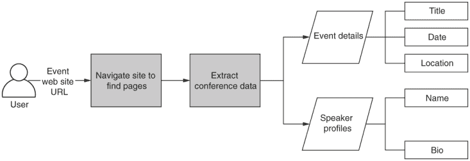
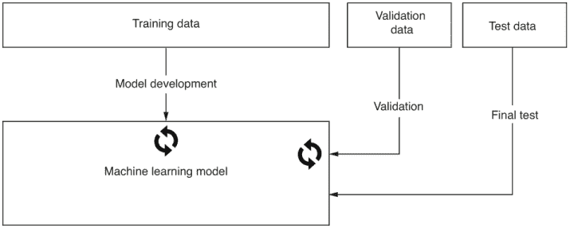
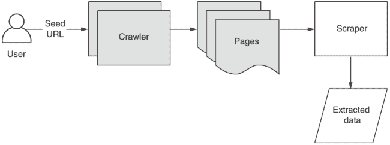
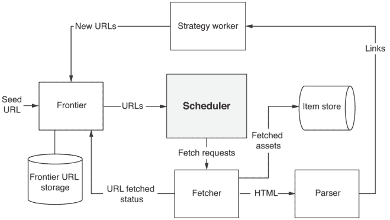
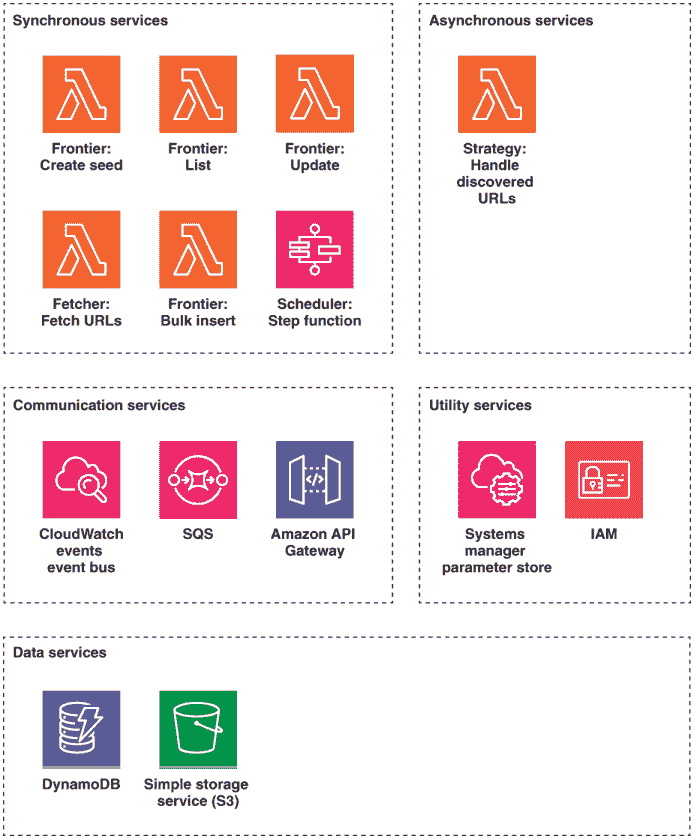
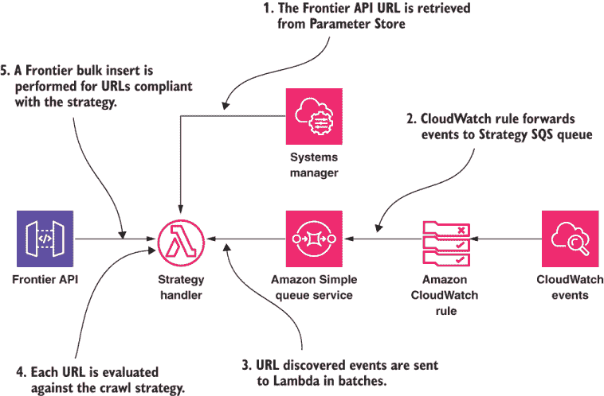
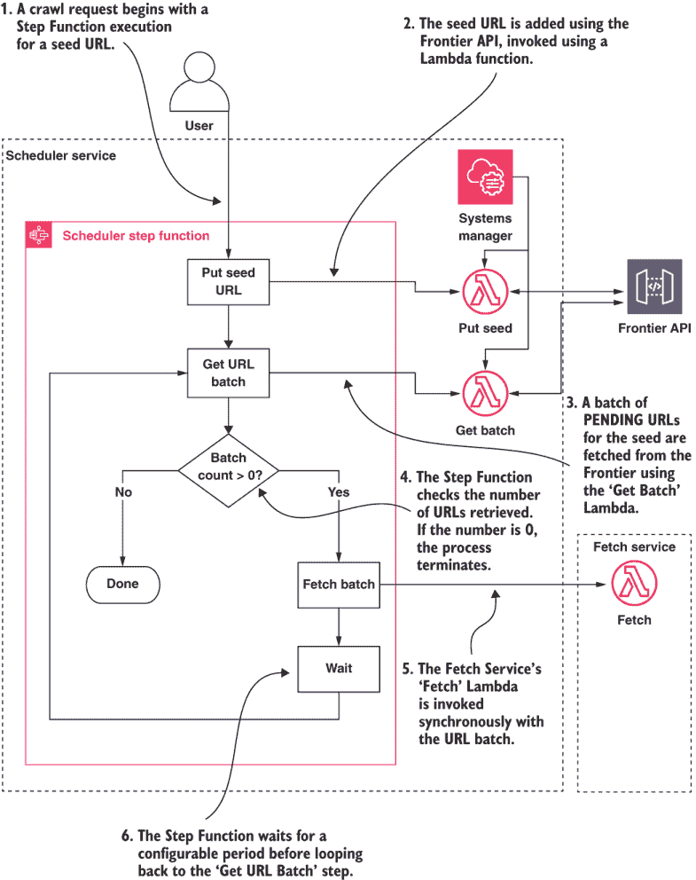
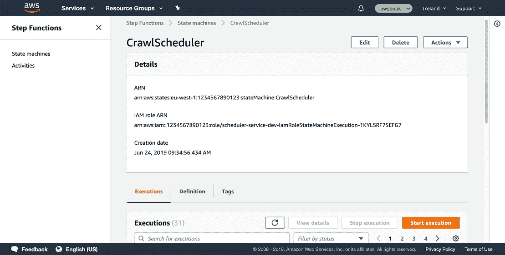
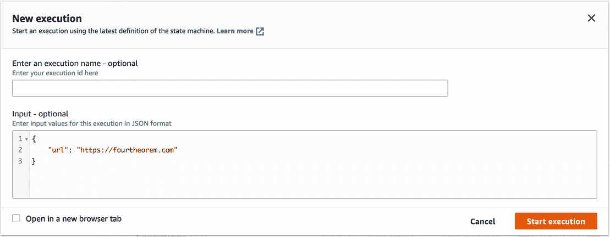
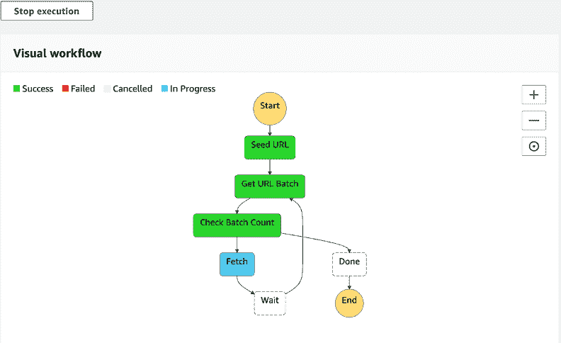

# 8 在真实世界人工智能中大规模收集数据

本章涵盖

+   选择人工智能应用的数据来源

+   构建一个无服务器网络爬虫以寻找大规模数据来源

+   使用 AWS Lambda 从网站中提取数据

+   理解大规模数据收集的合规性、法律方面和礼貌考虑

+   使用 CloudWatch Events 作为事件驱动无服务器系统的总线

+   使用 AWS Step Functions 进行服务编排

在第七章中，我们讨论了自然语言处理（NLP）技术在产品评论中的应用。我们展示了如何使用 AWS Comprehend 在无服务器架构中使用流数据实现情感分析和文本分类。在本章中，我们关注数据收集。

根据一些估计，数据科学家花费 50-80%的时间在收集和准备数据。1 2 许多数据科学家和机器学习实践者会说，在执行分析和机器学习任务时，找到高质量的数据并正确准备它是面临的最大挑战。显然，应用机器学习的价值仅取决于输入算法的数据质量。在我们直接开发任何 AI 解决方案之前，有一些关键问题需要回答，这些问题涉及到将要使用的数据：

+   需要哪些数据以及数据格式是什么？

+   可用的数据来源有哪些？

+   数据将如何被清洗？

对数据收集概念的良好理解是功能机器学习应用的关键。一旦你学会了根据应用需求获取和调整数据，你产生预期结果的机会将大大增加！

## 8.1 场景：寻找事件和演讲者

让我们考虑一个许多软件开发者都会遇到的问题——寻找要参加的相关会议。想象一下，如果我们想要构建一个解决这个问题的系统。用户将能够搜索感兴趣主题的会议，并查看会议的演讲者、地点以及会议时间。我们还可以想象扩展这个功能，向搜索过或“喜欢”过其他活动的用户推荐会议。3



图 8.1 我们的数据收集应用程序将爬取会议网站并提取事件和演讲者信息。

构建这样一个系统的第一个挑战在于收集和编目会议事件的数据。目前没有现成的、完整的、结构化的数据来源。我们可以使用搜索引擎找到相关事件的网站，但接下来就是找到和提取事件地点、日期以及演讲者和主题信息的问题。这是一个应用网络爬虫和抓取的绝佳机会！让我们用图 8.1 总结我们的需求。

### 8.1.1 确定所需数据

识别你的数据的第一个步骤是从你正在解决的问题开始。如果你对你要实现的目标有一个清晰的了解，就从这个地方开始工作，并确定所需的数据及其属性。所需数据类型受到两个因素的影响：

+   *训练和验证*是否必要？

+   如果是这样，你的数据是否需要标注？

在本书中，我们一直在使用托管 AI 服务。这种方法的一个主要优势是它通常消除了训练的需要。不需要使用自己的数据进行训练的服务附带预训练模型，这些模型可以与你的测试数据集一起使用。在其他情况下，你可能需要执行训练步骤。

训练、验证和测试数据 在机器学习模型开发过程中，通常将数据集分为三个集合，如图 8.2 所示。



图 8.2 模型开发和测试中的训练、验证和测试数据

更大的数据比例，即训练集，用于训练算法。验证集（或开发集）用于选择算法并衡量其性能。最后，测试集是一个独立的集合，用于检查算法在未用于训练的数据上的泛化能力。

你可能还记得第一章中提到的监督学习和无监督学习。了解你使用的方法很重要，因为监督学习需要将数据标注上标签。

在第一章中，我们展示了一个托管 AWS AI 服务的表格。这个表格在附录 A 中得到了扩展，显示了每个服务的数据要求和训练支持。你可以在规划你的 AI 赋能应用程序时使用这个作为参考。

如果你没有使用托管 AI 服务，而是选择一个算法并训练一个自定义模型，那么收集和准备数据所需的工作量很大。有许多考虑因素需要确保数据能够产生准确的结果，并在测试数据集的领域内良好工作。

选择代表性数据

在选择用于训练机器学习模型的数据时，确保数据能够代表真实世界中的数据至关重要。当你的数据做出导致偏见结果的假设时，就会出现问题。选择良好的训练数据对于减少*过拟合*至关重要。当模型对训练数据集过于特定，无法泛化时，就会发生过拟合。

华盛顿大学的一组研究人员通过训练一个机器学习模型来检测图片中是否包含狼或哈士奇狗，说明了*选择偏差*的问题。他们故意选择有雪背景的狼图片和有草背景的哈士奇狗图片来训练算法，实际上这个算法只对检测草与雪有效。当他们将结果展示给一组测试对象时，人们仍然报告说他们相信算法检测哈士奇和狼的能力

我们还知道，使用来自具有人类偏见输出的系统的数据进行训练可能会导致算法继承现有的有害社会偏见。当微软的“Tay”推特机器人开始生成种族主义、仇恨言论后被迫关闭时，这一情况被臭名昭著地展示出来。5

在选择好的数据时，可以应用以下几条规则：

+   数据应该有所有可能遇到的场景的表示（比如除了雪以外的背景上的哈士奇！）。

+   对于分类，你应该有足够，并且最好是所有类别的近似相等，的表示。

+   对于标签，考虑是否可以无歧义地分配标签，或者如果不可以，如何处理这种情况。你可能会有这样的情况，要分配的标签并不明确（“那是一只哈士奇还是一只狗？”）。

+   定期手动检查你数据的一个合理大小的随机样本，以验证是否发生了意外的情况。花些时间做这件事是值得的，因为坏数据永远不会产生好的结果！

在这本书中，我们主要关注使用预训练的、托管的服务。对于机器学习训练优化、数据整理和特征工程的更深入理解，我们推荐 Brink、Richards 和 Fetherolf 所著的《Real-World Machine Learning》，由 Manning Publications 于 2017 年出版。[*Real-World Machine Learning*](https://www.manning.com/books/real-world-machine-learning)。

### 8.1.2 数据来源

第一章讨论的关键点之一是，人工智能领域的近期成功是如何通过大量数据的可用性得以实现的。互联网本身就是数据的一个公共来源，通过在我们的日常生活中使用互联网，我们不断为不断增长的大量极其详细的数据做出贡献。大型科技公司（如谷歌、Facebook、亚马逊）在人工智能领域取得了巨大成功。这其中的一个重要因素是他们可以访问数据，并且在数据收集方面有专业知识。6 对于其他人来说，有许多方法可以为人工智能应用获取数据。附录 C 包含了一列可能非常适合你应用需求的公共数据集和其他数据来源。

### 8.1.3 准备训练数据

一旦你收集了用于训练的数据，还有很多工作要做：

+   处理缺失数据。你可能需要删除记录、插值或外推数据，或使用其他方法避免缺失字段的问题。在其他情况下，最好将缺失字段留空，因为这可能是算法的重要输入。关于这个话题的更多信息，请参阅 John Mount 和 Nina Zumel 所著的《探索数据科学》第一章“探索数据”。7

+   获取正确的数据格式。这可能意味着为日期或货币值应用一致的格式。在图像识别中，这可能意味着裁剪、调整大小和更改颜色格式。许多预训练的网络是在 224x224 RGB 数据上训练的，所以如果你想要分析非常高分辨率的图像数据（如果调整大小，则可能会丢失太多信息），那么这些网络可能在不修改的情况下不适用。

我们简要介绍了机器学习工程师可用的数据源。应该很明显，互联网是大规模数据量的主要来源。大量互联网数据无法通过 API 或结构化文件访问，而是发布在旨在用网络浏览器消费的网站上。从这些宝贵的资源中收集数据需要爬取、抓取和提取。这是我们接下来要讨论的主题。

## 8.2 从网络收集数据

本章的剩余部分将更详细地探讨从网站收集数据。尽管一些数据可能以预包装、结构化的格式提供，可以通过平面文件或 API 访问，但网页并非如此。

网页是产品数据、新闻文章和财务数据等非结构化信息来源。找到合适的网页、检索它们并提取相关信息是非平凡的。完成这些所需的过程被称为*网络爬取*和*网络抓取*：

+   *网络爬取*是根据特定策略抓取网页内容并导航到链接页面的过程。

+   *网络抓取*跟随爬取过程，从已抓取的内容中提取特定数据。

图 8.3 展示了两个过程如何结合以产生有意义的、结构化的数据。



图 8.3 网页爬取和抓取过程概述。在本章中，我们关注的是这幅图中的*爬取器*部分及其产生的输出页面。

回想一下本章开头提到的会议演讲者信息收集场景。为这个场景创建解决方案的第一步将是构建一个无服务器网络爬取系统。

## 8.3 网络爬取简介

我们场景中的爬取器将是一个*通用*爬取器。通用爬取器可以爬取任何结构未知的网站。特定网站的爬取器通常是为大型网站创建的，具有用于查找链接和内容的特定选择器。一个特定网站爬取器的例子可能是编写来爬取 amazon.com 特定产品或 ebay.com 拍卖的爬取器。

一些知名爬虫的例子包括

+   搜索引擎如 Google、Bing、Yandex 或 Baidu

+   GDELT 项目（[`www.gdeltproject.org`](https://www.gdeltproject.org)），一个关于人类社会和全球事件的开源数据库

+   OpenCorporates（[`opencorporates.com`](https://opencorporates.com)），世界上最大的开放公司数据库

+   互联网档案馆（[`archive.org`](https://archive.org)），一个包含互联网网站和其他数字形式的文化遗产的数字图书馆

+   CommonCrawl（[`commoncrawl.org/`](https://commoncrawl.org/)），一个开放的网页爬取数据存储库

网络爬取的一个挑战是访问和分析的网页数量庞大。当我们执行爬取任务时，我们可能需要任意大的计算资源。一旦爬取过程完成，我们的计算资源需求就会下降。这种可扩展的、突发性的计算需求非常适合按需、云计算和无服务器！

### 8.3.1 典型网络爬虫过程

要了解网络爬虫可能的工作方式，可以考虑网页浏览器如何允许用户手动导航网页：

1.  用户将网页 URL 输入到网页浏览器中。

1.  浏览器获取网页的第一个 HTML 文件。

1.  浏览器解析 HTML 文件以找到其他所需内容，如 CSS、JavaScript 和图片。

1.  链接会被渲染。当用户点击链接时，过程会为新的 URL 重复。

以下列表显示了非常简单的示例网页的 HTML 源代码。

列表 8.1 示例网页 HTML 源代码

```
<!DOCTYPE html>
<html>
  <body>
    <a href="https://google.com">Google</a>           ❶
    <a href="https://example.com/about">About</a>     ❷
    <a href="/about">About</a>                        ❸

             ❹

    <p>I am a text paragraph</p>                      ❺

    <script src="/script.js"></script>                ❻
  </body>
</html>
```

❶ 外部链接

❷ 绝对内部链接

❸ 相对内部链接

❹ 图片资源

❺ 段落文本

❻ JavaScript 源代码

我们已经展示了非常基础的页面结构。实际上，一个单独的 HTML 页面可以包含数百个超链接，包括内部和外部链接。为特定应用需要爬取的页面集合被称为*爬取空间*。让我们讨论典型网络爬虫的架构以及它是如何构建以处理不同大小的爬取空间的。

### 8.3.2 网络爬虫架构

典型的网络爬虫架构如图 8.4 所示。在描述如何使用无服务器方法实现之前，让我们先了解架构的每个组件以及它们如何与我们的会议网站场景相关。



图 8.4 网络爬虫的组件。每个组件都有明确的职责，这可以指导我们在软件架构中的工作。

+   *前端*维护一个待爬取 URL 的数据库。这最初由会议网站填充。从这里，网站上单个页面的 URL 被添加到这里。

+   *获取器*接受一个 URL 并检索相应的文档。

+   *解析器*获取获取到的文档，解析它，并从中提取所需信息。在此阶段，我们不会寻找特定的演讲者详细信息或任何会议特定的内容。

+   *策略工作器或生成器*是网络爬虫最关键组件之一，因为它决定了*爬取空间*。策略工作器生成的 URL 被反馈到前沿。策略工作器决定

    +   应该跟随哪些链接

    +   要爬取的链接的优先级

    +   爬取深度

    +   如果需要，何时重新访问/重新爬取页面

+   *项目存储*是提取的文档或数据存储的地方。

+   *调度器*接受一组 URL，最初是种子 URL，并安排*获取器*下载资源。调度器负责确保爬虫对 Web 服务器表现得礼貌，不抓取重复的 URL，并且 URL 是规范化的。

爬取是否真的适合无服务器架构？

如果你现在在怀疑无服务器架构是否真的是实现网络爬虫的有效选择，你有一个很好的观点！大规模运行的爬虫需要快速、高效的存储；缓存；以及大量的计算能力来处理多个资源密集型的页面渲染过程。另一方面，无服务器应用程序通常以短期、事件驱动的计算和缺乏快速、本地磁盘存储为特征。

那么，本章中的系统是否值得在生产中使用，或者我们是在进行一项疯狂的实验，看看我们能将我们的云原生理念推进多远？！使用更传统的“农场”服务器，如亚马逊弹性计算云（EC2）实例，确实有明显的优势。如果你的爬取需求需要大量持续运行的工作负载，你可能更适合选择传统方法。

我们必须记住维护和运行此基础设施、操作系统以及任何底层框架的隐藏成本。此外，我们的爬取场景是针对特定会议网站的数据按需提取。这种“突发”行为适合弹性、实用计算范式。从缓存的角度来看，无服务器实现可能不是最优的，但就我们的场景而言，这不会产生重大影响。我们对此方法非常满意，因为我们不需要支付任何费用，当系统不运行时，我们也不必担心操作系统的补丁、维护或容器编排和服务发现。

对于我们的网络爬虫，我们处理的是会议。由于这些构成了所有网页中的少数，因此没有必要为这些网站爬取整个网络。相反，我们将为爬虫提供一个“种子”URL。

在会议网站本身，我们将抓取本地超链接。我们不会跟随指向外部域的超链接。我们的目标是找到包含所需数据的页面，例如演讲者和日期。我们不对爬取整个会议网站感兴趣，因此我们还将使用*深度限制*来在达到链接图中的给定深度后停止爬取。爬取深度是从种子 URL 开始跟随的链接数量。深度限制阻止过程超出指定的深度。

#### 基本爬虫与渲染爬虫

基本爬虫只会抓取 HTML 页面，而不会评估 JavaScript。这导致爬虫过程更加简单和快速。然而，这可能会导致我们排除有价值的数据。

现在非常常见的是，网页由 JavaScript 在浏览器中动态渲染。使用 React 或 Vue.js 等框架的单页应用程序（SPA）是此类示例。一些网站使用这些框架的服务器端渲染，而其他网站则执行预渲染，以将完全渲染的 HTML 作为搜索引擎优化（SEO）技术返回给搜索引擎爬虫。我们不能依赖这些在普遍应用。因此，我们选择采用完整的网页渲染，包括 JavaScript 评估。

当没有用户或屏幕可用时，渲染网页有多种选项：

+   Splash ([`scrapinghub.com/splash`](https://scrapinghub.com/splash))，一个专为网络爬虫应用设计的浏览器。

+   使用 Puppeteer API 的 Headless Chrome ([`mng.bz/r2By`](http://mng.bz/r2By))。这简单地运行了流行的 Chrome 浏览器，并允许我们以编程方式控制它。

+   使用 Selenium ([`www.seleniumhq.org`](https://www.seleniumhq.org))的 Headless Firefox ([`mng.bz/V8qG`](http://mng.bz/V8qG))。这是 Puppeteer 的基于 Firefox 的替代方案。

对于我们的解决方案，我们将使用无头 Chrome。我们选择这个选项是因为有现成的 Serverless Framework 插件可用于 AWS Lambda。

网络爬虫的法律和合规性考虑

网络爬虫的合法性可能是一个有争议的领域。一方面，网站所有者使内容公开可用。另一方面，过度的爬取可能会对网站的可用性和服务器负载产生不利影响。不用说，以下内容不构成法律建议。这里只是几项被视为礼貌行为的最佳实践：

+   使用`User-Agent`字符串识别您的爬虫。为网站所有者提供一种联系方式，例如`AIaaSBookCrawler/1.0;` `+https://aiasaservicebook.com)`。

+   尊重网站的`robots.txt`。此文件允许网站所有者说明您可以和不可以爬取的页面。8

+   如果可用，请使用网站的 API 而不是网络爬虫。

+   限制每个域每秒的请求数量。

+   如果网站所有者要求，立即停止爬取网站。

+   只爬取公开可访问的内容。永远不要使用登录凭证。

+   使用缓存以减少目标服务器的负载。不要在短时间内重复检索同一页面。

+   从网站上收集的材料通常属于版权和知识产权法规的范畴。请确保您尊重这一点。

尤其是我们需要确保我们限制每个域名/IP 地址的并发性，或者选择在请求之间选择合理的延迟。这些要求将是我们无服务器爬虫架构的考虑因素。

在撰写本文时，AWS 可接受使用政策禁止“监控或爬取损害或干扰被监控或爬取的系统的行为”([`aws.amazon.com/aup/`](https://aws.amazon.com/aup/))。

还请注意，一些网站实施了防止网络爬虫的机制。这可以通过检测 IP 地址或用户代理来实现。像 CloudFlare([`www.cloudflare.com/products/bot-management/`](https://www.cloudflare.com/products/bot-management/))或 Google reCaptcha([`developers.google.com/recaptcha/docs/invisible`](https://developers.google.com/recaptcha/docs/invisible))这样的解决方案使用了更复杂的方法。

### 8.3.3 无服务器网络爬虫架构

让我们首先看看我们将如何将我们的系统映射到第一章中开发的规范架构。图 8.5 为我们提供了系统层级的分解以及服务如何协作以提供解决方案。



图 8.5 无服务器网络爬虫系统架构。系统由使用 AWS Lambda 和 AWS Step Functions 实现的定制服务组成。SQS 和 CloudWatchEvents 服务用于异步通信。内部 API 网关用于同步通信。S3 和 DynamoDB 用于数据存储。

系统架构显示了所有服务中系统的各个层级。请注意，在这个系统中，我们没有前端 Web 应用程序：

+   前端和抓取服务中的同步任务使用 AWS Lambda 实现。首次引入 AWS Step Functions 来实现调度器。它将负责根据前端的数据协调抓取器。

+   策略服务是异步的，并响应事件总线上的事件，表明已发现新的 URL。

+   我们系统中内部服务之间的同步通信由 API 网关处理。我们选择了 CloudWatch Events 和 SQS 进行异步通信。

+   共享参数发布到系统管理器参数存储。IAM 用于管理服务之间的权限。

+   DynamoDB 用于前端 URL 存储。一个 S3 存储桶用作我们的项目存储。

提示：如果您想了解更多关于网络爬虫的信息，请参阅 Satnam Alag 所著的《Collective Intelligence in Action》第六章，“智能网络爬虫”。9

建造还是购买？评估第三方托管服务

写一本宣扬托管服务优点、强调关注核心业务逻辑重要性的书，同时还在书中专门用一章来从头构建网络爬虫，这有一定的讽刺意味。

我们的爬虫相当简单，并且具有特定领域。这是编写我们自己的实现的一些理由。然而，我们知道从经验中，简单的系统会随着时间的推移而变得复杂。因此，实现你自己的任何东西应该是你的最后选择。以下是现代应用开发的两个经验法则：

+   最小化你编写的代码量！你编写的绝大多数代码应该关注独特的业务逻辑。在可能的情况下，避免编写任何系统中的代码，这些代码是平凡的，并且在许多其他软件系统中实现，通常被称为无差别的重劳动。

+   使用云托管服务。虽然你可以通过使用库、框架和组件来遵循第 1 条规则，但这些可能有自己的维护负担，而且你仍然需要维护它们运行的基础设施。与云托管服务集成可以减轻你这一重大负担。

这些服务可能超出了你选择的云提供商的范围。即使亚马逊网络服务没有现成的网络爬虫和抓取服务，也要超越 AWS，评估第三方提供的服务。这对于你打算构建的任何服务来说都是一项值得做的练习。例如，如果你想在你应用程序中实现搜索功能，你可能评估一个完全托管的 Elasticsearch 服务，如 Elastic ([`www.elastic.co`](https://www.elastic.co))，或者一个托管的搜索和发现 API，如 Algolia ([`www.algolia.com/`](https://www.algolia.com/))).

如果你感兴趣于评估第三方网络爬虫服务，请查看以下内容：10

+   Grepsr ([`www.grepsr.com`](https://www.grepsr.com))

+   Import.io ([`www.import.io`](https://www.import.io))

+   ScrapingHub ScrapyCloud ([`scrapinghub.com/scrapy-cloud`](https://scrapinghub.com/scrapy-cloud))

## 8.4 实现项目存储

我们将开始对爬虫实现过程的讲解，从所有服务中最简单的一个，即项目存储。作为我们会议网站爬取过程的一部分，项目存储将存储每个会议网站上爬取的每一页的副本。首先，获取代码以便你可以更详细地探索。

### 8.4.1 获取代码

项目存储的代码位于`chapter8-9/item-store`目录中。类似于我们之前的示例，这个目录包含一个`serverless.yml`文件，声明我们的 API、函数和其他资源。在我们部署和测试项目存储之前，我们将逐步解释其内容。

### 8.4.2 项目存储存储桶

在项目存储中查看`serverless.yml`文件，我们看到的是一个 S3 存储桶，没有其他内容！我们正在实现最简单的存储方案。

其他服务可以直接写入我们的存储桶或列出对象，并使用 AWS SDK S3 API 抓取对象。所需的一切是他们 IAM 角色和策略中具有正确的权限。

### 8.4.3 部署项目存储

部署项目存储非常简单。鉴于我们正在部署一个 S3 存储桶，我们将在 `chapter8-9` 目录中的 `.env` 文件中定义其全局唯一名称：

```
ITEM_STORE_BUCKET=<your bucket name>
```

无需进一步配置。默认区域为 `eu-west-1`。如果您想指定不同的区域，请使用 `serverless deploy` 命令的 `--region` 参数提供：

```
npm install
serverless deploy
```

就这样！项目存储已部署并准备就绪。让我们继续到爬虫应用程序中的下一个服务。

## 8.5 创建一个用于存储和管理 URL 的前沿

我们的前沿将存储所有用于会议网站的种子 URL 以及在爬取过程中发现的新 URL。我们正在使用 DynamoDB 进行存储。我们的目标是利用 DynamoDB 的 API 进行插入和查询，并在其上添加最小层级的抽象。

### 8.5.1 获取代码

前沿服务的代码位于 `chapter8-9/frontier-service` 目录中。此目录包含一个 `serverless.yml` 文件，声明我们的 API、函数和其他资源。我们将在部署和测试前沿服务之前解释其内容。

### 8.5.2 前沿 URL 数据库

前沿 URL 数据库存储所有打算抓取、已抓取或未能抓取的 URL。服务需要有一个支持以下操作的接口：

+   插入一个*种子 URL*。

+   将 URL 的状态更新为 `PENDING`、`FETCHED` 或 `FAILED`。

+   插入一批被认为适合抓取的新发现 URL（链接）。

+   根据状态参数和最大记录限制获取给定种子 URL 的 URL 集合。

我们前沿数据库的数据模型通过表 8.1 中的示例进行说明。

表 8.1 前沿 URL 数据库示例

| 种子 | URL | 状态 | 深度 |
| --- | --- | --- | --- |
| `http://microxchg.io` | `http://microxchg.io` | `FETCHED` | `0` |
| `http://microxchg.io` | `http://microxchg.io/2019/index.html` | `FETCHED` | `1` |
| `http://microxchg.io` | `http://microxchg.io/2019/all-speakers.html` | `PENDING` | `2` |
| `https://www.predictconference.com` | `https://www.predictconference.com` | `PENDING` | `0` |

在这种情况下，我们的“主键”是种子和 URL 的组合。*种子*属性是*分区键*或*哈希值*，而*url*属性是*排序键*或*范围键*。这确保我们不会将重复项插入数据库中。

除了我们的表键之外，我们还将定义一个*二级索引*。这允许我们根据种子 URL 和状态快速搜索。

从表 8.1 中的示例数据中我们可以看到，完整的 URL 包含在`url`字段中，而不仅仅是相对路径。这允许我们在将来支持从种子链接的外部 URL，并避免了在获取内容时需要重建 URL 的不便。

前沿表的 DynamoDB 资源定义可以在服务的`serverless.yml`文件中找到，如下所示。

列表 8.2 前沿 DynamoDB 表定义

```
frontierTable:
      Type: AWS::DynamoDB::Table
      Properties:
        TableName: ${self:provider.environment.FRONTIER_TABLE}            ❶
         AttributeDefinitions:
          - AttributeName: seed
            AttributeType: S
          - AttributeName: url
            AttributeType: S
          - AttributeName: status
            AttributeType: S
        KeySchema:                                                        ❷
           - AttributeName: seed
            KeyType: HASH
          - AttributeName: url
            KeyType: RANGE
        LocalSecondaryIndexes:
          - IndexName: ${self:provider.environment.FRONTIER_TABLE}Status  ❸
             KeySchema:
              - AttributeName: seed
                KeyType: HASH
              - AttributeName: status
                KeyType: RANGE
            Projection:
              ProjectionType: ALL
        ProvisionedThroughput:                                            ❹
           ReadCapacityUnits: 5
          WriteCapacityUnits: 5
```

❶ 表名定义为 frontier。

❷ 表的键由 seed 和 url 属性组成。

❸ 定义了一个二级索引，frontierStatus，允许使用 seed 和 status 属性进行查询。

❹ 在这种情况下，我们选择配置吞吐量，具有五个读写容量单位。或者，我们可以指定 BillingMode: PAY_PER_REQUEST 来处理不可预测的负载。

无服务器数据库

我们已经介绍了一些与 DynamoDB 一起工作的示例。DynamoDB 是一种 NoSQL 数据库，适用于非结构化文档存储。在 DynamoDB 中建模关系数据是可能的，有时也是非常有必要的。一般来说，当您对数据的访问方式有清晰的了解，并且可以设计键和索引来适应访问模式时，DynamoDB 更合适。当您存储结构化数据，但希望在将来支持任意访问模式时，关系型数据库更合适。这正是结构化查询语言（SQL），关系型数据库管理系统支持的接口，非常擅长的。1112

关系型数据库针对从服务器发出的少量长时间运行的连接进行了优化。因此，来自 Lambda 函数的大量短暂连接可能会导致性能不佳。作为对*全服务器*关系型数据库管理系统（RDBMS）的替代方案，Amazon Aurora Serverless 是一种无服务器关系型数据库解决方案，避免了需要配置实例的需求。它支持自动扩展和按需访问，允许您按秒计费。您还可以使用 Lambda 函数中的 AWS SDK 通过 Data API 对 Aurora Serverless 运行查询([`mng.bz/ZrZA`](http://mng.bz/ZrZA))。此解决方案避免了创建短暂数据库连接的问题。

### 8.5.3 创建前沿 API

我们已经描述了前沿服务中至关重要的 DynamoDB 表。我们需要一种方法将会议网站的 URL 引入系统。现在让我们看看 API Gateway 和 Lambda 函数，这些函数允许外部服务与前沿交互，以实现这一目标。

前沿服务支持的 API 列于表 8.2 中。

表 8.2 前沿服务 API

| 路径 | 方法 | Lambda 函数 | 描述 |
| --- | --- | --- | --- |
| `frontier-url/{seed}/{url}` | `POST` | `create` | 为种子添加 URL |
| `frontier-url/{seed}` | `POST` | `create` | 添加新的种子 |
| `frontier-url/{seed}/{url}` | `PATCH` | `update` | 更新 URL 的状态 |
| `frontier-url` | `PUT` | `bulkInsert` | 创建一批 URL |
| `frontier-url/{seed}` | `GET` | `list` | 根据状态列出种子 URL，最多指定记录数 |

每个 API 的定义可以在`frontier-service`的`serverless.yml`配置文件中找到。此配置还定义了一个用于服务 API 的 Systems Manager Parameter Store 变量。我们没有使用 DNS 来配置 API，因此它不能通过已知名称被其他服务发现。相反，API Gateway 生成的 URL 已注册在参数存储中，以便具有正确 IAM 权限的服务可以找到。

为了简单起见，我们所有的 Lambda 代码都实现在了`handler.js`中。它包括创建和执行 DynamoDB SDK 调用的逻辑。如果您查看此代码，您会发现其中很多与第四章和第五章中的处理器相似。一个显著的区别是我们引入了一个名为*Middy*的库来减少模板代码。Middy 是一个中间件库，允许您在 Lambda 被调用之前和之后拦截调用，以执行常见操作（[`middy.js.org`](https://middy.js.org)）。中间件简单来说是一组函数，它们会钩入您的事件处理器的生命周期。您可以使用 Middy 的任何内置中间件或任何第三方中间件，或者编写自己的。

对于我们的前端处理器，我们设置了如下一列表中的 Middy 中间件。

列表 8.3 前端处理器中间件初始化

```
const middy = require('middy')
...

const { cors, jsonBodyParser, validator, httpEventNormalizer, httpErrorHandler } = require('middy/middlewares')

const loggerMiddleware = require('lambda-logger-middleware')
const { autoProxyResponse } = require('middy-autoproxyresponse')
...

function middyExport(exports) {
  Object.keys(exports).forEach(key => {
    module.exports[key] = middy(exports[key])                   ❶
      .use(loggerMiddleware({ logger: log }))                   ❷
      .use(httpEventNormalizer())                               ❸
      .use(jsonBodyParser())                                    ❹
      .use(validator({ inputSchema: exports[key].schema }))     ❺
      .use(cors())                                              ❻
      .use(autoProxyResponse())                                 ❼
      .use(httpErrorHandler())                                  ❽
  })
}

middyExport({
  bulkInsert,
  create,
  list,
  update
})
```

❶ Middy 包装了普通的 Lambda 处理器。

❷ lambda-logger-middleware 在开发环境中记录请求和响应。13 我们与第六章中引入的 Pino 日志记录器一起使用它。

❸ httpEventNormalizer 为 queryStringParameters 和 pathParameters 添加默认空对象。

❹ jsonBodyParser 自动解析体并提供一个对象。

❺ validator 验证输入体和参数与我们定义的 JSON 模式。

❻ cors 自动向响应中添加 CORS 头。

❼ middy-autoproxy response 将简单的 JSON 对象响应转换为 Lambda Proxy HTTP 响应。14

图 8.6 检索器实现与参数存储、前沿 API、嵌入式无头网络浏览器、项目存储和事件总线集成。

此服务接受对一批 URL 的*fetch*请求。对于每个 URL，依次执行页面检索、渲染和解析步骤。

注意：我们尚未为检索处理程序定义任何 Lambda 触发器。我们不会使用 API 网关或异步事件，而是将允许此处理程序直接通过 AWS Lambda SDK 调用。这是一个特殊情况，因为我们的检索器实现导致 Lambda 长时间运行，检索多个页面。API 网关最多 30 秒就会超时。基于事件的触发器不合适，因为我们希望从调度器有同步调用。

### 8.6.1 配置和控制无头浏览器

服务的配置（`serverless.yml`）包括一个新插件，`serverless-plugin-chrome`（[`github.com/adieuadieu/serverless-chrome`](https://github.com/adieuadieu/serverless-chrome)），如下所示。

列表 8.4 检索服务`serverless.yml`加载和配置 Chrome 插件

```
service: fetch-service

plugins:
...
  - serverless-plugin-chrome       ❶
...
custom:
  chrome:
    flags:                         ❷
      - --window-size=1280,1696
      - --hide-scrollbars
...
```

❶ 在 serverless.yml 的插件部分指定了插件。它导致在调用处理程序之前打开浏览器。

❷ 提供浏览器命令行参数。为了创建有用的截图，我们提供分辨率并隐藏任何滚动条。

此插件在 Lambda 函数加载时自动以*无头*模式（即没有用户界面）安装 Google Chrome 网络浏览器。然后我们可以使用`chrome-remote-interface`模块（[`github.com/cyrus-and/chrome-remote-interface`](https://github.com/cyrus-and/chrome-remote-interface)）以编程方式控制浏览器。

### 8.6.2 捕获页面输出

我们的主要目标是收集 HTML 和链接。链接将由策略工作器处理，以确定是否应该检索它们。我们捕获页面截图，以便我们有开发前端应用并更好地可视化检索内容的选项。

在图 8.5 中，我们在爬虫架构中展示了*解析器*组件。在我们的实现中，解析器作为 fetcher 的一部分实现。这既是一种简化也是一种优化。在我们的 fetcher 中，我们已经承担了加载网络浏览器并使其解析和渲染页面的开销。使用浏览器的 DOM API 查询页面并提取链接是一个非常简单的步骤。

所有浏览器交互和提取代码都被封装在 Node.js 模块`browser.js`中。以下列表显示了提取示例。

列表 8.5 Browser 模块加载函数

```
return initBrowser().then(page =>
    page.goto(url, { waitUntil: 'domcontentloaded' }).then(() =>     ❶
      Promise.all([
        page.evaluate(`
JSON.stringify(Object.values([...document.querySelectorAll("a")]     ❷
  .filter(a => a.href.startsWith('http'))
  .map(a => ({ text: a.text.trim(), href: a.href }))
  .reduce(function(acc, link) {
    const href = link.href.replace(/#.*$/, '')
    if (!acc[href]) {
        acc[href] = link
    }
    return acc
  }, {})))
`),
        page.evaluate('document.documentElement.outerHTML'),         ❸
        page.evaluate(`
function documentText(document) {                                    ❹
  if (!document || !document.body) {
    return ''
  }
  return document.body.innerText + '\\n' +
    [...document.querySelectorAll('iframe')].map(iframe => documentText(iframe.contentDocument)).join('\\n')
}
documentText(document)
`),
        page.screenshot()                                            ❺
      ]).then(([linksJson, html, text, screenshotData]) => ({
        links: JSON.parse(linksJson).reduce(
          (acc, val) =>
            acc.find(entry => entry.href === val.href) ? acc : [...acc, val],
          []
        ),
        html,
        text,
        screenshotData
      }))
    )
  )
}
```

❶ 加载正确的 URL 并等待文档加载。

❷ 使用 JavaScript 查询页面的文档对象模型（DOM）以提取链接。

❸ 捕获页面生成的 HTML。

❹ 从页面和任何`<iframe>`中获取文本。

❺ 创建页面的截图图像。

当`browser`模块的`load`函数被一个 URL 调用时，它执行以下操作。

### 8.6.3 获取多个页面

fetch 服务的 Lambda 处理程序接受多个 URL。我们的想法是允许我们的 Lambda 函数尽可能多地加载和处理页面。我们优化这些调用，使得发送给`fetch`调用的所有 URL 都来自同一个种子 URL。这增加了它们具有相似内容并从浏览器中执行的缓存中受益的可能性。我们的 Lambda 函数按顺序获取 URL。这种行为很容易改变，添加对并行获取器的支持，以进一步优化过程。

页面上找到的所有链接都会发布到我们的系统事件总线。这允许任何订阅这些事件的其它服务异步地做出反应。对于我们的事件总线，我们使用 CloudWatch Events。fetch 服务以最多 10 批（CloudWatch 的限制）的形式发布发现的链接，如下面的列表所示。

列表 8.6 为发现的 URL 生成 CloudWatch 事件

```
const cwEvents = new AWS.CloudWatchEvents({...})
...
function dispatchUrlDiscoveredEvents(item, links) {
  if (links.length > 0) {
    if (links.length > 10) {
      return dispatchUrlDiscoveredEvents(item, links.splice(0, 10))   ❶
        then(() => dispatchUrlDiscoveredEvents(item, links))
    }

    const eventEntries = links.map(link => ({
      Detail: JSON.stringify({ item, link }),                         ❷
      Source: 'fetch-service',                                        ❸
      DetailType: 'url.discovered'                                    ❹
    }))

    return cwEvents.putEvents({ Entries: eventEntries })              ❺
      promise().then(() => {})
  }
  return Promise.resolve()
}
```

❶ 我们一次只能使用 CloudWatch Events API 发送 10 个事件，所以我们提取 10 个，然后递归地处理剩余的。

❷ Detail 属性是事件的 JSON 有效负载。

❸ 我们识别事件的来源。

❹ 使用事件类型在 CloudWatch 规则中匹配接收事件。

❺ 使用 AWS SDK 中的 CloudWatch Events API 发送事件批。

CloudWatch Events 作为事件总线

在第二章中，我们描述了消息传递技术和队列系统与 pub/sub 系统之间的区别。对于我们的“URL 发现”消息，我们希望有一个 pub/sub 模型。这允许多个订阅者对这类事件做出反应，并且不对他们做什么做出任何假设。这种方法有助于我们减少服务之间的耦合。

在 AWS 中，我们有几种 pub/sub 选项：

+   简单通知服务（SNS）

+   第七章中使用的 Kinesis Streams

+   已使用 Kafka 的用户可用的托管流式传输 Kafka（MSK）

+   DynamoDB Streams，一个发布到 DynamoDB 数据的系统，建立在 Kinesis Streams 之上

+   CloudWatch Events，一个几乎不需要设置的简单服务

CloudWatch Events 的优势在于需要很少的设置。我们不需要声明任何主题或配置分片。我们只需使用 AWS SDK 发送事件。任何希望对这些事件做出反应的服务都需要创建一个 CloudWatch 规则来匹配传入的事件并触发目标。可能的目标包括 SQS、Kinesis，当然还有 Lambda。

对于每次成功的页面抓取，都会调用 Frontier URL 更新 API 来标记 URL 为`FETCHED`。任何失败的页面加载都会导致 URL 被标记为`FAILED`。

### 8.6.4 部署和测试 fetcher

要将 fetcher 部署到 AWS，先在本地测试。首先，我们安装模块依赖项：

```
npm install
```

接下来，我们使用无服务器本地调用。我们的本地调用将尝试将内容复制到我们的项目存储 S3 桶中。它还将发布与抓取的页面中发现的链接相关的 CloudWatch 事件。因此，请确保您的 AWS 凭证已通过`AWS_`环境变量或使用 AWS 配置文件进行配置。运行`invoke local`命令，传递 Fetch 服务代码中提供的测试事件：

```
source ../.env
serverless invoke local -f fetch --path test-events/load-request.json
```

您应该看到 Google Chrome 运行并加载了一个网页（[`fourtheorem.com`](https://fourtheorem.com)）。在某些平台上，即使调用完成后，调用也可能不会退出，可能需要手动终止。当调用完成后，您可以在 AWS 管理控制台中导航到项目存储的 S3 桶。在那里您将找到一个包含 HTML 文件和屏幕截图的单个文件夹。下载它们并查看您迄今为止的优秀工作成果！我们现在准备部署到 AWS：

```
serverless deploy
```

## 8.7 策略服务中确定爬取空间

在任何网络爬虫中确定爬取空间的过程是特定于领域和应用的。在我们的场景中，我们做出了一些假设，这将简化我们的爬取策略：

+   爬虫只遵循本地链接。

+   每个种子策略的爬取策略是独立的。我们不需要处理通过爬取不同种子找到的链接之间的重复内容。

+   我们的爬取策略遵循爬取深度限制。

让我们探索爬虫服务实现。您可以在`chapter8-9/strategy-service`中找到代码。图 8.7 展示了该服务的物理结构。



图 8.7 策略服务实现通过 SQS 与 CloudWatch Events 相关联。它还集成了参数存储和前沿 API。

您可以看到这个服务非常简单。它处理列表 8.7 中显示的事件批次。`handler.js`的摘录可以在`chapter8-9/strategy-service`中找到。

列表 8.7 页面爬取策略

```
const items = event.Records.map(({ body }) => {
    const { item, link } = JSON.parse(body)                        ❶
    return {                                                       ❷
       seed: item.seed,
      referrer: item.url,
      url: link.href,
      label: link.text,
      depth: item.depth + 1
    }
  }).filter(newItem => {
    if (newItem.depth > MAX_DEPTH) {                               ❸
      log.debug(`Rejecting ${newItem.url} with depth (${newItem.depth})  beyond limit`)
    } else if (!shouldFollow(newItem.seed, newItem.url)) {         ❹
      log.debug(`Rejecting ${newItem.url}  from a different domain to seed ${newItem.seed}`)
    } else {
      return true
    }
    return false
  })
  log.debug({ items }, 'Sending new URLs to Frontier')
  return items.length > 0
    ? signedAxios({method: 'PUT', url: frontierUrl, data: items})  ❺
        .then(() => ({}))
        .catch(err => {
          const { data, status, headers } = err.response || {}
          if (status) {
            log.error({ data, status, headers }, 'Error found')
          }
          throw err
        })
    : Promise.resolve({})
```

❶ 事件中的每条记录都会被解析以提取链接和发现它的页面。

❷ 为新页面创建一个前沿记录。它包含引用页面的 URL、链接文本标签和增加的爬取深度。

❸ 超过最大爬取深度的项目将被排除。

❹ 来自不同域的项目将被排除。

❺ 使用 Axios HTTP 库通过 Frontier 的 Bulk Insert API 调用合格的项目。15

我们刚刚处理的事件是由 fetch 服务使用 CloudWatch Events API 发送的。要了解它们是如何被策略服务接收的，请参考图 8.7 和`strategy-service`的`serverless.yml`摘录，如列表 8.8 所示。

列表 8.8 通过 SQS 接收到的策略服务 CloudWatch 事件

```
Resources:
    strategyQueue:
      Type: AWS::SQS::Queue                               ❶
       Properties:
        QueueName: ${self:custom.strategyQueueName}

    strategyQueuePolicy:
      Type: AWS::SQS::QueuePolicy
      Properties:
        Queues:
          - !Ref strategyQueue
        PolicyDocument:
          Version: '2012-10-17'
          Statement:
            - Effect: Allow
              Action:
                - sqs:SendMessage
              Principal:
                Service: events.amazonaws.com             ❷
              Resource: !GetAtt strategyQueue.Arn

    discoveredUrlRule:
      Type: AWS::Events::Rule                             ❸
      Properties:
        EventPattern:
          detail-type:
            - url.discovered                              ❹
        Name: ${self:provider.stage}-url-discovered-rule
        Targets:
          - Arn: !GetAtt strategyQueue.Arn                ❺
            Id: ${self:provider.stage}-url-discovered-strategy-queue-target
            InputPath: '$.detail'                         ❻
```

❶ 我们定义了一个 SQS 队列。这是 handleDiscoveredUrls Lambda 处理器的触发器。

❷ 给定 SQS 队列的资源策略，授予 CloudWatch Events 服务向队列发送消息的权限。

❸ 定义了一个 CloudWatch 规则来匹配给定模式的事件。

❹ 规则匹配 DetailType: url-discovered 类型的事件。

❺ 将 SQS 队列指定为规则的靶标。

❻ 发送到目标的消息体是消息负载。

让我们将策略服务直接部署到 AWS：

```
npm install
serverless deploy
```

我们现在可以构建爬虫的最后一部分了。

## 8.8 使用调度器编排爬虫

网络爬虫的最后一个组件，调度器，是爬取网站流程开始的地方，并一直跟踪到结束。对于习惯于更大、单体架构的人来说，以无服务器的心态设计这类流程具有挑战性。特别是，对于任何给定的网站，我们需要强制执行以下要求：

+   必须强制执行每个站点的最大并发抓取数。

+   在执行下一批抓取之前，流程必须等待指定的时间。

这些要求与*流量控制*相关。使用纯事件驱动方法实现流量控制是可能的。然而，为了努力将同一 Lambda 函数内的同一站点的请求进行聚类，架构本身就已经相当复杂且难以理解。

在我们解决流量控制挑战之前，确保你有这个服务的代码准备探索。

### 8.8.1 获取代码

调度服务代码可以在`chapter8-9/scheduler-service`中找到。在`serverless.yml`中，你会找到一个新插件，`serverless-step-functions`。这引入了一个新的 AWS 服务，将帮助我们编排爬取过程。

### 8.8.2 使用 Step Functions

我们的调度器将使用 AWS Step Function 实现流程控制和过程编排。Step Functions 具有以下功能：

+   它们可以运行长达一年。

+   Step Functions 与许多 AWS 服务集成，包括 Lambda。

+   支持等待步骤、条件逻辑、并行任务执行、故障和重试。

Step Functions 使用称为 *Amazon States Language (ASL)* 的特定语法在 JSON 中定义。`serverless-step-function` 插件允许我们在 `stepFunctions` 部分下的 serverless 配置文件中定义我们的函数的 ASL。我们在 Serverless Framework 配置中使用 YAML。在作为底层 CloudFormation 堆栈的一部分创建资源之前，此格式将转换为 JSON。图 8.8 阐述了调度器 Step Function 的流程。

我们已经学习了如何构建其他组件服务。我们介绍了它们用于与系统其他部分交互的 API 和事件处理。由调度器管理的端到端爬取过程也已经展示。特别是，过程中的 `Wait` 和 `Check Batch Count` 步骤展示了如何使用 Step Function 容易地管理控制流。Step Function 状态机的 ASL 代码列表显示在列表 8.9 中。



图 8.8 调度器作为 AWS Step Function 实现。它对调度器服务内定义的 Lambda 以及抓取服务中的抓取 Lambda 进行同步调用。

列表 8.9 调度服务状态机的 ASL

```
StartAt: Seed URL
States:
  Seed URL:
    Type: Task
    Resource: !GetAtt PutSeedLambdaFunction.Arn                  ❶
    Next: Get URL Batch
    InputPath: '$'
    ResultPath: '$.seedResult'
    OutputPath: '$'
  Get URL Batch:
    Type: Task
    Resource: !GetAtt GetBatchLambdaFunction.Arn                 ❷
    Next: Check Batch Count
    InputPath: '$'
    ResultPath: '$.getBatchResult'
    OutputPath: '$'
  Check Batch Count:
    Type: Choice                                                 ❸
    Choices:
      - Not:
          Variable: $.getBatchResult.count
          NumericEquals: 0
        Next: Fetch
    Default: Done
  Fetch:
    Type: Task
    Resource: ${ssm:/${self:provider.stage}/fetch/lambda-arn}    ❹
    InputPath: $.getBatchResult.items
    ResultPath: $.fetchResult
    Next: Wait
  Wait:
    Type: Wait                                                   ❺
    Seconds: 30
    Next: Get URL Batch
  Done:
    Type: Pass
    End: true
```

❶ 状态机调用 `putSeed Lambda` 以启动爬取过程。

❷ 使用 `getBatch Lambda` 函数检索一批 URL。

❸ 在 Choice 状态中检查批次的 URL 数量。这是在 Step Function 中实现简单流程控制的示例。如果计数为零，状态机将使用完成状态终止。否则，它将前进到 Fetch 状态。

❹ 使用参数存储发现抓取服务的 Lambda，并使用来自前沿的 URL 批次进行调用。

❺ 一旦抓取完成，状态机等待 30 秒以确保礼貌的爬取行为。然后状态机返回到 Get URL Batch 状态以处理更多页面。

### 8.8.3 部署和测试调度器

一旦我们部署了调度器，你应该能够为任何给定的种子 URL 启动爬取过程。让我们开始吧！

```
npm install
serverless deploy
```

现在我们已经部署了所有服务以运行爬取过程。通过启动 Step Function 执行来启动爬取过程。这可以通过使用 AWS 命令行完成。首先，我们使用 `list-state-machines` 命令来查找 `CrawlScheduler` Step Function 的 ARN：

```
aws stepfunctions list-state-machines --output text
```

下面的示例显示了返回的输出：

```
STATEMACHINES 1561365296.434 CrawlScheduler arn:aws:states:eu-west-1:123456789123:stateMachine:CrawlScheduler
```

接下来，我们通过提供 ARN 并传递包含种子 URL 的 JSON 来启动状态机执行：

```
aws stepfunctions start-execution \
 --state-machine-arn arn:aws:states:eu-west-1:1234567890123:stateMachine:CrawlScheduler \
 --input '{"url": "https://fourtheorem.com"}'
```

作为使用 CLI 的替代方案，我们可以在 AWS 管理控制台中启动 Step Function 执行。在浏览器中导航到 Step Functions 服务并选择 `CrawlScheduler` 服务。你应该会看到类似于图 8.9 中的屏幕。



图 8.9 AWS 管理控制台中的步骤函数视图允许您启动新的执行并查看现有执行的进度。您还可以从这里检查或编辑 ASL JSON。

选择“启动执行”。从这里，您可以输入要传递给起始状态的 JSON 对象。在我们的例子中，JSON 对象需要一个属性--要爬取的网站的 URL。这如图 8.10 所示。



图 8.10 通过在步骤函数控制台上的“启动执行”选项中提供网站 URL，可以启动爬取过程。

一旦执行开始，控制台将带您进入执行视图。从这里，您可以查看步骤函数执行进度的非常有用的可视化，如图 8.11 所示。通过点击任何状态，您可以看到输入数据、输出数据和任何错误。



图 8.11 步骤函数控制台中的可视化工作流程允许用户监控执行的进度。

当步骤函数执行完成后，查看项目存储 S3 存储桶的内容。您应该找到与种子 URL 链接的最重要页面相关的一组文件。一个页面的内容示例如图 8.12 所示。


图 8.12 可以从 S3 控制台浏览项目存储。这允许我们检查生成的 HTML 并直观地检查页面的截图。

这种类型的数据，从许多会议网站上收集而来，将构成第九章中智能数据提取的基础。然而，在继续之前，花些时间在 AWS 控制台中导航爬虫的组件。从步骤函数开始，依次跟随每个阶段。查看 fetch 服务、策略服务和前哨站的 CloudWatch 日志。数据和事件的流程应与图 8.9 中的图示相匹配，这个练习应该有助于巩固我们在本章中描述的所有内容。

在下一章中，我们将深入探讨使用命名实体识别从文本数据中提取特定信息。

## 摘要

+   AI 算法类型或托管服务决定了 AI 应用所需的数据类型。

+   如果您还没有合适的数据，考虑寻找公开可用的数据源或生成自己的数据集。

+   网络爬虫和抓取器从网站上查找和提取数据。

+   可以使用 DynamoDB 辅助索引执行额外的查询。

+   可以设计和构建一个用于网络爬取的无服务器应用程序，特别是针对特定的网站小集合。

+   需要控制流的过程可以使用 AWS 步骤函数进行编排。

+   需要控制流的过程可以使用 AWS 步骤函数进行编排。

警告第九章将继续构建这个系统，并在第九章末尾提供如何移除已部署资源的说明。如果您计划在一段时间内不处理第九章，请确保您完全移除本章中部署的所有云资源，以避免额外收费！

* * *

1.Gil Press，《清理大数据：调查称这是耗时最长、最不愉快的数据科学任务》，福布斯，2016 年 3 月 23 日，[`www.forbes.com/sites/gilpress/2016/03/23/data-preparation-most-time-consuming-least-enjoyable-data-science-task-survey-says`](https://www.forbes.com/sites/gilpress/2016/03/23/data-preparation-most-time-consuming-least-enjoyable-data-science-task-survey-says).

2.史蒂夫·洛尔，《对于大数据科学家来说，“清洁工作”是洞察力的关键障碍》，纽约时报，2014 年 8 月 17 日，[`www.nytimes.com/2014/08/18/technology/for-big-data-scientists-hurdle-to-insights-is-janitor-work.html`](https://www.nytimes.com/2014/08/18/technology/for-big-data-scientists-hurdle-to-insights-is-janitor-work.html).

3.这对读者来说是一个有趣的挑战。AWS Personalize 服务（在撰写本文时处于开发者预览版）是一个托管机器学习推荐服务，应该适合这个应用。

4.[Ribeiro, Singh 和 Guestrin, “'为什么我应该相信你？'解释任何分类器的预测”，华盛顿大学，2016 年 8 月 9 日，https://arxiv.org/pdf/1602.04938.pdf.](https://arxiv.org/pdf/1602.04938.pdf)

5.[Ashley Rodriguez，“微软的 AI 千禧年聊天机器人上线不到一天就在 Twitter 上变成了种族主义者”，Quarts，2016 年 3 月 24 日，http://mng.bz/BED2.](http://mng.bz/BED2)

6.Tom Simonite，《AI 和“大量数据”可能使科技巨头更难被颠覆》，Wired，2017 年 7 月 13 日，[`mng.bz/dwPw`](http://mng.bz/dwPw).

7.*《探索数据科学》，John Mount 和 Nina Zumel，Manning Publications，2016 年，[`www.manning.com/books/exploring-data-science`](https://www.manning.com/books/exploring-data-science).

8.[有关 robots.txt 的更多信息，请参阅 http://www.robotstxt.org.](http://www.robotstxt.org)

9.*《集体智慧实践》，Satnam Alag，Manning Publications，2019 年，[`mng.bz/xrJX`](http://mng.bz/xrJX).

10.术语“无差别的重负荷”的起源尚不明确。然而，亚马逊首席执行官杰夫·贝索斯在 2006 年 Web 2.0 峰会上的演讲中提到了它。他说：“在想法和成功产品之间存在着大量的无差别的重负荷，我们称之为‘垃圾’，我们认为今天创造新产品有 70%是垃圾，30%是新想法的实施。我们希望逆转这个比例。”（来源：Dave Kellogg，Web 2.0 峰会：杰夫·贝索斯，2006 年 11 月 8 日，http://mng.bz/Az2x.](http://mng.bz/Az2x)

11.亚马逊在其博客上有一个 DynamoDB 关系模型的示例：http://mng.bz/RMGv.](http://mng.bz/RMGv)

12.[许多高级 DynamoDB 主题，包括关系建模，都在 Rick Houlihan 在 AWS re:Invent 2018 上的演讲中有所涉及，“Amazon DynamoDB 深入探讨：DynamoDB 的高级设计模式 (DAT401)，”视频链接：https://www.youtube.com/watch?v=HaEPXoXVf2k.](https://www.youtube.com/watch?v=HaEPXoXVf2k)

13.[`github.com/eoinsha/lambda-logger-middleware`](https://github.com/eoinsha/lambda-logger-middleware).

14.[`www.npmjs.com/package/middy-autoproxyresponse`](https://www.npmjs.com/package/middy-autoproxyresponse).

15.[`github.com/axios/axios`](https://github.com/axios/axios).
