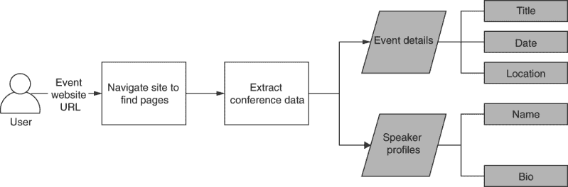
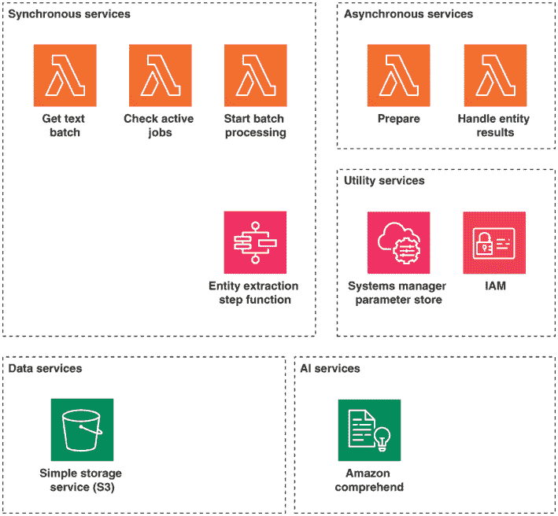
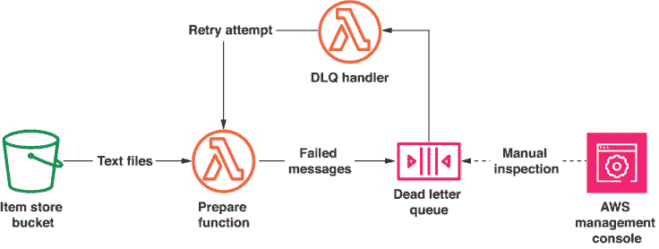
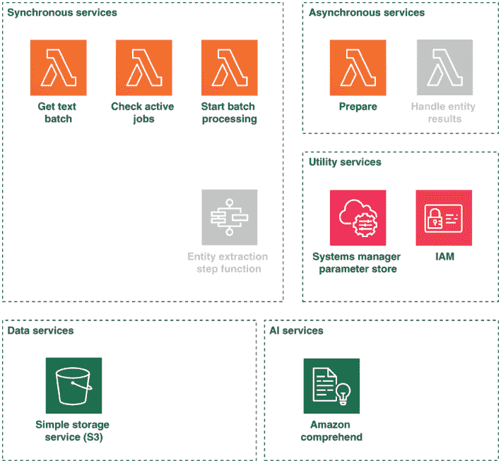
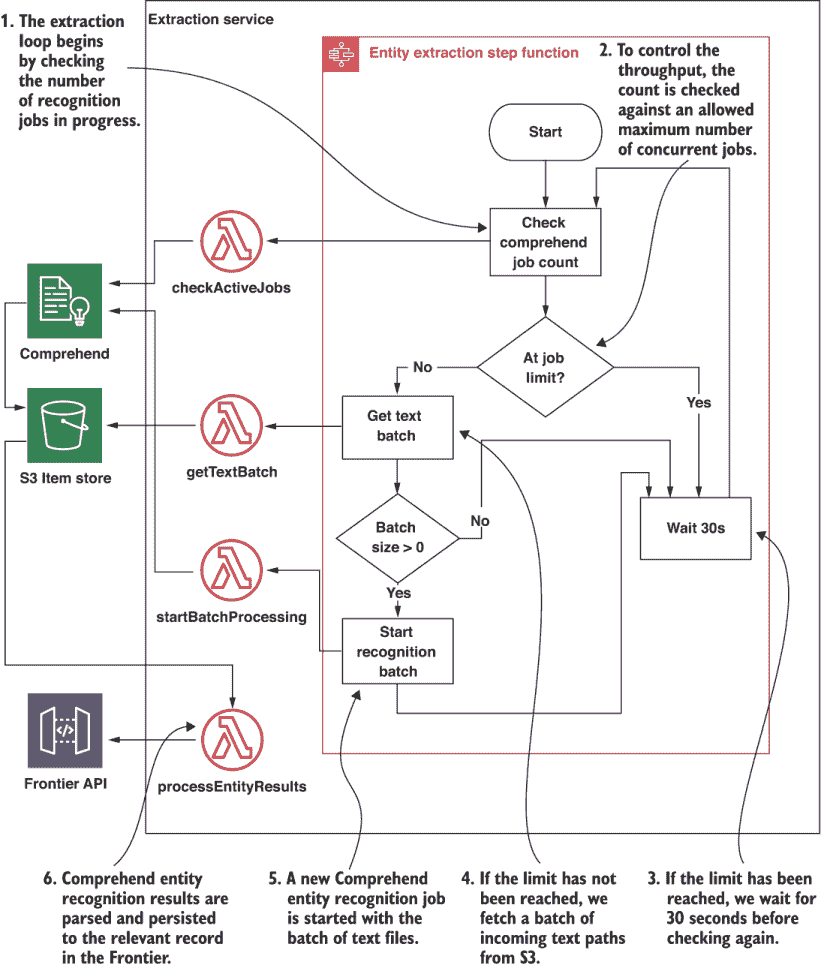
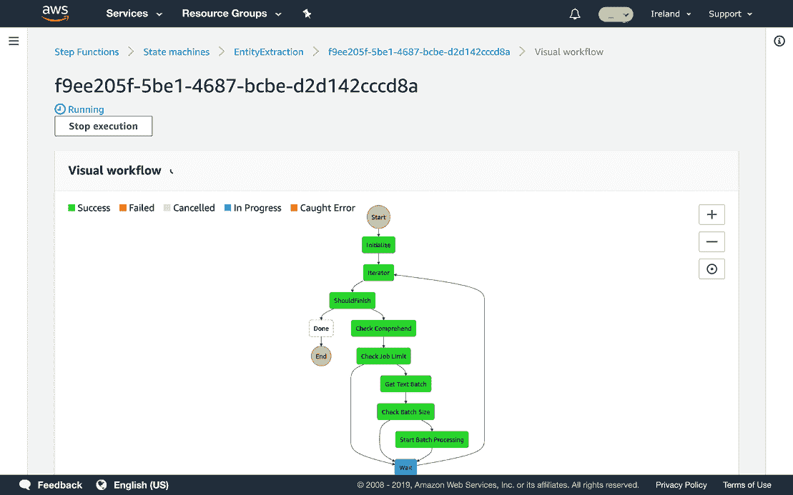
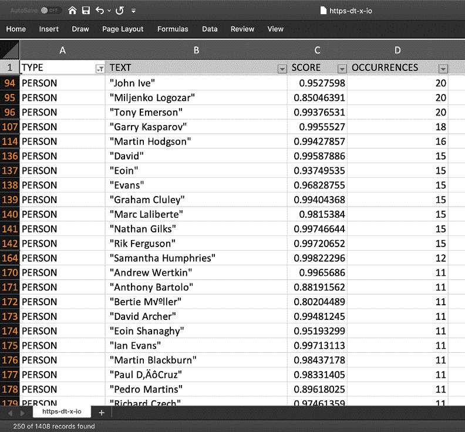

# 9 使用 AI 从大型数据集中提取价值

本章涵盖了

+   使用 Amazon Comprehend 进行命名实体识别（NER）

+   理解 Comprehend 的操作模式（异步、批量、同步）

+   使用异步 Comprehend 服务

+   使用 S3 通知触发 Lambda 函数

+   使用死信队列处理 Lambda 中的错误

+   处理 Comprehend 的结果

第八章处理了从网站收集非结构化数据用于机器学习分析的问题。本章在第八章的无服务器网页爬虫基础上进行构建。这次，我们关注的是使用机器学习从我们收集的数据中提取有意义的见解。如果你没有完成第八章的内容，你应该现在回去完成它，然后再继续本章，因为我们将在网页爬虫的基础上直接构建。如果你已经熟悉了这些内容，我们可以直接进入并添加信息提取部分。

## 9.1 使用 AI 从网页中提取重要信息

让我们回顾一下第八章场景的宏伟愿景——寻找要参加的相关开发者会议。我们希望建立一个系统，让人们能够搜索他们感兴趣的和会议演讲者。在第八章的网页爬虫中，我们构建了一个系统，解决了这个场景的第一部分——收集会议数据。

然而，我们不想让用户手动搜索我们收集的所有非结构化网站文本。相反，我们希望向他们展示会议、事件地点和日期以及可能在这些会议上发表演讲的人名单。

从非结构化文本中提取这些有意义的资料是一个非同小可的问题——至少，在最近管理人工智能服务进步之前是这样的。

让我们再次回顾第八章场景的需求概述图。这次，我们突出显示本章的相关部分。



图 9.1 本章处理从我们已收集的数据中提取事件和演讲者信息。

### 9.1.1 理解问题

从非结构化文本中提取重要信息的问题被称为 *命名实体识别 (NER)*。一个 *命名实体* 可以是人、地点或组织。它也可以指日期和数值。NER 是一个具有挑战性的问题，也是许多研究的话题。这绝对不是一个完全解决的问题。由于其结果不能保证达到 100% 的准确性，我们必须考虑这一点。根据应用情况，可能需要人工结果检查。例如，假设你有一个需要检测文本中位置的系统。现在假设文本中的一句话提到了阿波罗 11 号指令舱，“哥伦比亚”。NER 可能将其识别为地点而不是航天器的一部分！每个命名实体识别系统都会为每个识别结果提供一个可能性分数，而这个值永远不会达到 100%。

对于我们的会议事件信息提取场景，我们的目标是从网站数据中提取人名、地点和日期。然后这些信息将被存储并供用户访问。

### 9.1.2 扩展架构

我们即将设计和部署一个无服务器系统，从会议网页中提取所需信息。让我们看看本章的架构组件，使用第一章中提到的标准无服务器架构中的类别。这如图 9.2 所示。



图 9.2 服务器端无实体提取系统架构。系统由使用步骤函数编排的同步 Lambda 函数组成。数据存储在第八章中介绍的项存储 S3 存储桶中。S3 的存储桶通知触发我们的异步服务。

与前几章相比，服务和通信渠道的种类较少。从 AWS 服务角度来看，本章将相对简单。新引入的方面包括 Amazon Comprehend 功能和 S3 事件通知作为数据处理触发器。

## 9.2 理解 Comprehend 的实体识别 API

Amazon Comprehend 支持多种实体识别接口。在我们进一步详细说明数据如何通过系统流动之前，让我们花些时间来了解 Comprehend 的工作原理以及它可能对我们架构产生的影响。

Amazon Comprehend 中的三个实体识别接口在表 9.1 中概述。

表 9.1 Amazon Comprehend 操作模式

| API | 描述 | 限制 |
| --- | --- | --- |
| 按需实体识别 | 分析单个文本片段。结果同步返回。 | 仅支持最多 5,000 个字符。 |
| 批量实体识别 | 分析多个文本片段。结果同步返回。 | 每个文档最多 25 个，每个文档最多 5,000 个字符。 |
| 异步实体识别 | 多个大型文本被分析。文本从 S3 读取，结果异步写入 S3。 | 每秒仅一个请求，每份文档 100 KB，所有文档最大 5 GB。 |

有关 Comprehend 限制的完整详细信息，请参阅亚马逊 Comprehend 的 *指南和限制* 文档。1

为了我们的目的，我们希望分析超过 5,000 个字符的文档，因此我们必须选择异步操作模式。此模式要求我们使用两个 API：*StartEntitiesDetectionJob* 用于启动分析，以及 *DescribeEntitiesDetectionJob* 如果我们希望轮询作业状态。

Comprehend 以数组的形式返回实体识别结果。每个数组元素包含以下属性：

`Type`--已识别的实体类型：`PERSON`、`LOCATION`、`ORGANIZATION`、`COMMERCIAL_ITEM`、`EVENT`、`DATE`、`QUANTITY`、`TITLE` 或 `OTHER`。

+   `Score`--分析结果中的置信度分数。这是一个介于 `0` 和 `1` 之间的值。

+   `Text`--已识别的实体文本。

+   `BeginOffset`--实体在文本中的起始偏移量。

+   `EndOffset`--实体在文本中的结束偏移量。

为了了解 Comprehend 的工作方式，让我们使用 AWS 命令行界面运行一次性的测试。使用 shell 是熟悉任何新 AWS 服务的一种有用方式。

提示：第二章和附录 A 介绍了 AWS CLI。除了正常的 AWS CLI 外，亚马逊还发布了一个名为 *AWS Shell* 的交互式版本([`github.com/awslabs/aws-shell`](https://github.com/awslabs/aws-shell))。它支持交互式帮助和命令自动完成。如果您使用 AWS CLI 来学习和探索新服务，查看 AWS Shell 是值得的。

我们将分析代码仓库中 `chapter8-9/sample-text/apollo.txt` 下的样本文本。文本段落取自维基百科上的 *阿波罗 11 号* 页面。2 样本文本将在下一列表中展示。

列表 9.1 实体识别样本文本：`apollo.txt`

```
Apollo 11 was the spaceflight that first landed humans on the Moon. 
Commander Neil Armstrong and lunar module pilot Buzz Aldrin formed the 
American crew that landed the Apollo Lunar Module Eagle on July 20, 1969, 
at 20:17 UTC. Armstrong became the first person to step onto the lunar 
surface six hours and 39 minutes later on July 21 at 02:56 UTC; Aldrin 
joined him 19 minutes later. They spent about two and a quarter hours 
together outside the spacecraft, and they collected 47.5 pounds (21.5 kg) 
of lunar material to bring back to Earth. Command module pilot Michael 
Collins flew the command module Columbia alone in lunar orbit while they 
were on the Moon's surface. Armstrong and Aldrin spent 21 hours 31 minutes 
on the lunar surface at a site they named Tranquility Base before lifting 
off to rejoin Columbia in lunar orbit.
```

我们可以使用以下命令在 CLI 上运行按需实体识别：

```
export INPUT_TEXT=`cat apollo.txt`

aws comprehend detect-entities --language-code=en --text $INPUT_TEXT > results.json
```

此命令的输出，保存到 `results.json`，表明 Comprehend 如何为实体识别任务提供分析结果。表 9.2 以表格格式显示了此命令的一些结果。

表 9.2 Comprehend 实体识别样本结果

| 类型 | 文本 | 分数 | 起始偏移量 | 结束偏移量 |
| --- | --- | --- | --- | --- |
| `ORGANIZATION` | 阿波罗 11 号 | 0.49757930636405900 | 0 | 9 |
| `LOCATION` | 月球 | 0.9277622103691100 | 62 | 66 |
| `PERSON` | 尼尔·阿姆斯特朗 | 0.9994082450866700 | 78 | 92 |
| `PERSON` | 巴兹·奥尔德林 | 0.9906044602394100 | 116 | 127 |
| `OTHER` | 美国 | 0.6279735565185550 | 139 | 147 |
| `ORGANIZATION` | 阿波罗 | 0.23635128140449500 | 169 | 175 |
| `COMMERCIAL_ITEM` | 月球模块鹰 | 0.7624998688697820 | 176 | 194 |
| `DATE` | "1969 年 7 月 20 日" | 0.9936476945877080 | 198 | 211 |
| `QUANTITY` | 第一人称 | 0.8917713761329650 | 248 | 260 |
| `QUANTITY` | 大约两个半小时 | 0.9333438873291020 | 395 | 424 |
| `QUANTITY` | 21.5 公斤 | 0.995818555355072 | 490 | 497 |
| `LOCATION` | 地球 | 0.9848601222038270 | 534 | 539 |
| `PERSON` | 迈克尔·柯林斯 | 0.9996771812438970 | 562 | 577 |
| `LOCATION` | 哥伦比亚 | 0.9617793560028080 | 602 | 610 |

很明显，通过 Comprehend 实体识别可以以非常小的努力获得非常准确的结果。

为了从会议网站爬取的每个网页中获得这些结果，我们将使用异步实体识别 API。这意味着我们必须处理以下 API 的特性：

+   在 Comprehend 上进行的实体识别作业在异步模式下运行时间较长。每个作业可能需要 5 到 10 分钟。这比同步作业要长得多，但权衡是异步作业可以处理更大的文档。

+   为了避免触碰到 API 的限速限制，我们将避免每秒发送超过一个请求，并将多个网页提交给每个任务。

+   亚马逊 Comprehend 中的异步 API 将结果写入配置的 S3 存储桶。我们将通过 S3 存储桶上的通知触发器来处理结果。

第八章中的网络爬虫为每个网页在 S3 存储桶中写了一个文本文件（`page.txt`）。为了开始实体识别，我们将在 S3 的单独的临时文件夹中创建这个文件的副本。这样，我们可以检查临时文件夹中的新文本文件以供处理。当处理开始时，我们将从临时区域删除文件。原始文件（`page.txt`）将永久保留在`sites`文件夹中，因此如果以后需要，它仍然可用于进一步处理。

让我们继续实现一个简单的服务，该服务将在临时区域创建文本文件的副本。

## 9.3 准备信息提取数据

包含准备处理文件的临时区域将是项目存储 S3 存储桶中的一个目录，称为`incoming-texts`。我们将使用 S3 通知触发器来响应从网络爬虫到达存储桶中的新`page.txt`文件。然后，每个文件将被复制到`incoming-texts/`。

### 9.3.1 获取代码

准备服务的代码位于`chapter8-9/preparation-service`目录中。此目录包含一个`serverless.yml`文件。在部署和测试准备服务之前，我们将逐步解释其内容。

### 9.3.2 创建 S3 事件通知

准备服务主要由一个具有事件通知的简单函数组成。让我们详细探索`serverless.yml`，看看它是如何工作的。接下来的列表显示了该文件的摘录，其中我们遇到了第一个 S3 存储桶事件通知。

列表 9.2 准备服务 `serverless.yml` 文件摘录

```
service: preparation-service
frameworkVersion: '>=1.47.0'                       ❶

plugins:
  - serverless-prune-plugin                        ❷
  - serverless-pseudo-parameters                   ❸
  - serverless-dotenv-plugin                       ❹
...

provider:
  ...
  iamRoleStatements:
    - Effect: Allow
      Action:
        - s3:GetObject
        - s3:PutObject
        - s3:ListBucket                             ❺

      Resource:
        - arn:aws:s3:::${env:ITEM_STORE_BUCKET}/*
...
functions:
  prepare:
    handler: handler.prepare                        ❻
    events:
      - s3:
          bucket: ${env:ITEM_STORE_BUCKET}
          event: s3:ObjectCreated:*
          rules:
            - suffix: page.txt                      ❼
          existing: true                            ❽
```

❶ 要使用 S3 现有的存储桶作为事件触发器，您必须使用 Serverless Framework 1.47.0 或更高版本。3 这一行强制执行了该要求。

❷ 每次我们部署时，都会为每个 Lambda 函数创建一个新的版本。serverless-prune-plugin 负责在版本积累时移除旧的 Lambda 函数版本。4

❸ 我们希望在配置中使用带有伪参数（如${AWS::AccountId}）的 CloudFormation 子函数，5，但此语法与 Serverless Framework 的变量语法冲突。6 serverless-pseudo-parameters7 通过允许我们使用更简单的语法（#{AWS::AccountId}）来解决此问题。

❹ 正如前几章所述，我们使用 serverless-dotenv-plugin8 从.env 文件中加载环境变量。

❺ 我们为函数授予读取和写入项目存储桶的权限。

❻ S3 事件处理函数在 handler.js 中定义。函数名称被导出为 prepare。

❼ Lambda 触发器被定义为 S3 通知。通知将匹配在桶中创建的任何带有 page.txt 后缀的对象（文件）。

❽ 这确保了 Serverless Framework 不会尝试创建桶。相反，它将在现有的项目存储桶上创建一个通知触发器。

我们刚刚声明了函数、其资源以及准备处理器的触发器。现在我们可以继续实现这个函数。

CloudFormation 和 S3 通知触发器

CloudFormation 是一种定义基础设施即代码的绝佳方式，它支持逻辑上分组资源，并在任何失败事件发生时提供回滚功能。然而，一个缺点是，与 AWS SDK 创建所有资源类型相比，CloudFormation 不够灵活。

这的一个例子是与桶通知一起使用。使用 CloudFormation，只有在创建桶资源时才能添加通知。9 我们更希望能够在我们的系统中为任何服务添加现有桶的通知。

Serverless Framework 为这个问题提供了一个很好的解决方案。通过使用具有属性`existing:` `true`的`s3`事件类型，框架在底层使用 AWS SDK 向现有桶添加一个新的通知。这是通过使用*CloudFormation 自定义资源*实现的，这是一种有用的解决方案，当官方 CloudFormation 支持不足以满足您的需求时。有关自定义资源的更多信息，请参阅 AWS 文档。10

### 9.3.3 实现准备处理程序

准备服务`handler`模块的目标是执行任何必要的处理，以便文本准备好进行实体识别。在我们的案例中，这仅仅是把文本放入正确的文件夹，并使用正确的文件名进行处理。准备服务的`handler`模块如下所示。

列表 9.3 准备服务`handler.js`摘录

```
...
const s3 = new AWS.S3({ endpoint: process.env.S3_ENDPOINT_URL })

function prepare(event) {
  const record = event.Records[0]                                 ❶
  const bucketName = record.s3.bucket.name
  const key = decodeURIComponent(record.s3.object.key)            ❷
  const object = { Bucket: bucketName, Key: key }
  ...
  return s3
    .getObject(object)
    .promise()
    .then(({ Body: body }) => body)
    .then(body => body.toString())
    .then(text => {
      const textObjectKey = `incoming-texts/${key.substring(KEY_PREFIX.length).replace(/page.txt$/, 'pending.txt')}`     ❸
      ...
      return s3                                                   ❹
        .putObject({ Body: text, Bucket: bucketName, Key: textObjectKey })
        .promise()
    })
}
```

❶ 每个 S3 通知事件都是一个长度为 1 的数组。

❷ 当对象键到达 S3 事件时，它们会被 URL 编码。

❸ 阶段区域副本的键是通过替换传入键字符串中的前缀和文件名来创建的。

❹ 将 S3 对象的内写入目标键。

### 9.3.4 使用死信队列（DLQ）增加弹性

在我们部署准备服务之前，让我们处理弹性和重试的问题。如果我们的事件处理程序无法处理事件，我们可能会丢失事件。Lambda 将重试我们的函数两次。11 如果我们的函数在任何这些调用尝试中未能成功处理事件，将不会有进一步的自动重试。

幸运的是，我们可以为任何 Lambda 函数配置一个死信队列（DLQ）。在自动重试失败后，未处理的事件将进入这里。一旦它们在 DLQ 中，就取决于我们决定如何重新处理它们。

DLQ 可能是一个 SQS 队列或 SNS 主题。SNS（简单通知服务）用于 pub/sub 消息，这是第二章中介绍的内容。SQS（简单队列服务）用于点对点消息。我们将使用 SQS 队列作为我们的 DLQ，因为我们只需要一个消费者。DLQ 交互如图 9.3 所示。



图 9.3 一个 DLQ 有助于检查和重新处理导致 Lambda 执行失败的的事件。

这是我们处理未处理消息的方式：

+   我们为`prepare` Lambda 函数设置了一个 SQS 队列作为 DLQ。

+   在所有重试尝试失败后，未处理的消息将被发送到我们的队列。

+   我们可以间歇性地检查 AWS 控制台中的 SQS 队列。在生产场景中，我们理想情况下会设置一个 CloudWatch 警报，在队列中的消息数量超过零时提醒我们。为了简化，我们不会在本章中创建 CloudWatch 警报。12

+   我们将创建第二个 Lambda 函数，其唯一目的是从 DLQ 检索消息并将它们传递回原始的`prepare` Lambda 函数。当我们注意到未处理的消息并已采取措施解决根本问题时，可以手动调用此函数。

### 9.3.5 创建 DLQ 和重试处理程序

在第二章和第三章中，我们使用 SQS 队列来触发 Lambda 函数。在 DLQ 的情况下，我们不希望我们的重试 Lambda 函数自动触发。由于我们将手动调用重试 Lambda，重试处理程序必须手动从 SQS 队列中读取消息。让我们看看`serverless.yml`的添加部分。以下列表显示了相关摘录。您可以在`chapter8-9/preparation-service`中找到完整的配置文件。

列表 9.4 准备服务`serverless.yml` DLQ 摘录

```
custom:
  ...
  dlqQueueName: ${self:provider.stage}PreparationDlq     ❶
  ...
provider:
  ...
  iamRoleStatements:
  ...
    - Effect: Allow
      Action:
        - sqs:GetQueueUrl                                ❷
        - sqs:DeleteMessage
        - sqs:SendMessage
        - sqs:ReceiveMessage
      Resource:
        - !GetAtt preparationDlq.Arn
functions:
  prepare:
    ...
    onError: !GetAtt preparationDlq.Arn                  ❸

  ...
  retryDlq:
    handler: dlq-handler.retry                           ❹
    environment:
      DLQ_QUEUE_NAME: ${self:custom.dlqQueueName}
...
resources:
  Resources:
    preparationDlq:
      Type: AWS::SQS::Queue
      Properties:
        QueueName: ${self:custom.dlqQueueName}
        MessageRetentionPeriod:                          ❺
```

❶ DLQ 队列名称对于每个部署阶段都不同，以避免命名冲突。

❷ Lambda 需要四个权限来读取和处理 DLQ 中的消息

❸ 使用`onError`将准备 Lambda 函数的 DLQ 设置为 SQS 队列的 ARN。

❹ 重试 Lambda 函数配置时没有事件触发器。DLQ 队列使用环境变量配置。

❺ 我们将 DLQ 的消息保留期设置为一天。这应该足够长，以便可以手动恢复未投递的消息。最大消息保留值是 14 天。

Lambda 处理器在`dlq-handler.js`文件中的`retry`函数中实现。当被调用时，其目标是执行以下一系列操作：

1.  从 DLQ 中检索一批消息。

1.  对于每条消息，从消息中提取原始事件。

1.  通过加载`handler`模块并直接使用事件调用`prepare`函数来调用`prepare`函数，并等待成功或失败响应。

1.  如果事件已成功，则从 DLQ 中删除该消息。

1.  继续处理下一条消息，直到批次中的所有消息都已被处理。

DLQ 处理是我们希望应用于多个 Lambda 函数的常见模式，因此我们将其提取到一个独立的、开源的 NPM 模块中，即`lambda-dlq-retry`。13 使用此模块简化了重试实现。让我们看看下面的`dlq-handler.js`，如下所示。

列表 9.5 准备服务 DLQ 处理器

```
const lambdaDlqRetry = require('lambda-dlq-retry')          ❶
const handler = require('./handler')                        ❷
const log = require('./log')

module.exports = {
  retry: lambdaDlqRetry({ handler: handler.prepare, log })  ❸
}
```

❶ 导入 lambda-dlq-retry 模块。

❷ 需要包含准备服务的准备函数的模块。

❸ 我们导出 DLQ 重试处理器，这是 lambda-dlq-retry 模块为我们创建的，使用指定的处理器。您可以传递一个日志记录实例。如果启用了调试日志记录，这将产生与 DLQ 重试相关的日志条目。

值得注意的是，`lambda-dlq-retry`以最多 10 条消息的批次处理消息。这可以通过在环境变量中设置一个替代值来配置，即`DLQ_RETRY_MAX_MESSAGES`。

### 9.3.6 部署和测试准备服务

到目前为止，我们已经在本章中创建了四个 Lambda 函数。在部署和运行它们之前回顾这些函数是很有价值的，这样我们就可以开始清楚地了解它们是如何协同工作的。图 9.4 回顾了本章开头我们的服务架构。我们已经涵盖的部分被突出显示。

在我们部署准备服务之前，请确保您已在`chapter8-9`目录中设置了`.env`，如第八章所述。这包含项目存储桶名称环境变量。一旦完成，我们就可以继续进行构建和部署的常规步骤！

```
npm install
sls deploy
```



图 9.4 到目前为止，我们已经实现了用于文本准备、获取一批文本文件、启动实体识别和检查识别进度的 Lambda 函数。

为了测试我们的函数，我们可以手动将文件上传到带有后缀`page.txt`的项目存储桶中。然后我们可以检查它是否已复制到`incoming-texts`的预演区域。我们可以使用我们从简单的 Comprehend 测试中已有的示例文本：

```
source ../.env
aws s3 cp ../sample-text/apollo.txt \
  s3://${ITEM_STORE_BUCKET}/sites/test/page.txt
```

要检查 `prepare` 函数的日志，我们可以使用 Serverless 的 `logs` 命令。这将打印函数的 CloudWatch 日志到控制台。由于我们在第八章中使用了 `pino` 模块进行日志记录，我们可以通过将输出管道传输到 `pino-pretty` 模块来格式化它们，以便于阅读输出：

```
npm install -g pino-pretty

sls logs -f prepare | pino-pretty
```

您应该看到类似于以下列表的输出。

列表 9.6 准备服务日志输出

```
START RequestId: 259082aa-27ec-421f-9caf-9f89042aceef Version: $LATEST
[1566803687880] INFO (preparation-service/1 on 169.254.238.253): Getting S3 Object
    object: {
      "Bucket": "item-store-bucket",
      "Key": "sites/test/page.txt"
    }
[1566803687922] INFO (preparation-service/1 on 169.254.238.253): Uploading extracted text
    bucketName: "item-store-bucket"
    key: "sites/test/page.txt"
    textObjectKey: "incoming-texts/test/pending.txt"
```

然后，您可以检查 S3 桶中暂存区域中文件的包含内容：

```
aws s3 ls s3://${ITEM_STORE_BUCKET}/incoming-texts/test/pending.txt
```

最后，我们将测试 DLQ 重试功能。如果没有经过测试和验证以确保其工作，那么拥有一个处理失败恢复的过程是没有意义的！为了模拟错误，我们将撤销对 S3 桶的读取权限。在 `serverless.yml` 中注释掉 Lambda IAM 角色策略中的 `GetObject` 权限，如下所示：

```
...
    - Effect: Allow
      Action:
#        - s3:GetObject
        - s3:PutObject
...
```

使用修改后的 IAM 角色部署更新的准备服务：

```
sls deploy
```

我们可以使用不同的 S3 密钥（路径）再次运行相同的测试：

```
aws s3 cp ../sample-text/apollo.txt s3://${ITEM_STORE_BUCKET}/sites/test2/page.txt
```

这次，我们应该在 `prepare` 函数日志中观察到错误：

```
START RequestId: dfb09e2a-5db5-4510-8992-7908d1ac5f13 Version: $LATEST
...
[1566805278499] INFO (preparation-service/1 on 169.254.13.17): Getting S3 Object
    object: {
      "Bucket": "item-store-bucket",
      "Key": "sites/test2/page.txt"
    }
[1566805278552] ERROR (preparation-service/1 on 169.254.13.17): Error in handler
    err: {
      "type": "Error",
      "message": "Access Denied",
```

您将看到此错误出现两次：一次在一分钟后，再次在额外两分钟后。这是因为 AWS Lambda 自动重试。在三次尝试失败后，您应该看到消息到达 DLQ。

我们将使用 AWS 控制台在尝试重发之前检查错误：

1.  浏览到 SQS 控制台，并从队列列表中选择准备服务 DLQ。您会注意到消息计数设置为 1。

1.  在列表中的队列上右键单击，并选择查看/删除消息选项。选择开始轮询消息，然后在我们未投递的 S3 事件消息出现后选择立即停止。

1.  要查看完整消息，请选择更多详情。我们现在看到了导致 `prepare` Lambda 函数出现错误的完整 S3 事件文本。

1.  这是解决原始消息问题的宝贵信息。通过选择第二个标签页，消息属性，我们还可以看到错误消息以及请求 ID。此 ID 与 Lambda 函数调用匹配，可以用来将错误关联回 CloudWatch 中的日志。您可能会注意到“错误代码”在这里显示为 200。此值可以忽略，因为它总是设置为 200 用于 DLQ 消息。

接下来，通过在 `serverless.yml` 中恢复正确的权限来测试重发。取消注释 `s3:GetObject` 行，并使用 `sls deploy` 重新部署。我们可以选择通过 AWS 控制台、AWS CLI 或使用 Serverless Framework 的 `invoke` 命令来触发重试 Lambda。以下命令使用 AWS CLI：

```
aws lambda invoke --function-name preparation-service-dev-retryDlq /tmp/dlq-retry-output
```

如果您运行此命令并检查 `/tmp/dlq-retry-output` 中的输出，您应该看到一个简单的 JSON 对象（`{"count":` `1}`）。这意味着一条消息已被处理并投递！我们可以像之前一样使用 `sls logs` 命令检查重试 Lambda 的输出：

```
sls logs -f retryDlq | pino-pretty
```

这将表明这次 S3 事件已成功处理。

## 9.4.1 使用文本批次管理吞吐量

现在我们有一个单独的临时区域，以及一个准备服务，用于在网页爬虫创建文件时填充它。我们还决定使用异步 Comprehend API 并批量处理文本。我们的下一步是创建一个简单的 Lambda 函数，用于检索要处理的文本文件批次。

### 9.4.1 获取代码

`getTextBatch`函数可以在`extraction-servicehandler`模块中找到。提取服务包括本章其余的功能，因为它处理提取和提取结果的报告：

```
cd ../extraction-service
```

### 9.4.2 获取用于提取的文本批次

`getTextBatch`函数的源代码如下所示。此函数使用 S3 的`listObjectsV2` API 读取临时区域（incoming-texts）中的文件，直到达到指定的限制。

列表 9.7 `getTextBatch`函数

```
const MAX_BATCH_SIZE = 25
const INCOMING_TEXTS_PREFIX = 'incoming-texts/'
...

function getTextBatch() {
  ...
  return s3
    .listObjectsV2({
      Bucket: itemStoreBucketName,
      Prefix: INCOMING_TEXTS_PREFIX,                                       ❶
      MaxKeys: MAX_BATCH_SIZE
    })
    .promise()
    .then(({ Contents: items }) =>
      items.map(item => item.Key.substring(INCOMING_TEXTS_PREFIX.length))  ❷
    )
    .then(paths => {
      log.info({ paths }, 'Text batch')
      return {                                                             ❸
        paths,
        count: paths.length
      }
    })
}
```

❶ 从临时区域（incoming-texts）读取最多 25 个键。

❷ 修改文件名，以从批处理结果中移除 incoming-texts/前缀。

❸ 返回转换后的文件名批次，并附带一个表示批次大小的计数。

我们将等待完全部署提取服务，所以让我们使用`sls invoke local`命令进行测试。请注意，尽管我们是在本地执行函数，但它正在调用 S3。因此，你的`AWS_`环境变量应该在这里设置，以确保你有权执行这些 SDK 调用。

我们如下本地运行该函数：

```
sls invoke local -f getTextBatch
```

你应该看到类似于以下列表的输出。

列表 9.8 `getTextBatch`的示例输出

```
{
    "paths": [
        "test/pending.txt",
        "test2/pending.txt"
    ],
    "count": 2
}
```

## 9.5 异步命名实体抽象

我们已经有一种方法可以从会议网页中获取一批文本。现在，让我们构建一个函数，用于从一组文本文件中启动实体识别。记住，我们在 Comprehend 中使用异步实体识别。使用这种方法，输入文件存储在 S3 中。我们可以轮询 Comprehend 以检查识别作业的状态，并将结果写入 S3 桶中指定的路径。

### 9.5.1 获取代码

提取服务的代码位于`chapter8-9/extraction-service`目录中。我们的`startBatchProcessing`和`checkActiveJobs`函数可以在`handler.js`中找到。

### 9.5.2 启动实体识别作业

AWS Comprehend SDK 为我们提供了`startEntitiesDetectionJob`函数。14 它要求我们指定一个输入路径，用于处理 S3 中所有文本文件。我们希望确保没有文本文件被遗漏处理。为了实现这一点，我们将要处理的文件复制到批处理目录中，并且只有在`startEntitiesDetectionJob`调用成功后才会删除源文件。

这可以在提取服务的`handler.js`中的`startBatchProcessing` Lambda 函数中看到，如下面的列表所示。

列表 9.9 提取服务处理程序`startBatchProcessing`函数

```
function startBatchProcessing(event) {
  const { paths } = event                                             ❶
  const batchId = new Date().toISOString().replace(/[⁰-9]/g, '')     ❷

  return (
    Promise.all(                                                      ❸
      paths
        .map(path => ({
          Bucket: itemStoreBucketName,
          CopySource: encodeURIComponent(
            `${itemStoreBucketName}/${INCOMING_TEXTS_PREFIX}${path}`  ❹
          ),
          Key: `${BATCHES_PREFIX}${batchId}/${path}`
        }))
        .map(copyParams => s3.copyObject(copyParams).promise())
    )
      // Start Processing
      .then(() => startEntityRecognition(batchId))                    ❺
      // Delete the original files so they won't be reprocessed
      .then(() =>
        Promise.all(                                                  ❻
          paths.map(path =>
            s3
              .deleteObject({
                Bucket: itemStoreBucketName,
                Key: `${INCOMING_TEXTS_PREFIX}${path}`
              })
              .promise()
          )
        )
      )
      .then(() => log.info({ paths }, 'Batch process started'))
      .then(() => ({ batchId }))
  )
}
```

❶ 事件传递一个路径数组。这些路径相对于 incoming_texts 前缀。这些路径集构成了批处理。

❷ 我们基于当前时间生成一个批处理 ID。这用于在 S3 中创建批处理目录。

❸ 在处理之前，批处理中的所有文件都复制到批处理目录中。

❹ S3 copyObject API 需要 URL 编码的 CopySource 属性。

❺ 我们将批处理 ID 传递给我们的 startEntityRecognition 函数，以便批处理中的所有文件可以一起分析。

❻ 批处理识别开始后，我们继续删除 incoming_texts 目录中的所有输入路径。

现在我们可以看到，通过将文件复制到批处理目录中，我们确保`incoming_texts`中的每个文件都将被处理。启动批处理识别作业时出现的任何错误都会使文件留在`incoming_texts`中，以便可以使用后续的批处理重新处理。

我们刚刚看到了对`startEntityRecognition`函数的引用。这个函数负责为 Comprehend 的`startEntitiesDetectionJob` API 创建参数。列表 9.10 显示了该函数的代码。

列表 9.10 提取服务`startBatchProcessing` Lambda 函数

```
function startEntityRecognition(batchId) {
  return comprehend
    .startEntitiesDetectionJob({
      JobName: batchId,                                                    ❶
      DataAccessRoleArn: dataAccessRoleArn,                                ❷
      InputDataConfig: {
        InputFormat: 'ONE_DOC_PER_FILE',                                   ❸
        S3Uri: `s3://${itemStoreBucketName}/${BATCHES_PREFIX}${batchId}/`  ❹
      },
      LanguageCode: 'en',
      OutputDataConfig: {
        S3Uri: `s3://${itemStoreBucketName}/${ENTITY_RESULTS_PREFIX}${batchId}`                                   ❺
      }
    })
    .promise()
    .then(comprehendResponse =>
      log.info({ batchId, comprehendResponse }, 'Entity detection started')
    )
}
```

❶ 为了便于手动故障排除，我们使用生成的批处理 ID 作为作业名称。

❷ 作业需要一个具有读取和写入 S3 存储桶权限的 IAM 角色。角色定义可以在 extraction-service/serverless.yml 中找到。

❸ 我们需要告诉 Comprehend，S3 文件夹中的每个文件代表一个单独的文档。另一种选择是 ONE_DOC_PER_LINE。

❹ 批处理中文件的路径是我们刚刚复制文件的路径。

❺ 将 Comprehend 结果写入由批处理 ID 指定的输出文件夹。

`startBatchProcessing`函数是本章功能的核心。它将提取的文本传递到 AWS Comprehend，这是一个托管 AI 服务，负责提取重要数据。

## 9.6 检查实体识别进度

在我们尝试我们的实体识别作业处理之前，我们将查看`checkActiveJobs`。这是一个简单的 Lambda 函数，它将使用 Comprehend API 来报告正在进行的作业的状态。对于手动进度检查，您还可以查看 AWS 管理控制台的 Comprehend 部分。当我们知道有多少作业正在进行时，我们可以知道何时开始更多作业并控制并发 Comprehend 作业执行的数量。`checkActiveJobs`的代码在下一列表中显示。

列表 9.11 提取服务`checkActiveJobs` Lambda 函数

```
function checkActiveJobs() {
  return comprehend
    .listEntitiesDetectionJobs({                                      ❶
      Filter: { JobStatus: 'IN_PROGRESS' },
      MaxResults: MAX_COMPREHEND_JOB_COUNT
    })
    .promise()
    .then(({ EntitiesDetectionJobPropertiesList: jobList }) => {
      log.debug({ jobList }, 'Entity detection job list retrieved ')
      return {                                                        ❷
        count: jobList.length,
        jobs: jobList.map(
          ({ JobId: jobId, JobName: jobName, SubmitTime: submitTime }) => ({
            jobId,
            jobName,
            submitTime
          })
        )
      }
    })
}
```

❶ 调用 listEntitiesDetectionJobs API，根据正在进行的作业进行过滤。为了限制可能返回的数量，我们将结果数量限制在最大值。我们选择了 10 作为这个值。

❷ 结果被转换，以给我们一个包含正在进行作业总数（不超过我们的最大作业计数值 10）以及每个作业摘要的输出。

现在我们有三个 Lambda 函数可以一起使用，以对文件批次执行实体识别：

1.  使用 `getTextBatch` 选择要处理的有限数量的文件。

1.  使用 `startBatchProcessing` 启动文件批次的实体识别执行。

1.  `checkActiveJobs` 用于报告正在进行中的识别作业数量。这将在我们整合所有实体提取逻辑时非常有用。

我们已经使用 `sls` `invoke` `local` 测试了 `getTextBatch`。接下来，我们将部署提取服务并开始处理一批样本文本文件，以了解这些函数在实际应用中的配合情况。

## 9.7 部署和测试批量实体识别

为了测试我们的函数，我们首先部署提取服务。这与其他所有 Serverless Framework 部署的方式相同：

```
cd extraction-service
npm install
sls deploy
```

我们现在可以使用 Serverless Framework CLI 来调用我们的远程函数。我们将传递一个简单的 JSON 编码的路径数组给 `startBatchProcessing` Lambda 函数。在这个例子中，我们将使用 `incoming-texts` S3 目录中已有的两个文件。这些文件包含阿波罗 11 的样本文本。稍后，我们将对真实的会议网页数据进行实体识别！

```
sls invoke -f startBatchProcessing --data \
  "{\"paths\":[\"test/pending.txt\", \"test2/pending.txt\"]}"
```

如果执行成功，你应该会看到以下类似的输出——一个包含批次 ID 的 JSON 对象：

```
{
    "batchId": "20190829113049287"
}
```

接下来，我们将运行 `checkActiveJobs` 来报告正在进行的 Comprehend 作业数量。

列表 9.12 `checkActiveJobs` 输出

```
{
    "count": 1,                                           ❶
    "jobs": [
        {
            "jobId": "acf2faa221ee1ce52c3881e4991f9fce",  ❷
            "jobName": "20190829113049287",               ❸
            "submitTime": "2019-08-29T11:30:49.517Z"
        }
    ]
}
```

❶ 正在进行的作业总数

❷ 作业 ID 由 Comprehend 生成。

❸ 作业名称与我们所生成的批次 ID 匹配。

经过 5-10 分钟后，再次运行 `checkActiveJobs` 将报告零个正在进行的作业。此时，你可以检查作业的输出。

`extraction-service` 目录包含一个 shell 脚本，可以方便地查找、提取和输出批量作业的结果。要运行它，请执行以下命令：

```
./scripts/get-batch_results.sh <BATCH_ID>
```

`<BATCH_ID>` 占位符可以被替换为在执行 `startBatchProcessing` 时看到的批次 ID 值。运行此脚本将打印出代表每个样本文本的 Comprehend 实体识别结果的 JSON。在我们目前的例子中，批次中的两个文件都包含关于阿波罗 11 的相同样本文本。

## 9.8 持久化识别结果

我们已经看到如何从命令行手动运行实体提取功能并验证命名实体识别（NER）的输出。对于我们的端到端应用，用于会议网站爬取和分析，我们希望持久化我们的实体提取结果。这样，我们可以使用 API 为寻找会议的观众提供提取的人名、地点和日期！

实体结果处理将由 Comprehend 结果到达我们在启动实体识别作业时配置的输出文件夹驱动。就像准备服务一样，我们将使用 S3 桶通知。你将在提取服务的`serverless.yml`中找到`processEntityResults`函数的配置。相关部分在下一列表中重现。

列表 9.13 `processEntityResults`的`serverless.yml`提取

```
processEntityResults:
    handler: handler.processEntityResults
    events:
      - s3:
          bucket: ${env:ITEM_STORE_BUCKET}     ❶
          event: s3:ObjectCreated:*
          rules:
            - prefix: entity-results/          ❷
            - suffix: /output.tar.gz           ❸
          existing: true
```

❶ 通知配置与准备服务 S3 桶通知位于同一桶中。这次，键后缀/前缀不同。

❷ 所有 Comprehend 结果都持久化到实体结果中，正如我们在启动实体检测作业时指定的。

❸ Comprehend 还写入其他临时文件。我们只对存储在 output.tar.gz 中的最终结果感兴趣。

当结果到达时，我们将使用我们的通知 Lambda 函数提取结果并将它们持久化到前沿服务。由于前沿服务维护所有 URL 的状态，因此将结果与爬取/提取状态一起存储很方便。让我们分解所有必需的步骤：

1.  S3 通知触发`processEntityResults`函数。

1.  对象作为流从 S3 中检索。

1.  流被解压并提取。

1.  输出中的每一行 JSON 都被解析。

1.  每个 Comprehend 结果条目的结构被转换为一个更易于访问的数据结构。结果按实体类型（人物、地点等）分组。

1.  网页的种子和 URL 是从 S3 对象的路径（键）中派生的。

1.  转换后的识别结果被发送到前沿服务。

Lambda 函数和相关内部函数（`handleEntityResultLines`，`storeEntityResults`）可以在提取服务的`handler.js`模块中找到。

## 9.9 整合所有内容

我们的大会网站爬取和识别应用中的最后一个任务是整合所有功能，以便在爬虫提供新页面数据时自动分析所有网站。

正如我们在第八章中所做的那样，我们将为此作业使用 AWS 步骤函数。

### 9.9.1 协调实体提取

图 9.5 显示了步骤函数中实现的控制逻辑以及它与我们所构建的 Lambda 函数之间的关系。



图 9.5 提取服务中的逻辑步骤是通过 AWS 步骤函数编排的。这确保了我们能够控制同时执行多少机器学习作业。它也可以扩展以支持高级错误恢复场景。

我们的大会数据提取过程是一个连续循环，检查新抓取的页面文本，并根据配置的并发作业限制启动异步实体识别。正如我们所见，结果处理是一个独立的、异步的过程，由 S3 桶中 Comprehend 结果的到达驱动。

图 9.5 是对步进函数的轻微简化。步进函数实际上不支持连续执行事件；最大执行时间为一年。在函数中必须有可到达的`End`状态。为了处理这种情况，我们在步进函数中添加了一些额外的逻辑。我们将终止函数的执行，在 100 次迭代后。这是一个安全措施，以避免忘记长时间运行的任务，可能造成令人惊讶的 AWS 费用！以下列表显示了步进函数 YAML 的压缩视图。完整版本包含在提取服务的`serverless.yml`文件中。

列表 9.14 简化实体提取步进函数配置

```
StartAt: Initialize
States:
  Initialize:                               ❶
    Type: Pass
    Result:
      iterations: 100
    ResultPath: $.iterator
    Next: Iterator
  Iterator:                                 ❷
    Type: Task
    Resource: !GetAtt IteratorLambdaFunction.Arn
    ResultPath: $.iterator
    Next: ShouldFinish
  ShouldFinish:                             ❸
    Type: Choice
    Choices:
      - Variable: $.iterator.iterations
        NumericEquals: 0
        Next: Done
    Default: Check Comprehend
  Check Comprehend:
    Type: Task
    Resource: !GetAtt CheckActiveJobsLambdaFunction.Arn
    ...

  Check Job Limit:                          ❹
    Type: Choice
    Choices:
      - Variable: $.activeJobsResult.count
        NumericGreaterThanEquals: 10
        Next: Wait
    Default: Get Text Batch
  Get Text Batch:
    Type: Task
    Resource: !GetAtt GetTextBatchLambdaFunction.Arn
    ...
  Check Batch Size:                          ❺
    Type: Choice
    Choices:
      - Variable: $.textBatchResult.count
        NumericEquals: 0
        Next: Wait
    Default: Start Batch Processing
  Start Batch Processing:
    Type: Task
    Resource: !GetAtt StartBatchProcessingLambdaFunction.Arn
    ...

  Wait:                                      ❻
    Type: Wait
    Seconds: 30
    Next: Iterator
  Done:                 
    Type: Pass
    End: true
```

❶ 初始状态将迭代计数初始化为 100。

❷ 迭代任务是循环的起点。它调用一个 Lambda 函数来减少计数。

❸ 检查迭代次数。当循环执行了 100 次后，状态机终止。

❹ 现在我们已经运行了 checkActiveJobs 函数，我们可以将活动作业的数量与限制（10）进行比较。

❺ 获取传入文本的批次。如果没有可用的文本，我们等待。如果至少有一个项目，我们开始一个实体识别作业。

❻ 30 秒的等待期是控制数据吞吐量的一个变量。我们还可以增加最大批次大小和并发 Comprehend 作业的数量。

简单迭代函数提供在`extraction-service`中的`handler.js`模块。

### 9.9.2 端到端数据提取测试

我们已经完成了最终的无服务器 AI 应用程序的构建！您已经覆盖了大量无服务器架构，学习了众多非常强大的 AI 服务，并构建了一些相当惊人的 AI 赋能系统。恭喜您达到这一里程碑！现在是时候通过运行我们的端到端会议数据爬取和提取应用程序来奖励自己了。让我们用会议网站的 URL 启动网络爬虫。然后，坐下来观察我们的自动化提取逻辑开始行动，随着使用 AI 检测到的会议和演讲者的详细信息开始出现。

正如我们在第八章末所做的那样，我们将使用种子 URL 启动网络爬虫。这次，我们将选择一个真实的会议网站！

```
aws stepfunctions start-execution \
 --state-machine-arn arn:aws:states:eu-west-1:1234567890123:stateMachine:CrawlScheduler \
 --input '{"url": "https://dt-x.io"}'
```

我们也将以相同的方式启动实体提取步进函数。此命令不需要 JSON 输入：

```
aws stepfunctions start-execution \
  --state-machine-arn arn:aws:states:eu-west-1:1234567890123:stateMachine:EntityExtraction
```

在这两种情况下，您都需要将步进函数的 ARN 替换为您的部署的正确值。回想一下第八章中，检索这些值所需的 AWS CLI 命令是

```
aws stepfunctions list-state-machines --output text
```

一旦状态机开始运行，您可以在 AWS 控制台步骤函数部分查看它们，通过点击状态来监控它们的进度，状态转换发生时。图 9.6 显示了实体提取状态机的进度。



图 9.6 监控实体提取状态机的进度

### 9.9.3 查看会议数据提取结果

为应用程序构建前端 UI 超出了本章的范围，因此提供了一个方便的脚本`scripts/get_extracted_entities.js`来检查结果。通过运行此脚本，将在前沿表中执行 DynamoDB 查询，以找到给定种子 URL 提取的实体。然后，这些结果将汇总以生成一个 CSV 文件，总结每个实体的出现次数，以及使用机器学习过程找到的每个实体的平均分数。脚本执行方式如下：

```
scripts/get_extracted_entities.js https://dt-x.io
```

脚本使用 AWS SDK，因此必须在 shell 中配置 AWS 凭证。脚本将打印生成的 CSV 文件名称。对于此示例，它将是`https-dt-x-io.csv`。使用 Excel 等应用程序打开 CSV 文件以检查结果。图 9.7 显示了我们对该会议网站的结果。



图 9.7 监控实体提取状态机的进度

我们已过滤仅显示此案例中的 PERSON 实体。结果包括爬取网站所有页面中提到的每个人！这次会议有一些杰出的演讲者，包括本书的作者！

随意尝试其他会议网站以测试我们会议爬虫和提取器的限制。一如既往，请记住您的 AWS 使用成本。随着数据量的增长，Comprehend 的成本可能会很高 15，尽管有免费层可用。如有疑问，停止任何正在运行的步骤函数状态机，并在测试完成后尽快删除已部署的应用程序。`chapter8-9`代码目录中包含一个`clean.sh`脚本，可以帮助您完成此操作！

## 9.10 总结

您已经到达了最后一章的结尾。恭喜您坚持下来并走这么远！在这本书中，我们构建了

+   一个具有物体检测功能的图像识别系统

+   一个语音驱动的任务管理应用

+   一个聊天机器人

+   一个自动化的身份文件扫描器

+   一个用于电子商务系统的 AI 集成，用于确定客户产品评论背后的情感，使用自定义分类器对它们进行分类，并将它们转发到正确的部门

+   一个使用实体识别来查找会议信息的事件网站爬虫，包括演讲者资料和活动地点

我们还涵盖了许多想法、工具、技术和架构实践。尽管无服务器和 AI 是快速发展的主题，但这些基础原则旨在在您构建令人惊叹的 AI 赋能无服务器系统时保持其适用性。

我们很感激您抽出时间关注*AI as a Service*。想了解更多信息，请查看 fourTheorem 博客([`fourtheorem.com/blog`](https://fourtheorem.com/blog))，在那里您可以找到更多关于 AI、无服务器架构等方面的文章。

关注我们 Twitter 和 LinkedIn 上的所有这些主题更新：

+   彼得·埃尔格--@pelger--linkedin.com/in/peterelger

+   埃欧恩·沙纳基 - @eoins - linkedin.com/in/eoins

## 摘要

+   使用 S3 通知和 AWS Lambda 实现事件驱动计算。

+   死信队列捕获未投递的消息。它可以与 AWS Lambda 和 SQS 一起实现，以防止数据丢失。

+   命名实体识别是自动识别文本中如名称、地点和日期等实体的过程。

+   根据要分析文本的数量，Amazon Comprehend 有多种操作模式可供选择。

+   Comprehend 可用于执行异步批量实体识别。

+   步进函数可用于控制异步人工智能分析作业的并发性和吞吐量。

+   Comprehend 产生的机器学习分析数据可以根据应用程序的业务需求进行提取和转换。

警告 请确保您完全删除本章中部署的所有云资源，以避免额外收费！

* * *

1. Amazon Comprehend 指南和限制，[`mng.bz/2WAa`](http://mng.bz/2WAa)。

2. 阿波罗 11 号，维基百科，根据 Creative Commons Attribution-ShareAlike 许可重新发布，[`en.wikipedia.org/wiki/Apollo_11`](https://en.wikipedia.org/wiki/Apollo_11)。

3. 无服务器框架，使用现有存储桶，[`mng.bz/1g7q`](http://mng.bz/1g7q)。

4. 无服务器修剪插件，[`github.com/claygregory/serverless-prune-plugin`](https://github.com/claygregory/serverless-prune-plugin)。

5. 子函数和 CloudFormation 变量，[`mng.bz/P18R`](http://mng.bz/P18R)。

6. 无服务器框架变量，[`mng.bz/Jx8Z`](http://mng.bz/Jx8Z)。

7. 无服务器伪参数插件，[`mng.bz/wpE5`](http://mng.bz/wpE5)。

8. 无服务器 Dotenv 插件，[`mng.bz/qNBx`](http://mng.bz/qNBx)。

9. [CloudFormation AWS::S3::NotificationConfiguration, http://mng.bz/7GeQ.](http://mng.bz/7GeQ)

10. [AWS CloudFormation 模板自定义资源，http://mng.bz/mNm8.](http://mng.bz/mNm8)

11. Lambda 异步调用，[`mng.bz/5pN7`](http://mng.bz/5pN7)。

12. 有关根据 SQS 队列消息计数创建 CloudWatch 警报的详细信息，请参阅[`mng.bz/6AjR`](http://mng.bz/6AjR)。

13. lambda-dlq-retry 可在[`github.com/eoinsha/lambda-dlq-retry`](https://github.com/eoinsha/lambda-dlq-retry)找到。

14. startEntitiesDetectionJob，AWS JavaScript SDK，[`mng.bz/oRND`](http://mng.bz/oRND)。

15. Amazon Comprehend 费用，[`aws.amazon.com/comprehend/pricing/`](https://aws.amazon.com/comprehend/pricing/)。
