# 附录 A. AWS 账户设置和配置

本附录是为不熟悉亚马逊网络服务的读者准备的。它解释了如何在 AWS 上设置账户以及如何配置您的环境以适应书中的示例。

## A.1 设置 AWS 账户

在您开始使用 AWS 之前，您需要创建一个账户。您的账户是您所有云资源的篮子。如果多人需要访问它，您可以将多个用户附加到账户上；默认情况下，您的账户将有一个根用户。要创建账户，您需要以下信息：

+   一个用于验证身份的电话号码

+   一张信用卡来支付您的账单

注册过程包括五个步骤：

1.  提供您的登录凭证。

1.  提供您的联系信息。

1.  提供您的付款详情。

1.  验证您的身份。

1.  选择您的支持计划。

将您喜欢的网络浏览器指向 [`aws.amazon.com`](https://aws.amazon.com)，然后点击创建免费账户按钮。

### A.1.1 提供您的登录凭证

创建 AWS 账户首先需要定义一个唯一的 AWS 账户名称，如图 A.1 所示。AWS 账户名称必须在所有 AWS 客户中全局唯一。除了账户名称外，您还必须指定用于验证您的 AWS 账户根用户的电子邮件地址和密码。我们建议您选择一个强大的密码，以防止账户被滥用。使用至少 20 个字符的密码。保护您的 AWS 账户免受未经授权的访问对于避免数据泄露、数据丢失或代表您的不当资源使用至关重要。花些时间研究如何使用您的账户进行多因素认证（MFA）也是值得的。

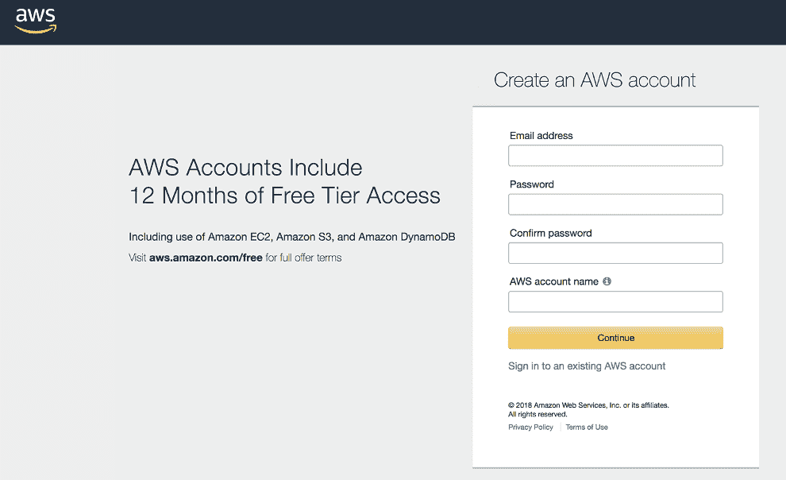

图 A.1 创建 AWS 账户：注册页面

下一步，如图 A.2 所示，是添加您的联系信息。填写所有必填字段，然后继续。

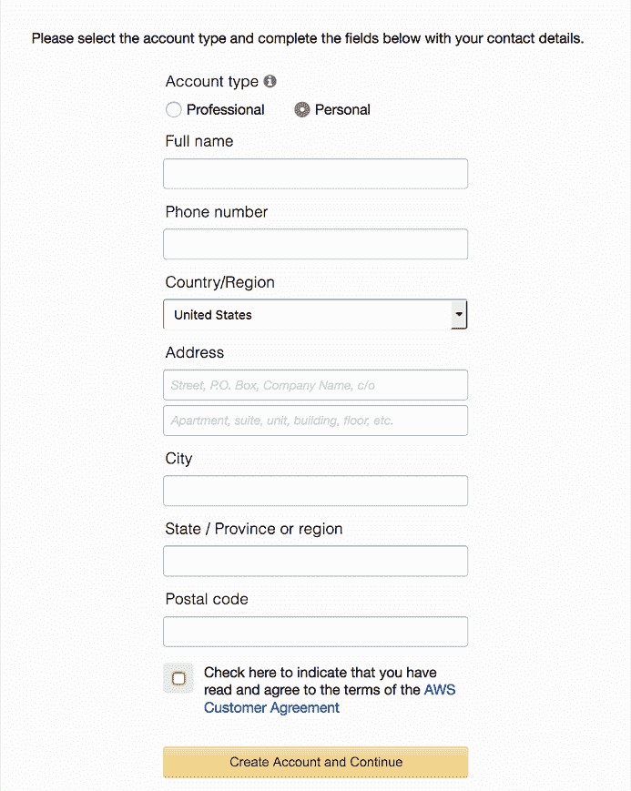

图 A.2 创建 AWS 账户：提供联系信息

### A.1.2 提供您的付款详情

接下来，如图 A.3 所示的屏幕会要求您提供付款信息。提供您的信用卡信息。如果您更方便，可以选择稍后从 USD 更改货币设置到 AUD、CAD、CHF、DKK、EUR、GBP、HKD、JPY、NOK、NZD、SEK 或 ZAR。如果您选择此选项，则月底将美元金额转换为您的当地货币。

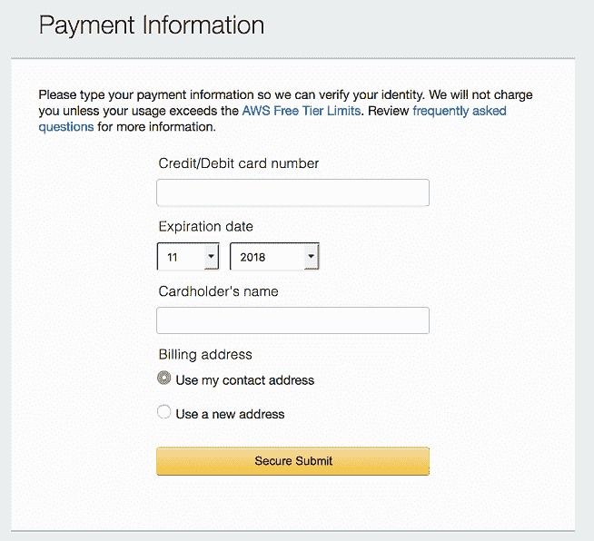

图 A.3 创建 AWS 账户：提供付款详情

### A.1.3 验证您的身份

下一步是验证您的身份。图 A.4 显示了该过程的第一个步骤。在您完成表单的第一部分后，您将收到 AWS 的电话。一个机器人声音会要求您输入 PIN 码。四位数 PIN 码在网站上显示，您必须使用电话输入它。在您的身份得到验证后，您就可以继续最后一步。

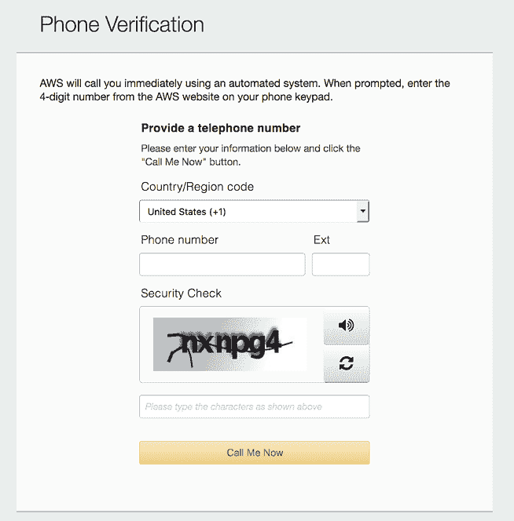

图 A.4 创建 AWS 账户：验证身份

### A.1.4 选择您的支持计划

最后一步是选择一个支持计划；见图 A.5。在这种情况下，选择免费的基本计划。如果您后来为您的业务创建 AWS 账户，我们建议选择商业支持计划。您甚至可以在以后切换支持计划。您可能需要等待几分钟，直到您的账户准备就绪。如图 A.6 所示，点击“控制台登录”，以首次登录您的 AWS 账户！

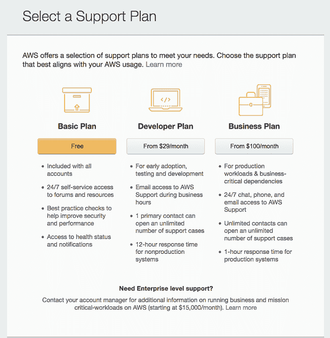

图 A.5 创建 AWS 账户：选择您的支持计划

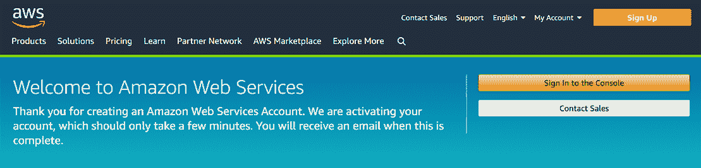

图 A.6 创建 AWS 账户：您已成功创建 AWS 账户。

## A.2 登录

您现在拥有了一个 AWS 账户，并准备好登录 AWS 管理控制台。管理控制台是一个基于 Web 的工具，您可以使用它来检查和控制 AWS 资源；它使 AWS API 的大部分功能对您可用。图 A.7 显示了[`console.aws.amazon.com`](https://console.aws.amazon.com)上的登录表单。输入您的电子邮件地址，点击“下一步”，然后输入您的密码以登录。

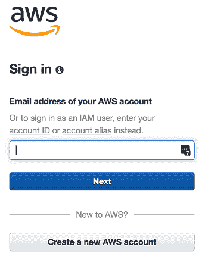

图 A.7 创建 AWS 账户：登录控制台

成功登录后，您将被转发到控制台的开始页面，如图 A.8 所示。

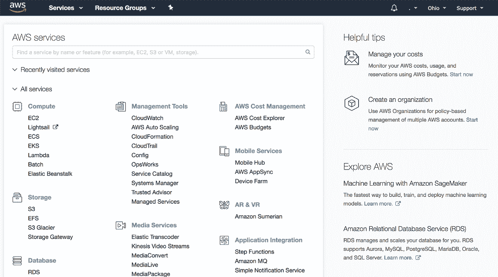

图 A.8 AWS 控制台

## A.3 最佳实践

在前面的章节中，我们已经介绍了设置 AWS 根账户。如果您打算仅为此账户进行实验，这将是足够的；然而，请注意，对于生产工作负载，不建议使用根账户。这个主题的全面讨论超出了本书的范围，但我们强烈建议您使用 AWS 账户最佳实践，例如，根据本 AWS 文章中概述的设置 IAM 用户、组和角色：[`mng.bz/nzQd`](http://mng.bz/nzQd)。我们还推荐 AWS 安全博客，作为了解 AWS 相关安全主题的绝佳资源：[`aws.amazon.com/blogs/security/`](https://aws.amazon.com/blogs/security/)。

## A.4 AWS 命令行界面

当您需要创建、编辑或检查 AWS 云资源时，您有许多选择：

+   手动，使用网络浏览器中的 AWS 控制台。

+   以编程方式，使用您选择的编程语言的 AWS SDK。许多语言都受到支持，包括 JavaScript 和 Python。

+   使用第三方工具，如 Serverless Framework。这些工具通常在底层使用 AWS SDK。

+   使用 AWS 命令行界面（CLI）。

在本书中，我们将尽可能使用 Serverless Framework。在某些情况下，我们将使用 AWS CLI 执行命令。我们的目标是避免使用 AWS 控制台。AWS 控制台对于实验和熟悉 AWS 产品来说已经足够好。它也是最易用的。然而，随着你对 AWS 的了解不断深入，了解 AWS CLI 和 SDK 确实是值得的。你应该旨在使用程序化选项，以下是一些原因：

+   您的代码（包括 CLI 命令）记录了您所做的更改。

+   您可以将代码置于版本控制之下（例如，Git）并有效地管理更改。

+   可以快速重做操作，而无需执行许多手动步骤。

+   与点对点界面常见的错误相比，人为错误的可能性较小。

让我们设置 AWS CLI，以便在需要时可以运行 CLI 命令。

安装方法将取决于您的平台。对于基于 Windows 的安装，只需下载 64 位（[`s3.amazonaws.com/aws-cli/AWSCLI64PY3.msi`](https://s3.amazonaws.com/aws-cli/AWSCLI64PY3.msi)）或 32 位（[`s3.amazonaws.com/aws-cli/AWSCLI32PY3.msi`](https://s3.amazonaws.com/aws-cli/AWSCLI32PY3.msi)）安装程序。

### A.4.1 在 Linux 上安装 AWS CLI

大多数 Linux 软件包管理器都为 AWS CLI 提供了快速安装选项。对于基于 Ubuntu 或 Debian 的系统，使用 `apt`：

```
sudo apt install awscli
```

对于使用 `yum` 的发行版，如 CentOS 和 Fedora，输入以下命令：

```
sudo yum install awscli
```

### A.4.2 在 MacOS 上安装 AWS CLI

对于使用 Homebrew 的 MacOS 用户，最简单的安装方法是使用 Homebrew：

```
brew install awscli
```

### A.4.3 在其他平台上安装 AWS CLI

如果您的系统与已描述的选项不同，您可以尝试其他方法，例如使用 `pip` 通过 Python 安装 AWS CLI。有关详细信息，请参阅 AWS CLI 安装文档（[`mng.bz/X0gE`](http://mng.bz/X0gE)）。

### A.4.4 配置本地 AWS 环境

要从本地开发系统访问 AWS 服务，我们需要创建一个 API 访问密钥对，并将其提供给我们的开发外壳。为此，首先登录到您的 AWS 账户，然后从 AWS 用户菜单中选择“我的安全凭证”，如图 A.9 所示。

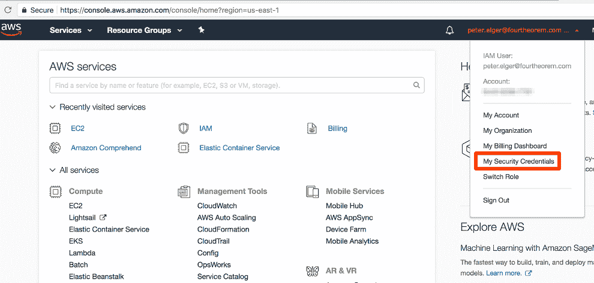

图 A.9 AWS 安全凭证菜单

接下来，从 AWS 用户列表中选择您的用户名，然后从用户摘要屏幕中选择创建访问密钥，如图 A.10 所示。

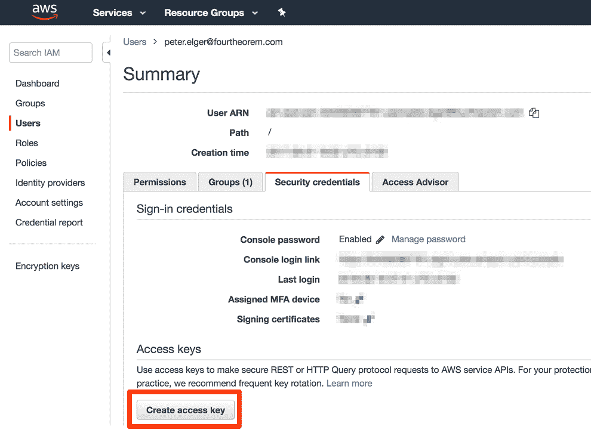

图 A.10 AWS 用户摘要屏幕

AWS 将创建一个 API 访问密钥对。要使用这些密钥，请继续下载如图 A.11 所示的 CSV 文件。

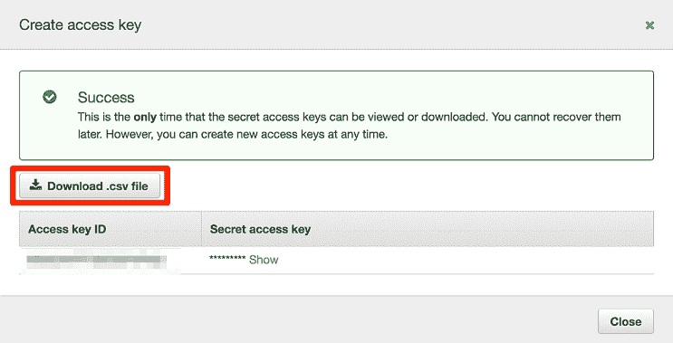

图 A.11 创建密钥对话框

将此 CSV 文件存储在安全的地方以供以后参考。CSV 文件包含两个标识符：访问密钥 ID 和秘密访问密钥。内容应类似于以下列表。

列表 A.1 AWS 凭据 CSV 文件

```
Access key ID,Secret access key
ABCDEFGHIJKLMNOPQRST,123456789abcdefghijklmnopqrstuvwxyz1234a
```

要使用这些密钥进行访问，我们需要将它们添加到我们的开发外壳中。对于类 UNIX 系统，这可以通过将环境变量添加到您的 shell 配置中来实现。例如，Bash 外壳用户可以将这些添加到他们的`.bash_profile`文件中，如下一个列表所示。

列表 A.2 `bash_profile`中用于 AWS 凭证的条目

```
export AWS_ACCOUNT_ID=<your aws account ID>
export AWS_ACCESS_KEY_ID=<your access key ID>
export AWS_SECRET_ACCESS_KEY=<your secret access key>
export AWS_DEFAULT_REGION=eu-west-1
export AWS_REGION=eu-west-1
```

注意：我们已经设置了`AWS_REGION`和`AWS_DEFAULT_REGION`环境变量。这是由于 JavaScript SDK 和 CLI 之间不幸的不匹配造成的。AWS CLI 使用`AWS_DEFAULT_REGION`，而 SDK 使用`AWS_REGION`。我们预计这将在未来的版本中得到修正，但到目前为止，简单的修复方法是设置这两个变量到相同的区域。

Windows 用户需要在控制面板的系统配置对话框中设置这些环境变量。请注意，为了使这些环境变量生效，您需要重新启动您的开发外壳。

管理您的密钥

有多种其他方法可以通过使用配置文件来配置 AWS API 访问。为了方便，我们已使用环境变量进行本地开发。

在管理访问密钥时，您应该谨慎行事，以确保它们不会意外泄露。例如，将访问密钥添加到公共 Git 仓库是一个非常糟糕的想法！

注意，我们建议仅在*本地开发环境中*使用环境变量来存储 AWS API 密钥。我们不推荐您在生产环境中这样做。有服务可以帮助管理密钥，例如 AWS 密钥管理服务（KMS）。这个主题的全面讨论超出了本书的范围。

### A.4.5 检查设置

为了确认设置良好，请运行以下命令：

```
$ aws --version
$ aws s3 ls s3://
```

这两个都应该无错误地完成。如果情况不是这样，那么请回顾本附录中所有前面的步骤。
