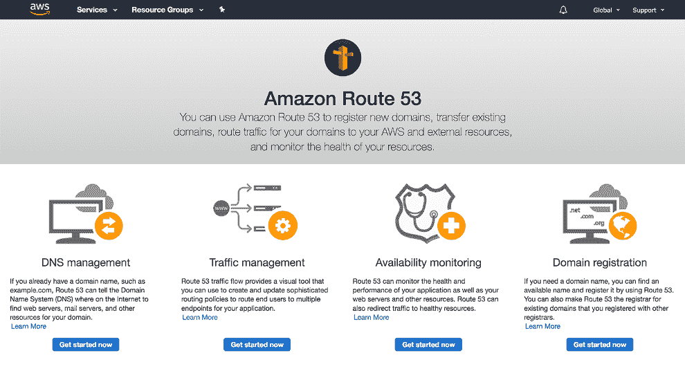
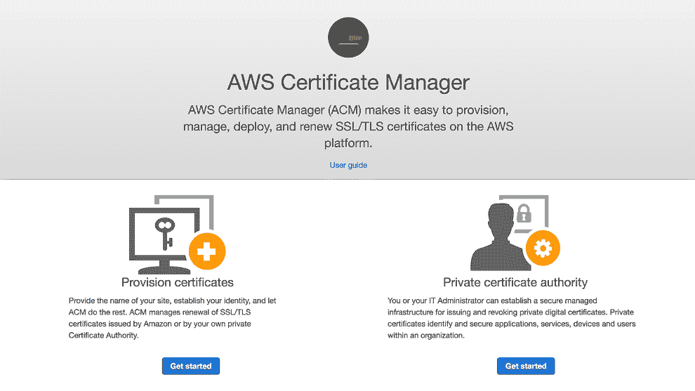
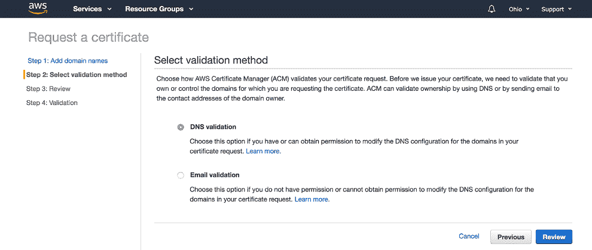
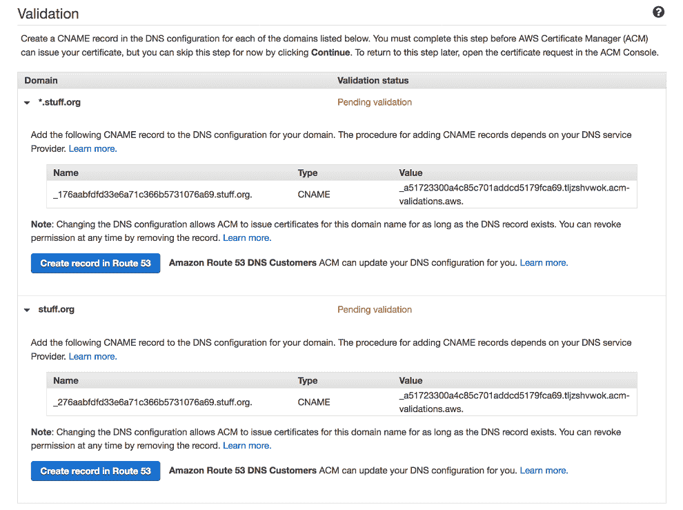
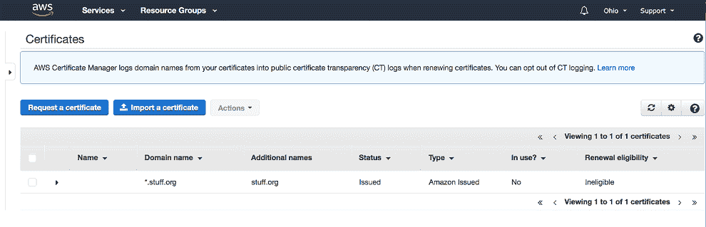

# 附录 D. 设置 DNS 域和证书

本书介绍的一些系统需要通过 AWS 管理控制台进行常见的 AWS 设置，而不是通过编程方式。这是因为需要一些手动验证。请在运行示例系统之前确保你已经完成了以下设置。

## D.1 设置域名

当你为 AWS 资源如 S3 存储桶和 API 网关创建动态 HTTP 端点时，AWS 将为这些端点生成一个 URL。当你不是在构建生产应用程序时，可以使用这些生成的名称。然而，这很快就会变得令人沮丧。每次你移除和销毁这些资源时，URL 可能会改变。它们也很长，难以记住。为了避免这些问题，我们将注册一个域名。通过使用 AWS 中的 Route 53 服务，这个过程变得简单。如果你已经有一个域名并希望使用它，或者你希望使用已注册域名的子域名，请查阅 Route 53 文档（[`mng.bz/Mox8`](http://mng.bz/Mox8)）。

### D.1.1 注册域名

我们将使用 Route 53 从头开始介绍注册新域名的流程。

如果你在这个 AWS 账户上还没有任何与域名相关的资源，点击主 AWS 控制台网络部分中的 Route 53 链接（假设所有服务控制已展开）将带你到一个介绍屏幕。如果你已经创建了资源，你将被发送到 Route 53 仪表板。

图 D.1 显示了 Amazon Route 53 介绍页面，展示了该服务的四个不同元素

图 D.1 显示了 Route 53 介绍页面。正如你所见，Route 53 是为了提供四个不同但紧密相关的服务而构建的：*域名注册*（Amazon 是一个域名注册商）；*DNS 管理*，这是你用来将流量引导到你的域的工具；*流量管理*，用于处理流量重定向；以及*可用性监控*，用于确认你的目标资源正在按预期运行。我们只关注域名注册和 DNS 管理。

点击域名注册下方的“立即开始”按钮，然后点击注册域名。输入名称的主要部分--例如，如果您想注册*acme-corporation.com*，则输入*acme-corporation*。一个下拉菜单显示包括.com、.org、.net 等在内的域名，以及它们的年度注册费用。选择一个，然后点击检查。Route 53 将在网上搜索记录，查看该组合是否目前可用。当您找到一个符合您需求的域名时，将其添加到购物车，并完成结账流程以提交第一年的注册费用。域名注册通常每年花费 10 到 15 美元的美元，并且不包括免费层使用。在短时间内，您的新域名将出现在 Route 53 仪表板中。在您的域名注册完成之前可能需要一段时间。到那时，您就可以继续配置您的域名，并使用它来为您的全新开发的 Serverless AI 应用程序服务了！

注意 并没有强制您必须使用 Route 53 进行域名注册。实际上，您可能会发现其他提供商提供更便宜的替代方案。即使是通过其他公司注册的域名，您也可以使用 Route 53 的其他功能。

### D.1.2 配置您的托管区域

您的域名现在已注册，但您还没有告诉它如何处理传入的请求。Route 53 将自动为您注册的域名创建一个*托管区域*。在控制台的网络部分点击托管区域，然后点击新托管区域的链接。您将发现自己在一个带有两个预先创建的记录集的页面：

+   *授权开始（SOA）*--标识您域的基本 DNS 配置信息。

+   *NS*--列出可以查询您的域名主机的权威性名称服务器。这些是提供域名翻译请求答案的公共服务。

注意 *记录集*--一组数据记录，定义了域行为的特定方面。

不要随意更改这两个记录集。仅凭它们本身不足以使您的新域名完全可用。稍后，我们将使用 Serverless Framework 自动添加一个新的记录，告诉任何使用您的域名服务器（通过将他们的浏览器指向您的域名）请求我们应用程序使用的 IP 地址。

## D.2 设置证书

网络安全是一个广泛的话题，远远超出了本书的范围。我们仍然想要确保我们为所有网络流量使用 HTTPS。使用纯 HTTP 的日子已经一去不复返了，尽早考虑安全最佳实践是明智的。为了便于管理证书的生成和更新，我们将使用 AWS 证书管理器。

### D.2.1 预配新证书

在 AWS 控制台中，在网络部分点击证书管理器的链接。这将带您到证书管理器仪表板，如图 D.2 所示。

图 D.2 证书管理器介绍页面

在“提供证书”部分下选择“开始”，并选择“请求公共证书”选项。如图 D.3 所示的“请求证书”页面允许我们指定证书的域名。我们将请求一个通配符证书，用于我们注册域名的所有子域名。例如，如果我们注册了 `stuff.org`，通配符证书将保护 `api.stuff.org` 和 `www.stuff.org`。

添加 `*.stuff.org`（通配符域名）和 `stuff.org`。然后，点击下一步以选择验证方法。这将显示类似于图 D.3 的页面。

AWS 控制台将要求验证您已添加的域名，以确保您是所有者，如图 D.4 所示。

图 D.3 选择要使用证书保护的域名

图 D.4 选择您的证书验证方法

选择 DNS 验证并确认此选择。由于我们在 Route 53 中注册了域名，我们有自动在托管区域中创建特殊验证 DNS 条目的选项。展开如图 D.5 所示的每个域的章节。

图 D.5 使用 Route 53 创建验证 DNS 记录

在 Route 53 中点击创建记录。在选择继续之前，为每个域名确认此步骤。

您可能需要等待长达 30 分钟，直到您的域名验证完成并且证书配置完成。一旦完成，证书管理器将显示您的证书状态为 *已验证*，如图 D.6 所示。

图 D.6 在 AWS 控制台的证书管理部分显示的已验证证书

这是非常棒的工作！您已注册了一个域名，并创建了一个相关的 SSL/TLS 证书以确保流量加密。您将稍后使用此域名来访问您新部署的应用程序。
