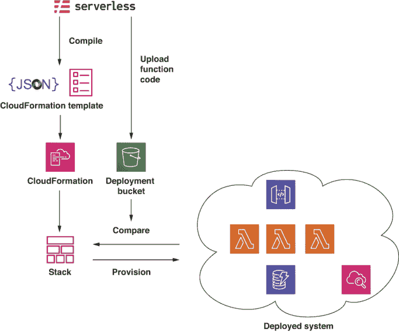
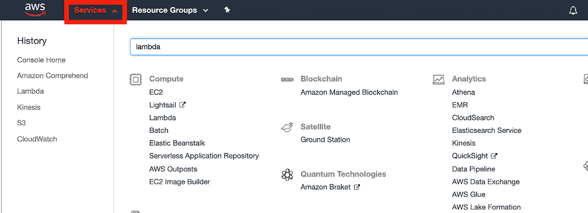
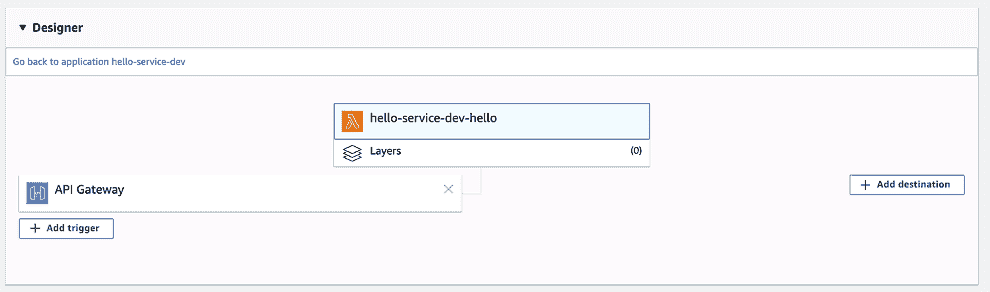
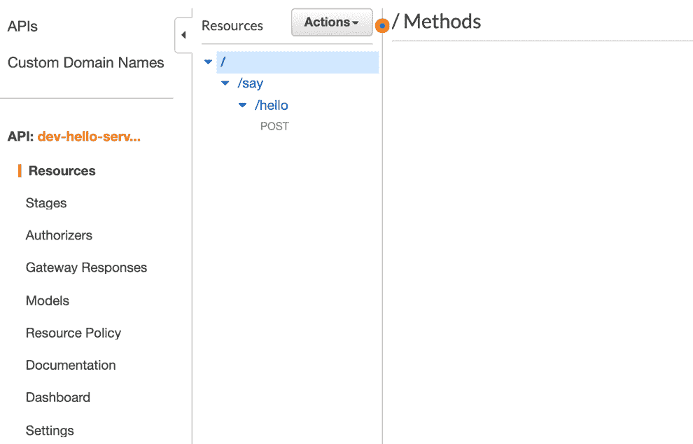
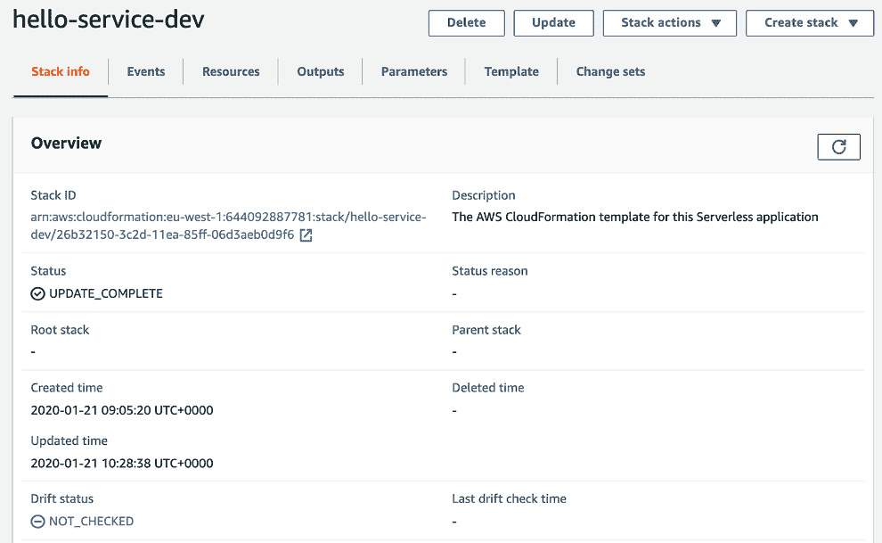

# 附录 E. Serverless Framework 内部机制

在本附录中，我们将更详细地探讨 AWS 上的无服务器技术，特别是 Serverless Framework，它是本书中许多示例系统所使用的框架。

如第一章所述，术语 *serverless* 并非指没有服务器的系统；它的意思是我们可以构建不需要关注底层服务器基础设施的系统。通过使用无服务器技术，我们能够提升抽象层次，更多地关注应用程序逻辑，而不是技术上的“重活”。

无服务器架构的一个关键概念是基础设施即代码（IaC）。IaC 允许我们将系统的整个基础设施视为源代码。这意味着我们可以将其存储在版本控制系统（如 Git）中，并对其创建和维护应用软件开发的最佳实践。

所有主要的云服务提供商都支持某种基础设施即代码（IaC）机制。在 AWS 上，支持 IaC 的服务称为 CloudFormation。

CloudFormation 可以通过创建 JSON 或 YAML 格式的模板文件进行配置。虽然可以直接使用文本编辑器编写模板，但随着系统规模的扩大，模板可能会变得难以管理，因为模板相当冗长。有许多工具可以帮助开发者与 CloudFormation 一起工作，例如 SAM、AWS CDK 和 Serverless Framework。还有其他一些工具，如 HashiCorp 的 Terraform，它们针对多个云服务，这里不会进行介绍。

虽然 Serverless Framework 可以用于部署任何 AWS 资源，但它主要面向管理和部署无服务器 Web 应用程序。通常这意味着 API Gateway、Lambda 函数以及像 DynamoDB 表这样的数据库资源。Serverless 配置文件可以被视为一种轻量级的领域特定语言（DSL），用于描述这些类型的应用程序。

图 E.1 展示了 Serverless Framework 如何与 CloudFormation 协作。



图 E.1 CloudFormation 工作流程

在部署时，Serverless 配置文件（serverless.yml）被“编译”成 CloudFormation 模板。创建一个部署存储桶，并将定义的每个 Lambda 函数的代码工件上传。为每个 Lambda 函数计算哈希值并将其包含在模板中。然后 Serverless 调用 CloudFormation 的 `UpdateStack` 方法，将部署工作委托给 CloudFormation。CloudFormation 然后继续查询现有基础设施。如果发现差异（例如，如果定义了新的 API Gateway 路由），CloudFormation 将进行必要的基础设施更新，以使部署与新的编译模板保持一致。

## E.1 演示

让我们通过一个简单的 Serverless 配置文件详细说明部署过程。首先创建一个名为 `hello` 的新空目录。`cd` 到这个目录并创建一个文件 `serverless.yml`。将下一列表中显示的代码添加到该文件中。

列表 E.1 简单的 `serverless.yml`

```
service: hello-service

provider:
  name: aws
  runtime: nodejs10.x
  stage: dev
  region: eu-west-1

functions:
  hello:
    handler: handler.hello
    events:
      - http:
          path: say/hello
          method: get
```

接下来，在同一个目录中创建一个名为 `handler.js` 的文件，并将下一列表中的代码添加到其中。

列表 E.2 简单的处理程序函数

```
'use strict'

module.exports.hello = async event => {
  return {
    statusCode: 200,
    body: JSON.stringify({
      message: 'Hello!',
      input: event
    },
    null, 2)
  }
}
```

现在，让我们将此处理程序部署到 AWS。在部署之前，你需要设置一个 AWS 账户并配置你的命令行。如果你还没有这样做，请参阅附录 A，其中介绍了设置过程。

要部署此简单应用程序，请运行

```
$ serverless deploy
```

让我们看看在部署过程中创建的组件。在部署此应用程序时，框架在应用程序目录中创建了一个名为 `.serverless` 的本地工作目录。如果你查看这个目录，你应该会看到下一列表中列出的文件。

列表 E.3 Serverless 工作目录

```
cloudformation-template-create-stack.json
cloudformation-template-update-stack.json
hello-service.zip
serverless-state.json
```

这些文件具有以下用途：

+   如果尚未存在，`cloudformation-template-create-stack.json` 用于创建用于代码组件的 S3 部署存储桶。

+   `cloudformation-template-update-stack.json` 包含用于部署的编译后的 CloudFormation 模板。

+   `hello-service.zip` 包含我们 Lambda 函数的代码包。

+   `serverless-state.json` 存储当前已部署状态的本地副本。

登录 AWS 网络控制台以查看框架实际部署了什么。首先转到 `S3` 并搜索包含字符串 `'hello'` 的存储桶；你应该会找到一个名为类似 `hello-service-dev-serverlessdeploymentbucket-zpeochtywl7m` 的存储桶。这是框架用于将代码推送到 AWS 的部署存储桶。如果你查看这个存储桶，你会看到类似于以下列表的结构。

列表 E.4 Serverless 部署存储桶

```
serverless
  hello-service
    dev
      <timestamp>
        compiled-cloudformation-template.json
        hello-service.zip
```

`<timestamp>` 被替换为你运行部署的时间。随着对服务的更新，框架会将更新的模板和代码推送到此存储桶以进行部署。

接下来，使用 AWS 控制台导航到 API Gateway 和 Lambda 网络控制台。点击右上角的“服务”链接，然后搜索`lambda`和`api gateway`，如图 E.2 所示。



图 E.2 在 AWS 网络控制台中搜索服务。

在 Lambda 和 Api Gateway 控制台中，你会看到服务的已部署实例，如图 E.3 和 E.4 所示。



图 E.3 已部署的 Lambda 函数



图 E.4 已部署的 API Gateway

最后，如果你打开 CloudFormation 网络控制台，你会看到服务的已部署模板。这应该看起来与图 E.5 类似。

理解框架的部署流程有助于在出现问题时进行问题诊断。关键是要记住，`serverless deploy` 将部署委托给 CloudFormation 的 `UpdateStack`，并且如果出现问题，我们可以使用 AWS 控制台查看堆栈更新历史和当前状态。



图 E.5 已部署的 CloudFormation 堆栈

## E.2 清理

一旦完成示例堆栈，请确保通过运行

```
$ serverless remove
```

确保框架已移除此处描述的所有相关工件。
