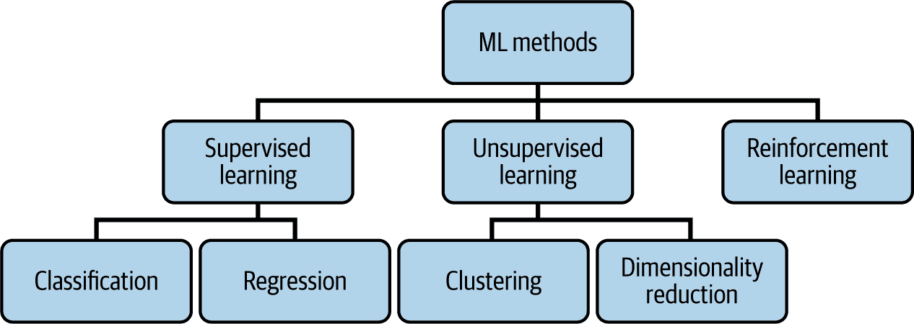
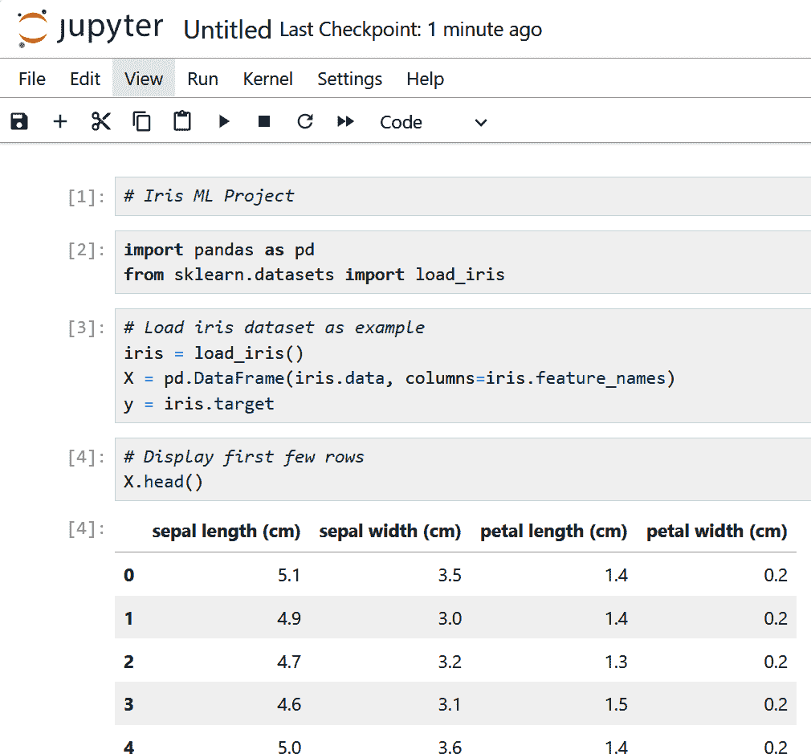
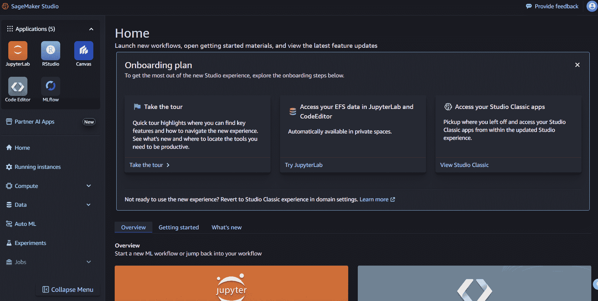

# 第三章\. 人工智能与机器学习

人工智能不是一个新领域；其起源可以追溯到几十年前。在 1940 年代，像沃伦·麦克洛奇和沃尔特·皮茨这样的研究人员为神经网络开发了基础概念。这随后是数学家艾伦·图灵的先驱工作，他在 1950 年发表了论文“计算机与智能”。在论文中，他介绍了图灵测试，这是一种评估机器展现与人类智能相当或无法区分的行为的方法。

术语“人工智能”是在 1956 年由计算机科学家约翰·麦卡锡为达特茅斯学院的会议提出的。这次会议聚集了像马文·明斯基和克劳德·香农这样的杰出人物。两位与会者，艾伦·纽厄尔和赫伯特·A·西蒙，展示了逻辑理论家，这是一个能够解决数学定理的人工智能程序。尽管今天的 AI 发展更为先进，但这些早期先驱确立的基本概念仍然是关键的建筑块。

毫无疑问，今天的 AI 发展远远领先于这些早期应用。然而，一些其基本原理已经研究了多年。它们是关键的建筑块。

在本章中，我们将重点关注基础知识，这是 AIF-C01 考试的重要组成部分。这包括关注人工智能的核心主题——即机器学习。

# 理解人工智能

人工智能可能看起来令人难以置信。这部分原因是技术的复杂性。毕竟，它通常涉及高级数学、复杂的算法和大量数据。

同时，人工智能正在经历重大的变革和创新。即使对于世界顶级数据科学家来说，跟上所有这些也非常困难。

然后是炒作，因为似乎每家科技公司都在谈论人工智能。甚至许多传统公司也吹嘘他们自己的人工智能。

考虑到所有这些，人们普遍对人工智能存在误解并不奇怪。这甚至包括其定义！

但当然，当涉及到 AIF-C01 考试时，你需要有一个很好的理解。怎么办？最好的办法是看看 [AWS 如何定义人工智能](https://oreil.ly/vniGg)：

> 人工智能，也称为人工智能，是一种具有类似人类问题解决能力的技术。人工智能的应用似乎模拟了人类智能——它可以识别图像、写诗，并基于数据进行预测。

这当然是一个很好的、高层次的定义。然而，我们需要更深入地挖掘。而一个很好的方法是获取人工智能的视觉图像，如图 3-1 所示图。

###### 图 3-1\. 人工智能的各个组成部分

在很大程度上，人工智能是一系列不同的方法和领域。在某些情况下，它们可以独立工作。在其他情况下，则存在组合。

人工智能的一个子集是机器学习，这是计算机从数据中学习的地方。机器学习算法在数据中找到模式，并以此作为预测的基础。一般来说，数据越多越好——尤其是如果它是高质量的话。机器学习的常见用例包括欺诈检测、预测分析和推荐引擎。

接下来，机器学习的一个子集是*深度学习*。这是一种使用神经网络的机器学习类型。这些网络本质上是以人类大脑为模型构建的。数据处理基于分析跨层和连接的数据。这通常可以检测到复杂的模式和关系。在某些情况下，它们可以做到人类无法做到的事情。得益于深度学习，我们在语音处理、自然语言处理和图像识别等领域取得了进步。

深度学习的一个子集是生成式 AI。这是人工智能的前沿。它是 OpenAI 的 ChatGPT 和 Anthropic 的 Claude 等突破性应用背后的动力。

生成式 AI 模型也会处理数据，但规模通常很大。有了这个，它可以创建新的内容，如文本、软件代码、图像、音频和视频。它常常看起来像人类。

尽管生成式 AI 很强大，但它并不是万能的。有时根据用例和需求，使用机器学习或深度学习会更好。了解这些内容对于本书很重要。

# 机器学习

在 20 世纪 50 年代和 60 年代，亚瑟·萨缪尔是 IBM 的一名著名计算机科学家和研究员。他创造了第一个开创性的 AI 应用，这个应用学会了如何下国际象棋。他还提出了*机器学习*这一概念，他将它[定义为](https://oreil.ly/l32nO)“一个研究领域，它赋予计算机在没有明确编程的情况下学习的能力。”

为了理解这一点，让我们通过一个例子来了解一下。假设你在一个房地产代理机构工作，你想预测表 3-1 中房屋 5 的销售价格。你知道有很多因素会影响定价：位置、房屋大小、卧室数量以及它离好学校的远近。与其试图创建一个长长的规则列表来计算价格，你不如使用机器学习来处理这项繁重的工作。

表 3-1. 房屋价值示例

| 房屋 | 位置 | 面积（平方英尺） | 卧室数量 | 价格 |
| --- | --- | --- | --- | --- |
| 1 | 一级 | 500 | 1 | $500,000 |
| 2 | 二级 | 500 | 1 | $350,000 |
| 3 | 二级 | 1,000 | 2 | $700,000 |
| 4 | 二级 | 1,500 | 3 | $1,500,000 |
| 5 | 一级 | 1,000 | 2 | 待预测 |

这里是如何工作的：你收集一大堆关于房屋的数据——可能包括数千条记录，包括它们的特征和实际销售价格。然后，你将所有这些数据输入到机器学习算法中。它分析数据并学习模式。例如，它可能理解某个地区的房屋价值更高，或者每个额外的卧室都会增加特定的价格。

一旦算法被训练，它就准备好进行预测。即使它以前从未见过房子 5，该模型也可以根据从先前数据中学到的知识来估计其价格。

这就是机器学习的美丽之处。它让计算机从数据中学习并随着时间的推移而改进，而不是依赖于硬编码的规则。

# Amazon SageMaker

在本章中，我们将探讨 Amazon SageMaker，这是一个适用于在 AWS 上使用机器学习的任何人的平台。SageMaker 功能强大，但由于工具和功能众多，一开始可能会感到不知所措。这就是为什么我们将从高级概述开始，以便更容易理解组件。

Amazon SageMaker 是一项全面管理的服务，可帮助您大规模地构建、训练和部署机器学习模型。您无需担心设置基础设施，可以专注于最重要的事情——开发和改进您的模型。

SageMaker 支持整个机器学习生命周期，从准备数据到监控已部署的模型。它还与其他 AWS 服务（如 Amazon S3、Amazon Redshift 和 Kinesis）无缝集成。

图 3-2 显示了构成 SageMaker 生态系统的关键组件。

###### 图 3-2\. SageMaker 的关键组件

让我们看看每个组件（我们将在本章中更详细地介绍这些内容）：

SageMaker Studio Classic

一个基于 Web 的开发环境，您可以在一个地方管理机器学习工作流程的每个步骤。它支持团队协作和自动化。

笔记本实例

管理 Jupyter 笔记本，用于编写代码、运行实验和可视化结果——无需设置。

快速启动

一个预训练模型和内置算法库，帮助您快速入门或针对特定用例微调模型。

数据整理器

一个用于清理、转换和探索数据的工具。它连接超过 50 个数据源，使预处理更快、更简单。

模型监控器

关注已部署的模型，自动检测数据漂移或性能下降等问题。

MLOps 工具

包括管理机器学习工作流程的服务，具有自动化、治理和版本控制功能。

SageMaker 旨在提供灵活性和可扩展性。同时，它还拥有强大的安全、合规性和访问控制系统。

# 机器学习生命周期

机器学习生命周期是一种描述构建人工智能系统过程的术语。没有一种正确的方法来做这件事，因为存在各种方法和风味。但 AWS 确实提供自己的流程，包括以下步骤：

+   商业目标识别

+   机器学习问题界定

+   数据处理

+   模型开发

+   模型部署

+   监控

让我们逐一分析这些步骤。

## 商业目标识别

机器学习生命周期中的第一步是回答一个简单的问题：项目的目标是什么？通常，这是高级领导和经理们敲定关键细节并做出最终决定的时候。他们有权力和预算来实现这些事情。当涉及到人工智能时，这些项目可能非常昂贵。它们通常也被认为对公司具有战略意义。

计划可能不一定很详细。例如，它可能是一个包含 5 到 10 张幻灯片的 PowerPoint 演示文稿。然而，目标应该是清晰的。一种表达方式是使用关键绩效指标（KPI），这些是衡量机器学习项目是否达到目标的标准。

例如，假设你在一家传统零售公司工作。在过去的一年里，客户流失问题一直存在。然而，你相信人工智能可以帮助解决这个问题。你与高级管理人员合作，同时也包括组织内的领域专家，例如来自客户成功部门的专家。通过所有这些，你和团队提出了在明年将客户流失率降低 15%的 KPI，并预留了 20 万美元的预算用于构建和部署机器学习模型。

这并不是说这个 KPI 是固定不变的。由于人工智能的复杂性，它可能需要调整。这对于没有太多或没有人工智能项目经验的组织尤其如此。无论如何，设定具体的 KPI 对于指导项目并提供问责制非常重要。

## 机器学习问题界定

在确定业务目标后，下一步是将这些目标转化为机器学习可以处理的内容。这被称为机器学习*问题界定*。

这个过程阶段涉及一个技术专家团队，例如数据科学家、数据工程师和机器学习架构师。还有主题领域专家（SMEs），他们对组织或特定行业的某个流程有深入的理解或专业知识。

这个团队采取开放心态非常重要。事实上，机器学习可能不是正确的解决方案——或者任何其他人工智能技术。相反，一个问题可能可以通过使用传统数据分析或流程自动化来解决。

然而，如果机器学习是正确的选择，那么需要对以下重要因素进行评估：

+   对于机器学习模型，是否有质量数据？

+   组织是否拥有实现项目成功的所需技能？

+   是否有足够的资源？

例如，假设一家医疗保健公司希望预测患者再入院率以改善护理和降低成本。业务问题是明确的：减少再入院次数可以带来更好的结果和更低的费用。在机器学习问题界定过程中，团队决定可以将这个问题表述为一个分类问题。目标是预测患者是否可能在出院后 30 天内再次入院。

然而，识别出机器学习可能不是正确解决方案的情况同样重要。例如，如果任务可以通过简单的基于规则的系统解决——比如从体重和身高计算患者的 BMI——那么机器学习引入了不必要的复杂性。在这种情况下，传统的编程更快、更便宜，且更容易维护。同样，当需要完全透明和可解释性时，机器学习可能不适用。在监管严格的领域，如医疗保健或金融，影响患者资格或贷款批准的决定可能需要清晰的、可审计的逻辑路径——这是许多机器学习模型，尤其是深度学习模型，难以提供的。在开始模型开发之前，团队应该问自己：规则引擎可以处理这个问题吗？我们能否自信地向用户或审计员解释输出结果？如果答案是“不”，那么机器学习可能不是完成这项工作的正确工具。

之后，团队将评估数据需求。在这种情况下，可能需要历史患者记录、出院总结和人口统计细节。这些数据是否可用？如果可用，团队是否有权使用这些数据？

同时，需要关注组建团队以执行项目。然而，可能没有足够的员工。在这种情况下，需要对招聘人员或聘请承包商所需的时间和成本进行现实分析。这需要多长时间？成本是多少？

这个过程可能需要一些时间，但这是值得的。它可以大大降低机器学习项目失败的可能性。

## 数据处理

数据处理是将数据转换为可用格式的过程。这包括以下主要步骤：

+   数据收集和整合

+   数据预处理

+   特征工程，这是一个选择、创建或修改输入变量（特征）的过程，通过使数据更具意义和预测性来提高模型性能。

+   数据可视化

我们将在接下来的几节中介绍这些步骤。

### 数据收集和整合

在收集和整合机器学习项目所需的数据时，您希望将其集中在一个地方。这有助于简化流程，提供更多的一致性、准确性和速度。

使用 AWS，您可以使用不同类型的数据存储，如 Amazon S3 和 Amazon EBS，这些我们在第二章中已经介绍过。对于更复杂的工作负载，您可以使用数据仓库。这些可以存储来自许多来源的大量结构化数据。Amazon Redshift 具有这种能力。

或者您可以使用湖仓。这是一种现代存储架构，可以存储任何类型的数据。Amazon SageMaker Lakehouse 通过整合 Amazon S3 数据湖和 Amazon Redshift 数据仓库来体现这一点。这允许访问和管理多种数据类型。

然后是 Kinesis。它被设计来处理大量实时数据处理。虽然 Kinesis 不是一个湖屋，但它可以无缝集成到湖屋架构中。

无论这些存储选项如何，事实仍然是并非所有数据都是平等的。简单来说，如果你的数据质量低，机器学习模型的结果可能会不尽如人意。这遵循着著名的经验法则：垃圾进，垃圾出。这就是为什么选择数据源时必须深思熟虑。以下是一些需要提出的问题：

+   数据是否与要解决的问题相关？

+   数据是否准确？

+   它是否多样化？它是否代表了现实世界？

+   模型是否有足够的数据？

+   数据是否是最新的？

重要的是要知道数据主要分为两大类：

标记数据

这是数据有描述的地方。例如，在垃圾邮件过滤器中，电子邮件被标记为“垃圾邮件”或“非垃圾邮件”。这些标签通常来自人工输入。

未标记数据

这是原始数据。

数据也有两种格式：

结构化数据

这是组织良好的数据。最常见的形式是电子表格或数据库中的行和列（也称为*表格数据*）。这种类型的数据对于机器学习项目肯定很有用。但结构化数据也可以表示为时间序列数据。这是随着时间的推移收集的数据，例如股价或天气信息。

非结构化数据

这类数据没有预定义的格式。例如，包括文本、图像、音频和视频。为了理解它，你需要更高级的 AI 技术来揭示模式和见解。

### 数据预处理、特征工程和数据可视化

数据是杂乱的。缺失值、异常值、错误和不一致性很常见。为了处理这些问题，有数据预处理或数据准备。但有一个问题——这个过程可能既耗时又昂贵。根据 Anaconda 的调查，数据科学家大约花费 45%的时间在这些任务上。

即使数据已经被清理，还有更多的工作要做。下一步是特征工程。这是数据科学家确定数据有意义方面的地方。重点是找到那些对准确预测影响最大的值。

为了帮助解决这个问题，有数据可视化。数据科学家将尝试通过使用散点图、直方图和箱线图来更好地理解数据集。这被称为探索性数据分析（EDA）。

数据预处理、特征工程和数据可视化可能很费时。但使用 SageMaker，您可以使用 Data Wrangler 来简化流程。它提供了对所有 AWS 数据源的访问，但也与 50 多个第三方数据提供商（如 Snowflake 和 Databricks）进行了集成。接下来，Data Wrangler 验证数据质量并检测异常。这是通过 300 多个内置转换来完成的。这意味着不需要学习像 PySpark 或 Apache Spark 这样的工具。Data Wrangler 还提供可视化模板和报告。使用传统方法可能需要几周的时间，而使用 Data Wrangler 可能只需几分钟。

## 模型开发

模型开发有三个主要步骤，我们将在以下章节中介绍：

+   训练

+   评估

+   调优

### 训练

训练涉及教会模型学习模式和做出预测。这是基于在数据集上使用机器学习算法。这个过程是迭代的，因为它将需要调整模型参数以改进模型的预测。有三种类型的算法：

+   监督学习

+   无监督学习

+   强化学习

评估这些类型的模型需要数据科学方面的专业知识。对于某些用例，有一些经验法则。我们将在本书的下一几个章节中探讨这些内容。但在做这件事之前，重要的是将数据集分成三个部分：

训练数据（数据集的 70%至 80%）

这是在这里您使用数据与机器学习算法来教会它理解模式和做出预测的地方。

验证数据（10%至 15%）

这是为了调整数据以获得更好的性能。

测试数据（10%至 15%）

在这里，模型基于未见过的数据进行评估。这有助于提供一种感觉，了解它可能如何与实际应用相结合。

#### 监督学习

在监督学习中，模型使用标记数据来学习。基本上，标签充当指南，帮助模型理解输入与其匹配输出的关系。将其想象成一个老师监督学生——这就是“监督学习”这个名字的由来。例如，假设有一个包含大量水果图像的数据集，每个图像都被标记为苹果、香蕉或橙子。在训练这些数据后，模型可以正确识别一张新的、未标记的香蕉图像。

监督学习可以分为两个主要任务：分类和回归。

***分类。*** 分类是将数据分类到预定义类别的过程。模型从标记数据中学习模式，以便对新的例子进行分类。一个例子是信用风险评估。分类模型可以分析贷款申请人的信用记录、收入和债务，以确定他们是否属于“低风险”或“高风险”类别。这有助于金融机构做出更明智的贷款决策。

其他分类的例子包括以下内容：

+   欺诈检测

+   客户流失预测

+   图像识别

+   医学诊断

+   情感分析

+   邮件过滤

**回归**。回归是指预测连续值而不是类别。它通过观察变量之间的关系来进行预测。以下是一些用例示例：

+   预测销售数量

+   估计股市趋势

+   预测人口增长

+   计算预期寿命

让我们用一个例子更详细地看看。假设你正在构建一个机器学习模型来预测建筑的每小时能耗。在特征工程阶段，你确定自变量。这些是算法中不受其他值影响的值。在我们的例子中，我们提出了以下内容：

+   室外温度

+   湿度水平

+   白天时间

+   星期几

+   占用率

+   历史能耗数据

然后我们有因变量。这是我们机器学习模型中预测的值，即能耗或千瓦时（kWh）。

存在着不同类型的回归算法，如线性回归、随机森林回归或支持向量回归（SVR）。那么应该使用哪一种呢？评估可能是一个复杂的过程。你需要了解算法的复杂性。但一般来说，当涉及到回归模型时，它关乎理解自变量和因变量之间的关系。在我们的例子中，线性回归模型可能不是一个好的选择。原因是它假设输入特征和目标变量之间存在线性关系，这可能无法捕捉到建筑能耗数据中常见的复杂、非线性模式。相反，随机森林回归和支持向量回归更适合模拟这种复杂性。

#### 无监督学习

无监督学习是在未标记的数据集上训练模型。算法将分析数据的结构，例如寻找潜在的模式、分组和关系。这是在没有先验指导的情况下完成的。

无监督学习有两种主要方法：

+   聚类

+   维度约简

**聚类**。聚类根据相似性对数据进行分组。这通常是通过使用测量技术来完成的。两个点越接近，它们就越相似。以下是常见的这种方法：

欧几里得距离

这衡量了两个点之间的直线距离。这是在多维空间中完成的。这指的是超出典型长度、宽度和高度三个维度的区域。

余弦相似度

这衡量了两个点之间的角度（余弦值）。如果两者方向相同，则它们是相似的。

曼哈顿距离

这是两个点之间绝对差值的总和。是的，它基于出租车在城市网格中导航的方式。

至于聚类算法，最流行的一种是*k*均值聚类。它通常使用欧几里得距离来聚类最近的数据点。例如，一家零售公司可以使用*k*均值聚类根据消费金额、产品偏好或购买频率来分组客户。这可以用于更个性化的营销，比如通过相关产品选择和折扣。

另一种用于聚类的算法是基于密度的空间聚类应用噪声（DBSCAN），它通常使用欧几里得或曼哈顿测量。一个常见的例子是欺诈检测。通过使用 DBSCAN，可以检测到异常值，这可能会表明欺诈行为。它可能会发现，通常交易额在 100 到 200 美元之间，只有少数超过 10000 美元。

亚马逊的随机切割森林（RCF）算法特别有效于识别金融交易数据中的异常值。与将相似数据点分组的聚类算法不同，RCF 通过为每个数据点分配一个基于其如何容易隔离的异常分数来检测异常。例如，在一个大多数交易额在 100 到 200 美元之间的数据集中，一次意外的 10000 美元交易可能会得到一个很高的异常分数，从而将其标记为需要进一步调查。

***降维。***高维数据是指数据集具有大量特征。然而，这可能会给机器学习模型带来问题。这种现象被称为“维度诅咒”。

高维数据的一个典型问题是计算成本高。这需要更多的处理能力、内存和时间来分析数据。

接下来，是过拟合的问题，即机器学习模型从训练数据中学习太多，并且对未见过的数据泛化不好。

为了理解这一点，让我们举一个例子。假设我们有一个垃圾邮件过滤器，其训练数据中“免费”一词出现频率很高。过拟合意味着模型会检测到垃圾邮件，即使这个词有多个合法用途。

为了处理这些问题，你可以使用降维。简单来说，这就是减少数据集中特征数量的过程，但变化不能对数据集产生实质性影响。

主成分分析（PCA）、t-SNE 和自动编码器是其他可以使用的算法。

#### 强化学习

你没有使用指南书或上课程来骑自行车，对吧？当然没有。相反，你观察了别人，然后自己尝试。有很多摔倒，一些擦伤膝盖和手。但最终，你能够弄明白。骑自行车很快就会变得自然。

这个过程与强化学习类似。这就是机器学习模型通过试错来学习的方式——也就是说，根据与环境的交互，存在正负强化。

强化学习已被证明在以下方面特别有效：

游戏

它们具有清晰的规则、分数和约束（如游戏板）。在这个环境中，机器学习模型可以运行数百万次模拟，这将允许学习。这对于像 AlphaGo 这样的系统至关重要，它击败了围棋的世界冠军。

机器人

由于机器人需要在现实世界中导航，强化学习可以使这些系统理解其环境。

机器学习的三种学习类型——监督学习、无监督学习和强化学习——在图 3-3 中展示。

###### 图 3-3\. 机器学习用于学习的三种主要方式

### 使用 AWS 进行模型开发

机器学习中的模型开发涉及设计、训练和改进算法的过程，以分析数据并做出预测或决策。这包括选择合适的模型、准备数据、训练模型以及评估其性能，以确保它们满足预期的目标。

使用 Amazon SageMaker，模型开发有三个主要选项：

预训练模型

有数百个预训练模型可供使用，这些模型需要很少的微调或配置。你可以使用 SageMaker JumpStart（见图 3-4）访问它们。FMs、计算机视觉模型和 NLP 模型都可用。

###### 图 3-4\. SageMaker JumpStart 仪表板中预训练模型的基础模型部分

内置算法

这些是为大型数据集和需要可扩展性和性能优化而量身定制的。

Docker 镜像

Docker 镜像适用于流行的机器学习框架，如 TensorFlow、PyTorch 和 scikit-learn。也有为你自己的模型准备的镜像。这就是你想要定制的时候。

### 评估

在模型投入生产之前，需要对性能进行广泛的评估。这里有各种指标，其中许多取决于你使用的模型类型。这些指标并非万无一失，但提供了一般性的指导。我们将查看以下指标：

+   模型拟合

+   分类

+   回归

#### 模型拟合

模型拟合指的是模型捕捉数据中模式的好坏。目标是平衡过拟合和欠拟合，以实现最佳精度。

为了减轻过拟合，你可以：

+   减少特征数量。

+   增加训练数据集的大小。

+   应用正则化技术，如 L1（lasso 回归）和 L2（ridge 回归）以简化模型。

当模型过于简单，无法捕捉数据中的潜在模式时，就会发生欠拟合。例如，如果你正在构建一个用于识别手写数字的模型并使用逻辑回归，它可能会因为手写数字具有复杂、非线性的模式而难以处理。在这种情况下，更复杂的算法，如神经网络或决策树，可能更合适。

还有其他导致欠拟合的原因。其中一个原因是数据特征不足。也可能是因为训练迭代（或 epoch）太少。

为了衡量过拟合和欠拟合，你可以使用偏差和方差，这些都是统计计算。偏差是平均预测值与实际值之间的差异。它是衡量模型基于简单假设犯错误倾向的一种方法，这意味着存在欠拟合。

另一方面，方差衡量的是预测值的波动。高方差意味着模型对训练中的微小变化很敏感，这可能表明过拟合。

再次强调，目标是找到一个平衡点——也就是说，要有一个低偏差和低方差的模型。

#### 分类

分类指标用于衡量将标签分配给数据点的机器学习模型的性能。这些指标有助于评估模型预测的准确性以及它可能出错的地方。例如，如果你正在开发一个基于医学测试结果预测患者是否患有某种疾病的模型，分类指标可以显示模型做出正确诊断的频率、错过真实案例或发出虚假警报的频率。

对于分类问题，你可以使用以下技术来评估模型：

+   混淆矩阵

+   准确率

+   精确率

+   召回率

+   曲线下面积-接收者操作特征曲线 (AUC-ROC)

为了理解这些指标，我们将使用一个例子。假设你正在构建一个机器学习模型来检测信用卡欺诈。它将使用二元分类方法，这将指示交易是欺诈还是合法。

接下来，让我们应用这些指标。

***混淆矩阵。*** 混淆矩阵是一种理解机器学习模型结果错误原因的方法。训练完成后，你会得到真正例、假正例、假反例和真反例的数量（见表 3-2）。

表 3-2. 欺诈扣除机器学习模型的混淆矩阵

| 实际/预测值 | 欺诈（正类） | 合法（负类） |
| --- | --- | --- |
| 欺诈 | 70 | 30 |
| 合法 | 20 | 880 |

让我们分析这个混淆矩阵：

真正例

70 笔交易被分类为欺诈。

假反例

30 笔欺诈交易被错误地识别为合法。

假正例

20 笔合法交易被错误地识别为欺诈。

真阴性 (TN)

880 笔交易被正确分类为合法。

吸取的教训？虽然该模型在检测欺诈方面很有效，但可以进一步减少假反例和假正例。

请记住，混淆矩阵也是计算准确率、精确率和召回率的基础。

***准确率。*** 模型的准确率也称为**得分**。它是正确预测的总和，除以预测的总数。在我们的信用卡欺诈示例中，准确率是 95%：

+   真阳性 (TP) = 70

+   假阴性 (FN) = 30

+   假阳性 (FP) = 20

+   真阴性 (TN) = 880

+   准确率 = (TP + TN) / (TP + FN + FP + TN)

+   = (70 + 880) / (70 + 30 + 20 + 880) = 950 / 1000 = 95%

但这个指标可能会误导。当数据集中有许多真实负例时，它可能不那么有用。这就是为什么在评估模型时使用多个指标很重要。

***精确率。*** 精确率关注真阳性和假阳性。也就是说，它是真阳性数除以真阳性和假阳性的总和。在我们的信用卡欺诈示例中，精确率是 77.8%：

+   70 / (70 + 20)

通常，当假阳性的成本较高时，精确度是有用的。这在欺诈检测中肯定是这样。如果一个假阳性发生在合法交易时——将其标记为欺诈——这可能导致客户满意度降低。或者如果发生假阴性——机器学习模型将欺诈交易分类为合法——这可能导致经济损失。

***召回率。*** 召回率关注混淆矩阵中的正例。它是真阳性除以真阳性和假阴性的总和。在我们的信用卡欺诈示例中，召回率是 70%：

+   70 / (70 + 30)

这实际上衡量了一个模型分类实际欺诈交易的能力。

***曲线下面积-接收机操作曲线 (AUC-ROC)。*** AUC-ROC 图显示了召回率与假阳性率的关系，如图图 3-5 所示。这是在不同的阈值设置下完成的。例如，在我们的信用卡欺诈示例中，我们可以设置一个较低的阈值。这意味着更多的交易将被分类为欺诈，这将提高实际欺诈或真阳性的检测率。或者我们可以做相反的事情。这取决于目标和要求。

通常，AUC 越高，模型在区分欺诈和合法交易方面的能力越好。接近 1.0 的 AUC 表示性能良好，而接近 0.5 的 AUC 意味着模型并不比随机猜测好多少。

###### 图 3-5. 曲线接收机操作曲线 (AUC-ROC)

#### 回归

对于回归，有许多指标。但为了考试的目的，您应该关注这两个：均方误差（MSE）和 R 平方（R²）。

在这两个指标中，均方误差（MSE）通常是最常见的。

***均方误差。*** 使用均方误差（MSE）时，您比较预测值和实际结果之间的差异。为了计算它，您将每个差异平方，求和，然后取平均值。

假设你正在创建一个回归模型，根据员工在公司的工作经验预测年薪。表 3-3 显示了数据。

表 3-3. 薪资回归模型

| 员工 ID | 工作经验年数 | 实际薪资（千美元） | 预测薪资（千美元） | 误差（实际/预测） | 平方误差 |
| --- | --- | --- | --- | --- | --- |
| 1 | 2 | 50 | 55 | –5 | 25 |
| 2 | 5 | 80 | 75 | 5 | 25 |
| 3 | 7 | 100 | 95 | 5 | 25 |
| 4 | 10 | 150 | 140 | 10 | 100 |
| 5 | 12 | 150 | 140 | 10 | 100 |

根据这个，均方误差是 40。这意味着什么？这是预测值和实际值之间平方差的平均值。一般来说，这个值越低，预测越准确。

***R 平方。*** R²是一个介于 0 到 1 之间的值。它显示了回归模型中有多少是由预测的可变性解释的。该值越接近 1，模型越准确。

但这也取决于类别。例如，相对较低的 R 平方——比如 0.40 或 0.50——对于社会科学来说可能就足够了。但对于物理和工程学，你可能希望得到 0.9 或更高的值。

### 调优

调优是调整模型参数和设置以改进其性能的过程。当你第一次训练一个机器学习模型时，初始结果通常不尽人意，因为默认设置可能无法捕捉数据中的潜在模式，或者可能不适合特定问题。这就是为什么调优通常是必要的——为了细化模型，使其能够做出更准确的预测。

一种方法是超参数优化。超参数是机器学习模型中的一个设置，用于控制其学习方式。这可以通过调整以下内容来完成：

批处理大小

一次处理的训练样本数量

学习率

模型适应新数据的速度

神经网络

层数的数量和大小

如何区分超参数和参数？参数是在训练过程中学习的，而超参数必须在训练之前定义，并且将保持固定。

至于超参数优化，这是调整超参数以改进模型性能的地方。请注意，即使是微小的变化也可能产生重大影响。有各种方法可以帮助完成这项工作：

网格搜索

这就是处理多个超参数组合的地方。

随机搜索

在定义的范围内处理随机组合。

贝叶斯优化

使用概率模型进行搜索。

Optuna

这是一个现代的开源优化框架，它使用更智能的采样策略来高效地搜索超参数空间。它以其快速、灵活和易于集成到基于 Python 的机器学习工作流程而闻名。

## 模型部署

当机器学习模型在开发阶段满足你的要求后，下一步是将它投入生产。主要有两种方式可以实现这一点：

自托管 API

这是指你在自己的 IT 基础设施上部署机器学习模型。这可以是私有云、本地或云平台，如 AWS。你需要设置虚拟机、Web 服务器、网络、存储和数据库。

管理 API

这就是平台（如 SageMaker）处理基础设施、部署和自动扩展的地方。

每个选项都有利弊。使用自托管 API，你拥有更多的控制权。这可以允许定制、满足独特需求并实施安全措施。然而，这个选项可能成本高昂且耗时。你还需要有经验的 IT 人员来处理基础设施。

相反，管理 API 要简单得多。你可以更多地专注于构建机器学习模型，而不是管理底层基础设施。成本通常也较低。然而，灵活性较低。

一旦部署——无论是通过自托管 API 还是像 SageMaker 这样的托管平台——你的模型就准备好进行推理，根据新的输入数据进行预测。

有不同的方法来做这件事。例如，使用 SageMaker，你可以做以下事情：

实时推理

当机器学习应用程序需要几乎即时行动时使用此功能。这适用于高风险用例，如自动驾驶汽车、医疗监控和欺诈检测。

批量转换

批量转换通常用于不需要立即响应的大数据集。例如，一个营销团队可能会使用批量转换在夜间将数千名客户进行细分，以便第二天早上进行定向电子邮件活动。

异步推理

这适用于大型负载或长时间运行的任务；例如，一个图像识别应用程序分析用户上传的高分辨率照片。在图像处理过程中，用户可以继续浏览应用程序而不会延迟。

按需无服务器推理

对于间歇性流量的应用程序，例如小型企业聊天机器人，可以使用无服务器推理来响应用户查询，根据任何给定时间的用户数量自动扩展资源——无需永久运行的服务器。

## 监控

监控是跟踪机器学习模型以确保其按预期工作。这包括查看 KPI，正如我们在本章前面提到的。

但重要的是要理解，即使是高质量的模型也会在准确性上退化。这归因于以下因素：

数据漂移

模型的特征会随时间变化，但关系保持不变。例如，假设你为预测性维护构建了一个机器学习模型，系统将尝试预测机器的维修需求。然而，几年后，由于机器变旧，模型可能表现出较低的性能水平，这可能导致特征特性（如振动水平和温度读数）的变化。

概念漂移

特征之间的关系发生了变化。例如，当垃圾邮件过滤器变得不那么有效时，因为垃圾邮件发送者找到了操纵系统的方法，这种情况就会发生。

标签偏移

随着时间的推移，数据集的标签发生了变化，但标签之间的关系保持不变。为了理解这一点，让我们再次看看垃圾邮件过滤器场景。假设 ML 模型是用一个有 30%的电子邮件被标记为垃圾邮件的数据集构建的。但在下一年，垃圾邮件活动显著增加。这可能会对 ML 模型的性能产生不利影响，因为它可能无法捕捉到更高比例的垃圾邮件。

特征漂移

这与数据漂移类似。在特征漂移中，数据集中特征的分布随时间变化，但关系保持不变。一个例子是信用评分。假设一个模型是基于$30,000 到$50,000 的收入进行预测的。但在几年后，人口收入有所提高，收入范围在$50,000 到$70,000 之间。这意味着特征的分布已经改变。这很容易导致预测不准确。

有许多监控系统可用于检测这些问题。对于 AWS 来说，有 SageMaker Model Monitor。它提供了对实时端点、定期运行的批量转换作业以及按计划进行的异步批量转换作业的持续监控。

系统高度可配置，允许在 ML 模型出现问题时设置警报。然后你可以主动采取行动。这些可能包括重新训练模型或修复质量问题。

## MLOps

机器学习操作（MLOps）是一套实践、流程和自动化，旨在更好地管理 ML 生命周期。它包括以下内容：

+   数据准备

+   测试和验证模型

+   模型训练

+   部署

+   监控

MLOps 基于 DevOps 的底层概念，DevOps 专注于软件开发和 IT 团队的集成。

然而，MLOps 必须处理 ML 模型独特的方面。这包括这些系统的实验性质、对大数据集的依赖以及持续的监控。然后还有寻找有技能的员工的挑战。

MLOps 的一个关键优势是应用程序可以更快地进入市场。它提供了一个框架来组织项目并利用可重复的过程。规划可以大大减少浪费的努力和费用。这还包括使用自动化系统，如 SageMaker。

MLOps 可以与 CI/CD 集成。这是为了自动化构建、测试和部署 ML 模型。这还将包括模型输入和输出的版本控制，这有助于更好地理解模型的性能。版本控制还提供了回滚功能，这意味着系统将返回到先前的设置。

MLOps 的另一个优势是它可以帮助促进数据科学家、数据工程师、软件工程师和 IT 人员之间的协作文化。鉴于每个角色都有专门的背景，这并非易事。但必须关注强有力的治理。这意味着要有清晰的文档和提供建设性反馈的方式。当然，必须建立系统来确保数据、隐私和安全合规。

Amazon SageMaker 为 MLOps 提供了许多工具。其中一些我们已经介绍过，例如 Data Wrangler 和 Model Monitor。以下是一些其他工具：

SageMaker 特征存储

这有助于创建、共享和管理机器学习特征。

SageMaker 实验

您可以对数据集、模型和参数的混合进行实验。然后系统将评估准确性。

SageMaker 处理

这自动处理数据预处理、特征工程和模型评估。

SageMaker 模型注册

使用此工具，您可以编目模型、管理模型版本、处理审批或部署模型到生产环境。

# AWS 开发工具

为了支持开发，SageMaker 提供了两个关键环境：SageMaker 笔记本实例和 SageMaker Studio Classic。

## SageMaker 笔记本实例

Jupyter 笔记本是一个开源系统，可以从互联网上访问。您可以创建包含实时代码、文档、方程式和可视化的文档。Jupyter 笔记本因其构建机器学习模型而受到欢迎。

您可以使用这些工具与 SageMaker 笔记本实例一起在 AWS 中使用。这些是完全管理的 Jupyter 笔记本，您可以从 SageMaker 控制台启动。

让我们通过一个例子来看看它是如何工作的。首先，您将登录到您的 AWS 账户，我们在第二章中了解过，然后点击左上角的菜单图标（有时称为“汉堡”图标）。从菜单中，您将点击“创建笔记本实例”。

您将看到一个配置屏幕。在这里，您可以填写诸如访问权限、GitHub 集成和网络设置等详细信息。但至少，您将输入笔记本的名称并使用默认角色。

AWS 将启动一个虚拟机实例来托管您的笔记本。设置可能需要几分钟。当它准备好时，点击您的实例名称，然后选择打开 Jupyter。在屏幕的左侧，选择新建，从下拉菜单中选择 conda_python_3。笔记本将显示出来（见图 3-6）。

如您所见，我放入了一些示例代码。这个程序加载并显示 Iris 数据集，这是一个用于机器学习的知名数据集。

笔记本中的每一行都称为一个*单元*。它可以用于文档或描述，格式为 Markdown。这与您格式化网页的方式类似。然后有一个用于代码的单元。对于机器学习项目，这通常是 Python、Scala 或 R。

在图 3-6 中，项目的标题——位于顶部——使用 Markdown 编写；代码是 Python 编写。

要在单元格中运行代码，您需要点击它，然后按 Shift+Enter。如果有输出，它将显示在下方。

###### 注意

当您使用 SageMaker 笔记本实例或任何其他 AWS 服务时，您需要小心。在某些情况下，计费将持续进行。对于一个笔记本，这可能每月不到一美元。但随着数量的增加，这仍然可能累积起来。因此，如果您预计未来不会使用任何服务，那么您应该删除它们。

###### 图 3-6\. SageMaker 中的 Jupyter Notebook

## SageMaker Studio Classic

SageMaker Studio Classic 是一个用于创建和部署机器学习模型的 IDE。它用户友好，支持团队协作，不使用虚拟机，这有助于降低成本。它还与 Jupyter Notebook、VS Code 和 RStudio 等工具兼容。

要使用 SageMaker Studio Classic，请登录您的 AWS 账户，并选择左上角的图标。选择“创建 SageMaker 域”，然后选择“快速设置”选项，这是为单个用户设计的。然后，SageMaker 将初始化需要几分钟。

然后，转到用户配置文件并选择启动。您将看到 SageMaker Studio Classic 仪表板，如图图 3-7 所示。

###### 图 3-7\. SageMaker Studio Classic 仪表板

在屏幕左侧，您将找到一个包含 JupyterLab 和代码编辑器等应用程序的导航面板。在其下方，您可以访问包括数据、Auto ML 和实验在内的关键机器学习服务。

在本书的剩余部分，我们将重点关注 SageMaker Studio Classic。

让我们继续探索其他 AWS 服务。

## AWS ML Services

在本节中，我们将重点关注即用型 AWS 机器学习服务，这些服务不需要进行大量的模型构建或训练。这些解决方案可以快速集成到应用程序中，以添加强大的 AI 功能——如语言理解、翻译、语音识别和个人化——而无需深厚的机器学习专业知识。

### Amazon Comprehend

Amazon Comprehend 是一个自然语言处理工具。它可以从数据中提取见解，例如文档、产品评论、社交媒体内容和客户支持票证。该工具将通过关注关键词、实体、地点、人物、情感和主题来尝试理解内容。Amazon Comprehend 还具有安全功能，用于识别和删除个人身份信息（PII）。

### Amazon Translate

Amazon Translate 用于语言翻译。它可以理解 75 种语言。该系统使用基于复杂深度学习模型的神经翻译，这允许翻译更加准确和自然。

该工具利用主动自定义翻译（ACT）。这意味着您可以使用自己的数据来自定义翻译，但无需创建新模型。

### Amazon Textract

亚马逊 Textract 从扫描的文档、PDF 和图像中提取文本和手写内容。但这不仅仅是一个典型的光学字符识别（OCR）系统。亚马逊 Textract 还能识别和理解提取的信息。

### 亚马逊 Lex

亚马逊 Lex 是一个完全托管的 AI 服务，允许创建、测试和部署会话式界面，例如聊天机器人。其核心引擎是 Alexa 平台。亚马逊 Lex 还使用 Lambda，允许根据组织的内部数据进行定制。

该系统可以轻松部署在移动、物联网设备和呼叫中心。还有与 Facebook Messenger、Slack 和 Twilio SMS 的集成。

在后端，有一个仪表板，提供了广泛的分析。

### 亚马逊 Polly

亚马逊 Polly 提供工具，允许应用程序拥有逼真的语音。它包含超过 100 种男性和女性声音。它们涵盖了 40 多种语言和语言变体。

亚马逊 Polly 有许多使用案例。例如，你可以用它来实现博客文章、PDF 和网页的文本到语音转换。

### 亚马逊 Transcribe

亚马逊 Transcribe 是一个自动语音识别（ASR）服务。这意味着它可以转换语音为文本，例如从 WAV 和 MP3 文件中。该服务为每个单词提供时间戳，这允许搜索功能。亚马逊 Transcribe 也可以实时使用。

其中一些使用案例包括：

+   客户支持通话的转录

+   为音频和视频文件创建字幕

+   内容分析

### 亚马逊 Rekognition

亚马逊 Rekognition 是一个复杂的计算机视觉工具。它使得在图像和视频中识别对象、人物、场景和活动成为可能。此系统还允许进行面部搜索和分析，有助于用户验证和人数统计。

这些是其他的使用案例：

+   检测不安全或不适当的内容

+   识别有助于降低成本的视频片段

+   当检测到未知人物靠近你的家时提供警报

### 亚马逊 Kendra

亚马逊 Kendra 是一个企业级搜索系统，它可以在各种结构化和非结构化存储库中工作。这可以轻松集成到企业网站和应用中。

一个强大的功能是 Kendra GenAI 索引。它使用 RAG，利用生成式 AI 来搜索专有文档。有了这个功能，你可以创建个性化的数字助手。

### 亚马逊 Personalize

亚马逊 Personalize 帮助创建基于用户兴趣和行为定制的 AI 应用程序。系统的设置可能需要几个小时。但与许多其他系统相比，这相当低。

亚马逊 Personalize 设计成高度可适应。实时地，它会结合用户数据来改进推荐。此工具的一些使用案例包括：

+   客户情绪分析

+   定向营销活动

+   识别市场趋势

### AWS DeepRacer

AWS DeepRacer 是一个完全自主的赛车 3D 模拟应用程序。这为学习强化学习提供了一种有趣的方式。

在表 3-4 中，您将找到 AWS 人工智能服务的摘要。

表 3-4\. AWS 人工智能服务

| 服务 | 描述 |
| --- | --- |
| Amazon Comprehend | 使用 NLP 从文本中提取见解，包括情感和 PII 检测 |
| Amazon Kendra | 在文档存储库中提供智能企业搜索 |
| Amazon Lex | 使用语音和文本输入创建对话聊天机器人 |
| Amazon Personalize | 使用用户数据生成实时、个性化的推荐 |
| Amazon Polly | 在多种声音和语言中将文本转换为逼真的语音 |
| Amazon Rekognition | 在图像和视频中检测对象、场景和面部 |
| Amazon Textract | 从文档和图像中提取和了解文本和手写 |
| Amazon Transcribe | 支持实时转录，将语音转换为文本 |
| Amazon Translate | 为超过 75 种语言提供实时语言翻译 |
| AWS DeepRacer | 模拟自动驾驶以教授强化学习 |

AWS 服务，包括 Amazon SageMaker，会持续更新以添加新功能和功能。有关最新信息，请始终参考官方[AWS 文档](https://oreil.ly/_49DF)。

# 结论

在本章中，我们对机器学习（ML）进行了概述。这当然是一个大话题，有很多组成部分。为了使这一点更容易理解，我们专注于机器学习生命周期，它包括数据处理、模型部署和监控等阶段。在每一步中，我们学习了关键概念和用例，以及相关的 AWS 工具。

之后，我们介绍了 MLOps，这是一种管理机器学习项目的综合方法。我们还探讨了针对特定用例的众多其他 AWS 机器学习服务。

在下一章中，我们将探讨生成式人工智能。

# 问答

要检查您的答案，请参阅“第三章答案键”。

1.  以下哪个选项最能描述特征工程在机器学习（ML）中的作用？

    1.  它创建新的变量或转换数据以提高模型性能。

    1.  它使用标记数据来训练模型。

    1.  它评估训练模型的准确性。

    1.  它确保模型没有偏见。

1.  强化学习在人工智能中的主要目的是什么？

    1.  从标记数据中学习模式

    1.  为了根据奖励和惩罚优化决策

    1.  为了检测数据集中的异常

    1.  为了在高维数据集中降低维度

1.  一家公司正在使用 Amazon SageMaker 构建机器学习（ML）模型。与传统的本地机器学习基础设施相比，使用 SageMaker 的主要优势是什么？

    1.  它消除了数据预处理的必要性。

    1.  它比本地解决方案需要更多的手动干预。

    1.  它提供预训练的模型，无法进行自定义。

    1.  它自动化了整个机器学习生命周期，从训练到部署。

1.  监督学习和无监督学习的主要区别是什么？

    1.  监督学习不需要标记数据，而无监督学习则需要。

    1.  监督学习专注于强化学习，而无监督学习则不关注。 

    1.  监督学习使用标记数据，而无监督学习则在未标记数据中寻找模式。

    1.  监督学习仅用于分类任务，而无监督学习则用于所有其他 ML 应用。

1.  一家零售商想要根据购买行为将客户分组，而不使用预定义的标签。他们应该使用哪种机器学习（ML）方法？

    1.  强化学习

    1.  监督学习

    1.  无监督学习

    1.  半监督学习

1.  为什么模型监控在机器学习（ML）中很重要？

    1.  它通过减少数据集中特征的数量来防止过拟合。

    1.  它确保部署的模型保持准确性并适应数据变化。

    1.  它消除了随着时间的推移重新训练模型的需求。

    1.  它保证了预测总是正确的。

^(1) Alex Woodie, [“数据准备仍然占据数据科学家时间，调查发现”](https://oreil.ly/K1mvn), BigDATAwire, 2020 年 7 月 6 日。
