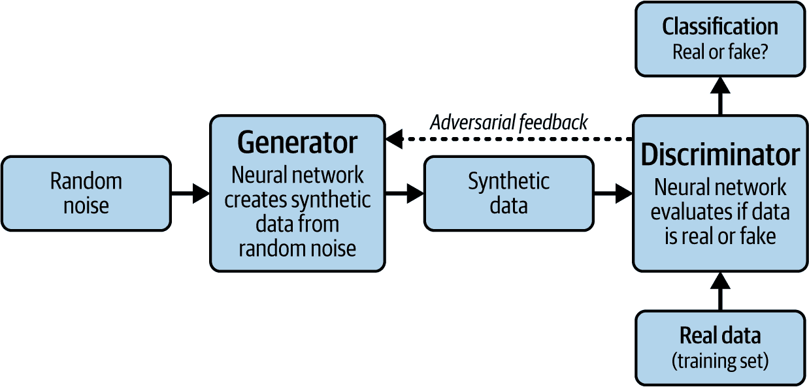
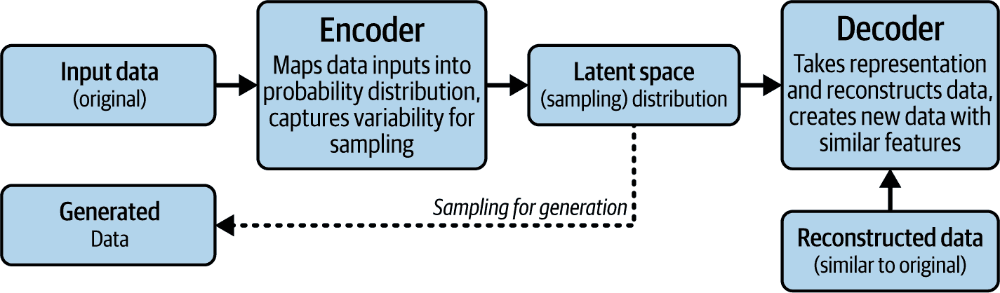
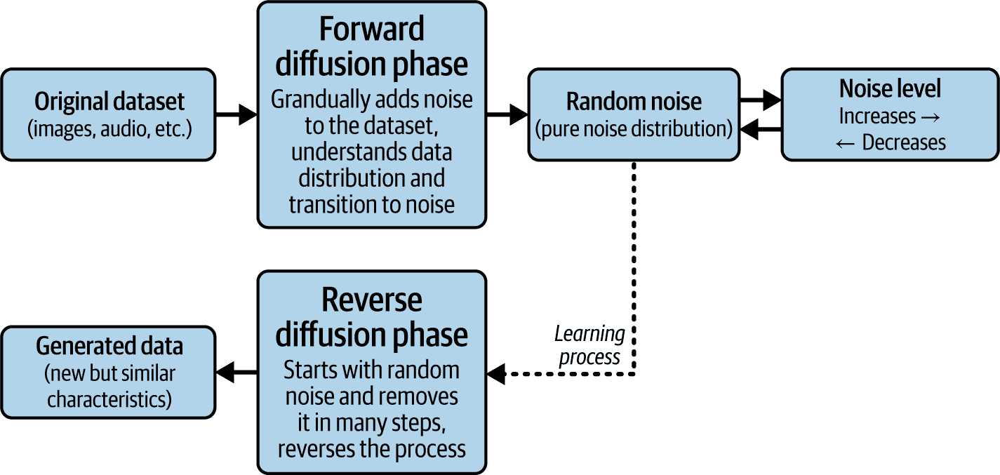

# 第四章：理解生成式人工智能

2015 年晚些时候，一群硅谷企业家——包括埃隆·马斯克和山姆·奥特曼——共同创立了 OpenAI，其使命是确保通用人工智能 (AGI) 使全人类受益。最初专注于强化学习后，公司转向生成式人工智能，于 2019 年推出了 GPT-2 模型。一年后，它发布了 GPT-3，这是一个在 570 GB 文本上训练的、具有 1750 亿个参数的模型，与前辈相比实现了巨大的飞跃。

转折点出现在 2022 年 11 月 30 日，ChatGPT 的发布。该应用的影响是即时且变革性的，在第一周吸引了超过一百万用户，两个月内达到一亿，使其成为当时历史上增长最快的软件应用。ChatGPT 的成功引发了对生成式人工智能的大量投资，使这项技术成为全球企业的优先事项。这导致竞争对手迅速开发出新的模型，包括谷歌的 Gemini 和 xAI 的 Grok，每个模型都在推动该领域的边界。

本章探讨了生成式人工智能的工作原理、其核心技术和其主要用例。

# 神经网络与深度学习

现代生成式人工智能背后的基础概念始于 20 世纪 50 年代的早期神经网络，这些网络试图模仿人脑。这些简单的网络有三个组成部分：

输入层

接收初始数据

隐藏层

包含具有随机权重的节点，用于处理输入以找到模式

输出层

对处理后的数据应用激活函数以确定最终输出

尽管这些早期系统受限于可用的计算能力，但它们为现代创新确立了核心原则。

*深度学习* 是这种结构的演变，它使用具有许多隐藏层的神经网络，有时数量可达数百。这种复杂性使得深度学习模型能够处理大量数据并检测复杂、非线性的模式，这些模式人类可能无法识别。深度学习模型的基本工作流程涉及数据通过这些层传递，模型通过称为 *反向传播* 的过程不断优化其预测，在这个过程中，模型通过调整网络中的权重来从错误中学习。

# 生成式人工智能模型

与基于输入进行分类或预测的传统人工智能模型不同，生成式人工智能产生原始输出，这些输出类似于其训练数据。这些模型已被用于生成从逼真的肖像到类似人类的对话等一切内容。

生成式人工智能模型有多种类型。大多数模型依赖于深度学习系统。但通常有很多调整和定制。

对于 AIF-C01 考试，需要了解的生成式人工智能模型类型包括以下几种：

+   生成对抗网络 (GAN)

+   变分自编码器 (VAE)

+   转换器模型

+   扩散模型

在这些模型中，转换器模型对于考试来说是最重要的。

让我们在接下来的章节中看看这些内容。

## 生成对抗网络

当 Ian Goodfellow 从斯坦福大学获得计算机科学学士和硕士学位时，他师从人工智能领域的权威人物 Andrew Ng。这激发了他在这个领域追求职业生涯，并且他将继续在蒙特利尔大学获得机器学习博士学位。正是在这里，他在人工智能领域的另一位杰出人物 Yoshua Bengio 的指导下学习。

他大学毕业后第一份工作是谷歌的实习生。他创建了一个神经网络，可以从图像中翻译地址，这改善了谷歌地图。但 2014 年 Goodfellow 取得了重大突破——生成对抗网络。这实际上源于他在加拿大蒙特利尔的一家小啤酒厂与同事的讨论。[蒙特利尔小啤酒厂](https://oreil.ly/9DJb4)。讨论的主题是如何改进生成模型的训练。他的朋友们谈论了一种将使用大量资源的方法。但 Goodfellow 认为更好的方法是让两个神经网络相互竞争。这将允许系统创建更好的内容。

当 Goodfellow 在深夜回家后，他无法停止对这个概念的想法。他花了几小时创建 GAN 模型，该模型生成了引人入胜的图像。

GAN 中的两个神经网络是生成器和判别器，如图图 4-1 所示。

###### 图 4-1. GAN 模型

生成器从随机噪声输入中创建合成数据。另一方面，判别器将评估合成数据并尝试判断其是否真实。这个“对抗”过程将迭代，直到生成器创建出看似真实的数据。

在表面上，这是一个简单的概念。但当然，生成对抗网络（GAN）是基于复杂的数学和算法的。在开发生成对抗网络不久后，Goodfellow 发表了一篇关于它的论文，这立即引起了人工智能社区的广泛关注。Meta 的首席人工智能科学家 Yann LeCun 称其为“过去 20 年来深度学习中最酷的想法”。

还出现了使用 GAN 创建图像的工具。许多图像都发布在社交媒体网站如 Twitter 上。事实上，有一张图像在佳士得拍卖会上拍卖，成交价为高额的[$432,000](https://oreil.ly/wKwnu)。

但 GANs 也被证明在科学研究的多个领域很有用，例如提高瑞士 CERN 的大型强子对撞机中检测亚原子粒子行为准确性的能力.^(1)

## 变分自编码器

在 2013 年的一篇论文中^(2)，Diederik P. Kingma 和 Max Welling 介绍了变分自编码器，如图图 4-2 所示。它是一种复杂神经网络和高级概率理论的结合。

###### 图 4-2. VAE 的过程

VAE 有两个主要组件协同工作：编码器和解码器。编码器就像一个智能摘要器，将你的原始数据转换为紧凑的表示，但与简单的摘要不同，它创建了一个所谓的 *概率分布*。这意味着它不仅仅创建一个固定的摘要，而是学会了捕捉数据中可能的变化和不确定性的范围。

解码器反向工作，将这些压缩表示重新构建成与原始输入相似的数据。VAEs 特别强大的地方在于，它们不仅学会了完美复制数据。相反，它们学会了底层模式和关系。这意味着你可以从中间的概率分布——即潜在空间——中进行采样，以生成具有与原始数据集相同特征的新数据。

VAE 的一个常见用例是创建图像。但它也可以用于：

异常检测

VAE 在寻找异常值方面非常有效，这对于欺诈检测和网络安全至关重要。

药物发现

VAE 可以创建分子结构。这有助于更快、更有效地识别潜在的药物候选者。

声音

你可以创建音效，甚至新的音乐。

## Transformer 模型

Transformer 模型——生成式 AI 的核心——于 2017 年 8 月推出。它由谷歌研究团队的部分作者在学术论文^(3)中发表。该模型的灵感实际上源于他们的一次午餐。研究人员讨论了这样一个问题：计算机如何生成类似人类的内容？

他们提出的东西最终成为 AI 最大的创新之一——史无前例。这篇学术论文最终被引用超过 80,000 次.^(4)

具有讽刺意味的是，谷歌最初并没有过多关注 Transformer。与此同时，包括 OpenAI 在内的各种初创公司都将这项技术视为 AI 的最佳途径。一些谷歌研究人员随后开始创办自己的 AI 企业。

在 Transformer 模型引入之前，NLP 的主要方法是使用循环神经网络（RNNs）。它按顺序处理数据，如文本、语音和时间序列。但这里有一个问题：它可能无法捕捉上下文。

为了解决这个问题，出现了一些创新，如长短期记忆（LSTM）网络，但这也证明是有限的。

但随着 Transformer 模型的出现，方法发生了颠覆。与 RNNs 逐个处理数据不同，Transformer 使用注意力机制一次性考虑输入的所有部分——允许对自然语言中的上下文有更深入和更灵活的理解。

要实现这一点，Transformer 架构依赖于四个主要组件（见图 4-3）：

输入嵌入

将单词转换为模型可以处理的数值向量

位置编码

为句子中每个单词的位置添加信息，因为模型不按顺序处理输入

编码器栈

分析整个输入序列并构建其上下文表示

解码器栈

使用编码后的输入和先前生成的输出生成输出序列，以产生流畅、连贯的文本

###### 图 4-3\. 变换器模型的过程

让我们看看这四个主要组成部分中的每一个。

### 输入嵌入

输入嵌入将标记转换为向量表示，这是一个数字的字符串。这允许模型分析数据并找到模式。

假设模型处理以下句子：“她吃了披萨。”输入嵌入可能看起来如下：

+   “她” → [0.25, –0.13, 0.40, ...]

+   “吃了” → [0.10, 0.22, –0.35, ...]

+   “the” → [–0.05, 0.15, 0.20, ...]

+   “披萨” → [0.30, –0.25, 0.50, ...]

向量中的每个数字称为*分量*，它们共同存在于一个向量空间中——一个由多个维度组成的数学结构。每个维度代表一个不同的方向或特征，允许数据中的模式被表示和分析。创建这些向量涉及基于线性代数的复杂计算。

### 位置编码

输入嵌入的问题在于它将打乱单词的顺序。毫无疑问，这可能导致一些上下文丢失或混淆。

这就是位置编码发挥作用的地方。它为序列中每个位置分配一个唯一的数值向量。以下是基于我们句子的一个示例：

+   位置 1（对应“她”）→ [0.01, 0.02, 0.03]

+   位置 2（对应“吃了”）→ [0.02, 0.03, 0.04]

+   位置 3（对应“the”）→ [0.03, 0.04, 0.05]

+   位置 4（对应“披萨”）→ [0.04, 0.05, 0.06]

这些随后被添加到输入嵌入中。

### 编码器栈

编码器栈是变换器模型试图理解文本意义的地方。这涉及到不同的处理层。

第一个使用自注意力机制，它展示了每个单词如何与其他每个单词相关。在我们的例子中，模型将评估“她”和“吃了”之间的关系。它将理解“她”是主语，正在执行“吃了”的动作。

之后，将进行更多层的自注意力处理。目标是更好地理解文本的意义。在此过程结束时，模型应该对“她吃了披萨”有一个稳固的理解。

### 解码器栈

解码器栈负责生成输出序列。常见任务包括翻译、内容生成和摘要。

假设我们想要将句子“她吃了披萨”翻译成西班牙语。解码器对每个单词遵循逐步的过程：

掩码自注意力

这允许解码器只关注它已经生成的单词，防止它“看到”未来的单词。对于第一个标记，它预测最可能的起始单词。

编码器-解码器注意力

此步骤将解码器连接到输入句子的信息。例如，模型识别出“她”是句子的主语。

输出生成

根据前面的步骤，解码器预测西班牙语中的第一个单词——“Ella。”

此过程逐词进行，直到整个翻译完成。

### 变压器是一种预测引擎

变压器模型当然很复杂。但当你把它简化下来，它实际上就是一个预测引擎。正如我们在编码器和解码器堆栈中看到的，模型正在预测序列中的下一个单词。

预测基于数据集中所有单词之间的复杂关系。这正是系统力量的体现。通过利用大规模数据集（通常是互联网上大部分内容）中的注意力机制，变压器模型能够以类似人类的方式理解和创造内容。而且，无需对数据进行标记。原因是变压器正在分析标记之间的关系。

然而，变压器模型存在一些问题。毕竟，预测是估计，有时可能会出错。我们将在本章后面讨论一些与生成式 AI 相关的问题。

需要记住的另一件事：变压器模型没有固有的知识。没有硬编码的逻辑、数据库访问等。再次强调，一切都是关于做出预测。

## 扩散模型

2015 年，研究人员 Jascha Sohl-Dickstein、Eric Weiss、Niru Maheswaranathan 和 Surya Ganguli 引入了扩散模型。他们在论文^(5)中阐述了创建新数据（如图像和音频）的创新方法的核心原则。

如图 4-4 所示，扩散模型有两个主要阶段：

正向扩散

扩散模型逐渐向原始数据集（如图像或音频）添加噪声。通过这个过程，它学会了理解数据分布以及它如何从结构化数据过渡到纯随机噪声。此阶段将有意义的数据到完全噪声的路径进行映射。

反向扩散

扩散模型通过从随机噪声开始，并通过许多步骤系统地去除它来反转正向过程。这生成了与原始数据集不同但保留相似特征和特征的新数据。反向阶段本质上是从噪声中学习重建结构化数据，从而能够创建新的样本。

###### 图 4-4. 扩散模型

流行扩散模型的例子包括 OpenAI 的 DALL-E、Stability AI 的 Stable Diffusion 和 Midjourney。它们使用文本到图像的过程。

让我们看看这在 DALL-E（不是 AWS 的一部分）中是如何工作的。在 ChatGPT 的输入框中点击“…”然后选择图像。输入以下提示：

> 一座瀑布飞流直下，落入星云漩涡之中，天空被极光照亮。

图 4-5 展示了生成的图像。

###### 图 4-5\. 由 OpenAI 的 DALL-E 创建的图像

# 基础模型

使用 transformer 或 diffusion 模型，你可以创建基础模型（FM）。这些模型可以用于你的商业或个人用途，比如 ChatGPT 或 Claude。

FM 主要有两种类型。一种是大型语言模型（LLM），它是基于 transformer 模型构建的。LLM 可以处理许多 NLP 任务——回答关于历史的问题、写诗、编写代码等等。似乎其能力没有尽头。相比之下，传统的 AI 主要关注单一任务，例如预测销售或客户流失。

接下来是多模态模型。这些模型可以理解和生成不同类型的内容，如文本、音频、图像和视频。多模态系统同时使用 transformer 和 diffusion 模型。

训练 FM 和为其开发应用程序的生命周期与传统机器学习工作流程不同。为了考试的目的，步骤如下：

+   数据选择

+   预训练

+   优化

+   评估

+   部署

让我们在接下来的章节中讨论这些步骤。

## 数据选择

对于 FM 来说，数据集非常庞大。例如，OpenAI 的 GPT-4 模型包含近 500 亿个参数——模型在训练过程中调整的内部值，用于做出准确的预测——并处理大约 45TB 的数据。这些训练数据来源包括 WebTest（网页的过滤快照）、英语维基百科和大量公共领域的书籍。

那么，关于最近的一些模型，比如 GPT-4 或 GPT-o1 呢？关于数据集大小的细节没有公布。主要原因是保护竞争优势。模型开发的世界当然风险很高，特别是构建 FM 需要大量的成本。

在数据选择过程中，不需要对数据集进行整理或清理。模型将无缝地与未标记的数据一起工作。正如我们在本章前面所看到的，transformer 模型将通过注意力机制等机制检测模式。

通常情况下，数据集越大越好。这被称为**规模定律**。研究表明，模型中参数的数量与性能之间存在正相关关系。

数据必须是高质量的且多样化的。这有助于减少偏差和有害内容的问题。因此，通常需要对数据集进行广泛的编辑和筛选，这时数据科学专业知识变得至关重要。还有使用各种数据选择方法，如数据选择与重要性重采样（DSIR）框架。这有助于关注对特定应用最相关的数据。

## 预训练

预训练阶段是模型学习理解和生成类似人类文本的阶段。这是通过使用一种称为*半监督学习*的技术来完成的。它使用未标记的数据集并创建基于数据的合成标签。例如，模型可以使用 Transformer 模型来预测句子中的缺失单词或其他空白。鉴于数据集的巨大规模，这种自动化的方法绝对至关重要。手动处理这是不可能的。

但过程不仅如此。还有持续预训练，这是当模型接触到更多数据以精炼和改进学习时。

预训练和持续预训练需要大量的计算资源。这部分的关键是使用图形处理单元（GPUs）或张量处理单元（TPUs）。GPU 是为并行处理设计的，在深度学习和生成式 AI 模型中广泛使用，而 TPU 是谷歌专门开发用于加速机器学习任务的专用硬件。

## 优化

FM（特征模型）非常强大。但它不会在专有数据上进行训练。这对企业来说可能确实有限制，因为企业需要更多专业化的 FM，比如用于处理客户支持、法律、营销、销售等。你能做什么呢？你可以优化一个 FM，这涉及到两种主要方法：

+   微调

+   检索增强生成

### 微调

假设你在你公司的法律部门工作。虽然 FM 在摘要等应用中很有用，但在处理复杂的法律查询时表现不佳。

如果你想要创建一个能够有效提取合同条款和实体的系统，你可以使用现有 FM 的微调。这也被称为*迁移学习*，即一个为某个目的开发的模型可以用于另一个目的。

这里是微调的主要步骤：

数据收集

收集与你的领域或任务相关的相关文档。在我们的例子中，这包括合同、协议和法律信函。

隐私和安全

微调经常使用专有或高度敏感的数据。这就是为什么需要实施强大的隐私、安全政策和限制措施。数据还应进行评估以减轻偏差问题。

数据标注

微调是一个监督学习过程。这意味着你需要对数据集进行标注，例如标记特定的条款和实体。

训练

你将应用算法到数据集上，以调整模型的权重和偏差。为此，有两种主要方法——指令微调和基于人类反馈的强化学习（RLHF）：

指令微调

这个过程基于某些提示和输出示例来展示模型应该如何响应，以帮助系统更好地学习。这对于聊天机器人和虚拟助手等应用非常有效。

RLHF

这个过程的第一个步骤是使用监督学习来训练模型，其中模型通过预测类似人类的响应来学习。下一步是使用基于人类反馈的强化学习来细化响应。它将根据这个反馈奖励或惩罚响应。目标是创建一个更符合人类价值观的模型。

迭代和评估

你将在数据集上迭代，直到模型学会识别和提取子句和实体。

除了定制 FM，微调还可以提高整体响应的准确性，并有助于减少偏差。还有效率上的好处。你可以利用现有模型，并对其进行较小的修改以获得更好的结果。

但微调也有缺点。就像传统的 ML 模型一样，存在过拟合的风险。原因是数据集可能过于狭窄。另一个问题是微调可能过度——也就是说，模型可能失去了其通用性的优势。最后，微调仍然需要相当多的资源，通常需要复杂的 GPU 和 AI 平台。

为了帮助解决这些问题，有更高级的微调方法：

低秩适应（LoRA）

与调整模型的所有参数不同，这项技术采取了一种更针对性的方法，使用了更少的资源。

表示微调（ReFT）

这是一个更高效的微调方法，它修改了模型内部不到 1% 的权重。

### RAG

在 2024 年，*时代*杂志将帕特里克·刘易斯评为 AI 领域 100 位最有影响力的人物之一.^(6) 主要原因是他与其他来自 Meta 的研究人员在 2020 年共同撰写的一篇论文^(7)，提出了一个通过搜索外部数据库将数据与 LLMs 连接起来的框架。

作者将其称为*检索增强生成*。它不仅允许定制 LLMs，还能减少幻觉。与微调相比，RAG 通常更容易使用，因为模型权重没有变化。该流程在图 4-6 中概述。

###### 图 4-6\. RAG 流程

下面是主要步骤的概述：

数据收集和索引

RAG 流程首先从各种来源收集相关数据，如 PDF、报告、文章、网页、日志和客户反馈。然后，这些信息将被准备用于处理和存储。

分块

由于 LLM 在一次性处理数据量上有限制，收集的数据集被分成更小、更易于管理的块。

嵌入创建

每个信息块都使用专门的机器学习模型转换为向量嵌入。这些嵌入捕获数据的语义含义，并以高维数学格式表示。

向量数据库存储

生成的嵌入向量存储在向量数据库中，这是一个专门设计用于管理和高效搜索高维向量的系统。

用户输入

当用户提交查询或提示时，这标志着 RAG 过程的检索阶段的开始。

处理用户输入

用户的提示被转换为嵌入向量，使用与数据块相同的机器学习模型。这确保了用户查询表示和存储数据表示之间的一致性。

检索

系统使用诸如 k-最近邻（k-NN）等技术进行相似性搜索，这些技术找到最相似的数据点，或者余弦相似度，它衡量两个向量的方向如何接近。这个过程定位了与用户提示最佳匹配的向量数据库中的块。

扩增

从向量数据库检索到的相关信息与原始用户提示结合，创建一个包含用户问题和回答所需上下文的扩展提示。

响应

扩展后的提示被提交给 LLM 进行处理。LLM 生成一个反映用户原始提示和从向量数据库中检索到的相关信息片段的响应。这应该导致一个更加信息和准确的答案。

请记住，AWS 提供了多种向量数据库功能选项。例如，包括 Amazon OpenSearch Service、Amazon OpenSearch Serverless 和 Amazon Kendra。

还有使用 pgvector 的向量数据库（这是针对 Amazon RDS 和 Amazon Aurora PostgreSQL 兼容版）。这是一个针对 PostgreSQL 的扩展，PostgreSQL 是一个流行的开源数据库。Pgvector 允许存储、索引和查询高维向量数据。还有企业级功能，如原子性、一致性、隔离性、持久性（ACID）合规性（有助于提供可靠的交易）、时间点恢复和复杂查询的支持。

RAG 得到了广泛的应用。根据[451 Research](https://oreil.ly/Ld7Wg)的调查，大约 87%的受访者表示他们认为这是一种有效的定制方法。然而，RAG 也有一些缺点：

数据

一个组织可能没有使用足够的相关信息。或者他们可能选择了错误的信息来源。创建一个有用的 RAG 系统通常需要数据科学专业知识。

搜索限制

语义搜索可能有一个好的匹配，但它有时会错过信息的整体上下文。

分块问题

块状处理过程可能很微妙。常见的错误是划分不足。

## 评估

使用 FM——无论是微调还是使用 RAG——您需要对其进行评估。它是否表现正常？响应是否准确？是否存在幻觉？是否生成了有害或有毒内容？

评估过程复杂且耗时。但从与用户建立信任和有效解决业务问题的角度来看，它是至关重要的。

评估一个 FM 主要有三种方式：

+   人工评估

+   基准数据集

+   标准评估指标

### 人工评估

人工评估是必不可少的，因为它有助于评估自动化指标可能遗漏的模型方面，例如用户体验、创造力和道德行为。这些领域往往是主观的，需要细微的人类判断。人工评估通常关注几个关键领域：

用户体验

交互有多自然、直观或令人满意？一个常见的指标是净推荐值（NPS），它询问，你有多可能向他人推荐这个产品或服务？——评分范围从 0 到 10。参与者还可能被问到：响应是否容易理解？是否感觉像对话？

上下文适宜性

模型是否保持主题并给出在给定上下文中有意义的回答？审阅者可能会考虑像模型是否理解了问题？它是否准确引用了对话的先前部分等问题。

创造力和灵活性

响应是否多样化且有趣——或者重复且乏味？当要求生成内容或头脑风暴想法时，评估者可以评估模型是否提供多样化的输出。

伦理考量

是否有偏见、有害输出或不适当内容的表现？人类审阅者在发现可能被自动化过滤器遗漏的问题中扮演着关键角色。

情绪智力

FM 能否检测并适当地响应情绪调调，如挫败感、兴奋或悲伤？问题可能包括：模型是否承认了用户的情绪？它是否以敏感的方式做出回应？

人工评估通常通过小组或焦点小组进行，参与者数量可能从几人到超过 100 人。评估者通常根据以下标准进行选择：

+   目标受众（例如，特定行业专业人士）

+   多样化的背景（例如，种族、性别、文化）

+   经验水平（从新手用户到专家）

参与者通常会花费时间提示 FM，审查其输出，并提供详细的反馈。这通常随后是调查或结构化访谈。

许多 FM 还直接集成了被动的人工评估形式。例如，ChatGPT 允许用户在响应后给出点赞或踩不点赞。一些平台包括嵌入的反馈表或提示用户对有用性进行评分。这种实时、用户驱动的反馈对于跟踪长期趋势和改进模型的未来版本非常有价值。

### 基准数据集

一个基准数据集允许对 FM 进行定量评估。它们有助于衡量：

准确性

FM 是否基于某些达成一致的标准执行任务？

速度和效率

FM 生成响应需要多快？它使用了多少资源？例如，一些 FM 需要实时工作，如自动驾驶汽车。

可扩展性

如果 FM 处理大量数据，其性能是否一致？

负责任的人工智能

这评估了 FM 在偏差和公平性等方面的表现。

坚固性

当存在异常或对抗性提示时，FM 的表现如何？

泛化

这衡量了 FM 处理未见数据或任务的能力。

创建一个基准数据集可能具有挑战性，因为这通常需要经验丰富的数据科学家的技能。但通常也需要有一名或多名领域专家（SMEs）参与这个过程。他们将具备正在测试的领域的必要经验。例如，如果数据集基准是针对药物发现，那么就需要有来自制药行业背景的 SMEs。

图 4-7 显示了创建数据集基准的步骤。

###### 图 4-7. 开发数据集基准的过程

让我们更详细地看看这些步骤：

SMEs 创建相关的问题

SMEs 开发了一套全面的、不仅与领域相关而且足够具有挑战性以真正评估 FM 能力的问答。这些问题旨在测试 FM 的知识深度和推理能力。

SMEs 创建答案

同样的领域专家（SMEs）进行广泛的研究，为每个问题提供高质量的参考答案。

FM 处理

创建的问题提交给被评估的 FM。FM 为每个问题生成自己的答案，这些答案将随后与 SME 创建的参考答案进行比较。

评判模型

一个 AI 模型作为评判者，将 FM 生成的答案与 SME 参考答案进行比较。评判模型从多个标准评估 FM 的响应，包括准确性、相关性和全面性。

性能评分

根据评判模型的比较分析，生成一个最终的基准分数。这个分数提供了 FM 性能的定量度量。

### 标准评估指标

标准评估指标是一个广泛使用的测量方法，用于评估 FM 的性能。有许多可供选择。但为了 AIF-C01 考试的目的，这些是需要你了解的：

+   基于摘要评估的召回辅助（ROUGE）

+   双语评估助手（BLEU）

+   来自转换器的双向编码器表示分数（BERTScore）

#### ROUGE

ROUGE 是一组用于评估文本自动摘要和机器翻译（如外语）的度量标准。它比较使用 LLM 生成的内容与由人类创建的参考摘要的重叠部分。

有不同类型的 ROUGE 度量标准，每一种都以特定方式衡量机器生成文本与参考文本之间的相似性。一个关键类别是 ROUGE-N，它侧重于 n-gram 重叠。一个*n*-gram 是由*n*个连续单词组成的序列。

例如，ROUGE-1 评估单语（单词）重叠：

+   句子：“汽车突然停下”

+   单语：“The”，“car”，“stopped”，“suddenly”

然后，ROUGE-2 评估双语（两个单词）重叠：

+   双语：“The car”，“car stopped”，“stopped suddenly”

你可以继续使用 ROUGE-3、ROUGE-4 等，以评估更长的短语匹配。

为什么使用不同的*n*值？因为它们提供了不同的视角：

+   ROUGE-1 捕捉基本的单词使用。

+   ROUGE-2 及以上版本捕捉到更多的结构、措辞和流畅性。

这些区别有助于分析模型捕捉到的相似性类型——是否有正确的单词？它们是否按正确的顺序排列？这使得评估更加细致和有洞察力。

对于解释 ROUGE-N 分数，范围是 0 到 1：

好评

通常，分数高于 0.5（50%）被认为是强的，特别是对于 ROUGE-1。然而，“好”取决于任务。

差评

分数接近 0 意味着重叠非常少，这表明模型没有捕捉到重要内容。

简而言之，ROUGE-N 帮助你评估模型捕捉人类预期关键词和短语的能力——从简单术语到完整措辞的逐步过程。

接下来是 ROUGE-L（最长公共子序列），这是一个用于评估机器生成文本与人工撰写参考文本之间相似性的度量标准，通过测量两个文本中出现的最长单词序列，这些单词序列在两个文本中以相同的顺序出现，尽管不一定连续。它特别适用于评估长篇内容，如摘要或叙述，在这些内容中，精确的单词匹配可能不如保留原文的结构和意义重要。

让我们举一个例子。假设我们有一个由人类撰写的参考文本：

> 快速的棕色狐狸跳过懒狗。

这是模型生成的结果：

> 棕色狐狸迅速跳过懒狗。

让我们找到最长公共子序列（LCS）——在两个文本中出现的单词，以相同的顺序：

> 常见单词：“The”，“brown”，“fox”，“jumps”，“over”，“lazy”，“dog”

然后这是 LCS：

> 红色狐狸跳过懒狗。

即使有些单词略有不同（*quickly*与*quick*，或缺少*the*），这也是一个强大的结构匹配。

在分数方面：

+   分数高于 0.6 通常被认为是好的，特别是对于复杂的叙述。

+   0.3–0.5 范围内的分数可能表明内容尚可，但结构或连贯性较差。

ROUGE 的一个关键优势是它相当简单、直接，并且基于人类判断。但它在衡量相似度方面也是一个有效的指标。

#### BLEU

BLEU 是一种通过将其与人类编写的参考文本进行比较来评估机器生成文本质量的指标。匹配越接近，质量越好——特别是在翻译任务中。BLEU 分数范围从 0 到 1，1 表示完美匹配。

虽然 BLEU 与 ROUGE 相似，因为两者都依赖于*n*-gram 分析，但它们之间存在关键差异。BLEU 侧重于精确度，衡量生成的*n*-gram 中有多少出现在参考文本中，并取平均值。它还通过“简洁度惩罚”惩罚较短的输出，确保翻译不会过于简洁以匹配关键词。

2000 年代初引入的 BLEU 是机器翻译的第一个自动评估指标之一，由于其有效性和简单性，至今仍被广泛使用。

#### BERTScore

2018 年，研究人员发表了一篇论文^(8)，在其中他们创建了一个名为 BERT 的新模型，这代表了自然语言处理领域的一个重大突破。谷歌最终将其开源。结果是 BERT 在人工智能社区中变得非常流行，产生了像 RoBERTa 和 DistilBERT 这样的模型变体。

BERT 也为一个新的评估指标奠定了基础：BERTScore。与依赖于精确或部分*n*-gram 匹配的 BLEU 和 ROUGE 不同，BERTScore 评估生成文本与参考文本之间的语义相似度。也就是说，它不仅看是否出现了相同的词语，还检查意义是否得到保留。这是通过语义搜索实现的，这是一种使用向量嵌入来比较词语或句子意义而不是其表面形式的技巧。例如，如果参考句子说，“The cat sat on the mat”，而生成版本说，“A feline rested on a rug”，传统指标可能会因为词语不匹配而给出较差的评分。但 BERTScore 可以识别出意义几乎相同。

BERTScore 提供了对文本质量的更细致的视角，这在评估可能使用不同措辞但传达相同思想的 LLM 输出时特别有用。尽管如此，它并不是要取代 BLEU 或 ROUGE。在实践中，数据科学家经常使用多个指标一起使用，以获得模型性能的更全面图景。

#### 基准指标资源：Hugging Face

2016 年，Clément Delangue、Julien Chaumond 和 Thomas Wolf 创建了 Hugging Face (*huggingface.co*)。他们最初开发了一个聊天机器人，允许青少年与人工智能伙伴互动。该初创公司未能获得成功。但创始人并没有放弃。在构建他们的聊天机器人时，他们发现需要一个开源人工智能模型和应用的枢纽。

现在，Hugging Face 是许多 AI 人士会去的地方。这里有超过 140 万个可下载的 AI 模型，以及超过 31.8 万个数据集。对于所有 AI 模型，都有详细的简介，包括文档、代码示例、用例、许可信息和限制。还有基准指标，通常会有与其他模型的比较。

#### 基准指标的问题

指标的使用可能是一个有争议的话题。人们越来越担心它们并不特别有效，或者可能是误导性的。部分原因是 LLM 非常复杂，其内部工作原理可能不会公开。其次，LLM 的开发者本身往往是计算指标的人，例如通过发布博客或白皮书。但还有其他问题：

提示

即使是措辞上的微小变化也可能对指标的成果产生重大影响。

复制

用于指标的数据库实际上可能是 LLM 训练的一部分。从某种意义上说，这就像学生考试作弊一样。

现实世界应用

测试通常更关注 LLM 的理论方面。它可能不会注意到现实世界的情况。

狭隘性

评估指标通常会关注一个任务或类别。

边缘情况

评估指标通常主要关注常见用例。

为了帮助解决这些问题，已经出现了对 LLM 进行排名的平台，例如 Chatbot Arena。加州大学伯克利分校的室友——Anastasios Angelopoulos 和 Wei-Lin Chiang——在 2023 年启动了它。最初只是一个学校项目，现在已经变成了数据科学家和 AI 公司最受欢迎的目的地之一。

该系统使用一个简单的形式，用户提出问题，有两个匿名的 LLM 提供回答。他们将评估哪个更好。目前，该平台上已有超过[170 个模型](https://oreil.ly/GojrE)，并且已经记录了超过两百万票。

## 部署

当 LLM 达到必要的性能标准后，就是将其投入生产的时候了。这可能意味着模型将被放入应用程序或作为 API 提供。如果模型是开源的，它可以在 Hugging Face 或 Grok 等平台上发布。

就像任何 AI 模型一样，应该持续监控和跟踪，例如准确性、延迟和性能。还应该评估偏差、能源消耗、安全性和潜在的有害内容。所有这些数据都是为了下一个模型收集的。例如，通常每两个月会有小更新。至于重大升级，这些可能每六个月到一年发生一次。

# 生成式 AI 的能力

生成式 AI 是一项强大的技术。但它在某些领域表现出色。在实施这项技术时了解这些领域非常重要，这将有助于获得更好的结果。

生成式人工智能可能的最大能力之一是它可以自动化繁琐的活动。诚然，一个人可以总结一份长文档。但一个 FM 可以在几秒钟内完成——并且通常具有更高的准确性。这意味着 AI 可以为人们腾出时间来处理更重要的事情。

对于考试，以下是一些您需要了解的生成式人工智能的其他能力：

适应性

一个 FM 可以跨越许多领域。这是生成式人工智能最重要的优势之一。对于企业来说，这意味着——而不是依赖多个应用程序——只需一个即可。

响应性

生成式人工智能通常可以几乎实时地生成响应，这对于聊天机器人等应用至关重要。

简单性

通过一两个提示，您可以生成类似人类的内容，比如博客、备忘录或电子邮件。

数据效率

您可以使用少量数据帮助 FM 学习。

个性化

响应可以根据您的偏好进行定制。这可以根据与人工智能应用的先前互动进行自动化。

可扩展性

生成式人工智能可以处理大量数据。根据模型的不同，它可以大如书籍。

事实上，一个 FM 甚至可以表现出创造力，激发新想法。这其中的一个关键原因是模型利用了大量的数据，并基于概率关系。

考虑一下沃顿商学院 MBA 创新课程的一个案例研究。教授们要求学生提出一打新产品或服务的想法。ChatGPT 生成了自己的想法，包括宿舍厨师套件和可折叠洗衣篮。然后教授们让一个独立的在线小组评估这些想法，结果令人震惊。对于被认为是有好想法的，40%来自学生，47%来自 ChatGPT（其余的是中立的）.^(9) 此外，在 40 个最佳想法中，只有五个来自学生。根据教授的说法：

> 我们预测这种人机协作将向市场提供更好的产品和服务，并为未来社会所需解决的问题提供改进的解决方案。

# 生成式人工智能的缺点

在 ChatGPT 发布后，问题不会很快出现。到 2023 年 3 月，技术领袖和研究人员撰写了一封公开信，表达了对生成式人工智能可能导致重大破坏的担忧，如就业流失、虚假信息和关键系统失控.^(10) 信中呼吁暂停——六个月——开发比 OpenAI 的 GPT-4（当时这是公司的顶级模型）更强大的 FM。一些值得注意的签署者包括史蒂夫·沃兹尼亚克、尤瓦尔·赫拉利和埃隆·马斯克。

当然，人工智能行业并没有停止发展。相反，发展速度显著加快。没有发生重大事件或事故，但这并不意味着生成式人工智能没有相当多的问题。其中一些主要问题包括：

+   幻觉

+   非确定性

+   可解释性

+   数据安全和隐私

+   社会和品牌风险

+   有限的上下文窗口

+   近期性

+   成本

+   数据挑战

## 幻觉

幻觉是指 FM 创建了一个虚假或误导性的响应。造成这种情况的一些原因包括数据集缺乏足够的相关信息和生成式 AI 的概率性质。根据来自 Vectara 的研究——该研究在 GitHub 上发布幻觉排行榜——来自 OpenAI、Google 和 Anthropic 的最大 FM 的幻觉率从 2.5%到 8.5%。^(11)在某些情况下，它可能超过 15%。

处理这个问题的一种方法是定制 FM，例如通过微调和 RAG。另一种方法是更仔细地创建提示，我们将在下一章中学习。

一些 LLM（大型语言模型）提供商已经开始整合系统来帮助检查系统的准确性。这可能包括在互联网上搜索以验证事实。以 ChatGPT 为例。当你编写提示时，你可以指定“搜索”。这将访问互联网以获取响应。它还会提供参考链接。ChatGPT 还有一个名为*深度研究*的功能。这会进行多步骤的主题研究，例如在生成响应时使用超过 10 个资源。

## 非确定性

非确定性是指即使提示相同，FM（生成式模型）也会产生不同的响应。这并不一定意味着存在幻觉。但响应可能会有不同的句子结构，对某些点的强调，甚至不提及某些主题。

非确定性的一个关键原因是 FM（生成式模型）的温度，这是响应的随机性或“创造力”的设置。对于 ChatGPT 和 Claude 这样的 FM，你不能设置温度。相反，它是一个未知值。但其他一些 FM 允许你这样做。这通常适用于使用这些系统 API 的开发者。

尽管非确定性有其优点，正如我们在沃顿商学院 MBA 创新案例研究中看到的例子，但它也可能为某些应用增加过多的不确定性，尤其是在有更高风险的情况下。

## 可解释性

可解释性描述了与 FM（生成式模型）的理解、可解释性和信任程度。这可以相当低，因为这些系统的复杂性本身就很复杂。而且，正如我们之前提到的，模型的许多细节可能不会公开。这被称为*黑盒*。

这甚至适用于开源模型。FM 开发者不公开权重和偏差的情况并不少见。这还可能包括底层数据集。缺乏可解释性对于高度监管的行业来说可能很困难。事实上，他们甚至可能被禁止使用不可解释的模型。

## 数据安全和隐私

与 FMs 交互可能会带来数据安全和隐私威胁。如果你将敏感信息输入到系统中——例如 PII（个人身份信息）——这可能会被暴露。对于一些 FMs，例如 ChatGPT 或 Claude，数据会被发送到云端。你需要依赖它们自己的安全系统。

诚然，这样的大型组织有广泛的防护措施。以 OpenAI 为例，它们包括：

数据加密

这使用 AES256 对静态或存储中的数据进行加密，并使用 TLS 1.2 或更高版本对传输中的数据进行加密。

内部安全

对授权人员有严格的访问控制。还有像防火墙和入侵保护这样的高级网络安全系统。

审计

OpenAI 已经通过了第三方评估，如 SOC 2 Type 2 审计。

奖励计划

OpenAI 为发现漏洞的人支付奖励。

安全与安全委员会

这是一个独立的小组，评估 AI 模型和基础设施。

尽管采取了所有这些措施，安全永远不能万无一失。这就是为什么你应该小心你输入到 FMs 中的信息。当然，当你使用数据集应用定制技术如 RAG 和微调时，也是如此。这可能包括数据匿名化等方法。还应该有强大的网络安全保护和政策。这有助于减轻数据中毒的风险，即黑客入侵数据集并向其中注入恶意信息。这可能意味着 FMs 生成有毒内容或可能允许对模型进行后门攻击。

## 社会和品牌风险

2023 年底，一家雪佛兰经销商为其网站推出了一个聊天机器人。不幸的是，一些回应证明是尴尬的。^([12)]在某些情况下，聊天机器人推荐了竞争对手的汽车。它甚至以仅 1 美元的价格提供雪佛兰塔霍。

这个例子并非孤例。生成式 AI 确实存在社会风险，这可能会损害公司的品牌和声誉。FMs 的定制技术当然可以帮助。但在某些情况下，最好不让聊天机器人处理某些话题，这可以通过在聊天机器人中包含过滤器来实现。

## 有限上下文窗口

上下文窗口是模型一次可以处理的文本量——以 token 表示。例如，假设你正在使用一个上下文窗口为 5,000 token 的聊天机器人。在你的聊天中，提示和响应的总 token 数为 10,000。这意味着当生成响应时，聊天机器人将使用最后 5,000 个 token。其余的将被忽略。

近年来，FMs（功能模块）的上下文窗口得到了极大的扩展。你可以在表 4-1 中找到一些例子。

表 4-1\. 上下文窗口

| 模型 | 大小 |
| --- | --- |
| GPT-4 Turbo | 128,000 tokens |
| Meta Llama 3 | 128,000 tokens |
| Claude 3 Opus | 200,000 tokens |
| Gemini 1.5 | 1,000,000 tokens |

为了更直观地了解这一点，Gemini 1.5 的上下文窗口可以处理大约 750,000 个单词或 2,500 页。这当然对于许多任务来说是足够的。

但上下文窗口可能仍然不足以充分捕捉文本的意义。原因是“中间丢失效应”。这描述了 FM 在处理标记中间部分的信息时可能会迷失方向。

## 时效性

FM 是预训练的，这意味着它们是在截至某个日期的数据集上训练的。但这带来一个问题：时效性。这意味着 FM 中不会反映更多当前的信息，这可能导致过时的响应。例如，如果最近有选举，它可能不知道现任总统是谁。

但一些领先的 FM 有一种解决方案，允许进行互联网查询，我们在这章的早期就了解到了这一点。

## 成本

构建 FM 的成本可能非常高。以下是主要类别：

训练

您将需要雇佣一支由高素质的数据科学家、数据工程师和软件工程师组成的团队。这样的专业人士可以赚取高额的薪水。在某些情况下，像 OpenAI 这样的公司为数据科学家提供七位数的薪酬方案。

数据

这包括收集和许可数据的成本。例如，2024 年 OpenAI 宣布与新闻集团签订了价值 2.5 亿多美元的[五年合作协议](https://oreil.ly/wU-us)，用于许可《华尔街日报》、《巴伦周刊》、《纽约邮报》和《市场观察》等出版物的内容。

基础设施

训练一个 FM 可能需要成千上万个 GPU。要大规模运行 AI 模型，一些系统需要超过 10 万个 GPU。这些芯片也不便宜，每个售价在 2.5 万到 3 万美元之间。甚至可能存在 GPU 短缺，需要以更高的价格从第三方购买系统，或者被列入等待名单。

获取 FM 成本估算可能很困难，因为开发者大多将此信息保密。但 Anthropic 公司首席执行官达里奥·阿莫迪的访谈对此有所透露.^(13)他表示，2025 年至 2026 年的训练成本可能在 50 亿到 100 亿美元之间。从长远来看——他没有具体说明——一个模型可能需要惊人的 1000 亿美元。

然后是雄心勃勃的 Stargate 项目^(14)，这是 OpenAI、Oracle 和 SoftBank 之间的合资企业。目标是筹集 5000 亿美元用于建设下一代 AI 模型的基础设施。预计 Stargate 超级计算机系统将拥有 200 万个 GPU，每年消耗 10 亿瓦特的电力.^(15)

要了解最先进的人工智能数据中心规模之大，看看 Meta 公司就知道了。该公司的首席执行官和联合创始人马克·扎克伯格对其[最新项目](https://oreil.ly/HW7OE)有这样的说法：

> 我上周宣布，我们预计今年将上线近 10 吉瓦的产能。我们正在建设一个 20 吉瓦甚至更大的 AI 数据中心，如果将其放置在那里，它将覆盖曼哈顿的一个显著部分。

随着成本的上升，有一个令人烦恼的问题：AI 能否盈利？世界上许多顶级科技公司和风险投资家认为答案是明确的肯定。

到 2025 年，谷歌、Meta、微软和亚马逊计划至少在 AI 基础设施上投入至少 2150 亿美元。16 这是亚马逊 CEO 安迪·贾西对此的看法：“我们认为我们今天所知道的大多数应用程序都将通过 AI 进行重新发明。”

但 AI 仍处于早期阶段，创新的速度非常快。也可能会出现更多创新和突破，以更高效和更优化的方法来创建和运营这项技术。

一个显著的例子来自中国。一位 40 岁的中国亿万富翁投资者推出了自己的 AI 初创公司，名为 DeepSeek。他相信通过利用更好的模型开发方法，有机会颠覆 FM 市场。与 OpenAI 等公司相比，他的团队在 GPU 资源方面仅占一小部分，却能创建一个高度复杂的模型，称为 R1。基于各种基准测试，它证明相当有能力。它显然开发成本不到 600 万美元。17

## 数据挑战

我们是否正在耗尽 FM 的数据？好吧，一些学术研究预测，这可能是情况——至少在高质量数据方面。如果这被证明是正确的，这无疑将代表 AI 进步的一个重大问题。如果有什么的话，已经有问题的迹象。当宣布新的模型时，它们通常只有轻微的改进。

但是 FM 开发者正在寻找解决这个问题的方法，例如使用合成数据。这种数据通常是通过使用 AI 模型创建的，这在自动驾驶汽车等用例中已被证明是有帮助的。但合成数据领域仍处于早期阶段，还有很多工作要做。

除了数据稀缺的潜力外，还有一个迫在眉睫的问题：AI 生成内容的激增。一项来自 AWS 的研究估计，这大约是互联网文本的 57%。一些研究人员认为，这可能意味着 FM 的负面反馈循环，导致模型退化甚至崩溃。

这并不是说 AI 注定要失败。让我们面对现实，多年来已经有过许多这样的预测——然而这项技术却继续保持着稳健。但这确实意味着该行业需要保持警惕，并继续投资于改进的方法。

# FM 的演变

丹尼尔·卡尼曼，著名心理学家，于 2002 年获得了诺贝尔经济学奖。这是为了他关于人类在不确定性下判断的开拓性研究。事实上，他的想法为生成式 AI 模型提供了一个有趣的视角。在他的著作《思考，快与慢》中，他阐述了自己关于人类思维过程的想法。其中一个是系统 1 思维，这是一个人快速且自动思考的地方。从某种意义上说，这就是 GPT 模型运作的方式。例如，使用 ChatGPT，它提供了一种快速互动的体验——通过提示和响应。

接下来是系统 2 思维，这是一个人花更多时间去思考问题的时候，比如通过复杂的推理和计划。系统 2 思维适用于下一代生成式 AI 模型。这些模型通常被称为推理模型或代理 AI。

除了采取多步骤解决问题的方法外，这些模型还可以自主或近乎自主地行动，并使用工具执行任务。通常会有多个生成式 AI 代理协同工作。

以客户支持为例。为此，我们有以下代理：

客户互动代理

与客户沟通的聊天机器人可以处理常见问题，例如通过调用知识库代理。但对于更复杂的问题，代理将把这些任务委托给其他代理。

问题分类代理

这将评估问题并确定其内容，例如账单、技术问题等。

情感分析代理

如果有挫败感的迹象，这可能会升级情况。这可能意味着将客户转交给人类代理。这可以通过任务路由代理来完成，该代理根据技能、经验和工作量等因素做出决定。

决策监控代理

这将跟踪所有支持票证的进度。如果有差距或问题，代理将升级任务。

这种代理技术仍处于早期阶段，但它取得了很大的进展。对于亚马逊、微软和 Salesforce 等许多最大的技术公司来说，这是一项主要优先事项。

考虑到 Gartner 表示，代理 AI 有望成为 2025 年最大的技术趋势。19 这得到了其他研究机构的支持，例如德勤。该机构预测，到 2025 年，使用生成式 AI 的 25%的公司将[启动代理 AI 项目或概念验证](https://oreil.ly/LOVKT)。预计到 2027 年，采用率将达到 50%。

# AGI

在本章早期，我们提到了 OpenAI 关于 AGI 的愿景。该公司将其定义为“比人类更聪明”的系统。

但 AGI 的话题很复杂。毕竟，“智能”这个概念很模糊，因为没有普遍接受的标准。例如，一个人不必拥有天才级的智商才能成为天才。

以理查德·费曼为例。在二战期间，他参与了曼哈顿计划，通过解决复杂的中子方程式帮助开发原子弹。此后，他成为加州理工学院（Caltech）的教授。在那里，他对量子电动力学做出了开创性的贡献，并在 1965 年获得了诺贝尔物理学奖。

那么，他的智商是多少？是[125](https://oreil.ly/o9HHc)，这是平均智力。相比之下，天才的智商是 180+。

然后有一些情况，人们是天才，但智商却相对较低，例如莱斯利·莱姆克。即使智商只有 58，并且失明，^(20)他也能演奏复杂的钢琴曲——只需听一次。那么对于通用人工智能（AGI）来说，智力意味着什么？还有其他一些对于超人类能力很重要的特征：

效率

正如我们在本章中看到的，AI 需要巨大的资源和能量。但这对于 AGI 的普及来说并不实用。毕竟，人脑只有大约三磅重，消耗大约 20 瓦特的电力，或者说相当于一盏昏暗灯泡的电力。

与环境互动

一个 AGI 系统应该能够拥有物理能力，如视觉、嗅觉和触觉。这将使其更加有用。它还将允许更多的学习。

自主

一个 AGI 系统必须能够独立做出有效的决策。

创造力

虽然生成式人工智能在这方面已经显示出一些能力，但远远达不到我们人类所达到的水平，比如说史蒂夫·乔布斯、爱因斯坦或莎士比亚。

关于何时达到 AGI，有各种各样的估计。未来学家雷·库兹韦尔说，这将在 2029 年实现.^(21)谷歌 DeepMind 的首席执行官德米斯·哈萨比斯并不那么乐观。他预测 AGI 将在 2034 年左右实现.^(22)

很可能需要更多的重大创新才能实现 AGI。看起来，变换器模型将不足以实现这一点。如果有什么的话，下一代模型将需要超越预测机器。还需要新的芯片和计算机系统形式，比如量子计算。

# 结论

生成式人工智能是 AIF-C01 考试的关键部分。这就是为什么我们在本章中深入探讨了这项重要技术。我们研究了核心构建块，如神经网络和深度学习。我们还看到了生成式人工智能的不同形式：GANs、VAEs、扩散模型和变换器。

在这些特征中，变换器是最突出的。因此，我们研究了其内部工作原理以及生命周期，以及它是如何成为 FM 的一部分，以及其优缺点。

在下一章中，我们将探讨如何评估生成式人工智能解决方案以及各种用例。

# 测验

为了检查你的答案，请参阅“第四章答案键”。

1.  哪种生成式人工智能模型涉及两个相互竞争的神经网络？

    1.  变分自编码器（VAE）

    1.  Transformer 模型

    1.  生成对抗网络 (GAN)

    1.  扩散模型

1.  位置编码对于 Transformer 模型的目的是什么？

    1.  为了增强反向传播的性能

    1.  为了按文本原始顺序处理单词

    1.  为了提高 GPU 的可靠性

    1.  为了使 AI 模型更具成本效益

1.  与微调过程相比，检索增强生成（RAG）的关键优势是什么？

    1.  RAG 需要更少的能量。

    1.  它显著提高了模型的速度。

    1.  RAG 减少了 AI 响应中的偏差。

    1.  它不需要修改模型的内部权重。

1.  与循环神经网络（RNN）相比，Transformer 模型的关键优势是什么？

    1.  Transformers 不需要标记数据。

    1.  Transformers 可以并行处理整个数据集。

    1.  RNN 无法处理文本。

    1.  Transformers 不需要训练。

1.  为什么 AI 模型会创造幻觉？

    1.  它们依赖于概率预测。

    1.  它们使用 GPU，这可能是不可预测的。

    1.  它们基于监督学习。

    1.  它们仅在小模型中存在问题。

1.  神经网络中哪一部分允许检测数据集中的模式？

    1.  输入层

    1.  输出层

    1.  隐藏层

    1.  激活层

^(1) CERN，[“大型强子对撞机开始第三次运行”](https://oreil.ly/eo_Ke)，HPCwire（网站），2022 年 7 月 6 日。

^(2) Diederik P. Kingma 和 Max Welling，[“自动编码变分贝叶斯”](https://oreil.ly/Glgrm)，arXiv，2022 年 12 月 10 日修订。

^(3) Ashish Vaswani 等人，[“注意力即一切”](https://oreil.ly/AHoJR)，arXiv，2023 年 8 月 2 日修订。

^(4) Parmy Olson，[“谷歌失去的 40 亿美元 AI 明星”](https://oreil.ly/cWBBa)，彭博社（网站），2023 年 7 月 13 日。

^(5) Jascha Sohl-Dickstein 等人，[“使用非平衡热力学进行深度无监督学习”](https://oreil.ly/IWAVQ)，第 32 届国际机器学习会议论文集，JMLR: W&CP 37 (2015).

^(6) Harry Booth，[“帕特里克·刘易斯”](https://oreil.ly/8E_nA)，《时代》杂志，2024 年 9 月 5 日。

^(7) Aleksandra Piktus 等人，[“用于知识密集型 NLP 任务的检索增强生成”](https://oreil.ly/MoQye)，Meta，神经信息处理系统会议（NeurIPS），2020 年 12 月 6 日。

^(8) Jacob Devlin 等人，[“BERT：用于语言理解的深度双向变换器预训练”](https://oreil.ly/nfnkQ)，预印本，arXiv，2018 年 10 月 11 日。

^(9) Christian Terwiesch 和 Karl Ulrich，[“MBA 学生与 AI：谁提出更具创新性的想法？”](https://oreil.ly/WlZg8)，《华尔街日报》，2023 年 9 月 9 日。

^(10) 生命未来研究所，[“暂停巨型 AI 实验：一封公开信”](https://oreil.ly/FXRBX)，2023 年 3 月 22 日。

^(11) Karen Emslie, [“LLM 幻觉：是缺陷还是特性？”](https://oreil.ly/fA_7_), *ACM 通讯*, 2024 年 5 月 23 日。

^(12) Ben Sherry, [“一家雪佛兰经销商使用 ChatGPT 进行客户服务，并了解到人工智能并不总是站在你这边”](https://oreil.ly/ZvcJo), *Inc.*，2023 年 12 月 18 日。

^(13) Erin Snodgrass, [“Anthropic 首席执行官表示，两年内训练人工智能可能需要 100 亿美元”](https://oreil.ly/Dc6cC) *商业内幕*, 2024 年 4 月 30 日。

^(14) Joanna Stern, [“OpenAI 称赞 5000 亿美元的星门计划：‘更多的计算机导致更好的模型’”](https://oreil.ly/NxHco), *华尔街日报*, 更新于 2025 年 1 月 22 日。

^(15) Jeremy Kahn, [“19.6 亿美元的转型”](https://oreil.ly/1vWk2) *财富杂志*, 2025 年 2 月 25 日。

^(16) Nate Rattner, [“科技巨头加大在人工智能上的巨额投资”](https://oreil.ly/HCq32) *华尔街日报*, 2025 年 2 月 6 日。

^(17) Kif Leswing, [“英伟达称中国的 DeepSeek R1 模型是‘卓越的人工智能进步’”](https://oreil.ly/t76q_), 美国消费者新闻与商业频道，2025 年 1 月 27 日。

^(18) Tor Constantino, [“人工智能是否正在悄无声息地毁灭自己——以及互联网？”](https://oreil.ly/p1p-x), *福布斯澳大利亚*, 2024 年 9 月 2 日。

^(19) David Ramel, [“代理人工智能被评为 2025 年顶级技术趋势”](https://oreil.ly/uFxHh), *校园技术*, 2024 年 10 月 23 日。

^(20) Darold Treffert, [“莱斯利·莱姆克发生了什么事？”](https://oreil.ly/5Mr6I), *科学美国人*（博客），2014 年 6 月 17 日。

^(21) Pranav Dixit, [“在 TIME100 影响力晚宴上，人工智能领导者讨论了技术的变革潜力”](https://oreil.ly/by-I6) *时代杂志*, 2024 年 9 月 17 日。

^(22) James Hurley, [“DeepMind 首席执行官表示，人工智能有‘治愈所有疾病’的潜力”](https://oreil.ly/USHZW), *星期日泰晤士报*, 2024 年 10 月 2 日。
