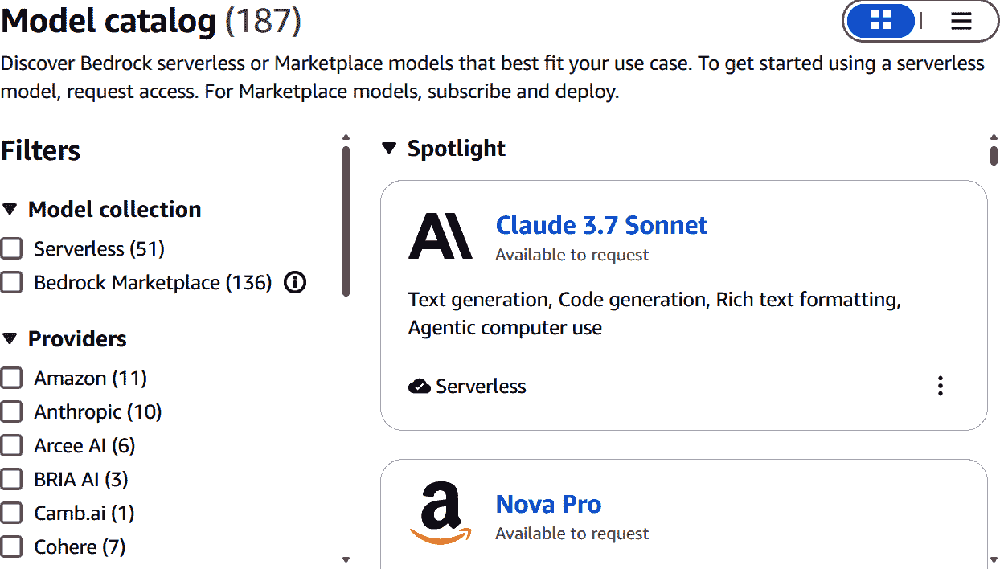
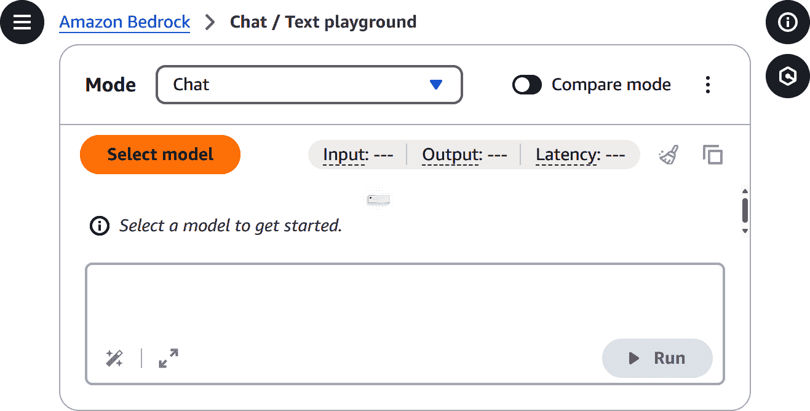
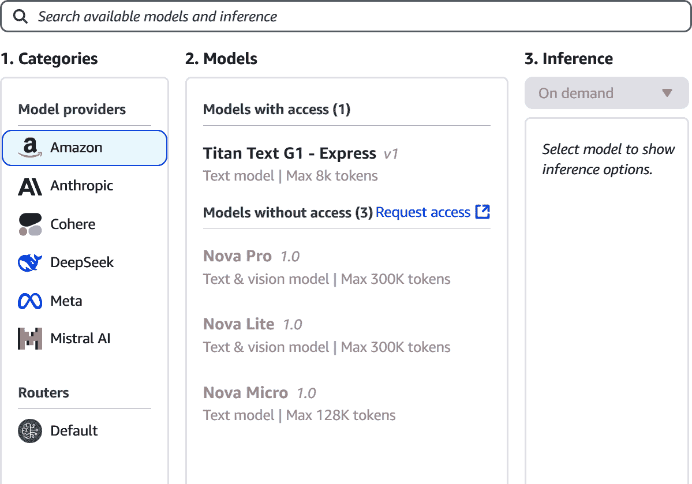
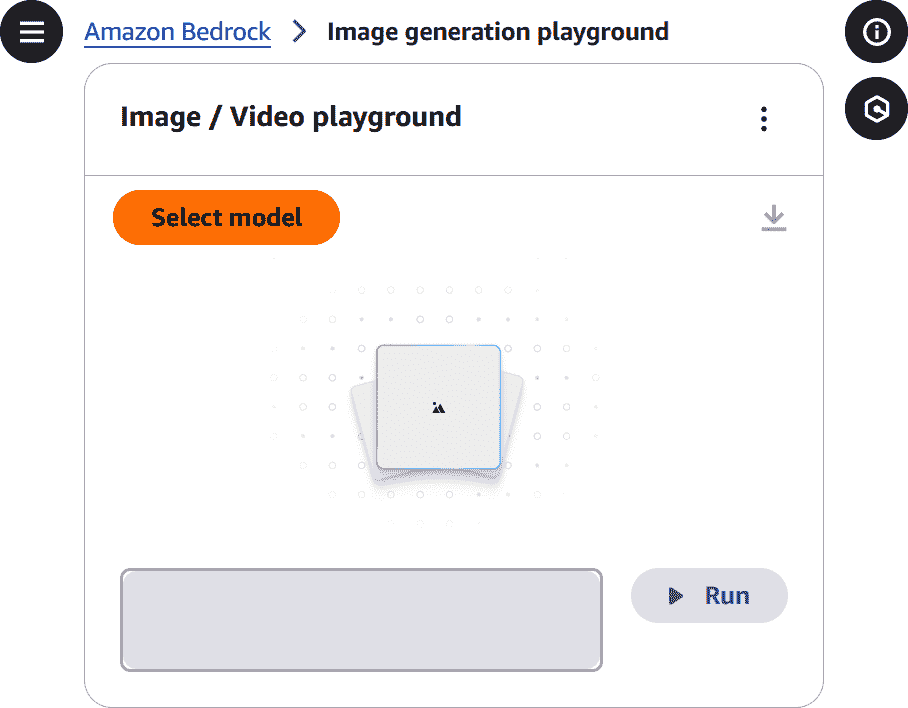
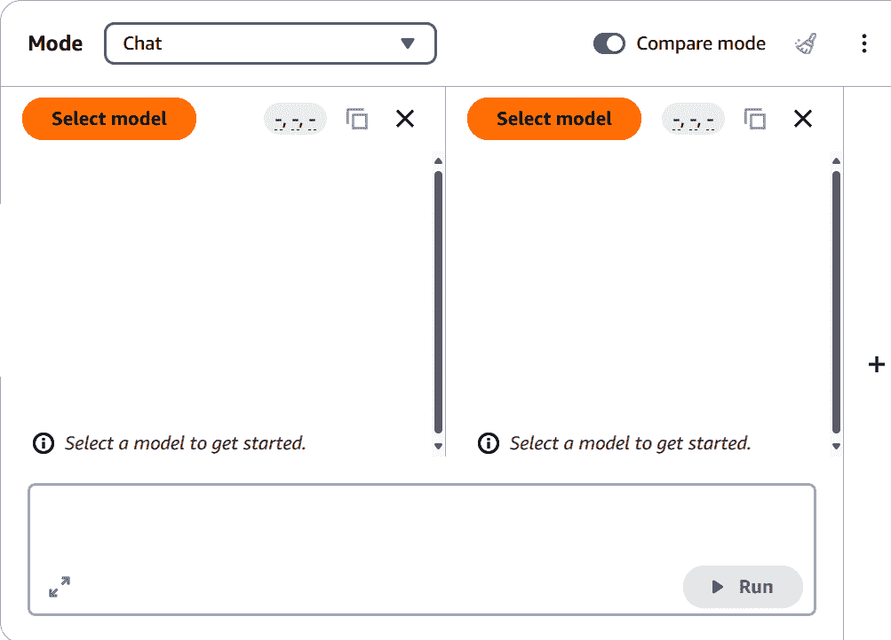
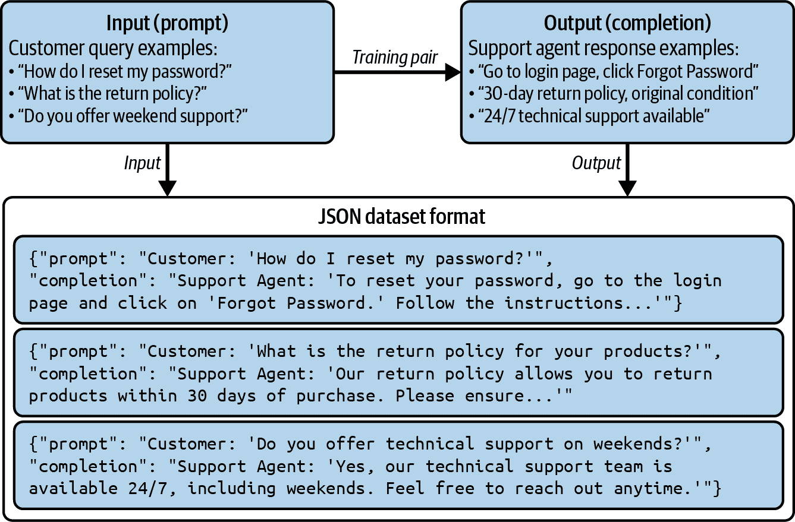

# 第六章. 使用亚马逊基岩和亚马逊 Q 进行构建

亚马逊联合创始人杰夫·贝索斯曾[说](https://oreil.ly/kxvps)，“我们不是竞争对手痴迷，我们是客户痴迷。我们从客户的需求开始，然后逆向工作。”这个指导原则帮助他的公司成为数字时代的巨头。

当生成式 AI 的流行度激增时，AWS 首先与客户进行了广泛的[讨论](https://oreil.ly/_n5bS)，并有一些一致的主题：

+   客户希望有一个简单的方法来查找和使用 FM。

+   他们需要将 FM 无缝集成到他们的应用程序中，而不需要管理复杂的底层基础设施。

+   成本必须保持低。

+   他们希望有一个简单的方法来使用自己的数据定制 FM，以满足独特的业务需求。

+   数据隐私和安全在整个过程中至关重要。

+   客户不希望他们的数据被用于为其他公司训练 FM。

基于这些反馈，AWS 启动了一个雄心勃勃的项目，创建一个复杂的平台来构建生成式 AI 应用程序——这成为了亚马逊基岩。它于 2023 年 4 月作为预览版发布，并于 2023 年 9 月正式发布。对于 AWS 来说，这是一个战略性的重要举措，速度至关重要。

在本章中，我们将对这个强大的系统有一个概述。我们还将探讨另一个重要的生成式 AI 技术平台：亚马逊 Q，它是一个面向企业和软件开发者的虚拟助手。为了考试的目的，你需要了解每个系统的功能以及它们的使用方式。

# 开始使用亚马逊基岩

要使用基岩，你需要登录 AWS，然后在屏幕顶部的搜索框中输入“基岩”。当你点击这个选项时，你将被带到仪表板，如图图 6-1 所示。

###### 图 6-1. 基岩仪表板

在屏幕中间，你会看到各种生成式 AI 服务和公告的描述。你还可以在左侧边栏中找到这些服务。

让我们使用这个导航到“基础模型”，它有多种选项。选择“查看模型目录”。图 6-2 显示了此屏幕。

目前有 187 个生成式 AI 模型可供使用。其中 51 个是无服务器的——这意味着它们会自动管理底层基础设施，使用户能够在无需配置或维护服务器的情况下运行模型。它们也无缝集成到基岩中。其余的模型位于基岩市场中。要使用这些模型，你需要通过订阅流程。

在左侧边栏中，有过滤器用于搜索所有模型。你可以根据以下内容进行搜索：

模型提供商

这是创建该模型的公司，例如亚马逊、Anthropic、DeepSeek、Hugging Face、Meta、Mistral 或 NVIDIA。

模态

这描述了模型的输入和输出类型。模态包括音频、图像、文本、视觉、视频和多模态。还有嵌入模型，用于创建用于生成式 AI 系统的向量。

###### 图 6-2\. 基岩模型目录

当您使用筛选选项时，您将在屏幕右侧看到结果。每个模型都将有一个简要描述。

让我们选择 Claude 3.7 Sonnet。图 6-3 展示了该模型的配置文件。

###### 图 6-3\. Claude 3.7 Sonnet 的模型配置文件

详细信息包括版本、模态、发布日期、模型 ID、语言、软件许可和部署类型。还有用于进行 API 请求的示例代码。您可以复制此代码并将其放入程序代码中，以连接到模型。

要使用这些模型，请转到左侧边栏底部并点击“模型访问”。您可以选择“启用所有模型”或“启用特定模型”。无论您选择哪个，Bedrock 都会要求您填写表格。您将输入基本详情，如公司名称和网站 URL、行业、目标用户（内部员工或外部用户）以及用例描述。然后您将点击提交。根据模型的不同，激活可能需要几分钟时间。图 6-4 展示了过程完成后您可能会看到的一个示例。

为注册模型不收取费用。但使用时您将支付费用。

您可以通过左侧边栏中的游乐场测试您的模型。有两个选项：聊天/文本和图像/视频。我们将在以下部分介绍这些选项。

###### 图 6-4\. Bedrock 中激活的模型

## 聊天/文本游乐场

聊天/文本游乐场用于使用基于文本的模型（见图 6-5）。有各种设置：

模式

有聊天功能，允许与 FM 进行持续对话。另一个选项是单个提示，将生成一个响应。

选择模型

您将点击此按钮以获取选择模型的屏幕。在顶部，您可以搜索模型。您还可以使用三步流程。首先，您将选择模型提供者，然后选择模型。最后，有推理选项，这是模型生成响应的方式。选择“按需”，这是最基本的方法。

###### 图 6-5\. Bedrock 中基于文本模型的仪表板

图 6-6 展示了选择模型时您将看到的屏幕。

###### 图 6-6\. 在 Bedrock 中选择模型

选择模型后，屏幕侧边栏将出现配置部分，如图图 6-7 所示。

###### 图 6-7\. Bedrock 中模型的配置部分

一些常见的配置选项包括温度、Top P、Top K、响应长度、停止序列和护栏。让我们在接下来的章节中深入了解这些配置选项。

### 温度

温度设置 FM 响应的随机性或创意。范围是 0 到 1，代表概率分布。越接近 0，响应将越确定性和可预测。这通常在您想要基于事实的内容时最佳，例如常见问题解答、总结或说明。

温度越高，响应越有可能更加随机或富有创意。这可以用于头脑风暴和创意写作。

温度将根据模型而变化。例如，0.6 的值对于 OpenAI 模型与 Meta 模型可能产生不同类型的响应。

### Top P

Top P 也称为 *核采样* 或 *概率采样*。它选择 FM 响应中的下一个单词，基于累积概率阈值。为了理解这一点，让我们看一个例子。假设 FM 正在生成以下响应：

> 狗摇了它的

模型将为下一个单词计算一个概率分布。这包括：

+   “tail”：50%

+   “paw”：20%

+   “ears”：15%

+   “tongue”：10%

+   “whiskers”：5%

如果 Top P 设置为 0.5，则唯一的响应将是“tail”。原因是模型将寻找累积概率大于或等于 0.50 的最小单词集。

但假设我们将 Top P 设置为 0.9。我们将包括“tail”、“paw”和“ears”，总计 0.85。但“tongue”将被排除，因为累积概率将是 0.95。

从可用的单词池中，FM 将随机做出选择。换句话说，Top P 越高，响应将越多样化或富有创意。

### Top K

Top K 限制了模型在生成响应中的下一个单词时考虑的标记选择数量。这是控制内容随机性或多样性的另一种方式。使用 Top K，FM 将考虑 K 个最有可能的单词。

这里有一个例子。假设 FM 正在生成以下响应：

> 学习编程的最佳方式是

这是下一个单词的概率分布：

+   “practice”：35%

+   “by”：20%

+   “through”：15%

+   “with”：10%

+   “using”：8%

+   “via”：7%

+   “reading”：5%

如果我们将 Top K 设置为 2，则选定的单词将是“practice”和“by”。原因是它们是最有可能的两个单词。

因此，如果 Top K 设置为 4，那么我们将有“practice”、“by”、“through”和“with”。随着值的增加，输出将变得更加随机和多样化。

当与温度、Top P 和 Top K 一起工作时，你需要对数值进行实验。这个过程主要是试错。

然而，如果您为 FM 设置了温度、Top P 和 Top Q 的值，它们将相互影响。这通常会导致意外的结果。这就是为什么最好只设置一个或两个参数。通常，建议使用温度或 Top P，而不是两者都使用。至于 Top K，它最好与温度或 Top P 一起使用。

### 响应长度

“响应长度”是一种控制 FM 生成的响应大小的方法。根据模型的不同，它可以是最小值或最大值。这些值可能因模型而异。

不论如何，响应长度可以为响应提供更多简洁性。这对于聊天响应和摘要很有用。

但当然，如果响应长度较短，重要内容可能会被截断。

### 停止序列

“停止序列”允许您控制 FM 何时停止生成响应。这些是特定的单词、短语或标点符号，向模型发出结束输出的信号。

例如，假设您正在构建一个生成 JSON 对象的系统。您只想让模型输出到 JSON 结构的末尾。您可以使用停止序列“}”来确保响应在遇到闭合括号时结束。

与最大令牌限制一起使用停止序列可以提供对内容和响应长度的更大控制。

### 安全栏

在 AWS Bedrock 中，您可以通过安全栏创建安全措施，帮助执行负责任的 AI 实践，并确保您的生成式 AI 应用与您的组织价值观和合规要求保持一致。这些安全栏作为内容审查层，分析发送给 FM 的提示和生成的响应。

它们允许您定义特定用例的保护措施——无论您是构建客户服务聊天机器人、文档摘要工具还是任何其他生成式 AI 应用。

安全栏的关键功能包括：

内容过滤

您可以过滤掉有毒、成人或敌对内容，以维护品牌安全和用户信任。这有助于防止不适当或冒犯性的语言被包含在用户输入或模型的输出中。

敏感信息保护

安全栏可以识别并阻止包含个人数据、财务标识符或其他形式机密信息的输出。这对于医疗保健和金融等行业非常重要。

多语言支持

目前，Bedrock 安全栏支持英语、法语和西班牙语，为全球应用提供更广泛的覆盖。

即时响应保护

安全栏适用于用户提示和模型响应，确保双向保护。

当您创建安全栏时，您可以应用的过滤器数量没有限制。这使得组织可以根据特定的监管、道德或运营要求定制保护措施。

AWS 还提供测试环境，因此您可以在将其部署到生产之前模拟不同的输入并查看您的护栏表现。这有助于您微调过滤器并避免意外阻止模型或敏感信息泄露。

让我们以护栏使用的一个例子为例。假设您正在使用 Bedrock 上的 FM 构建法律咨询助手。您可以配置一个阻止提及个人标识符（如社会保障号码或法律威胁）的提示或响应的护栏。您还可以添加过滤器以确保助手不会参与攻击性或过于激进的言论，即使是被用户提示。

## 与 FM 交互

一旦您为 Chat/文本游乐场配置了 FM，您就可以开始与之交互。假设您输入以下提示：

> 什么是生成式 AI？

您可以按 Enter 或 Run。您还可以选择图标——有两个箭头的图标——这将展开输入框。如果您想添加空格，可以按 Shift+Enter。

图 6-8 显示了部分响应。

###### 图 6-8。Bedrock 中 LLM 的响应

这里有一段关于生成式 AI 的段落描述。在顶部，有关于响应的指标。输入有 9 个令牌，输出有 96 个令牌，延迟——模型生成响应所需的时间——是 4,583 毫秒。这些指标旁边有两个图标。一个是清除聊天，另一个是复制内容。

## 图片/视频游乐场

使用图片/视频游乐场，您可以使用自然语言创建图片和视频。图 6-9 显示了仪表板。

###### 图 6-9。图片/视频游乐场的仪表板

在左上角，您可以选择模型：亚马逊、Luma AI 或 Stability AI。您还可以选择推理方式，是按需还是预配吞吐量。这些选项与我们使用 Chat/文本游乐场时看到的方式相同。

选择模型后，配置部分将出现在屏幕左侧。一个选项称为“操作”。这包括生成图像或视频的多种方式：

生成图像

根据您的提示创建一个新图像。

生成变体

创建一个与您上传的参考图像类似的新图像。支持的文件格式包括*.png*和*.jpeg*。最大图像大小为 24 MB。

移除对象

从您上传的图像中移除特定对象。

替换背景

您可以在保持主要主题不变的情况下更改图像的背景。

替换对象

将图像中的一个对象替换为另一个。

生成视频

根据您的提示和起始图像创建一个简短的视频片段，这是可选的。

### 负面提示

下一个配置选项是“负面提示”。这允许您指出图像或视频中您不希望出现的某些元素。表 6-1 显示了几个示例。

表 6-1。负面提示示例

| 隐藏面部 | 畸变面部模糊 |
| --- | --- |
| 风格控制 | 卡通 |
| 颜色 | 褐色，霓虹色 |
| 不需要的构图元素 | 繁忙的背景 |
| 文理 | 光滑表面，粗糙纹理 |
| 照明氛围 | 茫茫大雾 |

您也可以使用多个负面提示。例如：模糊，卡通，杂乱的背景。

### 响应图像

然后是“响应图像”配置。您可以设置图像的尺寸以及要生成的图像数量。您最多可以有 5 张。

### 高级配置

最后，有两个高级配置选项：一个用于“提示强度”，另一个用于种子。

#### 提示强度

提示强度表示生成的图像将如何遵循您的提示。这是一个介于 1 到 10 之间的值。

这些是范围：

+   1–3: 允许更多的创造力

+   4–7: 在创造力和紧密遵循提示之间取得平衡

+   8–0: 主要将图像聚焦于提示的要求

#### 种子

种子是随机数生成器的值。这是设置初始状态的起始值。这意味着当您使用相同的种子时，您将得到相同的结果。这意味着您可以使用不同的种子创建图像的变体，同时保持其他配置不变。这有助于评估不同的图像，而不会与核心思想有太大差异。

让我们选择 Stable Image Core 1.0 模型并使用此提示：

> 夕阳下宁静的山湖，雪顶山峰在平静的水中倒影。温暖的金色光芒，天空中飘渺的云彩。

图 6-10 显示了该图像。

###### 图 6-10。由 Stable Image Core 1.0 创建的图像

屏幕左上角有一个图标——有三个垂直点——您可以将图像导出为 zip 文件。还有一个图标，是一个向下箭头，可以将图像下载为*.jpg*文件格式。

# 选择一个 FM

当使用 Bedrock 时，选择 FM 是一个关键步骤，这涉及到评估各种因素。也没有正确答案，因为该过程将涉及实验。在选择模型时，您应该首先考虑用例。您可以使用“模型目录”来做这件事，我们之前在本章中已经了解过。

然后，您可以使用过滤器并专注于您应用程序所需的模式。这将有助于缩小搜索范围。

例如，假设您想选择一个图像模型。为此，有九个选项。其中一些将带有“Legacy”标签，这意味着它们将在某个时候被淘汰。当然，您可以忽略这些。然后您可以通过查看配置文件来搜索其他模型。

需要考虑的一些因素包括：

类别

这些是 FM 的能力。其中一些可能受到限制，例如 Titan Image Generator G1。它可以做到以下事情：文本到图像，图像到图像，背景移除和图像条件化。另一方面，Stable Diffusion 3.5 Large 则更加稳健，例如允许更好的场景布局、动漫和卡通。

最新版本

您应该关注最新的版本。

语言

这是您可以编写提示的语言。

最大令牌数

这是模型将生成用于响应的最大令牌数，这些数值可能差异很大。表 6-2 展示了几个示例。

表 6-2\. 不同模型的最大令牌数

| 模型 | 最大令牌数 |
| --- | --- |
| Claude 3.7 Sonnet | 200k |
| DeepSeek-R1 | 128k |
| Llama 3.3 70B Instruct | 128k |
| Mistral Large 2 (24.07) | 128k |
| Amazon Nova Micro | 128k |

软件许可证也可能很重要。在模型配置文件中，您将在屏幕底部看到一个链接，标记为最终用户许可协议（EULA）。EULA 将是开源或专有。这将决定您是否以及如何为特定项目使用模型。例如，开源许可证可能允许您自由修改和分发模型，而专有许可证可能限制使用于内部开发或要求商业协议。理解这些条款有助于确保模型的合法合规使用。

## 许可证类型

开源许可证的三大主要类型包括：

Apache 2.0 许可证

这是一个许可协议，允许您自由使用、修改和分发软件。同时也有专利诉讼的保护，但您需要在您的应用程序中提供版权声明。

MIT 许可证

这与 Apache 2.0 许可证类似，软件的使用几乎不受限制。然而，您需要提供版权声明并在软件中包含许可证。

GNU 通用公共许可证（GPL）

这是一个版权许可协议，这意味着基于该软件的衍生作品必须遵守许可证条款。这有助于确保软件将保持免费。但一些公司可能不想使用这种许可证，因为他们可能会失去自己代码的知识产权。

使用这些类型的许可证已经使得 AI 模型得以广泛分发。但还有其他优势：

透明度

开发者可以理解模型如何生成响应，这可以提高信任度。它还可以使组织更容易评估模型是否符合合规性、伦理和监管要求。

创新

一些模型拥有繁荣的全球开发者与数据科学家社区。这意味着系统可以从他们的创新修改和增强中受益。

定制化

通过访问代码，您可以针对特定需求构建自己的 AI 模型版本。

一些 AI 模型开发者将拥有他们自己的许可证。例如，Meta。对于其 Llama 模型，它使用 Llama 社区许可协议，比之前提到的许可证更为严格：

+   如果您的应用程序每月活跃用户超过 7 亿，您必须从 Meta 获得单独的许可证。

+   您不能使用 Llama 来创建竞争性的 LLM。

+   从 Llama 创建的衍生作品必须遵守相同的 Llama 社区许可。

足够有趣的是，关于这些类型的许可证存在相当大的争议。它们是真正的开源还是某种程度的开源？根据[自由软件基金会（FSF）](https://oreil.ly/zdBtp)的说法，答案是肯定的。该组织认为该许可证过于严格。

在 Meta 的情况下，FSF 还表示，该公司没有提供足够的透明度。原因是它没有披露模型的参数以及训练数据。

## FM 响应分析

在选择用于构建应用的模型时，一个有用的方法是列出基于您的用例的预期提示。例如，假设您正在构建一个人力资源（HR）的聊天机器人。您的组织中将会有主题专家（SMEs），他们会提出典型场景并为它们编写提示。以下是一些示例：

> 人力资源政策：“我想在 12 月假日休假。我需要采取哪些步骤来申请这个假期，我需要通知谁？”
> 
> 优点：“有哪些健康保险选项？有哪些资格要求？我如何注册计划？”
> 
> 职位描述创建：“为数据工程师创建一份详细的职位描述。包括主要职责、所需资格和优先技能。”
> 
> 员工评价：“员工评价的最佳实践是什么？”
> 
> 入职：“创建入职清单。”

毫无疑问，这个过程可能会耗费时间。然而，制作一个能够产生积极影响的有效的生成式人工智能应用至关重要。

我们示例中的提示也分为两大类。前两个基于企业数据，而后三个是通用的。这意味着您需要自定义 FM。您可以通过微调或 RAG 来实现这一点。我们在第二章中学习了这些主题，我们将在本章后面进一步讨论。

对于通用提示，您可以使用 Bedrock 游乐场来测试不同的模型。让我们看看您如何做到这一点：

1.  在 Bedrock 控制台中，选择 Chat/Text。

1.  将模式设置为 Chat。

1.  打开“比较模式”。图 6-11 显示了更新的屏幕，允许您选择两个模型。

    

    ###### 图 6-11. Bedrock 的“比较模式”选项

1.  对于第一个模型，选择亚马逊，然后选择 Titan Text G1 - Premier v1。然后点击应用。

1.  对于下一个模型，选择 Meta 并选择 Llama 3 8B Instruct。然后点击应用。

1.  在输入框中输入：“创建一个入职清单”。

1.  您将看到两者的响应，您可以进行比较。

# 衡量成功：企业目标和指标

虽然生成式 AI 是一项强大的技术，但实施起来可能很困难。一个原因是缺乏明确的企业目标和指标。根据波士顿咨询集团的调查，这种情况占到了三分之二的高管。1 埃佛勒斯集团的一项研究也有类似的发现。

虽然为动态和复杂的技术制定目标和指标可能很困难，但有一些通用的方法可以考虑，这些方法由 AWS 认证推荐：

+   用户满意度

+   每用户平均收入（ARPU）

+   转化率

+   效率

让我们在接下来的几节中逐一解释这些内容。

## 用户满意度

客户满意度评分（CSAT）

CSAT 根据评分范围衡量用户满意度，例如 1 到 5。

净推荐值（NPS）

NPS 评估用户是否可能向其他用户推荐某个产品或服务。这个评分范围是 0 到 10。分数越高，用户满意度越高。

另一种衡量用户满意度的方法是使用 AI 服务，如 Amazon Comprehend。这将使用自然语言处理（NLP）从用户反馈中提取见解，例如来自在线表单或应用程序中的点赞/踩不点赞图标。系统可以根据正面、负面、中立和混合水平对信息进行分类。

使用这些用户满意度指标，您可以创建基准分数来衡量。然而，它们应该是现实的，并定期审查，以了解生成式 AI 应用的影响。

## 每用户平均收入

每用户平均收入（ARPU）衡量一段时间内每个用户的收入，例如按月或按年。这个指标对于收取订阅费的业务很常见，比如 SaaS 软件或电信服务。它对电子商务也有用。

即使 ARPU 有轻微的增长，也可能对公司的底线产生显著影响。假设一个在线服务有 10,000 名客户，当前 ARPU 为每月 50 美元（月收入 500,000 美元）。假设公司实施了大幅提高服务的生成式 AI 功能。为此，价格提高了 10%，达到 55 美元。即使不增加任何新成员，公司也将增加 60 万美元的年收入。

## 转化率

转化率衡量用户在线采取行动的比率，例如购买、填写表格或订阅通讯。然而，这通常很低。对于电子商务网站，桌面和移动设备的平均转化率是[2.8%](https://oreil.ly/VJa7t)。在社交媒体上，情况更糟，大约是[1%](https://oreil.ly/_oUTg)。

同时，在线广告的成本一直在上升。在某些时期——比如黑色星期五——它们可能非常昂贵，因为关键词的竞价激烈。这就是为什么转化率如此重要的原因。最小的增长可能意味着维持亏损和产生利润的区别。

生成式 AI 可以帮助的多种方式：

优化内容

生成式 AI 可以创建吸引人的广告，这些广告基于客户偏好、细分市场和购买历史。它们还可以进行搜索引擎优化（SEO）改进。这意味着广告更有可能作为顶级结果显示。

搜索

这可以超越典型的关键词方法。生成式 AI 可以分析自然语言以确定意图，这将提供更相关的结果。一个例子是[*Walmart.com*](http://walmart.com)上的搜索系统。您可以提出像“帮我计划一场足球观赛派对”或“我需要为新生儿准备哪些用品？”这样的问题。生成式 AI 将生成高度相关的推荐，这有助于提高转化率。

动态定价

在实时状态下，生成式 AI 可以处理需求、竞争和客户行为。基于此，它可以调整价格以优化转化率。

自动化 A/B 测试

这是在比较两个版本网站转化率的地方，其中一个元素将被更改。这可能包括布局、行动号召或内容。生成式 AI 可以实时管理 A/B 测试，处理大量数据。

## 效率

在评估生成式 AI 应用的底层模型时，您可以使用效率指标。这些指标有助于衡量系统在速度、响应性和资源消耗方面的表现。例如，延迟是一个关键指标。高延迟可能导致用户体验不佳，尤其是在聊天机器人、游戏和直播等用户期望实时或几乎即时反馈的场景中。其他指标可能包括吞吐量（系统每秒可以处理的请求数）和内存使用，这些影响可扩展性和性能。

另一个重要的考虑因素是资源分配，这指的是如何使用计算资源，如 GPU、CPU、内存和存储。生成式 AI 模型可能非常资源密集，尤其是在推理和训练期间。当应用扩展以服务更多用户时，这些资源的成本可能会显著增加。高效利用基础设施——如自动扩展、选择合适的模型大小和优化推理——可以帮助控制这些成本同时保持性能。监控和优化这些方面对于用户满意度和成本效益至关重要。

# 模型定制

Bedrock 允许您自定义生成式 AI 模型。虽然这个系统简化了流程，但它仍然复杂。您需要具备强大的数据科学背景。

但对于考试，您需要了解模型定制的关键特征。有几种方法可以实现这一点：蒸馏、微调和持续预训练。

## 蒸馏

蒸馏是将知识从更复杂的模型——称为教师模型——转移到更小的模型的过程，后者通常运行更快且成本更低。这个较小的模型被称为学生模型。

当使用 Bedrock 进行蒸馏时，您将选择模型，然后为输入数据提供相关的提示。这可以是未结构化的信息或标记数据。Bedrock 将使用教师模型生成响应，然后由学生模型进行微调。

这里是一些蒸馏的优势：

效率

模型倾向于使用更少的计算能力，这可以转化为更低的成本和更快的响应时间。

Edge

由于蒸馏模型较小，它们可以用于受限环境，例如与移动设备和物联网 (IoT) 系统一起使用。

## 微调

使用 Bedrock 进行微调允许对特定标记数据进行预训练 FM。这意味着模型的参数可以调整，这将允许更准确和相关的响应。例如，您可以微调 FM 以获取有关客户支持交互的信息，例如工单、反馈、Slacks 和通话记录。

要在 Bedrock 中实现这一点，您需要通过创建输入-输出对来准备数据集。对于客户支持，您可能有以下类型的 JSON 格式数据，如图 6-12 所示图 6-12。

###### 图 6-12\. 为 Bedrock 准备数据集

每个训练示例由一个客户查询作为输入提示（例如：“我如何重置我的密码？”或“退换货政策是什么？”）与适当的客户支持代理响应作为完成输出配对。通过提供此类结构化数据，您实际上是在允许 FM 学习常见客户支持场景的模式和适当的响应。

当数据集完成时，您将将其上传到 Amazon S3，然后在 Bedrock 中指定超参数。这些是在训练开始之前设置的配置设置。以下是一些超参数的示例：

学习率

控制优化过程中每次迭代的步长

Epoch

对整个数据集进行一次遍历

批大小

在一次迭代中使用的训练示例数量

模型训练完成后，Bedrock 将使用验证数据集对其进行评估。

## 持续预训练

持续预训练使用大量原始文本或未标记数据来帮助模型提高对语言和上下文的理解。这特别有助于将模型适应特定领域或行业，在这些领域或行业中，相关公共数据存在但标记数据稀缺。

与微调类似，你可以配置各种超参数——如批量大小、学习率和训练轮数——以控制训练过程并针对你的特定需求进行优化。

目前，AWS Bedrock 支持对选定的 Amazon Titan 模型进行持续预训练，包括 Titan Text G1-Lite 和 Titan Text G1-Express。这些模型非常适合各种 NLP 任务，并且可以通过使用你自己的数据进行额外的特定领域训练而显著受益。这有助于提高模型性能，而无需进行大量的注释或标记工作。

# Amazon Bedrock 中的代理

在 Amazon Bedrock 中，代理是 AI 驱动的系统，通过编排 FM、API 和数据源之间的交互来自动化复杂的多步骤业务任务。它们解释用户输入，将任务分解为可管理的操作，并通过调用 API 或查询知识库来执行它们，同时保持对话上下文。

例如，考虑一个汽车零部件零售商，旨在提升其客户支持体验。通过部署 Amazon Bedrock 代理，零售商可以自动化对客户关于零部件兼容性和可用性的询问的响应。当客户问，“什么雨刮器适合 2021 款本田 CR-V？”时，代理解释查询，通过集成的 API 从公司的库存和兼容性数据库中检索相关信息，并提供一个精确的、具有上下文意识的响应（见图 6-13）。

###### 图 6-13\. Bedrock 中代理的工作流程

该过程从模型选择开始，你选择一个适合你用例要求的适当 FM。接下来，你使用自然语言定义指令，描述你的代理应该做什么。以下是一个示例，“你是一个网站的客户支持聊天机器人，该网站将帮助回答有关公司产品的疑问并提供订单状态。”

第三个步骤涉及配置操作，Bedrock 的灵活性体现在它支持使用 OpenAPI 架构进行 API 调用（允许你指定端点、方法、参数和预期的响应，如调用天气服务），提供业务逻辑的 Lambda 函数，以及交互式操作，其中代理从用户那里请求后续信息。

工作流程随后转向知识库集成，你可以连接你自己的数据源，如常见问题解答、博客和文档，以增强代理的能力，并利用特定领域的知识。

接下来，测试阶段允许你在 Bedrock 环境中验证你的代理性能，包括访问跟踪功能，该功能可以揭示代理的决策步骤和推理过程。一旦你对代理的性能感到满意，部署步骤将使你能够直接在 AWS 基础设施上启动你的代理，或者将其作为 API 端点以实现更广泛的集成。

为了了解这是如何工作的，让我们举一个例子。假设你想为餐厅网站创建一个智能体。首先，你将想要收集相关数据：

餐厅详情

名称、位置、营业时间和联系方式

菜单

请保持最新版本

预订信息

座位容量和预订政策

客户评价

在线反馈和评分

接下来，你需要考虑动作。这可能需要一些时间，因为你将需要头脑风暴各种场景。但这里有一些动作：

+   进行预订

+   取消预订

+   更新预订

+   获取预订详情

+   获取菜单

+   获取餐厅信息

+   查看评价

有了这个信息，Bedrock 就可以创建智能体了。然后，客户可以使用它来回答类似这样的问题：

> 在周六 6:30 预订一张三人桌，并告诉我你们有什么无麸质选项。
> 
> 取消明天晚上 6 点的晚餐预订
> 
> 最受欢迎的菜肴是什么？
> 
> 本周末你们的营业时间是什么时候？
> 
> 我能订一个有景观的桌子吗？

## 多智能体协作

Bedrock 还允许创建多智能体协作。这就是多个智能体协作解决问题的地方。每个智能体将专注于特定任务，并且将有一个系统来提供过程协作。

另一个关键特性是记忆。这是系统将保留有关所有交互的信息的地方，这将有助于提高准确性和推理能力。

让我们通过一个客户支持聊天机器人的多智能体协作示例来了解一下。当客户支持聊天机器人收到一个问题，意图智能体将处理它并评估客户需求，比如获取产品信息、订单状态或处理退货。智能体将使用检索智能体来收集数据。从这里，情感分析智能体将确定客户查询的语气。如果是负面的，那么可能需要升级到人工智能体。否则，响应智能体将被激活。这将生成对客户问题的响应。在整个过程中，交互智能体将记录交互，这可以用来帮助改进未来的客户问题。

在多智能体协作中，每个智能体都利用了专业化的优势。这导致更好的响应和动作。但应该也有一些限制。你不希望将完全的控制权交给智能体系统，尤其是对于高风险事项。

## 定价

确实，许多开源模型是免费的。但这并不意味着你在 Bedrock 使用它们时不会被收费。原因是设置和运营这些模型的基础设施仍然有成本。

定价有两种方法：

按需

您将根据处理的令牌数量和生成的输出令牌数量付费。这通常发生在应用程序具有不可预测或变化的工作负载时。然而，为了降低成本——通常享受 50%的折扣——您可以使用批量处理。您将提交一个包含在文件中的提示组，该文件存储在 Amazon S3 桶中。响应将不会是实时的，但将在处理时作为一组提供。

配置吞吐量

这是在您需要保证性能时的情况。您可以设置持续时间，如一个月或六个月。这将为您所需的容量保留容量。在大多数情况下，配置吞吐量是在您有大量工作负载时。

除了这两种方法之外，还有其他成本，例如使用定制功能（如微调、RAG 和蒸馏）的成本。还有用于守卫线和知识库的费用。

# Amazon Q

于 2024 年 4 月推出的 Amazon Q 是一款面向企业的生成式 AI 虚拟助手。它基于 Amazon Bedrock 构建，并使用多个 FM。它有两个版本：Amazon Q Business 和 Amazon Q Developer。以下各节将分别讨论它们。

## Amazon Q Business

Amazon Q Business 是员工的虚拟助手。您可以将它嵌入到 Web 应用程序中，或嵌入到 Slack、Word、Outlook、Teams 和 Microsoft 365 等各个系统中。

这里是 Amazon Q 的一些功能：

统一搜索

Amazon Q 将无缝索引您组织中的数据，如文档、图像和视频。这允许提供更准确和有用的响应。所有来自 Amazon Q 的响应都有引文和参考文献，这有助于提高透明度。

Amazon Q Apps

这允许您在 Amazon Q Business 系统上创建小型应用程序。它们可以限制为特定用户或通过应用程序库提供给整个组织。使用 Amazon Q Apps，您可以创建生成内容（如撰写电子邮件或博客）的程序，并执行工作流，例如触发通知。

应用任务

Amazon Q Apps 拥有超过 50 个动作的库，适用于多种商业应用，包括 ServiceNow、Zendesk 和 Salesforce。例如，在 Microsoft Exchange 中，您可以接收日历事件并检索电子邮件。

Amazon Q Business 有几种计划，起价为每月每位用户 3 美元。

## Amazon Q Developer

Amazon Q Developer 是一个利用生成式 AI 进行软件开发的工具。它有助于生成和调试代码。该工具还可以优化和解释代码。

众多研究表明，Amazon Q Developer 具有显著的好处。对于某些组织来说，它已将开发任务的效率提高了[高达 80%，并将开发者生产力提高了高达 40%](https://oreil.ly/Pb--R)。

亚马逊 Q 开发者的一个关键优势是它嵌入到开发者的常见工作流程中。该工具可以作为 VS Code、Visual Studio、JetBrains IntelliJ IDEA 和 Eclipse 等 IDE 的插件提供。您还可以将其用作命令行界面（CLI）——例如在终端中创建脚本。AWS 控制台也是如此。然后是与 GitLab 的集成，GitLab 是一个版本控制系统，以及 Microsoft Teams 和 Slack。

亚马逊 Q 开发者也具备企业级功能。您可以使用该工具进行工作负载转换，例如将.NET 应用程序从 Windows 迁移到 Linux 或迁移大型机系统。

这方面的一个例子是亚马逊自己的项目，将数万个应用程序从 Java 8 或 11 迁移到 Java 17。通常，这个过程需要惊人的 4,500 年的开发工作。但使用亚马逊 Q 开发者，这个过程只花费了一小部分时间。这也导致了大约[2600 万美元的年度成本节约](https://oreil.ly/YCgw8)。

亚马逊 Q 开发者也与 AWS 紧密集成。以下是您可以使用的提示类型：

> 亚马逊 EC2 是什么，它是如何工作的？
> 
> 保护我的 AWS 环境有哪些最佳实践？
> 
> 列出我在 us-east-1 区域运行的所有 EC2 实例。
> 
> 上个月按实例类型计算我的 EC2 成本是多少？
> 
> 为什么我无法 SSH 到我的 EC2 实例？

在亚马逊 Q 开发者的定价方面，有一个免费试用版。这允许每月最多进行 50 次聊天交互。然后是高级版，每月每位用户订阅费为 19 美元。

# Bedrock 和亚马逊 Q 的好处

自 2022 年底 ChatGPT 推出以来，许多公司都在生成式 AI 项目上投入了大量资金。但结果往往令人失望，正如 Gartner 的研究所示。研究发现，到 2025 年，至少[30%的生成式 AI 项目](https://oreil.ly/KrkSP)将在概念验证阶段之后被放弃。一些原因包括数据质量差、成本高和风险防护措施不足。

这就是为什么像亚马逊 Bedrock 和亚马逊 Q 这样的平台如此重要的原因。正如我们在本章中看到的，它们有助于极大地简化创建生成式 AI 应用程序的过程。事实上，您不必是数据科学家就能创建一个有效的系统。

好消息是，AWS 致力于这些 AI 平台，并继续在这些平台上投入大量资源。这将有助于降低应用开发的风险，并提高系统的整体质量。

# 结论

在本章中，我们深入探讨了两个关键的 AWS 生成式 AI 平台：亚马逊 Bedrock 和亚马逊 Q。亚马逊 Bedrock 是一个强大的应用程序开发环境，你可以在这里测试和集成模型，以及使用 RAG、微调和 AI 代理等技术。同时，亚马逊 Q 是企业软件开发的虚拟助手。它允许对专有数据进行定制，从而提供更相关和准确的响应。

一起，亚马逊 Bedrock 和亚马逊 Q 构成了一个全面的 AI 生态系统，体现了 AWS 以客户为中心的哲学。它们使组织能够超越实验，转向生成式 AI 带来的真实、可衡量的价值。

# 测验

要检查你的答案，请参阅“第六章答案键”。

1.  对于亚马逊 Bedrock 中的 AI 模型，如果你调整温度和 Top P，可能会发生什么？

    1.  使用两者将保证更准确的响应。

    1.  使用这些的组合可能会导致不可预测或意外的响应。

    1.  使用两者将禁用模型。

    1.  使用两者将使响应更加确定性。

1.  在配置亚马逊 Bedrock 中的图像/视频游乐场时，“负面提示”是什么？

    1.  这增加了模型的温度。

    1.  它生成黑白图像。

    1.  它指定了您想要从图像或视频中排除的元素。

    1.  这减小了图像的大小。

1.  在亚马逊 Bedrock 的模型目录中，模态过滤器的作用是什么？

    1.  过滤器允许用户按许可类型对模型进行排序。

    1.  它根据语言支持过滤模型。

    1.  过滤器识别支持无服务器部署的模型。

    1.  它根据输入和输出类型（如文本、图像、音频和多模态）对模型进行分类。

1.  对于亚马逊 Bedrock 中的模型，为什么你会增加温度设置？

    1.  为了生成确定性内容

    1.  为了制作视频

    1.  为了生成创意内容

    1.  为了总结信息

1.  对于亚马逊 Bedrock 中的模型配置文件，你通常会找到什么类型的信息？

    1.  所使用的 GPU 类型

    1.  版本，发布日期，部署类型，模态，和模型 ID

    1.  只有许可信息

    1.  数据集

1.  你需要做什么才能访问默认未启用的亚马逊 Bedrock 中的基础模型（FMs）？

    1.  启用“按需”并重新启动会话。

    1.  提交一个包含用例详细信息的模型访问请求表单。

    1.  完成 AWS 认证考试。

    1.  在你自己的电脑上下载模型。

^(1) Lindsey Wilkinson, [“为什么生成式 AI 实验会失败”](https://oreil.ly/G_zFU), CIO Dive, 2024 年 2 月 14 日。
