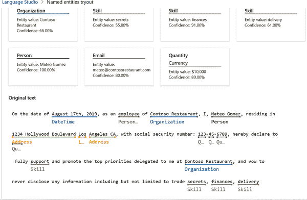
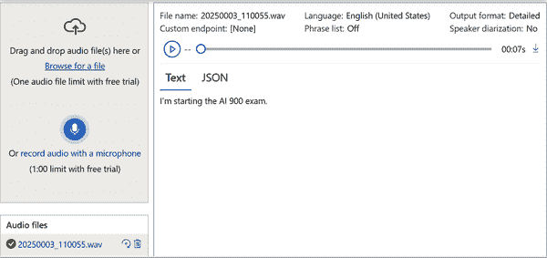
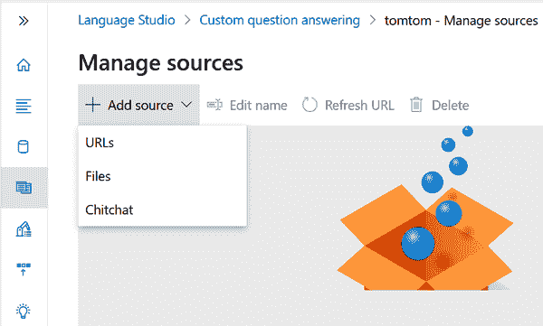
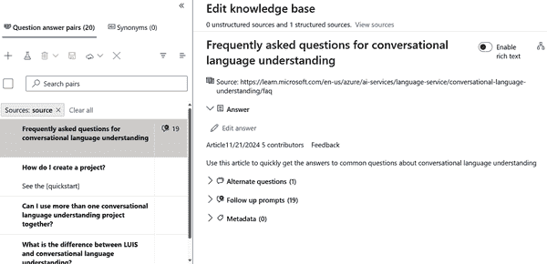
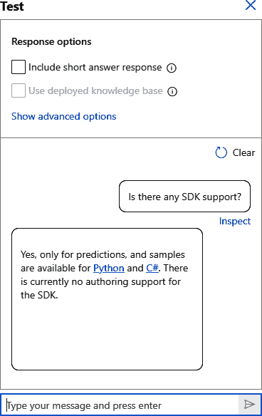

# 第七章\. Azure 上自然语言处理工作负载的特点

在本章中，我们将探讨自然语言处理（NLP），这是 AI-900 考试中约占 15%–20%的关键主题。我们将从核心 NLP 场景的探索开始。然后，我们将介绍 Microsoft Azure 的 NLP 服务，从关键短语提取和实体识别如何从文本中提取重要上下文开始。接着，我们将讨论情感分析，这是阅读书面语言中情绪的必备工具，并涵盖语言模型的基础知识。你还将找到关于语音识别和合成的介绍。这是机器学习理解和生成类似人类语音的地方。最后，我们将总结如何使用 NLP 与对话语言理解（CLU）和对话 AI 相结合。

# NLP 简介

想象一下让你的电脑不仅阅读，还能真正理解你说的话——这就是 NLP 的用武之地。NLP 是 AI 的一部分，它赋予机器解释和生成人类语言的能力。它涉及将文本和语音的复杂性分解，并将其转化为计算机可以处理的内容。这就是从你在 Google 上看到的搜索结果到聊天机器人，再到像 ChatGPT 这样的生成式 AI 应用，以及那些能够回应的语音激活助手背后的动力。通过弥合人类沟通和计算机逻辑之间的差距，NLP 使技术感觉更加直观——几乎就像它在倾听一样。

NLP 并非独立工作——它背后有两个强大的 AI 系统：机器学习（ML）和深度学习（DL）。ML 为 NLP 系统提供所需的模型和算法，以发现模式和做出预测。DL 则更进一步，使 NLP 能够处理复杂任务，如理解对话的上下文或评估情感。DL 模型模仿大脑的结构，使 NLP 系统在“思考”方面更接近我们。由于 ML 和 DL 帮助 NLP 从新数据中持续学习，这些系统在处理自然语言方面不断进步。

你将看到自然语言处理（NLP）的三种主要应用方式：

+   语言处理

+   语音识别

+   翻译

在语言处理中，NLP 可以进行诸如情感分析等活动，这是它如何从文本中捕捉情绪的，或者进行实体识别，即识别内容中的特定名称或地点。然后是语音识别和合成：这些技术使你的虚拟助手能够在你说话时理解和回应。当然，NLP 还支持翻译工具，打破语言障碍，使来自世界各地的人们能够轻松连接。

## 分词

*分词*是将单词和单词的部分分解成数字的过程，这些数字被称为*标记*。这是 NLP 过程中的第一步。它为 NLP 模型需要分析、分类或回应的单词或短语提供了框架。

让我们以一个例子来说明。假设我们有这个句子：

> 时间飞逝如箭，时间飞逝得快。

当我们标记这个句子时，每个单词（或标记）都会被赋予一个标识符。因为单词*time*和*flies*重复，即使它们出现两次，它们也只有一个标记 ID。以下是分解方式：

1.  时间

1.  飞逝

1.  像

1.  一个

1.  箭头

1.  快速

因此，我们的句子变成了一个标记序列：[1, 2, 3, 4, 5, 1, 2, 6]——也就是说，有八个单词但只有六个标记。

没有标记化，计算机会将句子视为一个连续的字符字符串，这对于分析没有用。将其分解下来允许 NLP 模型分别解释每个部分，并理解它们是如何一起工作的。

这里是标记化中的一些其他考虑因素：

文本规范化

在进行标记化之前，文本可能会进行规范化。这通常意味着将所有内容转换为小写并删除标点符号。在我们的例子中，规范化会将“时间飞逝如箭，时间飞逝得快”转换为“time flies like an arrow time flies fast。”规范化有助于简化处理，尽管有时需要特定的细节，如大写或标点符号。例如，在医疗环境中，“Dr. Johnson”和“dr”传达了非常不同的含义，其中“Dr.”表示头衔。

停用词删除

如*the*、*an*或*and*这样的词在大多数句子中都很常见，但并不总是增加有用的意义。通过删除这些停用词，NLP 系统可以强调核心内容。对于我们的句子，如果我们删除*like*和*an*，我们剩下“time flies arrow time flies fast”，这更多地关注了关键词。

N-gram

有时，NLP 模型不是将句子分解成单个单词，而是捕捉短语（例如，对于两个单词的大词组或对于三个单词的三词组）。例如，“时间飞逝”可以被视为一个词组来捕捉特定的短语，而不是将“时间”和“飞逝”作为单独的标记处理。这可以保留重要的上下文，例如在“纽约市”的情况下，如果将其拆分，可能会失去其含义。

词干提取

为了使分析更清晰，相似词语通常会被分组在一起。例如，*flying*、*flew*和*flies*可以被视为词根*fly*。在我们的例子中，两个*flies*实例都会链接回基础*fly*标记，这使得分析相关概念更容易。

词形还原

这将单词还原到其基本形式，或称为词元，因此不同版本的单词——如*running*、*ran*和*runs*——都映射回一个单一、一致的词根：*run*。与简单的词干提取不同，词形还原应用语言学规则以确保基本形式是有意义且语法准确的。这个过程通过分组相关词语使文本分析更精确。

## 频率分析

一旦你将单词分词，下一步就是*频率分析*：检查每个单词出现的频率。最常见的单词（忽略像*a*、*the*和类似的基本词汇）可能暗示文本的主要主题。以关于经济增长的政治演讲为例：最常见的单词可能包括*增长*、*就业*、*未来*和*经济*。如果我们查看单词对（二元组），一个常见的对可能是“新工作”，这指向了对就业和经济扩张的关注。

计算单词出现次数，称为*简单频率分析*，在检查单个文档时效果很好。但是，当你处理多个文档时，你需要一种方法来定位每个文档中最相关的单词。这就是*词频-逆文档频率（TF-IDF）*的作用所在。这种方法通过比较单词在文档中出现的频率与整个文档集的频率来对单词进行评分。在单个文档中频繁出现但在其他文档中罕见的单词会显得特别相关。

在频率分析中还有一些额外的考虑因素：

简单频率分析的局限性

虽然简单的频率分析或二元分析可以提供有用的初步见解，但它可能会错过细微差别或上下文。常用词汇并不总是能表明主要主题，尤其是如果它们是通用的或依赖于上下文。在分析复杂或较大的文档时，更高级的方法，如 TF-IDF、潜在狄利克雷分配（LDA）或其他主题建模技术，通常更有洞察力。*LDA*是一种统计模型，通过寻找频繁一起出现的单词组来识别文档集中的主题。这有助于揭示潜在的主题或主题，使得分析和大批量文本的分类变得更加容易。

TF-IDF 的更广泛用途

TF-IDF 不仅用于寻找相关单词，还用于相似性分析，以将相关文档分组，使其成为信息检索和推荐系统等任务的有力工具。

高级上下文模型

为了获得更深入的见解，像 word2vec、BERT（双向编码器表示，来自转换器）或其他上下文嵌入等技术考虑了每个单词的意义，基于周围的文本，这为文档中的主题带来了更大的清晰度，并改善了摘要、情感分析和主题检测等任务。

## 文本分类

另一种分析文本的强大方式是使用分类算法，如逻辑回归，根据预定义的标签对其进行分类，这被称为*文本分类*。这种技术的常见应用是对社交媒体帖子进行情感分析。

假设你正在处理已经被标记为 0（批评）或 1（支持）的社交媒体评论：

+   “这项倡议正是我们所需要的！” = 1

+   “对目前的结果完全失望” = 0

+   “干得好！继续保持！” = 1

+   “这种方法完全偏离了重点” = 0

通过足够的标记示例，你可以训练一个分类模型，使其学会区分支持和批评的帖子。使用分词文本作为特征和情感标签（0 或 1），模型开始检测模式。例如，包含像*伟大*、*完全正确*或*工作*这样的词的评论往往表示支持，而像*失望*或*错过*这样的词则表示批评。

要使这成为可能，你需要将单词转换为数字。基本方法，如词袋模型和 TF-IDF 分数，根据频率评估单词的重要性，而高级嵌入，如 word2vec 或 GloVe，则根据上下文捕捉意义。逻辑回归是一个好的起点，但其他算法如朴素贝叶斯和支持向量机（SVM），深度学习模型如循环神经网络（RNN）或转换器可以提升性能，特别是对于更大的数据集或细微的内容。

为了确保你的模型有效，请使用准确率、精确率、召回率和 F1 分数等指标对其进行评估，这些指标揭示了模型对新数据的泛化能力。但请记住，模型可能在讽刺等细微之处遇到困难。例如，一个像“喜欢这种努力……结果当然是有意义的”这样的评论可能会被误解为支持性的。

分类模型的应用远不止于对社交媒体情感进行排序，例如按类别（例如，“政治”、“娱乐”或“健康”）标记新闻文章，甚至可以发现趋势性话题——这显示了文本分类的多样性。

## 语义语言模型

在自然语言处理的世界里，模型已经取得了长足的进步，使得捕捉词语之间深层次和细微的关系成为可能。秘密在于嵌入——本质上是多维数字数组，将每个单词或标记映射到空间中的唯一点。

将嵌入中的每个元素想象成多维空间中的一个坐标。每个标记——无论是“咖啡”、“拿铁”还是“足球”——在这个空间中找到自己的位置。意义相关的标记彼此更接近。以下是一个三维空间的快速示例：

+   “咖啡”：[9, 2, 3]

+   “茶”：[9, 2, 2]

+   “咖啡因”：[8, 2, 3]

+   “拿铁”：[9, 3, 3]

+   “足球”：[1, 7, 3]

图 7-1 展示了这些项目的绘图。


###### 图 7-1\. 嵌入的绘图

绘图显示，“咖啡”、“咖啡因”和“拿铁”聚集在一起，而“足球”则位于旁边，这表明语义联系较少。这种布局有助于我们观察词语之间基于意义的关联模式。

被称为*语义语言模型*的高级模型，将这些嵌入添加了复杂性。例如，BERT 和 GPT 模型使用所谓的*上下文嵌入*。这意味着单词*银行*在“河岸”和“国家银行”中的表示不同，有助于模型更好地理解意图。

你会如何可视化高维嵌入？你可以使用主成分分析（PCA）或 t 分布随机邻域嵌入（t-SNE）等技术，这些技术将这些多维度嵌入简化为二维或三维视图。这使得观察标记之间的关系变得容易得多。大多数嵌入最初都是在庞大的数据集上训练的（例如 word2vec 或 GloVe），它们可以后来针对特定领域进行微调，例如法律或医学内容。

从这些嵌入中学习通常依赖于自监督学习，其中模型通过预测缺失或下一个单词来教自己。这对于构建多语言嵌入很有帮助，其中具有相似意义的跨语言单词在嵌入空间中找到相似的位置。

但嵌入技术并非没有问题。它们可能会反映训练数据中存在的偏差，例如将人口统计群体与某些角色联系起来，这可能导致预测结果偏差。通过去偏差技术纠正这些偏差对于公平、负责任地使用至关重要。

# Azure NLP 服务

微软 Azure 为 NLP 提供三项主要服务：Azure AI 语言、Azure AI 翻译器和 Azure AI 语音。让我们逐一看看。

首先，*Azure AI 语言*通过一系列预配置和可定制的功能，使您能够理解、分析和响应文本数据。它还拥有针对不同复杂程度的工具。表 7-1 描述了该服务的功能。

表 7-1\. Azure AI 语言功能

| 特征 | 描述 |
| --- | --- |
| 命名实体识别（NER） | 在非结构化文本中识别实体，如名称、日期和位置，并将它们分类到组中以方便组织 |
| 个人信息（PII）和受保护健康信息（PHI）检测 | 在文本中检测、分类和编辑敏感信息，包括个人可识别信息（PII）和受保护健康信息（PHI） |
| 语言检测 | 识别文本文档的语言并返回检测到的语言的代码，涵盖广泛的语言和方言 |
| 情感分析和意见挖掘 | 分析文本以确定正面或负面情感，提供客户反馈和公众舆论的见解 |
| 摘要 | 通过提取关键句子，对文档或转录进行简洁的总结 |
| 关键短语提取 | 识别文本中的主要概念，返回一组关键短语以突出主要主题或话题 |
| 实体链接 | 将文本中的术语和实体与如维基百科等参考资料进行消歧义，提供额外的上下文 |

Azure 提供的第二项服务是*Azure AI 翻译器*。该服务使应用程序能够即时将文本翻译成多种语言。表 7-2 描述了该服务的功能。

表 7-2\. Azure AI 翻译器功能

| 特征 | 描述 |
| --- | --- |
| 文本翻译 | 在支持源语言和目标语言之间即时翻译文本，提供创建自定义词典和管理翻译异常的选项 |
| 文档翻译 | 提供两种模式：针对大量文件集的异步批量翻译，保留 Azure Blob Storage 中的格式和结构，以及针对单个文档的同步翻译，无需存储要求即可保留结构 |
| 定制翻译器 | 允许针对特定行业语言、术语和风格定制翻译模型，包括创建用于定制翻译的专业词典 |

第三项服务，*Azure AI 语音*，旨在将口语转换为文本，反之亦然。表 7-3 列出了此服务的功能。

表 7-3\. Azure AI 语音功能

| 功能 | 描述 |
| --- | --- |
| 语音转文本 | 将音频转录为文本，来源包括麦克风和音频文件，实时或批量处理，功能包括说话人分割和自动格式化以提高可读性 |
| 实时语音转文本 | 提供即时转录实时音频，非常适合需要即时文本的应用，如实时会议字幕、发音评估和客户服务中心支持 |
| 文本转语音 | 使用神经网络声音将书面文本转换为逼真的合成语音，提供音调、发音和速度的定制选项 |
| 快速转录 API | 提供快速、同步的转录选项，适用于预录音频，以最小延迟提供结果，适用于紧急任务，如视频转录和快速音频处理，可通过预览 API 获取 |

接下来，我们将探讨这些服务以及它们如何与自然语言处理（NLP）应用协同工作。

## 关键短语提取

*关键短语提取* 是一种自然语言处理技术，它识别文本中最相关或短语。这可以确定主要主题或主题，而无需分析整个文档。关键短语提取是自然语言处理中的一个宝贵工具，因为它使系统能够快速掌握文本的核心内容，这对于总结、内容标记或索引大型文档等任务至关重要。

关键短语提取的典型用途遍及众多领域。例如，在客户服务中，关键短语提取可以帮助识别客户反馈中的主要关注点或经常提到的问题，使团队更容易解决常见问题。这项技术还支持社交媒体分析，通过快速识别用户生成内容（如推文或帖子）中的热门话题，从而使品牌能够理解公众情绪或新兴讨论。

考虑一个更详细的例子：一家公司正在分析一款新产品的客户评价。使用关键词提取，模型识别出常见的短语，如“易于使用”、“电池寿命”和“客户支持”。这些提取出的短语帮助公司了解客户最常讨论的功能，而无需手动阅读每一篇评价。此外，负面短语如“设置困难”或“电池寿命短”使公司能够确定需要改进的领域。

让我们看看如何使用[Azure AI Language Studio](https://oreil.ly/8gTK0)进行关键词提取。一旦你进入 Language Studio 的控制台，选择“提取信息”，然后点击“提取关键词”。你会找到不同类型的文本示例，例如旅行、医疗报告和银行。我们选择银行。这是一位客户请求取消信用卡的消息，因为信用卡丢失了。点击运行。图 7-2 显示了结果。

在顶部是提取出的关键词。它们包括地址、链接的电子邮件账户、社会保障号码和 SWIFT 代码等详细信息。以下是带有提取出的关键词高亮的原始文本。


###### 图 7-2\. 从关于信用卡取消的消息中提取的关键词

## 实体识别

*实体识别*，通常被称为*命名实体识别（NER）*，是人工智能中的一个过程，你教会模型识别和分类文本中的元素或实体。这些实体可能是人名、地名、组织、日期，甚至是产品——基本上，任何在文本中有意义且独特的元素。将 NER 视为一种自动突出或标记信息关键部分的方法。这使得在没有手动排序的情况下分析和分类数据变得更加容易。

NER 的一个常见用例是用于客户服务聊天机器人识别用户的姓名、位置或问题类型。这使得系统能够个性化响应。在法律或金融领域，NER 可以从文档中自动提取合同日期、客户姓名或财务数据，减少繁琐的人工审查需求。NER 还增强了搜索引擎，通过帮助引擎理解关键词背后的上下文，使搜索结果更加相关。

实体识别实际上是如何工作的？它遵循几个关键步骤。首先，模型通过将其分解为更小的部分（如句子或单词）对文本进行预处理。然后，它使用语言算法根据模式识别潜在的实体。之后，它将这些实体分类到类别中，如“人”或“组织”。最后，模型根据训练数据调整其猜测，并生成一个已识别实体的列表。

这里有一个快速示例来使这一点更加生动。假设我们有一个这样的句子：“约翰·多伊（John Doe）于 2024 年 10 月 10 日从 TechCorp 打电话询问季度报告。”在通过 NER 模型运行后，我们得到表 7-4 中所示的结果。

表 7-4\. 使用 NER 的结果

| 实体 | 类型 |
| --- | --- |
| 约翰·多伊 | 人物 |
| TechCorp | 组织 |
| 2024 年 10 月 10 日 | 日期 |
| 季度报告 | 杂项 |

当使用 Azure AI Foundry 时，你可以选择“提取命名实体”。然后，选择“医疗报告”并点击运行。图 7-3 显示了找到的实体列表以及标记它们的原始文本。如果你悬停在其中一个高亮处，你将看到更多详细信息，例如置信度水平。

*命名实体链接（NEL）* 将命名实体识别（NER）推进了一步，不仅识别文本中的实体，还将它们与独特的、现实世界的引用相连接。假设你正在阅读一篇文章，提到巴黎。使用实体链接，AI 模型不仅会识别巴黎为一个地点；它还会根据上下文理解文章是指法国的巴黎还是德克萨斯州的巴黎。实体链接就像给每个实体分配一个唯一的 ID 或链接到数据库。这有助于减少对术语所代表内容的混淆。

实体链接在许多领域都很有用。在新闻聚合中，它有助于确保所有对特定事件或人物（如首席执行官或名人）的引用都一致指向相同的个人资料，避免重复。在医疗保健领域，实体链接可以自动将提及的医疗状况与治疗、症状和研究文章的知识库相连接。



###### 图 7-3\. 医疗报告的 NER

## 情感分析

我在本章前面提到了情感分析，但现在让我们更深入地探讨它。*情感分析*就像给你的 AI 模型赋予情感智能。它允许系统洞察言外之意，并确定一段文本是积极的、消极的还是中性的。本质上，情感分析通过分析文本中的单词和短语来了解它们背后的情绪或感觉。因此，无论你是在分析客户评论、社交媒体评论还是调查回复，情感分析都可以帮助你了解人们对产品、服务或主题的感受，而无需人工逐个检查。

在客户服务中，情感分析可以标记负面评论或投诉，以便代理可以更快地响应。在营销中，它有助于通过监控社交媒体或评论网站上的情感来跟踪品牌声誉随时间的变化。在产品开发中，分析反馈可以发现客户满意度的趋势，或突出需要修复的重复性问题。

表 7-5 展示了一个情感分析的例子——具体来说，是对以下评论的分析：“新手机的摄像头很棒，但电池续航令人失望。”

表 7-5\. 产品评论的情感分析

| 短语 | 情感 | 分数 |
| --- | --- | --- |
| 新手机的摄像头 | 正面 | +2 |
| 棒极了 | 正面 | +3 |
| 电池续航 | 中性 | 0 |
| 令人失望的 | 负面 | -3 |

然后，人工智能会将这些分数汇总，以生成评论的整体情感分数。在这里，分数可能会偏向中性或略为积极，因为对摄像头的热情与对电池的失望相平衡。

## 语言检测

*语言检测*是 Azure AI 语言服务的一项功能，用于识别给定文本的语言。它支持超过一百种语言。此服务允许同时处理多个文档。结果包括：

+   语言名称

+   ISO 639-1 语言代码（如“fr”这样的两字母代码，它是国际语言表示标准的一部分）

+   置信度分数

为了说明，假设你运营一个旅游论坛，用户在上面发布关于全球目的地的反馈。以下是收到的三个反馈示例：

+   反馈 1：“这是一个观鸟和远足的绝佳地点。”

+   反馈 2：“员工非常热情和乐于助人。”

+   反馈 3：“这是一个与家人放松的完美地点。”

表 7-6 展示了 Azure AI 语言提供的结果。

表 7-6\. 消息论坛的语言检测

| 文档 | 语言 | ISO 639-1 代码 | 置信度分数 |
| --- | --- | --- | --- |
| 反馈 1 | 英语 | en | 0.8 |
| 反馈 2 | 法语 | fr | 1.0 |
| 反馈 3 | 意大利语 | it | 0.9 |

当评论包含多种语言时，Azure 会专注于主要语言。这提供了一个单一的语言标签，如果检测到多种语言，置信度分数可能会略低。在内容最少或含糊不清的情况下，例如简单的表情符号或符号，Azure 可能会将语言标记为“未知”，并将语言标识符留空，使用“NaN”（非数字）分数来表示它无法自信地确定语言。

## 语音识别和合成

当涉及到人工智能和语音时，有两个关键技能使这一切得以工作：语音识别和语音合成。*语音识别*是使人工智能能够听取语音输入并理解所说内容的能力。另一方面，*语音合成*是人工智能生成语音输出的方式。这本质上使它能够“回应”你。这些能力结合起来，使人工智能能够进行自然、双向的对话，创造更多互动和个性化的体验。

### 语音识别

语音识别技术为许多日常便利提供了动力：

会议转录

AI 可以创建你的 Zoom 通话或会议的完整转录，这样你就可以专注于会议而不需要做笔记。

实时字幕

在直播中，字幕确保你不会错过任何细节。

语音激活的客户服务

你可以与系统交谈，而无需导航菜单选项。AI 会理解并将你连接到你想要的内容。

听写

自由说话，AI 会将你的话转录成笔记，这对于快速捕捉想法或无需动手管理日常任务来说非常理想。

语音识别是如何工作的？它首先捕获你的音频输入，然后进行特征提取，其中 AI 会隔离和分析声音特征。声学模型将这些特征转换为音素，然后语言模型使用统计概率将音素映射到单词。最后，解码过程细化输出。这将从语音中创建清晰准确文本。

要在 Azure 中查看此功能，你可以访问[语音工作室](https://oreil.ly/zlmtI)并选择“实时语音转文本”。选择一种语言，然后上传音频文件或创建一个。对着电脑的麦克风说话，系统会随着你的说话将你的话转换为文本。它甚至还会创建一个*.wav*音频文件，你可以下载。你可以在图 7-4 中看到这一点。



###### 图 7-4\. Azure 的语音转文本功能

当你查看 JSON 时，你会看到一个详细的输出描述，包括每个单词的偏移量和持续时间。以下是一个片段：

```py
            {
                “Confidence”: 0.6879325,
                “Lexical”: “i’m studying the AI nine hundred exam”,
                “ITN”: “i’m studying the AI 900 exam”,
                “MaskedITN”: “i’m studying the ai 900 exam”,
                “Display”: “I’m studying the AI 900 exam.”,
                “Words”: 
                    {
                        “Word”: “i’m”,
                        “Offset”: 10800000,
                        “Duration”: 2400000
                    },
                    {
                        “Word”: “studying”,
                        “Offset”: 13200000,
                        “Duration”: 4000000
                    },
```

### 语音合成

在内部，语音合成依赖于几个基本步骤。它从文本分析开始，分解文本的结构和意义。然后韵律和声学建模添加音调、音高和强调，使语音具有自然的节奏。最后，波形生成将所有这些转化为音频，创建出清晰、类似人类的声音。有了这些功能，语音合成提供了一种更吸引人、更互动的体验，感觉就像真正的对话。

这里有一些语音合成的用例：

无需动手阅读

语音合成大声朗读文章、消息或笔记，在你分心时保持你的参与度。

步步指导

当你遵循食谱或锻炼计划时，例如，应用程序可以大声朗读说明，这样你就可以在没有屏幕的情况下保持专注。

虚拟助手响应

友好的声音会回答你的问题，无论是查看天气预报还是询问路线。

公共公告

语音合成使得广播重要信息变得容易，创造出清晰易懂的公共信息。

GPS 导航

GPS 系统逐个引导你转弯，朗读方向，这样你就可以专注于道路。

## 翻译

当我们在跨文化和语言的环境中工作时，打破语言障碍变得至关重要。当然，雇佣多语言人才可以有所帮助，但随着语言及其组合的数量庞大，这种方法的扩展很快就会成为一个挑战。这时就出现了 *机器翻译*——旨在弥合语言鸿沟的自动化系统。

机器翻译为语言障碍提供了可扩展的解决方案，但替换一个词与另一个词并不简单。单词本身并不能承载全部的意义。语调、语境和意图也必须跨越这个界限。

为了应对这一挑战，机器翻译技术需要超越仅仅理解单个单词的层面。它必须把握整体画面，考虑诸如语境、非正式或正式语调、俚语以及独特的语法规则等因素。只有这样，它才能提供自然流畅且忠实于原文意图的翻译。

您可能已经在日常工具中遇到过文本翻译：从翻译政府文件到点击社交媒体帖子上的“翻译”按钮。然后是语音翻译，它允许将口语直接从一种语言翻译成另一种语言。无论是将口语转换为文本再进行翻译，还是实现语音到语音的翻译，这项技术正在使跨语言实时对话变得更加容易。

机器翻译依赖于先进的算法和神经网络。这些网络处理大量的多语言文本数据，以理解不同语言之间的语言模式、结构和意义。通过描绘出各种语言中单词之间的关系，系统学会创建更准确的翻译。

机器翻译的美丽之处在于其持续改进。随着这些系统与用户互动并处理新的语言数据，它们随着时间的推移不断提高准确性。这种迭代学习帮助人工智能跟上不断变化的语言趋势和文化细微差别。

## 会话语言理解

*会话语言理解（CLU）* 使您能够创建能够理解和回应日常会话短语的语模型。假设您正在告诉一个虚拟助手，“调暗厨房的灯光。”使用 CLU，助手不仅理解了命令，而且确切地知道您指的是哪盏灯，因此您会得到您所期望的精确响应。这个工具特别适用于涉及命令与控制、客户支持或大规模企业解决方案的应用。

为了构建一个有效的模型，您将需要与三个基本元素一起工作：

话语

用户可能会说的例子，例如：“请拉下客厅的窗帘。”

实体

话语中的具体项目。在“启动咖啡机”中，“咖啡机”是实体——它告诉系统要执行什么操作。

意图

话语背后的目的。对于“启动咖啡机”，意图可能是“开启”，表示用户想要打开设备。

将所有这些组件组合起来，这些组件指导模型识别不同的动作。[表 7-7 是这些可能看起来的一个快照。

表 7-7\. CLU 元素

| 意图 | 样本话语 | 实体 |
| --- | --- | --- |
| 问候 | “再见，再见” | N/A |
| 开启 | “打开加热器” | 加热器（设备） |
| 关闭 | “关掉电视” | 电视（设备） |
| 查看新闻 | “给我最新的新闻” | N/A |
| 无 | “为什么天空是蓝色的？” | N/A |

“无”意图作为任何不符合定义意图的输入的通配符，因此您的模型可以优雅地处理意外问题或不相关的陈述。

要使 CLU 模型运行良好，需要几个步骤：

定义您的模式

考虑您的模型需要知道什么。识别用户动作的意图以及您想要捕获的特定实体。

标注您的数据

正确标注每个话语的相关意图和实体——这一步对于准确训练至关重要。

训练您的模型

您的模型通过标注的示例进行学习，逐渐提高其识别模式和预测结果的能力。

评估其性能

测试模型以查看其如何准确地使用新数据识别意图和实体。

精炼和重新训练

根据您的模型测试性能，您可能需要调整和重新训练以提高准确性。

部署模型

当模型准备就绪时，部署模型以便您可以通过 Runtime API 使用它来解释现实世界的用户输入。

这里有一些您可以使用 CLU 的流行方式：

企业机器人

在大型公司中，基于 CLU 的机器人可以通过与多个服务协调来简化如查找人力资源、回答常见问题或帮助安排的任务。

医疗保健虚拟助手

虚拟助手可以帮助患者安排预约、提供药物提醒，甚至帮助分级症状。它可以自动化医疗保健人员的任务，例如患者登记或回答有关健康服务的常见问题。

电子商务推荐

在在线购物应用中，CLU 可以帮助虚拟助手理解自然语言购物请求，如“显示 100 美元以下的运动夹克”或“我需要一个 10 岁孩子的礼物”。然后助手可以检索相关商品，使购物体验更加顺畅。

## 对话式人工智能

想象一下：你是一位客户，现在是午夜。你对一个产品有问题，并希望得到快速回答——无需等待支持团队或深入研究冗长的文档。这就是对话式人工智能介入的地方，随时准备在多个平台上协助您，从网页聊天到社交媒体。

通过*对话式 AI*——特别是通过“机器人”——公司可以跟上客户对快速、个性化响应的需求。这些机器人被设计用来回答问题、解决问题，并以自然、友好的语言引导您。当它们由 Azure AI 语言的问题回答功能等工具提供支持时，它们可以更进一步。此功能允许机器人提供对常见问题的实时答案，并自然地处理多部分对话，只有在问题更复杂时才会将您转接到人类。

一个机器人有效性的重要元素是其与包含问答对的相应知识库的集成。一个信息丰富的机器人，连接到公司的问答内容库，可以提供准确、最新的信息，反映最新的产品、服务和常见问题解答。这种设置确保客户获得可靠的答案，并降低客户被过时或不相关信息误导的风险。

让我们来看一个例子。访问[Azure AI 语言工作室](https://oreil.ly/Sd_hv)并创建一个 Azure 搜索资源：点击“创建新资源”并选择“自定义问答”。

然后，您将进入一系列配置屏幕。首先是“选择语言设置”。在这里，选择英语并点击下一步。您将被带到“输入基本信息”部分。为项目输入一个名称和描述，然后选择当 AI 无法找到用户问题的答案时的默认选项“未找到答案”。点击下一步然后选择“创建项目”。

图 7-5 显示了仪表板。

在屏幕的左上角，点击“添加源”，您将看到一些菜单选项。这就是您可以添加知识库的地方，无论是通过 URL 还是文件。我们将选择 URL 选项并使用这个[链接](https://oreil.ly/vd6nx)。这是微软 Azure 的对话式语言理解常见问题解答（您也可以添加多个 URL）。点击定制的 URL，您将看到图 7-6 中的屏幕。



###### 图 7-5\. 创建知识库对话式 AI 系统的仪表板



###### 图 7-6\. Azure AI 创建的知识库屏幕

在屏幕的左侧，您可以看到 Azure AI 语言如何将常见问题解答（FAQ）解析为问答对。如果您点击其中之一，您将获得不同的选项来自定义问题：

+   编辑答案。

+   当用户可能有多种方式询问相同的问题时，添加问题的不同说法。这些替代问题应该在措辞上尽可能不同，同时保持意义不变，并且列表应限制在最多 10 种变化。

+   在多轮对话中，通过后续提示将问题-答案对链接起来。这种链接允许客户端应用程序提供主要答案，并在需要时提供额外的用户选择问题。要查看特定问题-答案对的所有连接，请选择“查看上下文树”。

+   分配元数据标签以帮助客户端应用程序细化用户查询的结果。例如，像“商店营业时间是什么？”这样的问题可能会根据特定的商店位置产生不同的响应——例如，如果元数据是“位置：纽约”与“位置：洛杉矶”。通过使用元数据标签，应用程序可以提供针对用户特定需求的答案。

你可以通过点击屏幕左上角的 flask 图标来测试这个。显示了该聊天机器人。



###### 图 7-7. 测试知识库 AI 系统的聊天机器人

正如你所见，我问道：“有 SDK 支持吗？”我得到了正确的答案，还有可点击的链接。

如果你点击检查，你将得到 AI 如何得出答案的分析。同时也会有置信度分数。

# 结论

我们已经探讨了诸如 NLP、分词、频率分析以及其他构成 AI 理解基础的关键概念。这些领域对于理解 AI 的工作原理至关重要，同时也对于在 AI-900 考试中遇到的具体问题进行导航至关重要。

# 测验

为了检查你的答案，请参考“第七章答案键”。

1.  以下哪个 Azure AI 服务能够实现文本到多种语言的即时翻译？

    1.  Azure AI 语言

    1.  Azure AI 语音

    1.  Azure AI 翻译器

    1.  Azure AI 情感分析

1.  NLP 中命名实体识别（NER）的主要功能是什么？

    1.  为了分析情感

    1.  为了检测语言

    1.  为了识别和分类实体

    1.  为了提取关键短语

1.  Azure AI 语音的哪个功能允许实时转录现场音频？

    1.  文本转语音

    1.  摘要

    1.  实时语音转文本

    1.  定制翻译器

1.  在 NLP 的背景下，分词是什么？

    1.  为每个实体分配一个唯一的标识符

    1.  将文本转换为语音

    1.  将文本分解成单个单词或短语

    1.  在文本中检测语言

1.  以下哪个最好地描述了 Azure 的关键短语提取功能？

    1.  它对文本中的实体进行分类。

    1.  它突出显示主要概念或主题。

    1.  它检测文档的语言。

    1.  它在文本中分析情感。

1.  在 Azure 中，哪个 NLP 功能最适合识别敏感信息，如社会保障号码？

    1.  语言检测

    1.  关键短语提取

    1.  PII 检测

    1.  情感分析

1.  哪个术语指的是在 NLP 处理过程中移除不增加意义的常见单词，如*the*和*an*？

    1.  词形还原

    1.  停用词去除

    1.  分词

    1.  频率分析

1.  在 Azure AI Language Studio 中，您会使用哪个功能来自动将像“巴黎”这样的实体链接到特定的参考？

    1.  实体识别

    1.  实体链接

    1.  语言检测

    1.  摘要

1.  Azure AI Speech 中的快速转录 API 的目的是什么？

    1.  翻译文本

    1.  提供快速、同步的音频转录

    1.  在音频中检测情感

    1.  将文本转换为逼真的语音

1.  哪个 Azure 功能可以用来通过提取关键句子来总结大量文本？

    1.  文本到语音

    1.  摘要

    1.  语言检测

    1.  实体识别
