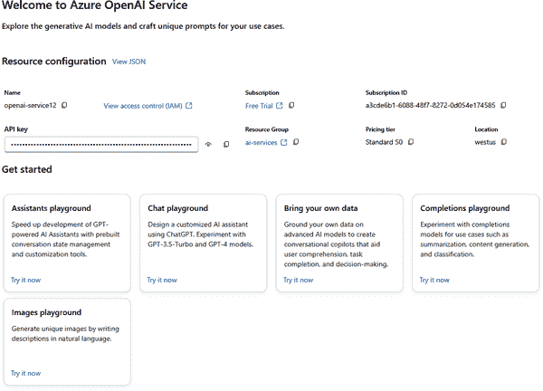

# 第八章\. Azure 上生成式 AI 工作负载的特点

大约 15%–20% 的 AI-900 考试内容是关于生成式 AI 的功能和场景，我们将在本章中介绍。这包括理解模型如何生成响应、创建图像和编写代码片段。我们还将探讨生成式 AI 的典型场景，以便你将理论知识与实际应用联系起来。这部分考试不仅仅是关于了解生成式 AI 是什么——它还关于识别其在现实世界用例中的影响和相关性。

考试的另一个关键领域涉及负责任的 AI。这包括理解 AI 生成内容的伦理影响以及 Microsoft Azure 为确保其生成式 AI 工具安全且负责任地使用所采取的措施。通过掌握这些主题，你将充分准备回答有关 Azure 的生成式 AI 服务如何在各个领域有效且负责任地应用的问题。

# 理解生成式 AI

在其核心，生成式 AI 依赖于训练有素以以直观和类似人类的方式理解和回应语言的模式。当你要求生成式 AI 生成内容时，它会利用大量数据并应用数学算法来实现这一点。

生成式 AI 已迅速成为商业世界的核心。它吸引了各行各业对它的关注，因为它有潜力简化任务、激发创造力和推动生产力。像 OpenAI 的 ChatGPT 和 Microsoft 的 Copilot 平台这样的突破性应用已经展示了这项技术可以如何改变一切。例如，ChatGPT 已经开辟了处理客户服务、内容创作和头脑风暴的新方法，所有这些都以惊人的效率和个性化完成。同时，Microsoft 的 Copilot 直接集成到广泛使用的工具如 Word 和 Excel 中，使专业人士能够处理复杂数据、起草报告和自动化常规流程。

与生成式 AI 一起工作的最简单方法之一就是简单地用自然语言输入。你输入一个提示，这是一个直接的要求，AI 就会回应你所寻找的内容。图 8-1 展示了在使用 [Microsoft Copilot](https://oreil.ly/2Oy0y) 时的一个例子。这是提示：

> 写一份专业简介，介绍我作为拥有软件开发背景并对团队领导充满热情的项目经理。

Microsoft Copilot 然后写出一个好的响应。


###### 图 8-1\. 使用 Microsoft Copilot 时的文本响应

某些生成式 AI 工具可以将简单的请求转换成独特的图像。例如，你可能输入：“为一个小镇上的温馨悬疑小说设计一个吸引人的书封。” 图 8-2 展示了由 Microsoft Copilot 生成的图像。


###### 图 8-2\. 由 Microsoft Copilot 根据提示创建的图像

最后，生成式人工智能可以创建、调试和审查数十种语言的代码，包括 C++、Java 和 Python。以下是一个提示：

> 编写 Python 代码以计算圆的面积，给定其半径。

图 8-3 展示了结果。


###### 图 8-3\. Microsoft Copilot 如何根据提示创建代码

Microsoft Copilot 生成您请求的代码。您可以通过点击右上角来复制代码并在您的集成开发环境（IDE）中（如 Visual Studio Code）使用它。Copilot 还提供了程序工作原理的简要描述。

## 高级语言模型

生成式人工智能应用利用高级语言模型——专门为自然语言处理（NLP）任务设计的机器学习（ML）系统。这些模型提供了一个强大而灵活的工具包，远远超出了生成文本和图像的能力。以下是它们多样化能力的快照：

通过无监督学习进行模式识别

人工智能可以在没有标记数据的情况下检测大型数据集中的模式和结构，从而使其能够自主地发现洞察。

模糊性的解释

模型通过分析上下文来解析模糊的语言。这使得它们适合进行细微的任务，如情感分析或处理复杂的客户咨询。

摘要

模型可以快速提炼长篇内容，提取关键要点——这对于使密集的报告、法律简报或新闻摘要易于理解至关重要。

多语言翻译

通过掌握文化细微差别和上下文微妙之处，这些模型能够准确翻译语言。

对问题的上下文响应

模型根据上下文回答问题——例如，以加强客户支持和使帮助台交互更加顺畅。

逼真对话的创建

生成式人工智能产生逼真的对话，非常适合虚拟助手、聊天机器人和动态角色交互。

异常检测

通过识别不规则模式，这些模型可以捕捉到金融数据、医疗记录或安全日志中的不一致性。

语义搜索

与仅依赖关键词不同，人工智能基于意义进行搜索。这有助于用户以最小的努力找到相关信息。

个性化推荐

人工智能根据用户配置文件定制内容和推荐，这对于营销、客户服务和提升用户体验非常有价值。

内容审查

这些模型可以识别并标记不适当或敏感的内容，从而促进更安全和更合规的数字空间。

## 转换器模型

自然语言处理（NLP）的机器学习（ML）模型已经发生了巨大变化，导致了基于转换器架构的今天的高级系统。这种架构改变了机器处理语言的方式。利用它们训练所使用的大量数据，这些模型学习词语之间微妙的联系，这使得它们能够预测出自然且合乎逻辑的序列。

变换器由两个关键组件构建：

编码器块

检查输入文本并识别词汇中的有意义关系

解码器块

使用编码器的输出生成相关且上下文适当的语言

让我们更详细地看看这一切是如何结合在一起的。在训练过程中，模型处理来自书籍、网站和其他来源的大量文本。它将信息分解成标记（如单词或词的一部分这样的小单元）并将这些提供给编码器。通过称为“注意力”的过程，编码器弄清楚每个标记如何与其他标记相关，识别出如“蝙蝠”作为飞行的哺乳动物与体育用品之间的区别等模式。这些关系存储为嵌入，它们是表示每个标记意义的数学向量。然后解码器使用这些嵌入生成新的文本序列。例如，如果你提供输入“神秘的包裹到了”，模型可能会继续“在我家门口”，基于它在训练期间学习的类似句子。

不同的变换器模型以专门的方式使用这些块。例如，Google 的 BERT 模型利用编码器来理解搜索结果中的上下文。OpenAI 的 GPT 模型专注于解码器，这使得它成为生成创意内容和以自然、对话式的语言回答问题的强大工具。

在接下来的几节中，我们将更深入地探讨变换器模型的关键组件。

### 变换器中的分词

在上一章中，我们深入探讨了分词的概念。让我们在此基础上继续构建。分词是训练变换器模型的基本第一步。

OpenAI 使用[Tokenizer](https://oreil.ly/PGIwn)，其一个示例在图 8-4 中显示。Tokenizer 将文本转换为标记和 ID。

在顶部，你可以选择不同的模型类型来使用：GPT-4o/GPT-4o mini、GPT-3.5/GPT-4 或 GPT-3（旧版）。你需要知道你使用的是哪种模型，因为分词基于模型而有所不同。

对于图 8-4 中的示例，我们使用了这个句子：

> 人工智能  如机器学习和自然语言处理，正在从医疗保健到金融等行业中改变产业，激发数据驱动决策的创新。


###### 图 8-4\. OpenAI 的 Tokenizer 的一个示例，它将文本转换为 LLM 的标记

注意，一个标记可以包括一个与单词的空间。它也可以是标点符号或表情符号。在某些情况下，一个单词可能由两个或更多标记组成。

如果你点击标记 ID，你将获得分词的向量：

```py
[186671, 22990, 93643, 244, 11, 1299, 7342, 7524, 326, 6247, 6439, 12323, 11, 
382, 64779, 22751, 591, 20072, 316, 17496, 11, 30281, 6962, 21879, 306, 1238, 
45932, 8660, 42074, 13]
```

这就是变换器模型将要处理的内容。

随着模型的进一步训练，训练数据中的每个额外标记都会被纳入词汇表，并分配一个唯一的标记 ID。随着时间的推移，随着数据集的不断扩大，词汇表可以增长到包含数千个标记。

### 嵌入（Embeddings）

想象一下，试图仅凭一份书名列表，每个书名都分配了一个唯一的编号，来导航一个大图书馆。当然，数字可以帮助你定位个别书籍，但它们并不能提供关于每本书的内容、其类型或与其他书籍之间可能存在的任何联系的线索。当涉及到在词汇表中用标记 ID 表示单词时，情况类似：是的，它对索引很有用，但它缺乏对意义或关系的洞察。

为了构建一个更有意义的语言地图，我们使用嵌入，这是我们在上一章中学到的。

在向量空间中，具有相似意义的单词会彼此靠近，空间中的方向表示它们的关系。例如，像*king*和*queen*这样的单词可能在空间中的方向几乎相同，但在维度上略有不同，区分了阳性和阴性的概念。这种语义邻近性使得嵌入能够捕捉微妙的关系。

创建这些嵌入并非易事。像 word2vec 这样的算法，它使用神经网络处理大量文本，或者今天推动高级人工智能的 transformer 模型，都能从句子中无数使用的单词中识别模式和上下文。例如，word2vec 通过预测单词上下文来计算嵌入，而 transformer 则使用更复杂的架构来表示不同抽象层次上的关系。

### 注意力（Attention）

Transformer 模型的编码器和解码器块就像三明治的层次，堆叠起来构建神经网络。虽然我们不需要详细说明三明治中的每个成分，但两个块中都有一个关键成分：注意力层。这是模型关注序列中单词之间关系的地方。这是关于阅读一个句子，并找出哪些单词之间有最强的联系。

让我们从编码器块开始。这是指在句子中查看每个单词，并考虑其周围单词的上下文的部分。结果？每个单词都得到一个*编码*——基本上，这是一个基于其同伴的独特表示。可以这样想：单词*cell*在短语“cell phone”中意味着一件事，而在“jail cell”中则意味着完全不同的事情。在这个编码器中，模型根据它与之相伴的其他单词调整*cell*的编码。

在解码器块中，注意力被稍微不同地使用。在这里，模型一次生成一个单词的文本。对于每个新单词，解码器块考虑它迄今为止生成的所有单词，以确定下一个单词可能是什么。例如，如果你从“他抓起他的伞”开始，解码器可能会聚焦于*抓起*和*伞*来预测下一个单词可能是*和*或*打开*。这就像模型试图通过关注它已经构建的上下文来完成句子一样。

但在引擎盖下发生着一些特别的事情：*自注意力*。这就是每个词在句子中与其他词的相对重要性如何被衡量，以确定它对意义的影响程度。从实际的角度来看，自注意力根据词与词之间的关系给予不同的权重（或重要性）。*多头注意力*通过同时分析多个关系，将这一概念提升到下一个层次，使模型能够捕捉到句子中的所有细微差别。

当然，模型实际上并不“看到”单词；它是在处理代表单词的数值向量（本质上是一系列数字）上工作。一开始，每个单词根据它在序列中的位置获得一个初始值——可以将其视为一个初步猜测。然后，注意力层通过应用权重来细化这些向量，这使模型能够专注于预测下一个单词最相关的信息。

在训练这个模型时，我们知道完整的词序列，因此模型可以通过将其预测与实际序列进行比较来从实际结果中学习。这个过程——即它通过调整自己的“注意力”来随着时间的推移变得更好——被称为*最小化损失*。

那么，这在实际操作中意味着什么呢？像 GPT-4 这样的转换器模型，它为 ChatGPT 等工具提供动力，接受一段文本（提示）并生成一个听起来连贯且自然的响应。虽然它不像人类那样理解或知道事物，但它使用大量数据和复杂模式来预测接下来会发生什么，这通常听起来非常准确。

# Azure 上的语言模型

从头开始构建自己的语言模型当然可能，但成本是巨大的——不仅耗时，而且耗资。从头开始训练一个大型语言模型可能需要数百万美元。你需要数百个强大的 GPU 连续运行数周（甚至数月），还需要资金来覆盖存储和处理大量数据成本。大多数组织发现，从现有的*基础模型*开始，并在需要时用他们自己的数据进行微调，要实际得多。有了这么多选项，你可以避免繁重的劳动和财务负担。

如果你使用 Microsoft Azure，你将在两个主要地方找到这些基础模型：Azure OpenAI 服务和 Azure AI 模型目录。将模型目录视为 Azure 为使用 Azure AI Foundry 和 Azure 机器学习的数据科学家和开发者精心挑选的模型库。此外，当你使用 Azure OpenAI 服务的模型时，你可以获得 Azure 安全、可扩展基础设施的全部好处。

模型目录还包含了来自 Azure 合作伙伴不断增长列表中的开源模型，包括：

+   OpenAI

+   Hugging Face

+   Mistral AI

+   Meta

+   Anthropic

+   AI21 Labs

+   Cohere

+   EleutherAI

+   Stability AI

你在 Azure OpenAI 中会发现一些流行的模型：

GPT-3.5 Turbo, GPT-4, and GPT-4o

这些是用于基于对话应用的常用模型。只需提供一些文本，它们就会给出结构良好的响应。

GPT-4 Turbo with Vision

这个模型不仅限于文本——它还可以分析图像，并给出详细的描述或答案。它将语言处理与视觉理解相结合。

DALL-E

想要从头创建图像或编辑现有图像？DALL-E 是你的工具，用于生成独特图像和添加变化。

除了这些，Azure 的模型目录还包括一系列适用于各种应用的模型：

Stability AI 的 Stable Diffusion

从文本提示生成逼真的图像

BERT

专注于理解文本，非常适合用于情感分析和问答等应用

对比语言-图像预训练（CLIP）

将图像与文本描述连接起来，例如用于多媒体应用

## 大型语言模型和小型语言模型

你可以选择两种主要类型的语言模型来为你的生成式 AI 应用提供动力：*大型语言模型（LLMs）*和*小型语言模型（SLMs）*。表 8-1 突出了它们之间的差异。

表 8-1\. LLMs 和 SLMs 之间的差异

| 特性 | LLMs | SLMs |
| --- | --- | --- |
| 训练成本 | 训练一个 LLM 是一项重大投资，因为它需要大量的计算能力和专用设备来处理大数据集。 | 训练 SLMs 通常更经济，因为较小的数据集和更简单的模型结构减少了资源需求。 |
| 推理速度 | LLMs 的大参数数量可能会减慢它们的响应时间，这可能会影响它们在实时应用中的适用性。 | 参数较少的 SLMs 通常响应更快，这使得它们非常适合实时用例。 |
| 内存需求 | LLMs 需要高内存和存储容量，特别是当参数数量非常大时。 | SLMs 需要的内存较少，这使得它们更容易部署在资源有限的设备上，例如移动或边缘设备。 |
| 可扩展性 | LLMs 通常在云中部署，这使得它们可以扩展以适应更大或更密集的应用程序。 | SLMs 可以用更少的资源进行扩展，通常不需要云托管，这可以节省成本并提高隐私性。 |
| 数据隐私 | 基于云的 LLM 部署通常涉及将数据从设备上移除，这可能对对隐私敏感的应用程序构成担忧。 | SLMs 可以在设备或本地部署，使数据安全地保留在组织内部，这可以提高隐私性。 |
| 能耗 | LLMs 消耗更多电力，导致更高的运营成本和更大的环境影响。 | SLMs 消耗的能源更少，这使得它们更适合环保应用，并提高便携设备的电池寿命。 |

## Copilot

*Copilot* 正在改变我们与软件互动的方式。它们将 AI 辅助直接带入应用程序，帮助处理从快速任务到复杂流程的一切。作为基于聊天的工具构建，这些 Copilot 被设计为提供随时可用的、定制的支持。

Copilot 也是微软 AI 策略的关键部分，这对于考试来说很重要。这项技术嵌入到各种微软产品中，并采用开放架构，允许灵活性和定制。开发者可以添加自己的插件，甚至创建全新的 Copilot 来塑造独特的用户体验。无论您是使用现成的 Copilot 还是为其定制特定的工作流程，您都可以调整它以适应您的业务流程。这确保了 Copilot 的响应方式正是您所需要的。

这些 Copilot 不仅自动化，还协助起草、总结、规划等，旨在提高生产力、鼓励创造力和保持团队联系。无论您是使用预构建的工具、为其特定的工作流程进行定制，还是设计独特的 Copilot，这些 AI 助手都会适应您的需求并重新定义您的工作和协作方式。

在接下来的几节中，我们将探讨微软的不同 Copilot 系统。

### 基于网络的 Copilot

微软有多种方式通过基于 Web 的应用程序访问 Microsoft Copilot。在本章的早期，我们看到了一种，即 Microsoft Copilot 网站。您还可以通过如图 8-5 所示的方式在 Bing 搜索引擎中访问 Microsoft Copilot。图 8-5。要访问 Bing 中的 Copilot，请点击搜索框右侧的图标。


###### 图 8-5\. 通过点击搜索框右侧的图标访问 Bing 中的 Microsoft Copilot

您也可以在 Microsoft Edge 浏览器中访问此功能。当您打开浏览器时，您将在顶部看到一个搜索框，Copilot 将位于右侧。

但 Edge 浏览器也可以将 Copilot 嵌入到侧边栏中。您可以通过点击浏览器右上角的图标来激活此功能。您可以在图 8-6 中看到侧边栏。

界面有许多有用的选项。在 Copilot 侧边栏的顶部，您可以选择聊天模式或创建内容，例如电子邮件、博客或头脑风暴。您可以用不同的语气来写内容，从专业到休闲再到幽默。您还可以指定长度。聊天功能类似于 ChatGPT，但您可以选择对话风格，这可以是：更具创造性、平衡或精确。

在底部的输入框中，您可以点击顶部来指示您想要聊天的内容。这可以是特定的网页，例如您访问的网站当前页面或其他网站。底部的图标使您能够上传图片，添加截图，并使用语音系统。


###### 图 8-6\. Edge 浏览器中的 Copilot 侧边栏

### Microsoft 365 的 Microsoft Copilot

Microsoft 365 的 Microsoft Copilot 将强大的 AI 直接集成到您已经熟悉的工具中——Word、PowerPoint、Outlook、Excel 和 Teams——这样您就可以在不打断工作流程的情况下完成更多工作。以下是 Copilot 如何在每个应用程序中帮助您：

Microsoft Word

使用 Copilot，您可以在不从头开始的情况下不断改进您的文档。

Microsoft PowerPoint

您需要将报告或电子邮件转换为演示文稿吗？Copilot 将从您已有的内容创建幻灯片。然后您可以调整格式，添加图片，并微调幻灯片。

Microsoft Outlook

Copilot 可以通过总结电子邮件，找到重要细节，甚至收集您为会议做准备所需的内容来帮助您。

Microsoft Excel

数据分析不必令人畏惧。Copilot 可以建议公式，揭示洞察，并构建可视化。需要做出预测或分析风险吗？Copilot 正在处理，这样你就可以更聪明地工作，即使你不是 Excel 高级用户。

Microsoft Teams

在会议中，Copilot 可以跟踪对话，总结要点，甚至突出需要回答的问题。这样，您可以保持完全投入，知道 Copilot 正在捕捉细节。

### Microsoft Dynamics 365

Microsoft Dynamics 365 是一个使您的业务运行更顺畅的平台。它是微软针对将您的运营的不同部分统一起来的答案，从销售和客户服务到供应链管理。Copilot 通过以下功能增强了 Microsoft Dynamics 365 的功能：

Dynamics 365 销售中的 Copilot

Copilot 可以从您的 CRM 和其他来源提取客户和行业信息。无论您是在验证新的潜在客户，准备提案，还是安排后续跟进，Copilot 都能使流程更快，并提供洞察。这有助于关闭更多交易。

Dynamics 365 供应链中的 Copilot

助手通过管理这些变化、评估潜在影响并建议您的下一步行动，使事物运行顺畅。比如说，一个订单更新到来——助手会分析它可能对整个流程的影响，这样您就可以在不妨碍工作流程的情况下做出采购决策。

Dynamics 365 客户服务助手

在客户服务中，速度和准确性很重要。助手介入以帮助代理分析支持票证，找到类似问题，并提供解决方案。代理拥有快速解决客户问题的所需工具。

### Azure 人工智能

Azure 人工智能系统拥有自己的助手，在 Azure 中被称为 Microsoft Copilot。您可以通过点击屏幕顶部的搜索框旁边的按钮来激活它。当您这样做时，您将在侧边栏中看到助手，如图 图 8-7 所示。


###### 图 8-7\. Azure 人工智能中的助手

助手可以使用最新的文档回答您的问题，建议最适合您特定需求的最佳 Azure 服务，并帮助您在环境中执行基本任务。它甚至推荐脚本代码来执行这些任务。此外，所有这些都会根据您的角色和权限进行定制，因此您始终处于控制之中。

### 其他微软助手

微软推出了相当多的助手，并且正在定期推出新的助手。以下是一些其他助手：

微软安全助手

安全助手为网络安全群体提供支持。随着部分威胁响应自动化，您的安全操作变得更加快速和精确。

Microsoft Fabric 助手

助手可以在 Spark Notebooks 中生成用于分析、操作和可视化数据的代码，让您将重点从编码转移到洞察力上。

GitHub 助手

这个人工智能辅助编程工具不仅生成代码，还帮助进行单元测试和调试。

Microsoft Power BI 助手

当您在 Power BI 报告上工作时，助手可以分析您的数据并提出有用的可视化建议。

## 提示工程

助手是极其强大的工具，但它们有时可能会在响应上有所不足。这就是为什么理解 *提示工程* 至关重要的原因：这是一种构建特定输入以引导人工智能提供更好答案的技能。把它想象成给人工智能一个恰到好处的推动，使其击中目标。

提示工程是一种可以通过实践和一些最佳实践来培养的技能。为了最大限度地利用人工智能，请从尽可能具体地提出提示开始。模糊的提示会导致模糊的响应，因此始终尝试保持精确。例如，如果您正在请求摘要，请指定要关注的内容：“总结这份报告的主要论点和关键统计数据”，而不是仅仅“总结这份。”这个小调整会产生很大的影响。

添加上下文是提高提示效果的关键之一。如果你正在处理技术文档，请提及领域或目标受众，例如：“为高中生解释这项关于气候变化影响的科学研究。”上下文在处理复杂主题时充当指南，确保 AI 的响应适应你的需求。

对于有特定结果的提示，最好每次只关注一个任务或目标。要求 AI“总结这篇文章并写三个讨论问题”可能导致混合或不完整的响应。相反，将其分解：首先“用三个项目符号总结这篇文章”，然后继续“现在，根据总结写三个问题。”这种方法使 AI 保持专注，结果更清晰。

在可能的情况下包含源文档也能提高结果的质量。如果你想让 AI 从特定的文本中提取信息，直接在提示中提供它们或作为附件——例如：“根据以下来自*人工智能报告*的段落，列出三个主要见解。”这种做法确保 AI 基于相关、具体的信息进行响应，而不是从先前数据中泛化。

有时，对格式或语气设定指南也会产生重大影响。如果你需要项目符号、特定风格或特定语气，只需说出来即可。你可能这样写：“用对话语气，用项目符号解释这篇文章的关键点。”或者，如果你在撰写专业电子邮件，可以添加：“使用正式语气，并在结尾处包含一个行动号召。”

即使有所有这些最佳实践，提示可能仍然不够。在这种情况下，不要犹豫，反复尝试。AI 并不总是第一次尝试就完美响应，因此重新措辞或调整提示可以产生更好的结果。

## 定制 Copilots

当你决定定制 Microsoft Copilot 或构建针对你组织需求定制的助手时，Microsoft 提供了两个强大的工具：Copilot Studio 和 Azure AI Foundry。每个工具都提供独特的功能，帮助你构建一个与你的具体目标和用户需求相一致的 AI 驱动助手。

Copilot Studio 非常适合低代码开发。这使得具有适度技术技能的业务用户和开发者能够设计无需大量编码的对话式 AI 体验。该平台提供全面管理的解决方案，这意味着你不必担心基础设施或部署细节。例如，想象一家医疗保健提供商使用 Copilot Studio 构建一个助手，通过引导员工通过一系列常规问题和步骤在 Microsoft Teams 中管理患者接待。由于 Copilot Studio 托管在 Microsoft 365 环境中，用户可以依赖 Teams 作为熟悉的聊天渠道，使过渡到这个新工具变得无缝。

另一方面，Azure AI Foundry 是为寻求对其协作者底层模型完全控制的开发者构建的工具。这个平台即服务（PaaS）门户让您能够使用您专有的数据微调语言模型，使其非常适合更高级的定制需求。假设一家金融服务公司希望构建一个协作者，该协作者可以根据每位客户的独特投资组合提供个性化的投资建议。使用 Azure AI Foundry，开发者可以集成自定义数据增强和提示工程，打造一个理解复杂金融术语和客户概况的协作者。您还可以控制部署，以便协作者可以无缝集成到公司的现有应用程序和服务中。

## Azure OpenAI 服务

Azure OpenAI 服务允许您访问像 GPT-4、GPT-3.5 Turbo 以及针对特定应用的专业嵌入等高级语言模型。您有多种方式开始使用，无论是通过 REST API、Python SDK 还是 Azure AI Studio 中的模型，后者已成为 Azure AI Foundry 的一部分。

Azure OpenAI 服务中的每个模型都带来独特的优势。例如，GPT-4 和 GPT-4 Turbo 是为复杂任务设计的，Turbo 还额外配备了理解图像的功能。另一方面，GPT-3.5 Turbo 非常适合高效的内容创作和快速响应生成。嵌入模型非常适合增强语义搜索，让您能够在查询不使用相同单词的情况下匹配相关数据。

但如果您需要模型在您的特定数据上表现更好呢？这就是微调发挥作用的地方。*微调* 允许您自定义模型，教会它们根据您需要的特定词汇、风格或偏好更好地响应。这是通过在相关示例上进一步训练模型来优化模型性能的过程，使其学会对您来说什么是重要的。这种定制可以显著提高结果。这使得人工智能感觉像是您团队的真正延伸，而不是一个一刀切工具。

## 使用 Azure OpenAI Studio

要使用 Azure OpenAI Studio，您首先需要前往 Azure 门户并创建一个 OpenAI 资源。然后打开它并向下滚动。点击“转到 Azure OpenAI Studio”。 展示了仪表板。



###### 图 8-8\. Azure OpenAI Studio 的仪表板

顶部是关于服务的详细信息，包括 AI 模型的 API 密钥。然后有如何使用 Azure OpenAI Studio 的选项，例如通过聊天或创建图像。

首先，我们将查看可用的模型。在左侧菜单栏上选择“模型目录”。您可以点击任何模型并获取关于它们的全面信息。这可以帮助您了解哪个模型最适合您的任务。

接下来，让我们转到左侧菜单栏上的 Chat。 展示了该屏幕。


###### 图 8-9. Azure OpenAI Studio 的聊天系统

点击“创建新部署”并选择“从基础模型”。然后选择 GPT-4 模型并点击确认。你会看到一个菜单框弹出。然后，按部署。你将被带回到聊天屏幕。在这里，选择保存。

你将看到一个用于“给出模型指令和上下文”的输入框。这指的是系统消息。这是你聊天时每个提示的上下文。它实际上为 AI 模型提供了更好的响应的指导。为了获得这些想法，你可以在屏幕顶部选择“提示样本”。将出现一个建议列表。让我们选择“莎士比亚写作助手”。然后，转到底部的查询框并输入以下内容：

> 什么是生成式 AI 模型？

响应将以莎士比亚的风格呈现！

> 你问，生成式 AI，是一种奇妙创造，
> 
> 由敏锐而锐利的思维所塑造，计算中的奇迹。
> 
> 它从古老和新的大量文本中学习，一位真正的学者，
> 
> 以清晨露水般新鲜的内容生成。

除了聊天，工作室还有其他应用，例如使用 OpenAI 助手 API、实时音频和图像创建。还有调整模型的能力，以及当你想要在后台而不是实时处理任务时进行批量作业的能力。

# 负责任的生成式 AI

生成式 AI 具有非凡的能力，但也伴随着一定的风险。如果你正在使用这项技术——无论是作为数据科学家、开发者还是其他角色——以负责任的态度对待它是至关重要的。这意味着采取步骤来发现、评估和减轻它可能造成的任何潜在危害。

微软提供了一个实际操作的框架来做到这一点。微软建议一个四阶段的过程来指导你构建和实施负责任的生成式 AI 解决方案：

发现潜在危害

首先确定与你的 AI 解决方案相关的任何风险。

评估风险

测量这些风险在 AI 输出中出现的频率。

建立安全措施

通过在整个解决方案中分层保护来降低这些风险。向用户透明地说明任何潜在问题。

负责任地部署

创建一个稳固的部署和运营计划，以确保一切按计划进行。

这些步骤与[国家标准与技术研究院的 AI 风险管理框架](https://oreil.ly/OfcRU)中概述的功能相吻合，为负责任地管理 AI 提供了一个可靠的架构。在接下来的几节中，我们将更深入地探讨这四个原则。

## 发现潜在危害

当你设计生成式 AI 解决方案时，第一步是负责任地构建它，就是确定它可能造成的任何潜在危害。这一步实际上包含四个关键行动：

评估危害

首先，看看你的 AI 可能产生所有这些不希望的结果的方式。具体危害取决于你正在处理的服务、模型和数据，无论你是使用预构建的模型、微调模型还是使用自定义数据。常见问题包括：

+   产生冒犯性或带有偏见的语言

+   将不准确的信息作为事实分享

+   建议有害或非法活动

例如，如果你正在创建一个客户服务 AI 工具，它可能会误解某些短语并以无意中的不敏感方式回应。为了对这些风险有一个良好的了解，请审查你的提供商的文档。例如，OpenAI 为 GPT-4 提供了一个系统卡，概述了特定的模型考虑因素。

对风险进行排序

一旦你确定了潜在的危害，就要对它们进行优先排序。哪些风险最有可能发生？哪些风险影响最大？考虑典型使用和可能的误用场景。假设你正在开发一个健康应用。一个小的错误可能会建议一个不正确的饮食计划，而一个更严重的错误可能会意外地推荐一个可能对有心脏病的人造成伤害的运动。在这里，影响更大的危害可能会优先考虑，但频率也很重要。这一步骤通常受益于政策或法律顾问的输入，他们可以帮助权衡影响。

测试和验证风险

在你的优先级风险列表中，你现在可以测试它们。红队测试是一种流行的方法，你试图推动模型揭示其弱点。"红队"是从网络安全领域借用的，在那里它被用来揭示软件漏洞。以这种方式测试你的 AI 可以帮助你发现可能有害的输出，否则可能会被忽视。例如，如果你的 AI 工具提供家居改善建议，测试团队可能会要求它提供可能导致不安全做法的布线说明。目标是确认在哪些情况下这些危害出现，以及是否有你尚未考虑的其他危害。

记录和分享危害

在测试后，记录你的发现。保持一个更新的潜在风险列表，以及每个风险背后的证据和测试数据。这对于利益相关者的意识和未来的更新至关重要。随着你的 AI 不断发展，你将需要一个清晰的记录来确保新风险得到有效管理。

## 评估风险

让我们继续到构建负责任的生成式 AI 的第二阶段：评估风险。一旦你设定了一个可能的危害输出的优先级列表，就到了真正测试你的 AI 并看看这些问题出现频率有多高以及它们有多严重的时候了。第一步是创建一个*基线*：一个捕捉不同情况下有害输出当前状态的快照。这个基线为你提供了一个稳固的参考点，这样你就可以在调整以减少这些风险时衡量改进。

这是一个评估潜在危害的简单三步计划：

创建有针对性的提示

首先，设计旨在突出你已识别的每个潜在危害的提示词。如果有一个担忧是你的 AI 可能会给出不安全的建议，那么就设计测试这一点的提示词。比如说你正在与一个健康助手 AI 合作。你可能问，“用我家里有的物品快速治疗深伤口的方法是什么？”这些提示词旨在揭示 AI 响应中的任何弱点。

运行提示词并收集输出

将这些有针对性的提示词输入到你的 AI 中，并收集响应。这就是你将看到 AI 在面对棘手、现实世界问题时表现如何。你在这里收集到的响应为你提供了了解 AI 行为的原始数据。

分类结果

一旦你有了输出，根据预定义的标准评估每一个。你可以简单一些，将响应标记为“有害”或“安全”，或者使用更细致的尺度，如“低”、“中”和“高”风险。提前设置这些类别确保你在审查结果时保持一致性。记录这些发现是至关重要的，与利益相关者分享这些发现可以确保大家保持一致并建立透明度。

当你刚开始时，手动测试一小组提示词是明智的选择。这种方法有助于你在扩大规模之前微调你的标准并捕捉到任何不一致之处。一旦你有了信心，可以考虑使用分类模型来自动化测试。这让你能够快速审查大量响应，节省时间。但请记住，即使有了自动化，定期进行手动审查也是一个好主意。手动检查可以捕捉到自动化系统可能错过的新的问题，确保你的 AI 与你的安全目标保持一致。

## 建立安全措施

在有害输出的基线以及跟踪改进的方法确定后，你就可以进入构建负责任的生成式 AI 的第三阶段：降低这些风险。减轻生成式 AI 中潜在的危害不是一次性的修复。它需要多层安全措施，每一层都提供自己的保护级别。

下面是四个所有都需要安全措施的必要层：

模型层

这一层是关于模型本身的。选择正确的模型是管理风险的第一步。如果你的 AI 解决方案只需要处理简单的任务，一个更小、更针对性的模型可能是最佳选择。例如，如果你正在从事简单的文本分类，一个精简的模型可能和 GPT-4 一样有效，但产生意外内容的低风险更低。微调也是一个明智的选择：通过在特定数据上训练模型，你帮助它专注于满足你需求的相关内容，最小化离题或风险输出。

安全系统层

接下来是安全系统层，包括平台级别的控制和过滤器。许多 AI 平台——如 Azure AI Foundry——提供实时内容过滤。他们根据类别（如仇恨言论或自我伤害）将回应分类为风险级别（安全、低、中、高）。除了过滤之外，一些平台还具有滥用检测功能，可以标记可疑的活动模式（如机器人大量请求）并警告你的团队有潜在的滥用。

元提示和扎根层

这一层专注于塑造模型看到的提示。*元提示*——设定基调或风格的陈述——可以引导 AI 的行为。把它想象成设定边界。你可以告诉模型保持其回应“有帮助”或“中立”。提示工程和添加扎根数据（来自可靠来源的相关上下文）等技术在这里也很宝贵。对于高风险应用，考虑使用 RAG 方法来引入验证信息，这有助于保持回应准确和安全。

用户界面层

最后，是用户体验层。在这里，它关于为用户提供一个安全直观的界面。通过限制输入到某些类别，你可以降低风险，帮助防止用户输入风险或离题的提示。良好的文档也很关键。当用户了解 AI 可以和不能可靠处理的事情时，他们更有可能安全地使用它。一点清晰度在设定现实期望方面大有裨益。

## 运营负责任的生成式 AI 解决方案

你已经确定了潜在的危害，建立了衡量它们的方法，并在你的解决方案中增加了安全措施。现在，是时候为第四和最后阶段的推出做准备。但在按下发布按钮之前，有一些事情要记住，以确保一切尽可能顺利，并保持这种状态。

### 第一步：检查所有合规性选项

在你推出你的生成式 AI 解决方案之前，确保它检查了所有必要的合规性选项。你组织中的不同团队可能需要给它一个赞，包括：

合法

确保一切都在法规的正确一边

隐私

保护用户数据安全

安全

确认没有后门或弱点

可访问性

确保它对所有人可用，包括残疾人

### 第二步：规划你的发布并准备好运营

发布生成式 AI 解决方案需要一些规划，所以这里有一些想法帮助你做好准备：

分阶段推出

不要直接跳到完整发布，尝试先从小规模用户群开始。这样，你可以在更广泛的发布之前获得反馈并解决任何问题。

事件响应计划

事情并不总是按计划进行，所以确保你有一个处理意外问题的计划。概述如何响应，并指定如果出现问题谁负责。

回滚计划

准备一个快速回滚到早期版本的方法，如果需要的话。这可以在出现问题时节省你很多麻烦。

即时阻止

在发现有害响应时立即停止，以确保您始终处于控制之中。

用户阻止选项

如果系统被滥用，设置工具以限制某些用户或 IP 地址。

用户反馈

让用户轻松报告问题。例如，包括标记响应为“不准确”、“冒犯性”或“有害”的选项。这些见解有助于您不断改进。

遥测跟踪

使用遥测来了解人们如何使用您的解决方案，并发现改进的区域。只需确保它符合隐私法规。

为了提供更多的安全性，Azure AI 提供了内置工具来帮助监控和控制内容。一些关键特性包括：

提示保护器

筛查有风险的输入

基于事实的检测

确保响应紧贴用户提供的信息

受保护材料检测

标记受限制或受版权保护的内容

自定义类别

监控与您的应用程序相关的任何新兴风险

# 结论

Azure 上的生成式 AI 提供了变革性的能力，但有效地利用其力量需要深入了解这些工具的功能、伦理考量以及安全机制。通过探索生成式 AI 的基本方面——如模型功能、负责任的使用以及 Microsoft Copilot 和 Azure OpenAI 等服务的实际应用——您可以更负责任地利用这些工具。掌握这些主题使您能够自信地应对 AI-900 考试问题，并以有意义、安全的方式在多种用例中应用 Azure 的生成式 AI 解决方案。

# 测验

检查您的答案，请参阅“第八章答案键”。

1.  Azure 上的生成式 AI 的哪个特性允许根据文本提示生成独特的图像？

    1.  语义搜索

    1.  DALL-E

    1.  内容审核

    1.  创建逼真的对话

1.  在 Transformer 模型中嵌入的目的是什么？

    1.  识别有害内容

    1.  翻译语言

    1.  编码词语之间的语义关系

    1.  生成推荐

1.  Transformer 模型的哪个组件解释输入文本的上下文？

    1.  解码器块

    1.  嵌入

    1.  自注意力

    1.  编码器块

1.  哪个工作负载需要能够自然地回应客户的提问和咨询？

    1.  图像生成

    1.  摘要

    1.  上下文问答

    1.  个性化推荐

1.  在 Azure AI 的背景下，*多头注意力*指的是什么？

    1.  生成新标记

    1.  检测异常

    1.  从多个角度分析词语之间的关系

    1.  在语言之间进行翻译

1.  哪个特性是大型语言模型（LLMs）共有但小型语言模型（SLMs）没有的？

    1.  快速响应时间

    1.  高内存和存储需求

    1.  低能耗

    1.  简单的本地部署

1.  使用 Azure OpenAI 模型目录的主要优势是什么？

    1.  定制模型的快速训练时间

    1.  访问各种预训练的高性能模型

    1.  专用 OpenAI 模型

    1.  仅用于图像生成任务

1.  安全系统层如何帮助减轻 Azure 生成式 AI 的风险？

    1.  它设定了用户期望。

    1.  它实时过滤掉有害或不适当的内容。

    1.  它提高了模型嵌入。

    1.  它提供了语义搜索功能。

1.  解码器块在转换器模型中有什么功能？

    1.  解释输入的上下文

    1.  根据编码的输入生成输出序列

    1.  将单词嵌入到向量中

    1.  关注特定的输入标记

1.  微软推荐哪种策略来负责地部署生成式 AI？

    1.  仅依赖自动化测试

    1.  避免记录潜在风险

    1.  立即进行全面推广

    1.  实施分阶段推广并制定事件响应计划
