# 第三章：使用 Azure OpenAI 服务实现云原生生成式 AI

本章将专注于使用 Microsoft Azure 和 Azure OpenAI 模型实现生成式 AI 架构，始终旨在展示所有可用选项，并最小化所需的开发、集成和使用成本，同时加速运营。为此，我包括了一系列最佳实践和典型架构，这将使您能够为您的特定场景选择最佳的构建块。

我们将包括基于现有功能和持续发展的存储库的最相关 Azure OpenAI 实现方法，这些存储库将不断改进，包括新的功能。我包括了原始文档的 URL，因为它们会持续更新以包含新功能，因此这些链接将允许您探索您需要的任何细节。其中大部分依赖于来自 GitHub 存储库的官方加速器，以及您可以跟踪和/或分叉的项目。但在深入细节之前，让我们探索一些基本主题，这将帮助您理解 Azure OpenAI 服务所代表的生成式 AI 的全面范围。

# 定义 Azure OpenAI 服务启用应用的认知范围

在 Microsoft Azure 上的生成式 AI 应用不仅限于常规的 ChatGPT 类型应用。它们是依赖于多种技术组件的高级架构，包括运行生成式 AI 模型所需的核心基础设施（服务器、[GPU](https://oreil.ly/y5mXm) 等），并允许采用者创建对话应用和搜索引擎，将新的 AI 协作者集成到他们的应用中，定制客户关注点等。

从 Azure OpenAI 的角度来看，我们谈论的是一个包含高级功能的管理服务，这将允许您根据应用所需的范围实现 *不同级别的知识*，基于默认功能和特定的调整和定制技术。通过知识级别，我们指的是超越 LLM 及其大量数据集初始范围的东西（例如，基于自身数据为内部公司应用添加新信息）。调整该知识的某些选项包括以下内容：

基准大型语言模型

Azure OpenAI 的语言模型是在包含数十亿单词的巨大数据集上训练的。这些数据集经过精心策划，包括广泛的主题、流派和写作风格。训练数据的大小和多样性有助于模型发展对人类语言的广泛理解。训练数据的具体细节尚未公开，但它包括来自各种来源的文本数据，包括书籍、文章、网站和其他公开可用的书面材料。此外，训练过程（RLHF）包括人类审稿人，他们帮助标注和策划数据，标记并解决潜在的偏见或问题内容。与审稿人的反馈循环被建立起来，以持续改进和精炼模型。企业级 Azure OpenAI 服务的一个关键优势是[您的数据仅属于您](https://oreil.ly/qA5Ok)且不会被任何人用于重新训练模型。端到端过程在[OpenAI 的公开论文](https://oreil.ly/2uFNS)中解释，标题为“通过人类反馈训练语言模型以遵循指令”，以及他们官方的 GPT 模型卡，如图图 3-1 所示。


###### 图 3-1. ChatGPT 的训练过程（来源：改编自[OpenAI](https://oreil.ly/9Lt-2)的一张图片；[Creative Commons 4.0 许可](https://oreil.ly/YGKJ5))

额外知识（扎根）

您可以为 LLM 提供一些额外的上下文或知识，使它们特定于开发系统的活动范围。这可以从为聊天机器人设定讨论主题到指定与我们想要包含的主题相关的 URL。实现这种扎根的方式有多种：

微调

使用小型知识库或私有数据，通过 Azure OpenAI 服务重新训练 LLM，以添加新的附加信息。这是一个调整 LLM 知识范围的好选择，但成本效益较低（我们将在第五章中探讨，当我们计算 Azure OpenAI 启用实现的成本时）。实际上，需要微调的使用案例非常少，因为它更新了模型的权重，但并不一定使模型在微调的数据上更符合事实。大多数使用案例可以通过检索增强生成（RAG）来实现。

RAG，基于嵌入的检索

根据[微软的定义](https://oreil.ly/QlN0L)，嵌入是：

> 表示或编码标记（如句子、段落或文档）的高维向量空间中的表示，其中每个维度对应于语言的一个学习特征或属性。嵌入是模型捕捉和存储语言的意义和关系的方式，也是模型比较和对比不同标记或语言单位的方式。嵌入是离散和连续、符号和数值语言方面的桥梁。

RAG，基于索引的检索

能够索引现有文件，以便我们在与 LLM 引擎交互时可以找到它们。Microsoft [定义索引](https://oreil.ly/iJSKP)为：

> 爬虫从数据源中提取可搜索内容，并使用源数据与搜索索引之间的字段映射来填充搜索索引。这种方法有时被称为“拉模型”，因为搜索服务在不需要你编写任何将数据添加到索引的代码的情况下拉取数据。

RAG，混合搜索

作为结合基础技术的结果，[混合搜索](https://oreil.ly/c2W8A)利用基于嵌入的检索和基于索引的检索相结合，解锁一些最强大的技术。

其他基础技术

其他技术包括上下文化（提供有关主题和/或特定 URL 的信息以定义一个减少的知识范围）和实时互联网结果，以补充 LLM 信息并包含外部来源。

正如你在图 3-2 中可以看到，所有这些元素都为从常规 LLMs 基于互联网和私有数据创建一个扩展的知识领域做出了贡献。本章的其余部分将专注于使用 Azure OpenAI 和其他 Microsoft 服务实现这些技术的不同方法。

总结来说，任何生成式 AI 架构或方法都将取决于我们为最终解决方案所需的知识领域和水平。如果我们的应用程序可以依赖（仅仅是）已经包含大量信息的 LLM，那么我们可以不添加任何额外的构建块来实现该模型。另一方面，如果我们需要添加来自其他来源的特定信息（包括 PDF、文本文档、网站、数据库等），那么我们将利用所谓的微调和基础技术。

现在我们来探索可用的接口和工具，以便你使用 Azure OpenAI 服务创建新的应用程序。在进入最相关实现方法的逐步指南之前，你将了解关键构建块。


###### 图 3-2\. 生成式 AI 的知识范围

# 使用 Azure OpenAI 服务进行生成式 AI 模型构建

鼓励人们使用 Azure OpenAI 的一个关键采用因素是服务中可用的不同视觉和基于代码的界面。在本节中，我们将探讨这些界面以及如何根据您的生成式 AI 实施方法使用这些界面。

###### 警告

最初，Microsoft 以“有限通用可用性”的方式发布了 Azure OpenAI 服务，这意味着任何希望使用该服务的组织都必须 *填写一份详细的申请表* 来解释潜在的使用案例并保证平台得到良好的使用。Microsoft 的目标是验证任何由 Azure OpenAI 启用的应用程序始终与其 [负责任的 AI 方法](https://oreil.ly/QsuYY) 和平台的 [预期用途](https://oreil.ly/7ojQP) 保持一致。如果您刚开始使用 Azure OpenAI 服务，请先 [检查是否还需要申请访问权限](https://oreil.ly/MDBhf)，并准备申请表所需的必要信息。

## Azure OpenAI 服务构建模块

在深入探讨“如何做”之前，让我们探索任何 Azure OpenAI 实践者可用的构建模块，以便准备和部署新的解决方案。本质上，Azure OpenAI 服务有两个主要组件：允许用户测试、定制和部署其生成式 AI 模型的 *视觉界面* 以及使高级功能能够被利用和集成到任何应用程序中的 *开发界面*。

这两个元素对任何类型的采用者来说都是互补的，并且是宝贵的资产，因为它们只需要相对较低水平的 AI 知识就能使其工作。例如，*公民用户*（混合技术-商业背景，技术性不强，但理解生成式 AI 的原理并具备一些提示工程知识，可以使用视觉游乐场，或利用 Microsoft Copilot Studio）和 *常规开发者* 都是开发平台的理想人选。

### 视觉界面：Azure OpenAI Studio 和 Playground

与任何其他 [Azure AI 服务](https://oreil.ly/TDoRH) 一样，Azure OpenAI 包含了“工作室”的概念（即 [Azure OpenAI Studio](https://oreil.ly/LWQO1)），通过提供直观的 UI，使与生成式 AI 模型的交互变得非常简单，用户无需编写任何代码即可利用现有的 Azure OpenAI API 进行服务部署。

Azure OpenAI Studio 包括对所有可用模型（按类型和地理区域划分）的访问权限，预定义的提示场景和示例，以及几个称为 *playgrounds* 的应用程序。Azure OpenAI Playgrounds 是 Azure OpenAI 服务内的不同应用程序，包括（如图 图 3-3 所示）一个可定制的 ChatGPT 类型实例 (*Chat*)，其他用于非聊天场景的 GPT 语言模型 (*Completion*)，一个连接 AI 模型与您的数据的游乐场 (*Bring your own data*)，以及一个用于图像生成应用程序的 OpenAI 的 DALL·E 模型。


###### 图 3-3\. Azure OpenAI Studio

您可以从工作室的左侧面板访问每个游乐场（及其相关管理功能），或直接通过以下网址访问：

[聊天游乐场](https://oreil.ly/FRU9K)

这包括用于创建私有 ChatGPT 实现所需的对话式聊天游乐场 [功能和设置](https://oreil.ly/K_fjL)，以及我将在本节后面解释的“自带数据”功能（在 Azure OpenAI Studio 中表示为其中一个游乐场）。聊天游乐场（如图 图 3-4 所示）利用了 [聊天完成 API](https://oreil.ly/ZJOLp)。

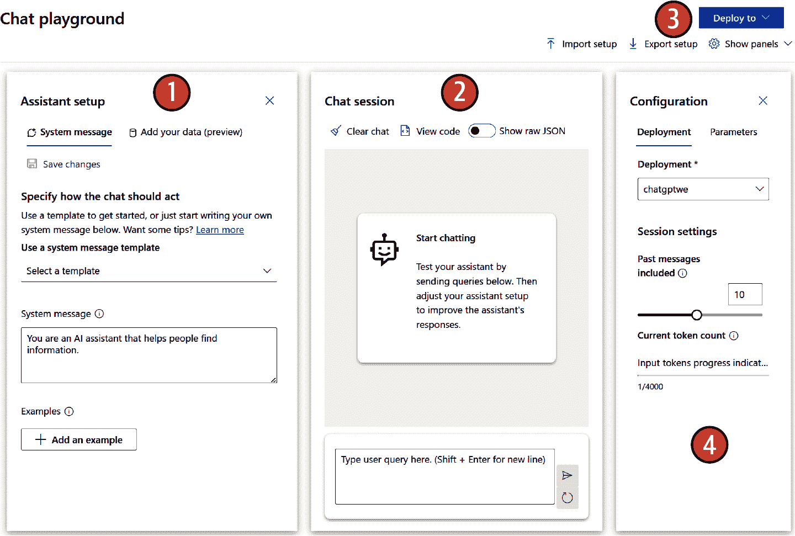

###### 图 3-4\. Azure OpenAI Studio：聊天游乐场

如 图 3-4 所示，聊天游乐场的主要板块和功能包括以下内容：

1\. 助手设置

此区域位于屏幕左侧，允许用户配置聊天机器人的行为。用户可以从模板中选择或创建自己的自定义系统消息。本节帮助用户定义聊天机器人应该如何行动并响应用户查询：

系统消息

一种 [元提示](https://oreil.ly/OmKQO) 类型（即设置讨论默认上下文的提示）以指导 AI 系统的行为。它可以用来介绍系统，设定期望，提供反馈或处理错误。需要记住的一个重要事项是，即使此消息没有令牌限制，它也将包含在每个 API 调用中，因此它将计入模型的总体 [令牌限制/上下文长度](https://oreil.ly/BI5Ue)。

示例

此区域位于屏幕左下角。您可以为机器人智能添加示例，以便它学习正确回答特定问题的方法。当我们不需要完全重新训练模型时，这是一个很好的选项，例如，当您需要从公司的知识库中添加几个主题，并希望定义最佳回答方式时。根据官方描述：“添加示例以显示聊天希望得到的响应。它将尝试模仿您在此处添加的任何响应，因此请确保它们与系统消息中设定的规则相匹配。”

2\. 聊天会话

这个区域位于屏幕中间，是你与聊天机器人之间主要交互点。你可以在这里输入你的查询，聊天机器人将相应地做出回应。聊天会话允许你测试聊天机器人的性能，并根据需要调整助手设置，以及导入和导出机器人配置，或以[JavaScript 对象表示法（JSON）文件](https://oreil.ly/LZJH4)的形式获取结果。

3. 部署到

此选项允许你将你的聊天机器人部署到特定的平台或环境。Azure OpenAI Studio 允许直接部署到[Azure Web Apps](https://oreil.ly/TtlXr)和[Microsoft Copilot Studio](https://oreil.ly/YV0SN)。我们将在本章后面探索这些部署选项。

4. 配置

这个区域位于屏幕右上角。它提供了访问部署和会话设置选项。用户还可以清除聊天历史记录和管理与聊天机器人部署相关的参数：

部署

为了处理会话级配置，例如你想要使用的 Azure OpenAI 部署资源（例如，你可能为不同的地理区域有几个），以及会话的内存，这将影响系统在获取新问题时能记住多少交互：

部署实例

你将根据可能需要的地理和模型需求，从你之前部署的资源中选择一个选项（如果你还没有，在使用 Azure OpenAI Studio 之前，你需要创建一个），基于地理和模型需求。

包含的历史消息和当前令牌计数

你可能想要调整的会话级参数，这些参数是在通过聊天游乐场进行的特定测试时使用的。当你完成游乐场会话后，这些参数将消失，除非你部署了一个应用程序（我们将在接下来的几个部分中看到部署选项）。

参数

此右侧面板包括所有技术设置，允许你配置预期的输出消息，包括答案的创造性与确定性水平：

最大响应

此参数帮助你为每个模型响应设置令牌数量的上限。最大响应以令牌数量衡量，它包括问题（包括系统消息、示例、消息历史和提示/用户查询）和模型的响应。

温度

此参数和 Top-p 参数是直接替代品，用于控制 AI 模型的随机性。降低温度意味着模型将产生更多重复和确定性的响应。提高温度将导致更多意外或创造性的响应。尝试调整温度或 Top-p，但不要同时调整两者。

[助手游乐场](https://oreil.ly/S4KFy)

[于 2024 年发布](https://oreil.ly/MdxvG)，助手游乐场在视觉上与聊天游乐场相似，但它包括：

+   通过使用“线程 ID”参数，可以将聊天讨论转换为具有状态的应用程序，以保持上下文和记忆。您可以在 Azure OpenAI 的 [助手 API 规范](https://oreil.ly/ErRd6)中查看详细信息。

+   其他功能，如 API 调用日志、[代码解释器](https://oreil.ly/3jSFV)和[函数调用](https://oreil.ly/2R7Pz)。

请记住，这是一个相对较新的选项，但[官方文档](https://oreil.ly/HH4hH)包括了助手文件创建和管理的详细步骤。请关注并收藏此 URL，以跟踪任何新闻和技术资源。

[完成度游乐场](https://oreil.ly/zJYtL)

如我们在 第一章 中所回顾的，完成度技能（与聊天和嵌入模型一起）是 NLP 和现代 LLM 的核心概念之一。完成度专注于各种基于文本请求的单一交互（无需在交互之间保持记忆，如聊天应用程序中可能需要的，其中模型保持讨论上下文）。它利用了 [完成度 API](https://oreil.ly/Uczv9)。如图 3-5 所示，完成度游乐场允许您输入提示，或从一系列示例中选择。它还包括我们在聊天游乐场中回顾过的相同类型的设置参数。


###### 图 3-5\. Azure OpenAI Studio：完成度游乐场

您可以生成一个答案（完成度），甚至可以重新生成它以获得全新的输出。如果您从下拉菜单中选择一个示例，您将看到一个自动提示出现，并显示相应的完成度，如图 3-6 所示。

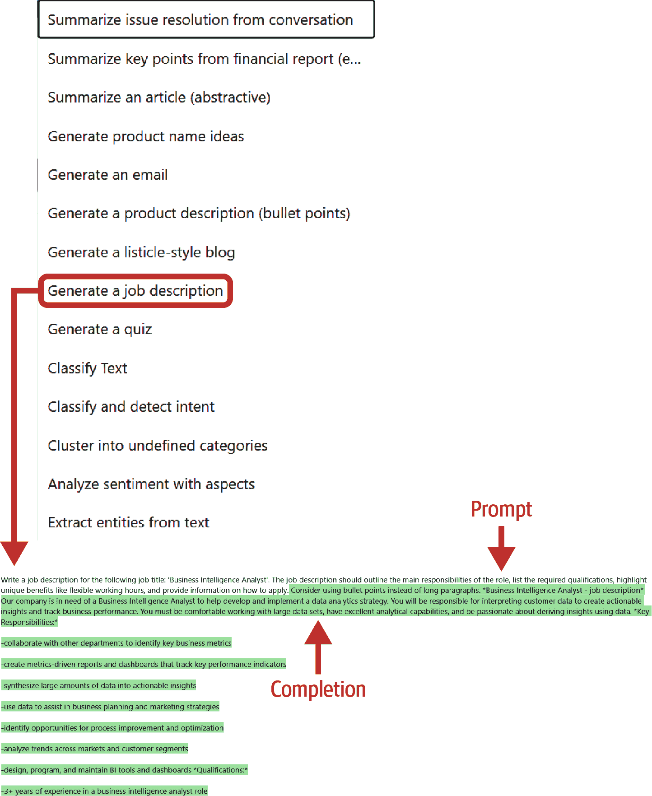

###### 图 3-6\. Azure OpenAI Studio：完成度游乐场（示例）

总结来说，您可以使用聊天进行多步骤场景，在这些场景中您需要与 AI 模型保持一系列交互，而完成度可以用于特定的单一案例。正如您稍后将会看到的，这两个游乐场只是消耗现有 Azure OpenAI [完成度](https://oreil.ly/Uczv9)和[聊天](https://oreil.ly/ZJOLp) API 的可视化界面。

带上您自己的数据游乐场

即使 Azure OpenAI Studio 将此功能显示为单独的游乐场，但从技术上讲，它仍然是聊天游乐场的一部分。要访问此功能，您可以使用聊天游乐场的助手设置并选择“添加您的数据”标签，或者直接转到工作室的“带上您自己的数据”磁贴（图 3-7）。在两种情况下，结果都将相同。

一旦达到这一点，步骤序列相当简单。如图 3-8 所示，系统将允许您选择自己的数据源，将它们的知识与基线 LLM 相结合。这些知识可以来自 PDF 文件、基于文本的文档、幻灯片、网页文件等。在这种情况下，除了之前部署的 Azure OpenAI 资源外，自带数据功能还将利用其他资源，如 Azure Data Lake Gen2/Azure Storage 来保存文件，以及 Azure Cognitive Search 来索引文件。Azure Cognitive Search 提供基于[嵌入 API](https://oreil.ly/imKOS)的向量搜索功能，我将在本章末尾解释。最后，您始终可以查看[官方文档](https://oreil.ly/z_iRM)，以了解此 Azure OpenAI 功能的最新更新，因为它是一个快速发展的功能，因为持续整合新的功能。

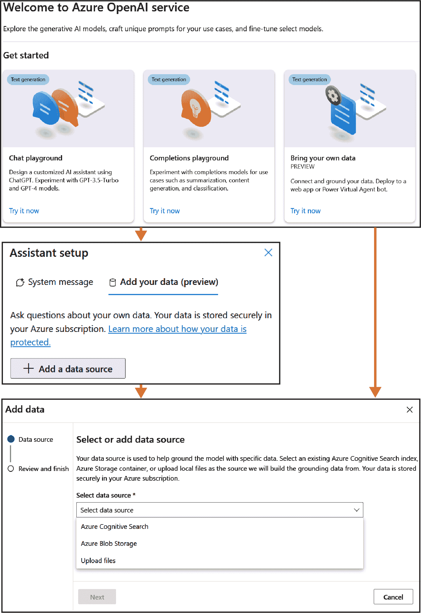

###### 图 3-7\. Azure OpenAI Studio：自带数据

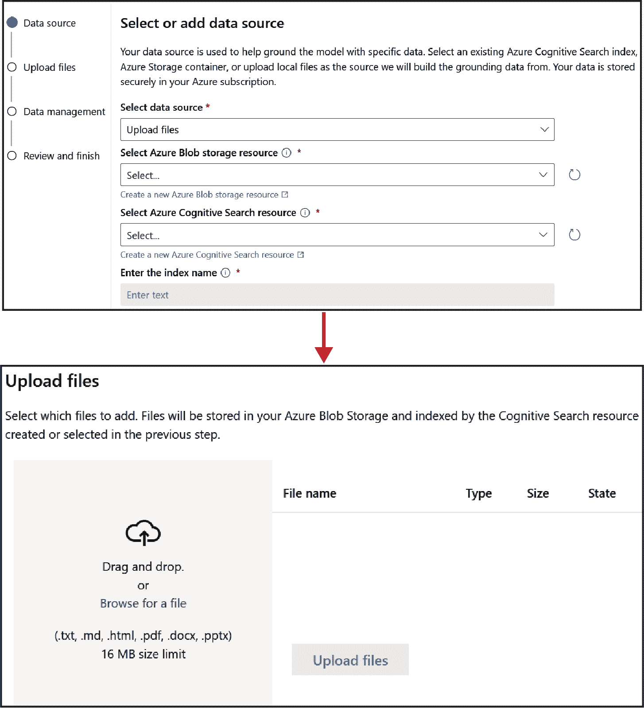

###### 图 3-8\. Azure OpenAI Studio：自带数据源详情

[DALL·E 游乐场](https://oreil.ly/r4h7Y)

最后一个游乐场瓷砖可以直接访问来自 OpenAI 的生成式 AI DALL·E 模型（版本 2 和 3）。这是一个基于文本描述创建新图像的文本到图像模型。想象一下描述一个地方或场景，并得到以图像形式呈现的视觉表示，这些图像是按需新鲜创建的。这意味着它们之前并不存在，您可以将此功能集成到您的解决方案中，并与语言的其他部分结合。DALL·E 游乐场（如图 3-9 所示）利用了[图像生成 API](https://oreil.ly/bm-7a)。


###### 图 3-9\. Azure OpenAI Studio：DALL·E 游乐场

如图 3-9 所示，游乐场的相关方面包括以下内容：

1. 游乐场

DALL·E 游乐场在视觉上很简单——一个提示字段和下面的结果（图像）。它与[Bing Create 应用程序](https://oreil.ly/YwDy-)的结构相似，但提供了部署 DALL·E 模型以供您自己开发的选择。

2. 设置

设置面板为您提供选择要生成的图像数量和图像大小的选项。

3. 相册

相册部分展示了所有过去进行的图像实验，为您提供查看先前创建的图像、生成新的图像等选项。

除了不同的游乐场外，您还可以探索图 3-10 中显示的左侧*管理*面板，其中包括部署、模型、数据文件、配额和内容过滤器等选项。

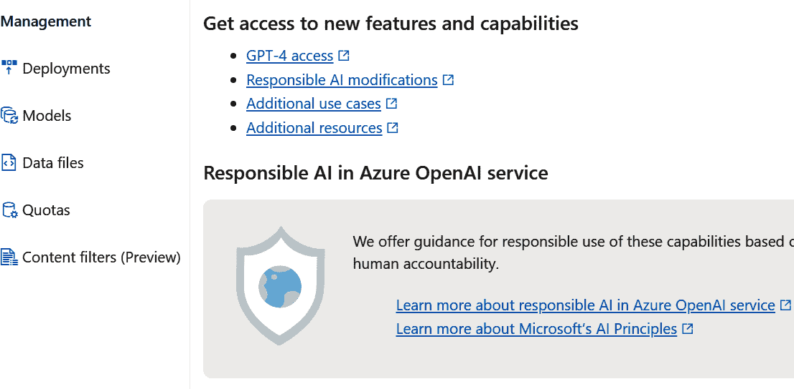

###### 图 3-10\. Azure OpenAI Studio：管理面板

让我们探索最重要的功能：

[部署](https://oreil.ly/PGocU)

允许您部署 Azure OpenAI 资源地理区域中[任何可用的特定模型实例](https://oreil.ly/XZnCX)，并可视化您之前部署的模型（图 3-11）。


###### 图 3-11\. Azure OpenAI Studio：部署

[内容过滤器](https://oreil.ly/Bpsud)

对于负责任的 AI 监管。从图 3-12 中的过滤器（例如，针对提示和完成的仇恨、性、自残和暴力主题，具有不同的过滤级别）可以应用于部署，并且这些部署将包括每个聊天或完成实现的 内容过滤器。我们将在第四章中探讨此功能，作为生成式 AI 实现负责任 AI 措施的一部分。

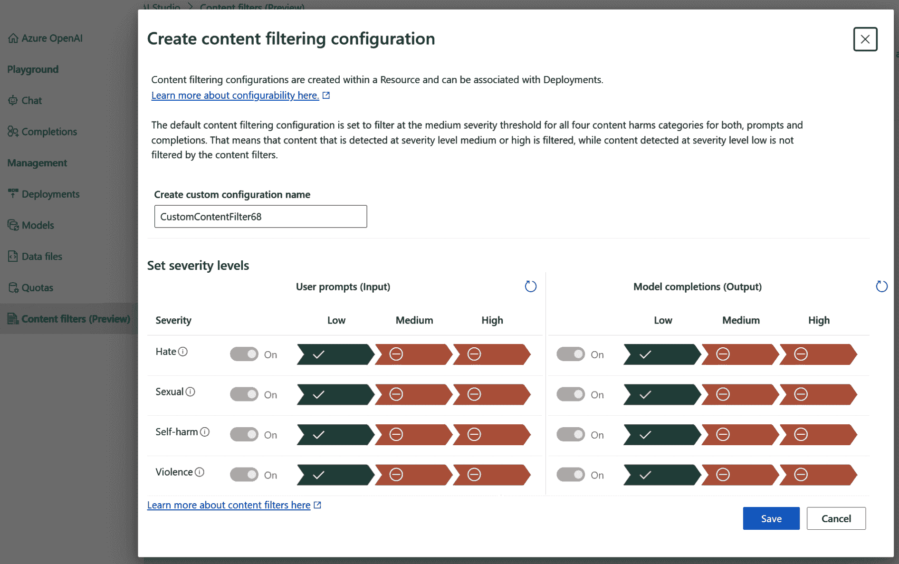

###### 图 3-12\. Azure OpenAI Studio：内容过滤器

[模型](https://oreil.ly/oC3Hj)

此选项显示与所选部署的特定地理区域相关的[可用的 Azure OpenAI 模型](https://oreil.ly/XZnCX)。

[数据文件](https://oreil.ly/2TZwW)

此文件管理功能允许您[为微调实现准备数据集](https://oreil.ly/FDMr1)。我们将在本章后面探讨更多关于微调的内容。

[配额](https://oreil.ly/ONn5Q)

配额面板显示了与不同模型和地理区域相关的[使用配额](https://oreil.ly/bEN4D)。它还帮助您[请求配额增加](https://oreil.ly/iiysu)，如果您需要更多的话。或者，我将在第六章中解释这一点，作为定价和估算练习的一部分，您可以选择通过利用所谓的[Azure OpenAI 的预留吞吐量单位（PTU）](https://oreil.ly/KCC6K)来雇佣专用容量，这些是具有性能和服务可用性优势的预留实例。

我们将在本章和第四章中探讨这些功能的一些内容，因为它们都将与您计划利用的 Azure OpenAI 实现类型相关。现在，让我们看看您可以通过 Azure OpenAI Studio 部署这些模型能做什么。

### 部署接口：Web 应用和 Microsoft Copilot 代理

如本章所述，聊天游乐场包括一些易于使用的部署选项。它们对其他游乐场不可用，但可以简化 Azure OpenAI 模型在内部测试和使用目的的初步部署，无需任何编码。这些无代码部署可以结合从“自带数据”功能中获取的特定知识。有两种可能性：

带有[Azure App Service](https://oreil.ly/moBFz)的 Web 应用

第一个可用的部署选项，您可以使用或不需要激活“自带数据”功能。正如我们在 第二章 中讨论的那样，App Service 是 Azure 部署原生 Web 应用的选项；它允许与外部和内部系统以及使用各种编程语言的 Web 开发进行集成。从 Azure OpenAI Studio 和其 Chat playground，您可以简单地“部署到”，然后配置您的部署（见 图 3-13）。

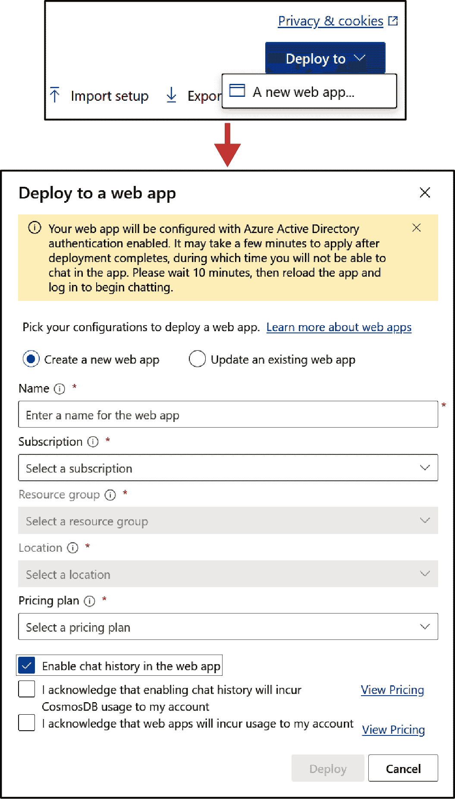

###### 图 3-13\. Azure OpenAI Studio：Web 应用部署

如 图 3-13 所示，配置选项包括以下内容：

选择 Web 应用

您可以直接从该功能创建一个新的 App Service 资源（在这种情况下，您需要定义将成为您 Web 应用 URL 的一部分的“应用程序名称”），或者如果您之前通过 [Azure 门户的 App Service 面板](https://oreil.ly/dPLy2) 部署过，可以选择现有的一个。

定价计划

选择 Web 应用的首选 [定价层](https://oreil.ly/IdDXQ)。

聊天历史记录

一种允许 Web 应用用户恢复其与聊天 [先前交互](https://oreil.ly/-yyQg) 的功能。它依赖于 [Cosmos DB（Azure 的 NoSQL 数据库）](https://oreil.ly/-yyQg)，这显然会增加现有的 Azure OpenAI 和 App Service 资源的成本。

一旦您选择了所有这些选项，您就可以点击部署。您需要等待大约 10 分钟，以便所有资源被部署，然后您将能够从工作室或通过输入 URL *https://<appname>.azurewebsites.net** 启动您的 Web 应用。外观和感觉将类似于您在 图 3-14 中看到的界面。

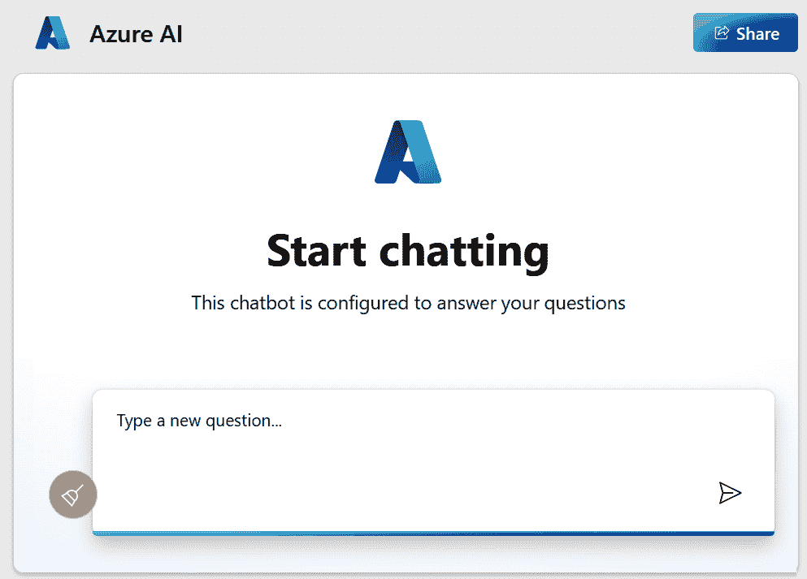

###### 图 3-14\. Azure OpenAI Studio：Web 应用界面

新应用的 UI 将包含一个常规聊天机器人设置，并在窗口右上角提供分享和检查先前讨论的选项。您还可以通过使用 [官方源代码](https://oreil.ly/MeBin) 来 [自定义应用程序的视觉外观](https://oreil.ly/BVUkG)，并通过 Azure App Service 以编程方式部署，使用您首选的编程语言，而不是利用 Azure OpenAI Studio。

带有 [Microsoft Copilot Studio（以前称为 Power Virtual Agents [PVAs]）](https://oreil.ly/YV0SN) 的机器人

此选项适用于包含“自带数据”功能的 Chat playground 实现。这意味着如果您不添加来自 PDF 或其他文档的扩展知识，Chat playground 不会在 图 3-15 的右上角将 Microsoft Copilot Studio/PVA 作为部署选项。

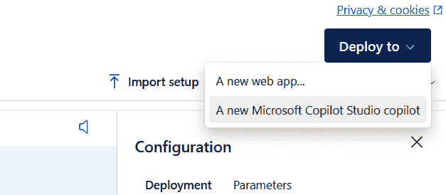

###### 图 3-15\. Azure OpenAI Studio：Copilot 部署

如何处理 PVAs 超出了本书的范围，但您可以探索[官方文档中的详细说明](https://oreil.ly/Qi9J3)，其中展示了如何使用 PVAs 与 Azure OpenAI 结合使用以实现*生成式答案*功能。此选项仅适用于某些地理区域，因此您需要验证您的 Azure OpenAI 模型部署是否在 Chat playground 中显示 PVA 部署选项。如果不是这种情况，您可能需要在其他地区部署新模型。

总结来说，这些可视化界面可以帮助您以简单的方式利用 Azure OpenAI 模型。它们提供了一种直观的方式，只需几点击即可启动 Azure OpenAI API。然而，您需要基于代码的工具来实现本章后面将看到的其他高级架构。现在让我们探索这些 API 和其他开发工具包，以便您可以利用 Azure OpenAI 服务提供的一切。

### 开发接口：API 和 SDK

除了之前探索的所有接口之外，将 Azure OpenAI 与现有或新应用程序集成的关键推动因素之一是能够将预配置模型作为常规端点进行消费。从开发的角度来看，我们可以使用 API 和相关软件开发工具包（SDKs）来调用这些模型，并在代码中传递任何输入和配置参数。本节涵盖了您需要了解的主要内容——*Azure OpenAI 服务 REST API*，包括[官方 API 参考文档](https://oreil.ly/qH3FL)，其中包含聊天、完成、嵌入和其他部署的详细信息。还有一个[官方仓库](https://oreil.ly/mbA1v)，包含完整的规范。有一些通用 API 可以帮助您配置和部署 Azure OpenAI 服务，而服务 API 可以帮助您消费模型，将 AI 能力带到您的生成式 AI 应用程序中。

您需要了解的主要 API 及其高级调用细节如下：

[通用管理 API](https://oreil.ly/xkqqk)

对于 Azure AI 服务账户管理（包括 Azure OpenAI），包括账户创建、删除、列出等任务。

[模型相关信息 API](https://oreil.ly/Y7VMR)

获取可用的 Azure OpenAI 模型列表以及它们的具体功能和模型生命周期（包括潜在的弃用细节）。

[完成](https://oreil.ly/Uczv9)

非聊天语言场景所需的 API。这些 API 以及其他 API 通过使用“YYYY-MM-DD”日期结构来对`api-version`进行版本控制，并且您需要从之前部署的 Azure OpenAI 模型中复制资源名称和部署-ID（记住从 Azure 门户中逐步处理的过程，在第二章中）。要创建一个完成资源，POST 操作如下：

```py
POST https://{your-resource-name}.openai.azure.com/openai/deployments/
  {deployment-id}/***completions***?api-version={api-version}
```

请求和响应动态遵循此结构，其中提示参数是模型生成特定完成的输入，以及一系列[可选参数](https://oreil.ly/Uczv9)，例如`max_tokens`（预期答案的令牌限制）或预期完成/答案的数量`n`。

*请求*：

```py
curl https://YOUR_RESOURCE_NAME.openai.azure.com/openai/deployments/\
  YOUR_DEPLOYMENT_NAME/completions?api-version=YYYY-MM-DD\
  -H "Content-Type: application/json" \
  -H "api-key: YOUR_API_KEY" \
  -d "{
        \"prompt\": \"The best thing in life\",
        \"max_tokens\": 5,  
        \"n\": 1
      }"
```

*响应*：

```py
{
    "id": "cmpl-4kGh7iXtjW4lc9eGhff6Hp8C7btdQ",
    "object": "text_completion",
    "created": 1646932609,
    "model": "gpt-35-turbo-instruct",
    "choices": [
        {
            "text": ", is eating burgers with a milkshake",
            "index": 0,
            "logprobs": null,
            "finish_reason": "length"
        }
    ]
}
```

答案（完成）包含`finish_reason`参数。`finish_reason`定义了模型停止生成更多信息的理由；在大多数情况下，这将是由于`max_tokens`，一旦模型达到限制就会停止。然而，我们将在第四章中探讨另一种选项，即由于我们所说的*内容过滤器*而停止模型。

[聊天完成](https://oreil.ly/ZJOLp)

专为聊天场景设计的 API（并且是未来模型版本唯一支持的 API），包括我们之前在聊天沙盒中审查过的配置参数。这包括我们讨论过的 Azure OpenAI 沙盒的输入参数，例如`temperature`和`max_tokens`。对于聊天消息有一个重要的参数，称为[ChatRole](https://oreil.ly/WLv1g)。这允许你根据不同的角色来分割交互：

系统

帮助你设置助手的行怍。

用户

提供聊天完成的输入。

助手

提供对系统指令、用户提示输入的响应。

功能

提供聊天完成的函数结果。我们将在本章后面探讨这个概念，在我们介绍不同的 Azure OpenAI API 之后。

典型聊天场景的序列遵循以下步骤：

1. 资源创建

使用与你在常规完成 API 调用中看到的类似的结构（包括日期作为 API 版本）。聊天完成的常规 POST 操作如下：

```py
POST https://{your-resource-name}.openai.azure.com/openai/deployments/
  {deployment-id}/chat/completions?api-version={api-version}
```

2. 系统消息

这就是设置聊天引擎上下文的方式，通过定义讨论的范围、允许或禁止的主题等。系统消息也称为上下文提示或*元提示*。`messages`参数（[`oreil.ly/vFEYS`](https://oreil.ly/vFEYS)）以及`role`子参数（[`oreil.ly/y5HFq`](https://oreil.ly/y5HFq)）是定义你的系统消息的地方，使用：

```py
{
  "messages": [
    {
      "role": `"system"`,
      "content": `"the context and system message to add to your chat"`
    }
  ]
}
```

3. 用户-助手交互

这利用了相同的`messages`参数，包括*用户*和*助手*角色。这两个角色的结构类似于我们之前讨论的系统消息，响应中包括相同的`finish-reason`参数，这将给你一个关于结果（即，如果由于分配给答案的`max_tokens`而完成，或者如果由于负面主题检测而存在过滤原因）的提示。

[图像生成](https://oreil.ly/bm-7a)

基于文本到图像的 DALL·E 模型的 API 调用用于生成图像。与视觉游乐场类似，输入参数包括基于文本的提示，以及两个可选输入，例如所需图像的数量`n`（如果您不包含它，系统将只生成一张图像），以及大小（默认为 1024×1024，有 256×256 和 512×512 的替代选项）。创建图像生成资源的 POST 操作如下：

```py
POST https://{your-resource-name}.openai.azure.com/openai/\
  images/generations:submit?api-version={api-version}
```

这里是一个 curl（用于从各种协议和服务器下载和上传文件的命令行工具）请求的示例：

```py
curl -X POST \
  https://{your-resource-name}.openai.azure.com/openai/deployments/\
  {deployment-id}/images/generations?api-version=2023-12-01-preview \
  -H "Content-Type: application/json" \
  -H "api-key: YOUR_API_KEY" \
  -d '{
        "prompt": "An avocado chair",
        "size": "1024x1024",
        "n": 3,
        "quality": "hd",
        "style": "vivid"
      }'
```

端到端过程包括三个不同的步骤：

1.  *请求*图像生成（[通过 POST 操作](https://oreil.ly/kPf-m)），这有助于您根据基于文本的输入提示预先生成图像。它返回一个操作 ID，您将在下一步中使用它。

1.  *获取*图像生成的结果（[GET 操作](https://oreil.ly/lxX0B)），允许您恢复特定操作 ID 预先生成的图像。

1.  *删除*服务器上之前加载的图像（[DELETE 操作](https://oreil.ly/5UfTB)），对于特定的 Azure OpenAI 资源以及现有的操作 ID。如果您不使用此选项，图像将在 24 小时后自动删除。

[语音到文本](https://oreil.ly/hKakE)

基于 Azure OpenAI Whisper 模型（[Azure OpenAI Whisper 模型](https://oreil.ly/SJNcT)），这些 API 允许您从音频片段创建转录，支持多种语言和口音，性能出色，并且可以与其他 Azure OpenAI 模型结合使用。您可以指定输入音频文件、语言、讨论风格、输出格式（默认为 JSON 文件）等。Azure OpenAI 语音到文本（S2T）功能对输入音频文件的大小有限制，为 25 MB，但您可以使用 Azure AI Speech 的[批量转录模式](https://oreil.ly/NnMTz)（不是 Azure OpenAI，而是[Azure AI Speech 语音 ↔ 文本功能的服务](https://oreil.ly/-HLPL)）来转录更大的文件。POST 操作看起来与之前的 API 类似：

```py
POST https://{your-resource-name}.openai.azure.com/openai/deployments/
  {deployment-id}/audio/transcriptions?api-version={api-version}
```

相应的 curl 请求（示例）：

```py
curl $AZURE_OPENAI_ENDPOINT/openai/deployments/MyDeploymentName/\
  audio/transcriptions?api-version=2023-09-01-preview \
  -H "api-key: $AZURE_OPENAI_KEY" \
  -H "Content-Type: multipart/form-data" \
  -F file="@./wikipediaOcelot.wav"
```

[嵌入](https://oreil.ly/imKOS)

此 API 调用允许您从特定的文本输入生成嵌入，从您将在本章中看到的一些架构中。模型及其特定的输入长度将取决于您实现时的[模型可用性](https://oreil.ly/gvAHr)。POST 操作与之前的类似，动态与请求文本输入的嵌入（[请求嵌入](https://oreil.ly/xFJTh)）和获取包含生成的嵌入的 JSON 响应（[获取 JSON 响应](https://oreil.ly/yYCuU)）一样简单，以便您存储（我们将在本章末尾看到几个向量存储/数据库选项）并在以后使用：

```py
POST https://{your-resource-name}.openai.azure.com/openai/deployments/
  {deployment-id}/embeddings?api-version={api-version}
```

以及相应的 curl 示例：

```py
curl https://YOUR_RESOURCE_NAME.openai.azure.com/openai/deployments/\
  YOUR_DEPLOYMENT_NAME/embeddings?api-version=2023-05-15\
  -H 'Content-Type: application/json' \
  -H 'api-key: YOUR_API_KEY' \
  -d '{"input": "Sample Document goes here"}'
```

[微调](https://oreil.ly/1pqcT)

正如我们在本章开头所回顾的，实现选项之一包括使用您特定的、可用的信息微调预构建模型。我们将在本章后面看到更多细节，但到目前为止，请记住，如果您选择此选项，您可以使用一组特定的 API 来创建、管理、探索和删除新的微调“作业”。此外，您将处理微调模型的输入文件。

其他相关 API

其他相关 API 包括以下内容：

[必应搜索](https://oreil.ly/2yZuu)

Bing Search API 允许您利用微软必应搜索引擎进行自己的开发。您可以通过实时搜索功能扩展您 Azure OpenAI 启用的实现的功能。

[表单识别器（目前称为 Azure AI 文档智能）](https://oreil.ly/vxtJA)

这有助于您将表单和图像中的信息转换为结构化数据。它包括高级光学字符识别 (OCR) 功能，这将支持您使用特定数据源（如 PDF 或 DOC 文件）进行 Azure OpenAI 开发。

[Azure AI Search（之前称为 Azure 认知搜索）](https://oreil.ly/wp6r8)

RAG 架构中最重要的元素之一，适用于向量和索引方法。

除了这些 API，还有为 .NET 开发者提供的 Azure [OpenAI 库](https://oreil.ly/9XMBN) 和 [Python 的 OpenAI 库](https://oreil.ly/-cwGH)，它们本质上复制了官方 API 在 .NET 开发环境中的功能。它提供了一个与 Azure SDK 生态系统其余部分的接口，并简化了与 Azure OpenAI 资源或非 Azure OpenAI 终端的连接。

这套视觉和开发接口是大多数 Azure OpenAI 实现的工具包。它们正在快速发展，但官方文档的链接将帮助您随时获取更新信息。现在，在继续到实现方法之前，让我们看看一个强大的功能，它将使您的生成式 AI 系统能够与其他外部 API 交互：函数调用。

### 互操作性功能：函数调用和“JSON 化”

[Azure OpenAI 函数调用](https://oreil.ly/bQdsv)选项是利用语言模型生成 API 调用并根据特定目标格式结构化数据输出的方式。技术上，它是 Chat Completion API 中的一个选项——[函数](https://oreil.ly/WLv1g)聊天角色。您可以在[几个示例](https://oreil.ly/0nhYM)中看到如何使用此功能，但本质上它依赖于以下步骤：

1.  调用 Chat Completions API，包括基于官方 [FunctionDefinition 格式](https://oreil.ly/5Q-8c) 的函数和用户的输入

1.  使用模型的聊天响应来调用您的 API 或函数

1.  再次调用 Chat Completions API，包括您函数的响应，以获取最终响应

这是一个相对较新的功能，因此您可以期待随着时间的推移会有一些功能改进。您始终可以检查[官方文档](https://oreil.ly/UAYNH)以获取最新细节和建议。此外，您还可以探索 Azure OpenAI 的[JSON 模式](https://oreil.ly/Fi3-l)，因为它允许您从 Chat Completions API 的答案中获取 JSON 对象，这对于互操作性来说是一个强大的功能。

这完成了本节的第一部分。您已经了解了知识领域，如何利用不同的构建块来提高和增加您生成式 AI 解决方案的知识水平，以及您将用于实施的可用工具。现在，我们将进入本章的下一部分，我们将探讨一些最相关的开发方法，基于行业的最佳实践。让我们开始吧。

## 可能的实施方法

使用 Azure OpenAI 服务实施生成式 AI 应用有几种方法。您使用的实施类型将主要取决于您的具体用例，以及采用的技术和财务背景。这意味着在某些情况下，最昂贵的选项并不总是最好的，或者其他选项可能有限制，例如当我们除了我们的网站之外没有具体数据时等。让我们根据图 3-16 的定制级别探索主要的实施类型。

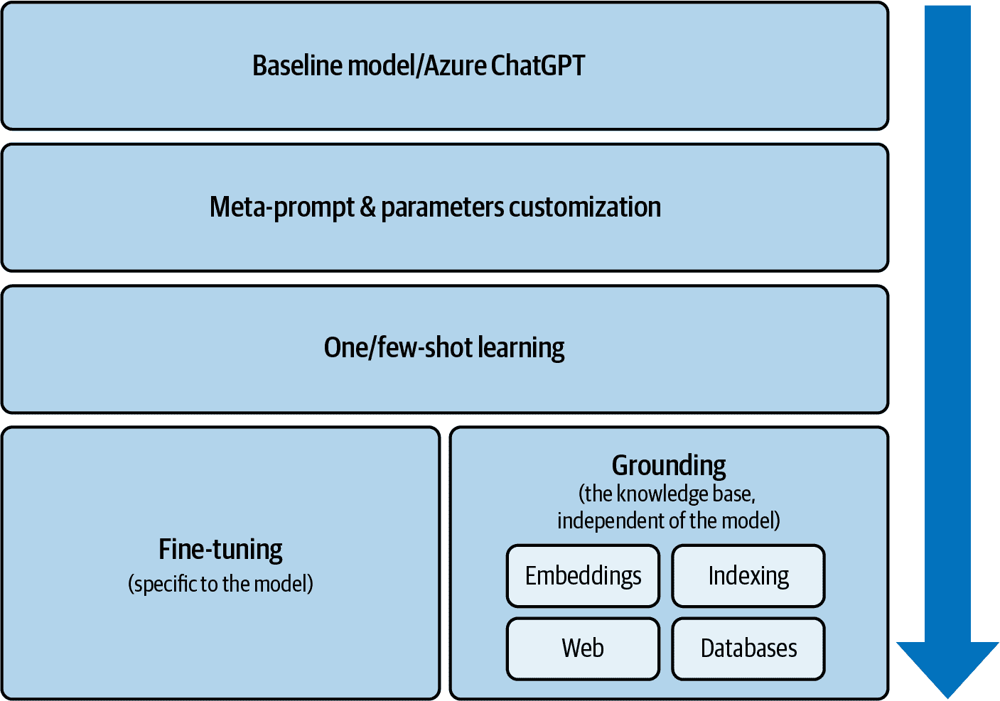

###### 图 3-16\. 使用 Azure OpenAI 服务的实施方法

如您从图中所见，您可以通过准备一个好的元提示、调整技术参数、提供一或几个“示例”来引导模型，以及实施微调和/或归一化技术来自定义一个模型。接下来的几节将详细介绍如何完成所有这些操作。

### 基本的 Azure ChatGPT 实例

一种基本的、私有的 GPT 类型的实例是最简单的实施方式，也是目前 Azure OpenAI 最受欢迎的案例之一。当公司想要为员工提供一个私人的“ChatGPT”时，这就是答案。它保护您的数据安全并私有，并在您自己的云基础设施中部署实例。这是内部员工使用中最受欢迎的选项之一。

部署过程相对简单：

1.  在您的 Azure OpenAI Studio 中部署一个 GPT-3.5 Turbo、GPT-4、GPT-4 Turbo 或 GPT-4o 模型实例。这种模型在技术上与 ChatGPT 相似，并将提供相同级别的性能。请记住选择最接近您的具体地理位置。

1.  一旦您创建了资源，请转到可视化游乐场。在那里，您将看到一个左侧菜单，其中包含“聊天”选项。

1.  一旦到达那里，您可以为聊天机器人准备[系统消息](https://oreil.ly/OmKQO) / 元提示，通过告诉它诸如“您是公司 X 的 AI 助手，用于回答员工的问题”（内部使用）或“您是公司 X 的 AI 助手，网站为 Y。如果有人问与此话题无关的问题，请说您无法回答”（面向客户）之类的信息来上下文化聊天机器人。

1.  您还可以自定义参数，例如答案的最大长度或消息的温度，这是一个介于 0 和 1 之间的度量，用于定义模型的创造力水平。

1.  一旦您测试了性能并且准备部署模型，您就可以回到资源页面（Azure 门户）并找到该特定资源的端点和密钥。该页面包含调用 API 的代码示例。

端到端架构（图 3-17）相当简单——一个预先部署的模型，我们可以直接从我们的应用程序中消费，基于现有的端点和 API。


###### 图 3-17\. 简化的 Azure ChatGPT 架构

这种类型的实现对于不需要基于私有数据的任何定制的内部公司案例来说已经足够好了，例如，基于一般互联网信息的员工生产力内部聊天机器人或内部网站搜索引擎。对于涉及一些定制数据的其他案例，我们将探索其他选项。让我们深入了解其中的第一个选项。 

### 使用单次或少量学习进行最小化定制

除了基线模型、系统消息/元提示和参数定制之外，还有一个选项进行**单次或少量学习**，这意味着向 LLM 提供基于特定主题预期输出的讨论示例。这是一个用于小调整的有用且简单的选项，并且它依赖于与之前非常相似的架构，变化相对较小。与之前的方法相比，主要区别在于在开始使用之前包含一个或几个示例来引导 LLM（图 3-18）。

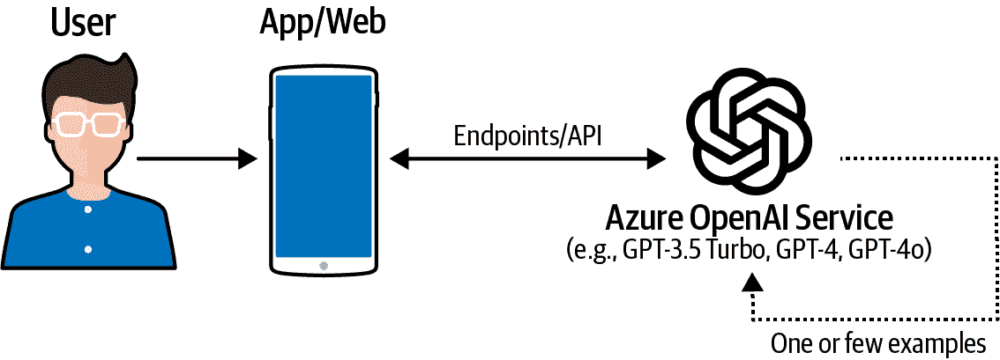

###### 图 3-18\. 单次/少量学习架构

单次/少量学习过程可以通过几种方式实现：

+   通过 API（代码）

    +   使用 GPT-4 和其他设计为接受类似聊天记录格式的输入的 Chat Completions API。您可以为模型提供用于上下文学习的对话示例。

    +   使用 GPT-3 模型的 Completions API，它可以接受没有特定格式规则的文本字符串。您可以在提示中提供一组训练示例，以向模型提供额外的上下文。

+   通过游乐场（视觉）

    +   使用 Chat 游乐场与 GPT-4、GPT-4o 等交互。您可以在聊天记录中添加少量示例，并查看模型如何响应。

    +   使用 Completions playground 与 GPT-x 模型进行交互。您可以用少量示例编写提示并查看模型如何完成它。

总体而言，所有这些定制都是为了提高模型相对于我们之前探索的常规“ChatGPT”实现（如“ChatGPT”）的性能，但存在更深入地重新训练模型的方法，我们将在下一部分探讨。

### 微调后的 GPT 模型

如本章前面所述，有不同方式来定制一个大型语言模型（LLM）以调整其知识范围。其中大部分依赖于将 LLM 与其他知识片段的编排/组合，而没有真正结合数据源（即，扎根）。在这种情况下，我们将专注于唯一一种使用定制公司数据“重新训练”Azure OpenAI 模型的途径：[Azure OpenAI 服务微调功能](https://oreil.ly/T0GP8)。

这种方法可能对具有非常具体和有价值的数据知识产权的公司有一些优势，但其成本（您需要将托管成本添加到常规 API 调用以进行微调过程）和技术复杂性可能会让您（以及大多数采用者）转向其他具有更好性能/成本平衡的扎根方法。

此外，微调功能依赖于一种非常特殊的训练过程。它不是您可以在例如使用传统 AI 模型进行分类任务时进行的常规基于标签的训练过程。我们谈论的是一种新的监督过程，它利用 Azure OpenAI 的提示系统根据 [JSON Lines (JSONL) 文件格式](https://oreil.ly/SdBph)注入信息。

例如，使用 GPT-3.5 Turbo，您将利用系统和用户角色来重新教育模型：

```py
{
  "messages": [
    {
      "role": "system",
      "content": "Marv is a factual chatbot that is also sarcastic."
    },
    {
      "role": "user",
      "content": "Who wrote 'Romeo and Juliet'?"
    },
    {
      "role": "assistant",
      "content": "Oh, just some guy named William Shakespeare. Heard of him?"
    }
  ]
}
```

其他如 DaVinci 这样的旧模型需要基于问答逻辑的提示/完成格式：

```py
{"prompt": "<prompt text>", "completion": "<ideal generated text>"}
{"prompt": "<prompt text>", "completion": "<ideal generated text>"}
```

这种注入数据和知识的新方法允许我们以非常细粒度的方式重新教育模型，但这是一个复杂的过程。您可以在 图 3-19 中看到整体架构，其中您将基本上根据依赖于特定组织数据的微调过程来定制模型。

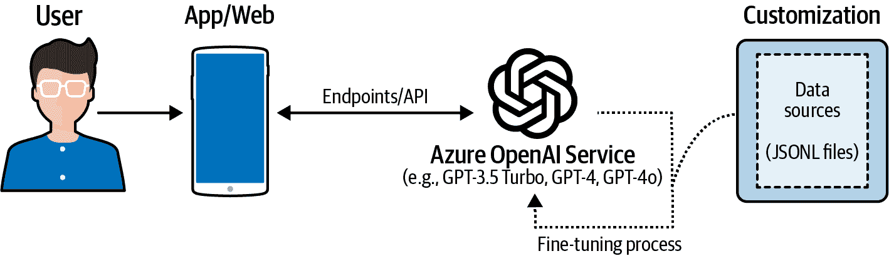

###### 图 3-19\. Azure OpenAI 微调架构

在 Azure OpenAI 服务中执行**微调**的步骤如下：

1.  *准备您的数据集*为 JSONL 格式。对于最近发布的模型，如 GPT-3.5 Turbo、GPT-4 和 GPT-4o，您将利用 Chat Completions API 结构来处理系统和用户消息。

1.  从 Azure OpenAI Studio 中启动*自定义模型向导*，如图 图 3-20 所示，以训练您的新定制模型。

    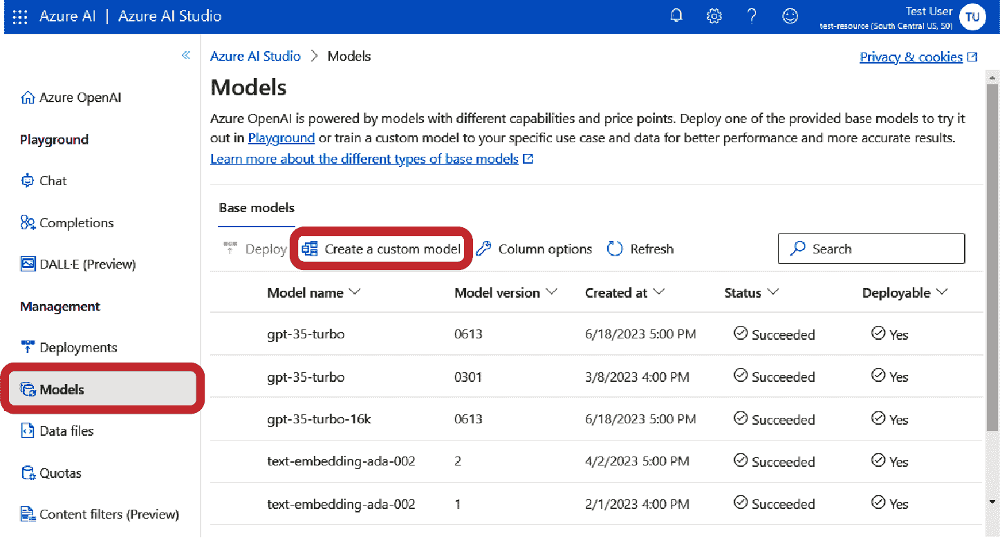

    ###### 图 3-20\. Azure OpenAI：自定义模型向导

1.  *选择一个基础模型*（例如，GPT-3.5 Turbo），选择您的训练数据以及可选的验证数据来评估模型性能。这些数据集是您之前准备好的 JSON 文件。

1.  审查您的选择并*启动*新自定义模型的训练。检查您自定义模型的状态，等待训练完成。

1.  *部署您的自定义模型*以在应用程序或服务中使用，通过 API 进行。

所有这些选项都可以根据应用程序的类型[（https://oreil.ly/cK_7b）]和模型定制的预期范围工作。然而，有方法可以将 LLM 与内部数据源相结合，从中提取知识，然后从 Azure OpenAI 的完成和聊天完成模型中引用该信息。我们称之为[RAG](https://oreil.ly/26QYs)或扎根，有不同的实现方式。下一节包含不同的扎根替代方案。

### 基于嵌入的扎根

正如您从前面的章节中了解到的，嵌入是文本信息在向量空间中的数学表示，是传统基于索引方法的替代品和/或补充。这些嵌入作为表示主题之间距离的数学向量存储和管理。这意味着如果我们正在寻找有关动物的信息，并且我们有一个包含与动物相关主题的向量化知识库，我们可以恢复 Top-k 答案（即最相关的“K”数量信息）。

您可以使用 Azure OpenAI 嵌入 API 生成捕获文本语义意义和相似性的文本向量表示。嵌入的一些可能用例包括文档搜索、文本分类、聚类或文本相似度。

创建和使用基于嵌入的系统端到端过程与您在本章中迄今为止所看到的内容一致。从 Azure OpenAI 的角度来看，步骤如下：

1.  *选择包含将补充基线 LLM 知识域的信息的知识库*。这可能包括 PDF、DOC、PPT、TXT 和其他文件格式。在 Azure 中，您可以通过 Azure Blob Storage 或 Azure Data Lake Gen2 存储这些信息。请记住，如果您的文件与互联网上可能可用的任何一般信息（例如，行业概念的公共描述）相似，您可能不需要将它们扎根。然而，如果您有非常具体的文件，其中包含如何回答问题或执行内部任务的信息，这些可能是生成嵌入的良好候选者。

1.  *选择并部署您的数据库/向量存储*。到本章结束时，您将看到所有在 Azure 中使用 Azure OpenAI 生成的嵌入进行实现的可用选项。

1.  *准备输入数据集*。这包括两个不同的步骤：

    1.  *从您的文档中提取信息*。例如，您可以使用 Azure Document Intelligence/表单识别器使用 OCR 功能从您的 PDF 中提取文本。您还可以使用其他非 Azure 工具。

    1.  *分割信息*。为了使这可行，重要的是要记住[嵌入模型令牌限制](https://oreil.ly/SQSGw)（例如，Ada 模型版本 2 的 8K），以准备输入而不超过限制（你可以使用[OpenAI 的分词工具](https://oreil.ly/DDQHG)来了解 8K 在文档长度方面的含义）。这意味着你将需要为之前准备的每个有限大小的块进行一次 API 调用，或者利用[分块技术](https://oreil.ly/3DHfa)来分割和处理更大的文档。

1.  *利用 Azure OpenAI [嵌入模型](https://oreil.ly/gvAHr)*。使用本章前面看到的 API 操作，并从 API 响应中获取数学向量。*存储这些向量*到所选的向量存储中。

1.  无论何时你想从你的知识库中查找信息，或者如果你想从任何聊天或搜索应用中利用它，你都需要*生成问题的嵌入表示*，然后对向量搜索进行搜索。请记住，你需要利用与你的知识库和问题相同的模型（例如，Ada 版本 2）。你可以直接发送搜索结果，包括 Top-k 结果到聊天或搜索应用，或者将其作为回答内容的一部分。

此过程与其他嵌入和对话模型（例如，通过 Azure AI Studio 的模型目录和 Hugging Face 可用的模型）类似，高级架构包括你在图 3-21 中可以看到的元素：基本上，基本的 Azure OpenAI 模型通过包含 PDF、Word 文档等的内部知识库得到补充。我们不是重新训练/微调模型，而是将其与知识库结合，以便它可以在用户的问题和数据源中包含的信息之间找到相似性。

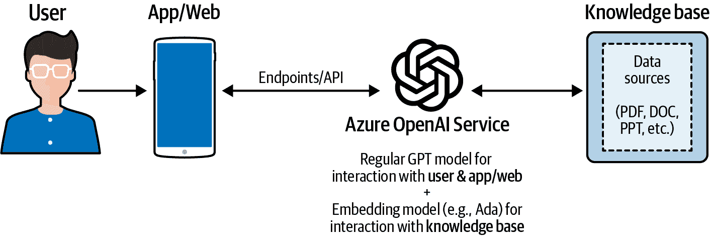

###### 图 3-21\. 基于嵌入的定位架构

你可以在官方微软文档中找到更多信息和代码示例，了解如何[创建嵌入](https://oreil.ly/8Duc8)（除了本章前面提到的 API 定义）。

此外，还有[一个官方的微软加速器](https://oreil.ly/iG5UU)可用于此类实现，你可以在开发阶段利用它。有几种部署和存储选项。请随意探索代码以查看 API 调用细节。

### 基于文档索引/检索的定位

基于文档索引/检索的 grounding 方法是基于嵌入方法的替代方案。在这种情况下，我们不会生成数学向量。相反，我们将生成特定文档的索引，这样 Azure OpenAI 服务就可以从这些来源找到信息，并将其作为其答案的一部分。为此，我们还将使用 Azure Cognitive Search，这是一种允许您从知识库或文档集合中索引、理解和检索相关数据的服务。

这两种服务的结合使得强大的聊天机器人应用程序成为可能，这些应用程序可以用自然语言与用户交流，并基于组织的具体数据提供直观和个性化的交互。与基于嵌入的方法类似，官方的[Microsoft 加速器](https://oreil.ly/JNWAz)可供您部署您的第一个概念验证，此外，还有来自微软阿根廷团队的第二个名为 [GPT-RAG](https://oreil.ly/Q5NK9) 的加速器，它为更大的实现提供了一些额外的功能。您可以探索这两个选项，以查看 Azure OpenAI 和 Azure Cognitive Search 的更新细节和实现方法。您还可以在图 3-22 中查看关键构建块的高级架构。


###### 图 3-22\. 基于检索的 grounding 架构

与基于嵌入的方法相比，主要区别在于，您不会为知识库和用户问题生成嵌入，而是只需对 Azure AI Search 引擎（或任何等效的，我们将在第四章中探讨向量数据库）进行搜索。

您可能会认为这个选项比嵌入方法简单一些，更适合需要找到信息来源（甚至可以将链接到原始文档作为答案的一部分）的应用程序；嵌入可以处理更大的数据集并实现更好的性能。然而，这实际上取决于特定的数据集及其知识范围和文件格式，以及预期的用例，因此我的建议是您尝试这两种选项，并从用户的角度评估哪种选项能提供最佳结果。

### 混合搜索基础 grounding

基于混合搜索技术的[新实现方法](https://oreil.ly/mwZPy)正在出现。具体来说，混合搜索结合了向量嵌入和文档检索能力。Azure AI Search 的[混合搜索功能](https://oreil.ly/c2W8A)提供了这种组合，以及一个[重排序技术](https://oreil.ly/S7b8p)，该技术可以产生最终结果，其性能优于之前提到的 grounding 技术。现在，让我们探索一些额外的 grounding 选项，这些选项可以为您的生成式 AI 应用程序添加更多的知识范围。

### 其他基础技术

我们已经探索了多种微调和根植技术，主要基于来自不同来源的文本信息。但如果你想要利用其他类型的数据呢？或者如果所需信息只能通过实时网络结果找到？这里有一些你可能想要探索的其他根植技术：

LLM + 网络结果

此方法依赖于[必应网络搜索 API](https://oreil.ly/qud-9)来扩展 Azure OpenAI 服务模型的认知范围。正如您可能知道的，所有 LLM 都是基于截至特定日期的训练数据集（例如，最初的 Azure OpenAI 模型更新到 2021 年的数据）。如果您需要更新信息，可以使用必应网络搜索 API 查找网页、图片、视频、新闻等，或者用它来创建一个自定义搜索实例，根据标准过滤网络结果。然后，API 的结果可以由 Azure OpenAI 使用，根据该信息返回答案。

LLM + 表格数据和/或数据库

与其他来源类似，表格数据（例如，Excel 和 CSV 文件）和常规 SQL 类型数据库（例如，SQL Server、Azure SQL、PostgreSQL）可以作为良好的根植来源。您可以开发行业所称的数据库协同助手，允许最终用户查询信息而无需任何复杂的 SQL 语法，只需基于自然语言的提示。或者，您可以利用它进行[其他数据探索](https://oreil.ly/s3snz)主题，例如探索性数据分析或根本原因分析。

就像其他之前的根植选项一样，有一个[官方微软加速器](https://oreil.ly/eFneC)，它结合了这些根植技术，包括具体的代码示例和更新后的实现。

最终，每种实现方法（基线、微调或基于根植）都服务于不同的目的，但下一节为您提供了一个总结性指南，以了解每种方法的优缺点，以便您做出最明智的决定，并使用 Azure OpenAI 创建性能、成本和技术复杂度最佳平衡的生成式 AI 应用。

## 方法比较和最终推荐

对于“我应该使用哪种方法进行我的生成式 AI 实现？”这个问题，并没有一个唯一的正确答案。这实际上取决于用例、可用数据的类型和数量、现有的 IT 架构、可用预算和资源等。再次强调，没有正确答案，选择目前依赖于实验和性能测试。

表 3-1 展示了实现方法的优缺点。

表 3-1\. Azure OpenAI 服务的实现方法比较

|  | 方法 | 优点 | 缺点 |
| --- | --- | --- | --- |
| 1 | 基本 ChatGPT 类型实例（原味、私有） |

+   相对简单且快速部署

+   适用于内部（员工）用例的好选择

+   可通过 Azure OpenAI 的视觉游乐场获取

+   可根据 URL 定义主题范围，通过利用系统消息

|

+   缺乏更新数据

+   对于客户端应用非常有限

+   模型幻觉风险更高

|

| 2 | 使用单次/少次学习示例 |
| --- | --- |

+   容易实现

+   根据公司具体知识调整系统行为的好选择

+   通过 Azure OpenAI 的视觉游乐场提供

|

+   缺乏更新数据

+   对于客户端应用非常有限

+   模型幻觉风险更高

|

| 3 | 微调 |
| --- | --- |

+   使用特定公司数据微调现有模型是个不错的选择

+   利用成熟的产品功能

|

+   准备输入数据以进行微调和少样本学习都较为复杂

+   微调模型的成本增加

|

| 4 | 基于嵌入的定位（使用 Azure AI Search 的向量） |
| --- | --- |

+   无需微调即可进行定制的优秀选择

+   适用于大量数据

+   容易使用嵌入 API

|

+   需要根据令牌限制准备输入数据

+   需要通过 OCR 扫描文件以提取内容

+   为定制数据生成初始嵌入的成本（取决于数据范围）

|

| 5 | 基于检索的定位（使用 Azure AI Search 进行索引，无嵌入） |
| --- | --- |

+   从现有文件中检索信息的好选择

+   索引允许引用来源（有利于可解释性）

+   可以使用游乐场中的“添加自己的数据”选项进行小型实现

|

+   对于大量私有数据，可能不如嵌入性能好（将在初步实验中确认）

|

| 6 | 混合搜索 |
| --- | --- |

+   由于索引、嵌入和模型结果重排的组合，性能更优

+   通过 Azure OpenAI 游乐场相对可行

|

+   对于 Azure OpenAI，复杂度不高于常规基于嵌入的 RAG

|

| 7 | 其他定位技术（Bing 搜索、数据库等） |
| --- | --- |

+   非常适合向 LLM 添加实时结果，并探索内部来源，如数据库和表格文件

+   无需重新训练或调整模型即可更新结果

|

+   稍微复杂一些（需要编排引擎如 LangChain 或 Semantic Kernel）

+   对于此类实现，可用的文档较少

|

这些实现方法具有不同的优势和复杂度水平。其中一个关键方面是评估它们的性能如何，以及这些 Azure OpenAI 模型对于特定问题和任务有多好。让我们在下一节中探讨所有这些内容。

## 人工智能性能评估方法

任何生成式 AI 项目的关键阶段之一是模型性能评估。然而，评估启用 LLM 的系统性能并不简单，而且尚未完全标准化。话虽如此，你可以从 Azure OpenAI 和 Azure AI Studio 开始评估指标，正如你将在第五章（ch05.html#operationalizing_generative_ai_implementations）中看到的那样，使用 LLMOps 和提示流进行评估。

这里是生成式 AI 评估最重要的指标选择：

定位性

基于事实性是指生成式 AI 的响应基于给定或输入中可用的信息有多好。这是一个分析 AI 如何坚持事实、避免幻觉的好指标。您可以从 AI 内容安全工作室探索新的[基于事实性检测功能](https://oreil.ly/Lk4ZI)。

相似度

该指标衡量 GPT 输出与人类输出的相似程度。这对于验证 Azure OpenAI 模型的结果非常有用。

相关性

它衡量 AI 的输出与输入之间的关联程度。这就像检查在对话中某人的回答是否与您提出的问题相关。

分类准确率

用于分类任务的指标，介于 0 到 1 之间，衡量 AI 模型输出与真实值之间的差异。

Levenshtein 距离

这衡量了您需要做出多少更改，例如添加、删除或更改部分，才能从 AI 的输出到预期的输出。

一致性

这检查 AI 的输出是否有意义且遵循逻辑顺序，例如检查一个故事是否有开头、中间和结尾，并且不会随机跳跃。

流畅性

该指标通过检查书面段落是否易于阅读和理解（从语言学和语法角度来看）来衡量 AI 的输出读起来有多流畅。

F1 分数

这是在模型答案中的单词与真实值之间的平衡。

其他指标

来自传统 NLP 的其他指标。

从 Azure 的角度来看，您可以通过[Azure AI Studio](https://oreil.ly/q2S7r)和[Azure Databricks 与 MLFlow](https://oreil.ly/3kONX)探索可用的评估指标。以下是一些主要行业参与者（包括微软和 OpenAI）的一些正在进行中的倡议，但您可以期待在接下来的几个月和几年内会有更多新闻和工具：

+   微软的[LLM 评估框架](https://oreil.ly/H6gB8)

+   微软的[评估流程（Azure AI Studio）](https://oreil.ly/4NrIz)

+   微软对[LLM 指标监控](https://oreil.ly/VtjxD)的文档

+   OpenAI 的[Evals 项目](https://oreil.ly/NgdLZ)

此外，还有其他一系列的指标，您可以使用它们来衡量和分析性能：

答案的正面/负面评论

一种手动跟踪性能并可能通过加权重新配置（例如，使用良好答案的少样本学习）重新教育模型的方法。您可以通过在 UI 中使用正/负符号，并在决定将问题答案（例如，ID、问题、答案、审查）存储在通过 Cosmos DB 存储的 JSON 文件中时在数据库级别添加二进制数值来启用此功能（例如，ID、问题、答案、审查）。为此，我的建议是创建一组测试问题，并在创建该组以及评估系统期间涉及主题专家。

传统产品分析指标

例如，会话时间、获取最佳答案所需的重问次数、整体产品评分等。这需要连接到云原生应用程序（例如，iOS、Android、Web 等）的工具，如 [Microsoft Clarity](https://oreil.ly/2RHm1)、Pendo、Amplitude、Mixpanel 等。或者，有如 [Azure App Insights](https://oreil.ly/HXkzL) 这样的云原生功能，可以作为生成式 AI 应用程序监控系统的一部分进行部署。此外，这些工具还可以用于跟踪 A/B 测试实验的性能（例如，如果我们推出两个不同版本的 AI 模型，针对不同的用户群体）。

# 结论

本章不仅包括适用于您的 Azure OpenAI 实现的可用的视觉和基于代码的工具，还包括推荐的实现方法，以帮助您理解常规、微调和基于事实的 LLM 之间的区别。再次强调，没有完美或唯一的方法来做这件事。所有这些方法都试图利用 Azure OpenAI 模型的现有能力，以及通过示例、内部数据源、实时互联网搜索等来增加您应用程序的知识范围。在第四章中，我们将探讨您生成式 AI 开发所需的额外构建块。
