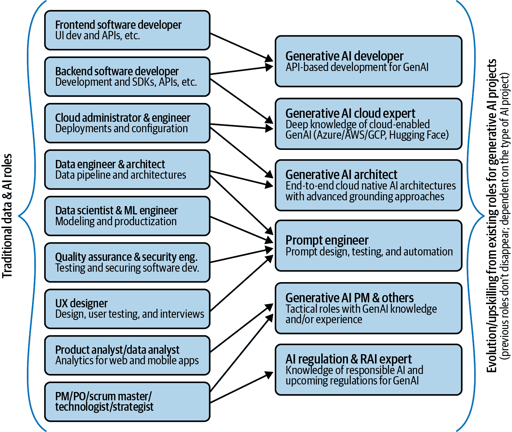

# 第六章. 详细阐述生成式 AI 商业案例

本书的前五章重点介绍了与生成式 AI 的云原生架构相关的技术方面，Azure OpenAI 和其他 Azure 服务的高级功能，以及生成式 AI 在企业中的运营化，包括 LLMOps 和负责任 AI 等主题。在第三章中，我们甚至探讨了利用不同 Azure 资源的具体技术方法，并根据项目范围和公司数据类型提供建议。

公司采用 Azure OpenAI，以及一般性的大型语言模型（LLMs）的主要动机之一是通过自动化基于语言的场景来产生显著的优势，或创造差异化，提供比竞争对手更好的产品，从而有可能增加收入。

在本章中，我们将重点关注使用 Azure OpenAI 服务构建生成式 AI 项目的商业考量，包括项目规划和评估主题，如成本场景和估算、投资回报率（ROI）、路线图等。我们将涵盖使任何技术实现成为可持续和可行的生成式 AI 初始化的关键方面。

# 预死亡分析，或实施生成式 AI 项目前需要考虑的事项

最有趣的经理技术之一是[预死亡分析](https://oreil.ly/jjw4R)。它不如*事后分析*（在项目完成后分析项目）那么为人所知，*预死亡分析*是在项目开始之前进行的，假设项目已经失败，然后尝试识别导致失败的因素。鉴于此类实施的复杂性和不确定性，这是一个强大的工具，适用于生成式 AI 和任何 AI 项目，因为它可以将任何技术或商业主题作为识别潜在风险和制定缓解计划的方式。

表 6-1 汇总了与生成式 AI 实施相关的典型风险列表，本章的后续部分将包括几个资产，以提高您使用 Azure OpenAI 的项目成功的可能性。

表 6-1. 生成式 AI 项目的潜在风险

| 类别 | 风险 | 可能出什么问题 |
| --- | --- | --- |
| **情境** | 监管和合规 | 用例或潜在项目必须与即将出台的法规保持一致。即使其中一些是“正在进行中”的，例如社会评分、操纵等，已经是禁止应用的明确例子。对于生成式 AI 部署，所需的[透明度义务](https://oreil.ly/sq8N1)是关键，并需要在项目设计阶段考虑（例如，通过直接从 MLOps 和 LLMOps 系统生成跟踪和变更日志）。 |
| 正确使用 | 微软[Microsoft](https://oreil.ly/7ojQP)和[OpenAI](https://oreil.ly/eQpg-)都有关于如何使用和不使用模型的政策。未能遵守这些规定（除了使用国际 AI 和一般法规已禁止的用例之外）可能会导致服务访问受限。 |
| 内部担忧 | 由于生成式 AI 的新颖性和复杂性，公司内的多个部门将需要参与讨论，他们可能并不完全一致。虽然技术和业务部门可能对如何以及为什么使用 Azure OpenAI 有一个明确的想法，但其他部门如法律或合规部门可能暂时阻止实施，以便首先了解与服务的性质、数据隐私、居住地等相关的问题。利用[透明度说明](https://oreil.ly/B843c)、微软的[欧盟数据边界](https://oreil.ly/Bor0w)、[合规性提供门户](https://oreil.ly/lKBjQ)以及任何[法律和数据保护附加协议（DPA）-相关信息](https://oreil.ly/Fqfi9)将有助于解决此类情况。 |
| **商业** | 不当用例发现和优先级排序 | 一个关键挑战是找到并优先考虑最可行和最有影响力的用例。有时优先级是基于执行团队或技术部门的想法，或者他们可能不在同一页面上。通过适当的构思和清晰的设计思维过程，可以帮助分析潜在用例列表中的所有相关方面。 |
| 缺乏量化使用场景 | 对于生成式 AI 的采用者来说，另一个挑战是想象他们的新云原生解决方案将被最终用户使用多少。需要初步场景来在技术和预算层面正确地确定预期解决方案的大小。这可以通过估计平台的平均每日/每月使用量来估算总用户数来实现。 |
| 预期之外的代价 | 由于生成式 AI 工具（包括 Azure OpenAI 服务）定价的线性，估计成本相对简单。但要准确估计成本，不仅需要有明确的用例，还需要了解定价结构，并能够根据所选模型使用官方[Azure 计算器](https://oreil.ly/2SQ4C)和其他工具（如[OpenAI 的标记器](https://oreil.ly/DDQHG)）来创建估计。此外，一般 FinOps 最佳实践，如资源标记、定价警报和 Azure 成本管理的使用，有助于监控生成式 AI 项目的成本。 |
| 不明确的商业案例 | 如果潜在用例没有得到适当的优先排序，并且没有明确的场景和成本估算，那么制定任何商业案例和回报率预期都将是困难的。任何生成式 AI 商业都必须包括对采用公司潜在收入、节省或差异化的估算。例如，“呼叫中心节省的人时数”、“自动解决的票数”、“推荐机器人中的商品升级”等。 |
| 创新困境 | 即使公司的大部分人愿意采用生成式 AI，一些倡议可能由于创新困境而被暂停。这意味着可能会提出诸如“实施这样的东西是否太早？”或“为什么是这个而不是其他需要预算的创新？”等问题，并且拥有一个坚实的理由来证明新的 Azure OpenAI 项目是关键成功因素。快速发展的生态系统和日益激烈的竞争是生成式 AI 采用的潜在考虑因素。 |
| **技术** | 高复杂性 | 尽管使用 Azure OpenAI 的实现相对技术门槛较低，但常见的情况是采用公司、集成商和个人对他们的知识水平缺乏信心，尤其是在复杂实现方面。视觉界面如 Azure OpenAI Studio 的演变，作为测试和部署配备生成式 AI 的 Web 应用和机器人代理的方式，以及模型部署和其他视觉功能（如提示流）的方式，将有助于降低对技术或非专家采用者的入门门槛。 |
| 性能低 | 根据初始预期，生成式 AI 应用程序的性能可能会被认为是不完美的（这显然是正确的），因为它们倾向于产生间歇性错误。如果预期不切实际，测试阶段可能会导致失望，阻碍通往生产的道路。与主题专家（SME）和/或最终用户一起对解决方案进行初步对齐，并明确定义“足够好”的性能意味着什么，以及一个适当的计划来评估解决方案，这些都是非常重要的。 |
| 资源不足 | 由于缺乏预算、用于定制模型的资源和具有正确技能的人员等资源，实施可能会在项目开始前或进行中停止。确保可行性的好方法是正确界定预期的实施，并根据项目优先级和技术复杂性相应地制定计划。 |
| 安全问题 | 就像任何其他数据或 AI 系统，生成式 AI 可以在多个层面上遭受攻击：外围、数据源（用于归一化的那些）和提示（通过提示注入技术）。采用最佳架构和 DevSecOps 实践，并计划红队活动以模拟场景，可以帮助提高系统的整体鲁棒性和安全性。 |

当然，还会有其他需要考虑的相关主题，因此任何预先分析活动都必须准备并与所有相关利益相关者讨论。了解和降低风险的最佳方法之一是，在预期的生成式 AI 解决方案细节和预期实施方面进行非常细粒度的分析。为此，定义详细的路线图和相关资源及活动将大有裨益。

# 定义实施方法、资源和项目路线图

对于复杂的 AI 项目来说，最具挑战性的活动之一是以细粒度的方式规划活动，并制定详细的路线路图，以指定主要工作类别、持续时间以及所需的技术和人力资源。

本节包括一种非详尽的方法，将使您作为 Azure OpenAI 的采用者能够逐步规划您的新项目。为了说明以下章节中理论之外的示例，我们将参考 [Azure DevOps](https://oreil.ly/dGQEr)（用于项目规划和更多功能的原生 Azure 服务）及其一些功能。

## 定义项目工作流

在规划项目活动之前，定义实施的作业范围至关重要。为此，创建工作类别（或工作流）将有助于创建不同的活动和用户故事的存储桶。以下是针对使用 Azure OpenAI 服务的生成式 AI 项目推荐的工作流列表（相互独立；项目符号不代表顺序方法）：

云启用

与 Azure 云着陆区、租户、资源组和资源组等相关的设计、部署和优化活动。这还包括安全和监控配置。

数据集准备

所有用于使 Azure OpenAI 启用的系统实现定制的相关数据准备、工程和存储活动。这并非典型的非生成式 AI 的数据工程和管道流程，其中我们需要朝着用于训练模型的一致数据输入方向努力。相反，数据集将包括多样化的“片段”，例如文档、JSON/JSONL 文件和生成的嵌入。数据质量测量和改进等主题对于成功的实施仍然非常相关和关键。

提示工程

与系统提示和用户提示的设计、测试、自动化和优化相关的所有内容。由于执行这些活动所需的探索和实验，这是一种特定类型的工作流（因此，从项目规划的角度来看，计划和估计它们的复杂性也较高）。

设计和用户测试

与 UI 设计（包括之前的用户访谈）相关的端到端活动，以及从 UI/UX 和模型性能及评估的角度测试生成式 AI 解决方案。

部署活动

一个横跨所有初步和生产线部署的工作流，包括初始试点、临时内部测试网页应用等。此工作流将包括整个生成人工智能软件生命周期（即，概念验证、最小可行产品）中特定步骤的关键里程碑和日期，基于以评估驱动的 AI 系统开发原则。

这些工作流可以通过 Azure DevOps 表示为[区域路径](https://oreil.ly/82ROJ)，因为这些路径有助于将任何项目组织成工作项的组。它们还将作为视觉路线图的工作类别，正如我们将在本章后面看到的。现在我们已经有了工作流，让我们深入了解以定义和量化项目资源。

## 确定所需资源

下一步是了解和计划我们将在 Azure OpenAI 实施中需要的不同资源。这将从纯粹的技术方面到与解决方案开发相关的“人时”成本，以及其维护。我们可以定义以下资源类别：

人力资源部门

不同的档案和相关技能将显然取决于实施类型和范围。然而，对于任何生成人工智能和 Azure OpenAI 服务相关的实施，您需要考虑以下关键角色：

商业高管

为您的生成人工智能项目提供赞助，支持业务需求，并提供所需资源。

架构师/专家

具有高度专业知识的 Azure OpenAI 和其他生成人工智能服务的技术档案。他们可以通过利用聊天、嵌入、文本到图像和其他模型，以及根据数据源的性质和格式分析不同的微调和接地选项来评估功能和技术需求，并定义合适的架构。

开发者

具有先前后端或前端经验的软件开发者档案，特别是针对具有 API 集成功能的工程项目。其中一些主要能力与 Azure OpenAI API 和 LangChain、Semantic Kernel 等编排块有关。

提示工程师

具备混合技术和管理经验的人才，其技能组合包括提示设计、测试、迭代和优化，以及为生产级提示复用创建模板。具有先前经验的人员可能包括高级测试能力，以及安全性和提示注入技术（例如，质量保证或 QA 工程师）的知识。

安全专业人士

作为[AI 红队](https://oreil.ly/5Kf3c)活动的一部分，或针对确保 API、数据源等的具体开发活动。

云工程师/管理员

具备管理、部署、配置和消费来自 Microsoft Azure 的云资源的经典云专业人士。他们可能对 Azure OpenAI 服务的 Azure 门户、工作室和游乐场界面有初步了解。

负责人工智能和合规性专家

具有伦理和法律知识的具体角色，与第五章中提到的数据隐私和 AI 监管主题相关。他们通常以兼职形式提供，并且可能对 ChatGPT、Bing、Azure OpenAI 服务、通用云、产品 DPAs 等工具具有特定知识。

其他战术和技术角色

项目和产品相关的角色，例如产品经理（PMs）、产品所有者（POs）、项目经理、敏捷大师等。他们可能没有或只有很少的生成式 AI 经验，但我们预计这些角色在几个项目之后将继续提升技能并获得实际知识。此外，经典角色如数据三部曲（科学、工程、分析）可能成为团队的一部分，甚至承担一些核心生成式 AI 责任，作为其当前角色的演变（或补充）。

如果您在经典数据与 AI 角色（例如，数据科学家）和新型的 LLM 导向角色（例如，提示工程师）之间犹豫不决，图 6-1 展示了关于角色和技能演变的某些高级指导。

###### 图 6-1\. AI 角色和技能的演变（示例）

其他技术资源

所有需要使用 Microsoft Azure 实现 Azure OpenAI 和其他生成式 AI 项目的产品和服务的：

云订阅

在这种情况下，所有必需的 Azure 服务都是基于使用量工作的。这意味着不需要固定的价格或许可证，只需为部署到您特定生成式 AI 实现的每个 Azure 服务支付价格。

其他软件许可证

对于大多数情况来说不是必需的，但某些实施可能包括特定的许可证，例如如果您使用 PVAs 作为编排块和机器人界面，或者如果您利用其他非 Azure 生成式 AI 服务来创建端到端架构。

外部成本

这可能与外部技术和咨询服务有关，这些服务通常被采用公司利用以加速其生成式 AI 项目。这项工作需要在本章中我们将要审查的 ROI 练习中进行量化。

其他实施后成本

这包括与维护活动、模型改进或基础范围演变（即向现有知识库添加新文件和数据、生成新的嵌入）相关的未来成本场景。

所有这些因素都意味着我们将使用它们来计划和评估与生成式 AI 实施相关的业务案例的可持续性。这是确保它对采用公司真正值得的关键步骤。

## 估算持续时间和工作量

从上一节中定义的“人力资源”的第二级细节是对他们在项目中的参与程度和投入水平进行量化。一种很好的展示方式是列出所有角色，并显示图 6-2 中所示的具体细节。

###### 图 6-2\. 项目角色和努力程度的视觉模板

在这个图中，我们可以看到角色的分布，包括每个角色的员工人数、活动范围以及与常规全职投入相比的努力程度。当尝试展示所需的角色及其努力程度（每周的小时数）时，这个简单的视觉图可以成为你的最佳盟友。然而，你需要根据项目和公司的具体情况来计算这些数据。以下是一个示例估计：

+   提示工程师是一个高度专业化的角色，可能需要兼职在一个项目的一部分工作。根据范围和所需努力的程度，我们可以设想他们在一个项目上投入的时间范围是 25%到 50%，这意味着他们可以同时参与几个生成式 AI 项目（具体来说，在两个到四个之间）。

+   需求驱动的角色，如合规性和 RAI 专家，可能为项目分配的最大小时数，用于反应性的临时投入。这取决于项目，但平均可能是他们时间的 5%到 10%，这意味着每周平均 4 到 8 小时。显然，他们的参与度将根据项目阶段而变化。

+   其他角色，如建筑师、工程师、管理员等，在项目的不同阶段需要特定的知识。其中一些人甚至可能拥有两个或更多的职能角色（例如，建筑师最初可以定义架构和需求，然后扮演工程角色来实施解决方案）。对于生成式 AI 开发者也是如此，他们可能从事与代码相关的活动，但也可能部署 Azure OpenAI 模型并通过 API 将它们集成到工具中。所有这些角色都可以在 20%到 100%的投入度之间变动，具体取决于项目范围。

无论角色的类型和数量如何，最初规划资源需求、了解有多少人将工作、每周多少小时以及在整个端到端项目的哪个阶段工作，都是非常重要的。这意味着重要的是有一个计划，而不是寻找完美的计划。能够准确规划和估计的能力显然将取决于与 Azure OpenAI 相关的生成式 AI 项目经验的增加，因此在最初的几个项目中做出错误的假设是正常的。即使如此，我们也将拥有为生成式 AI 项目准备初步路线图的关键构建块。让我们在下一节中检查详细情况。

## 创建“动态”路线图

让我们分析我们现在应该拥有的内容：对潜在用例和实施方法的清晰理解，对架构的初步定义，对人力和工具层面所需资源的初步想法，以及对不同团队成员可用性的估计。

这些都是创建项目“活路线图”的关键要素。让我们从基础开始。路线图是一种以视觉方式传达实现目标或结果计划的方法，在这种情况下是项目实施。它包括达到目标所需的主要步骤或里程碑，以及我们之前讨论的工作流，作为组织所有必需任务的方式。

“活资产”的概念指的是将其从初始版本演变的能力。这对于人工智能项目（包括生成式人工智能）尤为重要，因为初步路线图在实施阶段往往会因未知因素（例如，我们需要尝试和测试不同提示的时间长度）或意外事件（例如，对云平台的有限访问，团队成员的临时休假）而演变。因此，您可以将路线图视为一个画布，以直观、易于阅读的方式规划和演变您的实施，这是一个您可以与技术及业务/高管利益相关者一起定期讨论计划和进度的资产。图 6-3 是一个生成式人工智能项目的视觉路线图示例，其中包括一个虚构制药公司的说明性案例。

###### 图 6-3\. 人工智能和生成式人工智能项目的视觉路线图模板（顶部）和说明性示例（底部）

在这种单页路线图中，重要的是不要深入到超细粒度细节，而是要定义工作流和活动的“什么”和“何时完成”。使用冲刺来为两到四周的工作块结构化，是获取任务序列和持续时间更具体细节的方法。

从 Azure 的角度来看，一旦您定义了视觉路线图（例如，以 PowerPoint 幻灯片等常规格式），您就可以通过 Azure DevOps 中的[Boards 功能](https://oreil.ly/NKWy8)来实现其细节。此功能包括创建[看板](https://oreil.ly/kEhyq)、[Scrum](https://oreil.ly/0THjo)看板以及[交付计划](https://oreil.ly/v-hwK)，这些计划代表了按日历视图对冲刺内预定工作项的表示。

现在您已经有了项目计划和所有相关细节，让我们看看如何创建 Azure OpenAI 使用场景来估算云相关服务的成本。

# 创建使用场景

对于采用者和相关合作伙伴（例如，集成商、咨询公司）来说，最具挑战性的活动之一是为潜在的生成式 AI 解决方案创建现实场景。这对于可持续的商业案例至关重要，同时也确保有足够的预算用于云相关成本（Azure OpenAI 的成本结构针对大规模使用进行了优化，但它仍然是线性的，并且直接取决于与系统的交互次数）。挑战在于想象有多少用户将真正利用该解决方案，以及如何利用。

为了达到这个目的，最佳选择是采用*多级场景制定方法*，我们将逐步计算基于潜在终端用户数量的聊天应用的多项因素：

预期（平均）用户数

这对于任何可能动态出现终端用户，甚至内部员工使用内部生成式 AI 应用的 B2C 场景来说相对困难。尽管如此，我们的想法是确定一个最大平均用户数，我们知道这些用户将积极连接到最终解决方案。

每位用户每天的/周的/月的交互次数

再次强调，预测用户将使用解决方案的次数并不容易，但我们需要定义一个最大值。这个最大值可以基于与现有解决方案的过去交互次数，或者通过按日、周或月分配最大会话数来设定。这个最大值可以作为应用层面的会话限制，以确保没有人过度使用解决方案。

每次交互的最大长度（以令牌计）

这相对简单，并且适用于提示和完成。我们可以在 Azure OpenAI 模型（通过“最大长度”设置，也可以通过定义系统消息的长度）和应用层面（通过限制用户可以写入的字符和单词数量）进行限制。如果我们处理问题和答案的最大长度，我们可以获得每次交互的平均长度（例如，一个 50 个令牌的问题和一个 200 个令牌的答案，总长度为 250 个令牌）。

###### 备注

一般规则是 1,000 个令牌等于 750 个单词（对于英文文本），但实际上这取决于语言和单词类型。为了准确估计 X-令牌问题或答案的样子，请检查 OpenAI 的[分词工具](https://oreil.ly/DDQHG)。

如果我们得到这三个元素，我们可以通过创建一个非常简单的公式来想象分配给这种使用场景的最大成本：

预期用户数 × 每位用户的交互次数（对于特定时期；为此，我们将按月计算）

× 每次交互的最大令牌长度

= 总成本（即每月的总令牌数）

在这个例子中，如果我们有按月的交互次数，总令牌量将对应于一个月内总的使用令牌量。如果我们取这个数量，比如说 2,000 个用户 × 30 次交互 × 最大 500 个令牌，我们得到总共 3000 万个令牌。

如您所知，[Azure OpenAI 服务的常规定价](https://oreil.ly/7Gmq6)基于“袋”的 1,000 个标记。这意味着我们支付一个固定的金额（取决于每个模型的定价，这通常会随时间变化并降低），在这种情况下，30,000,000 个标记 / 每袋 1,000 个标记 = 30,000 袋。如果我们假设单价为$0.002（模型“X”的说明性金额），这意味着 30,000 × 0.002 = 60 美元的每月 Azure OpenAI 使用成本，这意味着每年 720 美元。显然，这个金额对于更大的场景会更高，并且不包括：

+   基于嵌入的 Azure OpenAI 的额外成本。这意味着如果我们利用嵌入，除了常规的聊天型功能外，我们还将使用一种不同类型的模型（例如，嵌入大型），其定价基于每 1,000 个标记的交互。

+   其他实施组件，如 Web 应用、其他用于文档智能、认知搜索、向量存储、语音转文字和文字转语音等 AI 服务。这些取决于解决方案的类型，可以通过使用官方[Azure 计算器](https://oreil.ly/2SQ4C)像其他云服务一样计算，即使用官方[Azure 计算器](https://oreil.ly/2SQ4C)。

+   任何其他与最终架构相关的许可或外部软件。一个很好的例子是使用 PVA 作为 Azure OpenAI 服务的部署和编排选项。在这种情况下，您需要添加[其月度成本](https://oreil.ly/KpqfF)。

从一般意义上讲，任何来自视觉架构的“盒子”或构建块都应考虑在内，以计算解决方案的总成本。定期检查官方定价网站，以获取关于每款型号价格的最新信息。对于公司范围内的场景，您可以探索[潜在的收费设置](https://oreil.ly/fpA1N)，以便将相应的成本计费给特定的业务单元或部门。

一旦我们详细阐述了我们的使用场景，除了之前考虑的所有人力和技术资源，我们最终准备好详细阐述我们的量化商业案例。

# 计算成本和潜在回报率

现在我们可以将所有这些信息汇总起来，同时关注总成本和总估计价值。这两个要素将帮助我们以清晰的回报率估计来详细阐述我们的商业案例：

总成本

这包括我们之前提到的所有构建块（人力资源、云成本、许可、外部费用等），包括对组织产生直接或间接成本的所有内容，包括实施团队提升技能和从事项目的工作成本。云的成本必须基于特定的使用场景计算，同时考虑到按使用付费和 PTU 定价模式。

估计价值

这将包括采用公司从 Azure OpenAI 的生成式 AI 项目中可能获得的任何改进：

硬性收益

这将包括任何收入增加或产生的节省。可以通过财务影响来量化多少以及何时实现，通常在初始实施之后开始。

软性收益

与创建新的业务线、公司战略差异化、创建新的知识产权、团队生成式 AI 项目经验等相关联的任何额外优势。

投资回报率的公式很简单，它主要关注可衡量的财务数据：

投资回报率 = [(量化硬性收益 - 总成本) / 总成本] × 100

它可以包括诸如盈亏平衡点等考虑因素，这表明初始投资将在何时收回。例如，您可以说总项目实施成本为 X，但将在两年内帮助产生 2X 的收入，因此投资回报率为 200%，并且这种情况很可能发生在第一年和第二年之间。

在评估使用 Azure OpenAI 的潜在生成式 AI 用例时，您（以及您的公司）需要考虑这些财务或公司层面的因素。您可以使用表 6-2 作为示例，并填写您实际的生成式 AI 项目。

表 6-2\. 生成式 AI 用例发现列表

| 用例 | 描述 | 持续时间 | 成本 | 投资回报率 | 其他好处 | 优先级 |
| --- | --- | --- | --- | --- | --- | --- |
| UC1 | 示例：制药公司的聊天机器人 | 7 周 | X K$ | 根据场景在 150%到 200%之间 | 提高员工满意度 | 最高 |
| … |  |  |  |  |  |  |
| UCn |  |  |  |  |  |  |

你显然可以添加其他与你的内部决策相关的相关因素，但这类分析将促进内部讨论和确定你的下一个生成式 AI 项目的优先级。与其他章节中的其他视觉元素一样，这些简单的表格和幻灯片在处理所有业务和技术利益相关者时简化了复杂性。

# 结论

这标志着我们第六章的结束，本章重点介绍了构建可持续和现实可行的 Azure OpenAI 生成式 AI 项目业务案例的关键要素（例如，项目路线图、所需资源、成本估算）。

记住，这些与业务相关的话题与其他技术考虑因素一样重要，并且是确保成功实施和保证用户接受度（无论是内部还是外部用例）的方式。如果您的生成式 AI 系统很棒，但数字不匹配，那么您的公司将无法采用它并充分利用它。在优先级和设计过程中，尽量包括本章中的建议。

我们现在将继续阅读本书的最后一章，其中包含来自该领域专家的几个生成式 AI 成功案例。我们几乎完成了——让我们行动起来。
