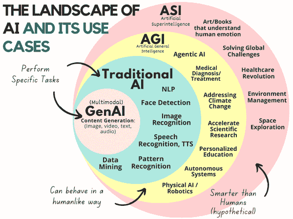
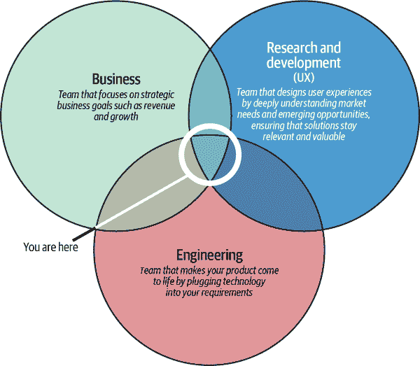
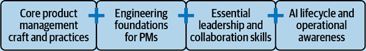

# 第一章。人工智能产品经理的角色

我曾经工作过的第一个 AI 团队正在设计一些特别的东西：能够理解各种口音的智能家居助手设备，甚至能够识别说话者是谁以及他们指示助手做什么。那是语音助手和智能家居的早期阶段。我一直对语言和技术的结合感兴趣，我知道许多语音系统并没有真正“理解”不同的说话方式。语音团队的目标是制造一个能够做到这一点的 AI。

那真是一个相当复杂的任务。我们处理了庞大的数据集，优化了算法，花费了几个月的时间试图弄清楚如何将这项技术嵌入到面向用户的产品中。语音技术，更具体地说，[语音识别](https://oreil.ly/GebkV)，使机器能够转录人类所说的话。同样，[文本到语音合成](https://oreil.ly/7MPDk)使计算机能够在输入书面文字后“说话”。

我最初并没有意识到自己已经置身于人工智能和创新的中心。这次经历让我看到了人工智能产品管理的激动人心的世界。

人工智能领域已经存在了几十年。它[起源于 20 世纪 50 年代](https://oreil.ly/4MEqd)，当时科学家们试图开发能够模仿人类大脑工作的计算机，特别是当艾伦·图灵提出机器也可以像人类一样被教导推理时。

人工智能是计算机科学的一个领域，它赋予计算机智能。它使机器能够执行与人类可以执行的任务相当的非平凡认知任务，例如推理、感知、语音处理、视觉感知、问题解决，最重要的是，正如[Oracle 指出](https://oreil.ly/Or9Wx)，从数据中学习和适应。尽管[人工智能不是新事物](https://oreil.ly/Bwv67)，但硬件限制直到最近才掩盖了其潜力。该行业现在才开始解锁人工智能的巨大潜力，这一突破得益于芯片技术的飞跃、前所未有的计算能力和数据的丰富。这些进步，加上复杂的算法和前沿的机器学习（ML）技术，正在为人工智能达到以前无法想象的能力奠定基础。

拥有大量数据的组织处于独特的位置，可以拥抱人工智能和机器学习。他们有望在运营（例如，为补货库存或确定正确的价格点等提供信息的预测）和产品（提供个性化、推荐、自动化、内容生成等独特、智能解决方案）方面获得显著的竞争优势。现在比以往任何时候，这些组织都需要能够理解人工智能及其潜力、利用它并将它“服务于”客户的专业人士。

现在，AI 无处不在。它驱动着越来越复杂和重要的决策，例如大学录取和医疗诊断。我写于 2024 年，仅在过去一年中，AI 就取得了巨大的进步，随着*生成式 AI*的出现，这是一种产生内容的 AI 子类型，有时简称为“GenAI”。

本章介绍了 AI 产品经理（AI PM）的商业角色。我将讨论这一角色与常规产品管理的区别以及它需要哪些技能集。我们还将探讨 AI 的多样化景观，包括 AI 产品如何利用不同的 AI 技术，以给您提供一个全面的视角，了解 AI PM 的日常工作和他们所处的更广泛环境。

# AI 演变的阶段

GenAI 经常与传统 AI 混淆，但事实上，它只是更大、更复杂 AI 景观的一个子集。这种区别对于理解 AI 的全部潜力至关重要，但这是一个我每天都会遇到的误解。虽然 GenAI 已成为热门话题，并且最近在技术上取得了显著进展，但它绝不是传统 AI 的替代品。

当我们谈论“AI”时，重要的是要明确这个术语涵盖了一系列技术和方法，每种都有其特定的用例。假设“AI”*仅仅*指的是 GenAI，这过于简化了这个庞大、多面的领域。现代 AI 被分为四组：传统 AI、生成式 AI、通用智能和超级智能。

图 1-1 突出了这四种 AI 在范围和能力上的差异，展示了 AI 从特定任务到更广泛、可能具有变革性应用的演变景观。该图强调了 AI 的分层复杂性，展示了每个类别如何独特地贡献于我们对智能系统理解和进步的理解。

###### 图 1-1\. 四种类型的 AI（来源：玛丽莲·尼卡博士）

## 传统 AI（1950s–Present）

传统 AI 有着悠久的历史，始于 20 世纪 50 年代，代表了 AI 的基础技术。这些系统通过基于规则的或模式识别系统执行特定任务。传统 AI 包括我们每天互动的一些最基本的应用：

视觉

传统 AI 在计算机视觉任务方面取得了进展，如图像识别、物体检测和面部识别。这些技术使系统能够解释和分析视觉输入，为从社交媒体平台上的照片标记到帮助医生诊断疾病的先进医学成像技术等一切事物奠定了基础。

语音

语音识别和语音转文本技术，如 Siri 和 Alexa 等语音助手所使用的，已经发展了几十年。这些技术将口语转换为文本，使机器能够响应语音命令。文本转语音（TTS）系统则相反，使计算机能够以类似人类的方式说话。

自然语言处理（NLP）

NLP 任务，如语言翻译、情感分析和使用聊天机器人的其他任务，取得了重大突破。想想谷歌翻译或客户服务中使用的聊天机器人；这些依赖于人工智能以比简单的关键词识别更复杂的方式理解人类语言。

机器人技术

机器人技术中的传统人工智能导致了工业机器人、自动驾驶汽车和无人机的发展。这些机器人能够执行复杂的任务，如工厂中的组装或在街道上自主导航。

数据分析

传统人工智能在预测分析、数据挖掘和模式识别方面表现出色。它可以分析庞大的数据集，揭示隐藏的模式，使组织能够做出基于数据的决策，并自动化曾经需要人类直觉的过程。

## 生成式人工智能（2010 年代末至今）

通用人工智能代表了最近一波人工智能创新浪潮，并因其创造内容的能力而吸引了公众的注意。这些内容可以是文本、图像、视频，甚至是音乐，但通用人工智能并不取代传统人工智能所处理的任务。相反，它开辟了新的维度：

内容创作

从给定的提示中生成媒体，如图像、视频和文本，是通用人工智能（GenAI）的核心优势之一。应用范围从创意艺术（帮助艺术家设计图形或创作音乐）到商业（为电子商务网站自动生成产品描述）。

深度伪造

通用人工智能还可以用于创建合成媒体，有时被称为*深度伪造*，可以令人信服地模仿真实人物的语音或外观。虽然这项技术引发了伦理问题，但它也在娱乐和模拟环境中具有合法的应用。

个性化媒体

通用人工智能正被用于为个人定制内容体验。例如，Netflix 和 Spotify 等平台正在使用人工智能来推荐符合用户偏好的节目和音乐。这一趋势正在重塑媒体消费，使其比以往任何时候都更加个性化。

设计和艺术

如[DALL-E](https://oreil.ly/MzMRb)和[Adobe Firefly](https://oreil.ly/F4T-4)等人工智能工具帮助艺术家生成概念或原型。这些工具减少了创作创意作品的时间，使艺术家能够专注于完善他们的想法。

游戏开发

通用人工智能通过允许游戏开发者创建程序生成的世界、角色和环境，使游戏更加互动和动态，从而让每个玩家的体验都独一无二。

## 通用人工智能（2030 年代？）

通用人工智能（AGI）是 AI 研究的下一个前沿，虽然我们还没有达到那里，但它承诺机器能够理解、学习和应用知识，涵盖广泛的任务——本质上模仿人类的认知功能：

问题解决

AGI 将能够解决复杂的多领域问题。想象一下，AI 系统可以在某一刻进行医疗诊断，在下一刻进行战略商业规划。

研究与开发

在研发领域，AGI 可以通过生成假设、运行模拟和进行实验，比人类快得多，从而显著加速科学发现。

个人助理

AGI 可以将今天的虚拟助手发展成为高度能够管理日常生活各个方面的系统，从个人日程到创造性问题解决。

医疗保健

AGI 在医疗保健领域可能会取得巨大的进步，提供个性化医疗、诊断复杂状况，甚至提出新颖的治疗方法。

## 人工超级智能（~2040s？）

人工超级智能（ASI），虽然目前还是假设性的，但将超越人类智能，为今天甚至不在我们概念掌握范围内的问题提供解决方案：

解决全球挑战

如果 ASI 成为现实，它可能为气候变化、世界饥饿和地缘政治冲突等大规模问题提供革命性的解决方案。ASI 可以提供新的策略来解决人类最紧迫的问题。

可靠的预测

许多人在今天所做的决策都是数据驱动的。例如，天气预报是基于数千个历史数据点来制定的。有了 ASI，未来的预测，无论是预测天气还是预测市场价格的变动，都将更加准确。

高级太空探索

太空任务，以及可能星际殖民，可能由 ASI 的分析和创造性能力提供动力，解决推进、生命维持和资源管理等复杂问题。

现在我们已经探讨了 AGI 和 ASI 的理论潜力，了解 AI 在现实世界产品中的应用方式至关重要。AI 已经在以深刻的方式改变行业，作为 AI 产品经理，你的角色对于使这些技术对用户实用和有价值至关重要。让我们看看一些开创性的 AI 驱动产品的例子，以及 AI 产品经理在它们开发中的关键作用。

# 产品如何利用 AI

作为 AI 产品经理，你有潜力通过帮助你的组织战略性地“注入”AI 来创造价值，从而改变你的行业。为了强调 AI 产品经理可以从事的多样性，让我们看看一些实际的、具有变革性的、开创性的 AI 产品例子，以及 AI 产品经理在它们创造中的作用。

Google Photos 是一个组织和存储用户照片和视频的应用程序：“一个存放你所有照片和视频的家，组织并使之生动起来，”正如[谷歌所描述的](https://oreil.ly/IZ8vD)。这个价值主张几乎肯定是由该团队的 AI PMs 构思的。更重要的是，它的[搜索功能](https://oreil.ly/EdesI)使你能够使用基本关键词（例如，“狗”）轻松搜索你的内容，无需预先训练模型。只需输入关键词，Google Photos 就会搜索你所有的照片，并显示包含该关键词的照片。这个功能使用了多种基于人工智能的智能技术，包括人脸识别、物体检测和场景检测，以识别和搜索特定的人（“Steve”）、物体（“汽车”）和地点或情况（例如，“森林”或“婚礼”）。

AI PMs 还对自动驾驶汽车的发展产生了影响。例如，[特斯拉的全自动驾驶（FSD）测试版](https://oreil.ly/j8uKS)可以导航街道、安全变道，甚至可以自己停车。它使用的技术包括[强化学习](https://oreil.ly/qhvZk)，这是一种机器通过自己的经验通过试错来学习的技术，以及[计算机视觉](https://oreil.ly/LjQhV)，它使计算机能够从图像、视频和其他视觉输入中提取有意义的信息。

另一支我参与过的团队是谷歌的增强现实（AR）/虚拟现实（VR）团队，他们正在开发[Google Lens](https://lens.google)。这项技术帮助用户理解他们周围的世界。它分析他们摄像头指向的每一件事，并启用各种操作——例如，屏幕上的实时翻译、个性化的购物推荐、餐厅的实时评论等等。它使用的技术包括计算机视觉和自然语言处理（NLP），这是一种帮助计算机以类似人类的方式理解（语音或书面文本）词语的人工智能工具。

从推出人工智能驱动的照片组织工具到自动驾驶汽车和增强现实应用，人工智能产品经理（AI PMs）处于科技领域一些最激动人心的进展的前沿。但使这些技术真正具有创新性的不仅仅是应用本身：它们建立在人工智能本身的独特特性之上。理解这些基础特性是释放人工智能驱动产品全部潜力的关键。

现在，让我们深入了解使人工智能如此独特的原因。无论是人工智能模型的学习方式、适应方式还是处理不确定性的方式，这些独特特性塑造了你对产品开发、决策制定和用户体验设计的看法。让我们探讨这些特性以及它们如何影响你作为 AI PM 的角色。

# 人工智能的独特特性

人工智能具有一些独特的特性，使其与传统软件和其他技术工具区别开来。理解这些独特特性对于你在人工智能产品经理角色中的导航至关重要。这些特性不仅塑造了人工智能系统的功能，还影响了你的决策、优先级和设计的用户体验。让我们深入探讨这些特性，我将解释它们对你意味着什么以及它们如何影响你创建的产品。

## 概率特性

人工智能模型基于概率而不是确定性来运行。与遵循确定性规则执行预定义命令的传统软件不同，人工智能基于从数据中学习到的模式进行预测。例如，一个 AI 系统可能会以 80%的置信度预测一张图片包含狗，但仍有 20%的可能性它可能是其他完全不同的东西。

你需要接受并管理不确定性。在使用人工智能预测时，你永远无法达到 100%的确定性，因此你的部分职责将是与利益相关者和用户设定正确的期望。理解准确性与其他产品因素（如速度或成本）之间的权衡是关键。在自动驾驶汽车、医疗诊断和金融交易等应用中，即使是微小的错误也可能产生重大后果，因此持续提高模型准确性成为你路线图的关键部分。我们在第三章深入探讨了权衡。

帮助我管理这种不确定性的方法是建立反馈循环，持续监控模型性能并进行调整，并确保团队有模型重新训练、测试和优化的策略。更重要的是，我确保以智能的方式定义反映人工智能概率特性的接口；例如，使用置信度分数，或者当系统不确定时发出警告。

## 数据依赖性

人工智能系统依赖于数据。你拥有的相关、高质量数据越多，你的模型表现越好。然而，并非所有数据都是平等的。数据集中的偏差、噪声和不相关性可能导致人工智能输出扭曲或不完整。

作为人工智能产品经理，你的成功在很大程度上取决于你的 AI 模型训练所依赖的数据的质量和数量。数据来源、清洗和验证需要成为你工作流程的关键部分。没有好的数据，即使是最好的算法也无法产生有意义的结果。你还需要在数据隐私问题和尽可能收集更多数据的需求之间取得平衡。

我通过与研究人员和数据科学家紧密合作来降低这种依赖的风险，确保数据管道设置正确，数据集持续清理和更新。当从事 AI 产品，如个性化推荐或预测分析时，您需要制定获取历史数据和实时数据的策略。此外，实施保护用户匿名性的隐私保护技术，如差分隐私，可以帮助您在保护用户匿名性的同时收集数据。

## 模型漂移

与传统软件除非手动更新否则保持静态不同，AI 模型会随着时间的推移学习和改进。这种持续学习的能力是 AI 最大的优势之一。

然而，这也带来了挑战，尤其是在管理更新和确保学习不会引入新的偏差或错误方面。您需要将您的 AI 产品视为一个“一次完成”的发布，而是一个持续发展的系统。

每个新的数据集或用户交互都为您的模型提供了学习和改进的机会。但这同时也意味着您需要为长期维护、模型重新训练和持续更新做好准备。实施允许持续学习和改进的过程会有所帮助，例如定期模型重新训练计划或主动学习框架，在模型遇到不确定情况时可以查询更多信息。在设计用户体验时，确保您提供反馈机制，以便用户可以纠正 AI 或提供额外上下文以改善未来的结果。想想像谷歌地图这样的工具，它会询问用户建议的位置是否准确，然后将这些反馈直接输入模型，以便在未来的预测中做得更好。

## 需要模型可解释性和可说明性

AI 模型，尤其是像[神经网络](https://oreil.ly/ndyOv)和[深度学习模型](https://oreil.ly/7oopf)这样的复杂模型，可能是*不透明的*，这意味着它们以人类难以理解的方式进行预测或决策。这种 AI 的“黑盒”性质可能会带来挑战，尤其是在透明度和问责制至关重要的情况下（如医疗保健、金融或法律环境中）。您需要在模型性能和可解释性之间取得平衡。虽然最准确的模型可能非常复杂，但它们可能不可解释，这在用户或监管机构要求了解决策如何做出的行业中可能是一个问题。缺乏透明度也可能损害用户信任，尤其是如果用户不理解 AI 系统如何或为什么得出特定的结论。

在可能的情况下，我投资于可解释的人工智能模型，或者使用[SHAP](https://oreil.ly/q-XxY)和[LIME](https://oreil.ly/z83re)等技术来解释更复杂模型的预测。例如，在信用评分 AI 中，你可能需要能够解释为什么基于关键因素拒绝了特定的贷款，即使底层模型是一个黑盒。作为人工智能产品经理，你还需要确保你的用户界面为用户提供清晰、易于理解的解释，说明人工智能是如何做出决策的。

## 自动化决策

人工智能最强大的功能之一是它能够自主做出决策，无需人为干预。这种能力正在改变行业——无论是通过聊天机器人自动化客户支持，优化供应链，还是自动驾驶车辆。

虽然自动化提供了巨大的效率提升，但它也转移了责任。作为人工智能产品经理，你需要仔细思考在哪里划清人类和机器决策的界限。何时将完全控制权交给 AI，何时需要人类监督？这可能会根据具体情况而有所不同；自动化的营销建议可能不需要人类审查，但医疗诊断或法律决策可能需要。

你可能希望设计允许在必要时进行人类监督的系统。例如，你可能实施“人机协同”方法，其中 AI 做出推荐，但最终决策由人类用户做出。此外，始终包括安全措施和升级协议，特别是在医疗保健和金融等高风险环境中，错误可能具有重大后果。我们将在第三章中更深入地探讨这一内容。

## 可扩展性

人工智能的关键优势之一是其能够快速扩展。一旦 AI 模型被训练，它每秒可以做出数千个决策，远远超过人类的能力。然而，可扩展性也带来了一系列挑战，尤其是在基础设施、性能优化和数据处理方面。你需要从一开始就考虑基础设施。随着你的 AI 产品增长，其数据处理和计算需求也会增长。AI 模型资源密集，因此确保你有正确的云基础设施或本地硬件来高效扩展至关重要。同时，可扩展性不仅仅是关于基础设施。它还关乎在模型处理更大数据量或更多样化的用户输入时保持性能。

从第一天开始就计划可扩展性。选择能够随着你的 AI 需求扩展的云平台，并确保你的管道和数据架构能够处理当前和未来的需求。你还需要优先考虑模型优化技术，这些技术允许你的 AI 在不要求资源指数级增加的情况下保持其性能。

## 这些独特功能如何影响用户体验

现在您已经探索了 AI 的独特特性，您会注意到所有这些因素最终都会影响用户体验。当正确实施时，AI 可以创建高度个性化、适应性强且无缝的互动，这在传统软件中是无法实现的。然而，理解这些独特的特性将帮助您应对它们带来的复杂性和挑战，包括以下方面：

管理用户期望

AI 的概率性质意味着您需要向用户透明地说明 AI 的工作原理。例如，显示置信度分数或提供推荐解释可以帮助建立信任。

构建适应性

由于 AI 模型会学习和进化，因此您的产品也应随之进化。这创造了一个能够适应个人偏好的用户体验，随着时间的推移提供更相关和个性化的互动。

优先考虑透明度

在某些领域，用户需要信任 AI 做出的决策是公平和准确的。关于决策如何做出的清晰沟通可以通过培养信任和问责制来提升用户体验。

优化效率

自动化允许更快速、更高效的用户体验。无论是聊天机器人解决客户查询还是 AI 建议个性化的购物推荐，自动化通过减少摩擦和增加满意度来提升用户体验。

# AI 和 GenAI 的超能力

AI 已经发展成为一个套件超能力，以以前无法想象的方式赋能产品和服务。从理解和预测用户需求到自动化工作流程和生成新内容，AI 和 GenAI 为更个性化、创造性和高效的体验打开了大门。这些技术共同改变了用户与产品互动的方式，提供了前所未有的价值和创新。我已经编制了一份列表，列出了 AI 产品目前为用户提供的前七个超能力。这些是直接影响用户与环境互动的独特产品特性。

## 超能力 1：从大量数据和内容中学习

AI 的核心优势之一在于其从数据中学习的能力。AI 系统分析大量的用户生成内容和过往互动，以得出见解并做出预测。无论是 Spotify 上推荐新歌还是 Google Maps 上预测交通模式，AI 处理大数据集的能力使企业能够向用户提供相关和及时的信息。

GenAI 通过从大量用户生成内容中学习更进一步，消化和综合这些数据以生成新的见解或输出。例如，它可以基于以往的行为预测用户偏好，甚至生成新的建议或预测。在流媒体服务中，这种能力允许提供反映用户实时口味的超个性化推荐，并根据他们的偏好变化进行调整。

## 超能力 2：大规模个性化

人工智能能够向大量个人提供定制体验的能力，对于提供大规模个性化服务至关重要。这项技术使推荐平台能够为每位用户提供独特、定制的体验。人工智能的力量不仅限于静态推荐，它还能实时动态地适应用户的不断变化偏好和行为。例如，Pinterest 利用这项技术来制定与个人不断变化的美学偏好相一致的设计建议。

这种可扩展的个性化之所以特别令人印象深刻，是因为算法能够理解和分类大量的人群。通过分析大型数据集中的模式和趋势，人工智能算法可以辨别出群体中的共同偏好和行为，然后根据用户与这些更大群体之间的关系，对他们的推荐进行微调。这种对群体动态和个体偏好的双重理解，使得人工智能能够在规模上提供高度相关且不断适应的体验。

## 超能力 3：自动化和优化工作流程

人工智能长期以来因其自动化工作流程和常规任务的能力而受到重视。无论是组织日程、管理电子邮件还是跟踪项目进度，人工智能系统都可以减轻繁琐的手动工作，使用户能够专注于真正重要的事情。

通用人工智能（GenAI）通过不仅自动化任务，还根据实时数据进行优化，将工作流程自动化提升到了新的水平。想象一下，一个通用人工智能助手在安排会议的同时，还能分析团队可用性和项目截止日期，以优化生产力。这种自动化程度允许企业提供更智能、更高效的工具，这些工具能够随着用户需求的发展而进化。

## 超能力 4：生成新内容和体验

传统上，人工智能在自动化工作流程和优化流程方面发挥了重要作用。例如，像 Trello 这样的任务管理系统使用人工智能来自动化调度、跟踪截止日期并协助项目管理。这些人工智能能力通过自动化常规活动，帮助用户专注于更有意义的任务。

然而，*内容生成*是通用人工智能（GenAI）发光的地方。凭借其创建文本、图像甚至视频内容的能力，通用人工智能正在改变创意产业。像 ChatGPT 和 DALL-E 这样的工具允许企业大规模地生成书面报告、视觉和设计，为用户提供与人工智能生成内容互动的新方式。Adobe 的生成设计工具可以根据用户的简要说明生成图形，提供传统自动化工具无法比拟的创造性和灵活性。

## 超能力 5：预测和预测

AI 的预测能力长期以来一直是依赖预测趋势、库存或市场行为的行业的超级力量。AI 系统使用历史数据和用户行为进行有根据的预测。无论是预测未来的销售还是预测市场变化，这些能力使企业能够保持领先。

使用 GenAI，**预测分析**变得更加强大。GenAI 系统通过处理大量且复杂的数据集，可以在更深层次上理解趋势。这种能力使得预测更加准确，并且更重要的是，能够直接影响决策的可操作见解。例如，一个由 AI 驱动的股票预测工具可以预测市场行为，同时生成行动策略，使用户能够实时做出更智能的决策。

## 超级力量 6：实时适应

AI 已经使实时交互成为可能，尤其是在语音和文本界面，如 Siri、Alexa 和客户服务聊天机器人。这些系统可以即时处理输入，并为用户提供即时响应的水平，这提高了可访问性和便利性。

一个迷人的超级力量是 GenAI 的**即时适应**能力。GenAI 可以实时理解用户输入并提供精细的输出，从而实现动态、对话式的交互。例如，一个 AI 代理可以提供实时响应，根据对话的流程进行调整，并在收集更多用户响应的上下文信息时提高其相关性和准确性。

## 超级力量 7：利用新形态解锁新的用户体验类型

AI 和 GenAI 不仅正在改变数字环境，而且通过硬件进步和新兴形态来解锁新的可能性。例如，智能眼镜、VR 头盔和可穿戴技术等设备正在重塑用户与 AI 驱动系统交互的方式。这些新形态将物理世界和数字世界融合在一起，创造出之前难以想象的沉浸式、无缝体验。

# AI PM 的角色

AI 产品管理是一个相对较新且非常受欢迎的学科，它主要关注将 AI 研究转化为现实世界的功能和产品。这是一个有回报的角色，需要多样化的技能集。AI PM 将 AI 专业知识带入产品策略会议，并利用之前讨论过的一个或多个超级力量来创建创新、战略性的 AI 产品路线图。

你可能已经熟悉产品经理的角色——让我们称这个角色为“通用型 PM”。通用型 PM 通过识别用户需求并将它们与业务目标对齐，帮助他们的团队和公司构建和推出正确的产品。将 AI PM 视为这个角色的超级增强版。AI PM 不仅确保团队解决正确的用户问题，而且他们以积极主动、数据驱动的方法，利用 AI 的独特能力来创造个性化的、智能的体验。

作为 AI 项目经理，你不需要编写代码或训练模型。你的核心焦点仍然是设计解决复杂用户问题的世界级解决方案。然而，使你与众不同的是你的 AI 专业知识，这使你能够确定 AI 可以带来最大价值的地方，导航其局限性，并在权衡利弊方面做出战略决策，以及以通用型项目经理可能不会的方式将 AI 能力与用户需求对齐。

图 1-2 展示了通用型项目经理在大多数企业中的位置：位于业务、研发和工程交汇处。通用型项目经理与其他团队一样，是工程团队的一部分。他们的工作是确定用户需求，将这些需求转化为技术要求，并帮助工程师构建和将产品交付给用户。

###### 图 1-2\. 通用型项目经理在企业中的位置

如图 1-3 所示，AI 项目经理位于相同的部门交汇处。然而，AI 项目经理可以是增强现有产品 AI 功能的 AI 体验项目经理，或者首先与核心技术合作以探索全新解决方案的 AI 构建项目经理，其中用户尚未定义。这两种类型的 AI 项目经理都必须在 AI 技术的复杂领域中导航，以发现和验证产品-市场匹配度，无论是改善现有用户体验还是为潜在未来用户创建创新功能。

###### 图 1-3\. AI 项目经理在企业中的位置

# AI 项目经理的技能集

如果商业角色有食谱，AI 项目经理的成分列表将类似于图 1-4 中的组合：核心产品管理工艺和实践、项目经理的工程基础、必要的领导力和协作技能，以及 AI 生命周期和运营意识。

###### 图 1-4\. AI 项目经理技能集的不同类别

让我们逐一看看：

核心产品管理工艺和实践

这是每个项目经理都需要的基础，无论其行业或产品类型如何。它包括理解用户需求、为产品设定愿景、优先考虑功能等。这是关于产品的“为什么”和“是什么”。在这本书中，我们将更深入地探讨这种通用知识为什么对 AI 项目经理至关重要。

项目经理的工程基础

通用型项目经理通常不需要具备技术技能就能被雇佣，尽管这些技能受到欢迎——一些公司甚至将技术面试环节作为其招聘流程的一部分。然而，对于 AI 项目经理来说，通常需要一些 AI 知识。虽然你可能不需要编写产品代码，但理解其技术方面，包括软件开发实践和工具，是非常宝贵的。这种知识架起了 AI 项目经理和技术团队之间的桥梁，确保了更顺畅的沟通，并有助于设定现实的目标。

重要的领导力和协作技能

经常被忽视但极其重要的技能包括有效沟通、领导力、同理心和创造力。这些技能在应对挑战、培养团队合作以及确保你构建的产品能够与用户产生共鸣方面至关重要。虽然这些技能听起来可能很直观，但要掌握它们需要付出有意识的努力。本书将提供指导，帮助你磨练这些基本技能。

AI 生命周期和运营意识

最独特的是，AI 产品经理需要掌握 AI 的细微差别，从机器学习算法到模型训练的复杂性。这让你能够：

+   理解 AI 能做什么和不能做什么

+   识别并解决正确的用户问题

+   通过与工程师和数据科学家有效沟通来赢得尊重

+   在做出明智、战略性的决策时要有信心，例如评估不同算法的权衡或评估指标以决定产品是否准备发布

+   评估你自己的功能质量，并排查故障以捕捉和解决错误

后续章节将详细解析这些组成部分，确保你拥有完整的 AI 产品经理工具箱。图 1-5 为你展示了 AI 产品经理所扮演的众多角色。

###### 图 1-5. AI 产品经理的不同角色

# 组织结构

AI 产品经理在组织结构和汇报结构中的位置因公司而异。这个角色如此新，以至于许多企业仍在努力找出如何最好地将其与他们的整体业务、产品策略和目标对齐。影响这个决策的因素包括公司的规模和阶段（例如，A 轮融资的初创公司与拥有 1000 名员工的组织相比）、其 AI 的长期战略目标、其行业、员工的技术水平以及跨职能协作的设置情况。

如果公司没有内部技术专长，AI 产品经理可能向第三方机构汇报。然而，如果 AI 在公司中得到广泛应用，则可能存在一个集中的 AI 产品管理团队。在早期初创公司中，通常只有一位 AI 产品经理，他们通常直接向首席执行官（CEO）或首席技术官（CTO）汇报。在更成熟的公司中，AI 产品经理更有可能向业务导向的领导者汇报，例如产品管理副总裁。

# 为什么成为 AI 产品经理？

没有孩子长大想成为一名产品经理。我们中的大多数人直到上大学或进入职场才知道这是一个选择。人们“偶然发现”它，并对其高责任、高回报的本质产生热爱。

虽然 AI 产品经理是一个多元化的群体，但如果你在读这篇文章，那么你很可能属于以下三个基本群体之一。

第一组人是那些想从相关领域进入 AI 产品管理的人。你可能已经非常资深，领导着产品团队，也许现在是时候让你的团队开始利用 AI 了。你可能是一个没有太多产品管理经验的技术人员，或者是一个想要转向 AI 的通用型产品经理。这本书将帮助你提升技能并确立职业发展路径。你可能担心自己“技术太强不适合产品”或“技术不够强无法胜任 AI。”相反，你的心态应该是：“我对 AI 的理解足够。用户是我的焦点，利用 AI 将使我能够为他们推出优秀的产品。”

第二组人是想要进入 AI 产品管理的 AI 爱好者，如应届毕业生和完全不同领域的专业人士。你可以成为一名 AI 产品经理，你正处于正确的位置：这本书将为你提供在 AI 产品世界导航时发现极具价值的资讯。本书讨论了 AI 产品管理的复杂性，消除了复杂概念，使它们对每个人来说都易于理解。

第三组人是那些想要招聘、雇佣和管理 AI 产品经理的人。也许你正在公司中创建一个 AI 支柱。这本书将帮助你进入 AI 产品经理的思维模式，了解该角色的动机和挑战，以及你应该寻找的技能集。

## 成为 AI 产品经理的好处

就像建筑师从零开始设计建筑一样，成为一名 AI 产品经理意味着你对你的产品有一个清晰的愿景。

你可以设定方向并激励你的团队共同努力，将这个愿景变为现实。想象一下，你已经花费了几个月的时间从零开始构建一个产品。现在工作已经完成，用户将能够体验你所构建的产品。按下“发布”按钮，看到你的产品焕发生机，这种肾上腺素激增的感觉是其他任何事物都无法比拟的。

此外，你永远不会感到无聊。作为一名 AI 产品经理，你永远不会停止学习——无论是关于新技术、大型语言模型（LLMs）还是心理模型的细微差别。你实际上无法领先于曲线，因为新的曲线总是在不断产生。

最重要的是，无论背景如何，任何人都可以从事这个职业。进入 AI 和产品管理不需要正式的教育或培训。AI 涉及你可以获得的知识和技能。

## AI 产品管理角色的子类型

这个职业涵盖了广泛的专门角色，每个角色都专注于构建、扩展和管理 AI 驱动产品不同方面的任务。根据组织的不同，这些角色的具体职责可能会有所不同，但以下章节中的描述将为理解该领域内多样化的角色提供一个坚实的基础。此外，我们还将深入探讨“从 0 到 1”的产品管理概念（基于 AI 技术从头开始构建新产品）与“从 1 到 n”的产品管理概念（利用 AI 增强现有产品）之间的区别，因为这种区别对 AI 产品开发生命周期有重大影响，正如您将在第二章中看到的。

AI 产品经理主要分为三大类：AI 构建 PMs、AI 体验 PMs 和 AI 增强 PMs。*AI 构建 PMs*专注于开发基础 AI 技术和模型，与技术团队紧密合作以确保系统构建的稳健性。*AI 体验 PMs*强调利用 AI 的能力创造引人入胜和创新的用户体验。相比之下，*AI 增强 PMs*将 AI 工具整合到他们自己的现有工作流程中，从而提高生产力。虽然 AI 构建 PMs 和 AI 体验 PMs 通常遵循更顺序化的方法，但 AI 增强 PMs 覆盖整个产品生命周期。本书涵盖了所有三个类别，提供了[在动态角色中取得卓越表现的全面指南](https://oreil.ly/bN6eo)。

AI 体验 PMs 专注于构建直接增强消费者和企业应用中用户交互的 AI 驱动功能。他们的工作通常包括创造新颖的功能，如智能家居设备中的语音激活命令、音乐应用中的 AI 生成播放列表，或在可穿戴技术（如 Oura 戒指或 Meta 的 Ray-Ban AI 眼镜）中添加高级功能。这个角色对于那些没有深厚技术专长的人来说可能更容易接触，因为它强调创造力、用户同理心和高级 AI 能力理解。除了仅仅了解 AI 如何工作之外，这些 PMs 通过将 AI 无缝编织到连贯且愉悦的用户旅程中而脱颖而出——在自动化与用户控制之间取得平衡，并确保新功能真正解决用户问题。

在这个类别中，*排名产品经理*负责内容或产品的排序机制（例如，搜索结果或社交媒体动态），处理相关问题如相关性、公平性和多样性。*推荐产品经理*构建个性化内容推荐引擎，解决新用户“冷启动”问题和防止内容泡沫的需求。*负责任的人工智能产品经理*专注于伦理考量——确保公平性、透明度和符合法规——而*人工智能个性化产品经理*专注于个性化的用户体验，从个性化的学习路径到定制的新闻源。*人工智能分析产品经理*可能负责使用预测算法的仪表板，实时提供可操作的见解，而*对话式人工智能产品经理*管理聊天机器人、语音助手或其他自然语言处理驱动的体验，确保流畅、情境感知的交互。

在这个人工智能体验领域的一些实际职位包括：

+   Meta：产品经理，人工智能解决方案和自动化（ASA），通用人工智能

+   微软：产品经理，人工智能

+   Anthropic：产品工程主管（并非直接的产品经理，而是负责体验的工程经理）

+   Intuit：高级产品经理，应用人工智能创新

+   Roblox：高级产品经理，创作者生成式人工智能和内容理解

若要考虑人工智能体验产品经理的职位，了解人工智能能做什么（以及不能做什么）非常重要，同时突出你已有的任何领域专业知识。例如，如果你来自医疗保健行业并希望领导一个人工智能健身产品，强调相关的医疗保健洞察力，同时展示你对人工智能的局限性和伦理影响的全面理解。

另一方面，人工智能构建产品经理专注于基础人工智能技术和以模型为中心的工作。他们通常与研究人员和数据科学家紧密互动，以开发、训练、评估和部署机器学习模型。这项功能可能需要更深入的技术知识——特别是如果你正在构建或维护整个 AI 基础设施。*人工智能基础设施/平台产品经理*负责模型训练管道、数据存储解决方案和 MLOps 工具，确保这些系统对多个团队来说是可扩展的、性能良好的和成本效益的。*生成式人工智能产品经理*与 GPT-4 或扩散模型等模型合作，生成文本、图像或其他媒体，解决内容质量、效率和伦理使用等问题。*计算机视觉产品经理*管理处理视觉数据的产品，从面部识别和增强现实应用到大规模基于图像的搜索。*人工智能安全产品经理*构建或监督旨在检测欺诈或威胁的人工智能解决方案，实时响应和最小化误报/漏报至关重要。

一些 AI 构建型产品经理在研究或“从 0 到 1”的前沿工作，将突破性的实验室发现转化为新的商业产品。他们设定大胆的愿景，指导早期实验项目——通常在 AI 领域探索未知领域。如果您渴望成为构建者角色，最佳方法是获得 AI 的实践经验：尝试开源模型，了解数据管道的基本知识，并学习如何部署概念验证。在您当前的公司内开始通常是最直接的道路，因为它让您能够与工程团队合作建立信任，同时深化您的技术专长。

在这个 AI 体验领域的一些实际工作职位包括：

+   Roblox：首席产品经理，基础 AI

+   Scale AI：员工 AI 产品经理，生成式 AI

+   Adobe：首席产品经理，生成式 AI 模型，Firefly

最后，AI 增强型产品经理在自己的产品工作流程中使用 AI 以提高效率和数据驱动，尽管他们的产品可能不一定以 AI 为中心。他们可能会采用工具来自动化竞争分析、加速数据探索或改进用户研究——在整个产品生命周期中为标准产品管理任务添加 AI“助推”。第七章将详细介绍您可能想要尝试的推荐 AI 工具。

无论您属于哪个类别，产品管理的未来越来越涉及利用 AI 的潜力来提供独特的客户价值，创造更多个性化的体验，并简化开发流程。通过学习正确的技术基础，保持对新的 AI 突破的好奇心，并倡导产品设计的道德方法，产品经理可以在这些快速发展的角色中脱颖而出。

# 书籍路线图

在接下来的章节中，我们将逐步介绍从构思到完成构建 AI 产品的步骤。本书将提供框架，引导您通过产品开发的各个阶段，并分享我在 Meta 和 Google 与 AI 产品合作的一些经验。

虽然产品开发工作是产品经理的首要任务和责任，但了解您与不同团队合作以使产品得以实现的关系，以及其他利益相关者关心的风险和关注点，也是产品经理不能忽视的工作方面。我希望这本书能成为一张路线图，引导您在产品管理职业生涯中取得成功。我将分享我的想法，并为您指出有助于实现专业目标的相关资源和工具。一旦我们熟悉了 AI 产品经理的责任，我们就会转换方向，探讨产品经理如何衡量 AI 产品的成功，以及我们将如何塑造最终用户的 AI 体验。

# 结论

本章向您介绍了令人兴奋的人工智能产品管理世界。它概述了人工智能产品经理的独特角色，这个角色在企业中的定位，以及为什么您可能想要从事这个领域。人工智能产品经理的工作不仅仅是关于技术；它是关于将这项技术桥接到解决真实世界中真实人的实际问题。
