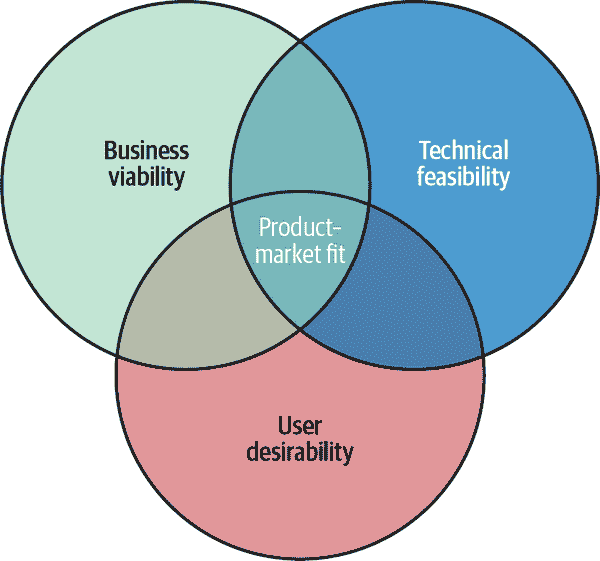

# 第二章. AI 产品开发生命周期

与传统产品不同，AI 驱动的产品引入了代码、数据、算法和用户体验的独特混合，创造了一个独特的发展叙事。AI 产品开发生命周期（AIPDL）1 捕捉了开发 AI 驱动产品的各个阶段，同时确保产品满足用户需求并找到市场契合点。在本章中，我将介绍两种 AI 产品类型，0 到 1 和 1 到 n，并详细说明这些产品是如何按照 AIPDL 的阶段进行开发的。大多数 AI 产品将非常接近 AIPDL，但根据产品类型的不同，每个阶段所需的时间可能会有所不同。

# AI 产品类型

AIPDL（AI 产品开发生命周期）取决于你正在制作的 AI 产品的类型。如果你在一家初创公司工作，你可能正在从事*0 到 1 的产品*，将新兴技术或模型应用于新产品，以创造之前不存在的新体验。如果你在一家更成熟的组织工作，你也可能参与*1 到 n 的产品*，增强、扩展或调整现有产品。AIPDL 会根据你组织的重点略有不同。

以下章节讨论了管理不同 AI 产品的一些考虑因素。

## 0 到 1 的 AI 产品

如果你正在开发一个 0 到 1 的产品，你可能是你组织中的第一个 AI 产品经理。这个角色在初创公司中无处不在。例如，你可能加入了一家刚刚获得第一笔 PM 资金的自驾车初创公司。

0 到 1 的产品类型也存在于大型组织中，尤其是在那些在特定领域拥有技术专长的、更注重研究的部门中。例如，Adobe、Pinterest 和 Nextdoor 在 OpenAI 推出 ChatGPT 不久后发布了 AI 产品经理的职位空缺。这一举措承认了 LLM 技术可能为其各自平台带来的变革潜力，尤其是考虑到他们拥有的海量数据。实现这一潜力——以及弥合 AI 研究与解决现实世界用户问题之间的差距——需要专业的项目管理技能。

在 0 到 1 的产品中，你不知道用户是谁，甚至不知道是否会有用户。这意味着你的技术是一张白纸，你必须将其转化为解决真实用户问题的解决方案。在这种情况下，AIPDL 的焦点不仅在于开发产品，还在于为新颖的技术找到市场契合点。

## 1 到 n 的 AI 产品

如果你正在开发一个 1 到 n 的 AI 产品，你很可能是希望扩大、增强和多样化你组织现有的 AI 产品组合。Netflix 和 Amazon Prime Video 等公司就是例证：利用 AI 改善视频流媒体服务是 1 到 n 产品的绝佳例子。你在这里的目标很可能是创造个性化的用户体验和简化内容交付。例如，你可能正在努力完成以下工作：

+   利用 AI 开发一个复杂的推荐系统，该系统能够根据用户的观看模式学习和适应

+   动态优化流媒体质量

+   自动化内容审核流程

在 1-to-n 产品中，你可能对产品-市场匹配有更好的理解。你可以将 1-to-n 产品视为衍生产品或功能升级。就像 0-to-1 产品一样，开发 1-to-n 产品所需的技术将是可用的，AI 产品经理的角色就是将产品引入市场。对于 1-to-n 产品，AIPDL 专注于提升现有用户的体验和解决痛点。

# AI 产品开发生命周期

从高层次来看，AIPDL 是关于从业务问题到解决该问题的 AI 解决方案的转变。它由五个阶段组成，如图 图 2-1 所示：创意构思、机会、开发概念/原型、测试和分析，以及推广（AI 生命周期是概念/原型阶段的一部分）。AIPDL 是一个迭代过程，所以每个阶段可能需要多次回顾，直到产品找到其市场定位。

###### 图 2-1\. [AIPDL](https://oreil.ly/bBNVx)（来源：玛丽莲·尼卡博士）

## 创意构思

AIPDL 的第一阶段是 *创意构思*。在这个阶段，你开发你产品的初始概念。目标是确定对目标用户群体有益的 AI 功能。本节剩余部分是一个逐步指南，包含问题提示，以帮助你和你的团队将创造力引导到正确的方向。你并不总能找到回答问题的所有数据，所以要做好准备，提出并测试假设，如果无法验证它们，就从头开始。

### 第 1 步：采取以创新为先的思维方式

[史蒂夫·乔布斯曾著名地说](https://oreil.ly/361jj)，“人们不知道自己想要什么，直到你把它展示给他们。”不久前，手机还带有键盘，家庭电话接收器必须插入墙上的插孔。手机拥有触摸屏的想法是不可想象的，同样，在通话时在家中四处走动而不会缠在长长的电话线中也是不可想象的。所以，无论你的想法多么异想天开，都要拥抱创造性思维。这些想法可能成为价值数十亿美元的创新，从而彻底改变整个行业。

人工智能产品经理的角色不仅仅是产生新想法和识别创新机会——即 AI 能够产生独特重大影响的地方。这需要一种持续创新和好奇的心态。你必须从各个行业、用户行为和市场缺口中汲取灵感。我喜欢通过头脑风暴来练习创意产品构思，思考如何改进产品与客户之间的互动。例如，每当我使用星巴克应用程序订购咖啡时，我都会无意识地寻找可以改进以增强用户体验的产品方面。例如，AI 算法可以预测当地门店的繁忙时段，并建议最佳取货时间以减少等待时间。星巴克应用程序还可以利用推荐算法优先显示经常购买的商品，甚至根据口味和成分偏好建议新的饮品。这些改进可以简化用户体验，使体验更加个性化。

在零到一的 AI 产品中，构思阶段的目标是在未开发的市场中识别潜在用例，并解决特定用户群体的痛点。这需要头脑风暴、广泛的市场研究、假设和与 AI 研究者的合作。合作至关重要，因为假设将通过原型和市场需求实验进行严格测试。每个实验的反馈周期都是为了完善 AI 解决方案，填补市场缺口并满足用户需求。你可能会有这样的问题：“现有的用户痛点是什么？”和“我们可以通过新的 AI 创新触及哪些未开发的市场？”

对于一对一的 AI 产品，构思阶段的重点是改进现有产品。与用户体验团队紧密合作并收集客户反馈对于确定改进领域至关重要。你需要有关当前产品使用情况的数据洞察，这些洞察可以揭示趋势和机会，AI 可以在其中增强价值或效率。相关的问题可能包括“如何使用 AI 简化这个功能？”和“我们如何利用数据来改善用户体验？”

无论产品类型如何，想法始终应该是以用户为中心的。构思阶段涉及确定目标用户和理解他们的用例、需求和痛点。让你的客户激发你解决正确的问题。你的角色是设想 AI 如何以独特的方式为具有特定需求的特定用户提供服务。通常，你希望优化市场覆盖率和影响力。你需要准确识别最重要的用户群体，并确定哪些问题可以通过最可行和最有影响力的方式解决。问问自己：我应该关注哪个用户群体，哪个将能够独特地从 AI 的能力中受益？

记住，AI 不是一个独立的产品；它是一种机器学习技术，单独使用并不增加用户价值。为了为当前或潜在用户提供价值，它必须集成到体验中。始终记住要考虑技术如何增强用户体验或有助于解决未满足的需求。

### 第 2 步：了解 AI 功能及其功能

AI 产品经理是 AI 细分技术和用户问题之间的桥梁。在构思阶段，你需要确定要解决的问题以及如何为确定的用户提供价值。

在第一章中讨论了 AI 的独特超能力，请自问：AI 如何独特地解决该用户群体的特定痛点，使他们的体验更加高效、愉快或有价值？在 1-to-n 产品中，你已经有一些用户洞察可以指导你提升当前的产品。对于 0-to-1 产品，你需要创造性地思考如何创建一个找到产品-市场匹配的体验。表 2-1 展示了 AI 和通用 AI 的超能力可以实现的用户体验类型。

表 2-1\. AI 和通用 AI 的超能力可以为用户实现的功能

| 超能力 | 为用户带来的功能 | 示例 |
| --- | --- | --- |
| 从数据中学习 | 基于用户生成内容和历史数据的实时洞察和建议 |

+   [Whoop](https://www.whoop.com/us/en) (提供关于恢复、睡眠和压力的预测洞察的可穿戴健身追踪器)

+   [Fitbod](https://fitbod.me) (基于过去表现和疲劳水平预测最佳锻炼的健身训练应用)

|

| 大规模个性化 | 定制的推荐和体验，持续适应用户偏好、行为和情绪 | [Spotify 的 AI DJ 功能](https://oreil.ly/75sUe) |
| --- | --- | --- |
| 生成新内容 | 能够大规模创建定制的文本、图像、音频和视频 |

+   [Google Gemini](https://oreil.ly/_G3pp)

+   [Claude](https://claude.ai)

+   [ChatGPT](https://chatgpt.com)

|

| 精炼和总结 | 将复杂信息简化为可消化的洞察或摘要，使内容更容易消费和理解，并支持知识发现和决策增强 |
| --- | --- |

+   [NotebookLM](https://notebooklm.google)

+   [Otter.ai](http://otter.ai)

+   [Tableau](https://www.tableau.com)与 AI 驱动的分析

+   [IBM Watson](https://oreil.ly/ZA4AM) (用于医疗决策)

|

| 预测和预测 | 预测分析可以预测趋势并为更好的决策生成可操作见解 | [Kensho](https://kensho.com) (S&P Global 的 AI 驱动的金融市场预测洞察) |
| --- | --- | --- |
| 实时适应 | 在对话交互和内容生成中提供即时、动态的响应，这些响应会随着用户需求的变化而演变 | [Duolingo](https://www.duolingo.com)（根据用户表现调整课程的语言学习应用） |
| 自动化工作流程 | 智能自动化，根据实时数据和上下文因素优化任务，提高效率 | [Zaps by Zapier](https://oreil.ly/Pe76v) |
| 创意协作 | 帮助用户进行头脑风暴、生成想法并完善音乐、写作或艺术等创意项目 | [Adobe Firefly](https://oreil.ly/F4T-4)（用于创意工作流程的 AI 工具） |
| 沉浸式和交互式空间 | 动态、交互式环境，能够适应用户输入，提供更具吸引力和个性化的虚拟体验 |

+   [Rec Room](https://recroom.com)

+   [Roblox](https://www.roblox.com)

|

| 错误检测和缓解 | 识别流程或内容中的错误或不效率，确保更高的准确性和性能 | [Grammarly](https://www.grammarly.com)（实时语法和语气纠正） |
| --- | --- | --- |
| 理解推理和意图 | 准确解释用户的意图，即使这些意图以模糊、含糊或不完整的方式表达，也能确保更好地与用户需求对齐 | Gemini、ChatGPT 和 Claude，它们使用高级推理来推断用户输入背后的真正含义 |
| 多模态 | 允许无缝集成和处理多种输入类型，如文本、音频、图像和视频，实现更灵活和直观的交互 | Gemini 2.0、DALL-E 和 Whisper，它们接受并处理各种形式的输入和输入组合，用于诸如从图像生成文本、将音频转录为文本或实时语音响应等任务 |
| 类似人类的对话 | 促进自然和吸引人的交互，模仿人类对话，加深联系并提高用户满意度 | 模拟人类对话的对话式代理（特别是带有音频输出的） |

单个用户的产品体验可以利用多个 AI 超级能力。例如，在医疗应用中，大规模个性化、预测和预测以及重新发明产品交互的能力是 AI 超级能力，可以改变个人寻求医疗护理的方式。

使用高度准确的预测模型，您可能部署 AI 算法以帮助医生进行患者诊断、治疗建议和药物发现。对于医疗资源较少的地区，您可以部署这些模型以增加对有需要个人的护理可及性。

### 第 3 步：与团队头脑风暴

在 AI 产品开发的构思阶段，创新种子被播种。这是启动产品需求文档（PRD）的完美时机，您将开始界定问题和记录潜在的 AI 功能想法。在 PRD 中概述初步概念后，与团队的协作头脑风暴变得至关重要。这是您开始将模糊的想法转化为可行的 AI 解决方案的地方。您可以在附录中找到 PRD 结构的示例。

尤其是在 AI 产品开发中，在头脑风暴期间获得多样化的观点会带来巨大的益处。团队成员可能对数据来源、模型能力、用户需求和伦理考量有不同的见解。通过将这些观点汇集在一起，您可以完善初步想法，挑战假设，并探索您自己可能未曾考虑过的 AI 解决方案。关于可行性的讨论——例如，模型训练所需的数据或 AI 对用户体验的潜在影响——对于为产品团队设定现实目标并就当前 AI 技术状态下的可能性达成一致至关重要。

您的团队是您最好的人才和灵感来源。他们了解您的领域，理解整合 AI 的独特挑战，并且可能渴望贡献创新想法。如果您有一个大型团队，选择四到五名具有不同技能的核心成员，例如数据科学、UX 设计、伦理和领域专业知识，并在 PRD 中标记他们或邀请他们参加头脑风暴会议。思维多样性导致更富有创造性和全面的 AI 解决方案，确保您从数据获取到模型部署的各个方面都予以考虑。

如果您计划举行实际会议，营造一个富有创意和专注的环境。考虑为深入头脑风暴会议预留三到四小时。AI 想法通常需要时间来探索可能性、权衡利弊和讨论数据需求，因此给您的团队充足的时间预热并深入挖掘是至关重要的。鼓励参与者限制非头脑风暴活动；静音通知、暂停电子邮件，并将旁白讨论排除在外，以保持专注。

在创意探索开始之前，提醒团队注意具体的 AI 专注目标。鼓励来自其他产品领域（例如，开发、销售、伦理、研发）的合作伙伴识别他们与 AI 独特填充的现有产品差距。从这些差距中，构思利用 AI 能力解决用户需求解决方案。设定明确的目标将有助于引导讨论，并使其集中于探索 AI 的潜在影响。

为了帮助团队在 AI 目标和前景上达成一致，以一个小反思练习开始会议，要求每个人列出他们的当前项目、抱负项目以及登月想法：

当前项目

这有助于确定 AI 可能增强或自动化的现有功能领域。利用这段时间与不同团队沟通和头脑风暴，探讨 AI 如何为产品增值，例如使用机器学习来优化持续的过程。

激励性项目

这些是团队希望有更多时间去工作的产品。这个练习可以揭示对 AI 相关趋势的兴趣，例如个性化或智能自动化，这些趋势可能在您的产品策略中进一步探索。

月球级想法

鼓励团队思考雄心勃勃、资源不受限制的 AI 产品。如果数据限制和模型复杂性不是问题，会怎样？这些天马行空的想法可以激发创新的 AI 应用，推动产品实现边界的突破。

在创建列表后，指示团队成员选择对关键用户群体最有价值的 10%的想法。优先考虑高价值客户确保团队专注于有影响力的项目。一旦列表准备就绪，让人们与小组分享他们的想法。在整个讨论过程中，请记住识别重复的主题和兴趣，以确定最有可能的项目，这些项目与团队优势和公司目标一致。

在为您的产品构思想法时，以下是一些我强烈推荐的要点和禁忌：

+   要点：

    +   解决正确的问题。

        每个伟大的产品想法都始于一个重要的问题，但这是否是利用 AI 的正确问题？在跳入解决方案之前，您必须验证用户是否足够关心这个问题。识别产品差距或用户持续经历的问题，可以导致构建革命性的产品。以戴森为例。这家公司意识到人们不喜欢需要插上电源线来吸尘，因此设计了第一台无线吸尘器，戴森 DC01。现在戴森是该行业的市场领导者。

    +   理解每个功能的潜在影响。

        您可以为已经发布的产品推出新功能。在这样做之前，考虑这个新功能将如何影响您现有的功能。每个新功能都应该改善或不会干扰您之前的功能或整体产品使命。在 AI 领域，这一点比以往任何时候都更重要，因为战略在这个快速发展的环境中起着关键作用。

+   禁忌：

    +   不要陷入“闪亮的 AI 对象”陷阱。

        不要仅仅因为背后的技术“酷”就推出产品。做好你的作业：确保您的产品路线图与您的产品商业目标一致，以确保产品成功。

    +   不要谈论“直觉”。

        优秀的 PM 拥有出色的估算和分析技能。用数据支持您的“直觉”：其他人是否做过类似的事情？如果是，投资回报率是多少？有了支持您想法的数据，您更有可能获得对您提案的支持。

### 第 4 步：通过 RICE 框架了解您的客户

如果你正在开发一个从 0 到 1 的 AI 产品，最后的构思步骤至关重要：你必须彻底研究目标客户的需求。最有效的洞察和灵感来源是积极倾听你的用户。密切关注他们的反馈，他们指出的不足，以及他们面临的困难。反馈可以在任何地方找到。客户服务互动是一个很好的起点，因为这些互动通常更加个人化。在线评论是另一个获取高质量反馈的好选择；社交媒体是获取大量输入的好地方。

在从社交媒体平台收集反馈时，请务必仔细筛选质量。你这样做的方式可能取决于你正在寻找的反馈类型。例如，一个说“产品不好”的评论并没有意义。相反，你可能想要进行有针对性的搜索，以了解用户对产品感到沮丧的原因；例如，“我不喜欢我收到的电影推荐。”分析 AI 是否可以独特地解决这些问题。例如，如果用户对推荐算法表示不满，你可以实施 AI 解决方案，提供更好的个性化服务和即时支持，以最小化用户的挫败感。通过识别和理解这些具体的痛点，你可以确定 AI 如何提供独特的解决方案来解决问题并提升用户体验。在 AI 产品开发过程的这个阶段，你很可能已经很好地了解了你正在针对的用户群体以及一个长长的潜在 AI 功能列表。然而，并不是所有功能都可以同时追求，因此优先级至关重要。这就是框架发挥作用的地方，它提供了结构，帮助你做出关于哪些功能应该关注的明智决策。

我建议使用[RICE 框架](https://oreil.ly/JfqjN)进行功能优先级排序。这个框架帮助你根据四个关键因素：范围、影响、信心和努力，客观地评估每个功能。通过在这些维度上对你的想法进行评分，你可以确定哪些功能将以最少的资源带来最大的价值：

范围

估计该功能在特定时间段内将影响多少用户。例如，如果你正在为视频流媒体服务构建推荐功能，考虑一个月内将参与这一新功能的狂热观看者的数量。

影响

衡量该功能对你关键指标（如用户参与度或留存率）的潜在影响。使用一个量表（例如，高影响为 3，中等为 2，低为 1）来量化这一点。

信心

评估你对覆盖范围和影响的估计有多自信。如果你有强有力的数据或用户研究支持你的预测，你的置信度应该很高。置信度在 AI 产品开发中至关重要，因为有时在构思阶段数据或算法可行性可能并不完全清楚。使用百分比来反映这一点（例如，80%置信度）。

努力程度

估算实现功能所需的总工作量，通常以人月为单位。考虑技术复杂性（例如，数据收集、模型训练和集成）以及任何非技术性工作（例如，设计和用户测试）。

每个功能的 RICE 评分使用图 2-2 中显示的公式进行计算。

###### 图 2-2\. 计算 RICE 评分的公式

更高的 RICE 评分表示一个将在更少的努力下提供更多价值的特性，使其成为实施的一个强有力的候选者。假设你想要在你的视频流平台上为追剧者构建一个特定功能，目标是增加观看时间。你有三个潜在的功能想法需要评估：

定制化追剧推荐

使用 AI 根据追剧习惯提供高度个性化的内容建议。

“继续观看”智能通知

基于用户先前历史和日历，AI 驱动的通知会在合适的时间提醒用户在系列中继续观看，这取决于用户之前的观看习惯。

加强观看列表管理

当用户按下按钮表达对特定节目的兴趣时，所有这些节目都将被分组到一个*观看列表*中。一个由 AI 驱动的观看列表将根据用户的偏好和观看历史来优先考虑这些节目。

表 2-2 展示了如何使用 RICE 框架来优先考虑这些功能。

表 2-2\. 使用 RICE 评分优先考虑功能

| 功能 | 覆盖范围 | 影响 | 置信度 | 努力程度 | RICE 评分 |
| --- | --- | --- | --- | --- | --- |
| 定制化追剧推荐 | 8,000 | 3 | 90% | 4 | 5,400 |
| “继续观看”智能通知 | 6,000 | 2 | 80% | 2 | 4,800 |
| 加强观看列表管理 | 5,000 | 2 | 70% | 3 | 2,333 |

在这个例子中，“定制化追剧推荐”具有最高的 RICE 评分，这表明相对于所需的努力，它提供了最大的价值。如果你的目标是最大化追剧者的观看时间，那么这个功能可能是首先追求的最佳选择。

###### 备注

你可以考虑在努力程度之外引入一个额外的参数，称为“AI 投资”。此参数将代表将模型训练或集成到体验中的复杂性，包括数据收集、资源分配以及硬件/成本要求，以实现所需的质量。这将把[RICE 模型转换为 R × I × C / E × A](https://oreil.ly/RZ37S)。

## 机会

一旦你对最能受益于目标用户群体的 AI 功能（们）有一个清晰的想法，下一阶段就涉及评估该想法的潜在市场匹配度。在这个阶段开始时，带着一个假设在心中是很好的。一个 0 到 1 的产品机会示例可以是：

+   如果他们的推荐观看下一部电影的准确性高，那么狂热追剧者更有可能继续回到我们的流媒体平台。

一个 1 到 n 的产品机会示例可以是：

+   如果他们使用一个提供关于他们日常生活有意义的见解和建议的隐蔽可穿戴步数追踪设备，那么忙碌的专业人士的健身状况将会改善。

在机会阶段，是时候评估是否继续推进你的假设了。你是否有一个很好的信号表明你将能够为该特定用户群体找到一个产品-市场匹配的解决方案？在这一阶段，目标是深入了解竞争对手的产品、替代解决方案、市场规模以及类似你这样的解决方案的时间安排，以了解机会有多大。彻底的市场分析对于强大的产品价值主张至关重要，因为它将帮助你避免在不可行的想法上浪费资源（金钱、努力、时间）。

作为人工智能产品经理，你的目标是确保你的想法在技术上是可行的、对用户有吸引力，并且在商业上是可行的，以此来找到产品-市场匹配。

### 产品-市场匹配

产品-市场匹配指的是一个功能是否满足特定市场细分的需求并解决痛点。

实现产品-市场匹配对于人工智能企业的成功至关重要，因为它表明人工智能解决方案在技术上可行，并且对用户有价值且相关。这一概念在商业和技术文献中广泛讨论，包括在马克·安德森的作品中，他在创业和技术产品背景下普及了这个术语。虽然安德森的讨论并非针对人工智能特定，但考虑到开发与市场需求一致的技术的重要性，他的原则适用于人工智能领域。

对于人工智能中产品-市场匹配的深入探讨和示例，优秀的资源包括安德森的著作和埃里克·莱斯提出的精益创业方法论^(2)，该方法强调快速原型设计和用户反馈。许多人工智能初创公司和项目采用了这些原则，以确保他们的创新不仅在技术上先进，而且也满足用户的实际需求。

当产品满足以下三个标准时，即实现产品-市场匹配（参见图 2-3）：

商业可行性

产品能够在竞争激烈的市场中产生可持续的收入。商业可行性意味着拥有可捕获的市场空间、有利可图的收入模式以及健康且反应灵敏的经济环境。为了评估产品的商业可行性，你必须评估风险、计算投资回报率（ROI）并确保符合监管要求。

技术可行性

你的组织拥有支持预期功能和功能的资源（技术专家、硬件、软件、数据、计算能力等）。确定项目所需的技术资源有助于设定现实的目标和期望，最终最小化上市风险。

用户期望

产品有效地解决了目标市场的痛点。

必须满足所有三个标准，否则就不是产品-市场契合，正如你从图 2-3 中的图表中可以看到。

让我们更仔细地看看产品-市场契合度的标准。

###### 图 2-3. 可视化产品-市场契合度

### 商业可行性

商业可行性涉及全面的上市策略、客户获取和保留策略。实现商业可行性证实了产品可以在市场上持续存在，吸引投资，并随着时间的推移而增长。为了预测商业可行性，你需要进行深入研究，了解市场缺乏哪些解决方案，以及人工智能产品如何填补这一空白。

这项研究通常从了解你的目标市场和你的产品解决的问题开始。这需要彻底的市场研究，以确定现有解决方案中的差距，并验证你产品的需求。调查、焦点小组和用户访谈等工具可以揭示客户的痛点和对期望。在大型科技公司中，你可能会有一个内部用户体验研究员，他们将与你合作，为用户制定正确的问题。小型公司和初创公司通常将这项工作外包给外部机构（如 Upwork）或使用直接将他们与用户连接起来以回答问题的网站。问题通过调查、焦点小组、在线一对一访谈或简单的应用内反馈传达给用户。你还可以使用 AI 工具进行市场研究，例如[Komo](https://komo.ai)和[You.com](https://you.com)。

除了了解你的最终用户外，关注你的竞争对手有助于你独特地定位你的产品，确保它相对于替代品具有明显的优势。学习和从竞争中汲取灵感。很可能有更多组织在与你类似的领域运营。了解他们的产品和服务，并关注他们的博客、研究出版物和其他沟通渠道是很重要的。

#### 投资回报率分析。

计算项目的投资回报率需要对初始成本和预期收益进行彻底分析。投资回报率是通过投资净利润除以总投资成本得出的，如图 2-4 所示。计算必须包括与人工智能集成相关的所有直接费用，例如软件开发和采购成本，以及间接费用，例如实施过程中的培训以及潜在的生产力损失（例如，员工流动或病假）。净回报应包括人工智能集成预期收益的量化价值，例如提高效率、增强产品功能、增加销售额以及潜在的市场份额扩张。

###### 图 2-4\. 投资回报率公式

您可以使用一些策略来最大化人工智能项目的投资回报率。首先，人工智能的集成应与公司的战略目标紧密一致。针对人工智能可以带来显著改进或解决关键挑战的领域。其次，确保数据和可用性至关重要，因为任何人工智能模型的有效性都高度依赖于其训练数据。投资专有系统和内部数据收集实践可以显著提高人工智能项目的成果。第三种策略是考虑到可扩展性和灵活性，以适应未来的增长。在设计过程中早期纳入可扩展性将通过最小化维护和升级成本来增加长期投资回报率。

确保新版本或更新的采用和持续优化对于任何产品实现其全部投资回报率至关重要。通过提供客户支持和反馈循环来确保最终用户的认可。这有助于建立与产品的强大和持续的客户参与。

通过执行和维护这些人工智能集成策略，项目经理可以显著提高人工智能投资的附加值。

#### 将人工智能功能货币化。

将人工智能功能货币化引入了独特的机会和挑战，这些机会和挑战可以显著影响产品-市场匹配和商业可行性。公司通常采用直接或间接的货币化策略[通常采用直接或间接的货币化策略](https://oreil.ly/5zhTn)，每种策略都适合不同的环境。

*直接货币化策略*可能涉及单独对 AI 功能收费作为附加功能，将其捆绑在价格上涨中，或作为独立产品提供。当客户认识到明显的附加价值或 AI 功能涉及高运营成本，如计算和存储时，这种方法效果很好。另一方面，*间接货币化策略*将 AI 功能整合到现有套餐中，而不改变价格，利用它们来提高核心产品的采用率、留存率或使用率。这对于在定价之前寻求完善其 AI 能力的企业尤其有效。策略的选择应与目标受众的支付意愿以及推动用户采用与最大化即时回报的战略目标相一致。

#### 风险评估。

评估开发新型 AI 产品相关的风险至关重要。这些风险涉及技术、市场和财务方面。管理*技术风险*涉及评估你的 AI 技术的成熟度以及数据来源、利用和保护。处理*市场风险*涉及理解用户采用的障碍、分析竞争格局以及应对不断变化的监管环境。处理*财务风险*涉及管理 AI 开发中固有的成本超支、准确预测收入并确保有足够的资金支持开发阶段直至市场推出。

同样重要的是确定引入特定 AI 解决方案的最佳时机。如果市场尚未准备好接受新产品，你的成功机会将大大降低。市场准备情况、潜在用户的技术基础设施状况以及当前需求等因素在寻找产品-市场匹配中起着关键作用。更广泛的社会经济障碍，如经济衰退、监管变化或社会对 AI 技术的抵制，也会对推出新 AI 产品的可行性和时机产生重大影响。

评估这些要素有助于你识别当前的机会和可能影响产品成功的潜在挑战。找到合适的上市时机是在这些风险评估支柱之间实现一个微妙的平衡。评估风险和时间考虑因素使公司能够做出明智的决策，从而提高产品在市场上的成功潜力。

#### 法规合规。

对于像 AI 项目这样的新兴技术产业，商业可行性还涉及权衡部署 AI 解决方案的监管、伦理和社会影响。理解和确保符合行业法规和标准是新技术复杂但关键的过程，尤其是在市场定位和开发期间。由于对 AI 产品潜在影响隐私、安全和伦理方面的审查增加，许多目光都聚焦在 AI 产品上。

根据公司的业务地点和合作伙伴，公司必须应对一系列地区性和行业特定的法规，例如英国的[GDPR](https://gdpr-info.eu)，欧盟的[人工智能法案（欧盟 AI 法案）](https://oreil.ly/2Onu0)，以及美国的[健康保险可携带性和问责法案（HIPAA）](https://oreil.ly/-B6vg)。遵守这些法律需要对 AI 系统进行全面审计，以确保它们符合数据处理、用户同意、透明度和问责制的法律要求。遵循透明度和问责制原则通常要求 AI 解决方案部署[可解释人工智能（XAI）](https://oreil.ly/xO2y_)实践，使 AI 决策对最终用户和监管机构可理解。XAI 经常使用开源工具，如[SHAP](https://oreil.ly/2G9Gm)，[LIME](https://oreil.ly/IIVky)，和[InterpretML](https://interpret.ml))，向最终用户解释模型的工作原理、其潜在偏见及其输出。有一个庞大的研究社区正在探索 XAI 实践的价值，许多书籍涵盖了使机器学习更具可解释性的方法。

随着人工智能技术和监管环境的演变，保持合规性意味着要建立定期审查和调整您的 AI 系统的流程。例如，新的法律可能需要更新您的隐私政策、数据处理协议和用户同意机制。关注影响公众期望和监管发展的新兴指南和框架。最重要的是，作为一名 AI 产品经理，您必须与法律技术和数据法律专家以及合规官员合作，以帮助解决这些复杂性，并确保产品更新符合法律要求。

许多公司正在认识到客户信任的无价价值。在数字时代，信任是一项关键资产，尤其是在人工智能驱动产品中，对数据隐私、安全和道德使用的担忧至关重要。要成为一名成功的 AI 产品经理，您必须将您的产品定位为解决用户问题的可信解决方案。确保产品符合法律合规性和道德完整性可以降低财务处罚和法律后果的风险，同时为 AI 的可持续发展和数据的人道主义使用奠定坚实基础，与用户和利益相关者建立信任。

### 技术可行性

进行全面的技术可行性评估对于开发人工智能驱动产品至关重要。这个过程从与技术团队、工程师和科学家分享预期的 AI 功能开始，以收集初步反馈。团队应关注现有的技术基础设施是否能够支持开发所提议的功能。这更多是关于理解潜在的技术限制和机会，而不是详细说明具体细节。

训练和构建 AI 模型所需数据的可用性是技术可行性的核心。与技术团队紧密合作有助于确定所需数据的类型、质量和数量。这一步骤至关重要，因为数据的可用性和质量直接影响开发 AI 功能以及其采用成功的实用性。这是一个理论概念与数据限制的现实相碰撞的阶段，并指导你对项目范围和方向的调整。

### 用户需求

确定用户是否愿意为解决特定痛点付费是验证产品商业可行性的关键。这个过程涉及市场研究、实验以及与潜在用户的直接互动。以下是如何接近答案以及知道何时接近答案的方法。

从尽职调查开始。研究现有解决方案及其定价方式。审视竞争格局，为自己设定一个基准估值，以解决你试图解决的问题。研究竞争价值主张，以确定差异化的差距或机会。一旦你找到了市场中的位置，就对你的目标受众进行问卷调查和访谈，以衡量对新解决方案的市场兴趣以及他们愿意付费的程度。调查可以包括诸如“[痛点]多久影响你一次日常生活？”和“你如何最小化[痛点]？”等问题。

你的问题设计不仅是为了揭示是或否的答案，还应该探索痛点的深度、它如何影响用户以及他们解决它所赋予的价值。此外，[Van Westendorp 定价模型](https://oreil.ly/NDd5K)等技术可以用来探讨公平定价的问题。

拥有一个原型或最小可行产品（MVP）是吸引客户参与产品并观察最终用户直接获得的价值的绝佳方式。MVP 是产品的第一个迭代版本。它具备早期客户使用的基本功能，并随后为产品团队提供反馈以供未来改进。MVPs 有很多用途。它们不仅是一个很好的起点，可以展示给最终用户，而且也是帮助产品经理测试其定价策略的绝佳工具。例如，A/B 测试等实验方法在这里特别有效。作为一名产品经理，你可以尝试不同的定价层级和策略，以查看哪种能带来更好的转化率或客户满意度。注意记录不同价格点上的产品及其感知价值方面的反馈。客户情绪将影响品牌认知和品牌形象。

知道何时得到答案归结于分析调查和实验数据。寻找用户在调查中对定价问题的反应模式，并将其与他们在 MVP 测试中的实际行为进行比较。如果存在一致的支付意愿，并且该价格范围与你的成本结构和利润率相匹配，你就找到了一个甜点。

即使一切顺利，在扩展规模时继续监控和测试也很重要，因为市场条件和消费者观念容易发生变化。

我发现图 2-5 中的量表在评估你是否拥有足够的数据点来判断你是否接近产品-市场匹配度时非常有用。如果信号越来越多地来自右侧，你正在接近产品-市场匹配度。如果信号越来越多地来自左侧，你正在远离产品-市场匹配度。

###### 图 2-5. 产品-市场匹配度量表

### 实现 AI 产品-市场匹配度

为了全面衡量产品-市场匹配度，重新审视定义它的三个基础支柱至关重要：商业可行性、技术可行性和用户需求。这三个支柱共同提供了一个全面的机会阶段视角，确保你的产品不仅具有创新性或技术可实现性，而且用户会想要它，市场也能维持它。重要的是要强调，实现产品-市场匹配度需要满足所有这三个标准。如果其中一个支柱薄弱或缺失，产品可能无法成功。

为了进一步阐述这一点，想象你正在开发一个基于情绪的音乐推荐算法，该算法根据情绪推荐音乐。这个 AI 会根据内容参与度、音频捕捉和生物信号数据来分析你的情绪，以推荐符合你情绪的音乐。我可以预见用户会对拥有一个能够捕捉情绪和氛围细微差别的 AI 生成播放列表感兴趣。这个音乐推荐算法可以通过现有的机器学习网络实现。可能导致 AI 产品-市场匹配度不佳的是低商业可行性。

这种 AI 产品可能会面临隐私和社会监控的担忧。此外，从生物数据中收集敏感情绪数据会引发重大的伦理和法律问题。虽然可能对产品感兴趣，并且建设成本较低，但各种商业风险和监管的不确定性将阻碍其成功。找到产品-市场匹配度是一个具有挑战性的平衡，需要仔细的产品设计，以向市场提供人们感兴趣的东西。

## 概念和原型

当你超越了构思和初步验证阶段，是时候专注于构建你的 AI 产品的 MVP 了。AI MVP 不仅仅是一个产品的基本版本。它是一个战略性的构建，旨在展示 AI 在目标用例中的潜力。正如埃里克·里斯著名所言，“最小可行产品是那种新产品的版本，它允许团队以最少的努力收集关于客户的最大量的验证学习。”^(3) 对于 AI 产品来说，这意味着创建一个版本，不仅展示了即时的价值，而且暗示了未来的功能。

重要的是要区分 AI MVP 和原型。原型通常是一个早期实验模型，用于探索可行性、说明 AI 如何运作，并在受控环境中测试不同的想法。虽然原型对于概念探索很有价值，但它们并不一定提供真实、可用的价值给最终用户——它们更多的是展示*可能*是什么。

与之相反，一个 AI MVP 是一个从第一天起就旨在增加价值的功能性产品。与可能仅通过预设交互或模拟数据模拟体验的原型不同，AI MVP 与真实世界系统集成，与实时数据交互，并为用户问题提供切实可行的解决方案。这种从模拟到实际用户参与的转变正是 AI MVP 成为产品开发生命周期中关键步骤的原因。

构建 AI MVP 带来了一系列挑战和考虑因素，使其与传统 MVPs 区分开来。构建 AI MVP 的一个关键组成部分是*模型训练*，这可以被视为这个阶段的一个迷你生命周期。这包括选择适当的算法、收集相关数据、训练模型，并根据初始性能进行迭代。这是一个迭代过程，使 AI 能够学习和改进，构成了你的 MVP 运作的核心。我们将在第三章中深入了解这一过程和整个 AI 生命周期，在那里你将获得每个阶段支撑的技术概念的全面概述。

与可能仅关注构建产品最简单版本的传统 MVP 不同，AI MVP 需要做四件事：需要组合一个硬编码的体验、展示集成兼容性、展示特定领域的专业知识，以及从第一天起增加价值。让我们逐一看看这些。

### 需要组合一个硬编码的体验

在构建 AI MVP 时，有时有必要硬编码产品的某些方面，以展示其潜力，而无需在开发一个完全自动化的系统中投入过多时间。这种方法允许你快速验证你的概念并展示关键功能，即使底层 AI 模型尚未完全优化或训练。

在许多情况下，人工智能 MVP 涉及结合不同的模型或技术来创建混合解决方案。然而，从头开始构建系统的所有方面可能既耗时又费资源。这就是硬编码发挥作用的地方。例如，如果您正在开发推荐引擎，但还没有足够的数据来训练个性化模型，您可能需要硬编码某些规则来模拟推荐将如何工作。同样，在聊天机器人 MVP 中，您可能包括对常见查询的预定义响应，同时更高级的自然语言处理（NLP）功能仍在完善中。

通过硬编码特定元素，您可以避免在这个阶段浪费时间在不需要完全自动化的产品方面。这种方法有助于保持 MVP 专注于展示 AI 的核心价值主张，让利益相关者体验其潜力，同时您继续并行开发和完善更复杂的 AI 驱动组件。

### 展示（理想情况下低成本的）集成兼容性

为了使人工智能产品具有价值，它们需要与潜在的现有系统无缝集成，通常是通过 API。组织（尤其是较大的组织）通常在复杂的软件生态系统中运营，因此 MVP 展示其适应这些工作流程的能力很重要。这不仅证明了产品的技术可行性，还向利益相关者表明，它能够增强现有流程而不是破坏它们。

在设计您的 AI MVP 时，考虑它将如何与其他工具和系统在组织中连接。例如，如果您正在构建用于销售预测的预测分析工具，MVP 应该能够从现有的客户关系管理（CRM）系统中提取数据，并将其见解导出到其他平台。在 MVP 中包含基本的 API 或集成层可以在展示其潜在的可扩展性和适应公司当前生态系统方面发挥重要作用。即使在演示和验证阶段，简单的示例集成也可以成为强大的证明点。

### 展示特定领域的专业知识

对于人工智能产品来说，其成功的关键因素之一是它理解其运作的特定领域的能力。对于一个最小可行产品（MVP），在早期展示这种领域知识至关重要。无论是关注医疗诊断、零售客户细分还是金融分析，展示 AI 能够处理特定领域的细微差别将是赢得利益相关者信任的关键。

这通常意味着使用针对你特定领域的小型但高质量的训练数据集来训练模型。例如，如果你正在为医疗保健构建人工智能诊断工具，你可能使用一组匿名医疗图像来展示模型识别特定条件的能力。目标不是在这一阶段涵盖每个可能的用例，而是证明人工智能能够产生准确、相关的结果，这些结果符合你目标垂直领域的现实世界场景。

### 从第一天开始增值

人工智能最小可行产品（MVP）与传统软件 MVP 的不同之处在于，它们需要立即提供价值以展示其潜力。虽然人工智能应用旨在随着时间的推移和更多数据的加入而改进，但你的 MVP 仍然必须从一开始就提供有形的利益。这可能包括更个性化的用户体验、运营效率的提升，或从现有数据中得出的可操作见解。

在设计 MVP 时，关注可以提供明确、即时效益的功能。例如，为电子商务平台提供的由人工智能驱动的推荐系统至少应该基于基本输入数据向用户提供一些相关产品建议。它不需要完美，但应该验证概念，并暗示人工智能如何随着时间的推移，通过收集和学习用户交互而变得更加有效。

将反馈循环构建到 MVP 中是简单展示产品如何学习和改进的一种方法。例如，包括收集用户交互数据（如哪些产品推荐被点击）的机制，可以提供有价值的见解，这些见解可用于在未来的迭代中微调模型。这也允许你展示人工智能在早期阶段就具有增长和适应的能力。

## 测试和分析

测试和分析阶段是开发任何人工智能驱动产品的关键阶段，它充当了原型开发和市场推广之间的桥梁。在这一阶段，产品已经接近最终形态，将接受严格的评估，以评估其性能、用户接受度和市场可行性。

此过程从涉及与早期开发过程中定义的目标人物特征紧密匹配的用户的结构化反馈会议开始。就像早期的反馈会议一样，这些会议旨在深入了解产品如何解决已识别的痛点、其易用性和整体满意度。这一阶段通常包括向选定客户群体的 beta 测试或分阶段发布。例如，在游戏行业，游戏的新更新或补丁可能先进行 beta 测试，然后由一组游戏测试者提供反馈，在大量发布之前对游戏玩法进行评估。这种反馈对于验证关于产品价值主张的初始假设以及确定任何差距或改进领域至关重要。

反馈收集可以采取多种形式，包括调查、访谈、焦点小组和模拟。每种形式都能为产品的冲击力和可用性提供独特的见解。高级分析和人工智能工具也可以通过扫描用户交互以寻找表明满意度、参与度和潜在摩擦点的模式来为这一阶段做出贡献。这一阶段是关于收集对用户体验的全面理解，这有助于你决定产品是否满足在概念阶段设定的需求和期望。

测试和分析阶段的最终结果是关键的*进行/不进行*决策。这一关键时刻要求利益相关者评估收集到的数据和反馈，以确定产品是否准备好进入市场。几个因素会影响这一决策，包括产品的技术准备情况、用户满意度、市场状况和竞争格局。进行/不进行决策不仅关乎产品是否按预期工作，还关乎其在竞争市场中是否准备好被采用并取得成功。

如果决定是“进行”，则产品将充满信心地迈向推出，相信其市场适应性和成功潜力。如果决定是“不进行”，这并不一定意味着放弃，而是回到原点。这可能包括重新审视机会阶段，以解决测试期间确定的具体问题，或者重新评估市场策略。这一阶段强调了产品开发的迭代性质以及当在市场上占据一席之地时实验和数据驱动分析的重要性。

## 推广

推广或部署阶段是 AIPDL 中的一个重要里程碑，标志着从开发和测试过渡到将产品推向目标市场。这一阶段不是产品旅程的终结，而是其实际应用和持续演变的开始。因此，需要精心规划和执行，以确保顺利推出，随后进行持续维护和改进工作，以保持产品的市场相关性。让我们从推出开始，看看产品经理应该注意什么。

一个成功的产品发布依赖于精心制定的营销和推广策略，以及稳健的物流和供应链管理计划。营销计划应定义明确的用户目标群体，传达强有力的信息，并选择最佳渠道来推广产品，例如电视、印刷品和社交媒体。激发兴奋感也是一种有效的策略。发布预览和提供早期访问是创造轰动效应和建立期待的好方法。

根据我的经验，最有效的营销策略将在不同的促销活动之间建立协同作用，并按照预定的时间表同步活动。同时，确保可靠的、有弹性的供应链和物流系统对于实物产品至关重要。这意味着要分配足够的库存水平并安排运输安排，从而确保在发射时能够高效地满足需求。

发射阶段要求无缝执行，需要全体人员全力以赴，确保发射计划的每一个方面都按照既定的时间表展开。这一阶段的特点是高度协调和准备就绪，密切监控实时反馈，并保持积极发射体验的势头。完美执行这些计划为产品的成功奠定了坚实的基础。

部署后，重点转向监控和维护产品系统。除了定期评估 AI 模型的准确性和性能外，部署后的团队必须安排维护检查，以确保 AI 功能按预期运行。这通常意味着持续向 AI 系统提供新数据以适应和学习。随着模型继续在新数据上更新和重新训练，对潜在偏见和伦理问题的警惕至关重要。实施公平性和偏见检测不仅符合监管要求，还增强了用户对我们产品的信任。

AIPDL 中的阶段是迭代和循环的，推出阶段也不例外。部署后的团队将继续监控市场趋势和监管变化，然后对产品进行更新。这种迭代方法允许对功能进行微调，改善用户体验，并添加新的功能以满足新兴的需求和偏好。通过持续增强功能，你将确保产品在快速发展的技术环境中保持竞争力。推出阶段不仅仅是将产品推向市场，更是为持续增长奠定基础。

# 结论

本章概述了 AIPDL 的五个阶段：构思、机会、概念和原型、测试和分析以及推出。现在你已经具备了与产品创建相关的总体策略和决策，从某人脑海中的种子到数百万用户使用的最终产品。

产品开发生命周期封装了将创新想法转化为市场准备产品的变革之旅。该过程强调细致规划、持续反馈和迭代改进的重要性。随着产品从概念到创造，设计师、工程师和开发者之间的协作对于克服技术挑战至关重要。

作为项目经理，开发一个新产品既令人满意又令人兴奋，但绝对不是单凭一人之力就能完成的事情。在第三章中，我们将探讨你成为成功的产品经理所需具备的技能。

^(1) 这个概念来源于[产品开发生命周期](https://oreil.ly/lnt--)。

^(2) 马克·安德森，“唯一重要的事情”，2007 年 6 月 25 日；埃里克·莱斯，《精益创业：今天的创业者如何通过持续创新创造极端成功的业务》（皇冠商业出版社，2011 年）。

^(3) 埃里克·莱斯，《什么是 MVP？》（精益创业公司，2009 年）。
