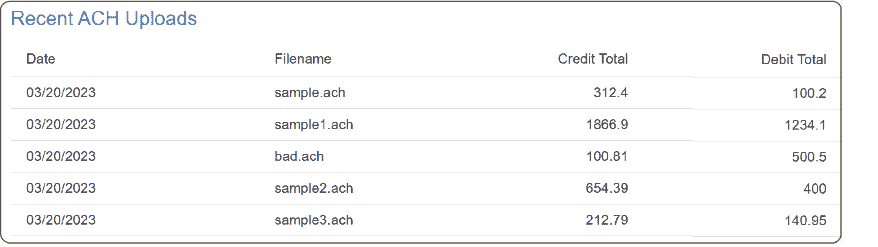
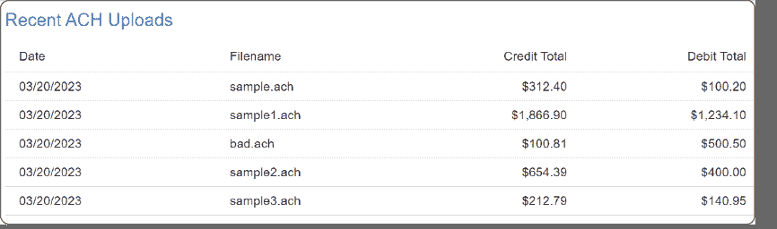
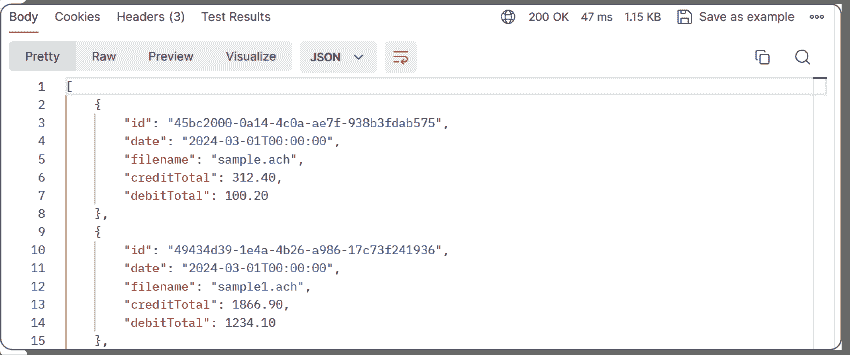
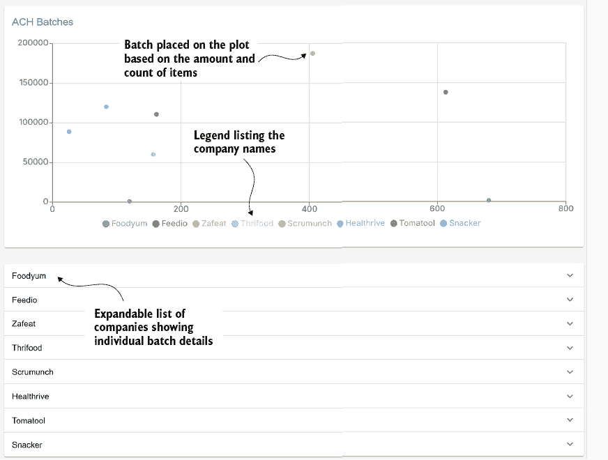

# 第六章：使用 Next.js 迈出下一步

### 本章涵盖了

+   使用 Next.js 构建仪表板

+   使用 Material UI 组件

+   使用 WireMock 帮助我们模拟 API 调用

到目前为止，我们已经通过研究激增来探索创建和解析 ACH 文件、创建数据库以及生成访问我们数据的 API。在这个最终的研究激增中，我们将开始着手我们的应用程序仪表板。仪表板是一个用户界面（UI），用户可以通过它上传和查看文件、查看记录以及获取任何其他有用的信息。虽然有许多可用的创建 UI 的选项，但我们决定选择 Next.js，因为它建立在 React 之上，React 也非常受欢迎。然而，由于一切都是由 API 驱动的，UI 可以与 Remix、Vue、Angular 或我们公司使用的任何其他技术交换。

第四章向我们展示了如何采用以 API 驱动的设计方法。虽然我们还没有通过切换到 UI 来构建所有我们的 API，但我们将开始看到我们希望（或需要）作为我们 API 一部分返回的数据。通过模拟数据字段，我们可以确保我们的 UI 正在调用与真实 API 完全相同的调用。

## 6.1 Next.js 入门

Next.js 入门非常简单，我们选择它部分是因为它很容易让应用程序启动和运行，但也因为它可以扩展以支持我们想要创建的任何应用程序。Next.js 是一个全栈 React 框架。React 本身是一个用于构建网络界面的库。尽管它很容易学习，但它确实需要了解一些常见网络技术的基础，例如

+   *超文本标记语言 (HTML)*——构建网页的标准标记语言

+   *层叠样式表 (CSS)*——描述 HTML 元素应该如何显示的一种方式

+   *文档对象模型 (DOM)*——定义了 HTML 元素的属性、方法和事件，允许如 JavaScript 这样的语言添加/更改/删除 HTML 元素和属性，以及响应 HTML 事件

React 通过提供额外的概念来构建和改进列出的网络技术，以促进 UI 开发。React 的一些关键概念包括

+   *组件*——可重用且自包含的代码块，用于渲染 UI 的各个部分。它们是我们应用程序的构建块。

+   *状态*——在组件内持有动态信息，可用于改变其行为并触发渲染。

+   *钩子*——帮助管理组件的状态和生命周期。

所有这些可能看起来很多，尤其是如果你是 UI 开发的初学者。事实是，你应该仍然能够走遍这个研究激增，并对这些概念有一个基本的理解。

那么，Next.js 是如何融入所有这些的？React 网站([`react.dev`](https://react.dev))建议使用 Next.js（或 Remix），因为它是一个功能齐全的生产级 React 框架。这意味着 Next.js 附带了许多强大的功能，例如

+   基于文件系统的路由，支持多种布局、嵌套路由和错误处理

+   根据应用需求，进行客户端渲染（CSR）和服务器端渲染（SSR）

+   使用`async`/`await`进行数据获取

+   支持多种样式方法，如 CSS Modules、Tailwind CSS 和 CSS-in-JS

+   对图像、字体和脚本的优化

要开始，我们必须确保已经安装了 Node.js（[`nodejs.org/en`](https://nodejs.org/en)），因为我们需要访问其工具，从`npx`命令开始。`npx`是一个命令行工具，有助于简化`npm`（Node 包管理器）命令的运行。

我们可以执行`npx create-next-app@latest`来回答几个问题，然后使用`npm run dev`启动项目。现在我们应该能够登录到 http://localhost:3000，看看默认页面是否出现。当然，默认页面是一个测试，以确保我们的设置正确。我们希望开发一个用户可以轻松加载文件并查看相关数据的 UI。通常，业务已经有一个基于现有标准的设计。由于我们不需要遵循任何特定的设计，一个好的选择是开始使用一个示例模板。市面上有很多选择，但一个很好的开始方法是使用 Material UI 提供的仪表板模板，[`mng.bz/Xx66`](https://mng.bz/Xx66)。我们拉取了 MUI 5.x 的模板，可以在[`mng.bz/yWnq`](https://mng.bz/yWnq)查看。如前所述，我们不仅限于这个特定的模板，但它确实为我们提供了一个可以快速定制的基布局，以便我们创建最终项目。

我们建议获取模板的 TypeScript 版本，因为我们将在整个项目中使用 TypeScript。TypeScript 是 JavaScript 的超集，这意味着当使用 TypeScript 时，你可以使用现有的 JavaScript 技能。TypeScript 的好处是它为 JavaScript 添加了显式类型（以及其他功能）。我们相信，显式类型有助于长期内代码的可维护性，因为它有助于在开发早期捕获错误。代码的长期可维护性非常重要，尤其是当我们考虑到我们的代码可能在野外存在很长时间时，考虑到 FinTech，这可能是一个很长的时间！虽然我们将在本项目中了解 TypeScript 的基础知识，但 Adam Freeman 的《Essential TypeScript 5》（2023 年，Manning）是一本很好的资源，或者你可以查看[`www.typescripttutorial.net/`](https://www.typescripttutorial.net/)上可用的 TypeScript 教程。

在我们可以使用示例模板开始项目之前，我们需要确保已安装依赖项，这可以通过下一列表中的命令行来完成。此命令安装了 Material UI 的一些要求，以及 `recharts`（用于我们的可视化需求）和 `axios`（用于进行 API 调用）。这些包被选中是因为我们在 FinTech 中看到了它们的使用，并且它们有良好的文档，可以帮助我们在遇到困难时。

##### 列表 6.1  安装仪表板的依赖项

```py
npm install @mui/icons-material @mui/material @emotion/styled 
@emotion/react recharts axios #1
```

#1 安装我们仪表板所需的所有组件

完成这些后，项目应该已经启动并运行。现在我们只需要自定义仪表板并添加额外的功能。

我们喜欢开始新代码的方式之一是直接深入其中，并开始添加额外的功能或重构现有代码。让我们直接开始吧！

## 6.2 创建上传页面

为了帮助您开始，Next.js 有广泛的文档和优秀的教程（[`nextjs.org/learn`](https://nextjs.org/learn)），如果您对 React 和 Web 开发完全陌生。我们以 Next.js 路由开始，因为我们认为它很简单，只需要在我们的文件系统中创建一个简单的结构。我们可以轻松创建一个页面来处理我们的 ACH 文件上传，如下一列表所示。page.tsx 是显示我们的网页的关键。TSX 是 TypeScript 的语法扩展，允许我们在 TypeScript 文件中编写类似 HTML 的标记。您也可能在各种教程中看到 JSX 页面，它们只是 JavaScript 的等效物。

##### 列表 6.2  我们上传页面的目录结构

```py
src/
├─ app/
│  ├─ uploads/            #1
│  │  ├─ page.tsx         
```

#1 这种基于文件的路由会导致 Next.js 在我们导航到 /uploads 时显示 page.tsx。

我们想要创建一个简单的页面，允许我们将文件拖放到页面上进行上传。现在我们将暂时避开实际的文件上传，先专注于一些设计。根据列表 6.2 的结构，我们想要能够导航到 http://localhost:3000/uploads，所以我们将在 page.tsx 中放置一个占位符，以确保我们可以确认一切正常工作。

##### 列表 6.3  占位符上传页面

```py
import Typography from "@mui/material/Typography";
import * as React from "react";

export default function Uploads() { #1
    return (
        <Typography variant="h1">Hello, Uploads!
➥</Typography> #2
    )
}
```

#1 我们导出了一个名为 Uploads 的默认函数。

#2 字体排版是 MUI 的一个组件，允许我们创建文本；在这里，我们使用 h1 的一个变体，这将给我们一个非常长的文本，就像 HTML 的 h1 标签一样。

安装好这些后，您应该能够导航到上传端点并看到“Hello, Uploads！”

### 6.2.1 测试我们的上传页面

尽管我们还没有创建一个实质性的页面，但让我们花点时间看看我们如何在 React 中测试我们的页面。我们将使用 Jest，这是测试 React 应用程序的一个流行选择。首先，我们需要安装所需的依赖项。

##### 列表 6.4  Jest 依赖项

```py
npm install -D jest jest-environment-jsdom 
➥@testing-library/react @testing-library/jest-dom ts-node #1
```

#1 额外的库以帮助支持测试工作

接下来，我们使用 `npm init jest@latest` 生成一个基本的配置。然后，我们创建一个目录结构，用于存放我们的测试。

##### 列表 6.5  测试目录结构

```py
__tests__/
├─ pages/
│  ├─ uploads.test.tsx
```

如列表 6.5 所示，标准流程是创建一个高级的 `__tests__` 目录，因为子目录并不重要（你只希望它们有意义）。`uploads.test.tsx` 将存储我们的实际测试代码。目前，我们只想确保当上传组件渲染时，显示“Hello, Uploads!”文本。为了实现这一点，以下列表展示了示例测试。

##### 列表 6.6 简单 Jest 测试

```py
import { render, screen } from '@testing-library/react' #1
import Uploads from "@/app/uploads/page";  #1
import '@testing-library/jest-dom/jest-globals';  #1
import '@testing-library/jest-dom';  #1
import {describe, it} from "@jest/globals";  #1
import expect from "expect";  #1
#2
describe('Upload Page', () => {  
    it('renders a heading', () => { #3
        render(<Uploads />)  #4

        const heading = screen.getByRole('heading', { level: 1 }) #5

        expect(heading).toBeDefined();  #6
        expect(heading).toHaveTextContent(/^Hello, Uploads!$/); #7
    })
})
```

#1 我们测试所需的导入语句

#2 `describe` 关键字允许我们将测试分组，这些测试将显示在“Upload Page”标题下。

#3 `it` 关键字开始我们的测试，并带有标题“渲染标题”。

#4 渲染我们的组件

#5 使用 ARIA 角色检索 h 1 标签。级别参数对应于标题的大小：h 1、h2 和 h3 分别使用级别 1、2 和 3。

#6 确保变量已定义

#7 使用正则表达式确保文本匹配我们期望的文本

列表 6.6 中定义的单元测试应该看起来有些熟悉，考虑到我们用 `pytest` 在 Python 中创建的测试脚本。当然，语法可能略有不同，但方法相同。回顾用于获取我们的标题标签及其内容的 `getByRole` 方法将很有趣。此方法使用可访问性丰富互联网应用程序（ARIA）标准中定义的角色。通过使用 `getByRole` 创建我们的单元测试，我们采取了以可访问性为首要考虑的网页设计方法。辅助技术将通过 ARIA 标签与我们的 Web UI 交互。


##### 图 6.1 运行我们的 Jest 测试的输出

如果你在一个像 JetBrains、WebStorm 或 VS Code 这样的 IDE 中开发，你可能可以直接在 IDE 中运行这些测试。或者，你也可以从命令行执行 `npm run test` 命令。从命令行执行有助于说明 `describe` 和 `it` 关键字的重要性。如列表 6.6 所示，`Upload` `Page` 标题是从 `describe` 关键字中提取的。每个由 `it` 关键字定义的测试也被表示出来，如图 6.1 所示，这些关键字使我们的测试保持组织性，输出可读性。

如我们所见，单元测试不仅对我们后端的 Python 代码很重要，对 UI 也同样重要。

如果你直接浏览了上传页面，你可以看到我们丢失了页面的导航栏。下一节将展示如何将它们添加回来。

## 6.3 重构我们的导航

就像任何我们没有编写的代码一样，我们需要探索以了解布局和结构。由于我们将根据我们的需求自定义仪表板，我们需要了解仪表板如何在组件之间导航。这可能需要一些侦探工作，但这是值得的。经过一番挖掘，我们发现我们页面的导航由我们可以在 Dashboard.tsx 中看到的两个组件控制——`AppBar` 和 `Drawer`。我们可以从将它们重构为各自的组件开始。在重构完成后，我们可以决定如何在后续页面上包含它们。

当务之急是从 Dashboard.tsx 中提取 `AppBar` 标签，并将其移动到 `src/app/components/navigation/TopMenuBar.tsx` 中的自己的组件。目录结构和命名规范可以在合理范围内自由选择。该组件包含现有的 `AppBar` 逻辑，并进行了一些更新以处理，无论抽屉是打开还是关闭。

##### 列表 6.7  导航菜单栏

```py
…
interface TopMenuBarProps {  #1
    toggleDrawer(): void;     #1
    drawerOpen: boolean;     
}
…
export default function TopMenuBar({toggleDrawer, drawerOpen}:
➥ TopMenuBarProps) {

    const [open, setOpen] = useState(drawerOpen); #2

    useEffect(() => {        #3
        setOpen(drawerOpen);  #3
    }, [drawerOpen]);        

    return (
    <AppBar position="absolute" open={open}> #4
…
<IconButton edge="start" color="inherit" aria-label="open drawer"
➥ onClick={toggleDrawer}> #5
…
    </AppBar>
    );
}
```

#1 定义了一个接口用于 TopMenuBar，它接受一个在按钮被点击时执行的函数和一个布尔值来确定抽屉是否打开

#2 在组件中维护状态

#3 当参数 drawerOpen 发生变化时，相应地更新状态

#4 AppBar 的 open 参数是我们的内部状态。

#5 当图标被点击时，执行传递进来的 toggleDrawer 函数。

我们还希望对侧边导航做类似的事情，因此我们将 Dashboard.tsx 中的 `Drawer` 标签重构，将其移动到自己的组件中。

##### 列表 6.8  侧边导航

```py
…
interface SideBarNavProps {  #1
    toggleDrawer(): void;     #1
    drawerOpen?: boolean;     #1
}
…
export default function SideBarNav({toggleDrawer, drawerOpen}:
➥ SideBarNavProps) { #2

    const [open, setOpen] = useState(drawerOpen); #3

    useEffect(() => {         #4
        setOpen(drawerOpen);   #4
    }, [drawerOpen]);          #4

    return (
    <Drawer variant="permanent" open={open}> #5
…
            <IconButton onClick={toggleDrawer}> #6
…
    </Drawer>
    );
}
```

#1 定义了一个接口用于 SideBarNavProps，它接受一个在按钮被点击时执行的函数和一个布尔值来确定抽屉是否打开

#2 在函数调用过程中解包了 SideBarNavProps

#3 在组件中维护状态

#4 当参数 drawerOpen 发生变化时，相应地更新状态

#5 我们的开启状态用于确定抽屉状态。

#6 当图标被点击时，执行传递进来的 toggleDrawer 函数。

然后，我们可以像下一个列表中所示的那样，在 Dashboard.tsx 中使用这些组件。

##### 列表 6.9  更新的 Dashboard.tsx

```py
…    
const [open, setOpen] = useState(true);  #1
const toggleDrawer = () => {      #2
    setOpen(!open);                #2
};                                 #2
…
       <TopMenuBar toggleDrawer={toggleDrawer}
➥ drawerOpen={open} /> #3
       <SideBarNav toggleDrawer={toggleDrawer} #3
➥ drawerOpen={open} />  #3
… #3
```

#1 存储抽屉的状态

#2 创建了一个名为 toggleDrawer 的箭头函数，我们调用它来设置打开状态

#3 使用我们重构的组件，这些组件接受一个函数来显示/隐藏抽屉和抽屉的当前状态

通过这个重构练习，我们了解了 Material UI 和 Next.js。此外，我们现在显然能够将这些组件包含在我们的上传页面中，这是我们最初的目标。虽然我们已经重构了代码，但在处理抽屉是否打开的问题上，有一些明显的重复处理。按照我们目前的方式，我们需要在每个我们选择使用它们的组件中重复 `open` 状态和 `toggleDrawer` 函数，这并不理想，因为它们总是需要一起使用。

##### 导航组件挑战

虽然偶尔可能需要复制代码，但我们可能不需要或想要在这种情况下这样做。我们可能有几种处理方式（也许我们不想将`AppBar`和`Drawer`元素分离出来）。如果我们将它们重构为单个组件，我们只需要导入该单个组件。或者，既然我们已经将它们分开，我们能否将它们包装成一个单独的组件？这个练习的目的是消除在每个组件中重复`open`状态和`toggleDrawer`函数的需要。

## 6.4 将最近订单转换为最近的 ACH 上传

现在我们已经尝试了一些 Next.js，让我们来看看重新设计`Recent` `Order`组件以列出我们的最近 ACH 上传。一如既往，我们希望进行短周期的开发。这意味着我们首先使用模板中作为一部分的硬编码数据，并更新它以适应我们的需求。然后，我们将硬编码的数据替换为模拟的 API 调用。模板有一个函数用于创建数据行，如下一列表所示。

##### 列表 6.10  `createData`函数

```py
function createData(       #1
  id: number,              
  date: string,            
  name: string,            
  shipTo: string,          
  paymentMethod: string,   
  amount: number,          
) {                        
  return { id, date, name, shipTo, paymentMethod, amount }; #2
}
```

#1 需要更新的现有参数

#2 需要更新的现有返回语句

我们重新使用这段代码来包含我们希望在查看当天加载的文件时看到的字段。目前，我们可以想象我们希望看到文件加载的日期（可能还有时间），文件的名称以及文件的信用/借记金额。所需的更新在下一列表中显示。

##### 列表 6.11 更新的`createData`函数

```py
function createData(      #1
    id: number,            #1
    date: string,          #1
    name: string,          #1
    creditAmount: number,  #1
    debitAmount: number,   #1
) {
    return { id, date, name, creditAmount, debitAmount }; #2
}
```

#1 更新`createData`的参数。我们在此处不一定需要担心数据类型。我们只使用标准的数字和字符串类型。我们可以将日期定义为日期类型，但在此阶段这是不必要的。

#2 更新的返回语句

接下来，我们使用新的金额创建数据行。请注意，我们有两个金额字段，并且每次我们有金额时，我们希望包含各种金额以确保数据按预期显示（由项目中的利益相关者决定）。根据我们使用的 API 和数据类型，在显示金额时可能会出现一些外观和感觉问题。因此，列表 6.12 显示了我们要传递的数据，并且我们想要确保我们处理了一些边缘情况，例如

+   尾随零，在使用数值数据类型时可能会被丢弃

+   金额大于$999 时，金额将显示分隔符（如逗号）

##### 列表 6.12  样本数据

```py
createData(
    1,
    '03/20/2023',  #1
    'sample1.ach',
    1866.90, #2
    1234.10  
)
```

#1 返回一个日期；这个日期可能通过 API 作为时间戳返回，我们需要处理它。

#2 确保我们的数值值覆盖了我们概述的一些用例

根据 API，你可能正在接收一个格式化的金额，在这种情况下，你显然不需要担心提到的那些问题。然而，当我们设计 API 时，我们通常尽量将格式化保持在最低限度，除非必要，否则不强制执行格式化/区域特定性。因此，我们更喜欢返回`1000.0`代表$1,000.00，因为根据位置的不同，我们可能使用空格和/或小数来分隔数字。当然，用例因公司而异，因项目而异。在我们的情况下，我们处于一个独特的位置，可以控制 UI 和后端，这意味着我们可以按照我们想要的显示方式返回金额，并将其直接放置在页面上。

尽管在这个应用程序中不太可能成为问题，但本地化（L10n）可能对我们来说是个问题，因为 ACH 处理的是美国金融机构，这就是为什么我们更喜欢 API 返回未格式化的金额。也许我们计划让我们的仪表板足够抽象，以便容易适应 SEPA 或 BECS，因此我们需要确保我们的应用程序具有灵活性。

接下来，我们更新表格以显示更新的行。我们使用`map`函数从`rows`中获取数据，并为每个元素创建表格行。

##### 列表 6.13  更新的表格

```py
<Table size="small">
   <TableHead>
      <TableRow>
         <TableCell>Date</TableCell>                       #1
         <TableCell>Filename</TableCell>                    #1
         <TableCell align="right">Credit Total</TableCell>  #1
         <TableCell align="right">Debit Total</TableCell>   #1
      </TableRow>
   </TableHead>
   <TableBody>
      {rows.map((row) => (          #2
         <TableRow key={row.id}>    #3
            <TableCell>{row.date}</TableCell> #4
            <TableCell>{row.name}</TableCell> 
            <TableCell align="right">         #5
               {`${row.creditAmount}`}         #5
            </TableCell>                       #5
            <TableCell align="right">          #5
               {`${row.debitAmount}`}          #5
            </TableCell>                       #5
         </TableRow>
      ))}
   </TableBody>
</Table>
```

#1 更新的表头

#2 我们使用 map 创建一个包含<TableRow>标签的新数组。

#3 每个表格行包含一个键属性。

#4 使用我们的行数据用于日期和名称

#5 我们以原样显示金额字段以查看其外观。

在这一点上，如果我们查看我们的网页，我们应该注意到我们正在遇到我们提到的那些问题——截断末尾的零和缺少千位分隔符，如图 6.2 所示。

我们可以通过使用`toFixed`和硬编码的美元符号来执行一些基本格式化，如列表 6.14 所示。



##### 图 6.2  未格式化的信用和借记总额

##### 列表 6.14  基本格式化

```py
<TableCell align="right">
   {`$${row.creditAmount.toFixed(2)}`}     #1
</TableCell>                                 #1
<TableCell align="right">                    #1
   {`$${row.debitAmount.toFixed(2)}`}        #1
</TableCell>
```

#1 对金额进行一些初始格式化，强制使用美元符号，并通过使用 toFixed(2)确保我们看到两位小数

这段代码只使用千位分隔符进行基本格式化。我们不必记住在所有地方格式化货币，这可能导致不一致并使我们陷入一个区域，让我们定义一个函数，我们可以在需要格式化货币时调用它。这不仅会在我们展示货币方面提供一致性，而且还应该允许我们找到我们在代码中显示货币的地方（如果我们需要的话）。

为了实现这一点，我们将使用`Intl.NumberFormat`，它不仅可以为不同位置格式化货币，还可以为其他度量单位，如 mph/kh 和 liter/gallon。以下列表显示了我们的简单导出函数，它包装了`Intl.NumberFormat`。

##### 列表 6.15  `Intl.NumberFormat`包装器

```py
export function formatCurrency(value: number,  #1
           currency: string = "USD", #2
           locale: string = 'en-US'): string {  #3
    return new Intl.NumberFormat(locale, { #4
        style: 'currency',                  #4
        currency: currency                  #4
    }).format(value);                       #4
}
```

#1 函数接收一个数字。

#2 可以传递不同的货币，但默认为 USD。

#3 可以控制区域设置，默认为 en-US。

#4 实际的工作是由 Intl.NumberFormat 完成的，我们将其格式化为货币。

我们还可以创建一些 Jest 测试来确保我们理解这段代码的工作方式，以及确认我们看到了预期的格式。以下列表显示了我们可以用来确认格式化正在进行的示例 Jest 测试。

##### 列表 6.16  对我们的`formatCurrency`例程的 Jest 测试

```py
import {describe, it} from "@jest/globals";               #1
import expect from "expect";                               #1
import {formatCurrency} from "@/app/utils/CurrencyUtils"; 

describe('Formatting Currency', () => {              #2
    it('Has trailing zeros', () => {          #3
        const result = formatCurrency(1.0)     #3
 #3
        expect(result).toBe('$1.00')           #3
    })                                         #3

    it('Default currency is USD', () => {    #4
        const result = formatCurrency(1.1)    #4
 #4
        expect(result).toBe('$1.10')          #4
    })                                        #4

    it('Has comma separator', () => {          #5
        const result = formatCurrency(1000.0)   #5
 #5
        expect(result).toBe('$1,000.00')        #5
    })                                          #5

    it('Has comma separators for large numbers', () => {  #6
        const result = formatCurrency(1000000.0)           #6
 #6
        expect(result).toBe('$1,000,000.00')               #6
    })            #6

    it('German formatting', () => {   #7
        const result = formatCurrency(1000000.0, 'EUR', 'de-DE')   #8
 #8
        expect(result).toBe('1.000.000,00\u00A0€')       #8
    })                                                   #8
})
```

#1 导入必要的函数

#2 使用 describe 来组合测试

#3 确保不删除尾随零

#4 确保使用默认值

#5 检查是否包含逗号

#6 检查是否添加了多个逗号

#7 测试欧元格式的德语。`\u00A0`是表示不间断空格的 Unicode 表示法。

在确认我们的测试运行成功后，我们可以用对新的`formatCurrency`例程的调用替换调用`toFixed(2)`的表格单元格。

##### 列表 6.17  使用新的`formatCurrency`函数

```py
<TableCell align="right">                #1
   {{formatCurrency(row.creditAmount)}}   #1
</TableCell>                             
<TableCell align="right">
   {{formatCurrency(row.debitAmount)}}
</TableCell>
```

#1 用对新的函数的调用替换手动格式化

图 6.3 显示了我们的金额格式化得正好是我们想要的，有小数点后的逗号和两位有效数字。



##### 图 6.3  格式化后的信用和借记总额

通常，使用现有的组件作为起点并定制它以满足我们的需求更容易。在我们的定制之后，我们有一个能够向用户显示上传的 ACH 文件的运行组件。

## 6.5 模拟我们的 ACH 上传数据

在上一节中，我们定制了我们的组件以适应我们查看最近 ACH 文件上传的特定用例。然而，我们使用了硬编码的值，虽然这有助于我们了解所需的字段，但对于除了模拟 UI 之外的其他用途并不太有用。我们有一个数据库，我们希望从该数据库中检索这些数据，但在构建 API 方面我们还没有完全准备好。作为一个中间步骤，让我们添加 API 调用，但让它检索模拟数据而不是实际击中端点。模拟数据不仅让我们能快速开始，而且还有各种其他用途，如测试边缘情况、模拟不良数据和其他场景。因此，了解模拟数据将带来超越这个示例的长期利益。

我们为什么会选择这样做呢？现实情况是，项目可能涉及多个人、团队、部门，甚至公司。我们完全可能被分配去工作在 UI 上，而 API 和后端代码则并行开发。当我们试图尽可能快地将产品推向市场时，这种并行开发通常在进行，我们无法等待 API 和后端完成后再开始前端工作。或者，我们可能需要调用第三方 API，但合同谈判仍在进行中，我们无法访问该 API。

在这种情况下，像 WireMock 这样的工具可以让我们的代码执行相同的 API 调用，但返回预定义的响应。我们还可以使用这个工具来获取错误响应或边缘情况数据，这些数据我们可能没有 readily available，这有助于我们测试我们的代码。

### 6.5.1 将 WireMock 添加到 Docker

我们以相同的方式将 WireMock 添加到我们的项目中——首先创建一个 Dockerfile，然后在 docker-compose.yml 中引用它，如下面的两个列表所示。所需的 Dockerfile 内容不多，可以包含在 docker-compose.yml 中，但我们更喜欢尽可能保持 docker-compose.yml 的简洁。

##### 列表 6.18  WireMock 的 Dockerfile

```py
FROM wiremock/wiremock:latest-alpine

ENTRYPOINT ["/docker-entrypoint.sh",
➥ "--global-response-templating", "--disable-gzip",
➥ "--verbose"]
```

注意，在第 6.19 列表中，我们已经向 WireMock 服务定义中引入了卷。这些卷存在于本地文件系统中，并通过将它们映射到容器中的目录来提供。类似于端口映射的方式，我们首先指定主机目录，然后指定它应该映射到容器中的目录。WireMock 允许我们指定存根映射和文件定义存根（稍后详细介绍）。使用卷将允许我们更改映射，而无需反复构建。虽然 Dockerfile 允许使用 `VOLUME` 关键字来指定卷，但推荐的方法是使用 docker-compose.yml 文件，因为它允许在构建（Dockerfile）和运行时（docker-compose.yml）之间分离职责。

我们是否可以在 Dockerfile 中使用 `COPY` 命令将我们的映射移动到容器中？如果我们要构建一个包含映射的镜像并将其分发给团队，这将是一个备选方案。然而，在这种情况下，我们只对在本地使用这些映射感兴趣，并且我们不需要每次想要使用更新的映射时都重新构建我们的容器。

##### 列表 6.19  docker-compose.yml 的更新

```py
  wiremock:
    build:
      context: ./wiremock
      dockerfile: Dockerfile
    volumes:                                       #1
      - ./wiremock/__files:/home/wiremock/__files   #1
      - ./wiremock/mappings:/home/wiremock/mappings
    ports:
      - 8081:8080
```

#1 将我们的文件系统上的位置映射到容器

完成这些后，我们可以再次启动 Docker 容器，导航到 http://localhost:8081/__admin/，在那里我们应该收到类似于以下列表的响应。

##### 列表 6.20  WireMock 管理员响应

```py
{
  "mappings" : [ ],
  "meta" : {
    "total" : 0
  }
}
```

这段代码确认我们确实已经启动了 WireMock。也许不出所料，我们还没有定义任何映射。那么，让我们在下一节中解决这个问题。

### 6.5.2 在 WireMock 中设置映射

WireMock 是一个强大的工具，我们在这个部分只是触及了表面。然而，这应该足以让我们开始，并且我们可以根据需要的功能来调查其附加功能（记住我们第三章的 YAGNI 原则）。我们主要感兴趣的是模拟响应，以便当我们的 UI 进行 API 调用时，我们返回一些有意义的数据。我们首先在 `./wiremock/mappings` 目录中创建一个简单的存根，命名为 hello_world.json。在这个阶段，名称并不非常重要。下一个列表显示了文件的内容。

##### 列表 6.21  我们的第一个存根

```py
{
    "request": {
        "method": "GET",
        "url": "/api/v1/hello/world"
    },
    "response": {
        "status": 200,
        "body": "Hello World!",
        "headers": {
            "Content-Type": "text/plain"
        }
    }
}
```

如果我们尝试访问 http://localhost:8081/api/v1/hello/world，我们会收到如下响应：“没有响应可以提供，因为在这个 WireMock 实例中没有存根映射。”这是怎么回事？我们需要向 http://localhost:8081/__admin/mappings/reset 发送一个空的 `POST` 请求，这样 WireMock 才能拾取我们的更改。有一些与这段文本相关的 Postman 示例可以帮助你开始。在这次调用之后，你应该能够再次访问端点并看到“Hello, World!” 此外，如果你从 http://localhost:8081/__admin/ 请求映射，你会看到以下类似的列表。

##### 列表 6.22  使用我们新存根的 WireMock 管理员响应

```py
{
 "mappings": [
 {
 "id": "ac60ce7e-63f4-417e-894b-3e25ad496c42",
  "request": {
                "url": "/api/v1/hello/world",
                "method": "GET"
            },
            "response": {
                "status": 200,
                "body": "Hello World!",
                "headers": {
                    "Content-Type": "text/plain"
                }
            },
            "uuid": "ac60ce7e-63f4-417e-894b-3e25ad496c42"
        }
    ],
    "meta": {
        "total": 1
    }
}
```

这应该不会很痛苦。现在，让我们看看我们如何模拟我们的响应以获取上传的 ACH 文件的信息。我们应该已经对想要返回的字段有了很好的了解，因为我们已经在构建 UI 时使用了硬编码的数据。所以，我们将使用这些数据，并在这次在 `__files` 目录中创建 ach_files_response.json。通过在 `__files` 目录中定义响应，这将使我们避免复杂化映射，并允许其他 API 根据需要重用响应。下一个列表显示了响应样本，我们可以使用我们想要的数据量。

##### 列表 6.23  示例 ACH 响应体

```py
[
    {                                                   #1
        "id": "45bc2000-0a14-4c0a-ae7f-938b3fdab575",    #1
        "date": "03/01/2024",                            #1
        "filename": "sample.ach",                        #1
        "creditTotal": 312.40,                           #1
        "debitTotal": 100.20                             #1
    },                                                   #1
…
]
```

#1 示例 JSON 包含我们的测试数据

既然我们已经定义了响应的内容，我们需要为它定义一个映射。这个映射与我们之前看到的类似，只是我们现在在响应中指定了 `bodyFileName`，使用之前定义的 ach_files_response.json 文件名。

##### 列表 6.24  ACH 响应映射

```py
{
    "request": {
        "method": "GET",         #1
        "url": "/api/v1/files"   #2
    },
    "response": {
        "status": 200,           #3
        "headers": {                           #4
            "Content-Type": "application/json"  #4
        },                                     
        "bodyFileName": "ach_files_response.json"  #5
    }
}
```

#1 请求只会在 GET 上执行。

#2 使用 URL 进一步细化映射

#3 响应将是一个状态码 200。

#4 定义任何需要的头信息

#5 使用 bodyFileName 并指定 __files 目录中的一个名称来返回

定义好之后，我们只需要刷新我们的映射，以便更改生效。我们可以使用多种方法，并且它们按照对整体环境的影响顺序列出（从最小到最大影响）：

1.  管理员 API 可以重新启动以重新加载映射。

1.  重新启动容器。

1.  完全重新启动我们的 Docker Compose 实例。

一旦映射被刷新，导航到 http://localhost:8081/api/v1/files 将显示响应。图 6.4 使用 Postman 展示了响应，它提供了输出的一些突出显示/格式化，并允许我们轻松检查返回的标题。

WireMock 是一个强大的工具，我们只是触及了它的表面。目前，这足以帮助我们开始构建 UI。接下来，我们将探讨如何向后端发送请求。

### 6.5.3 使用 axios 访问端点

如果尚未完成，我们首先需要确保 axios 已经通过 `npm install axios` 安装。之后，我们可以根据需要将其导入到我们的组件中并开始工作！

现在，我们可以打开 RecentAchUploads.tsx，移除 `createData` 函数，并清除我们的测试数据，因为我们将从 WireMock 实例中检索数据。我们将定义我们的行为一个 `AchUploads` 数组（列表 6.25），而不是硬编码的数据。



##### 图 6.4  在 Postman 中查看的 `/api/v1/files` 端点的响应

##### 列表 6.25  准备我们的组件接收数据

```py
…
import {useState} from "react";
…
interface AchUpload {         #1
    id: number;                #1
    date: string;              #1
    name: string;              #1
    creditAmount: number;      #1
    debitAmount: number;       #1
}                              #1

export default function RecentAchUploads() {

    const [rows, setRows] = useState<AchUpload[]>([]);  #2
…
```

#1 定义我们的数据结构，以便我们可以适当地为其添加类型

#2 我们的数据行将存储在类型为 ACHUpload 的数组中。

现在，我们可以发出请求以填充数据。

##### 列表 6.26  使用 axios 进行 API 调用

```py
useEffect(() => {   #1
   axios.get('http://localhost:8081/api/v1/files') #2
   .then(response => {              #3
      console.log(`Response data #3
➥ ${JSON.stringify(response.data)}`);   #3
         setRows(response.data);      #3
      })                              #3
   .catch(error => {                 #4
         console.log(error);         
   });
}, []);                              #5
```

#1 useEffect 是一个完美的 React 函数，用于进行 API 调用。

#2 使用 axios 获取我们的文件列表

#3 处理返回的 Promise，显示数据并将行设置为返回的数据

#4 将任何问题记录到控制台

#5 空数组 [] 告诉 React 只执行一次。

通常，我们建议这些 API 调用应该从单个位置调用，而不是嵌入到组件中，但就目前而言，将它们放在组件内部是可以的。例如，我们经常创建一个 `api` 文件夹或类似的地方，以便可以从那里导入这些函数。这使得 API 调用可以从多个位置轻松访问。

然而，我们更紧迫的问题是，我们有一个指向 localhost（http://localhost:8081）的硬编码 URL，当我们将仪表板部署到 Docker 时，这肯定会改变。所以，为了目前，让我们利用 Next.js 存储我们的变量，然后，我们将能够轻松地为 Docker 配置它们。因此，我们创建一个 .env.local 文件。

##### 列表 6.27  我们的 .env.local 文件

```py
NEXT_PUBLIC_API_URL=http://localhost:8081/api/v1
```

我们现在可以更新我们的代码，以在 URL 中使用环境变量。

##### 列表 6.28  更新的 API 调用

```py
    useEffect(() => {
 const apiUrl = process.env.NEXT_PUBLIC_API_URL ?? ''; #1
        axios.get(`${apiUrl}/files`)       #2
```

#1 当环境变量未定义时，返回环境变量或将其设置为空字符串

#2 更新 axios 调用以使用新的 apiUrl

使用此代码，我们可以测试我们的 API，并且仍然可以看到我们从 WireMock 返回的示例文件。我们现在能够更改构建 Docker 容器时我们的 API 所触发的 URL。

## 6.6 使用 ACH 批量视图扩展 UI

现在你已经理解了这些部分，让我们看看如何结合 Next.js、Recharts、Axios 和 WireMock 来创建 ACH 批次的视图。在仪表板上，我们希望能够点击显示的文件名之一来查看该文件的批次。视图将显示散点图，并提供显示 ACH 文件中每个公司批次更多详细信息的功能，如图 6.5 所示。提供关于批次特征（在这种情况下基于它们的金额和条目数量）的信息可以帮助我们在未来扩展应用程序时开始实施欺诈检测和风险管理等任务的控制。散点图使我们能够轻松地发现金额较大或项目计数较高的批次。最终，如果我们混合历史数据，我们就可以分析这些公司的模式，并突出不寻常的活动模式。



##### 图 6.5  ACH 批处理视图

### 6.6.1 定义 ACH 批处理视图的 WireMock 数据

我们的 JSON 数据本质上是一个数组的数组。我们也知道在一个 ACH 文件中可以有多个批次。每个批次都关联一个公司，而公司可能在文件中有多个批次。我们希望返回并按公司分组批次。所以，以下列表应该可以工作。

##### 列表 6.29  ACH 批处理数据示例

```py
{
    "batches" : [         #1
        {
            "companyName": "Foodyum",  #2
            "companyBatches": [        #3
                {
                    "batchId": "de444a20-d303-4b72-8d8d-48af7a58630d", #4
                    "batchNumber": "1",                                 #5
                    "recordCount": 680,                                 #5
                    "totalDebitAmount": 500.00,                         #5
                    "totalCreditAmount": 1000.25   #5
                },
                {
                    "batchId": "57e38258-b0d9-414a-80ff-8c59f2a4a357",        
                    "batchNumber": "2",
                    "recordCount": 120,
                    "totalDebitAmount": 500.00,
                    "totalCreditAmount": 500.25
                }
            ]
        },
…
```

#1 我们返回一个按公司分组在文件中的所有批次的数组。

#2 每个批次的公司名称都存在。

#3 包含公司名为 companyBatches 的所有批次的数组

#4 包含我们批处理数据的多个 JSON 对象

我们定义了一些我们将与用于文件的模拟数据关联的批次。具体来说，当有人查询 API 端点，如`/api/v1/files/{fileId}/batches`时，我们希望返回这些数据。正如我们在 WireMock 中看到的，我们可以为所有我们感兴趣的`fileId`定义硬编码的路径。然而，这将导致大量的映射。相反，我们可以使用模板动态匹配这些字段，并为每个返回特定的响应。我们在以下列表中定义了 ach_files_batches.json。请注意，我们使用`urlPathTemplate`并指定`{fileId}`。然后我们还在响应的`bodyFileName`中使用`{{request.path.fileId}}`，这允许我们提取我们期望接收的动态 UUID，并在`__files`目录中定义的响应中使用它。

##### 列表 6.30  WireMock 模板示例

```py
{
    "request": {
        "method": "GET",
        "urlPathTemplate": "/api/v1/files/{fileId}/batches"  #1
    },
    "response": {
        "status": 200,
        "headers": {
            "Content-Type": "application/json"
        },
        "bodyFileName": "ach_files_batches
➥{{request.path.fileId}}.json" #2
    }
}
```

#1 使用 urlPathTemplate 允许使用参数

#2 request.path.fileId 引用在 urlPathTemplate 中定义的变量。

所有的这些，我们将能够定义对 API 调用的特定响应。图 6.6 更好地说明了这个概念。请注意，我们实际上并没有将任何东西保存到 WireMock 中。我们正在使用预先填充在 WireMock `__files` 目录中的预定义响应。


##### 图 6.6  WireMock 序列

现在我们能够返回数据，我们可以定义一个可以显示数据的组件。

### 6.6.2 更新仪表板以跳转到批次屏幕

我们更新了 RecentAchUploads.tsx，使文件名成为一个链接。

##### 列表 6.31  更新的 `RecentAchUploads`

```py
<TableCell>
   <Link onClick={() =>                      #1
      route.push(`/fileDetails/${row.id}`)}>  #1
         {row.filename}                      
   </Link>
</TableCell>
```

#1 将文本更新为使用文件 ID 的链接

`fileDetails` 屏幕接受文件的 UUID，这将有助于驱动生成的查询。Next.js 使用基于文件的路由，允许我们使用简单的文件夹结构定义 URL。在这种情况下，将 UUID 作为 URL 的一部分表示为方括号中的目录。以下列表是我们需要创建的文件夹结构。

##### 列表 6.32  文件详情页面的文件夹结构

```py
src/
├─ app/
│  ├─ fileDetails/
│  │  ├─ [id]/          #1
│  │  │  ├─ page.tsx
```

#1 方括号表示我们可以访问的 URL 参数。

`[id]` 是我们 URL 中的一个动态参数。例如，使用这种结构，我们应该能够导航到类似于 `/fileDetails/0854b018-c5ce-4e00-8a4f-d268a1a85aa2` 或 `/fileDetails/d11fb49c-4a07-4b96-88cc-db1fc7277bfa` 的 URL，假设这些是我们 ACH 文件的有效 UUID。

### 6.6.3 显示批次详情

page.tsx 将包含检索批次信息并显示它的逻辑。

##### 列表 6.33  批次详情

```py
…
export interface AchBatchInfo {           #1
    companyName: string;                   #2
    companyBatches: AchBatchDetails[];     #2
}
…
export interface AchBatchDetails {    
    batchId: string;                  
    companyName: string;              
    recordCount: number;              
    totalDebitAmount: number;         
    totalCreditAmount: number;        
}
…
interface AchBatchInfoResponse {  
    batches: AchBatchInfo[];      
}
…
export default function FileDetails({params}: any) { #4

    const id: string | string[] = params.id; #5
    const [batches, setBatches] =
➥ useState<AchBatchInfo[]>([]); #6

    useEffect(() => {        #7
        const apiUrl = process.env.NEXT_PUBLIC_API_URL ?? '';
        axios.get<AchBatchInfoResponse>(`${apiUrl}/files/${id}/batches`)
            .then(response => {
                console.log(`Response data
➥ ${JSON.stringify(response.data.batches)}`);
                setBatches(response.data.batches);
            })
            .catch(error => {
                console.log(error);
            });
    }, []);
…
                    {batches.map((item, index) => (          #8
                            <Accordion key={item.companyName}>
                                <AccordionSummary
➥ expandIcon={<ExpandMoreIcon />}>
                                    <Typography>{item.companyName}</Typography>
                                </AccordionSummary>
                                <AccordionDetails>
{item.companyBatches.map((companyBatch, index) => (
                                    <>
                                        <Typography>
                                  Batch ID:
➥ {companyBatch.batchId}<br />
                                  Record Count:
➥ {companyBatch.recordCount}<br />
                                  Total Debit Amount:
➥ {formatCurrency(companyBatch.totalDebitAmount)}<br />
                                  Total Credit Amount:
➥ {formatCurrency(companyBatch.totalCreditAmount)}
                                        </Typography>
                                        <Link>View Batch</Link>
                                        <Divider />
                                    </>
                                )
                                )}
                                </AccordionDetails>
                            </Accordion>
                        ))}
…
```

#1 定义我们的 JSON 结构，以便我们可以对响应进行强类型化

#4 允许访问 URL 参数

#5 通过与我们在方括号中定义的相同名称引用 URL 参数

#6 使用 useState 类似我们在其他组件中做的那样存储批次

#7 使用 useEffect 从 API 获取数据

#8 将返回的批次映射到显示 UI 元素

此组件展示了本章前面提到的作为 6.5 图的一部分的折叠视图，用于 ACH 文件中的公司。从这个组件中我们可以得到的一个重要启示是看到我们如何可以在页面上动态创建布局元素。在其他组件中，我们将使用提供表格结构以查看动态数据的 DataGrid 视图。然而，了解我们可以在需要时手动创建具有动态数据的布局也是有帮助的。

## 6.7 创建散点图组件

最后，我们想在页面上添加一个散点图，显示批次中的项目与借方和贷方总额的关系。以下列表显示了我们将要创建的目录结构。您可能需要创建另一个子目录来存储特定的散点图相关文件。由于我们尚未达到这个目录包含大量文件的程度，我们将暂时保持原样。

##### 列表 6.34  我们图表的目录结构

```py
src/
├─ app/
│  ├─ components/
│  │  ├─ charts/
│  │  │  ├─ AchBatchesScatterPlot.tsx
│  │  │  ├─ AchBatchesScatterTooltip.tsx
│  │  │  ├─ CurrencyTick.tsx
```

### 6.7.1 散点图组件

散点图有助于展示变量之间可能的相关性。在我们的案例中，我们可能并不一定对分析方面感兴趣。然而，散点图也提供了一种识别具有大量项目或大量金额的批次的途径，这可能会对我们的用户很有趣。当然，我们也许还有机会展示特定公司的批次趋势，这也许有助于我们的用户进行数据分析。

同时，这个组件提供了探索使用颜色、自定义提示和自定义轴刻度的机会。这些特性将在后续章节中讨论。散点图的初始代码显示在列表 6.35 中，实际组件渲染显示在列表 6.36 中。

组件定义了一个名为 `AchBatchesScatterPlotProps` 的接口，以便它可以正确设置类型。此外，这个组件接受批处理作为只读参数，而不是在组件内部进行任何 API 调用。我们本可以在组件内部进行 API 调用。然而，如果我们有多个组件想要使用这些数据，我们最终会进行重复的 API 调用来收集相同的数据。我们还标记数据为只读，以帮助强制执行组件仅利用数据的概念，并通过使用不引入意外后果。然而，请注意 `Readonly` 是 TypeScript 的编译时特性，生成的 JavaScript 不会有这个特性。最后，由于我们感兴趣的是批次的总金额，我们将信用和借记金额相加，并将它们存储到 `totalCreditAndDebits` 中。

##### 列表 6.35  散点图组件

```py
…
interface AchBatchesScatterPlotProps {  #1
    batches: AchBatchInfo[];             #1
}                                       

export default function AchBatchesScatterPlot({batches}:
➥ Readonly<AchBatchesScatterPlotProps>) { #2

    const plotData = batches.map(batch => {
        const updatedCompanyBatches =
➥ batch.companyBatches.map(companyBatch => {
            return {
                ...companyBatch,   #3
                totalCreditAndDebits:
➥ companyBatch.totalCreditAmount + companyBatch.totalDebitAmount #4
            };
        });
        return {
            ...batch, #5
            companyBatches: updatedCompanyBatches #6
        };
    });

    return (
    # Refer to AchBatchesScatterPlot.tsx source code for this logic
    );
}
```

#1 定义组件属性的接口，以便我们可以进行强类型化

#2 作为只读属性接受属性，所以我们不会修改它们

#3 将 companyBatch 对象的内容展开

#4 向对象添加一个名为 totalCreditAndDebits 的新属性

#5 将批处理对象的内容展开

#6 用包含 totalCreditAndDebits 的新批处理替换现有的 companyBatches

在下面的列表中，我们有渲染实际散点图的组件。我们利用 recharts 的灵活性，通过传递一个名为 `AchBatchesScatterTooltip` 的组件来定义自定义提示内容，并定义一个用于 `YAxis` 的自定义刻度标记组件，称为 `CurrencyTick`。此外，我们在图上放置点时为每个公司分配不同的颜色（关于这些自定义组件的更多内容将在后续章节中介绍）。

##### 列表 6.36  散点图渲染

```py
<>
   <Title>ACH Batches</Title>
   <ResponsiveContainer>
      <ScatterChart
         width={400}
         height={400}
         margin={{
            top: 20,
            right: 20,
            bottom: 20,
            left: 20,
         }}>
      <Legend />
      <CartesianGrid />
      <XAxis type="number" dataKey="recordCount" name="Count" unit="" />
      <YAxis type="number"
             tick={<CurrencyTick/>}   #1
             dataKey="totalCreditAndDebits" name="Total Amount" unit="" />
      <Tooltip cursor={{ strokeDasharray: '3 3' }} 
         content={<AchBatchesScatterTooltip />} />   #2
         {plotData.map((entry, index) => (
            <Scatter key={`${entry.companyName}`} 
                     name={`${entry.companyName}`} 
                     data={entry.companyBatches} 
                     fill={stringToColor(entry.companyName)}>  #3
               <Cell 
                  key={`cell-${entry.companyName}-${index}`} 
                            fill={stringToColor(entry.companyName)} />  
                      </Scatter>
                   ))}
      </ScatterChart>
   </ResponsiveContainer>
</>
```

#1 用于 Y 轴刻度的自定义组件

#2 当悬停在数据点上时自定义提示

#3 根据公司自定义颜色

### 6.7.2 散点图自定义提示

在下一个列表中定义我们的自定义提示组件后，我们可以自定义显示的提示。我们通过使用 Material UI 中可用的组件保持了简单性。我们还可以重用之前定义的`formatCurrency`方法，以确保在提示中正确显示数据。

##### 列表 6.37  散点图的自定义提示

```py
export function AchBatchesScatterTooltip
➥ ({ active, payload, label }: TooltipProps<string, string>)  {
    if (active && payload && payload.length) {
        const value = payload[1].value ?? '0.0';
        return (
            <Tooltip title={<Typography>{`Value: ${label}`}
➥</Typography>} arrow>
                <Paper sx={{ p: { xs: 1, sm: 2, md: 3 } }}>
                    <Typography variant="h6">Total Debits and
➥ Credits</Typography>
                    {formatCurrency(Number.parseFloat(value))} #1
                </Paper>
            </Tooltip>
        );
    }

    return null;
}
```

#1 重新使用我们的 formatCurrency 函数以确保显示金额的一致性

### 6.7.3 散点图自定义刻度

在 recharts 中自定义图表的另一种方法是定义自定义刻度。我们希望我们的刻度格式化为货币形式，而不是未格式化并添加一个标签来说明“美元”或类似的内容。我们定义了一个包含传递数据的接口，然后再次使用我们的`formatCurrency`实用工具（列表 6.38）。

此组件同时使用`Readonly`（以确保组件不修改任何参数）和`Partial`。使用`Partial`类型是因为`recharts`控制传递的参数。此外，我们不需要使用`?`标记每个参数为可选，而是可以使用`Partial<CurrencyTickProps>`将`CurrencyTickProps`中的所有参数标记为可选。

##### 列表 6.38  自定义货币刻度

```py
interface CurrencyTickProps { #1
    x: number;                 #1
    y: number;                 #1
    payload: {                 #1
        value: string;         #1
    };                         #1
}                              #1

export function CurrencyTick({ x, y, payload }:
➥ Readonly<Partial<CurrencyTickProps>>): React.JSX.Element { #2
    const value = payload?.value ?? '0.0';  #3
    return (
        <g transform={`translate(${x},${y})`}>
            <text x={0} y={0} dy={16} textAnchor="end"
➥ fill="#666" transform="rotate(-35)">
                {formatCurrency(Number.parseFloat(value))} #4
            </text>
        </g>
    );
```

#1 定义我们的属性，以确保它们是强类型的

#2 属性被标记为 Readonly 和 Partial。

#3 如果有效载荷不存在，则替换为 0.0。

#4 使用我们方便的 formatCurrency 函数

显然，使用自定义刻度进一步自定义我们的图表是一个强大的工具。即使我们选择使用标准刻度，保留这种类型的自定义以备业务提出更具体的要求也是有帮助的。在下一节中，我们将探讨如何为我们的图表自定义颜色。

### 6.7.4 使用颜色为图表着色

颜色是任何可视化的一个非常重要的部分。在我们的情况下，我们不限制散点图中点的数量，因此我们不一定知道需要识别的公司数量。我们总是可以通过说这是一个“前 10 家公司”或“前 10 批”的散点图来限制可视化，这样我们就不需要枚举额外的颜色来处理不确定数量的公司。

下一个列表显示了如何枚举颜色，然后代码将循环遍历这些颜色，并在需要时重复使用它们，就像我们正在做`COLORS[index % COLORS.length]`。这种方法虽然可行，但也会在定义的颜色数量少于公司数量时重复颜色，这显然会使用户难以理解可视化。

##### 列表 6.39  列举颜色

```py
const COLORS = ['#0088FE', '#00C49F', '#FFBB28', '#FF8042', 'red', 'blue'];
…
   <Scatter key={`${entry.companyName}`}
            name={`${entry.companyName}`}
            data={entry.companyBatches}
            fill={COLORS[index % COLORS.length]}>
      <Cell key={`cell-${entry.companyName}-${index}`}
            fill={COLORS[index % COLORS.length]} />
   </Scatter>
```

我们采取的另一项选择是基于公司名称计算颜色，这为我们处理可视化中的许多公司提供了更好的机会（尽管当它不再有价值时会有一个阈值）。然而，目前这种方法也不允许我们使用可能散列到相同值的名称，也不一定能在可视化中给出最佳的颜色。稍后，我们可能会决定显示前 10 家公司是处理可视化的最佳方式。

列表 6.40 展示了用于从公司名称（或任何字符串）计算十六进制颜色代码的代码。在这种情况下，如何从字符串创建颜色代码的实现细节并不那么重要。相反，我们想了解在解决问题时可能使用的方法，并尝试理解每种方法的潜在权衡。在这种情况下，我们失去了对所使用颜色的精确控制，这也意味着颜色可能无法区分或与整个可视化冲突。然而，这种方法允许我们展示许多公司，同时也为公司提供了颜色的统一性。因此，颜色可以在其他可视化中保持一致，或者每天改变。

##### 列表 6.40 使用公司名称来确定颜色

```py
export function stringToColor(str: string): string {
    let hash = 0;
    for (let i = 0; i < str.length; i++) {
        hash = str.charCodeAt(i) + ((hash << 5) - hash);
    }

    let color = '#';
    for (let i = 0; i < 3; i++) {
        const value = (hash >> (i * 8)) & 0xFF;
        color += ('00' + value.toString(16)).slice(-2);
    }
    return color;
}
```

我们如何展示数据不仅是一个偏好问题——我们选择的布局、格式和颜色可能会影响数据解读。例如，

+   使用红/绿色调会使色盲人士难以区分不同类别的颜色。

+   3D 条形图可能具有视觉吸引力，但可能导致对数据的错误解读，因为视角可以使条形看起来比实际更大/更小。

+   在精选的时间段内，不符合特定叙述的数据被隐藏或最小化。

如需了解此主题的更多信息，请参阅 Desireé Abbott 所著的 *《日常数据可视化》*（2024 年，Manning 出版社），特别是如果您想将您的可视化提升到下一个层次。

## 6.8 在 Docker 中部署仪表板

作为最后一步，我们希望将我们的代码部署到 Docker 中，以便将我们系统的各个部分连接起来。下一章将重点介绍实现所需的 API，确保组件可以通信，并进行一般性维护。目前，我们只想确保容器构建正确，并且可以与我们的 WireMock 实例通信。

如您所忆，我们的 API 调用使用`NEXT_PUBLIC_API_URL`，这允许我们配置与后端通信所需的基 URL。列表 6.41 显示了 docker-compose.yml 的服务实现。我们现在引入了使用`args`参数向构建过程传递参数。我们将 URL 设置为与我们的`.env.local`项目设置中相同的端点。这是因为代码将在客户端的浏览器中运行，这意味着我们需要使用`localhost:8081`而不是您最初可能想象的内部引用`wiremock:8080`。

##### 列表 6.41  将仪表板添加到 Docker

```py
…
  dashboard:
    build: 
      context: ./dashboard
      dockerfile: Dockerfile
      args:  #1
        - NEXT_PUBLIC_API_URL=http://localhost:8081/api/v1
    ports:
      - 4000:3000
```

#1 定义传递给构建的变量

在以下列表中，我们有列表 6.41 中引用的 Dockerfile。此代码负责设置我们的环境变量，并构建和运行应用程序。在此 Dockerfile 中，我们通过展示如何设置默认值以及如何在容器中设置它，利用了`NEXT_PUBLIC_API_URL`。

##### 列表 6.42  仪表板的 Dockerfile

```py
FROM node:alpine

ARG NEXT_PUBLIC_API_URL=
➥'http://override-me-in-docker-compose' #1
ENV NEXT_PUBLIC_API_URL $NEXT_PUBLIC_API_URL     #2

WORKDIR /usr/src/app

COPY app/package*.json ./

RUN npm install

COPY app/. .

RUN npm run build

CMD [ "npm", "start" ]
```

#1 定义一个可使用或默认的参数

#2 设置一个将包含我们的 API URL 的环境变量

到目前为止，我们应该能够构建容器，并使用`docker-compose` `down;` `docker-compose` `up` `--build`像以前一样启动它们。然后，导航到 http://localhost:4000 后，我们应该看到我们的仪表板启动，显示我们的 WireMock 数据。

## 摘要

+   仪表板作为文件上传和数据视图的用户界面，由 API 提供支持，可以使用各种技术进行开发，目前首选 Next.js。

+   Next.js 通过使用 HTML、CSS 和 DOM 原则以及提供基于文件的路由、CSR、SSR 和多种样式方法，支持使用 React 构建交互式 Web 应用程序。

+   从 Next.js 开始涉及设置`Node.js`，使用 npx 创建项目，并运行默认应用程序以验证设置的正确性。

+   仪表板可以使用 Material UI 等模板进行初始化，并且应该安装依赖项以支持组件和 API 调用。

+   通过添加显式类型并在开发过程中捕获错误，引入 TypeScript 增强了可维护性。

+   Jest 用于对 UI 进行单元测试，确保通过 ARIA 角色实现页面功能和无障碍性。

+   对导航组件进行重构需要更好的代码组织和将其包含在上传页面中。

+   硬编码的数据最初用于 UI 开发，然后使用 WireMock 等工具进行并行开发时，用模拟的 API 调用替换。

+   使用 WireMock 模拟 API 涉及设置 Docker、配置存根和刷新以使更改生效，从而在不完全可用后端的情况下促进 UI 测试。

+   在 Docker 中部署仪表板涉及配置环境变量并确保与模拟 API 的通信以实现动态数据显示。
