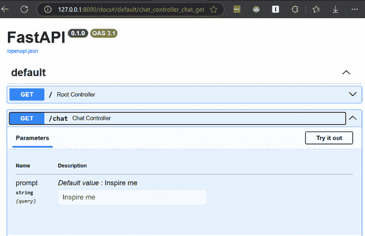
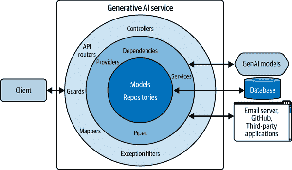
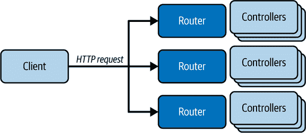
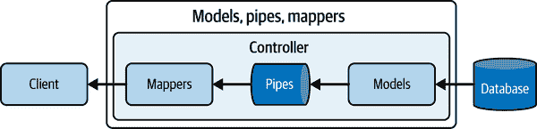
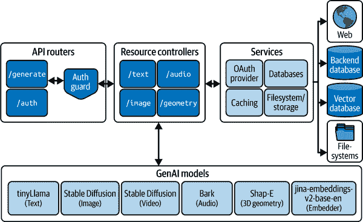

# 第二章. 快速入门 FastAPI

到本章结束时，你应该能够熟练地使用 FastAPI 网络框架，设置 FastAPI 项目，并阐述你为构建 GenAI 服务所做的技术栈决策。

# FastAPI 简介

[FastAPI](https://oreil.ly/2xcoR) 是一个异步网关接口（ASGI）网络框架，它使你能够构建精简的 API 和后端网络服务器。作为一个 ASGI 框架，这意味着它可以利用并发来处理网络请求。它与现代框架相比速度很快（[`oreil.ly/tgwEJ`](https://oreil.ly/tgwEJ)），并且还提供了强大的 [Swagger/OpenAPI 集成，用于自动文档](https://oreil.ly/WlwOC)，以及通过 [Pydantic](https://oreil.ly/5-EmU) 提供的内置数据验证和序列化功能。1 实际上，FastAPI 是 Encode 构建的 [Starlette 框架](https://oreil.ly/tyKtQ)的包装器，Encode 同样是构建 Django REST 框架的人。它轻量级，具有类似的开发生态。

在我们更详细地讨论 FastAPI 之前，让我们设置你的开发环境，并运行一个 FastAPI 应用程序。

# 设置你的开发环境

在本章的剩余部分，我将指导你安装 FastAPI 及其基本依赖项的过程，使你能够设置一个基本的网络服务器。我们还将安装一系列格式化程序、记录器和代码检查器，你可以设置它们以增强你的开发工作流程。

###### 警告

本书中的代码示例已针对 Python 3.11 进行测试。使用其他 Python 版本运行代码示例可能会导致问题。此外，一些部署环境和包依赖可能不支持 Python 的最新版本。

你现在可以开始设置你的 FastAPI 项目了。

## 安装 Python、FastAPI 和所需包

如果你在 Windows 系统上，可以使用 `conda` 创建一个虚拟 Python 环境：

```py
conda create -n genaiservice python=3.11
conda activate genaiservice
```

如果你使用 macOS 或 Linux 系统，你可以使用 `venv` 创建一个虚拟 Python 环境：

```py
$ python3 -m venv .venv
```

`venv` 会将你的虚拟环境创建在 `.venv` 文件夹中，你可以通过以下方式激活它：

```py
$ source .venv/bin/activate
```

环境激活后，你可以安装运行 FastAPI 服务器和从 OpenAI API 处理请求所需的核心包：

```py
$ pip install "fastapi[standard]" uvicorn openai
```

`uvicorn` 包是 FastAPI 运行的裸骨网络服务器。`fastapi` 也会安装其依赖包，例如 `starlette` 和 `pydantic`。

## 创建一个简单的 FastAPI 网络服务器

安装完 FastAPI 及其依赖项后，你就可以开始创建自己的网络服务器了。要创建一个在 FastAPI 中只有一个端点的简单网络服务器，你只需要编写 15 行代码。在你的目录根目录下创建一个 *main.py* 文件，如示例 2-1 所示。

###### 注意

为了简单起见，示例 2-1 使用了 OpenAI API。要运行代码，您可以从 [OpenAI](https://oreil.ly/SZsuD) 获取 API 密钥，这需要一张信用卡。然而，请放心，本书中的其他代码示例将尽可能使用开源模型。

##### 示例 2-1\. 简单 FastAPI 网络服务器启动代码，用于处理 GPT-4o 请求

```py
# main.py
from fastapi import FastAPI
from openai import OpenAI

app = FastAPI() 
openai_client = OpenAI(api_key="*`your_api_key`*") 

@app.get("/")
def root_controller():
    return {"status": "healthy"}

@app.get("/chat") 
def chat_controller(prompt: str = "Inspire me"): 
    response = openai_client.chat.completions.create( 
        model="gpt-4o",
        messages=[
            {"role": "system", "content": "You are a helpful assistant."},
            {"role": "user", "content": prompt},
        ],
    )
    statement = response.choices[0].message.content
    return {"statement": statement} 
```


创建一个 FastAPI 应用程序对象。


您需要使用 [API 密钥](https://oreil.ly/PP0nN) 来使用 OpenAI API。


使用 `@app.get` 装饰器在 `/chat` 路径上创建一个 `GET` 端点。


通过调用 OpenAI Completions API 向 `gpt-4o` 模型发送 API 调用以生成响应。


当您点击根端点时，装饰函数返回的任何数据都将被返回。

您现在可以使用 `fastapi dev` 命令启动服务器，如此处所示:^(2)

```py
$ fastapi dev

>> server   Server started at http://127.0.0.1:8000
>> server   Documentation at http://127.0.0.1:8000/docs

>> INFO   Uvicorn running on http://127.0.0.1:8000 (Press CTRL+C to quit)
>> INFO   Started reloader process [4172] using WatchFiles
>> INFO   Started server process [11316]
>> INFO   Waiting for application startup.
>> INFO   Application startup complete.
```

您的网络服务器现在可以通过 `http://127.0.0.1:8000` 访问，根目录 `/` 和 `/chat` 路由暴露了两个端点。

如果您在浏览器中访问 `http://127.0.0.1:8000`，您应该看到 `{"status": "healthy"}` 消息。此外，当您访问 `http://127.0.0.1:8000/chat` 时，您应该看到来自 OpenAI 的 `gpt-4o` 模型的鼓舞人心的信息。

恭喜您。现在您已经拥有了一个完全工作的裸骨生成式 AI 服务。

###### 小贴士

由于您使用 `fastapi dev` 命令以开发模式启动了服务器，因此一个文件监视器进程正在监听您项目中的更改，并在您更新代码时自动更新服务。

随意更改默认提示并刷新浏览器，以实时查看您的更改。

由 `FastAPI` 类创建的 `app` 对象将您的 Python 函数与装饰器转换为超文本传输协议（HTTP）端点。您可以通过发送 HTTP 请求触发这两个端点。

在底层，`uvicorn` 包接收 `app` 对象并启动一个运行 FastAPI 服务的网络服务器。

除了获得一个简单的网络服务器之外，您还会自动获得为您生成的 API 文档。该文档遵循 OpenAPI 标准，包括您的网络服务的 `openapi.json` 规范和一个由同一规范文件构建的 Swagger 文档页面。

您可以通过访问服务器的 `/docs` 路由来访问自动生成的文档页面，通过 `http://localhost:8000/docs`；您将看到一个类似于 图 2-1 的页面。



###### 图 2-1\. API 自动生成的 Swagger 文档

从 Swagger 文档页面，您可以发送请求到您的 API，以快速测试一个端点。该文档页面还将负责发送正确的请求头、方法和参数。

我喜欢 Swagger 文档页面的地方在于，您可以使用用户界面快速迭代各种实现，这比迭代您的 API 设计时编写测试要快。然而，这并不能取代您在更改时检查每个端点的传统测试。随着您的应用程序的增长，编写测试仍然值得。一旦您的端点签名进一步确立，您就可以编写 `pytest` 测试，以系统地从端到端测试您的网络服务。

除了自动文档之外，FastAPI 还提供了数据的自动序列化和验证。在 示例 2-1 中，我们在根控制器中返回了一个字典，就像您访问 `http://localhost:8000` 一样。为了让数据出现在您的浏览器中，必须发生一些魔法。数据必须首先从字典或列表等 Python 对象序列化为 JavaScript 对象表示法 (JSON) 字符串。然后，它通过网络传输，并在传输完成后由您的浏览器客户端反序列化为 JavaScript 对象。这就是网络上的应用程序如何“交谈”的有效方式。

###### 注意

在使用 HTTP 进行数据传输时需要序列化，因为只有文本或二进制数据可以通过 HTTP 传输。

现在您已经有一个工作的 FastAPI 服务器，让我们看看 FastAPI 的特性和优势，您可以在您的项目中使用它们。

# FastAPI 特性和优势

您需要一个合适的网络框架，它允许您轻松地创建您的生成式 AI 服务，而无需任何不必要的麻烦。这个框架应该包括所有安全、身份验证和性能的基本元素，同时仍然赋予您灵活性，以根据您的应用程序复杂性的增长添加任何额外的功能和集成。

FastAPI 可以满足这些标准中的大多数，因为它自带了几个特性和优势。然而，正如您在本章后面将了解到的那样，FastAPI 的局限性，像资源密集型 AI 工作负载这样的高级用例可能需要专门的网络框架或解决方案，正如将在 第三章 中讨论的那样。

现在，在讨论构建生成式 AI 服务时 FastAPI 的局限性的背景下，让我们先回顾 FastAPI 的特性和优势。

## 受 Flask 路由模式的启发

在 Flask 和 FastAPI 中，您可以通过使用专门的装饰器来装饰一个函数来创建任何路由。然后，您可以配置路由以接受和验证头信息、cookie、正文、路径和查询参数，以支持您的实现。

## 处理异步和同步操作

在构建服务时，您的服务必须能够处理多个用户请求，以增加使用效率，并随着需求的增加而扩展。FastAPI 可以无缝 [处理您应用程序中的同步和异步函数](https://oreil.ly/gNYMg)，从而从一开始就启用并发。

正如我们将在 第五章 中详细讨论的那样，如果您使用 `async def` 定义异步路由，FastAPI 将在主线程的主事件循环上运行它。另一方面，如果您定义同步路由（未使用 `async` 关键字声明），FastAPI 将在 *线程工作者* 上运行它以处理并发工作负载。

###### 警告

与异步运行相比，运行线程操作有额外的开销。因此，拥有许多同步路由仍然可能限制您应用程序的可扩展性。

因此，并发请求不会阻塞主服务器线程。这在处理输入/输出操作时尤其有用，例如查询数据库、与图形处理单元（GPU）交换数据，^(3) 或发送 HTTP 请求。

## 内置后台任务支持

您可以构建能够处理长时间运行的任务（例如，发送电子邮件）的路由，而无需外部库（例如，`celery`）。FastAPI 包含一个 [后台任务功能](https://oreil.ly/aO6ml)^(4)，用于处理需要时间处理数据但不想延迟响应请求的系统。

并非所有任务都能在用户的耐心容忍度内得到响应。您不希望他们在处理过程继续完成时等待。您可以在响应客户端后，将长时间运行的操作交给在单独线程上运行的背景任务。作为回应，您可以通知客户端，您的服务已接受并将他们的请求排队以在后台处理。

例如，在 GenAI 服务中，您可以使用后台任务将大型上传文档处理成向量数据库，而不会阻塞服务器。这允许服务器在后台处理文档时处理其他请求。

您将在 第五章 中学习如何构建这样的系统。

## 自定义中间件和 CORS 支持

FastAPI 允许您向您的应用程序路由器添加 [中间件组件](https://oreil.ly/uvlLC)，以拦截您的 API 端点和客户端之间的通信。每个中间件都位于您的端点之前，允许您访问请求和响应对象并根据需要修改它们。您可以在将请求交给路由处理程序之前添加逻辑来处理请求。一旦生成响应，您就可以在将其发送到客户端之前对响应执行操作——例如修改头部、记录操作和设置 cookie。

后端开发中的一种常见模式是使用中间件来[向响应添加额外的头信息](https://oreil.ly/Yfsqg)，对传入的请求进行基本检查，支持[CORS 请求](https://oreil.ly/6u1dI)，记录和监控通信，以及更多。你甚至可以利用第三方和[自定义中间件](https://oreil.ly/AJKJt)。

## 自由定制任何服务层

有时候你可能想要摆脱当前 Web 框架的限制。FastAPI 通过允许你定义继承自 Starlette 基类（底层 Web 框架）的定制类来解决这个问题。例如，你可以[重写默认异常处理器](https://oreil.ly/qgvgO)，添加[自定义 ASGI 中间件](https://oreil.ly/1A8OD)，或者甚至[创建自定义响应](https://oreil.ly/jLXUf)。

利用 Pydantic 或 [FastAPI 的编码器](https://oreil.ly/MJmqJ)的力量，你也可以轻松地创建自己的[自定义序列化器](https://oreil.ly/UnzRk)，以调整处理 datetime 对象的方式。

这使得你可以根据你的偏好实现功能，而无需与 FastAPI 奋斗。

## 数据验证和序列化

对于处理大量数据的应用程序，确保你即将处理的数据是干净且格式已知的是非常重要的。

随着你的服务复杂性的增长，你将想要执行数据验证和序列化。在 FastAPI 中，你可以使用 Pydantic 在 API 路由返回时自动序列化常见数据类型（例如，列表、字典、原语）。你还可以为请求和响应数据定义自己的 Pydantic 模式，以执行更严格的数据验证。

例如，你可以在创建账户时验证用户的密码，以匹配你的安全策略，如示例 2-2 所示。

##### 示例 2-2\. 在 FastAPI 中使用 Pydantic 模式验证用户密码

```py
# main.py
from pydantic import BaseModel, Field, EmailStr

class UserCreate(BaseModel):
    username: str
    password: str

    @validator('password') 
    def validate_password(cls, value):
        if len(value) < 8:
            raise ValueError('Password must be at least 8 characters long')
        if not any(char.isdigit() for char in value):
            raise ValueError('Password must contain at least one digit')
        if not any(char.isupper() for char in value):
            raise ValueError('Password must contain at least one uppercase letter')
        return value 

app = FastAPI()

@app.post("/users")
async def create_user_controller(user: UserCreate):
    return {"name": user.name, "message": "Account successfully created"}

...
```


在`password`字段上定义具有自定义数据验证的 Pydantic 模型。


如果任何密码策略未得到满足，则抛出`ValueError`。

这使得你可以捕获、处理并保护你的服务免受静态类型检查器（如 `mypy`）未捕获的数据问题。

Pydantic 验证器还允许你在运行时验证更复杂的数据类型，如电子邮件、URL、UUID 等。第四章将更详细地介绍如何使用 Pydantic 进行数据验证。

## 丰富的插件生态系统

插件是钩入 FastAPI 内部和现有功能的 Python 包。它们类似于您安装并导入脚本中的任何其他 Python 包，并且安装后需要最少的配置。集成它们意味着在不处理集成顺序或兼容性问题的情况下扩展您服务的功能。您也可以在不破坏应用程序的情况下移除它们。

一些知名的插件包括 FastAPI 过滤器、认证用户、速率限制等，您可以在[Awesome FastAPI GitHub 仓库](https://oreil.ly/nKbvP)中查看。

## 自动文档

使用 FastAPI，Swagger UI 文档会自动为您生成，以便您查看和测试您创建的任何路由，正如您在图 2-1 中看到的。在开发期间，拥有一个交互式文档页面可以更容易、更快地调试和原型设计您的路由，直到您构建和维护自己的测试套件。

当您构建新的端点时，您可能经常想要重新访问`/docs`页面来测试它们。

您可以配置从基 URL`/`到`/docs`端点的重定向，以方便快速访问文档页面，如示例 2-3 所示。

##### 示例 2-3. 设置自动生成文档页面的重定向

```py
# main.py
from fastapi.responses import RedirectResponse

@app.get("/", include_in_schema=False) 
def docs_redirect_controller():
    return RedirectResponse(url="/docs", status_code=status.HTTP_303_SEE_OTHER) 
```

(#co_getting_started_with_fastapi_CO3-1)

设置基础根处理器的处理程序，但不要将其包含在 OpenAPI 规范和文档页面中。

(#co_getting_started_with_fastapi_CO3-2)

返回一个重定向响应到`/docs`页面，带有重定向状态码，以便浏览器执行重定向。

通过实现示例 2-3，您可以在访问服务的基 URL`/`时访问`/docs`页面。

在生产中，除非您的 API 是公开的，否则禁用此重定向，并默认隐藏`/docs`路由以提高安全性。

###### 警告

如果您的 API 在生产环境中公开访问，您可能会暴露未受保护的端点和关于 API 的敏感信息。因此，[关闭文档页面是最佳实践](https://oreil.ly/Dk45G)。

相反，您可以在选定的环境中显式显示`/docs`页面。

对于公开 API，您可以将根处理程序`/`设置为返回您的 API 版本，而不是重定向到`/docs`页面。

## 依赖注入系统

FastAPI 的另一个强大组件是其基于称为*控制反转*的开发模式的依赖注入系统。Example 2-3 实现了，您可以在本地开发期间访问`/docs`页面，无论何时访问服务的基 URL`/`。

除了帮助结构化您的应用程序逻辑外，依赖项还可以帮助您减少重复。它们允许您在 API 中共享和重用逻辑，重用公开数据库连接，强制执行安全措施，如身份验证或授权要求，等等。

例如，您可以在 API 路由中指定常见的查询参数（例如，用于分页和过滤），如示例 2-4 所示。

##### 示例 2-4\. 使用分页依赖项减少重复

```py
from fastapi import FastAPI, Depends

app = FastAPI()

def paginate(skip: int = 0, limit: int = 10):
    return {"skip": skip, "limit": limit}

@app.get("/messages")
def list_messages_controller(pagination: dict = Depends(paginate)):
    return ...  # filter and paginate results using pagination params

@app.get("/conversations")
def list_conversations_controller(pagination: dict = Depends(paginate)):
    return ...  # filter and paginate results using pagination params
```

在 FastAPI 中，依赖项也缓存于单个请求的上下文中，以防止重复计算。这意味着依赖函数在每个请求中只执行一次，如果需要再次使用，则在整个请求期间重用其结果。然而，在新的请求中，依赖函数将再次执行。

在每个路由处理器中管理数据库连接或检查用户凭证是繁琐的，并且违反了编程的“不要重复自己”（DRY）原则。依赖注入系统的另一个很好的用例是在创建数据库连接并希望重用该连接以在处理单个请求时执行多个获取请求时。

您可以为您的路由控制器函数创建依赖项，如示例 2-5 所示。

##### 示例 2-5\. FastAPI 中的依赖注入

```py
from fastapi import FastAPI, Depends

def get_db(): 
    db = ... # create a database session
    try:
        yield db 
    finally:
        db.close() 

app = FastAPI()

@app.get("users/{email}/messages")
def get_current_user_messages(email, db = Depends(get_db)): 
    user = db.query(...) # db is reused
    messages = db.query(...) # db is reused
    return messages 
```

(#co_getting_started_with_fastapi_CO4-1)

实现一个创建和管理数据库会话的函数，该函数可以用作路由处理器的依赖项。

(#co_getting_started_with_fastapi_CO4-2)

产生开放的数据库会话，使其对任何依赖于 `get_db` 的函数可用。

(#co_getting_started_with_fastapi_CO4-3)

在请求处理完毕后关闭数据库会话，以防止资源泄露。

(#co_getting_started_with_fastapi_CO4-4)

将 `get_db` 依赖项注入到路由处理器中，以在请求生命周期中创建和重用相同的数据库会话。FastAPI 还会自动在您的端点中公开依赖项内的参数。

(#co_getting_started_with_fastapi_CO4-5)

重复使用注入的数据库会话，在单个请求中执行多个数据库操作，以返回用户的消息。

如示例 2-5 所示，您可以通过将它们作为参数传递给 `Depends()` 来将这些依赖项注入到其他函数中，以便 FastAPI 评估和缓存您的函数输出。

在这里，您定义了一个用于创建数据库会话的实用函数，然后将其用作 `get_current_user_messages` 函数的依赖项，以注入创建的数据库会话。

这个依赖系统只是 FastAPI 随附的许多其他功能之一，这些功能可以加快并简化构建后端服务的流程。

## 生命周期事件

[FastAPI 的生命周期事件](https://oreil.ly/Cn2DB)在处理服务的初始化和清理方面非常出色，尤其是在您需要设置可以在请求之间共享的资源时。在服务器启动时，您可以创建数据库连接池或将 GenAI 模型加载到内存中以便在请求之间重复使用。之后，在服务器关闭之前，您可以卸载 AI 模型、关闭连接池、删除临时工件并记录事件。

通过使用生命周期事件，您的 FastAPI 服务在启动时执行长时间运行的操作，如模型加载，在处理请求之前，并保持加载状态以便在请求之间重复使用。在服务器关闭时，您可以在运行任何清理操作之前优雅地完成所有剩余的和排队的请求。

## 安全和身份验证组件

与任何其他框架一样，您将需要安全和身份验证组件来保护您的服务。FastAPI 不会将您锁定在特定的安全和身份验证层实现中。它提供了一套[安全组件](https://oreil.ly/zlAgl)，以便您可以根据自己的需求保护您的服务。

您将在第八章（关于为 GenAI 服务从头实现身份验证层）中学习如何实现。

###### 小贴士

如果您不想从头开始实现身份验证层，那么您也可以寻求第三方插件的帮助，例如[FastAPI Users](https://oreil.ly/eEtMe)，它可以自动为您处理这些工作。

您还可以在企业环境中将第三方身份验证提供商集成到 FastAPI 的[单点登录流程](https://oreil.ly/vIqCd)中。

## 双向 WebSocket、GraphQL 和自定义响应支持

当构建服务时，您通常会需要超越标准的*REST* *端点*。

如果您正在构建聊天应用，您可能还需要实时客户端-服务器通信或长时间连接，其中数据以特定方向流式传输。WebSocket (WS) 和服务器发送事件 (SSE) 端点可以帮助您将生成模型输出流式传输到客户端，正如您将在第六章（关于与 AI 服务的实时通信）中看到的。

在其他情况下，您可能希望使用[FastAPI 中的 GraphQL](https://oreil.ly/SL62a)来公开可以基于请求返回动态模式的端点。FastAPI 可以使用`strawberry`包^(6)来利用 GraphQL 在 API 服务中使用动态模式，以便客户端可以从资源中选择他们想要的字段，从而避免从您的服务中过度获取数据。然而，我们不会在本书中涵盖 GraphQL 的使用。

## 现代 Python 和 IDE 集成，具有合理的默认设置

由于 FastAPI 技术栈建立在现代 Python（例如，使用类型注解和文档字符串）之上，所有 IDE 检查器和格式化工具都可以原生地检查和格式化你的代码库。默认设置也足够让你通过导入和实例化 FastAPI 类开始。因为所有东西都与现代 IDE 和 Python 功能紧密相连，任何人都可以轻松开始构建、测试、调试和部署自己的 FastAPI 服务。

# FastAPI 项目结构

通常当你在一个现实世界项目中工作时，你最终会构建跨越多个模块、包和嵌套目录的服务。如何结构化你的项目将完全取决于你。

这就是大多数人会感到困难并最终得到一个过于复杂难以导航的代码库的地方。你将感到沮丧，不得不在能够为项目做出贡献之前理解代码库和项目结构。在某个时候，复杂性会增长到如此程度，以至于你将害怕再次接触这个项目。

一些文件可能会因为臃肿的函数而变得难以阅读，或者会有太多的文件散布在各个地方。你也可能会遇到数百万个导入错误或循环依赖破坏你的应用程序。

当与生成式 AI 模型一起工作时，学习如何结构化大型应用将变得更加重要。这些模型通常需要依赖项和额外的实用函数来支持它们。因此，你将不得不在现有应用程序层之上为你的模型添加一层复杂性。

###### 小贴士

与像 Django 这样的有观点的框架相比，在非观点框架如 FastAPI 中成功处理大型项目需要遵循良好的实践。

在过去几年与 FastAPI 和数据科学应用合作的过程中，我看到了许多开发者为自己的 FastAPI 项目创造了各自的模板。有些人甚至推荐遵循 Netflix Dispatch FastAPI 项目推广的结构，该结构为大型 API 应用程序提供了灵感，并启发了其他模板。

当涉及到构建现实世界应用时，你必须尽你所能使代码库尽可能有结构。这是为了你自己的利益——帮助你和你团队中的其他人未来理解代码。

如果你能在你的代码库中找到任何函数或组件，你就知道你有一个好的项目结构。如果你开始质疑目录的目的，或者花费数小时寻找一段代码，那么你的项目结构可能不够清晰，过于复杂难以理解。

在这些情况下，你可以参考一些最近在 FastAPI 社区中变得流行的常见项目结构。你可以采用以下几种项目结构：扁平、嵌套和模块化。

让我们逐一详细地看看每一个。

## 扁平结构

扁平结构是一种应用文件保持在项目根目录，没有嵌套目录的结构。你可以将所有文件分组在单个目录下，以获得更好的组织。

这里的主要思想是将所有类似代码放在模块中，并放置在项目根目录附近。例如，将所有数据库模型放在 *models.py* 中，或者将端点放在 *routes.py* 中。

到目前为止，最常见的项目结构是扁平的，因为它简单易用。这种结构通常非常适合构建服务或微服务的第一个版本。示例 2-6 展示了这种结构可能的样子。

##### 示例 2-6\. 扁平 FastAPI 项目结构

```py
flat-project
├── app
│   ├── services.py
│   ├── database.py
│   ├── models.py
│   ├── routers.py
│   └── main.py
├── requirements.txt
├── .env
├── .gitignore
```

你可以在 示例 2-6 中看到的结构中看到，你有几个包含应用程序核心逻辑的文件。如果你使用 FastAPI 构建微服务，根据定义，你将希望为了简单起见保持扁平结构。

扁平结构的简单性让你可以专注于开发而不是结构。要担心的问题文件很少。你也不必担心耦合、分解或重用，因为要处理的代码行数很少。

另一方面，随着项目复杂性的增加，扁平结构将难以维护。在这种情况下，使用嵌套结构将全局 Python 模块分解成各自的包是有意义的。

## 嵌套结构

嵌套结构将类似模块分组到包中——有效地创建了一个嵌套的模块结构和层次。你将所有在性质上相似、无论它们支持什么功能的模块分组到一个包中。这些是松散耦合的模块，它们包含不同实体中相似逻辑。例如，`models` 包可能包含 `users` 和 `profiles` 数据库模型。

官方 FastAPI 文档推荐使用嵌套结构来处理大型项目。

你可以在 示例 2-7 中看到一个具有嵌套结构的示例项目。

##### 示例 2-7\. 嵌套 FastAPI 项目

```py
nested-project
├── app
│    ├── main.py
│    ├── dependencies.py
│    └── services
│    │   ├── users.py
│    │   └── profiles.py
│    └── models
│    │   ├── users.py
│    │   └── profiles.py
│    └── routers
│        ├── users.py
│        └── profiles.py
├── requirements.txt
├── .env
├── .gitignore
```

当你向项目中添加 AI 模型和多个外部服务和数据库时，你可以采用嵌套结构来管理不断增长的复杂性。

这种项目结构的主要缺点是模块之间的耦合不明确。一个模块的变化可能会级联到其他模块，这可能会使理解新变化级联效应变得困难。随着时间的推移，如果不进行许多其他地方的更新，维护和更改代码可能会变得具有挑战性。这被称为 *散弹式更新*。在软件开发中，散弹式更新指的是在不进行许多其他地方的更新的情况下，维护和更改代码变得具有挑战性。

如果你预计管理模块耦合会有困难，或者预计要处理大型应用程序，我建议使用模块化结构。

## 模块化结构

模块化结构——由 Netflix Dispatch FastAPI 项目普及——类似于嵌套结构，因为你可以在包和子包中放置多个模块。然而，核心区别在于项目组织方式。

在模块化结构中，紧密相关并针对特定领域的模块被组合在一起。这种方法与之前提到的嵌套结构不同。一个例子是包含用户模式、数据库服务、依赖项和路由器的 `users` 包。

为了更好地理解这种差异，请查看示例 2-8。

##### 示例 2-8\. 模块化 FastAPI 项目结构

```py
modular-project
├── app
│   └── modules
│   │   ├── auth
│   │   │   ├── routers.py
│   │   │   ├── models.py
│   │   │   ├── dependencies.py
│   │   │   ├── guards.py
│   │   │   ├── services.py
│   │   └── users
│   │   │   ├── router.py
│   │   │   ├── models.py
│   │   │   ├── dependencies.py
│   │   │   ├── services.py
│   │   │   ├── mappers.py
│   │   │   ├── pipes.py
│   │   └── profiles
│   └── routers
│   │   └── users.py
│   └── providers
│   │   └── email.py
│   │   └── stripe.py
............
│   ├── settings.py  # global configs
│   ├── middlewares.py  # global middleware
│   ├── models.py  # global models
│   ├── exceptions.py  # global exceptions
│   └── main.py
├── requirements.txt
├── .env
├── .gitignore
```

在类似于示例 2-8 中所示的模块化项目结构中，你将基于功能或它们实现的全球系统（例如，身份验证、支付处理、通知等）或它们交互的资源（例如，用户、个人资料、消息等）紧密相关的组件组合在一起。这种封装消除了代码耦合的任何不确定性，从而提高了可扩展性和可维护性。

如果需要包含更多功能，可以创建一个新的包，其中包含所有必要的代码。同样，如果需要修改或删除代码，可以轻松确定更改应在哪里进行，并预期它们将如何影响代码的其他部分。这是因为代码库的结构是透明的且封装良好的，使得不同组件的连接变得清晰。

## 逐步重组你的 FastAPI 项目

模块化代码库允许你轻松添加和删除组件。你还可以在不同部分的重用组件以避免重复。

当你刚开始项目时，模块化并不那么重要。你可以仅使用一个或几个 Python 文件轻松构建服务。然而，一旦引入 AI 模型、外部服务和复杂业务逻辑，你将希望考虑模块化你的代码库。

通过在设计系统组件时考虑可重用性和可处置性，可以实现模块化。确保你的模块和函数设计允许在不同环境中使用，并将它们放置在项目目录中的正确位置。选择最佳项目结构是个人偏好的问题。然而，你可能正在问自己，“我应该采用哪种项目结构来使用 FastAPI 构建生成式 AI 服务？”

我发现，随着服务复杂性的增加，将项目从扁平结构逐步重组为模块化结构是最佳的项目结构方式：*逐步重组*。

1\. 扁平结构

如果你正在启动一个新项目，并且你系统的复杂性尚不明确，你可以在担心项目结构之前，将所有 FastAPI 代码写在一个文件中。然后，你将代码提取到根目录下的几个文件中。这是你在从头开始实验服务第一版时的初始结构。

2. 嵌套

随着你代码库中文件数量和服务复杂性的增长，你可以采用嵌套结构。你可以根据逻辑分组（模型、路由器、模式等）搜索文件，而无需过多担心代码中的逻辑耦合。当你进行更改时，只有少数文件受到影响。此时，你有一个 AI 微服务。

3. 模块化

当你从微服务过渡到完整的后端服务时，你将希望采用模块化结构。现在模块、功能和复杂性越来越多。你开始根据*关注点*将代码分组到包中。现在你的代码正在处理请求、身份验证、外部系统等，同时提供 AI 模型。

我建议按照概述重构你的项目。然而，你有灵活性采用任何对你有意义的组织方案，并允许你回忆起文件的位置和目的。

###### 小贴士

记住，如果你无法向其他开发者证明你的代码库中的文件组织是合理的，那么是时候重新考虑你现有的结构了。

当你构建你的 GenAI 服务时，你不可避免地会得到一个庞大的代码库和复杂的应用程序。

思考你大型 FastAPI 应用程序的结构只是构建生产级服务的第一步。在下一步中，你将了解一种软件设计模式，它可以帮助你管理 AI 服务的复杂性。这被称为洋葱式，或分层，应用程序设计模式，我们将在下一节中讨论。

# 洋葱/分层应用程序设计模式

如果你计划构建一个功能齐全的后端服务用于生成 AI，那么了解洋葱式，或分层，应用程序设计模式将很有帮助，这种模式可以在嵌套和模块化项目结构中实现。这种模式的目的是在应用程序的不同部分之间创建关注点的分离，以简化添加、删除和修改功能的过程。

洋葱设计模式也影响了其他语言中的 Web 框架，如[Nest.js](https://nestjs.com)。

洋葱式设计由多层组成，每层都有特定的责任和依赖方向，如图 2-3 所示。最内层包含领域模型和业务逻辑，而外层包含路由处理（在 API 服务中）或用户界面代码（在提供 HTML 模板时）。

这种模式被称为“洋葱”，因为层是相互构建的，以领域模型为中心，周围是不断增高的抽象层，这些层促进了在维护你的 AI 服务时的可测试性、可维护性和灵活性。应用程序的核心（领域模型和业务逻辑）位于内层，所有其他层都向内依赖它。这种方法有助于管理依赖关系，促进关注点的分离，并促进更可测试和可维护的代码库。



###### 图 2-3. 洋葱设计模式

这种模式背后的主要思想是 *依赖倒置原则*，它指出高级模块不应直接依赖于低级模块的实现，而应通过利用 FastAPI 依赖系统声明它们从低级模块中需要什么。然后，依赖系统可以注入低级模块的输出，以避免层之间的耦合。

为了实现这种软件设计，你将服务分解成一个洋葱，由层层深入的结构组成。每一层（从外层到内层）引入负责一组任务的组件：

API 路由器

路由器负责将多个控制器/路由处理程序分组，以便在多个控制器中应用通用逻辑。

FastAPI 提供了 `APIRouter` 类来帮助你实现这一点。

控制器/路由处理程序

控制器负责处理传入的 *请求* 并通过服务的逻辑执行或提供者的方式向客户端返回 *响应*。

良好的控制器设计总是使用依赖关系来注入执行所需的数据或逻辑。参见图 2-4。



###### 图 2-4. API 路由器和控制器

服务/提供者

服务负责组合或编排多个内部操作以实现业务逻辑（服务），而提供者负责与外部系统实现接口。

服务通常使用存储库来实现复杂业务逻辑，而不是简单的数据检索和变更操作，以进行数据访问。你的应用程序的每个模块都可以有自己的服务。

提供者类似于服务，但专门用于与外部系统（如内部/第三方 API）交互。提供者的例子包括电子邮件服务器客户端、支付网关或其他微服务。

实质上，提供者和服务都通过促进内部和外部交互来支持控制器业务逻辑的实现。

这里有一个它们在路由控制器中如何协同工作的例子：`users` 数据库服务通过电子邮件获取用户记录，然后使用该信息与支付网关和电子邮件服务器客户端（提供者）一起处理支付并发送确认电子邮件。

存储库（数据适配器）

存储库是在实现与数据源（不要与 Git 存储库混淆）的数据访问和变更操作逻辑时使用的设计模式。

存储库使用对象关系映射（ORM）或原始 SQL 命令在数据库、内存存储等基础设施上执行查询，以检索或变更数据。

你可以在这一层实现一个抽象接口，以强制所有存储库保持一致的设计——使用创建、读取、更新、删除（CRUD）操作。参见图 2-5。


###### 图 2-5\. 服务、提供者和存储库

架构/模型

这些负责在数据流过你的服务时强制类型安全、结构和验证逻辑。

你还将有跨越层的组件来支持整个应用程序：

中间件

这处理在请求和响应传递到应用程序控制器/路由处理程序之前和之后的情况（参见图 2-6）。


###### 图 2-6\. 中间件

依赖项

这些包括你定义的可重用函数，可以将它们注入到控制器中以支持业务逻辑。依赖项可以被缓存并依赖于其他依赖项。

管道

这些是你可以在应用程序层之间使用的数据库转换函数。例如包括数据聚合器、清理器、解析器、翻译器等。

映射器

这些是从一个模式映射到另一个模式的数据映射器，通常在跨层传递数据，例如从路由层的 `UserRequest` 模式到数据访问层的 `UserInDB` 模式。参见图 2-7。



###### 图 2-7\. 模型、管道和映射器

异常过滤器

这些在各个层中一致地处理异常。

守卫

这些保护控制器免受滥用。身份验证和授权逻辑可以作为依赖项或中间件实现，作为守卫（参见图 2-8）。


###### 图 2-8\. 守卫

如果你参考了示例 2-8 中展示的模块化项目结构，你现在会注意到模块化项目结构中洋葱设计模式的各个元素。遵循这个模式可以帮助你创建可维护、可测试和可扩展的 FastAPI 可生成 AI 服务。

在接下来的章节中，你将使用这些模式来构建图 2-9 中展示的 GenAI 服务。



###### 图 2-9\. 使用 FastAPI 构建的可生成 AI 服务

接下来，我们将比较 FastAPI 与其他框架。

# 将 FastAPI 与其他 Python Web 框架进行比较

大多数 Python Web 框架都能为你提供构建 REST、GraphQL、WebSocket 等类型端点的工具。

这些框架要么持有特定观点，如 Django（Python）和 Nestjs（JavaScript），要么不持有。Flask 或 FastAPI（Python）和 Express（JavaScript）让您有选择如何构建服务的自由。

持有特定观点的框架，如 Django（Python）和 Nestjs（JavaScript），会根据您将如何向组件提供数据的某些假设为您做出决策。实际上，它们提供了结构，同时限制了您能做的事情。持有特定观点的框架通常更容易使用。另一方面，非持有特定观点的框架，如 Flask 或 FastAPI（Python）和 Express（JavaScript），更加灵活，但可能会给您过多的自由——许多实现相同结果的可能性。

由于非持有特定观点的框架，如 FastAPI，在构建服务时给您提供了如此多的自由，您在选择和集成每个支持包时可能会感到一些决策疲劳。例如，要处理数据库，您需要安装和集成几个能够良好协作的包——一个用于访问数据库，一个用于迁移它，另一个充当对象关系映射器（ORM）。

在做这件事的时候，您可能会在集成过程中遇到与旧包的兼容性问题。这使得与非持有特定观点的框架一起工作变得困难，您通常会决定使用像 Django 这样的持有特定观点的框架，它附带了一个紧密集成且出色的 ORM 系统，用于与数据库交互。

Django 是一个包含电池的框架，它将自己定位为“面向有截止日期的开发者的 Python 网络框架。”它附带了一个完全集成且功能丰富的 ORM 系统，当您提供数据模型时，它会处理您的数据库迁移和数据访问需求。

此外，它还为您提供了一个管理面板、基于凭证的用户身份验证和授权系统，以及一些开箱即用的网络安全功能，因此您无需自己构建这些功能。它已经存在很长时间了，培养了一个活跃的社区，该社区为该框架提供了优秀的文档、教程和其他资源。在 Django 4.2 版本中，还引入了对异步请求的支持——允许您将并发性构建到您的服务中。Django 预期您采用 MVC 架构，需要您定义数据模型和视图。这些视图成为服务模板化 HTML 文件、JSON 响应或任何 HTTP 响应的路由，即使不依赖于 `django-rest-framework`。控制器层将包含核心数据处理和业务逻辑。

这使得 Django 成为部署为单一后端与前端一起的*渐进式 Web 应用程序*（PWA）的绝佳选择。然而，随着企业向建立专门的后端和前端开发团队转变，微服务架构模式变得越来越流行。使用微服务，你希望将后端和前端服务分离，构建 API 而不是 PWA，并专注于尽可能保持服务精简。使用 Django 你也可以构建 API，但最终可能会得到一个在开发、部署和扩展服务时拖慢你速度的重量级应用程序。这就是为什么无观点框架如 Flask 正在变得越来越受欢迎.^(7)

Flask 以尽可能少的代码构建 Web 服务器。与 FastAPI 相比，Flask 并未捆绑数据验证、自动文档化和依赖注入系统。这些功能通常对于构建任何变得复杂或需要与数据库和外部服务集成的后端服务是必需的。

###### 注意

一个名为 Quart 的新 Web 框架试图解决这个问题，它是 FastAPI 的有力竞争者。然而，在撰写本文时，Quart 仍然较新，与其他框架相比，它没有庞大的用户社区和文档资源来帮助你在遇到问题时。

此外，Flask 于 2010 年发布，并实现了名为 *Web 服务器网关接口*（WSGI）的通信协议，用于 Web 服务，这意味着与 ASGI（本质上是异步的）相比，请求是同步处理的。此外，Flask 并未设计用于处理大量并发连接（如异步框架会做的那样）。然而，这并不限制服务器本身可以处理的并行请求数量。在生产环境中，你可以采用各种策略（如工作进程或线程）来并发处理多个请求。此外，由于 Flask 实现了 WSGI，它不支持 WebSocket 端点，这些端点用于在客户端和服务器之间维护持久的双向通信通道。这是因为 WSGI 并未原生支持 WebSocket。然而，你可以安装 Flask 扩展来集成 WebSocket 支持。

Flask 依赖于 WSGI 服务器，将同步处理每个请求，而 FastAPI 则使用事件循环来处理并发工作负载。因此，FastAPI 在处理输入/输出（I/O）密集型任务时将会更快——例如，当与外部 API 或数据存储进行通信时，这可能会阻塞 Flask 中的整个工作进程。

从本质上讲，如果你想要构建 PWA 单体，我推荐使用 Django 和其他框架；如果你在它们上更有经验，则可以使用 Flask 或 Quart 来构建简单的 API 和其他语言的框架。

然而，如果你正在构建一个需要 AI 模型支持、连接外部系统以及一定程度的业务逻辑复杂性的后端服务，我建议考虑 FastAPI 作为首选的 Web 框架。

# FastAPI 的限制

考虑到上述特性和优势，如果你打算在你的项目中采用 FastAPI，你必须考虑一些缺点和权衡。考虑到 AI 用例，FastAPI 在几个方面存在不足。

## 模型内存管理效率低下

FastAPI 确实提供了内置机制，用于在相同容器的多个实例或进程之间共享模型内存。这意味着在水平扩展 Web 工作者时，你需要将整个新的模型实例加载到容器的内存中。这会创建内存瓶颈并增加高流量 GenAI 服务的运营成本。

## 线程数量有限

FastAPI 在应用启动时在内部线程池中创建的线程数量是有限的。^([8)]

这意味着你能够扩展单个 FastAPI 实例的规模也是有限的，尤其是对于具有重 I/O 以及 CPU/GPU 密集型操作的 AI 工作负载。^([9)]

## 受限于全局解释器锁

在 Python 中，多线程可能会产生不直观且往往事与愿违的结果，这是由于*全局解释器锁*（GIL）的限制。

FastAPI 通过内部线程池利用多线程来处理同时击中同步路由的并发 Web 请求。然而，即使有异步端点，AI 推理请求仍然可以阻塞主事件循环，阻止所有其他请求在主 Web 服务线程中处理。

这是因为 AI 推理工作负载是 CPU/GPU 密集型的。非 I/O 操作，例如提供昂贵的模型或在工作者上聚合大量数据，将导致其他线程等待，因为 Python 目前没有使用多个核心进行线程。^([10)] 相反，正如你将在第五章中了解更多，对于这类昂贵的计算操作，你需要使用多进程或进程池。

## 缺乏对微批处理推理请求的支持

深度学习框架提供支持向量化，以便推理可以一起批量处理，高效计算并并行化。不幸的是，在 FastAPI 中，预测请求不能一起批量处理，因此，每个计算密集型模型推理操作都可能阻塞其他请求。

在扩展服务时，一种解决方案是分别提供重模型，并使用 FastAPI 进行身份验证和管理传入和传出的数据。

## 无法在 CPU 和 GPU 之间有效地分割 AI 工作负载

虽然 CPU 主要处理请求转换和验证操作，但 GPU 可以运行并并行化计算密集型模型推理。在某些专门的 ML Web 框架（如 BentoML）中，您也可以在 CPU 和 GPU 之间有效地分割 AI 工作负载。

###### 注意

当您在 CPU 和 GPU 之间分割 AI 工作负载时，数据准备和后处理操作在 CPU 上运行，而更快的深度学习推理则在 GPU 上执行。

不幸的是，FastAPI 无法在这些设备之间有效地分割 AI 推理工作负载。这意味着即使推理过程正在 GPU 上运行，CPU 也可能被阻塞，无法处理请求。由于这在处理更重的模型时是一个大瓶颈，因此您可能需要在 FastAPI 之外提供更重的模型以处理并发工作负载。

我们将在第五章（Chapter 5）中更详细地讨论解决这个限制的方法。

## 依赖项冲突

当您部署 ML 模型时，您将面临与部署典型 Web 应用程序相比独特的挑战。这是由于您的模型运行时与本地库和硬件的深度耦合。每个部署环境都可以在特定的硬件上运行，可能需要您使用特定版本的本地库和容器化命令。

## 缺乏对资源密集型 AI 工作负载的支持

尽管 FastAPI 具有令人难以置信的能力，但它是在生成式 AI 兴起之前开发的。因此，它仍然是一个通用的 Web 框架，最近支持 AI 服务和 ML 工作流程。然而，对于某些用例，例如提供资源密集型和复杂的十亿参数模型，探索其他框架如 *BentoML* 可能是值得的。

在接下来的章节中，您将学习如何使用 FastAPI 构建自己的 GenAI 服务。

但在继续之前，让我们配置开发环境中的必要 Python 工具，如 linters、formatters 和 type checkers，以便在共同工作时更容易维护您的 FastAPI 项目。

# 设置托管 Python 环境和工具

为了保持稳定和可重复的开发环境，您可能想要管理您的 Python 环境和依赖项。

我建议：

+   使用 `pip` 的 `requirements.txt` 文件进行更简单的项目

+   使用 [uv](https://oreil.ly/Qxl7h) 或 [Conda](https://oreil.ly/Kfsc4) 进行 `pip` 驱动的流程

+   对于更复杂的项目使用 [Poetry](https://oreil.ly/Rt04z)

除了管理依赖项之外，Python 还有几个第三方包，允许您在将代码库部署到生产之前对其进行 lint 和格式化.^(11)

对于专业的 Python 开发者来说，使用这些工具在开发期间和将更改添加到代码库之前捕获错误是一种最佳实践。实际上，我建议您经常使用这些工具对您的代码库进行代码检查，以防止错误出现在您的服务中。

这里是一个非详尽的 Python 包列表，我推荐将其集成到任何你开始的项目中：

代码检查器

这些工具分析源代码，以标记编程错误、风格错误和未使用的代码片段：

+   *Autoflake*：从代码中删除未使用的导入和变量以提高可读性

+   *Flake8*：检查 Python 增强提案（PEPs）和代码风格

格式化器

这些工具可以帮助你更好地看到你所写的代码：

+   *isort*：对 Python 模块中的导入进行排序

+   *Black*：格式化 Python 代码以提高可读性

+   *Ruff*：基于 Rust 的代码检查器和格式化工具，速度极快，可以用作`isort`、`black`、`flake8`和其他工具（如`bandit`^(12）的替代品。

记录器

用于调试和监控那些变得复杂的代码部分：

+   *Loguru*：替代 Python 内置的记录器模块

扫描器

如果你希望确保你没有意外提交不安全的代码或密码：

+   *Bandit*：使用常见安全问题的检查来扫描你的 Python 代码库中的漏洞

+   *Safety*：Python 依赖项漏洞扫描器，用于检测已知漏洞或恶意软件包

类型检查器

为了捕捉那些普通代码检查器无法捕捉到的错误。如果你希望确保你的模式更改没有破坏你的应用程序，这也是一个不错的选择：

+   *Mypy*：一个强大的静态类型检查器，可以帮助你在代码中捕捉到许多错误

+   *Pylance*：随 Microsoft 的 VS Code Python 扩展一起提供的类型检查器

作为你的开发环境的一部分，使用版本控制系统如 Git 来跟踪代码库更改、管理项目不同版本以及管理其他开发者的代码贡献也是值得的。

###### 小贴士

当使用 Git 时，你还可以添加*.gitignore*文件来帮助你管理你想要排除在版本控制跟踪之外的文件和目录。

集成开发环境（IDE）如 VS Code 或 JetBrains PyCharm 提供插件，可以在你键入或保存工作时运行这些工具。它们通常需要一些配置，但一旦完成，你就可以在开始之前设置好自动格式化和代码检查。

###### 小贴士

我准备了一个[FastAPI 空白模板](https://oreil.ly/j8lF7)，其中包含与常见工具的集成，你可以将其用作项目的基础。

这些是 Python 编程和软件工程的基础。当你开始与可以产生概率性输出的 AI 模型以及可以随时更改模式的第三方服务和数据库一起工作时，它们将变得至关重要。在没有上述工具的情况下，维护一个不断更改模式和提示的 AI 应用程序可能会很快变成一个头疼的问题。

# 摘要

在本章中，你了解了 FastAPI 框架，包括其与其他框架相比的特性和缺点。

你还学习了如何从头开始设置自己的 FastAPI 项目，以及一套你可以使用的工具来改善你的开发体验。

然后，你被介绍了几种在构建自己的 FastAPI 服务时可以采用的工程结构。作为其中的一部分，你学习了洋葱/分层软件设计模式，以帮助管理项目复杂性。

最后，我们介绍了你可以使用的工具来管理你的 Python 环境，并帮助维护随着复杂性增长而增长的 FastAPI 代码库。

你现在应该能够舒适地开始自己的 FastAPI 项目，并随着项目随时间发展而管理项目复杂性。

在下一章中，你将学习如何在 FastAPI 中实现自己的 GenAI 功能，用于生成文本、图像、音频和视频。你将了解每个模型的内部工作原理以及 FastAPI 生命周期系统在模型服务中的作用，同时利用 NVIDIA GPU 进行推理任务。最后，你将介绍 FastAPI 的后台任务系统，以卸载长时间运行的推理操作。

^(1) Pydantic v2 的数据验证逻辑的大部分已经被用 Rust 重写，以实现显著的性能提升。

^(2) `fastapi dev` 命令会在你的项目目录中搜索 FastAPI `app` 对象。如果你在启动 FastAPI 服务器时遇到问题，请使用 `fastapi dev --help` 咨询其文档。

^(3) 执行模型推理

^(4) 来自 Starlette 框架

^(5) FastAPI 的新生命周期事件取代了旧版本中已弃用的启动/关闭事件。

^(6) 外部依赖

^(7) 如其每月下载量所示

^(8) FastAPI 依赖于 `AnyIO`（一个异步网络和并发库）来处理并发。`AnyIO` 默认在动态内部线程池中创建多达 40 个线程，并移除一段时间内未使用的线程。

^(9) 除非你在另一个进程（通过多进程）中运行 GPU 操作并等待操作

^(10) 然而，根据 [PEP 703](https://oreil.ly/_bRzj)，CPython 将很快使 GIL（全局解释器锁）成为可选的。

^(11) 请参阅 [Hypermodern 的 GitHub 仓库](https://oreil.ly/6YWRN) 以获取工具示例。

^(12) 你可以使用 `ruff` 在 CI/CD 管道中进行更快的检查，除非你的开发环境或 CI/CD 管道与其他工具紧密集成。
