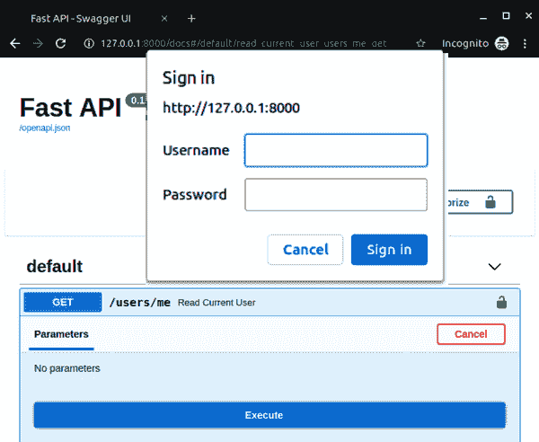
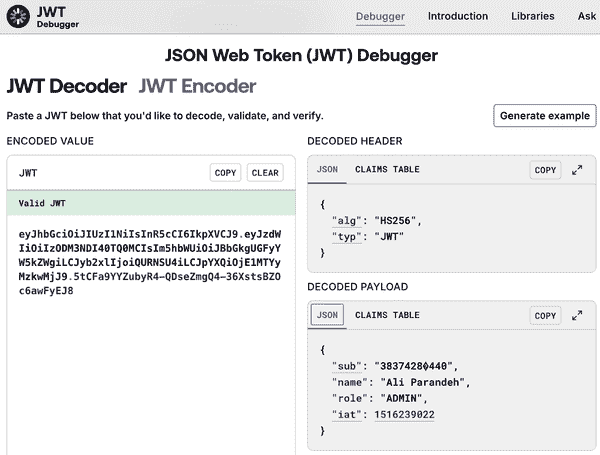
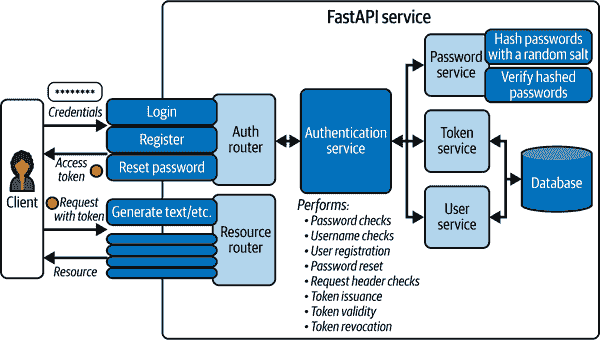
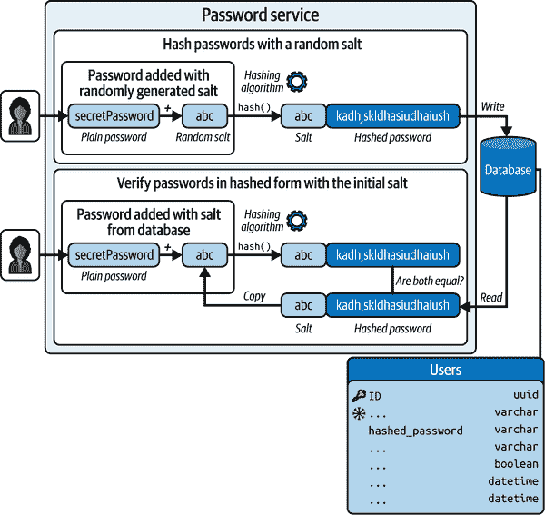
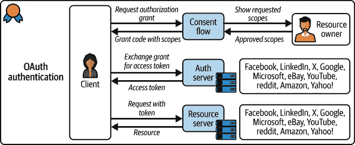
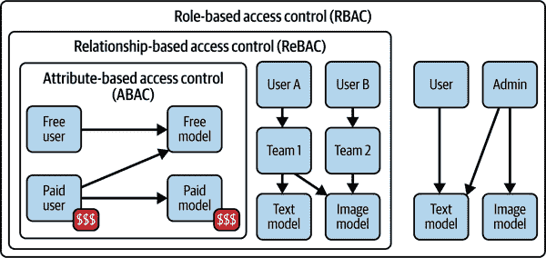
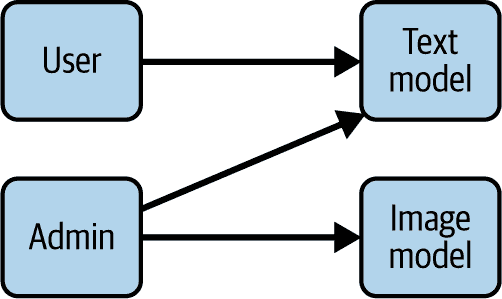
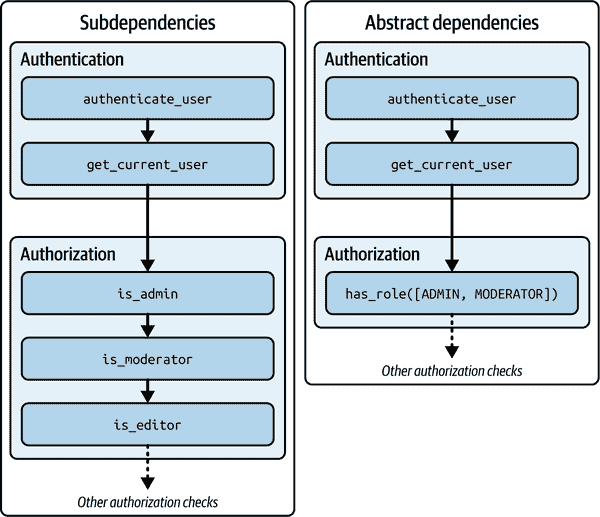
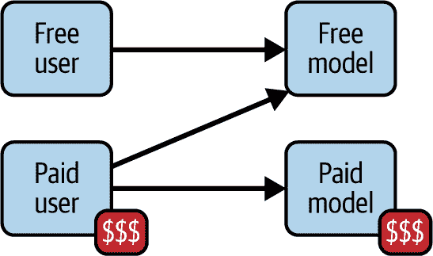

# 第八章\. 认证和授权

到目前为止，您已经构建了可以与数据库交互、流式传输模型响应和处理并发用户的 GenAI 服务。

您的服务现在已启动并运行，但由于它们没有受到攻击者或恶意用户的保护，部署到生产环境可能会遇到问题。

在本章中，您将学习如何通过认证层来保护您的服务，并实现授权守卫以保护敏感资源免受非特权用户的侵害。

为了实现这一点，我们将探索各种认证和授权模式，然后实现 JWT 和基于身份的认证以及基于角色的访问控制。

# 认证和授权

在讨论认证方法之前，让我们简要澄清认证和授权是两个不同的概念，它们经常被错误地互换使用。

根据 OWASP 的定义：^(1)

> *认证* 是通过确定一个或多个认证者（如密码、指纹或安全令牌）的有效性来验证个人、实体或网站是否是其声明的身份的过程。

另一方面，美国国家标准与技术研究院（NIST）将授权定义为：

> 一种验证请求的操作或服务是否被特定实体批准的过程。

虽然认证是关于验证身份，但授权侧重于验证身份访问或修改资源的权限。

###### 小贴士

一个可能有助于阐明这种区别的类比是在机场通过护照控制。认证就像在移民局出示护照，而授权就像拥有进入一个国家的正确签证，一旦进入，它将指定您的停留时间和允许的活动。

在本章后面讨论授权之前，让我们更详细地讨论认证方法。

# 认证方法

您可以在您的 GenAI 服务中实施几种认证机制，通过身份验证来确保它们的安全。

根据您的安全要求、应用环境、预算和项目时间表，您可能决定采用以下一个或多个认证机制：

基本认证

要求使用用户名和密码等凭证来验证身份。

JSON Web Tokens (JWT)

要求使用 *访问令牌* 来验证身份。您可以将访问令牌想象成电影院的门票，它规定了您是否可以进入放映厅以及您将访问哪个放映厅以及您将坐在哪里。

OAuth

使用 *OAuth2* 标准通过身份提供者验证身份。

基于密钥

使用一对私钥和公钥来验证身份。与令牌不同，授权服务器向客户端颁发一个公钥，并存储一个链接的私钥副本，它可以在以后用于验证.^(2)

图 8-1 更详细地显示了上述认证方法的数据流。


###### 图 8-1\. 认证方法

虽然了解认证机制，但在解决您的安全需求时，选择采用的方法仍然可能具有挑战性。为了帮助选择任务，表 8-1 比较了上述认证方法。

表 8-1\. 认证方法比较

| 类型 | 优点 | 缺点 | 用例 |
| --- | --- | --- | --- |
| 基本认证 |

+   简单性

+   快速实现

+   易于理解

| 以明文发送凭证 |
| --- |

+   原型

+   内部或非生产环境

|

| 令牌 |
| --- |

+   可扩展性

+   解耦有助于实现微服务架构

+   令牌可以签名和加密以提高安全性

+   高度可定制

+   自包含减少数据库往返次数

+   可以通过 HTTP 头传递

|

+   需要不断重新生成短期令牌

+   客户端令牌存储的复杂性

+   令牌可能变得很大，消耗过多的带宽

+   无状态令牌可能使多步骤应用难以实现

+   客户端配置错误可能使令牌受到损害

|

+   单页和移动应用

+   需要自定义认证流程的应用

+   REST API

|

| OAuth |
| --- |

+   将认证委托给外部提供者

+   基于标准（OAuth2）并在企业场景中得到实战检验

+   代表用户访问外部资源

|

+   难以理解和实现

+   每个身份提供者可能对 OAuth 流程的实现略有不同

|

+   需要从 GitHub、Google 或 Microsoft 等外部身份提供者获取用户数据的应用

+   需要与自己的身份提供者（们）进行 SSO 的企业应用

|

| 基于密钥 |
| --- |

+   与安全壳（SSH）访问类似的认证机制

|

+   管理和保持私钥安全可能很复杂

+   被泄露的密钥可能造成安全风险

+   可扩展性问题

|

+   小型应用

+   内部环境中的应用

|

您现在应该对选择适当的认证机制充满信心。在下一节中，您将为您的人工智能实现基本、JWT 和 OAuth 认证，以全面了解其底层组件及其交互。

## 基本认证

在基本认证中，客户端在从服务器请求访问资源时提供用户名和密码。这是最简单的技术，因为它不需要实现 cookies、会话标识符或任何登录表单。由于其简单性，基本认证非常适合沙盒环境和原型设计。然而，避免在生产环境中使用它，因为它在每次请求中都以明文形式传输用户名和密码，使其非常容易受到拦截攻击。

要通过基本身份验证执行认证请求，您必须添加一个值为`Basic <credentials>`的`Authorization`头，以便服务器能够成功认证它。`<credentials>`值必须是用户名和密码通过单个冒号连接的*Base64*编码（即`base64.encode(ali:secretpassword)`）。

在 FastAPI 中，您可以使用基本身份验证保护端点，如示例 8-1 所示。

##### 示例 8-1\. 在 FastAPI 中实现基本身份验证

```py
import secrets
from typing import Annotated

from fastapi import Depends, FastAPI, HTTPException, status
from fastapi.security import HTTPBasic, HTTPBasicCredentials

app = FastAPI()
security = HTTPBasic() 
username_bytes = b"ali"
password_bytes = b"secretpassword"

def authenticate_user(
    credentials: Annotated[HTTPBasicCredentials, Depends(security)]
) -> str:
    is_correct_username = secrets.compare_digest(
        credentials.username.encode("UTF-8"), username_bytes 
    )
    is_correct_password = secrets.compare_digest(
        credentials.password.encode("UTF-8"), password_bytes 
    )
    if not (is_correct_username and is_correct_password):
        raise HTTPException( 
            status_code=status.HTTP_401_UNAUTHORIZED,
            detail="Incorrect credentials",
            headers={"WWW-Authenticate": "Basic"},
        )
    return credentials.username

AuthenticatedUserDep = Annotated[str, Depends(authenticate_user)] 

@app.get("/users/me")
def get_current_user_controller(username: AuthenticatedUserDep): 
    return {"message": f"Current user is {username}"}
```


FastAPI 实现了多个 HTTP 安全机制，包括可以利用 FastAPI 依赖注入系统的`HTTPBasic`。


使用内置的`secrets`库比较提供的用户名和密码与服务器上的值。使用`secrets.compare_digest()`确保检查操作的持续时间保持一致，无论输入是什么，以避免*时间攻击*。^(3)

注意，`secrets.compare_digest()`只能接受包含 ASCII 字符（即仅英文字符）的字节或字符串输入。要处理其他字符，您需要先将输入编码为`UTF-8`字节，然后再执行凭证检查。


返回符合安全标准的标准化授权`HTTPException`，以便浏览器能够再次向用户显示登录提示。异常消息必须是通用的，以避免向攻击者泄露任何敏感信息，例如用户账户的存在。


使用`HTTPBasic`与`Depends()`一起返回包含提供的用户名的`HTTPBasicCredentials`对象。

将安全依赖注入到任何 FastAPI 端点将使用实现的身份验证来保护它。你现在可以通过访问`/docs`页面并向`/users/me`端点发送请求来亲自体验这一点。

端点在其前面将显示一个*锁*图标，当您发起请求时，您应该看到一个登录警报，要求您提供凭证，正如您在图 8-2 中看到的那样。



###### 图 8-2\. FastAPI 中的基本身份验证

干得好！在 25 行代码中，你成功实现了基本身份验证来保护端点。现在你可以在自己的原型和开发服务器中使用基本身份验证。

请记住，在生产级别的 GenAI 服务中，您应该避免采用基本的认证机制。对于面向公众的服务，*JWT 认证* 是一个更好且更安全的替代方案。它通过在令牌中存储所有认证细节来消除服务器端会话的需求。它还维护数据完整性，并支持跨不同域的广泛接受的标准。

## JSON Web Tokens (JWT) 认证

既然您对认证的基本概念更加熟悉，让我们为您的 FastAPI 服务实现一个更复杂但更安全的 JWT 认证层。作为此过程的一部分，您还需要重构现有的端点，将它们组合在一个单独的资源 API 路由器下，以便一次性对多个端点进行分组、命名、标记和保护。

### 什么是 JWT？

JWT 是一种通过令牌在应用程序之间断言声明的 URL 安全且紧凑的方式。

这些令牌由三个部分组成：

头部

除了日期时间和发行机构外，还需要指定令牌类型和签名算法。

有效载荷

指定表示资源上声明的令牌主体以及附加元数据的内容。

签名

创建令牌的函数将使用 *编码后的有效载荷*、*编码后的头部*、一个 *密钥* 和签名算法来对令牌进行签名。

###### 小贴士

`base64` 编码算法常用于对数据进行编码和解码，以实现紧凑性和 URL 安全性。

图 8-3 展示了一个典型的 JWT 的样子。



###### 图 8-3\. JWT 组件（来源：[jwt.io](https://jwt.io))

JWT 是安全的、紧凑的，并且方便，因为它们可以包含执行用户认证所需的所有信息，避免了多次数据库往返的需求。此外，由于它们的紧凑性，您可以通过 HTTP `POST` 主体、头部或 URL 参数在网络中传输它们。

### 开始使用 JWT 认证

要在 FastAPI 中实现 JWT 认证机制，您需要安装 `passlib` 和 `python-jose` 依赖项：

```py
$ pip install passlib python-jose
```

在安装了依赖项之后，您还需要在数据库中创建表来存储生成的用户和相关令牌数据。为了数据持久性，让我们将数据库迁移以创建 `users` 和 `tokens` 表，如图 8-4 所示。


###### 图 8-4\. `users` 和 `tokens` 表的实体关系图

如果您查看 图 8-4，您将注意到 `tokens` 表与 `users` 表之间存在一对一的关系。您可以使用令牌记录来跟踪每个用户的成功登录尝试，并在需要时撤销访问权限。

接下来，让我们定义所需的 SQLAlchemy 模型和 Pydantic 架构，用于数据库查询和数据验证，如示例 8-2 和 8-3 所示。

##### 示例 8-2\. 声明用户 SQLAlchemy ORM 模型

```py
# entities.py

import uuid
from datetime import UTC, datetime
from sqlalchemy import Index, String
from sqlalchemy.orm import DeclarativeBase, Mapped, mapped_column

class Base(DeclarativeBase):
    pass

class User(Base):
    __tablename__ = "users"

    id: Mapped[uuid.UUID] = mapped_column(primary_key=True, default=uuid.uuid4)
    email: Mapped[str] = mapped_column(String(length=255), unique=True)
    hashed_password: Mapped[str] = mapped_column(String(length=255))
    is_active: Mapped[bool] = mapped_column(default=True)
    role: Mapped[str] = mapped_column(default="USER")
    created_at: Mapped[datetime] = mapped_column(default=datetime.now(UTC))
    updated_at: Mapped[datetime] = mapped_column(
        default=datetime.now(UTC), onupdate=datetime.now(UTC)
    )

    __table_args__ = (Index("ix_users_email", "email"),)
```

在数据访问层使用 ORM 模型，而在端点层，Pydantic 架构将验证传入和传出的认证数据。

##### 示例 8-3\. 声明包含用户名和密码字段验证器的用户 Pydantic 架构

```py
# schemas.py

from datetime import datetime
from typing import Annotated
from pydantic import (UUID4, AfterValidator, BaseModel, ConfigDict, Field,
                      validate_call)

@validate_call
def validate_username(value: str) -> str: 
    if not value.isalnum():
        raise ValueError("Username must be alphanumeric")
    return value

@validate_call
def validate_password(value: str) -> str: 
    validations = [
        (
            lambda v: any(char.isdigit() for char in v),
            "Password must contain at least one digit",
        ),
        (
            lambda v: any(char.isupper() for char in v),
            "Password must contain at least one uppercase letter",
        ),
        (
            lambda v: any(char.islower() for char in v),
            "Password must contain at least one lowercase letter",
        ),
    ]
    for condition, error_message in validations:
        if not condition(value):
            raise ValueError(error_message)
    return value

ValidUsername = Annotated[
    str, Field(min_length=3, max_length=20), AfterValidator(validate_username)
]
ValidPassword = Annotated[
    str, Field(min_length=8, max_length=64), AfterValidator(validate_password)
]

class UserBase(BaseModel):
    model_config = ConfigDict(from_attributes=True) 

    username: ValidUsername
    is_active: bool = True
    role: str = "USER"

class UserCreate(UserBase): 
    password: ValidPassword

class UserInDB(UserBase): 
    hashed_password: str

class UserOut(UserBase):
    id: UUID4
    created_at: datetime
    updated_at: datetime
```

[#co_authentication_and_authorization_CO2-1]

验证用户名和密码，以强制执行更高的安全要求。

[#co_authentication_and_authorization_CO2-3]

允许 Pydantic 读取 SQLAlchemy ORM 模型属性，而不是手动从 SQLAlchemy 模型填充 Pydantic 架构。

[#co_authentication_and_authorization_CO2-4]

使用继承来声明基于用户基础模型的多个 Pydantic 架构。

[#co_authentication_and_authorization_CO2-5]

创建一个单独的架构，该架构仅接受 `hashed_password` 字段，用于在注册过程中创建新的用户记录。所有其他架构都必须跳过存储此字段，以消除密码泄露的风险。

创建令牌模型和架构的过程相当相似，如示例 8-4 所示。

##### 示例 8-4\. 声明令牌 ORM 模型和 Pydantic 架构

```py
# entities.py

from datetime import UTC, datetime
from sqlalchemy import ForeignKey, Index, String
from sqlalchemy.orm import DeclarativeBase, Mapped, mapped_column, relationship

class Base(DeclarativeBase):
    pass

class Token(Base):
    __tablename__ = "tokens"

    id: Mapped[int] = mapped_column(primary_key=True)
    user_id: Mapped[int] = mapped_column(ForeignKey("users.id"))
    expires_at: Mapped[datetime] = mapped_column()
    is_active: Mapped[bool] = mapped_column(default=True)
    ip_address: Mapped[str | None] = mapped_column(String(length=255))
    created_at: Mapped[datetime] = mapped_column(default=datetime.now(UTC))
    updated_at: Mapped[datetime] = mapped_column(
        default=datetime.now(UTC), onupdate=datetime.now(UTC)
    )

    user = relationship("User", back_populates="tokens")

    __table_args__ = (
        Index("ix_tokens_user_id", "user_id"),
        Index("ix_tokens_ip_address", "ip_address"),
    )

class User(Base):
    __tablename__ = "users"
    # other columns...

    tokens = relationship(
        "Token", back_populates="user", cascade="all, delete-orphan"
    )

# schemas.py

from datetime import datetime
from pydantic import BaseModel

class TokenBase(BaseModel):
    user_id: int
    expires_at: datetime
    is_active: bool = True
    ip_address: str | None = None

class TokenCreate(TokenBase):
    pass

class TokenOut(BaseModel):
    access_token: str
    token_type: str = "Bearer"
```

接下来，使用 `alembic revision --autogenerate -m "create users and tokens tables"` 命令自动生成迁移文件，以便您可以通过遵循示例 8-5 来指定两个表的具体细节。

##### 示例 8-5\. 数据库迁移以创建 `users` 和 `tokens` 表

```py
"""create users and tokens tables

Revision ID: 1234567890ab
Revises:
Create Date: 2025-01-28 12:34:56.789012

"""

from datetime import UTC, datetime
import sqlalchemy as sa
from alembic import op

...

def upgrade():
    op.create_table(
        "users",
        sa.Column("id", sa.UUID(as_uuid=True)), 
        sa.Column("email", sa.String(length=255)),
        sa.Column("hashed_password", sa.String(length=255)), 
        sa.Column(
            "is_active", sa.Boolean(), server_default=sa.sql.expression.true()
        ), 
        sa.Column("role", sa.String(), server_default=sa.text("USER")), 
        sa.Column("created_at", sa.DateTime(), default=datetime.now(UTC)),
        sa.Column(
            "updated_at",
            sa.DateTime(),
            default=datetime.now(UTC),
            onupdate=datetime.now(UTC), 
        ),
        sa.PrimaryKeyConstraint("id"),
        sa.UniqueConstraint("email"),
        sa.Index("ix_users_email", "email"), 
    )

    op.create_table(
        "tokens",
        sa.Column("id", sa.UUID(as_uuid=True)), 
        sa.Column("user_id", sa.Integer()),
        sa.Column("expires_at", sa.DateTime()), 
        sa.Column("is_active", sa.Boolean(), default=True), 
        sa.Column("ip_address", sa.String(length=255), nullable=True),
        sa.Column("created_at", sa.DateTime(), default=datetime.now(UTC)),
        sa.Column(
            "updated_at",
            sa.DateTime(),
            default=datetime.now(UTC),
            onupdate=datetime.now(UTC), 
        ),
        sa.ForeignKeyConstraint(
            ["user_id"],
            ["users.id"],
        ),
        sa.PrimaryKeyConstraint("id"),
        sa.Index("ix_tokens_user_id", "user_id"),
        sa.Index("ix_tokens_ip_address", "ip_address"), 
    )

def downgrade():
    op.drop_table("tokens")
    op.drop_table("users")
```

[#co_authentication_and_authorization_CO3-1]

在数据库层自动生成全局唯一标识符（UUIDs）用于用户和令牌记录，以防止攻击者猜测敏感资源（即用户或令牌记录）的标识符。

[#co_authentication_and_authorization_CO3-2]

避免在数据库中存储原始密码字符串，以减少安全漏洞。

[#co_authentication_and_authorization_CO3-3]

添加启用或禁用账户访问的能力。

[#co_authentication_and_authorization_CO3-4]

添加指定用户角色（如 `USER` 和 `ADMIN`）的能力，以管理账户的访问级别。授权检查将使用 `role` 字段来管理特权资源的访问。

[#co_authentication_and_authorization_CO3-5]

自动记录用户创建和更新时间戳，以进行监控和安全目的。

[#co_authentication_and_authorization_CO3-6]

在电子邮件字段上添加唯一约束和二级索引，以优化通过电子邮件的用户查询并消除创建重复电子邮件账户的可能性。

[#co_authentication_and_authorization_CO3-8]

令牌必须在短时间内过期，以减少暴露的令牌可能被攻击者滥用的时间窗口。

[#co_authentication_and_authorization_CO3-9]

添加禁用令牌的功能，这些令牌不再有效，无论是由于泄露还是用户登出。


跟踪令牌的创建和更新时间，以进行监控和安全。


在`user_id`和`ip_address`字段上创建二级索引，以优化通过这些字段进行的令牌查询。

现在，运行`alembic upgrade head`命令，在示例 8-5 中对您的数据库执行迁移，并创建`users`和`tokens`表。

在声明 ORM 模型和 Pydantic 模式后，您可以专注于核心认证机制逻辑。

图 8-5 显示了您将在 FastAPI GenAI 服务中实现的 JWT 认证系统的架构。



###### 图 8-5\. JWT 认证系统架构

在以下代码示例中，您将看到如何实现核心认证流程，从用户注册和 JWT 生成开始。

### 散列和盐值

在数据库中创建`users`和`tokens`表后的第一步是在注册时将新用户存储在数据库中。然而，您应该避免以明文形式存储密码，因为如果数据库被入侵，攻击者将拥有每个用户的凭证。

相反，认证机制将利用一种*散列算法*，将明文密码转换为无法解码回原始形式的编码字符串。由于解码过程是不可逆的，因此加密散列算法与 Base64 等标准编码/解码函数不同。

虽然存储散列密码比存储明文密码更安全，但它不足以提供足够的保护。如果这样的散列密码数据库落入攻击者手中，他们可以使用预计算的散列表——通常称为*彩虹表*。攻击者可以使用彩虹表通过恢复明文密码来暴力破解您的系统。为了防止这些暴力破解攻击，您还需要在散列过程中引入随机性元素，使用称为*盐值*的技术。

使用盐值，加密散列算法即使在用户使用常见、受损或重复密码注册的情况下，也会产生不同的散列密码。

###### 警告

使用随机盐值的密码散列可以防止使用彩虹表的暴力破解攻击。然而，它不能防止*密码喷射*，其中攻击者使用常见密码的数据库，或者*凭证填充*，其中攻击者遍历受损密码的列表。

在加盐过程中，哈希函数生成一个随机盐，将其附加到哈希前的明文密码上，然后生成一个哈希密码.^(4) 在将哈希密码存储到数据库之前，盐被添加到哈希密码的前面，以便在验证时检索。

当注册用户尝试登录时，他们必须提供他们创建账户时使用的相同密码。在密码验证过程中，用户提供的密码使用在注册期间使用的相同盐进行哈希，该盐从数据库中检索。如果生成的哈希密码与数据库中的哈希密码完全相同，则用户被认证。否则，你可以安全地假设提供了错误的凭证。

加盐和哈希是强大的技术，可以防止攻击者使用彩虹表强行进入你的系统。你可以在图 8-6 中看到完整的哈希和加盐过程。



###### 图 8-6\. 密码哈希加盐机制

图 8-6 中所示的密码服务在示例 8-6 中实现为 `PasswordService`。

##### 示例 8-6\. 实现密码服务

```py
# services/auth.py

from fastapi.security import HTTPBearer
from passlib.context import CryptContext

class PasswordService:
    security = HTTPBearer()
    pwd_context = CryptContext(schemes=["bcrypt"]) 

    async def verify_password(
        self, password: str, hashed_password: str
    ) -> bool:
        return self.pwd_context.verify(password, hashed_password) 

    async def get_password_hash(self, password: str) -> str:
        return self.pwd_context.hash(password) 
```

[#co_authentication_and_authorization_CO4-1]

创建一个带有秘密和由 `bcrypt` 库管理的密码上下文的 `AuthService`，该服务将处理所有用户密码的哈希和验证。

[#co_authentication_and_authorization_CO4-2]

使用 `bcrypt` 的密码学算法和应用程序密钥来哈希和验证密码。

`bcrypt` 密码学库为 `PasswordService` 提供了哈希和验证密码的核心功能。使用此服务，现在可以认证请求。

如果请求无法认证，你还需要抛出与授权相关的异常，如示例 8-7 所示。

##### 示例 8-7\. 创建认证异常

```py
# exceptions.py

from fastapi import HTTPException, status

UnauthorizedException = HTTPException(
    status_code=status.HTTP_401_UNAUTHORIZED,
    detail="Not authenticated",
    headers={"WWW-Authenticate": "Bearer"},
)

AlreadyRegisteredException = HTTPException(
    status_code=status.HTTP_400_BAD_REQUEST,
    detail="Username already registered",
)
```

你最常遇到的两个授权 HTTP 异常与未经授权访问或由于使用已使用的用户名导致的错误请求有关。

一旦通过凭证验证了用户的身份，你需要为他们颁发一个*访问令牌*。这些令牌应该是短暂的，以减少攻击者如果令牌被盗，可以使用令牌访问资源的时间窗口。

为了减少令牌的大小并防止*令牌伪造*，令牌服务将使用（一个秘密）对令牌有效载荷进行签名并使用如 Base64 之类的编码进行编码。有效载荷通常包含用户的详细信息，例如他们的 ID、角色、发行系统和过期日期。

令牌服务还可以在认证过程中解码接收到的令牌并检查其有效性。

最后，令牌服务还需要数据库访问来存储和检索令牌以执行其功能。因此，它应该继承`TokenRepository`，如示例 8-8 所示。

##### 示例 8-8\. 实现令牌仓库

```py
# repositories.py

from entities import Token
from repositories.interfaces import Repository
from schemas import TokenCreate, TokenUpdate
from sqlalchemy import select
from sqlalchemy.ext.asyncio import AsyncSession

class TokenRepository(Repository):
    def __init__(self, session: AsyncSession) -> None:
        self.session = session

    async def list(self, skip: int, take: int) -> list[Token]:
        async with self.session.begin():
            result = await self.session.execute(
                select(Token).offset(skip).limit(take)
            )
        return [r for r in result.scalars().all()]

    async def get(self, token_id: int) -> Token | None:
        async with self.session.begin():
            result = await self.session.execute(
                select(Token).where(Token.id == token_id)
            )
        return result.scalars().first()

    async def create(self, token: TokenCreate) -> Token:
        new_token = Token(**token.dict())
        async with self.session.begin():
            self.session.add(new_token)
            await self.session.commit()
            await self.session.refresh(new_token)
        return new_token

    async def update(
        self, token_id: int, updated_token: TokenUpdate
    ) -> Token | None:
        token = await self.get(token_id)
        if not token:
            return None
        for key, value in updated_token.dict(exclude_unset=True).items():
            setattr(token, key, value)
        async with self.session.begin():
            await self.session.commit()
            await self.session.refresh(token)
        return token

    async def delete(self, token_id: int) -> None:
        token = await self.get(token_id)
        if not token:
            return
        async with self.session.begin():
            await self.session.delete(token)
            await self.session.commit()
```

在实现了`TokenRepository`之后，您现在可以开发`TokenService`，如示例 8-9 所示。

##### 示例 8-9\. 通过继承令牌仓库实现令牌服务

```py
# services/auth.py

from datetime import UTC, datetime, timedelta
from exceptions import UnauthorizedException
from jose import JWTError, jwt
from pydantic import UUID4
from repositories import TokenRepository
from schemas import TokenCreate, TokenUpdate

class TokenService(TokenRepository):
    secret_key = "your_secret_key"
    algorithm = "HS256"
    expires_in_minutes = 60 

async def create_access_token(
    self, data: dict, expires_delta: timedelta | None = None 
) -> str:
    to_encode = data.copy()
    if expires_delta:
        expire = datetime.now(UTC) + expires_delta
    else:
        expire = datetime.now(UTC) + timedelta(minutes=self.expires_in_minutes)
    token_id = await self.create(TokenCreate(expires_at=expire)) 
    to_encode.update(
        {"exp": expire, "iss": "your_service_name", "sub": token_id} 
    )
    encoded_jwt = jwt.encode(
        to_encode, self.secret_key, algorithm=self.algorithm 
    )
    return encoded_jwt

async def deactivate(self, token_id: UUID4) -> None:
    await self.update(TokenUpdate(id=token_id, is_active=False))

def decode(self, encoded_token: str) -> dict:
    try:
        return jwt.decode(
            encoded_token, self.secret_key, algorithms=[self.algorithm]
        )
    except JWTError:
        raise UnauthorizedException

async def validate(self, token_id: UUID4) -> bool:
    return (token := await self.get(token_id)) is not None and token.is_active
```

[#co_authentication_and_authorization_CO5-1]

实现一个`TokenService`以发行和检查身份验证令牌。配置在服务的所有实例之间共享。

[#co_authentication_and_authorization_CO5-2]

根据提供给令牌服务的提供的数据生成带有过期日期的访问令牌。

[#co_authentication_and_authorization_CO5-3]

在数据库中创建一个令牌记录并获取一个唯一的标识符。

[#co_authentication_and_authorization_CO5-4]

访问令牌必须在小时内过期，因此将使用计算字段`exp`来检查令牌的有效性。

[#co_authentication_and_authorization_CO5-5]

使用`base64`算法将生成的令牌编码为编码字符串。

现在您已经有了`PasswordService`和`TokenService`，您可以使用专门的更高层次的`AuthService`来完成核心 JWT 身份验证机制。

示例 8-10 显示了包含用于注册用户、发行访问令牌和保护 API 路由的几个依赖函数的`AuthService`类的实现。

##### 示例 8-10\. 实现一个处理高级身份验证逻辑的认证服务

```py
# services/auth.py

from typing import Annotated
from databases import DBSessionDep
from entities import Token, User, UserCreate, UserInDB
from exceptions import AlreadyRegisteredException, UnauthorizedException
from fastapi import Depends
from fastapi.security import (HTTPAuthorizationCredentials, HTTPBearer,
                              OAuth2PasswordRequestForm)
from services.auth import PasswordService, TokenService
from services.users import UserService

security = HTTPBearer()
LoginFormDep = Annotated[OAuth2PasswordRequestForm, Depends()]
AuthHeaderDep = Annotated[HTTPAuthorizationCredentials, Depends(security)]

class AuthService:
    def __init__(self, session: DBSessionDep):
        self.password_service = PasswordService()
        self.token_service = TokenService(session)
        self.user_service = UserService(session)

    async def register_user(self, user: UserCreate) -> User:
        if await self.user_service.get(user.username):
            raise AlreadyRegisteredException
        hashed_password = await self.password_service.get_password_hash(
            user.password
        )
        return await self.user_service.create(
            UserInDB(username=user.username, hashed_password=hashed_password)
        )

    async def authenticate_user(self, form_data: LoginFormDep) -> Token: 
        if not (user := await self.user_service.get_user(form_data.username)):
            raise UnauthorizedException
        if not await self.password_service.verify_password(
            form_data.password, user.hashed_password
        ):
            raise UnauthorizedException
        return await self.token_service.create_access_token(user._asdict())

    async def get_current_user(self, credentials: AuthHeaderDep) -> User:
        if credentials.scheme != "Bearer":
            raise UnauthorizedException
        if not (token := credentials.credentials):
            raise UnauthorizedException
        payload = self.token_service.decode(token)
        if not await self.token_service.validate(payload.get("sub")):
            raise UnauthorizedException
        if not (username := payload.get("username")):
            raise UnauthorizedException
        if not (user := await self.user_service.get(username)):
            raise UnauthorizedException
        return user

    async def logout(self, credentials: AuthHeaderDep) -> None:
        payload = self.token_service.decode(credentials.credentials)
        await self.token_service.deactivate(payload.get("sub"))

    # Add Password Reset Method
    async def reset_password(self): ...
```

[#co_authentication_and_authorization_CO6-1]

应用程序的核心身份验证逻辑，验证用户是否存在以及他们的密码凭据。如果任何检查失败，则返回`False`。

您现在可以使用`AuthService`来使用其凭据注册和验证用户。参考示例 8-11 以了解如何使用`AuthService`创建专用身份验证路由所需的相关依赖项。

##### 示例 8-11\. 实现身份验证控制器以启用登录和注册功能

```py
# routes/auth.py

from typing import Annotated
from entities import User
from fastapi import APIRouter, Depends
from models import TokenOut, UserOut
from services.auth import AuthService

auth_service = AuthService()
RegisterUserDep = Annotated[User, Depends(auth_service.register_user)]
AuthenticateUserCredDep = Annotated[
    str, Depends(auth_service.authenticate_user_with_credentials)
]
AuthenticateUserTokenDep = Annotated[User, Depends(auth_service.register_user)]
PasswordResetDep = Annotated[None, Depends(auth_service.reset_password)] 

router = APIRouter(prefix="/auth", tags=["Authentication"]) 

@router.post("/register")
async def register_user_controller(new_user: RegisterUserDep) -> UserOut:
    return new_user

@router.post("/token") 
async def login_for_access_token_controller(
    access_token: AuthenticateUserCredDep,
) -> TokenOut:
    return {"access_token": access_token, "token_type": "bearer"}

@router.post("/logout", dependencies=[Depends(auth_service.logout)])  
async def logout_access_token_controller() -> dict:
    return {"message": "Logged out"}

@router.post("reset-password") 
async def reset_password_controller(credentials: str) -> dict:
    return {
        "message": "If an account exists, "
        "a password reset link will be sent to the provided email"
    }
```

[#co_authentication_and_authorization_CO7-1]

创建一个`AuthService`的实例并声明可重用的注解依赖项。

[#co_authentication_and_authorization_CO7-2]

为身份验证端点创建一个单独的 API 路由器。

[#co_authentication_and_authorization_CO7-3]

实现注册用户、用户登录（令牌发行）、用户注销（令牌撤销）和密码重置的端点。

[#co_authentication_and_authorization_CO7-5]

由于`LogoutUserDep`依赖项不会返回任何内容，因此请在路由器的依赖项数组中注入它。

一旦您有一个专门的认证路由器，创建一个单独的资源路由器来分组您所有的资源端点。有了这两个路由器，您现在可以将它们添加到您的 FastAPI 应用中，如示例 8-12 所示，以完成 JWT 身份验证工作。

##### 示例 8-12.重构 FastAPI 应用程序以使用路由器

```py
# routes/resource.py

from fastapi import APIRouter

router = APIRouter(prefix="/generate", tags=["Resource"]) 

@router.get("/generate/text", ...)
def serve_language_model_controller(...):
    ...

@router.get("/generate/audio", ...)
def serve_text_to_audio_model_controller(...)
    ...

... # Add other controllers to the resource router here

# main.py

from typing import Annotated
import routes
from entities import User
from fastapi import Depends, FastAPI
from services.auth import AuthService

auth_service = AuthService()
AuthenticateUserDep = Annotated[User, Depends(auth_service.get_current_user)]

...

app = FastAPI(lifespan=lifespan)

app.include_router(routes.auth.router, prefix="/auth", tags=["Auth"]) 
app.include_router(
    routes.resource.router,
    dependencies=[AuthenticateUserDep],
    prefix="/generate",
    tags=["Generate"],
) 
...  # Add other routes to the app here
```

(#co_authentication_and_authorization_CO8-1)

将现有端点重构为在名为资源路由器的单独 API 路由器下分组。

(#co_authentication_and_authorization_CO8-2)

将认证和资源路由器添加到 FastAPI 的`app`路由器。

(#co_authentication_and_authorization_CO8-3)

通过在路由器级别注入`AuthenticateUserDep`依赖项来保护资源端点。现在，请求必须包含一个带有承载令牌的`Authorization`头才能通过资源路由器进行身份验证。

热烈祝贺！您现在拥有了一个完全工作的 GenAI 服务，该服务由 JWT 身份验证保护，并且可以通过一些额外的工作部署到生产环境中。

在下一节中，您将了解一些关于如何增强系统以加强 JWT 身份验证系统安全性的想法。

### 身份验证流程

您需要处理几个身份验证流程，才能完全实现一个可用的 JWT 身份验证系统。

*核心*身份验证流程包括以下内容：

用户注册

新用户将通过提供他们的电子邮件和一个安全的密码来注册一个新账户。您的身份验证逻辑可能会检查密码强度、没有与相同电子邮件地址存在的现有用户，以及用户重新确认密码和电子邮件。您还应该避免在数据库中存储用户的原始密码。

用户登录

在每个用户登录时，如果用户提供了正确的凭据，您的系统可以生成、存储并提供一个唯一的临时访问令牌（即 JWT）。您的受保护资源服务器路由器应拒绝任何不包含有效 JWT 的传入请求。有效的 JWT 可以通过其签名进行验证，并与数据库中指定的有效令牌进行核对。

用户注销

当用户注销时，您的系统可以吊销当前颁发的令牌，并防止使用当前令牌进行未来的恶意登录尝试。

除了核心流程之外，您还应该考虑*次要*流程来实现一个生产就绪的身份验证系统。这些流程可以用于：

验证身份

为了防止垃圾邮件机器人注册您的系统中的活动账户并消耗服务器资源，您将需要在系统中实施某种用户验证机制。例如，通过将电子邮件服务器集成到您的身份验证系统中添加电子邮件验证。

重置密码

用户随时可能忘记他们的密码。您将希望实现一个流程，让用户可以重置他们的密码。如果用户重置了密码，数据库中针对其用户账户的所有活动令牌都必须被吊销。

强制注销

在所有客户端中撤销用户的先前生成的所有访问令牌，以防止被盗令牌被用于访问系统。

禁用用户账户

管理员或用户可能希望禁用他们的账户以防止未来的登录尝试。

删除用户账户

如果用户希望从您的系统中删除他们的账户，这是必需的。根据您的数据存储需求，您可能希望在保留其他相关数据的同时删除个人身份信息。

阻止连续登录尝试

在短时间内多次失败登录尝试的账户暂时禁用。

提供刷新令牌

生成短期*访问*令牌和长期*刷新*令牌。由于访问令牌可以频繁过期以减少攻击者使用被盗令牌的机会，客户端可以重复使用他们的刷新令牌来请求新的访问令牌。这消除了频繁登录的需求，同时保持系统对攻击者的安全性。

双因素认证（2FA）或多重因素认证（MFA）

您可以通过要求使用 2FA 或 MFA 作为额外的保护层来保护您的系统免受暴露的密码保护账户的影响。2FA/MFA 示例包括短信/电子邮件验证、一次性密码（OTPs）或从配对的身份验证应用程序中随机生成的数字序列，作为在生成访问令牌之前的第二个登录步骤。

###### 警告

上述列表并不全面。您可能想查看[“OWASP Top 10 Web Applications Security Risks”](https://oreil.ly/xAGfn)和[“OWASP Authentication Cheat Sheet”](https://oreil.ly/oSyuz)，以获取在从头开始实现自己的 JWT 身份验证时需要考虑的完整列表。

除了遵循 OWASP 顶级 10 指南外，您还应该使用诸如*速率限制*、*地理/IP 跟踪*和*账户锁定*等安全机制来防御各种攻击。

您还可以考虑使用包含这些安全功能的服务第三方身份验证提供者（如 Okta/Auth0、Firebase Auth、KeyCloak、Amazon Cognito 等）。

虽然基于 JWT 的基于凭证的认证可以被认为是一个生产就绪的认证系统，并且可以通过实施 MFA 系统进一步增强，但这种机制有其自身的局限性。例如，如前所述，要求凭证和在数据库中存储散列密码可能会保留安全风险，如果攻击者利用密码喷射或凭证填充暴力攻击。

此外，如果您需要访问系统外部的用户资源，您将需要实施额外的机制来验证您的应用程序身份以外部身份提供者。由于这在许多应用程序和服务中仍然是一个常见需求，因此已经开发了一个名为 OAuth 的协议来简化整个过程。

让我们探讨如何使用 OAuth 身份验证为用户提供更多登录选项并访问外部用户资源。这可以提高您的 GenAI 服务的性能并生成更高品质的输出。

# 实现 OAuth 身份验证

我们在本章 earlier 提到了通过身份提供者进行 OAuth 身份验证的概念。

OAuth 是一个开放标准，用于访问委派，通常用于在不暴露密码的情况下授予网站或应用程序对用户信息的有限访问。它允许您使用 Google、Facebook 等身份提供者进行用户身份验证，并授予您的应用程序访问外部服务上的用户资源（如日历、文件、社交动态等）的权限。

通过使用 OAuth，您可以通过利用现有的身份提供者而不是创建自己的身份验证机制（如 JWT）来简化您应用程序中身份验证的实现。

**身份提供者**（IDP）是使其他应用程序（如您的 GenAI 服务）能够集成并依赖其身份和身份验证系统以代表用户通过标准化流程访问资源的平台。IDP 验证用户并颁发安全令牌，这些令牌声明用户的身份和其他属性。GitHub、Google、Microsoft 365、Apple、Meta 和 LinkedIn 只是数百个身份提供者中的一小部分。

在幕后推动整个流程的协议是**OAuth 2.0**，这是一个授权框架，允许应用程序代表用户有限地访问另一个服务。

使用这种方法，您的应用程序可以将用户重定向到身份提供者平台，以便用户可以授予对这些平台上账户的有限时间访问权限。在用户同意后，您的应用程序可以代表他们在日历等资源上执行操作或读取他们的个人资料信息，包括电子邮件或图像等个人信息。

因此，OAuth 身份验证通常用于验证用户的身份，因为您信任外部平台/身份提供者的身份验证过程。因此，这种方法可以减少在您的系统中存储和确保用户凭证的负担，这可能会受到弱密码或受损密码的暴力攻击。

在本节中，您将实现一个基于现代应用程序中常用**授权码流**的 OAuth 变体。步骤如下：

1.  用户点击您应用程序中的登录按钮以启动身份验证流程。

1.  用户被重定向到身份提供者的登录页面，您的应用程序向身份提供者提供客户端 ID 和密钥以识别自身。

1.  用户登录到他们的账户，并显示一个类似于图 8-7 的同意屏幕，展示您的应用程序代表他们请求的权限（即，权限）。

    

    ###### 图 8-7\. 示例同意屏幕

1.  用户授予所有、部分或没有任何请求的权限范围。

1.  如果用户没有拒绝同意（即，资源所有者），身份提供者的授权服务器会向你的应用程序提供一个 *授权码* 到你提供的端点，称为 *重定向 URI*。如果你的重定向 URI 之前没有被身份提供者批准，身份提供者将拒绝在此颁发授权码。

1.  在你的应用程序收到与用户会话、允许的权限范围和你的应用程序客户端 ID 相关的授权码后，它可以与授权服务器交换这个授权码，以获得一个 *短期访问令牌* 和一个 *长期刷新令牌*。你可以使用刷新令牌来请求新的访问令牌，而无需重新启动整个认证过程。

1.  你的应用程序现在可以使用这个访问令牌来访问提供者的资源服务器，代表用户在其资源上执行操作。因此，你可以通过身份提供者对你的系统上的资源进行用户认证。

###### 提示

通过 OAuth 流程，授权服务器还可能颁发一个 *状态参数* 或 *CSRF 令牌*，你的应用程序在与身份提供者的服务器通信时必须提供。状态参数或 CSRF 令牌的目的是为了防止跨站请求伪造 (CSRF) 攻击。

在 CSRF 中，攻击者可能会窃取一个认证会话，以在用户不知情的情况下伪造对资源服务器的认证请求。

图 8-8 展示了完整的 OAuth 认证流程。



###### 图 8-8\. OAuth 认证流程

现在你已经对 OAuth 认证流程有了高层次的理解，让我们在 FastAPI 中使用 GitHub 这样的身份提供者来实现它，以便完全理解其底层机制。

## 使用 GitHub 的 OAuth 认证

设置 OAuth 认证的第一步是在 GitHub 中创建一组客户端 ID 和密钥凭据，以便他们的系统可以识别你的应用程序。

你可以通过访问 GitHub 个人资料下的开发者设置并创建 OAuth 应用来从 GitHub 生成客户端 ID 和密钥.^(5)

使用你新的应用程序客户端 ID 和密钥，你现在可以通过你的应用程序重定向用户到 GitHub 授权服务器，按照 示例 8-13 进行操作。

##### 示例 8-13\. 将用户重定向到 GitHub 授权服务器以启动 OAuth 流程

```py
# routes/auth.py

import secrets
from fastapi import APIRouter, Request, status
from fastapi.responses import RedirectResponse

client_id = "your_client_id"
client_secret = "your_client_secret"

router = APIRouter()

...

@router.get("/oauth/github/login", status_code=status.HTTP_301_REDIRECT)
def oauth_github_login_controller(request: Request) -> RedirectResponse:
    state = secrets.token_urlsafe(16)
    redirect_uri = request.url_for("oauth_github_callback_controller")
    response = RedirectResponse(
        url=f"https://github.com/login/oauth/authorize"
        f"?client_id={client_id}"
        f"&scope=user"
        f"&state={state}"
        f"&redirect_uri={redirect_uri}"
    ) 
    csrf_token = secrets.token_urlsafe(16)
    request.session["x-csrf-state-token"] = csrf_token
    return response
```


将用户重定向到 GitHub 授权服务器以登录他们的账户，同时提供你的应用程序凭据、请求的权限范围和 CSRF 状态值，以防止 CSRF 攻击。

如 示例 8-13 所示，请求的范围是用户，这意味着一旦用户登录他们的 GitHub 账户，他们就会看到一个同意屏幕，以便你的应用程序获得访问其用户资料的权限。

现在你已经有一个后端端点将请求重定向到 GitHub 授权服务器，你可以在客户端应用程序中添加一个按钮来调用此端点，并开始与 GitHub 的 OAuth 流程（见 示例 8-14）。

##### 示例 8-14\. 将 GitHub 登录按钮添加到 Streamlit 客户端应用程序

```py
# client.py

import requests
import streamlit as st

if st.button("Login with GitHub"):
    response = requests.get("http://localhost:8000/auth/oauth/github/login")
    if not response.ok:
        st.error("Failed to login with GitHub. Please try again later")
        response.raise_for_status()
```

你现在已经实现了以 GitHub 作为身份提供者的 OAuth 认证过程的重定向流程。

当用户登录他们的 GitHub 账户时，GitHub 将显示一个类似于 图 8-7 的同意屏幕。

如果用户接受同意，GitHub 将带着授权代码和状态将用户重定向回你的应用程序。你应该检查状态是否与之前生成的状态匹配。

###### 警告

如果状态不匹配，第三方已发起请求，你应该停止该过程。

一旦你有了授权代码，你可以将其发送给 GitHub 授权以交换访问令牌，如 示例 8-15 所示。

##### 示例 8-15\. 在防止 CSRF 攻击的同时交换授权代码和访问令牌

```py
# dependencies/auth.py

from typing import Annotated
import aiohttp
from fastapi import Depends, HTTPException
from loguru import logger

client_id = "your_client_id"
client_secret = "your_client_secret"

async def exchange_grant_with_access_token(code: str) -> str:
    try:
        body = {
            "client_id": client_id,
            "client_secret": client_secret,
            "code": code,
        }
        headers = {
            "Accept": "application/json",
            "Content-Type": "application/json",
        }
        async with aiohttp.ClientSession() as session:
            async with session.post(
                "https://github.com/login/oauth/access_token",
                json=body,
                headers=headers,
            ) as resp:
                access_token_data = await resp.json()
    except Exception as e:
        logger.warning(f"Failed to fetch the access token. Error: {e}")
        raise HTTPException(
            status_code=503, detail="Failed to fetch access token"
        )

    if not access_token_data:
        raise HTTPException(
            status_code=503, detail="Failed to obtain access token"
        )

    return access_token_data.get("access_token", "")

ExchangeCodeTokenDep = Annotated[str, Depends(exchange_grant_with_access_token)]
```

你现在可以添加一个新的端点，该端点接受来自 GitHub 授权服务器的请求。此回调端点应具有 CSRF 保护，以防止第三方冒充授权服务器。如果来自 GitHub 的请求是伪造的，提供的状态参数和存储在请求会话中的状态将不匹配。

示例 8-16 展示了回调端点的实现。

##### 示例 8-16\. 在防止 CSRF 攻击的同时实现回调端点以获取访问令牌

```py
# routes/auth.py

from dependencies.auth import ExchangeCodeTokenDep
from fastapi import Depends, HTTPException, Request
from fastapi.responses import RedirectResponse

...

def check_csrf_state(request: Request, state: str) -> None:
    if state != request.session.get("x-csrf-token"):
        raise HTTPException(detail="Bad request", status_code=401)

@router.get("/oauth/github/callback", dependencies=[Depends(check_csrf_state)])
async def oauth_github_callback_controller(
    access_token: ExchangeCodeTokenDep,
) -> RedirectResponse:
    response = RedirectResponse(url=f"http://localhost:8501")
    response.set_cookie(key="access_token", value=access_token, httponly=True)
    return response
```

在 示例 8-16 中，你正在使用请求会话进行 CSRF 保护，但如果不首先添加 Starlette 的 `SessionMiddleware`，则这不会起作用，以维护一个仅在服务器端可变的、安全的用户会话，如 示例 8-17 所示。

##### 示例 8-17\. 添加会话中间件以管理会话状态以防止 CSRF 攻击

```py
# main.py

from fastapi import FastAPI
from starlette.middleware.sessions import SessionMiddleware

...

app = FastAPI(lifespan=lifespan)
app.add_middleware(SessionMiddleware, secret_key="your_secret_key")
```

###### 警告

避免依赖 HTTP **cookies** 来存储和读取请求会话之间的 `state`，因为 cookies 可以被第三方读取和操作。永远不要信任来自客户端的数据。

通过在 示例 8-13 中将唯一的 `state` 写入会话，并将其与传入请求查询参数中的 `state` 值进行比较，你可以确认请求的身份。

在这种情况下，请求者是 GitHub 授权服务器，它向你发送一个授权 `code`。一旦你收到授权 `code`，你就可以将其与 GitHub 授权服务器交换以获取访问令牌。

###### 小贴士

在 OAuth 相关的代码示例中展示的过程也可以使用开源的 `authlib` 包来实现，以简化实现过程，因为这个包为你处理了大部分工作。

最后，你可以使用从授权服务器收到的访问令牌来获取用户信息，例如他们的姓名、电子邮件和简介图片，以在应用程序中注册他们的身份。

示例 8-18 展示了如何实现一个端点，当请求包含在请求的授权头中的访问令牌时，从 GitHub 返回用户信息。

###### 警告

理想情况下，你应该避免将用户的 GitHub 访问令牌与用户的浏览器共享。如果令牌被盗，你的应用程序将负责损害用户的 GitHub 账户。

相反，创建并共享与 GitHub 访问令牌关联的短期访问令牌，以使用你的应用程序验证用户。如果你的应用程序令牌被盗，你将避免超出你应用程序范围的用户账户受到损害。

##### 示例 8-18\. 使用访问令牌从 GitHub 资源服务器获取用户信息

```py
# routes/auth.py

from typing import Annotated
import aiohttp
from fastapi import Depends, HTTPException
from fastapi.security import HTTPAuthorizationCredentials, HTTPBearer

security = HTTPBearer()
HTTPBearerDep = Annotated[HTTPAuthorizationCredentials, Depends(security)]

...

async def get_user_info(credentials: HTTPBearerDep) -> dict:
    try:
        async with aiohttp.ClientSession() as session:
            headers = {"Authorization": f"Bearer {credentials.credentials}"}
            async with session.get(
                "https://api.github.com/user", headers=headers
            ) as resp:
                return await resp.json()
    except Exception as e:
        raise HTTPException(
            status_code=503, detail=f"Failed to obtain user info - Error: {e}"
        )

GetUserInfoDep = Annotated[dict, Depends(get_user_info)]

@router.get("/oauth/github/callback")
async def get_current_user_controller(user_info: GetUserInfoDep) -> dict:
    return user_info
```

恭喜！你现在应该已经拥有了一个利用 OAuth2 进行用户身份验证的工作认证系统。

## OAuth2 流程类型

你刚刚实现的 OAuth2 流程是 *授权码流程*（ACF）。然而，根据不同的使用场景，你还可以选择其他流程。身份提供者文档可能会为你提供各种流程的解决方案，如果你不了解这些使用场景，可能会感到不知所措。

### 授权码流程

授权码流程是使用服务器和后端 API（如 FastAPI）的应用程序的常见方法，使用代码授权来颁发访问令牌。

ACF 的一个更安全的变体利用 *交换证明密钥*（PKCE，发音为“pixie”）。你可以在无法保护授权码不被窃取的情况下使用 ACF-PKCE 流程——例如，在移动设备上。

在 ACF-PKCE 流程中，你会在向身份提供者发送初始请求时添加一个称为 `code_challenge` 的哈希密钥。然后你再次展示未哈希的密钥 `code_verifier` 以交换授权码获取访问令牌。

从本质上讲，PKCE 通过在令牌交换过程中添加一层验证来防止 *授权码拦截* 攻击——如 图 8-10 所示。


###### 图 8-10\. 移动设备上的 OAuth2 授权码拦截攻击

### 隐式流程

对于没有独立后端的单页应用程序（SPAs），你也可以使用 *隐式流程*，该流程跳过授权码直接获取访问令牌。隐式流程比之前的流程安全性较低，但增强了用户体验。

### 客户端凭证流程

如果你正在构建用于机器到机器通信的后端服务，并且没有浏览器参与，那么你可以使用*客户端凭证流*。在这里，你可以用你的客户端 ID 和密钥交换访问令牌，以访问身份提供者服务器上的资源（即，你不会代表其他用户访问）。

### 资源所有者密码凭证流

*资源所有者密码凭证流*类似于客户端凭证流，但使用用户的用户名和密码来获取访问令牌。由于凭证是直接与授权服务器交换的，因此应尽可能避免使用此流。

### 设备授权流

最后，还有*设备授权流*，主要用于输入能力有限的设备，例如，当你通过扫描 QR 码并使用手机上的网络浏览器登录你的智能电视上的 Apple TV 账户时。

表 8-2 比较了各种流，以帮助您根据您特定的需求和限制选择适合您自己用例的正确选项。

表 8-2\. OAuth2 授权流比较

| 流 | 描述 | 考虑因素 | 用例 |
| --- | --- | --- | --- |
| 授权码流（包括 PKCE） | 通过用户登录获取授权码，并交换以获取访问令牌。 |

+   提供者的访问令牌必须安全存储，并且永远不要暴露给浏览器。

+   如果可能，使用 ACF-PKCE 流以增强安全性。

|

+   服务器端应用程序和具有后端服务器且可以安全处理客户端密钥和访问令牌的 Web 应用程序。

+   如果使用 PKCE 令牌作为客户端凭证无法安全存储，则不适用于移动应用程序。

|

| 隐式流 | 不使用授权码获取访问令牌。 |
| --- | --- |

+   安全性较低，因为访问令牌暴露给浏览器。

+   当无法使用授权码流时使用。

| 单页应用程序（SPA） | 当用户体验优先于安全性、原型设计或授权码流不可用时。 |
| --- | --- |
| 客户端凭证流 | 客户端直接交换其客户端凭证（客户端 ID 和客户端密钥）以获取访问令牌。 | 不涉及用户交互，适用于客户端代表自身行动的场景。确保安全存储客户端凭证。 | 服务器到服务器应用程序。 |
| 资源所有者密码凭证流 | 直接交换用户的用户名和密码以获取访问令牌。 |

+   安全风险高，因为用户的凭证是直接处理的。

+   仅在不支持其他流的传统系统中使用。

| 旧版应用程序或高度信任的环境。 |
| --- |
| 设备授权流 | 访问另一台设备上的 URL 以输入代码以获取访问令牌。 | 需要一个带有网络浏览器的第二台设备供用户进行身份验证。 | 输入能力有限的设备，如智能电视、游戏机或物联网设备。 |

你现在应该更有信心使用各种商业身份验证机制来保护你的应用程序，包括利用外部 IDP 的各种 OAuth2 流程。

认证是识别你的系统用户并确保你的服务安全的第一步。

仍然有一个问题：当用户登录到你的服务时，会发生什么？他们可以随意获取数据、与模型交互和修改资源，还是你更希望控制他们在服务中的交互？

这些是授权系统将要解决的问题，我们将在下一节中讨论。

# 授权

到目前为止，我们一直在介绍各种认证机制，包括基本的、基于令牌的（JWT）和 OAuth2，以保护你的应用程序。

如前所述，认证系统识别和验证行为者，而授权系统则在一个应用程序中执行*权限*（即谁可以在哪个资源上做什么）。

在本节中，你将了解考虑以下内容的授权系统：

+   *行为者*（即代表用户或第三方服务执行的用户）

+   正在进行的*动作*

+   行动对*资源*的影响

从本质上讲，授权系统可以比作一个接受三个输入——*行为者*、*动作*、*资源*——并返回一个*布尔决策*以*允许*或*拒绝*请求的函数。要实现授权函数，你需要*授权数据*，例如用户属性、关系（如团队/组/组织成员资格）、资源所有权、角色和权限，通过一系列*抽象规则*来确定布尔允许/拒绝决策。

一旦做出决定，你可以通过允许操作（如获取或修改资源）或拒绝请求（如发送 403 禁止响应、重定向用户、隐藏资源、锁定账户等）来*执行*授权。

在表面层面上，实现授权可能很简单。使用几个条件语句，你可以检查用户是否有权限执行某个操作。然而，随着你需要实施授权步骤的地方数量增加，这种简单的方法可能会变得难以管理。当你对应用程序中的逻辑进行更改时，这个问题会变得更糟，使系统变得复杂，并增加了更精细的控制。你可能会重复逻辑或使未来的更改更加困难，授权规则可能会深深地嵌入到你的应用程序逻辑中，使得与应用程序其他部分的分离变得更加具有挑战性。

在这种情况下，授权模型可以用来帮助你导航在应用程序中管理授权决策和执行复杂性。

## 授权模型

有几种常见的*授权模型*你可以学习，以使构建和实现授权系统变得更加容易：

基于角色的访问控制（RBAC）

授权是基于分配给用户的角色进行的，其中每个角色都有特定的权限。例如，管理员可以访问所有可用的 GenAI 模型，绕过对用户实施的授权规则。

基于关系的访问控制 (ReBAC)

授权是由实体之间的关系决定的，例如用户到用户（例如，关注者、朋友、联系）或用户到资源（例如，组、团队、组织）关系。例如，这可以授权一个团队成员访问该团队购买的付费模型。

基于属性的访问控制 (ABAC)

授权决策是基于用户、资源和环境的属性进行的，从而实现了细粒度的访问控制。例如，具有*公共*属性的对话可以被每个人查看，而具有*付费*属性的用户可以访问高级 GenAI 模型。

RBAC 是最简单的授权模型，但不会提供其他授权模型提供的增强细粒度控制和灵活性。ABAC 控制提供了更细粒度的访问控制，并且可以覆盖 ReBAC 和 RBAC 规则。此外，ReBAC 还可以覆盖或扩展 RBAC 控制。

表 8-4 比较了三种授权模型。

表 8-4\. 授权方法比较

| 类型 | 优点 | 局限性 | 用例 |
| --- | --- | --- | --- |
| 基于角色的 (RBAC) | 简化管理 | 灵活性有限 | 企业环境、访问控制、金融系统、医疗系统 |
| 基于关系的 (ReBAC) | 细粒度控制 | 需要从各种来源获取关系数据，并进行复杂的权限评估 | 社交网络、协作平台、内容共享应用、项目管理工具 |
| 基于属性的 (ABAC) | 高度灵活 | 需要从各种来源获取属性数据，并进行复杂的权限评估 | 动态环境、云服务、物联网系统、法规遵从性、个性化用户体验 |

这三种授权模型之间也存在层次关系，如图 8-11 所示。



###### 图 8-11\. 授权模型

让我们现在详细讨论每种授权模型，从 RBAC 模型开始。

## 基于角色的访问控制

由于其简单性，使用*角色*是实现应用程序授权的广泛采用模型。

角色易于理解。它们通常对应于用户在应用程序中的身份和他们想要做什么。有时授权角色可以直接映射到您组织层次结构中的角色。

您可以在一个角色下分组权限，然后可以将这些权限*分配*给用户，以授予用户这些权限。*权限*指定用户可以在资源上执行的操作，例如用户是否可以与您服务提供的付费 LLM 模型交互。

为了更好的管理者和用户体验，您可以创建多个具有预设权限的角色，以减少设置用户权限时的决策疲劳。您不必设置大量权限，而只需分配几个预定义的角色。

许多商业服务的共同起点是用户和管理员角色。虽然成员可以访问应用程序的核心功能，例如与 GenAI 模型交互、读取和写入资源，但他们无法查看其他用户的数据或管理角色。另一方面，管理员可以分配和移除角色、查看和修改每个资源，或启用和禁用账户。管理员还可以访问早期功能，例如 GenAI 模型，这些功能普通用户目前还无法访问，如图图 8-12 所示。



###### 图 8-12\. 只有管理员可以访问基于图像的 GenAI 模型的 RBAC 示例

您可以实施一个简单的 RBAC 授权模型来控制用户可以访问的 GenAI 服务，如图示例 8-19 所示。

##### 示例 8-19\. 使用 FastAPI 依赖项实现 RBAC

```py
# dependencies/auth.py

from entities import User
from fastapi import Depends, HTTPException, status
from services.auth import AuthService

async def is_admin(user: User = Depends(AuthService.get_current_user)) -> User: 
    if user.role != "ADMIN":
        raise HTTPException(
            status_code=status.HTTP_403_FORBIDDEN,
            detail="Not allowed to perform this action",
        )
    return user

# routers/resource.py

from dependencies.auth import is_admin
from fastapi import APIRouter, Depends
from services.auth import AuthService

router = APIRouter(
    dependencies=[Depends(AuthService.get_current_user)], 
    prefix="/generate",
    tags=["Resource"],
)

@router.post("/image", dependencies=[Depends(is_admin)])
async def generate_image_controller(): 
    ...

@router.post("/text") 
async def generate_text_controller():
    ...
```

[#co_authentication_and_authorization_CO10-1]

在`AuthService.get_current_user`依赖项之上实现`is_admin`授权依赖项保护。由于子依赖项正在对数据库执行异步操作，因此将函数标记为`async`。

[#co_authentication_and_authorization_CO10-3]

使用授权保护依赖项拒绝非管理员认证用户对图像生成服务的访问。

[#co_authentication_and_authorization_CO10-2]

非管理员认证用户仍然可以访问其他资源控制器，因为路由器由认证保护依赖项保护。

使用示例 8-19 中显示的相同逻辑，您可以构建不同的系统提示模板或使用针对每个角色微调的不同模型变体。

###### 警告

请记住，在应用层实现授权比将其委托给 GenAI 模型更安全。LLM 和其他 GenAI 模型可能容易受到*提示注入*攻击，攻击者通过操纵模型的输入来绕过系统指令，从而产生未经授权和有害的输出。

LLM 和其他 GenAI 模型的未来版本可能会通过使用扩展（如 Stable Diffusion 模型中的*控制神经网络（ControlNet）*）在内部强制执行自定义授权规则来减轻提示注入风险。

要创建比示例 8-19 中显示的更复杂的 RBAC 授权逻辑，您可以实现*子依赖项*或*抽象依赖项*。这两种方法都将利用 FastAPI 强大的*分层依赖图*作为授权保护来强制执行您的 GenAI 服务中的权限。

例如，如果您将来添加新的角色，这些角色继承另一个角色的部分权限（例如，版主和管理员），那么您可以遵循图 8-13 中显示的任何一种方法。



###### 图 8-13\. 实施复杂 RBAC 模型的方案

您可以使用抽象依赖来实现复杂 RBAC 授权逻辑，如示例 8-20 所示。

##### 示例 8-20\. 使用抽象依赖实现复杂 RBAC 授权

```py
# dependencies/auth.py

from typing import Annotated

from entities import User
from fastapi import APIRouter, Depends, HTTPException, status
from services.auth import AuthService

CurrentUserDep = Annotated[User, Depends(AuthService.get_current_user)]

async def has_role(user: CurrentUserDep, roles: list[str]) -> User:
    if user.role not in roles:
        raise HTTPException(
            status_code=status.HTTP_403_FORBIDDEN,
            detail="Not allowed to perform this action",
        )
    return user

# routes/resource.py

...

@router.post(
    "/image",
    dependencies=[Depends(lambda user: has_role(user, ["ADMIN", "MODERATOR"]))],
)
async def generate_image_controller():
    ...

@router.post(
    "/text", dependencies=[Depends(lambda user: has_role(user, ["EDITOR"]))]
)
async def generate_text_controller():
    ...
```

总结来说，RBAC 通过将权限分配给角色而不是个人来简化权限管理，这使得管理和审计更加容易。对于具有明确角色和职责的组织，RBAC 可扩展且高效。

然而，当需要许多细粒度角色时，RBAC 可能导致角色爆炸，这使得管理变得困难。它还缺乏灵活性来处理像团队和组这样的复杂层次关系，同时根据用户偏好、时间和隐私设置等属性设置动态权限，这限制了其与 ReBAC 或 ABAC 相比的粒度。

## 基于关系的访问控制

*基于关系的访问控制*是 RBAC 的扩展，侧重于资源和用户之间的关系。

使用此模式，您必须在资源级别设置角色和权限，而不是在整个应用程序的用户级别设置角色。这意味着您将不得不确认每个角色可以在每种资源类型上执行的操作。例如，您不会将“版主”角色分配给一个可以访问所有资源的用户（即，对话、团队、用户等），而是为每个资源分配特定的权限。版主可能对对话资源具有读取和删除权限，但对团队资源只有读取权限。

此模型允许您根据数据中的层次和嵌套结构创建授权策略，并将其可视化成图，其中节点可以表示为资源/身份，边表示为关系。

由于您可以根据关系创建授权规则，这可以节省您在实例级别设置权限的大量时间。例如，您不必逐个共享应用程序中的每个私有 LLM 对话，而是可以将它们分组到团队或文件夹中，然后共享文件夹或添加成员到团队。在 ReBAC 中，子实例可以继承父实例的权限，如图 8-14 所示。如果需要，相关实例也是如此。


###### 图 8-14\. 用户可以看到团队私密对话和线程的示例 ReBAC

如图 8-14 所示示例演示了用户（即团队和成员）与资源（对话和线程）之间的组织和层次关系。

###### 小贴士

如果你决定采用 ReBAC 模型，我建议在应用程序中直观地映射资源与身份之间的关系。

这项工作包括绘制*策略*（即规则）、*资源*及其上可用的*操作*、*资源级别角色*以及实体之间的*关系*。

ReBAC 通过结合关系与角色扩展 RBAC，解决了 RBAC 模型中角色爆炸的问题。它非常适合管理复杂层次结构中的权限，并允许进行反向查询，通过使用团队和组实现高效的权限定义。然而，ReBAC 的实施和维护可能很复杂，资源密集，审计困难，并且对于基于属性（如时间或位置）的动态权限来说，不如 ABAC 细粒度。

## 基于属性的访问控制

*基于属性的访问控制*授权模型通过根据*应用于属性的*条件设置访问控制规则来扩展基本的 RBAC 角色，以实现更细粒度的策略。例如，ABAC 可以防止用户将包含*个人可识别信息（PII）*（即`upload.has_pii=true`）的敏感文件上传到你的 RAG 启用服务。

ABAC 的另一个例子可以在 SaaS 应用程序（如 ChatGPT）中看到，其中只有付费用户才能访问服务的付费 GenAI 模型（见图 8-15）。



###### 图 8-15\. 只有付费用户才能访问高级 GenAI 模型的 ABAC 示例

由于基于属性的设置策略的自由度是无限的，ABAC 模型允许实现显著细粒度的授权策略。然而，ABAC 在管理层次结构时可能会变得繁琐，这使得确定哪些用户可以访问特定资源变得具有挑战性。例如，如果你有一个基于用户角色、数据敏感级别和项目成员资格等属性授予访问权限的策略，确定所有可以访问特定数据集的用户需要评估每个用户的这些属性。

虽然比 ReBAC 简单，但 ABAC 在实现上仍然可能具有挑战性，尤其是在支持大量角色、用户和属性的大型且复杂的应用程序中。

## 混合授权模型

如果你以前曾与大型应用程序合作过，你会注意到它们结合了 RBAC、ReBAC 和 ABAC 授权模型的功能。例如，管理员可能可以访问任何资源和管理/身份验证功能（RBAC），而用户可以通过将可见性属性设置为`public`（ABAC）来共享他们的私有资源，并且可以向他们的团队添加成员以协作处理私有资源。

结合 RBAC、ReBAC 和 ABAC 模型的混合方法可能会给你所有授权模型的优势：

+   RBAC 通过将角色分配给用户简化了权限管理，使得管理和审计变得容易。

+   ReBAC 适用于管理层次关系和反向查询，使其适合复杂的层次结构。

+   ABAC 基于用户和资源属性提供细粒度控制，允许动态和上下文感知的权限。

图 8-16 展示了混合授权模型。


###### 图 8-16\. 基于角色、关系和属性的混合授权模型

要实现结合 RBAC、ReBAC 和 ABAC 模型的混合授权，您可以遵循 示例 8-21。

##### 示例 8-21\. 实现 RBAC、ReBAC 和 ABAC 混合授权模型

```py
# dependencies/auth.py

from typing import Annotated
from fastapi import Depends, HTTPException, status
...  # import services and entities here

CurrentUserDep = Annotated[User, Depends(AuthService.get_current_user)]
TeamMembershipRep = Annotated[Team, Depends(TeamService.get_current_team)]
ResourceDep = Annotated[Resource, Depends(ResourceService.get_resource)]

def authorize(
    user: CurrentUserDep, resource: ResourceDep, team: TeamMembershipRep
) -> bool:
    if user.role == "ADMIN":
        return True
    if user.id in team.members:
        return True
    if resource.is_public:
        return True
    raise HTTPException(
        status_code=status.HTTP_403_FORBIDDEN, detail="Access Denied"
    )

# routes/resource.py

from dependencies.auth import authorize
from fastapi import APIRouter, Depends

router = APIRouter(
    dependencies=[Depends(authorize)], prefix="/generate", tags=["Resource"]
)

@router.post("/image")
async def generate_image_controller(): ...

@router.post("/text")
async def generate_text_controller(): ...
```

根据每个授权模型定义规则和权限时，您也可能决定在满足某些条件的情况下绕过规则。这可能导致逻辑复杂，并在您的应用程序代码中增加维护负担。

由于实现混合模型可能很复杂，您可能考虑开发一个独立的授权服务，以消除频繁变化的权限带来的重大代码更改需求。

使用外部系统进行授权决策可以使您的应用程序的授权逻辑保持一致，如图 8-17 所示。


###### 图 8-17\. 将授权服务与 GenAI 服务分离

示例 8-22 展示了如何开发一个独立的授权系统。

##### 示例 8-22\. 使用 GenAI 服务与授权服务

```py
# authorization_api.py (Authorization Service)

from typing import Annotated, Literal
from fastapi import Depends, FastAPI
from pydantic import BaseModel

...  # import services and entities here

CurrentUserDep = Annotated[User, Depends(AuthService.get_current_user)]
ActionRep = Annotated[Literal["READ", "CREATE", "UPDATE", "DELETE"], str]
ResourceDep = Annotated[Resource, Depends(ResourceService.get_resource)]

class AuthorizationResponse(BaseModel):
    allowed: bool

app = FastAPI()

app.get("/authorize")
def authorization_controller(
    user: CurrentUserDep, resource: ResourceDep, action: ActionRep
) -> AuthorizationResponse:
    if user.role == "ADMIN":
        return AuthorizationResponse(allowed=True)
    if action in user.permissions.get(resource.id, []):
        return AuthorizationResponse(allowed=True)
    ...  # Other permission checks
    return AuthorizationResponse(allowed=False)

# genai_api.py (GenAI Service)

from fastapi import APIRouter, HTTPException, status
from pydantic import BaseModel

class AuthorizationData(BaseModel):
    user_id: int
    resource_id: int
    action: str

authorization_client = ...  # Create authorization client

async def enforce(data: AuthorizationData) -> bool:
    response = await authorization_client.decide(data)
    if response.allowed:
        return True
    raise HTTPException(
        status_code=status.HTTP_403_FORBIDDEN, detail="Access Denied"
    )

router = APIRouter(
    dependencies=[Depends(enforce)], prefix="/generate", tags=["Resource"]
)

@router.post("/text")
async def generate_text_controller():
    ...
```

如 示例 8-22 所示，使用外部系统授权对资源进行用户操作可以帮助您和您的团队以更复杂和易变的权限要求模块化授权逻辑。

然而，由于从头开始开发复杂的外部授权服务需要大量时间，您可能希望考虑使用与您的认证一起使用的授权提供者（如 Oso、Permify、Okta/Auth0 等）。

# 摘要

在本章中，您学习了认证和授权机制，以保护您的 GenAI 服务。

在本章早期，您已经接触到了几种认证方法，包括基本认证、基于令牌的认证、OAuth 和基于密钥的认证。为了获得实践经验，您在 FastAPI 服务中从头开始实现了几个认证系统，这有助于您理解底层机制。这包括管理用户密码、创建和使用 JWT 访问令牌，以及实现用户验证的认证流程。此外，您还学习了如何使用 OAuth2 标准将您的服务与身份提供者（如 GitHub）集成，以对用户进行认证并访问应用程序中的外部用户资源。

当你构建认证系统时，你也了解了诸如凭证填充、密码喷射、跨站请求伪造、开放重定向和钓鱼攻击等攻击向量。

此外，你还探索了基于授权数据和逻辑确定和执行访问级别的授权系统。你学习了授权系统如何变得复杂，以及包括 RBAC、ReBAC 和 ABAC 在内的不同模型如何帮助你管理应用程序中的权限。

在下一章中，你将专注于测试，包括编写单元测试、集成测试、端到端测试和回归测试。你将介绍测试边界、覆盖率、模拟、修补、参数化、隔离和幂等性等概念，这些概念将帮助你编写可维护和有效的测试，随着你的应用程序复杂性的增长。具体来说，你将学习如何测试使用概率模型并与异步系统交互的 GenAI 服务。

^(1) Open Worldwide Application Security Project 是一个在线社区，它提供关于系统软件和 Web 应用安全资源的制作。

^(2) 基于密钥的认证将不再进一步讨论，因为它涉及到超出本章范围的复杂加密原理。

^(3) 在*时间攻击*中，攻击者通过比较和分析密码评估时间与密码长度来猜测密码。因此，为了防止时间攻击，加密算法必须在恒定的时间范围内检查密码。

^(4) 常见的盐长度包括 16 字节（128 位）以平衡性能和安全，或者 32 字节（256 位）以保护敏感系统。你可以使用如`passlib`这样的加密库来正确生成这些盐。

^(5) 对于最新的说明，请访问[GitHub 文档](https://oreil.ly/tWg6w)。
