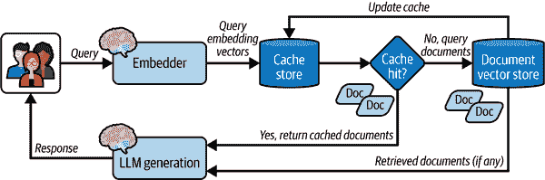
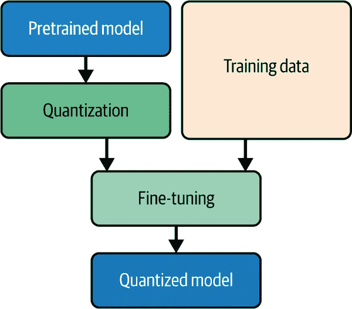
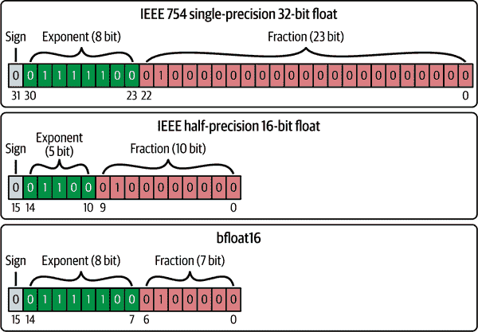
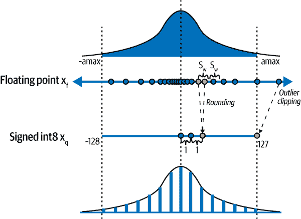

# 第十章\. 优化 AI 服务

在本章中，你将学习如何通过提示工程、模型量化和缓存机制进一步优化你的服务。

# 优化技术

优化 AI 服务的目标是提高输出质量或性能（延迟、吞吐量、成本等）。

与性能相关的优化包括以下内容：

+   使用批处理 API

+   缓存（关键字、语义、上下文或提示）

+   模型量化

与质量相关的优化包括以下内容：

+   使用结构化输出

+   提示工程

+   模型微调

让我们更详细地回顾每一个。

## 批处理

通常，你希望 LLM 同时处理多个条目。最明显的解决方案是每个条目提交多个 API 调用。然而，这种明显的方法可能成本高昂且速度慢，可能会导致你的模型提供商限制你的速率。

在这种情况下，你可以利用两种不同的技术通过 LLM 批处理你的数据：

+   更新你的结构化输出模式以同时返回多个示例

+   识别和使用为批处理设计的好模型提供商 API

第一个解决方案要求你更新你的 Pydantic 模型或模板提示以请求每个请求的输出列表。在这种情况下，你可以在少量请求中批处理你的数据，而不是每个条目一个请求。

第一个解决方案的实现示例如 示例 10-1 所示。

##### 示例 10-1\. 更新解析多个项目的结构化输出模式

```py
from pydantic import BaseModel

class BatchDocumentClassification(BaseModel):
    class Category(BaseModel):
        document_id: str
        category: list[str]

    categories: list[Category] 
```


更新 Pydantic 模型以包含一个 `Category` 模型的列表。

现在，你可以将新的模式与文档标题列表一起传递给 OpenAI 客户端，以在单个 API 调用中处理多个条目。然而，如果可用，使用批处理 API 可能是一个替代方案，也可能是最佳解决方案。

幸运的是，像 OpenAI 这样的模型提供商已经为这种用例提供了相关的 API。在底层，这些提供商可能会运行任务队列以在后台处理任何单个批处理作业，同时在你获取结果之前提供状态更新。

与直接使用标准端点相比，你将能够发送异步的请求组，成本更低（使用 OpenAI 可降低高达 50%1），享受更高的速率限制，并保证完成时间。批处理作业服务非常适合处理不需要即时响应的作业，例如在后台使用 OpenAI LLM 解析、分类或翻译大量文档。

要提交批处理作业，你需要一个 `jsonl` 文件，其中每行包含对 API 的单个请求的详细信息，如 示例 10-2 所示。同样，如本例所示，要创建 JSONL 文件，你可以遍历你的条目并动态生成文件。

##### 示例 10-2\. 从条目创建 JSONL 文件

```py
import json
from uuid import UUID

def create_batch_file(
    entries: list[str],
    system_prompt: str,
    model: str = "gpt-4o-mini",
    filepath: str = "batch.jsonl",
    max_tokens: int = 1024,
) -> None:
    with open(filepath, "w") as file:
        for _, entry in enumerate(entries, start=1):
            request = {
                "custom_id": f"request-{UUID()}",
                "method": "POST",
                "url": "/v1/chat/completions",
                "body": {
                    "model": model,
                    "messages": [
                        {
                            "role": "system",
                            "content": system_prompt,
                        },
                        {"role": "user", "content": entry},
                    ],
                    "max_tokens": max_tokens,
                },
            }
            file.write(json.dumps(request) + "\n")
```

一旦创建，您可以将文件提交给批处理 API 进行处理，如示例 10-3 所示。

##### 示例 10-3\. 使用 OpenAI 批处理 API 处理批处理作业

```py
from loguru import logger
from openai import AsyncOpenAI
from openai.types import Batch

client = AsyncOpenAI()

async def submit_batch_job(filepath: str) -> Batch:
    if ".jsonl" not in filepath:
        raise FileNotFoundError(f"JSONL file not provided at {filepath}")

    file_response = await client.files.create(
        file=open(filepath, "rb"), purpose="batch"
    )

    batch_job_response = await client.batches.create(
        input_file_id=file_response.id,
        endpoint="/v1/chat/completions",
        completion_window="24h",
        metadata={"description": "document classification job"},
    )
    return batch_job_response

async def retrieve_batch_results(batch_id: str):
    batch = await client.batches.retrieve(batch_id)
    if (
        status := batch.status == "completed"
        and batch.output_file_id is not None
    ):
        file_content = await client.files.content(batch.output_file_id)
        return file_content
    logger.warning(f"Batch {batch_id} is in {status} status")
```

您现在可以利用离线批处理端点一次处理多个条目，并保证有保证的周转时间和显著的成本节约。

除了利用结构化输出和批处理 API 优化您的服务外，您还可以利用缓存技术显著加快服务器的响应时间和资源成本。

## 缓存

在 GenAI 服务中，您通常会依赖于需要大量计算或长时间处理的数据/模型响应。如果您有多个用户请求相同的数据，重复相同的操作可能是浪费的。相反，您可以使用缓存技术来存储和检索频繁访问的数据，以通过加快响应时间、减少服务器负载、节省带宽和运营成本来优化您的服务。

例如，在一个公共 FAQ 聊天机器人中，用户提出的问题大多相同，您可能希望更长时间地重用缓存的响应。另一方面，对于更个性化和动态的聊天机器人，您可以频繁刷新（即，使缓存失效）缓存的响应。

###### 小贴士

您应该始终根据数据的性质和可接受的陈旧程度来考虑缓存刷新的频率。

对 GenAI 服务最相关的缓存策略包括：

+   关键字缓存

+   语义缓存

+   上下文或提示缓存

让我们更详细地回顾一下。

### 关键字缓存

如果您只需要一个简单的缓存机制来存储函数或端点响应，您可以使用 *关键字缓存*，它涉及根据输入查询的精确匹配作为键值对缓存响应。

在 FastAPI 中，`fastapi-cache` 等库可以帮助您通过几行代码在任意函数或端点上实现关键字缓存。FastAPI 缓存还为您提供了附加存储后端（如 Redis）以集中管理缓存存储的选项。

###### 小贴士

或者，您可以使用像 `cachetools` 这样的底层包来实现自己的自定义缓存机制，使用缓存存储。

要开始，您只需在应用程序生命周期内初始化和配置缓存系统，如示例 10-4 所示。您可以使用以下命令安装 FastAPI 缓存：

```py
$ pip install "fastapi-cache2[redis]"
```

##### 示例 10-4\. 配置 FastAPI 缓存生命周期

```py
from collections.abc import AsyncIterator
from contextlib import asynccontextmanager

from fastapi import FastAPI
from fastapi_cache import FastAPICache
from fastapi_cache.backends.redis import RedisBackend
from redis import asyncio as aioredis

@asynccontextmanager
async def lifespan(_: FastAPI) -> AsyncIterator[None]:
    redis = aioredis.from_url("redis://localhost")
    FastAPICache.init(RedisBackend(redis), prefix="fastapi-cache") 
    yield

app = FastAPI(lifespan=lifespan)
```

(#co_optimizing_ai_services_CO2-1)

使用 `RedisBackend` 初始化 `FastAPICache`，使其不解码响应，以便缓存数据以字节（二进制）形式存储。这是因为解码响应会通过改变原始响应格式来破坏缓存。

一旦配置了缓存系统，您就可以装饰您的函数或端点处理器以缓存它们的输出，如示例 10-5 所示。

##### 示例 10-5\. 函数和端点结果缓存

```py
from fastapi import APIRouter
from fastapi_cache.decorator import cache

router = APIRouter(prefix="/generate", tags=["Resource"])

@cache()
async def classify_document(title: str) -> str:
    ...

@router.post("/text")
@cache(expire=60) 
async def serve_text_to_text_controller():
    ...
```


`cache()` 装饰器必须始终放在最后。通过设置 `expires=60` 来在 60 秒内使缓存失效，以重新计算输出。

在 示例 10-5 中显示的 `cache()` 装饰器注入了 `Request` 和 `Response` 对象的依赖项，以便它可以向输出响应添加缓存控制头。这些缓存控制头指示客户端如何通过指定一组指令（即指令）在其端缓存响应。

这些是在发送响应时的一些常见缓存控制指令：

`max-age`

定义响应被视为新鲜的最大时间量（以秒为单位）

`no-cache`

强制重新验证，以便客户端检查与服务器之间的持续更新

`no-store`

完全阻止缓存

`private`

在私有缓存中存储响应（例如，浏览器中的本地缓存）

响应可以包含如 `Cache-Control: max-age=180, private` 这样的缓存控制头，以设置这些指令.^(2)

由于关键字缓存基于精确匹配，因此它更适合期望频繁重复匹配输入的函数和 API。然而，在接受变量用户查询的 GenAI 服务中，您可能需要考虑其他缓存机制，这些机制在返回缓存响应时依赖于输入的意义。这正是语义缓存可以证明有用的地方。

### 语义缓存

*语义缓存* 是一种缓存机制，根据相似输入返回存储的值。

在底层，系统使用编码器和嵌入向量来捕获输入的语义和意义。然后，它在存储的关键值对之间执行相似性搜索，以返回缓存响应。

与关键字缓存相比，相似输入可以返回相同的缓存响应。输入到系统中的内容不必完全相同才能被识别为相似。即使这些输入具有不同的句子结构或表述，或包含不准确之处，它们仍然会被捕获为相似，以携带相同的意义。并且，请求的是相同的响应。以下查询被认为是携带相同意图的相似查询：

+   您如何使用 FastAPI 构建生成性服务？

+   开发用于 GenAI 的 FastAPI 服务的流程是什么？

该缓存系统通过减少 API 调用至 [30–40%](https://oreil.ly/gjGz6)（即，60–70% 缓存命中率）来显著降低成本^(3)，具体取决于用例和用户规模的大小。例如，接收大量用户常见问题的问答 RAG 应用可以使用语义缓存将 API 调用减少 69%。

在典型的 RAG 系统中，有两个地方拥有缓存可以减少资源密集型和耗时操作：

+   *在 LLM 之前* 返回缓存响应而不是生成新的响应

+   *在向量存储之前*，用缓存文档丰富提示而不是搜索和检索新鲜文档

当将语义缓存组件集成到您的 RAG 系统中时，您应该考虑返回缓存响应是否会对您的应用程序的用户体验产生负面影响。例如，如果缓存 LLM 响应，由于它们的高度语义相似性，以下两个查询都会返回相同的响应，导致语义缓存系统将它们视为几乎相同：

+   用 100 个字总结此文本

+   用 50 个字总结此文本

这使得您的服务感觉像是在对查询没有响应。由于您可能仍然希望在您的应用程序中获取不同的 LLM 输出，我们将为您的 RAG 系统实现一个文档检索语义缓存。图 10-1 展示了完整的系统架构。



###### 图 10-1\. RAG 系统架构中的语义缓存

让我们先从从头开始实现语义缓存系统开始，然后我们将回顾如何将功能卸载到外部库，如 `gptcache`。

#### 从零开始构建语义缓存服务

您可以通过实现以下组件来实施一个语义缓存系统：

+   缓存存储客户端

+   文档向量存储客户端

+   嵌入模型

示例 10-6 展示了如何实现缓存存储客户端。

##### 示例 10-6\. 缓存存储客户端

```py
import uuid
from qdrant_client import AsyncQdrantClient, models
from qdrant_client.http.models import Distance, PointStruct, ScoredPoint

class CacheClient:
    def __init__(self):
        self.db = AsyncQdrantClient(":memory:") 
        self.cache_collection_name = "cache"

    async def initialize_database(self) -> None:
        await self.db.create_collection(
            collection_name=self.cache_collection_name,
            vectors_config=models.VectorParams(
                size=384, distance=Distance.EUCLID
            ),
        )

    async def insert(
        self, query_vector: list[float], documents: list[str]
    ) -> None:
        point = PointStruct(
            id=str(uuid.uuid4()),
            vector=query_vector,
            payload={"documents": documents},
        )
        await self.db.upload_points(
            collection_name=self.cache_collection_name, points=[point]
        )

    async def search(self, query_vector: list[float]) -> list[ScoredPoint]:
        return await self.db.search(
            collection_name=self.cache_collection_name,
            query_vector=query_vector,
            limit=1,
        )
```


初始化一个在内存上运行的 Qdrant 客户端，充当缓存存储。

一旦初始化缓存存储客户端，您可以通过遵循 示例 10-7 来配置文档向量存储。

##### 示例 10-7\. 文档存储客户端

```py
from qdrant_client import AsyncQdrantClient, models
from qdrant_client.http.models import Distance, ScoredPoint

documents = [...] 

class DocumentStoreClient:
    def __init__(self, host="localhost", port=6333):
        self.db_client = AsyncQdrantClient(host=host, port=port)
        self.collection_name = "docs"

    async def initialize_database(self) -> None:
        await self.db_client.create_collection(
            collection_name=self.collection_name,
            vectors_config=models.VectorParams(
                size=384, distance=Distance.EUCLID
            ),
        )
        await self.db_client.add(
            documents=documents, collection_name=self.collection_name
        )

    async def search(self, query_vector: list[float]) -> list[ScoredPoint]:
        results = await self.db_client.search(
            query_vector=query_vector,
            limit=3,
            collection_name=self.collection_name,
        )
        return results
```


将文档集合加载到 Qdrant 向量存储中。

在缓存和文档向量存储客户端准备就绪后，您现在可以实施语义缓存服务，如 示例 10-8 所示，包括计算嵌入和执行缓存搜索的方法。

##### 示例 10-8\. 语义缓存系统

```py
import time
from loguru import logger
from transformers import AutoModel

...

class SemanticCacheService:
    def __init__(self, threshold: float = 0.35):
        self.embedder = AutoModel.from_pretrained(
            "jinaai/jina-embeddings-v2-base-en", trust_remote_code=True
        )
        self.euclidean_threshold = threshold
        self.cache_client = CacheClient()
        self.doc_db_client = DocumentStoreClient()

    def get_embedding(self, question) -> list[float]:
        return list(self.embedder.embed(question))[0]

    async def initialize_databases(self):
        await self.cache_client.initialize_databases()
        await self.doc_db_client.initialize_databases()

    async def ask(self, query: str) -> str:
        start_time = time.time()
        vector = self.get_embedding(query)
        if search_results := await self.cache_client.search(vector):
            for s in search_results:
                if s.score <= self.euclidean_threshold: 
                    logger.debug(f"Found cache with score {s.score:.3f}")
                    elapsed_time = time.time() - start_time
                    logger.debug(f"Time taken: {elapsed_time:.3f} seconds")
                    return s.payload["content"]

        if db_results := await self.doc_db_client.search(vector): 
            documents = [r.payload["content"] for r in db_results]
            await self.cache_client.insert(vector, documents)
            logger.debug("Query context inserted to Cache.")
            elapsed_time = time.time() - start_time
            logger.debug(f"Time taken: {elapsed_time:.3f} seconds")

        logger.debug("No answer found in Cache or Database.")
        elapsed_time = time.time() - start_time
        logger.debug(f"Time taken: {elapsed_time:.3f} seconds")
        return "No answer available." 
```


设置一个相似度阈值。任何高于此阈值的分数都将被视为缓存命中。


如果没有缓存命中，查询文档存储。将检索到的文档与查询的向量嵌入作为缓存键进行缓存。


如果没有相关文档或缓存可用于给定的查询，则返回一个预设的答案。

现在您已经拥有了一个语义缓存服务，您可以通过遵循 示例 10-9 来使用它从内存中检索缓存文档。

##### 示例 10-9\. 在 RAG 系统中使用 Qdrant 实现语义缓存

```py
async def main():
    cache_service = SemanticCacheService()
    query_1 = "How to build GenAI services?"
    query_2 = "What is the process for developing GenAI services?"

    cache_service.ask(query_1)
    cache_service.ask(query_2)

asyncio.run(main())

# Query 1:
# Query added to Cache.
# Time taken: 0.822 seconds

# Query 2:
# Found cache with score 0.329
# Time taken: 0.016 seconds
```

您现在应该更好地理解了如何使用向量数据库客户端实现您自己的自定义语义缓存系统。

#### 使用 GPT 缓存的语义缓存

如果你不需要从头开始开发自己的语义缓存服务，你也可以使用模块化的 `gptcache` 库，它为你提供了交换各种存储、缓存和嵌入组件的选项。

要配置 `gptcache` 的语义缓存，首先需要安装该包：

```py
$ pip install gptcache
```

然后在应用程序启动时加载系统，如示例 10-10 所示。

##### 示例 10-10\. 配置 GPT 缓存

```py
from contextlib import asynccontextmanager
from typing import AsyncIterator

from fastapi import FastAPI
from gptcache import Config, cache
from gptcache.embedding import Onnx
from gptcache.processor.post import random_one
from gptcache.processor.pre import last_content
from gptcache.similarity_evaluation import OnnxModelEvaluation

@asynccontextmanager
async def lifespan(_: FastAPI) -> AsyncIterator[None]:
    cache.init(
        post_func=random_one, 
        pre_embedding_func=last_content, 
        embedding_func=Onnx().to_embeddings, 
        similarity_evaluation=OnnxModelEvaluation(), 
        config=Config(similarity_threshold=0.75), 
    )
    cache.set_openai_key() 
    yield

app = FastAPI(lifespan=lifespan)
```

(#co_optimizing_ai_services_CO7-1)

选择一个后处理回调函数以从返回的缓存项中随机选择一个项目。

(#co_optimizing_ai_services_CO7-2)

选择一个预嵌入回调函数以使用最后一个查询来设置新的缓存。

(#co_optimizing_ai_services_CO7-3)

使用 ONNX 嵌入模型来计算嵌入向量。

(#co_optimizing_ai_services_CO7-4)

使用 `OnnxModelEvaluation` 来计算缓存项与给定查询之间的相似度分数。

(#co_optimizing_ai_services_CO7-5)

设置缓存配置选项，例如相似度阈值。

(#co_optimizing_ai_services_CO7-6)

为 GPT 缓存提供一个 OpenAI 客户端 API 密钥，以便自动在 LLM API 响应上执行语义缓存。

一旦 `gptcache` 初始化，它将与你的应用程序中的 OpenAI LLM 客户端无缝集成。现在你可以进行多个 LLM 查询，如示例 10-11 所示，知道 `gptcache` 将会缓存你的 LLM 响应。

##### 示例 10-11\. 使用 GPT 缓存的语义缓存

```py
import time
from openai import OpenAI
client = OpenAI()

question = "what's FastAPI"
for _ in range(2):
    start_time = time.time()
    response = client.chat.completions.create(
        model="gpt-4o",
        messages=[{"role": "user", "content": question}],
    )
    print(f"Question: {question}")
    print("Time consuming: {:.2f}s".format(time.time() - start_time))
    print(f"Answer: {response.choices[0].message.content}\n")
```

如示例 10-11 所示，使用外部库如 `gptcache` 使得实现语义缓存变得简单直接。

一旦缓存系统启动并运行，你可以调整*相似度阈值*来调整系统的缓存命中率。

#### 相似度阈值

在构建语义缓存服务时，你可能需要根据提供的查询调整相似度阈值，以实现高缓存命中率并保持准确性。你可以参考图 10-2 中显示的[语义缓存集群的交互式可视化](https://semanticcachehit.com)，以更好地理解相似度阈值的概念。

在图 10-2 中增加阈值值将导致连接度较低的图，而最小化可能产生假阳性。因此，你可能需要进行一些实验来微调你应用的相似度阈值。


###### 图 10-2\. 语义缓存的可视化（来源：[semanticcachehit.com](https://semanticcachehit.com)）

#### 驱逐策略

与缓存相关的另一个概念是*驱逐策略*，它控制当缓存机制达到最大容量时的缓存行为。选择合适的驱逐策略应适合你的特定用例。

###### 小贴士

由于缓存存储的大小通常有限，你可以在你实现的 示例 10-8 中的 `SemanticCachingService` 中添加一个 `evict()` 方法。

表 10-1 展示了你可以选择的一些淘汰策略。

表 10-1\. 淘汰策略

| 策略 | 描述 | 用例 |
| --- | --- | --- |
| 先进先出 (FIFO) | 移除最旧的项 | 当所有项具有相同的优先级时 |
| 最近最少使用 (LRU) | 跟踪缓存使用情况随时间变化，并移除最近最少访问的项目 | 当最近访问的项目更有可能再次被访问时 |
| 最少使用 (LFU) | 跟踪缓存使用情况随时间变化，并移除最少访问的项目 | 当应首先移除较少使用的项目时 |
| 最近最常使用 (MRU) | 跟踪缓存使用情况随时间变化，并移除最近访问的项目 | 很少使用，当最近访问的项目不太可能再次被访问时 |
| 随机替换 (RR) | 从缓存中随机移除一个项目 | 简单快捷，在不影响性能的情况下使用 |

选择合适的淘汰策略将取决于你的用例和应用需求。通常，你可以从 LRU 策略开始，然后再切换到其他替代方案。

现在，你应该更有信心实现适用于文档检索或模型响应的语义缓存机制。接下来，让我们了解上下文或提示缓存，它根据输入优化对模型的查询。 

### 上下文/提示缓存

*上下文缓存*，也称为 *提示缓存*，是一种适用于在小型请求中重复引用大量上下文场景的缓存机制。它旨在重用频繁使用的提示的预计算注意力状态，从而消除每次新请求时对整个输入上下文的冗余重新计算的需求。

当你的服务涉及以下情况时，你应该考虑使用上下文缓存：

+   具有广泛系统指令和长对话的聊天机器人

+   对长视频文件进行重复分析

+   对大型文档集进行重复查询

+   经常进行代码仓库分析或错误修复

+   文档摘要、与书籍、论文、文档、播客文稿和其他长篇内容进行交流

+   在提示中提供大量示例（即，上下文学习）

这种类型的缓存可以帮助你通过缓存大型上下文标记来显著减少标记使用成本。据 Anthropic 称，提示缓存可以将成本降低高达 90%，并将延迟降低高达 85%。

提出这种技术的 [提示缓存论文](https://oreil.ly/augpd) 的作者还声称：

> 我们发现，提示缓存显著降低了首次标记的时间延迟，尤其是在基于文档的问答和推荐等较长的提示中。改进范围从基于 GPU 推理的 8 倍到基于 CPU 推理的 60 倍，同时保持输出准确性，且无需修改模型参数。

图 10-3 可视化了上下文缓存系统架构。


###### 图 10-3\. 上下文缓存的系统架构

在撰写本文时，OpenAI 自动为所有 API 请求实现提示缓存，无需进行任何代码更改或额外费用。示例 10-12 展示了在使用 Anthropic API 时如何使用提示缓存。

##### 示例 10-12\. 使用 Anthropic API 进行上下文/提示缓存

```py
from anthropic import Anthropic

client = Anthropic()

response = client.messages.create(
    model="claude-3-7-sonnet-20250219", 
    max_tokens=1024,
    system=
        {
            "type": "text",
            "text": "You are an AI assistant",
        },
        {
            "type": "text",
            "text": "<the entire content of a large document>",
            "cache_control": {"type": "ephemeral"}, ![2
        },
    ],
    messages=[{"role": "user", "content": "Summarize the documents in ..."}],
)
print(response)
```

(#co_optimizing_ai_services_CO8-1)

提示缓存仅适用于包括 Claude 3.5 Sonnet、Claude 3 Haiku 和 Claude 3 Opus 在内的少数模型。

(#co_optimizing_ai_services_CO8-2)

使用`cache_control`参数在多个 API 调用之间重用大文档内容，而无需每次都处理它。

在幕后，Anthropic 客户端将`anthropic-beta: prompt-caching-2024-07-31`添加到请求头中。

在撰写本文时，`ephemeral`是唯一支持的缓存类型，对应 5 分钟的缓存生命周期。

###### 注意

一旦您采用上下文缓存，您就在请求中引入了状态性，通过在它们之间保留标记。这意味着您在一个请求中提交的数据将影响后续请求，因为模型提供者服务器可以使用缓存的上下文来保持交互之间的连续性。

使用 Gemini API 的上下文缓存功能，您只需向模型提供一次内容，缓存输入标记，并在未来的请求中引用这些缓存的标记。

使用这些缓存的标记可以为您节省大量费用，如果您避免在高量级上重复传递相同的标记语料库。缓存成本将取决于输入标记的大小和期望的 TTL 存储时长。

###### 小贴士

当您缓存一组标记时，您可以指定 TTL 持续时间，即标记在自动删除之前应存在的时长。默认情况下，TTL 通常设置为 1 小时。

你可以在示例 10-13 中看到如何使用缓存系统指令。你还需要 Gemini API Python SDK：

```py
$ pip install google-generativeai
```

##### 示例 10-13\. 使用 Google Gemini API 进行上下文缓存

```py
import datetime
import google.generativeai as genai
from google.generativeai import caching

genai.configure(api_key="your_gemini_api_key")

corpus = genai.upload_file(path="corpus.txt")
cache = caching.CachedContent.create(
    model='models/gemini-1.5-flash-001',
    display_name='fastapi', 
    system_instruction=(
        "You are an expert AI engineer, and your job is to answer "
        "the user's query based on the files you have access to."
    ),
    contents=[corpus], 
    ttl=datetime.timedelta(minutes=5),
)

model = genai.GenerativeModel.from_cached_content(cached_content=cache)
response = model.generate_content(
    [
        (
            "Introduce different characters in the movie by describing "
            "their personality, looks, and names. Also list the timestamps "
            "they were introduced for the first time."
        )
    ]
)
```

(#co_optimizing_ai_services_CO9-1)

提供一个显示名称作为缓存键或标识符。

(#co_optimizing_ai_services_CO9-2)

将语料库传递给上下文缓存系统。上下文缓存的最小大小为 32,768 个标记。

如果您运行示例 10-13 并打印`response.usage_metadata`，您应该收到以下输出：

```py
>> print(response.usage_metadata)

prompt_token_count: 696219
cached_content_token_count: 696190
candidates_token_count: 214
total_token_count: 696433
```

注意比较`prompt_token_count`和`cached_content_token_count`时，现在有多少`prompt_token_count`被缓存了。`candidates_token_count`指的是来自模型的输出或响应标记的数量，这不受缓存系统的影响。

###### 警告

Gemini 模型在缓存标记和常规输入标记之间没有区别。缓存的内容将被添加到提示的前面。这就是为什么使用缓存时提示标记计数不会减少。

使用上下文缓存，你不会看到响应时间的显著减少，但可以显著降低运营成本，因为你避免了重新发送大量的系统提示和上下文标记。因此，这种缓存策略最适合当你有一个大上下文要处理时——例如，当你批量处理包含大量指令和示例的文件时。

###### 注意

使用相同的上下文缓存和提示不能保证模型响应的一致性，因为 LLM 的响应是非确定性的。上下文缓存不会缓存任何输出。

上下文缓存仍然是研究的一个活跃领域。如果你想避免任何供应商锁定，这个领域已经有一些进展，例如开源工具[*MemServe*](https://oreil.ly/PXm6B)，它通过弹性内存池实现了上下文缓存。

除了缓存之外，你还可以通过使用如*模型量化*等技术来审查你的选项，以减少模型大小，从而加快响应时间。

## 模型量化

如果你打算自己提供 LLM 等模型的服务，你应该考虑如果可能的话对模型进行*量化*（即压缩/缩小）。通常，开源模型存储库也会提供量化版本，你可以直接下载和使用，而无需自己进行量化过程。

*模型量化*是对模型权重和激活的调整过程，其中通过使用原始参数分布上的缩放因子进行微调操作，将高精度模型参数统计投影到低精度值。然后你可以使用低精度执行所有关键推理操作，之后可以将输出转换为高精度，以保持质量同时提高性能。

降低精度也会降低内存存储需求，理论上降低能耗，并通过整数运算加速矩阵乘法等操作。这也使得模型能够在仅支持整数数据类型的嵌入式设备上运行。

图 10-4 展示了完整的量化过程。



###### 图 10-4\. 量化过程

你可以在 GPU 内存消耗上节省超过几个 GB，因为低精度数据类型，如 8 位整数，每个参数所需的 RAM 比 32 位浮点数据类型少得多。

### 精度与质量权衡

图 10-5 比较了未量化和量化的模型。


###### 图 10-5\. 量化

由于每个高精度的 32 位浮点参数消耗 4 字节 GPU 内存，一个 1B 参数的模型仅用于推理就需要 4 GB 的内存。如果您计划重新训练或微调相同的模型，您至少需要 24 GB 的 GPU VRAM。这是因为每个参数还需要存储诸如梯度、训练优化器状态、激活和临时内存空间等信息，总共消耗额外的 24 字节。这估计比仅加载模型权重所需的内存需求高 6 倍。因此，同样的 1B 模型将需要 24 GB 的 GPU，而即使是最好的、最昂贵的消费级显卡，如 NVIDIA RTX 4090，也可能难以满足这一需求。

除了标准的 32 位浮点数外，您可以选择以下任何一种格式：

+   *16 位浮点数 (FP16)* 可以将内存使用量减半，而对模型输出质量的影响不大。

+   *8 位整数 (INT8)* 在内存上提供巨大的节省，但质量损失很大。

+   *16 位脑浮点数 (BFLOAT16)* 与 FP32 具有相似的范围，平衡了内存和质量之间的权衡。

+   *4 位整数 (INT4)* 在内存效率和计算精度之间提供平衡，使其适合低功耗设备。

+   *1 位整数 (INT1)* 使用最低精度数据类型，以最大程度地减少模型大小。目前正在进行创建高质量 [1 位 LLMs](https://oreil.ly/QH9nH) 的研究。

为了比较，表 10-2 展示了量化 Llama 家族模型时模型大小的减少。

表 10-2\. 量化对 Llama 模型大小的影响^(a)

| 模型 | 原始 | FP16 | 8 位 | 6 位 | 4 位 | 2 位 |
| --- | --- | --- | --- | --- | --- | --- |
| Llama 2 70B | 140 GB | 128.5 GB | 73.23 GB | 52.70 GB | 36.20 GB | 28.59 GB |
| Llama 3 8B | 16.07 GB | 14.97 GB | 7.96 GB | 4.34 GB | 4.34 GB | 2.96 GB |
| ^(a) 来源：[Llama.cpp GitHub 仓库](https://oreil.ly/9iYtL) 和 [Tom Jobbins 的 Hugging Face Llama 2 70B 模型卡片](https://oreil.ly/BMDtR) |

###### 小贴士

除了用于适应模型的 GPU VRAM 外，您还需要额外的 5 到 8 GB GPU VRAM 来处理模型加载时的开销。

根据当前的研究状况，仅使用整数数据类型 INT4 和 INT1 来保持精度是一个挑战，而使用 INT32 或 FP16 的性能提升并不显著。因此，最流行的低精度数据类型是用于推理的 INT8。

根据研究 [`oreil.ly/C7Lz3`](https://oreil.ly/C7Lz3)，使用仅整数算术进行推理将比使用浮点数更高效。然而，将浮点数量化为整数可能很复杂。例如，INT8 只能表示 256 个值，而 float32 可以表示广泛的值。

### 浮点数

要了解为什么将 32 位浮点数投影到其他格式可以节省如此多的 GPU 内存，让我们看看它是如何分解的。

一个 32 位浮点数由以下类型的位组成：

+   *符号位* 表示一个数是正数还是负数

+   *指数位* 控制数字的量级

+   *尾数位* 保留实际数字，以确定其精度（也称为 *分数位*）

您可以在 图 10-6 中看到上述浮点数的位可视化。



###### 图 10-6\. 32 位浮点数、16 位浮点数和 bfloat16 数字中的位

当您将 FP32 数字投影到其他格式时，实际上是在将其挤压到更小的范围内，丢失了大部分尾数位，并调整了指数位，但精度损失不大。您可以通过参考 图 10-7 来看到这种现象的实际操作。



###### 图 10-7\. 将浮点数量化为整数的量化过程

事实上，[关于预训练 LLM 量化策略的研究](https://oreil.ly/Swfz7) 表明，具有 4 位量化的 LLM 可以保持与未量化版本相似的性能。然而，虽然量化可以节省内存，但它也可能降低 LLM 的推理速度。

### 如何量化预训练的 LLM

量化是通过权重调整来压缩大型模型的过程。有一种称为 [*GPTQ*](https://oreil.ly/rHYKZ) 的技术可以在大约 4 个 GPU 小时内量化具有 1750 亿参数的 LLM，将权重位宽降低到每权重 3 或 4 位，与未压缩模型相比，精度下降可以忽略不计。

Hugging Face `transformers` 和 `optimum` 库的作者与 `auto-gptq` 库的开发者紧密合作，为开源 LLM 提供了一个简单的 API，用于应用 GPTQ 量化。Optimum 是一个库，它提供了使用不同工具进行量化的 API。

使用 GPTQ 量化，您可以将您喜欢的语言模型量化为 8、4、3 或甚至 2 位，而性能下降不大，同时保持大多数 GPT 硬件支持的更快推理速度。您可以通过 示例 10-14 了解如何在您的 GPU 上量化预训练模型。

运行 示例 10-14 所需安装的依赖项包括以下内容：

```py
$ pip install auto-gptq optimum transformers accelerate
```

##### 示例 10-14\. 使用 Hugging Face 和 AutoGPTQ 库进行 GPTQ 模型量化

```py
import torch
from optimum.gptq import GPTQQuantizer
from transformers import AutoModelForCausalLM, AutoTokenizer

model_name = "facebook/opt-125m" 
tokenizer = AutoTokenizer.from_pretrained(model_name)
model = AutoModelForCausalLM.from_pretrained(
    model_name, torch_dtype=torch.float16
)

quantizer = GPTQQuantizer(
    bits=4,
    dataset="c4", 
    block_name_to_quantize="model.decoder.layers", 
    model_seqlen=2048, 
)
quantized_model = quantizer.quantize_model(model, tokenizer)
```


在量化之前，加载 `facebook/opt-125m` 预训练模型的 `float16` 版本。


使用 `c4` 数据集校准量化。


仅量化模型的解码器层块。


使用 `2048` 的模型序列长度来处理数据集。

###### 提示

作为参考，一个 175B 的模型在 NVIDIA A100 上进行量化需要 4 个 GPU 小时。然而，值得在 Hugging Face 模型存储库中搜索预量化模型，因为你可能会发现有人已经完成了这项工作。

现在你已经了解了性能优化技术，让我们探索如何使用结构化输出等方法来提高你的 GenAI 服务的质量。

## 结构化输出

基础模型，如 LLM，可以用作数据管道的一部分或连接到下游应用程序。例如，你可以使用这些模型从文档中提取和解析信息，或者生成可以在其他系统上执行的其他代码。

你可以要求 LLM 提供包含 JSON 信息的文本响应。然后你必须使用正则表达式和 Pydantic 等工具提取和解析这个 JSON 字符串。然而，无法保证模型总是会遵循你的指示。由于你的下游系统可能依赖于 JSON 输出，它们可能会抛出异常并错误地处理无效输入。

已经发布了几个实用程序包，如 Instructor，通过使用模式和执行多个 API 调用来提高 LLM 响应的鲁棒性，从而在幕后使用各种提示模板来达到期望的输出。虽然这些解决方案提高了鲁棒性，但它们也由于后续对模型提供商的 API 调用而给你的解决方案增加了显著的成本。

最近，模型提供商在向模型进行 API 调用时，通过提供模式来添加了一个请求结构化输出的功能，正如你在示例 10-15 中看到的那样。这有助于减少你必须自己做的提示模板工作，并旨在提高模型在返回响应时与你的意图的*一致性*。

###### 警告

在撰写本文时，只有最新的 OpenAI SDK 支持使用 Pydantic 模型来启用结构化输出。

##### 示例 10-15\. 结构化输出

```py
from openai import AsyncOpenAI
from pydantic import BaseModel, Field

client = AsyncOpenAI()

class DocumentClassification(BaseModel): 
    category: str = Field(..., description="The category of the classification")

async def get_document_classification(
    title: str,
) -> DocumentClassification | str | None:
    response = await client.beta.chat.completions.parse(
        model="gpt-4o",
        messages=[
            {
                "role": "system",
                "content": "classify the provided document into the following: ...",
            },
            {"role": "user", "content": title},
        ],
        response_format=DocumentClassification, 
    )

    message = response.choices[0].message
    return message.parsed if message.parsed is not None else message.refusal
```

(#co_optimizing_ai_services_CO11-1)

为结构化输出指定一个 Pydantic 模型。

(#co_optimizing_ai_services_CO11-2)

在进行 API 调用时，将定义的模式提供给模型客户端。

如果你的模型提供商不支持原生结构化输出，你仍然可以利用模型的聊天完成功能来提高结构化输出的鲁棒性，如示例 10-16 所示。

##### 示例 10-16\. 基于聊天完成的预填充结构化输出

```py
import json
from loguru import logger
from openai import AsyncOpenAI
client = AsyncOpenAI()

system_template = """
Classify the provided document into the following: ...

Provide responses in the following manner json: {"category": "string"}
"""

async def get_document_classification(title: str) -> dict:
    response = await client.chat.completions.create(
        model="gpt-4o",
        max_tokens=1024, 
        messages=
            {"role": "system", "content": system_template},
            {"role": "user", "content": title},
            {
                "role": "assistant",
                "content": "The document classification JSON is {", ![2
            },
        ],
    )
    message = response.choices[0].message.content or ""
    try:
        return json.loads("{" + message[: message.rfind("}") + 1]) 
    except json.JSONDecodeError: 
        logger.warning(f"Failed to parse the response: {message}")
    return {"error": "Refusal response"}
```

(#co_optimizing_ai_services_CO12-1)

限制输出令牌以提高结构化响应的鲁棒性和速度，并降低成本。

(#co_optimizing_ai_services_CO12-2)

跳过序言部分，直接通过预填充助手响应并包含一个 `{` 字符来返回 JSON。

(#co_optimizing_ai_services_CO12-3)

恢复预填充的 `{` 符号，然后找到闭合的 `}` 符号并提取 JSON 子串。


处理响应中不存在 JSON 的情况——例如，如果出现拒绝。

遵循上述技术应该有助于提高你利用 LLM 作为组件的数据管道的鲁棒性。

## 提示工程

提示工程是构建和优化查询以生成模型以产生最有用和最优化输出的实践。如果没有优化提示，你可能不得不微调模型或从头开始训练一个模型以优化输出质量。

许多人认为该领域缺乏科学严谨性，不能将其视为一个工程学科。然而，当优化提示以获得最佳质量输出时，你可以从工程角度来处理这个问题。

与你与他人沟通以完成任务的方式类似，通过优化的提示，你可以最有效地与模型沟通你的意图，以提高获得你想要的响应的机会。因此，提示不仅是一个工程问题，也是一个沟通问题。一个模型可以比作一个经验丰富的知识渊博的同事，但领域知识有限，愿意帮助你，但需要你提供详细的指令，可能还需要一些示例来遵循和模式匹配。

如果你的提示模糊且通用，你也会得到一个平均的响应。

另一种思考这个优化问题的方式是将模型提示的任务与编程进行比较。你不必亲自编写代码，而是有效地“编码”一个模型，使其成为更大应用程序或数据管道中一个良好集成的组件。你可以采用测试驱动开发（TDD）方法，并完善你的提示，直到测试通过。或者，尝试不同的模型，看看哪一个*对齐*其输出与你的意图最佳。

###### 注意

最大化模型*对齐*仍然是许多模型提供商的一个高优先级目标，以便他们的模型输出最好地满足用户的意图。

### 提示模板

如果你的系统指令不系统、不清晰，并且不遵循最佳提示实践，你可能会错失潜在的质量和性能优化。

至少，你应该有明确的系统提示，为模型提供具体的任务。最佳实践是遵循一个系统化的模板。例如，根据*角色、上下文和任务*（RCT）模板起草模型说明：

角色

描述了在给定场景和任务的情况下模型应该如何表现。研究表明，为 LLM 指定角色往往会显著影响其输出。例如，如果你让它扮演小学教师的角色，模型在评分作文时可能会更加宽容。没有特定的角色，模型可能会假设你希望评分遵循大学水平的学术标准。

###### 注意

你甚至可以进一步扩展模型的角色，并为模型详细描述一个 *角色扮演*，以便模型采用。使用角色扮演，模型将确切知道如何表现和做出预测，因为它对角色应该包含的内容有更多的了解。

上下文

设置场景，描绘画面，并提供模型可以用来作为预测参考的相关和有用信息。如果没有明确的上下文，模型只能使用隐含的上下文，其中包含其训练数据的平均信息。在 RAG 应用中，上下文可以是系统提示与从知识库检索到的文档片段的串联。

任务

提供了在给定上下文和角色的情况下，你希望模型执行的操作的明确说明。在描述任务时，确保你将模型视为一个聪明且知识渊博的学徒，随时准备采取行动，但需要高度清晰且明确的指示来遵循，可能还需要一些示例。

按照上述系统模板，你应该以最小的努力提高模型输出的质量。

### 高级提示技术

除了提示基础之外，你还可以使用更高级的技术，这些技术可能更适合你的用例。根据对提示技术的 [最近系统调查](https://oreil.ly/xynPC)，你可以将 LLM 提示分为以下几类：

+   上下文学习

+   思维生成

+   分解

+   集成

+   自我批评

+   代理

让我们更详细地回顾一下。

#### 上下文学习

基础模型（如 LLM）与传统机器学习模型区别开来的特点是，它们能够对动态输入做出响应，而无需不断进行微调或重新训练。

当你向 LLM 提供系统指令时，你可以额外提供几个示例（即射击），以指导输出生成。

[*零样本提示*](https://oreil.ly/3F4wb) 指的是一种提示方法，它不指定参考示例，但模型仍然可以成功完成给定的任务。如果模型在没有参考示例的情况下遇到困难，你可能需要使用 [*少量样本提示*](https://oreil.ly/pOSj8)，其中你提供少量示例。还有一些用例，你希望使用 *动态少量样本* 提示，其中你动态地从数据库或向量存储中获取示例。

指定示例的提示方法也被称为 *上下文学习*。你实际上是在调整模型的输出以适应你的示例和给定的任务，而不需要修改其模型权重/参数，而其他 ML 模型则需要调整其权重。

这就是 LLM 和基础模型之所以如此强大的原因，因为它们并不总是需要调整权重来适应你提供的数据和任务。你可以通过参考 表 10-3 来了解几种上下文学习技术。

表 10-3\. 上下文学习提示技术

| 提示技术 | 示例 | 应用场景 |
| --- | --- | --- |
| 零样本 | 概括以下内容… | 摘要、无特定训练示例的问答 |
| 少样本 | 根据以下示例对文档进行分类：[示例] | 文本分类、情感分析、少量示例的数据提取 |
| 动态少样本 | 根据以下示例对以下文档进行分类：<基于查询从向量存储中注入示例> | 个性化响应、复杂问题解决 |

在上下文中学习的提示简单、有效，是完成各种任务的绝佳起点。对于更复杂的任务，您可以使用更高级的提示方法，如思维生成、分解、集成、自我批评或代理方法。

#### 思维生成

思维生成技术，如[思维链（CoT）](https://oreil.ly/BWUYQ)，已被证明可以显著提高大型语言模型进行复杂推理的能力。

在 COT 提示中，您要求模型在提供响应时解释其思维过程和推理。CoT 的变体包括零样本或[少样本 CoT](https://oreil.ly/1gjSH)，具体取决于您是否提供示例。一种更高级的思维生成技术是[思维线索（ThoT）](https://oreil.ly/1KyO4)，它可以系统地分割和分析混乱且非常复杂的信息或任务。

表 10-4 列出了思维生成提示技术。

表 10-4. 思维生成提示技术

| 提示技术 | 示例 | 应用场景 |
| --- | --- | --- |
| 零样本思维链（CoT） | 逐步思考… | 数学问题解决、逻辑推理和多步骤决策。 |
| 少样本 CoT | 逐步思考…以下是一些示例：[示例] | 可以通过少量示例引导模型表现更好的场景，例如细微文本分类、复杂问答和创意写作提示。 |
| 思维线索（ThoT） | 逐步引导我理解问题，在过程中总结和分析… | 在多个交互中保持上下文，例如对话系统、互动故事讲述和长篇内容生成。 |

#### 分解

分解提示技术侧重于将复杂任务分解成更小的子任务，以便模型可以逐步、逻辑地处理它们。您可以在思维生成的同时尝试这些方法，以确定哪些方法对您的应用场景效果最佳。

这些是最常见的分解提示技术：

[从少到多](https://oreil.ly/HmsSN)

通过逻辑分解将复杂问题分解成更小的问题，而不需要解决它们。然后您可以重新提示模型逐一解决每个任务。

[计划并解决](https://oreil.ly/aWTzf)

给定一个任务，要求制定一个计划，然后请求模型解决它。

[思维树（ToT）](https://oreil.ly/IZdj1)

创建一个树搜索问题，其中任务被分解成多个步骤分支，就像树一样。然后，重新提示模型评估和解决每个步骤分支。

表 10-5 展示了这些分解技术。

表 10-5\. 分解提示技术

| 提示技术 | 例子 | 用例 |
| --- | --- | --- |
| 从少到多 | 将……的任务分解成更小的任务。 | 复杂问题解决、项目管理、任务分解 |
| 计划并解决 | 制定……的计划…… | 算法开发、软件设计、战略规划 |
| 思维树（ToT） | 为选择……创建决策树…… | 决策、具有多个解决方案的问题解决、具有替代方案的战略规划 |

#### 集成

*集成* 是使用多个提示来解决相同问题，然后将响应汇总为最终输出的过程。您可以使用相同或不同的模型生成这些响应。

集成背后的主要思想是通过提高准确性来降低 LLM 输出的方差，以换取更高的使用成本。

众所周知的集成提示技术包括以下内容：

[自我一致性](https://oreil.ly/_85WS)

使用多数投票生成多个推理路径，并选择最一致的输出作为最终结果。

[混合推理专家（MoRE）](https://oreil.ly/xllKs)

通过结合具有专门提示的多个 LLM 的输出，以提高响应质量。每个 LLM 都作为专注于不同推理任务的领域专家，例如事实推理、逻辑简化、常识检查等。

[演示集成（DENSE）](https://oreil.ly/lPEPz)

从数据中创建多个少量样本提示，然后通过汇总响应生成最终输出。

[提示改写](https://oreil.ly/yP_ka)

通过措辞将原始提示制定成多个变体。

表 10-6 展示了这些集成技术的示例和用例。

表 10-6\. 集成提示技术

| 提示技术 | 例子 | 用例 |
| --- | --- | --- |
| 自我一致性 | 提示 #1（多次运行）：让我们一步一步思考并完成以下任务……提示 #2：从以下响应中选择最佳/最常见的一个，通过使用……评分它们…… | 减少算术、常识任务和符号推理任务中的错误或偏差 |
| 混合推理专家（MoRE） | 提示 #1（为每位专家运行）：您是……的审稿人，根据……评分以下内容……提示 #2：根据一致性评分选择最佳专家答案…… | 考虑专业知识领域或领域 |
| 演示集成（DENSE） | 为翻译此文本创建多个少量样本示例，并汇总最佳响应。为总结这篇文章生成几个少量样本提示，并组合输出。 |

+   提高输出可靠性

+   聚合不同观点

|

| 提示改写 | 提示 #1a：重述此提案…提示 #1b：澄清此提案…提示 #1c：对此提案进行调整…提示 #2：根据以下标准从以下响应中选择最佳提案… |
| --- | --- |

+   探索不同解释

+   为集成进行数据增强

|

#### 自我批评

*自我批评*提示技术侧重于使用模型作为 AI 法官、评估者或审稿人，无论是进行自我检查还是评估其他模型的输出。第一个提示的批评或反馈然后可以用于改进后续提示中的响应质量。

这些是几种自我批评提示策略：

[自我校准](https://oreil.ly/_4YEr)

要求 LLM 评估一个响应/答案相对于问题/答案的正确性。

[自我优化](https://oreil.ly/bTQJI)

通过自我检查和提供反馈迭代地细化响应。

[反思思维链（RCoT）](https://oreil.ly/6ojtr)

从生成的答案中重建问题，然后生成原始问题和重建问题之间的细粒度比较，以识别不一致。

[自我验证](https://oreil.ly/Fz3JH)

使用 CoT 技术生成潜在解决方案，然后通过遮蔽问题的一部分并供应每个答案来对每个答案进行评分。

[验证链（COVE）](https://oreil.ly/WrrLP)

创建相关查询/问题列表以帮助验证答案/响应的正确性。

[累积推理](https://oreil.ly/3Hb-6)

生成响应查询的潜在步骤，然后要求模型接受/拒绝每个步骤。最后，检查它是否到达了最终答案以终止过程；否则，重复此过程。

您可以在表 10-7 中看到每种自我批评提示技术的示例。

表 10-7\. 自我批评提示技术

| 提示技术 | 示例 | 用例 |
| --- | --- | --- |
| 自我校准 | 评估以下响应的正确性：[response] 对于以下问题：[question] | 测量答案的信心以接受或修改原始答案。 |
| 自我优化 | 提示 #1：你对响应的反馈是什么…提示 #2：使用反馈[Feedback]，在以下方面优化你的响应… | 推理、编码和生成任务。 |
| 反思思维链（RCoT） | 提示 #1：从以下答案中重建问题…提示 #2：生成这些查询之间的细粒度比较… | 识别不一致并修改答案。 |
| 自我验证 | 提示 #1（运行多次）：让我们一步步思考 - 生成以下问题的解决方案…提示 #2：根据[遮蔽问题]对每个解决方案进行评分… | 改善推理任务。 |
| 验证链（COVE） | 提示 #1：回答以下问题…提示 #2：提出相关问题以检查此响应：…提示 #3（针对每个新的相关问题运行）：回答以下问题：…提示 #4：根据以下信息，选择最佳答案… | 问题回答和文本生成任务。 |
| 累积推理 | 提示 #1：概述响应查询的步骤：…提示 #2：检查以下计划并接受/拒绝与响应查询相关的步骤：…提示 #3：检查你已根据以下信息得出最终答案… | 复杂查询、逻辑推理和数学问题的逐步验证。 |

#### 代理性

你可以将到目前为止讨论的提示技术进一步发展，并添加对具有复杂评估算法的外部工具的访问。这个过程将 LLMs 特化为*代理*，允许它们制定计划、采取行动，并使用外部系统。

提示或*提示序列（链）*驱动具有工程重点的代理系统，从 LLMs 中创建类似代理的行为。这些代理工作流程通过在连接到 GenAI 模型的系统上执行操作来为用户提供服务，这些模型主要是 LLMs。工具，无论是*符号性*的，如计算器，还是*神经性*的，如另一个 AI 模型，都是代理系统的核心组件。

###### 小贴士

如果你创建了一个由多个模型调用组成的管道，其中一个输出被转发到同一模型或不同模型作为输入，你就构建了一个*提示链*。原则上，当你利用提示链时，你正在使用 CoT 提示技术。

一些代理提示技术包括：

[模块化推理、知识和语言（MRKL）](https://oreil.ly/aWeQu)

由一个使用多个工具获取和组合信息以生成答案的 LLM 组成的最简单的代理系统。

[使用工具交互式批评（CRITIC）进行自我纠正](https://oreil.ly/M-9YL)

响应查询，然后在不使用外部工具的情况下自我检查其答案。最后，使用工具验证或修改响应。

[程序辅助语言模型（PAL）](https://oreil.ly/0WtKv)

从查询生成代码并将其直接发送到代码解释器，如 Python，以生成答案.^(4)

[工具集成推理代理（ToRA）](https://oreil.ly/pbfv_)

将 PAL 进一步发展，通过交织代码生成和推理步骤，直到提供满意的响应。

[推理和行动（ReAct）](https://oreil.ly/aDubr)

给定一个问题，生成想法，采取行动，接收观察结果，并使用先前信息（即记忆）重复循环，直到问题得到解决。

如果你想让你的 LLMs 使用工具，你可以利用模型提供商提供的*函数调用*功能，如示例 10-17 所示。

##### 示例 10-17\. 获取函数调用

```py
from openai import OpenAI
from scraper import fetch
client = OpenAI()

tools = [
    {
        "type": "function",
        "function": {
            "name": "fetch",
            "description": "Read the content of url and provide a summary",
            "parameters": {
                "type": "object",
                "properties": {
                    "url": {
                        "type": "string",
                        "description": "The url to fetch",
                    },
                },
                "required": ["url"],
                "additionalProperties": False,
            },
        },
    }
]

messages = [
    {
        "role": "system",
        "content": "You are a helpful customer support assistant"
        "Use the supplied tools to assist the user.",
    },
    {
        "role": "user",
        "content": "Summarize this paper: https://arxiv.org/abs/2207.05221",
    },
]

response = client.chat.completions.create(
    model="gpt-4o",
    messages=messages,
    tools=tools,
)
```

正如您在示例 10-17 中看到的，您可以通过配置具有访问自定义工具和函数的专用 LLM 来创建代理系统。

## 微调

有一些情况，仅通过提示工程无法达到您期望的响应质量。微调是一种优化技术，需要您调整 GenAI 模型的参数以更好地适应您的数据。例如，您可能需要微调语言模型以学习私有知识库的内容或始终按照品牌指南以某种语气进行响应。

由于它需要收集和准备数据，以及训练和评估模型，因此这通常不是您应该尝试的第一个技术。

### 何时应考虑微调？

如果以下情况之一成立，您可能需要考虑微调预训练的 GenAI 模型：

+   您有显著的令牌使用成本——例如，由于需要大量系统指令或在每个提示中提供大量示例。

+   您的使用案例依赖于模型需要学习的特定领域专业知识。

+   您需要使用更精细调整的保守模型来减少响应中的幻觉数量。

+   您需要更高质量的响应，并且有足够的数据进行微调。

+   您需要降低响应的延迟。

一旦模型经过微调，您就不需要提供那么多示例在提示中。这节省了成本并允许低延迟请求。

###### 警告

尽可能避免微调。

有许多任务，仅通过提示工程就可以帮助您优化输出质量。与微调相比，提示工程的迭代具有更快的反馈循环，因为微调依赖于创建数据集和运行训练作业。

然而，如果您最终确实需要微调，您会注意到最初的提示工程努力将有助于产生高质量的训练数据。

这里有一些情况，微调可能很有用：

+   教模型以品牌风格、语气、格式或其他定性指标进行响应——例如，生成符合监管要求和企业内部协议的标准化报告

+   提高产生所需输出的可靠性，例如始终确保响应符合给定的结构化输出

+   实现对复杂查询的正确结果，例如从数百个类别中进行文档分类和标记

+   执行特定领域的专业任务，例如项目分类或行业特定数据解释和汇总

+   细腻处理边缘情况

+   执行难以在提示中表述的技能或任务，例如从非结构化文本中提取日期时间

+   通过使用 `gpt-40-mini` 或甚至 `gpt-3.5-turbo` 而不是 `gpt-4o` 来降低成本

+   教模型在函数调用时使用复杂工具和 API

### 如何微调预训练模型

对于任何微调工作，您需要遵循以下步骤：

1.  准备和上传训练数据。

1.  提交微调训练作业。

1.  评估和使用微调模型。

根据您使用的模型，您必须根据模型提供商的说明准备数据。

例如，要微调一个典型的聊天模型如`gpt-4o-2024-08-06`，您需要将您的数据准备为消息格式，如示例 10-18 所示。在撰写本文时，[OpenAI API 定价](https://oreil.ly/MmCNq)为微调此模型是$25/1M 训练令牌。

##### 示例 10-18。微调作业的示例训练数据

```py
// training_data.jsonl

{
    "messages": [
        {
            "role": "system",
            "content": "<text>"
        },
        {
            "role": "user",
            "content": "<text>"
        },
        {
            "role": "assistant",
            "content": "<text>"
        }
    ]
}
// more entries
```

一旦您的数据准备就绪，您需要上传`jsonl`文件，获取文件 ID，并在提交微调作业时提供该 ID，正如您在示例 10-19 中看到的那样。

##### 示例 10-19。提交微调训练作业

```py
from openai import OpenAI
client = OpenAI()

response = client.files.create(
    file=open("mydata.jsonl", "rb"), purpose="fine-tune"
)

client.fine_tuning.jobs.create(
    training_file=response.id, model="gpt-4o-mini-2024-07-18"
)
```

允许您提交微调作业的模型提供商也将提供用于检查提交作业状态和获取结果的 API。

一旦模型经过微调，您可以检索微调模型 ID 并将其传递给 LLM 客户端，如示例 10-20 所示。在使用生产环境之前，请确保首先评估该模型。

###### 小贴士

在评估微调模型时，您也可以使用第十一章中讨论的测试技术。

##### 示例 10-20。使用微调模型

```py
from openai import OpenAI
client = OpenAI()

fine_tuning_job_id = "ftjob-abc123"
response = client.fine_tuning.jobs.retrieve(fine_tuning_job_id)
fine_tuned_model = response.fine_tuned_model

if fine_tuned_model is None:
    raise ValueError(
        f"Failed to retrieve the fine-tuned model - "
        f"Job ID: {fine_tuning_job_id}"
    )

completion = client.chat.completions.create(
    model=fine_tuned_model,
    messages=[
        {"role": "system", "content": "You are a helpful assistant."},
        {"role": "user", "content": "Hello!"},
    ],
)
print(completion.choices[0].message)
```

虽然这些示例展示了使用 OpenAI 的微调过程，但与其他提供商相比，过程将相似，即使实现细节可能不同。

###### 警告

如果您决定利用微调，请注意您将无法利用最新的人工智能语言模型（LLM）的改进或优化，这可能会使微调过程成为您时间和金钱的浪费。

通过这个最后的优化步骤，您现在应该对构建满足您安全和质量要求，同时实现您期望的吞吐量和延迟指标的人工智能服务感到自信。

# 摘要

在本章中，您学习了关于提高您服务吞吐量和质量的一些优化策略。您添加的一些优化涵盖了各种缓存（关键词、语义、上下文）、提示工程、模型量化以及微调。

在下一章中，我们将重点关注构建人工智能服务中的最后一步：部署您的通用人工智能解决方案。这包括探索人工智能服务的部署模式和与 Docker 的容器化。

^(1) 在[OpenAI API 文档](https://oreil.ly/0t59w)中查看可用的 OpenAI 批处理 API。

^(2) 在[MDN 网站](https://oreil.ly/-Y5JP)上了解更多关于缓存控制头的信息。

^(3) 您可能仍然需要训练嵌入模型以实现显著的成本节约，因为频繁调用现成的嵌入模型可能会产生额外的成本，从而减少您的总体节省。

^(4) 为了更好的安全性，在将任何由 LLM 生成的代码转发到下游系统执行之前，您仍然需要对其进行清理。
