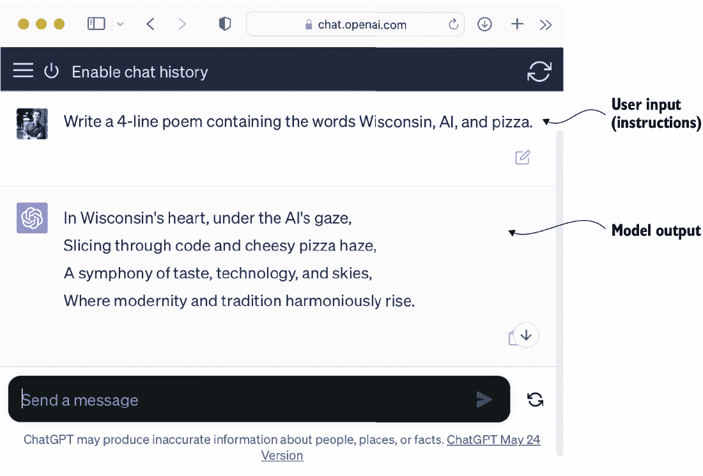
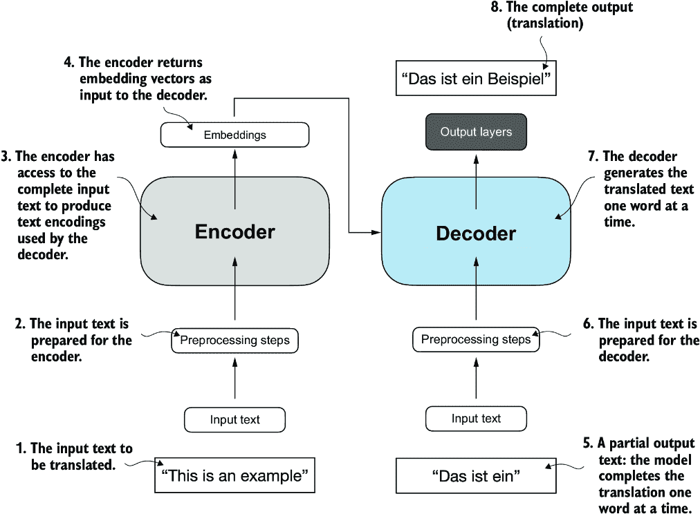
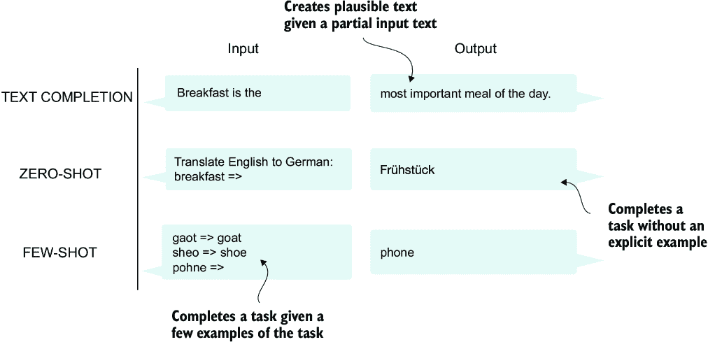
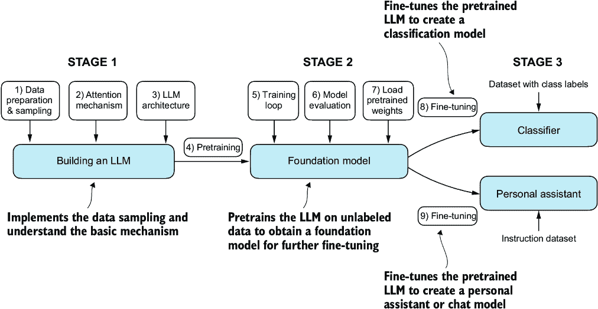

# 第一章：理解大型语言模型

### 本章涵盖

+   对大型语言模型（LLMs）背后基本概念的概述

+   从 LLMs 中提取的 Transformer 架构的见解

+   从零开始构建 LLM 的计划

大型语言模型（LLMs），如 OpenAI 的 ChatGPT 所提供的，是过去几年中开发的深度神经网络模型。它们为自然语言处理（NLP）带来了新时代。在 LLMs 出现之前，传统方法在分类任务上表现出色，例如电子邮件垃圾邮件分类和可以用手工规则或简单模型捕获的简单模式识别。然而，它们通常在需要复杂理解和生成能力的语言任务上表现不佳，例如解析详细指令、进行上下文分析和创建连贯且上下文适当的原创文本。例如，上一代语言模型无法根据关键词列表撰写电子邮件——对于当代 LLMs 来说，这是一个微不足道的小任务。

LLMs 在理解、生成和解释人类语言方面具有非凡的能力。然而，重要的是要明确，当我们说语言模型“理解”时，我们是指它们能够以看似连贯和上下文相关的方式处理和生成文本，而不是说它们拥有类似人类的意识或理解力。

在深度学习进步的推动下，深度学习是机器学习和人工智能（AI）的一个子集，专注于神经网络，LLMs 在大量文本数据上进行训练。这种大规模训练使得 LLMs 能够捕捉到比以前的方法更深入的语言语境信息和细微差别。因此，LLMs 在包括文本翻译、情感分析、问答等在内的广泛 NLP 任务上的性能得到了显著提升。

当代 LLMs 与早期 NLP 模型之间的另一个重要区别是，早期的 NLP 模型通常是为特定任务设计的，例如文本分类、语言翻译等。虽然那些早期的 NLP 模型在其狭窄的应用中表现出色，但 LLMs 在广泛的 NLP 任务中展现出更广泛的熟练度。

LLMs（大型语言模型）的成功可以归因于支撑许多 LLMs 的 Transformer 架构以及 LLMs 训练所依赖的庞大数据量，这使得它们能够捕捉到广泛的语言细微差别、语境和模式，这些内容手动编码将极具挑战性。

这种转向基于 Transformer 架构实现模型并使用大型训练数据集来训练 LLMs 的转变，从根本上改变了自然语言处理（NLP），为理解和交互人类语言提供了更强大的工具。

以下讨论为完成本书的主要目标奠定了基础：通过逐步编写代码，实现一个类似 ChatGPT 的基于 transformer 架构的 LLM，以理解 LLM。

## 1.1 什么是 LLM？

LLM 是一种神经网络，旨在理解、生成和回应类似人类的文本。这些模型是在大量文本数据上训练的深度神经网络，有时甚至包括整个互联网上可公开获取的大量文本。

“large”在“large language model”中既指模型的参数大小，也指其训练所用的庞大数据集。这类模型通常有数十亿甚至数百亿个参数，这些参数是网络中的可调整权重，在训练过程中被优化以预测序列中的下一个单词。预测下一个单词是有意义的，因为它利用了语言的内在序列性质，以训练模型理解文本中的上下文、结构和关系。这是一个非常简单的任务，因此许多研究人员对此感到惊讶，它能够产生如此强大的模型。在后面的章节中，我们将逐步讨论和实现下一个单词的训练过程。

LLMs 使用一种称为*transformer*的架构，这使得它们在做出预测时能够对输入的不同部分进行选择性关注，使它们特别擅长处理人类语言的细微差别和复杂性。

由于 LLMs 能够*生成*文本，它们也常被称为一种生成式人工智能的形式，通常简称为*生成 AI*或*GenAI*。如图 1.1 所示，AI 涵盖了更广泛的领域，即创建能够执行需要类似人类智能的任务的机器，包括理解语言、识别模式和做出决策，包括机器学习和深度学习等子领域。

##### 图 1.1 如此分层展示不同领域之间关系的图所示，LLM 代表了深度学习技术的一种特定应用，利用其处理和生成类似人类文本的能力。深度学习是机器学习的一个专门分支，它专注于使用多层神经网络。机器学习和深度学习是旨在实现算法的领域，这些算法使计算机能够从数据中学习并执行通常需要人类智能的任务。

用于实现人工智能的算法是机器学习领域的焦点。具体来说，机器学习涉及开发能够从数据中学习并基于数据做出预测或决策的算法，而不需要明确编程。为了说明这一点，想象一下垃圾邮件过滤器作为机器学习的一个实际应用。不是手动编写规则来识别垃圾邮件，而是将标记为垃圾邮件和合法邮件的电子邮件示例输入到机器学习算法中。通过最小化其在训练数据集上的预测错误，模型随后学会识别表明垃圾邮件的模式和特征，使其能够将新电子邮件分类为垃圾邮件或非垃圾邮件。

如图 1.1 所示，深度学习是机器学习的一个子集，它专注于利用具有三个或更多层的神经网络（也称为深度神经网络）来模拟数据中的复杂模式和抽象。与深度学习不同，传统的机器学习需要手动提取特征。这意味着人类专家需要识别和选择对模型最相关的特征。

尽管现在人工智能领域主要由机器学习和深度学习主导，但它也包括其他方法——例如，使用基于规则的系统、遗传算法、专家系统、模糊逻辑或符号推理。

回到垃圾邮件分类的例子，在传统的机器学习中，人类专家可能会手动从电子邮件文本中提取特征，例如某些触发词（例如，“奖品”、“赢”、“免费”）的频率，感叹号的数量，使用全部大写字母的单词，或者可疑链接的存在。这个基于这些专家定义的特征创建的数据集，随后会被用来训练模型。与传统的机器学习相比，深度学习不需要手动提取特征。这意味着人类专家不需要为深度学习模型识别和选择最相关的特征。（然而，传统的机器学习和深度学习用于垃圾邮件分类仍然需要收集标签，如垃圾邮件或非垃圾邮件，这些标签需要由专家或用户收集。）

让我们来看看 LLMs 今天可以解决的问题、LLMs 解决的挑战，以及我们稍后将要实现的通用 LLM 架构。

## 1.2 LLMs 的应用

由于它们解析和理解非结构化文本数据的高级能力，LLMs 在各个领域都有广泛的应用。如今，LLMs 被用于机器翻译、生成新颖文本（见图 1.2）、情感分析、文本摘要以及许多其他任务。LLMs 最近还被用于内容创作，如撰写小说、文章，甚至计算机代码。

##### 图 1.2 LLM 接口使用户与 AI 系统之间能够进行自然语言交流。此截图显示了 ChatGPT 根据用户的要求写诗。

LLM 还可以为复杂的聊天机器人和虚拟助手提供动力，例如 OpenAI 的 ChatGPT 或 Google 的 Gemini（以前称为 Bard），它们可以回答用户查询并增强传统的搜索引擎，如 Google 搜索或 Microsoft Bing。

此外，LLM 还可以用于从大量文本中有效地检索特定领域（如医学或法律）的知识。这包括筛选文档、总结长篇段落和回答技术问题。

简而言之，LLM 对于自动化几乎任何涉及解析和生成文本的任务都非常有价值。它们的应用几乎无限，随着我们继续创新和探索使用这些模型的新方法，很明显，LLM 有潜力重新定义我们与技术的关系，使其更加对话式、直观和易于访问。

我们将专注于从底层理解 LLM 的工作原理，编写一个可以生成文本的 LLM。你还将了解允许 LLM 执行查询的技术，这些查询从回答问题到总结文本，将文本翻译成不同语言等。换句话说，你将通过逐步构建来了解复杂的 LLM 助手（如 ChatGPT）是如何工作的。

## 1.3 构建和使用 LLM 的阶段

为什么你应该构建自己的 LLM？从头开始编写 LLM 是一个很好的练习，可以了解其机制和限制。此外，它使我们具备了预训练或微调现有开源 LLM 架构以适应我们自己的特定领域数据集或任务所需的知识。

注意：目前大多数大型语言模型（LLM）都是使用 PyTorch 深度学习库实现的，这也是我们将要使用的库。读者可以在附录 A 中找到 PyTorch 的全面介绍。

研究表明，在建模性能方面，定制构建的 LLM（针对特定任务或领域量身定制的）可以优于通用 LLM，例如为广泛应用而设计的 ChatGPT。这些例子包括为金融定制的 BloombergGPT 和为医疗问答定制的 LLM（详情见附录 B）。

使用定制构建的 LLM 提供了几个优势，尤其是在数据隐私方面。例如，由于保密问题，公司可能不愿意与像 OpenAI 这样的第三方 LLM 提供商共享敏感数据。此外，开发更小、定制的 LLM 可以直接在客户设备（如笔记本电脑和智能手机）上部署，这是苹果公司目前正在探索的事情。这种本地实现可以显著降低延迟并减少与服务器相关的成本。此外，定制 LLM 赋予开发者完全的自主权，使他们能够根据需要控制模型的更新和修改。

创建 LLM 的一般过程包括预训练和微调。“预”在“预训练”中指的是模型（如 LLM）在一个大而多样化的数据集上训练，以发展对语言的广泛理解。这个预训练模型随后作为基础资源，可以通过微调进一步精炼，微调是一个模型在更具体于特定任务或领域的较窄数据集上特定训练的过程。这种由预训练和微调组成的两阶段训练方法在图 1.3 中展示。

##### 图 1.3 预训练 LLM 涉及在大文本数据集上进行下一个单词的预测。预训练的 LLM 可以使用较小的标记数据集进行微调。

创建 LLM 的第一步是在大量文本数据集上对其进行训练，有时这些数据被称为 *原始* 文本。在这里，“原始”指的是这些数据仅仅是常规文本，没有任何标签信息。（可能应用过滤，例如删除格式化字符或未知语言的文档。）

备注  具有机器学习背景的读者可能会注意到，对于传统的机器学习模型和通过传统监督学习范式训练的深度神经网络，通常需要标签信息。但对于 LLM 的预训练阶段来说并非如此。在这个阶段，LLM 使用自监督学习，其中模型从输入数据中生成自己的标签。

LLM 的第一个训练阶段也被称为 *预训练*，即创建一个初始的预训练 LLM，通常称为 *基础* 或 *基础* 模型。这类模型的典型例子是 GPT-3 模型（ChatGPT 中提供的原始模型的先驱）。该模型能够完成文本补全——即根据用户提供的半句话完成句子。它还具有有限的少样本能力，这意味着它可以通过仅几个示例来学习执行新任务，而不需要大量的训练数据。

通过在大文本数据集上训练，获得预训练的 LLM，其中 LLM 被训练来预测文本中的下一个单词，我们可以在标记数据上进一步训练 LLM，这被称为 *微调*。

微调 LLM 的最流行的两种类别是 *指令微调* 和 *分类* 微调。在指令微调中，标记数据集由指令和答案对组成，例如一个翻译文本的查询及其正确翻译的文本。在分类微调中，标记数据集由文本及其相关的类别标签组成——例如与“垃圾邮件”和“非垃圾邮件”标签相关的电子邮件。

我们将介绍预训练和微调 LLM 的代码实现，并在预训练基础 LLM 之后，更深入地探讨指令和分类微调的细节。

## 1.4 介绍 Transformer 架构

大多数现代 LLM 都依赖于*变压器*架构，这是一种在 2017 年论文“Attention Is All You Need”中引入的深度神经网络架构（[`arxiv.org/abs/1706.03762`](https://arxiv.org/abs/1706.03762)）。为了理解 LLM，我们必须理解原始的变压器，它是为机器翻译开发的，用于将英语文本翻译成德语和法语。变压器架构的简化版本在图 1.4 中展示。

##### 图 1.4 展示了原始变压器架构的简化表示，这是一个用于语言翻译的深度学习模型。变压器由两部分组成：(a)一个编码器，它处理输入文本并生成文本的嵌入表示（一个在多个维度上捕捉许多不同因素的数值表示），(b)解码器可以使用它来逐词生成翻译文本。此图显示了翻译过程的最后阶段，其中解码器必须根据原始输入文本（“这是一个例子”）和部分翻译的句子（“Das ist ein”），仅生成最后的单词（“Beispiel”），以完成翻译。

变压器架构由两个子模块组成：一个编码器和一个解码器。编码器模块处理输入文本并将其编码成一系列数值表示或向量，这些向量捕捉了输入的上下文信息。然后，解码器模块接收这些编码向量并生成输出文本。例如，在翻译任务中，编码器会将源语言的文本编码成向量，解码器会将这些向量解码以生成目标语言的文本。编码器和解码器都由许多层组成，这些层通过所谓的自注意力机制相互连接。您可能对输入是如何预处理和编码的有很多疑问。这些问题将在后续章节的逐步实现中解决。

变压器和 LLM 的关键组成部分是自注意力机制（未展示），该机制允许模型根据彼此的重要性对序列中的不同单词或标记进行加权。这种机制使模型能够捕捉输入数据中的长距离依赖关系和上下文关系，从而增强其生成连贯且上下文相关的输出的能力。然而，由于其复杂性，我们将进一步解释推迟到第三章，在那里我们将逐步讨论和实现它。

变压器架构的后续变体，如 BERT（代表*双向编码器表示来自变压器*）和不同的 GPT 模型（代表*生成预训练变压器*），基于这个概念来适应不同的任务。如果您感兴趣，请参阅附录 B 以获取进一步阅读的建议。

BERT，它建立在原始变压器编码器子模块之上，其训练方法与 GPT 不同。虽然 GPT 是为生成任务设计的，但 BERT 及其变体专注于掩码词预测，即模型预测给定句子中的掩码或隐藏词，如图 1.5 所示。这种独特的训练策略使 BERT 在文本分类任务中具有优势，包括情感预测和文档分类。作为其能力的一种应用，截至本文撰写时，X（前身为 Twitter）使用 BERT 来检测有害内容。

##### 图 1.5 展示了变压器编码器和解码器子模块的视觉表示。在左侧，编码器部分以 BERT 类似的 LLM 为例，这些模型专注于掩码词预测，主要用于文本分类等任务。在右侧，解码器部分展示了类似 GPT 的 LLM，这些模型设计用于生成任务，并产生连贯的文本序列。

另一方面，GPT 专注于原始变压器架构的解码器部分，并设计用于需要生成文本的任务。这包括机器翻译、文本摘要、小说写作、编写计算机代码等。

GPT 模型，主要是设计和训练来完成文本补全任务，也在其能力上表现出显著的通用性。这些模型擅长执行零样本和少样本学习任务。零样本学习指的是在没有任何先前特定示例的情况下，将知识泛化到完全未见过的新任务的能力。另一方面，少样本学习涉及从用户提供的最少数量示例中学习，如图 1.6 所示。

##### 除了文本补全之外，类似 GPT 的 LLM 还可以根据其输入解决各种任务，而无需重新训练、微调或特定任务模型架构的改变。有时在输入中提供目标示例是有帮助的，这被称为少样本设置。然而，类似 GPT 的 LLM 也能够在没有特定示例的情况下执行任务，这被称为零样本设置。

##### 变压器与 LLM 对比

今天的 LLM 是基于 Transformer 架构的。因此，在文献中，Transformer 和 LLM 是经常互换使用的术语。然而，请注意，并非所有 Transformer 都是 LLM，因为 Transformer 也可以用于计算机视觉。同样，并非所有 LLM 都是 Transformer，因为还有基于循环和卷积架构的 LLM。这些替代方法背后的主要动机是提高 LLM 的计算效率。这些替代 LLM 架构是否能够与基于 Transformer 的 LLM 的能力相竞争，以及它们是否将在实践中被采用，还有待观察。为了简单起见，我使用“LLM”一词来指代类似于 GPT 的基于 Transformer 的 LLM。（感兴趣的读者可以在附录 B 中找到描述这些架构的文献参考。）

## 1.5 利用大型数据集

流行的大型 GPT 和 BERT 类模型的训练数据集代表了包含数十亿单词的多样化和综合文本语料库，涵盖了广泛的主题和自然语言与计算机语言。为了提供一个具体的例子，表 1.1 总结了用于预训练 GPT-3 的数据集，该数据集是 ChatGPT 第一版的基础模型。

##### 表 1.1 流行的大型 GPT-3 LLM 预训练数据集

| 数据集名称 | 数据集描述 | 标记数量 | 训练数据中的比例 |
| --- | --- | --- | --- |
| CommonCrawl (filtered)  | 网络爬虫数据  | 4100 亿  | 60%  |
| WebText2  | 网络爬虫数据  | 190 亿  | 22%  |
| Books1  | 基于互联网的书籍语料库  | 120 亿  | 8%  |
| Books2  | 基于互联网的书籍语料库  | 550 亿  | 8%  |
| Wikipedia  | 高质量文本  | 30 亿  | 3%  |

表 1.1 报告了标记的数量，其中标记是模型读取的文本单元，数据集中的标记数量大致相当于文本中的单词和标点符号的数量。第二章讨论了分词，即将文本转换为标记的过程。

主要的启示是，这个训练数据集的规模和多样性使得这些模型能够在包括语言语法、语义和上下文在内的各种任务上表现良好——甚至包括一些需要一般知识的任务。

##### GPT-3 数据集详情

表 1.1 展示了用于 GPT-3 的数据集。表中比例列的总和为样本数据的 100%，经过四舍五入误差调整。尽管标记数量列的子集总数为 4990 亿，但模型仅训练了 3000 亿个标记。GPT-3 论文的作者没有说明为什么模型没有训练所有 4990 亿个标记。

为了提供上下文，考虑一下 CommonCrawl 数据集的大小，它本身包含 4100 亿个标记，需要大约 570 GB 的存储空间。相比之下，GPT-3 等模型的后续版本，如 Meta 的 LLaMA，已经扩大了它们的训练范围，包括额外的数据源，如 Arxiv 研究论文（92 GB）和 StackExchange 的代码相关问答（78 GB）。

GPT-3 论文的作者没有分享训练数据集，但一个公开可用的类似数据集是 Soldaini 等人 2024 年的论文“*Dolma：用于 LLM 预训练研究的三万亿标记开放语料库*”（[`arxiv.org/abs/2402.00159`](https://arxiv.org/abs/2402.00159)）。然而，该集合可能包含受版权保护的作品，具体的用法条款可能取决于预期的用例和国家。

这些模型的预训练特性使它们在下游任务上的进一步微调方面具有极大的灵活性，这也是为什么它们也被称为基础或基础模型。预训练 LLM 需要访问大量资源，并且成本非常高。例如，GPT-3 的预训练成本据估计为 460 万美元的云计算信用额（[`mng.bz/VxEW`](https://mng.bz/VxEW)）。

好消息是，许多预训练的 LLM 作为开源模型可用，可以用作通用工具来编写、提取和编辑训练数据之外的文本。此外，LLM 可以在相对较小的数据集上针对特定任务进行微调，从而减少所需的计算资源并提高性能。

我们将实现预训练代码，并用于教育目的预训练一个 LLM。所有计算都可以在消费级硬件上执行。在实现预训练代码之后，我们将学习如何重复使用公开可用的模型权重，并将它们加载到我们将要实现的架构中，这样我们就可以在微调我们的 LLM 时跳过昂贵的预训练阶段。

## 1.6 深入了解 GPT 架构

GPT 最初由 OpenAI 的 Radford 等人发表的论文“通过生成预训练改进语言理解”（[`mng.bz/x2qg`](https://mng.bz/x2qg)）中介绍。GPT-3 是这个模型的扩展版本，具有更多参数，并在更大的数据集上进行了训练。此外，ChatGPT 中提供的原始模型是通过在大型指令数据集上使用 OpenAI 的 InstructGPT 论文中的方法微调 GPT-3 创建的（[`arxiv.org/abs/2203.02155`](https://arxiv.org/abs/2203.02155)）。如图 1.6 所示，这些模型是胜任文本补全模型，并能执行其他任务，如拼写校正、分类或语言翻译。考虑到 GPT 模型是在相对简单的下一个单词预测任务上进行预训练的，如图 1.7 所示，这实际上是非常了不起的。

##### 图 1.7 在 GPT 模型的下一个单词预测预训练任务中，系统通过查看句子中之前的单词来学习预测句子中的下一个单词。这种方法有助于模型理解单词和短语在语言中通常是如何搭配在一起的，形成一个可以应用于各种其他任务的基础。

逐词预测任务是一种自我监督学习的形式，这是一种自我标记的形式。这意味着我们不需要明确收集训练数据的标签，但可以使用数据本身的结构：我们可以使用句子或文档中的下一个词作为模型应该预测的标签。由于这个逐词预测任务允许我们“即时”创建标签，因此可以使用大量的未标记文本数据集来训练 LLMs。

与我们在 1.4 节中介绍的原始 Transformer 架构相比，一般的 GPT 架构相对简单。本质上，它只是没有编码器的解码器部分（图 1.8）。由于像 GPT 这样的解码器风格模型通过逐词预测文本来生成文本，因此它们被认为是*自回归*模型。自回归模型将它们的先前输出作为未来预测的输入。因此，在 GPT 中，每个新词的选择都是基于其前面的序列，这提高了生成文本的连贯性。

像 GPT-3 这样的架构也比原始的 Transformer 模型大得多。例如，原始的 Transformer 重复了编码器和解码器块六次。GPT-3 总共有 96 个 Transformer 层和 1750 亿个参数。

##### 图 1.8 GPT 架构仅采用原始 Transformer 的解码器部分。它设计用于单向、从左到右的处理，这使得它非常适合文本生成和逐词预测任务，以迭代方式逐词生成文本。

GPT-3 于 2020 年推出，按照深度学习和大型语言模型发展的标准，这已经是很久以前了。然而，更近期的架构，如 Meta 的 Llama 模型，仍然基于相同的基本概念，只是引入了细微的修改。理解 GPT 仍然非常相关。我专注于实现 GPT 背后的突出架构，并提供指向替代 LLMs 使用的特定调整的指针。

尽管原始的 Transformer 模型，由编码器和解码器块组成，是专门为语言翻译设计的，但 GPT 模型——尽管它们的架构更大但更简单，仅包含用于逐词预测的解码器——也能够执行翻译任务。这种能力最初让研究人员感到意外，因为它来自一个主要针对逐词预测任务训练的模型，而逐词预测任务并不是专门针对翻译的任务。

能够执行模型未明确训练的任务的能力被称为*涌现行为*。这种能力在训练期间并未明确教授，而是作为模型在多种语境下接触大量多语言数据的自然结果而出现。GPT 模型能够“学习”语言之间的翻译模式并执行翻译任务，即使它们并未为此专门训练，这也展示了这些大规模生成语言模型的好处和能力。我们可以执行各种任务，而无需为每个任务使用不同的模型。

## 1.7 构建大型语言模型

现在我们已经为理解 LLM 奠定了基础，让我们从头开始编写一个 LLM。我们将以 GPT 背后的基本理念为蓝图，并按照图 1.9 中概述的三阶段来解决这个问题。

##### 图 1.9 编写 LLM 的三个主要阶段是实施 LLM 架构和数据准备过程（阶段 1），预训练 LLM 以创建基础模型（阶段 2），以及微调基础模型以成为个人助理或文本分类器（阶段 3）。

在阶段 1，我们将学习基本的数据预处理步骤，并编写每个 LLM 核心的注意力机制代码。接下来，在阶段 2，我们将学习如何编写和预训练一个类似于 GPT 的 LLM，该 LLM 能够生成新的文本。我们还将回顾评估 LLM 的基本原理，这对于开发有能力的 NLP 系统至关重要。

从头开始预训练 LLM 是一项重大努力，对于类似于 GPT 的模型，需要数千到数百万美元的计算机成本。因此，阶段 2 的重点是使用小数据集实现用于教育目的的训练。此外，我还提供了加载公开可用的模型权重的代码示例。

最后，在阶段 3，我们将使用预训练的 LLM，并对其进行微调以遵循指令，如回答查询或对文本进行分类——这是许多现实应用和研究中最常见的任务。

我希望你们都在期待开始这段激动人心的旅程！

## 摘要

+   LLM 已经改变了自然语言处理领域，该领域以前主要依赖于基于显式规则的系统和更简单的统计方法。LLM 的出现引入了新的深度学习驱动方法，这些方法导致了在理解、生成和翻译人类语言方面的进步。

+   现代大型语言模型（LLM）的训练分为两个主要步骤：

    +   首先，它们通过使用句子中下一个单词的预测作为标签，在大规模未标记文本语料库上进行预训练。

    +   然后，它们在较小、标记的目标数据集上进行微调，以遵循指令或执行分类任务。

+   LLM 基于 transformer 架构。transformer 架构的关键思想是在生成输出时，通过注意力机制使 LLM 能够选择性地访问整个输入序列。

+   原始的 Transformer 架构包括用于解析文本的编码器以及用于生成文本的解码器。

+   用于生成文本和遵循指令的 LLM，如 GPT-3 和 ChatGPT，仅实现了解码模块，简化了架构。

+   由数十亿单词组成的大型数据集对于预训练 LLM 至关重要。

+   虽然 GPT 类模型的通用预训练任务是预测句子中的下一个单词，但这些 LLM 表现出涌现性质，例如具有分类、翻译或总结文本的能力。

+   一旦 LLM 完成预训练，所得到的基座模型可以更高效地针对各种下游任务进行微调。

+   在自定义数据集上微调的 LLM 可以在特定任务上优于通用 LLM。
