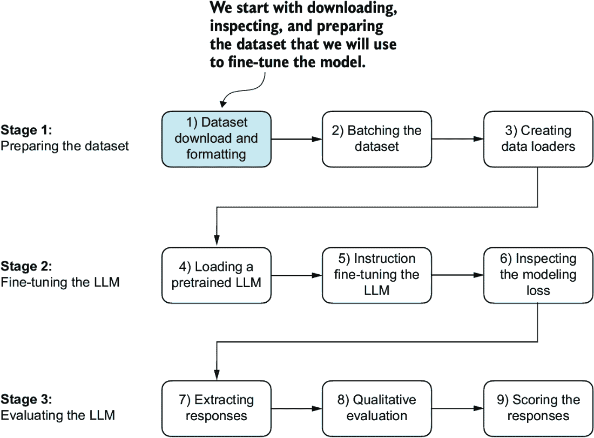
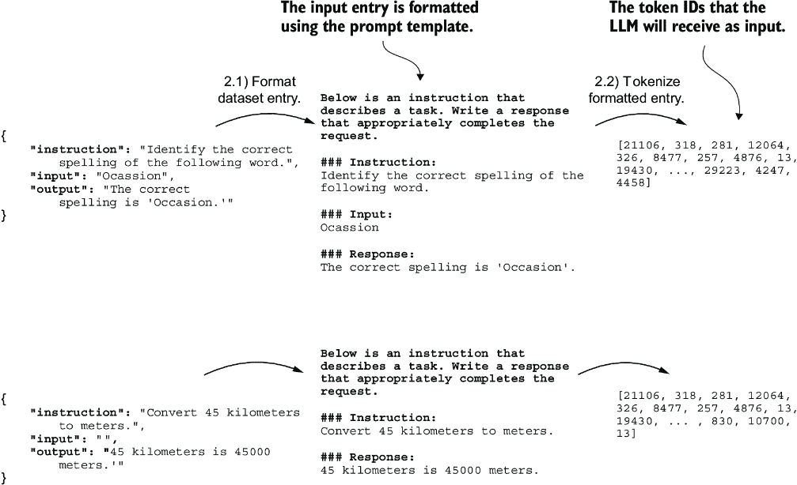
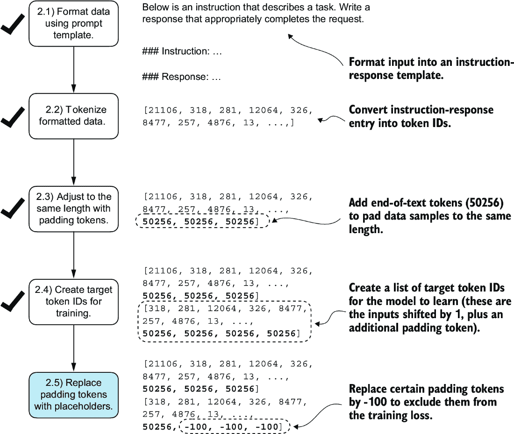
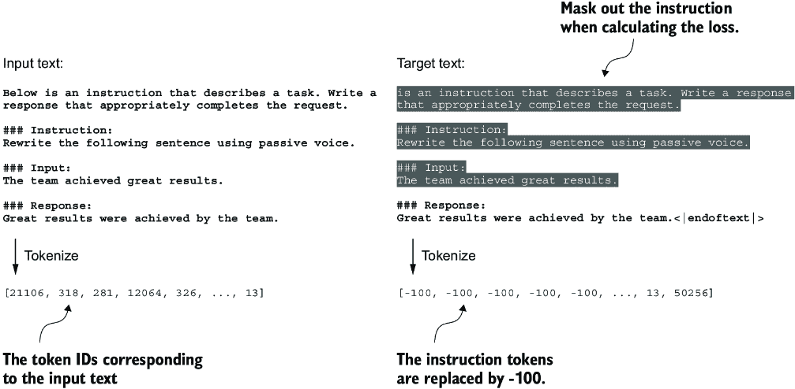
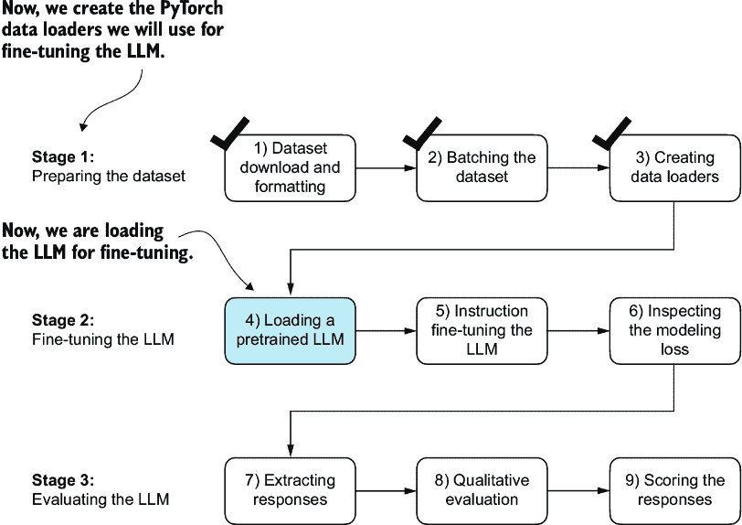
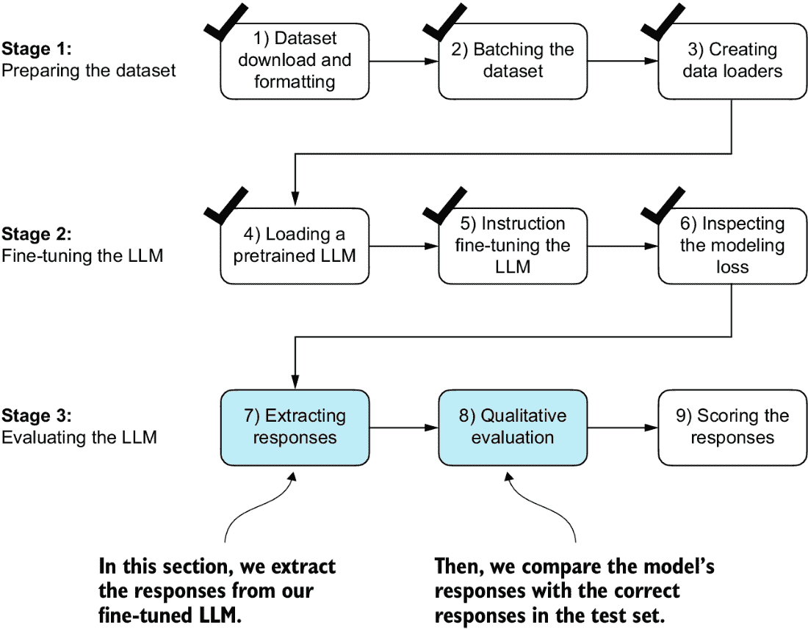
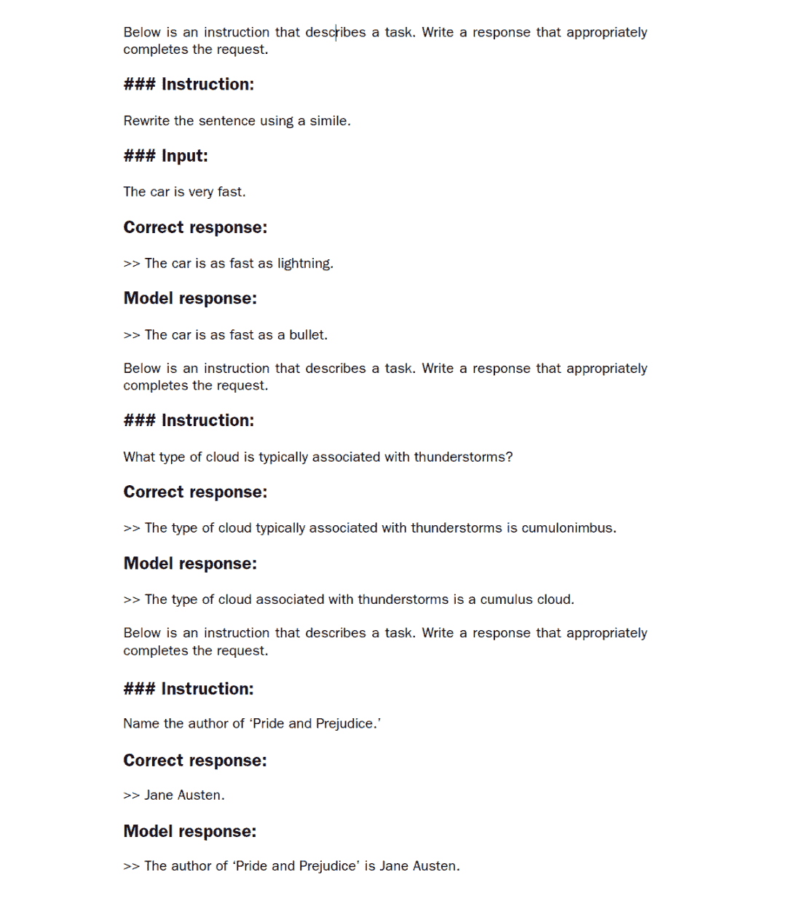
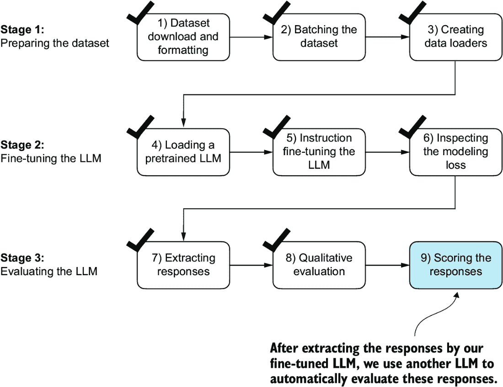
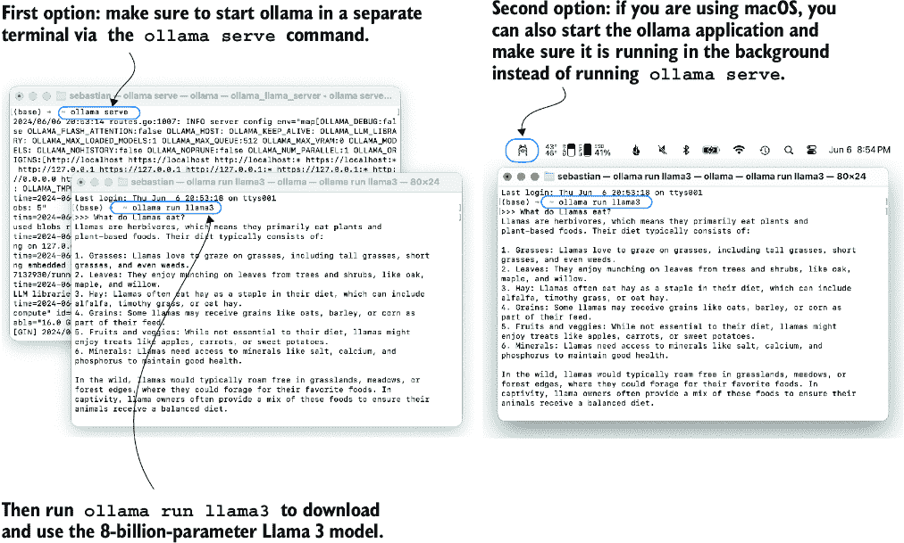
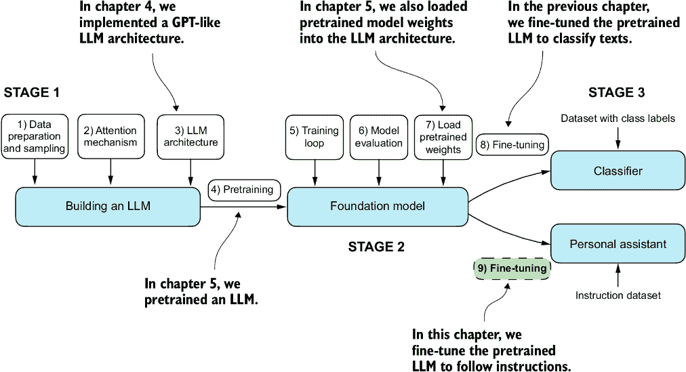

# 第七章：微调以遵循指令

### 本章涵盖

+   LLM 的指令微调过程

+   准备用于监督指令微调的数据集

+   组织训练批次中的指令数据

+   加载预训练的 LLM 并将其微调以遵循人类指令

+   提取用于评估的 LLM 生成的指令响应

+   评估指令微调的 LLM

之前，我们实现了 LLM 架构，进行了预训练，并将外部来源的预训练权重导入到我们的模型中。然后，我们专注于对 LLM 进行微调，以完成特定的分类任务：区分垃圾邮件和非垃圾邮件短信。现在，我们将实现微调 LLM 以遵循人类指令的过程，如图 7.1 所示。指令微调是开发用于聊天机器人应用、个人助理和其他对话任务 LLM 的主要技术之一。


##### 图 7.1 编码 LLM 的三个主要阶段。本章重点介绍第三阶段的第 9 步：微调预训练的 LLM 以遵循人类指令。

图 7.1 显示了微调 LLM 的两种主要方式：用于分类的微调（步骤 8）和微调 LLM 以遵循指令（步骤 9）。我们在第六章中实现了步骤 8。现在，我们将使用*指令数据集*来微调 LLM。

## 7.1 指令微调简介

我们现在知道，预训练 LLM 涉及一个训练过程，其中它学会一次生成一个单词。结果得到的预训练 LLM 能够进行*文本补全*，这意味着它可以根据输入的片段完成句子或撰写文本段落。然而，预训练的 LLM 在特定指令上往往很吃力，例如“修复这段文字的语法”或“将这段文字转换为被动语态”。稍后，我们将考察一个具体示例，其中我们将预训练的 LLM 作为*指令微调*（也称为*监督指令微调*）的基础。

在这里，我们专注于提高 LLM 遵循此类指令并生成期望响应的能力，如图 7.2 所示。准备数据集是指令微调的关键方面。然后，我们将完成指令微调过程的三个阶段的所有步骤，从数据集准备开始，如图 7.3 所示。


##### 图 7.2 LLM 处理以生成期望响应的指令示例



##### 图 7.3 指令微调 LLM 的三阶段过程。第一阶段涉及数据集准备，第二阶段侧重于模型设置和微调，第三阶段涵盖模型的评估。我们将从第一阶段的第一步开始：下载和格式化数据集。

## 7.2 准备用于监督指令微调的数据集

让我们下载并格式化指令数据集，以便对预训练的 LLM 进行指令微调。该数据集包含 1,100 个*指令-响应对*，类似于图 7.2 中的那些。这个数据集是专门为这本书创建的，但感兴趣的读者可以在附录 B 中找到其他可公开获取的指令数据集。

以下代码实现并执行了一个函数来下载这个数据集，它是一个相对较小的文件（只有 204 KB），格式为 JSON。JSON，或 JavaScript 对象表示法，与 Python 字典的结构相似，提供了一个简单的数据交换结构，既适合人类阅读，又适合机器处理。

##### 列表 7.1 下载数据集

```py
import json
import os
import urllib

def download_and_load_file(file_path, url):
    if not os.path.exists(file_path):
        with urllib.request.urlopen(url) as response:
            text_data = response.read().decode("utf-8")
        with open(file_path, "w", encoding="utf-8") as file:
            file.write(text_data)

    with open(file_path, "r") as file:
        data = json.load(file)
    return data

file_path = "instruction-data.json"
url = (
    "https://raw.githubusercontent.com/rasbt/LLMs-from-scratch"
    "/main/ch07/01_main-chapter-code/instruction-data.json"
)

data = download_and_load_file(file_path, url)
print("Number of entries:", len(data))
```

执行前述代码的输出是

```py
Number of entries: 1100
```

我们从 JSON 文件中加载的`data`列表包含指令数据集的 1,100 个条目。让我们打印其中一个条目，看看每个条目的结构：

```py
print("Example entry:\n", data[50])
```

示例条目的内容是

```py
Example entry:
 {'instruction': 'Identify the correct spelling of the following word.',
  'input': 'Ocassion', 'output': "The correct spelling is 'Occasion.'"}
```

如我们所见，示例条目是包含`'instruction'`、`'input'`和`'output'`的 Python 字典对象。让我们看看另一个示例：

```py
print("Another example entry:\n", data[999])
```

根据此条目的内容，`'input'`字段有时可能为空：

```py
Another example entry:
 {'instruction': "What is an antonym of 'complicated'?", 
  'input': '',
  'output': "An antonym of 'complicated' is 'simple'."}
```

指令微调涉及在数据集上训练模型，其中输入-输出对，如我们从 JSON 文件中提取的，是明确提供的。有各种方法来格式化这些条目以供 LLM 使用。图 7.4 说明了两种不同的示例格式，通常被称为*提示风格*，用于训练像阿尔帕卡和 Phi-3 这样的知名 LLM。


##### 图 7.4 比较 LLM 中指令微调的提示风格。阿尔帕卡风格（左）使用具有定义明确的指令、输入和响应部分的格式，而 Phi-3 风格（右）使用具有指定`<|user|>`和`<|assistant|>`标记的更简单的格式。

阿尔帕卡（Alpaca）是早期公开详细说明其指令微调过程的 LLM 之一。微软开发的 Phi-3 被包括在内，以展示提示风格的多样性。本章的其余部分使用阿尔帕卡提示风格，因为它是最受欢迎的之一，很大程度上是因为它帮助定义了微调的原始方法。

##### 练习 7.1 更改提示风格

在使用阿尔帕卡提示风格微调模型后，尝试图 7.4 中显示的 Phi-3 提示风格，并观察它是否会影响模型的响应质量。

让我们定义一个`format_input`函数，我们可以用它将`data`列表中的条目转换为阿尔帕卡风格的输入格式。

##### 列表 7.2 实现提示格式化函数

```py
def format_input(entry):
    instruction_text = (
        f"Below is an instruction that describes a task. "
        f"Write a response that appropriately completes the request."
        f"\n\n### Instruction:\n{entry['instruction']}"
    )

    input_text = (
        f"\n\n### Input:\n{entry['input']}" if entry["input"] else ""
    )
    return instruction_text + input_text
```

这个`format_input`函数接受一个字典`entry`作为输入，并构建一个格式化的字符串。让我们测试它对数据集条目`data[50]`，这是我们之前看过的：

```py
model_input = format_input(data[50])
desired_response = f"\n\n### Response:\n{data[50]['output']}"
print(model_input + desired_response)
```

格式化后的输入看起来如下所示：

```py
Below is an instruction that describes a task. Write a response that 
appropriately completes the request.

### Instruction:
Identify the correct spelling of the following word.

### Input:
Ocassion

### Response:
The correct spelling is 'Occasion.'
```

注意，`format_input`会跳过可选的`###` `Input:`部分，如果`'input'`字段为空，我们可以通过将`format_input`函数应用于我们之前检查的条目`data[999]`来测试这一点：

```py
model_input = format_input(data[999])
desired_response = f"\n\n### Response:\n{data[999]['output']}"
print(model_input + desired_response)
```

输出显示，具有空`'input'`字段的条目在格式化输入中不包含`###` `Input:`部分：

```py
Below is an instruction that describes a task. Write a response that 
appropriately completes the request.

### Instruction:
What is an antonym of 'complicated'?

### Response:
An antonym of 'complicated' is 'simple'.
```

在我们进入下一节设置 PyTorch 数据加载器之前，让我们将数据集划分为训练集、验证集和测试集，类似于我们在上一章中对垃圾邮件分类数据集所做的那样。以下列表显示了如何计算这些部分。

##### 列表 7.3 分区数据集

```py
train_portion = int(len(data) * 0.85)    #1
test_portion = int(len(data) * 0.1)            #2
val_portion = len(data) - train_portion - test_portion    #3

train_data = data[:train_portion]
test_data = data[train_portion:train_portion + test_portion]
val_data = data[train_portion + test_portion:]

print("Training set length:", len(train_data))
print("Validation set length:", len(val_data))
print("Test set length:", len(test_data))
```

#1 使用 85%的数据进行训练

#2 使用 10%进行测试

#3 使用剩余的 5%进行验证

这种分区结果导致以下数据集大小：

```py
Training set length: 935
Validation set length: 55
Test set length: 110
```

在成功下载和分区数据集，并对数据集提示格式有清晰理解之后，我们现在可以准备指令微调过程的核心实现。接下来，我们专注于开发用于微调 LLM 的训练批次构建方法。

## 7.3 将数据组织到训练批次中

在我们进入指令微调过程的实现阶段时，下一步，如图 7.5 所示，专注于有效地构建训练批次。这涉及到定义一个方法，确保我们的模型在微调过程中接收格式化的训练数据。


##### 图 7.5 指令微调 LLM 的三阶段过程。接下来，我们看看第一阶段步骤 2：组装训练批次。

在上一章中，训练批次是由 PyTorch 的`DataLoader`类自动创建的，该类使用默认的*合并*函数将样本列表组合成批次。合并函数负责将单个数据样本的列表合并成一个可以由模型在训练过程中高效处理的单一批次。

然而，指令微调的批处理过程稍微复杂一些，需要我们创建自己的自定义合并函数，稍后将其插入到`DataLoader`中。我们实现这个自定义合并函数来处理我们指令微调数据集的特定要求和格式。

让我们分几个步骤来处理批处理过程，包括编写自定义合并函数，如图 7.6 所示。首先，为了实现步骤 2.1 和 2.2，我们编写了一个`InstructionDataset`类，该类应用`format_input`并*预处理*数据集中的所有输入，类似于第六章中的`SpamDataset`。这个两步过程，如图 7.7 所示，是在`InstructionDataset`的`__init__`构造方法中实现的。


##### 图 7.6 实现批处理过程的五个子步骤：（2.1）应用提示模板，（2.2）使用前几章中的标记化，（2.3）添加填充标记，（2.4）创建目标标记 ID，以及（2.5）在损失函数中将 `-100` 占位符标记替换为掩码填充标记。



##### 图 7.7 实现批处理过程涉及的前两个步骤。首先使用特定的提示模板（2.1）格式化条目，然后进行标记化（2.2），从而生成模型可以处理的标记 ID 序列。

##### 列表 7.4 实现指令数据集类

```py
import torch
from torch.utils.data import Dataset

class InstructionDataset(Dataset):
    def __init__(self, data, tokenizer):
        self.data = data
        self.encoded_texts = []
        for entry in data:         #1
            instruction_plus_input = format_input(entry)
            response_text = f"\n\n### Response:\n{entry['output']}"
            full_text = instruction_plus_input + response_text
            self.encoded_texts.append(
                tokenizer.encode(full_text)
            )

    def __getitem__(self, index):
        return self.encoded_texts[index]

    def __len__(self):
        return len(self.data)
```

#1 预标记文本

与用于分类微调的方法类似，我们希望通过在批次中收集多个训练示例来加速训练，这需要将所有输入填充到相似长度。与分类微调一样，我们使用 `<|endoftext|>` 标记作为填充标记。

我们可以在将 `<|endoftext|>` 标记附加到文本输入之前，直接将对应于 `<|endoftext|>` 的标记 ID 附加到预标记的输入中。我们可以使用标记器的 `.encode` 方法在 `<|endoftext|>` 标记上，以提醒我们应使用哪个标记 ID：

```py
import tiktoken
tokenizer = tiktoken.get_encoding("gpt2")
print(tokenizer.encode("<|endoftext|>", allowed_special={"<|endoftext|>"}))
```

生成的标记 ID 是 `50256`。

接下来进行步骤 2.3（见图 7.6），我们采用了一种更复杂的方法，通过开发一个自定义的 collate 函数，我们可以将其传递给数据加载器。这个自定义的 collate 函数将每个批次中的训练示例填充到相同的长度，同时允许不同的批次有不同的长度，如图 7.8 所示。这种方法通过仅将序列扩展到匹配每个批次中最长的序列，而不是整个数据集，从而最小化了不必要的填充。


##### 图 7.8 使用标记 ID `50256` 在批次中对训练示例进行填充，以确保每个批次内的长度一致。每个批次可能有不同的长度，如第一和第二个所示。

我们可以使用自定义的 collate 函数来实现填充过程：

```py
def custom_collate_draft_1(
    batch,
    pad_token_id=50256,
    device="cpu"
):
    batch_max_length = max(len(item)+1 for item in batch)   #1
    inputs_lst = []

    for item in batch:     #2
        new_item = item.copy()
        new_item += [pad_token_id]

        padded = (
            new_item + [pad_token_id] * 
            (batch_max_length - len(new_item))
        )
        inputs = torch.tensor(padded[:-1])    #3
        inputs_lst.append(inputs)

    inputs_tensor = torch.stack(inputs_lst).to(device)     #4
    return inputs_tensor
```

#1 在批次中找到最长的序列

#2 填充并准备输入

#3 移除之前添加的额外填充标记

#4 将输入列表转换为张量并将其传输到目标设备

我们实现的 `custom_collate_draft_1` 被设计成可以集成到 PyTorch `DataLoader` 中，但它也可以作为一个独立的工具使用。在这里，我们独立使用它来测试和验证它是否按预期运行。让我们尝试将以下三个不同的输入组装成一个批次，其中每个示例都被填充到相同的长度：

```py
inputs_1 = [0, 1, 2, 3, 4]
inputs_2 = [5, 6]
inputs_3 = [7, 8, 9]
batch = (
    inputs_1,
    inputs_2,
    inputs_3
)
print(custom_collate_draft_1(batch))
```

生成的批次看起来如下所示：

```py
tensor([[    0,     1,     2,     3,     4],  
        [    5,     6, 50256, 50256, 50256],
        [    7,     8,     9, 50256, 50256]])
```

这个输出显示所有输入都已填充到最长输入列表 `inputs_1` 的长度，包含五个标记 ID。

我们刚刚实现了我们的第一个自定义 collate 函数，用于从输入列表创建批处理。然而，正如我们之前学到的，我们还需要创建与输入 ID 批处理相对应的目标标记 ID 批处理。这些目标 ID，如图 7.9 所示，至关重要，因为它们代表我们希望模型生成的以及我们在训练中需要用于计算权重更新的损失。也就是说，我们修改了我们的自定义 collate 函数，使其除了返回输入标记 ID 外，还返回目标标记 ID。


##### 图 7.9 实施批处理过程涉及的五个子步骤。我们现在专注于第 2.4 步，即创建目标标记 ID。这一步至关重要，因为它使模型能够学习和预测它需要生成的标记。

与我们用于预训练 LLM 的过程类似，目标标记 ID 与输入标记 ID 匹配，但向右移动一个位置。这种设置，如图 7.10 所示，允许 LLM 学习如何预测序列中的下一个标记。


##### 图 7.10 在 LLM 的指令微调过程中使用的输入和目标标记对齐。对于每个输入序列，相应的目标序列是通过将标记 ID 向右移动一个位置，省略输入的第一个标记，并附加一个文本结束标记来创建的。

下面的更新版 collate 函数从输入标记 ID 生成目标标记 ID：

```py
def custom_collate_draft_2(
    batch,
    pad_token_id=50256,
    device="cpu"
):
    batch_max_length = max(len(item)+1 for item in batch)
    inputs_lst, targets_lst = [], []

    for item in batch:
        new_item = item.copy()
        new_item += [pad_token_id]

        padded = (
            new_item + [pad_token_id] * 
            (batch_max_length - len(new_item))
        )
        inputs = torch.tensor(padded[:-1])     #1
        targets = torch.tensor(padded[1:])    #2
        inputs_lst.append(inputs)
        targets_lst.append(targets)

    inputs_tensor = torch.stack(inputs_lst).to(device)
    targets_tensor = torch.stack(targets_lst).to(device)
    return inputs_tensor, targets_tensor

inputs, targets = custom_collate_draft_2(batch)
print(inputs)
print(targets)
```

#1 对输入截断最后一个标记

#2 对目标向右移动+1

将应用于我们之前定义的包含三个输入列表的示例`batch`，新的`custom_collate_draft_2`函数现在返回输入和目标批处理：

```py
tensor([[    0,     1,     2,     3,     4],    #1
        [    5,     6, 50256, 50256, 50256],
        [    7,     8,     9, 50256, 50256]])
tensor([[    1,     2,     3,     4, 50256],   #2
        [    6, 50256, 50256, 50256, 50256],
        [    8,     9, 50256, 50256, 50256]])
```

#1 第一个张量代表输入。

#2 第二个张量代表目标。

在下一步中，我们将`-100`占位符值分配给所有填充标记，如图 7.11 所示。这个特殊值允许我们排除这些填充标记对训练损失计算的贡献，确保只有有意义的数据影响模型学习。我们将在实施此修改后更详细地讨论此过程。（当进行分类微调时，我们不必担心这一点，因为我们只基于最后一个输出标记训练模型。）



##### 图 7.11 实施批处理过程涉及的五个子步骤。在通过将标记 ID 向右移动一个位置并附加一个文本结束标记创建目标序列后，在第 2.5 步中，我们将文本结束填充标记替换为占位符值（`-100`）。

然而，请注意，我们在目标列表中保留了最后一个文本结束标记，ID 为`50256`，如图 7.12 所示。保留它允许 LLM 学习在响应指令时何时生成文本结束标记，这我们用作生成响应完整的指示器。


##### 图 7.12 步骤 2.4 在训练数据准备中目标批次的标记替换过程。我们将除用作填充的文本结束标记的第一个实例之外的所有文本结束标记替换为占位符值 `-100`，同时保持每个目标序列中的初始文本结束标记。

在以下列表中，我们修改了我们的自定义 collate 函数，将目标列表中的标记 ID `50256` 替换为 `-100`。此外，我们引入了一个 `allowed_max_length` 参数，以可选方式限制样本的长度。如果您计划使用自己的数据集，这些数据集的标记上下文大小超过了 GPT-2 模型支持的 1,024 标记，这种调整将非常有用。

##### 列表 7.5 实现自定义批次 collate 函数

```py
def custom_collate_fn(
    batch,
    pad_token_id=50256,
    ignore_index=-100,
    allowed_max_length=None,
    device="cpu"
):
    batch_max_length = max(len(item)+1 for item in batch)
    inputs_lst, targets_lst = [], []

    for item in batch:
        new_item = item.copy()
        new_item += [pad_token_id]

        padded = (                               #1
            new_item + [pad_token_id] *          #1
            (batch_max_length - len(new_item))   #1
        )
        inputs = torch.tensor(padded[:-1])      #2
        targets = torch.tensor(padded[1:])     #3

        mask = targets == pad_token_id              #4
        indices = torch.nonzero(mask).squeeze()     #4
        if indices.numel() > 1:                     #4
            targets[indices[1:]] = ignore_index     #4

        if allowed_max_length is not None:
            inputs = inputs[:allowed_max_length]       #5
            targets = targets[:allowed_max_length]     #5

        inputs_lst.append(inputs)
        targets_lst.append(targets)

    inputs_tensor = torch.stack(inputs_lst).to(device)
    targets_tensor = torch.stack(targets_lst).to(device)
    return inputs_tensor, targets_tensor
```

#1 将序列填充到 max_length

#2 截断输入的最后标记

#3 将目标向右移动 +1

#4 将目标中的除第一个填充标记外的所有标记替换为 ignore_index

#5 可选地截断到最大序列长度

再次，让我们尝试使用我们之前创建的样本批次来检查 collate 函数是否按预期工作：

```py
inputs, targets = custom_collate_fn(batch)
print(inputs)
print(targets)
```

结果如下，其中第一个张量表示输入，第二个张量表示目标：

```py
tensor([[    0,     1,     2,     3,     4],
        [    5,     6, 50256, 50256, 50256],
        [    7,     8,     9, 50256, 50256]])
tensor([[    1,     2,     3,     4, 50256],
        [    6, 50256,  -100,  -100,  -100],
        [    8,     9, 50256,  -100,  -100]])
```

修改后的 collate 函数按预期工作，通过插入标记 ID `-100` 来修改目标列表。这种调整背后的逻辑是什么？让我们探索这种修改的潜在目的。

为了演示目的，考虑以下简单且自包含的示例，其中每个输出对数概率对应于模型词汇表中的一个潜在标记。以下是我们在训练过程中如何计算交叉熵损失（第五章中介绍）的示例，当模型预测一系列标记时，这与我们在预训练模型并对其进行分类微调时所做的是类似的：

```py
logits_1 = torch.tensor(
    [[-1.0, 1.0],     #1
     [-0.5, 1.5]]      #2
)
targets_1 = torch.tensor([0, 1]) # Correct token indices to generate
loss_1 = torch.nn.functional.cross_entropy(logits_1, targets_1)
print(loss_1)
```

#1 对第一个标记进行预测

#2 对第二个标记进行预测

上一个代码计算出的损失值为 `1.1269`：

```py
tensor(1.1269)
```

如我们所预期，添加一个额外的标记 ID 会影响损失计算：

```py
logits_2 = torch.tensor(
    [[-1.0, 1.0],
     [-0.5, 1.5],
     [-0.5, 1.5]]      #1
)
targets_2 = torch.tensor([0, 1, 1])
loss_2 = torch.nn.functional.cross_entropy(logits_2, targets_2)
print(loss_2)
```

#1 新的第三标记 ID 预测

添加第三个标记后，损失值为 `0.7936`。

到目前为止，我们已经使用 PyTorch 中的交叉熵损失函数进行了一些或多或少明显的示例计算，这与我们在预训练和分类微调训练函数中使用的损失函数相同。现在让我们进入有趣的部分，看看如果我们用 `-100` 替换第三个目标标记 ID 会发生什么：

```py
targets_3 = torch.tensor([0, 1, -100])
loss_3 = torch.nn.functional.cross_entropy(logits_2, targets_3)
print(loss_3)
print("loss_1 == loss_3:", loss_1 == loss_3)
```

结果输出为

```py
tensor(1.1269)
loss_1 == loss_3: tensor(True)
```

这三个训练示例的结果损失与我们之前从两个训练示例中计算出的损失相同。换句话说，交叉熵损失函数忽略了 `targets_3` 向量中的第三个条目，即对应于 `-100` 的标记 ID。（感兴趣的读者可以尝试用另一个非 `0` 或 `1` 的标记 ID 替换 `-100` 值；这将导致错误。）

那么 `-100` 有什么特别之处，以至于它被交叉熵损失所忽略？PyTorch 中交叉熵函数的默认设置是 `cross_entropy(..., ignore_index=-100)`。这意味着它忽略了标记为 `-100` 的目标。我们利用这个 `ignore_index` 来忽略我们用来填充训练示例以使每个批次长度相同的额外文本结束（填充）标记。然而，我们想在目标中保留一个 `50256`（文本结束）标记 ID，因为它有助于 LLM 学习生成文本结束标记，我们可以将其用作响应完整的指示器。

除了遮罩掉填充标记外，遮罩掉与指令对应的目标标记 ID 也是常见的，如图 7.13 所示。通过遮罩掉 LLM 的与指令对应的目标标记 ID，交叉熵损失仅计算生成的响应目标 ID。因此，模型被训练来专注于生成准确的响应，而不是记住指令，这有助于减少过拟合。



##### 图 7.13 左：我们在训练期间分词并输入到 LLM 中的格式化输入文本。右：我们为 LLM 准备的目标文本，我们可以选择遮罩掉指令部分，这意味着用 `-100` 的 `ignore_index` 值替换相应的标记 ID。

到本文写作时，研究人员在是否在指令微调期间遮罩指令普遍有益的问题上存在分歧。例如，Shi 等人于 2024 年发表的论文“带有指令损失的指令微调”（[`arxiv.org/abs/2405.14394`](https://arxiv.org/abs/2405.14394)）表明，不遮罩指令有利于 LLM 性能（更多细节请见附录 B）。在这里，我们将不应用遮罩，将其作为对感兴趣读者的一项可选练习。

##### 练习 7.2 指令和输入遮罩

完成章节并使用 `InstructionDataset` 微调模型后，将指令和输入标记替换为 `-100` 遮罩，以使用图 7.13 中展示的指令遮罩方法。然后评估这是否对模型性能有积极影响。

## 7.4 为指令数据集创建数据加载器

我们已经完成了几个阶段，以实现 `InstructionDataset` 类和用于指令数据集的 `custom_collate_fn` 函数。如图 7.14 所示，我们只需将 `InstructionDataset` 对象和 `custom_collate_fn` 函数简单地插入 PyTorch 数据加载器中，就可以收获我们的劳动成果。这些加载器将自动打乱和组织批次，以进行 LLM 指令微调过程。


##### 图 7.14 指示 LLM 微调的三阶段过程。到目前为止，我们已经准备好了数据集并实现了一个自定义的 collate 函数来批量处理指令数据集。现在，我们可以创建并应用数据加载器到 LLM 指令微调和评估所需的训练、验证和测试集。

在实现数据加载器创建步骤之前，我们必须简要谈谈`custom_collate_fn`的`device`设置。`custom_collate_fn`包括将输入和目标张量（例如，`torch.stack(inputs_lst).to(device)`）移动到指定设备的代码，这可以是`"cpu"`或`"cuda"`（用于 NVIDIA GPU）或可选的`"mps"`（用于配备 Apple Silicon 芯片的 Mac）。

注意：使用`"mps"`设备可能与本章内容中的内容产生数值差异，因为 PyTorch 对 Apple Silicon 的支持仍然是实验性的。

在之前的训练循环中，我们将数据移动到了目标设备（例如，当`device="cuda"`时的 GPU 内存）。将此作为 collate 函数的一部分提供了优势，即在训练循环之外作为后台进程执行此设备传输过程，防止它阻塞模型训练时的 GPU。

以下代码初始化了`device`变量：

```py
device = torch.device("cuda" if torch.cuda.is_available() else "cpu")
# if torch.backends.mps.is_available():   #1
#     device = torch.device("mps")"      
print("Device:", device)
```

#1 取消注释这两行以在 Apple Silicon 芯片上使用 GPU

这将根据您的机器打印出`"Device:` cpu`或`"Device:` cuda"。

接下来，为了在将`custom_collate_fn`插入 PyTorch 的`DataLoader`类时重用选择的设备设置，我们使用 Python 的`functools`标准库中的`partial`函数创建一个带有预填充设备参数的新函数版本。此外，我们将`allowed_max_length`设置为`1024`，这将截断数据到 GPT-2 模型支持的上下文最大长度，该模型我们稍后将对其进行微调：

```py
from functools import partial

customized_collate_fn = partial(
    custom_collate_fn,
    device=device,
    allowed_max_length=1024
)
```

接下来，我们可以像之前一样设置数据加载器，但这次，我们将使用我们的自定义 collate 函数进行批处理过程。

##### 列表 7.6 初始化数据加载器

```py
from torch.utils.data import DataLoader

num_workers = 0      #1
batch_size = 8

torch.manual_seed(123)

train_dataset = InstructionDataset(train_data, tokenizer)
train_loader = DataLoader(
    train_dataset,
    batch_size=batch_size,
    collate_fn=customized_collate_fn,
    shuffle=True,
    drop_last=True,
    num_workers=num_workers
)

val_dataset = InstructionDataset(val_data, tokenizer)
val_loader = DataLoader(
    val_dataset,
    batch_size=batch_size,
    collate_fn=customized_collate_fn,
    shuffle=False,
    drop_last=False,
    num_workers=num_workers
)

test_dataset = InstructionDataset(test_data, tokenizer)
test_loader = DataLoader(
    test_dataset,
    batch_size=batch_size,
    collate_fn=customized_collate_fn,
    shuffle=False,
    drop_last=False,
    num_workers=num_workers
)
```

#1 如果您的操作系统支持并行 Python 进程，您可以尝试增加这个数字。

让我们检查由训练加载器生成的输入和目标批次的维度：

```py
print("Train loader:")
for inputs, targets in train_loader:
    print(inputs.shape, targets.shape)
```

输出如下（为了节省空间已截断）：

```py
Train loader:
torch.Size([8, 61]) torch.Size([8, 61])
torch.Size([8, 76]) torch.Size([8, 76])
torch.Size([8, 73]) torch.Size([8, 73])
...
torch.Size([8, 74]) torch.Size([8, 74])
torch.Size([8, 69]) torch.Size([8, 69])
```

此输出显示，第一个输入和目标批次具有 8 × 61 的维度，其中 8 代表批次大小，61 是此批次中每个训练示例中的标记数。第二个输入和目标批次具有不同的标记数——例如，76。多亏了我们的自定义 collate 函数，数据加载器能够创建不同长度的批次。在下文中，我们将加载一个预训练的 LLM，然后我们可以使用这个数据加载器对其进行微调。

## 7.5 加载预训练的 LLM

我们在准备指令微调数据集上花费了大量时间，这是监督微调过程中的一个关键方面。许多其他方面与预训练相同，使我们能够重用早期章节中大部分的代码。

在开始指令微调之前，我们必须首先加载一个我们想要微调的预训练 GPT 模型（见图 7.15），这是一个我们之前已经执行过的过程。然而，与之前使用最小的 1240 万参数模型不同，我们这次加载了具有 3.55 亿参数的中等大小模型。选择这个模型的原因是，1240 万参数模型在容量上过于有限，无法通过指令微调获得令人满意的结果。具体来说，较小的模型缺乏学习并保留高质量指令遵循任务所需的复杂模式和细微行为所必需的容量。



##### 图 7.15 指令微调 LLM 的三个阶段过程。在数据集准备之后，指令遵循的 LLM 微调过程开始于加载一个预训练 LLM，这作为后续训练的基础。

加载我们的预训练模型需要与我们在第 5.5 节中预训练数据时相同的代码，以及在第 6.4 节中对其进行分类微调时的代码，只是我们现在指定 `"gpt2-medium` `(355M)"` 而不是 `"gpt2-small` `(124M)"`。

注意：执行此代码将启动下载中等大小的 GPT 模型，该模型的存储需求约为 1.42 吉字节。这大约是小型模型所需存储空间的 三倍。

##### 列表 7.7 加载预训练模型

```py
from gpt_download import download_and_load_gpt2
from chapter04 import GPTModel
from chapter05 import load_weights_into_gpt

BASE_CONFIG = {
    "vocab_size": 50257,     # Vocabulary size
    "context_length": 1024,  # Context length
    "drop_rate": 0.0,        # Dropout rate
    "qkv_bias": True         # Query-key-value bias
}

model_configs = {
    "gpt2-small (124M)": {"emb_dim": 768, "n_layers": 12, "n_heads": 12},
    "gpt2-medium (355M)": {"emb_dim": 1024, "n_layers": 24, "n_heads": 16},
    "gpt2-large (774M)": {"emb_dim": 1280, "n_layers": 36, "n_heads": 20},
    "gpt2-xl (1558M)": {"emb_dim": 1600, "n_layers": 48, "n_heads": 25},
}

CHOOSE_MODEL = "gpt2-medium (355M)"
BASE_CONFIG.update(model_configs[CHOOSE_MODEL])

model_size = CHOOSE_MODEL.split(" ")[-1].lstrip("(").rstrip(")")

settings, params = download_and_load_gpt2(
    model_size=model_size, 
    models_dir="gpt2"
)

model = GPTModel(BASE_CONFIG)
load_weights_into_gpt(model, params)
model.eval();
```

执行代码后，将下载几个文件：

```py
checkpoint: 100%|██████████| 77.0/77.0 [00:00<00:00, 156kiB/s]
encoder.json: 100%|██████████| 1.04M/1.04M [00:02<00:00, 467kiB/s]
hparams.json: 100%|██████████| 91.0/91.0 [00:00<00:00, 198kiB/s]
model.ckpt.data-00000-of-00001: 100%|██████████| 1.42G/1.42G 
[05:50<00:00, 4.05MiB/s]
model.ckpt.index: 100%|██████████| 10.4k/10.4k [00:00<00:00, 18.1MiB/s]
model.ckpt.meta: 100%|██████████| 927k/927k [00:02<00:00, 454kiB/s]
vocab.bpe: 100%|██████████| 456k/456k [00:01<00:00, 283kiB/s]
```

现在，让我们花一点时间评估预训练 LLM 在验证任务中的一个表现，通过将其输出与预期响应进行比较。这将使我们获得一个基准理解，了解模型在未经微调的情况下直接执行指令遵循任务的表现如何，并有助于我们后来欣赏微调的效果。我们将使用验证集的第一个示例进行此评估：

```py
torch.manual_seed(123)
input_text = format_input(val_data[0])
print(input_text)
```

指令内容如下：

```py
Below is an instruction that describes a task. Write a response that 
appropriately completes the request.

### Instruction:
Convert the active sentence to passive: 'The chef cooks the meal every day.'
```

接下来，我们使用与第五章中预训练模型相同的 `generate` 函数来生成模型的响应：

```py
from chapter05 import generate, text_to_token_ids, token_ids_to_text

token_ids = generate(
    model=model,
    idx=text_to_token_ids(input_text, tokenizer),
    max_new_tokens=35,
    context_size=BASE_CONFIG["context_length"],
    eos_id=50256,
)
generated_text = token_ids_to_text(token_ids, tokenizer)
```

`generate` 函数返回组合的输入和输出文本。这种行为之前很方便，因为预训练 LLM 主要被设计为文本补全模型，其中输入和输出被连接起来以创建连贯且易于阅读的文本。然而，当评估模型在特定任务上的性能时，我们通常只想关注模型生成的响应。

为了隔离模型的响应文本，我们需要从 `generated_text` 的开始减去输入指令的长度：

```py
response_text = generated_text[len(input_text):].strip()
print(response_text)
```

此代码从`generated_text`的开头移除输入文本，只留下模型的生成响应。然后应用`strip()`函数来移除任何前导或尾随空白字符。输出如下

```py
### Response:

The chef cooks the meal every day.

### Instruction:

Convert the active sentence to passive: 'The chef cooks the
```

此输出显示，预训练模型尚不能正确地遵循给定的指令。虽然它确实创建了一个响应部分，但它只是重复了原始输入句子和部分指令，未能将主动句转换为请求的被动语态。因此，我们现在实施微调过程，以提高模型理解和适当响应此类请求的能力。

## 7.6 在指令数据上微调 LLM

是时候微调 LLM 以处理指令了（图 7.16）。我们将使用上一节中加载的预训练模型，并使用本章前面准备好的指令数据集进一步训练它。当我们在本章开头实现指令数据集处理时，我们已经完成了所有艰苦的工作。对于微调过程本身，我们可以重用第五章中实现的损失计算和训练函数：


##### 图 7.16 对 LLM 指令微调的三阶段过程。在第 5 步中，我们在之前准备好的指令数据集上训练之前加载的预训练模型。

```py
from chapter05 import (
    calc_loss_loader,
    train_model_simple
)
```

在我们开始训练之前，让我们计算训练集和验证集的初始损失：

```py
model.to(device)
torch.manual_seed(123)

with torch.no_grad():
    train_loss = calc_loss_loader(
        train_loader, model, device, num_batches=5
    )
    val_loss = calc_loss_loader(
        val_loader, model, device, num_batches=5
)

print("Training loss:", train_loss)
print("Validation loss:", val_loss)
```

初始损失值如下；如前所述，我们的目标是使损失最小化：

```py
Training loss: 3.825908660888672
Validation loss: 3.7619335651397705
```

##### 处理硬件限制

使用和训练一个更大的模型，如 GPT-2 中等（355 百万参数），比较小的 GPT-2 模型（124 百万参数）计算量更大。如果您因硬件限制而遇到问题，可以通过将`CHOOSE_MODEL` `=` `"gpt2-medium` `(355M)"`更改为`CHOOSE_MODEL` `=` `"gpt2-small` `(124M)"`（见第 7.5 节）来切换到较小的模型。或者，为了加快模型训练，考虑使用 GPU。本书代码库中的以下补充部分列出了使用云 GPU 的几种选项：[`mng.bz/EOEq`](https://mng.bz/EOEq)。

下表提供了在包括 CPU 和 GPU 在内的各种设备上训练每个模型的参考运行时间，对于 GPT-2。在兼容的 GPU 上运行此代码无需代码更改，并且可以显著加快训练速度。对于本章中显示的结果，我使用了 GPT-2 中等模型，并在 A100 GPU 上对其进行训练。

| 模型名称 | 设备 | 两个 epoch 的运行时间 |
| --- | --- | --- |
| gpt2-medium (355M)  | CPU (M3 MacBook Air)  | 15.78 分钟  |
| gpt2-medium (355M)  | GPU (NVIDIA L4)  | 1.83 分钟  |
| gpt2-medium (355M)  | GPU (NVIDIA A100)  | 0.86 分钟  |
| gpt2-small (124M)  | CPU (M3 MacBook Air)  | 5.74 分钟  |
| gpt2-small (124M)  | GPU (NVIDIA L4)  | 0.69 分钟  |
| gpt2-small (124M)  | GPU (NVIDIA A100)  | 0.39 分钟  |

模型和数据加载器准备就绪后，我们现在可以开始训练模型。列表 7.8 中的代码设置了训练过程，包括初始化优化器、设置 epoch 数量以及定义评估频率和起始上下文，以便在训练期间根据我们在 7.5 节中查看的第一个验证集指令（`val_data[0]`）评估生成的 LLM 响应。

##### 列表 7.8 指令微调预训练的 LLM

```py
import time

start_time = time.time()
torch.manual_seed(123)
optimizer = torch.optim.AdamW(
    model.parameters(), lr=0.00005, weight_decay=0.1
)
num_epochs = 2

train_losses, val_losses, tokens_seen = train_model_simple(
    model, train_loader, val_loader, optimizer, device,
    num_epochs=num_epochs, eval_freq=5, eval_iter=5,
    start_context=format_input(val_data[0]), tokenizer=tokenizer
)

end_time = time.time()
execution_time_minutes = (end_time - start_time) / 60
print(f"Training completed in {execution_time_minutes:.2f} minutes.")
```

下面的输出显示了两个 epoch 的训练进度，其中损失值的持续下降表明了模型遵循指令和生成适当响应的能力在提高：

```py
Ep 1 (Step 000000): Train loss 2.637, Val loss 2.626
Ep 1 (Step 000005): Train loss 1.174, Val loss 1.103
Ep 1 (Step 000010): Train loss 0.872, Val loss 0.944
Ep 1 (Step 000015): Train loss 0.857, Val loss 0.906
...
Ep 1 (Step 000115): Train loss 0.520, Val loss 0.665
Below is an instruction that describes a task. Write a response that 
appropriately completes the request.  ### Instruction: Convert the 
active sentence to passive: 'The chef cooks the meal every day.' 
### Response: The meal is prepared every day by the chef.<|endoftext|>
The following is an instruction that describes a task. 
Write a response that appropriately completes the request.  
### Instruction: Convert the active sentence to passive:
Ep 2 (Step 000120): Train loss 0.438, Val loss 0.670
Ep 2 (Step 000125): Train loss 0.453, Val loss 0.685
Ep 2 (Step 000130): Train loss 0.448, Val loss 0.681
Ep 2 (Step 000135): Train loss 0.408, Val loss 0.677
...
Ep 2 (Step 000230): Train loss 0.300, Val loss 0.657
Below is an instruction that describes a task. Write a response 
that appropriately completes the request.  ### Instruction: 
Convert the active sentence to passive: 'The chef cooks the meal 
every day.'  ### Response: The meal is cooked every day by the 
chef.<|endoftext|>The following is an instruction that describes 
a task. Write a response that appropriately completes the request.  
### Instruction: What is the capital of the United Kingdom
Training completed in 0.87 minutes.
```

训练输出显示模型正在有效地学习，我们可以根据两个 epoch 中训练和验证损失值的持续下降来判断。这一结果表明，模型正在逐渐提高其理解和遵循提供指令的能力。（由于模型在这两个 epoch 内展示了有效的学习，因此将训练扩展到第三个 epoch 或更多可能是不必要的，甚至可能适得其反，因为它可能导致过拟合的增加。）

此外，每个 epoch 结束时生成的响应使我们能够检查模型在验证集示例中正确执行给定任务的过程。在这种情况下，模型成功地将主动句“`The` `chef` `cooks` `the` `meal` `every` `day.`”转换为它的被动语态对应句：“`The` `meal` `is` `cooked` `every` `day` `by` `the` `chef.`”

我们将在稍后更详细地回顾和评估模型的响应质量。现在，让我们检查训练和验证损失曲线，以获得对模型学习过程的更多见解。为此，我们使用与预训练相同的`plot_losses`函数：

```py
from chapter05 import plot_losses
epochs_tensor = torch.linspace(0, num_epochs, len(train_losses))
plot_losses(epochs_tensor, tokens_seen, train_losses, val_losses)
```

从图 7.17 所示的损失图中，我们可以看到模型在训练过程中在训练集和验证集上的性能显著提高。在初始阶段损失值的快速下降表明模型迅速从数据中学习到有意义的模式和表示。然后，随着训练进展到第二个 epoch，损失值继续下降但速度较慢，这表明模型正在微调其学习到的表示并收敛到一个稳定的解决方案。


##### 图 7.17 展示了两个 epoch 的训练和验证损失趋势。实线代表训练损失，显示在稳定之前急剧下降，而虚线代表验证损失，其模式类似。

虽然图 7.17 中的损失图表明模型正在有效地训练，但最关键的是其在响应质量和正确性方面的表现。因此，接下来，我们将提取响应并将它们存储在一个允许我们评估和量化响应质量的格式中。

##### 练习 7.3 在原始 Alpaca 数据集上进行微调

斯坦福大学的研究人员制作的阿尔帕卡数据集是早期且最受欢迎的公开共享指令数据集之一，包含 52,002 条条目。作为我们这里使用的`instruction-data.json`文件的替代方案，可以考虑在这个数据集上微调一个大型语言模型。该数据集可在[`mng.bz/NBnE`](https://mng.bz/NBnE)找到。

该数据集包含 52,002 条条目，大约是我们这里使用的条目数量的 50 倍，而且大多数条目更长。因此，我强烈建议使用 GPU 进行训练，这将加速微调过程。如果你遇到内存不足的错误，可以考虑将`batch_size`从 8 减少到 4、2，甚至 1。将`allowed_max_length`从 1,024 降低到 512 或 256 也可以帮助管理内存问题。

## 7.7 提取和保存响应

在对指令数据集的训练部分微调 LLM 后，我们现在准备评估它在保留的测试集上的性能。首先，我们提取测试数据集中每个输入的模型生成的响应，并将它们收集起来进行人工分析，然后评估 LLM 以量化响应的质量，如图 7.18 所示。



##### 图 7.18 指令微调 LLM 的三阶段过程。在第三阶段的前两步中，我们提取并收集了在保留的测试数据集上的模型响应，以进行进一步分析，然后评估模型以量化指令微调 LLM 的性能。

为了完成响应指令步骤，我们使用`generate`函数。然后，我们将模型响应与预期的前三个测试集条目的测试集答案并排打印出来，以便进行比较：

```py
torch.manual_seed(123)

for entry in test_data[:3]:      #1
    input_text = format_input(entry)
    token_ids = generate(               #2
        model=model,
        idx=text_to_token_ids(input_text, tokenizer).to(device),
        max_new_tokens=256,
        context_size=BASE_CONFIG["context_length"],
        eos_id=50256
    )
    generated_text = token_ids_to_text(token_ids, tokenizer)

    response_text = (
        generated_text[len(input_text):]
        .replace("### Response:", "")
        .strip()
    )
    print(input_text)
    print(f"\nCorrect response:\n>> {entry['output']}")
    print(f"\nModel response:\n>> {response_text.strip()}")
    print("-------------------------------------")
```

#1 遍历前三个测试集样本

#2 使用第 7.5 节中导入的`generate`函数

如前所述，`generate`函数返回组合的输入和输出文本，因此我们使用切片和`.replace()`方法对`generated_text`内容进行操作，以提取模型的响应。接下来显示了指令、给定的测试集响应和模型响应。



根据测试集指令、给定响应和模型的响应，我们可以看到，模型的表现相对较好。第一和最后一条指令的答案是明显正确的，而第二条答案虽然接近但不完全准确。模型用“积云”而不是“积雨云”来回答，尽管值得注意的是，积云可以发展成为积雨云，而积雨云能够产生雷暴。

最重要的，模型评估并不像分类微调那样直接，在分类微调中，我们只需计算正确垃圾邮件/非垃圾邮件类别标签的百分比来获得分类的准确率。在实践中，如聊天机器人这样的指令微调 LLM 通过多种方法进行评估：

+   简答题和多选题基准，如衡量大规模多任务语言理解（MMLU；[`arxiv.org/abs/2009.03300`](https://arxiv.org/abs/2009.03300)），这些基准测试模型的一般知识。

+   与其他 LLM（如 LMSYS 聊天机器人竞技场 [`arena.lmsys.org`](https://arena.lmsys.org)）的人类偏好比较。

+   自动化对话基准测试，其中使用另一个 LLM（如 GPT-4）来评估响应，例如 AlpacaEval ([`tatsu-lab.github.io/alpaca_eval/`](https://tatsu-lab.github.io/alpaca_eval/))。

在实践中，考虑所有三种类型的评估方法可能是有用的：多项选择题回答、人工评估和自动指标，这些指标衡量对话性能。然而，由于我们主要对评估对话性能感兴趣，而不仅仅是评估回答多项选择题的能力，因此人工评估和自动指标可能更为相关。

##### 对话性能

LLM 的对话性能指的是它们通过理解上下文、细微差别和意图来参与类似人类的交流的能力。它包括提供相关且连贯的响应、保持一致性以及适应不同主题和互动风格等技能。

人工评估虽然能提供有价值的见解，但可能相对费时费力，尤其是在处理大量响应时。例如，阅读并给所有 1,100 个响应评分就需要相当大的努力。

因此，考虑到手头任务的规模，我们将实施一种类似于自动化对话基准测试的方法，该方法涉及使用另一个 LLM 自动评估响应。这种方法将使我们能够高效地评估生成响应的质量，而无需大量的人类参与，从而节省时间和资源，同时仍然获得有意义的性能指标。

让我们采用受 AlpacaEval 启发的方案，使用另一个 LLM 来评估我们微调模型的响应。然而，我们不是依赖于公开可用的基准数据集，而是使用我们自己的定制测试集。这种定制化允许我们在我们预期的用例背景下，对模型性能进行更有针对性和相关的评估，这些用例在我们的指令数据集中表示。

为了准备此评估过程的响应，我们将生成的模型响应追加到`test_set`字典中，并将更新后的数据保存为`"instruction-data-with-response.json"`文件以供记录。此外，通过保存此文件，我们可以在需要时轻松地加载和分析响应，以便在单独的 Python 会话中进行。

以下代码列表使用与之前相同的方式调用`generate`方法；然而，我们现在遍历整个`test_set`。此外，我们不再打印模型响应，而是将它们添加到`test_set`字典中。

##### 列表 7.9 生成测试集响应

```py
from tqdm import tqdm

for i, entry in tqdm(enumerate(test_data), total=len(test_data)):
    input_text = format_input(entry)

    token_ids = generate(
        model=model,
        idx=text_to_token_ids(input_text, tokenizer).to(device),
        max_new_tokens=256,
        context_size=BASE_CONFIG["context_length"],
        eos_id=50256
    )
    generated_text = token_ids_to_text(token_ids, tokenizer)

    response_text = (
        generated_text[len(input_text):]
        .replace("### Response:", "")
        .strip()
    )
    test_data[i]["model_response"] = response_text

with open("instruction-data-with-response.json", "w") as file:
    json.dump(test_data, file, indent=4)         #1
```

#1 用于美化打印的缩进

在 A100 GPU 上处理数据集大约需要 1 分钟，在 M3 MacBook Air 上需要 6 分钟：

```py
100%|██████████| 110/110 [01:05<00:00,  1.68it/s]
```

让我们通过检查`test_set`字典中的一个条目来验证响应是否已正确添加：

```py
print(test_data[0])
```

输出显示`model_response`已正确添加：

```py
{'instruction': 'Rewrite the sentence using a simile.', 
 'input': 'The car is very fast.', 
 'output': 'The car is as fast as lightning.', 
 'model_response': 'The car is as fast as a bullet.'}
```

最后，我们将模型保存为`gpt2-medium355M-sft.pth`文件，以便在未来的项目中重用：

```py
import re

file_name = f"{re.sub(r'[ ()]', '', CHOOSE_MODEL) }-sft.pth"      #1
torch.save(model.state_dict(), file_name)
print(f"Model saved as {file_name}")
```

#1 从文件名中删除空白和括号

保存的模型可以通过`model.load_state_dict(torch.load("gpt2 -medium355M-sft.pth"))`加载。

## 7.8 评估微调 LLM

以前，我们通过查看测试集三个示例的响应来判断指令微调模型的性能。虽然这让我们对模型的表现有一个大致的了解，但这种方法并不适用于大量响应。因此，我们实现了一种方法，使用另一个更大的 LLM 来自动评估微调 LLM 的响应，如图 7.19 所示。



##### 图 7.19 指令微调 LLM 的三阶段过程。在这个指令微调管道的最后一步，我们实现了一种方法，通过评分测试中生成的响应来量化微调模型的表现。

为了以自动化的方式评估测试集响应，我们利用由 Meta AI 开发的现有的指令微调的 80 亿参数 Llama 3 模型。此模型可以使用开源的 Ollama 应用程序([`ollama.com`](https://ollama.com))本地运行。

备注：Ollama 是一个在笔记本电脑上运行 LLM 的高效应用程序。它作为开源的 llama.cpp 库的包装器([`github.com/ggerganov/llama.cpp`](https://github.com/ggerganov/llama.cpp))，该库使用纯 C/C++实现 LLM 以最大化效率。然而，Ollama 仅是一个用于使用 LLM 生成文本的工具（推理），不支持训练或微调 LLM。

##### 通过 Web API 使用更大的 LLM

80 亿参数的 Llama 3 模型是一个非常强大的本地运行的 LLM。然而，它并不像 OpenAI 提供的 GPT-4 这样的大型专有 LLM 那样强大。对于有兴趣探索如何通过 OpenAI API 利用 GPT-4 来评估生成模型响应的读者，本书的补充材料中提供了一个可选的代码笔记本，可在[`mng.bz/BgEv`](https://mng.bz/BgEv)找到。

要执行以下代码，请访问[`ollama.com`](https://ollama.com)安装 Ollama，并按照为您的操作系统提供的说明进行操作：

+   *对于 macOS 和 Windows 用户*—打开下载的 Ollama 应用程序。如果提示安装命令行使用，请选择是。

+   *对于 Linux 用户*—使用 Ollama 网站上的安装命令。

在实现模型评估代码之前，让我们首先下载 Llama 3 模型，并通过使用命令行终端来验证 Ollama 是否正常工作。要从命令行使用 Ollama，您必须启动 Ollama 应用程序或在单独的终端中运行 `ollama` `serve`，如图 7.20 所示。



##### 图 7.20 运行 Ollama 的两种选项。左侧面板说明了使用 `ollama` `serve` 启动 Ollama。右侧面板显示了 macOS 中的第二种选项，在后台运行 Ollama 应用程序而不是使用 `ollama` `serve` 命令来启动应用程序。

在不同的终端中运行 Ollama 应用程序或 `ollama` `serve` 时，请在命令行（而不是 Python 会话）中执行以下命令，以尝试 80 亿参数的 Llama 3 模型：

```py
ollama run llama3
```

第一次执行此命令时，这个占用 4.7 GB 存储空间的模型将被自动下载。输出如下所示：

```py
pulling manifest
pulling 6a0746a1ec1a... 100% |████████████████| 4.7 GB
pulling 4fa551d4f938... 100% |████████████████|  12 KB
pulling 8ab4849b038c... 100% |████████████████|  254 B
pulling 577073ffcc6c... 100% |████████████████|  110 B
pulling 3f8eb4da87fa... 100% |████████████████|  485 B
verifying sha256 digest
writing manifest
removing any unused layers
success
```

##### 替代 Ollama 模型

`ollama` `run` `llama3` 命令中的 `llama3` 指的是指令微调的 80 亿参数 Llama 3 模型。使用 Ollama 和 `llama3` 模型大约需要 16 GB 的 RAM。如果您的机器没有足够的 RAM，您可以通过 `ollama` `run` `llama3` 使用较小的模型，例如 38 亿参数的 `phi3` 模型，这只需要大约 8 GB 的 RAM。

对于更强大的计算机，您也可以使用更大的 70 亿参数的 Llama 3 模型，通过将 `llama3` 替换为 `llama3:70b` 来实现。然而，这个模型需要显著更多的计算资源。

模型下载完成后，我们将看到一个命令行界面，允许我们与模型交互。例如，尝试询问模型：“骆驼吃什么？”

```py
>>> What do llamas eat?
Llamas are ruminant animals, which means they have a four-chambered
stomach and eat plants that are high in fiber. In the wild, 
llamas typically feed on:

1\. Grasses: They love to graze on various types of grasses, including tall
grasses, wheat, oats, and barley.
```

注意，您看到的响应可能会有所不同，因为截至本文撰写时，Ollama 不是一个确定性的系统。

您可以使用输入 `/bye` 结束此 `ollama` `run` `llama3` 会话。但是，请确保在本章剩余部分保持 `ollama` `serve` 命令或 Ollama 应用程序运行。

以下代码在我们在 Ollama 中评估测试集响应之前，验证 Ollama 会话是否正常运行：

```py
import psutil

def check_if_running(process_name):
    running = False
    for proc in psutil.process_iter(["name"]):
        if process_name in proc.info["name"]:
            running = True
            break
    return running

ollama_running = check_if_running("ollama")

if not ollama_running:
    raise RuntimeError(
        "Ollama not running. Launch ollama before proceeding."
)
print("Ollama running:", check_if_running("ollama"))
```

确保执行前面的代码后显示 `Ollama` `running:` `True`。如果显示 `False`，请验证 `ollama` `serve` 命令或 Ollama 应用程序是否正在积极运行。

##### 在新的 Python 会话中运行代码

如果您已经关闭了 Python 会话，或者您更喜欢在不同的 Python 会话中执行剩余的代码，请使用以下代码，该代码加载我们之前创建的指令和响应数据文件，并重新定义我们之前使用的 `format_input` 函数（稍后使用 `tqdm` 进度条实用程序）：

```py
import json
from tqdm import tqdm

file_path = "instruction-data-with-response.json"
with open(file_path, "r") as file:
    test_data = json.load(file)

def format_input(entry):
    instruction_text = (
        f"Below is an instruction that describes a task. "
        f"Write a response that appropriately completes the request."
        f"\n\n### Instruction:\n{entry['instruction']}"
    )

    input_text = (
        f"\n\n### Input:\n{entry['input']}" if entry["input"] else ""
    )
    return instruction_text + input_text
```

与 `ollama` `run` 命令交互模型的另一种方法是使用 Python 通过其 REST API。以下列表中显示的 `query_model` 函数演示了如何使用该 API。

##### 列表 7.10 查询本地 Ollama 模型

```py
import urllib.request

def query_model(
    prompt, 
    model="llama3", 
    url="http://localhost:11434/api/chat"
):
    data = {             #1
        "model": model,
        "messages": [
            {"role": "user", "content": prompt}
        ],
        "options": {         #2
            "seed": 123,
            "temperature": 0,
            "num_ctx": 2048
        }
    }

    payload = json.dumps(data).encode("utf-8")    #3
    request = urllib.request.Request(                       #4
        url,                                                #4
        data=payload,                                       #4
        method="POST"                                       #4
    ) #4

    request.add_header("Content-Type", "application/json")   #4

    response_data = ""
    with urllib.request.urlopen(request) as response:   #5
        while True:
            line = response.readline().decode("utf-8")
            if not line:
                break
            response_json = json.loads(line)
            response_data += response_json["message"]["content"]

    return response_data
```

#1 创建数据有效负载作为字典

#2 确定响应的设置

#3 将字典转换为 JSON 格式的字符串，并编码为字节

#4 创建请求对象，设置方法为 POST 并添加必要的头信息

#5 发送请求并捕获响应

在运行此笔记本中的后续代码单元之前，请确保 Ollama 仍在运行。之前的代码单元应该打印 `"Ollama` `running:` `True"` 以确认模型处于活动状态并准备好接收请求。

以下是如何使用我们刚刚实现的 `query_model` 函数的示例：

```py
model = "llama3"
result = query_model("What do Llamas eat?", model)
print(result)
```

生成的响应如下：

```py
Llamas are ruminant animals, which means they have a four-chambered 
stomach that allows them to digest plant-based foods. Their diet 
typically consists of:

1\. Grasses: Llamas love to graze on grasses, including tall grasses, 
short grasses, and even weeds.
...
```

使用之前定义的 `query_model` 函数，我们可以评估由我们的微调模型生成的响应，该模型提示 Llama 3 模型根据给定的测试集响应作为参考，对微调模型的响应进行从 0 到 100 的评分。

首先，我们将这种方法应用于我们之前检查的前三个测试集示例：

```py
for entry in test_data[:3]:
    prompt = (
        f"Given the input `{format_input(entry)}` "
        f"and correct output `{entry['output']}`, "
        f"score the model response `{entry['model_response']}`"
        f" on a scale from 0 to 100, where 100 is the best score. "
    )
    print("\nDataset response:")
    print(">>", entry['output'])
    print("\nModel response:")
    print(">>", entry["model_response"])
    print("\nScore:")
    print(">>", query_model(prompt))
    print("\n-------------------------")
```

此代码打印的输出类似于以下内容（截至本文撰写时，Ollama 不是一个完全确定性的模型，因此生成的文本可能会有所不同）：


生成的响应显示，Llama 3 模型提供了合理的评估，并且能够在模型答案不完全正确时分配部分分数。例如，如果我们考虑“积云”答案的评估，模型承认响应的部分正确性。

之前的提示除了得分外还返回了高度详细的分析。我们可以修改提示，只生成从 0 到 100 的整数得分，其中 100 代表最佳可能得分。这种修改使我们能够计算我们模型的平均得分，这作为对其性能的更简洁和定量的评估。以下列表中显示的 `generate_model_scores` 函数使用修改后的提示告诉模型“仅`Respond` `with` `the` `integer` `number`。”

##### 列表 7.11 评估指令微调 LLM

```py
def generate_model_scores(json_data, json_key, model="llama3"):
    scores = []
    for entry in tqdm(json_data, desc="Scoring entries"):
        prompt = (
            f"Given the input `{format_input(entry)}` "
            f"and correct output `{entry['output']}`, "
            f"score the model response `{entry[json_key]}`"
            f" on a scale from 0 to 100, where 100 is the best score. "
            f"Respond with the integer number only."   #1
        )
        score = query_model(prompt, model)
        try:
            scores.append(int(score))
        except ValueError:
            print(f"Could not convert score: {score}")
            continue

    return scores
```

#1 修改指令行以仅返回得分

现在，让我们将 `generate_model_scores` 函数应用于整个 `test_data` 集合，这在 M3 Macbook Air 上大约需要 1 分钟：

```py
scores = generate_model_scores(test_data, "model_response")
print(f"Number of scores: {len(scores)} of {len(test_data)}")
print(f"Average score: {sum(scores)/len(scores):.2f}\n")
```

结果如下：

```py
Scoring entries: 100%|████████████████████████| 110/110 
[01:10<00:00,  1.56it/s]
Number of scores: 110 of 110
Average score: 50.32
```

评估输出显示，我们的微调模型平均得分超过 50，这为与其他模型进行比较或尝试不同的训练配置以提高模型性能提供了一个有用的基准。

值得注意的是，在撰写本文时，Ollama 在操作系统上并不完全确定，这意味着你获得的分数可能与之前的分数略有不同。为了获得更稳健的结果，你可以多次重复评估并平均结果分数。

为了进一步提高我们模型的表现，我们可以探索各种策略，例如

+   在微调期间调整超参数，如学习率、批量大小或 epoch 数量

+   增加训练数据集的大小或多样化示例以涵盖更广泛的主题和风格

+   尝试不同的提示或指令格式来更有效地引导模型的响应

+   使用更大的预训练模型，这可能具有更大的能力来捕捉复杂模式并生成更准确的响应

备注：为了参考，当使用本文中描述的方法时，未经任何微调的 Llama 3 8B 基础模型在测试集上实现了平均分数 58.51。经过在通用指令遵循数据集上微调的 Llama 3 8B 指令模型，实现了令人印象深刻的平均分数 82.6。

##### 练习 7.4 使用 LoRA 进行参数高效的微调

为了更有效地微调一个 LLM，修改本章中的代码以使用附录 E 中的低秩自适应方法（LoRA）。比较修改前后的训练运行时间和模型性能。

## 7.9 结论

本章标志着我们通过 LLM 开发周期的旅程的结束。我们已经涵盖了所有基本步骤，包括实现 LLM 架构、预训练 LLM 以及针对特定任务进行微调，如 7.21 图所示。让我们讨论一下接下来要关注的一些想法。



##### 图 7.21 编写 LLM 的三个主要阶段。

### 7.9.1 接下来是什么？

虽然我们已经涵盖了最重要的步骤，但在指令微调之后还有一个可选步骤：偏好微调。偏好微调特别有用，可以帮助定制模型以更好地符合特定用户偏好。如果你对此感兴趣，请参阅本书补充 GitHub 仓库中的`04_preference-tuning-with-dpo`文件夹，网址为[`mng.bz/dZwD`](https://mng.bz/dZwD)。

除了本书涵盖的主要内容外，GitHub 仓库还包含大量你可能觉得有价值的额外材料。要了解更多关于这些额外资源的信息，请访问仓库的 README 页面上的“额外材料”部分：[`mng.bz/r12g`](https://mng.bz/r12g)。

### 7.9.2 在快速发展的领域中保持最新

人工智能和 LLM 研究领域正在迅速（并且，根据您询问的人，令人兴奋）地发展。跟上最新进展的一种方式是探索 arXiv 上的最新研究论文，网址为[`arxiv.org/list/cs.LG/recent`](https://arxiv.org/list/cs.LG/recent)。此外，许多研究人员和实践者都在社交媒体平台如 X（前身为 Twitter）和 Reddit 上非常活跃地分享和讨论最新的发展。特别是，r/LocalLLaMA subreddir 是一个很好的资源，用于与社区建立联系并了解最新的工具和趋势。我还在我的博客上定期分享见解并撰写关于 LLM 研究的最新内容，博客地址为[`magazine.sebastianraschka.com`](https://magazine.sebastianraschka.com)和[`sebastianraschka.com/blog/`](https://sebastianraschka.com/blog/)。

### 7.9.3 最后的话

我希望您已经享受了从零开始实现 LLM 并从头编写预训练和微调函数的旅程。在我看来，从头开始构建 LLM 是最有效地深入了解 LLM 工作原理的方法。我希望这种动手方法为您提供了宝贵的见解和 LLM 开发的坚实基础。

虽然本书的主要目的是教育性的，您可能对利用不同且更强大的 LLMs 进行实际应用感兴趣。为此，我建议探索流行的工具，如 Axolotl ([`github.com/OpenAccess-AI-Collective/axolotl`](https://github.com/OpenAccess-AI-Collective/axolotl)) 或 LitGPT ([`github.com/Lightning-AI/litgpt`](https://github.com/Lightning-AI/litgpt))，我积极参与了这些工具的开发。

感谢您与我一同踏上这段学习之旅，并祝您在 LLMs 和 AI 这个激动人心的领域中未来的努力一切顺利！

## 摘要

+   指令微调过程将预训练的 LLM 调整为遵循人类指令并生成期望的响应。

+   准备数据集涉及下载指令-响应数据集，格式化条目，并将其分为训练集、验证集和测试集。

+   训练批次是通过一个自定义的 collate 函数构建的，该函数填充序列，创建目标标记 ID，并屏蔽填充标记。

+   我们加载了一个预训练的 GPT-2 中等模型，包含 3.55 亿个参数，作为指令微调的起点。

+   使用与预训练类似的训练循环，在指令数据集上对预训练模型进行微调。

+   评估涉及从测试集中提取模型响应并对其进行评分（例如，使用另一个 LLM）。

+   配备了 80 亿参数的 Llama 模型的 Ollama 应用程序可以用于自动评分测试集中微调模型的响应，提供一个平均分数来量化性能。
