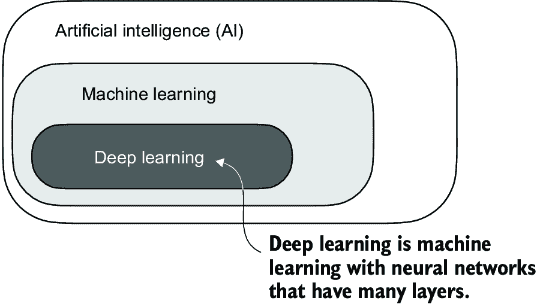
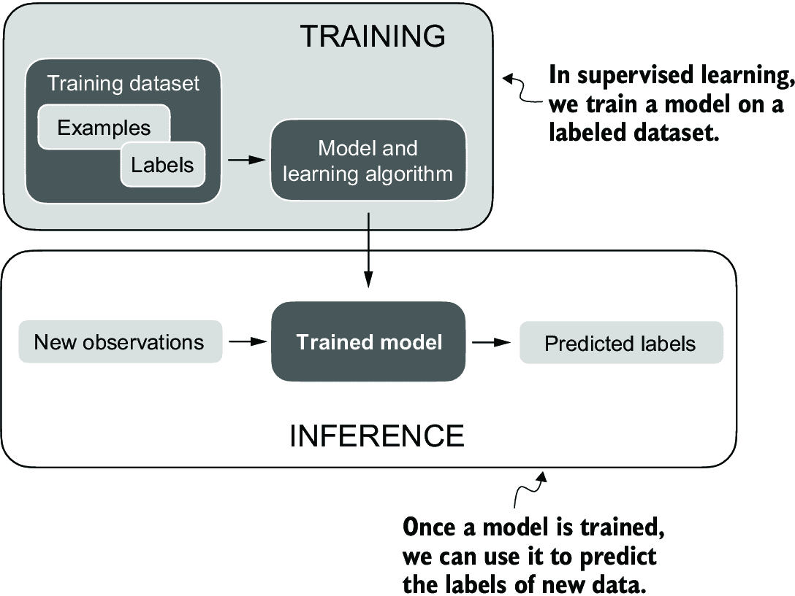
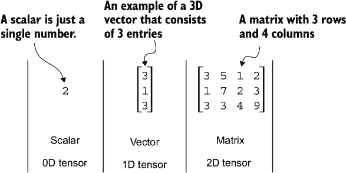
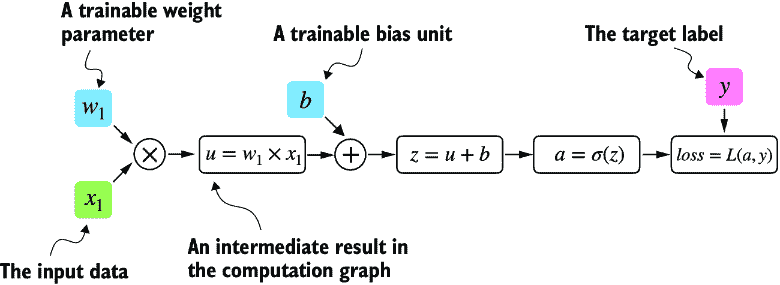
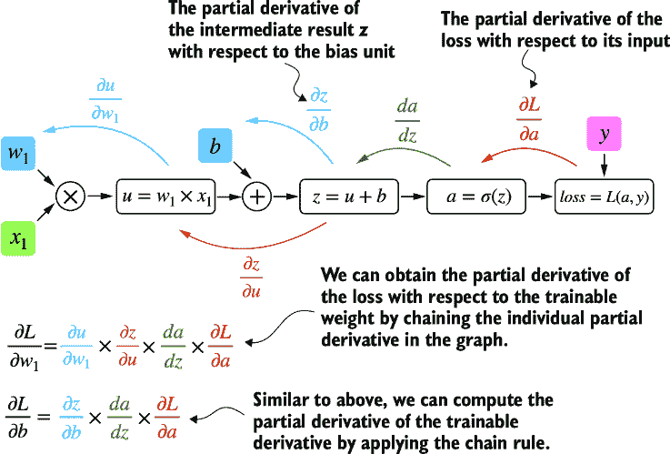
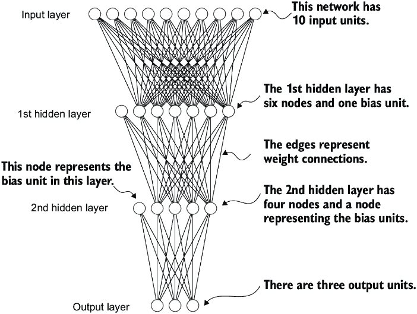
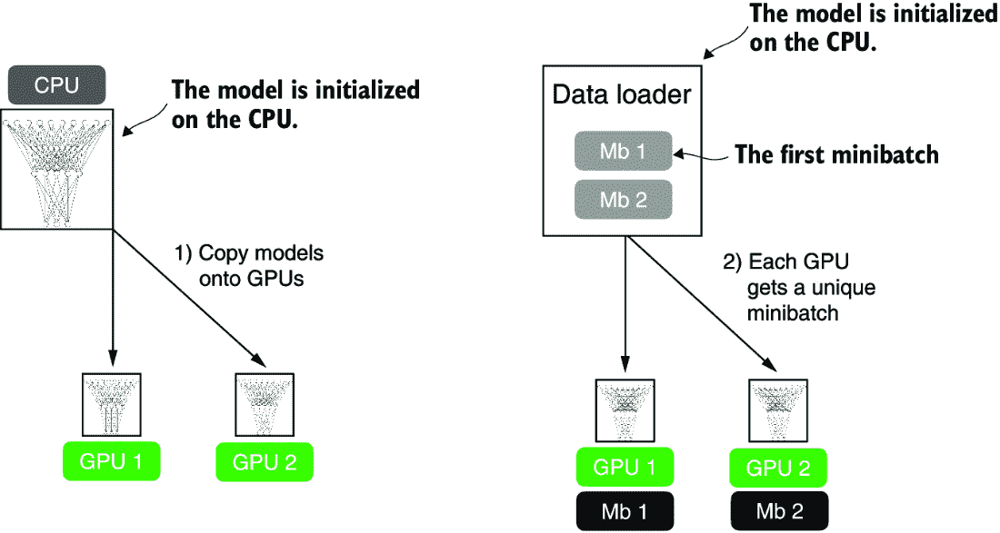

# 附录 A PyTorch 简介

本附录旨在为您提供将深度学习应用于实践并从头开始实现大型语言模型（LLMs）所需的基本技能和知识。PyTorch，一个流行的基于 Python 的深度学习库，将是本书的主要工具。我将指导您使用 PyTorch 和 GPU 支持设置深度学习工作空间。

接下来，您将了解张量这一基本概念及其在 PyTorch 中的使用。我们还将深入了解 PyTorch 的自动微分引擎，这是一个使我们能够方便且高效地使用反向传播的功能，而反向传播是神经网络训练的关键方面。

本附录旨在为那些刚开始使用 PyTorch 进行深度学习的人提供入门指南。虽然它从底层解释了 PyTorch，但它并不旨在全面覆盖 PyTorch 库。相反，我们将专注于我们将用于实现 LLMs 的 PyTorch 基础知识。如果您已经熟悉深度学习，您可以跳过本附录，直接进入第二章。

## A.1 什么是 PyTorch？

PyTorch ([`pytorch.org/`](https://pytorch.org/)) 是一个开源的基于 Python 的深度学习库。根据 *Papers With Code* ([`paperswithcode.com/trends`](https://paperswithcode.com/trends)) 平台，该平台跟踪和分析研究论文，PyTorch 自 2019 年以来一直是研究中最广泛使用的深度学习库，并且差距很大。根据 *Kaggle 数据科学和机器学习调查 2022* ([`www.kaggle.com/c/kaggle-survey-2022`](https://www.kaggle.com/c/kaggle-survey-2022))，使用 PyTorch 的受访者数量大约为 40%，并且每年都在增长。

PyTorch 之所以如此受欢迎，其中一个原因就是其用户友好的界面和效率。尽管它易于访问，但它并没有在灵活性上妥协，允许高级用户调整模型的高级方面以进行定制和优化。简而言之，对于许多实践者和研究人员来说，PyTorch 在可用性和功能之间提供了恰到好处的平衡。

### A.1.1 PyTorch 的三个核心组件

PyTorch 是一个相对全面的库，一种接近它的方法是关注其三个主要组件，如图 A.1 所示。


##### 图 A.1 PyTorch 的三个主要组件包括作为计算基本构建块的张量库、用于模型优化的自动微分以及深度学习实用函数，这使得实现和训练深度神经网络模型变得更加容易。

首先，PyTorch 是一个*张量库*，它扩展了数组导向编程库 NumPy 的概念，并增加了加速 GPU 上计算的功能，从而在 CPU 和 GPU 之间提供无缝切换。其次，PyTorch 是一个*自动微分引擎*，也称为 autograd，它能够自动计算张量操作的梯度，简化了反向传播和模型优化。最后，PyTorch 是一个*深度学习库*。它提供了模块化、灵活且高效的构建块，包括预训练模型、损失函数和优化器，用于设计和训练各种深度学习模型，满足研究人员和开发者的需求。

### A.1.2 定义深度学习

在新闻中，大型语言模型（LLMs）通常被称为 AI 模型。然而，LLMs 也是一种深度神经网络，PyTorch 是一个深度学习库。听起来很复杂？在我们继续之前，让我们简要总结一下这些术语之间的关系。

*人工智能*的基本目标是创建能够执行通常需要人类智能的任务的计算机系统。这些任务包括理解自然语言、识别模式和做出决策。（尽管取得了重大进展，但 AI 距离达到这种通用智能水平还有很长的路要走。）

*机器学习*是 AI 的一个子领域，如图 A.2 所示，它专注于开发和改进学习算法。机器学习背后的关键思想是使计算机能够从数据中学习并做出预测或决策，而无需明确编程来执行该任务。这涉及到开发能够识别模式、从历史数据中学习，并在更多数据和反馈的帮助下随着时间的推移提高其性能的算法。



##### 图 A.2 深度学习是机器学习的一个子类别，专注于实现深度神经网络。机器学习是 AI 的一个子类别，它关注的是从数据中学习的算法。AI 是更广泛的概念，即机器能够执行通常需要人类智能的任务。

机器学习一直是 AI 演变的关键，推动了今天我们所看到的许多进步，包括 LLMs。机器学习还支持在线零售商和流媒体服务使用的推荐系统、电子邮件垃圾邮件过滤、虚拟助手中的语音识别，甚至自动驾驶汽车等技术。机器学习的引入和进步显著增强了 AI 的能力，使其能够超越严格的基于规则的系统，并适应新的输入或不断变化的环境。

*深度学习*是机器学习的一个子类别，它专注于深度神经网络的训练和应用。这些深度神经网络最初是受人类大脑工作方式的启发，特别是许多神经元之间的相互连接。深度学习中的“深度”指的是人工神经元或节点的多层隐藏层，这使得它们能够模拟数据中的复杂、非线性关系。与擅长简单模式识别的传统机器学习技术不同，深度学习特别擅长处理非结构化数据，如图像、音频或文本，因此它特别适合 LLMs。

机器学习和深度学习中的典型预测建模工作流程（也称为*监督学习*）在图 A.3 中进行了总结。



##### 图 A.3 预测建模的监督学习工作流程包括一个训练阶段，在这个阶段，模型在训练数据集上的标记示例上进行训练。训练好的模型随后可以用来预测新观察结果的标签。

使用学习算法，模型在由示例及其对应标签组成的训练数据集上进行训练。例如，在电子邮件垃圾邮件分类器的情况下，训练数据集包括电子邮件及其人类识别的“垃圾邮件”和“非垃圾邮件”标签。然后，训练好的模型可以用于新的观察结果（即新的电子邮件）来预测它们的未知标签（“垃圾邮件”或“非垃圾邮件”）。当然，我们还想在训练和推理阶段之间添加模型评估，以确保在将其用于实际应用之前，模型满足我们的性能标准。

如果我们训练 LLMs 来对文本进行分类，训练和使用 LLMs 的工作流程与图 A.3 中描述的类似。如果我们对训练 LLMs 生成文本感兴趣，这是我们主要关注的焦点，图 A.3 仍然适用。在这种情况下，预训练期间的标签可以从文本本身（第一章中引入的下一词预测任务）中推导出来。在推理期间，LLM 将根据输入提示生成全新的文本（而不是预测标签）。

### A.1.3 安装 PyTorch

PyTorch 的安装方法与其他 Python 库或包类似。然而，由于 PyTorch 是一个包含 CPU 和 GPU 兼容代码的综合库，安装可能需要额外的解释。

##### Python 版本

许多科学计算库并不立即支持 Python 的最新版本。因此，在安装 PyTorch 时，建议使用一个比最新版本早一两个发布版本的 Python。例如，如果 Python 的最新版本是 3.13，那么使用 Python 3.11 或 3.12 是推荐的。

例如，PyTorch 有两个版本：一个仅支持 CPU 计算的精简版和一个支持 CPU 和 GPU 计算的完整版。如果您的机器有一个可用于深度学习的 CUDA 兼容 GPU（理想情况下是 NVIDIA T4、RTX 2080 Ti 或更新的型号），我建议安装 GPU 版本。无论如何，在代码终端中安装 PyTorch 的默认命令是：

```py
pip install torch
```

假设您的计算机支持 CUDA 兼容的 GPU，那么它将自动安装支持通过 CUDA 进行 GPU 加速的 PyTorch 版本，前提是您正在工作的 Python 环境已安装必要的依赖项（如 `pip`）。

注意：截至本文撰写时，PyTorch 还通过 ROCm 添加了对 AMD GPU 的实验性支持。有关更多信息，请参阅 [`pytorch.org`](https://pytorch.org)。

要明确安装与 CUDA 兼容的 PyTorch 版本，通常最好指定 PyTorch 要兼容的 CUDA 版本。PyTorch 的官方网站 ([`pytorch.org`](https://pytorch.org)) 为不同操作系统提供了安装具有 CUDA 支持的 PyTorch 的命令。图 A.4 显示了一个将安装 PyTorch 以及可选的 `torchvision` 和 `torchaudio` 库的命令。


##### 图 A.4 通过 [`pytorch.org`](https://pytorch.org) 访问 PyTorch 安装推荐，以自定义并选择适合您系统的安装命令。

我在示例中使用 PyTorch 2.4.0，因此我建议您使用以下命令安装确切版本，以确保与本书兼容：

```py
pip install torch==2.4.0
```

然而，如前所述，根据您的操作系统，安装命令可能与这里显示的略有不同。因此，我建议您访问 [`pytorch.org`](https://pytorch.org) 并使用安装菜单（见图 A.4）选择适合您操作系统的安装命令。请记住，在命令中将 `torch` 替换为 `torch==2.4.0`。

要检查 PyTorch 的版本，请在 PyTorch 中执行以下代码：

```py
import torch
torch.__version__
```

这将打印

```py
'2.4.0'
```

##### PyTorch 和 Torch

Python 库被命名为 PyTorch，主要是因为它是 Torch 库的延续，但已针对 Python 进行了适配（因此称为“PyTorch”）。“Torch”承认该库起源于 Torch，这是一个广泛支持机器学习算法的科学计算框架，最初是用 Lua 编程语言创建的。

如果您需要额外的建议和说明，用于设置 Python 环境或安装本书中使用的其他库，请访问本书的补充 GitHub 仓库 [`github.com/rasbt/LLMs-from-scratch`](https://github.com/rasbt/LLMs-from-scratch)。

安装 PyTorch 后，您可以通过在 Python 中运行以下代码来检查您的安装是否识别了内置的 NVIDIA GPU：

```py
import torch
torch.cuda.is_available()
```

这将返回

```py
True
```

如果命令返回 `True`，则一切准备就绪。如果命令返回 `False`，则您的计算机可能没有兼容的 GPU，或者 PyTorch 无法识别它。虽然本书的前几章不需要 GPU，这些章节主要关注于教育目的实现 LLM，但 GPU 可以显著加快深度学习相关计算。

如果您无法访问 GPU，有几个云计算提供商允许用户按小时计费运行 GPU 计算。一个流行的类似 Jupyter 笔记本的环境是 Google Colab ([`colab.research.google.com`](https://colab.research.google.com))，截至本文撰写时，它提供了时间有限的 GPU 访问。使用运行时菜单，可以选择一个 GPU，如图 A.5 中的截图所示。


##### 图 A.5 在运行时/更改运行时类型菜单下选择 Google Colab 的 GPU 设备。

##### 苹果硅上的 PyTorch

如果您有一台配备苹果硅芯片的苹果 Mac（如 M1、M2、M3 或更新的型号），您可以使用其功能来加速 PyTorch 代码的执行。要使用您的苹果硅芯片为 PyTorch，您首先需要像平常一样安装 PyTorch。然后，为了检查您的 Mac 是否支持使用其苹果硅芯片进行 PyTorch 加速，您可以在 Python 中运行一个简单的代码片段：

```py
print(torch.backends.mps.is_available())
```

如果它返回 `True`，则意味着您的 Mac 拥有可以用于加速 PyTorch 代码的苹果硅芯片。

##### 练习 A.1

在您的计算机上安装和设置 PyTorch

##### 练习 A.2

运行补充代码 [`mng.bz/o05v`](https://mng.bz/o05v)，检查您的环境是否设置正确。

## A.2 理解张量

张量代表了一种将向量矩阵推广到可能更高维度的数学概念。换句话说，张量是可以通过其阶数（或阶数）来表征的数学对象，它提供了维数的数量。例如，标量（只是一个数字）是阶数为 0 的张量，向量是阶数为 1 的张量，矩阵是阶数为 2 的张量，如图 A.6 所示。



##### 图 A.6 不同阶的张量。其中 0D 对应阶数为 0，1D 对应阶数为 1，2D 对应阶数为 2。一个由三个元素组成的三维向量仍然是一个阶数为 1 的张量。

从计算的角度来看，张量作为数据容器。例如，它们持有多维数据，其中每个维度代表一个不同的特征。像 PyTorch 这样的张量库可以高效地创建、操作和计算这些数组。在这种情况下，张量库充当数组库。

PyTorch 张量类似于 NumPy 数组，但具有几个对深度学习非常重要的附加功能。例如，PyTorch 添加了一个自动微分引擎，简化了*计算梯度*（见第 A.4 节）。PyTorch 张量还支持 GPU 计算，以加快深度神经网络训练（见第 A.9 节）。

##### 带有 NumPy-like API 的 PyTorch

PyTorch 采用了 NumPy 数组 API 和语法的大多数部分来执行其张量操作。如果您是 NumPy 的新手，您可以通过我的文章“Python 中的科学计算：NumPy 和 Matplotlib 简介”快速了解最相关的概念，该文章可在[`sebastianraschka.com/blog/2020/numpy-intro.html`](https://sebastianraschka.com/blog/2020/numpy-intro.html)找到。

### A.2.1 标量、向量、矩阵和张量

如前所述，PyTorch 张量是类似数组的结构的数据容器。标量是零维张量（例如，只是一个数字），向量是一维张量，矩阵是二维张量。对于更高维度的张量没有特定的术语，所以我们通常将三维张量称为 3D 张量，依此类推。我们可以使用 `torch.tensor` 函数创建 PyTorch 的 `Tensor` 类对象，如下所示。

##### 列表 A.1 创建 PyTorch 张量

```py
import torch

tensor0d = torch.tensor(1)     #1

tensor1d = torch.tensor([1, 2, 3])    #2

tensor2d = torch.tensor([[1, 2], 
                         [3, 4]])     #3

tensor3d = torch.tensor([[[1, 2], [3, 4]], 
                         [[5, 6], [7, 8]]])    #4
```

#1 从 Python 整数创建零维张量（标量）

#2 从 Python 列表创建一维张量（向量）

#3 从嵌套 Python 列表创建二维张量

#4 从嵌套 Python 列表创建三维张量

### A.2.2 张量数据类型

PyTorch 采用 Python 的默认 64 位整数数据类型。我们可以通过张量的 `.dtype` 属性访问张量的数据类型：

```py
tensor1d = torch.tensor([1, 2, 3])
print(tensor1d.dtype)
```

这将打印

```py
torch.int64
```

如果我们从 Python 浮点数创建张量，PyTorch 默认创建 32 位精度的张量：

```py
floatvec = torch.tensor([1.0, 2.0, 3.0])
print(floatvec.dtype)
```

输出是

```py
torch.float32
```

这种选择主要是由于精度和计算效率之间的平衡。32 位浮点数提供了足够的精度，适用于大多数深度学习任务，同时比 64 位浮点数消耗更少的内存和计算资源。此外，GPU 架构针对 32 位计算进行了优化，使用这种数据类型可以显著加快模型训练和推理。

此外，可以使用张量的 `.to` 方法更改精度。以下代码通过将 64 位整数张量转换为 32 位浮点张量来演示这一点：

```py
floatvec = tensor1d.to(torch.float32)
print(floatvec.dtype)
```

这将返回

```py
torch.float32
```

有关 PyTorch 中可用的不同张量数据类型的更多信息，请查看官方文档[`pytorch.org/docs/stable/tensors.html`](https://pytorch.org/docs/stable/tensors.html)。

### A.2.3 常见的 PyTorch 张量操作

本书不涵盖所有不同的 PyTorch 张量操作和命令的全面介绍。然而，随着我们在书中介绍这些操作，我会简要描述相关的操作。

我们已经介绍了 `torch.tensor()` 函数来创建新的张量：

```py
tensor2d = torch.tensor([[1, 2, 3], 
                         [4, 5, 6]])
print(tensor2d)
```

这将打印

```py
tensor([[1, 2, 3],
        [4, 5, 6]])
```

此外，`.shape` 属性允许我们访问张量的形状：

```py
print(tensor2d.shape)
```

输出是

```py
torch.Size([2, 3])
```

如您所见，`.shape` 返回 `[2,` `3]`，这意味着张量有两行三列。要将张量重塑为 3 × 2 张量，我们可以使用 `.reshape` 方法：

```py
print(tensor2d.reshape(3, 2))
```

这将打印

```py
tensor([[1, 2],
        [3, 4],
        [5, 6]])
```

然而，请注意，在 PyTorch 中重塑张量的更常见命令是 `.view()`：

```py
print(tensor2d.view(3, 2))
```

输出是

```py
tensor([[1, 2],
        [3, 4],
        [5, 6]])
```

与 `.reshape` 和 `.view` 类似，在几个情况下，PyTorch 为执行相同的计算提供了多个语法选项。PyTorch 最初遵循原始 Lua Torch 语法约定，但后来，根据普遍的要求，添加了与 NumPy 类似的语法。（PyTorch 中 `.view()` 和 `.reshape()` 之间的细微差别在于它们对内存布局的处理：`.view()` 要求原始数据是连续的，如果不是，将会失败，而 `.reshape()` 将会工作，如果需要，会复制数据以确保所需的形状。）

接下来，我们可以使用 `.T` 来转置一个张量，这意味着沿着其对角线翻转它。请注意，这与重塑张量不同，正如以下结果所示：

```py
print(tensor2d.T)
```

输出是

```py
tensor([[1, 4],
        [2, 5],
        [3, 6]])
```

最后，PyTorch 中乘以两个矩阵的常用方法是 `.matmul` 方法：

```py
print(tensor2d.matmul(tensor2d.T))
```

输出是

```py
tensor([[14, 32],
        [32, 77]])
```

然而，我们也可以采用 `@` 操作符，它可以更紧凑地完成相同的事情：

```py
print(tensor2d @ tensor2d.T)
```

这会打印

```py
tensor([[14, 32],
        [32, 77]])
```

如前所述，当需要时，我会引入额外的操作。对于想要浏览 PyTorch 中所有不同张量操作的读者（我们不需要这些中的大多数），我建议查看官方文档[`pytorch.org/docs/stable/tensors.html`](https://pytorch.org/docs/stable/tensors.html)。

## A.3 将模型视为计算图

现在让我们看看 PyTorch 的自动微分引擎，也称为 autograd。PyTorch 的 autograd 系统提供函数来自动计算动态计算图中的梯度。

计算图是一个有向图，它允许我们表达和可视化数学表达式。在深度学习的上下文中，计算图展示了计算神经网络输出所需的一系列计算——我们将需要它来计算反向传播所需的梯度，这是神经网络的主要训练算法。

让我们通过一个具体的例子来说明计算图的概念。以下列表中的代码实现了简单逻辑回归分类器的正向传递（预测步骤），这可以被视为单层神经网络。它返回一个介于 0 和 1 之间的分数，当计算损失时，这个分数会与真实的类别标签（0 或 1）进行比较。

##### 列表 A.2 逻辑回归正向传递

```py
import torch.nn.functional as F     #1

y = torch.tensor([1.0])          #2
x1 = torch.tensor([1.1])    #3
w1 = torch.tensor([2.2])    #4
b = torch.tensor([0.0])            #5
z = x1 * w1 + b                 #6
a = torch.sigmoid(z)               #7
loss = F.binary_cross_entropy(a, y)
```

#1 这个导入语句是 PyTorch 中的常见约定，用于防止代码行过长。

#2 真实标签

#3 输入特征

#4 权重参数

#5 偏置单元

#6 网络输入

#7 激活和输出

如果前面的代码中有些部分对你来说没有意义，不要担心。这个示例的目的不是实现一个逻辑回归分类器，而是说明我们可以如何将一系列计算视为一个计算图，如图 A.7 所示。



##### 图 A.7 展示了逻辑回归的前向传递作为计算图。输入特征 x[1]乘以模型权重 w[1]，在添加偏差后通过激活函数 s，然后通过比较模型输出 a 与给定的标签 y 来计算损失。

事实上，PyTorch 在后台构建这样的计算图，我们可以使用它来计算损失函数相对于模型参数（此处*w*[1]和*b*）的梯度，以训练模型。

## A.4 自动微分变得简单

如果我们在 PyTorch 中进行计算，它将默认内部构建一个计算图，如果其终端节点之一设置了`requires_grad`属性为`True`。如果我们想计算梯度，这很有用。在通过流行的反向传播算法训练神经网络时需要梯度，这可以被认为是微积分中的链式法则在神经网络中的实现，如图 A.8 所示。



##### 图 A.8 计算图中损失梯度的最常见方法是从右到左应用链式法则，也称为反向模型自动微分或反向传播。我们从输出层（或损失本身）开始，通过网络反向到输入层。我们这样做是为了计算损失相对于网络中每个参数（权重和偏差）的梯度，这告诉我们如何在训练期间更新这些参数。

#### 偏导数和梯度

图 A.8 显示了偏导数，它衡量了函数相对于其变量的变化率。*梯度*是一个包含多变量函数所有偏导数的向量，该函数的输入变量不止一个。

如果你对偏导数、梯度或微积分中的链式法则不熟悉或记不清楚，不要担心。从高层次来看，这本书你需要知道的是，链式法则是通过计算图中的模型参数来计算损失函数梯度的方法。这提供了更新每个参数以最小化损失函数所需的信息，损失函数作为衡量模型性能的代理，可以使用梯度下降等方法。我们将在 A.7 节中回顾 PyTorch 中这个训练循环的计算实现。

这一切都是如何与前面提到的 PyTorch 库的第二组件自动微分（autograd）引擎相关联的呢？PyTorch 的 autograd 引擎通过跟踪对张量执行的每个操作，在后台构建一个计算图。然后，调用`grad`函数，我们可以计算关于模型参数`w1`的损失梯度，如下面的列表所示。

##### 列表 A.3 通过 autograd 计算梯度

```py
import torch.nn.functional as F
from torch.autograd import grad

y = torch.tensor([1.0])
x1 = torch.tensor([1.1])
w1 = torch.tensor([2.2], requires_grad=True)
b = torch.tensor([0.0], requires_grad=True)

z = x1 * w1 + b 
a = torch.sigmoid(z)

loss = F.binary_cross_entropy(a, y)

grad_L_w1 = grad(loss, w1, retain_graph=True)   #1
grad_L_b = grad(loss, b, retain_graph=True)
```

#1 默认情况下，PyTorch 在计算梯度后会销毁计算图以释放内存。然而，由于我们很快将重用这个计算图，我们设置 retain_graph=True 以使其留在内存中。

给定模型参数的损失梯度的结果值是

```py
print(grad_L_w1)
print(grad_L_b)
```

This prints

```py
(tensor([-0.0898]),)
(tensor([-0.0817]),)
```

在这里，我们一直在手动使用 grad 函数，这对于实验、调试和展示概念可能很有用。但是，在实践中，PyTorch 提供了更多高级工具来自动化这个过程。例如，我们可以在损失上调用 `.backward`，PyTorch 将计算图中所有叶节点的梯度，这些梯度将通过张量的 `.grad` 属性存储：

```py
loss.backward()
print(w1.grad)
print(b.grad)
```

输出如下

```py
(tensor([-0.0898]),)
(tensor([-0.0817]),)
```

我已经提供了很多信息，你可能被微积分概念所淹没，但不用担心。虽然这种微积分术语是解释 PyTorch 的 autograd 组件的手段，但你只需要记住 PyTorch 通过 `.backward` 方法为我们处理微积分——我们不需要手动计算任何导数或梯度。

## A.5 实现多层神经网络

接下来，我们将重点关注 PyTorch 作为实现深度神经网络的库。为了提供一个具体的例子，让我们看看一个多层感知器，一个全连接神经网络，如图 A.9 所示。



##### 图 A.9 具有两个隐藏层的多层感知器。每个节点代表相应层中的一个单元。为了说明目的，每个层都有非常少的节点。

当在 PyTorch 中实现神经网络时，我们可以通过继承 `torch.nn.Module` 类来定义我们自己的自定义网络架构。这个 `Module` 基类提供了很多功能，使得构建和训练模型变得更加容易。例如，它允许我们封装层和操作，并跟踪模型的参数。

在这个子类中，我们在 `__init__` 构造函数中定义网络层，并在 `forward` 方法中指定层之间的交互方式。`forward` 方法描述了输入数据如何通过网络，并作为一个计算图汇集在一起。相比之下，我们通常不需要自己实现的 `backward` 方法，在训练期间用于根据模型参数计算损失函数的梯度（参见 A.7 节）。以下列表中的代码实现了一个具有两个隐藏层的经典多层感知器，以展示 `Module` 类的典型用法。

##### 列表 A.4 具有两个隐藏层的多层感知器

```py
class NeuralNetwork(torch.nn.Module):
    def __init__(self, num_inputs, num_outputs):    #1
        super().__init__()

        self.layers = torch.nn.Sequential(

            # 1st hidden layer
            torch.nn.Linear(num_inputs, 30),    #2
            torch.nn.ReLU(),               #3

            # 2nd hidden layer
            torch.nn.Linear(30, 20),    #4
            torch.nn.ReLU(),

            # output layer
            torch.nn.Linear(20, num_outputs),
        )

    def forward(self, x):
        logits = self.layers(x)
        return logits           #5
```

#1 将输入和输出编码为变量允许我们为具有不同特征和类数的不同数据集重用相同的代码

#2 线性层将输入和输出节点数作为参数。

#3 非线性激活函数放置在隐藏层之间。

#4 一个隐藏层的输出节点数必须与下一层的输入数相匹配。

#5 最后层的输出被称为 logits。

然后，我们可以如下实例化一个新的神经网络对象：

```py
model = NeuralNetwork(50, 3)
```

在使用这个新的`model`对象之前，我们可以对模型调用`print`来查看其结构的摘要：

```py
print(model)
```

这会打印

```py
NeuralNetwork(
  (layers): Sequential(
    (0): Linear(in_features=50, out_features=30, bias=True)
    (1): ReLU()
    (2): Linear(in_features=30, out_features=20, bias=True)
    (3): ReLU()
    (4): Linear(in_features=20, out_features=3, bias=True)
  )
)
```

注意，当我们实现`NeuralNetwork`类时，我们使用`Sequential`类。`Sequential`不是必需的，但如果我们要按特定顺序执行一系列层，这可以使我们的工作更简单，就像在这里的情况一样。这样，在`__init__`构造函数中将`self.layers`设置为`Sequential(...)`之后，我们只需要调用`self.layers`，而不是在`NeuralNetwork`的`forward`方法中逐个调用每个层。

接下来，让我们检查这个模型的可训练参数总数：

```py
num_params = sum(p.numel() for p in model.parameters() if p.requires_grad)
print("Total number of trainable model parameters:", num_params)
```

这会打印

```py
Total number of trainable model parameters: 2213
```

对于每个`requires_grad=True`的参数，都算作一个可训练参数，将在训练过程中更新（参见第 A.7 节）。

在我们前面两个隐藏层的神经网络模型中，这些可训练参数包含在`torch.nn.Linear`层中。一个`Linear`层将输入与权重矩阵相乘并添加一个偏差向量。这有时被称为*前馈*或*全连接*层。

基于我们在这里执行的`print(model)`调用，我们可以看到第一个`Linear`层在`layers`属性中的索引位置是 0。我们可以如下访问相应的权重参数矩阵：

```py
print(model.layers[0].weight)
```

这会打印

```py
Parameter containing:
tensor([[ 0.1174, -0.1350, -0.1227,  ...,  0.0275, -0.0520, -0.0192],
        [-0.0169,  0.1265,  0.0255,  ..., -0.1247,  0.1191, -0.0698],
        [-0.0973, -0.0974, -0.0739,  ..., -0.0068, -0.0892,  0.1070],
        ...,
        [-0.0681,  0.1058, -0.0315,  ..., -0.1081, -0.0290, -0.1374],
        [-0.0159,  0.0587, -0.0916,  ..., -0.1153,  0.0700,  0.0770],
        [-0.1019,  0.1345, -0.0176,  ...,  0.0114, -0.0559, -0.0088]],
       requires_grad=True)
```

由于这个大矩阵没有全部显示，让我们使用`.shape`属性来显示其维度：

```py
print(model.layers[0].weight.shape)
```

结果是

```py
torch.Size([30, 50])
```

（同样，你也可以通过`model.layers[0].bias`访问偏差向量。）

这里的权重矩阵是一个 30 × 50 的矩阵，我们可以看到`requires_grad`被设置为`True`，这意味着它的条目是可训练的——这是`torch.nn.Linear`中权重和偏差的默认设置。

如果你在你自己的计算机上执行前面的代码，权重矩阵中的数字可能会与显示的不同。模型权重使用小的随机数初始化，每次实例化网络时都不同。在深度学习中，使用小的随机数初始化模型权重是为了在训练期间打破对称性。否则，节点在反向传播期间会执行相同的操作和更新，这不会允许网络从输入到输出学习复杂的映射。

然而，虽然我们希望继续使用小的随机数作为层权重的初始值，但我们可以通过`manual_seed`对 PyTorch 的随机数生成器进行播种来使随机数初始化可重现：

```py
torch.manual_seed(123)
model = NeuralNetwork(50, 3)
print(model.layers[0].weight)
```

结果是

```py
Parameter containing:
tensor([[-0.0577,  0.0047, -0.0702,  ...,  0.0222,  0.1260,  0.0865],
        [ 0.0502,  0.0307,  0.0333,  ...,  0.0951,  0.1134, -0.0297],
        [ 0.1077, -0.1108,  0.0122,  ...,  0.0108, -0.1049, -0.1063],
        ...,
        [-0.0787,  0.1259,  0.0803,  ...,  0.1218,  0.1303, -0.1351],
        [ 0.1359,  0.0175, -0.0673,  ...,  0.0674,  0.0676,  0.1058],
        [ 0.0790,  0.1343, -0.0293,  ...,  0.0344, -0.0971, -0.0509]],
       requires_grad=True)
```

现在我们已经花了一些时间检查了`NeuralNetwork`实例，让我们简要看看它是如何通过前向传递来使用的：

```py
torch.manual_seed(123)
X = torch.rand((1, 50))
out = model(X)
print(out)
```

结果是

```py
tensor([[-0.1262,  0.1080, -0.1792]], grad_fn=<AddmmBackward0>)
```

在前面的代码中，我们生成了一个单一的随机训练示例`X`作为玩具输入（注意我们的网络期望 50 维的特征向量），并将其输入到模型中，返回三个分数。当我们调用`model(x)`时，它将自动执行模型的正向传递。

正向传递是指从输入张量计算输出张量的过程。这涉及到将输入数据通过所有神经网络层，从输入层开始，通过隐藏层，最后到输出层。

这三个返回的数字对应于分配给三个输出节点的分数。请注意，输出张量还包括一个`grad_fn`值。

这里，`grad_fn=<AddmmBackward0>`表示在计算图中计算变量的最后一个使用的函数。特别是，`grad_fn=<AddmmBackward0>`意味着我们正在检查的张量是通过矩阵乘法和加法操作创建的。PyTorch 将在反向传播期间计算梯度时使用这些信息。`grad_fn=<AddmmBackward0>`中的`<AddmmBackward0>`部分指定了执行的操作。在这种情况下，它是一个`Addmm`操作。`Addmm`代表矩阵乘法（`mm`）后跟加法（`Add`）。

如果我们只想使用一个网络而不进行训练或反向传播——例如，如果我们使用它进行训练后的预测——构建这个反向传播的计算图可能是浪费的，因为它执行了不必要的计算并消耗了额外的内存。因此，当我们使用模型进行推理（例如，进行预测）而不是训练时，最佳实践是使用`torch.no_grad()`上下文管理器。这告诉 PyTorch 它不需要跟踪梯度，这可以显著节省内存和计算：

```py
with torch.no_grad():
    out = model(X)
print(out)
```

结果是

```py
tensor([[-0.1262,  0.1080, -0.1792]])
```

在 PyTorch 中，常见的做法是编写模型，使其返回最后一层的输出（logits），而不将它们传递给非线性激活函数。这是因为 PyTorch 常用的损失函数将`softmax`（或二分类中的`sigmoid`）操作与单个类中的负对数似然损失结合在一起。这样做的原因是数值效率和稳定性。因此，如果我们想计算预测的类成员概率，我们必须显式调用`softmax`函数：

```py
with torch.no_grad():
    out = torch.softmax(model(X), dim=1)
print(out)
```

这将打印

```py
tensor([[0.3113, 0.3934, 0.2952]]))
```

现在可以将这些值解释为类成员概率，它们的总和为 1。对于这个随机输入，这些值大致相等，这是对随机初始化且未经训练的模型所预期的。

## A.6 设置高效的数据加载器

在我们能够训练我们的模型之前，我们必须简要讨论在 PyTorch 中创建高效的数据加载器，我们将在训练过程中遍历这些数据加载器。PyTorch 中数据加载的整体思想如图 A.10 所示。


##### 图 A.10 PyTorch 实现了 `Dataset` 和 `DataLoader` 类。`Dataset` 类用于实例化对象，这些对象定义了如何加载每个数据记录。`DataLoader` 处理数据如何打乱和组装成批次。

在图 A.10 之后，我们将实现一个自定义 `Dataset` 类，我们将使用它来创建一个训练集和一个测试集，然后我们将使用这些数据集来创建数据加载器。让我们先创建一个包含五个训练示例的简单玩具数据集，每个示例有两个特征。与训练示例一起，我们还创建了一个包含相应类标签的张量：三个示例属于类别 0，两个示例属于类别 1。此外，我们还创建了一个包含两个条目的测试集。创建此数据集的代码如下所示。

##### 列表 A.5 创建一个小型玩具数据集

```py
X_train = torch.tensor([
    [-1.2, 3.1],
    [-0.9, 2.9],
    [-0.5, 2.6],
    [2.3, -1.1],
    [2.7, -1.5]
])
y_train = torch.tensor([0, 0, 0, 1, 1])

X_test = torch.tensor([
    [-0.8, 2.8],
    [2.6, -1.6],
])
y_test = torch.tensor([0, 1])
```

注意：PyTorch 要求类标签从 0 开始，最大的类标签值不应超过输出节点数减 1（因为 Python 索引计数从零开始）。所以，如果我们有类标签 0、1、2、3 和 4，神经网络输出层应该由五个节点组成。

接下来，我们通过从 PyTorch 的 `Dataset` 父类派生，创建一个自定义数据集类 `ToyDataset`，如下所示。

##### 列表 A.6 定义自定义 `Dataset` 类

```py
from torch.utils.data import Dataset

class ToyDataset(Dataset):
    def __init__(self, X, y):
        self.features = X
        self.labels = y

    def __getitem__(self, index):        #1
        one_x = self.features[index]     #1
        one_y = self.labels[index]       #1
        return one_x, one_y              #1

    def __len__(self):
        return self.labels.shape[0]      #2

train_ds = ToyDataset(X_train, y_train)
test_ds = ToyDataset(X_test, y_test)
```

#1 检索一个数据记录及其对应标签的说明

#2 返回数据集总长度的说明

这个自定义 `ToyDataset` 类的目的是实例化一个 PyTorch `DataLoader`。但在我们到达这一步之前，让我们简要地回顾一下 `ToyDataset` 代码的一般结构。

在 PyTorch 中，自定义 `Dataset` 类的三个主要组件是 `__init__` 构造函数、`__getitem__` 方法以及 `__len__` 方法（见列表 A.6）。在 `__init__` 方法中，我们设置可以在后续的 `__getitem__` 和 `__len__` 方法中访问的属性。这些可能是文件路径、文件对象、数据库连接器等等。由于我们创建了一个驻留在内存中的张量数据集，我们只需将这些属性分配给 `X` 和 `y`，它们是我们张量对象的占位符。

在 `__getitem__` 方法中，我们定义了通过 `index` 返回数据集中一个项目的说明。这指的是与单个训练示例或测试实例对应的特征和类标签。（数据加载器将提供这个 `index`，我们将在稍后介绍。）

最后，`__len__` 方法包含了检索数据集长度的说明。在这里，我们使用张量的 `.shape` 属性来返回特征数组中的行数。在训练数据集的情况下，我们有五行，我们可以进行双重检查：

```py
print(len(train_ds))
```

结果是

```py
5
```

现在我们已经定义了一个可以用于我们的玩具数据集的 PyTorch `Dataset` 类，我们可以使用 PyTorch 的 `DataLoader` 类从中采样，如下所示。

##### 列表 A.7 实例化数据加载器

```py
from torch.utils.data import DataLoader

torch.manual_seed(123)

train_loader = DataLoader(
    dataset=train_ds,     #1
    batch_size=2,
    shuffle=True,          #2
    num_workers=0     #3
)

test_loader = DataLoader(
    dataset=test_ds,
    batch_size=2,
    shuffle=False,     #4
    num_workers=0
)
```

#1 之前创建的 ToyDataset 实例作为数据加载器的输入。

#2 是否洗牌数据

#3 背景进程的数量

#4 测试数据集不需要洗牌。

在实例化训练数据加载器之后，我们可以遍历它。对`test_loader`的遍历方式类似，但为了简洁起见省略了：

```py
for idx, (x, y) in enumerate(train_loader):
    print(f"Batch {idx+1}:", x, y)
```

结果是

```py
Batch 1: tensor([[-1.2000,  3.1000],
                 [-0.5000,  2.6000]]) tensor([0, 0])
Batch 2: tensor([[ 2.3000, -1.1000],
                 [-0.9000,  2.9000]]) tensor([1, 0])
Batch 3: tensor([[ 2.7000, -1.5000]]) tensor([1])
```

根据前面的输出，我们可以看到`train_loader`遍历训练数据集，每个训练示例恰好访问一次。这被称为一个训练周期。由于我们在这里使用`torch.manual_seed(123)`初始化了随机数生成器，你应该得到相同的训练示例洗牌顺序。然而，如果你第二次遍历数据集，你会看到洗牌顺序会改变。这是期望的，以防止深度神经网络在训练过程中陷入重复的更新循环。

在这里，我们指定了批大小为 2，但第三个批次只包含一个示例。这是因为我们有五个训练示例，而 5 不能被 2 整除。在实际应用中，如果训练周期中的最后一个批次显著较小，可能会在训练过程中干扰收敛。为了防止这种情况，设置`drop_last=True`，这将丢弃每个周期中的最后一个批次，如下面的列表所示。

##### 列表 A.8 一个丢弃最后一个批次的训练加载器

```py
train_loader = DataLoader(
    dataset=train_ds,
    batch_size=2,
    shuffle=True,
    num_workers=0,
    drop_last=True
)
```

现在，遍历训练加载器，我们可以看到最后一个批次被省略了：

```py
for idx, (x, y) in enumerate(train_loader):
    print(f"Batch {idx+1}:", x, y)
```

结果是

```py
Batch 1: tensor([[-0.9000,  2.9000],
        [ 2.3000, -1.1000]]) tensor([0, 1])
Batch 2: tensor([[ 2.7000, -1.5000],
        [-0.5000,  2.6000]]) tensor([1, 0])
```

最后，让我们讨论`DataLoader`中的设置`num_workers=0`。在 PyTorch 的`DataLoader`函数中，此参数对于并行化数据加载和预处理至关重要。当`num_workers`设置为 0 时，数据加载将在主进程中完成，而不是在单独的工作进程中。这看起来可能没有问题，但当我们在大 GPU 上训练更大的网络时，它可能导致模型训练期间出现显著的减速。在这种情况下，CPU 必须花费时间来加载和预处理数据，而不是仅仅关注深度学习模型的处理。因此，GPU 可能会空闲等待 CPU 完成这些任务。相比之下，当`num_workers`设置为大于 0 的数字时，会启动多个工作进程以并行加载数据，从而让主进程专注于训练你的模型，并更好地利用系统资源（图 A.11）。


##### 图 A.11 在没有多个工作进程（设置`num_workers=0`）的情况下加载数据将创建一个数据加载瓶颈，其中模型处于空闲状态，直到加载下一个批次（左侧）。如果启用了多个工作进程，数据加载器可以在后台排队下一个批次（右侧）。

然而，如果我们处理的是非常小的数据集，将`num_workers`设置为 1 或更大可能不是必要的，因为总训练时间只需要几毫秒。所以，如果你处理的是小型数据集或 Jupyter 笔记本等交互式环境，增加`num_workers`可能不会带来任何明显的加速。实际上，它可能引起一些问题。一个潜在的问题是启动多个工作进程的开销，当数据集较小时，这可能会比实际的数据加载时间更长。

此外，对于 Jupyter 笔记本，将`num_workers`设置为大于 0 有时会导致与不同进程之间资源共享相关的问题，从而引起错误或笔记本崩溃。因此，理解权衡并就设置`num_workers`参数做出计算决策至关重要。当正确使用时，它可以是一个有益的工具，但应该根据您特定的数据集大小和计算环境进行调整以获得最佳结果。

根据我的经验，将`num_workers`设置为 4 通常在许多实际数据集上能带来最佳性能，但最佳设置取决于您的硬件以及用于加载`Dataset`类中定义的训练示例的代码。

## A.7 典型的训练循环

现在我们将在玩具数据集上训练一个神经网络。以下列表展示了训练代码。

##### 列表 A.9 PyTorch 中的神经网络训练

```py
import torch.nn.functional as F

torch.manual_seed(123)
model = NeuralNetwork(num_inputs=2, num_outputs=2)    #1
optimizer = torch.optim.SGD(
    model.parameters(), lr=0.5
)            #2

num_epochs = 3
for epoch in range(num_epochs): 

    model.train()
    for batch_idx, (features, labels) in enumerate(train_loader):
        logits = model(features)

        loss = F.cross_entropy(logits, labels)

        optimizer.zero_grad()            #3
        loss.backward()         #4
        optimizer.step()        #5

        ### LOGGING
        print(f"Epoch: {epoch+1:03d}/{num_epochs:03d}"
              f" | Batch {batch_idx:03d}/{len(train_loader):03d}"
              f" | Train Loss: {loss:.2f}")

    model.eval()
    # Insert optional model evaluation code
```

#1 数据集有两个特征和两个类别。

#2 优化器需要知道要优化的参数。

#3 将上一轮的梯度设置为 0，以防止意外的梯度累积

#4 根据模型参数计算损失梯度

#5 优化器使用梯度来更新模型参数。

运行此代码会产生以下输出：

```py
Epoch: 001/003 | Batch 000/002 | Train Loss: 0.75
Epoch: 001/003 | Batch 001/002 | Train Loss: 0.65
Epoch: 002/003 | Batch 000/002 | Train Loss: 0.44
Epoch: 002/003 | Batch 001/002 | Trainl Loss: 0.13
Epoch: 003/003 | Batch 000/002 | Train Loss: 0.03
Epoch: 003/003 | Batch 001/002 | Train Loss: 0.00
```

如我们所见，损失在三个 epoch 后达到 0，这是模型在训练集上收敛的标志。在这里，我们初始化了一个有两个输入和两个输出的模型，因为我们的玩具数据集有两个输入特征和两个类别标签需要预测。我们使用了一个学习率（`lr`）为 0.5 的随机梯度下降（`SGD`）优化器。学习率是一个超参数，意味着它是一个可调整的设置，我们必须根据观察损失进行实验。理想情况下，我们希望选择一个学习率，使得损失在经过一定数量的 epoch 后收敛——epoch 的数量是另一个需要选择的超参数。

##### 练习 A.3

列表 A.9 中引入的神经网络有多少个参数？

实际上，我们经常使用第三个数据集，即所谓的验证数据集，以找到最佳的超参数设置。验证数据集类似于测试集。然而，我们只想精确使用一次测试集以避免评估偏差，我们通常多次使用验证集来调整模型设置。

我们还引入了新的设置，称为`model.train()`和`model.eval()`。正如这些名称所暗示的，这些设置用于将模型置于训练和评估模式。这对于在训练和推理期间表现不同的组件是必要的，例如*dropout*或*批归一化*层。由于我们的`NeuralNetwork`类中没有受这些设置影响的 dropout 或其他组件，因此在前面的代码中使用`model.train()`和`model.eval()`是多余的。然而，最好的做法是仍然包含它们，以避免在更改模型架构或重用代码来训练不同模型时出现意外行为。

如前所述，我们直接将 logits 传递到`cross_entropy`损失函数中，该函数将内部应用`softmax`函数以提高效率和数值稳定性。然后，调用`loss.backward()`将在 PyTorch 在后台构建的计算图中计算梯度。`optimizer.step()`方法将使用梯度来更新模型参数以最小化损失。对于 SGD 优化器来说，这意味着将梯度乘以学习率并将缩放后的负梯度加到参数上。

注意：为了防止不希望的梯度累积，在每个更新轮次中包含一个`optimizer.zero_grad()`调用以将梯度重置为 0 是非常重要的。否则，梯度将累积，这可能是我们不希望的。

在我们训练了模型之后，我们可以使用它来进行预测：

```py
model.eval()
with torch.no_grad():
    outputs = model(X_train)
print(outputs)
```

结果是

```py
tensor([[ 2.8569, -4.1618],
        [ 2.5382, -3.7548],
        [ 2.0944, -3.1820],
        [-1.4814,  1.4816],
        [-1.7176,  1.7342]])
```

要获得类别成员概率，我们然后可以使用 PyTorch 的`softmax`函数：

```py
torch.set_printoptions(sci_mode=False)
probas = torch.softmax(outputs, dim=1)
print(probas)
```

这会输出

```py
tensor([[    0.9991,     0.0009],
        [    0.9982,     0.0018],
        [    0.9949,     0.0051],
        [    0.0491,     0.9509],
        [    0.0307,     0.9693]])
```

让我们考虑前面代码输出的第一行。在这里，第一个值（列）表示训练示例有 99.91%的概率属于类别 0，有 0.09%的概率属于类别 1。（在这里使用`set_printoptions`调用是为了使输出更易读。）

我们可以使用 PyTorch 的`argmax`函数将这些值转换为类别标签预测，如果我们设置`dim=1`（设置`dim=0`将返回每列的最高值）：

```py
predictions = torch.argmax(probas, dim=1)
print(predictions)
```

这会打印

```py
tensor([0, 0, 0, 1, 1])
```

注意，为了获得类别标签，不需要计算`softmax`概率。我们也可以直接将`argmax`函数应用于 logits（输出）：

```py
predictions = torch.argmax(outputs, dim=1)
print(predictions)
```

输出是

```py
tensor([0, 0, 0, 1, 1])
```

在这里，我们计算了训练数据集的预测标签。由于训练数据集相对较小，我们可以通过肉眼将其与真实的训练标签进行比较，并看到模型是 100%正确的。我们可以使用`==`比较运算符来双重检查：

```py
predictions == y_train
```

结果是

```py
tensor([True, True, True, True, True])
```

使用`torch.sum`，我们可以计算正确预测的数量：

```py
torch.sum(predictions == y_train)
```

输出是

```py
5
```

由于数据集由五个训练示例组成，我们有五个预测全部正确，这表示 5/5 × 100% = 100%的预测准确率。

为了泛化预测准确度的计算，让我们实现一个 `compute_accuracy` 函数，如下所示。

##### 列表 A.10 计算预测准确度的函数

```py
def compute_accuracy(model, dataloader):

    model = model.eval()
    correct = 0.0
    total_examples = 0

    for idx, (features, labels) in enumerate(dataloader):

        with torch.no_grad():
            logits = model(features)

        predictions = torch.argmax(logits, dim=1)
        compare = labels == predictions       #1
        correct += torch.sum(compare)      #2
        total_examples += len(compare)

    return (correct / total_examples).item()    #3
```

#1 根据标签是否匹配返回 True/False 值的张量

#2 求和操作计算 True 值的数量。

#3 正确预测的比例，一个介于 0 和 1 之间的值\. .item() 返回张量的值作为 Python 浮点数。

代码遍历数据加载器以计算正确预测的数量和比例。当我们处理大型数据集时，通常由于内存限制，我们只能对数据集的一小部分调用模型。这里的 `compute_accuracy` 函数是一个通用方法，可以扩展到任意大小的数据集，因为在每次迭代中，模型接收到的数据集块的大小与训练期间看到的批量大小相同。`compute_accuracy` 函数的内部结构与我们在将 logits 转换为类别标签时使用的方法类似。

然后，我们可以将函数应用于训练：

```py
print(compute_accuracy(model, train_loader))
```

结果是

```py
1.0
```

同样，我们可以将函数应用于测试集：

```py
print(compute_accuracy(model, test_loader))
```

这将打印

```py
1.0
```

## A.8 保存和加载模型

既然我们已经训练了我们的模型，让我们看看如何保存它，以便以后可以重用。以下是使用 PyTorch 保存和加载模型的推荐方法：

```py
torch.save(model.state_dict(), "model.pth")
```

模型的 `state_dict` 是一个映射模型中的每个层到其可训练参数（权重和偏差）的 Python 字典对象。`"model.pth"` 是保存到磁盘的模型文件的任意名称。我们可以给它任何我们喜欢的名称和文件扩展名；然而，`.pth` 和 `.pt` 是最常见的约定。

保存模型后，我们可以从磁盘恢复它：

```py
model = NeuralNetwork(2, 2) 
model.load_state_dict(torch.load("model.pth"))
```

`torch.load("model.pth")` 函数读取文件 `"model.pth"` 并重建包含模型参数的 Python 字典对象，而 `model.load_state_dict()` 将这些参数应用于模型，有效地从我们保存它的状态中恢复其学习状态。

这行 `model = NeuralNetwork(2, 2)` 如果你在保存模型的同一会话中执行此代码，则不是严格必要的。然而，我将其包括在这里，以说明我们需要在内存中有一个模型的实例来应用保存的参数。在这里，`NeuralNetwork(2, 2)` 架构需要与原始保存的模型完全匹配。

## A.9 使用 GPU 优化训练性能

接下来，让我们看看如何利用 GPU，与常规 CPU 相比，GPU 可以加速深度神经网络训练。首先，我们将探讨 PyTorch 中 GPU 计算背后的主要概念。然后，我们将在单个 GPU 上训练一个模型。最后，我们将探讨使用多个 GPU 的分布式训练。

### A.9.1 在 GPU 设备上执行 PyTorch 计算

将训练循环修改为可选地在 GPU 上运行相对简单，只需更改三行代码（参见 A.7 节）。在我们进行修改之前，理解 PyTorch 中 GPU 计算背后的主要概念至关重要。在 PyTorch 中，设备是计算发生和数据驻留的地方。CPU 和 GPU 是设备的例子。PyTorch 张量位于设备中，其操作在相同的设备上执行。

让我们看看这个在实际操作中是如何工作的。假设你已经安装了与 GPU 兼容的 PyTorch 版本（参见 A.1.3 节），我们可以通过以下代码来双重检查我们的运行时是否确实支持 GPU 计算：

```py
print(torch.cuda.is_available())
```

结果是

```py
True
```

现在，假设我们有两个可以相加的张量；这个计算默认将在 CPU 上执行：

```py
tensor_1 = torch.tensor([1., 2., 3.])
tensor_2 = torch.tensor([4., 5., 6.])
print(tensor_1 + tensor_2)
```

这将输出

```py
tensor([5., 7., 9.])
```

我们现在可以使用`.to()`方法。这个方法与我们用来更改张量数据类型（参见 2.2.2 节）的方法相同，用于将这些张量传输到 GPU 并执行加法操作：

```py
tensor_1 = tensor_1.to("cuda")
tensor_2 = tensor_2.to("cuda")
print(tensor_1 + tensor_2)
```

输出是

```py
tensor([5., 7., 9.], device='cuda:0')
```

结果张量现在包含了设备信息，`device='cuda:0'`，这意味着张量位于第一块 GPU 上。如果你的机器有多个 GPU，你可以指定你希望将张量传输到哪个 GPU。你可以通过在传输命令中指定设备 ID 来实现这一点。例如，你可以使用`.to("cuda:0")`、`.to("cuda:1")`等等。

然而，所有张量必须在同一设备上。否则，计算将失败，其中一个张量位于 CPU 上，另一个位于 GPU 上：

```py
tensor_1 = tensor_1.to("cpu")
print(tensor_1 + tensor_2)
```

结果是

```py
RuntimeError      Traceback (most recent call last)
<ipython-input-7-4ff3c4d20fc3> in <cell line: 2>()
      1 tensor_1 = tensor_1.to("cpu")
----> 2 print(tensor_1 + tensor_2)
RuntimeError: Expected all tensors to be on the same device, but found at
least two devices, cuda:0 and cpu!
```

总结来说，我们只需要将张量传输到相同的 GPU 设备，PyTorch 将处理其余部分。

### A.9.2 单 GPU 训练

现在我们熟悉了将张量传输到 GPU 的过程，我们可以修改训练循环以在 GPU 上运行。这一步只需要更改三行代码，如下所示。

##### 列表 A.11 GPU 上的训练循环

```py
torch.manual_seed(123)
model = NeuralNetwork(num_inputs=2, num_outputs=2)

device = torch.device("cuda")      #1
model = model.to(device)          #2

optimizer = torch.optim.SGD(model.parameters(), lr=0.5)

num_epochs = 3

for epoch in range(num_epochs):

    model.train()
    for batch_idx, (features, labels) in enumerate(train_loader):
        features, labels = features.to(device), labels.to(device)   #3
        logits = model(features)
        loss = F.cross_entropy(logits, labels) # Loss function

        optimizer.zero_grad()
        loss.backward()
        optimizer.step()

        ### LOGGING
        print(f"Epoch: {epoch+1:03d}/{num_epochs:03d}"
              f" | Batch {batch_idx:03d}/{len(train_loader):03d}"
              f" | Train/Val Loss: {loss:.2f}")

    model.eval()
    # Insert optional model evaluation code
```

#1 定义一个默认为 GPU 的设备变量

#2 将模型传输到 GPU

#3 将数据传输到 GPU

运行前面的代码将输出以下内容，类似于在 CPU 上获得的结果（参见 A.7 节）：

```py
Epoch: 001/003 | Batch 000/002 | Train/Val Loss: 0.75
Epoch: 001/003 | Batch 001/002 | Train/Val Loss: 0.65
Epoch: 002/003 | Batch 000/002 | Train/Val Loss: 0.44
Epoch: 002/003 | Batch 001/002 | Train/Val Loss: 0.13
Epoch: 003/003 | Batch 000/002 | Train/Val Loss: 0.03
Epoch: 003/003 | Batch 001/002 | Train/Val Loss: 0.00
```

我们可以使用`.to("cuda")`而不是`device` `=` `torch.device("cuda")`。将张量传输到`"cuda"`而不是`torch.device("cuda")`同样有效，并且更简洁（参见 A.9.1 节）。我们还可以修改语句，这样相同的代码在没有 GPU 的情况下也能在 CPU 上执行。这是共享 PyTorch 代码时的最佳实践：

```py
device = torch.device("cuda" if torch.cuda.is_available() else "cpu")
```

在这里修改后的训练循环的情况下，我们可能不会看到由于 CPU 到 GPU 的内存传输成本而带来的加速。然而，当训练深度神经网络，尤其是 LLMs 时，我们可以期待一个显著的加速。

##### PyTorch on macOS

在配备苹果硅芯片（如 M1、M2、M3 或更新的型号）的苹果 Mac 上，而不是配备 Nvidia GPU 的计算机上，你可以更改

```py
device = torch.device("cuda" if torch.cuda.is_available() else "cpu")
```

to

```py
device = torch.device(
    "mps" if torch.backends.mps.is_available() else "cpu"
)
```

以利用这个芯片。

##### 练习 A.4

将 CPU 上矩阵乘法的运行时间与 GPU 上的运行时间进行比较。在什么矩阵大小下，你开始看到 GPU 上的矩阵乘法比 CPU 上的更快？提示：使用 Jupyter 中的`%timeit`命令来比较运行时间。例如，给定矩阵`a`和`b`，在新的笔记本单元中运行命令`%timeit a @ b`。

### A.9.3 使用多个 GPU 进行训练

分布式训练是将模型训练分布在多个 GPU 和机器上的概念。为什么我们需要这样做？即使可以在单个 GPU 或机器上训练模型，这个过程也可能非常耗时。通过将训练过程分布在多个机器上，每个机器可能配备多个 GPU，可以显著减少训练时间。这在模型开发的实验阶段尤为重要，在该阶段可能需要进行多次训练迭代来微调模型参数和架构。

注意：对于本书，不需要访问或使用多个 GPU。本节包含在此处是为了让那些对 PyTorch 中多 GPU 计算如何工作感兴趣的人。

让我们从分布式训练的最基本案例开始：PyTorch 的`DistributedDataParallel`（DDP）策略。DDP 通过将输入数据分割到可用的设备上并同时处理这些数据子集来实现并行化。

这是如何工作的？PyTorch 在每个 GPU 上启动一个单独的进程，并且每个进程接收并保留模型的一个副本；这些副本将在训练过程中同步。为了说明这一点，假设我们有两个 GPU，我们想用它们来训练一个神经网络，如图 A.12 所示。



##### 图 A.12 DDP 中的模型和数据传输涉及两个关键步骤。首先，我们在每个 GPU 上创建模型的副本。然后我们将输入数据划分为唯一的 minibatch，并将它们传递给每个模型副本。

两个 GPU 中的每一个都将接收到模型的一个副本。然后，在每次训练迭代中，每个模型将从数据加载器接收一个 minibatch（或简称“batch”）。我们可以使用`DistributedSampler`来确保在 DDP 中使用时，每个 GPU 将接收到不同且不重叠的批次。

由于每个模型副本将看到不同的训练数据样本，因此模型副本将返回不同的 logits 作为输出，并在反向传播期间计算不同的梯度。然后，这些梯度在训练过程中被平均并同步，以更新模型。这样，我们确保模型不会发散，如图 A.13 所示。


##### 图 A.13 在 DDP 中，正向和反向传播在每个 GPU 上独立执行，并处理其对应的数据子集。一旦正向和反向传播完成，每个模型副本（在每个 GPU 上）的梯度将在所有 GPU 之间同步。这确保了每个模型副本都有相同的更新权重。

使用 DDP 的好处是它提供的处理数据集的速度比单个 GPU 更快。除了 DDP 使用时设备之间附带的一点点通信开销外，理论上，使用两个 GPU 可以在一半的时间内处理一个训练周期，而只用一个 GPU 则不行。时间效率随着 GPU 数量的增加而提高，如果我们有八个 GPU，我们可以将一个周期处理得快八倍，依此类推。

注意：DDP 在像 Jupyter 笔记本这样的交互式 Python 环境中无法正常工作，因为这些环境没有像独立 Python 脚本那样处理多进程。因此，以下代码应作为脚本执行，而不是在 Jupyter 这样的笔记本界面中执行。DDP 需要生成多个进程，并且每个进程都应该有自己的 Python 解释器实例。

现在我们来看看这在实践中是如何工作的。为了简洁起见，我专注于需要调整以进行 DDP 训练的代码的核心部分。然而，那些想在他们的多 GPU 机器或他们选择的云实例上运行代码的读者应使用本书 GitHub 仓库中提供的独立脚本，网址为[`github.com/rasbt/LLMs-from-scratch`](https://github.com/rasbt/LLMs-from-scratch)。

首先，我们导入了一些用于分布式训练的 PyTorch 的附加子模块、类和函数，如下所示。

##### 列表 A.12 PyTorch 分布式训练实用工具

```py
import torch.multiprocessing as mp
from torch.utils.data.distributed import DistributedSampler
from torch.nn.parallel import DistributedDataParallel as DDP
from torch.distributed import init_process_group, destroy_process_group
```

在我们深入探讨使训练与 DDP 兼容的更改之前，让我们简要地回顾一下这些新导入的实用工具的原理和用法，这些实用工具是我们需要与`DistributedDataParallel`类一起使用的。

PyTorch 的`multiprocessing`子模块包含`multiprocessing.spawn`等函数，我们将使用这些函数来生成多个进程，并将函数并行应用于多个输入。我们将用它来为每个 GPU 生成一个训练进程。如果我们为训练生成多个进程，我们需要一种方法将这些不同的进程中的数据集划分。为此，我们将使用`DistributedSampler`。

`init_process_group`和`destroy_process_group`用于初始化和退出分布式训练模块。应在训练脚本的开始处调用`init_process_group`函数来初始化分布式设置中每个进程的过程组，并在训练脚本的末尾调用`destroy_process_group`来销毁给定过程组并释放其资源。以下列表中的代码说明了如何使用这些新组件来实现我们之前实现的`NeuralNetwork`模型的 DDP 训练。

##### 列表 A.13 使用`DistributedDataParallel`策略进行模型训练

```py
def ddp_setup(rank, world_size):
    os.environ["MASTER_ADDR"] = "localhost"    #1
    os.environ["MASTER_PORT"] = "12345"      #2
    init_process_group(
        backend="nccl",              #3
        rank=rank,                         #4
        world_size=world_size            #5
    )
    torch.cuda.set_device(rank)        #6

def prepare_dataset():
    # insert dataset preparation code 
    train_loader = DataLoader(
        dataset=train_ds,
        batch_size=2,
        shuffle=False,             #7
        pin_memory=True,           #8
        drop_last=True,
        sampler=DistributedSampler(train_ds)    #9
    )    
    return train_loader, test_loader

def main(rank, world_size, num_epochs):       #10
    ddp_setup(rank, world_size)
    train_loader, test_loader = prepare_dataset()
    model = NeuralNetwork(num_inputs=2, num_outputs=2)
    model.to(rank)
    optimizer = torch.optim.SGD(model.parameters(), lr=0.5)
    model = DDP(model, device_ids=[rank])
    for epoch in range(num_epochs):
        train_loader.sampler.set_epoch(epoch)
        model.train()
        for features, labels in train_loader:
            features, labels = features.to(rank), labels.to(rank)      #11
            # insert model prediction and backpropagation code 
            print(f"[GPU{rank}] Epoch: {epoch+1:03d}/{num_epochs:03d}"
                  f" | Batchsize {labels.shape[0]:03d}"
                  f" | Train/Val Loss: {loss:.2f}")

    model.eval()
    train_acc = compute_accuracy(model, train_loader, device=rank)
    print(f"[GPU{rank}] Training accuracy", train_acc)
    test_acc = compute_accuracy(model, test_loader, device=rank)
    print(f"[GPU{rank}] Test accuracy", test_acc)
    destroy_process_group()                      #12

if __name__ == "__main__":
    print("Number of GPUs available:", torch.cuda.device_count())
    torch.manual_seed(123)
    num_epochs = 3
    world_size = torch.cuda.device_count()
    mp.spawn(main, args=(world_size, num_epochs), nprocs=world_size)  #13
```

#1 主节点的地址

#2 机器上的任何空闲端口

#3 nccl 代表 NVIDIA 集体通信库。

#4 rank 指的是我们想要使用的 GPU 的索引。

#5 world_size 表示要使用的 GPU 数量。

#6 设置当前 GPU 设备，在该设备上分配张量并执行操作

#7 分布式-Sampler 现在负责打乱。

#8 在 GPU 上训练时，启用更快的内存传输

#9 将数据集分割成每个进程（GPU）的独立、不重叠的子集

#10 运行模型训练的主函数

#11 `rank` 是 GPU ID

#12 清理资源分配

#13 使用多个进程启动主函数，其中 nprocs=world_size 表示每个 GPU 一个进程。

在运行此代码之前，让我们总结一下它的工作原理，以及前面的注释。我们在底部有一个 `__name__ == "__main__"` 子句，包含当我们以 Python 脚本的形式运行代码而不是将其作为模块导入时执行的代码。此代码首先使用 `torch.cuda.device_count()` 打印可用的 GPU 数量，设置随机种子以确保可重复性，然后使用 PyTorch 的 `multiprocessing.spawn` 函数启动新进程。在这里，`spawn` 函数为每个 GPU 启动一个进程，设置 `nprocs=world_size`，其中世界大小是可用的 GPU 数量。此 `spawn` 函数使用通过 `args` 提供的一些额外参数在同一个脚本中定义的 `main` 函数启动代码。请注意，`main` 函数有一个 `rank` 参数，我们不包括在 `mp.spawn()` 调用中。这是因为 `rank`，它指的是我们用作 GPU ID 的进程 ID，已经自动传递。

`main` 函数通过 `ddp_setup`（我们定义的另一个函数）设置分布式环境，加载训练和测试集，设置模型，并执行训练。与单 GPU 训练（第 A.9.2 节）相比，我们现在通过 `.to(rank)` 将模型和数据传输到目标设备，我们使用 `rank` 来引用 GPU 设备 ID。此外，我们通过 `DDP` 包装模型，这使不同 GPU 在训练期间能够同步梯度。训练完成后，我们评估模型后，使用 `destroy_process_group()` 清理分布式训练并释放分配的资源。

我之前提到每个 GPU 将接收到训练数据的不同子样本。为了确保这一点，我们在训练加载器中设置 `sampler=DistributedSampler(train_ds)`。

最后要讨论的函数是 `ddp_setup`。它设置主节点的地址和端口，以便不同进程之间的通信，使用 NCCL 后端（专为 GPU 到 GPU 通信设计）初始化进程组，并设置 `rank`（进程标识符）和世界大小（进程总数）。最后，它指定与当前模型训练进程 `rank` 对应的 GPU 设备。

#### 在多 GPU 机器上选择可用的 GPU

如果您希望限制在多 GPU 机器上用于训练的 GPU 数量，最简单的方法是使用 `CUDA_VISIBLE_DEVICES` 环境变量。为了说明这一点，假设您的机器有多个 GPU，您只想使用一个 GPU——例如，索引为 0 的 GPU。您可以从终端运行以下代码而不是 `python some_script.py`：

```py
CUDA_VISIBLE_DEVICES=0 python some_script.py
```

或者，如果您的机器有四个 GPU，您只想使用第一个和第三个 GPU，您可以使用

```py
CUDA_VISIBLE_DEVICES=0,2 python some_script.py
```

以这种方式设置 `CUDA_VISIBLE_DEVICES` 是一种简单有效的方法来管理 GPU 分配，而无需修改您的 PyTorch 脚本。

现在，让我们运行此代码，通过从终端作为脚本启动代码来实际查看其工作情况：

```py
python ch02-DDP-script.py
```

注意，它应该在单 GPU 和多 GPU 机器上都能工作。如果我们在这个单 GPU 上运行此代码，我们应该看到以下输出：

```py
PyTorch version: 2.2.1+cu117
CUDA available: True
Number of GPUs available: 1
[GPU0] Epoch: 001/003 | Batchsize 002 | Train/Val Loss: 0.62
[GPU0] Epoch: 001/003 | Batchsize 002 | Train/Val Loss: 0.32
[GPU0] Epoch: 002/003 | Batchsize 002 | Train/Val Loss: 0.11
[GPU0] Epoch: 002/003 | Batchsize 002 | Train/Val Loss: 0.07
[GPU0] Epoch: 003/003 | Batchsize 002 | Train/Val Loss: 0.02
[GPU0] Epoch: 003/003 | Batchsize 002 | Train/Val Loss: 0.03
[GPU0] Training accuracy 1.0
[GPU0] Test accuracy 1.0
```

代码输出与使用单个 GPU 的输出类似（第 A.9.2 节），这是一个很好的合理性检查。

现在，如果我们在一个具有两个 GPU 的机器上运行相同的命令和代码，我们应该看到以下输出：

```py
PyTorch version: 2.2.1+cu117
CUDA available: True
Number of GPUs available: 2
[GPU1] Epoch: 001/003 | Batchsize 002 | Train/Val Loss: 0.60
[GPU0] Epoch: 001/003 | Batchsize 002 | Train/Val Loss: 0.59
[GPU0] Epoch: 002/003 | Batchsize 002 | Train/Val Loss: 0.16
[GPU1] Epoch: 002/003 | Batchsize 002 | Train/Val Loss: 0.17
[GPU0] Epoch: 003/003 | Batchsize 002 | Train/Val Loss: 0.05
[GPU1] Epoch: 003/003 | Batchsize 002 | Train/Val Loss: 0.05
[GPU1] Training accuracy 1.0
[GPU0] Training accuracy 1.0
[GPU1] Test accuracy 1.0
[GPU0] Test accuracy 1.0
```

如预期，我们可以看到一些批次在第一个 GPU (`GPU0`) 上处理，而其他批次在第二个 (`GPU1`) 上处理。然而，当打印训练和测试准确率时，我们看到了重复的输出行。每个进程（换句话说，每个 GPU）独立地打印测试准确率。由于 DDP 将模型复制到每个 GPU，并且每个进程独立运行，如果您在测试循环中有一个打印语句，每个进程都会执行它，导致重复的输出行。如果您觉得这很麻烦，您可以使用每个进程的秩来控制您的打印语句：

```py
if rank == 0:                  #1
    print("Test accuracy: ", accuracy)
```

#1 只在第一个进程中打印

简而言之，这就是通过 DDP 进行分布式训练的工作方式。如果您对更多细节感兴趣，我建议您查看官方 API 文档，网址为 [`mng.bz/9dPr`](https://mng.bz/9dPr)。

##### 多 GPU 训练的替代 PyTorch API

如果您更喜欢在 PyTorch 中使用多个 GPU 的更直接的方法，您可以考虑附加 API，如开源的 Fabric 库。我在“加速 PyTorch 模型训练：使用混合精度和完全分片数据并行”一文中提到了它（[`mng.bz/jXle`](https://mng.bz/jXle)）。

## 摘要

+   PyTorch 是一个开源库，包含三个核心组件：张量库、自动微分函数和深度学习工具。

+   PyTorch 的张量库类似于 NumPy 等数组库。

+   在 PyTorch 的上下文中，张量是表示标量、向量、矩阵和更高维数组的类似数组的结构。

+   PyTorch 张量可以在 CPU 上执行，但 PyTorch 张量格式的一个主要优势是其对 GPU 的支持，可以加速计算。

+   PyTorch 中的自动微分（autograd）功能使我们能够方便地使用反向传播训练神经网络，而无需手动推导梯度。

+   PyTorch 中的深度学习工具提供了创建自定义深度神经网络的构建块。

+   PyTorch 包含 `Dataset` 和 `DataLoader` 类来设置高效的数据加载管道。

+   在 CPU 或单个 GPU 上训练模型最为简单。

+   如果有多个 GPU 可用，使用 `DistributedDataParallel` 是 PyTorch 中加速训练的最简单方法。
