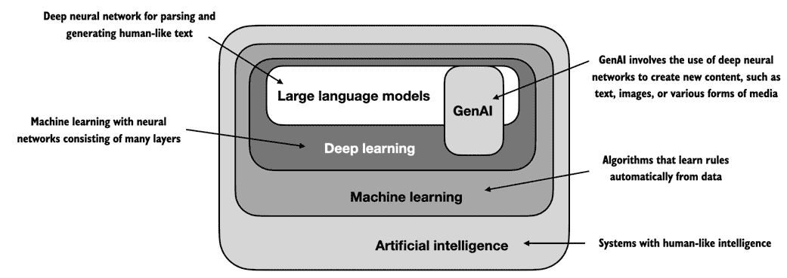
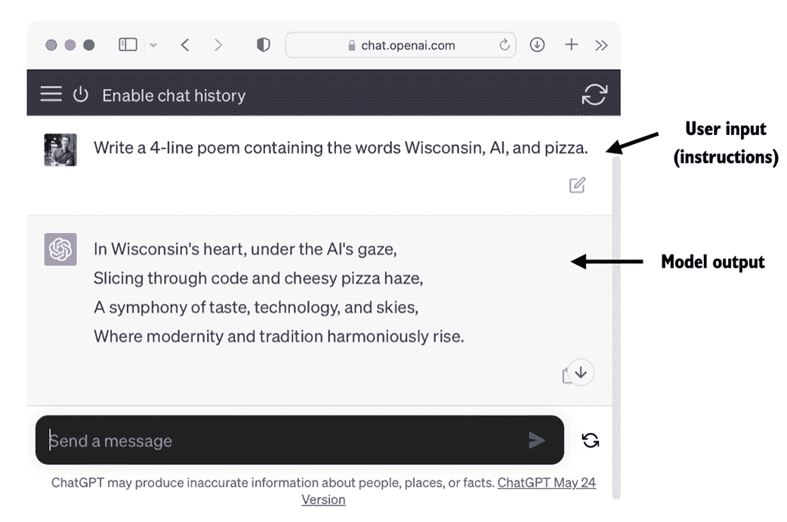
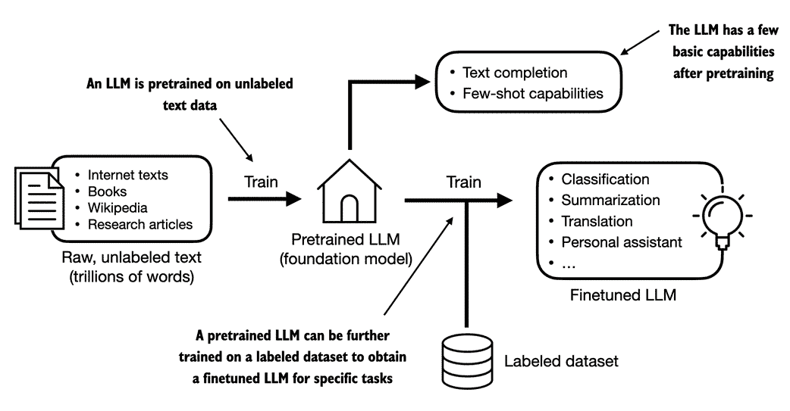
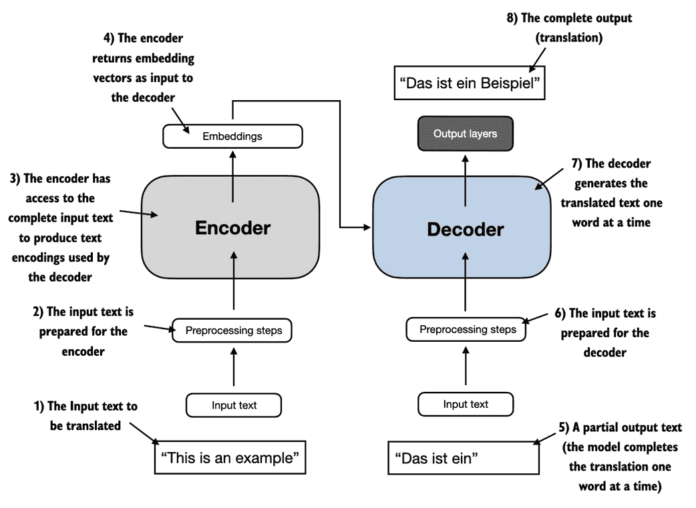
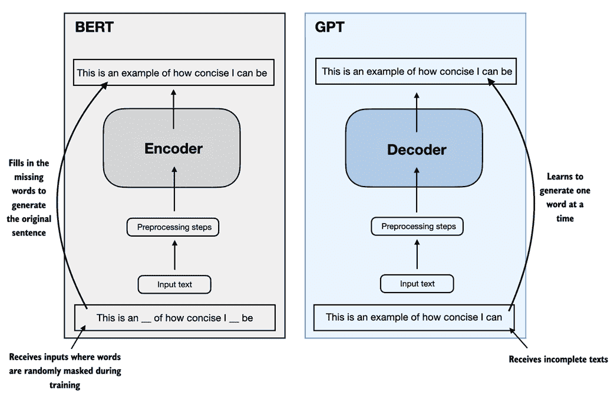
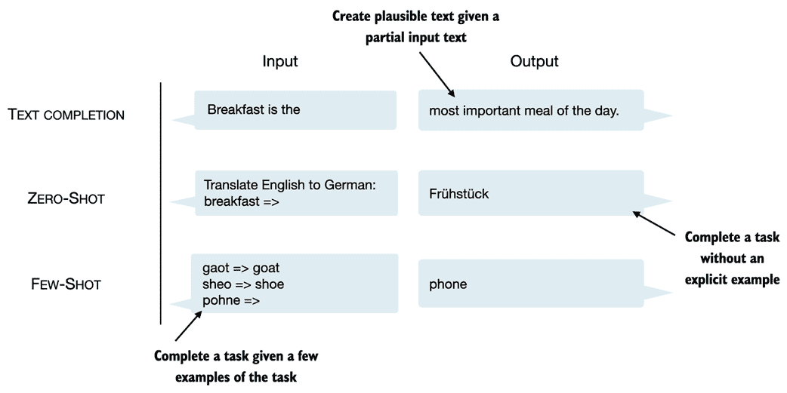
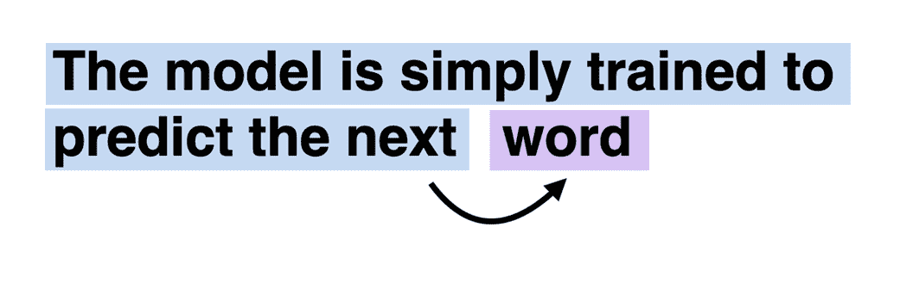
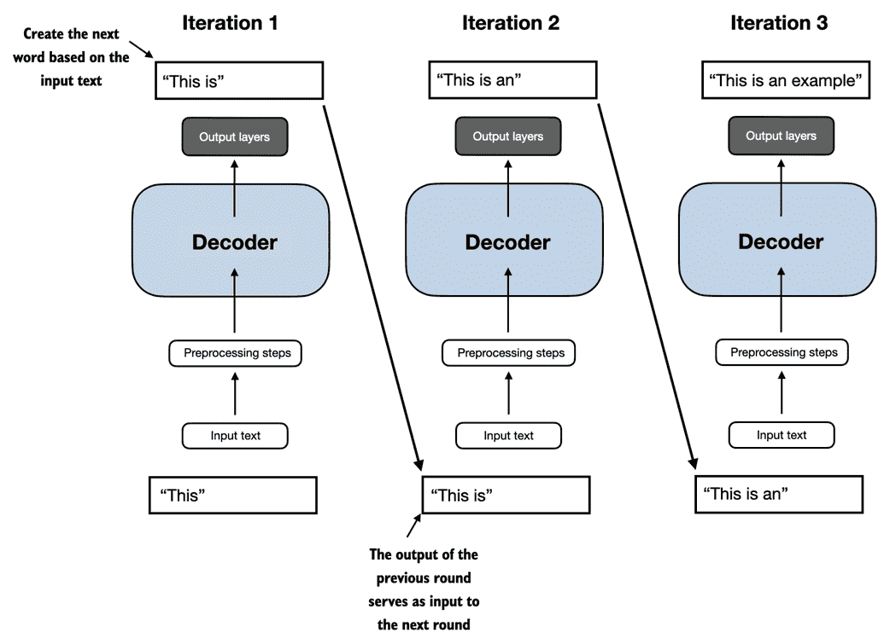
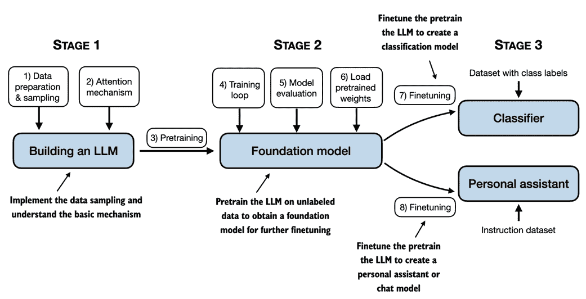

# 一、理解大型语言模型

### 本章包括

+   大型语言模型（LLM）背后的基本概念的高层次解释

+   探索 ChatGPT 类 LLM 源自的 Transformer 架构的深层次解释

+   从零开始构建 LLM 的计划

像 ChatGPT 这样的大型语言模型（LLM）是在过去几年中开发的深度神经网络模型。它们引领了自然语言处理（NLP）的新时代。在大型语言模型出现之前，传统方法擅长于分类任务，如电子邮件垃圾分类和可以通过手工制作的规则或简单模型捕获的简单模式识别。然而，在需要复杂理解和生成能力的语言任务方面，例如解析详细说明、进行上下文分析或创建连贯且上下文适当的原始文本时，它们通常表现不佳。例如，以前的语言模型无法根据关键字列表编写电子邮件-这对于当代 LLM 来说是微不足道的任务。

LLM 具有出色的理解、生成和解释人类语言的能力。然而，重要的是澄清，当我们说语言模型“理解”时，我们指的是它们可以以看起来连贯和上下文相关的方式处理和生成文本，而不是它们具有类似人类的意识或理解能力。

在深度学习的推动下，LLM 受益于大量文本数据的训练。这使得 LLM 能够捕获比以前更深层次的语境信息和人类语言的微妙之处。因此，LLM 在各种 NLP 任务中的性能显着提高，包括文本翻译、情感分析、问答等等。

当代 LLM 与早期 NLP 模型之间的另一个重要区别是，后者通常是为特定任务而设计的；而早期的 NLP 模型在其狭窄应用中表现出色，LLM 则在各种 NLP 任务中展示出更广泛的熟练程度。

LLM 背后的成功归功于 Transformer 架构，该架构支撑了许多 LLM，并且 LLM 训练的大量数据，使它们能够捕捉到各种语言细微差别、语境和模式，这些模式是难以手工编码的。

将模型基于 Transformer 架构实现，并使用大型训练数据集来训练 LLM 的这一转变，从根本上改变了 NLP，为理解和与人类语言交互提供了更有能力的工具。

从本章开始，我们为实现本书的主要目标奠定基础：通过逐步在代码中实现基于 Transformer 架构的 ChatGPT 样式 LLM 来理解 LLM。

## 1.1 什么是 LLM？

LLM，即大型语言模型，是一种设计用于理解、生成和回应类似人类文本的神经网络。这些模型是在大量文本数据上训练的深度神经网络，有时包括互联网上整个可公开获取文本的大部分内容。

"大型"语言模型中的"大"既指模型在参数方面的规模，也指其所训练的庞大数据集。这样的模型通常具有数百亿甚至数百亿个参数，这些参数是网络中的可调权重，在训练过程中进行优化，以预测序列中的下一个词。下一个词的预测是合理的，因为它利用了语言固有的顺序性质来训练模型，使其理解文本中的上下文、结构和关系。然而，这是一个非常简单的任务，许多研究人员会感到惊讶的是，它能够产生如此有能力的模型。我们将在后续章节逐步讨论并实施下一个词的训练过程。

LLMs 利用一种称为*transformer*的架构（在第 1.4 节中更详细地介绍），使它们在进行预测时能够有选择地关注输入的不同部分，使其特别擅长处理人类语言的细微差别和复杂性。

由于 LLMs 能够*生成*文本，所以 LLMs 也经常被称为一种生成人工智能(AI)的形式，通常简称为*生成 AI*或*GenAI*。如图 1.1 所示，AI 涵盖了创建能够执行需要类似人类智能的任务的机器的更广泛领域，包括理解语言、识别模式和做决策，并包括诸如机器学习和深度学习之类的子领域。

##### 图 1.1 正如这一层次化的关系图所示，LLMs 代表了深度学习技术的一种特定应用，利用它们处理和生成类似人类文本的能力。深度学习是一种专门的机器学习分支，专注于使用多层神经网络。机器学习和深度学习是旨在实现使计算机能够从数据中学习并执行通常需要人类智能的任务的算法领域。人工智能领域如今被机器学习和深度学习主导，但也包括其他方法，例如使用基于规则的系统、遗传算法、专家系统、模糊逻辑或符号推理。

用于实现人工智能的算法是机器学习领域的重点。具体而言，机器学习涉及开发可以从数据中学习并基于数据进行预测或决策而无需明确编程的算法。为了说明这一点，可以将垃圾邮件过滤器作为机器学习的实际应用。与手动编写规则来识别垃圾邮件不同，机器学习算法将被提供标记为垃圾邮件和合法邮件的示例。通过在训练数据集上最小化其预测错误，模型可以学习识别与垃圾邮件相关的模式和特征，从而能够将新邮件分类为垃圾邮件或合法邮件。

深度学习是机器学习的一个子集，专注于利用有三层或更多层的神经网络（也称为深度神经网络）来对数据中的复杂模式和抽象进行建模。与深度学习相反，传统机器学习需要手动提取特征。这意味着人类专家需要识别和选择对模型最相关的特征。

回顾垃圾邮件分类的例子，在传统机器学习中，人类专家可能会从电子邮件文本中手动提取特征，例如特定触发词（"prize"，"win"，"free"）的频率，感叹号的数量，使用全大写单词或怀疑链接的存在。基于这些专家定义的特征创建的数据集将用于训练模型。与传统机器学习相比，深度学习不需要手动提取特征。这意味着人类专家不需要为深度学习模型识别和选择最相关的特征。

接下来的几节将涵盖 LLM（大型语言模型）今天可以解决的一些问题，LLM 解决的挑战，以及我们将在本书中实现的通用 LLM 架构。

## 1.2 LLM 的应用

由于 LLM 具有解析和理解非结构化文本数据的高级能力，LLM 在各个领域都有广泛的应用。目前，LLM 被应用于机器翻译、生成新颖文本（参见图 1.2）、情感分析、文本摘要和许多其他任务。LLM 最近还用于内容创作，如写小说、文章甚至是计算机代码。

##### 图 1.2 LLM 接口实现了用户和人工智能系统之间的自然语言交流。该截图显示 ChatGPT 根据用户的规格要求写诗。

LLM 还可以为复杂的聊天机器人和虚拟助手提供动力，例如 OpenAI 的 ChatGPT 或 Google 的 Bard，它们可以回答用户提问并增强传统搜索引擎（如 Google Search 或 Microsoft Bing）。

此外，LLM 可以用于有效地从专业领域的大量文本中检索知识，如医学或法律。这包括筛选文件、总结长篇文章和回答技术问题。

简而言之，LLM 对于自动化几乎任何涉及解析和生成文本的任务都是无价的。它们的应用几乎是无限的，随着我们不断创新和探索使用这些模型的新方法，很明显，LLM 有潜力重新定义我们与技术的关系，使其更具对话性、直观和可访问性。

在本书中，我们将重点关注从零开始理解 LLM（大型语言模型）的工作原理，编写一个能够生成文本的 LLM。我们还将学习一些技术，使 LLM 能够进行各种查询，从回答问题到总结文本、将文本翻译成不同语言等等。换句话说，在本书中，我们将通过逐步构建一个 LLM 来了解复杂的 LLM 助手（如 ChatGPT）是如何工作的。

## 1.3 构建和使用 LLM 的阶段

我们为什么要构建自己的 LLM 呢？从零开始编写一个 LLM 是一个很好的练习，可以理解其机制和局限性。此外，这使我们具备了必要的知识，可以对现有的开源 LLM 架构进行预训练或微调，以适应我们自己的领域特定数据集或任务。

研究表明，就建模性能而言，定制的 LLM——针对特定任务或领域定制的 LLM——可能会优于 ChatGPT 等通用 LLM，后者设计用于广泛的应用。其中的例子包括专门用于金融领域的 BloombergGPT，以及专门用于医学问题回答的 LLM（请参阅本章末尾的*进一步阅读和参考*部分了解更多细节）。

创建 LLM 的一般过程，包括预训练和微调。在“预训练”中的“pre”一词指的是初始阶段，其中像 LLM 这样的模型在大型、多样的数据集上进行训练，以开发对语言的广泛理解。然后，这个预训练模型作为一个基础资源，可以通过微调进一步完善，微调是指模型在更具体于特定任务或领域的较窄数据集上进行专门训练的过程。图 1.3 展示了这个包括预训练和微调的两阶段训练方法。

##### 图 1.3 对 LLM 进行预训练包括对大型未标记文本语料库（原始文本）进行下一个词预测。然后，可以使用较小的标记数据集对预训练的 LLM 进行微调。

如图 1.3 所示，创建 LLM 的第一步是对大量文本数据进行训练，有时被称为*原始*文本。这里，“原始”指的是这些数据只是普通文本，没有任何标记信息[[1]](#_ftn1)。（可能会应用过滤，如删除格式字符或未知语言的文档。）

LLM 的第一个训练阶段也称为*预训练*，创建一个初始的预训练 LLM，通常称为*基础*模型或*基础*模型。这种模型的典型例子是 GPT-3 模型（ChatGPT 的前身）。该模型能够完成文本，即完成用户提供的半写句。它还具有有限的 few-shot 能力，这意味着它可以根据少量示例学习执行新任务，而不需要大量训练数据。这在接下来的部分*为不同任务使用变换器*中进一步阐述。

从在未标记文本上训练的*预训练*LLM 中获得之后，我们可以进一步在标记数据上训练 LLM，也称为*微调*。

用于微调 LLM 的两个最流行的类别包括*指导微调*和用于*分类*任务的微调。在指导微调中，标记的数据集包括指导和答案对，例如需要翻译文本的查询和正确翻译文本。在分类微调中，标记的数据集包括文本和相关的类别标签，例如与*垃圾邮件*和*非垃圾邮件*标签相关联的电子邮件。

在本书中，我们将涵盖预训练和微调 LLM 的代码实现，并且我们会更深入地研究指导微调和分类微调的具体内容，这将在本书中在预训练基础 LLM 后进行。

## 1.4 为不同任务使用 LLM

大多数现代 LLM 依赖*变换器*架构，这是一种深度神经网络架构，首次引入于 2017 年的论文*Attention Is All You Need*。要理解 LLM，我们需要简要回顾原始变换器，它最初用于机器翻译，将英文文本翻译成德语和法语。图 1.4 描述了变换器架构的简化版本。

##### 图 1.4 原始变换器架构的简化描述，这是一个用于语言翻译的深度学习模型。变换器由两部分组成，一个处理输入文本并生成嵌入表示的编码器（捕捉许多不同因素在不同维度中的数字表示）和一个解码器，后者可以使用该表示来逐字生成翻译文本。请注意，该图显示了翻译过程的最终阶段，其中解码器只需生成最终单词（"Beispiel"），给定原始输入文本（"This is an example"）和部分翻译的句子（"Das ist ein"），以完成翻译。图中的编号指示数据处理的顺序，并提供有关最佳阅读图的指导。

图 1.4 中描绘的 transformer 架构由两个子模块组成，一个编码器和一个解码器。编码器模块处理输入文本并将其编码为一系列捕捉输入上下文信息的数值表示或向量。然后，解码器模块会从这些编码向量中生成输出文本。例如，在翻译任务中，编码器会将源语言的文本编码成向量，解码器则会将这些向量解码为目标语言的文本。编码器和解码器都由许多层连接的所谓自注意机制组成。关于如何预处理和编码输入，你可能有很多问题。这些将在随后的章节中逐步实现中得到解答。

transformer 和 LLMs 的关键组成部分是自注意机制（未显示），它允许模型权衡序列中不同单词或标记的重要性相对于彼此。这一机制使得模型能够捕捉长距离依赖和输入数据中的上下文关系，增强了生成连贯和有上下文相关性输出的能力。然而，由于其复杂性，我们将在第三章详细讨论并逐步实现这一解释。此外，我们还将在《第二章，处理文本数据》中讨论和实现数据预处理步骤来创建模型输入。

后来的变种 transformer 架构，如所谓的 BERT（*双向编码器表示来自 transformer*）和各种 GPT 模型（*生成式预训练 transformer*），建立在这一概念上，以适应不同任务的体系结构。 （参考可以在本章结束处的*进一步阅读*部分找到。）

BERT，它是建立在原始 transformer 编码器子模块基础之上的，与 GPT 在训练方法上有所不同。虽然 GPT 设计用于生成任务，BERT 及其变体专门用于掩码词预测，模型会预测给定句子中的掩码或隐藏单词，如图 1.5 所示。这种独特的训练策略使得 BERT 在文本分类任务中具有优势，包括情绪预测和文档分类。截至目前，Twitter 使用 BERT 来检测有害内容，这是其能力的一个应用。

##### 图 1.5 transformer 的编码器和解码器子模块的可视化表示。在左侧，编码器部分举例说明了类似 BERT 的 LLMs，其专注于掩码词预测，主要用于文本分类等任务。在右侧，解码器部分展示了类似 GPT 的 LLMs，设计用于生成任务并生成连贯的文本序列。

另一方面，GPT 侧重于原始变压器架构的解码器部分，旨在处理需要生成文本的任务。这包括机器翻译、文本摘要、虚构写作、编写计算机代码等。我们将在本章的其余部分更详细地讨论 GPT 架构，并在本书中从头开始实现它。

GPT 模型主要设计和训练用于执行文本完成任务，同时在其能力上显示出出色的多功能性。这些模型擅长执行零样本和少样本学习任务。零样本学习指的是在没有任何先前特定示例的情况下对完全不可见任务进行概括的能力。另一方面，少样本学习涉及从用户提供的最少数量示例中学习，如图 1.6 所示。

##### 图 1.6 除了文本完成之外，类似 GPT 的 LLM 可以根据其输入解决各种任务，无需重新训练、微调或特定于任务的模型架构更改。有时，在输入中提供目标示例是有帮助的，这被称为少样本设置。然而，类似 GPT 的 LLM 也能够在没有具体示例的情况下执行任务，这被称为零样本设置。

##### 变压器与 LLM

当前的 LLM 基于前面介绍的变压器架构。因此，在文献中常常将变压器和 LLM 等术语用作同义词。然而，需要注意的是，并非所有的变压器都是 LLM，因为变压器也可以用于计算机视觉。另外，并非所有的 LLM 都是变压器，因为还有基于循环和卷积架构的大型语言模型。这些替代方法背后的主要动机是提高 LLM 的计算效率。然而，这些替代的 LLM 架构是否能与基于变压器的 LLM 的能力竞争，并且它们是否会被实际采用还有待观察。（感兴趣的读者可以在本章末尾的*进一步阅读*部分找到描述这些架构的文献引用。）

## 1.5 利用大型数据集

流行的 GPT 和 BERT 等模型的大型训练数据集包含数十亿字的多样化和全面的文本语料库，涵盖了大量主题以及自然语言和计算机语言。为了提供一个具体的例子，表 1.1 总结了用于预训练 GPT-3 的数据集，这为 ChatGPT 的第一个版本提供了基础模型。

##### 表 1.1 流行的 GPT-3 LLM 的预训练数据集

| 数据集名称 | 数据集描述 | 标记数量 | 在训练数据中的比例 |
| --- | --- | --- | --- |
| CommonCrawl（经过过滤） | 网络爬虫数据 | 4100 亿 | 60% |
| 网页文本 2 | 网络爬虫数据 | 190 亿 | 22% |
| 图书 1 | 基于互联网的图书语料库 | 120 亿 | 8% |
| 图书 2 | 基于互联网的图书语料库 | 550 亿 | 8% |
| 维基百科 | 高质量文本 | 30 亿 | 3% |

表 1.1 报告了标记的数量，其中一个标记是模型读取的文本单位，数据集中的标记数量大致相当于文本中的单词和标点符号的数量。我们将在下一章更详细地介绍标记化的过程，即将文本转换为标记的过程。

主要的要点是这个训练数据集的规模和多样性，使这些模型在包括语言句法、语义和内容的各种任务上表现良好，甚至包括一些需要一般知识的任务。

##### GPT-3 数据集详细信息

请注意，表 1.1 中的每个子集都是抽样自 3000 亿个标记，这意味着并非所有数据集都完全被看到，有些甚至被多次看到。除四舍五入之外，比例列加起来为 100%。作为参考，CommonCrawl 数据集中的 4100 亿个标记大约需要 570GB 的存储空间。基于 GPT-3 的后续模型，如 Meta 的 LLaMA，还包括来自 Arxiv 的研究论文（92GB）和来自 StackExchange 的与代码相关的问答（78GB）。

维基百科语料库由英语维基百科组成。虽然 GPT-3 论文的作者没有进一步说明细节，但 Books1 很可能是从古登堡计划(`www.gutenberg.org/`)中抽样而来，而 Books2 很可能是来自 Libgen(`en.wikipedia.org/wiki/Library_Genesis`)。CommonCrawl 是 CommonCrawl 数据库的筛选子集(`commoncrawl.org/`)，而 WebText2 是来自帖子中出现过 3 个以上赞的 Reddit 链接的网页文本。

GPT-3 论文的作者没有公开训练数据集，但一个可比较的公开可用的数据集是 The Pile(`pile.eleuther.ai/`)。不过，这个收集可能包含有版权作品，而且确切的使用条款可能取决于使用案例和国家。有关更多信息，请参阅 HackerNews 上的讨论`news.ycombinator.com/item?id=25607809`。

这些模型的预训练性使它们在进一步微调下游任务时变得非常灵活，这也是它们被称为基础模型的原因。预训练 LLM 需要大量资源，并且代价非常高昂。例如，据估计 GPT-3 的预训练成本为 460 万美元的云计算费用[[2]](#_ftn2)。

好消息是，许多预训练的 LLM 模型可以作为通用工具用于写作、提取和编辑不属于训练数据的文本，并且这些模型也可以在相对较小的数据集上进行微调，以降低所需的计算资源，并且改善在特定任务上的性能。

在本书中，我们将实现用于预训练的代码，并将其用于教育目的。所有计算都可以在消费者硬件上执行。在实现预训练代码之后，我们将学习如何重用公开可用的模型权重，并将它们加载到我们将要实现的架构中，从而使我们能够在本书后期微调 LLM 时跳过昂贵的预训练阶段。

## 1.6 更详细地了解 GPT 架构

在本章中之前，我们提到了类似 GPT 模型、GPT-3 和 ChatGPT 的术语。现在让我们更仔细地看一下通用的 GPT 架构。首先，GPT 代表***G***enerative ***P***retrained ***T***ransformer，最初是在以下论文中介绍的：

+   *通过生成预训练提高语言理解* (2018) 由 OpenAI 的*Radford 等人*提出，`cdn.openai.com/research-covers/language-unsupervised/language_understanding_paper.pdf`

GPT-3 是该模型的一个规模扩大版本，具有更多的参数，并且是在一个更大的数据集上训练的。而最初的 ChatGPT 模型是通过对 GPT-3 在一个大型指导数据集上进行微调而创建的，使用了 OpenAI 的 InstructGPT 论文中的一种方法，我们将在*第八章，通过人类反馈微调以遵循指示*中详细介绍这种方法。正如我们在图 1.6 中早期看到的那样，这些模型是称职的文本补全模型，并且可以执行其他任务，比如拼写校正、分类或语言翻译。鉴于 GPT 模型是在一个相对简单的下一个单词预测任务上进行预训练的，正如图 1.7 所示，这实际上是非常了不起的。

##### 图 1.7 在 GPT 模型的下一个单词预训练任务中，系统通过查看之前出现过的单词来预测句子中即将出现的单词。这种方法有助于模型理解单词和短语在语言中通常是如何配合使用的，形成一个可以应用于各种其他任务的基础。

下一个单词预测任务是一种自监督学习形式，是一种自我标记形式。这意味着我们不需要显式地为训练数据收集标签，而是可以利用数据本身的结构：我们可以使用句子或文档中的下一个单词作为模型要预测的标签。由于这个下一个单词预测任务允许我们"即兴"地创建标签，所以可以利用大规模的未标记文本数据集来训练 LLM，如前面第 1.5 节中所讨论的。

与我们在第 1.4 节中介绍的原始 Transformer 架构相比，*使用 LLM 执行不同任务*，通用 GPT 架构相对简单。从本质上讲，它只是解码器部分，没有编码器，如图 1.8 所示。由于像 GPT 这样的解码器样式模型通过逐字预测文本生成文本，因此它们被认为是一种自回归模型。

诸如 GPT-3 之类的架构也比原始的 transformer 模型要大得多。例如，原始的 transformer 将编码器和解码器块重复六次。GPT-3 共有 96 个 transformer 层和 1750 亿个参数。

##### 图 1.8 GPT 架构仅使用原始 transformer 的解码器部分。它被设计为单向从左到右的处理，非常适合文本生成和下一个单词预测任务，以逐步生成一次一个单词的文本。

GPT-3 是在 2020 年推出的，从深度学习和 LLM 发展的标准来看，这已经是很久之前了，而像 Meta 的 Llama 模型这样更近期的架构仍然基于相同的基本概念，只是进行了一些细微的修改。因此，理解 GPT 仍然像以往一样重要，而本书侧重于实现 GPT 背后突出的架构，并提供指向替代 LLMs 使用的具体调整。

最后，有趣的是，尽管原始的 transformer 模型明确设计用于语言翻译，但 GPT 模型——尽管其更大但更简单的架构旨在进行下一个单词的预测——也能够执行翻译任务。这种能力最初对研究人员来说是意外的，因为它源自一个主要训练于下一个单词预测任务上的模型，而这是一个并不专门针对翻译的任务。

模型能够执行其未明确接受训练的任务称为“新兴属性”。这种能力在训练期间并未得到明确教导，但是作为模型暴露于各种多语言环境下的大量数据的自然结果而出现。事实上，GPT 模型可以“学习”语言之间的翻译模式，并执行翻译任务，即使它们并没有针对此进行专门训练，这显示了这些大规模生成语言模型的优势和能力。我们可以执行各种任务而无需为每个任务使用不同的模型。

## 1.7 构建大型语言模型

在本章中，我们为理解 LLMs 奠定了基础。在本书的剩余部分中，我们将从头开始编写一个 LLM。我们将以 GPT 背后的基本思想作为蓝本，并按照图 1.9 中的概述分三个阶段来解决这个问题。

##### 图 1.9 本书涵盖的构建 LLMs 的阶段包括实现 LLM 架构和数据准备过程，预训练 LLM 以创建基础模型，以及对基础模型进行微调以成为个人助理或文本分类器。

首先，我们将学习基本的数据预处理步骤，并编写是每个 LLM 核心的注意力机制。

接下来，在第 2 阶段，我们将学习如何编码和预训练一个类似 GPT 的 LLM，能够生成新的文本。并且我们还将深入研究评估 LLMs 的基础知识，这对于开发功能强大的自然语言处理系统至关重要。

请注意，从零开始预训练大型 LLM 是一项重大工作，在 GPT-like 模型的计算成本中需要数千到数百万美元。因此，第 2 阶段的重点是利用小型数据集进行教育目的的训练实施。此外，本书还将提供加载公开可用模型权重的代码示例。

最后，在第 3 阶段，我们将获取一个预训练的 LLM，并对其进行微调，以遵循诸如回答查询或分类文本等指令--这是许多现实应用和研究中最常见的任务。

希望您期待着踏上这段令人兴奋的旅程！

## 1.8 总结

+   LLMs 已经改变了自然语言处理领域，之前依赖于显式基于规则的系统和更简单的统计方法。LLMs 的出现引入了新的深度学习驱动方法，推动了对人类语言的理解、生成和翻译的进步。

+   现代 LLMs 的训练主要分为两个步骤。

+   首先，它们通过使用句子中下一个单词的预测作为"标签"，在大型未标记文本语料库上进行预训练。

+   然后，它们在较小的、标记的目标数据集上进行微调，以遵循指令或执行分类任务。

+   LLMs 基于 Transformer 架构。Transformer 架构的关键思想是一个注意力机制，在逐词生成输出时，给予 LLM 对整个输入序列的选择性访问。

+   原始的 Transformer 架构包括一个用于解析文本的编码器和一个用于生成文本的解码器。

+   用于生成文本和遵循指令的 LLMs，如 GPT-3 和 ChatGPT，仅实现解码器模块，简化了架构。

+   由数十亿字组成的大型数据集对于 LLMs 的预训练至关重要。在本书中，我们将实现并训练 LLMs 以用于教育目的的小型数据集，还将了解如何加载公开可用的模型权重。

+   尽管 GPT-like 模型的一般预训练任务是预测句子中的下一个单词，但这些 LLMs 展现出"新兴"属性，如分类、翻译或总结文本的能力。

+   一旦 LLM 被预训练，产生的基础模型可以更高效地针对各种下游任务进行微调。

+   使用定制数据集进行微调的 LLMs 可以在特定任务上胜过通用 LLMs。

## 1.9 参考和进一步阅读

由于一支彭博团队展示的 LLMs 在金融数据上从零开始预训练的 GPT 版本，定制 LLMs 能够在金融任务上胜过 ChatGPT，同时在通用 LLM 基准测试中表现良好：

+   *BloombergGPT：一种用于金融的大型语言模型* （2023）由吴等人撰写，`arxiv.org/abs/2303.17564`

+   现有的 LLM 也可以被调整和微调，以表现出优于一般 LLM 的潜力，谷歌研究组和谷歌 DeepMind 团队在医疗领域展示了这一点：

+   *通过大型语言模型实现专业水平医学问答* （2023）由辛哈尔等人撰写，`arxiv.org/abs/2305.09617`

+   提出原始变压器架构的论文：

+   *注意力机制就是一切* （2017）由瓦斯瓦尼等人撰写，`arxiv.org/abs/1706.03762`

+   原始的编码器式变压器，称为 BERT：

+   *BERT：深度双向变压器进行语言理解的预训练* （2018）由德夫林等人撰写，`arxiv.org/abs/1810.04805`。

+   描述解码器式 GPT-3 模型的论文，这激发了现代 LLM 的开发，并将被用作在本书中从头开始实现 LLM 的模板：

+   *语言模型是少样本学习者* （2020）由布朗等人撰写，`arxiv.org/abs/2005.14165`。

+   用于分类图像的原始视觉变压器，说明变压器架构不仅限于文本输入：

+   *一幅图等于 16x16 个字：大规模图像识别的变压器* （2020）由多索维茨基等人撰写，`arxiv.org/abs/2010.11929`

+   两种实验性（但较不流行）的 LLM 架构作为示例，说明不是所有的 LLM 都必须基于变压器架构：

+   *RWKV：为变压器时代重新设计 RNN* （2023）由彭等人撰写，`arxiv.org/abs/2305.13048`

+   *鬣狗等级结构：向更大的卷积语言模型迈进（2023 年）*由波利等人撰写，`arxiv.org/abs/2302.10866`

+   Meta AI 的模型是一个流行的 GPT 样式模型的实现，与 GPT-3 和 ChatGPT 相比是开放可用的：

+   *Llama 2：开放基础和微调的聊天模型* （2023）由特文等人撰写，`arxiv.org/abs/2307.09288`1

+   对于对第 1.5 节中提到的数据集引用感兴趣的读者，这篇论文描述了由 Eleuther AI 策划的公开可用的*The Pile*数据集：

+   *堆叠：一份包含多样文本的 800GB 数据集用于语言建模* （2020）由高等人撰写，`arxiv.org/abs/2101.00027`。

+   *训练语言模型遵循人类反馈指令* （2022）由欧阳等人撰写，`arxiv.org/abs/2203.02155`

[[1]](#_ftnref1) 有机器学习背景的读者可能会注意到，传统机器学习模型和通过传统监督学习范式训练的深度神经网络通常需要标签信息。但是，这并不适用于 LLM 的预训练阶段。在这个阶段，LLM 利用自监督学习，模型从输入数据中生成自己的标签。这个概念稍后在本章中会有介绍

[[2]](#_ftnref2) *GPT-3，460 万美元的语言模型*，`www.reddit.com/r/MachineLearning/comments/h0jwoz/d_gpt3_the_`4600000_language_model/
