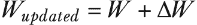
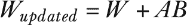
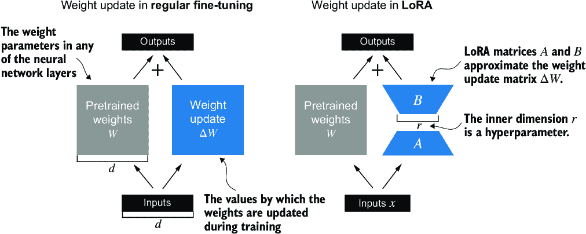
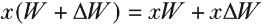
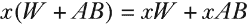
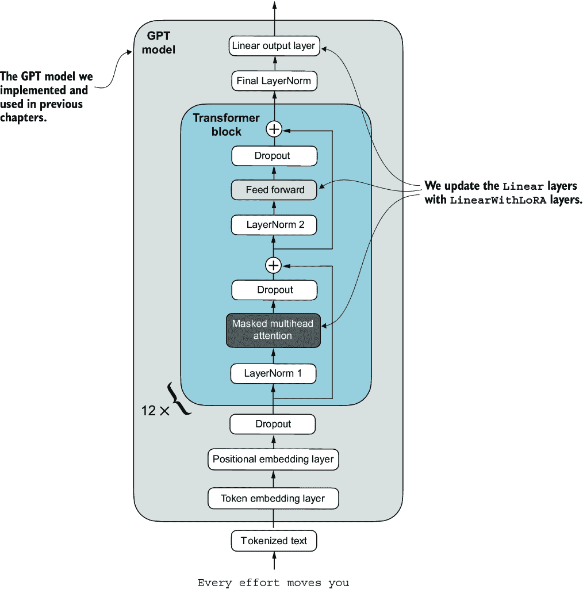

# 附录 E：使用 LoRA 进行参数高效的微调

*低秩适应*（LoRA）是参数高效微调中最广泛使用的技术之一。以下讨论基于第六章中给出的垃圾邮件分类微调示例。然而，LoRA 微调也适用于第七章中讨论的监督*指令微调*。

## E.1 LoRA 简介

LoRA 是一种技术，通过仅调整模型权重参数的小子集，将预训练模型调整以更好地适应特定（通常是较小的）数据集。其中“低秩”方面指的是将模型调整限制在总权重参数空间的一个较小维度的子空间中的数学概念。这有效地捕捉了训练过程中权重参数变化的最有影响力的方向。LoRA 方法因其能够使大型模型在特定任务数据上高效微调而有用且受欢迎，显著降低了微调通常所需的计算成本和资源。

假设一个大的权重矩阵*W*与一个特定的层相关联。LoRA 可以应用于 LLM 中的所有线性层。然而，为了说明目的，我们专注于单个层。

在训练深度神经网络时，在反向传播过程中，我们学习一个 D*W*矩阵，它包含了我们在训练过程中希望更新原始权重参数以最小化损失函数的信息。此后，我使用“权重”一词作为模型权重参数的简称。

在常规训练和微调中，权重更新定义为如下：



由胡等人提出的 LoRA 方法([`arxiv.org/abs/2106.09685`](https://arxiv.org/abs/2106.09685))，为计算权重更新 D*W*提供了一个更高效的替代方案，通过学习其近似值：


其中*A*和*B*是两个比*W*小得多的矩阵，*AB*表示*A*和*B*之间的矩阵乘积。

使用 LoRA，我们可以重新表述我们之前定义的权重更新：



图 E.1 展示了全微调和 LoRA 的权重更新公式并排比较。



##### 图 E.1 比较了权重更新方法：常规微调和 LoRA。常规微调直接使用 DW 更新预训练权重矩阵 W（左）。LoRA 使用两个较小的矩阵 A 和 B 来近似 DW，其中 AB 的乘积被加到 W 上，r 表示内维，一个可调的超参数（右）。

如果你仔细观察，你可能会注意到图 E.1 中全微调和 LoRA 的视觉表示与之前展示的公式略有不同。这种变化归因于矩阵乘法的分配律，它允许我们分离原始和更新的权重而不是将它们组合。例如，在以 *x* 作为输入数据的常规微调情况下，我们可以将计算表示为



同样，我们可以为 LoRA 编写以下内容：



除了减少训练期间需要更新的权重数量外，将 LoRA 权重矩阵与原始模型权重分开的能力使 LoRA 在实践中更加有用。实际上，这允许预训练模型权重保持不变，在训练后使用模型时，LoRA 矩阵会动态应用。

在实践中保持 LoRA 权重分离非常有用，因为它允许在不存储多个完整的 LLM 版本的情况下进行模型定制。这减少了存储需求并提高了可扩展性，因为当我们为每个特定的客户或应用程序定制 LLM 时，只需要调整和保存较小的 LoRA 矩阵。

接下来，让我们看看 LoRA 如何用于微调 LLM 以进行垃圾邮件分类，类似于第六章中的微调示例。

## E.2 准备数据集

在应用 LoRA 到垃圾邮件分类示例之前，我们必须加载我们将要使用的数据集和预训练模型。这里的代码重复了第六章的数据准备。（我们也可以打开并运行第六章的笔记本，并在其中插入 E.4 节的 LoRA 代码。）

首先，我们下载数据集并将其保存为 CSV 文件。

##### 列表 E.1 下载和准备数据集

```py
from pathlib import Path
import pandas as pd
from ch06 import (
    download_and_unzip_spam_data,
    create_balanced_dataset,
    random_split
)

url = \ 
"https://archive.ics.uci.edu/static/public/228/sms+spam+collection.zip"
zip_path = "sms_spam_collection.zip"
extracted_path = "sms_spam_collection"
data_file_path = Path(extracted_path) / "SMSSpamCollection.tsv"

download_and_unzip_spam_data(url, zip_path, extracted_path, data_file_path)

df = pd.read_csv(
    data_file_path, sep="\t", header=None, names=["Label", "Text"]
)
balanced_df = create_balanced_dataset(df)
balanced_df["Label"] = balanced_df["Label"].map({"ham": 0, "spam": 1})

train_df, validation_df, test_df = random_split(balanced_df, 0.7, 0.1)
train_df.to_csv("train.csv", index=None)
validation_df.to_csv("validation.csv", index=None)
test_df.to_csv("test.csv", index=None)
```

接下来，我们创建 `SpamDataset` 实例。

##### 列表 E.2 实例化 PyTorch 数据集

```py
import torch
from torch.utils.data import Dataset
import tiktoken
from chapter06 import SpamDataset

tokenizer = tiktoken.get_encoding("gpt2")
train_dataset = SpamDataset("train.csv", max_length=None, 
    tokenizer=tokenizer
)
val_dataset = SpamDataset("validation.csv", 
    max_length=train_dataset.max_length, tokenizer=tokenizer
)
test_dataset = SpamDataset(
    "test.csv", max_length=train_dataset.max_length, tokenizer=tokenizer
)
```

在创建 PyTorch 数据集对象之后，我们实例化数据加载器。

##### 列表 E.3 创建 PyTorch 数据加载器

```py
from torch.utils.data import DataLoader

num_workers = 0
batch_size = 8

torch.manual_seed(123)

train_loader = DataLoader(
    dataset=train_dataset,
    batch_size=batch_size,
    shuffle=True,
    num_workers=num_workers,
    drop_last=True,
)

val_loader = DataLoader(
    dataset=val_dataset,
    batch_size=batch_size,
    num_workers=num_workers,
    drop_last=False,
)

test_loader = DataLoader(
    dataset=test_dataset,
    batch_size=batch_size,
    num_workers=num_workers,
    drop_last=False,
)
```

作为验证步骤，我们遍历数据加载器，并检查每个批次包含八个训练示例，每个训练示例由 120 个标记组成：

```py
print("Train loader:")
for input_batch, target_batch in train_loader:
    pass

print("Input batch dimensions:", input_batch.shape)
print("Label batch dimensions", target_batch.shape)
```

输出如下

```py
Train loader:
Input batch dimensions: torch.Size([8, 120])
Label batch dimensions torch.Size([8])
```

最后，我们打印每个数据集的总批次数：

```py
print(f"{len(train_loader)} training batches")
print(f"{len(val_loader)} validation batches")
print(f"{len(test_loader)} test batches")
```

在这种情况下，我们每个数据集有以下批次数：

```py
130 training batches
19 validation batches
38 test batches
```

## E.3 初始化模型

我们重复第六章的代码来加载和准备预训练的 GPT 模型。我们首先下载模型权重并将它们加载到 `GPTModel` 类中。

##### 列表 E.4 加载预训练的 GPT 模型

```py
from gpt_download import download_and_load_gpt2
from chapter04 import GPTModel
from chapter05 import load_weights_into_gpt

CHOOSE_MODEL = "gpt2-small (124M)"
INPUT_PROMPT = "Every effort moves"

BASE_CONFIG = {
    "vocab_size": 50257,         #1
    "context_length": 1024,      #2
    "drop_rate": 0.0,            #3
    "qkv_bias": True             #4
}

model_configs = {
    "gpt2-small (124M)": {"emb_dim": 768, "n_layers": 12, "n_heads": 12},
    "gpt2-medium (355M)": {"emb_dim": 1024, "n_layers": 24, "n_heads": 16},
    "gpt2-large (774M)": {"emb_dim": 1280, "n_layers": 36, "n_heads": 20},
    "gpt2-xl (1558M)": {"emb_dim": 1600, "n_layers": 48, "n_heads": 25},
}

BASE_CONFIG.update(model_configs[CHOOSE_MODEL])

model_size = CHOOSE_MODEL.split(" ")[-1].lstrip("(").rstrip(")")
settings, params = download_and_load_gpt2(
    model_size=model_size, models_dir="gpt2"
)

model = GPTModel(BASE_CONFIG)
load_weights_into_gpt(model, params)
model.eval()
```

#1 词汇量大小

#2 上下文长度

#3 Dropout 率

#4 查询键值偏差

为了确保模型正确加载，让我们再次检查它是否生成连贯的文本：

```py
from chapter04 import generate_text_simple
from chapter05 import text_to_token_ids, token_ids_to_text

text_1 = "Every effort moves you"

token_ids = generate_text_simple(
    model=model,
    idx=text_to_token_ids(text_1, tokenizer),
    max_new_tokens=15,
    context_size=BASE_CONFIG["context_length"]
)

print(token_ids_to_text(token_ids, tokenizer))
```

以下输出显示，模型生成了连贯的文本，这是模型权重加载正确的指标：

```py
Every effort moves you forward.
The first step is to understand the importance of your work
```

接下来，我们为分类微调准备模型，类似于第六章，我们替换输出层：

```py
torch.manual_seed(123)
num_classes = 2
model.out_head = torch.nn.Linear(in_features=768, out_features=num_classes)
device = torch.device("cuda" if torch.cuda.is_available() else "cpu")
model.to(device)
```

最后，我们计算未微调模型的初始分类准确率（我们预计这个值约为 50%，这意味着模型还不能可靠地区分垃圾邮件和非垃圾邮件）：

```py
from chapter06 import calc_accuracy_loader

torch.manual_seed(123)
train_accuracy = calc_accuracy_loader(
    train_loader, model, device, num_batches=10
)
val_accuracy = calc_accuracy_loader(
    val_loader, model, device, num_batches=10
)
test_accuracy = calc_accuracy_loader(
    test_loader, model, device, num_batches=10
)

print(f"Training accuracy: {train_accuracy*100:.2f}%")
print(f"Validation accuracy: {val_accuracy*100:.2f}%")
print(f"Test accuracy: {test_accuracy*100:.2f}%")
```

初始预测准确率如下

```py
Training accuracy: 46.25%
Validation accuracy: 45.00%
Test accuracy: 48.75%
```

## E.4 使用 LoRA 进行参数高效的微调

接下来，我们使用 LoRA 修改和微调 LLM。我们首先初始化一个 LoRALayer，它创建矩阵*A*和*B*，以及`alpha`缩放因子和`rank`（*r*）设置。这个层可以接受输入并计算相应的输出，如图 E.2 所示。


##### 图 E.2 LoRA 矩阵 A 和 B 应用于层输入，并参与计算模型输出。这些矩阵的内维 r 作为一个设置，通过改变 A 和 B 的大小来调整可训练参数的数量。

在代码中，这个 LoRA 层可以如下实现。

##### 列表 E.5 实现 LoRA 层

```py
import math

class LoRALayer(torch.nn.Module):
    def __init__(self, in_dim, out_dim, rank, alpha):
        super().__init__()
        self.A = torch.nn.Parameter(torch.empty(in_dim, rank))
        torch.nn.init.kaiming_uniform_(self.A, a=math.sqrt(5))    #1
        self.B = torch.nn.Parameter(torch.zeros(rank, out_dim))
        self.alpha = alpha

    def forward(self, x):
        x = self.alpha * (x @ self.A @ self.B)
        return x
```

#1 与 PyTorch 中线性层的相同初始化

`rank`控制矩阵*A*和*B*的内维。本质上，这个设置决定了 LoRA 引入的额外参数数量，通过参数数量来平衡模型的适应性和效率。

另一个重要的设置，`alpha`，作为低秩适应输出的缩放因子。它主要决定了适应层输出对原始层输出的影响程度。这可以看作是一种调节低秩适应对层输出影响的方法。我们迄今为止实现的`LoRALayer`类使我们能够转换层的输入。

在 LoRA 中，典型的目标是用现有的`线性`层进行替换，允许直接将权重更新应用于预训练的现有权重，如图 E.3 所示。


##### 图 E.3 LoRA 集成到模型层中。层的原始预训练权重（W）与 LoRA 矩阵（A 和 B）的输出相结合，这些输出近似权重更新矩阵（DW）。最终输出是通过将适应层（使用 LoRA 权重）的输出与原始输出相加来计算的。

为了整合原始的`线性`层权重，我们现在创建一个`LinearWithLoRA`层。这个层利用之前实现的`LoRALayer`，并设计用来替换神经网络中的现有`线性`层，例如`GPTModel`中的自注意力模块或前馈模块。

##### 列表 E.6 使用`LinearWithLora`层替换`线性`层

```py
class LinearWithLoRA(torch.nn.Module):
    def __init__(self, linear, rank, alpha):
        super().__init__()
        self.linear = linear
        self.lora = LoRALayer(
            linear.in_features, linear.out_features, rank, alpha
        )

    def forward(self, x):
        return self.linear(x) + self.lora(x)
```

这段代码结合了一个标准的`线性`层和`LoRALayer`。`forward`方法通过添加原始线性层和 LoRA 层的结果来计算输出。

由于权重矩阵*B*（`LoRALayer`中的`self.B`）是用零值初始化的，矩阵*A*和*B*的乘积结果是一个零矩阵。这确保了乘法不会改变原始权重，因为添加零不会改变它们。

为了将 LoRA 应用于先前定义的`GPTModel`，我们引入了一个`replace_linear_with_lora`函数。这个函数将模型中所有现有的`Linear`层与新创建的`LinearWithLoRA`层进行交换：

```py
def replace_linear_with_lora(model, rank, alpha):
    for name, module in model.named_children():
        if isinstance(module, torch.nn.Linear):     #1
            setattr(model, name, LinearWithLoRA(module, rank, alpha))
        else:    #2
            replace_linear_with_lora(module, rank, alpha)
```

#1 将线性层替换为 LinearWithLoRA

#2 递归地应用于子模块

我们现在已经实现了替换`GPTModel`中`Linear`层为新开发的`LinearWithLoRA`层以进行参数高效微调的所有必要代码。接下来，我们将应用`LinearWithLoRA`升级到`GPTModel`中所有`Linear`层，包括多头注意力、前馈模块和输出层，如图 E.4 所示。



##### 图 E.4 GPT 模型的架构。它突出了模型中`Linear`层升级为`LinearWithLoRA`层以进行参数高效微调的部分。

在应用`LinearWithLoRA`层升级之前，我们首先冻结原始模型参数：

```py
total_params = sum(p.numel() for p in model.parameters() if p.requires_grad)
print(f"Total trainable parameters before: {total_params:,}")

for param in model.parameters():
    param.requires_grad = False
total_params = sum(p.numel() for p in model.parameters() if p.requires_grad)
print(f"Total trainable parameters after: {total_params:,}")
```

现在，我们可以看到，在 1.24 亿个模型参数中，没有任何一个是可训练的：

```py
Total trainable parameters before: 124,441,346
Total trainable parameters after: 0
```

接下来，我们使用`replace_linear_with_lora`来替换`Linear`层：

```py
replace_linear_with_lora(model, rank=16, alpha=16)
total_params = sum(p.numel() for p in model.parameters() if p.requires_grad)
print(f"Total trainable LoRA parameters: {total_params:,}")
```

添加 LoRA 层后，可训练参数的数量如下：

```py
Total trainable LoRA parameters: 2,666,528
```

如我们所见，使用 LoRA 时，我们将可训练参数的数量减少了近 50 倍。16 的`rank`和`alpha`是良好的默认选择，但也很常见增加 rank 参数，这反过来又增加了可训练参数的数量。`alpha`通常选择为 rank 的一半、两倍或与 rank 相等。

让我们通过打印模型架构来验证层是否已按预期修改：

```py
device = torch.device("cuda" if torch.cuda.is_available() else "cpu")
model.to(device)
print(model)
```

输出是

```py
GPTModel(
  (tok_emb): Embedding(50257, 768)
  (pos_emb): Embedding(1024, 768)
  (drop_emb): Dropout(p=0.0, inplace=False)
  (trf_blocks): Sequential(
    ...
    (11): TransformerBlock(
      (att): MultiHeadAttention(
        (W_query): LinearWithLoRA(
          (linear): Linear(in_features=768, out_features=768, bias=True)
          (lora): LoRALayer()
        )
        (W_key): LinearWithLoRA(
          (linear): Linear(in_features=768, out_features=768, bias=True)
          (lora): LoRALayer()
        )
        (W_value): LinearWithLoRA(
          (linear): Linear(in_features=768, out_features=768, bias=True)
          (lora): LoRALayer()
        )
        (out_proj): LinearWithLoRA(
          (linear): Linear(in_features=768, out_features=768, bias=True)
          (lora): LoRALayer()
        )
        (dropout): Dropout(p=0.0, inplace=False)
      )
      (ff): FeedForward(
        (layers): Sequential(
          (0): LinearWithLoRA(
            (linear): Linear(in_features=768, out_features=3072, bias=True)
            (lora): LoRALayer()
          )
          (1): GELU()
          (2): LinearWithLoRA(
            (linear): Linear(in_features=3072, out_features=768, bias=True)
            (lora): LoRALayer()
          )
        )
      )
      (norm1): LayerNorm()
      (norm2): LayerNorm()
      (drop_resid): Dropout(p=0.0, inplace=False)
    )
  )
  (final_norm): LayerNorm()
  (out_head): LinearWithLoRA(
    (linear): Linear(in_features=768, out_features=2, bias=True)
    (lora): LoRALayer()
  )
)
```

模型现在包括了新的`LinearWithLoRA`层，这些层本身由设置为不可训练的原始`Linear`层和新 LoRA 层组成，我们将对这些层进行微调。

在我们开始微调模型之前，让我们计算初始分类准确度：

```py
torch.manual_seed(123)

train_accuracy = calc_accuracy_loader(
    train_loader, model, device, num_batches=10
)
val_accuracy = calc_accuracy_loader(
    val_loader, model, device, num_batches=10
)
test_accuracy = calc_accuracy_loader(
    test_loader, model, device, num_batches=10
)

print(f"Training accuracy: {train_accuracy*100:.2f}%")
print(f"Validation accuracy: {val_accuracy*100:.2f}%")
print(f"Test accuracy: {test_accuracy*100:.2f}%")
```

得到的准确度值是

```py
Training accuracy: 46.25%
Validation accuracy: 45.00%
Test accuracy: 48.75%
```

这些准确度值与第六章中的值相同。这种结果发生是因为我们用零初始化了 LoRA 矩阵*B*。因此，矩阵*A*和*B*的乘积结果是一个零矩阵。这确保了乘法不会改变原始权重，因为添加零不会改变它们。

现在，让我们继续到令人兴奋的部分——使用第六章中的训练函数微调模型。在 M3 MacBook Air 笔记本电脑上训练大约需要 15 分钟，在 V100 或 A100 GPU 上不到半分钟。

##### 列表 E.7 使用 LoRA 层微调模型

```py
import time
from chapter06 import train_classifier_simple

start_time = time.time()
torch.manual_seed(123)
optimizer = torch.optim.AdamW(model.parameters(), lr=5e-5, weight_decay=0.1)

num_epochs = 5
train_losses, val_losses, train_accs, val_accs, examples_seen = \
    train_classifier_simple(
        model, train_loader, val_loader, optimizer, device,
        num_epochs=num_epochs, eval_freq=50, eval_iter=5,
        tokenizer=tokenizer
    )

end_time = time.time()
execution_time_minutes = (end_time - start_time) / 60
print(f"Training completed in {execution_time_minutes:.2f} minutes.")
```

训练过程中我们看到的输出是

```py
Ep 1 (Step 000000): Train loss 3.820, Val loss 3.462 
Ep 1 (Step 000050): Train loss 0.396, Val loss 0.364 
Ep 1 (Step 000100): Train loss 0.111, Val loss 0.229 
Training accuracy: 97.50% | Validation accuracy: 95.00% 
Ep 2 (Step 000150): Train loss 0.135, Val loss 0.073 
Ep 2 (Step 000200): Train loss 0.008, Val loss 0.052 
Ep 2 (Step 000250): Train loss 0.021, Val loss 0.179 
Training accuracy: 97.50% | Validation accuracy: 97.50%
Ep 3 (Step 000300): Train loss 0.096, Val loss 0.080 
Ep 3 (Step 000350): Train loss 0.010, Val loss 0.116 
Training accuracy: 97.50% | Validation accuracy: 95.00% 
Ep 4 (Step 000400): Train loss 0.003, Val loss 0.151 
Ep 4 (Step 000450): Train loss 0.008, Val loss 0.077 
Ep 4 (Step 000500): Train loss 0.001, Val loss 0.147 
Training accuracy: 100.00% | Validation accuracy: 97.50%
Ep 5 (Step 000550): Train loss 0.007, Val loss 0.094 
Ep 5 (Step 000600): Train loss 0.000, Val loss 0.056 
Training accuracy: 100.00% | Validation accuracy: 97.50%

Training completed in 12.10 minutes.
```

使用 LoRA 训练模型比不使用 LoRA 训练模型花费的时间更长（见第六章），因为 LoRA 层在正向传播过程中引入了额外的计算。然而，对于更大的模型，反向传播变得成本更高，模型在有 LoRA 的情况下通常比没有 LoRA 时训练得更快。

如我们所见，该模型接受了完美的训练，并且验证准确度非常高。让我们也可视化损失曲线，以便更好地观察训练是否收敛：

```py
from chapter06 import plot_values

epochs_tensor = torch.linspace(0, num_epochs, len(train_losses))
examples_seen_tensor = torch.linspace(0, examples_seen, len(train_losses))

plot_values(
    epochs_tensor, examples_seen_tensor, 
    train_losses, val_losses, label="loss"
)
```

图 E.5 绘制了结果。


##### 图 E.5 展示了机器学习模型在六个 epoch 上的训练和验证损失曲线。最初，训练和验证损失急剧下降，然后趋于平稳，表明模型正在收敛，这意味着它不会因为进一步的训练而有明显改进。

除了根据损失曲线评估模型外，我们还可以计算整个训练、验证和测试集上的准确率（在训练过程中，我们通过`eval_iter=5`设置从五个批次中近似训练和验证集准确率）：

```py
train_accuracy = calc_accuracy_loader(train_loader, model, device)
val_accuracy = calc_accuracy_loader(val_loader, model, device)
test_accuracy = calc_accuracy_loader(test_loader, model, device)

print(f"Training accuracy: {train_accuracy*100:.2f}%")
print(f"Validation accuracy: {val_accuracy*100:.2f}%")
print(f"Test accuracy: {test_accuracy*100:.2f}%")
```

得到的准确率值是

```py
Training accuracy: 100.00%
Validation accuracy: 96.64%
Test accuracy: 98.00%
```

这些结果表明，该模型在训练、验证和测试数据集上表现良好。训练准确率达到 100%，模型完美地学习了训练数据。然而，验证和测试准确度（分别为 96.64%和 97.33%）略低，表明模型存在一定程度过拟合，因为与训练集相比，模型在未见数据上的泛化能力较差。总体而言，考虑到我们仅微调了相对较少的模型权重（270 万 LoRA 权重而不是原始的 1240 万模型权重），结果非常令人印象深刻。

# 索引

符号

124M 参数

[\[EOS\] (序列结束)标记](../Text/chapter-2.html#p126)

reshape 方法, 第 2 次

.to()方法, 第 2 次

.weight 属性

.eval()模式

__getitem__ 方法

[\[PAD\] (填充)标记](../Text/chapter-2.html#p127)

.T 方法

.backward()方法, 第 2 次

%timeit 命令

.matmul 方法

04_preference-tuning-with-dpo 文件夹

355M 参数

[\[BOS\] (序列开始)标记](../Text/chapter-2.html#p125)

\</unk\>标记, 第 2 次, 第 3 次, 第 4 次, 第 5 次

.view 方法, 第 2 次

__init__ 构造函数, 第 2 次, 第 3 次

.shape 属性

@ 操作符

__len__ 方法

\<|endoftext|> 标记

.pth 扩展名

<i>多尔玛</i>

《用于 LLM 预训练研究的三十万亿词开放语料库》（Soldaini 等人）

== 比较运算符

A

arXiv

Alpaca 数据集, 第 2 次

argmax 函数, 第 2 次, 第 3 次, 第 4 次, 第 5 次, 第 6 次

注意力机制

编码, 第 2 次

建模长序列的问题

注意力分数

AI（人工智能）

autograd 引擎

alpha 缩放因子

自回归模型

注意力权重，逐步计算, 第 2 次

attn_scores

Axolotl

allowed_max_length

AdamW 优化器, 第 2 次

B

Bahdanau 注意力机制

反向传播

BERT（双向编码器表示从转换器）

BPE（字节对编码）

batch_size

C

compute_accuracy 函数, 第 2 次

因果注意力掩码

clip_grad_norm_ 函数

calc_loss_loader 函数

交叉熵函数, 第 2 次, 第 3 次

对话表现

custom_collate_draft_1

custom_collate_draft_2

calc_accuracy_loader 函数

calc_loss_batch 函数, 第 2 次, 第 3 次

分类

任务

custom_collate_fn 函数, 第 2 次

classify_review 函数

context_length

cfg 字典

计算梯度

上下文向量, 第 2 次, 第 3 次

CausalAttention 类, 第 2 次

D

DistributedSampler

dim 参数, 第 2 次

Dataset 类, 第 2 次, 第 3 次, 第 4 次, 第 5 次, 第 6 次, 第 7 次

DataLoader 类, 第 2 次

数据集

下载

download_and_load_gpt2 函数, 第 2 次, 第 3 次

DummyGPTClass

DistributedDataParallel 类

DummyLayerNorm, 第 2 次

占位符

DummyGPTModel, 第 2 次, 第 3 次, 第 4 次

深度学习

点积

DDP (DistributedDataParallel)策略

设备变量

decode 方法, 第 2 次

数据加载器, 第 2 次

代码示例

dropout

定义

drop_rate

drop_last 参数

DummyTransformerBlock

数据列表

ddp_setup 函数

d_out 参数, 第 2 次

DataFrame

E

eps 变量

evaluate_model 函数, 第 2 次, 第 3 次, 第 4 次

嵌入大小

涌现行为

编码器

encode 方法, 第 2 次, 第 3 次

emb_dim

eval_iter 值

F

find_highest_gradient 函数

first_batch 变量

FeedForward 模块, 第 2 次, 第 3 次, 第 4 次

format_input 函数, 第 2 次, 第 3 次, 第 4 次, 第 5 次, 第 6 次

微调

LLMs，遵循指令

类别

用于分类

前向方法, 第 2 次

G

generate_and_print_sample 函数

GELU (高斯误差线性单元)

激活函数, 第 2 次

GPTModel, 第 2 次, 第 3 次, 第 4 次, 第 5 次, 第 6 次

类, 第 2 次

代码

实例, 第 2 次, 第 3 次, 第 4 次

GPT (生成预训练变换器)

架构

编码, 第 2 次

从头开始实现生成文本

grad_fn 值

gpt_download.py Python 模块

GPT_CONFIG_124M 字典, 第 2 次, 第 3 次, 第 4 次, 第 5 次, 第 6 次

生成文本模型，评估

GenAI (生成式 AI)

gpt2-medium355M-sft.pth 文件

GPTDatasetV1 类, 第 2 次, 第 3 次

generate_text_simple 函数, 第 2 次, 第 3 次, 第 4 次, 第 5 次, 第 6 次

GPT-4

GPT-2

模型

分词器

GPT-3

generate_model_scores 函数, 第 2 次

Google Colab

generate 函数, 第 2 次, 第 3 次, 第 4 次, 第 5 次, 第 6 次, 第 7 次

I

init_process_group 函数

指令数据集

信息泄露

输入嵌入

InstructionDataset 类, 第 2 次

指令微调

遵循指令，为指令数据集创建数据加载器, 第 2 次

概述

‘指令’对象

K

keepdim 参数

L

logits 张量

带有 LoRA 层的线性层, 第 2 次

LoRALayer 类, 第 2 次

损失度量

LLMs（大型语言模型）, 第 2 次

应用

构建和使用, 第 2 次, 第 3 次

编码架构

编码注意力机制，因果注意力机制, 第 2 次

微调, 第 2 次, 第 3 次

用于分类的微调, 第 2 次, 第 3 次, 第 4 次, 第 5 次

指令微调，加载预训练的 LLMs, 第 2 次

概述, 第 2 次, 第 3 次

利用大型数据集

线性层, 第 2 次

LayerNorm, 第 2 次, 第 3 次

LIMA 数据集

层归一化, 第 2 次

加载状态字典方法

将权重加载到 gpt 函数, 第 2 次, 第 3 次, 第 4 次

loss.backward()函数

线性层权重

Llama 3 模型

LLama 2 模型

LoRA（低秩自适应）, 第 2 次, 第 3 次

参数高效的微调, 第 2 次

M

主函数

最大长度, 第 2 次, 第 3 次

model.eval() 函数

MultiHeadAttention 类，第 2 次，第 3 次，第 4 次，第 5 次，第 6 次

model.train() 设置

MultiHeadAttentionWrapper 类，第 2 次，第 3 次，第 4 次，第 5 次，第 6 次，第 7 次

机器学习

多头注意力，第 2 次

模块基类

多进程子模块

掩码注意力

多项式函数，第 2 次，第 3 次

macOS

模型响应

minbpe 仓库

模型配置表

mps 设备

N

NEW_CONFIG 字典

神经网络

使用 GELU 激活实现前馈网络，第 2 次

nn.Linear 层

n_heads

numel() 方法

num_heads 维度

O

输出层节点

运行 llama3 命令，第 2 次，第 3 次

ollama serve 命令，第 2 次，第 3 次，第 4 次

optimizer.zero_grad() 方法

Ollama 应用，第 2 次

Ollama Llama 3 方法

ollama run 命令

P

PyTorch

和火炬

自动微分，第 2 次

计算图

数据加载器

数据集对象

高效数据加载器

实现多层神经网络，第 2 次

安装，第 2 次

在 加载和保存模型权重

使用 GPU 优化训练性能

概述，第 2 次

具有类似 NumPy 的 API

pip 安装程序

Phi-3 模型

print_gradients 函数，第 2 次

plot_values 函数

参数

计算

困惑度

偏导数

打印语句

plot_losses 函数

Python 版本

Prometheus 模型

提示样式

预训练

计算训练集和验证集损失

在未标记数据上

训练 LLMs，第 2 次

print_sampled_tokens 函数，第 2 次

pos_embeddings，第 2 次

偏好微调

Q

qkv_bias

query_llama 函数

query_model 函数

R

提取和保存响应，第 2 次

re 库

RMSNorm

ReLU (修正线性单元)，第 2 次

re.split 命令

replace_linear_with_lora 函数

原始文本

检索增强生成

RNNs (循环神经网络)

random_split 函数

S

捷径连接，第 2 次

保存和加载模型

SimpleTokenizerV1 类，第 2 次

spawn 函数

Sequential 类

SelfAttention_v2 类，第 2 次，第 3 次

softmax_naive 函数，第 2 次

sci_mode 参数

set_printoptions 方法

SGD (随机梯度下降)

SelfAttention_v1 类，第 2 次

softmax 函数，第 2 次，第 3 次

self.register_buffer() 调用

state_dict，第 2 次

SpamDataset 类, 2nd, 3rd

特殊上下文标记

步长设置

self.out_proj 层

监督学习

在监督数据上微调模型

strip()函数

监督指令微调

为准备数据集, 2nd

设置字典, 2nd

自注意力机制

计算所有输入标记的注意力权重, 2nd

使用可训练权重实现, 2nd

无训练权重, 2nd

单头注意力，堆叠多层

SimpleTokenizerV2 类, 2nd

T

修改文本生成函数

train_ratio

文本数据

添加特殊上下文标记, 2nd

创建标记嵌入

滑动窗口, 2nd

分词，字节对编码, 2nd

torch.save 函数

标记 ID, 2nd

张量库

TransformerBlock 类

标记嵌入层, 2nd

标记嵌入, 2nd

train_simple_function

ToyDataset 类, 2nd

训练函数

增强

修改, 2nd

train_data 子集

tril 函数

文本分词, 2nd

使用 GPU 优化性能的训练

PyTorch 在 GPU 设备上的计算

在多 GPU 机器上选择可用的 GPU, 2nd

单 GPU 训练

使用多个 GPU 进行训练

test_loader

train_loader

torch.sum 方法

训练循环，第 2 次

余弦衰减

梯度裁剪

学习率预热

train_classifier_simple 函数，第 2 次

训练批次，组织数据，第 2 次

文本生成

使用 GPT 生成文本

top-k 采样，第 2 次

文本数据

transformer 架构，第 2 次，第 3 次，第 4 次

温度缩放，第 2 次

train_model_simple 函数，第 2 次，第 3 次，第 4 次，第 5 次，第 6 次

tensor2d

tensor3d

torch.no_grad()上下文管理器

测试集字典，第 2 次

张量

常见张量操作

张量数据类型

torch.nn.Linear 层

transformer 块，第 2 次

在连接注意力层和线性层中，第 2 次

文本生成损失

torchvision 库

U

无偏参数

未标记数据，解码策略以控制随机性

V

变长输入

vocab_size

v 向量

向量，第 2 次

W

W<.Subscript>q</>矩阵

权重参数，第 2 次

单词嵌入，第 2 次

权重衰减参数

Word2Vec

权重

使用预训练权重初始化模型

从 OpenAI 加载预训练权重，第 2 次

单词位置，编码

权重拆分

X

X 训练示例
