# 2 处理文本数据

### 本章内容包括

+   为大型语言模型训练准备文本

+   将文本拆分为单词和子词标记

+   字节对编码作为一种更高级的文本标记方式

+   采用滑动窗口方法采样训练示例

+   将标记转换为输入大型语言模型的向量

在前一章中，我们深入探讨了大型语言模型（LLM）的一般结构，并了解到它们是在大量文本上进行预训练的。具体来说，我们关注的是基于变换器架构的仅解码器 LLM，这构成了在 ChatGPT 和其他流行的 GPT 类 LLM 中使用的模型。

在预训练阶段，LLM 一次处理一个单词。使用下一词预测任务训练具有数百万到数十亿参数的 LLM，产生了具有卓越能力的模型。这些模型可以进一步微调，以遵循一般指令或执行特定目标任务。但是在我们能够在接下来的章节中实现和训练 LLM 之前，我们需要准备训练数据集，这是本章的重点，如图 2.1 所示。

##### 图 2.1 LLM 编码的三个主要阶段的心理模型，包括在一般文本数据集上进行 LLM 的预训练，以及在标记数据集上进行微调。本章将解释并编码数据准备和采样管道，为 LLM 提供预训练所需的文本数据。

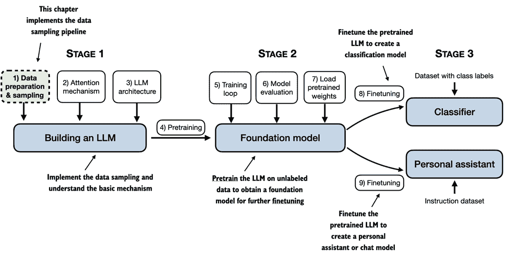

在本章中，你将学习如何为训练 LLM 准备输入文本。这涉及将文本拆分为单个单词和子词标记，然后可以将其编码为 LLM 的向量表示。你还将学习像字节对编码这样的高级标记方案，它在流行的 LLM 如 GPT 中被利用。最后，我们将实现一种采样和数据加载策略，以生成后续章节中训练 LLM 所需的输入输出对。

## 2.1 理解词嵌入

深度神经网络模型，包括 LLM，不能直接处理原始文本。由于文本是分类的，无法与用于实现和训练神经网络的数学运算兼容。因此，我们需要一种将词语表示为连续值向量的方法。（不熟悉计算上下文中的向量和张量的读者可以在附录 A，A2.2 节“理解张量”中了解更多信息。）

将数据转换为向量格式的概念通常被称为*嵌入*。使用特定的神经网络层或其他预训练的神经网络模型，我们可以嵌入不同类型的数据，例如视频、音频和文本，如图 2.2 所示。

##### 图 2.2 深度学习模型无法处理视频、音频和文本等原始数据格式。因此，我们使用嵌入模型将这些原始数据转换为密集的向量表示，以便深度学习架构能够轻松理解和处理。具体来说，这张图说明了将原始数据转换为三维数值向量的过程。


如图 2.2 所示，我们可以通过嵌入模型处理各种不同的数据格式。然而，重要的是要注意，不同的数据格式需要不同的嵌入模型。例如，专为文本设计的嵌入模型并不适合嵌入音频或视频数据。

嵌入的核心是将离散对象（如单词、图像或整个文档）映射到连续向量空间中的点——嵌入的主要目的是将非数字数据转换为神经网络可以处理的格式。

虽然词嵌入是文本嵌入中最常见的形式，但也存在句子、段落或整篇文档的嵌入。句子或段落嵌入是*检索增强生成*的热门选择。检索增强生成结合了生成（如生成文本）与检索（如搜索外部知识库），在生成文本时提取相关信息，这是一种超出本书范围的技术。由于我们的目标是训练像 GPT 这样的 LLM，这些模型学习逐字生成文本，本章重点讨论词嵌入。

有多种算法和框架被开发出来用于生成词嵌入。其中一个较早且最受欢迎的例子是*Word2Vec*方法。Word2Vec 训练神经网络架构，通过预测给定目标单词的上下文来生成词嵌入，反之亦然。Word2Vec 背后的主要思想是，出现在相似上下文中的单词往往具有相似的含义。因此，当投影到二维词嵌入以便于可视化时，可以看到相似的术语聚集在一起，如图 2.3 所示。

##### 图 2.3 如果词嵌入是二维的，我们可以将它们绘制在二维散点图中以便于可视化，如此处所示。在使用词嵌入技术（例如 Word2Vec）时，对应于相似概念的单词往往在嵌入空间中彼此靠近。例如，不同种类的鸟在嵌入空间中相较于国家和城市更靠近。

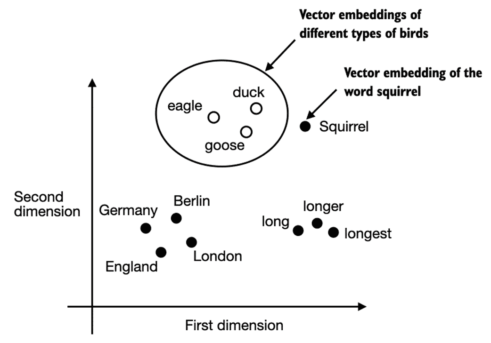

词嵌入可以具有不同的维度，从一维到数千维。如图 2.3 所示，我们可以选择二维词嵌入用于可视化目的。更高的维度可能会捕捉到更细微的关系，但代价是计算效率下降。

虽然我们可以使用预训练模型如 Word2Vec 为机器学习模型生成嵌入，但 LLM 通常生成自己的嵌入，这些嵌入是输入层的一部分，并在训练过程中更新。将嵌入优化为 LLM 训练的一部分而不是使用 Word2Vec 的优势在于，这些嵌入会针对具体的任务和数据进行优化。我们将在本章稍后实现这样的嵌入层。此外，LLM 还可以创建上下文相关的输出嵌入，正如我们在第三章中讨论的。

不幸的是，高维嵌入在可视化方面存在挑战，因为我们的感官感知和常见的图形表示本质上限于三维或更少，这就是图 2.3 显示二维散点图的原因。然而，在处理 LLM 时，我们通常使用的嵌入维度远高于图 2.3 所示的维度。对于 GPT-2 和 GPT-3，嵌入大小（通常称为模型隐藏状态的维度）会根据具体的模型变体和大小而有所不同。这是性能与效率之间的权衡。最小的 GPT-2 模型（117M 和 125M 参数）使用 768 维的嵌入大小以提供具体示例。最大的 GPT-3 模型（175B 参数）使用 12,288 维的嵌入大小。

本章接下来的部分将逐步介绍准备 LLM 使用的嵌入所需的步骤，包括将文本分割为单词、将单词转换为标记，以及将标记转换为嵌入向量。

## 2.2 文本标记化

本节涵盖了如何将输入文本分割成单个标记，这是为 LLM 创建嵌入所需的预处理步骤。这些标记可以是单独的单词或特殊字符，包括标点符号，如图 2.4 所示。

##### 图 2.4 在 LLM 背景下展示了本节所涉及的文本处理步骤。在这里，我们将输入文本分割成单个标记，这些标记可以是单词或特殊字符，例如标点符号。在接下来的章节中，我们将把文本转换为标记 ID 并创建标记嵌入。

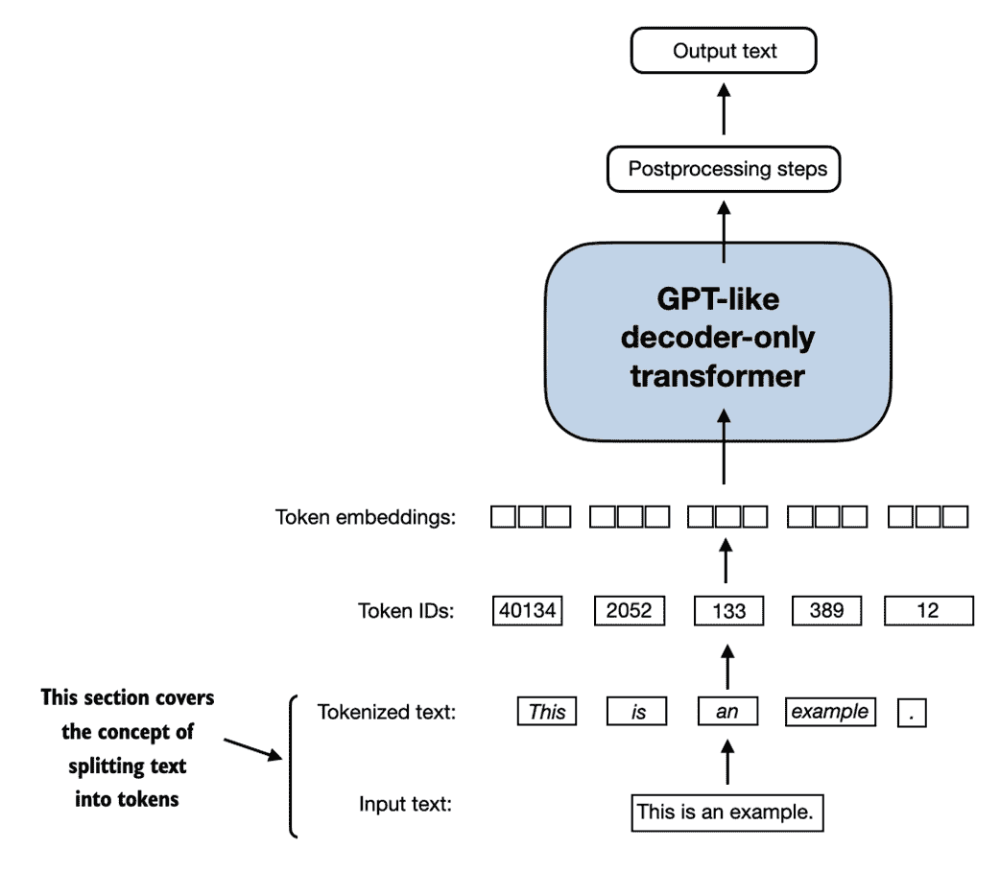

我们将为 LLM 训练标记化的文本是一篇由伊迪丝·沃顿创作的短故事，名为 *判决*，该故事已进入公有领域，因此可以用于 LLM 训练任务。文本可以在维基文库找到，链接为 `en.wikisource.org/wiki/The_Verdict`，你可以将其复制并粘贴到文本文件中，我将其复制到文本文件 `"the-verdict.txt"` 中，以便使用 Python 的标准文件读取工具加载：

##### 列表 2.1 将短故事作为文本样本读取到 Python 中

```py
with open("the-verdict.txt", "r", encoding="utf-8") as f:
    raw_text = f.read()
print("Total number of character:", len(raw_text))
print(raw_text[:99])
```

另外，你可以在本书的 GitHub 仓库中找到这个 "`the-verdict.txt`" 文件，链接为 `github.com/rasbt/LLMs-from-scratch/tree/main/ch02/01_main-chapter-code`。

打印命令打印该文件的字符总数，接着是前 100 个字符以供说明：

```py
Total number of character: 20479
I HAD always thought Jack Gisburn rather a cheap genius--though a good fellow enough--so it was no 
```

我们的目标是将这个 20,479 字符的短篇故事分词成单独的单词和特殊字符，然后在即将到来的章节中将其转换为 LLM 训练的嵌入。

##### 文本样本大小

请注意，在处理 LLM 时，通常会处理数百万篇文章和数十万本书籍——数十亿字节的文本。然而，出于教育目的，使用像单本书这样的小文本样本来说明文本处理步骤背后的主要思想是足够的，并且可以在消费硬件上合理时间内运行。

我们如何才能最好地分割这段文本以获得一个令牌列表？为此，我们进行一次小的探险，使用 Python 的正则表达式库 `re` 进行说明。（请注意，您不必学习或记住任何正则表达式语法，因为我们将在本章稍后过渡到一个预构建的分词器。）

使用一些简单的示例文本，我们可以使用 `re.split` 命令，采用以下语法按空白字符分割文本：

```py
import re
text = "Hello, world. This, is a test."
result = re.split(r'(\s)', text)
print(result)
```

结果是一个由单独的单词、空格和标点符号组成的列表：

```py
['Hello,', ' ', 'world.', ' ', 'This,', ' ', 'is', ' ', 'a', ' ', 'test.']
```

请注意，上述简单的分词方案主要用于将示例文本分隔成单个单词，然而，一些单词仍然与我们希望作为单独列表项的标点符号相连。我们还避免将所有文本转换为小写，因为大写有助于 LLM 区分专有名词和普通名词，理解句子结构，并学习生成适当大写的文本。

让我们修改正则表达式，以空格（`\s`）、逗号和句号（`[,.]`）为分隔符：

```py
result = re.split(r'([,.]|\s)', text)
print(result)
```

我们可以看到，单词和标点符号现在是分开的列表项，正如我们所希望的那样：

```py
['Hello', ',', '', ' ', 'world', '.', '', ' ', 'This', ',', '', ' ', 'is', ' ', 'a', ' ', 'test', '.', '']
```

一个小问题是，列表中仍然包含空白字符。可选地，我们可以安全地去除这些冗余字符，如下所示：

```py
result = [item for item in result if item.strip()]
print(result)
```

结果是没有空格的输出如下所示：

```py
['Hello', ',', 'world', '.', 'This', ',', 'is', 'a', 'test', '.']
```

##### 是否删除空格

在开发一个简单的分词器时，我们是否应该将空格编码为单独的字符，或者只是将其删除，取决于我们的应用程序及其需求。删除空格可以减少内存和计算需求。然而，如果我们训练的模型对文本的确切结构敏感（例如，Python 代码对缩进和空格敏感），保留空格会很有用。在这里，我们为了简单和简洁性而删除空格。稍后，我们将切换到一个包含空格的分词方案。

我们设计的标记化方案在简单的样本文本上效果良好。让我们进一步修改它，以便它也能处理其他类型的标点符号，如问号、引号以及我们在艾迪丝·华顿短篇小说前 100 个字符中看到的双破折号，还有其他特殊字符：

```py
text = "Hello, world. Is this-- a test?"
result = re.split(r'([,.:;?_!"()\']|--|\s)', text)
result = [item.strip() for item in result if item.strip()]
print(result)
```

结果输出如下：

```py
['Hello', ',', 'world', '.', 'Is', 'this', '--', 'a', 'test', '?']
```

从图 2.5 中总结的结果来看，我们的标记化方案现在能够成功处理文本中的各种特殊字符。

##### 图 2.5 我们迄今实施的标记化方案将文本拆分为单个单词和标点符号。在此图中显示的具体示例中，样本文本被拆分为 10 个单独的标记。

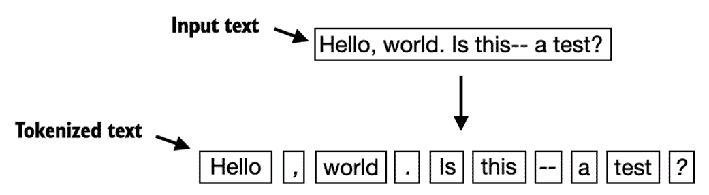

现在我们有了一个基本的标记器，让我们将其应用于艾迪丝·华顿的整个短篇小说：

```py
preprocessed = re.split(r'([,.?_!"()\']|--|\s)', raw_text)
preprocessed = [item.strip() for item in preprocessed if item.strip()]
print(len(preprocessed))
```

上述打印语句输出`4649`，这是该文本中的标记数量（不包括空格）。

让我们打印前 30 个标记以进行快速视觉检查：

```py
print(preprocessed[:30])
```

结果输出显示我们的标记器似乎能够很好地处理文本，因为所有单词和特殊字符都被整齐分开：

```py
['I', 'HAD', 'always', 'thought', 'Jack', 'Gisburn', 'rather', 'a', 'cheap', 'genius', '--', 'though', 'a', 'good', 'fellow', 'enough', '--', 'so', 'it', 'was', 'no', 'great', 'surprise', 'to', 'me', 'to', 'hear', 'that', ',', 'in']
```

## 2.3 将标记转换为标记 ID

在上一节中，我们将艾迪丝·华顿的一篇短篇小说标记化为单个标记。在本节中，我们将把这些标记从 Python 字符串转换为整数表示形式，以生成所谓的标记 ID。这一转换是将标记 ID 转换为嵌入向量之前的一个中间步骤。

为了将先前生成的标记映射到标记 ID，我们必须首先构建一个所谓的词汇表。这个词汇表定义了我们如何将每个唯一单词和特殊字符映射到一个唯一的整数，如图 2.6 所示。

##### 图 2.6 我们通过将训练数据集中的整个文本标记化为单个标记来构建词汇表。这些单个标记随后按字母顺序排序，重复标记被移除。唯一标记被汇总成一个定义从每个唯一标记到唯一整数值映射的词汇表。所示的词汇表故意较小以作示例，并且为简单起见不包含标点符号或特殊字符。


在上一节中，我们将艾迪丝·华顿的短篇小说进行了标记化，并将其分配给一个名为`preprocessed`的 Python 变量。现在让我们创建一个所有唯一标记的列表，并按字母顺序对其进行排序，以确定词汇量：

```py
all_words = sorted(list(set(preprocessed)))
vocab_size = len(all_words)
print(vocab_size)
```

在通过上述代码确定词汇量为 1,159 后，我们创建词汇表并打印其前 50 个条目以作示例：

##### 列表 2.2 创建词汇表

```py
vocab = {token:integer for integer,token in enumerate(all_words)}
for i, item in enumerate(vocab.items()):
    print(item)
    if i > 50:
        break
```

```py
('!', 0)
('"', 1)
("'", 2)
...
('Has', 49)
('He', 50)
```

从上面的输出可以看出，字典包含与唯一整数标签相关的单独标记。我们的下一个目标是将这个词汇表应用于将新文本转换为标记 ID，如图 2.7 所示。

##### 图 2.7 从一个新的文本样本开始，我们对文本进行分词，并利用词汇将文本标记转换为标记 ID。词汇是从整个训练集中构建的，可以应用于训练集本身以及任何新的文本样本。为了简单起见，所示词汇不包含标点符号或特殊字符。

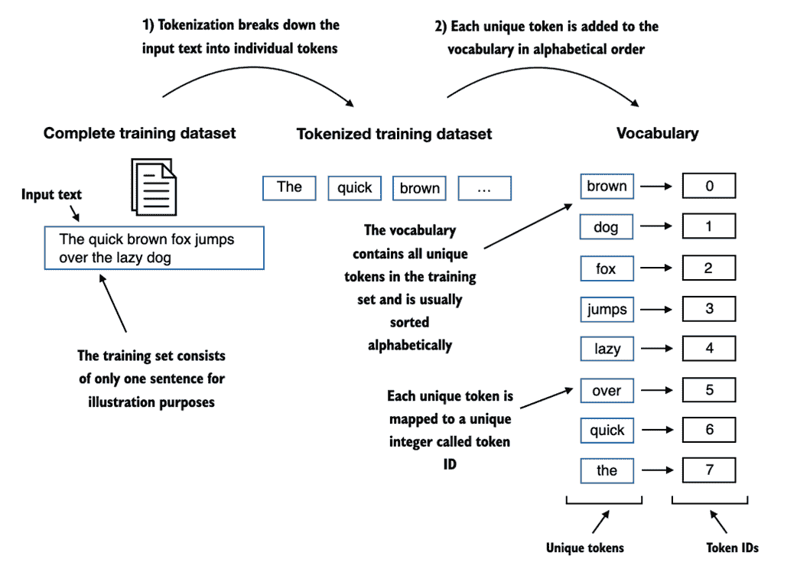

在本书后面，当我们想要将 LLM 的输出从数字转换回文本时，我们还需要一种方法将标记 ID 转换为文本。为此，我们可以创建一个词汇的逆版本，将标记 ID 映射回对应的文本标记。

让我们在 Python 中实现一个完整的分词器类，包含一个 `encode` 方法，该方法将文本分割为标记，并通过词汇进行字符串到整数的映射以生成标记 ID。此外，我们实现一个 `decode` 方法，进行反向整数到字符串的映射，将标记 ID 转换回文本。

该分词器实现的代码如清单 2.3 所示：

##### 清单 2.3 实现一个简单的文本分词器

```py
class SimpleTokenizerV1:
    def __init__(self, vocab):
        self.str_to_int = vocab #A
        self.int_to_str = {i:s for s,i in vocab.items()} #B

    def encode(self, text): #C
        preprocessed = re.split(r'([,.?_!"()\']|--|\s)', text)
        preprocessed = [item.strip() for item in preprocessed if item.strip()]
        ids = [self.str_to_int[s] for s in preprocessed]
        return ids

    def decode(self, ids): #D
        text = " ".join([self.int_to_str[i] for i in ids]) 

        text = re.sub(r'\s+([,.?!"()\'])', r'\1', text) #E
        return text
```

使用上述的 `SimpleTokenizerV1` Python 类，我们现在可以通过现有的词汇实例化新的分词器对象，然后利用这些对象对文本进行编码和解码，如图 2.8 所示。

##### 图 2.8 分词器实现共享两个公共方法：一个编码方法和一个解码方法。编码方法接收样本文本，将其拆分为单个标记，并通过词汇将标记转换为标记 ID。解码方法接收标记 ID，将其转换回文本标记，并将文本标记连接成自然文本。

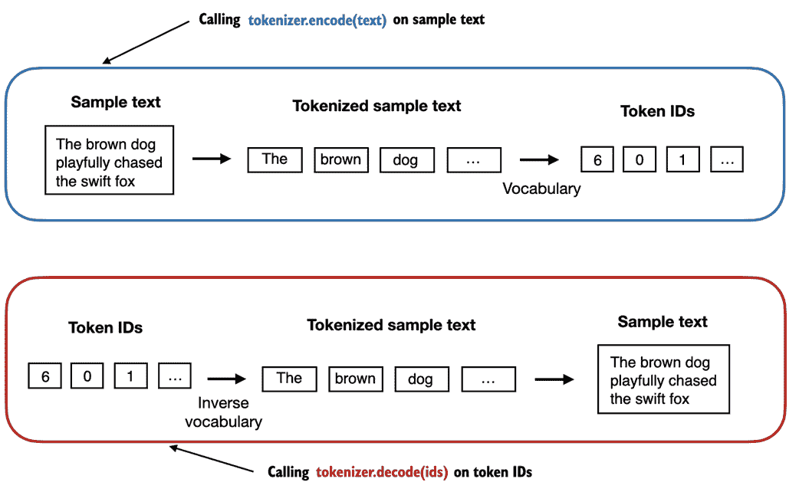

让我们从 `SimpleTokenizerV1` 类实例化一个新的分词器对象，并对埃迪丝·华顿短篇小说中的一段进行分词，以便实际测试：

```py
tokenizer = SimpleTokenizerV1(vocab)

text = """"It's the last he painted, you know," Mrs. Gisburn said with pardonable pride."""
ids = tokenizer.encode(text)
print(ids)
```

上述代码打印以下标记 ID：

```py
[1, 58, 2, 872, 1013, 615, 541, 763, 5, 1155, 608, 5, 1, 69, 7, 39, 873, 1136, 773, 812, 7]
```

接下来，让我们看看是否可以使用解码方法将这些标记 ID 转换回文本：

```py
print(tokenizer.decode(ids))
```

这将输出以下文本：

```py
'" It\' s the last he painted, you know," Mrs. Gisburn said with pardonable pride.'
```

根据上述输出，我们可以看到解码方法成功地将标记 ID 转换回原始文本。

到目前为止，一切顺利。我们实现了一个能够根据训练集的片段对文本进行分词和去分词的分词器。现在，让我们将其应用于一个不包含在训练集中的新文本样本：

```py
text = "Hello, do you like tea?"
tokenizer.encode(text)
```

执行上述代码将导致以下错误：

```py
...
KeyError: 'Hello'
```

问题在于，单词 "Hello" 并未出现在 *判决* 短篇小说中。因此，它不包含在词汇中。这凸显了在处理 LLM 时需要考虑大型和多样化的训练集以扩展词汇的必要性。

在下一节中，我们将进一步测试该分词器，处理包含未知词汇的文本，并讨论可以用于在训练期间为 LLM 提供进一步上下文的额外特殊标记。

## 2.4 添加特殊上下文标记

在上一节中，我们实现了一个简单的分词器并将其应用于训练集中的一段文本。在这一节中，我们将修改这个分词器以处理未知单词。

我们还将讨论特殊上下文标记的使用和添加，这些标记可以增强模型对上下文或文本中其他相关信息的理解。这些特殊标记可以包括未知单词和文档边界的标记，例如。

特别地，我们将修改在上一节中实现的词汇和分词器`SimpleTokenizerV2`，以支持两个新标记`<|unk|>`和`<|endoftext|>`，如图 2.9 所示。

##### 图 2.9 我们向词汇中添加特殊标记以处理某些上下文。例如，我们添加一个`<|unk|>`标记以表示训练数据中不存在的新单词，因此不属于现有词汇。此外，我们添加一个`<|endoftext|>`标记，用于分隔两个无关的文本来源。

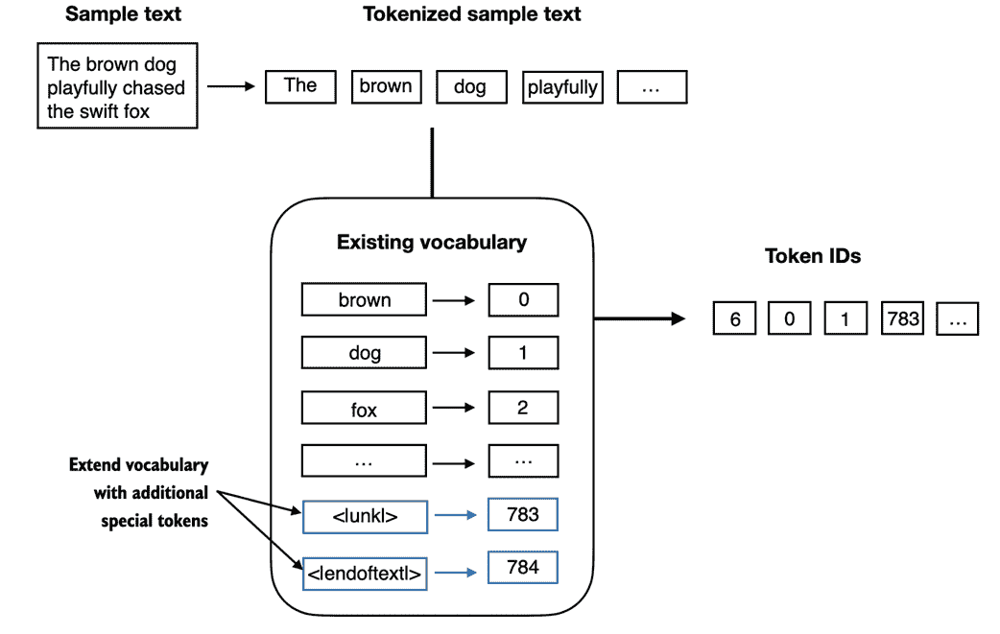

如图 2.9 所示，当分词器遇到不属于词汇表的单词时，我们可以修改分词器以使用`<|unk|>`标记。此外，我们在不相关文本之间添加一个标记。例如，在对多个独立文档或书籍进行 GPT 类 LLM 训练时，通常会在每个文档或书籍前插入一个标记，以表明它是跟随之前文本来源的，如图 2.10 所示。这有助于 LLM 理解，尽管这些文本来源是为了训练而连接在一起的，但实际上是无关的。

##### 图 2.10 在处理多个独立文本来源时，我们在这些文本之间添加`<|endoftext|>`标记。这些`<|endoftext|>`标记作为标记，信号特定段落的开始或结束，使 LLM 能够更有效地处理和理解。

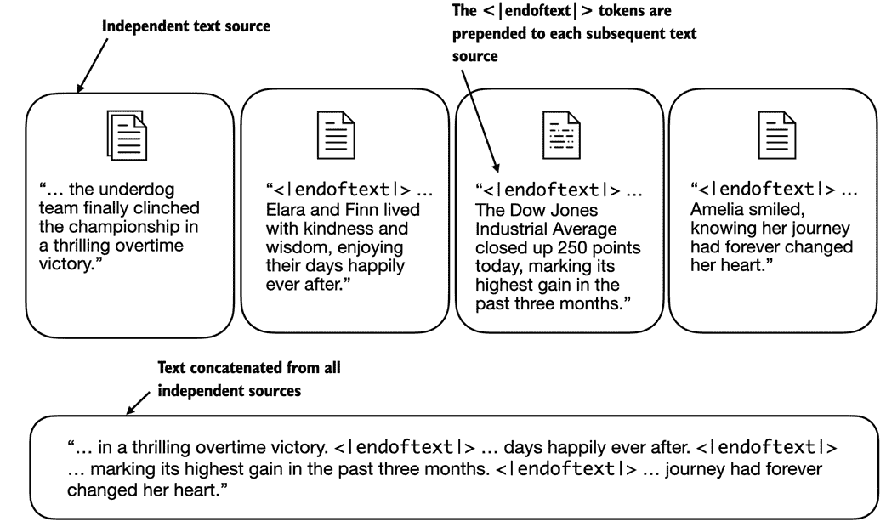

现在让我们修改词汇，以包括这两个特殊标记`<unk>`和`<|endoftext|>`，通过将这些标记添加到我们在上一节创建的所有唯一单词列表中：

```py
all_tokens = sorted(list(set(preprocessed)))
all_tokens.extend(["<|endoftext|>", "<|unk|>"])
vocab = {token:integer for integer,token in enumerate(all_tokens)}

print(len(vocab.items()))
```

根据上面打印语句的输出，新词汇的大小为 1161（上一节的词汇大小为 1159）。

作为额外的快速检查，让我们打印更新词汇的最后 5 个条目：

```py
for i, item in enumerate(list(vocab.items())[-5:]):
    print(item)
```

上面的代码打印出以下内容：

```py
('younger', 1156)
('your', 1157)
('yourself', 1158)
('<|endoftext|>', 1159)
('<|unk|>', 1160)
```

根据上面代码的输出，我们可以确认这两个新的特殊标记确实成功地纳入了词汇中。接下来，我们相应地调整代码清单 2.3 中的分词器，如清单 2.4 所示：

##### 列表 2.4 一个处理未知单词的简单文本分词器

```py
class SimpleTokenizerV2:
    def __init__(self, vocab):
        self.str_to_int = vocab
        self.int_to_str = { i:s for s,i in vocab.items()}

    def encode(self, text):
        preprocessed = re.split(r'([,.?_!"()\']|--|\s)', text)
        preprocessed = [item.strip() for item in preprocessed if item.strip()]
        preprocessed = [item if item in self.str_to_int  #A
                        else "<|unk|>" for item in preprocessed]

        ids = [self.str_to_int[s] for s in preprocessed]
        return ids

    def decode(self, ids):
        text = " ".join([self.int_to_str[i] for i in ids])

        text = re.sub(r'\s+([,.?!"()\'])', r'\1', text) #B
        return text
```

与我们在上一节代码清单 2.3 中实现的`SimpleTokenizerV1`相比，新`SimpleTokenizerV2`用`<|unk|>`标记替换了未知单词。

现在让我们在实践中尝试这个新的分词器。为此，我们将使用一个简单的文本样本，由两个独立且无关的句子拼接而成：

```py
text1 = "Hello, do you like tea?"
text2 = "In the sunlit terraces of the palace."
text = " <|endoftext|> ".join((text1, text2))
print(text)
```

输出如下：

```py
'Hello, do you like tea? <|endoftext|> In the sunlit terraces of the palace.'
```

接下来，让我们使用之前在列表 2.2 中创建的词汇表，使用`SimpleTokenizerV2`对示例文本进行分词：

```py
tokenizer = SimpleTokenizerV2(vocab)
print(tokenizer.encode(text))
```

这将打印以下标记 ID：

```py
[1160, 5, 362, 1155, 642, 1000, 10, 1159, 57, 1013, 981, 1009, 738, 1013, 1160, 7]
```

在上面，我们可以看到标记 ID 列表包含 1159 作为`<|endoftext|>`分隔标记以及两个 1160 标记，用于未知单词。

让我们进行去标记化文本的快速合理性检查：

```py
print(tokenizer.decode(tokenizer.encode(text)))
```

输出如下：

```py
'<|unk|>, do you like tea? <|endoftext|> In the sunlit terraces of the <|unk|>.'
```

基于将上述去标记化文本与原始输入文本进行比较，我们知道训练数据集《伊迪丝·华顿的短篇小说*裁决*》中没有包含“Hello”和“palace”这两个词。

到目前为止，我们讨论了分词化作为处理文本以输入 LLM 的重要步骤。根据不同的 LLM，一些研究人员还考虑了其他特殊标记，例如：

+   `[BOS]`（序列开始）：此标记表示文本的开始。它向大型语言模型（LLM）指示内容的开始位置。

+   `[EOS]`（序列结束）：此标记位于文本的末尾，尤其在连接多个不相关文本时非常有用，类似于`<|endoftext|>`。例如，当组合两篇不同的维基百科文章或书籍时，`[EOS]`标记指示一篇文章结束的地方和下一篇文章开始的地方。

+   `[PAD]`（填充）：在使用大于一个的批量大小训练 LLM 时，批量可能包含长度不同的文本。为了确保所有文本具有相同的长度，较短的文本会使用`[PAD]`标记进行扩展或“填充”，直到达到批量中最长文本的长度。

请注意，用于 GPT 模型的分词器不需要上述提到的任何标记，而只使用一个`<|endoftext|>`标记以简化操作。`<|endoftext|>`与上面提到的`[EOS]`标记类似。同时，`<|endoftext|>`也用于填充。然而，正如我们将在后面的章节中探讨的那样，在批量输入的训练中，我们通常使用掩码，这意味着我们不关注填充标记。因此，选择用于填充的特定标记变得无关紧要。

此外，GPT 模型使用的分词器也不使用`<|unk|>`标记来处理超出词汇表的单词。相反，GPT 模型使用*字节对编码*分词器，将单词拆分为子词单元，关于这一点我们将在下一节讨论。

## 2.5 字节对编码

我们在之前的部分实施了一个简单的分词方案以作说明。本节涵盖了一种基于字节对编码（BPE）概念的更复杂的分词方案。本节中介绍的 BPE 分词器用于训练如 GPT-2、GPT-3 及 ChatGPT 原始模型等 LLM。

由于实现 BPE 可能相对复杂，我们将使用一个名为*tiktoken*的现有 Python 开源库（[`github.com/openai/tiktoken`](https://github.com/openai/tiktoken)），它基于 Rust 源代码高效地实现了 BPE 算法。与其他 Python 库类似，我们可以通过 Python 的`pip`安装程序从终端安装 tiktoken 库：

```py
pip install tiktoken
```

本章中的代码基于 tiktoken 0.5.1。您可以使用以下代码检查当前安装的版本：

```py
from importlib.metadata import version
import tiktoken
print("tiktoken version:", version("tiktoken"))
```

安装后，我们可以如下实例化来自 tiktoken 的 BPE 分词器：

```py
tokenizer = tiktoken.get_encoding("gpt2")
```

该分词器的用法类似于我们之前通过`encode`方法实现的 SimpleTokenizerV2：

```py
text = "Hello, do you like tea? <|endoftext|> In the sunlit terraces of someunknownPlace."
integers = tokenizer.encode(text, allowed_special={"<|endoftext|>"})
print(integers)
```

上述代码打印以下标记 ID：

```py
[15496, 11, 466, 345, 588, 8887, 30, 220, 50256, 554, 262, 4252, 18250, 8812, 2114, 286, 617, 34680, 27271, 13]
```

然后，我们可以使用解码方法将标记 ID 转换回文本，类似于我们之前的`SimpleTokenizerV2`：

```py
strings = tokenizer.decode(integers)
print(strings)
```

上述代码打印以下内容：

```py
'Hello, do you like tea? <|endoftext|> In the sunlit terraces of someunknownPlace.'
```

我们可以根据上述的标记 ID 和解码文本做出两个值得注意的观察。首先，`<|endoftext|>`标记被分配了相对较大的标记 ID，即 50256。实际上，用于训练如 GPT-2、GPT-3 和 ChatGPT 原始模型的 BPE 分词器，总词汇量为 50,257，其中`<|endoftext|>`被分配了最大的标记 ID。

其次，上述 BPE 分词器可以正确编码和解码未知词，如“someunknownPlace”。BPE 分词器可以处理任何未知单词。它是如何在不使用`<|unk|>`标记的情况下实现这一点的？

BPE 背后的算法将不在其预定义词汇表中的单词分解为更小的子词单元或甚至单个字符，从而使其能够处理超出词汇范围的单词。因此，得益于 BPE 算法，如果分词器在分词时遇到不熟悉的单词，它可以将其表示为一系列子词标记或字符，如图 2.11 所示。

##### 图 2.11 BPE 分词器将未知词分解为子词和单个字符。通过这种方式，BPE 分词器可以解析任何单词，而无需用特殊标记（如<|unk|>）替换未知词。


如图 2.11 所示，将未知词分解为单个字符的能力确保了分词器，以及由其训练的 LLM，可以处理任何文本，即使它包含在训练数据中不存在的单词。

##### 练习 2.1 未知词的字节对编码

尝试使用 tiktoken 库的 BPE 分词器对未知词“Akwirw ier”进行处理，并打印单个标记 ID。然后，对这个列表中的每个结果整数调用解码函数，以重现图 2.11 中显示的映射。最后，调用标记 ID 的解码方法，以检查是否可以重构原始输入“Akwirw ier”。

BPE 的详细讨论和实现超出了本书的范围，但简而言之，它通过反复合并频繁出现的字符到子词，以及将频繁子词合并为词来构建其词汇。例如，BPE 从将所有单个字符添加到其词汇表开始（“a”、“b”等）。在下一阶段，它将经常一起出现的字符组合合并为子词。例如，“d”和“e”可能合并为子词“de”，这在许多英语单词中很常见，如“define”、“depend”、“made”和“hidden”。合并的决定基于频率阈值。

## 2.6 数据采样与滑动窗口

前一节详细讨论了分词步骤以及从字符串令牌转换为整数令牌 ID 的过程。在我们最终为 LLM 创建嵌入之前，下一步是生成训练 LLM 所需的输入-目标对。

这些输入-目标对看起来如何？正如我们在第一章中学习的，LLM 通过预测文本中的下一个词进行预训练，如图 2.12 所示。

##### 图 2.12 给定一个文本样本，提取输入块作为子样本，作为 LLM 的输入，LLM 的训练预测任务是预测跟随输入块的下一个词。在训练过程中，我们会掩盖掉所有超出目标的词。请注意，这个图中显示的文本在 LLM 处理之前需要进行分词；然而，为了清晰起见，本图省略了分词步骤。


在本节中，我们实现一个数据加载器，使用滑动窗口方法从训练数据集中获取图 2.12 中描述的输入-目标对。

首先，我们将使用上一节介绍的 BPE 分词器对整个《裁决》短篇故事进行分词：

```py
with open("the-verdict.txt", "r", encoding="utf-8") as f:
    raw_text = f.read()

enc_text = tokenizer.encode(raw_text)
print(len(enc_text))
```

执行上述代码将返回 5145，即应用 BPE 分词器后训练集中 token 的总数。

接下来，我们从数据集中移除前 50 个 tokens，以便演示，因为这会导致后续步骤中出现更有趣的文本段落：

```py
enc_sample = enc_text[50:]
```

创建下一个词预测任务的输入-目标对最简单和最直观的方法之一是创建两个变量 `x` 和 `y`，其中 `x` 包含输入 tokens，`y` 包含目标，这些目标是输入右移 1 后的结果：

```py
context_size = 4 #A

x = enc_sample[:context_size]
y = enc_sample[1:context_size+1]
print(f"x: {x}")
print(f"y: {y}")
```

运行上述代码将输出以下内容：

```py
x: [290, 4920, 2241, 287]
y:      [4920, 2241, 287, 257]
```

处理输入和目标（目标是输入向右移动一个位置），我们可以创建之前在图 2.12 中描述的下一个词预测任务，具体如下：

```py
for i in range(1, context_size+1):
    context = enc_sample[:i]
    desired = enc_sample[i]
    print(context, "---->", desired)
```

上述代码输出如下：

```py
[290] ----> 4920
[290, 4920] ----> 2241
[290, 4920, 2241] ----> 287
[290, 4920, 2241, 287] ----> 257
```

箭头左侧的所有内容（`---->`）指的是 LLM 将接收的输入，而箭头右侧的 token ID 表示 LLM 应该预测的目标 token ID。

为了说明问题，我们将重复前面的代码，但将 token ID 转换为文本：

```py
for i in range(1, context_size+1):
    context = enc_sample[:i]
    desired = enc_sample[i]
    print(tokenizer.decode(context), "---->", tokenizer.decode([desired]))
```

以下输出显示输入和输出在文本格式中的样子：

```py
 and ---->  established
 and established ---->  himself
 and established himself ---->  in
 and established himself in ---->  a
```

我们现在已经创建了可以在即将到来的章节中用于 LLM 训练的输入-目标对。

在将 tokens 转化为嵌入之前，还有一个任务：实现一个高效的数据加载器，遍历输入数据集并将输入和目标作为 PyTorch 张量返回，这可以被视为多维数组。

特别地，我们关注返回两个张量：一个包含 LLM 看到的文本的输入张量和一个包含 LLM 预测目标的目标张量，如图 2.13 所示。

##### 图 2.13 为了实现高效的数据加载器，我们在张量 x 中收集输入，每一行代表一个输入上下文。第二个张量 y 包含相应的预测目标（下一个单词），它们是通过将输入向右移动一个位置创建的。

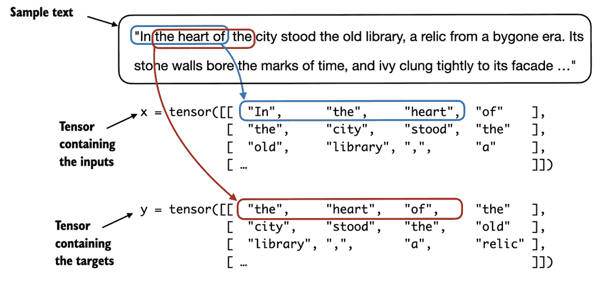

尽管图 2.13 出于说明目的以字符串格式显示 tokens，但代码实现将直接处理 token ID，因为 BPE 分词器的`encode`方法将分词和转换为 token ID 的过程合并为一个步骤。

对于高效的数据加载器实现，我们将使用 PyTorch 内置的 Dataset 和 DataLoader 类。有关安装 PyTorch 的更多信息和指导，请参见附录 A 中的 A.1.3 节，安装 PyTorch。

数据集类的代码在代码清单 2.5 中显示：

##### 清单 2.5 用于批量输入和目标的数据集

```py
import torch
from torch.utils.data import Dataset, DataLoader

class GPTDatasetV1(Dataset):
    def __init__(self, txt, tokenizer, max_length, stride):
        self.tokenizer = tokenizer
        self.input_ids = []
        self.target_ids = []

        token_ids = tokenizer.encode(txt) #A

        for i in range(0, len(token_ids) - max_length, stride): #B
            input_chunk = token_ids[i:i + max_length]
            target_chunk = token_ids[i + 1: i + max_length + 1]
            self.input_ids.append(torch.tensor(input_chunk))
            self.target_ids.append(torch.tensor(target_chunk))

    def __len__(self): #C
        return len(self.input_ids)

    def __getitem__(self, idx): #D
        return self.input_ids[idx], self.target_ids[idx]
```

清单 2.5 中的`GPTDatasetV1`类基于 PyTorch 的`Dataset`类，定义了如何从数据集中提取单独的行，每一行由多个基于`max_length`分配给`input_chunk`张量的 token ID 组成。`target_chunk`张量包含相应的目标。我建议继续阅读，看看当我们将数据集与 PyTorch 的`DataLoader`结合时，从这个数据集中返回的数据是什么样的——这将带来额外的直观理解和清晰度。

如果你对清单 2.5 中展示的 PyTorch `Dataset`类的结构不熟悉，请阅读附录 A 中的*A.6，高效数据加载器设置*，其中解释了 PyTorch `Dataset`和`DataLoader`类的一般结构和使用方法。

以下代码将使用`GPTDatasetV1`通过 PyTorch 的`DataLoader`批量加载输入：

##### 清单 2.6 生成包含输入-目标对的批次的数据加载器

```py
def create_dataloader_v1(txt, batch_size=4, 
        max_length=256, stride=128, shuffle=True, drop_last=True):
    tokenizer = tiktoken.get_encoding("gpt2") #A 
    dataset = GPTDatasetV1(txt, tokenizer, max_length, stride) #B
    dataloader = DataLoader(
        dataset, batch_size=batch_size, shuffle=shuffle, drop_last=drop_last) #C
    return dataloader
```

让我们用上下文大小为 4 的 LLM 测试批量大小为 1 的`dataloader`，以便对清单 2.5 中的`GPTDatasetV1`类和清单 2.6 中的`create_dataloader_v1`函数的协作有一个直观的理解：

```py
with open("the-verdict.txt", "r", encoding="utf-8") as f:
    raw_text = f.read()

dataloader = create_dataloader_v1(
    raw_text, batch_size=1, max_length=4, stride=1, shuffle=False)
data_iter = iter(dataloader) #A
first_batch = next(data_iter)
print(first_batch)
```

执行前面的代码将打印以下内容：

```py
[tensor([[  40,  367, 2885, 1464]]), tensor([[ 367, 2885, 1464, 1807]])]
```

`first_batch` 变量包含两个张量：第一个张量存储输入令牌 ID，第二个张量存储目标令牌 ID。由于 `max_length` 设置为 4，因此两个张量各包含 4 个令牌 ID。请注意，输入大小为 4 相对较小，仅用于说明目的。通常，训练 LLM 时的输入大小至少为 256。

为了说明 `stride=1` 的含义，让我们从这个数据集中获取另一个批次：

```py
second_batch = next(data_iter)
print(second_batch)
```

第二个批次的内容如下：

```py
[tensor([[ 367, 2885, 1464, 1807]]), tensor([[2885, 1464, 1807, 3619]])]
```

如果我们将第一个批次与第二个批次进行比较，可以看到第二个批次的令牌 ID 相比于第一个批次向前移动了一个位置（例如，第一个批次输入的第二个 ID 是 367，这正是第二个批次输入的第一个 ID）。`stride` 设置决定了输入在批次间移动的位置数量，模拟了滑动窗口的方法，如图 2.14 所示。

##### 图 2.14 在从输入数据集中创建多个批次时，我们在文本上滑动输入窗口。如果将步幅设置为 1，则在创建下一个批次时，我们将输入窗口向前移动 1 个位置。如果将步幅设置为输入窗口大小，则可以防止批次之间的重叠。


##### 练习 2.2 使用不同步幅和上下文大小的数据加载器

为了更好地理解数据加载器的工作原理，可以尝试使用不同的设置运行它，例如 max_length=2 和 stride=2，以及 max_length=8 和 stride=2。

批次大小为 1，例如我们迄今为止从数据加载器中采样的，适用于说明目的。如果您有深度学习的经验，您可能知道小批次大小在训练过程中需要更少的内存，但会导致模型更新更嘈杂。就像在常规深度学习中，批次大小是一个权衡和超参数，需要在训练 LLM 时进行实验。

在我们继续本章最后两个部分之前，专注于从令牌 ID 创建嵌入向量，让我们简单看看如何使用数据加载器进行大于 1 的批次大小采样：

```py
dataloader = create_dataloader_v1(raw_text, batch_size=8, max_length=4, stride=4)

data_iter = iter(dataloader)
inputs, targets = next(data_iter)
print("Inputs:\n", inputs)
print("\nTargets:\n", targets)
```

这会打印以下内容：

```py
Inputs:
 tensor([[   40,   367,  2885,  1464],
        [ 1807,  3619,   402,   271],
        [10899,  2138,   257,  7026],
        [15632,   438,  2016,   257],
        [  922,  5891,  1576,   438],
        [  568,   340,   373,   645],
        [ 1049,  5975,   284,   502],
        [  284,  3285,   326,    11]])

Targets:
 tensor([[  367,  2885,  1464,  1807],
        [ 3619,   402,   271, 10899],
        [ 2138,   257,  7026, 15632],
        [  438,  2016,   257,   922],
        [ 5891,  1576,   438,   568],
        [  340,   373,   645,  1049],
        [ 5975,   284,   502,   284],
        [ 3285,   326,    11,   287]])
```

注意，我们将步幅增加到 4。这是为了充分利用数据集（我们不跳过任何一个词），同时避免批次之间的重叠，因为更多的重叠可能导致过拟合加剧。

在本章的最后两个部分中，我们将实现嵌入层，将令牌 ID 转换为连续的向量表示，这些表示作为 LLM 的输入数据格式。

## 2.7 创建令牌嵌入

准备 LLM 训练输入文本的最后一步是将令牌 ID 转换为嵌入向量，如图 2.15 所示，这将是本章最后两个部分的重点。

##### 图 2.15 为 LLM 准备输入文本涉及对文本进行标记化，将文本标记转换为标记 ID，并将标记 ID 转换为向量嵌入向量。在本节中，我们考虑在前面的部分创建的标记 ID，以生成标记嵌入向量。

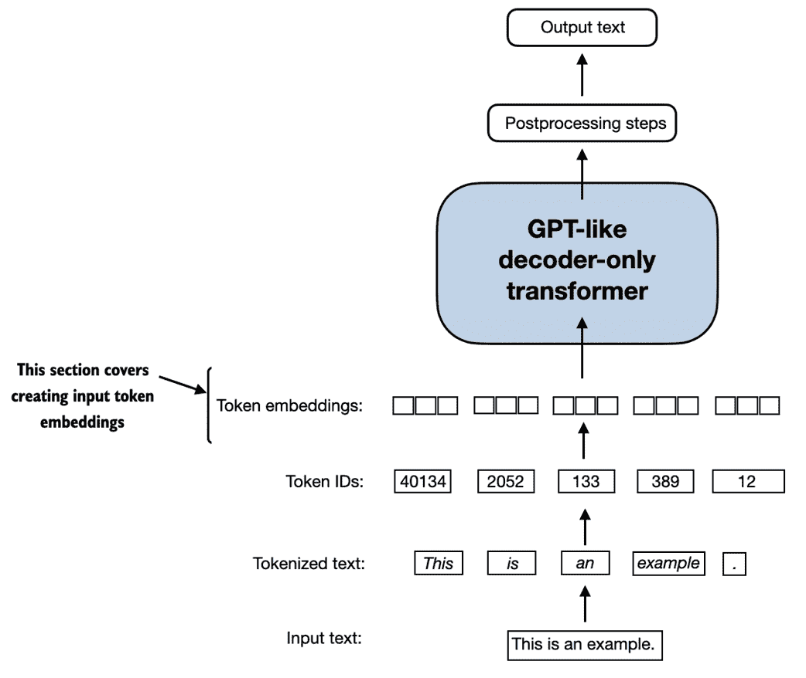

除了图 2.15 中概述的过程外，重要的是要注意，我们在初步步骤中以随机值初始化这些嵌入权重。这一初始化作为 LLM 学习过程的起点。我们将在第五章中优化嵌入权重，作为 LLM 训练的一部分。

由于 GPT 类 LLM 是通过反向传播算法训练的深度神经网络，因此需要连续的向量表示或嵌入。如果你对神经网络如何通过反向传播训练不熟悉，请阅读附录 A 中的 A.4 节，*自动微分简单易懂*。

让我们通过一个实际示例来说明标记 ID 到嵌入向量转换的工作原理。假设我们有以下四个输入标记，ID 为 2、3、5 和 1：

```py
input_ids = torch.tensor([2, 3, 5, 1])
```

为了简单起见和说明，假设我们只有 6 个单词的小词汇表（而不是 BPE 标记器词汇表中的 50,257 个单词），并且我们希望创建大小为 3 的嵌入（在 GPT-3 中，嵌入大小为 12,288 维）：

```py
vocab_size = 6
output_dim = 3
```

使用 `vocab_size` 和 `output_dim`，我们可以在 PyTorch 中实例化一个嵌入层，将随机种子设置为 123 以确保可重复性：

```py
torch.manual_seed(123)
embedding_layer = torch.nn.Embedding(vocab_size, output_dim)
print(embedding_layer.weight)
```

上一个代码示例中的打印语句打印了嵌入层的底层权重矩阵：

```py
Parameter containing:
tensor([[ 0.3374, -0.1778, -0.1690],
        [ 0.9178,  1.5810,  1.3010],
        [ 1.2753, -0.2010, -0.1606],
        [-0.4015,  0.9666, -1.1481],
        [-1.1589,  0.3255, -0.6315],
        [-2.8400, -0.7849, -1.4096]], requires_grad=True)
```

我们可以看到嵌入层的权重矩阵包含小的随机值。这些值在 LLM 训练过程中被优化，作为 LLM 优化的一部分，正如我们将在后续章节中看到的。此外，我们可以看到权重矩阵有六行三列。每个词汇表中六个可能的标记都有一行，每个嵌入维度都有一列。

在实例化嵌入层后，接下来我们将其应用于标记 ID 以获得嵌入向量：

```py
print(embedding_layer(torch.tensor([3])))
```

返回的嵌入向量如下：

```py
tensor([[-0.4015,  0.9666, -1.1481]], grad_fn=<EmbeddingBackward0>)
```

如果我们将标记 ID 3 的嵌入向量与先前的嵌入矩阵进行比较，我们会发现它与第 4 行相同（Python 从零开始索引，所以它对应于索引 3 的行）。换句话说，嵌入层本质上是一个查找操作，通过标记 ID 从嵌入层的权重矩阵中检索行。

##### 嵌入层与矩阵乘法

对于熟悉独热编码的人来说，上述嵌入层方法本质上只是实现独热编码并随后在全连接层中进行矩阵乘法的更高效方式，这在 GitHub 上的补充代码中得到了说明，链接为 `github.com/rasbt/LLMs-from-scratch/tree/main/ch02/03_bonus_embedding-vs-matmul`。由于嵌入层只是与独热编码和矩阵乘法方法等效的更高效实现，因此可以将其视为一个可以通过反向传播进行优化的神经网络层。

之前，我们已经看到如何将单个令牌 ID 转换为三维嵌入向量。现在让我们将这个方法应用于我们之前定义的所有四个输入 ID（`torch.tensor([2, 3, 5, 1])`）：

```py
print(embedding_layer(input_ids))
```

打印输出显示这产生了一个 4x3 的矩阵：

```py
tensor([[ 1.2753, -0.2010, -0.1606],
        [-0.4015,  0.9666, -1.1481],
        [-2.8400, -0.7849, -1.4096],
        [ 0.9178,  1.5810,  1.3010]], grad_fn=<EmbeddingBackward0>)
```

此输出矩阵中的每一行是通过查找嵌入权重矩阵获得的，如图 2.16 所示。

##### 图 2.16 嵌入层执行查找操作，从嵌入层的权重矩阵中检索与令牌 ID 对应的嵌入向量。例如，令牌 ID 5 的嵌入向量是嵌入层权重矩阵的第六行（因为 Python 从 0 开始计数，所以是第六行而不是第五行）。为了便于说明，我们假设令牌 ID 是通过我们在第 2.3 节中使用的小词汇表生成的。

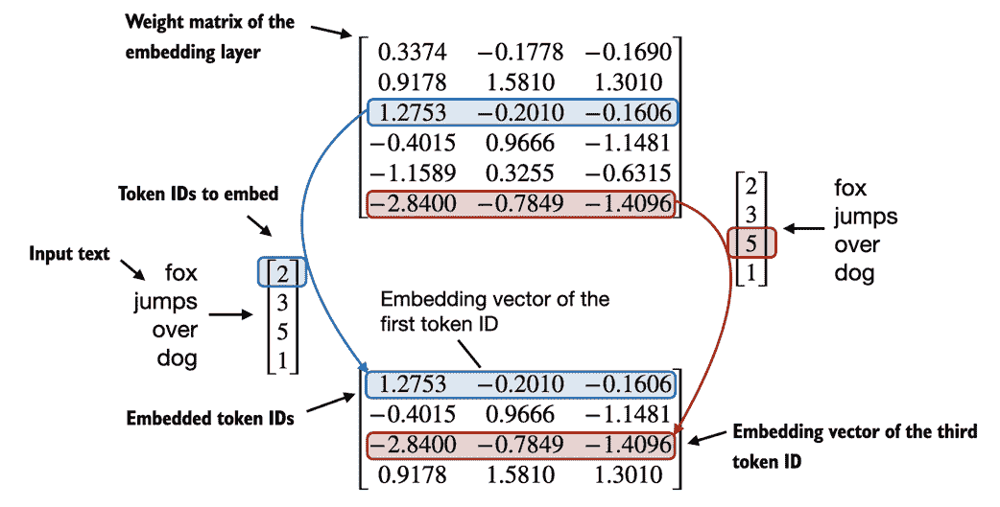

本节介绍了我们如何从令牌 ID 创建嵌入向量。本章的下一节也是最后一节将对这些嵌入向量进行小幅修改，以编码文本中令牌的位置信息。

## 2.8 编码词位置

在前一节中，我们将令牌 ID 转换为连续的向量表示，即所谓的令牌嵌入。原则上，这是 LLM 的合适输入。然而，LLM 的一个小缺点是，它们的自注意力机制（将在第三章详细介绍）没有对序列中令牌的位置或顺序的概念。

之前介绍的嵌入层的工作方式是，相同的令牌 ID 总是映射到相同的向量表示，无论该令牌 ID 在输入序列中的位置如何，如图 2.17 所示。

##### 图 2.17 嵌入层将令牌 ID 转换为相同的向量表示，而不管它在输入序列中的位置。例如，令牌 ID 5，无论是在令牌 ID 输入向量的第一还是第三个位置，都会得到相同的嵌入向量。


原则上，确定性且位置无关的令牌 ID 嵌入有利于重现性。然而，由于大型语言模型（LLMs）的自注意力机制本身也是位置无关的，因此将额外的位置信息注入 LLM 是有帮助的。

为了实现这一点，位置感知嵌入可以分为两大类：相对*位置嵌入*和绝对位置嵌入。

绝对位置嵌入与序列中的特定位置直接关联。对于输入序列中的每个位置，都会添加一个唯一的嵌入到 token 的嵌入中，以传达其确切位置。例如，第一个 token 将具有特定的位置嵌入，第二个 token 将有另一个不同的嵌入，依此类推，如图 2.18 所示。

##### 图 2.18 中，位置嵌入被添加到 token 嵌入向量中，以创建 LLM 的输入嵌入。位置向量的维度与原始 token 嵌入相同。为了简单起见，token 嵌入的值显示为 1。

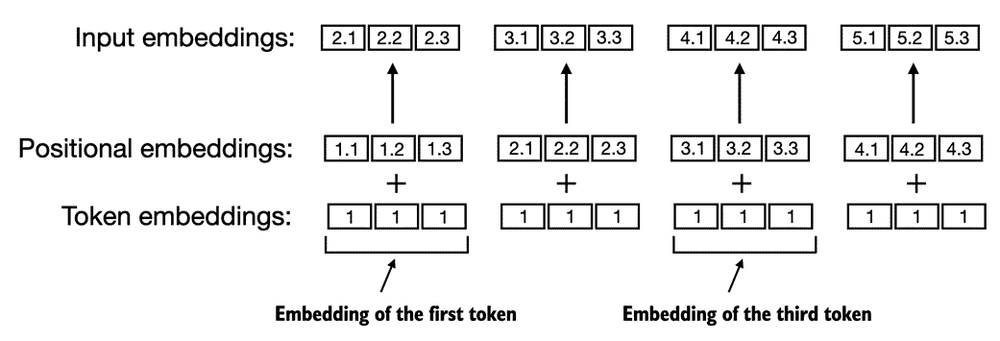

相对位置嵌入的重点不是关注 token 的绝对位置，而是 token 之间的相对位置或距离。这意味着模型学习的是“多远”的关系，而不是“在什么确切位置”。这里的优势在于，模型可以更好地泛化到不同长度的序列，即使在训练期间没有见过这样的长度。

这两种类型的位置嵌入旨在增强 LLM 理解 token 之间顺序和关系的能力，确保更准确和上下文感知的预测。选择它们通常取决于具体应用和所处理数据的性质。

OpenAI 的 GPT 模型使用的绝对位置嵌入是在训练过程中优化的，而不是像原始 Transformer 模型中的位置编码那样固定或预定义。这个优化过程是模型训练的一部分，我们将在本书后面实现。现在，让我们创建初始位置嵌入，以为接下来的章节创建 LLM 输入。

之前，我们在本章中集中讨论了非常小的嵌入大小以作示例。我们现在考虑更现实和实用的嵌入大小，并将输入 token 编码为 256 维的向量表示。这比原始 GPT-3 模型使用的尺寸小（在 GPT-3 中，嵌入大小为 12,288 维），但仍适合实验。此外，我们假设 token ID 是由我们之前实现的 BPE 分词器创建的，其词汇量为 50,257：

```py
output_dim = 256
vocab_size = 50257
token_embedding_layer = torch.nn.Embedding(vocab_size, output_dim)
```

使用上述`token_embedding_layer`，如果我们从数据加载器中抽样数据，我们将每个批次中的每个 token 嵌入到 256 维的向量中。如果我们有一个批次大小为 8，每个批次有四个 token，结果将是一个 8 x 4 x 256 的张量。

首先，让我们实例化第 2.6 节中的数据加载器，*滑动窗口的数据采样*：

```py
max_length = 4
dataloader = create_dataloader_v1(
    raw_text, batch_size=8, max_length=max_length, stride=max_length, shuffle=False)
data_iter = iter(dataloader)
inputs, targets = next(data_iter)
print("Token IDs:\n", inputs)
print("\nInputs shape:\n", inputs.shape)
```

上述代码输出如下：

```py
Token IDs:
 tensor([[   40,   367,  2885,  1464],
        [ 1807,  3619,   402,   271],
        [10899,  2138,   257,  7026],
        [15632,   438,  2016,   257],
        [  922,  5891,  1576,   438],
        [  568,   340,   373,   645],
        [ 1049,  5975,   284,   502],
        [  284,  3285,   326,    11]])

Inputs shape:
 torch.Size([8, 4])
```

如我们所见，token ID 张量是 8x4 维的，这意味着数据批次由 8 个文本样本组成，每个样本有 4 个 token。

现在让我们使用嵌入层将这些令牌 ID 嵌入到 256 维向量中：

```py
token_embeddings = token_embedding_layer(inputs)
print(token_embeddings.shape)
```

前面的打印函数调用返回如下：

```py
torch.Size([8, 4, 256])
```

根据 8x4x256 维张量的输出，我们可以看出，每个令牌 ID 现在被嵌入为 256 维向量。

对于 GPT 模型的绝对嵌入方法，我们只需创建另一个与`token_embedding_layer`维度相同的嵌入层：

```py
context_length = max_length
pos_embedding_layer = torch.nn.Embedding(context_lengthe, output_dim)
pos_embeddings = pos_embedding_layer(torch.arange(context_length))
print(pos_embeddings.shape)
```

如前面的代码示例所示，`pos_embeddings`的输入通常是一个占位符向量`torch.arange(context_length)`，它包含一个从 0 到最大输入长度−1 的数字序列。`context_length`是一个变量，表示 LLM 支持的输入大小。在这里，我们将其选择为与输入文本的最大长度相似。在实际应用中，输入文本可能会比支持的上下文长度更长，在这种情况下，我们必须截断文本。

打印语句的输出如下：

```py
torch.Size([4, 256])
```

正如我们所看到的，位置嵌入张量由四个 256 维向量组成。我们现在可以将这些直接添加到令牌嵌入中，PyTorch 会将 4x256 维的`pos_embeddings`张量添加到每个 8 个批次中的 4x256 维的令牌嵌入张量中：

```py
input_embeddings = token_embeddings + pos_embeddings
print(input_embeddings.shape)
```

打印输出如下：

```py
torch.Size([8, 4, 256])
```

我们创建的`input_embeddings`，如图 2.19 所示，是可以被主 LLM 模块处理的嵌入输入示例，我们将在第三章开始实现。

##### 图 2.19 作为输入处理管道的一部分，输入文本首先被拆分为单个令牌。这些令牌然后通过词汇表转换为令牌 ID。令牌 ID 被转换为嵌入向量，并添加相似大小的位置信息嵌入，最终得到用于主 LLM 层输入的输入嵌入。

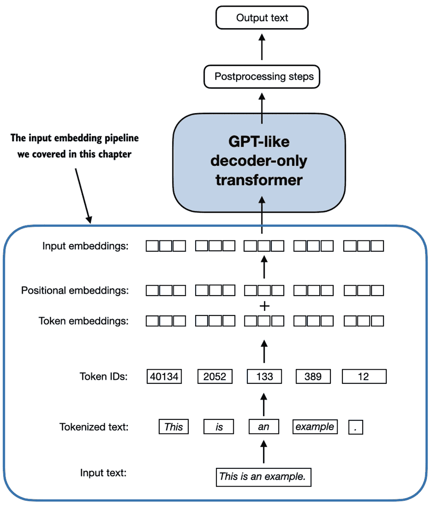

## 2.9 摘要

+   LLM 需要将文本数据转换为数值向量，称为嵌入，因为它们无法处理原始文本。嵌入将离散数据（如单词或图像）转换为连续向量空间，使其与神经网络操作兼容。

+   第一步，原始文本被拆分为令牌，这可以是单词或字符。然后，令牌被转换为整数表示，称为令牌 ID。

+   特殊标记，例如`<|unk|>`和`<|endoftext|>`，可以添加以增强模型的理解并处理各种上下文，例如未知单词或标记无关文本之间的边界。

+   用于像 GPT-2 和 GPT-3 这样的 LLM 的字节对编码（BPE）标记器可以通过将未知单词分解为子词单元或单个字符来有效处理它们。

+   我们在标记化数据上使用滑动窗口方法生成 LLM 训练的输入-目标对。

+   PyTorch 中的嵌入层作为查找操作，检索与标记 ID 对应的向量。生成的嵌入向量提供了标记的连续表示，这对训练像 LLMs 这样的深度学习模型至关重要。

+   虽然标记嵌入为每个标记提供了一致的向量表示，但它们缺乏标记在序列中的位置感。为了解决这个问题，存在两种主要类型的位置嵌入：绝对位置嵌入和相对位置嵌入。OpenAI 的 GPT 模型利用绝对位置嵌入，这些嵌入被添加到标记嵌入向量中，并在模型训练过程中进行优化。
