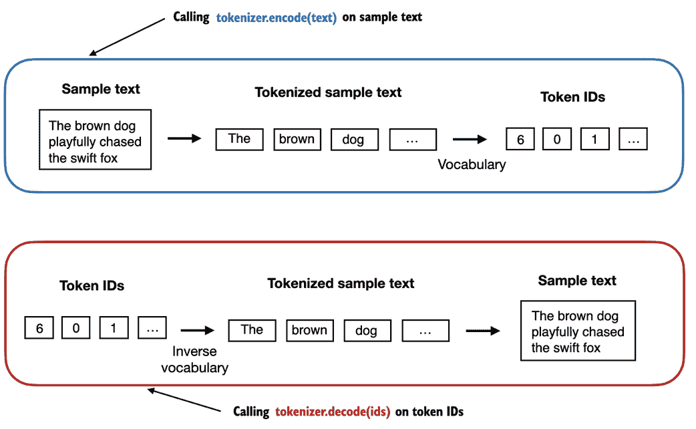

# 二、使用文本数据

### 本章涵盖内容

+   为大型语言模型训练准备文本

+   将文本分割成单词和子单词标记

+   字节对编码作为一种更高级的文本标记化方式

+   使用滑动窗口方法对训练样本进行抽样

+   将标记转换为输入大型语言模型的向量

在上一章中，我们深入探讨了大型语言模型（LLMs）的一般结构，并了解到它们在大量文本上进行了预训练。具体来说，我们关注的是基于变压器架构的解码器专用 LLMs，这是 ChatGPT 和其他流行的类 GPT LLMs 的基础。

在预训练阶段，LLM 逐个单词处理文本。利用亿万到数十亿参数的 LLM 进行下一个词预测任务的训练，可以产生具有令人印象深刻能力的模型。然后可以进一步微调这些模型以遵循一般指示或执行特定目标任务。但是，在接下来的章节中实施和训练 LLM 之前，我们需要准备训练数据集，这是本章的重点，如图 2.1 所示

##### 图 2.1 LLM 编码的三个主要阶段的心理模型，LLM 在一般文本数据集上进行预训练，然后在有标签的数据集上进行微调。本章将解释并编写提供 LLM 预训练文本数据的数据准备和抽样管道。


在本章中，您将学习如何准备输入文本以进行 LLM 训练。这涉及将文本拆分为单独的单词和子单词标记，然后将其编码为 LLM 的向量表示。您还将学习有关高级标记方案，如字节对编码，这在像 GPT 这样的流行 LLM 中被使用。最后，我们将实现一种抽样和数据加载策略，以生成后续章节中训练 LLM 所需的输入-输出对。

## 2.1 理解词嵌入

深度神经网络模型，包括 LLM，无法直接处理原始文本。由于文本是分类的，所以它与用于实现和训练神经网络的数学运算不兼容。因此，我们需要一种将单词表示为连续值向量的方式。（不熟悉计算上下文中向量和张量的读者可以在附录 A，A2.2 理解张量中了解更多。）

将数据转换为向量格式的概念通常被称为*嵌入*。使用特定的神经网络层或其他预训练的神经网络模型，我们可以嵌入不同的数据类型，例如视频、音频和文本，如图 2.2 所示。

##### 图 2.2 深度学习模型无法直接处理视频、音频和文本等原始格式的数据。因此，我们使用嵌入模型将这些原始数据转换为深度学习架构可以轻松理解和处理的稠密向量表示。具体来说，这张图说明了将原始数据转换为三维数值向量的过程。需要注意的是，不同的数据格式需要不同的嵌入模型。例如，专为文本设计的嵌入模型不适用于嵌入音频或视频数据。


在其核心，嵌入是从离散对象（如单词、图像，甚至整个文档）到连续向量空间中的点的映射——嵌入的主要目的是将非数值数据转换为神经网络可以处理的格式。

虽然单词嵌入是文本嵌入的最常见形式，但也有针对句子、段落或整个文档的嵌入。句子或段落嵌入是*检索增强生成*的流行选择。检索增强生成结合了生成（如生成文本）和检索（如搜索外部知识库）以在生成文本时提取相关信息的技术，这是本书讨论范围之外的技术。由于我们的目标是训练类似 GPT 的 LLMs，这些模型学习逐词生成文本，因此本章重点介绍了单词嵌入。

有几种算法和框架已被开发用于生成单词嵌入。其中一个较早和最流行的示例是*Word2Vec*方法。Word2Vec 训练神经网络架构以通过预测给定目标词或反之亦然的单词的上下文来生成单词嵌入。Word2Vec 背后的主要思想是在相似上下文中出现的单词往往具有相似的含义。因此，当投影到二维单词嵌入进行可视化时，可以看到相似术语聚集在一起，如图 2.3 所示。

##### 图 2.3 如果单词嵌入是二维的，我们可以在二维散点图中绘制它们进行可视化，如此处所示。使用单词嵌入技术（例如 Word2Vec），与相似概念对应的单词通常在嵌入空间中彼此靠近。例如，不同类型的鸟类在嵌入空间中彼此比国家和城市更接近。


单词嵌入的维度可以有不同的范围，从一维到数千维不等。如图 2.3 所示，我们可以选择二维单词嵌入进行可视化。更高的维度可能捕捉到更加微妙的关系，但会牺牲计算效率。

虽然我们可以使用诸如 Word2Vec 之类的预训练模型为机器学习模型生成嵌入，但 LLMs 通常产生自己的嵌入，这些嵌入是输入层的一部分，并在训练过程中更新。优化嵌入作为 LLM 训练的一部分的优势，而不是使用 Word2Vec 的优势在于，嵌入被优化为特定的任务和手头的数据。我们将在本章后面实现这样的嵌入层。此外，LLMs 还可以创建上下文化的输出嵌入，我们将在第三章中讨论。

不幸的是，高维度嵌入给可视化提出了挑战，因为我们的感知和常见的图形表示固有地受限于三个或更少维度，这就是为什么图 2.3 展示了在二维散点图中的二维嵌入。然而，当使用 LLMs 时，我们通常使用比图 2.3 中所示的更高维度的嵌入。对于 GPT-2 和 GPT-3，嵌入大小（通常称为模型隐藏状态的维度）根据特定模型变体和大小而变化。这是性能和效率之间的权衡。最小的 GPT-2（117M 参数）和 GPT-3（125M 参数）模型使用 768 维度的嵌入大小来提供具体的例子。最大的 GPT-3 模型（175B 参数）使用 12288 维的嵌入大小。

本章的后续部分将介绍准备 LLM 使用的嵌入所需的步骤，包括将文本分割为单词，将单词转换为标记，并将标记转换为嵌入向量。

## 2.2 文本分词

本节介绍了如何将输入文本分割为单个标记，这是为了创建 LLM 嵌入所必需的预处理步骤。这些标记可以是单独的单词或特殊字符，包括标点符号字符，如图 2.4 所示。

##### 图 2.4 在 LLM 上下文中查看本节涵盖的文本处理步骤。在这里，我们将输入文本分割为单个标记，这些标记可以是单词或特殊字符，如标点符号字符。在即将到来的部分中，我们将把文本转换为标记 ID 并创建标记嵌入。


我们将用于 LLM 训练的文本是 Edith Wharton 的短篇小说《**The Verdict**》，该小说已进入公有领域，因此可以用于 LLM 训练任务。文本可在 Wikisource 上获得，网址为`en.wikisource.org/wiki/The_Verdict`，您可以将其复制粘贴到文本文件中，我将其复制到一个名为"`the-verdict.txt`"的文本文件中，以便使用 Python 的标准文件读取实用程序加载：

##### 列表 2.1 将短篇小说作为文本示例读入 Python

```py
with open("the-verdict.txt", "r", encoding="utf-8") as f:
    raw_text = f.read()
print("Total number of character:", len(raw_text))
print(raw_text[:99])
```

或者，您可以在本书的 GitHub 存储库中找到此"`the-verdict.txt`"文件，网址为`github.com/rasbt/LLMs-from-scratch/tree/main/ch02/01_main-chapter-code`。

打印命令打印出字符的总数，然后是文件的前 100 个字符，用于说明目的：

```py
Total number of character: 20479
I HAD always thought Jack Gisburn rather a cheap genius--though a good fellow enough--so it was no 
```

我们的目标是将这篇短篇小说的 20,479 个字符标记成单词和特殊字符，然后将其转换为 LLM 训练的嵌入。

##### 文本样本大小

请注意，在处理 LLM 时，处理数百万篇文章和数十万本书——许多吉字节的文本——是很常见的。但是，出于教育目的，使用小型文本样本，如一本书，就足以说明文本处理步骤背后的主要思想，并且可以在消费类硬件上合理的时间内运行。

我们如何最好地分割这段文本以获得标记列表? 为此，我们进行了小小的探索，并使用 Python 的正则表达式库`re`进行说明。 （请注意，您无需学习或记忆任何正则表达式语法，因为我们将在本章后面过渡到预构建的标记器。）

使用一些简单的示例文本，我们可以使用`re.split`命令及以下语法来在空格字符上拆分文本：

```py
import re
text = "Hello, world. This, is a test."
result = re.split(r'(\s)', text)
print(result)
```

结果是一系列单词、空格和标点字符:

```py
['Hello,', ' ', 'world.', ' ', 'This,', ' ', 'is', ' ', 'a', ' ', 'test.']
```

请注意，上述简单分词方案通常可将示例文本分隔成单词，但是有些单词仍然与我们希望作为单独列表项的标点字符连接在一起。

让我们修改在空格（`\s`）和逗号、句号（`[,.]`）上的正则表达式分割：

```py
result = re.split(r'([,.]|\s)', text)
print(result)
```

我们可以看到单词和标点字符现在是作为我们想要的分开的列表条目:

```py
['Hello', ',', '', ' ', 'world.', ' ', 'This', ',', '', ' ', 'is', ' ', 'a', ' ', 'test.']
```

一个小问题是列表仍然包括空白字符。可选地，我们可以安全地按如下方式删除这些多余的字符：

```py
result = [item.strip() for item in result if item.strip()]
print(result)
```

去除空格字符后的输出如下：

```py
['Hello', ',', 'world.', 'This', ',', 'is', 'a', 'test.']
```

##### 是否去除空白

在开发简单的标记器时，是否将空白字符编码为单独的字符或仅将其删除取决于我们的应用程序和其要求。去除空格减少了内存和计算需求。但是，如果我们训练的模型对文本的精确结构敏感（例如，对缩进和间距敏感的 Python 代码），保留空格可能会有用。在这里，为了简化标记化输出的简洁性，我们移除空白。稍后，我们将转换为包括空格的标记方案。

我们上面设计的标记方案在简单的示例文本上运行良好。让我们进一步修改它，使其还可以处理其他类型的标点符号，例如问号，引号以及我们在 Edith Wharton 的短篇小说的前 100 个字符中先前看到的双破折号，以及其他额外的特殊字符。

```py
text = "Hello, world. Is this-- a test?"
result = re.split(r'([,.?_!"()\']|--|\s)', text)
result = [item.strip() for item in result if item.strip()]
print(result)
```

结果输出如下：

```py
['Hello', ',', 'world', '.', 'Is', 'this', '--', 'a', 'test', '?']
```

根据总结在图 2.5 中的结果，我们的标记方案现在可以成功处理文本中的各种特殊字符。

##### 图 2.5 我们目前实施的标记化方案将文本分割为单个单词和标点字符。在本图所示的特定示例中，样本文本被分割成 10 个单独的标记。


现在我们已经有了一个基本的标记器工作，让我们将其应用到爱迪丝·沃顿的整个短篇小说中：

```py
preprocessed = re.split(r'([,.?_!"()\']|--|\s)', raw_text)
preprocessed = [item.strip() for item in preprocessed if item.strip()]
print(len(preprocessed))
```

上面的打印语句输出了`4649`，这是这段文本（不包括空格）中的标记数。

让我们打印前 30 个标记进行快速的视觉检查：

```py
print(preprocessed[:30])
```

结果输出显示，我们的标记器似乎很好地处理了文本，因为所有单词和特殊字符都被很好地分开了：

```py
['I', 'HAD', 'always', 'thought', 'Jack', 'Gisburn', 'rather', 'a', 'cheap', 'genius', '--', 'though', 'a', 'good', 'fellow', 'enough', '--', 'so', 'it', 'was', 'no', 'great', 'surprise', 'to', 'me', 'to', 'hear', 'that', ',', 'in']
```

## 2.3 将标记转换为标记 ID

在上一节中，我们将爱迪丝·沃顿的短篇小说标记化为单个标记。在本节中，我们将这些标记从 Python 字符串转换为整数表示，以生成所谓的标记 ID。这种转换是将标记 ID 转换为嵌入向量之前的中间步骤。

要将之前生成的标记映射到标记 ID 中，我们必须首先构建一个所谓的词汇表。这个词汇表定义了我们如何将每个唯一的单词和特殊字符映射到一个唯一的整数，就像图 2.6 中所示的那样。

##### 图 2.6 我们通过对训练数据集中的整个文本进行标记化来构建词汇表，将这些单独的标记按字母顺序排序，并移除唯一的标记。然后将这些唯一标记聚合成一个词汇表，从而定义了从每个唯一标记到唯一整数值的映射。为了说明的目的，所示的词汇表故意较小，并且不包含标点符号或特殊字符。


在前一节中，我们标记化了爱迪丝·沃顿的短篇小说，并将其分配给了一个名为`preprocessed`的 Python 变量。现在让我们创建一个包含所有唯一标记并按字母顺序排列的列表，以确定词汇表的大小：

```py
all_words = sorted(list(set(preprocessed)))
vocab_size = len(all_words)
print(vocab_size)
```

通过上面的代码确定词汇表的大小为 1,159 后，我们创建词汇表，并打印其前 50 个条目以作说明：

##### 列表 2.2 创建词汇表

```py
vocab = {token:integer for integer,token in enumerate(all_words)}
for i, item in enumerate(vocab.items()):
    print(item)
    if i > 50:
        break
```

输出如下：

```py
('!', 0)
('"', 1)
("'", 2)
...
('Has', 49)
('He', 50)
```

如上面的输出所示，字典包含与唯一整数标签相关联的单独标记。我们的下一个目标是将这个词汇表应用到新文本中，以将其转换为标记 ID，就像图 2.7 中所示的那样。

##### 图 2.7 从新的文本样本开始，我们对文本进行标记化，并使用词汇表将文本标记转换为标记 ID。词汇表是从整个训练集构建的，并且可以应用于训练集本身以及任何新的文本样本。为了简单起见，所示的词汇表不包含标点符号或特殊字符。


在本书的后面，当我们想要将 LLM 的输出从数字转换回文本时，我们还需要一种将标记 ID 转换成文本的方法。为此，我们可以创建词汇表的反向版本，将标记 ID 映射回相应的文本标记。

让我们在 Python 中实现一个完整的标记器类，它具有一个`encode`方法，将文本分割成标记，并通过词汇表进行字符串到整数的映射，以产生标记 ID。另外，我们实现了一个`decode`方法，进行反向整数到字符串的映射，将标记 ID 转回文本。

这个标记器实现的代码如下所示，如列表 2.3 所示：

##### 列表 2.3 实现一个简单的文本标记器

```py
class SimpleTokenizerV1:
    def __init__(self, vocab):
        self.str_to_int = vocab #A
        self.int_to_str = {i:s for s,i in vocab.items()} #B

    def encode(self, text): #C
        preprocessed = re.split(r'([,.?_!"()\']|--|\s)', text)
        preprocessed = [item.strip() for item in preprocessed if item.strip()]
        ids = [self.str_to_int[s] for s in preprocessed]
        return ids

    def decode(self, ids): #D
        text = " ".join([self.int_to_str[i] for i in ids]) 

        text = re.sub(r'\s+([,.?!"()\'])', r'\1', text) #E
        return text
```

使用上述的`SimpleTokenizerV1` Python 类，我们现在可以通过现有词汇表实例化新的标记对象，然后可以用于编码和解码文本，如图 2.8 所示。

##### 图 2.8 标记器实现共享两个常见方法：一个是编码方法，一个是解码方法。编码方法接受示例文本，将其拆分为单独的标记，并通过词汇表将标记转换为标记 ID。解码方法接受标记 ID，将其转换回文本标记，并将文本标记连接成自然文本。



让我们从`SimpleTokenizerV1`类中实例化一个新的标记对象，并对爱迪丝·沃顿的短篇小说中的段落进行分词，以尝试实践一下：

```py
tokenizer = SimpleTokenizerV1(vocab)

text = """"It's the last he painted, you know," Mrs. Gisburn said with pardonable pride."""
ids = tokenizer.encode(text)
print(ids)
```

上面的代码打印了以下标记 ID：

```py
[1, 58, 2, 872, 1013, 615, 541, 763, 5, 1155, 608, 5, 1, 69, 7, 39, 873, 1136, 773, 812, 7]
```

接下来，让我们看看是否可以使用解码方法将这些标记 ID 还原为文本：

```py
tokenizer.decode(ids)
```

这将输出以下文本：

```py
'" It\' s the last he painted, you know," Mrs. Gisburn said with pardonable pride.'
```

根据上面的输出，我们可以看到解码方法成功地将标记 ID 转换回原始文本。

目前为止，我们已经实现了一个能够根据训练集中的片段对文本进行标记化和解标记化的标记器。现在让我们将其应用于训练集中不包含的新文本样本：

```py
text = "Hello, do you like tea?"
tokenizer.encode(text)
```

执行上面的代码将导致以下错误：

```py
...
KeyError: 'Hello'
```

问题在于“Hello”这个词没有在*The Verdict*短篇小说中出现过。因此，它不包含在词汇表中。这突显了在处理 LLMs 时需要考虑大量和多样的训练集以扩展词汇表的需求。

在下一节中，我们将进一步测试标记器对包含未知单词的文本的处理，我们还将讨论在训练期间可以使用的额外特殊标记，以提供 LLM 更多的上下文信息。

## 2.4 添加特殊上下文标记

在上一节中，我们实现了一个简单的标记器，并将其应用于训练集中的一个段落。在本节中，我们将修改这个标记器来处理未知单词。

我们还将讨论使用和添加特殊上下文标记的用法，这些标记可以增强模型对文本中上下文或其他相关信息的理解。这些特殊标记可以包括未知单词和文档边界的标记，例如。

具体来说，我们将修改上一节中实现的词汇表和标记器 SimpleTokenizerV2，以支持两个新的标记`<|unk|>`和`<|endoftext|>`，如图 2.8 所示。

##### 图 2.9 我们向词汇表中添加特殊标记来处理特定上下文。 例如，我们添加一个<|unk|>标记来表示训练数据中没有出现过的新单词，因此不是现有词汇表的一部分。 此外，我们添加一个<|endoftext|>标记，用于分隔两个无关的文本源。


如图 2.9 所示，我们可以修改标记器，在遇到不在词汇表中的单词时使用`<|unk|>`标记。 此外，我们在无关的文本之间添加一个标记。 例如，在训练多个独立文档或书籍的 GPT-like LLM 时，通常会在每个文档或书籍之前插入一个标记，用于指示这是前一个文本源的后续文档或书籍，如图 2.10 所示。 这有助于 LLM 理解，尽管这些文本源被连接起来进行训练，但实际上它们是无关的。

##### 图 2.10 当处理多个独立的文本源时，我们在这些文本之间添加`<|endoftext|>`标记。 这些`<|endoftext|>`标记充当标记，标志着特定段落的开始或结束，让 LLM 更有效地处理和理解。


现在让我们修改词汇表，以包括这两个特殊标记`<unk>`和`<|endoftext|>`，通过将它们添加到我们在上一节中创建的所有唯一单词列表中：

```py
all_words.extend(["<|endoftext|>", "<|unk|>"])
vocab = {token:integer for integer,token in enumerate(all_tokens)}
print(len(vocab.items()))
```

根据上述打印语句的输出，新的词汇表大小为 1161（上一节的词汇表大小为 1159）。

作为额外的快速检查，让我们打印更新后词汇表的最后 5 个条目：

```py
for i, item in enumerate(list(vocab.items())[-5:]):
    print(item)
```

上面的代码打印如下所示：

```py
('younger', 1156)
('your', 1157)
('yourself', 1158)
('<|endoftext|>', 1159)
('<|unk|>', 1160)
```

根据上面的代码输出，我们可以确认这两个新的特殊标记确实成功地融入到了词汇表中。 接下来，我们根据代码清单 2.3 调整标记器，如清单 2.4 所示：

##### 清单 2.4 处理未知词的简单文本标记器

```py
class SimpleTokenizerV2:
    def __init__(self, vocab):
        self.str_to_int = vocab
        self.int_to_str = { i:s for s,i in vocab.items()}

    def encode(self, text):
        preprocessed = re.split(r'([,.?_!"()\']|--|\s)', text)
        preprocessed = [item.strip() for item in preprocessed if item.strip()]
        preprocessed = [item if item in self.str_to_int  #A
                        else "<|unk|>" for item in preprocessed]

        ids = [self.str_to_int[s] for s in preprocessed]
        return ids

    def decode(self, ids):
        text = " ".join([self.int_to_str[i] for i in ids])

        text = re.sub(r'\s+([,.?!"()\'])', r'\1', text) #B
        return text
```

与我们在上一节代码清单 2.3 中实现的`SimpleTokenizerV1`相比，新的`SimpleTokenizerV2`将未知单词替换为`<|unk|>`标记。

现在让我们尝试实践这种新的标记器。 为此，我们将使用一个简单的文本示例，该文本由两个独立且无关的句子串联而成：

```py
text1 = "Hello, do you like tea?"
text2 = "In the sunlit terraces of the palace."
text = " <|endoftext|> ".join((text1, text2))
print(text)
```

输出如下所示：

```py
'Hello, do you like tea? <|endoftext|> In the sunlit terraces of the palace.'
```

接下来，让我们使用`SimpleTokenizerV2`对样本文本进行标记：

```py
tokenizer = SimpleTokenizerV2(vocab)
print(tokenizer.encode(text))
```

这打印了以下令牌 ID：

```py
[1160, 5, 362, 1155, 642, 1000, 10, 1159, 57, 1013, 981, 1009, 738, 1013, 1160, 7]
```

从上面可以看到，令牌 ID 列表包含 1159 个<|endoftext|>分隔符令牌，以及两个用于未知单词的 160 个令牌。

让我们对文本进行反标记，做一个快速的检查：

```py
print(tokenizer.decode(tokenizer.encode(text)))
```

输出如下所示：

```py
'<|unk|>, do you like tea? <|endoftext|> In the sunlit terraces of the <|unk|>.'
```

根据上述去标记化文本与原始输入文本的比较，我们知道埃迪斯·沃顿（Edith Wharton）的短篇小说*The Verdict*训练数据集中不包含单词“Hello”和“palace”。

到目前为止，我们已经讨论了分词作为将文本处理为 LLMs 输入的基本步骤。根据 LLM，一些研究人员还考虑其他特殊标记，如下所示：

+   `[BOS]`（序列开始）：该标记标志着文本的开始。它向 LLM 表示内容的开始位置。

+   `[EOS]`（序列结束）：该标记位于文本末尾，当连接多个不相关的文本时特别有用，类似于`<|endoftext|>`。例如，当合并两篇不同的维基百科文章或书籍时，`[EOS]`标记指示一篇文章的结束和下一篇文章的开始位置。

+   `[PAD]`（填充）：当使用大于一的批次大小训练 LLMs 时，批次可能包含不同长度的文本。为确保所有文本具有相同长度，较短的文本将使用`[PAD]`标记进行扩展或“填充”，直到批次中最长文本的长度。

请注意，用于 GPT 模型的分词器不需要上述提到的任何这些标记，而仅使用`<|endoftext|>`标记简化。`<|endoftext|>`类似于上述的`[EOS]`标记。此外，`<|endoftext|>`也用于填充。然而，在后续章节中，当在批量输入上训练时，我们通常使用掩码，意味着我们不关注填充的标记。因此，所选择的特定填充标记变得不重要。

此外，用于 GPT 模型的分词器也不使用`<|unk|>`标记来表示词汇表中没有的单词。相反，GPT 模型使用字节对编码分词器，将单词拆分为子词单元，我们将在下一节中讨论。

## 2.5 字节对编码

我们在前几节中实现了一个简单的分词方案，用于说明目的。本节介绍基于称为字节对编码（BPE）的概念的更复杂的分词方案。本节介绍的 BPE 分词器用于训练 LLMs，如 GPT-2、GPT-3 和 ChatGPT。

由于实现 BPE 可能相对复杂，我们将使用一个名为*tiktoken*（`github.com/openai/tiktoken`）的现有 Python 开源库，该库基于 Rust 中的源代码非常有效地实现了 BPE 算法。与其他 Python 库类似，我们可以通过 Python 的终端上的`pip`安装程序安装 tiktoken 库：

```py
pip install tiktoken
```

本章中的代码基于 tiktoken 0.5.1。您可以使用以下代码检查当前安装的版本：

```py
import importlib
import tiktoken
print("tiktoken version:", importlib.metadata.version("tiktoken"))
```

安装完成后，我们可以如下实例化 tiktoken 中的 BPE 分词器：

```py
tokenizer = tiktoken.get_encoding("gpt2")
```

此分词器的使用方式类似于我们之前通过`encode`方法实现的 SimpleTokenizerV2：

```py
text = "Hello, do you like tea? <|endoftext|> In the sunlit terraces of someunknownPlace."
integers = tokenizer.encode(text, allowed_special={"<|endoftext|>"})
print(integers)
```

上述代码打印以下标记 ID：

```py
[15496, 11, 466, 345, 588, 8887, 30, 220, 50256, 554, 262, 4252, 18250, 8812, 2114, 286, 617, 34680, 27271, 13]
```

然后，我们可以使用解码方法将标记 ID 转换回文本，类似于我们之前的`SimpleTokenizerV2`：

```py
strings = tokenizer.decode(integers)
print(strings)
```

上述代码打印如下：

```py
'Hello, do you like tea? <|endoftext|> In the sunlit terraces of someunknownPlace.'
```

基于上述标记 ID 和解码文本，我们可以得出两个值得注意的观察结果。首先，`<|endoftext|>`标记被分配了一个相对较大的标记 ID，即 50256。事实上，用于训练诸如 GPT-2、GPT-3 和 ChatGPT 等模型的 BPE 分词器具有总共 50257 个词汇，其中`<|endoftext|>`被分配了最大的标记 ID。

第二，上述的 BPE 分词器可以正确地对未知单词进行编码和解码，例如"someunknownPlace"。BPE 分词器可以处理任何未知单词。它是如何在不使用`<|unk|>`标记的情况下实现这一点的？

BPE 算法的基础是将不在其预定义词汇表中的单词分解为更小的子词单元甚至是单个字符，使其能够处理词汇表之外的词汇。因此，多亏了 BPE 算法，如果分词器在分词过程中遇到陌生的单词，它可以将其表示为一系列子词标记或字符，如图 2.11 所示。

##### 图 2.11 BPE 分词器将未知单词分解为子词和单个字符。这样，BPE 分词器可以解析任何单词，无需用特殊标记（如`<|unk|>`）替换未知单词。


如图 2.11 所示，将未知单词分解为单个字符的能力确保了分词器以及随之训练的 LLM 可以处理任何文本，即使其中包含了其训练数据中未出现的单词。

##### 练习 2.1 未知单词的字节对编码

尝试从 tiktoken 库中使用 BPE 分词器对未知单词"Akwirw ier"，并打印各个标记的 ID。然后，在此列表中的每个生成的整数上调用解码函数，以重现图 2.1 中显示的映射。最后，在标记 ID 上调用解码方法以检查是否可以重建原始输入，即"Akwirw ier"。

本书不讨论 BPE 的详细讨论和实现，但简而言之，它通过迭代地将频繁出现的字符合并为子词和频繁出现的子词合并为单词来构建其词汇表。例如，BPE 从将所有单个字符添加到其词汇表开始（"a"，"b"，...）。在下一阶段，它将经常一起出现的字符组合成子词。例如，"d"和"e"可能会合并成子词"de"，在许多英文单词中很常见，如"define"，"depend"，"made"和"hidden"。合并是由频率截止确定的。

## 2.6 滑动窗口数据采样

前一节详细介绍了标记化步骤以及将字符串标记转换为整数标记 ID 之后，我们最终可以为 LLM 生成所需的输入-目标对，以用于训练 LLM。

这些输入-目标对是什么样子？正如我们在第一章中学到的那样，LLMs 是通过预测文本中的下一个单词来进行预训练的，如图 2.12 所示。

##### 图 2.12 给定一个文本样本，提取作为 LLM 输入的子样本的输入块，并且在训练期间，LLM 的预测任务是预测跟随输入块的下一个单词。在训练中，我们屏蔽所有超过目标的单词。请注意，在 LLM 可处理文本之前，此图中显示的文本会进行 tokenization；但为了清晰起见，该图省略了 tokenization 步骤。


在此部分中，我们实现了一个数据加载器，使用滑动窗口方法从训练数据集中提取图 2.12 中所示的输入-目标对。

为了开始，我们将使用前面介绍的 BPE tokenizer 对我们之前使用的《裁决》短篇小说进行标记化处理：

```py
with open("the-verdict.txt", "r", encoding="utf-8") as f:
    raw_text = f.read()

enc_text = tokenizer.encode(raw_text)
print(len(enc_text))
```

执行上述代码将返回 5145，应用 BPE tokenizer 后训练集中的总标记数。

接下来，为了演示目的，让我们从数据集中删除前 50 个标记，因为这会使接下来的文本段落稍微有趣一些：

```py
enc_sample = enc_text[50:]
```

创建下一个单词预测任务的输入-目标对最简单直观的方法之一是创建两个变量，`x` 和 `y`，其中 `x` 包含输入标记，`y` 包含目标，即将输入向后移动一个位置的输入：

```py
context_size = 4 #A x = enc_sample[:context_size] y = enc_sample[1:context_size+1] print(f"x: {x}") print(f"y: {y}")
```

运行上述代码会打印以下输出：

```py
x: [290, 4920, 2241, 287]
y:      [4920, 2241, 287, 257]
```

处理输入以及目标（即向后移动了一个位置的输入），我们可以创建如图 2.12 中所示的下一个单词预测任务：

```py
for i in range(1, context_size+1):
    context = enc_sample[:i]
    desired = enc_sample[i]
    print(context, "---->", desired)
```

上述代码会打印以下内容：

```py
[290] ----> 4920
[290, 4920] ----> 2241
[290, 4920, 2241] ----> 287
[290, 4920, 2241, 287] ----> 257
```

形如箭头 (`---->`) 左侧的所有内容指的是 LLM 收到的输入，箭头右侧的标记 ID 表示 LLM 应该预测的目标标记 ID。

为了说明目的，让我们重复之前的代码但将标记 ID 转换为文本：

```py
for i in range(1, context_size+1):
    context = enc_sample[:i]
    desired = enc_sample[i]
    print(tokenizer.decode(context), "---->", tokenizer.decode([desired]))
```

以下输出显示输入和输出以文本格式的样式：

```py
 and ---->  established
 and established ---->  himself
 and established himself ---->  in
 and established himself in ---->  a
```

我们现在已经创建了输入-目标对，可以在接下来的章节中用于 LLM 训练。

在我们可以将标记转换为嵌入之前，还有最后一个任务，正如我们在本章开头所提到的：实现一个高效的数据加载器，迭代输入数据集并返回 PyTorch 张量作为输入和目标。

特别是，我们有兴趣返回两个张量：一个包含 LLM 看到的文本的输入张量，以及一个包含 LLM 预测目标的目标张量，如图 2.13 所示。

##### 图 2.13 为了实现高效的数据加载器，我们将输入都收集到一个张量 x 中，其中每一行代表一个输入上下文。第二个张量 y 包含对应的预测目标（下一个单词），它们是通过将输入向后移动一个位置来创建的。


虽然图 2.13 展示了字符串格式的 token 以进行说明，但代码实现将直接操作 token ID，因为 BPE 标记器的 encode 方法执行了 tokenization 和转换为 token ID 为单一步骤。

对于高效的数据加载器实现，我们将使用 PyTorch 内置的 Dataset 和 DataLoader 类。有关安装 PyTorch 的更多信息和指导，请参阅附录 A 的*A.1.3，安装 PyTorch*一节。

数据集类的代码如图 2.5 所示：

##### 图 2.5 一批输入和目标的数据集

```py
import torch
from torch.utils.data import Dataset, DataLoader

class GPTDatasetV1(Dataset):
    def __init__(self, txt, tokenizer, max_length, stride):
        self.tokenizer = tokenizer
        self.input_ids = []
        self.target_ids = []

        token_ids = tokenizer.encode(txt) #A

        for i in range(0, len(token_ids) - max_length, stride): #B
            input_chunk = token_ids[i:i + max_length]
            target_chunk = token_ids[i + 1: i + max_length + 1]
            self.input_ids.append(torch.tensor(input_chunk))
            self.target_ids.append(torch.tensor(target_chunk))

    def __len__(self): #C
        return len(self.input_ids)

    def __getitem__(self, idx): #D
        return self.input_ids[idx], self.target_ids[idx]
```

图 2.5 中的`GPTDatasetV1`类基于 PyTorch 的`Dataset`类，定义了如何从数据集中获取单独的行，其中每一行都包含一系列基于`max_length`分配给`input_chunk`张量的 token ID。`target_chunk`张量包含相应的目标。我建议继续阅读，看看当我们将数据集与 PyTorch 的`DataLoader`结合使用时，这个数据集返回的数据是什么样的——这将带来额外的直觉和清晰度。

如果您对 PyTorch 的`Dataset`类的结构（如图 2.5 所示）是新手，请阅读附录 A 的*A.6，设置高效的数据加载器*一节，其中解释了 PyTorch 的`Dataset`和`DataLoader`类的一般结构和用法。

以下代码将使用`GPTDatasetV1`通过 PyTorch 的`DataLoader`来批量加载输入：

##### 图 2.6 用于生成带输入对的批次的数据加载器

```py
def create_dataloader(txt, batch_size=4, max_length=256, stride=128):
    tokenizer = tiktoken.get_encoding("gpt2") #A 
    dataset = GPTDatasetV1(txt, tokenizer, max_length, stride) #B
    dataloader = DataLoader(dataset, batch_size=batch_size) #C
    return dataloader
```

让我们测试`dataloader`，将一个上下文大小为 4 的 LLM 的批量大小设为 1，以便理解图 2.5 的`GPTDatasetV1`类和图 2.6 的`create_dataloader`函数如何协同工作。

```py
with open("the-verdict.txt", "r", encoding="utf-8") as f:
    raw_text = f.read()

dataloader = create_dataloader(raw_text, batch_size=1, max_length=4, stride=1)
data_iter = iter(dataloader) #A
first_batch = next(data_iter)
print(first_batch)
```

执行前面的代码将打印以下内容：

```py
[tensor([[  40,  367, 2885, 1464]]), tensor([[ 367, 2885, 1464, 1807]])]
```

`first_batch`变量包含两个张量：第一个张量存储输入 token ID，第二个张量存储目标 token ID。由于`max_length`设置为 4，这两个张量每个都包含 4 个 token ID。值得注意的是，输入大小为 4 相对较小，仅用于说明目的。通常会用至少 256 的输入大小来训练 LLMs。

为了说明`stride=1`的含义，让我们从这个数据集中获取另一个批次：

```py
second_batch = next(data_iter)
print(second_batch)
```

第二批的内容如下：

```py
[tensor([[ 367, 2885, 1464, 1807]]), tensor([[2885, 1464, 1807, 3619]])]
```

如果我们比较第一批和第二批，我们会发现相对于第一批，第二批的 token ID 向后移动了一个位置（例如，第一批输入中的第二个 ID 是 367，这是第二批输入中的第一个 ID）。`stride`设置规定了输入在批次之间移动的位置数，模拟了一个滑动窗口的方法，如图 2.14 所示。

##### 图 2.14 在从输入数据集创建多个批次时，我们在文本上滑动一个输入窗口。如果将步幅设置为 1，则在创建下一个批次时，将输入窗口向右移动 1 个位置。如果我们将步幅设置为等于输入窗口大小，我们可以防止批次之间的重叠。


##### 练习 2.2 具有不同步幅和上下文大小的数据加载器

要更好地理解数据加载器的工作原理，请尝试以不同设置运行，如 max_length=2 和 stride=2 以及 max_length=8 和 stride=2。

与我们到目前为止从数据加载器中抽样的批次大小为 1 一样，这对于说明目的非常有用。如果您有深度学习的经验，您可能知道，较小的批次大小在训练期间需要更少的内存，但会导致更多的噪声模型更新。就像在常规深度学习中一样，批次大小是一个需要在训练 LLM 时进行实验的权衡和超参数。

在我们继续本章的最后两个重点部分，这些部分侧重于从标记 ID 创建嵌入向量之前，让我们简要了解如何使用数据加载器进行批量大小大于 1 的抽样：

```py
dataloader = create_dataloader(raw_text, batch_size=8, max_length=4, stride=5)

data_iter = iter(dataloader)
inputs, targets = next(data_iter)
print("Inputs:\n", inputs)
print("\nTargets:\n", targets)
```

这将输出以下内容：

```py
Inputs:
 tensor([[   40,   367,  2885,  1464],
         [ 3619,   402,   271, 10899],
         [  257,  7026, 15632,   438],
         [  257,   922,  5891,  1576],
         [  568,   340,   373,   645],
         [ 5975,   284,   502,   284],
         [  326,    11,   287,   262],
         [  286,   465, 13476,    11]])

Targets:
 tensor([[  367,  2885,  1464,  1807],
         [  402,   271, 10899,  2138],
         [ 7026, 15632,   438,  2016],
         [  922,  5891,  1576,   438],
         [  340,   373,   645,  1049],
         [  284,   502,   284,  3285],
         [   11,   287,   262,  6001],
         [  465, 13476,    11,   339]])
```

请注意，我们将步幅增加到 5，这是最大长度+1。这是为了充分利用数据集（我们不跳过任何单词），同时避免批次之间的任何重叠，因为更多的重叠可能导致过拟合增加。例如，如果我们将步幅设置为与最大长度相等，那么每行中最后一个输入标记 ID 的目标 ID 将成为下一行中第一个输入标记 ID。

在本章的最后两个部分中，我们将实现将标记 ID 转换为连续向量表示的嵌入层，这将作为 LLM 的输入数据格式。

## 2.7 创建标记嵌入

为准备 LLM 训练的输入文本的最后一步是将标记 ID 转换为嵌入向量，如图 2.15 所示，这将是本章最后两个剩余部分的重点。

##### 图 2.15 准备 LLM 输入文本涉及对文本进行标记化、将文本标记转换为标记 ID 和将标记 ID 转换为向量嵌入向量。在本节中，我们考虑前几节中创建的标记 ID 以创建标记嵌入向量。


连续向量表示，或嵌入，是必要的，因为类似 GPT 的 LLM 是使用反向传播算法训练的深度神经网络。如果您不熟悉神经网络如何使用反向传播进行训练，请阅读附录 A 中的第 A.4 节，*简化的自动微分*。

让我们用一个实际例子说明标记 ID 到嵌入向量转换是如何工作的。假设我们有以下三个带有 ID 5、1、3 和 2 的输入标记：

```py
input_ids = torch.tensor([5, 1, 3, 2])
```

为了简单起见和说明目的，假设我们只有一个小的词汇表，其中只有 6 个单词（而不是 BPE 标记器词汇表中的 50,257 个单词），我们想创建大小为 3 的嵌入（在 GPT-3 中，嵌入大小为 12,288 维）：

```py
vocab_size = 6
output_dim = 3
```

使用 `vocab_size` 和 `output_dim`，我们可以在 PyTorch 中实例化一个嵌入层，设置随机种子为 123 以便进行再现性：

```py
torch.manual_seed(123)
embedding_layer = torch.nn.Embedding(vocab_size, output_dim)
print(embedding_layer.weight)
```

在上述代码示例中的打印语句打印了嵌入层的底层权重矩阵：

```py
Parameter containing:
tensor([[ 0.3374, -0.1778, -0.1690],
        [ 0.9178,  1.5810,  1.3010],
        [ 1.2753, -0.2010, -0.1606],
        [-0.4015,  0.9666, -1.1481],
        [-1.1589,  0.3255, -0.6315],
        [-2.8400, -0.7849, -1.4096]], requires_grad=True)
```

我们可以看到嵌入层的权重矩阵包含了小型的随机值。这些值在 LLM 训练过程中作为 LLM 优化的一部分而被优化，我们将在后续章节中看到。此外，我们可以看到权重矩阵有六行和三列。词汇表中的每个可能的标记都有一行。这三个嵌入维度中的每个维度都有一列。

在我们实例化嵌入层之后，现在让我们将其应用到一个标记 ID 上以获取嵌入向量：

```py
print(embedding_layer(torch.tensor([3])))
```

返回的嵌入向量如下：

```py
tensor([[-0.4015,  0.9666, -1.1481]], grad_fn=<EmbeddingBackward0>)
```

如果我们将标记 ID 3 的嵌入向量与先前的嵌入矩阵进行比较，我们会看到它与第四行完全相同（Python 从零索引开始，所以它是与索引 3 对应的行）。换句话说，嵌入层本质上是一个查找操作，它通过标记 ID 从嵌入层的权重矩阵中检索行。

##### 嵌入层与矩阵乘法

对于那些熟悉独热编码的人来说，上面的嵌入层方法实质上只是实施独热编码加上全连接层中的矩阵乘法更高效的一种方式，这在 GitHub 上的补充代码中进行了说明 `github.com/rasbt/LLMs-from-scratch/tree/main/ch02/03_bonus_embedding-vs-matmul`。因为嵌入层只是一个更高效的等效实现，等同于独热编码和矩阵乘法方法，它可以看作是一个可以通过反向传播进行优化的神经网络层。

在之前，我们已经看到如何将单个标记 ID 转换为三维嵌入向量。现在让我们将其应用到我们之前定义的四个输入 ID 上 (`torch.tensor([5, 1, 3, 2])`)：

```py
print(embedding_layer(input_ids))
```

打印输出显示，结果是一个 4x3 的矩阵：

```py
tensor([[-2.8400, -0.7849, -1.4096],
        [ 0.9178,  1.5810,  1.3010],
        [-0.4015,  0.9666, -1.1481],
        [ 1.2753, -0.2010, -0.1606]], grad_fn=<EmbeddingBackward0>)
```

此输出矩阵中的每一行都是通过从嵌入权重矩阵中进行查找操作得到的，正如图 2.16 所示。

##### 图 2.16 嵌入层执行查找操作，从嵌入层的权重矩阵中检索与标记 ID 对应的嵌入向量。例如，标记 ID 5 的嵌入向量是嵌入层权重矩阵的第六行（它是第六行而不是第五行，因为 Python 从 0 开始计数）。


本节介绍了如何从标记 ID 创建嵌入向量。本章的下一节也是最后一节，将对这些嵌入向量进行一些小的修改，以编码文本中标记的位置信息。

## 2.8 编码词的位置

在前一节中，我们将标记 ID 转换为连续的向量表示，即所谓的标记嵌入。从原则上讲，这对于 LLM 来说是一个合适的输入。然而，LLM 的一个小缺陷是，它们的自我注意机制（将详细介绍于第三章中）对于序列中的标记没有位置或顺序的概念。

先前介绍的嵌入层的工作方式是，相同的标记 ID 始终被映射到相同的向量表示，无论标记 ID 在输入序列中的位置如何，如图 2.17 所示。

##### 图 2.17 嵌入层将标记 ID 转换为相同的向量表示，无论其在输入序列中的位置如何。例如，标记 ID 5，无论是在标记 ID 输入向量的第一个位置还是第三个位置，都会导致相同的嵌入向量。


从原则上讲，标记 ID 的确定性、位置无关的嵌入对于可重现性目的很好。然而，由于 LLM 的自我注意机制本身也是位置不可知的，向 LLM 注入额外的位置信息是有帮助的。

为了实现这一点，位置感知嵌入有两个广泛的类别：相对*位置嵌入*和绝对位置嵌入。

绝对位置嵌入与序列中的特定位置直接相关联。对于输入序列中的每个位置，都会添加一个唯一的嵌入，以传达其确切位置。例如，第一个标记将具有特定的位置嵌入，第二个标记是另一个不同的嵌入，依此类推，如图 2.18 所示。

##### 图 2.18 位置嵌入被添加到标记嵌入向量中，用于创建 LLM 的输入嵌入。位置向量的维度与原始标记嵌入相同。为简单起见，标记嵌入显示为值 1。


相对位置嵌入不是关注一个标记的绝对位置，而是关注标记之间的相对位置或距离。这意味着模型学习的是关于“有多远”而不是“在哪个确切位置”。这里的优势在于，即使模型在训练期间没有看到这样的长度，它也能更好地概括不同长度的序列。

这两种位置嵌入的目标都是增强 LLM 理解标记之间的顺序和关系的能力，确保更准确和能够理解上下文的预测。它们之间的选择通常取决于特定的应用和正在处理的数据的性质。

OpenAI 的 GPT 模型使用的是在训练过程中进行优化的绝对位置嵌入，而不是像原始 Transformer 模型中的位置编码一样是固定或预定义的。这个优化过程是模型训练本身的一部分，我们稍后会在本书中实现。现在，让我们创建初始位置嵌入以创建即将到来的章节的 LLM 输入。

在本章中，我们之前专注于非常小的嵌入尺寸以进行举例说明。现在我们考虑更现实和有用的嵌入尺寸，并将输入令牌编码为 256 维向量表示。这比原始的 GPT-3 模型使用的要小（在 GPT-3 中，嵌入尺寸是 12,288 维），但对于实验仍然是合理的。此外，我们假设令牌 ID 是由我们先前实现的 BPE 标记器创建的，其词汇量为 50,257：

```py
output_dim = 256
vocab_size = 50257
token_embedding_layer = torch.nn.Embedding(vocab_size, output_dim)
```

使用上面的`token_embedding_layer`，如果我们从数据加载器中取样数据，我们将每个批次中的每个令牌嵌入为一个 256 维的向量。如果我们的批次大小为 8，每个有四个令牌，结果将是一个 8x4x256 的张量。

让我们先从第 2.6 节“使用滑动窗口进行数据抽样”中实例化数据加载器：

```py
max_length = 4
dataloader = create_dataloader(
    raw_text, batch_size=8, max_length=max_length, stride=5)
data_iter = iter(dataloader)
inputs, targets = next(data_iter)
print("Token IDs:\n", inputs)
print("\nInputs shape:\n", inputs.shape)
```

前面的代码打印如下输出：

```py
Token IDs:
 tensor([[   40,   367,  2885,  1464],
        [ 3619,   402,   271, 10899],
        [  257,  7026, 15632,   438],
        [  257,   922,  5891,  1576],
        [  568,   340,   373,   645],
        [ 5975,   284,   502,   284],
        [  326,    11,   287,   262],
        [  286,   465, 13476,    11]])

Inputs shape:
 torch.Size([8, 4])
```

如我们所见，令牌 ID 张量是 8x4 维的，这意味着数据批次由 8 个文本样本组成，每个样本有 4 个令牌。

现在让我们使用嵌入层将这些令牌 ID 嵌入到 256 维的向量中：

```py
token_embeddings = token_embedding_layer(inputs)
print(token_embeddings.shape)
```

前面的打印函数调用返回以下内容：

```py
torch.Size([8, 4, 256])
```

根据 8x4x256 维张量的输出，我们可以看出，现在每个令牌 ID 都嵌入为一个 256 维的向量。

对于 GPT 模型的绝对嵌入方法，我们只需要创建另一个具有与`token_embedding_layer`相同维度的嵌入层：

```py
block_size = max_length
pos_embedding_layer = torch.nn.Embedding(block_size, output_dim)
pos_embeddings = pos_embedding_layer(torch.arange(block_size))
print(pos_embeddings.shape)
```

如前面的代码示例所示，pos_embeddings 的输入通常是一个占位符向量`torch.arange(block_size)`，其中包含一个数字序列 1、2、…、直到最大输入长度。`block_size`是代表 LLM 的支持输入尺寸的变量。在这里，我们选择它类似于输入文本的最大长度。在实践中，输入文本可能比支持的块大小更长，在这种情况下，我们必须截断文本。文本还可以比块大小短，在这种情况下，我们填充剩余的输入以匹配块大小的占位符令牌，正如我们将在第三章中看到的。

打印语句的输出如下所示：

```py
torch.Size([4, 256])
```

如我们所见，位置嵌入张量由四个 256 维向量组成。我们现在可以直接将它们添加到令牌嵌入中，PyTorch 将会将 4x256 维的`pos_embeddings`张量添加到 8 个批次中每个 4x256 维的令牌嵌入张量中：

```py
input_embeddings = token_embeddings + pos_embeddings
print(input_embeddings.shape)
```

打印输出如下：

```py
torch.Size([8, 4, 256])
```

我们创建的`input_embeddings`，如图 2.19 所总结的，是嵌入的输入示例，现在可以被主 LLM 模块处理，我们将在第三章中开始实施它

##### 图 2.19 作为输入处理流程的一部分，输入文本首先被分解为单独的标记。然后这些标记使用词汇表转换为标记 ID。标记 ID 转换为嵌入向量，与类似大小的位置嵌入相加，产生用作主 LLM 层输入的输入嵌入。


## 2.9 总结

+   由于 LLM 不能处理原始文本，所以需要将文本数据转换为数字向量，这些向量被称为嵌入。嵌入将离散数据（如文字或图像）转换为连续的向量空间，使其与神经网络操作兼容。

+   作为第一步，原始文本被分解为标记，这些标记可以是单词或字符。然后，这些标记被转换为整数表示，称为标记 ID。

+   特殊标记，比如`<|unk|>`和`<|endoftext|>`，可以增强模型的理解并处理各种上下文，比如未知单词或标记无关文本的边界。

+   用于像 GPT-2 和 GPT-3 这样的 LLM 的字节对编码（BPE）分词器可以通过将未知单词分解为子词单元或单个字符来高效地处理未知单词。

+   我们在标记化数据上使用滑动窗口方法生成用于 LLM 训练的输入-目标对。

+   PyTorch 中的嵌入层作为查找操作，检索与标记 ID 相对应的向量。结果嵌入向量提供了标记的连续表示，这对于训练像 LLM 这样的深度学习模型至关重要。

+   虽然标记嵌入为每个标记提供了一致的向量表示，但它缺乏对标记在序列中位置的感知。为了纠正这一点，存在两种主要类型的位置嵌入：绝对和相对。OpenAI 的 GPT 模型利用绝对位置嵌入，这些嵌入被加到标记嵌入向量中，并在模型训练过程中进行优化。

## 2.10 参考资料和进一步阅读

对嵌入空间和潜空间以及向量表达的一般概念感兴趣的读者，可以在我写的书《机器学习 Q 和 AI》的第一章中找到更多信息：

+   *机器学习 Q 和 AI* (2023) 由 Sebastian Raschka 著作，`leanpub.com/machine-learning-q-and-ai`

+   以下论文更深入地讨论了字节对编码作为分词方法的使用：

+   《稀有词的子词单元神经机器翻译》(2015) 由 Sennrich 等人编写，`arxiv.org/abs/1508.07909`

+   用于训练 GPT-2 的字节对编码分词器的代码已被 OpenAI 开源：

+   `github.com/openai/gpt-2/blob/master/src/encoder.py`

+   OpenAI 提供了一个交互式 Web UI，以说明 GPT 模型中的字节对分词器的工作原理：

+   `platform.openai.com/tokenizer`

+   对于对研究其他流行 LLMs 使用的替代分词方案感兴趣的读者，可以在 SentencePiece 和 WordPiece 论文中找到更多信息：

+   SentencePiece：一种简单且语言无关的子词分词器和去分词器，用于神经文本处理（2018），作者 Kudo 和 Richardson，`aclanthology.org/D18-2012/`

+   快速 WordPiece 分词（2020），作者 Song 等人，`arxiv.org/abs/2012.15524`

## 2.11 练习答案

练习答案的完整代码示例可以在补充的 GitHub 仓库中找到：`github.com/rasbt/LLMs-from-scratch`

#### 练习 2.1

您可以通过一个字符串逐个提示编码器来获得单个标记 ID：

```py
print(tokenizer.encode("Ak"))
print(tokenizer.encode("w"))
# ...
```

这将打印：

```py
[33901]
[86]
# ...
```

然后，您可以使用以下代码来组装原始字符串：

```py
print(tokenizer.decode([33901, 86, 343, 86, 220, 959]))
```

这将返回：

```py
'Akwirw ier'
```
