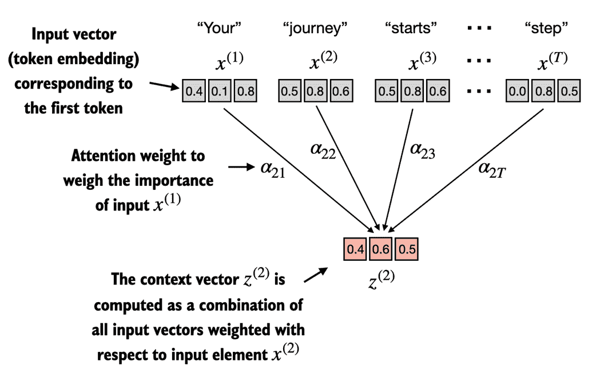
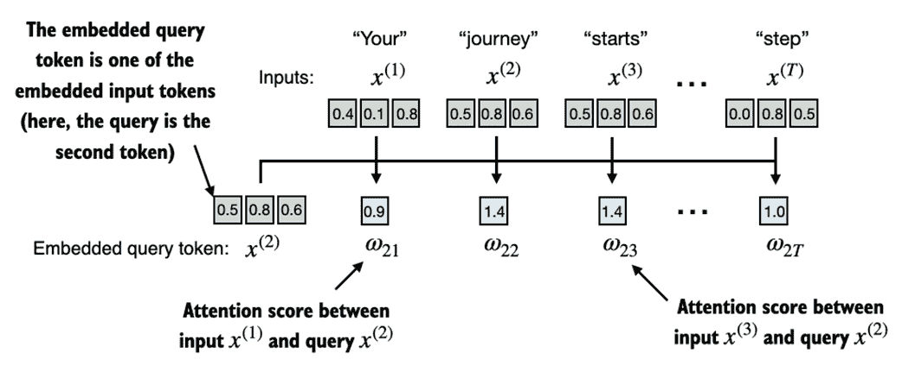
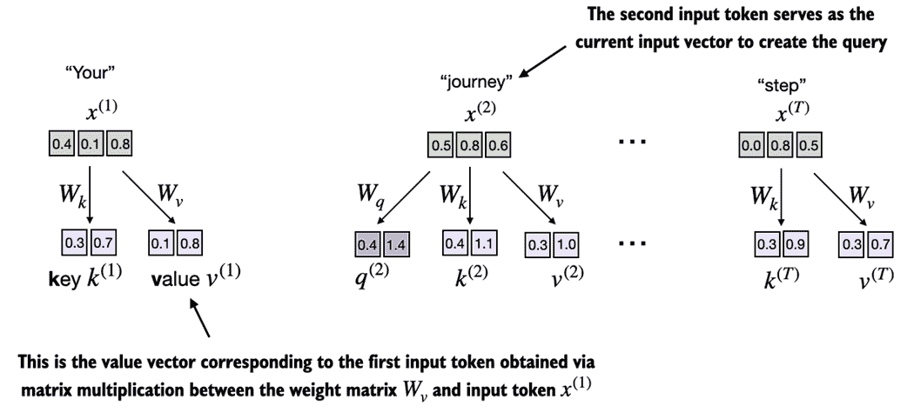
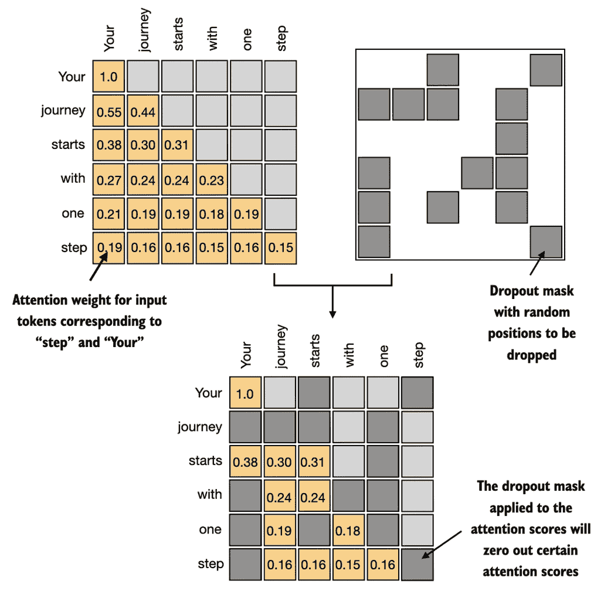

# 3 编码注意力机制

### 本章涵盖

+   探索在神经网络中使用注意力机制的原因

+   引入一个基本的自注意力框架，并逐步提升到增强型自注意力机制

+   实现一个因果注意力模块，使 LLM 每次生成一个标记

+   使用 dropout 随机选择的注意力权重进行掩蔽以减少过拟合

+   将多个因果注意力模块堆叠成一个多头注意力模块

在上一章中，你学习了如何为 LLM 准备输入文本。这涉及将文本拆分为单个词和子词标记，这些标记可以编码为向量表示，即所谓的嵌入，供 LLM 使用。

本章将重点关注 LLM 架构本身的重要组成部分，即注意力机制，如图 3.1 所示。

##### 图 3.1 编码 LLM 的三个主要阶段的思维模型，在一般文本数据集上预训练 LLM，并在标记数据集上微调。 本章专注于注意力机制，它们是 LLM 架构的重要组成部分。


注意力机制是一个全面的话题，这就是我们为何要为其专门设立一个章节。我们将主要独立考察这些注意力机制，并在机制层面上进行深入探讨。在下一章中，我们将编码围绕自注意力机制的 LLM 其余部分，以观察其工作原理并创建生成文本的模型。

在本章中，我们将实现四种不同的注意力机制变体，如图 3.2 所示。

##### 图 3.2 该图描绘了我们将在本章中编码的不同注意力机制，从简化的自注意力版本开始，然后添加可训练权重。因果注意力机制为自注意力添加了一个掩码，使 LLM 能够每次生成一个单词。最后，多头注意力将注意力机制组织为多个头，允许模型并行捕捉输入数据的各种特征。


图 3.2 中显示的这些不同注意力变体相互依赖，目标是最终实现一个紧凑且高效的多头注意力实现，以便在下一章的 LLM 架构中进行插入。

## 3.1 模型处理长序列的问题

在我们深入探讨本章核心的 *自注意力* 机制之前，架构中没有注意力机制的问题是什么？假设我们想开发一个语言翻译模型，将文本从一种语言翻译成另一种语言。如图 3.3 所示，由于源语言和目标语言的语法结构，我们不能简单地逐字翻译文本。

##### 图 3.3 在将文本从一种语言翻译成另一种语言时，例如从德语翻译成英语，仅仅逐字翻译是不可能的。相反，翻译过程需要上下文理解和语法对齐。


为了解决不能逐字翻译的问题，通常使用一个具有两个子模块的深度神经网络，所谓的*编码器*和*解码器*。编码器的工作是首先读取并处理整个文本，然后解码器生成翻译后的文本。

当我们在第一章（第 1.4 节，*使用 LLMs 执行不同任务*）介绍变换器架构时，我们已经简要讨论了编码器-解码器网络。在变换器出现之前，*递归神经网络*（RNN）是语言翻译中最流行的编码器-解码器架构。

RNN 是一种神经网络，其中前一步的输出作为输入反馈给当前步骤，使其非常适合处理像文本这样的序列数据。如果你对 RNN 不熟悉，不用担心，你不需要了解 RNN 的详细工作原理来跟上这个讨论；我们这里的重点更多是在于编码器-解码器架构的一般概念。

在编码器-解码器 RNN 中，输入文本被送入编码器，编码器按顺序处理它。编码器在每一步更新其隐藏状态（隐藏层的内部值），试图在最终隐藏状态中捕捉输入句子的整个含义，如图 3.4 所示。然后，解码器利用这个最终隐藏状态开始逐字生成翻译句子。它还在每一步更新其隐藏状态，以便携带下一个单词预测所需的上下文。

##### 图 3.4 在变换器模型出现之前，编码器-解码器 RNN 是机器翻译的热门选择。编码器将来自源语言的一个令牌序列作为输入，其中编码器的隐藏状态（一个中间神经网络层）对整个输入序列进行了压缩表示编码。然后，解码器利用其当前的隐藏状态开始逐个令牌进行翻译。


虽然我们不需要了解这些编码器-解码器 RNN 的内部工作原理，但关键思想是编码器部分将整个输入文本处理成一个隐藏状态（记忆单元）。解码器然后使用这个隐藏状态来生成输出。你可以将这个隐藏状态视为一个嵌入向量，这是我们在第二章讨论的一个概念。

编码器-解码器 RNN 的一个重大问题和局限性是，在解码阶段，RNN 不能直接访问编码器的早期隐藏状态。因此，它完全依赖于当前的隐藏状态，该状态封装了所有相关信息。这可能导致上下文丢失，尤其是在依赖关系可能跨越长距离的复杂句子中。

对于不熟悉 RNN 的读者来说，理解或学习这种架构并非必要，因为本书中不会使用它。本节的主要信息是编码器-解码器 RNN 存在一个缺陷，这促使了注意力机制的设计。

## 3.2 使用注意力机制捕捉数据依赖性

在变换器 LLM 出现之前，RNN 通常用于语言建模任务，如语言翻译，正如之前提到的。RNN 在翻译短句时表现良好，但在处理较长文本时效果不佳，因为它们无法直接访问输入中的前一个词。

这种方法的一个主要缺陷是，RNN 必须在将整个编码输入传递给解码器之前在单个隐藏状态中记住所有内容，如前一节中的图 3.4 所示。

因此，研究人员在 2014 年为 RNN 开发了所谓的*Bahdanau 注意力*机制（以相关论文的第一作者命名），该机制修改了编码器-解码器 RNN，使得解码器可以在每个解码步骤中选择性地访问输入序列的不同部分，如图 3.5 所示。

##### 图 3.5 使用注意力机制，网络的文本生成解码器部分可以选择性地访问所有输入标记。这意味着某些输入标记对于生成给定的输出标记更为重要。重要性由所谓的注意力权重决定，我们稍后将计算这些权重。请注意，该图展示了注意力的总体思路，并未描绘 Bahdanau 机制的确切实现，该机制是本书范围之外的 RNN 方法。


有趣的是，仅仅三年后，研究人员发现构建用于自然语言处理的深度神经网络并不需要 RNN 架构，并提出了最初的*变换器*架构（在第一章讨论），其自注意力机制受到 Bahdanau 注意力机制的启发。

自注意力是一种机制，使得输入序列中的每个位置在计算序列表示时可以关注同一序列中的所有位置。自注意力是基于变换器架构的当代大型语言模型（LLM）的关键组成部分，如 GPT 系列。

本章专注于编码和理解在 GPT 类模型中使用的自注意力机制，如图 3.6 所示。在下一章中，我们将编码 LLM 的其余部分。

##### 图 3.6 自注意力是变换器中的一种机制，用于通过允许序列中的每个位置与同一序列中的所有其他位置互动并权衡其重要性，从而计算更高效的输入表示。在本章中，我们将从头开始编码这种自注意力机制，然后在下一章中编码 GPT 类 LLM 的其余部分。


## 3.3 用自注意力关注输入的不同部分

现在我们将深入探讨自注意力机制的内部工作原理，并学习如何从头开始编码它。自注意力是每个基于变换器架构的大型语言模型的基石。值得注意的是，这个主题可能需要大量的专注和注意（并不是开玩笑），但一旦你掌握了它的基本原理，你就会征服本书中最困难的方面之一，以及一般实现大型语言模型的挑战。

##### 自注意力中的“自”

在自注意力中，“自”指的是该机制通过关联单个输入序列中的不同位置来计算注意力权重的能力。它评估并学习输入自身不同部分之间的关系和依赖性，例如句子中的单词或图像中的像素。这与传统的注意力机制不同，后者关注两个不同序列中元素之间的关系，例如在序列到序列模型中，注意力可能是在输入序列和输出序列之间，如图 3.5 所示的例子。

由于自注意力看起来可能比较复杂，特别是如果你第一次接触它，我们将在下一小节中介绍自注意力的简化版本。之后，在 3.4 节中，我们将实现带有可训练权重的自注意力机制，这在大型语言模型中使用。

### 3.3.1 无可训练权重的简单自注意力机制

在本节中，我们实现一种不带任何可训练权重的自注意力简化变体，如图 3.7 所示。本节的目标是说明自注意力中的一些关键概念，然后再在 3.4 节中添加可训练权重。

##### 图 3.7 自注意力的目标是为每个输入元素计算一个上下文向量，该向量结合来自所有其他输入元素的信息。在图中所示的示例中，我们计算上下文向量*z*^((2))。每个输入元素在计算*z*^((2))时的重要性或贡献由注意力权重*α*[21]到*α*[2T]决定。在计算*z*^((2))时，注意力权重是相对于输入元素*x*^((2))和所有其他输入计算的。这些注意力权重的确切计算将在本节后面讨论。



图 3.7 显示了一个输入序列，记作*x*，由*T*个元素组成，表示为*x*^((1))到*x*^((T))。该序列通常表示文本，例如句子，已经转换为标记嵌入，如第二章所解释。

例如，考虑一个输入文本，例如*“你的旅程始于一步。”* 在这种情况下，序列中的每个元素，例如*x*^((1))，对应于表示特定标记的*d*维嵌入向量，如“你的。”在图 3.7 中，这些输入向量显示为 3 维嵌入。

在自注意力中，我们的目标是为输入序列中每个元素 *x*^((i)) 计算上下文向量 *z*^((i))。*上下文向量* 可以解释为一个丰富的嵌入向量。

为了说明这个概念，让我们关注第二个输入元素的嵌入向量，*x*^((2))（对应于标记“journey”），以及相应的上下文向量 *z*^((2))，如图 3.7 底部所示。这个增强的上下文向量 *z*^((2)) 是一个嵌入，包含关于 *x*^((2)) 和所有其他输入元素 *x*^((1)) 到 *x*^((T)) 的信息。

在自注意力中，上下文向量起着关键作用。它们的目的是通过结合序列中所有其他元素的信息，创建输入序列中每个元素的丰富表示（如一个句子），如图 3.7 所示。这在大型语言模型（LLMs）中至关重要，因为它们需要理解句子中单词之间的关系和相关性。稍后，我们将添加可训练的权重，以帮助 LLM 学习构建这些上下文向量，使其对于生成下一个标记是相关的。

在本节中，我们实现一个简化的自注意力机制，以一步一步计算这些权重和结果上下文向量。

考虑以下输入句子，该句子已嵌入到三维向量中，如第二章所讨论的。为了确保其适合页面而不换行，我们选择一个较小的嵌入维度进行说明：

```py
import torch
inputs = torch.tensor(
  [[0.43, 0.15, 0.89], # Your     (x¹)
   [0.55, 0.87, 0.66], # journey  (x²)
   [0.57, 0.85, 0.64], # starts   (x³)
   [0.22, 0.58, 0.33], # with     (x⁴)
   [0.77, 0.25, 0.10], # one      (x⁵)
   [0.05, 0.80, 0.55]] # step     (x⁶)
)
```

实现自注意力的第一步是计算中间值 *ω*，即注意力分数，如图 3.8 所示。

##### 图 3.8 本节的总体目标是通过将第二个输入序列 *x*^((2)) 作为查询来说明上下文向量 *z*^((2)) 的计算。此图显示了第一步中间步骤，即计算查询 *x*^((2)) 与所有其他输入元素之间的注意力分数 *ω* 的点积。（请注意，图中的数字被截断为小数点后一个数字，以减少视觉混乱。）



图 3.8 说明了我们如何计算查询标记与每个输入标记之间的中间注意力分数。我们通过计算查询 *x*^((2)) 与每个其他输入标记的点积来确定这些分数：

```py
query = inputs[1]  #A 
attn_scores_2 = torch.empty(inputs.shape[0])
for i, x_i in enumerate(inputs):
    attn_scores_2[i] = torch.dot(x_i, query)
print(attn_scores_2)
```

计算出的注意力分数如下：

```py
tensor([0.9544, 1.4950, 1.4754, 0.8434, 0.7070, 1.0865])
```

##### 理解点积

点积本质上是逐元素相乘并求和的简洁方式，我们可以如下演示：

```py
res = 0.

for idx, element in enumerate(inputs[0]):
 res += inputs[0][idx] * query[idx]
print(res)
print(torch.dot(inputs[0], query))
```

输出确认了逐元素乘法的总和与点积的结果相同：

```py
tensor(0.9544)
tensor(0.9544)
```

除了将点积运算视为一个将两个向量组合以产生标量值的数学工具外，点积也是相似性的度量，因为它量化了两个向量的对齐程度：较高的点积表示两个向量之间更大的对齐或相似度。在自注意力机制的上下文中，点积决定了序列中元素彼此关注的程度：点积越高，两个元素之间的相似度和注意力分数就越高。

在下一步中，如图 3.9 所示，我们对之前计算的每个注意力分数进行归一化。

##### 图 3.9 在针对输入查询 x^((2))计算注意力分数*ω*[21]到*ω*[2T]之后，下一步是通过归一化注意力分数来获得注意力权重*α*[21]到*α*[2T]。


图 3.9 中所示的归一化的主要目标是获得总和为 1 的注意力权重。这种归一化是一种有利于解释和维护 LLM 训练稳定性的惯例。以下是实现这一归一化步骤的简单方法：

```py
attn_weights_2_tmp = attn_scores_2 / attn_scores_2.sum()
print("Attention weights:", attn_weights_2_tmp)
print("Sum:", attn_weights_2_tmp.sum())
```

如输出所示，注意力权重现在的总和为 1：

```py
Attention weights: tensor([0.1455, 0.2278, 0.2249, 0.1285, 0.1077, 0.1656])
Sum: tensor(1.0000)
```

在实际操作中，更常见且建议使用 softmax 函数进行归一化。这种方法更好地管理极端值，并在训练期间提供更有利的梯度特性。以下是一个基本的 softmax 函数实现，用于归一化注意力分数：

```py
def softmax_naive(x):
    return torch.exp(x) / torch.exp(x).sum(dim=0)

attn_weights_2_naive = softmax_naive(attn_scores_2)
print("Attention weights:", attn_weights_2_naive)
print("Sum:", attn_weights_2_naive.sum())
```

如输出所示，softmax 函数也满足目标，并将注意力权重归一化，使其总和为 1：

```py
Attention weights: tensor([0.1385, 0.2379, 0.2333, 0.1240, 0.1082, 0.1581])
Sum: tensor(1.)

```

此外，softmax 函数确保注意力权重始终为正。这使得输出可解释为概率或相对重要性，其中更高的权重表示更大的重要性。

请注意，这种简单的 softmax 实现(`softmax_naive`)在处理大或小输入值时可能会遇到数值不稳定问题，例如溢出和下溢。因此，在实际操作中，建议使用经过广泛优化的 PyTorch softmax 实现：

```py
attn_weights_2 = torch.softmax(attn_scores_2, dim=0)
print("Attention weights:", attn_weights_2)
print("Sum:", attn_weights_2.sum())
```

在这种情况下，我们可以看到它产生了与之前的`softmax_naive`函数相同的结果：

```py
Attention weights: tensor([0.1385, 0.2379, 0.2333, 0.1240, 0.1082, 0.1581])
Sum: tensor(1.)
```

现在我们计算了归一化的注意力权重，准备好进行图 3.10 中所示的最后一步：通过将嵌入的输入标记*x*^((i))与相应的注意力权重相乘，然后对结果向量求和，计算上下文向量*z*^((2))。

##### 图 3.10 在计算和归一化注意力分数以获得查询*x*^((2))的注意力权重之后，最后一步是计算上下文向量*z*^((2))。这个上下文向量是所有输入向量*x*^((1))到*x*^((T))的组合，按注意力权重加权。


图 3.10 中描绘的上下文向量*z*^((2))是作为所有输入向量的加权和计算得出的。这涉及将每个输入向量乘以其对应的注意力权重：

```py
query = inputs[1] # 2nd input token is the query
context_vec_2 = torch.zeros(query.shape)
for i,x_i in enumerate(inputs):
    context_vec_2 += attn_weights_2[i]*x_i
print(context_vec_2)
```

此计算的结果如下：

```py
tensor([0.4419, 0.6515, 0.5683])
```

在下一部分中，我们将对计算上下文向量的过程进行概括，以便同时计算所有上下文向量。

### 3.3.2 为所有输入令牌计算注意力权重

在前一部分中，我们计算了输入 2 的注意力权重和上下文向量，如图 3.11 中突出显示的行所示。现在，我们将扩展这一计算，以计算所有输入的注意力权重和上下文向量。

##### 图 3.11 突出显示的行显示了第二个输入元素作为查询的注意力权重，正如我们在前一部分中计算的。这一部分将计算推广到获取所有其他注意力权重。


我们遵循与之前相同的三个步骤，如图 3.12 所总结的，除了在代码中进行了一些修改，以计算所有上下文向量，而不仅仅是第二个上下文向量*z*^((2))。

##### 图 3.12


首先，如图 3.12 所示，在步骤 1 中，我们添加了一个额外的 for 循环，以计算所有输入对的点积。

```py
attn_scores = torch.empty(6, 6)
for i, x_i in enumerate(inputs):
    for j, x_j in enumerate(inputs):
        attn_scores[i, j] = torch.dot(x_i, x_j)
print(attn_scores)
```

结果的注意力得分如下：

```py
tensor([[0.9995, 0.9544, 0.9422, 0.4753, 0.4576, 0.6310],
        [0.9544, 1.4950, 1.4754, 0.8434, 0.7070, 1.0865],
        [0.9422, 1.4754, 1.4570, 0.8296, 0.7154, 1.0605],
        [0.4753, 0.8434, 0.8296, 0.4937, 0.3474, 0.6565],
        [0.4576, 0.7070, 0.7154, 0.3474, 0.6654, 0.2935],
        [0.6310, 1.0865, 1.0605, 0.6565, 0.2935, 0.9450]])
```

前面的张量中的每个元素表示每对输入之间的注意力得分，如图 3.11 所示。请注意，图 3.11 中的值是经过标准化的，这就是它们与前面张量中未标准化的注意力得分不同的原因。我们稍后会处理标准化。

在计算前面的注意力得分张量时，我们使用了 Python 中的 for 循环。然而，for 循环通常比较慢，我们可以通过矩阵乘法实现相同的结果：

```py
attn_scores = inputs @ inputs.T
print(attn_scores)
```

我们可以直观地确认结果与之前相同：

```py
tensor([[0.9995, 0.9544, 0.9422, 0.4753, 0.4576, 0.6310],
        [0.9544, 1.4950, 1.4754, 0.8434, 0.7070, 1.0865],
        [0.9422, 1.4754, 1.4570, 0.8296, 0.7154, 1.0605],
        [0.4753, 0.8434, 0.8296, 0.4937, 0.3474, 0.6565],
        [0.4576, 0.7070, 0.7154, 0.3474, 0.6654, 0.2935],
        [0.6310, 1.0865, 1.0605, 0.6565, 0.2935, 0.9450]])
```

在步骤 2 中，如图 3.12 所示，我们现在对每一行进行标准化，使每一行的值之和为 1：

```py
attn_weights = torch.softmax(attn_scores, dim=1)
print(attn_weights)
```

这返回以下注意力权重张量，其值与图 3.10 中显示的值一致：

```py
tensor([[0.2098, 0.2006, 0.1981, 0.1242, 0.1220, 0.1452],
        [0.1385, 0.2379, 0.2333, 0.1240, 0.1082, 0.1581],
        [0.1390, 0.2369, 0.2326, 0.1242, 0.1108, 0.1565],
        [0.1435, 0.2074, 0.2046, 0.1462, 0.1263, 0.1720],
        [0.1526, 0.1958, 0.1975, 0.1367, 0.1879, 0.1295],
        [0.1385, 0.2184, 0.2128, 0.1420, 0.0988, 0.1896]])
```

在我们继续到步骤 3 之前，让我们简单验证一下每一行确实都加和为 1：

```py
row_2_sum = sum([0.1385, 0.2379, 0.2333, 0.1240, 0.1082, 0.1581])
print("Row 2 sum:", row_2_sum)
print("All row sums:", attn_weights.sum(dim=1))
```

结果如下：

```py
Row 2 sum: 1.0
All row sums: tensor([1.0000, 1.0000, 1.0000, 1.0000, 1.0000, 1.0000])
```

在第三个也是最后一个步骤中，我们现在使用这些注意力权重通过矩阵乘法计算所有上下文向量：

```py
all_context_vecs = attn_weights @ inputs
print(all_context_vecs)
```

在结果输出张量中，每一行包含一个三维上下文向量：

```py
tensor([[0.4421, 0.5931, 0.5790],
        [0.4419, 0.6515, 0.5683],
        [0.4431, 0.6496, 0.5671],
        [0.4304, 0.6298, 0.5510],
        [0.4671, 0.5910, 0.5266],
        [0.4177, 0.6503, 0.5645]])
```

我们可以通过将第二行与我们在 3.3.1 节中之前计算的上下文向量*z*^((2))进行比较，来再次确认代码的正确性：

```py
print("Previous 2nd context vector:", context_vec_2)
```

根据结果，我们可以看到之前计算的`context_vec_2`与前面张量中的第二行完全一致：

```py
Previous 2nd context vector: tensor([0.4419, 0.6515, 0.5683])
```

这结束了简单自注意力机制的代码演示。在下一部分中，我们将添加可训练的权重，使 LLM 能够从数据中学习，并提高其在特定任务上的表现。

## 3.4 实现带可训练权重的自注意力机制

在本节中，我们实现的是用于原始变压器架构、GPT 模型及大多数其他流行 LLM 的自注意力机制。这个自注意力机制也称为*缩放点积注意力*。图 3.13 提供了一个心理模型，说明了这个自注意力机制如何适应实现 LLM 的更广泛背景。

##### 图 3.13 一个心理模型，说明我们在本节中编码的自注意力机制如何适应本书和本章的更广泛背景。在前一节中，我们编码了一个简化的注意力机制，以理解注意力机制背后的基本机制。在本节中，我们为这个注意力机制添加了可训练权重。在接下来的部分中，我们将通过添加因果掩码和多个头来扩展这个自注意力机制。


如图 3.13 所示，带可训练权重的自注意力机制基于之前的概念：我们希望计算特定输入元素的输入向量的加权和作为上下文向量。正如你将看到的，与我们在 3.3 节中编码的基本自注意力机制相比，只有微小的差异。

最显著的区别是引入了在模型训练期间更新的权重矩阵。这些可训练权重矩阵对于模型（特别是模型内部的注意力模块）学习生成“良好”上下文向量至关重要。（请注意，我们将在第五章训练 LLM。）

我们将在两个小节中深入探讨这个自注意力机制。首先，我们将像之前一样一步步编码。其次，我们将把代码整理成一个紧凑的 Python 类，以便可以导入到 LLM 架构中，我们将在第四章中编码。

### 3.4.1 步骤计算注意力权重

我们将逐步实现自注意力机制，介绍三个可训练权重矩阵*W*[q]、*W*[k]和*W*[v]。这三个矩阵用于将嵌入的输入标记*x*^((i))投影到查询、键和值向量，如图 3.14 所示。

##### 图 3.14 在带可训练权重矩阵的自注意力机制的第一步中，我们为输入元素*x*计算查询（*q*）、键（*k*）和值（*v*）向量。与之前的部分类似，我们将第二个输入*x*^((2))指定为查询输入。查询向量*q*^((2))通过输入*x*^((2))与权重矩阵*W*[q]的矩阵乘法获得。类似地，我们通过涉及权重矩阵*W*[k]和*W*[v]的矩阵乘法获得键和值向量。



在第 3.3.1 节中，我们将第二个输入元素*x*^((2))定义为计算简化注意力权重以获得上下文向量*z*^((2))时的查询。随后，在第 3.3.2 节中，我们将其推广为计算六个单词输入句子*“你的旅程始于一步。”*的所有上下文向量*z*^((1)) *... z*^((T))。

同样，为了说明，我们将首先计算一个上下文向量*z*^((2))。在下一节中，我们将修改此代码以计算所有上下文向量。

让我们开始定义几个变量：

```py
x_2 = inputs[1] #A
d_in = inputs.shape[1] #B
d_out = 2 #C
```

请注意，在 GPT 类模型中，输入和输出维度通常是相同的，但为了更好地跟随计算，我们在这里选择不同的输入（`d_in=3`）和输出（`d_out=2`）维度。

接下来，我们初始化图 3.14 中显示的三个权重矩阵*W*[q]、*W*[k]和*W*[v]：

```py
torch.manual_seed(123)
W_query = torch.nn.Parameter(torch.rand(d_in, d_out), requires_grad=False)
W_key   = torch.nn.Parameter(torch.rand(d_in, d_out), requires_grad=False)
W_value = torch.nn.Parameter(torch.rand(d_in, d_out), requires_grad=False)
```

请注意，我们将`requires_grad=False`设置为减少输出中的杂乱，以便于说明，但如果我们使用这些权重矩阵进行模型训练，我们将设置`requires_grad=True`以在模型训练期间更新这些矩阵。

接下来，我们计算查询、键和值向量，如图 3.14 所示：

```py
query_2 = x_2 @ W_query 
key_2 = x_2 @ W_key 
value_2 = x_2 @ W_value
print(query_2)
```

从查询的输出中可以看出，这会产生一个二维向量，因为我们将相应权重矩阵的列数通过`d_out`设置为 2：

```py
tensor([0.4306, 1.4551])
```

##### 权重参数与注意力权重

请注意，在权重矩阵*W*中，术语“权重”是“权重参数”的缩写，指的是在训练过程中优化的神经网络值。这与注意力权重不同。如我们在前一节中所见，注意力权重决定上下文向量在多大程度上依赖于输入的不同部分，即网络关注输入不同部分的程度。

总结而言，权重参数是定义网络连接的基本学习系数，而注意力权重则是动态的、特定于上下文的值。

尽管我们暂时的目标只是计算一个上下文向量*z*^((2))，但我们仍然需要所有输入元素的键和值向量，因为它们在计算与查询*q*^((2))相关的注意力权重时是必不可少的，如图 3.14 所示。

我们可以通过矩阵乘法获得所有键和值：

```py
keys = inputs @ W_key 
values = inputs @ W_value
print("keys.shape:", keys.shape)
print("values.shape:", values.shape)
```

从输出中可以看出，我们成功地将 6 个输入标记从 3D 投影到 2D 嵌入空间：

```py
keys.shape: torch.Size([6, 2])
values.shape: torch.Size([6, 2])
```

第二步是计算注意力得分，如图 3.15 所示。

##### 图 3.15 注意力得分计算是一个点积计算，类似于我们在第 3.3 节中使用的简化自注意力机制。这里的新方面是，我们不是直接计算输入元素之间的点积，而是通过各自的权重矩阵转换输入后使用查询和键。


首先，让我们计算注意力分数*ω*[22]：

```py
keys_2 = keys[1] #A
attn_score_22 = query_2.dot(keys_2)
print(attn_score_22)
```

以下是未归一化的注意力分数的结果：

```py
tensor(1.8524)
```

再次，我们可以通过矩阵乘法将此计算推广到所有注意力分数：

```py
attn_scores_2 = query_2 @ keys.T # All attention scores for given query
print(attn_scores_2)
```

正如我们所看到的，作为快速检查，输出中的第二个元素与我们之前计算的`attn_score_22`匹配：

```py
tensor([1.2705, 1.8524, 1.8111, 1.0795, 0.5577, 1.5440])
```

第三步是从注意力分数转变为注意力权重，如图 3.16 所示。

##### 图 3.16 在计算注意力分数*ω*之后，下一步是使用 softmax 函数对这些分数进行归一化，以获得注意力权重*α*。


接下来，如图 3.16 所示，我们通过缩放注意力分数并使用之前使用的 softmax 函数来计算注意力权重。与之前的不同之处在于，我们现在通过将注意力分数除以键的嵌入维度的平方根来缩放这些分数（请注意，取平方根在数学上等同于取 0.5 的指数）：

```py
d_k = keys.shape[-1]
attn_weights_2 = torch.softmax(attn_scores_2 / d_k**0.5, dim=-1)
print(attn_weights_2)
```

结果的注意力权重如下：

```py
tensor([0.1500, 0.2264, 0.2199, 0.1311, 0.0906, 0.1820])
```

##### 缩放点积注意力背后的原理

通过嵌入维度大小进行归一化的原因是通过避免小梯度来提高训练性能。例如，当增加嵌入维度时，通常对于像 GPT 这样的 LLM 来说，这个维度大于千，较大的点积会导致在反向传播过程中由于应用了 softmax 函数而产生非常小的梯度。随着点积的增加，softmax 函数的行为更像是一个阶跃函数，导致梯度接近于零。这些小梯度会显著减慢学习速度或导致训练停滞。

通过嵌入维度的平方根进行缩放是该自注意力机制也被称为缩放点积注意力的原因。

现在，最后一步是计算上下文向量，如图 3.17 所示。

##### 图 3.17 在自注意力计算的最后一步，我们通过注意力权重组合所有值向量来计算上下文向量。


类似于第 3.3 节，在那里我们计算了作为输入向量的加权和的上下文向量，现在我们计算作为值向量的加权和的上下文向量。在这里，注意力权重作为加权因子，权衡每个值向量的相对重要性。类似于第 3.3 节，我们可以使用矩阵乘法在一步内获得输出：

```py
context_vec_2 = attn_weights_2 @ values
print(context_vec_2)
```

结果向量的内容如下：

```py
tensor([0.3061, 0.8210])
```

到目前为止，我们只计算了一个上下文向量，*z*^((2))。在下一节中，我们将对代码进行泛化，以计算输入序列中的所有上下文向量，从*z*^((1))到*z*^((T))。

##### 为什么查询、键和值？

在注意力机制的上下文中，“键”、“查询”和“值”这几个术语借用自信息检索和数据库领域，在这些领域中使用类似的概念来存储、搜索和检索信息。

“查询”类似于数据库中的搜索查询。它代表模型关注或试图理解的当前项（例如句子中的一个词或标记）。查询用于探测输入序列的其他部分，以确定应给予多少关注。

“键”就像用于索引和搜索的数据库键。在注意力机制中，输入序列中的每个项（例如句子中的每个词）都有一个相关联的键。这些键用于与查询匹配。

在此上下文中，“值”类似于数据库中键值对的值。它表示输入项的实际内容或表示。一旦模型确定了哪些键（因此哪些输入部分）与查询（当前关注项）最相关，它就会检索相应的值。

### 3.4.2 实现紧凑的自注意力 Python 类

在前面的章节中，我们经历了许多步骤来计算自注意力输出。这主要是为了说明目的，以便我们可以逐步处理。在实际操作中，考虑到下一章的 LLM 实现，将这段代码组织成一个 Python 类是很有帮助的：

##### 列表 3.1 紧凑自注意力类

```py
import torch.nn as nn
class SelfAttention_v1(nn.Module):
    def __init__(self, d_in, d_out):
        super().__init__()
        self.d_out = d_out
        self.W_query = nn.Parameter(torch.rand(d_in, d_out))
        self.W_key   = nn.Parameter(torch.rand(d_in, d_out))
        self.W_value = nn.Parameter(torch.rand(d_in, d_out))

    def forward(self, x):
        keys = x @ self.W_key
        queries = x @ self.W_query
        values = x @ self.W_value
        attn_scores = queries @ keys.T # omega
        attn_weights = torch.softmax(
            attn_scores / keys.shape[-1]**0.5, dim=-1)
        context_vec = attn_weights @ values
        return context_vec
```

在这个 PyTorch 代码中，`SelfAttention_v1`是一个派生自`nn.Module`的类，`nn.Module`是 PyTorch 模型的基本构建块，提供了模型层创建和管理所需的功能。

`__init__`方法初始化可训练的权重矩阵（`W_query`、`W_key`和`W_value`），用于查询、键和值，每个矩阵将输入维度`d_in`转换为输出维度`d_out`。

在前向传播过程中，使用前向方法，通过将查询和键相乘来计算注意力得分（`attn_scores`），并使用 softmax 对这些得分进行归一化。最后，我们通过用这些归一化的注意力得分对值进行加权来创建上下文向量。

我们可以如下使用这个类：

```py
torch.manual_seed(123)
sa_v1 = SelfAttention_v1(d_in, d_out)
print(sa_v1(inputs))
```

由于`inputs`包含六个嵌入向量，因此结果是一个存储六个上下文向量的矩阵：

```py
tensor([[0.2996, 0.8053],
        [0.3061, 0.8210],
        [0.3058, 0.8203],
        [0.2948, 0.7939],
        [0.2927, 0.7891],
        [0.2990, 0.8040]], grad_fn=<MmBackward0>)
```

快速检查一下，注意第二行（`[0.3061, 0.8210]`）与前一部分的`context_vec_2`的内容是如何匹配的。

图 3.18 总结了我们刚刚实现的自注意力机制。

##### 图 3.18 在自注意力中，我们使用三个权重矩阵 Wq、Wk 和 Wv 对输入矩阵 X 中的输入向量进行变换。然后，我们基于生成的查询（Q）和键（K）计算注意力权重矩阵。使用注意力权重和值（V），我们接着计算上下文向量（Z）。 （为了视觉清晰，本图中我们关注一个包含*n*个标记的单一输入文本，而不是多个输入的批处理。因此，在此上下文中，3D 输入张量被简化为 2D 矩阵。这种方法使得过程的可视化和理解更加简单明了。）


如图 3.18 所示，自注意力涉及可训练的权重矩阵 *W*[q]*, W*[k]*,* 和 *W*[v]。这些矩阵将输入数据转换为查询、键和值，这是注意力机制的关键组成部分。随着模型在训练过程中接触到更多数据，它会调整这些可训练权重，正如我们将在后续章节中看到的那样。

我们可以通过利用 PyTorch 的 `nn.Linear` 层进一步改进 `SelfAttention_v1` 的实现，这在禁用偏置单元时有效执行矩阵乘法。此外，使用 `nn.Linear` 而不是手动实现 `nn.Parameter(torch.rand(...))` 的一个重要优势是，`nn.Linear` 具有优化的权重初始化方案，有助于更稳定和有效的模型训练。

##### 列表 3.2 使用 PyTorch 的 Linear 层的自注意力类

```py
class SelfAttention_v2(nn.Module):
    def __init__(self, d_in, d_out, qkv_bias=False):
        super().__init__()
        self.d_out = d_out
        self.W_query = nn.Linear(d_in, d_out, bias=qkv_bias)
        self.W_key   = nn.Linear(d_in, d_out, bias=qkv_bias)
        self.W_value = nn.Linear(d_in, d_out, bias=qkv_bias)

    def forward(self, x):
        keys = self.W_key(x)
        queries = self.W_query(x)
        values = self.W_value(x)
        attn_scores = queries @ keys.T
        attn_weights = torch.softmax(attn_scores / keys.shape[-1]**0.5, dim=1)
        context_vec = attn_weights @ values
        return context_vec
```

你可以像使用 `SelfAttention_v1` 一样使用 `SelfAttention_v2：`

```py
torch.manual_seed(789)
sa_v2 = SelfAttention_v2(d_in, d_out)
print(sa_v2(inputs))
```

输出为：

```py
tensor([[-0.0739,  0.0713],
        [-0.0748,  0.0703],
        [-0.0749,  0.0702],
        [-0.0760,  0.0685],
        [-0.0763,  0.0679],
        [-0.0754,  0.0693]], grad_fn=<MmBackward0>)
```

注意到 `SelfAttention_v1` 和 `SelfAttention_v2` 产生不同的输出，因为它们对权重矩阵使用了不同的初始权重，`nn.Linear` 使用了更复杂的权重初始化方案。

##### 练习 3.1 比较 SelfAttention_v1 和 SelfAttention_v2

注意到 `SelfAttention_v2` 中的 `nn.Linear` 使用了不同于 `SelfAttention_v1` 中的 `nn.Parameter(torch.rand(d_in, d_out)` 的权重初始化方案，这导致两个机制产生不同的结果。为了检查两个实现 `SelfAttention_v1` 和 `SelfAttention_v2` 在其他方面是否相似，我们可以将 `SelfAttention_v2` 对象的权重矩阵转移到 `SelfAttention_v1`，这样两个对象就会产生相同的结果。

你的任务是正确地将 `SelfAttention_v2` 实例的权重分配给 `SelfAttention_v1` 实例。为此，你需要理解两个版本之间权重的关系。（提示：`nn.Linear` 以转置形式存储权重矩阵。）在分配后，你应该观察到两个实例产生相同的输出。

在下一节中，我们将对自注意力机制进行增强，重点是引入因果和多头元素。因果方面涉及修改注意力机制，以防止模型访问序列中的未来信息，这对于语言建模等任务至关重要，因为每个单词的预测应该仅依赖于之前的单词。

多头组件涉及将注意力机制分成多个“头”。每个头学习数据的不同方面，使得模型能够同时关注来自不同表示子空间的不同位置的信息。这提高了模型在复杂任务中的表现。

## 3.5 用因果注意力隐藏未来单词

在本节中，我们修改标准自注意力机制，以创建一种 *因果注意力* 机制，这对于后续章节中开发 LLM 至关重要。

因果注意力，也称为*掩码注意力*，是一种专门的自注意力形式。它限制模型在处理任何给定标记时仅考虑序列中的前一个和当前输入。这与标准自注意力机制形成对比，后者允许同时访问整个输入序列。

因此，在计算注意力分数时，因果注意力机制确保模型仅考虑序列中发生在当前标记之前或等于当前标记的标记。

在 GPT 类大语言模型中，为了实现这一点，对于每个处理的标记，我们将未来的标记（即当前标记后面的标记）掩盖，如图 3.19 所示。

##### 图 3.19 在因果注意力中，我们掩盖对角线以上的注意力权重，使得对于给定输入，LLM 在使用注意力权重计算上下文向量时无法访问未来标记。例如，对于第二行中的“journey”一词，我们只保留“Your”之前的单词和当前位于“journey”的注意力权重。


如图 3.19 所示，我们掩盖对角线以上的注意力权重，并对未掩盖的注意力权重进行归一化，使得每一行的注意力权重之和为 1。在下一部分中，我们将用代码实现这一掩盖和归一化程序。

### 3.5.1 应用因果注意力掩码

在这一部分中，我们在代码中实现因果注意力掩码。我们从图 3.20 中总结的程序开始。

##### 图 3.20 在因果注意力中，获取掩码注意力权重矩阵的一种方法是对注意力分数应用 softmax 函数，将对角线以上的元素置为零，并对结果矩阵进行归一化。


为了实施步骤以应用因果注意力掩码，从而获得如图 3.20 所总结的掩码注意力权重，让我们使用上一部分的注意力分数和权重来编写因果注意力机制的代码。

在图 3.20 所示的第一步中，我们使用 softmax 函数计算注意力权重，正如我们在前面的部分中所做的那样：

```py
queries = sa_v2.W_query(inputs)  #A
keys = sa_v2.W_key(inputs) 
attn_scores = queries @ keys.T
attn_weights = torch.softmax(attn_scores / keys.shape[-1]**0.5, dim=1)
print(attn_weights)
```

这将产生以下注意力权重：

```py
tensor([[0.1921, 0.1646, 0.1652, 0.1550, 0.1721, 0.1510],
        [0.2041, 0.1659, 0.1662, 0.1496, 0.1665, 0.1477],
        [0.2036, 0.1659, 0.1662, 0.1498, 0.1664, 0.1480],
        [0.1869, 0.1667, 0.1668, 0.1571, 0.1661, 0.1564],
        [0.1830, 0.1669, 0.1670, 0.1588, 0.1658, 0.1585],
        [0.1935, 0.1663, 0.1666, 0.1542, 0.1666, 0.1529]],
       grad_fn=<SoftmaxBackward0>)
```

我们可以使用 PyTorch 的`tril`函数来实现图 3.20 中的第 2 步，以创建一个掩码，其中对角线以上的值为零：

```py
context_length = attn_scores.shape[0]
mask_simple = torch.tril(torch.ones(context_length, context_length))
print(mask_simple)
```

结果掩码如下：

```py
tensor([[1., 0., 0., 0., 0., 0.],
        [1., 1., 0., 0., 0., 0.],
        [1., 1., 1., 0., 0., 0.],
        [1., 1., 1., 1., 0., 0.],
        [1., 1., 1., 1., 1., 0.],
        [1., 1., 1., 1., 1., 1.]])
```

现在，我们可以将这个掩码与注意力权重相乘，以将对角线以上的值置为零：

```py
masked_simple = attn_weights*mask_simple
print(masked_simple)
```

如我们所见，对角线以上的元素已成功置为零：

```py
tensor([[0.1921, 0.0000, 0.0000, 0.0000, 0.0000, 0.0000],
        [0.2041, 0.1659, 0.0000, 0.0000, 0.0000, 0.0000],
        [0.2036, 0.1659, 0.1662, 0.0000, 0.0000, 0.0000],
        [0.1869, 0.1667, 0.1668, 0.1571, 0.0000, 0.0000],
        [0.1830, 0.1669, 0.1670, 0.1588, 0.1658, 0.0000],
        [0.1935, 0.1663, 0.1666, 0.1542, 0.1666, 0.1529]],
       grad_fn=<MulBackward0>)

```

图 3.20 中的第三步是重新归一化注意力权重，使每一行的总和再次为 1。我们可以通过将每一行中的每个元素除以该行的总和来实现这一点：

```py
row_sums = masked_simple.sum(dim=1, keepdim=True)
masked_simple_norm = masked_simple / row_sums
print(masked_simple_norm)
```

结果是一个注意力权重矩阵，其中对角线以上的注意力权重被置为零，并且每一行的总和为 1：

```py
tensor([[1.0000, 0.0000, 0.0000, 0.0000, 0.0000, 0.0000],
        [0.5517, 0.4483, 0.0000, 0.0000, 0.0000, 0.0000],
        [0.3800, 0.3097, 0.3103, 0.0000, 0.0000, 0.0000],
        [0.2758, 0.2460, 0.2462, 0.2319, 0.0000, 0.0000],
        [0.2175, 0.1983, 0.1984, 0.1888, 0.1971, 0.0000],
        [0.1935, 0.1663, 0.1666, 0.1542, 0.1666, 0.1529]],
       grad_fn=<DivBackward0>)
```

##### 信息泄漏

当我们应用掩码并重新归一化注意力权重时，最初可能看起来未来标记（我们打算掩码的）的信息仍然会影响当前标记，因为它们的值是 softmax 计算的一部分。然而，关键见解是，当我们在掩码后重新归一化注意力权重时，我们实际上是在对一个更小的子集重新计算 softmax（因为被掩码位置不贡献于 softmax 值）。

softmax 的数学优雅之处在于，尽管最初在分母中包含所有位置，但在掩码和重新归一化后，被掩码位置的影响被消除了——它们并没有以任何有意义的方式贡献于 softmax 分数。

简而言之，在掩码和重新归一化之后，注意力权重的分布就像最初仅在未掩码的位置之间计算一样。这确保了我们意图中，未来（或其他被掩码的）标记没有信息泄露。

虽然我们在这一点上技术上可以完成因果注意力的实现，但我们可以利用 softmax 函数的数学特性，以更少的步骤更高效地计算被掩码的注意力权重，如图 3.21 所示。

##### 图 3.21 在因果注意力中，更高效地获得被掩码的注意力权重矩阵的方法是，在应用 softmax 函数之前，用负无穷大值掩码注意力得分。


softmax 函数将其输入转换为概率分布。当一行中存在负无穷大值（-∞）时，softmax 函数将其视为零概率。（从数学上看，这是因为*e*^-^∞接近 0。）

我们可以通过创建一个在对角线以上为 1 的掩码，然后用负无穷大（`-inf`）值替换这些 1，来实现这种更高效的掩码“技巧”：

```py
mask = torch.triu(torch.ones(context_length, context_length), diagonal=1)
masked = attn_scores.masked_fill(mask.bool(), -torch.inf)
print(masked)
```

这导致了以下掩码：

```py
tensor([[0.2899,   -inf,   -inf,   -inf,   -inf,   -inf],
        [0.4656, 0.1723,   -inf,   -inf,   -inf,   -inf],
        [0.4594, 0.1703, 0.1731,   -inf,   -inf,   -inf],
        [0.2642, 0.1024, 0.1036, 0.0186,   -inf,   -inf],
        [0.2183, 0.0874, 0.0882, 0.0177, 0.0786,   -inf],
        [0.3408, 0.1270, 0.1290, 0.0198, 0.1290, 0.0078]],
       grad_fn=<MaskedFillBackward0>)

```

现在，我们需要做的就是对这些掩码结果应用 softmax 函数，我们就完成了：

```py
attn_weights = torch.softmax(masked / keys.shape[-1]**0.5, dim=1)
print(attn_weights)
```

正如我们从输出中看到的，每一行的值之和为 1，且无需进一步归一化：

```py
tensor([[1.0000, 0.0000, 0.0000, 0.0000, 0.0000, 0.0000],
        [0.5517, 0.4483, 0.0000, 0.0000, 0.0000, 0.0000],
        [0.3800, 0.3097, 0.3103, 0.0000, 0.0000, 0.0000],
        [0.2758, 0.2460, 0.2462, 0.2319, 0.0000, 0.0000],
        [0.2175, 0.1983, 0.1984, 0.1888, 0.1971, 0.0000],
        [0.1935, 0.1663, 0.1666, 0.1542, 0.1666, 0.1529]],
       grad_fn=<SoftmaxBackward0>)
```

我们现在可以使用修改后的注意力权重通过`context_vec = attn_weights @ values`计算上下文向量，如第 3.4 节所示。然而，在下一节中，我们首先介绍一个对于减少训练 LLMs 时的过拟合有用的因果注意力机制的其他小调整。

### 3.5.2 使用 dropout 掩码额外的注意力权重

*Dropout*在深度学习中是一种技术，随机选择的隐藏层单元在训练期间被忽略，实际上是“丢弃”它们。这种方法通过确保模型不会过于依赖任何特定的隐藏层单元来帮助防止过拟合。需要强调的是，dropout 仅在训练期间使用，之后会被禁用。

在变压器架构中，包括像 GPT 这样的模型，注意机制中的丢弃通常应用于两个特定区域：在计算注意力分数之后或在将注意力权重应用于值向量之后。

在这里，我们将在计算注意力权重后应用丢弃掩码，如图 3.22 所示，因为这是实践中更常见的变体。

##### 图 3.22 使用因果注意力掩码（左上），我们应用额外的丢弃掩码（右上）以置零额外的注意力权重，以减少训练过程中的过拟合。



在以下代码示例中，我们使用 50% 的丢弃率，这意味着将一半的注意力权重屏蔽掉。（在后面的章节中训练 GPT 模型时，我们将使用更低的丢弃率，如 0.1 或 0.2。）

在以下代码中，我们首先将 PyTorch 的丢弃实现应用于一个由 1 组成的 6×6 张量，以便进行说明：

```py
torch.manual_seed(123)
dropout = torch.nn.Dropout(0.5) #A
example = torch.ones(6, 6) #B
print(dropout(example))
```

正如我们所看到的，约有一半的值被置为零：

```py
tensor([[2., 2., 0., 2., 2., 0.],
        [0., 0., 0., 2., 0., 2.],
        [2., 2., 2., 2., 0., 2.],
        [0., 2., 2., 0., 0., 2.],
        [0., 2., 0., 2., 0., 2.],
        [0., 2., 2., 2., 2., 0.]])
```

在以 50% 的丢弃率对注意力权重矩阵应用丢弃时，矩阵中的一半元素会随机设为零。为了补偿有效元素的减少，矩阵中剩余元素的值会按 1/0.5 = 2 的比例放大。这种缩放对于保持注意力权重的整体平衡至关重要，确保在训练和推理阶段注意机制的平均影响保持一致。

现在，让我们对注意力权重矩阵本身应用丢弃：

```py
torch.manual_seed(123)
print(dropout(attn_weights))
```

生成的注意力权重矩阵现在有额外的元素被置为零，剩余的元素被重新缩放：

```py
tensor([[2.0000, 0.0000, 0.0000, 0.0000, 0.0000, 0.0000],
        [0.0000, 0.0000, 0.0000, 0.0000, 0.0000, 0.0000],
        [0.7599, 0.6194, 0.6206, 0.0000, 0.0000, 0.0000],
        [0.0000, 0.4921, 0.4925, 0.0000, 0.0000, 0.0000],
        [0.0000, 0.3966, 0.0000, 0.3775, 0.0000, 0.0000],
        [0.0000, 0.3327, 0.3331, 0.3084, 0.3331, 0.0000]],
       grad_fn=<MulBackward0>
```

请注意，生成的丢弃输出可能因操作系统的不同而有所差异；你可以在[这里的 PyTorch 问题追踪器](https://github.com/pytorch/pytorch/issues/121595)上阅读更多关于这种不一致的内容。

在了解了因果注意力和丢弃掩码后，我们将在接下来的部分开发一个简洁的 Python 类。该类旨在促进这两种技术的高效应用。

### 3.5.3 实现紧凑的因果注意力类

在本节中，我们将把因果注意力和丢弃修改纳入我们在 3.4 节中开发的 `SelfAttention` Python 类。该类将作为在接下来的部分中开发 *多头注意力* 的模板，这是我们在本章实现的最后一个注意力类。

但在开始之前，还有一件事是确保代码能够处理由多个输入组成的批次，以便 `CausalAttention` 类支持我们在第二章实现的数据加载器生成的批量输出。

为了简化起见，为了模拟这样的批量输入，我们重复了输入文本示例：

```py
batch = torch.stack((inputs, inputs), dim=0)
print(batch.shape) #A 
```

这会产生一个由 2 个输入文本（每个文本有 6 个标记）组成的 3D 张量，其中每个标记都是一个 3 维嵌入向量：

```py
torch.Size([2, 6, 3])
```

以下的`CausalAttention`类与我们之前实现的`SelfAttention`类相似，只是现在我们增加了在下面代码中突出显示的 dropout 和因果掩码组件：

##### 清单 3.3 紧凑的因果注意力类

```py
class CausalAttention(nn.Module):
    def __init__(self, d_in, d_out, context_length, dropout, qkv_bias=False):
        super().__init__()
        self.d_out = d_out
        self.W_query = nn.Linear(d_in, d_out, bias=qkv_bias)
        self.W_key   = nn.Linear(d_in, d_out, bias=qkv_bias)
        self.W_value = nn.Linear(d_in, d_out, bias=qkv_bias)
        self.dropout = nn.Dropout(dropout)  #A
        self.register_buffer(
           'mask',
           torch.triu(torch.ones(context_length, context_length),
           diagonal=1)
        )  #B

    def forward(self, x):
        b, num_tokens, d_in = x.shape  #C 
New batch dimension b
        keys = self.W_key(x)
        queries = self.W_query(x)
        values = self.W_value(x)

        attn_scores = queries @ keys.transpose(1, 2)  #C
        attn_scores.masked_fill_(  #D
            self.mask.bool()[:num_tokens, :num_tokens], -torch.inf) 
        attn_weights = torch.softmax(attn_scores / keys.shape[-1]**0.5, dim=-1)
        attn_weights = self.dropout(attn_weights)

        context_vec = attn_weights @ values
        return context_vec
```

尽管所有添加的代码行在前面的章节中应该都很熟悉，但我们在`__init__`方法中增加了一个`self.register_buffer()`调用。虽然在所有用例中使用`register_buffer`在 PyTorch 中并不是严格必要的，但在这里提供了几个优势。例如，当我们在我们的 LLM 中使用`CausalAttention`类时，缓冲区会与我们的模型自动移动到适当的设备（CPU 或 GPU），这在未来章节中训练 LLM 时将是相关的。这意味着我们不需要手动确保这些张量与模型参数在同一设备上，避免了设备不匹配的错误。

我们可以像以前的`SelfAttention`一样，使用`CausalAttention`类如下：

```py
torch.manual_seed(123)
context_length = batch.shape[1]
ca = CausalAttention(d_in, d_out, context_length, 0.0)
context_vecs = ca(batch)
print("context_vecs.shape:", context_vecs.shape)
```

生成的上下文向量是一个 3D 张量，其中每个令牌现在由一个 2D 嵌入表示：

```py
context_vecs.shape: torch.Size([2, 6, 2])
```

图 3.23 提供了一个心理模型，概括了我们迄今为止所取得的成就。

##### 图 3.23 是一个心理模型，概述了我们在本章中编码的四种不同的注意力模块。我们从一个简化的注意力机制开始，添加了可训练的权重，然后添加了一个因果注意力掩码。在本章的剩余部分，我们将扩展因果注意力机制并编码多头注意力，这是我们将在下一章的 LLM 实现中使用的最终模块。


如图 3.23 所示，在本节中，我们重点关注了神经网络中因果注意力的概念和实现。在下一节中，我们将扩展这个概念，并实现一个多头注意力模块，该模块并行实现几种因果注意力机制。

## 3.6 将单头注意力扩展为多头注意力

在本章的最后一节中，我们将之前实现的因果注意力类扩展为多个头部。这也称为*多头注意力*。

“多头”一词是指将注意力机制分成多个“头”，每个头独立运行。在这种情况下，单个因果注意力模块可以被视为单头注意力，其中只有一组注意力权重按顺序处理输入。

在以下小节中，我们将从因果注意力扩展到多头注意力。第一小节将通过堆叠多个`CausalAttention`模块直观地构建一个多头注意力模块。第二小节将以更复杂但计算上更高效的方式实现相同的多头注意力模块。

### 3.6.1 堆叠多个单头注意力层

实际上，实现多头注意力涉及创建多个自注意力机制的实例（如第 3.4.1 节的图 3.18 所示），每个实例都有自己的权重，然后将它们的输出结合起来。使用多个自注意力机制的实例可能会在计算上比较密集，但对于像基于变换器的 LLM 这样的模型所需的复杂模式识别至关重要。

图 3.24 展示了多头注意力模块的结构，该模块由多个单头注意力模块组成，如图 3.18 中所示，叠加在一起。

##### 图 3.24 中的多头注意力模块描绘了两个单头注意力模块相互叠加。因此，在一个多头注意力模块中，我们不再使用单一矩阵*W*[v]来计算值矩阵，而是有两个值权重矩阵：*W*[v1]和*W*[v2]。其他权重矩阵*W*[q]和*W*[k]同样适用。我们得到两组上下文向量*Z*[1]和*Z*[2]，可以将它们合并为一个单一的上下文向量矩阵*Z*。


如前所述，多头注意力的主要思想是以不同的、学习到的线性投影多次（并行）运行注意力机制——这是通过将输入数据（如注意力机制中的查询、键和值向量）乘以权重矩阵的结果。

在代码中，我们可以通过实现一个简单的`MultiHeadAttentionWrapper`类来完成这项工作，该类堆叠了多个之前实现的`CausalAttention`模块的实例：

##### 列表 3.4 一个实现多头注意力的包装类

```py
class MultiHeadAttentionWrapper(nn.Module):
    def __init__(self, d_in, d_out, context_length,
                 dropout, num_heads, qkv_bias=False):
        super().__init__()
        self.heads = nn.ModuleList(
            [CausalAttention(d_in, d_out, context_length, dropout, qkv_bias) 
             for _ in range(num_heads)]
        )

    def forward(self, x):
        return torch.cat([head(x) for head in self.heads], dim=-1)
```

例如，如果我们使用具有两个注意力头的 MultiHeadAttentionWrapper 类（通过`num_heads=2`）和 CausalAttention 输出维度`d_out=2`，则会产生 4 维的上下文向量（`d_out*num_heads=4`），如图 3.25 所示。

##### 图 3.25 中使用`MultiHeadAttentionWrapper`时，我们指定了注意力头的数量（`num_heads`）。如果我们设置`num_heads=2`，如图中所示，我们将得到一个具有两组上下文向量矩阵的张量。在每个上下文向量矩阵中，行表示与令牌对应的上下文向量，列对应通过`d_out=4`指定的嵌入维度。我们沿列维度连接这些上下文向量矩阵。由于我们有 2 个注意力头和 2 的嵌入维度，最终嵌入维度为 2 × 2 = 4。


为了通过具体示例进一步说明图 3.25，我们可以使用与之前的`CausalAttention`类类似的`MultiHeadAttentionWrapper`类：

```py
torch.manual_seed(123)
context_length = batch.shape[1] # This is the number of tokens
d_in, d_out = 3, 2
mha = MultiHeadAttentionWrapper(d_in, d_out, context_length, 0.0, num_heads=2)
context_vecs = mha(batch)

print(context_vecs)
print("context_vecs.shape:", context_vecs.shape)
```

这将导致以下张量表示上下文向量：

```py
tensor([[[-0.4519,  0.2216,  0.4772,  0.1063],
         [-0.5874,  0.0058,  0.5891,  0.3257],
         [-0.6300, -0.0632,  0.6202,  0.3860],
         [-0.5675, -0.0843,  0.5478,  0.3589],
         [-0.5526, -0.0981,  0.5321,  0.3428],
         [-0.5299, -0.1081,  0.5077,  0.3493]],

        [[-0.4519,  0.2216,  0.4772,  0.1063],
         [-0.5874,  0.0058,  0.5891,  0.3257],
         [-0.6300, -0.0632,  0.6202,  0.3860],
         [-0.5675, -0.0843,  0.5478,  0.3589],
         [-0.5526, -0.0981,  0.5321,  0.3428],
         [-0.5299, -0.1081,  0.5077,  0.3493]]], grad_fn=<CatBackward0>)
context_vecs.shape: torch.Size([2, 6, 4])
```

结果`context_vecs`张量的第一维为 2，因为我们有两个输入文本（输入文本是重复的，因此这些上下文向量是完全相同的）。第二维指的是每个输入中的 6 个标记。第三维指的是每个标记的 4 维嵌入。

##### 练习 3.2 返回二维嵌入向量

更改`MultiHeadAttentionWrapper(..., num_heads=2)`调用的输入参数，使得输出上下文向量为二维而非四维，同时保持设置`num_heads=2`。提示：你不需要修改类的实现，只需更改其他一个输入参数。

在本节中，我们实现了一个结合多个单头注意力模块的 MultiHeadAttentionWrapper。然而，请注意，这些是在前向方法中通过`[head(x) for head in self.heads]`顺序处理的。我们可以通过并行处理头来改进这个实现。实现这一点的一种方法是通过矩阵乘法同时计算所有注意力头的输出，这将在下一节中探讨。

### 3.6.2 使用权重拆分实现多头注意力

在上一节中，我们创建了一个`MultiHeadAttentionWrapper`，通过堆叠多个单头注意力模块来实现多头注意力。这是通过实例化和组合多个`CausalAttention`对象完成的。

我们可以将`MultiHeadAttentionWrapper`和`CausalAttention`这两个独立的类合并为一个单一的`MultiHeadAttention`类。此外，除了仅仅将`MultiHeadAttentionWrapper`与`CausalAttention`代码合并外，我们还将进行一些其他修改，以更高效地实现多头注意力。

在`MultiHeadAttentionWrapper`中，通过创建一个`CausalAttention`对象的列表（`self.heads`）来实现多个注意力头，每个对象代表一个独立的注意力头。`CausalAttention`类独立执行注意力机制，各个头的结果会被连接起来。相比之下，以下的`MultiHeadAttention`类将多头功能整合在一个类中。它通过重塑投影的查询、键和值张量，将输入拆分为多个头，然后在计算注意力后将这些头的结果合并。

在我们进一步讨论之前，让我们先看看`MultiHeadAttention`类：

##### 列表 3.5 一个高效的多头注意力类

```py
class MultiHeadAttention(nn.Module):
    def __init__(self, d_in, d_out, 
                 context_length, dropout, num_heads, qkv_bias=False):
        super().__init__()
        assert d_out % num_heads == 0, "d_out must be divisible by num_heads"

        self.d_out = d_out
        self.num_heads = num_heads
        self.head_dim = d_out // num_heads #A
        self.W_query = nn.Linear(d_in, d_out, bias=qkv_bias)
        self.W_key = nn.Linear(d_in, d_out, bias=qkv_bias)
        self.W_value = nn.Linear(d_in, d_out, bias=qkv_bias)
        self.out_proj = nn.Linear(d_out, d_out) #B
        self.dropout = nn.Dropout(dropout)
        self.register_buffer(
            'mask',
             torch.triu(torch.ones(context_length, context_length), diagonal=1)
        )

    def forward(self, x):
        b, num_tokens, d_in = x.shape
        keys = self.W_key(x) #C
        queries = self.W_query(x) #C
        values = self.W_value(x) #C

        keys = keys.view(b, num_tokens, self.num_heads, self.head_dim) #D
        values = values.view(b, num_tokens, self.num_heads, self.head_dim) #D
        queries = queries.view(b, num_tokens, self.num_heads, self.head_dim)#D

        keys = keys.transpose(1, 2) #E
        queries = queries.transpose(1, 2) #E
        values = values.transpose(1, 2) #E

        attn_scores = queries @ keys.transpose(2, 3)  #F 
        mask_bool = self.mask.bool()[:num_tokens, :num_tokens] #G

        attn_scores.masked_fill_(mask_bool, -torch.inf) #H

        attn_weights = torch.softmax(
            attn_scores / keys.shape[-1]**0.5, dim=-1)
        attn_weights = self.dropout(attn_weights)

        context_vec = (attn_weights @ values).transpose(1, 2) #I
        #J
        context_vec = context_vec.contiguous().view(b, num_tokens, self.d_out)
        context_vec = self.out_proj(context_vec) #K
        return context_vec
```

尽管`MultiHeadAttention`类内部的张量重塑（`.view`）和转置（`.transpose`）看起来非常复杂，但在数学上，`MultiHeadAttention`类实现的概念与前面的`MultiHeadAttentionWrapper`相同。

从大局来看，在之前的`MultiHeadAttentionWrapper`中，我们堆叠了多个单头注意力层，将它们组合成一个多头注意力层。`MultiHeadAttention`类采取了集成的方法。它从一个多头层开始，然后在内部将该层分割成单个注意力头，如图 3.26 所示。

##### 图 3.26 在`MultiheadAttentionWrapper`类中，具有两个注意力头，我们初始化了两个权重矩阵*W*[q1]和*W*[q2]，并计算了两个查询矩阵*Q*[1]和*Q*[2]，如图顶部所示。在`MultiheadAttention`类中，我们初始化一个更大的权重矩阵*W*[q]*，只对输入执行一次矩阵乘法以获得查询矩阵*Q*，然后将查询矩阵分割为*Q*[1]和*Q*[2]，如图底部所示。对于键和值，我们采取相同的做法，未显示以减少视觉杂乱。


查询、键和值张量的分离，如图 3.26 所示，是通过使用 PyTorch 的`.view`和`.transpose`方法进行张量重塑和转置操作实现的。输入首先经过线性层变换（用于查询、键和值），然后重塑以表示多个头部。

关键操作是将`d_out`维度拆分为`num_heads`和`head_dim`，其中`head_dim = d_out / num_heads`。这种拆分通过`.view`方法实现：将维度为`(b, num_tokens, d_out)`的张量重塑为维度`(b, num_tokens, num_heads, head_dim)`。

然后张量被转置，使得`num_heads`维度在`num_tokens`维度之前，结果形状为`(b, num_heads, num_tokens, head_dim)`。这种转置对于在不同头部之间正确对齐查询、键和值，并高效执行批处理矩阵乘法至关重要。

为了说明这种批处理矩阵乘法，假设我们有以下示例张量：

```py
a = torch.tensor([[[[0.2745, 0.6584, 0.2775, 0.8573], #A
                    [0.8993, 0.0390, 0.9268, 0.7388],
                    [0.7179, 0.7058, 0.9156, 0.4340]],

                   [[0.0772, 0.3565, 0.1479, 0.5331],
                    [0.4066, 0.2318, 0.4545, 0.9737],
                    [0.4606, 0.5159, 0.4220, 0.5786]]]])
```

现在，我们在张量本身与张量的一个视图之间进行批处理矩阵乘法，其中我们转置了最后两个维度`num_tokens`和`head_dim`：

```py
print(a @ a.transpose(2, 3))
```

结果如下：

```py
tensor([[[[1.3208, 1.1631, 1.2879],
          [1.1631, 2.2150, 1.8424],
          [1.2879, 1.8424, 2.0402]],

         [[0.4391, 0.7003, 0.5903],
          [0.7003, 1.3737, 1.0620],
          [0.5903, 1.0620, 0.9912]]]])
```

在这种情况下，PyTorch 中矩阵乘法的实现处理 4 维输入张量，使得矩阵乘法在最后两个维度`(num_tokens, head_dim)`之间进行，然后对各个头部重复该操作。

例如，上述变成了一种更紧凑的方式，以便分别计算每个头部的矩阵乘法：

```py
first_head = a[0, 0, :, :]
first_res = first_head @ first_head.T
print("First head:\n", first_res)

second_head = a[0, 1, :, :]
second_res = second_head @ second_head.T
print("\nSecond head:\n", second_res)
```

这些结果正是我们之前使用批处理矩阵乘法`print(a @ a.transpose(2, 3))`时获得的结果：

```py
First head:
 tensor([[1.3208, 1.1631, 1.2879],
        [1.1631, 2.2150, 1.8424],
        [1.2879, 1.8424, 2.0402]])

Second head:
 tensor([[0.4391, 0.7003, 0.5903],
        [0.7003, 1.3737, 1.0620],
        [0.5903, 1.0620, 0.9912]])
```

继续使用 MultiHeadAttention，在计算注意力权重和上下文向量后，所有头部的上下文向量被转置回形状 `(b, num_tokens, num_heads, head_dim)`。然后将这些向量重塑（展平）为形状 `(b, num_tokens, d_out)`，有效地结合了所有头部的输出。

此外，在结合头部之后，我们在 `MultiHeadAttention` 中添加了一个所谓的输出投影层（`self.out_proj`），而在 `CausalAttention` 类中没有。这个输出投影层并不是严格必要的（更多详细信息请参见附录 B 的参考部分），但在许多 LLM 架构中常常使用，因此我们在这里添加它以求完整。

尽管 `MultiHeadAttention` 类看起来比 `MultiHeadAttentionWrapper` 更复杂，因为它额外进行了张量的重塑和转置，但它更高效。原因是我们只需进行一次矩阵乘法来计算键，例如，`keys = self.W_key(x)`（查询和值也是如此）。在 MultiHeadAttentionWrapper 中，我们需要为每个注意力头重复进行这次矩阵乘法，这在计算上是最昂贵的步骤之一。

`MultiHeadAttention` 类的使用方式与我们之前实现的 `SelfAttention` 和 `CausalAttention` 类相似：

```py
torch.manual_seed(123)
batch_size, context_length, d_in = batch.shape
d_out = 2
mha = MultiHeadAttention(d_in, d_out, context_length, 0.0, num_heads=2)
context_vecs = mha(batch)
print(context_vecs)
print("context_vecs.shape:", context_vecs.shape)
```

从结果中可以看出，输出维度由 `d_out` 参数直接控制：

```py
tensor([[[0.3190, 0.4858],
         [0.2943, 0.3897],
         [0.2856, 0.3593],
         [0.2693, 0.3873],
         [0.2639, 0.3928],
         [0.2575, 0.4028]],

        [[0.3190, 0.4858],
         [0.2943, 0.3897],
         [0.2856, 0.3593],
         [0.2693, 0.3873],
         [0.2639, 0.3928],
         [0.2575, 0.4028]]], grad_fn=<ViewBackward0>)
context_vecs.shape: torch.Size([2, 6, 2])
```

在本节中，我们实现了 `MultiHeadAttention` 类，这将在接下来的部分中用于实现和训练 LLM。请注意，虽然代码功能完全，但我们使用了相对较小的嵌入尺寸和注意力头数量，以保持输出的可读性。

作为比较，最小的 GPT-2 模型（1.17 亿参数）具有 12 个注意力头和 768 的上下文向量嵌入大小。最大的 GPT-2 模型（15 亿参数）具有 25 个注意力头和 1600 的上下文向量嵌入大小。请注意，在 GPT 模型中，标记输入和上下文嵌入的嵌入大小是相同的（`d_in = d_out`）。

##### 练习 3.3 初始化 GPT-2 尺寸的注意力模块

使用 `MultiHeadAttention` 类，初始化一个多头注意力模块，该模块的注意力头数量与最小的 GPT-2 模型相同（12 个注意力头）。同时确保使用与 GPT-2 相似的相应输入和输出嵌入大小（768 维）。请注意，最小的 GPT-2 模型支持的上下文长度为 1024 个标记。

## 3.7 摘要

+   注意力机制将输入元素转换为增强的上下文向量表示，这些表示包含所有输入的信息。

+   自注意力机制将上下文向量表示计算为对输入的加权和。

+   在简化的注意力机制中，注意力权重通过点积计算。

+   点积只是将两个向量逐元素相乘然后求和的一种简洁方式。

+   矩阵乘法虽然不是严格必要，但通过替换嵌套的 for 循环，它帮助我们更高效和紧凑地实现计算。

+   在 LLM 中使用的自注意力机制，也称为缩放点积注意力，我们包括可训练的权重矩阵来计算输入的中间变换：查询、值和键。

+   在处理从左到右读取和生成文本的 LLM 时，我们添加因果注意力掩码以防止 LLM 访问未来的标记。

+   除了使用因果注意力掩码将注意力权重置零外，我们还可以添加一个 dropout 掩码以减少 LLM 中的过拟合。

+   基于变换器的 LLM 中的注意力模块涉及多个因果注意力的实例，这称为多头注意力。

+   我们可以通过堆叠多个因果注意力模块的实例来创建一个多头注意力模块。

+   创建多头注意力模块的更高效方法涉及批量矩阵乘法。
