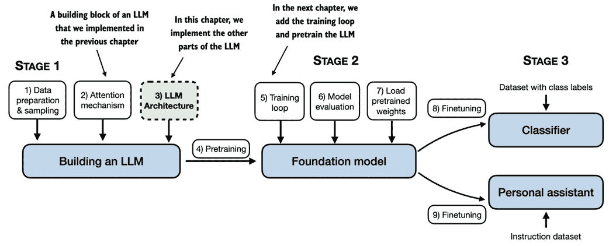
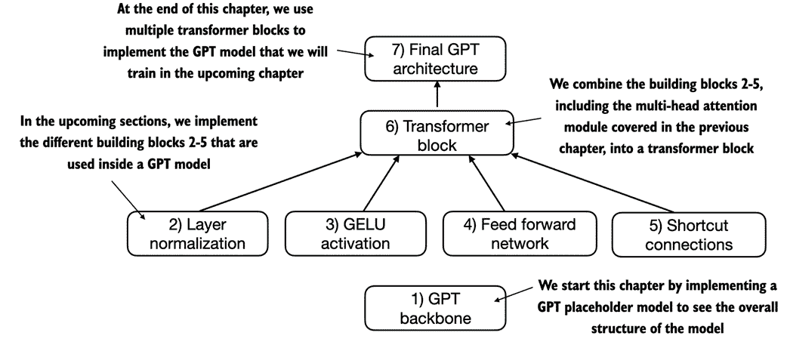
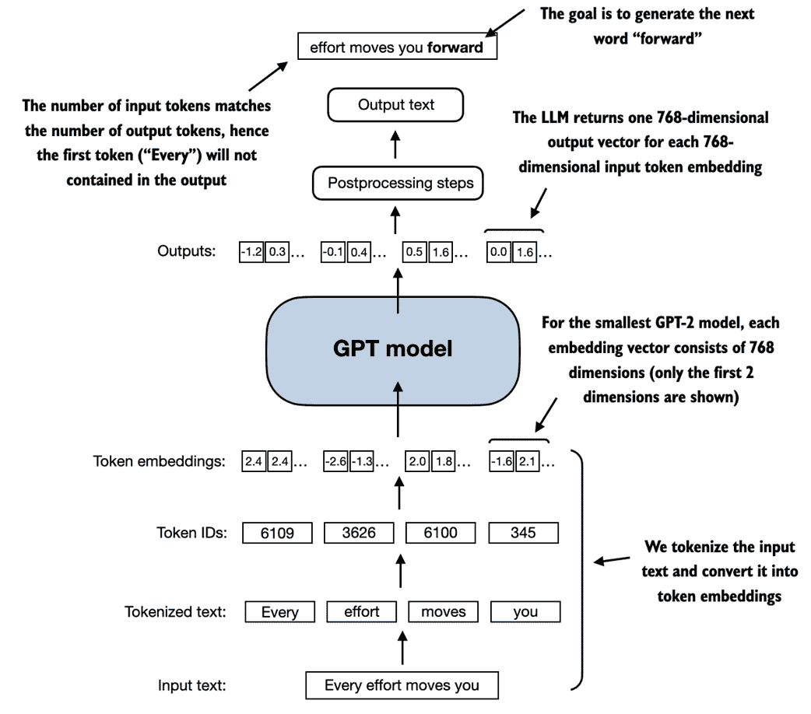
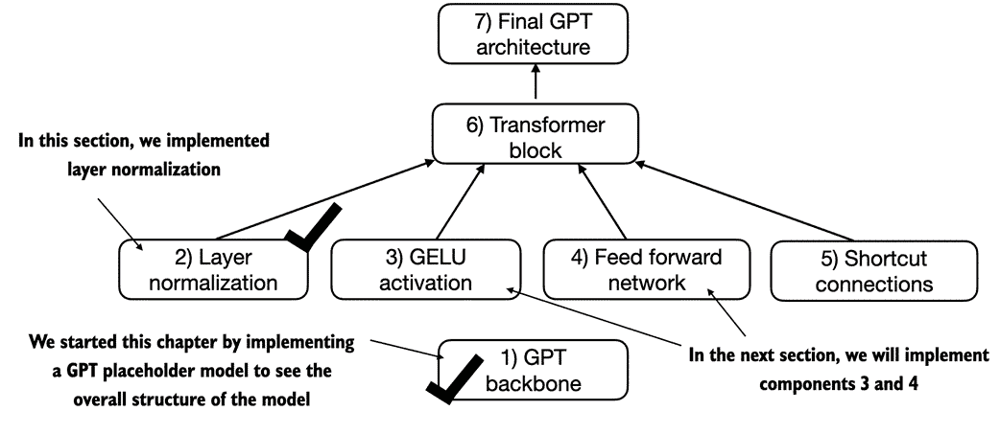
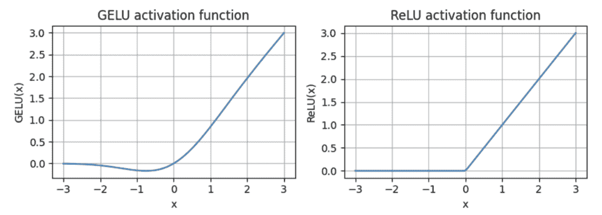
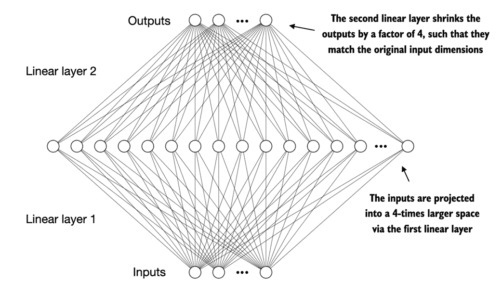
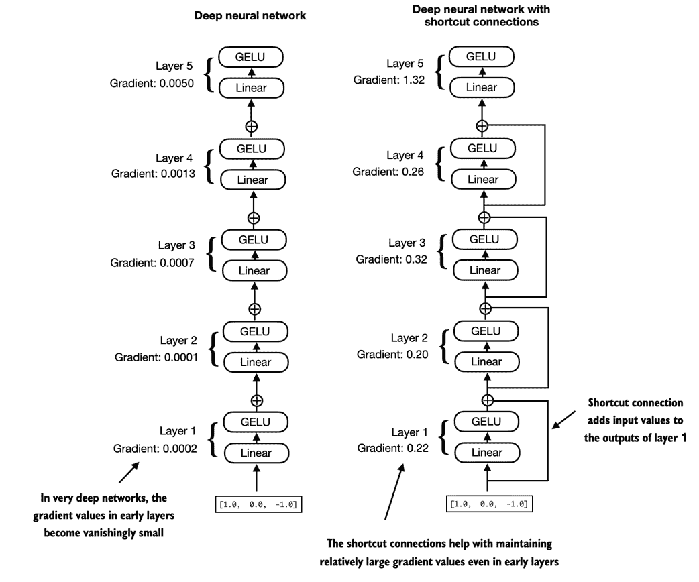
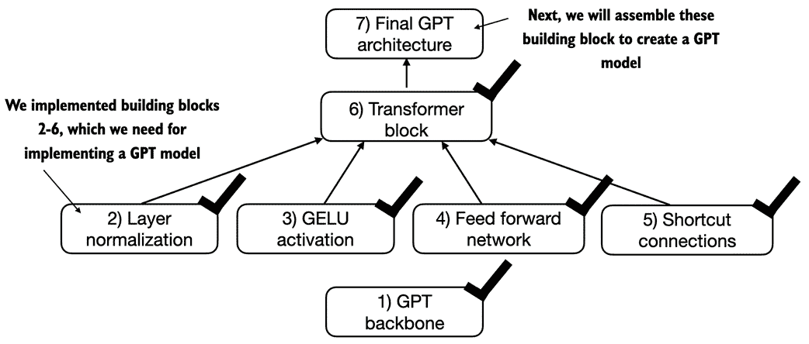
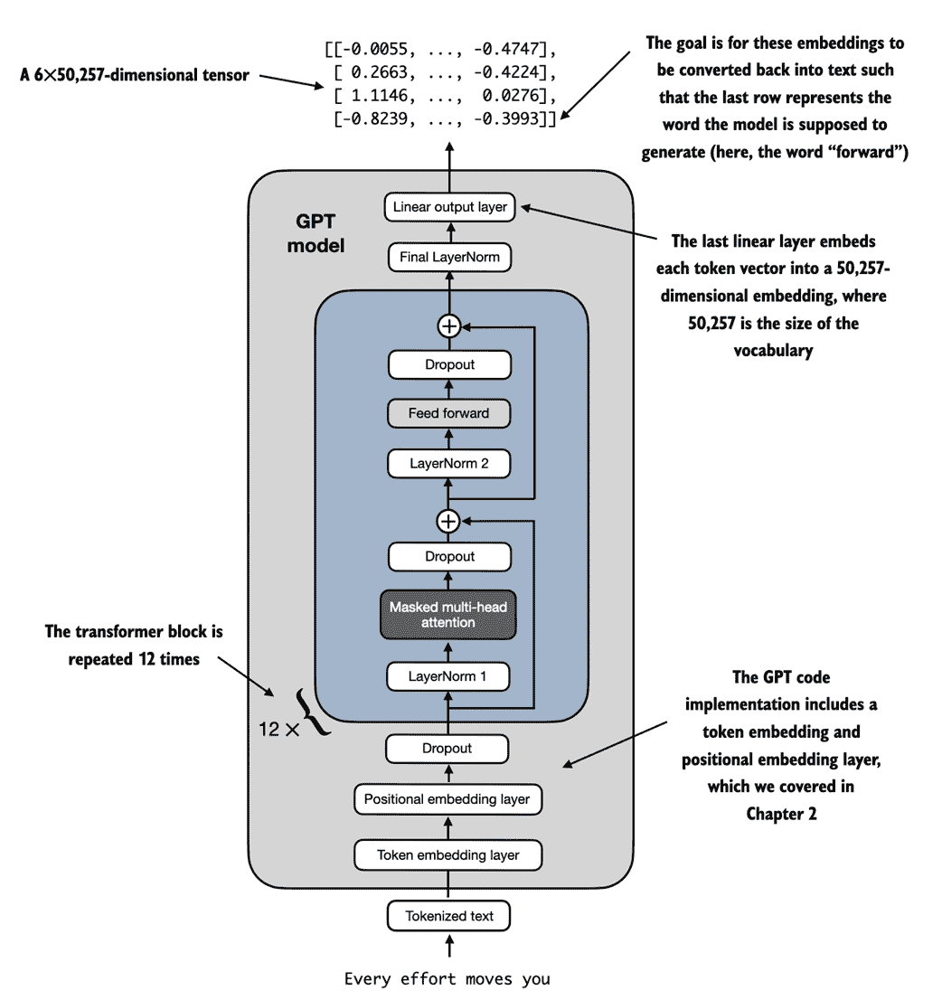
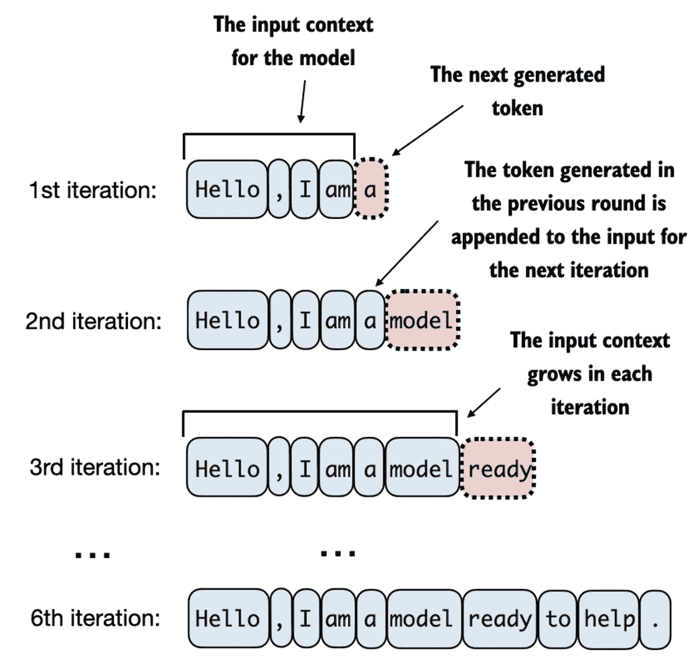

# 4 从头实现 GPT 模型以生成文本

### 本章涵盖

+   编码一个类似 GPT 的大型语言模型（LLM），可以训练生成类人文本

+   归一化层激活以稳定神经网络训练

+   在深度神经网络中添加快捷连接以更有效地训练模型

+   实现变压器模块以创建各种规模的 GPT 模型

+   计算 GPT 模型的参数数量和存储需求

在前一章中，你学习并编码了*多头注意力*机制，这是 LLM 的核心组件之一。在本章中，我们将编码 LLM 的其他构建块，并将它们组装成一个类似 GPT 的模型，我们将在下一章中训练以生成类人文本，如图 4.1 所示。

##### 图 4.1 编码 LLM 的三个主要阶段的心理模型，包括在通用文本数据集上进行预训练和在标记数据集上进行微调。本章重点实现 LLM 架构，我们将在下一章对其进行训练。



图 4.1 所提及的 LLM 架构由多个构建块组成，我们将在本章中实现这些构建块。我们将首先在下一节中从整体视角了解模型架构，然后更详细地讨论各个组件。

## 4.1 编码 LLM 架构

LLM，如 GPT（代表*生成预训练变压器*），是大型深度神经网络架构，旨在一次生成一个词（或标记）来生成新文本。然而，尽管其规模庞大，模型架构却没有你想象的那么复杂，因为它的许多组件是重复的，正如我们稍后将看到的。图 4.2 提供了类似 GPT 的 LLM 的顶视图，并突出显示其主要组件。

##### 图 4.2 GPT 模型的心理模型。在嵌入层旁边，它由一个或多个变压器模块组成，其中包含我们在前一章中实现的掩蔽多头注意力模块。


如图 4.2 所示，我们已经涵盖了多个方面，例如输入标记化和嵌入，以及我们在前一章实现的掩蔽多头注意力模块。本章将重点实现 GPT 模型的核心结构，包括其*变压器模块*，我们将在下一章中对其进行训练以生成类人文本。

在前几章中，为了简化，我们使用了较小的嵌入维度，以确保概念和示例能够舒适地适应在一页上。现在，在本章中，我们将规模扩大到小型 GPT-2 模型的大小，具体是具有 1.24 亿参数的最小版本，正如 Radford *等人* 的论文《语言模型是无监督多任务学习者》中所描述的。请注意，尽管原报告提到有 1.17 亿参数，但这一点后来得到了更正。

第六章将重点介绍如何将预训练权重加载到我们的实现中，并将其调整为更大的 GPT-2 模型，参数量分别为 345、762 和 1,542 百万。在深度学习和像 GPT 这样的 LLM 的背景下，“参数”一词指的是模型的可训练权重。这些权重本质上是模型的内部变量，在训练过程中进行调整和优化，以最小化特定的损失函数。这种优化使模型能够从训练数据中学习。

例如，在一个由 2,048x2,048 维矩阵（或张量）表示的神经网络层中，每个元素都是一个参数。由于有 2,048 行和 2,048 列，因此该层的参数总数为 2,048 乘以 2,048，等于 4,194,304 个参数。

##### GPT-2 与 GPT-3

请注意，我们专注于 GPT-2，因为 OpenAI 已公开提供预训练模型的权重，我们将在第六章将其加载到我们的实现中。GPT-3 在模型架构上基本相同，只是将 GPT-2 的参数量从 15 亿扩展到 1750 亿，并且在更多数据上进行了训练。到目前为止，GPT-3 的权重尚未公开可用。GPT-2 也是学习如何实现 LLM 的更好选择，因为它可以在单台笔记本电脑上运行，而 GPT-3 则需要一个 GPU 集群进行训练和推断。根据 Lambda Labs 的数据，使用单个 V100 数据中心 GPU 训练 GPT-3 需要 355 年，而使用消费者 RTX 8000 GPU 则需要 665 年。

我们通过以下 Python 字典指定小型 GPT-2 模型的配置，这将在后面的代码示例中使用：

```py
GPT_CONFIG_124M = {
    "vocab_size": 50257,  # Vocabulary size
    "context_length": 1024,      # Context length
    "emb_dim": 768,       # Embedding dimension
    "n_heads": 12,        # Number of attention heads
    "n_layers": 12,       # Number of layers
    "drop_rate": 0.1,     # Dropout rate
    "qkv_bias": False     # Query-Key-Value bias
}
```

在`GPT_CONFIG_124M`字典中，我们使用简洁的变量名以提高清晰度，并防止代码行过长：

+   `"vocab_size"`指的是一个包含 50,257 个单词的词汇表，使用的是第二章中的 BPE 分词器。

+   `"context_length"`表示模型可以处理的最大输入令牌数量，使用第二章讨论的位置信息嵌入。

+   `"emb_dim"`表示嵌入大小，将每个令牌转换为 768 维向量。

+   `"n_heads"`指的是多头注意力机制中的注意力头数量，如第三章中实现的那样。

+   `"n_layers"`指定模型中变换器块的数量，将在后续部分详细说明。

+   `"drop_rate"`表示丢弃机制的强度（0.1 表示隐藏单元的 10%丢弃），以防止过拟合，如第三章所述。

+   `"qkv_bias"`决定是否在多头注意力的`Linear`层中包含一个偏置向量，用于查询、键和值的计算。我们最初会禁用此选项，遵循现代 LLM 的规范，但在第六章加载 OpenAI 的预训练 GPT-2 权重时会重新考虑。

使用上述配置，我们将在本节中实现一个 GPT 占位符架构（`DummyGPTModel`），如图 4.3 所示。这将为我们提供一个整体视图，了解所有内容是如何组合在一起的，以及我们在接下来的章节中需要编码的其他组件，以组装完整的 GPT 模型架构。

##### 图 4.3 是一个心理模型，概述了我们编码 GPT 架构的顺序。在本章中，我们将从 GPT 骨架（一个占位符架构）开始，然后逐步到达各个核心部分，最终将它们组装成变换块，形成最终的 GPT 架构。



图 4.3 中显示的编号框展示了我们解决编码最终 GPT 架构所需的各个概念的顺序。我们将从步骤 1 开始，一个我们称之为`DummyGPTModel`的占位符 GPT 骨架：

##### 列表 4.1 一个占位符 GPT 模型架构类

```py
import torch
import torch.nn as nn

class DummyGPTModel(nn.Module):
    def __init__(self, cfg):
        super().__init__()
        self.tok_emb = nn.Embedding(cfg["vocab_size"], cfg["emb_dim"])
        self.pos_emb = nn.Embedding(cfg["context_length"], cfg["emb_dim"])
        self.drop_emb = nn.Dropout(cfg["drop_rate"])
        self.trf_blocks = nn.Sequential(
            *[DummyTransformerBlock(cfg) for _ in range(cfg["n_layers"])]) #A
        self.final_norm = DummyLayerNorm(cfg["emb_dim"]) #B
        self.out_head = nn.Linear(
            cfg["emb_dim"], cfg["vocab_size"], bias=False
        )

    def forward(self, in_idx):
        batch_size, seq_len = in_idx.shape
        tok_embeds = self.tok_emb(in_idx)
        pos_embeds = self.pos_emb(torch.arange(seq_len, device=in_idx.device))
        x = tok_embeds + pos_embeds
        x = self.drop_emb(x)
        x = self.trf_blocks(x)
        x = self.final_norm(x)
        logits = self.out_head(x)
        return logits

class DummyTransformerBlock(nn.Module): #C
    def __init__(self, cfg):
        super().__init__()

    def forward(self, x): #D
        return x

class DummyLayerNorm(nn.Module): #E
    def __init__(self, normalized_shape, eps=1e-5): #F
        super().__init__()

    def forward(self, x):
        return x
```

这段代码中的`DummyGPTModel`类定义了一个使用 PyTorch 神经网络模块（`nn.Module`）的简化版本的类 GPT 模型。`DummyGPTModel`类中的模型架构包括标记和位置嵌入、丢弃层、一系列变换块（`DummyTransformerBlock`）、最后的层归一化（`DummyLayerNorm`）和线性输出层（`out_head`）。配置通过 Python 字典传递，例如，我们之前创建的`GPT_CONFIG_124M`字典。

`forward`方法描述了数据在模型中的流动：它计算输入索引的标记和位置嵌入，应用丢弃层，通过变换块处理数据，应用归一化，最后通过线性输出层生成 logits。

上述代码已经可以正常运行，正如我们在本节后面将看到的那样，待我们准备输入数据后。不过，目前请注意，上面的代码中我们使用了占位符（`DummyLayerNorm`和`DummyTransformerBlock`）作为变换块和层归一化的代表，我们将在后面的章节中进行开发。

接下来，我们将准备输入数据并初始化一个新的 GPT 模型，以说明其用法。基于我们在第二章中看到的图示，我们对标记器进行了编码，图 4.4 提供了数据如何在 GPT 模型中流入和流出的高层概述。

##### 图 4.4 展示了一个全景概述，显示输入数据是如何被标记、嵌入并输入到 GPT 模型中的。请注意，在我们之前编写的`DummyGPTClass`中，标记嵌入是在 GPT 模型内部处理的。在大型语言模型（LLMs）中，嵌入输入的标记维度通常与输出维度相匹配。这里的输出嵌入表示我们在第三章讨论的上下文向量。



为了实现图 4.4 中所示的步骤，我们使用第二章中介绍的 tiktoken 标记器，对包含两个文本输入的批次进行标记，以供 GPT 模型使用：

```py
import tiktoken

tokenizer = tiktoken.get_encoding("gpt2")
batch = []
txt1 = "Every effort moves you"
txt2 = "Every day holds a"

batch.append(torch.tensor(tokenizer.encode(txt1)))
batch.append(torch.tensor(tokenizer.encode(txt2)))
batch = torch.stack(batch, dim=0)
print(batch)
```

两个文本的结果标记 ID 如下：

```py
tensor([[ 6109,  3626,  6100,   345], #A
        [ 6109,  1110,  6622,   257]])
```

接下来，我们初始化一个新的 124 百万参数的`DummyGPTModel`实例，并将其喂入标记化的`batch`：

```py
torch.manual_seed(123)
model = DummyGPTModel(GPT_CONFIG_124M)
logits = model(batch)
print("Output shape:", logits.shape)
print(logits)
```

模型输出通常称为 logits，具体如下：

```py
Output shape: torch.Size([2, 4, 50257])
tensor([[[-1.2034,  0.3201, -0.7130,  ..., -1.5548, -0.2390, -0.4667],
         [-0.1192,  0.4539, -0.4432,  ...,  0.2392,  1.3469,  1.2430],
         [ 0.5307,  1.6720, -0.4695,  ...,  1.1966,  0.0111,  0.5835],
         [ 0.0139,  1.6755, -0.3388,  ...,  1.1586, -0.0435, -1.0400]],

        [[-1.0908,  0.1798, -0.9484,  ..., -1.6047,  0.2439, -0.4530],
         [-0.7860,  0.5581, -0.0610,  ...,  0.4835, -0.0077,  1.6621],
         [ 0.3567,  1.2698, -0.6398,  ..., -0.0162, -0.1296,  0.3717],
         [-0.2407, -0.7349, -0.5102,  ...,  2.0057, -0.3694,  0.1814]]],
       grad_fn=<UnsafeViewBackward0>)
```

输出张量有两行，分别对应于两个文本样本。每个文本样本由 4 个标记组成；每个标记是一个 50,257 维的向量，大小与分词器的词汇表相匹配。

嵌入有 50,257 个维度，因为这些维度对应于词汇表中的唯一标记。在本章末尾，当我们实现后处理代码时，我们将把这些 50,257 维的向量转换回标记 ID，然后可以解码成单词。

现在我们已经对 GPT 架构及其输入输出进行了自上而下的了解，我们将在接下来的部分中编码各个占位符，从真正的层归一化类开始，该类将替换前面代码中的`DummyLayerNorm`。

## 4.2 使用层归一化归一化激活

训练具有多个层的深度神经网络有时会面临挑战，例如梯度消失或爆炸等问题。这些问题导致训练动态不稳定，使网络难以有效调整其权重，这意味着学习过程难以找到一组参数（权重），以最小化损失函数。换句话说，网络在学习数据中的潜在模式方面存在困难，无法达到能够做出准确预测或决策的程度。（如果你对神经网络训练和梯度的概念不熟悉，可以在*附录 A：PyTorch 简介*中的*第 A.4 节，自动微分简单易懂*找到这些概念的简要介绍。但是，要理解本书内容并不需要深厚的数学基础。）

在本节中，我们将实现*层归一化*以提高神经网络训练的稳定性和效率。

层归一化的主要思想是调整神经网络层的激活（输出），使其均值为 0，方差为 1，也称为单位方差。这种调整加快了有效权重的收敛，并确保了训练的一致性和可靠性。正如我们在前一节中看到的，基于`DummyLayerNorm`占位符，在 GPT-2 和现代变换器架构中，层归一化通常在多头注意模块之前和之后，以及在最终输出层之前应用。

在我们实现代码中的层归一化之前，图 4.5 提供了层归一化功能的视觉概述。

##### 图 4.5 层归一化的示意图，其中 5 层输出（也称为激活）被归一化，使其具有零均值和方差为 1。


我们可以通过以下代码重现图 4.5 中的示例，在这里我们实现一个具有 5 个输入和 6 个输出的神经网络层，应用于两个输入示例：

```py
torch.manual_seed(123)
batch_example = torch.randn(2, 5) #A
layer = nn.Sequential(nn.Linear(5, 6), nn.ReLU())
out = layer(batch_example)
print(out)
```

这将打印以下张量，其中第一行列出了第一个输入的层输出，第二行列出了第二个输入的层输出：

```py
tensor([[0.2260, 0.3470, 0.0000, 0.2216, 0.0000, 0.0000],
        [0.2133, 0.2394, 0.0000, 0.5198, 0.3297, 0.0000]],
       grad_fn=<ReluBackward0>)
```

我们编写的神经网络层由一个 `Linear` 层和一个非线性激活函数 `ReLU`（即修正线性单元）组成，后者是神经网络中的标准激活函数。如果你不熟悉 `ReLU`，它会将负输入阈值为 0，确保层只输出正值，这也解释了为什么结果层输出不包含任何负值。（请注意，我们将在 GPT 中使用另一种更复杂的激活函数，在下一节中介绍）。

在我们对这些输出应用层归一化之前，让我们先检查均值和方差：

```py
mean = out.mean(dim=-1, keepdim=True)
var = out.var(dim=-1, keepdim=True)
print("Mean:\n", mean)
print("Variance:\n", var)
```

输出如下：

```py
Mean:
  tensor([[0.1324],
          [0.2170]], grad_fn=<MeanBackward1>)
Variance:
  tensor([[0.0231],
          [0.0398]], grad_fn=<VarBackward0>)
```

上述均值张量中的第一行包含第一个输入行的均值，而第二输出行包含第二个输入行的均值。

在均值或方差计算等操作中使用 `keepdim=True` 可以确保输出张量与输入张量保持相同的形状，即使该操作沿着通过 `dim` 指定的维度减少了张量。例如，如果不使用 `keepdim=True`，返回的均值张量将是一个二维向量 `[0.1324, 0.2170]`，而不是一个 2×1 的矩阵 `[[0.1324], [0.2170]]`。

`dim` 参数指定了在张量中进行统计量（这里是均值或方差）计算的维度，如图 4.6 所示。

##### 图 4.6 说明了在计算张量均值时的 `dim` 参数示例。例如，如果我们有一个维度为 `[rows, columns]` 的二维张量（矩阵），使用 `dim=0` 将会在行上（如底部所示）进行操作，输出结果将汇总每列的数据。使用 `dim=1` 或 `dim=-1` 将会在列上（如顶部所示）进行操作，输出结果将汇总每行的数据。


正如图 4.6 所解释的，对于二维张量（如矩阵），在均值或方差计算等操作中使用 `dim=-1` 与使用 `dim=1` 是相同的。这是因为 -1 指的是张量的最后一个维度，在二维张量中对应于列。稍后，在将层归一化添加到生成对抗网络（GPT）模型时，该模型生成形状为 `[batch_size, num_tokens, embedding_size]` 的三维张量，我们仍然可以使用 `dim=-1` 进行最后维度的归一化，从而避免将 `dim=1` 改为 `dim=2`。

接下来，让我们对之前获得的层输出应用层归一化。该操作包括减去均值并除以方差的平方根（也称为标准差）：

```py
out_norm = (out - mean) / torch.sqrt(var)
mean = out_norm.mean(dim=-1, keepdim=True)
var = out_norm.var(dim=-1, keepdim=True)
print("Normalized layer outputs:\n", out_norm)
print("Mean:\n", mean)
print("Variance:\n", var)
```

根据结果，我们可以看到，归一化层的输出现在也包含负值，均值为零，方差为 1：

```py
Normalized layer outputs:
 tensor([[ 0.6159,  1.4126, -0.8719,  0.5872, -0.8719, -0.8719],
        [-0.0189,  0.1121, -1.0876,  1.5173,  0.5647, -1.0876]],
       grad_fn=<DivBackward0>)
Mean:
 tensor([[2.9802e-08],
        [3.9736e-08]], grad_fn=<MeanBackward1>)
Variance:
 tensor([[1.],
        [1.]], grad_fn=<VarBackward0>)
```

请注意，输出张量中的值 2.9802e-08 是 2.9802 × 10^-8 的科学计数法，十进制形式为 0.0000000298。这个值非常接近 0，但由于计算机表示数字的有限精度，可能会由于小的数值误差而不完全等于 0。

为了提高可读性，我们还可以通过将 `sci_mode` 设置为 False 来关闭打印张量值时的科学计数法：

```py
torch.set_printoptions(sci_mode=False)
print("Mean:\n", mean)
print("Variance:\n", var)
Mean:
 tensor([[    0.0000],
        [    0.0000]], grad_fn=<MeanBackward1>)
Variance:
 tensor([[1.],
        [1.]], grad_fn=<VarBackward0>)
```

到目前为止，在这一节中，我们已经逐步编码并应用了层归一化。现在让我们将这个过程封装到一个 PyTorch 模块中，以便稍后在 GPT 模型中使用：

##### 列表 4.2 一个层归一化类

```py
class LayerNorm(nn.Module):
    def __init__(self, emb_dim):
        super().__init__()
        self.eps = 1e-5
        self.scale = nn.Parameter(torch.ones(emb_dim))
        self.shift = nn.Parameter(torch.zeros(emb_dim))

    def forward(self, x):
        mean = x.mean(dim=-1, keepdim=True)
        var = x.var(dim=-1, keepdim=True, unbiased=False)
        norm_x = (x - mean) / torch.sqrt(var + self.eps)
        return self.scale * norm_x + self.shift
```

该层归一化的具体实现作用于输入张量 x 的最后一个维度，代表嵌入维度（`emb_dim`）。变量 `eps` 是一个小常数（epsilon），在归一化过程中加到方差上以防止除以零。`scale` 和 `shift` 是两个可训练参数（与输入维度相同），如果发现这样做可以提高模型在训练任务上的表现，LLM 会在训练过程中自动调整它们。这使得模型能够学习最佳适合其处理数据的适当缩放和偏移。

##### 偏差方差

在我们的方差计算方法中，我们选择了通过将 `unbiased=False` 来实现细节。对于那些好奇这意味着什么的人，在方差计算中，我们在方差公式中用输入的数量 *n* 来除。这种方法不适用贝塞尔修正，贝塞尔修正通常在分母中使用 *n-1* 以调整样本方差估计的偏差。这一决定导致方差的所谓偏差估计。对于大型语言模型（LLMs），在嵌入维度 n 非常大的情况下，使用 n 和 n-1 之间的差异在实践中几乎可以忽略不计。我们选择这种方法以确保与 GPT-2 模型的归一化层兼容，并且因为它反映了用于实现原始 GPT-2 模型的 TensorFlow 的默认行为。使用类似的设置确保我们的方法与我们将在第六章中加载的预训练权重兼容。

现在让我们在实践中尝试 `LayerNorm` 模块，并将其应用于批量输入：

```py
ln = LayerNorm(emb_dim=5)
out_ln = ln(batch_example)
mean = out_ln.mean(dim=-1, keepdim=True)
var = out_ln.var(dim=-1, unbiased=False, keepdim=True)
print("Mean:\n", mean)
print("Variance:\n", var)
```

根据结果，我们可以看到，层归一化代码按预期工作，并对两个输入的值进行归一化，使它们的均值为 0，方差为 1：

```py
Mean:
 tensor([[    -0.0000],
        [     0.0000]], grad_fn=<MeanBackward1>)
Variance:
 tensor([[1.0000],
        [1.0000]], grad_fn=<VarBackward0>)
```

在本节中，我们介绍了实现 GPT 架构所需的一个构建模块，如图 4.7 中的心理模型所示。

##### 图 4.7 一个心理模型列出了我们在本章中实现的不同构建模块，以组装 GPT 架构。



在下一节中，我们将探讨 GELU 激活函数，这是 LLM 中使用的激活函数之一，而不是我们在本节中使用的传统 ReLU 函数。

##### 层归一化与批归一化

如果你熟悉批归一化，这是神经网络中一种常见的传统归一化方法，你可能会想知道它与层归一化的比较。与跨批次维度进行归一化的批归一化不同，层归一化是跨特征维度进行归一化。LLM 通常需要大量计算资源，可用的硬件或具体的使用案例可能会决定训练或推理期间的批量大小。由于层归一化对每个输入的归一化与批量大小无关，因此在这些场景中提供了更大的灵活性和稳定性。这对分布式训练或在资源受限的环境中部署模型特别有利。

## 4.3 实现具有 GELU 激活的前馈网络

在本节中，我们实现一个小型神经网络子模块，该模块作为 LLM 中变压器块的一部分。我们首先实现 *GELU* 激活函数，它在这个神经网络子模块中起着至关重要的作用。（有关在 PyTorch 中实现神经网络的更多信息，请参见附录 A 中的 A.5 实现多层神经网络部分。）

从历史上看，ReLU 激活函数由于其简单性和在各种神经网络架构中的有效性而被广泛使用。然而，在 LLM 中，除了传统的 ReLU 之外，还采用了其他几种激活函数。两个显著的例子是 GELU（*高斯误差线性单元*）和 SwiGLU（*Sigmoid 加权线性单元*）。

GELU 和 SwiGLU 是更复杂且光滑的激活函数，分别融合了高斯和 sigmoid 门控线性单元。与更简单的 ReLU 相比，它们为深度学习模型提供了更好的性能。

GELU 激活函数可以以多种方式实现；确切的版本定义为 GELU(x)=x Φ(x)，其中 Φ(x) 是标准高斯分布的累积分布函数。然而在实际中，通常实现一个计算上更便宜的近似值（原始的 GPT-2 模型也是使用这个近似值进行训练的）：

GELU(x) ≈ 0.5 ⋅ x ⋅ (1 + tanh[√((2/π)) ⋅ (x + 0.044715 ⋅ x³])

在代码中，我们可以将此函数作为 PyTorch 模块实现如下：

##### 列表 4.3 GELU 激活函数的实现

```py
class GELU(nn.Module):
    def __init__(self):
        super().__init__()

    def forward(self, x):
        return 0.5 * x * (1 + torch.tanh(
            torch.sqrt(torch.tensor(2.0 / torch.pi)) * 
            (x + 0.044715 * torch.pow(x, 3))
        ))
```

接下来，为了了解这个 GELU 函数的样子以及它与 ReLU 函数的比较，我们将这些函数并排绘制：

```py
import matplotlib.pyplot as plt
gelu, relu = GELU(), nn.ReLU()

x = torch.linspace(-3, 3, 100) #A
y_gelu, y_relu = gelu(x), relu(x)
plt.figure(figsize=(8, 3))
for i, (y, label) in enumerate(zip([y_gelu, y_relu], ["GELU", "ReLU"]), 1):
    plt.subplot(1, 2, i)
    plt.plot(x, y)
    plt.title(f"{label} activation function")
    plt.xlabel("x")
    plt.ylabel(f"{label}(x)")
    plt.grid(True)
plt.tight_layout()
plt.show()
```

从图 4.8 中的结果图中可以看出，ReLU 是一个分段线性函数，当输入为正时直接输出输入；否则输出零。GELU 是一个平滑的非线性函数，它近似于 ReLU，但对负值具有非零梯度。

##### 图 4.8 使用 matplotlib 绘制的 GELU 和 ReLU 图的输出。x 轴显示函数输入，y 轴显示函数输出。



如图 4.8 所示，GELU 的平滑性在训练过程中可以带来更好的优化特性，因为它允许对模型参数进行更细致的调整。相比之下，ReLU 在零处有一个尖锐的拐角，这有时会使优化变得更加困难，特别是在非常深或复杂架构的网络中。此外，与 ReLU 在任何负输入时输出零不同，GELU 允许负值有一个小的非零输出。这一特性意味着，在训练过程中，接收到负输入的神经元仍然可以为学习过程作出贡献，尽管贡献程度低于正输入。

接下来，让我们使用 GELU 函数来实现我们将在 LLM 的变换器模块中使用的小型神经网络模块`FeedForward`：

##### 列表 4.4 一个前馈神经网络模块

```py
class FeedForward(nn.Module):
    def __init__(self, cfg):
        super().__init__()
        self.layers = nn.Sequential(
            nn.Linear(cfg["emb_dim"], 4 * cfg["emb_dim"]),
            GELU(),
            nn.Linear(4 * cfg["emb_dim"], cfg["emb_dim"]),
        )

    def forward(self, x):
        return self.layers(x)
```

正如前面的代码所示，`FeedForward`模块是一个由两个`Linear`层和一个`GELU`激活函数组成的小型神经网络。在 124 百万参数的 GPT 模型中，它通过`GPT_CONFIG_124M`字典接收嵌入大小为 768 的令牌输入批次，其中`GPT_CONFIG_124M["emb_dim"] = 768`。

图 4.9 展示了在传入一些输入时，嵌入大小是如何在这个小型前馈神经网络中被操作的。

##### 图 4.9 提供了前馈神经网络层之间连接的视觉概览。值得注意的是，这个神经网络可以容纳可变的批次大小和输入中的令牌数量。然而，每个令牌的嵌入大小在初始化权重时是确定并固定的。


根据图 4.9 中的示例，让我们初始化一个新的`FeedForward`模块，令令牌嵌入大小为 768，并输入一个包含 2 个样本和每个样本 3 个令牌的批次：

```py
ffn = FeedForward(GPT_CONFIG_124M)
x = torch.rand(2, 3, 768) #A 
out = ffn(x)
print(out.shape)
```

正如我们所见，输出张量的形状与输入张量的形状相同：

```py
torch.Size([2, 3, 768])
```

我们在这一部分实现的`FeedForward`模块在增强模型从数据中学习和概括能力方面发挥了关键作用。尽管该模块的输入和输出维度相同，但它通过第一层线性层内部将嵌入维度扩展到更高维空间，如图 4.10 所示。这一扩展之后是非线性 GELU 激活，然后通过第二次线性变换收缩回原始维度。这种设计允许探索更丰富的表示空间。

##### 图 4.10 是前馈神经网络中层输出的扩展和收缩示意图。首先，输入从 768 扩展到 3072 值，然后第二层将 3072 值压缩回 768 维表示。



此外，输入和输出维度的一致性简化了架构，使我们能够堆叠多个层，而无需在它们之间调整维度，从而使模型更具可扩展性。

如图 4.11 所示，我们现在已实现了大部分 LLM 的构建块。

##### 图 4.11 显示了我们在本章中涵盖的主题的心理模型，黑色勾选标记表示我们已经覆盖的内容。


在下一节中，我们将深入探讨我们在神经网络的不同层之间插入的**快捷连接**概念，这对提高深度神经网络架构的训练性能至关重要。

## 4.4 添加快捷连接

接下来，让我们讨论*快捷连接*的概念，也称为跳过连接或残差连接。最初，快捷连接是为计算机视觉中的深度网络（特别是残差网络）提出的，以缓解消失梯度的问题。消失梯度问题是指梯度（指导训练期间权重更新的量）在反向传播时逐渐变小，导致较早层的有效训练变得困难，如图 4.12 所示。

##### 图 4.12 显示了一个包含 5 层的深度神经网络的比较，左侧是没有（左边）快捷连接，右侧是有快捷连接。快捷连接涉及将层的输入添加到其输出中，实际上创建了一条绕过某些层的替代路径。图 1.1 中所示的梯度表示每层的平均绝对梯度，我们将在随后的代码示例中计算。



如图 4.12 所示，快捷连接通过跳过一个或多个层为梯度提供了一个替代的、更短的流动路径，这通过将一层的输出添加到后续层的输出来实现。这就是这些连接也被称为跳过连接的原因。它们在训练中的反向传播中保持梯度流动起着至关重要的作用。

在下面的代码示例中，我们实现了图 4.12 中显示的神经网络，以查看如何在`forward`方法中添加快捷连接：

##### 清单 4.5 一个神经网络以说明快捷连接

```py
class ExampleDeepNeuralNetwork(nn.Module):
    def __init__(self, layer_sizes, use_shortcut):
        super().__init__()
        self.use_shortcut = use_shortcut
        self.layers = nn.ModuleList([
            # Implement 5 layers
            nn.Sequential(nn.Linear(layer_sizes[0], layer_sizes[1]), GELU()),
            nn.Sequential(nn.Linear(layer_sizes[1], layer_sizes[2]), GELU()),
            nn.Sequential(nn.Linear(layer_sizes[2], layer_sizes[3]), GELU()),
            nn.Sequential(nn.Linear(layer_sizes[3], layer_sizes[4]), GELU()),
            nn.Sequential(nn.Linear(layer_sizes[4], layer_sizes[5]), GELU())
        ])

    def forward(self, x):
        for layer in self.layers:
            # Compute the output of the current layer
            layer_output = layer(x)
            # Check if shortcut can be applied
            if self.use_shortcut and x.shape == layer_output.shape:
                x = x + layer_output
            else:
                x = layer_output
        return x
```

该代码实现了一个具有 5 层的深度神经网络，每层由一个`Linear`层和一个`GELU`激活函数组成。在前向传递中，我们迭代地将输入通过各层传递，如果`self.use_shortcut`属性设置为`True`，则可选择添加图 4.12 所示的跳跃连接。

让我们使用这段代码首先初始化一个没有跳跃连接的神经网络。在这里，每一层将被初始化为接受具有 3 个输入值的示例，并返回 3 个输出值。最后一层返回一个单一的输出值：

```py
layer_sizes = [3, 3, 3, 3, 3, 1]  
sample_input = torch.tensor([[1., 0., -1.]])
torch.manual_seed(123) # specify random seed for the initial weights for reproducibility
model_without_shortcut = ExampleDeepNeuralNetwork(
    layer_sizes, use_shortcut=False
)
```

接下来，我们实现一个函数来计算模型的反向传播中的梯度：

```py
def print_gradients(model, x):
    # Forward pass
    output = model(x)
    target = torch.tensor([[0.]])

    # Calculate loss based on how close the target
    # and output are
    loss = nn.MSELoss()
    loss = loss(output, target)

    # Backward pass to calculate the gradients
    loss.backward()

    for name, param in model.named_parameters():
        if 'weight' in name:
            # Print the mean absolute gradient of the weights
            print(f"{name} has gradient mean of {param.grad.abs().mean().item()}")
```

在前面的代码中，我们指定了一个损失函数，用于计算模型输出与用户指定目标（这里为了简单起见，目标值为 0）之间的接近程度。然后，当调用`loss.backward()`时，PyTorch 会计算模型中每一层的损失梯度。我们可以通过`model.named_parameters()`遍历权重参数。假设我们有一个 3×3 的权重参数矩阵，对于给定的层，这一层将具有 3×3 的梯度值，我们打印这 3×3 梯度值的平均绝对梯度，以便为每一层获得一个单一的梯度值，从而更容易比较各层之间的梯度。

简而言之，`.backward()`方法是 PyTorch 中的一个方便方法，用于计算在模型训练过程中所需的损失梯度，而不需要我们自己实现梯度计算的数学公式，从而使得处理深度神经网络变得更加容易。如果你对梯度和神经网络训练的概念不熟悉，建议阅读*附录 A*中的*A.4，自动微分简化*和*A.7，典型训练循环*部分。

现在让我们使用`print_gradients`函数并将其应用于没有跳跃连接的模型：

```py
print_gradients(model_without_shortcut, sample_input)
```

输出如下：

```py
layers.0.0.weight has gradient mean of 0.00020173587836325169
layers.1.0.weight has gradient mean of 0.0001201116101583466
layers.2.0.weight has gradient mean of 0.0007152041653171182
layers.3.0.weight has gradient mean of 0.001398873864673078
layers.4.0.weight has gradient mean of 0.005049646366387606
```

正如我们从`print_gradients`函数的输出中看到的，随着我们从最后一层（`layers.4`）向第一层（`layers.0`）推进，梯度变得越来越小，这种现象被称为消失梯度问题。

现在让我们实例化一个带有跳跃连接的模型，看看它的表现如何：

```py
torch.manual_seed(123)
model_with_shortcut = ExampleDeepNeuralNetwork(
    layer_sizes, use_shortcut=True
)
print_gradients(model_with_shortcut, sample_input)
```

输出如下：

```py
layers.0.0.weight has gradient mean of 0.22169792652130127
layers.1.0.weight has gradient mean of 0.20694105327129364
layers.2.0.weight has gradient mean of 0.32896995544433594
layers.3.0.weight has gradient mean of 0.2665732502937317
layers.4.0.weight has gradient mean of 1.3258541822433472
```

正如我们所见，根据输出，最后一层（`layers.4`）的梯度仍然大于其他层。然而，随着我们向第一层（`layers.0`）推进，梯度值趋于稳定，并不会缩小到消失的极小值。

总之，跳跃连接对于克服深度神经网络中的消失梯度问题的限制非常重要。跳跃连接是非常大型模型（例如 LLMs）的核心构建块，它们将有助于在下一个章节中训练 GPT 模型时确保各层之间的梯度流动一致，从而促进更有效的训练。

在引入快捷连接后，我们将在下一节中将之前讨论的所有概念（层归一化、GELU 激活、前馈模块和快捷连接）连接起来，这也是我们编写 GPT 架构所需的最终构建块。

## 4.5 在 transformer block 中连接注意力层和线性层

在这一节中，我们将实现 *transformer block*，这是 GPT 和其他 LLM 架构的基本构建块。这个块在参数为 1.24 亿的 GPT-2 架构中重复了十几次，结合了我们之前讨论的几个概念：多头注意力、层归一化、丢弃法、前馈层和 GELU 激活，如图 4.13 所示。在下一节中，我们将把这个 transformer block 连接到 GPT 架构的其余部分。

##### 图 4.13 transformer block 的示意图。图的底部显示已嵌入到 768 维向量中的输入标记。每一行对应一个标记的向量表示。transformer block 的输出是与输入相同维度的向量，这些向量可以进一步输入到 LLM 的后续层中。


如图 4.13 所示，transformer block 结合了多个组件，包括第三章中的遮蔽多头注意力模块和我们在第 4.3 节实现的 `FeedForward` 模块。

当 transformer block 处理输入序列时，序列中的每个元素（例如，一个单词或子词标记）都由一个固定大小的向量表示（在图 4.13 中为 768 维）。transformer block 内的操作，包括多头注意力和前馈层，旨在以保留其维度的方式转换这些向量。

其思想是，多头注意力模块中的自注意力机制识别并分析输入序列中元素之间的关系。相比之下，前馈网络在每个位置上单独修改数据。这种组合不仅使输入的理解和处理更加细致，也增强了模型处理复杂数据模式的整体能力。

在代码中，我们可以如下创建 `TransformerBlock`：

##### 列表 4.6 GPT 的 transformer block 组件

```py
from previous_chapters import MultiHeadAttention

class TransformerBlock(nn.Module):
    def __init__(self, cfg):
        super().__init__()
        self.att = MultiHeadAttention(
            d_in=cfg["emb_dim"],
            d_out=cfg["emb_dim"],
            block_size=cfg["context_length"],
            num_heads=cfg["n_heads"], 
            dropout=cfg["drop_rate"],
            qkv_bias=cfg["qkv_bias"])
        self.ff = FeedForward(cfg)
        self.norm1 = LayerNorm(cfg["emb_dim"])
        self.norm2 = LayerNorm(cfg["emb_dim"])
        self.drop_resid = nn.Dropout(cfg["drop_rate"])

    def forward(self, x):
        #A
        shortcut = x
        x = self.norm1(x)
        x = self.att(x)
        x = self.drop_resid(x)
        x = x + shortcut  # Add the original input back

        shortcut = x #B
        x = self.norm2(x)
        x = self.ff(x)
        x = self.drop_resid(x)
        x = x + shortcut  #C 
        return x
```

给定的代码在 PyTorch 中定义了一个 `TransformerBlock` 类，其中包含一个多头注意力机制（`MultiHeadAttention`）和一个前馈网络（`FeedForward`），两者均基于提供的配置字典（`cfg`）进行配置，例如 `GPT_CONFIG_124M`。

在这两个组件之前应用层归一化（`LayerNorm`），并在它们之后应用 dropout，以对模型进行正则化并防止过拟合。这也被称为 *Pre-LayerNorm*。较旧的架构，如原始的变换器模型，通常在自注意力和前馈网络之后应用层归一化，称为 *Post-LayerNorm*，这往往导致更糟糕的训练动态。

该类还实现了前向传播，其中每个组件后面都有一个快捷连接，将模块的输入添加到其输出中。这个关键特性帮助梯度在训练过程中通过网络流动，并改善深度模型的学习，如第 4.4 节所述。

使用我们之前定义的 `GPT_CONFIG_124M` 字典，让我们实例化一个变换器模块并输入一些样本数据：

```py
torch.manual_seed(123)
x = torch.rand(2, 4, 768)  #A
block = TransformerBlock(GPT_CONFIG_124M)
output = block(x)

print("Input shape:", x.shape)
print("Output shape:", output.shape)
```

输出如下：

```py
Input shape: torch.Size([2, 4, 768])
Output shape: torch.Size([2, 4, 768])
```

从代码输出中可以看出，变换器模块在其输出中保持输入维度，表明变换器架构处理数据序列时不会改变其形状。

在变换器模块架构中保持形状不变并不是偶然，而是其设计的一个重要方面。这个设计使其能够有效地应用于各种序列到序列任务，其中每个输出向量直接对应于一个输入向量，保持一一对应的关系。然而，输出是一个上下文向量，封装了整个输入序列的信息，正如我们在第三章中学到的。这意味着，虽然序列的物理维度（长度和特征大小）在通过变换器模块时保持不变，但每个输出向量的内容被重新编码，以整合来自整个输入序列的上下文信息。

在本节实现的变换器模块中，我们现在拥有了实现 GPT 架构所需的所有构建块，如图 4.14 所示。

##### 图 4.14 是我们迄今在本章中实现的不同概念的心理模型。



如图 4.14 所示，变换器模块结合了层归一化、前馈网络（包括 GELU 激活函数）以及之前在本章中介绍的快捷连接。正如我们将在接下来的章节中看到的，这个变换器模块将构成我们将要实现的 GPT 架构的主要组件。

## 4.6 编码 GPT 模型

本章开始时，我们对一个称为 `DummyGPTModel` 的 GPT 架构进行了概述。在这个 `DummyGPTModel` 代码实现中，我们展示了输入和输出到 GPT 模型，但其构建块仍然是一个黑箱，使用 `DummyTransformerBlock` 和 `DummyLayerNorm` 类作为占位符。

在本节中，我们现在用本章稍后编码的真实 `TransformerBlock` 和 `LayerNorm` 类替换 `DummyTransformerBlock` 和 `DummyLayerNorm` 占位符，以组装出原始 1.24 亿参数版本的 GPT-2 的完整工作版本。在第五章中，我们将对 GPT-2 模型进行预训练，而在第六章中，我们将加载来自 OpenAI 的预训练权重。

在我们用代码组装 GPT-2 模型之前，让我们看看图 4.15 中的整体结构，它结合了本章迄今为止涵盖的所有概念。

##### 图 4.15 GPT 模型架构的概述。该图说明了数据在 GPT 模型中的流动。从底部开始，标记化文本首先转换为标记嵌入，然后与位置嵌入结合。这些结合的信息形成一个张量，通过中心显示的一系列变换器块（每个块包含多头注意力和具有 dropout 和层归一化的前馈神经网络层）传递，这些块相互堆叠并重复 12 次。



如图 4.15 所示，我们在第 4.5 节中编码的变换器块在 GPT 模型架构中重复多次。在 1.24 亿参数的 GPT-2 模型中，它重复 12 次，我们通过 `GPT_CONFIG_124M` 字典中的 `"n_layers"` 条目指定。在参数数量达到 1,542 亿的最大 GPT-2 模型中，这个变换器块重复了 36 次。

如图 4.15 所示，最终变换器块的输出经过最后一个层归一化步骤后，才到达线性输出层。该层将变换器的输出映射到高维空间（在本例中为 50,257 维，对应于模型的词汇大小），以预测序列中的下一个标记。

现在让我们在代码中实现图 4.15 中看到的架构：

##### 列表 4.7 GPT 模型架构实现

```py
class GPTModel(nn.Module):
    def __init__(self, cfg):
        super().__init__()
        self.tok_emb = nn.Embedding(cfg["vocab_size"], cfg["emb_dim"])
        self.pos_emb = nn.Embedding(cfg["context_length"], cfg["emb_dim"])
        self.drop_emb = nn.Dropout(cfg["drop_rate"])

        self.trf_blocks = nn.Sequential(
            *[TransformerBlock(cfg) for _ in range(cfg["n_layers"])])

        self.final_norm = LayerNorm(cfg["emb_dim"])
        self.out_head = nn.Linear(
            cfg["emb_dim"], cfg["vocab_size"], bias=False
        )

    def forward(self, in_idx):
        batch_size, seq_len = in_idx.shape
        tok_embeds = self.tok_emb(in_idx)
        #A
        pos_embeds = self.pos_emb(torch.arange(seq_len, device=in_idx.device))
        x = tok_embeds + pos_embeds
        x = self.drop_emb(x)
        x = self.trf_blocks(x)
        x = self.final_norm(x)
        logits = self.out_head(x)
        return logits
```

多亏了我们在第 4.5 节中实现的 `TransformerBlock` 类，`GPTModel` 类相对较小且紧凑。

此 `GPTModel` 类的 `__init__` 构造函数使用通过 Python 字典 `cfg` 传入的配置初始化标记和位置嵌入层。这些嵌入层负责将输入标记索引转换为稠密向量，并添加位置信息，如第二章所讨论的。

接下来，`__init__` 方法创建一个与 `cfg` 中指定的层数相等的 `TransformerBlock` 模块的顺序堆栈。在变换器块之后，应用 `LayerNorm` 层，对变换器块的输出进行标准化，以稳定学习过程。最后，定义一个没有偏差的线性输出头，将变换器的输出投影到标记器的词汇空间，以为词汇中的每个标记生成 logits。

前向方法接收一批输入令牌索引，计算它们的嵌入，应用位置嵌入，将序列通过变换器块传递，标准化最终输出，然后计算对数值，表示下一个令牌的未归一化概率。我们将在下一部分将这些对数值转换为令牌和文本输出。

现在，让我们使用我们传入 cfg 参数的`GPT_CONFIG_124M`字典初始化 1.24 亿参数的 GPT 模型，并用本章开头创建的批量文本输入进行填充：

```py
torch.manual_seed(123)
model = GPTModel(GPT_CONFIG_124M)

out = model(batch)
print("Input batch:\n", batch)
print("\nOutput shape:", out.shape)
print(out)
```

前面的代码打印了输入批次的内容，后面是输出张量：

```py
Input batch:
 tensor([[ 6109,  3626,  6100,   345], # token IDs of text 1
         [ 6109,  1110,  6622,   257]]) # token IDs of text 2

Output shape: torch.Size([2, 4, 50257])
tensor([[[ 0.3613,  0.4222, -0.0711,  ...,  0.3483,  0.4661, -0.2838],
         [-0.1792, -0.5660, -0.9485,  ...,  0.0477,  0.5181, -0.3168],
         [ 0.7120,  0.0332,  0.1085,  ...,  0.1018, -0.4327, -0.2553],
         [-1.0076,  0.3418, -0.1190,  ...,  0.7195,  0.4023,  0.0532]],

        [[-0.2564,  0.0900,  0.0335,  ...,  0.2659,  0.4454, -0.6806],
         [ 0.1230,  0.3653, -0.2074,  ...,  0.7705,  0.2710,  0.2246],
         [ 1.0558,  1.0318, -0.2800,  ...,  0.6936,  0.3205, -0.3178],
         [-0.1565,  0.3926,  0.3288,  ...,  1.2630, -0.1858,  0.0388]]],
       grad_fn=<UnsafeViewBackward0>)
```

正如我们所见，输出张量的形状为`[2, 4, 50257]`，因为我们传入了 2 个输入文本，每个文本包含 4 个令牌。最后一个维度 50,257 对应于标记器的词汇大小。在下一部分中，我们将看到如何将这 50,257 维的输出向量转换回令牌。

在我们进入下一部分并编写将模型输出转换为文本的函数之前，让我们花点时间来分析模型架构本身及其大小。

使用`numel()`方法，即“元素数量”的缩写，我们可以收集模型参数张量中的总参数数量：

```py
total_params = sum(p.numel() for p in model.parameters())
print(f"Total number of parameters: {total_params:,}")
```

结果如下：

```py
Total number of parameters: 163,009,536
```

现在，好奇的读者可能会注意到一个差异。我们之前提到初始化一个包含 1.24 亿参数的 GPT 模型，那么为什么实际的参数数量是 1.63 亿，如前面的代码输出所示？

这是因为在原始 GPT-2 架构中使用了一个叫做权重绑定的概念，这意味着原始 GPT-2 架构在其输出层中重用了令牌嵌入层的权重。为了理解这意味着什么，让我们看看之前通过`GPTModel`在`model`上初始化的令牌嵌入层和线性输出层的形状：

```py
print("Token embedding layer shape:", model.tok_emb.weight.shape)
print("Output layer shape:", model.out_head.weight.shape)
```

正如我们根据打印输出所看到的，这两层的权重张量具有相同的形状：

```py
Token embedding layer shape: torch.Size([50257, 768])
Output layer shape: torch.Size([50257, 768])
```

由于标记器词汇中 50,257 行的数量，令牌嵌入和输出层非常大。让我们根据权重绑定从总的 GPT-2 模型计数中去除输出层参数计数：

```py
total_params_gpt2 =  total_params - sum(p.numel() for p in model.out_head.parameters())
print(f"Number of trainable parameters considering weight tying: {total_params_gpt2:,}")
```

输出如下：

```py
Number of trainable parameters considering weight tying: 124,412,160
```

正如我们所见，该模型现在只有 1.24 亿个参数，匹配原始 GPT-2 模型的大小。

权重绑定减少了模型的整体内存占用和计算复杂度。然而，根据我的经验，使用单独的令牌嵌入层和输出层可以获得更好的训练和模型性能；因此，我们在`GPTModel`实现中使用单独的层。现代大型语言模型也是如此。然而，我们将在第六章中重新审视并实现权重绑定的概念，当时我们将从 OpenAI 加载预训练的权重。

##### 练习 4.1 前馈和注意模块中的参数数量

计算并比较前馈模块和多头注意力模块中包含的参数数量。

最后，让我们计算我们`GPTModel`对象中 1.63 亿个参数的内存需求：

```py
total_size_bytes = total_params * 4  #A
total_size_mb = total_size_bytes / (1024 * 1024)  #B
print(f"Total size of the model: {total_size_mb:.2f} MB")
```

结果如下：

```py
Total size of the model: 621.83 MB
```

总之，通过计算我们`GPTModel`对象中 1.63 亿个参数的内存需求，并假设每个参数为占用 4 字节的 32 位浮点数，我们发现模型的总大小达到了 621.83 MB，这说明即使是相对较小的 LLM 也需要相对较大的存储容量。

在这一节中，我们实现了 GPTModel 架构，并看到它输出形状为`[batch_size, num_tokens, vocab_size]`的数字张量。在下一节中，我们将编写代码将这些输出张量转换为文本。

##### 练习 4.2 初始化更大的 GPT 模型

在本章中，我们初始化了一个 124 百万参数的 GPT 模型，称为“GPT-2 small”。在不进行任何代码修改的情况下，仅更新配置文件，使用 GPTModel 类实现 GPT-2 medium（使用 1024 维嵌入、24 个变换器块、16 个多头注意力头）、GPT-2 large（1280 维嵌入、36 个变换器块、20 个多头注意力头）和 GPT-2 XL（1600 维嵌入、48 个变换器块、25 个多头注意力头）。作为附加内容，计算每个 GPT 模型中的总参数数量。

## 4.7 生成文本

在本章的最后一节中，我们将实现将 GPT 模型的张量输出转换回文本的代码。在开始之前，让我们简要回顾一下生成模型（如 LLM）如何逐字（或逐标记）生成文本，如图 4.16 所示。

##### 图 4.16 此图展示了 LLM 逐步生成文本的过程，每次生成一个标记。从初始输入上下文（“你好，我是”）开始，模型在每次迭代中预测下一个标记，并将其附加到输入上下文中进行下一轮预测。如图所示，第一次迭代添加了“一个”，第二次添加了“模型”，第三次添加了“准备”，逐步构建完整句子。



图 4.16 展示了 GPT 模型在给定输入上下文（如“你好，我是”）时生成文本的逐步过程。从大局来看，随着每次迭代，输入上下文不断增长，使模型能够生成连贯且符合上下文的文本。在第 6 次迭代时，模型构建了完整的句子：“你好，我是一个准备帮助的模型。”

在上一节中，我们看到当前的`GPTModel`实现输出形状为`[batch_size, num_token, vocab_size]`的张量。现在的问题是，GPT 模型如何将这些输出张量转换为图 4.16 所示的生成文本？

GPT 模型从输出张量到生成文本的过程涉及多个步骤，如图 4.17 所示。这些步骤包括解码输出张量、根据概率分布选择令牌，并将这些令牌转换为人类可读的文本。

##### 图 4.17 详细说明了 GPT 模型中文本生成的机制，通过展示令牌生成过程中的单次迭代。该过程首先将输入文本编码为令牌 ID，然后将其输入到 GPT 模型中。模型的输出随后被转换回文本并附加到原始输入文本中。


图 4.17 详细说明的下一个令牌生成过程展示了 GPT 模型在给定输入的情况下生成下一个令牌的单个步骤。

在每个步骤中，模型输出一个矩阵，其中向量代表潜在的下一个令牌。对应于下一个令牌的向量被提取，并通过 softmax 函数转换为概率分布。在包含结果概率分数的向量中，定位最高值的索引，该索引对应于令牌 ID。然后将此令牌 ID 解码回文本，从而生成序列中的下一个令牌。最后，该令牌被附加到先前的输入中，形成下一次迭代的新输入序列。这个逐步的过程使得模型能够顺序生成文本，从初始输入上下文中构建连贯的短语和句子。

实际上，我们在多个迭代中重复此过程，如图 4.16 所示，直到达到用户指定的生成令牌数量。

在代码中，我们可以按如下方式实现令牌生成过程：

##### 清单 4.8 为 GPT 模型生成文本的函数

```py
def generate_text_simple(model, idx, max_new_tokens, context_size): #A
    for _ in range(max_new_tokens):
        idx_cond = idx[:, -context_size:] #B
        with torch.no_grad():
            logits = model(idx_cond)

        logits = logits[:, -1, :] #C
        probas = torch.softmax(logits, dim=-1)  #D
        idx_next = torch.argmax(probas, dim=-1, keepdim=True) #E
        idx = torch.cat((idx, idx_next), dim=1)  #F

    return idx
```

提供的代码片段演示了使用 PyTorch 为语言模型实现生成循环的简单实现。它循环指定数量的新令牌生成，裁剪当前上下文以适应模型的最大上下文大小，计算预测，然后根据最高概率预测选择下一个令牌。

在前面的代码中，`generate_text_simple`函数中，我们使用 softmax 函数将 logits 转换为概率分布，从中通过`torch.argmax`识别最高值的位置。softmax 函数是单调的，这意味着它在转换为输出时保持输入的顺序。因此，实际上，softmax 步骤是多余的，因为 softmax 输出张量中最高分数的位置与 logit 张量中的相同位置。换句话说，我们可以直接将`torch.argmax`函数应用于 logits 张量，并获得相同的结果。然而，我们进行了转换编码，以展示从 logits 到概率的完整过程，这可以增加额外的直觉，例如模型生成最可能的下一个令牌，这被称为*贪婪解码*。

在下一章中，当我们实现 GPT 训练代码时，我们还将介绍其他采样技术，通过修改 softmax 输出，使模型不会总是选择最可能的令牌，从而在生成的文本中引入变异性和创造性。

逐个生成令牌 ID 并将其附加到上下文中的这个过程，使用 `generate_text_simple` 函数进一步在图 4.18 中进行了说明。（每次迭代的令牌 ID 生成过程详见图 4.17。）

##### 图 4.18 显示了令牌预测周期的六次迭代的示例，其中模型将初始令牌 ID 的序列作为输入，预测下一个令牌，并将该令牌附加到输入序列中以进行下一次迭代。（令牌 ID 也被翻译为相应的文本以便于理解。）


如图 4.18 所示，我们以迭代的方式生成令牌 ID。例如，在第 1 次迭代中，模型提供了与“Hello, I am”对应的令牌，预测下一个令牌（ID 为 257，即“a”），并将其附加到输入中。这个过程会重复，直到模型在六次迭代后生成完整的句子“Hello, I am a model ready to help.”。

现在让我们在实践中尝试使用图 4.18 中的`"Hello, I am"`上下文作为模型输入的 `generate_text_simple` 函数。

首先，我们将输入上下文编码为令牌 ID：

```py
start_context = "Hello, I am"
encoded = tokenizer.encode(start_context)
print("encoded:", encoded)
encoded_tensor = torch.tensor(encoded).unsqueeze(0) #A
print("encoded_tensor.shape:", encoded_tensor.shape)
```

编码的 ID 如下：

```py
encoded: [15496, 11, 314, 716]
encoded_tensor.shape: torch.Size([1, 4])
```

接下来，我们将模型置于 `.eval()` 模式，禁用像 dropout 这样的随机组件，这些组件仅在训练期间使用，并在编码输入张量上使用 `generate_text_simple` 函数：

```py
model.eval() #A
out = generate_text_simple(
    model=model,
    idx=encoded_tensor, 
    max_new_tokens=6, 
    context_size=GPT_CONFIG_124M["context_length"]
)
print("Output:", out)
print("Output length:", len(out[0]))
```

生成的输出令牌 ID 如下：

```py
Output: tensor([[15496,    11,   314,   716, 27018, 24086, 47843, 30961, 42348,  7267]])
Output length: 10
```

使用 tokenizer 的 `.decode` 方法，我们可以将 ID 转换回文本：

```py
decoded_text = tokenizer.decode(out.squeeze(0).tolist())
print(decoded_text)
```

模型的文本格式输出如下：

```py
Hello, I am Featureiman Byeswickattribute argue logger Normandy Compton analogous
```

正如我们所见，基于前面的输出，模型生成了杂乱无章的文本，完全不像图 4.18 中显示的连贯文本。这是怎么回事？模型无法生成连贯文本的原因是我们尚未训练它。到目前为止，我们只是实现了 GPT 架构，并用初始随机权重初始化了一个 GPT 模型实例。

模型训练本身是一个庞大的主题，我们将在下一章进行探讨。

##### 练习 4.3 使用单独的 dropout 参数

在本章开始时，我们在 `GPT_CONFIG_124M` 字典中定义了一个全局的 `"drop_rate"` 设置，以便在 GPTModel 架构的各个地方设置 dropout 率。请更改代码以为模型架构中的各种 dropout 层指定单独的 dropout 值。（提示：我们使用了三个不同的地方来应用 dropout 层：嵌入层、快捷层和多头注意模块。）

## 4.8 总结

+   层归一化通过确保每层的输出具有一致的均值和方差来稳定训练。

+   快捷连接是通过将一个层的输出直接馈送到更深层来跳过一个或多个层的连接，这有助于缓解训练深度神经网络（例如 LLMs）时的梯度消失问题。

+   Transformer 模块是 GPT 模型的核心结构组件，结合了带掩码的多头注意力模块和使用 GELU 激活函数的全连接前馈网络。

+   GPT 模型是具有许多重复的 transformer 模块的 LLMs，参数数量从百万到十亿不等。

+   GPT 模型有多种大小，例如，124、345、762 和 1542 百万参数，我们可以使用相同的`GPTModel` Python 类来实现。

+   GPT 类 LLM 的文本生成能力涉及通过基于给定输入上下文顺序预测一个 token，将输出张量解码为人类可读的文本。

+   如果没有训练，GPT 模型会生成不连贯的文本，这凸显了模型训练在生成连贯文本中的重要性，这是后续章节的主题。
