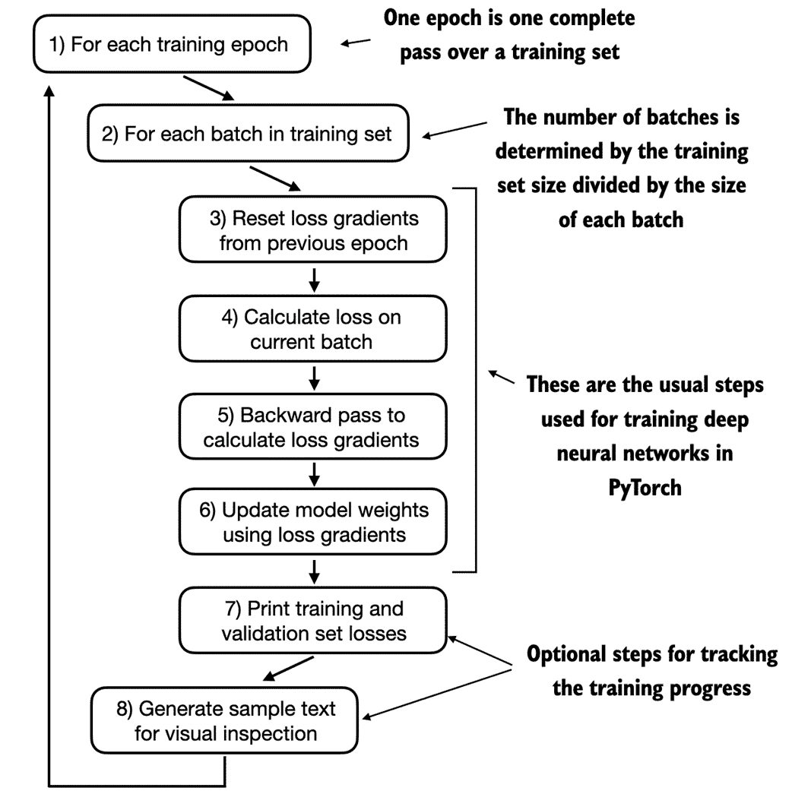

# 5 在未标记数据上进行预训练

### 本章内容涵盖

+   计算训练和验证集损失，以评估训练过程中 LLM 生成文本的质量

+   实施训练函数并对 LLM 进行预训练

+   保存和加载模型权重以继续训练 LLM

+   从 OpenAI 加载预训练权重

在前几章中，我们实现了数据采样、注意力机制并编码了 LLM 架构。本章的核心重点是实现训练函数并对 LLM 进行预训练，如图 5.1 所示。

##### 图 5.1 LLM 编码的三个主要阶段的思维模型，分别是对一般文本数据集的 LLM 进行预训练，以及在标记数据集上进行微调。本章专注于对 LLM 进行预训练，包括实施训练代码、评估性能以及保存和加载模型权重。


如图 5.1 所示，我们还将学习基本的模型评估技术，以测量生成文本的质量，这是在训练过程中优化 LLM 的必要条件。此外，我们将讨论如何加载预训练权重，为我们的 LLM 在接下来的章节中微调提供坚实的起点。

##### 权重参数

在 LLM 和其他深度学习模型的背景下，*权重* 是指学习过程调整的可训练参数。这些权重也称为 *权重参数* 或简单地称为 *参数*。在 PyTorch 等框架中，这些权重存储在线性层中，例如，我们在第三章中实现的多头注意力模块和第四章中的 `GPTModel`。在初始化一个层（`new_layer = torch.nn.Linear(...)`）后，我们可以通过 `.weight` 属性访问其权重，即 `new_layer.weight`。此外，为了方便起见，PyTorch 允许通过 `model.parameters()` 方法直接访问模型的所有可训练参数，包括权重和偏置，我们将在后续实现模型训练时使用该方法。

## 5.1 评估生成文本模型

本章开始时，我们根据前一章的代码设置 LLM 以进行文本生成，并在本节中讨论评估生成文本质量的基本方法。本节和本章其余部分涵盖的内容在图 5.2 中概述。

##### 图 5.2 本章涵盖主题的概述。我们首先回顾前一章的文本生成，并实施基本的模型评估技术，这些技术可在预训练阶段使用。


如图 5.2 所示，下一小节回顾了我们在前一章结束时设置的文本生成内容，然后我们将深入探讨文本评估以及后续小节中训练和验证损失的计算。

### 5.1.1 使用 GPT 生成文本

在本节中，我们设置 LLM，并简要回顾我们在第四章中实施的文本生成过程。我们首先初始化将在本章评估和训练的 GPT 模型，使用第四章中的 `GPTModel` 类和 `GPT_CONFIG_124M` 字典：

```py
import torch
from chapter04 import GPTModel
GPT_CONFIG_124M = {
    "vocab_size": 50257,
    "context_length": 256,  #A
    "emb_dim": 768,
    "n_heads": 12,
    "n_layers": 12, 
    "drop_rate": 0.1,     #B
    "qkv_bias": False
}
torch.manual_seed(123)
model = GPTModel(GPT_CONFIG_124M)
model.eval()
```

考虑到 `GPT_CONFIG_124M` 字典，与上一章相比，我们所做的唯一调整是将上下文长度 (`context_length`) 减少到 256 个 token。这一修改减少了训练模型的计算需求，使得在标准笔记本电脑上进行训练成为可能。

最初，具有 1.24 亿参数的 GPT-2 模型被配置为处理最多 1,024 个 token。在训练过程结束时，本章将更新上下文大小设置并加载预训练权重，以处理一个配置为 1,024 token 上下文长度的模型。

使用 `GPTmodel` 实例，我们采用了上一章介绍的 `generate_text_simple` 函数，并引入了两个便捷函数 `text_to_token_ids` 和 `token_ids_to_text`。这些函数简化了文本与 token 表示之间的转换，这一技术我们将在本章中反复使用。为了提供更清晰的理解，图 5.3 在我们深入代码之前展示了这一过程。

##### 图 5.3 生成文本涉及将文本编码为 LLM 处理的 token ID，进而生成 logit 向量。这些 logit 向量随后被转换回 token ID，最后解码为文本表示。


图 5.3 展示了使用 GPT 模型的三步文本生成过程。首先，分词器将输入文本转换为一系列的 token ID，如第二章所讨论的。其次，模型接收这些 token ID 并生成相应的 logits，logits 是表示词汇表中每个 token 概率分布的向量，如第四章所讨论的。最后，这些 logits 被转换回 token ID，分词器将其解码为人类可读的文本，完成从文本输入到文本输出的循环。

在代码中，我们实现文本生成过程如下：

##### 清单 5.1 文本到 token ID 转换的工具函数

```py
import tiktoken
from chapter04 import generate_text_simple

def text_to_token_ids(text, tokenizer):
    encoded = tokenizer.encode(text, allowed_special={'<|endoftext|>'})
    encoded_tensor = torch.tensor(encoded).unsqueeze(0) # add batch dimension
    return encoded_tensor

def token_ids_to_text(token_ids, tokenizer):
    flat = token_ids.squeeze(0) # remove batch dimension
    return tokenizer.decode(flat.tolist())

start_context = "Every effort moves you"
tokenizer = tiktoken.get_encoding("gpt2")

token_ids = generate_text_simple(
    model=model,
    idx=text_to_token_ids(start_context, tokenizer),
    max_new_tokens=10,
    context_size=GPT_CONFIG_124M["context_length"]
)
print("Output text:\n", token_ids_to_text(token_ids, tokenizer))
```

使用前面的代码，`model` 生成了以下文本：

```py
Output text:
 Every effort moves you rentingetic wasnم refres RexMeCHicular stren
```

根据输出，很明显模型尚未生成连贯的文本，因为它还没有经过训练。为了定义什么使文本“连贯”或“高质量”，我们必须实施一种数值方法来评估生成的内容。这种方法将使我们能够在整个训练过程中监控和提升模型的表现。

以下部分介绍如何为生成的输出计算一个 *损失指标*。这个损失作为训练进展的指示器，显示训练的成功与否。此外，在后续关于微调 LLM 的章节中，我们将回顾评估模型质量的其他方法。

### 5.1.2 计算文本生成损失

本节探讨通过计算所谓的文本生成损失来对训练期间生成的文本质量进行数值评估的技术。我们将逐步深入这一主题，并用一个实际示例来使概念清晰易懂，首先回顾一下第二章中数据是如何加载的，以及如何通过第四章中的`generate_text_simple`函数生成文本。

图 5.4 展示了从输入文本到 LLM 生成文本的整体流程，采用了五个步骤的过程。

##### 图 5.4 显示了左侧的 3 个输入标记，我们计算了一个向量，包含与词汇中每个标记对应的概率分数。每个向量中最高概率分数的索引位置代表最可能的下一个标记 ID。这些与最高概率分数相关的标记 ID 被选中并映射回文本，表示模型生成的文本。


图 5.4 中的文本生成过程概述了第四章的`generate_text_simple`函数的内部工作。我们需要执行这些相同的初始步骤，然后才能计算损失，以衡量本节后面生成文本的质量。

图 5.4 概述了文本生成过程，使用了一个小的 7 个标记的词汇，以便将该图放在一页上。然而，我们的`GPTModel`使用的词汇量更大，包含 50,257 个单词；因此，以下代码中的标记 ID 范围将是从 0 到 50,256，而不是 0 到 6。

此外，图 5.4 仅显示了一个文本示例(`"every effort moves"`)，以简化说明。在接下来的动手代码示例中，我们将使用两个输入示例(`"every effort moves"`和`"I really like"`)，作为 GPT 模型的输入：

考虑这两个输入示例，这些示例已经映射到标记 ID，对应于图 5.4 中的步骤 1：

```py
inputs = torch.tensor([[16833, 3626, 6100],   # ["every effort moves",
                       [40,    1107, 588]])   #  "I really like"]
```

与这些输入相匹配，`targets`包含我们希望模型生成的标记 ID：

```py
targets = torch.tensor([[3626, 6100, 345  ],  # [" effort moves you",
                        [588,  428,  11311]]) #  " really like chocolate"]
```

请注意，targets 是输入，但向前移动一个位置，这是我们在第二章实施数据加载器时讨论的概念。这种位移策略对于教模型预测序列中的下一个标记至关重要。

当我们将`inputs`输入模型以计算两个输入示例的 logit 向量，每个示例包含三个标记，并应用 softmax 函数将这些 logit 值转化为概率分数时，对应于图 5.4 中的步骤 2：

```py
with torch.no_grad(): #A
    logits = model(inputs)
probas = torch.softmax(logits, dim=-1) # Probability of each token in vocabulary
print(probas.shape)
```

概率分数(`probas`)张量的最终维度如下：

```py
torch.Size([2, 3, 50257])
```

第一个数字 2 对应于`inputs`中的两个示例（行），也称为批量大小。第二个数字 3 对应于每个输入（行）中的标记数量。最后一个数字对应于嵌入维度，由词汇大小决定，具体内容在前面的章节中讨论过。

通过 softmax 函数将 logits 转换为概率后，第四章的 `generate_text_simple` 函数将结果概率分数转换回文本，如图 5.4 的步骤 3-5 所示。

我们可以通过将 argmax 函数应用于概率分数来实施步骤 3 和 4，以获得相应的令牌 ID：

```py
token_ids = torch.argmax(probas, dim=-1, keepdim=True)
print("Token IDs:\n", token_ids)
```

鉴于我们有 2 个输入批次，每个批次包含 3 个令牌，对概率分数应用 argmax 函数（图 5.4 的步骤 3）将产生 2 组输出，每组包含 3 个预测的令牌 ID：

```py
Token IDs:
 tensor([[[16657], # First batch
         [  339],
         [42826]],
        [[49906], # Second batch
         [29669],
         [41751]]])
Finally, step 5 converts the token IDs back into text:
print(f"Targets batch 1: {token_ids_to_text(targets[0], tokenizer)}")
print(f"Outputs batch 1: {token_ids_to_text(token_ids[0].flatten(), tokenizer)}")
```

当我们解码这些令牌时，会发现这些输出令牌与我们希望模型生成的目标令牌大相径庭：

```py
Targets batch 1:  effort moves you
Outputs batch 1:  Armed heNetflix
```

模型生成的文本与目标文本不同，因为它尚未经过训练。我们现在进入评估模型生成文本性能的部分，采用一种所谓的损失进行数值评估，如图 5.4 所示。这不仅对测量生成文本的质量有用，而且也是稍后实现训练函数的基础，训练函数用于更新模型的权重，从而改进生成文本。

##### 图 5.5 我们现在在本节其余部分实施文本评估函数。在下一节中，我们将此评估函数应用于用于模型训练的整个数据集。


我们在本节其余部分实施的文本评估过程的一部分，如图 5.5 所示，是测量生成的令牌与正确预测（目标）之间的“距离”。本章稍后实施的训练函数将利用这些信息调整模型权重，以生成更接近（或理想情况下匹配）目标文本的文本。

模型训练的目的是提高与正确目标令牌 ID 对应的索引位置的 softmax 概率，如图 5.6 所示。这一 softmax 概率也用于我们在本节其余部分实施的评估指标，以数值评估模型生成的输出：正确位置的概率越高，结果越好。

##### 图 5.6 在训练之前，模型生成随机的下一个令牌概率向量。模型训练的目标是确保与高亮的目标令牌 ID 对应的概率值被最大化。


请记住，图 5.6 显示了一个紧凑的 7 令牌词汇的 softmax 概率，以便将所有内容放入一个单一的图中。这意味着初始随机值将围绕 1/7 波动，约等于 0.14。

然而，我们用于 GPT-2 模型的词汇包含 50,257 个令牌，因此大多数初始概率将通过 1/50,257 徘徊在 0.00002 附近。

对于两个输入文本，我们可以通过以下代码打印与目标令牌对应的初始 softmax 概率分数：

```py
text_idx = 0
target_probas_1 = probas[text_idx, [0, 1, 2], targets[text_idx]]
print("Text 1:", target_probas_1)

text_idx = 1
target_probas_2 = probas[text_idx, [0, 1, 2], targets[text_idx]]
print("Text 2:", target_probas_2)
```

每个批次的 3 个目标令牌 ID 概率如下：

```py
Text 1: tensor([7.4541e-05, 3.1061e-05, 1.1563e-05])
Text 2: tensor([3.9836e-05, 1.6783e-05, 4.7559e-06])
```

训练大型语言模型(LLM)的目标是最大化这些值，力求将它们接近概率 1。这样，我们确保 LLM 始终选择目标令牌——实际上是句子中的下一个单词——作为其生成的下一个令牌。

##### 反向传播

我们如何最大化与目标令牌对应的 softmax 概率值？整体思路是更新模型权重，以使模型为我们希望生成的相应令牌 ID 输出更高的值。权重更新通过一个称为*反向传播*的过程完成，这是一种训练深度神经网络的标准技术（有关反向传播和模型训练的更多细节，请参见附录 A 的 A.3 到 A.7 节）。

反向传播需要一个损失函数，该函数计算模型预测输出（此处为与目标令牌 ID 对应的概率）和实际期望输出之间的差异。这个损失函数衡量模型预测与目标值之间的偏差。

在本节的其余部分，我们计算两个示例批次`target_probas_1`和`target_probas_2`的概率分数损失。主要步骤在图 5.7 中说明。

##### 图 5.7 计算损失涉及几个步骤。步骤 1 到 3 计算与目标张量对应的令牌概率。这些概率随后通过对数进行转换，并在步骤 4-6 中取平均。


由于我们已经应用了图 5.7 中列出的步骤 1-3 以获得`target_probas_1`和`target_probas_2`，我们继续进行步骤 4，将*对数*应用于概率分数：

```py
log_probas = torch.log(torch.cat((target_probas_1, target_probas_2)))
print(log_probas)
```

这导致以下值：

```py
tensor([ -9.5042, -10.3796, -11.3677, -10.1308, -10.9951, -12.2561])
```

在数学优化中，处理概率分数的对数比直接处理分数更容易。这一主题超出了本书的范围，但我在讲座中详细讨论过，链接在附录 B 的参考部分。

接下来，我们通过计算平均值将这些对数概率合并为一个单一得分（图 5.7 中的步骤 5）：

```py
avg_log_probas = torch.mean(log_probas)
print(avg_log_probas)
```

结果的平均对数概率得分如下：

```py
tensor(-10.7722)
```

目标是通过更新模型的权重，使平均对数概率尽可能接近 0，这将在 5.2 节中实现。

然而，在深度学习中，通常的做法不是将平均对数概率推高至 0，而是将负的平均对数概率降低至 0。负的平均对数概率仅是平均对数概率乘以-1，这对应于图 5.7 中的步骤 6：

```py
neg_avg_log_probas = avg_log_probas * -1
print(neg_avg_log_probas)
```

这打印出`tensor(-10.7722)`。

这个负值-10.7722 转变为 10.7722 的术语，在深度学习中称为*交叉熵*损失。

PyTorch 在这里派上用场，因为它已经内置了一个`cross_entropy`函数，可以为我们处理图 5.7 中的所有这 6 个步骤。

##### 交叉熵损失

从本质上讲，交叉熵损失是机器学习和深度学习中一种流行的度量，用于测量两个概率分布之间的差异——通常是真实标签的分布（这里是数据集中的标记）与模型的预测分布（例如，LLM 生成的标记概率）。

在机器学习的背景下，特别是在像 PyTorch 这样的框架中，`cross_entropy`函数为离散结果计算该度量，这类似于给定模型生成的标记概率的目标标记的负平均对数概率，使得交叉熵和负平均对数概率相关并在实践中常常可以互换使用。

在应用交叉熵函数之前，让我们简要回顾一下 logits 和目标张量的形状：

```py
print("Logits shape:", logits.shape)
print("Targets shape:", targets.shape)
```

结果形状如下：

```py
Logits shape: torch.Size([2, 3, 50257])
Targets shape: torch.Size([2, 3])
```

如我们所见，`logits`张量有三个维度：批量大小、标记数量和词汇大小。`targets`张量有两个维度：批量大小和标记数量。

对于 PyTorch 中的交叉`entropy_loss`函数，我们希望通过在批量维度上组合来展平这些张量：

```py
logits_flat = logits.flatten(0, 1)
targets_flat = targets.flatten()
print("Flattened logits:", logits_flat.shape)
print("Flattened targets:", targets_flat.shape)
```

结果张量维度如下：

```py
Flattened logits: torch.Size([6, 50257])
Flattened targets: torch.Size([6])
```

请记住，`targets`是我们希望 LLM 生成的标记 ID，而`logits`包含进入 softmax 函数之前未缩放的模型输出，以获得概率分数。

之前，我们应用了 softmax 函数，选择了与目标 ID 对应的概率分数，并计算了负平均对数概率。PyTorch 的`cross_entropy`函数会为我们处理所有这些步骤：

```py
loss = torch.nn.functional.cross_entropy(logits_flat, targets_flat)
print(loss)
```

结果损失与我们之前在手动应用图 5.7 中显示的各个步骤时获得的损失相同：

```py
tensor(10.7722)
```

##### 困惑度

*困惑度*是一个常用于评估模型在语言建模等任务中性能的度量。它可以提供更易于理解的方式来理解模型在预测序列中下一个标记时的不确定性。

困惑度衡量模型预测的概率分布与数据集中单词的实际分布之间的匹配程度。与损失类似，较低的困惑度表明模型预测更接近实际分布。

困惑度可以计算为`perplexity = torch.exp(loss)`，当应用于先前计算的损失时返回`tensor(47678.8633)`。

困惑度通常被认为比原始损失值更易于解释，因为它表示模型在每个步骤中对有效词汇大小的不确定性。在给定的示例中，这意味着模型对词汇中 47,678 个单词或标记中的哪个生成下一个标记感到不确定。

在本节中，我们为两个小文本输入计算了损失，以便进行说明。在下一节中，我们将损失计算应用于整个训练和验证集。

### 5.1.3 计算训练和验证集损失

在本节中，我们首先准备将用于在本章后面训练 LLM 的训练和验证数据集。然后，我们计算训练和验证集的交叉熵，如图 5.8 所示，这是模型训练过程中的一个重要组成部分。

##### 图 5.8 在上一节计算交叉熵损失后，我们现在将该损失计算应用于我们将用于模型训练的整个文本数据集。


为了计算训练和验证数据集上的损失，如图 5.8 所示，我们使用了一个非常小的文本数据集，即艾迪丝·华顿的短篇小说《判决》，我们在第二章中已经使用过。通过选择公共领域的文本，我们避免了与使用权相关的任何担忧。此外，使用如此小的数据集的原因在于，它使得在标准笔记本电脑上运行代码示例只需几分钟，甚至不需要高端 GPU，这对于教育目的特别有利。

有兴趣的读者还可以使用本书的补充代码，准备一个由超过 60,000 本公共领域书籍（来自古腾堡计划）组成的大规模数据集，并在这些书籍上训练一个 LLM（详见附录 D）。

##### 预训练 LLM 的成本

为了让我们的项目规模更具可比性，考虑一下 7 亿参数的 Llama 2 模型的训练，这是一个相对流行的公开可用 LLM。该模型在昂贵的 A100 GPU 上需要 184,320 GPU 小时，处理 2 万亿个标记。在撰写本文时，在 AWS 上运行一个 8 个 A100 的云服务器大约需要每小时 30 美元。粗略估算，该 LLM 的总训练成本大约为 69 万美元（计算方式为 184,320 小时除以 8，然后乘以 30 美元）。

以下代码加载了我们在第二章中使用的《判决》短篇小说：

```py
file_path = "the-verdict.txt"
with open(file_path, "r", encoding="utf-8") as file:
    text_data = file.read()
```

加载数据集后，我们可以检查数据集中字符和标记的数量：

```py
total_characters = len(text_data)
total_tokens = len(tokenizer.encode(text_data))
print("Characters:", total_characters)
print("Tokens:", total_tokens)
```

输出如下：

```py
Characters: 20479
Tokens: 5145
```

仅使用 5,145 个标记，文本看起来可能太小而无法训练 LLM，但如前所述，这是出于教育目的，以便我们能够在几分钟内运行代码，而不是几周。此外，在本章结束时，我们将从 OpenAI 加载预训练权重到我们的`GPTModel`代码中。

接下来，我们将数据集划分为训练集和验证集，并使用第二章中的数据加载器准备 LLM 训练的批次。此过程在图 5.9 中进行了可视化。

##### 图 5.9 在准备数据加载器时，我们将输入文本拆分为训练集和验证集部分。然后，我们对文本进行标记化（为了简单起见，仅对训练集部分显示），并将标记化的文本划分为用户指定长度（这里为 6）的块。最后，我们对行进行随机打乱，并将分块的文本组织成批次（这里，批次大小为 2），以便用于模型训练。


为了可视化，图 5.9 使用了`max_length=6`，这是由于空间限制。然而，对于我们正在实现的实际数据加载器，我们将`max_length`设置为 LLM 支持的 256 个标记上下文长度，以便 LLM 在训练期间看到更长的文本。

##### 使用可变长度进行训练

我们正在使用相似大小的块呈现训练数据来训练模型，以简化和提高效率。然而，实际上，以可变长度的输入训练 LLM 也可以是有益的，这有助于 LLM 在使用时更好地进行不同类型输入的泛化。

为了实现图 5.9 中可视化的数据分割和加载，我们首先定义一个`train_ratio`，使用 90%的数据进行训练，剩余的 10%作为训练期间模型评估的验证数据：

```py
train_ratio = 0.90
split_idx = int(train_ratio * len(text_data))
train_data = text_data[:split_idx]
val_data = text_data[split_idx:]
```

使用`train_data`和`val_data`子集，我们现在可以创建相应的数据加载器，重用第二章中的`create_dataloader_v1`代码：

```py
from chapter02 import create_dataloader_v1
torch.manual_seed(123)

train_loader = create_dataloader_v1(
    train_data,
    batch_size=2,
    max_length=GPT_CONFIG_124M["context_length"],
    stride=GPT_CONFIG_124M["context_length"],
    drop_last=True,
    shuffle=True
)
val_loader = create_dataloader_v1(
    val_data,
    batch_size=2,
    max_length=GPT_CONFIG_124M["context_length"],
    stride=GPT_CONFIG_124M["context_length"],
    drop_last=False,
    shuffle=False
)
```

在前面的代码中，我们使用了相对较小的批次大小，以减少计算资源的需求，因为我们使用的是非常小的数据集。实际上，以 1,024 或更大的批次大小训练 LLM 并不罕见。

作为可选检查，我们可以遍历数据加载器，以确保它们被正确创建：

```py
print("Train loader:")
for x, y in train_loader:
    print(x.shape, y.shape)

print("\nValidation loader:")
for x, y in val_loader:
    print(x.shape, y.shape)
```

我们应该看到以下输出：

```py
Train loader:
torch.Size([2, 256]) torch.Size([2, 256])
torch.Size([2, 256]) torch.Size([2, 256])
torch.Size([2, 256]) torch.Size([2, 256])
torch.Size([2, 256]) torch.Size([2, 256])
torch.Size([2, 256]) torch.Size([2, 256])
torch.Size([2, 256]) torch.Size([2, 256])
torch.Size([2, 256]) torch.Size([2, 256])
torch.Size([2, 256]) torch.Size([2, 256])
torch.Size([2, 256]) torch.Size([2, 256])

Validation loader:
torch.Size([2, 256]) torch.Size([2, 256])
```

根据前面的代码输出，我们有 9 个训练集批次，每个批次有 2 个样本和 256 个标记。由于我们只分配了 10%的数据用于验证，因此只有一个验证批次，由 2 个输入示例组成。

正如预期的那样，输入数据（`x`）和目标数据（`y`）具有相同的形状（批次大小乘以每个批次中的标记数），因为目标是输入向前移动一个位置，如第二章所讨论的。

接下来，我们实现一个工具函数，以计算通过训练和验证加载器返回的给定批次的交叉熵损失：

```py
def calc_loss_batch(input_batch, target_batch, model, device):
    input_batch, target_batch = input_batch.to(device), target_batch.to(device) #A
    logits = model(input_batch)
    loss = torch.nn.functional.cross_entropy(
        logits.flatten(0, 1), target_batch.flatten()
    )
    return loss
```

现在我们可以使用这个`calc_loss_batch`工具函数，它计算单个批次的损失，来实现以下`calc_loss_loader`函数，该函数计算通过给定数据加载器抽样的所有批次的损失：

##### 列表 5.2 计算训练和验证损失的函数

```py
def calc_loss_loader(data_loader, model, device, num_batches=None):
    total_loss = 0.
    if num_batches is None:
        num_batches = len(data_loader) #A
    else:
        num_batches = min(num_batches, len(data_loader)) #B
    for i, (input_batch, target_batch) in enumerate(data_loader):
        if i < num_batches:
            loss = calc_loss_batch(input_batch, target_batch, model, device)
            total_loss += loss.item() #C
        else:
            break
    return total_loss / num_batches #D
```

默认情况下，`calc_loss_batch` 函数遍历给定数据加载器中的所有批次，累积损失到 `total_loss` 变量中，然后计算并平均所有批次的损失。或者，我们可以通过 `num_batches` 指定较小的批次数，以加快模型训练期间的评估速度。

现在我们来看看 `calc_loss_batch` 函数的实际应用，将其应用于训练和验证集加载器：

```py
device = torch.device("cuda" if torch.cuda.is_available() else "cpu") #A
model.to(device)
train_loss = calc_loss_loader(train_loader, model, device) #B
val_loss = calc_loss_loader(val_loader, model, device)
print("Training loss:", train_loss)
print("Validation loss:", val_loss)
```

得到的损失值如下：

```py
Training loss: 10.98758347829183
Validation loss: 10.98110580444336
```

损失值相对较高，因为模型尚未训练。相比之下，如果模型学会生成训练集和验证集中出现的下一个标记，损失会接近 0。

现在我们已经有了衡量生成文本质量的方法，在下一节中，我们训练 LLM 以降低此损失，从而使其在生成文本时表现更好，如图 5.10 所示。

##### 图 5.10 我们回顾了文本生成过程，并实现了基本模型评估技术以计算训练和验证集的损失。接下来，我们将进入训练函数并对 LLM 进行预训练。


如图 5.10 所示，下一节专注于对 LLM 的预训练。在模型训练完成后，我们实现替代文本生成策略，并保存和加载预训练模型权重。

## 5.2 训练 LLM

在这一节中，我们最终实现了对 LLM，即我们的 `GPTModel` 的预训练代码。为此，我们专注于一个简单的训练循环，如图 5.11 所示，以保持代码简洁易读。然而，感兴趣的读者可以在 *附录 D, 为训练循环增添附加功能* 中学习更高级的技术，包括 *学习率预热*、*余弦退火* 和 *梯度裁剪*。

##### 图 5.11 一个典型的训练循环用于在 PyTorch 中训练深度神经网络，包含多个步骤，遍历训练集中的批次进行多个纪元。在每个循环中，我们计算每个训练集批次的损失，以确定损失梯度，利用这些梯度更新模型权重，从而最小化训练集损失。



图 5.11 的流程图描绘了一个典型的 PyTorch 神经网络训练工作流程，我们用于训练 LLM。它概述了八个步骤，从遍历每个纪元、处理批次、重置和计算梯度、更新权重，到最后监控步骤，如打印损失和生成文本样本。如果你对使用 PyTorch 训练深度神经网络相对陌生，且这些步骤中有不熟悉的，考虑阅读 *附录 A, PyTorch 介绍* 中的 A.5 到 A.8 节。

在代码中，我们可以通过以下 `train_model_simple` 函数实现这个训练流程：

##### 清单 5.3 LLM 预训练的主要功能

```py
def train_model_simple(model, train_loader, val_loader, optimizer, device, num_epochs,
                       eval_freq, eval_iter, start_context):
    train_losses, val_losses, track_tokens_seen = [], [], [] #A
    tokens_seen, global_step = 0, -1

    for epoch in range(num_epochs): #B
        model.train()
        for input_batch, target_batch in train_loader:
            optimizer.zero_grad() #C
            loss = calc_loss_batch(input_batch, target_batch, model, device)
            loss.backward() #D
            optimizer.step() #E
            tokens_seen += input_batch.numel()
            global_step += 1

            if global_step % eval_freq == 0: #F
                train_loss, val_loss = evaluate_model(
                    model, train_loader, val_loader, device, eval_iter)
                train_losses.append(train_loss)
                val_losses.append(val_loss)
                track_tokens_seen.append(tokens_seen)
                print(f"Ep {epoch+1} (Step {global_step:06d}): "
                      f"Train loss {train_loss:.3f}, Val loss {val_loss:.3f}")

        generate_and_print_sample(  #G
            model, train_loader.dataset.tokenizer, device, start_context
        )
    return train_losses, val_losses, track_tokens_seen
```

请注意，我们刚刚创建的`train_model_simple`函数使用了两个尚未定义的函数：`evaluate_model`和`generate_and_print_sample`。

`evaluate_model`函数对应于图 5.11 中的第 7 步。它在每次模型更新后打印训练集和验证集的损失，以便我们评估训练是否改善了模型。

更具体地说，`evaluate_model`函数计算训练集和验证集的损失，同时确保模型处于评估模式，在计算训练和验证集的损失时禁用梯度跟踪和丢弃。

```py
def evaluate_model(model, train_loader, val_loader, device, eval_iter):
    model.eval() #A
    with torch.no_grad(): #B
        train_loss = calc_loss_loader(train_loader, model, device, num_batches=eval_iter)
        val_loss = calc_loss_loader(val_loader, model, device, num_batches=eval_iter)
    model.train()
    return train_loss, val_loss
```

与`evaluate_model`类似，`generate_and_print_sample`函数是一个便捷函数，我们用它来跟踪模型在训练过程中是否有所改善。具体来说，`generate_and_print_sample`函数将一个文本片段（`start_context`）作为输入，将其转换为令牌 ID，并将其输入 LLM，以使用我们之前使用的`generate_text_simple`函数生成文本示例：

```py
def generate_and_print_sample(model, tokenizer, device, start_context):
    model.eval()
    context_size = model.pos_emb.weight.shape[0]
    encoded = text_to_token_ids(start_context, tokenizer).to(device)
    with torch.no_grad():
        token_ids = generate_text_simple(
            model=model, idx=encoded,
            max_new_tokens=50, context_size=context_size
        )
        decoded_text = token_ids_to_text(token_ids, tokenizer)
        print(decoded_text.replace("\n", " "))  # Compact print format
    model.train()
```

`evaluate_model`函数为我们提供模型训练进度的数值估计，而`generate_and_print_sample`文本函数则提供由模型生成的具体文本示例，以便在训练过程中判断其能力。

##### AdamW

*Adam*优化器是训练深度神经网络的热门选择。然而，在我们的训练循环中，我们选择了*AdamW*优化器。AdamW 是 Adam 的一个变体，改进了权重衰减的方法，旨在通过惩罚较大的权重来最小化模型复杂度并防止过拟合。这一调整使得 AdamW 能够实现更有效的正则化和更好的泛化，因此在 LLM 的训练中经常使用。

让我们通过训练一个 GPTModel 实例进行 10 个周期，使用 AdamW 优化器和我们之前定义的`train_model_simple`函数，来看看这一切是如何运作的。

```py
torch.manual_seed(123)
model = GPTModel(GPT_CONFIG_124M)
model.to(device)
optimizer = torch.optim.AdamW(model.parameters(), lr=0.0004, weight_decay=0.1) #A
num_epochs = 10
train_losses, val_losses, tokens_seen = train_model_simple(
    model, train_loader, val_loader, optimizer, device,
    num_epochs=num_epochs, eval_freq=5, eval_iter=1,
    start_context="Every effort moves you"
)
```

执行`training_model_simple`函数启动训练过程，在 MacBook Air 或类似笔记本电脑上大约需要 5 分钟完成。执行过程中打印的输出如下：

```py
Ep 1 (Step 000000): Train loss 9.781, Val loss 9.933
Ep 1 (Step 000005): Train loss 8.111, Val loss 8.339
Every effort moves you,,,,,,,,,,,,.                                     
Ep 2 (Step 000010): Train loss 6.661, Val loss 7.048
Ep 2 (Step 000015): Train loss 5.961, Val loss 6.616
Every effort moves you, and, and, and, and, and, and, and, and, and, and, and, and, and, and, and, and, and, and, and, and, and, and,, and, and,
[...]  #A
Ep 9 (Step 000080): Train loss 0.541, Val loss 6.393
Every effort moves you?"  "Yes--quite insensible to the irony. She wanted him vindicated--and by me!"  He laughed again, and threw back the window-curtains, I had the donkey. "There were days when I
Ep 10 (Step 000085): Train loss 0.391, Val loss 6.452
Every effort moves you know," was one of the axioms he laid down across the Sevres and silver of an exquisitely appointed luncheon-table, when, on a later day, I had again run over from Monte Carlo; and Mrs. Gis
```

正如我们所看到的，基于训练期间打印的结果，训练损失显著改善，从 9.558 的值开始收敛到 0.762。模型的语言能力有了很大提升。在最开始，模型只能在起始上下文中添加逗号（`"Every effort moves you,,,,,,,,,,,,"`）或重复单词`"and"`。在训练结束时，它能够生成语法正确的文本。

与训练集损失类似，我们可以看到验证损失起初较高（9.856），在训练过程中逐渐下降。然而，它从未降至与训练集损失一样低，并且在第 10 个周期后保持在 6.372。

在更详细讨论验证损失之前，让我们创建一个简单的图表，展示训练集和验证集的损失并排比较：

```py
import matplotlib.pyplot as plt
def plot_losses(epochs_seen, tokens_seen, train_losses, val_losses):
    fig, ax1 = plt.subplots(figsize=(5, 3))
    ax1.plot(epochs_seen, train_losses, label="Training loss")
    ax1.plot(epochs_seen, val_losses, linestyle="-.", label="Validation loss")
    ax1.set_xlabel("Epochs")
    ax1.set_ylabel("Loss")
    ax1.legend(loc="upper right")
    ax2 = ax1.twiny()  #A
    ax2.plot(tokens_seen, train_losses, alpha=0)  #B
    ax2.set_xlabel("Tokens seen")
    fig.tight_layout()
    plt.show()

epochs_tensor = torch.linspace(0, num_epochs, len(train_losses))
plot_losses(epochs_tensor, tokens_seen, train_losses, val_losses)
```

结果训练和验证损失图如图 5.12 所示。

##### 图 5.12 在训练开始时，我们观察到训练集和验证集的损失急剧下降，这表明模型正在学习。然而，训练集的损失在第二轮后继续下降，而验证损失则停滞不前。这表明模型仍在学习，但在第 2 轮后对训练集过拟合。


如图 5.12 所示，训练和验证损失在第一轮开始改善。然而，损失在第二轮后开始发散。这种发散以及验证损失远大于训练损失表明模型对训练数据过拟合。我们可以通过搜索生成的文本片段，例如在《裁决》文本文件中查找`"quite insensible to the irony"`，来确认模型逐字记住了训练数据。

这种记忆是预期的，因为我们正在处理一个非常非常小的训练数据集，并且对模型进行了多轮训练。通常，训练模型时会在一个更大得多的数据集上只进行一轮训练。

如前所述，有兴趣的读者可以尝试在来自古腾堡计划的 60,000 本公共领域书籍上训练模型，在那里不会发生过拟合；有关详细信息，请参见附录 B。

在接下来的部分中，如图 5.13 所示，我们探索 LLM 采用的采样方法，以缓解记忆效应，从而生成更新颖的文本。

##### 图 5.13 我们的模型在实现训练功能后能够生成连贯的文本。然而，它通常逐字记住训练集中的段落。下一节将介绍生成更多样化输出文本的策略。


如图 5.13 所示，下一节将介绍 LLM 的文本生成策略，以减少训练数据的记忆，并增加 LLM 生成文本的原创性，然后我们将讨论权重加载和从 OpenAI 的 GPT 模型中保存和加载预训练权重。

## 5.3 控制随机性的解码策略

在本节中，我们将介绍文本生成策略（也称为解码策略），以生成更原创的文本。首先，我们简要回顾一下上一章中使用的`generate_text_simple`函数，该函数在本章的`generate_and_print_sample`中被使用。然后，我们将介绍两种技术，*温度缩放*和*top-k 采样*，以改进该函数。

我们首先将模型从 GPU 转移回 CPU，因为使用相对较小的模型进行推理并不需要 GPU。此外，在训练后，我们将模型放入评估模式，以关闭诸如 dropout 之类的随机组件：

```py
model.to("cpu")
model.eval()
```

接下来，我们将`GPTModel`实例（`model`）插入`generate_text_simple`函数，该函数使用 LLM 逐个生成标记：

```py
tokenizer = tiktoken.get_encoding("gpt2")
token_ids = generate_text_simple(
    model=model,
    idx=text_to_token_ids("Every effort moves you", tokenizer),
    max_new_tokens=25,
    context_size=GPT_CONFIG_124M["context_length"]
)
print("Output text:\n", token_ids_to_text(token_ids, tokenizer))
```

生成的文本如下：

```py
Output text:
Every effort moves you know," was one of the axioms he laid down across the Sevres and silver of an exquisitely appointed lun
```

如第 5.1.2 节所述，生成的标记在每次生成步骤中选择，依据词汇表中所有标记的最大概率分数。

这意味着即使我们在相同的起始上下文（`"Every effort moves you"`）上多次运行上面的`generate_text_simple`函数，LLM 仍会生成相同的输出。

以下小节介绍了两个控制生成文本的随机性和多样性的概念：温度缩放和 top-k 采样。

### 5.3.1 温度缩放

本节介绍了温度缩放，这是一种将概率选择过程添加到下一个标记生成任务中的技术。

之前，在`generate_text_simple`函数内，我们总是使用`torch.argmax`采样概率最高的标记作为下一个标记，这也称为*贪婪解码*。为了生成更多样化的文本，我们可以用一个从概率分布中采样的函数替换 argmax（在这里，概率分数是 LLM 在每个标记生成步骤为每个词汇条目生成的）。

为了通过具体示例说明概率采样，我们来简要讨论使用非常小的词汇表进行的下一个标记生成过程：

```py
vocab = { 
    "closer": 0,
    "every": 1, 
    "effort": 2, 
    "forward": 3,
    "inches": 4,
    "moves": 5, 
    "pizza": 6,
    "toward": 7,
    "you": 8,
} 
inverse_vocab = {v: k for k, v in vocab.items()}
```

接下来，假设 LLM 给出的起始上下文为`"every effort moves you"`，并生成以下下一个标记的 logits：

```py
next_token_logits = torch.tensor(
    [4.51, 0.89, -1.90, 6.75, 1.63, -1.62, -1.89, 6.28, 1.79]
)
```

如前一章所述，在`generate_text_simple`内部，我们通过 softmax 函数将 logits 转换为概率，并通过 argmax 函数获得与生成标记对应的标记 ID，然后可以通过逆词汇表映射回文本：

```py
probas = torch.softmax(next_token_logits, dim=0)
next_token_id = torch.argmax(probas).item()
print(inverse_vocab[next_token_id])
```

由于最大的 logit 值以及相应的最大 softmax 概率分数位于第四个位置（索引位置 3，因为 Python 使用 0 索引），生成的单词是`"forward"`。

为了实现概率采样过程，我们现在可以将 argmax 替换为 PyTorch 中的`multinomial`函数：

```py
torch.manual_seed(123) 
next_token_id = torch.multinomial(probas, num_samples=1).item()
print(inverse_vocab[next_token_id])
```

打印的输出仍是`"forward"`，这和之前一样。发生了什么？`multinomial`函数根据其概率分数采样下一个标记。换句话说，`"forward"`仍然是最可能的标记，并且大多数情况下会被`multinomial`选择，但并不是每次。为了说明这一点，我们实现一个函数，将此采样重复 1000 次：

```py
def print_sampled_tokens(probas):
    torch.manual_seed(123)
    sample = [torch.multinomial(probas, num_samples=1).item() for i in range(1_000)]
    sampled_ids = torch.bincount(torch.tensor(sample))
    for i, freq in enumerate(sampled_ids):
        print(f"{freq} x {inverse_vocab[i]}")
print_sampled_tokens(probas)
The sampling output is as follows:
73 x closer
0 x every
0 x effort
582 x forward
2 x inches
0 x moves
0 x pizza
343 x toward
```

根据输出，我们可以看到单词`"forward"`大多数情况下被采样（1000 次中 582 次），但其他标记如`"closer"`、`"inches"`和`"toward"`也会在某些情况下被采样。这意味着如果我们在`generate_and_print_sample`函数内用`multinomial`函数替换`argmax`函数，LLM 有时会生成文本如`"every effort moves you toward"`、`"every effort moves you inches"`和`"every effort moves you closer"`，而不是`"every effort moves you forward"`。

我们可以通过一个叫做温度缩放的概念进一步控制分布和选择过程，其中 *温度缩放* 只是一个花哨的描述，用于将 logits 除以一个大于 0 的数字：

```py
def softmax_with_temperature(logits, temperature):
    scaled_logits = logits / temperature
    return torch.softmax(scaled_logits, dim=0)
```

大于 1 的温度会导致标记概率更均匀分布，而小于 1 的温度则会导致更自信（更尖锐或更高峰）的分布。我们通过绘制原始概率与不同温度值缩放后的概率进行说明：

```py
temperatures = [1, 0.1, 5]  # Original, higher, and lower temperature
scaled_probas = [softmax_with_temperature(next_token_logits, T) for T in temperatures]
x = torch.arange(len(vocab))
bar_width = 0.15
fig, ax = plt.subplots(figsize=(5, 3))
for i, T in enumerate(temperatures):
    rects = ax.bar(x + i * bar_width, scaled_probas[i], 
                   bar_width, label=f'Temperature = {T}')
ax.set_ylabel('Probability')
ax.set_xticks(x)
ax.set_xticklabels(vocab.keys(), rotation=90)
ax.legend()
plt.tight_layout()
plt.show()
```

结果图如图 5.14 所示。

##### 图 5.14 温度为 1 时表示词汇表中每个标记的未缩放概率分数。将温度降低到 0.1 会使分布更尖锐，因此最可能的标记（此处为 `"forward"`）的概率分数会更高。反之，温度增加到 5 会使分布更均匀。


温度为 1 时，将 logits 除以 1 后再传递给 softmax 函数以计算概率分数。换句话说，使用温度为 1 等同于不使用任何温度缩放。在这种情况下，标记的选择概率等于通过 PyTorch 中的 `multinomial` 采样函数计算的原始 softmax 概率分数。

例如，对于温度设置为 1 时，与 `"forward"` 对应的标记大约有 60% 的时间被选择，正如我们在图 5.14 中所看到的。

此外，正如我们在图 5.14 中所看到的，应用非常小的温度，例如 0.1，将导致更尖锐的分布，使得 `multinomial` 函数几乎 100% 地选择最可能的标记（此处为：`"forward"`），接近 argmax 函数的行为。反之，温度为 5 时，分布更加均匀，其他标记被选择的频率更高。这可以为生成的文本增加更多的多样性，但也更常导致无意义的文本。例如，使用温度 5 时，生成类似于 `"every effort moves you pizza"` 的文本约 4% 的时间。

##### 练习 5.1

使用 `print_sampled_tokens` 函数打印与图 5.13 中显示的温度缩放后的 softmax 概率的采样频率。每种情况下，单词 `"pizza"` 被采样的频率是多少？你能想到一种更快速、更准确的方法来确定单词 `"pizza"` 被采样的频率吗？

### 5.3.2 Top-k 采样

在前一节中，我们实施了一种与温度缩放结合的概率采样方法，以增加输出的多样性。我们看到更高的温度值会导致下一个令牌的概率更均匀分布，从而产生更丰富的输出，因为它减少了模型重复选择最可能令牌的可能性。这种方法允许在生成过程中探索不太可能但潜在更有趣和创造性的路径。然而，这种方法的一个缺点是，有时会导致语法错误或完全无意义的输出，例如 `"every effort moves you pizza"`。

在本节中，我们介绍另一个概念，称为 *top-k 采样*，它与概率采样和温度缩放结合时，可以改善文本生成结果。

在 top-k 采样中，我们可以将采样的令牌限制为最可能的 top-k 令牌，并通过屏蔽它们的概率得分排除所有其他令牌的选择过程，如图 5.15 所示。

##### 图 5.15 使用 k=3 的 top-k 采样，我们专注于与最高 logits 相关的 3 个令牌，并在应用 softmax 函数之前，将所有其他令牌屏蔽为负无穷（-inf）。这导致概率分布中所有非 top-k 令牌的概率值为 0。


图 5.15 中概述的方法将所有未选择的 logits 替换为负无穷值（`-inf`），以便在计算 softmax 值时，非 top-k 令牌的概率得分为 0，剩余的概率总和为 1。（细心的读者可能还记得我们在第三章第 3.5.1 节 *应用因果注意力掩码* 中实现的因果注意力模块的屏蔽技巧。）

在代码中，我们可以按照图 5.15 中概述的方式实现 top-k 程序，从选择 logits 值最大的令牌开始：

```py
top_k = 3
top_logits, top_pos = torch.topk(next_token_logits, top_k)
print("Top logits:", top_logits)
print("Top positions:", top_pos)
```

前 3 个令牌的 logits 值和令牌 ID，按降序排列，如下所示：

```py
Top logits: tensor([6.7500, 6.2800, 4.5100])
Top positions: tensor([3, 7, 0])
```

随后，我们应用 PyTorch 的 `where` 函数，将我们 top-3 选择中低于最低 logits 值的令牌的 logits 值设置为负无穷（`-inf`）。

```py
new_logits = torch.where(
    condition=next_token_logits < top_logits[-1],  #A
    input=torch.tensor(float('-inf')),  #B
    other=next_token_logits  #C
)
print(new_logits)
```

9 令牌词汇中下一个令牌的结果 logits 如下：

```py
tensor([4.5100,   -inf,   -inf, 6.7500,   -inf,   -inf,   -inf, 6.2800,   -inf])
```

最后，让我们应用 softmax 函数将这些转化为下一个令牌的概率：

```py
topk_probas = torch.softmax(new_logits, dim=0)
print(topk_probas)
```

如我们所见，这种 top-3 方法的结果是 3 个非零概率得分：

```py
tensor([0.0615, 0.0000, 0.0000, 0.5775, 0.0000, 0.0000, 0.0000, 0.3610, 0.0000])
```

现在我们可以应用温度缩放和多项式函数，这些在前一节中介绍过，用于从这 3 个非零概率得分中选择下一个令牌。我们将在下一节通过修改文本生成函数来实现这一点。

### 5.3.3 修改文本生成函数

前两个小节介绍了两个概念，以增加 LLM 生成文本的多样性：温度采样和 top-k 采样。在本节中，我们将结合并添加这些概念，以修改之前用于通过 LLM 生成文本的`generate_simple`函数，创建一个新的`generate`函数：

##### 列表 5.4 一个修改过的具有更多多样性的文本生成函数

```py
def generate(model, idx, max_new_tokens, context_size, temperature, top_k=None):
    for _ in range(max_new_tokens):  #A
        idx_cond = idx[:, -context_size:]
        with torch.no_grad():
            logits = model(idx_cond)
        logits = logits[:, -1, :]
        if top_k is not None:  #B
            top_logits, _ = torch.topk(logits, top_k)
            min_val = top_logits[:, -1]
            logits = torch.where(
                logits < min_val,
                torch.tensor(float('-inf')).to(logits.device),
                logits
            )
        if temperature > 0.0:  #C
            logits = logits / temperature
            probs = torch.softmax(logits, dim=-1)
            idx_next = torch.multinomial(probs, num_samples=1)
        else:  #D
            idx_next = torch.argmax(logits, dim=-1, keepdim=True)
        idx = torch.cat((idx, idx_next), dim=1)
    return idx
```

现在让我们看看这个新的`generate`函数的实际效果：

```py
torch.manual_seed(123)
token_ids = generate(
    model=model,
    idx=text_to_token_ids("Every effort moves you", tokenizer),
    max_new_tokens=15,
    context_size=GPT_CONFIG_124M["context_length"],
    top_k=25,
    temperature=1.4
)
print("Output text:\n", token_ids_to_text(token_ids, tokenizer))
```

生成的文本如下：

```py
Output text:
 Every effort moves you stand to work on surprise, a one of us had gone with random-
```

如我们所见，生成的文本与我们在 5.3 节开头通过`generate_simple`函数生成的文本非常不同（`"Every effort moves you know," was one of the axioms he laid...!"`），那是一段来自训练集的记忆段落。

##### 练习 5.2

玩弄不同的温度和 top-k 设置。根据你的观察，你能想到在哪些应用中需要较低的温度和 top-k 设置吗？反之，你能想到在哪些应用中更喜欢较高的温度和 top-k 设置吗？（建议在本章末尾加载 OpenAI 的预训练权重后重新审视这个练习。）

##### 练习 5.3

`generate`函数的不同设置组合是什么，以强制确定性行为，即禁用随机采样，以便它总是产生与`generate_simple`函数类似的相同输出？

到目前为止，我们已经介绍了如何预训练 LLM 并使用它们生成文本。本章的最后两节将讨论我们如何保存和加载训练好的 LLM，以及如何从 OpenAI 加载预训练权重。

## 5.4 在 PyTorch 中加载和保存模型权重

在本章中，我们讨论了如何定量评估训练进度以及从头预训练 LLM。尽管 LLM 和数据集相对较小，但这个练习表明预训练 LLM 的计算开销很大。因此，能够保存 LLM 是很重要的，这样我们在每次想在新会话中使用它时就不必重新运行训练。

如图 5.16 的章节概述所示，本节将介绍如何保存和加载预训练模型。接下来，在即将到来的章节中，我们将从 OpenAI 加载一个更强大的预训练 GPT 模型到我们的`GPTModel`实例中。

##### 图 5.16 在训练和检查模型后，保存模型通常是有帮助的，这样我们可以在稍后使用或继续训练它，这就是本节的主题，随后在本章最后一节加载 OpenAI 的预训练模型权重。


幸运的是，保存 PyTorch 模型相对简单。推荐的方法是使用`torch.save`函数保存模型的所谓`state_dict`，这是一个将每个层映射到其参数的字典，如下所示：

```py
torch.save(model.state_dict(), "model.pth")
```

在之前的代码中，`"model.pth"`是保存`state_dict`的文件名。虽然我们可以技术上使用任何文件扩展名，但`.pth`扩展名是 PyTorch 文件的惯例。

然后，在通过`state_dict`保存模型权重后，我们可以将模型权重加载到新的`GPTModel`模型实例中，如下所示：

```py
model = GPTModel(GPT_CONFIG_124M)
model.load_state_dict(torch.load("model.pth"))
model.eval()
```

如第四章所述，dropout 通过在训练期间随机“丢弃”一层的神经元来帮助防止模型过拟合训练数据。然而，在推断过程中，我们不想随机丢弃网络已经学习到的任何信息。使用`model.eval()`将模型切换到推断的评估模式，禁用`model`的 dropout 层。

如果我们计划稍后继续对模型进行预训练，例如使用本章之前定义的`train_model_simple`函数，建议同时保存优化器状态。

自适应优化器，如 AdamW，为每个模型权重存储额外的参数。AdamW 使用历史数据动态调整每个模型参数的学习率。如果没有它，优化器会重置，模型可能学习不佳，甚至无法正确收敛，这意味着它将失去生成连贯文本的能力。使用`torch.save`，我们可以按如下方式保存模型和优化器的`state_dict`内容：

```py
torch.save({
    "model_state_dict": model.state_dict(),
    "optimizer_state_dict": optimizer.state_dict(),
    }, 
    "model_and_optimizer.pth"
)
```

然后，我们可以通过首先使用`torch.load`加载保存的数据，然后使用`load_state_dict`方法来恢复模型和优化器状态：

```py
checkpoint = torch.load("model_and_optimizer.pth")
model = GPTModel(GPT_CONFIG_124M)
model.load_state_dict(checkpoint["model_state_dict"])
optimizer = torch.optim.AdamW(model.parameters(), lr=5e-4, weight_decay=0.1)
optimizer.load_state_dict(checkpoint["optimizer_state_dict"])
model.train();
```

##### 练习 5.4

在保存权重后，在一个新的 Python 会话或 Jupyter notebook 文件中加载模型和优化器，并使用`train_model_simple`函数继续预训练 1 个周期。

## 5.5 从 OpenAI 加载预训练权重

此前，为了教育目的，我们使用一个有限的数据集训练了一个小型的 GPT-2 模型，该数据集包括一本短篇小说。这种方法使我们能够专注于基本知识，而无需大量时间和计算资源。

幸运的是，OpenAI 公开分享了他们的 GPT-2 模型的权重，从而消除了我们在大型语料库上重新训练模型所需投入数万到数十万美元的需求。

在本节的其余部分，我们将这些权重加载到我们的 GPTModel 类中，并使用该模型进行文本生成。在这里，*权重*是指存储在 PyTorch 的`Linear`和`Embedding`层的`.weight`属性中的权重参数。例如，我们在训练模型时通过`model.parameters()`访问了它们。

在接下来的章节中，我们将重用这些预训练权重，以微调模型用于文本分类任务，并遵循与 ChatGPT 类似的指令。

请注意，OpenAI 最初通过 TensorFlow 保存了 GPT-2 权重，因此我们必须安装它以在 Python 中加载权重。此外，以下代码将使用一个名为`tqdm`的进度条工具来跟踪下载过程，我们也必须安装它。

您可以通过在终端中执行以下命令来安装这些库：

```py
pip install tensorflow>=2.15.0  tqdm>=4.66
```

下载代码相对较长，大多是样板代码，并不是很有趣。因此，我们不打算在本章中花费宝贵的空间讨论用于从互联网获取文件的 Python 代码，而是直接从本章的在线库中下载 `gpt_download.py` Python 模块：

```py
import urllib.request
url = (
    "https://raw.githubusercontent.com/rasbt/"
    "LLMs-from-scratch/main/ch05/"
    "01_main-chapter-code/gpt_download.py"
)
filename = url.split('/')[-1]
urllib.request.urlretrieve(url, filename)
```

接下来，在将此文件下载到您的 Python 会话的本地目录后，建议读者简要检查此文件的内容，以确保它已正确保存并包含有效的 Python 代码。

我们现在可以按如下方式从 `gpt_download.py` 文件中导入 `download_and_load_gpt2` 函数，这将把 GPT-2 架构设置 (`settings`) 和权重参数 (`params`) 加载到我们的 Python 会话中：

```py
from gpt_download import download_and_load_gpt2
settings, params = download_and_load_gpt2(model_size="124M", models_dir="gpt2")
```

执行下面的代码将下载与 124M 参数 GPT-2 模型相关的 7 个文件：

```py
checkpoint: 100%|███████████████████████████| 77.0/77.0 [00:00<00:00, 63.9kiB/s]
encoder.json: 100%|█████████████████████████| 1.04M/1.04M [00:00<00:00, 2.20MiB/s]
hprams.json: 100%|██████████████████████████| 90.0/90.0 [00:00<00:00, 78.3kiB/s]
model.ckpt.data-00000-of-00001: 100%|███████| 498M/498M [01:09<00:00, 7.16MiB/s]
model.ckpt.index: 100%|█████████████████████| 5.21k/5.21k [00:00<00:00, 3.24MiB/s]
model.ckpt.meta: 100%|██████████████████████| 471k/471k [00:00<00:00, 2.46MiB/s]
vocab.bpe: 100%|████████████████████████████| 456k/456k [00:00<00:00, 1.70MiB/s]
```

##### 更新的下载说明

如果下载代码对您无效，可能是由于间歇性的互联网连接、服务器问题或 OpenAI 分享开源 GPT-2 模型权重方式的变化。在这种情况下，请访问本章的在线代码库 [`github.com/rasbt/LLMs-from-scratch`](https://github.com/rasbt/LLMs-from-scratch) 以获取替代和更新的说明，并请通过 Manning Forum 联系以获取进一步的问题。

在前面的代码执行完成后，让我们检查 `settings` 和 `params` 的内容：

```py
print("Settings:", settings)
print("Parameter dictionary keys:", params.keys())
```

内容如下：

```py
Settings: {'n_vocab': 50257, 'n_ctx': 1024, 'n_embd': 768, 'n_head': 12, 'n_layer': 12}
Parameter dictionary keys: dict_keys(['blocks', 'b', 'g', 'wpe', 'wte'])
```

`settings` 和 `params` 都是 Python 字典。`settings` 字典存储与我们手动定义的 `GPT_CONFIG_124M` 设置类似的 LLM 架构设置。`params` 字典包含实际的权重张量。请注意，我们只打印了字典的键，因为打印权重内容会占用太多屏幕空间，然而，我们可以通过 `print(params)` 打印整个字典来检查这些权重张量，或者通过各自的字典键选择单个张量，例如，嵌入层权重：

```py
print(params["wte"])
print("Token embedding weight tensor dimensions:", params["wte"].shape)
```

令牌嵌入层的权重如下：

```py
[[-0.11010301 ... -0.1363697   0.01506208   0.04531523]
 [ 0.04034033 ...  0.08605453  0.00253983   0.04318958]
 [-0.12746179  ...  0.08991534 -0.12972379 -0.08785918]
 ...
 [-0.04453601 ...   0.10435229  0.09783269 -0.06952604]
 [ 0.1860082  ...  -0.09625227  0.07847701 -0.02245961]
 [ 0.05135201 ...   0.00704835  0.15519823  0.12067825]]
Token embedding weight tensor dimensions: (50257, 768)
```

我们通过 `download_and_load_gpt2(model_size="124M", ...)` 设置下载并加载了最小的 GPT-2 模型的权重。但是，请注意，OpenAI 还分享了更大模型的权重：`"355M"`、`"774M"`和`"1558M"`。这些不同大小的 GPT 模型的整体架构是相同的，如图 5.17 所示。

##### 图 5.17 GPT-2 LLM 有几种不同的模型大小，从 1.24 亿到 15.58 亿参数。核心架构是相同的，唯一的区别在于嵌入大小以及注意力头和变压器块等各个组件的重复次数。


如图 5.17 所示，不同大小的 GPT-2 模型的整体架构保持不变，除了不同的架构元素重复的次数不同，嵌入大小也不同。本章剩余的代码也与这些更大的模型兼容。

在将 GPT-2 模型权重加载到 Python 中后，我们仍需将它们从 `settings` 和 `params` 字典转移到我们的 `GPTModel` 实例中。

首先，我们创建一个字典，列出不同 GPT 模型大小之间的差异，如图 5.17 所示：

```py
model_configs = {
    "gpt2-small (124M)": {"emb_dim": 768, "n_layers": 12, "n_heads": 12},
    "gpt2-medium (355M)": {"emb_dim": 1024, "n_layers": 24, "n_heads": 16},
    "gpt2-large (774M)": {"emb_dim": 1280, "n_layers": 36, "n_heads": 20},
    "gpt2-xl (1558M)": {"emb_dim": 1600, "n_layers": 48, "n_heads": 25},
}
```

假设我们有兴趣加载最小的模型，`"gpt2-small (124M)"`。我们可以使用 `model_configs` 表中的相应设置来更新我们之前在整个章节中定义和使用的完整 `GPT_CONFIG_124M`，具体如下：

```py
model_name = "gpt2-small (124M)"
NEW_CONFIG = GPT_CONFIG_124M.copy()
NEW_CONFIG.update(model_configs[model_name])
```

细心的读者可能还记得我们之前使用了 256-token 的长度，但 OpenAI 的原始 GPT-2 模型是使用 1,024-token 的长度训练的，因此我们需要相应地更新 `NEW_CONFIG`：

```py
NEW_CONFIG.update({"context_length": 1024})
```

此外，OpenAI 在多头注意力模块的线性层中使用了偏置向量，以实现查询、键和值矩阵的计算。偏置向量在大型语言模型中不再常用，因为它们不会提高建模性能，因此是多余的。然而，由于我们正在使用预训练权重，我们需要匹配设置以保持一致，并启用这些偏置向量：

```py
NEW_CONFIG.update({"qkv_bias": True})
```

现在我们可以使用更新后的 `NEW_CONFIG` 字典来初始化一个新的 `GPTModel` 实例：

```py
gpt = GPTModel(NEW_CONFIG)
gpt.eval()
```

默认情况下，`GPTModel` 实例初始化时具有随机权重用于预训练。使用 OpenAI 模型权重的最后一步是用我们加载到 `params` 字典中的权重覆盖这些随机权重。

为此，我们将首先定义一个小型的 `assign` 工具函数，该函数检查两个张量或数组（`left` 和 `right`）是否具有相同的维度或形状，并返回可训练的 PyTorch 参数作为右侧张量：

```py
def assign(left, right):
    if left.shape != right.shape:
        raise ValueError(f"Shape mismatch. Left: {left.shape}, Right: {right.shape}")
    return torch.nn.Parameter(torch.tensor(right))
```

接下来，我们定义一个 `load_weights_into_gpt` 函数，该函数将权重从 `params` 字典加载到 `GPTModel` 实例 `gpt` 中：

##### 列表 5.5 将 OpenAI 权重加载到我们的 GPT 模型代码中

```py
import numpy as np

def load_weights_into_gpt(gpt, params):
    gpt.pos_emb.weight = assign(gpt.pos_emb.weight, params['wpe'])  #A
    gpt.tok_emb.weight = assign(gpt.tok_emb.weight, params['wte'])

    for b in range(len(params["blocks"])):  #B
        q_w, k_w, v_w = np.split(  #C
            (params["blocks"][b]["attn"]["c_attn"])["w"], 3, axis=-1)
        gpt.trf_blocks[b].att.W_query.weight = assign(
            gpt.trf_blocks[b].att.W_query.weight, q_w.T)
        gpt.trf_blocks[b].att.W_key.weight = assign(
            gpt.trf_blocks[b].att.W_key.weight, k_w.T)
        gpt.trf_blocks[b].att.W_value.weight = assign(
            gpt.trf_blocks[b].att.W_value.weight, v_w.T)

        q_b, k_b, v_b = np.split(
            (params["blocks"][b]["attn"]["c_attn"])["b"], 3, axis=-1)
        gpt.trf_blocks[b].att.W_query.bias = assign(
            gpt.trf_blocks[b].att.W_query.bias, q_b)
        gpt.trf_blocks[b].att.W_key.bias = assign(
            gpt.trf_blocks[b].att.W_key.bias, k_b)
        gpt.trf_blocks[b].att.W_value.bias = assign(
            gpt.trf_blocks[b].att.W_value.bias, v_b)

        gpt.trf_blocks[b].att.out_proj.weight = assign(
            gpt.trf_blocks[b].att.out_proj.weight, 
            params["blocks"][b]["attn"]["c_proj"]["w"].T)
        gpt.trf_blocks[b].att.out_proj.bias = assign(
            gpt.trf_blocks[b].att.out_proj.bias, 
            params["blocks"][b]["attn"]["c_proj"]["b"])

        gpt.trf_blocks[b].ff.layers[0].weight = assign(
            gpt.trf_blocks[b].ff.layers[0].weight, 
            params["blocks"][b]["mlp"]["c_fc"]["w"].T)
        gpt.trf_blocks[b].ff.layers[0].bias = assign(
            gpt.trf_blocks[b].ff.layers[0].bias, 
            params["blocks"][b]["mlp"]["c_fc"]["b"])
        gpt.trf_blocks[b].ff.layers[2].weight = assign(
            gpt.trf_blocks[b].ff.layers[2].weight, 
            params["blocks"][b]["mlp"]["c_proj"]["w"].T)
        gpt.trf_blocks[b].ff.layers[2].bias = assign(
            gpt.trf_blocks[b].ff.layers[2].bias, 
            params["blocks"][b]["mlp"]["c_proj"]["b"])

        gpt.trf_blocks[b].norm1.scale = assign(
            gpt.trf_blocks[b].norm1.scale, 
            params["blocks"][b]["ln_1"]["g"])
        gpt.trf_blocks[b].norm1.shift = assign(
            gpt.trf_blocks[b].norm1.shift, 
            params["blocks"][b]["ln_1"]["b"])
        gpt.trf_blocks[b].norm2.scale = assign(
            gpt.trf_blocks[b].norm2.scale, 
            params["blocks"][b]["ln_2"]["g"])
        gpt.trf_blocks[b].norm2.shift = assign(
            gpt.trf_blocks[b].norm2.shift, 
            params["blocks"][b]["ln_2"]["b"])

    gpt.final_norm.scale = assign(gpt.final_norm.scale, params["g"])
    gpt.final_norm.shift = assign(gpt.final_norm.shift, params["b"])
    gpt.out_head.weight = assign(gpt.out_head.weight, params["wte"])  #D
```

在 `load_weights_into_gpt` 函数中，我们仔细匹配 OpenAI 实现中的权重与我们的 `GPTModel` 实现。以一个具体示例为例，OpenAI 将第一个变换块的输出投影层的权重张量存储为 `params["blocks"][0]["attn"]["c_proj"]["w"]`。在我们的实现中，这个权重张量对应于 `gpt.trf_blocks[b].att.out_proj.weight`，其中 `gpt` 是一个 `GPTModel` 实例。

开发`load_weights_into_gpt`函数耗费了很多猜测，因为 OpenAI 使用了与我们稍有不同的命名约定。然而，`assign`函数会在我们尝试匹配两个不同维度的张量时提醒我们。此外，如果我们在此函数中出错，最终生成的 GPT 模型将无法生成连贯的文本。

让我们不在实践中尝试`load_weights_into_gpt`，并将 OpenAI 模型权重加载到我们的`GPTModel`实例`gpt`中：

```py
load_weights_into_gpt(gpt, params)
gpt.to(device)
```

如果模型加载正确，我们现在可以使用之前的`generate`函数生成新文本：

```py
torch.manual_seed(123)
token_ids = generate(
    model=gpt,
    idx=text_to_token_ids("Every effort moves you", tokenizer),
    max_new_tokens=25,
    context_size=NEW_CONFIG["context_length"],
    top_k=50,
    temperature=1.5
)
print("Output text:\n", token_ids_to_text(token_ids, tokenizer))
```

生成的文本如下：

```py
Output text:
 Every effort moves you toward finding an ideal new way to practice something!
What makes us want to be on top of that?
```

我们可以确信我们正确加载了模型权重，因为该模型能够生成连贯的文本。这个过程中的一个小错误会导致模型失败。

在接下来的章节中，我们将进一步使用这个预训练模型，并对其进行微调以进行文本分类和遵循指令。

##### 练习 5.5

使用来自 OpenAI 的预训练权重在“The Verdict”数据集上计算 GPTModel 的训练和验证集损失。

##### 练习 5.6

鼓励读者尝试不同大小的 GPT-2 模型，例如，最大的 1558M 参数模型，并将生成的文本与我们在本章加载的 124M 模型进行比较。

## 5.6 摘要

+   当 LLM 生成文本时，它们一次输出一个标记。

+   默认情况下，下一个标记是通过将模型输出转换为概率分数，并从词汇中选择与最高概率分数对应的标记生成的，这被称为“贪婪解码”。

+   通过使用概率采样和温度缩放，我们可以影响生成文本的多样性和连贯性。

+   训练和验证集损失可以用来评估 LLM 在训练期间生成文本的质量。

+   预训练 LLM 涉及更改其权重以最小化训练损失。

+   LLM 的训练循环本身是深度学习中的标准程序，使用常规的交叉熵损失和 AdamW 优化器。

+   在大型文本语料库上预训练 LLM 是耗时且资源密集的，因此我们可以加载 OpenAI 提供的公开可用权重，作为自己在大型数据集上预训练模型的替代方案。
