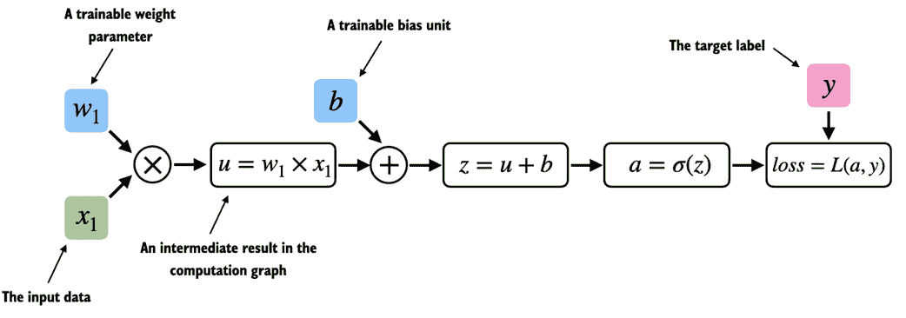

# 附录 A. PyTorch 简介

### 本章涵盖

+   PyTorch 深度学习库概述

+   为深度学习设置环境和工作空间

+   张量作为深度学习的基本数据结构

+   训练深度神经网络的机制

+   在 GPU 上训练模型

本章旨在为您提供将深度学习付诸实践和从零开始实现大型语言模型（LLMs）所需的技能和知识。

我们将介绍 PyTorch，这是一款流行的基于 Python 的深度学习库，它将是本书余下部分的主要工具。本章还将指导您设置一个配备 PyTorch 和 GPU 支持的深度学习工作空间。

然后，您将学习张量的基本概念及其在 PyTorch 中的使用。我们还将*深入探讨*PyTorch 的自动微分引擎，这一特性使我们能够方便高效地使用反向传播，这是神经网络训练的关键方面。

请注意，本章是为那些对 PyTorch 深度学习不熟悉的读者准备的入门指南。虽然本章从基础讲解了 PyTorch，但并不打算全面覆盖 PyTorch 库。相反，本章关注我们将在本书中用于实现 LLMs 的 PyTorch 基础知识。如果您已经熟悉深度学习，可以跳过此附录，直接进入第二章，处理文本数据。

## A.1 什么是 PyTorch

*PyTorch* (`pytorch.org/`)是一个开源的基于 Python 的深度学习库。根据*Papers With Code* (`paperswithcode.com/trends`)，一个跟踪和分析研究论文的平台，自 2019 年以来，PyTorch 已经成为研究中使用最广泛的深度学习库。而根据*2022 年 Kaggle 数据科学与机器学习调查* (`www.kaggle.com/c/kaggle-survey-2022`)，使用 PyTorch 的受访者人数约为 40%，并且每年不断增长。

PyTorch 如此受欢迎的原因之一是其用户友好的界面和高效性。然而，尽管其易用性不妥协灵活性，仍为高级用户提供了调整模型底层细节以进行定制和优化的能力。简而言之，对于许多从业者和研究人员而言，PyTorch 在可用性和功能之间提供了恰到好处的平衡。

在接下来的子章节中，我们将定义 PyTorch 所提供的主要功能。

### A.1.1 PyTorch 的三个核心组成部分

PyTorch 是一个相对全面的库，一种方法是关注其三个广泛的组成部分，这些组成部分在图 A.1 中进行了总结。

##### 图 A.1 PyTorch 的三个主要组件包括张量库，作为计算的基本构建块，自动微分用于模型优化，以及深度学习工具函数，使得实现和训练深度神经网络模型更加简便。


首先，PyTorch 是一个*张量库*，扩展了数组导向编程库 NumPy 的概念，并增加了在 GPU 上加速计算的功能，从而实现 CPU 和 GPU 之间的无缝切换。

其次，PyTorch 是一个*自动微分引擎*，也称为 autograd，能够自动计算张量操作的梯度，从而简化反向传播和模型优化。

最后，PyTorch 是一个*深度学习库*，意味着它提供了模块化、灵活和高效的构建块（包括预训练模型、损失函数和优化器），用于设计和训练各种深度学习模型，满足研究人员和开发者的需求。

在定义深度学习这个术语并在接下来的两个小节中安装 PyTorch 后，本章的其余部分将更详细地探讨 PyTorch 的这三个核心组件，并提供实践代码示例。

### A.1.2 定义深度学习

LLMs 通常在新闻中被称为*AI*模型。然而，如第一章（*1.1 什么是 LLM?*）的第一部分所示，LLMs 也是一种深度神经网络，而 PyTorch 是一个深度学习库。这听起来让人困惑吗？在继续之前，我们花点时间总结一下这些术语之间的关系。

AI 的本质是创建能够执行通常需要人类智慧的任务的计算机系统。这些任务包括理解自然语言、识别模式和做出决策。（尽管取得了显著进展，AI 仍然离实现这种普遍智能的水平很远。）

*机器学习*代表了 AI 的一个子领域（如图 A.2 所示），专注于开发和改进学习算法。机器学习的关键思想是使计算机能够从数据中学习，并在没有明确编程的情况下做出预测或决策。这涉及开发能够识别模式并从历史数据中学习的算法，随着数据和反馈的增加，改善其性能。

##### 图 A.2 深度学习是机器学习的一个子类别，专注于深度神经网络的实现。反过来，机器学习是 AI 的一个子类别，关注从数据中学习的算法。AI 是机器能够执行通常需要人类智慧的任务的更广泛概念。


机器学习在人工智能的发展中起到了不可或缺的作用，为我们今天看到的许多进步提供了动力，包括 LLMs。机器学习还推动了在线零售商和流媒体服务所使用的推荐系统、电子邮件垃圾邮件过滤、虚拟助手中的语音识别，甚至自动驾驶汽车等技术的发展。机器学习的引入和进步显著增强了人工智能的能力，使其能够超越严格的基于规则的系统，并适应新的输入或变化的环境。

*深度学习*是机器学习的一个子类别，专注于深度神经网络的训练和应用。这些深度神经网络最初受到人脑工作方式的启发，特别是许多神经元之间的相互连接。深度学习中的“深度”是指人工神经元或节点的多个隐藏层，使它们能够建模数据中的复杂非线性关系。

与传统机器学习技术擅长简单模式识别不同，深度学习在处理非结构化数据（如图像、音频或文本）方面特别优秀，因此深度学习特别适合 LLMs。

机器学习和深度学习中的典型预测建模工作流程（也称为*监督学习*）在图 A.3 中进行了总结。

##### 图 A.3 监督学习的预测建模工作流程包括一个训练阶段，在该阶段模型在标记示例的训练数据集上进行训练。然后，可以使用训练好的模型预测新观测的标签。


使用学习算法，模型在由示例和相应标签组成的训练数据集上进行训练。例如，在电子邮件垃圾邮件分类器的案例中，训练数据集包含了电子邮件及其被人工识别的*垃圾邮件*和*非垃圾邮件*标签。然后，训练好的模型可以用于新的观测（新电子邮件），以预测其未知标签（*垃圾邮件*或*非垃圾邮件*）。

当然，我们还希望在训练和推理阶段之间添加模型评估，以确保模型在用于实际应用之前满足我们的性能标准。

请注意，训练和使用大型语言模型（LLMs）的工作流程，如我们在本书后面将看到的，类似于图 A.3 中所示的工作流程，尤其是当我们训练它们以分类文本时。如果我们感兴趣的是训练 LLMs 以生成文本，这是本书的主要重点，图 A.3 仍然适用。在这种情况下，预训练期间的标签可以从文本本身派生（第一章介绍的下一个词预测任务）。在推理时，LLM 将根据输入提示生成全新的文本（而不是预测标签）。

### A.1.3 安装 PyTorch

PyTorch 可以像其他任何 Python 库或包一样进行安装。然而，由于 PyTorch 是一个全面的库，包含 CPU 和 GPU 兼容的代码，安装可能需要额外的说明。

##### Python 版本

许多科学计算库并不立即支持最新版本的 Python。因此，在安装 PyTorch 时，建议使用版本比最新版本低一到两个发布的 Python。例如，如果 Python 的最新版本是 3.13，建议使用 Python 3.10 或 3.11。

例如，PyTorch 有两个版本：一个仅支持 CPU 计算的精简版本和一个支持 CPU 和 GPU 计算的版本。如果您的机器有一个可以用于深度学习的 CUDA 兼容 GPU（理想情况下是 NVIDIA T4、RTX 2080 Ti 或更新型号），我建议安装 GPU 版本。无论如何，安装 PyTorch 的默认命令如下，在代码终端中执行：

```py
pip install torch
```

假设您的计算机支持 CUDA 兼容的 GPU。在这种情况下，如果您所使用的 Python 环境安装了必要的依赖项（如 pip），将自动安装支持 CUDA 加速的 PyTorch 版本。

##### 用于深度学习的 AMD GPU

截至撰写本文时，PyTorch 还通过 ROCm 增加了对 AMD GPU 的实验性支持。请参见 [`pytorch.org`](https://pytorch.org) 以获取额外的说明。

然而，为了明确安装兼容 CUDA 的 PyTorch 版本，通常最好指定希望 PyTorch 兼容的 CUDA 版本。PyTorch 的官方网站 ([`pytorch.org`](https://pytorch.org)) 提供了针对不同操作系统安装带 CUDA 支持的 PyTorch 的命令，如图 A.4 所示。

##### 图 A.4 访问 PyTorch 安装推荐页面 [`pytorch.org`](https://pytorch.org)，以自定义并选择适合您系统的安装命令。


（请注意，图 A.4 中显示的命令还将安装 `torchvision` 和 `torchaudio` 库，这些库对本书是可选的。）

截至撰写本文时，本书基于 PyTorch 2.0.1，因此建议使用以下安装命令来安装确切版本，以确保与本书的兼容性：

```py
pip install torch==2.0.1
```

然而，正如前面提到的，考虑到您的操作系统，安装命令可能与上述显示的略有不同。因此，我建议访问 [`pytorch.org`](https://pytorch.org) 网站，并使用安装菜单（见图 A4）选择适合您操作系统的安装命令，并在该命令中将 `torch` 替换为 `torch==2.0.1`。

要检查 PyTorch 的版本，您可以在 PyTorch 中执行以下代码：

```py
import torch
torch.__version__
```

这将输出：

```py
'2.0.1'
```

##### PyTorch 和 Torch

请注意，Python 库名为“torch”，主要是因为它是 Torch 库的延续，但适用于 Python（因此称为“PyTorch”）。名称“torch”承认该库在 Torch 中的根基，Torch 是一个广泛支持机器学习算法的科学计算框架，最初使用 Lua 编程语言创建。

如果你正在寻找有关设置 Python 环境或安装本书后面使用的其他库的额外建议和说明，我建议访问本书的补充 GitHub 存储库 [`github.com/rasbt/LLMs-from-scratch`](https://github.com/rasbt/LLMs-from-scratch)。

安装 PyTorch 后，你可以通过在 Python 中运行以下代码来检查你的安装是否识别内置的 NVIDIA GPU：

```py
import torch
torch.cuda.is_available()
```

这将返回：

```py
True
```

如果命令返回 True，说明你一切准备就绪。如果命令返回 False，你的计算机可能没有兼容的 GPU，或者 PyTorch 无法识别它。虽然本书前面的章节集中于实现 LLMs 以供教育目的，并不要求使用 GPU，但它们可以显著加速与深度学习相关的计算。

如果你没有 GPU，可以使用几个云计算提供商，在每小时收费的基础上运行 GPU 计算。一个流行的类似 Jupyter Notebook 的环境是 Google Colab（[`colab.research.google.com`](https://colab.research.google.com)），它在撰写本文时提供时间限制的 GPU 访问。使用“运行时”菜单，可以选择 GPU，如图 A.5 所示的屏幕截图。

##### 图 A.5 在 *运行时/更改运行时类型* 菜单中为 Google Colab 选择 GPU 设备。


##### 在 Apple Silicon 上的 PyTorch

如果你有一台配备 Apple Silicon 芯片（如 M1、M2、M3 或更新型号）的 Apple Mac，你可以利用其功能加速 PyTorch 代码执行。要在 PyTorch 中使用你的 Apple Silicon 芯片，你需要像平常一样安装 PyTorch。然后，为了检查你的 Mac 是否支持利用 Apple Silicon 芯片加速 PyTorch，你可以在 Python 中运行一个简单的代码片段：

```py
print(torch.backends.mps.is_available())
```

如果返回 `True`，这意味着你的 Mac 具有可以用于加速 PyTorch 代码的 Apple Silicon 芯片。

##### 练习 A.1

在你的计算机上安装和设置 PyTorch。

##### 练习 A.2

在 [`github.com/rasbt/LLMs-from-scratch`](https://github.com/rasbt/LLMs-from-scratch) 运行补充的第二章代码，检查你的环境是否设置正确。

## A.2 理解张量

张量代表一个数学概念，它将向量和矩阵推广到更高的维度。换句话说，张量是可以通过其阶（或秩）来表征的数学对象，这提供了维度的数量。例如，标量（仅为一个数字）是秩为 0 的张量，向量是秩为 1 的张量，矩阵是秩为 2 的张量，如图 A.6 所示。

##### 图 A.6 展示了不同秩的张量的示例。这里 0D 对应秩 0，1D 对应秩 1，2D 对应秩 2。请注意，由 3 个元素组成的 3D 向量仍然是秩 1 的张量。


从计算的角度来看，张量作为数据容器。例如，它们存储多维数据，每个维度代表不同的特征。张量库，如 PyTorch，可以高效地创建、操作和计算这些多维数组。在这个背景下，张量库的功能类似于数组库。

PyTorch 张量类似于 NumPy 数组，但具有对深度学习重要的多个附加功能。例如，PyTorch 添加了自动微分引擎，简化了*计算梯度*的过程，如第 2.4 节后面讨论的那样。PyTorch 张量还支持 GPU 计算，以加速深度神经网络的训练，我们将在第 2.8 节中讨论。

##### PyTorch 具有类似 NumPy 的 API

正如你将在接下来的章节中看到的，PyTorch 在张量操作中采用了大多数 NumPy 数组 API 和语法。如果你对 NumPy 不太熟悉，可以通过我的文章《Python 中的科学计算：NumPy 和 Matplotlib 入门》获得对最相关概念的简要概述，链接为[`sebastianraschka.com/blog/2020/numpy-intro.html`](https://sebastianraschka.com/blog/2020/numpy-intro.html)。

以下小节将探讨 PyTorch 张量库的基本操作，展示如何创建简单张量并介绍一些基本操作。

### A.2.1 标量、向量、矩阵和张量

如前所述，PyTorch 张量是数组结构的数据容器。标量是 0 维张量（例如，仅一个数字），向量是 1 维张量，矩阵是 2 维张量。对于更高维的张量，没有特定的术语，因此我们通常将 3 维张量称为 3D 张量，以此类推。

我们可以使用`torch.tensor`函数创建 PyTorch 的`Tensor`类对象，如下所示：

##### 列表 A.1 创建 PyTorch 张量

```py
import torch

tensor0d = torch.tensor(1) #A

tensor1d = torch.tensor([1, 2, 3]) #B

tensor2d = torch.tensor([[1, 2], [3, 4]]) #C

tensor3d = torch.tensor([[[1, 2], [3, 4]], [[5, 6], [7, 8]]]) #D
```

### A.2.2 张量数据类型

在前一节中，我们从 Python 整数创建了张量。在这种情况下，PyTorch 采用 Python 的默认 64 位整数数据类型。我们可以通过张量的`.dtype`属性访问张量的数据类型：

```py
tensor1d = torch.tensor([1, 2, 3])
print(tensor1d.dtype)
```

这将打印：

```py
torch.int64
```

如果我们从 Python 浮点数创建张量，PyTorch 默认会创建 32 位精度的张量，正如下文所示：

```py
floatvec = torch.tensor([1.0, 2.0, 3.0])
print(floatvec.dtype)
```

输出是：

```py
torch.float32
```

这一选择主要是由于精度和计算效率之间的平衡。32 位浮点数对大多数深度学习任务提供了足够的精度，同时占用的内存和计算资源少于 64 位浮点数。此外，GPU 架构已针对 32 位计算进行优化，使用这种数据类型可以显著加快模型训练和推理的速度。

此外，可以使用张量的`.to`方法轻松更改精度。以下代码演示了如何将 64 位整数张量更改为 32 位浮点张量：

```py
floatvec = tensor1d.to(torch.float32)
print(floatvec.dtype)
```

这将返回：

```py
torch.float32
```

有关 PyTorch 中不同张量数据类型的更多信息，我建议查看官方文档 `pytorch.org/docs/stable/tensors.html`。

### A.2.3 常见的 PyTorch 张量操作

对所有不同 PyTorch 张量操作和命令的全面覆盖超出了本书的范围。然而，我们将在书中介绍时简要描述相关操作。

在我们进入下一个涵盖计算图背后概念的部分之前，下面是最基本的 PyTorch 张量操作列表。

我们已经介绍了`torch.tensor()`函数来创建新的张量。

```py
tensor2d = torch.tensor([[1, 2, 3], [4, 5, 6]])
print(tensor2d)
```

这将打印：

```py
tensor([[1, 2, 3],
        [4, 5, 6]])
```

此外，`.shape`属性允许我们访问张量的形状：

```py
print(tensor2d.shape)
```

输出为：

```py
torch.Size([2, 3])
```

如上所示，`.shape`返回`[2, 3]`，这意味着张量有 2 行 3 列。要将张量重塑为 3 乘 2 的张量，我们可以使用`.reshape`方法：

```py
print(tensor2d.reshape(3, 2))
```

这将打印：

```py
tensor([[1, 2],
        [3, 4],
        [5, 6]])
```

不过，请注意，PyTorch 中更常见的张量重塑命令是`.view()`：

```py
print(tensor2d.view(3, 2))
```

输出为：

```py
tensor([[1, 2],
        [3, 4],
        [5, 6]])
```

类似于`.reshape`和`.view`，PyTorch 在执行相同计算时提供了多种语法选项。这是因为 PyTorch 最初遵循原始 Lua Torch 语法约定，但在广泛请求下也增加了与 NumPy 更相似的语法。

接下来，我们可以使用`.T`来转置一个张量，这意味着在其对角线上翻转它。请注意，这与重塑张量类似，正如您在下面的结果中看到的：

```py
print(tensor2d.T)
```

输出为：

```py
tensor([[1, 4],
        [2, 5],
        [3, 6]])
```

最后，在 PyTorch 中乘以两个矩阵的常见方式是`.matmul`方法：

```py
print(tensor2d.matmul(tensor2d.T))
```

输出为：

```py
tensor([[14, 32],
        [32, 77]])
```

不过，我们也可以采用`@`运算符，它以更紧凑的方式实现相同的功能：

```py
print(tensor2d @ tensor2d.T)
```

这将打印：

```py
tensor([[14, 32],
        [32, 77]])
```

如前所述，我们将在本书中根据需要介绍额外的操作。对于希望浏览 PyTorch 中所有不同张量操作的读者（提示：我们不需要其中的大部分），我推荐查看官方文档 `pytorch.org/docs/stable/tensors.html`。

## A.3 将模型视为计算图

在上一节中，我们介绍了 PyTorch 的三个主要组成部分之一，即其张量库。接下来是 PyTorch 的自动微分引擎，也称为 autograd。PyTorch 的 autograd 系统提供了在动态计算图中自动计算梯度的功能。但是在我们深入探讨下一节的梯度计算之前，让我们定义一下计算图的概念。

计算图（或简称计算图）是一个有向图，允许我们表达和可视化数学表达式。在深度学习的背景下，计算图展示了计算神经网络输出所需的计算顺序——我们稍后需要这个图来计算反向传播所需的梯度，这是神经网络的主要训练算法。

让我们看一个具体的例子来阐明计算图的概念。以下代码实现了一个简单逻辑回归分类器的前向传播（预测步骤），可以视为一个单层神经网络，返回一个在 0 和 1 之间的分数，该分数在计算损失时与真实类别标签（0 或 1）进行比较：

##### 清单 A.2 逻辑回归前向传播

```py
import torch.nn.functional as F   #A

y = torch.tensor([1.0])  #B
x1 = torch.tensor([1.1]) #C
w1 = torch.tensor([2.2]) #D
b = torch.tensor([0.0])  #E
z = x1 * w1 + b          #F
a = torch.sigmoid(z)     #G

loss = F.binary_cross_entropy(a, y)
```

如果上述代码中的所有组件对你来说不太清楚，不用担心。这个例子的重点不是实现逻辑回归分类器，而是阐明我们如何将一系列计算视为计算图，如图 A.7 所示。

##### 图 A.7 逻辑回归前向传播作为计算图。输入特征*x*[1]与模型权重*w*[1]相乘，并在加上偏置后通过激活函数*σ*。通过将模型输出*a*与给定标签*y*进行比较来计算损失。



实际上，PyTorch 在后台构建这样的计算图，我们可以利用它来计算损失函数相对于模型参数（这里是 w1 和 b）的梯度，以训练模型，这是接下来部分的主题。

## A.4 自动微分简易入门

在上一节中，我们介绍了计算图的概念。如果我们在 PyTorch 中进行计算，如果其一个终端节点的`requires_grad`属性被设置为`True`，它将默认在内部构建这样的图。这在我们想计算梯度时非常有用。训练神经网络时需要梯度，通过流行的反向传播算法实现，可以视为神经网络中的微积分*链式法则*的实现，图 A.8 对此进行了说明。

##### 图 A.8 在计算图中计算损失梯度的最常见方法是从右到左应用链式法则，这也称为反向模型自动微分或反向传播。这意味着我们从输出层（或损失本身）开始，向后通过网络到达输入层。这样做是为了计算损失相对于网络中每个参数（权重和偏置）的梯度，从而告知我们在训练过程中如何更新这些参数。


#### 偏导数和梯度

图 A.8 显示了偏导数，它们测量函数相对于其变量之一的变化率。梯度是一个向量，包含了多元函数的所有偏导数，即输入变量不止一个的函数。

如果你对偏导数、梯度或微积分的链式法则不熟悉或记不清，不用担心。总体来说，本书中你需要知道的是，链式法则是一种计算损失函数相对于模型参数在计算图中梯度的方法。这提供了更新每个参数所需的信息，以最小化损失函数，损失函数用来作为衡量模型性能的代理，使用梯度下降等方法。我们将在第 2.7 节 *典型的训练循环* 中重新审视 PyTorch 中这一训练循环的计算实现。

那么，这与我们之前提到的 PyTorch 库的第二个组件，即自动微分（autograd）引擎有何关系呢？通过跟踪对张量执行的每个操作，PyTorch 的 autograd 引擎在后台构建了一个计算图。然后，通过调用 `grad` 函数，我们可以计算损失相对于模型参数 `w1` 的梯度，具体如下：

##### 列表 A.3 通过 autograd 计算梯度

```py
import torch.nn.functional as F
from torch.autograd import grad

y = torch.tensor([1.0])
x1 = torch.tensor([1.1])
w1 = torch.tensor([2.2], requires_grad=True)
b = torch.tensor([0.0], requires_grad=True)

z = x1 * w1 + b 
a = torch.sigmoid(z)

loss = F.binary_cross_entropy(a, y)

grad_L_w1 = grad(loss, w1, retain_graph=True)  #A
grad_L_b = grad(loss, b, retain_graph=True)

```

让我们展示损失相对于模型参数的结果值：

```py
print(grad_L_w1)
print(grad_L_b)
```

输出为：

```py
(tensor([-0.0898]),)
(tensor([-0.0817]),)
```

以上，我们一直在“手动”使用 grad 函数，这对实验、调试和概念演示非常有用。但在实践中，PyTorch 提供了更高级的工具来自动化这一过程。例如，我们可以在损失上调用 `.backward`，PyTorch 将计算图中所有叶子节点的梯度，这些梯度将通过张量的 `.grad` 属性存储：

```py
loss.backward()
print(w1.grad)
print(b.grad)
```

输出结果是：

```py
(tensor([-0.0898]),)
(tensor([-0.0817]),)
```

如果这一部分的信息量很大，而你对微积分的概念感到困惑，不用担心。虽然这些微积分术语是用来解释 PyTorch 的 autograd 组件，但你只需记住这一部分的关键是 PyTorch 通过 `.backward` 方法为我们处理微积分——在本书中我们不需要手动计算任何导数或梯度。

## A.5 实现多层神经网络

在之前的部分中，我们讨论了 PyTorch 的张量和 autograd 组件。本节重点介绍 PyTorch 作为实现深度神经网络的库。

为了提供一个具体的例子，我们关注于多层感知器，这是一种全连接神经网络，如图 A.9 所示。

##### 图 A.9 展示了一个具有 2 个隐藏层的多层感知器的示意图。每个节点代表相应层中的一个单元。为了说明，每层只有非常少量的节点。


在 PyTorch 中实现神经网络时，我们通常会子类化`torch.nn.Module`类以定义我们自己的自定义网络架构。这个`Module`基类提供了许多功能，使构建和训练模型变得更容易。例如，它允许我们封装层和操作，并跟踪模型的参数。

在这个子类中，我们在`__init__`构造函数中定义网络层，并指定它们在前向方法中的交互。前向方法描述了输入数据如何通过网络，并作为计算图结合在一起。

相比之下，反向方法通常不需要我们自己实现，在训练期间用于计算损失函数相对于模型参数的梯度，正如我们将在 2.7 节中看到的，*典型的训练循环*。

以下代码实现了一个经典的具有两个隐藏层的多层感知机，以说明`Module`类的典型用法：

##### 列表 A.4 一个具有两个隐藏层的多层感知机

```py
class NeuralNetwork(torch.nn.Module):
    def __init__(self, num_inputs, num_outputs):  #A
        super().__init__()

        self.layers = torch.nn.Sequential(

            # 1st hidden layer
            torch.nn.Linear(num_inputs, 30),  #B
            torch.nn.ReLU(),  #C

            # 2nd hidden layer
            torch.nn.Linear(30, 20),  #D
            torch.nn.ReLU(),

            # output layer
            torch.nn.Linear(20, num_outputs),
        )

    def forward(self, x):
        logits = self.layers(x)
        return logits   #E

```

然后我们可以如下实例化一个新的神经网络对象：

```py
model = NeuralNetwork(50, 3)
```

但在使用这个新的`model`对象之前，通常调用`print`以查看模型结构的摘要是很有用的：

```py
print(model)
```

这将打印：

```py
NeuralNetwork(
  (layers): Sequential(
    (0): Linear(in_features=50, out_features=30, bias=True)
    (1): ReLU()
    (2): Linear(in_features=30, out_features=20, bias=True)
    (3): ReLU()
    (4): Linear(in_features=20, out_features=3, bias=True)
  )
)
```

请注意，在实现`NeuralNetwork`类时，我们使用了`Sequential`类。使用 Sequential 不是必须的，但如果我们有一系列希望按特定顺序执行的层，这会让我们的生活更轻松，就像这里的情况一样。这样，在`__init__`构造函数中实例化`self.layers = Sequential(...)`后，我们只需调用`self.layers`，而不是在`NeuralNetwork`的`forward`方法中逐个调用每层。

接下来，让我们检查该模型的可训练参数总数：

```py
num_params = sum(p.numel() for p in model.parameters() if p.requires_grad)
print("Total number of trainable model parameters:", num_params)
```

这将打印：

```py
Total number of trainable model parameters: 2213
```

请注意，`requires_grad=True`的每个参数都被视为一个可训练参数，并将在训练期间更新（稍后在 2.7 节中会详细介绍，*典型的训练循环*）。

在我们上面的两个隐藏层的神经网络模型中，这些可训练参数包含在`torch.nn.Linear`层中。一个*线性*层将输入与权重矩阵相乘，并添加一个偏置向量。这有时也被称为*前馈*层或*全连接*层。

根据我们上面执行的`print(model)`调用，我们可以看到第一个`Linear`层位于层属性的索引位置 0。我们可以如下访问相应的权重参数矩阵：

```py
print(model.layers[0].weight)
```

这将打印：

```py
Parameter containing:
tensor([[ 0.1174, -0.1350, -0.1227,  ...,  0.0275, -0.0520, -0.0192],
        [-0.0169,  0.1265,  0.0255,  ..., -0.1247,  0.1191, -0.0698],
        [-0.0973, -0.0974, -0.0739,  ..., -0.0068, -0.0892,  0.1070],
        ...,
        [-0.0681,  0.1058, -0.0315,  ..., -0.1081, -0.0290, -0.1374],
        [-0.0159,  0.0587, -0.0916,  ..., -0.1153,  0.0700,  0.0770],
        [-0.1019,  0.1345, -0.0176,  ...,  0.0114, -0.0559, -0.0088]],
       requires_grad=True)
```

由于这是一个未完全显示的大矩阵，让我们使用`.shape`属性来显示它的维度：

```py
print(model.layers[0].weight.shape)
```

结果是：

```py
torch.Size([30, 50])
```

（同样，你可以通过`model.layers[0].bias`访问偏置向量。）

上面的权重矩阵是一个 30x50 的矩阵，我们可以看到`requires_grad`被设置为`True`，这意味着其条目是可训练的——这是`torch.nn.Linear`中权重和偏置的默认设置。

注意，如果您在计算机上执行上面的代码，权重矩阵中的数字可能与上述数字不同。这是因为模型权重是用小随机数初始化的，每次实例化网络时都不同。在深度学习中，用小随机数初始化模型权重是为了在训练期间打破对称性——否则，节点将在反向传播期间执行相同的操作和更新，这将不允许网络学习输入到输出的复杂映射。

然而，尽管我们希望继续使用小随机数作为层权重的初始值，但我们可以通过使用`manual_seed`为 PyTorch 的随机数生成器设置种子来使随机数初始化可重现：

```py
torch.manual_seed(123)
model = NeuralNetwork(50, 3)
print(model.layers[0].weight)
```

结果是：

```py
Parameter containing:
tensor([[-0.0577,  0.0047, -0.0702,  ...,  0.0222,  0.1260,  0.0865],
        [ 0.0502,  0.0307,  0.0333,  ...,  0.0951,  0.1134, -0.0297],
        [ 0.1077, -0.1108,  0.0122,  ...,  0.0108, -0.1049, -0.1063],
        ...,
        [-0.0787,  0.1259,  0.0803,  ...,  0.1218,  0.1303, -0.1351],
        [ 0.1359,  0.0175, -0.0673,  ...,  0.0674,  0.0676,  0.1058],
        [ 0.0790,  0.1343, -0.0293,  ...,  0.0344, -0.0971, -0.0509]],
       requires_grad=True)
```

现在，在花了一些时间检查`NeuraNetwork`实例后，让我们简要看看它是如何通过前向传播使用的：

```py
torch.manual_seed(123)
X = torch.rand((1, 50))
out = model(X)
print(out)
```

结果是：tensor([[-0.1262, 0.1080, -0.1792]], `grad_fn=<AddmmBackward0>`)

在上面的代码中，我们生成了一个单一的随机训练示例`X`作为玩具输入（注意我们的网络期望 50 维特征向量），并将其输入到模型中，返回三个分数。当我们调用`model(x)`时，它会自动执行模型的前向传播。

前向传播是指从输入张量计算输出张量。这涉及将输入数据通过所有神经网络层，开始于输入层，通过隐藏层，最终到达输出层。

上面返回的这三个数字对应于分配给三个输出节点的分数。注意，输出张量也包含一个`grad_fn`值。

这里，`grad_fn=<AddmmBackward0>`表示在计算图中计算变量时最后使用的函数。特别地，`grad_fn=<AddmmBackward0>`意味着我们正在检查的张量是通过矩阵乘法和加法操作创建的。PyTorch 将在反向传播期间计算梯度时使用此信息。`grad_fn=<AddmmBackward0>`中的`<AddmmBackward0>`部分指定了执行的操作。在这种情况下，它是一个`Addmm`操作。`Addmm`代表矩阵乘法（`mm`）后接加法（`Add`）。

如果我们只是想使用一个网络而不进行训练或反向传播，例如，如果我们在训练后用于预测，那么为反向传播构建这个计算图可能是浪费，因为它会执行不必要的计算并消耗额外的内存。因此，当我们使用模型进行推理（例如，进行预测）而不是训练时，使用`torch.no_grad()`上下文管理器是一种最佳实践，如下所示。这告诉 PyTorch 它不需要跟踪梯度，这可以显著节省内存和计算。

```py
with torch.no_grad():
    out = model(X)
print(out)
```

结果是：

```py
tensor([[-0.1262,  0.1080, -0.1792]])
```

在 PyTorch 中，常见的做法是编写模型，使其返回最后一层的输出（logits），而不将其传递给非线性激活函数。这是因为 PyTorch 常用的损失函数将 softmax（对于二分类为 sigmoid）操作与负对数似然损失结合在一个类中。这样做的原因是为了数值效率和稳定性。因此，如果我们想为预测计算类别成员概率，就必须显式调用 `softmax` 函数：

```py
with torch.no_grad():
    out = torch.softmax(model(X), dim=1)
print(out)
```

这将打印：

```py
tensor([[0.3113, 0.3934, 0.2952]]))
```

这些值现在可以解释为类别成员概率，总和为 1。这些值对于这个随机输入大致相等，这是对于一个没有经过训练的随机初始化模型的预期结果。

在接下来的两个部分中，我们将学习如何设置高效的数据加载器并训练模型。

## A.6 设置高效的数据加载器

在上一节中，我们定义了一个自定义神经网络模型。在训练该模型之前，我们需要简要讨论在 PyTorch 中创建高效数据加载器的问题，我们将在训练模型时迭代这些加载器。数据加载的整体思路在图 A.10 中进行了说明。

##### 图 A.10 PyTorch 实现了 Dataset 和 DataLoader 类。Dataset 类用于实例化定义每个数据记录如何加载的对象。DataLoader 处理数据的洗牌和组装成批次的方式。


根据图 A.10 中的示例，在本节中，我们将实现一个自定义 Dataset 类，用于创建一个训练数据集和一个测试数据集，然后我们将用它们来创建数据加载器。

我们先创建一个简单的玩具数据集，包含五个训练示例，每个示例有两个特征。与训练示例相伴，我们还创建一个张量，包含相应的类标签：三个示例属于类 0，两个示例属于类 1。此外，我们还创建了一个包含两个条目的测试集。创建该数据集的代码如下所示。

##### 列表 A.5 创建一个小型玩具数据集

```py
X_train = torch.tensor([
    [-1.2, 3.1],
    [-0.9, 2.9],
    [-0.5, 2.6],
    [2.3, -1.1],
    [2.7, -1.5]
])
y_train = torch.tensor([0, 0, 0, 1, 1])

X_test = torch.tensor([
    [-0.8, 2.8],
    [2.6, -1.6],
])
y_test = torch.tensor([0, 1])
```

##### 类标签编号

PyTorch 要求类标签从标签 0 开始，最大类标签值不得超过输出节点数量减 1（因为 Python 的索引从 0 开始）。因此，如果我们有类标签 0、1、2、3 和 4，神经网络输出层应由 5 个节点组成。

接下来，我们通过从 PyTorch 的 `Dataset` 父类继承来创建一个自定义数据集类 `ToyDataset`，如下所示。

##### 列表 A.6 定义自定义 Dataset 类

```py
from torch.utils.data import Dataset

class ToyDataset(Dataset):
    def __init__(self, X, y):
        self.features = X
        self.labels = y

    def __getitem__(self, index):     #A
        one_x = self.features[index]  #A
        one_y = self.labels[index]    #A
        return one_x, one_y           #A

    def __len__(self):
        return self.labels.shape[0]   #B

train_ds = ToyDataset(X_train, y_train)
test_ds = ToyDataset(X_test, y_test)
```

这个自定义的 `ToyDataset` 类的目的是将其用于实例化 PyTorch 的 `DataLoader`。但在我们进入这一步之前，让我们简要回顾一下 `ToyDataset` 代码的一般结构。

在 PyTorch 中，自定义 Dataset 类的三个主要组成部分是 `__init__` 构造函数、`__getitem__` 方法和 `__len__` 方法，如上面的代码列表 A.6 所示。

在`__init__`方法中，我们设置了可以在`__getitem__`和`__len__`方法中访问的属性。这些可以是文件路径、文件对象、数据库连接等。由于我们创建了一个驻留在内存中的张量数据集，我们只是将`X`和`y`分配给这些属性，它们是我们张量对象的占位符。

在`__getitem__`方法中，我们定义了通过`index`从数据集中返回确切一项的指令。这意味着特征和与单个训练示例或测试实例对应的类别标签。（数据加载器将提供这个`index`，我们稍后会详细介绍。）

最后，`__len__`方法限制了检索数据集长度的指令。在这里，我们使用张量的`.shape`属性返回特征数组中的行数。在训练数据集的情况下，我们有五行，可以通过以下方式进行双重检查：

```py
print(len(train_ds))
```

结果是：

```py
5
```

既然我们定义了一个可以用于玩具数据集的 PyTorch Dataset 类，我们可以使用 PyTorch 的`DataLoader`类从中进行采样，如下面的代码清单所示：

##### 清单 A.7 实例化数据加载器

```py
from torch.utils.data import DataLoader

torch.manual_seed(123)

train_loader = DataLoader(
    dataset=train_ds,  #A
    batch_size=2,
    shuffle=True,  #B
    num_workers=0  #C
)

test_loader = DataLoader(
    dataset=test_ds,
    batch_size=2,
    shuffle=False,  #D
    num_workers=0
)
```

在实例化训练数据加载器后，我们可以如下面所示进行迭代。（对`test_loader`的迭代类似，但出于简洁性省略了。）

```py
for idx, (x, y) in enumerate(train_loader):
    print(f"Batch {idx+1}:", x, y)
```

结果是：

```py
Batch 1: tensor([[-1.2000,  3.1000],
                 [-0.5000,  2.6000]]) tensor([0, 0])
Batch 2: tensor([[ 2.3000, -1.1000],
                 [-0.9000,  2.9000]]) tensor([1, 0])
Batch 3: tensor([[ 2.7000, -1.5000]]) tensor([1])
```

根据上面的输出，我们可以看到，`train_loader`遍历训练数据集，每个训练示例恰好访问一次。这被称为训练周期。由于我们在上面使用`torch.manual_seed(123)`设置了随机数生成器的种子，你应该得到与上面相同的训练示例洗牌顺序。然而，如果你第二次遍历数据集，你会看到洗牌顺序会改变。这是为了防止深度神经网络在训练期间陷入重复的更新循环。

请注意，我们在上面指定了批量大小为 2，但第 3 个批次仅包含一个示例。这是因为我们有五个训练示例，无法被 2 整除。在实践中，训练周期的最后一个批次要小得多，可能会影响训练过程中的收敛。为此，建议设置`drop_last=True`，这将丢弃每个周期中的最后一个批次，如下所示：

##### 清单 A.8 一个丢弃最后批次的训练加载器

```py
train_loader = DataLoader(
    dataset=train_ds,
    batch_size=2,
    shuffle=True,
    num_workers=0,
    drop_last=True
)
```

现在，遍历训练加载器，我们可以看到最后一个批次被省略：

```py
for idx, (x, y) in enumerate(train_loader):
    print(f"Batch {idx+1}:", x, y)
```

结果是：

```py
Batch 1: tensor([[-0.9000,  2.9000],
        [ 2.3000, -1.1000]]) tensor([0, 1])
Batch 2: tensor([[ 2.7000, -1.5000],
        [-0.5000,  2.6000]]) tensor([1, 0])
```

最后，让我们讨论在`DataLoader`中设置`num_workers=0`。在 PyTorch 的`DataLoader`函数中，这个参数对于并行化数据加载和预处理至关重要。当`num_workers`设置为 0 时，数据加载将在主进程中进行，而不是在单独的工作进程中进行。这看似没有问题，但在我们对 GPU 训练较大的网络时，它可能导致显著的减速。这是因为 CPU 不仅要专注于深度学习模型的处理，还要花时间加载和预处理数据。因此，GPU 可能在等待 CPU 完成这些任务时处于闲置状态。相比之下，当`num_workers`设置为大于零的数字时，会启动多个工作进程以并行加载数据，从而使主进程能够专注于训练模型，更好地利用系统资源，如图 A.11 所示。

##### 图 A.11 在没有多个工作进程的情况下加载数据（设置`num_workers=0`）将会造成数据加载瓶颈，使得模型在下一批次加载之前处于闲置状态，如左侧子面板所示。如果启用了多个工作进程，数据加载器可以在后台提前排队下一批数据，如右侧子面板所示。


然而，如果我们处理的是非常小的数据集，将`num_workers`设置为 1 或更大可能不是必要的，因为总训练时间只需几秒钟的碎片时间。相反，如果你在处理微小数据集或交互环境（如 Jupyter notebooks），增加`num_workers`可能不会带来明显的加速。实际上，它们可能会导致一些问题。一个潜在的问题是启动多个工作进程的开销，这可能会比实际数据加载所需的时间更长，当数据集较小时。

此外，对于 Jupyter notebooks，将`num_workers`设置为大于 0 有时可能会导致不同进程之间资源共享相关的问题，从而导致错误或笔记本崩溃。因此，理解权衡是至关重要的，并对设置`num_workers`参数做出计算过的决定。正确使用时，它可以是一个有益的工具，但应根据特定的数据集大小和计算环境进行调整，以获得最佳效果。

根据我的经验，将`num_workers=4`通常在许多实际数据集上会导致最佳性能，但最佳设置依赖于你的硬件以及在`Dataset`类中定义的加载训练示例的代码。

## A.7 一个典型的训练循环

到目前为止，我们已经讨论了训练神经网络的所有要求：PyTorch 的张量库、自动求导、`Module` API 和高效的数据加载器。现在，让我们将这些结合起来，在上一节中的玩具数据集上训练一个神经网络。训练代码如下所示于代码列表 A.9。

##### 列表 A.9 在 PyTorch 中训练神经网络

```py
import torch.nn.functional as F

torch.manual_seed(123)
model = NeuralNetwork(num_inputs=2, num_outputs=2)  #A
optimizer = torch.optim.SGD(model.parameters(), lr=0.5)  #B

num_epochs = 3

for epoch in range(num_epochs): 

    model.train()
    for batch_idx, (features, labels) in enumerate(train_loader):

        logits = model(features)

        loss = F.cross_entropy(logits, labels)

        optimizer.zero_grad()   #C
        loss.backward()         #D
        optimizer.step()        #E

        ### LOGGING
        print(f"Epoch: {epoch+1:03d}/{num_epochs:03d}"
              f" | Batch {batch_idx:03d}/{len(train_loader):03d}"
              f" | Train Loss: {loss:.2f}")

    model.eval()
    # Optional model evaluation
```

运行上面列表 A.9 中的代码会产生以下输出：

```py
Epoch: 001/003 | Batch 000/002 | Train Loss: 0.75
Epoch: 001/003 | Batch 001/002 | Train Loss: 0.65
Epoch: 002/003 | Batch 000/002 | Train Loss: 0.44
Epoch: 002/003 | Batch 001/002 | Trainl Loss: 0.13
Epoch: 003/003 | Batch 000/002 | Train Loss: 0.03
Epoch: 003/003 | Batch 001/002 | Train Loss: 0.00
```

如我们所见，损失在 3 个周期后达到了零，这表明模型在训练集上收敛。然而，在评估模型的预测之前，让我们回顾一下前面代码清单的一些细节。

首先，请注意我们初始化了一个具有两个输入和两个输出的模型。这是因为前一节的玩具数据集有两个输入特征和两个类标签要预测。我们使用了一个随机梯度下降（`SGD`）优化器，学习率（`lr`）为 0.5。学习率是一个超参数，意味着这是一个可调的设置，我们必须根据观察损失来进行实验。理想情况下，我们希望选择一个学习率，使得损失在一定数量的周期后收敛——周期数是另一个需要选择的超参数。

##### 练习 A.3

本节开头介绍的神经网络有多少个参数？

在实践中，我们通常会使用第三个数据集，即所谓的验证数据集，以找到最佳的超参数设置。验证数据集类似于测试集。然而，由于我们只希望使用测试集一次以避免偏倚评估，我们通常会多次使用验证集来调整模型设置。

我们还引入了新的设置`model.train()`和`model.eval()`。正如这些名称所暗示的，这些设置用于将模型置于训练模式和评估模式。这对在训练和推断期间表现不同的组件是必要的，例如*dropout*或*batch normalization*层。由于在我们的`NeuralNetwork`类中没有受到这些设置影响的 dropout 或其他组件，因此在上面的代码中使用`model.train()`和`model.eval()`是多余的。然而，出于最佳实践，仍然最好包含它们，以避免在更改模型架构或重用代码以训练不同模型时出现意外行为。

正如之前所讨论的，我们将 logits 直接传入`cross_entropy`损失函数，该函数将在内部应用 softmax 函数，以提高效率和数值稳定性。然后，调用`loss.backward()`将计算 PyTorch 在后台构建的计算图中的梯度。`optimizer.step()`方法将使用梯度更新模型参数，以最小化损失。在 SGD 优化器的情况下，这意味着将梯度与学习率相乘，并将缩放的负梯度添加到参数中。

##### 防止不必要的梯度累积

在每次更新轮次中，调用`optimizer.zero_grad()`以重置梯度为零是很重要的。否则，梯度会累积，这可能不是我们想要的。

在训练完模型后，我们可以用它进行预测，如下所示：

```py
model.eval()
with torch.no_grad():
    outputs = model(X_train)
print(outputs)
```

结果如下：

```py
tensor([[ 2.8569, -4.1618],
        [ 2.5382, -3.7548],
        [ 2.0944, -3.1820],
        [-1.4814,  1.4816],
        [-1.7176,  1.7342]])
```

为了获得类别成员概率，我们可以使用 PyTorch 的 softmax 函数，如下所示：

```py
torch.set_printoptions(sci_mode=False)
probas = torch.softmax(outputs, dim=1)
print(probas)
```

这输出：

```py
tensor([[    0.9991,     0.0009],
        [    0.9982,     0.0018],
        [    0.9949,     0.0051],
        [    0.0491,     0.9509],
        [    0.0307,     0.9693]])
```

我们考虑上面代码输出的第一行。这里，第一个值（列）意味着训练示例属于类别 0 的概率为 99.91%，属于类别 1 的概率为 0.09%。（`set_printoptions`调用用于使输出更易读。）

我们可以使用 PyTorch 的 argmax 函数将这些值转换为类别标签预测，如果我们设置`dim=1`，它将返回每行中最高值的索引位置（设置`dim=0`将返回每列中的最高值）：

```py
predictions = torch.argmax(probas, dim=1)
print(predictions)
```

这打印出：

```py
tensor([0, 0, 0, 1, 1])
```

请注意，计算类标签时不需要计算 softmax 概率。我们也可以直接对 logits（输出）应用`argmax`函数：

```py
predictions = torch.argmax(outputs, dim=1)
print(predictions)
```

输出是：

```py
tensor([0, 0, 0, 1, 1])
```

上面，我们计算了训练数据集的预测标签。由于训练数据集相对较小，我们可以通过目测将其与真实训练标签进行比较，看到模型是 100%正确的。我们可以使用==比较运算符进行二次检查：

```py
predictions == y_train
```

结果是：

```py
tensor([True, True, True, True, True])
```

使用`torch.sum`，我们可以计算正确预测的数量，如下所示：

```py
torch.sum(predictions == y_train)
```

输出是：

```py
5
```

由于数据集由 5 个训练示例组成，我们有 5 个正确的预测，即 5/5 × 100% = 100%预测准确率。

然而，为了使预测准确率的计算更具通用性，让我们实现一个`compute_accuracy`函数，如以下代码列表所示。

##### 列表 A.10 一个计算预测准确率的函数

```py
def compute_accuracy(model, dataloader):

    model = model.eval()
    correct = 0.0
    total_examples = 0

    for idx, (features, labels) in enumerate(dataloader):

        with torch.no_grad():
            logits = model(features)

        predictions = torch.argmax(logits, dim=1)
        compare = labels == predictions  #A
        correct += torch.sum(compare)  #B
        total_examples += len(compare)

    return (correct / total_examples).item() #C
```

请注意，以下代码列表遍历数据加载器以计算正确预测的数量和比例。这是因为当我们处理大型数据集时，通常只能对数据集的一小部分进行模型调用，因为内存限制。上面的`compute_accuracy`函数是一种通用方法，可以扩展到任意大小的数据集，因为在每次迭代中，模型接收到的数据集块大小与训练期间看到的批次大小相同。

请注意，`compute_accuracy`函数的内部逻辑与我们之前将 logits 转换为类别标签时使用的相似。

然后我们可以将该函数应用于训练集，如下所示：

```py
print(compute_accuracy(model, train_loader))
```

结果是：

```py
1.0
```

同样，我们可以将该函数应用于测试集，如下所示：

```py
>>> print(compute_accuracy(model, test_loader))
```

这打印出：

```py
1.0
```

在本节中，我们学习了如何使用 PyTorch 训练神经网络。接下来，让我们看看如何在训练后保存和恢复模型。

## A.8 保存和加载模型

在前面的部分，我们成功训练了一个模型。现在让我们看看如何保存一个训练好的模型以便后续使用。

这里是我们在 PyTorch 中保存和加载模型的推荐方法：

```py
torch.save(model.state_dict(), "model.pth")
```

模型的 state_dict 是一个 Python 字典对象，它将模型中的每一层映射到其可训练参数（权重和偏差）。请注意，`"model.pth"`是保存到磁盘的模型文件的任意文件名。我们可以给它任何我们喜欢的名称和文件后缀；然而，`.pth`和`.pt`是最常见的约定。

一旦我们保存了模型，就可以按如下方式从磁盘恢复它：

```py
model = NeuralNetwork(2, 2) 
model.load_state_dict(torch.load("model.pth"))
```

`torch.load("model.pth")` 函数读取文件 `"model.pth"` 并重建包含模型参数的 Python 字典对象，而 `model.load_state_dict()` 将这些参数应用于模型，有效地恢复其学习状态。

请注意，上面的行 `model = NeuralNetwork(2, 2)` 如果你在同一会话中执行此代码并且已保存了模型，则并不是严格必要的。然而，我在这里包含它是为了说明我们需要在内存中有模型的实例，以便应用保存的参数。在这里，`NeuralNetwork(2, 2)` 架构需要与原始保存模型完全匹配。

现在，我们已准备好在接下来的章节中使用 PyTorch 实现大型语言模型。然而，在我们跳到下一章之前，最后一节将向你展示如何使用一个或多个 GPU（如果可用）更快地训练 PyTorch 模型。

## A.9 使用 GPU 优化训练性能

在本章的最后一节中，我们将看到如何利用 GPU，这将加速深度神经网络训练，相比于常规 CPU。首先，我们将介绍 PyTorch 中 GPU 计算的主要概念。然后，我们将在单个 GPU 上训练一个模型。最后，我们将看看如何使用多个 GPU 进行分布式训练。

### A.9.1 PyTorch 在 GPU 设备上的计算

如你所见，将第 2.7 节中的训练循环修改为可选择在 GPU 上运行相对简单，仅需更改三行代码。

在进行修改之前，理解 PyTorch 中 GPU 计算的主要概念至关重要。首先，我们需要引入设备的概念。在 PyTorch 中，设备是计算发生的地方，数据也驻留在此。CPU 和 GPU 就是设备的例子。PyTorch 张量驻留在一个设备上，其操作在同一设备上执行。

让我们看看这在实际中是如何工作的。假设你已安装了与 GPU 兼容的 PyTorch 版本，如第 2.1.3 节“安装 PyTorch”中所述，我们可以通过以下代码双重检查我们的运行时确实支持 GPU 计算：

```py
print(torch.cuda.is_available())
```

结果是：

```py
True
```

现在，假设我们有两个张量，我们可以如下进行加法运算——这个计算默认将在 CPU 上进行：

```py
tensor_1 = torch.tensor([1., 2., 3.])
tensor_2 = torch.tensor([4., 5., 6.])
print(tensor_1 + tensor_2)
```

输出为：

```py
tensor([5., 7., 9.])
```

现在，我们可以使用 `.to()` 方法[[1]](#_ftn1) 将这些张量传输到 GPU 上并在那里进行加法运算：

```py
tensor_1 = tensor_1.to("cuda")
tensor_2 = tensor_2.to("cuda")
print(tensor_1 + tensor_2)
```

输出如下：

```py
tensor([5., 7., 9.], device='cuda:0')
```

注意，生成的张量现在包含设备信息 `device='cuda:0'`，这意味着张量驻留在第一个 GPU 上。如果你的机器上有多个 GPU，你可以选择指定要将张量传输到哪个 GPU。你可以通过在传输命令中指明设备 ID 来做到这一点。例如，你可以使用 `.to("cuda:0")`、`.to("cuda:1")`，等等。

但是，需要注意的是，所有张量必须位于同一设备上。否则，计算将失败，如下所示，其中一个张量位于 CPU 上，另一个位于 GPU 上：

```py
tensor_1 = tensor_1.to("cpu")
print(tensor_1 + tensor_2)
```

这会产生以下结果：

```py
RuntimeError      Traceback (most recent call last)
<ipython-input-7-4ff3c4d20fc3> in <cell line: 2>()
      1 tensor_1 = tensor_1.to("cpu")
----> 2 print(tensor_1 + tensor_2)
RuntimeError: Expected all tensors to be on the same device, but found at least two devices, cuda:0 and cpu!
```

在这一节中，我们了解到在 PyTorch 上进行 GPU 计算相对简单。我们所需做的就是将张量转移到同一个 GPU 设备上，PyTorch 会处理其余的部分。掌握了这些信息后，我们现在可以在 GPU 上训练前一节的神经网络。

### A.9.2 单 GPU 训练

既然我们已经熟悉了将张量转移到 GPU，我们可以修改来自*第 2.7 节，典型训练循环*的训练循环以在 GPU 上运行。这只需要更改三行代码，如下面的代码列表 A.11 所示。

##### 列表 A.11 GPU 上的训练循环

```py
torch.manual_seed(123)
model = NeuralNetwork(num_inputs=2, num_outputs=2)

device = torch.device("cuda")   #A
model = model.to(device)   #B

optimizer = torch.optim.SGD(model.parameters(), lr=0.5)

num_epochs = 3

for epoch in range(num_epochs):

    model.train()
    for batch_idx, (features, labels) in enumerate(train_loader):

        features, labels = features.to(device), labels.to(device)    #C
        logits = model(features)
        loss = F.cross_entropy(logits, labels) # Loss function

        optimizer.zero_grad()
        loss.backward()
        optimizer.step()

        ### LOGGING
        print(f"Epoch: {epoch+1:03d}/{num_epochs:03d}"
              f" | Batch {batch_idx:03d}/{len(train_loader):03d}"
              f" | Train/Val Loss: {loss:.2f}")

    model.eval()
    # Optional model evaluation

```

运行上述代码将输出以下内容，类似于之前在第 2.7 节中获得的 CPU 结果：

```py
Epoch: 001/003 | Batch 000/002 | Train/Val Loss: 0.75
Epoch: 001/003 | Batch 001/002 | Train/Val Loss: 0.65
Epoch: 002/003 | Batch 000/002 | Train/Val Loss: 0.44
Epoch: 002/003 | Batch 001/002 | Train/Val Loss: 0.13
Epoch: 003/003 | Batch 000/002 | Train/Val Loss: 0.03
Epoch: 003/003 | Batch 001/002 | Train/Val Loss: 0.00
```

我们也可以使用`.to("cuda")`替代`device = torch.device("cuda")`。正如我们在第 2.9.1 节中看到的，将张量转移到“cuda”而不是`torch.device("cuda")`同样有效且更简洁。我们还可以将语句修改为以下内容，这将使相同的代码在没有 GPU 的情况下也能在 CPU 上执行，这通常被认为是共享 PyTorch 代码时的最佳实践：

```py
device = torch.device("cuda" if torch.cuda.is_available() else "cpu")
```

在上述修改后的训练循环中，我们可能不会看到加速，因为从 CPU 到 GPU 的内存传输成本。但是，在训练深度神经网络，特别是大型语言模型时，我们可以期待显著的加速。

正如我们在这一节中看到的，在 PyTorch 上在单个 GPU 上训练模型相对简单。接下来，让我们介绍另一个概念：在多个 GPU 上训练模型。

##### macOS 上的 PyTorch

在带有 Apple Silicon 芯片（如 M1、M2、M3 或更新型号）的 Apple Mac 上，而不是带有 Nvidia GPU 的计算机上，你可以更改

```py
device = torch.device("cuda" if torch.cuda.is_available() else "cpu")
```

到

```py
device = torch.device("mps" if torch.backends.mps.is_available() else "cpu")
```

利用这个芯片。

##### 练习 A.4

比较 CPU 和 GPU 上的矩阵乘法运行时间。在哪个矩阵大小开始出现 GPU 上的矩阵乘法比 CPU 快的现象？提示：我建议在 Jupyter 中使用`%timeit`命令来比较运行时间。例如，给定矩阵`a`和`b`，在新的笔记本单元中运行命令`%timeit a @ b`。

### A.9.3 使用多个 GPU 进行训练

在这一节中，我们将简要概述分布式训练的概念。分布式训练是将模型训练分配到多个 GPU 和机器上的概念。

我们为什么需要这样做？即使可以在单个 GPU 或机器上训练模型，过程也可能非常耗时。通过将训练过程分散到多个机器上，每台机器可能有多个 GPU，可以显著减少训练时间。这在模型开发的实验阶段尤为重要，因为可能需要进行大量的训练迭代来微调模型参数和架构。

##### 多 GPU 计算是可选的。

对于本书，并不要求访问或使用多个 GPU。本节内容是为那些对 PyTorch 中多 GPU 计算如何运作感兴趣的读者而准备的。

在本节中，我们将查看分布式训练的最基本案例：PyTorch 的 `DistributedDataParallel`（DDP）策略。DDP 通过将输入数据分配到可用设备上，并同时处理这些数据子集来实现并行化。

这如何运作？PyTorch 在每个 GPU 上启动一个独立的进程，每个进程接收并保留模型的副本——这些副本将在训练过程中进行同步。为了说明这一点，假设我们有两个 GPU 想要用来训练一个神经网络，如图 A.12 所示。

##### 图 A.12 DDP 中模型和数据的传输涉及两个关键步骤。首先，我们在每个 GPU 上创建模型的副本。然后我们将输入数据划分为独特的小批量，并将其传递给每个模型副本。


两个 GPU 中的每一个都会接收模型的副本。然后，在每次训练迭代中，每个模型将从数据加载器接收一个小批量（或只是批量）。我们可以使用 `DistributedSampler` 来确保每个 GPU 在使用 DDP 时接收不同的、无重叠的批次。

由于每个模型副本将看到不同的训练数据样本，模型副本在后向传播时将返回不同的 logits 作为输出，并计算出不同的梯度。这些梯度在训练期间进行平均和同步，以更新模型。通过这种方式，我们确保模型不会偏离，如图 A.13 所示。

##### 图 A.13 DDP 中的前向和后向传播在每个 GPU 上独立执行，使用各自的数据子集。一旦前向和后向传播完成，来自每个模型副本（在每个 GPU 上）的梯度将在所有 GPU 之间同步。这确保了每个模型副本具有相同的更新权重。


使用 DDP 的好处是，相较于单个 GPU，它在处理数据集时提供了更快的速度。除了使用 DDP 时设备之间的小通信开销外，它在理论上可以在两个 GPU 上将一个训练周期的处理时间缩短到仅一个 GPU 的一半。随着 GPU 数量的增加，时间效率会进一步提升，如果我们有八个 GPU，则可以将一个周期的处理速度提高八倍，依此类推。

##### 交互环境中的多 GPU 计算。

DDP 在交互式 Python 环境（如 Jupyter notebooks）中无法正常工作，这些环境处理多进程的方式与独立的 Python 脚本不同。因此，以下代码应作为脚本执行，而不是在 Jupyter 等笔记本接口中执行。这是因为 DDP 需要生成多个进程，每个进程应有自己独立的 Python 解释器实例。

现在，让我们看看这在实践中的运作情况。为了简洁起见，我们将重点关注之前代码中需要为 DDP 训练进行调整的核心部分。然而，对于希望在自己多 GPU 机器或选择的云实例上运行代码的读者，建议使用本书 GitHub 库中提供的独立脚本，[`github.com/rasbt/LLMs-from-scratch`](https://github.com/rasbt/LLMs-from-scratch)。

首先，我们将导入一些额外的子模块、类和函数，以支持 PyTorch 的分布式训练，如列表 A.13 中的代码所示。

##### 列表 A.12 PyTorch 的分布式训练工具

```py
import torch.multiprocessing as mp
from torch.utils.data.distributed import DistributedSampler
from torch.nn.parallel import DistributedDataParallel as DDP
from torch.distributed import init_process_group, destroy_process_group
```

在我们深入了解使训练兼容 DDP 的更改之前，让我们简要回顾一下这些新导入的工具的基本原理和用法，这些工具与`DistributedDataParallel`类一起使用。

PyTorch 的`multiprocessing`子模块包含诸如`multiprocessing.spawn`等函数，我们将使用它来生成多个进程，并将一个函数应用于多个输入进行并行处理。我们将用它为每个 GPU 生成一个训练进程。

如果我们为训练生成多个进程，我们需要一种方法来将数据集划分到这些不同的进程中。为此，我们将使用`DistributedSampler`。

`init_process_group`和`destroy_process_group`用于初始化和退出分布式训练模式。`init_process_group`函数应在训练脚本开始时调用，以初始化分布式设置中的每个进程的进程组，`destroy_process_group`应在训练脚本结束时调用，以销毁特定的进程组并释放其资源。

以下代码在列表 A.13 中说明了如何使用这些新组件来实现我们之前实现的`NeuralNetwork`模型的 DDP 训练。

##### 列表 A.13 使用 DistributedDataParallel 策略进行模型训练

```py
def ddp_setup(rank, world_size):
    os.environ["MASTER_ADDR"] = "localhost"   #A
    os.environ["MASTER_PORT"] = "12345"       #B
    init_process_group(
        backend="nccl",                       #C
        rank=rank,                            #D
        world_size=world_size                 #E
    )
    torch.cuda.set_device(rank)               #F
def prepare_dataset():
 ...
 train_loader = DataLoader(
 dataset=train_ds,
 batch_size=2,
 shuffle=False, #G
 pin_memory=True, #H
 drop_last=True,
 sampler=DistributedSampler(train_ds) #I
 ) 
 return train_loader, test_loader
def main(rank, world_size, num_epochs): #J
 ddp_setup(rank, world_size)
 train_loader, test_loader = prepare_dataset()
 model = NeuralNetwork(num_inputs=2, num_outputs=2)
 model.to(rank)
 optimizer = torch.optim.SGD(model.parameters(), lr=0.5)
 model = DDP(model, device_ids=[rank])
 for epoch in range(num_epochs):
 for features, labels in train_loader:
 features, labels = features.to(rank), labels.to(rank) #K
 ...
 print(f"[GPU{rank}] Epoch: {epoch+1:03d}/{num_epochs:03d}"
 f" | Batchsize {labels.shape[0]:03d}"
 f" | Train/Val Loss: {loss:.2f}")
 model.eval()
 train_acc = compute_accuracy(model, train_loader, device=rank)
 print(f"[GPU{rank}] Training accuracy", train_acc)
 test_acc = compute_accuracy(model, test_loader, device=rank)
 print(f"[GPU{rank}] Test accuracy", test_acc)
 destroy_process_group() #L
 if __name__ == "__main__":
 print("Number of GPUs available:", torch.cuda.device_count())
 torch.manual_seed(123)
 num_epochs = 3
 world_size = torch.cuda.device_count()
 mp.spawn(main, args=(world_size, num_epochs), nprocs=world_size) #M
```

在我们运行列表 A.13 中的代码之前，这里总结一下它的工作原理，除了上述注释外。我们在底部有一个`__name__ == "__main__"`子句，其中包含在将代码作为 Python 脚本运行而不是作为模块导入时执行的代码。该代码首先使用`torch.cuda.device_count()`打印可用的 GPU 数量，设置随机种子以确保可重复性，然后使用 PyTorch 的`multiprocesses.spawn`函数生成新进程。这里，`spawn`函数为每个 GPU 启动一个进程，设置`nproces=world_size`，其中 world size 是可用 GPU 的数量。此`spawn`函数启动我们在同一脚本中定义的`main`函数，并通过`args`提供一些附加参数。请注意，`main`函数有一个`rank`参数，我们不在`mp.spawn()`调用中包含它。这是因为`rank`（指我们用作 GPU ID 的进程 ID）已经被自动传递。

`main`函数通过`ddp_setup`设置分布式环境——这是我们定义的另一个函数，加载训练和测试集，设置模型并进行训练。与第 2.12 节中的单 GPU 训练相比，我们现在通过`.to(rank)`将模型和数据转移到目标设备，这里使用的是 GPU 设备 ID。此外，我们通过`DDP`包装模型，使得不同 GPU 之间在训练过程中能够同步梯度。在训练结束后，我们评估模型，使用`destroy_process_group()`干净地退出分布式训练并释放分配的资源。

之前我们提到过，每个 GPU 将接收不同的训练数据子样本。为确保这一点，我们在训练加载器中设置`sampler=DistributedSampler(train_ds)`。

最后一个要讨论的函数是`ddp_setup`。它设置主节点的地址和端口，以便允许不同进程之间的通信，使用 NCCL 后端初始化进程组（为 GPU 之间的通信设计），并设置`rank`（进程标识符）和世界大小（进程总数）。最后，它指定与当前模型训练进程 rank 相对应的 GPU 设备。

#### 在多 GPU 机器上选择可用的 GPU

如果你希望限制在多 GPU 机器上用于训练的 GPU 数量，最简单的方法是使用`CUDA_VISIBLE_DEVICES`环境变量。为了说明这一点，假设你的机器有多个 GPU，而你只想使用一个 GPU，例如索引为 0 的 GPU。你可以从终端以如下方式运行代码，而不是`python some_script.py`：

```py
CUDA_VISIBLE_DEVICES=0 python some_script.py
```

或者，如果你的机器有四个 GPU，而你只想使用第一个和第三个 GPU，你可以使用

```py
CUDA_VISIBLE_DEVICES=0,2 python some_script.py
```

以这种方式设置`CUDA_VISIBLE_DEVICES`是一种简单有效的方法，可以管理 GPU 分配，而无需修改你的 PyTorch 脚本。

现在让我们运行这个代码，看看它在实践中是如何工作的，通过从终端以脚本方式启动代码：

```py
python ch02-DDP-script.py
```

请注意，它应该在单 GPU 和多 GPU 机器上都能工作。如果我们在单个 GPU 上运行此代码，我们应该看到以下输出：

```py
PyTorch version: 2.0.1+cu117
CUDA available: True
Number of GPUs available: 1
[GPU0] Epoch: 001/003 | Batchsize 002 | Train/Val Loss: 0.62
[GPU0] Epoch: 001/003 | Batchsize 002 | Train/Val Loss: 0.32
[GPU0] Epoch: 002/003 | Batchsize 002 | Train/Val Loss: 0.11
[GPU0] Epoch: 002/003 | Batchsize 002 | Train/Val Loss: 0.07
[GPU0] Epoch: 003/003 | Batchsize 002 | Train/Val Loss: 0.02
[GPU0] Epoch: 003/003 | Batchsize 002 | Train/Val Loss: 0.03
[GPU0] Training accuracy 1.0
[GPU0] Test accuracy 1.0
```

代码输出看起来类似于第 2.9.2 节中的输出，这是一个良好的合理性检查。

现在，如果我们在一台有两个 GPU 的机器上运行相同的命令和代码，我们应该看到以下内容：

```py
PyTorch version: 2.0.1+cu117
CUDA available: True
Number of GPUs available: 2
[GPU1] Epoch: 001/003 | Batchsize 002 | Train/Val Loss: 0.60
[GPU0] Epoch: 001/003 | Batchsize 002 | Train/Val Loss: 0.59
[GPU0] Epoch: 002/003 | Batchsize 002 | Train/Val Loss: 0.16
[GPU1] Epoch: 002/003 | Batchsize 002 | Train/Val Loss: 0.17
[GPU0] Epoch: 003/003 | Batchsize 002 | Train/Val Loss: 0.05
[GPU1] Epoch: 003/003 | Batchsize 002 | Train/Val Loss: 0.05
[GPU1] Training accuracy 1.0
[GPU0] Training accuracy 1.0
[GPU1] Test accuracy 1.0
[GPU0] Test accuracy 1.0
```

如预期所示，我们可以看到一些批次在第一个 GPU（`GPU0`）上处理，而其他批次在第二个 GPU（`GPU1`）上处理。然而，当打印训练和测试准确度时，我们看到重复的输出行。这是因为每个进程（换句话说，每个 GPU）独立打印测试准确度。由于 DDP 将模型复制到每个 GPU 上，并且每个进程独立运行，如果在测试循环中有打印语句，每个进程都会执行它，导致重复输出行。

如果这让你感到困扰，你可以使用每个进程的 rank 来控制打印语句。

if rank == 0: # 仅在第一个进程中打印

print("测试准确率：", accuracy)

这就是通过 DDP 进行分布式训练的基本原理。如果你对更多细节感兴趣，建议查看官方 API 文档：`pytorch.org/docs/stable/generated/torch.nn.parallel.DistributedDataParallel.html`

##### 用于多 GPU 训练的替代 PyTorch API

如果你更喜欢在 PyTorch 中以更直接的方式使用多个 GPU，也可以考虑像开源 Fabric 库这样的附加 API，我在《加速 PyTorch 模型训练：使用混合精度和完全分片数据并行性》中写过这方面的内容。`magazine.sebastianraschka.com/p/accelerating-pytorch-model-training`

## A.10 小结

+   PyTorch 是一个开源库，由三个核心组件组成：张量库、自动微分功能和深度学习工具。

+   PyTorch 的张量库类似于像 NumPy 这样的数组库。

+   在 PyTorch 的上下文中，张量是表示标量、向量、矩阵和更高维数组的类似数组的数据结构。

+   PyTorch 张量可以在 CPU 上执行，但 PyTorch 张量格式的一个主要优势是其对 GPU 的支持，从而加速计算。

+   PyTorch 中的自动微分（autograd）能力使我们能够方便地使用反向传播训练神经网络，而无需手动推导梯度。

+   PyTorch 中的深度学习工具提供了创建自定义深度神经网络的构建模块。

+   PyTorch 包括 `Dataset` 和 `DataLoader` 类，以设置高效的数据加载管道。

+   在 CPU 或单个 GPU 上训练模型是最简单的。

+   在 PyTorch 中使用 `DistributedDataParallel` 是加速训练的最简单方法，前提是有多个 GPU 可用。

## A.11 进一步阅读

虽然本章应该足以让你跟上进度，但如果你在寻找更全面的深度学习介绍，我推荐以下书籍：

+   *使用 PyTorch 和 Scikit-Learn 的机器学习*（2022），作者：Sebastian Raschka、Hayden Liu 和 Vahid Mirjalili。ISBN 978-1801819312

+   *使用 PyTorch 深度学习*（2021），作者：Eli Stevens、Luca Antiga 和 Thomas Viehmann。ISBN 978-1617295263

对于想更深入了解张量概念的读者，可以找到我录制的 15 分钟视频教程：

+   讲座 4.1：深度学习中的张量，`www.youtube.com/watch?v=JXfDlgrfOBY`

如果你想了解更多关于机器学习中模型评估的内容，我推荐我的文章：

+   *机器学习中的模型评估、模型选择和算法选择*（2018），作者：Sebastian Raschka，`arxiv.org/abs/1811.12808`

对于对微积分感兴趣的读者，我在自己的网站上写了一章微积分，供免费阅读：

+   *微积分导论*，作者：Sebastian Raschka，`sebastianraschka.com/pdf/supplementary/calculus.pdf`

为什么 PyTorch 不会在后台自动为我们调用 `optimizer.zero_grad()`？在某些情况下，可能希望累积梯度，PyTorch 将此保留为我们的选择。如果您想了解更多关于梯度累积的内容，请参见以下文章：

+   *在单个 GPU 上使用梯度累积微调大型语言模型* 由 Sebastian Raschka 撰写，`sebastianraschka.com/blog/2023/llm-grad-accumulation.html`

本章介绍了 DDP，这是一种在多个 GPU 上训练深度学习模型的流行方法。对于单个模型无法适配到 GPU 的更高级用例，您还可以考虑 PyTorch 的 *完全分片数据并行*（FSDP）方法，该方法执行分布式数据并行，并在不同 GPU 之间分配大层。有关更多信息，请查看这个概述，其中有 API 文档的进一步链接：

+   介绍 PyTorch 完全分片数据并行（FSDP）API，`pytorch.org/blog/introducing-pytorch-fully-sharded-data-parallel-api/`

## A.12 练习答案

#### 练习 A.3：

网络有 2 个输入和 2 个输出。此外，还有 2 个隐藏层，分别有 30 和 20 个节点。从程序上讲，我们可以如下计算参数数量：

```py
model = NeuralNetwork(2, 2)
num_params = sum(p.numel() for p in model.parameters() if p.requires_grad)
print("Total number of trainable model parameters:", num_params)
```

这返回：

```py
752
```

我们还可以手动计算如下：

+   第一个隐藏层：2 个输入乘以 30 个隐藏单元，加上 30 个偏置单元。

+   第二个隐藏层：30 个输入单元乘以 20 个节点，加上 20 个偏置单元。

+   输出层：20 个输入节点乘以 2 个输出节点，加上 2 个偏置单元。

然后，将每一层中的所有参数相加，结果为 2×30+30 + 30×20+20 + 20×2+2 = 752。

#### 练习 A.4：

精确的运行时结果将特定于用于此实验的硬件。在我的实验中，我观察到即使对于小矩阵乘法，使用连接到 V100 GPU 的 Google Colab 实例时，速度也显著提升：

```py
a = torch.rand(100, 200)
b = torch.rand(200, 300)
%timeit a@b
```

在 CPU 上，结果为：

```py
63.8 µs ± 8.7 µs per loop
```

在 GPU 上执行时：

```py
a, b = a.to("cuda"), b.to("cuda")
%timeit a @ b
```

结果是：

```py
13.8 µs ± 425 ns per loop
```

在这种情况下，在 V100 上，计算速度大约快了四倍。

[[1]](#_ftnref1) 这与我们之前在 2.2.2 节“张量数据类型”中用于更改张量数据类型的.to() 方法是相同的。
