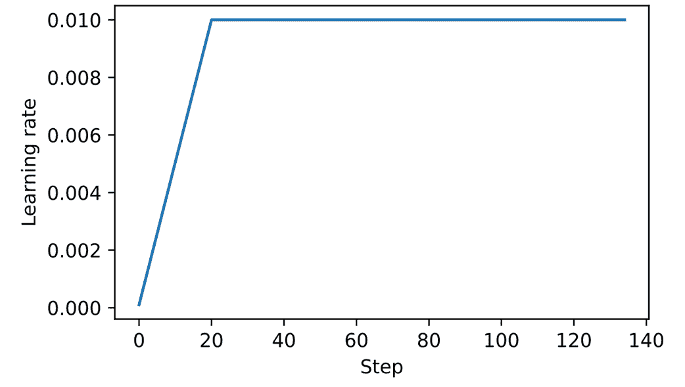
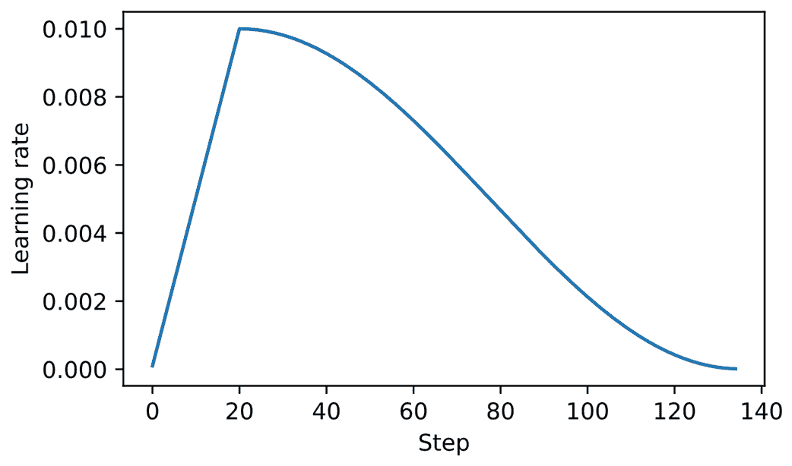
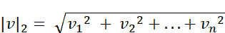
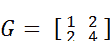
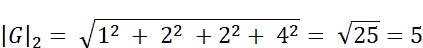
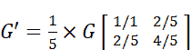

# 附录 D. 为训练循环添加附加功能

在附录中，我们增强了第 5 到第七章中涉及的预训练和微调过程的训练功能。本附录特别涵盖了*学习率预热*、*余弦衰减*和*梯度裁剪*这三部分内容。

最后一部分将这些技术纳入到第五章开发的训练功能中，并预训练一个 LLM。

为了使本附录中的代码自成一体，我们重新初始化了在第五章中训练的模型。

```py
import torch
from previous_chapters import GPTModel

GPT_CONFIG_124M = {
    "vocab_size": 50257,  # Vocabulary size
    "ctx_len": 256,       # Shortened context length (orig: 1024)
    "emb_dim": 768,       # Embedding dimension
    "n_heads": 12,        # Number of attention heads
    "n_layers": 12,       # Number of layers
    "drop_rate": 0.1,     # Dropout rate
    "qkv_bias": False     # Query-key-value bias
}
device = torch.device("cuda" if torch.cuda.is_available() else "cpu")
torch.manual_seed(123)
model = GPTModel(GPT_CONFIG_124M)
model.eval()
```

在初始化模型之后，我们还需要初始化第五章中使用的数据加载器。首先，我们加载短篇小说《判决》：

```py
import os
import urllib.request

file_path = "the-verdict.txt"
url = "https://raw.githubusercontent.com/rasbt/LLMs-from-scratch/main/ch02/01_main-chapter-code/the-verdict.txt"

if not os.path.exists(file_path):
    with urllib.request.urlopen(url) as response:
        text_data = response.read().decode('utf-8')
    with open(file_path, "w", encoding="utf-8") as file:
        file.write(text_data)
else:
    with open(file_path, "r", encoding="utf-8") as file:
        text_data = file.read()
Next, we load the text_data into the data loaders:
from previous_chapters import create_dataloader_v1

train_ratio = 0.90
split_idx = int(train_ratio * len(text_data))
torch.manual_seed(123)
train_loader = create_dataloader_v1(
    text_data[:split_idx],
    batch_size=2,
    max_length=GPT_CONFIG_124M["ctx_len"],
    stride=GPT_CONFIG_124M["ctx_len"],
    drop_last=True,
    shuffle=True
)
val_loader = create_dataloader_v1(
    text_data[split_idx:],
    batch_size=2,
    max_length=GPT_CONFIG_124M["ctx_len"],
    stride=GPT_CONFIG_124M["ctx_len"],
    drop_last=False,
    shuffle=False
)
```

既然我们已经重新实例化了第五章中使用的模型和数据加载器，下一节将介绍我们对训练功能所做的增强。

## D.1 学习率预热

我们介绍的第一个技术是*学习率预热*。实现学习率预热可以稳定复杂模型（如 LLM）的训练。这个过程涉及将学习率从一个非常低的初始值（`initial_lr`）逐渐增加到用户指定的最大值（`peak_lr`）。从较小的权重更新开始训练，可以降低模型在训练阶段遇到大幅度、不稳定更新的风险。

假设我们计划对一个 LLM 进行 15 个周期的训练，初始学习率为 0.0001，并增加到最大学习率 0.01。此外，我们定义 20 个预热步骤，以在前 20 个训练步骤中将初始学习率从 0.0001 提高到 0.01：

```py
n_epochs = 15
initial_lr = 0.0001
peak_lr = 0.01
warmup_steps = 20
```

接下来，我们实现一个简单的训练循环模板来说明这个预热过程：

```py
optimizer = torch.optim.AdamW(model.parameters(), weight_decay=0.1)
lr_increment = (peak_lr - initial_lr) / warmup_steps #A

global_step = -1
track_lrs = []

for epoch in range(n_epochs):  #B
    for input_batch, target_batch in train_loader:
        optimizer.zero_grad()
        global_step += 1

        if global_step < warmup_steps: #C
            lr = initial_lr + global_step * lr_increment
        else:
            lr = peak_lr

        for param_group in optimizer.param_groups: #D
            param_group["lr"] = lr
        track_lrs.append(optimizer.param_groups[0]["lr"])
        #E
```

在运行前面的代码后，我们可视化训练循环如何改变学习率，以验证学习率预热是否按预期工作：

```py
import matplotlib.pyplot as plt
plt.ylabel("Learning rate")
plt.xlabel("Step")
total_training_steps = len(train_loader) * n_epochs
plt.plot(range(total_training_steps), track_lrs);
plt.show()
```

生成的图表如图 D.1 所示。

##### 图 D.1 学习率预热在前 20 个训练步骤中提高学习率。经过 20 个步骤后，学习率达到峰值 0.01，并在剩余的训练中保持不变。



如图 D.1 所示，学习率从一个较低的值开始，并在 20 个步骤内增加，直到在 20 个步骤后达到最大值。

在下一节中，我们将进一步修改学习率，使其在达到最大学习率后降低，这将进一步有助于改善模型训练。

## D.2 余弦衰减

另一种广泛采用的用于训练复杂深度神经网络和 LLM 的技术是*余弦衰减*。这种方法在训练周期中调节学习率，使其在预热阶段后遵循余弦曲线。

在其流行的变体中，余弦衰减将学习率减少（或衰减）至接近零，模拟半个余弦周期的轨迹。余弦衰减中学习率的逐渐降低旨在减缓模型更新权重的速度。这一点尤其重要，因为它有助于最小化训练过程中超越损失最小值的风险，这对于确保训练后期的稳定性至关重要。

我们可以修改上一节中的训练循环模板，添加余弦衰减，具体如下：

```py
import math

min_lr = 0.1 * initial_lr
track_lrs = []
lr_increment = (peak_lr - initial_lr) / warmup_steps
global_step = -1

for epoch in range(n_epochs):
    for input_batch, target_batch in train_loader:
        optimizer.zero_grad()
        global_step += 1

        if global_step < warmup_steps:
            lr = initial_lr + global_step * lr_increment  
        else:# #B
            progress = ((global_step - warmup_steps) / 
                        (total_training_steps - warmup_steps))
            lr = min_lr + (peak_lr - min_lr) * 0.5 * (1 + math.cos(math.pi * progress))

        for param_group in optimizer.param_groups:
            param_group["lr"] = lr
        track_lrs.append(optimizer.param_groups[0]["lr"])
```

再次，为了验证学习率是否按预期发生变化，我们绘制学习率图：

```py
plt.ylabel("Learning rate")
plt.xlabel("Step")
plt.plot(range(total_training_steps), track_lrs)
plt.show()
```

结果的学习率图如图 D.2 所示。

##### 图 D.2 线性学习率预热的前 20 步之后是余弦衰减，这在一个半余弦周期内降低学习率，直到训练结束时达到最低点。



如图 D.2 所示，学习率以线性预热阶段开始，持续 20 步直至达到最大值。经过 20 步的线性预热后，余弦衰减开始生效，逐渐降低学习率，直到达到最低点。

## D.3 梯度裁剪

在本节中，我们介绍 *梯度裁剪*，这是另一种在 LLM 训练中增强稳定性的重要技术。这种方法涉及设置一个阈值，超出该阈值的梯度将被缩放到预定的最大幅度。这个过程确保了在反向传播期间对模型参数的更新保持在一个可控范围内。

例如，在 PyTorch 的 `clip_grad_norm_` 函数中应用 `max_norm=1.0` 设置确保梯度的范数不超过 1.0。在这里，“范数”指的是梯度向量在模型参数空间中的长度或幅度，具体是指 L2 范数，也称为欧几里得范数。

在数学上，对于由分量组成的向量 ***v***，其表示为 ***v*** = [*v*[1], *v*[2], ..., *v*[n]]，L2 范数的描述为：



这种计算方法也适用于矩阵。

例如，考虑给定的梯度矩阵：



如果我们旨在将这些梯度裁剪到最大范数为 1，我们首先计算这些梯度的 L2 范数，计算公式为



考虑到 |**G**|[2] = 5 超过了我们的 `max_norm` 为 1，我们将梯度缩小以确保其范数恰好为 1。通过计算缩放因子 `max_norm`/|**G**|[2] = 1/5 来实现。因此，调整后的梯度矩阵 **G'** 为



为了说明这个梯度裁剪过程，我们将首先初始化一个新模型并计算训练批次的损失，类似于标准训练循环中的步骤：

```py
from previous_chapters import calc_loss_batch
torch.manual_seed(123)
model = GPTModel(GPT_CONFIG_124M)
loss = calc_loss_batch(input_batch, target_batch, model, device)
loss.backward()
```

在调用前面代码片段中的`.backward()`方法时，PyTorch 计算损失梯度并将其存储在每个模型权重（参数）张量的`.grad`属性中。

为了说明，我们可以定义以下`find_highest_gradient`工具函数，通过扫描模型权重张量的所有`.grad`属性来识别最高的梯度值，在调用`.backward()`之后：

```py
def find_highest_gradient(model):
    max_grad = None
    for param in model.parameters():
        if param.grad is not None:
            grad_values = param.grad.data.flatten()
            max_grad_param = grad_values.max()
            if max_grad is None or max_grad_param > max_grad:
                max_grad = max_grad_param
    return max_grad
print(find_highest_gradient(model))
```

通过前面的代码识别到的最大的梯度值如下：

```py
tensor(0.0373)
```

现在让我们应用梯度裁剪，这可以用一行代码实现，并看看这如何影响最大的梯度值：

```py
torch.nn.utils.clip_grad_norm_(model.parameters(), max_norm=1.0)
print(find_highest_gradient(model))
```

应用最大范数为 1 的梯度裁剪后，最大的梯度值明显小于之前：

```py
tensor(0.0166)
```

在下一部分中，我们将把到目前为止在本附录中涵盖的所有概念付诸实践，并修改 LLM 训练函数。

## D.4 修改后的训练函数

在本附录的最后部分，我们通过添加我们介绍的三个概念：线性预热、余弦衰减和梯度裁剪，改进了第五章中使用的`train_model_simple`训练函数。这些方法一起有助于稳定 LLM 训练。

代码如下，变化与`train_model_simple`进行了注释：

```py
from previous_chapters import evaluate_model, generate_and_print_sample

def train_model(model, train_loader, val_loader, optimizer, device, n_epochs,
                eval_freq, eval_iter, start_context, warmup_steps=10,
                initial_lr=3e-05, min_lr=1e-6):

    train_losses, val_losses, track_tokens_seen, track_lrs = [], [], [], []
    tokens_seen, global_step = 0, -1

    peak_lr = optimizer.param_groups[0]["lr"] #A
    total_training_steps = len(train_loader) * n_epochs #B
    lr_increment = (peak_lr - initial_lr) / warmup_steps #C

    for epoch in range(n_epochs):
        model.train()
        for input_batch, target_batch in train_loader:
            optimizer.zero_grad()
            global_step += 1

            if global_step < warmup_steps: #D
                lr = initial_lr + global_step * lr_increment  
            else:
                progress = ((global_step - warmup_steps) / 
                            (total_training_steps - warmup_steps))
                lr = min_lr + (peak_lr - min_lr) * 0.5 * (
                    1 + math.cos(math.pi * progress))

            for param_group in optimizer.param_groups: #E
                param_group["lr"] = lr
            track_lrs.append(lr)
            loss = calc_loss_batch(input_batch, target_batch, model, device)
            loss.backward()

            if global_step > warmup_steps: #F
                torch.nn.utils.clip_grad_norm_(model.parameters(), max_norm=1.0)
            #G
            optimizer.step() 
            tokens_seen += input_batch.numel()

            if global_step % eval_freq == 0:
                train_loss, val_loss = evaluate_model(
                    model, train_loader, val_loader,
                    device, eval_iter
                )
                train_losses.append(train_loss)
                val_losses.append(val_loss)
                track_tokens_seen.append(tokens_seen)
                print(f"Ep {epoch+1} (Iter {global_step:06d}): "
                      f"Train loss {train_loss:.3f}, Val loss {val_loss:.3f}")

        generate_and_print_sample(
            model, train_loader.dataset.tokenizer,
            device, start_context
        )

    return train_losses, val_losses, track_tokens_seen, track_lrs
```

在定义了`train_model`函数后，我们可以以类似的方式训练模型，与第五章的`train_model_simple`方法相比：

```py
torch.manual_seed(123)
model = GPTModel(GPT_CONFIG_124M)
model.to(device)
peak_lr = 5e-4
optimizer = torch.optim.AdamW(model.parameters(), weight_decay=0.1)

n_epochs = 15
train_losses, val_losses, tokens_seen, lrs = train_model(
    model, train_loader, val_loader, optimizer, device, n_epochs=n_epochs,
    eval_freq=5, eval_iter=1, start_context="Every effort moves you",
    warmup_steps=10, initial_lr=1e-5, min_lr=1e-5
)
```

在 MacBook Air 或类似笔记本电脑上，训练大约需要 5 分钟完成，并打印以下输出：

```py
Ep 1 (Iter 000000): Train loss 10.934, Val loss 10.939
Ep 1 (Iter 000005): Train loss 8.529, Val loss 8.843
Every effort moves you,,,,,,,,,,,,,,,,,,,,,,,,,,,,,,,,,,,,,,,,,,,,,,,,,,
Ep 2 (Iter 000010): Train loss 6.400, Val loss 6.825
Ep 2 (Iter 000015): Train loss 6.116, Val loss 6.861
Every effort moves you,,,,,,,,,,,,,,,,,,,,,,,,,,,,,,,,,,,,,,,,,,,,,,,,,,
... 
the irony. She wanted him vindicated--and by me!"  He laughed again, and threw back his head to look up at the sketch of the donkey. "There were days when I
Ep 15 (Iter 000130): Train loss 0.101, Val loss 6.707
Every effort moves you?"  "Yes--quite insensible to the irony. She wanted him vindicated--and by me!"  He laughed again, and threw back his head to look up at the sketch of the donkey. "There were days when I
```

和第五章一样，由于数据集非常小，模型在几个 epoch 后开始过拟合，我们多次迭代。但是，我们可以看到该函数在工作，因为它最小化了训练集损失。

鼓励读者在更大的文本数据集上训练模型，并将使用该更复杂训练函数获得的结果与第五章中使用的`train_model_simple`函数获得的结果进行比较。
