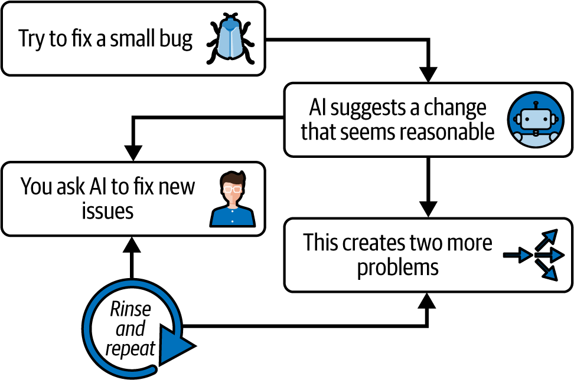
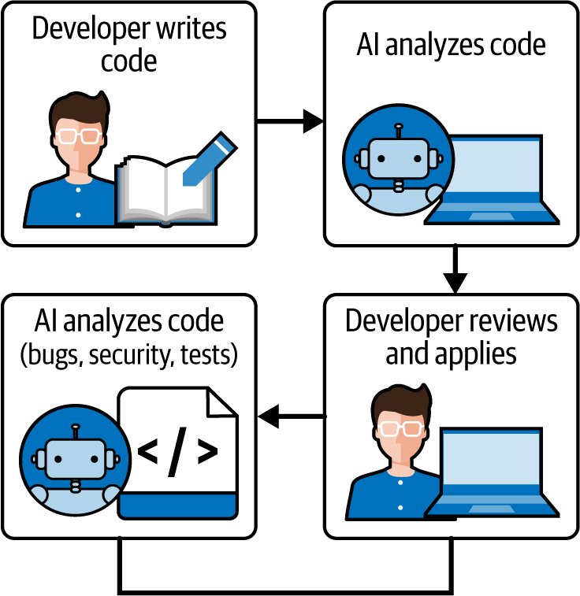

# 第三章：70%问题：真正有效的人工智能辅助工作流程

基于人工智能的编码工具在某些任务上令人惊讶地出色.^(1) 它们擅长生成样板代码、编写常规函数，并将项目推进到大部分完成。事实上，许多开发者发现，一个 AI 助手可以实施一个初始解决方案，覆盖大约 70%的需求。

杨彼得在 X 上的一篇帖子中完美地捕捉了我一直在观察到的领域情况[链接](https://oreil.ly/i9qwq)：

> 作为非工程师，至今使用人工智能进行编码的真实反思：
> 
> 它可以带你完成 70%的工作，但最后的 30%却令人沮丧。它总是前进一小步，后退两步，出现新的错误、问题等。
> 
> 如果我知道代码是如何工作的，我可能可以自己修复它。但由于我不知道，我开始质疑自己是否真的学到了很多。

使用人工智能进行编码的非工程师发现自己遇到了令人沮丧的障碍。他们可以出奇地快地完成 70%的工作，但最后的 30%却变成了收益递减的练习。

这个“70%问题”揭示了关于当前人工智能辅助开发状态的关键信息。最初的进展感觉神奇：你可以描述你想要的内容，然后 AI 工具如 v0 或 Bolt 将生成一个看起来令人印象深刻的可工作原型。但随后现实就出现了。

70%通常是工作中的简单、模式化的部分——那种遵循良好路径或常见框架的代码。正如一位[*Hacker News*评论者观察到的](https://oreil.ly/Ff3Ts)，AI 在处理软件的“偶然复杂性”（重复的、机械的）方面非常出色，而“本质复杂性”——理解和管理问题的固有复杂性——则仍然落在人类的肩膀上。在 Fred Brooks 的经典术语中，AI 解决的是发展的偶然困难，而不是内在困难。

这些工具在哪里遇到挑战？经验丰富的工程师一致报告存在一个“最后一英里”的差距。AI 可以生成一个合理的解决方案，但最后的 30%（涵盖边缘情况、细化架构和确保可维护性）“需要严重的人类专业知识”。

例如，一个 AI 可能会给你一个在基本情况下技术上可行的函数，但它不会自动考虑异常输入、竞态条件、性能约束或未来的要求，除非明确告知。AI 可以带你走大部分的路，但最后的至关重要的 30%（边缘情况、保持可维护性和构建坚实的架构）需要严重的人类专业知识。

此外，人工智能有一个已知的倾向，即生成令人信服但错误的输出。它可能会引入微妙的错误或“幻觉”不存在的函数和库。[Steve Yegge 讽刺地比喻](https://oreil.ly/hjv8f)今天的 LLMs 为“极具生产力的初级开发者”——速度极快且热情洋溢，但“可能因为精神改变药物而变得疯狂”，容易想出疯狂或不切实际的方法。

在 [Yegge 的话中](https://oreil.ly/yPMPO)，一个大型语言模型（LLM）可以吐出看起来很整洁的代码，但如果一个经验不足的开发者天真地说，“看起来不错！”然后继续使用它，接下来的几周里就会发生荒谬（或灾难）。AI 并没有真正 *理解* 问题；它缝合在一起的模式 *通常* 是有意义的。只有人类才能判断一个看似完美的解决方案是否隐藏着长期的地雷。[Simon Willison 在看到 AI 提出一个迷人的巧妙设计后也表达了同样的观点](https://oreil.ly/sLzFY)，只有对问题有深刻理解的资深工程师才能识别出其缺陷。教训是：AI 的自信远超其可靠性。

关键的是，当前的 AI [并不能在其训练数据之外创建根本性的新抽象或策略](https://oreil.ly/HkwVF)。它们不会为您发明新的算法或创新的架构——它们只是重新组合已知的内容。它们也不会对决策承担责任。正如一位工程师所说，“AI 没有比其训练数据包含的‘更好的想法’。它们不对自己的工作承担责任。”

所有这些都意味着创造性和分析性思维——决定 *要构建什么*、*如何构建它* 和 *为什么构建它*——坚定地仍然是人类的领域。总之，AI 是开发者的力量倍增器，处理重复的 70%，并给我们带来“涡轮增压”的生产力提升。但它 *不是* 一个可以取代人类判断的银弹。剩余的 30% 的软件工程——困难的方面——仍然需要只有受过训练、深思熟虑的开发者才能带来的技能。那些是我们要关注的持久技能，第四章 专门讨论了这些技能。正如一位 [讨论](https://oreil.ly/QXYsj) 所说：“AI 是一个强大的工具，但它不是魔法子弹。……人类的判断和良好的软件工程实践仍然是必不可少的。”

# 开发者实际上是如何使用 AI 的

我观察到团队在利用 AI 进行开发方面有两种截然不同的模式。让我们称它们为“bootstrappers”和“iterators”。两者都在帮助工程师（甚至非技术用户）缩小从想法到执行（或 MVP）的差距。

首先，有那些 *bootstrappers*，他们通常是将一个新项目从零开始到 MVP。像 Bolt、v0 和截图到代码 AI 这样的工具正在革命性地改变这些团队启动新项目的方式。这些团队通常：

+   从设计或粗略的概念开始

+   使用 AI 生成完整的初始代码库

+   在数小时或数天内而不是数周内获得一个可工作的原型

+   专注于快速验证和迭代

结果可以非常令人印象深刻。我最近看到一个独立开发者使用 Bolt 在几乎不花时间的情况下将 Figma 设计转换成一个可工作的网络应用。它还不是生产就绪的，但已经足够好，可以获取非常初步的用户反馈。

第二个阵营，即“迭代者”，使用 Cursor、Cline、Copilot 和 Windsurf 等工具进行日常开发工作流程。这不太引人注目，但可能更具变革性。这些开发者是：

+   使用 AI 进行代码补全和建议

+   利用 AI 进行复杂的重构任务

+   生成测试和文档

+   将 AI 用作问题解决的“搭档程序员”

但这里有个问题：虽然这两种方法都可以显著加速开发，但它们带来了隐藏的成本，这些成本并不立即明显。

当你观察资深工程师使用 Cursor 或 Copilot 等 AI 工具工作时，它看起来就像魔法。他们可以在几分钟内构建整个功能，包括测试和文档。但仔细观察，你会发现一个关键点：他们不仅仅接受 AI 的建议。他们不断地重构生成的代码，将其分解成更小、更专注的模块。他们添加了 AI 遗漏的全面错误处理和边缘情况处理，加强了类型定义和接口，并质疑其架构决策。换句话说，他们正在应用多年的宝贵工程智慧来塑造和约束 AI 的输出。AI 正在加速他们的实施，但他们的专业知识是保持代码可维护性的关键。

## 常见失败模式

初级工程师常常错过这些关键步骤。他们更容易接受 AI 的输出，导致我所说的“纸牌屋代码”——它看起来完整，但在现实世界的压力下会崩溃。

### 退两步

接下来通常遵循一个可预测的反模式，我称之为“退两步”模式（如图 3-1 所示）：

+   你试图修复一个小错误。

+   AI 建议一个看似合理的更改。

+   这个修复方法破坏了其他东西。

+   你要求 AI 修复新的问题。

+   这又产生了两个新问题。

+   重复上述步骤。

###### 图 3-1. “退两步”反模式。

对于非工程师来说，这个循环尤其痛苦，因为他们缺乏理解实际发生什么的心理模型。当经验丰富的开发者遇到错误时，他们可以根据多年的模式识别推理出潜在的原因和解决方案。没有这个背景，你基本上是在用你不完全理解的代码玩“打地鼠”。这就是我在本书前言中提到的“知识悖论”：资深工程师和开发者使用 AI 来加速他们已经知道如何做的事情，而初级工程师试图用它来学习“做什么”。

对于使用 AI 的“启动器”模式的非工程师来说，这个循环尤其痛苦，因为他们缺乏解决构建他们的 MVP 所需的心理模型。然而，即使是经验丰富的“迭代者”，如果过度依赖 AI 的建议而没有进行深入验证，也可能陷入这种“打地鼠”陷阱。

这里有一个更深层次的问题：正是使 AI 编码工具对非工程师可访问的那一特性——它们代表了你代表处理复杂性的能力——实际上可能会阻碍学习。当代码只是“出现”而你并不理解其背后的原理时，你不会发展调试技能。你会错过学习基本模式。你无法对架构决策进行推理，因此你难以维护和演进代码。这创造了一种依赖，你需要不断回到 AI 模型去修复问题，而不是发展自己处理这些问题的专业知识。

这种依赖风险随着自主 AI 编码代理的出现进入了一个新的维度——我在第十章中深入探讨了这一主题。与当前建议代码片段的工具不同，这些代理代表了软件开发方式的一个根本转变。当我写下这些时，我们正在见证能够独立规划、执行和迭代整个开发任务（且需要最少人工监督）的系统的早期部署。

从辅助到自主 AI 的这种演变引发了关于开发者专业知识和控制的深刻问题。当一个 AI 系统可以处理完整的开发工作流程，从初始实现到测试和部署，技能退化的风险变得非常严重。那些过度依赖这些代理而没有维护其基础知识开发者的可能会发现自己无法有效地审计、指导或干预当 AI 的决定偏离预期结果时。

当我们考虑到这些自主系统如何在项目中进行级联决策时，挑战就更加复杂了。每个单独的选择在孤立的情况下可能看起来是合理的，但累积效应可能会将开发引向未预想的方向。如果没有足够的专业知识来早期识别和纠正这些轨迹变化，团队可能会在并不完全理解的基础上构建越来越复杂的系统。

正如我们稍后会更彻底地考察的那样，自主编码代理的出现并没有减少软件工程基础的重要性——它放大了它。我们的 AI 工具变得越强大，我们就越需要保持专业知识，以确保我们成为系统的架构师而不是仅仅的操作员。只有通过深入理解软件原则，我们才能确保这些非凡的工具增强我们的能力而不是削弱它们。

### 演示质量陷阱

这已经成为一种模式：团队使用 AI 快速构建令人印象深刻的演示。顺利的道路运作得非常好。投资者和社交网络都为之惊叹。但当真实用户开始点击浏览时？那就是事情开始分崩离析的时候。

我亲眼所见：对普通用户来说毫无意义的错误信息，导致应用程序崩溃的边缘情况，从未清理的混乱用户界面状态，完全忽视的易用性，以及较慢设备上的性能问题。这些不仅仅是低优先级的错误——它们是人们忍受的软件和人们喜爱的软件之间的区别。

创建真正自助式软件——用户无需联系支持的那种——需要不同的思维方式，这种思维方式完全关乎失传的打磨艺术。你需要对错误信息如痴如醉；在慢速连接和真实、非技术用户上进行测试；使功能易于发现；并且优雅地处理每一个边缘情况。这种对细节的关注（或许）不能由人工智能生成。它来自同理心、经验和对工艺的深切关怀。

## 实际上是什么在起作用：实用的工作流程模式

在我们深入到本书第二部分的编码之前，我们需要讨论现代开发实践以及 AI 辅助编码如何在团队工作流程中发挥作用。毕竟，软件开发不仅仅是编写代码——它是一个包括规划、协作、测试、部署和维护的完整工作流程。而 vibe coding 不是一种独立的创新——它可以融入敏捷方法和 DevOps 实践，提高团队的生产力，同时保持质量和可靠性。

在本节中，我们将探讨团队成员如何集体使用 vibe-coding 工具而不会互相干扰，如何平衡人工智能建议与人类洞察力，以及如何将持续集成/持续交付（CI/CD）管道整合人工智能或适应人工智能生成的代码。我还会涉及重要考虑因素，如版本控制策略。

在观察了数十个团队之后，以下是我在独立和团队工作流程中看到的一直有效的工作模式：

人工智能作为第一起草人

人工智能模型生成初始代码，然后开发者对其进行优化、重构和测试

人工智能作为配对程序员

开发者和人工智能处于持续的对话中，有紧密的反馈循环，频繁的代码审查，以及提供最小化上下文

人工智能作为验证者

开发者仍然编写初始代码，然后使用人工智能进行验证、测试和改进（见图 3-2）

###### 图 3-2\. 人工智能验证工作流程：开发者编写初始代码；人工智能系统分析错误和安全性问题，然后提出改进建议；开发者审查并应用推荐更改。

在本节中，我将逐一介绍每种模式，讨论工作流程和成功技巧。

### 人工智能作为第一起草人

在你要求人工智能模型起草任何代码之前，确保团队中的每个人都处于同一页面上是很重要的。沟通是关键，这样开发者就不会让他们的 AI 助手执行重复的任务或生成冲突的实现。

在日常站立会议（敏捷工作流程的基石）中，值得讨论的不仅仅是你在做什么，还包括你是否计划使用 AI 来完成某些任务。例如，两位开发者可能正在开发涉及日期格式化实用函数的不同功能。如果他们都要求 AI 创建一个`formatDate`辅助函数，你可能会得到两个类似的功能。提前协调（“我将生成一个我们可以共同使用的日期实用函数”）可以防止重复。

成功整合 AI 工具的团队通常从达成一致于编码标准和提示实践开始。例如，团队可能会决定采用一致的样式（linting 规则、项目约定）并将这些指南输入到他们的 AI 工具中（一些助手允许提供样式偏好或示例代码以引导输出）。正如[Codacy 的博客中提到的](https://oreil.ly/FeEN_)，通过使 AI 熟悉团队的编码标准，你可以生成更统一且易于大家协作的代码。在实践层面，这可能意味着在你的项目 README 中有一个“AI 使用技巧”部分，其中记录诸如“我们只使用功能组件”或“优先使用 Fetch API 而不是 Axios”等内容，开发者可以在提示 AI 时牢记。

另一种做法是，如果可用，使用你工具的*协作功能*。一些 AI 辅助 IDE 允许用户共享他们的 AI 会话或至少他们使用的提示。如果开发者 A 使用一个复杂的组件的提示得到了很好的结果，将这个提示与开发者 B（可能通过问题跟踪器或团队聊天）分享可以节省时间并确保一致性。

关于使用版本控制，其基本原理依然存在——但有所变化。在现代开发中，使用 Git（或另一个版本控制系统）是不可或缺的，这在 vibe 编码中也不例外。实际上，当 AI 快速生成代码时，版本控制变得更加关键。提交（commits）充当安全网，以捕捉 AI 的错误；如果 AI 生成的更改破坏了某些内容，你可以回滚到之前的提交。

一种策略是在使用 AI 辅助时更频繁地提交。每次 AI 生成一个重要的代码块（如生成一个功能或进行一些重大重构）且你接受时，考虑创建一个带有清晰信息的提交。频繁的提交确保如果你需要二分问题或撤销 AI 引入的部分代码，历史记录足够细粒度。

此外，尝试隔离由 AI 引入的不同变化。如果你让 AI 在多个区域进行许多更改并将它们全部一起提交，如果出现问题，就难以区分。例如，如果你使用代理来优化性能，同时调整一些 UI 文本，请分别提交这些更改。（你的两个提交信息可能是“优化列表渲染性能 [AI 辅助]”和“更新锻炼完成消息的 UI 副本 [AI 辅助]”）。描述性的提交信息很重要；一些团队甚至为涉及大量 AI 的提交添加标签，以便于追踪。这并不是关于责备，而是关于理解代码的来源——标记为“[AI]”的提交可能会向审阅者发出信号，表明代码可能需要额外的彻底审查以处理边缘情况。

实际上，团队应将 AI 的使用视为开发对话的正常部分：分享经验、成功的技巧和关于不要做什么的警告（例如，“Copilot 建议为 X 使用过时的库，所以对此要小心”）。

审查和精炼对这个模式至关重要。开发者应手动审查和重构代码以提高模块化，添加全面的错误处理，编写详尽的测试，并在精炼代码的过程中记录关键决策。下一章将详细介绍这些过程。

### 作为结对编程伙伴的 AI

传统的结对编程涉及两个人类在同一个工作站上协作。随着 AI 的出现，一种混合方法已经出现：一个人类开发者和一个 AI 助手一起工作。这种设置可以特别有效，它结合了人类的直觉和机器的效率。

在人类-AI 配对中，开发者与 AI 互动以生成代码建议，同时审查和精炼输出。这种动态使得人类可以利用 AI 处理重复性任务的速度，例如编写样板代码或生成测试用例，同时保持对代码质量和相关性的监督。

例如，当集成新的库时，开发者可能会提示 AI 起草初始集成代码。然后，开发者会审查 AI 的建议，并与官方文档交叉引用以验证准确性。这个过程不仅加速了开发，还促进了知识获取，因为开发者会深入参与 AI 的输出和库的复杂性。

让我们将其与传统的面对面人类结对编程进行比较：

+   *人类-AI 配对*能够快速生成代码，并能高效地处理日常任务。它特别适合独立开发者或团队资源有限的情况。

+   *人类-人类配对*在复杂问题解决场景中表现出色，在这些场景中，细微的理解和协作头脑风暴是必不可少的。它促进了共享所有权和集体代码理解。

两种方法都有其优点，你之间的选择可以由项目的复杂性、资源可用性和开发过程的具体目标来指导。

### 人工智能配对编程的最佳实践

为了最大限度地发挥 AI 辅助开发的益处，请考虑以下实践：

为不同的任务启动新的 AI 会话

这有助于保持上下文清晰，并确保 AI 的建议与当前任务相关。

保持提示简洁明了

提供清晰和具体的指令可以提高 AI 输出的质量。

经常审查和提交更改

定期集成和测试人工智能生成的代码有助于早期发现问题并保持项目进度。

保持紧密的反馈循环

持续评估 AI 的贡献，根据需要提供纠正或改进，以指导其学习并改进未来的建议。

### 人工智能作为验证者

人工智能不仅能够生成代码，还可以作为一个有价值的验证者，协助代码审查和质量保证。人工智能工具可以分析代码以识别潜在的 bug、安全漏洞以及是否符合最佳实践。例如，DeepCode 和 Snyk 的 AI 驱动的代码检查平台可以识别诸如缺少输入清理或配置不安全等问题，并在开发环境中直接提供可操作的见解。Qodo 和 TestGPT 等平台可以自动生成测试用例，确保更广泛的覆盖范围并减少人工工作量。许多 AI 工具还可以协助监控应用程序性能，检测可能表明潜在问题的异常。

通过将 AI 验证者集成到开发工作流程中，团队可以提高代码质量，降低缺陷发生的可能性，并确保符合安全标准。这种主动的验证方法补充了人工监督，导致更健壮和可靠的软件。这些工具通过处理重复和耗时的工作，提高了质量保证（QA）过程的效率和效果，使人工测试人员能够专注于 QA 的更复杂和细微的方面。

将 AI 融入开发过程，无论是作为配对程序员还是验证者，都提供了提高生产力和代码质量的机会。通过深思熟虑地整合这些工具，开发者可以利用人类和人工智能的优势。

为了最大限度地发挥 AI 和人类在 QA 中的能力，我推荐以下最佳实践：

+   使用 AI 进行初步评估和初步扫描以识别明显问题。

+   对于关键领域，如复杂功能、用户体验和人工智能限制，优先进行人工审查。

+   营造一个持续协作的环境，其中 AI 工具和人工测试人员协同工作，并持续进行反馈循环，以改善 AI 性能和人类决策。

# Vibe 编码的黄金法则

虽然动态编码（vibe coding）在软件开发中提供了前所未有的速度和创造性自由，但其极大的灵活性要求一种结构化的方法来确保一致的质量和团队凝聚力。AI 辅助开发的快速、直观特性如果没有明确的指南来平衡创造性探索与工程纪律，很容易导致混乱。

这些黄金法则是从成功将动态编码（vibe coding）整合到工作流程中的团队的集体经验中产生的。它们代表了关于 AI 在哪些方面表现优异、在哪些方面存在不足，以及人类判断在整个过程中始终至关重要的宝贵见解。这些原则并非限制创造力，而是在团队可以自信地实验的同时，维持生产级软件所需的标准的框架。

这些规则涵盖了动态编码（vibe coding）的三个关键维度：人与 AI 的交互、AI 生成代码与现有系统的集成，以及培养支持可持续 AI 辅助开发的团队实践。通过遵循这些指南，团队可以利用动态编码的变革力量，同时避免导致技术债务、安全漏洞或难以维护的代码库的常见陷阱：

明确并清晰地表达你的需求

在与 AI 交互时，明确表达你的需求、任务和结果。精确的提示会产生精确的结果。

总是验证 AI 输出是否符合你的意图

AI 生成的代码必须始终与你的原始目标进行核对。在接受之前，验证功能、逻辑和相关性。

将 AI 视为初级开发者（需监督）

将 AI 输出视为需要你仔细监督的草稿。提供反馈，进行细化，并确保质量和正确性。

利用 AI 扩展你的能力，而不是取代你的思考

利用 AI 自动化常规或复杂任务，但始终积极参与问题解决和决策制定。

在生成代码之前，在团队中进行前期协调

在开始 AI 驱动开发之前，与团队就 AI 使用标准、代码期望和实践达成一致。

将 AI 使用视为开发对话的正常部分

定期与团队讨论 AI 经验、技术、成功和陷阱。将 AI 视为集体改进的另一个工具。

通过单独提交来在 Git 中隔离 AI 更改

在与 AI 交互时，明确识别并区分 AI 生成的更改，以简化审查、回滚和跟踪。

确保所有代码，无论是人工编写还是 AI 编写，都经过代码审查

通过将所有贡献提交给相同的严格审查流程来维护一致的标准，从而提高代码质量和团队理解。

不要合并你不理解的代码

除非你彻底理解其功能及其影响，否则绝不要集成 AI 生成的代码。理解对于可维护性和安全性至关重要。

优先考虑文档、注释和 ADR（架构决策记录）

明确记录 AI 生成代码的理由、功能性和上下文。良好的文档确保了长期清晰度并减少了未来的技术债务。

分享和重用有效的提示词

记录导致高质量 AI 输出的提示词。维护一个经过验证的提示词库，以简化未来的交互并提高一致性。

定期反思和迭代

定期审查和改进您的 AI 开发工作流程。利用过去的经验不断改进团队的方法。

通过遵循这些黄金法则，您的团队能够有效地利用 AI，提高生产力，同时保持清晰度、质量和控制。

# 摘要和下一步行动

70%问题定义了 AI 辅助开发的当前状态：这些工具在生成样板代码和常规函数方面表现出色，但在包括边缘情况、架构决策和生产准备在内的最后 30%方面存在困难。我们已经确定了两种主要的使用模式——快速构建 MVP 的启动者，以及将 AI 整合到日常工作流程中的迭代者——以及常见的失败模式，如“退两步”反模式和“演示质量陷阱”，在这些模式中，令人印象深刻的原型在现实世界的压力下失败。

已经出现了三种经过验证的工作流程模式：AI 作为第一稿作者（生成后改进）、AI 作为配对程序员（持续协作）和 AI 作为验证者（人类编写的代码与 AI 分析）。Vibe 编码的黄金法则提供了基本的护栏，强调清晰的沟通、彻底的验证、团队协调以及在合并之前理解所有代码的不可协商要求。

个人开发者应在日常实践中实施黄金法则的同时，选择一个工作流程模式进行系统性地实验。专注于发展第四章中涵盖的持久技能：系统设计、调试和架构——而不是与 AI 在代码生成上竞争。

团队需要为 AI 的使用制定标准，创建有效的提示词共享库，并将 AI 的考虑因素整合到现有的敏捷实践中。定期分享关于成功和陷阱的知识，将帮助团队避免常见陷阱，同时最大化 AI 的益处。

随着自主 AI 编码代理的出现，人类角色将转向架构监督和战略决策。下一章将探讨如何最大化这种无可替代的人类贡献，帮助各个级别的工程师作为越来越强大的 AI 系统的合作伙伴而不是竞争对手蓬勃发展。

^(1)本章基于最初发表在我 Substack 通讯上的文章。参见 Addy Osmani，《70%问题：关于 AI 辅助编码的艰难真相》[*Elevate with Addy Osmani*]，2024 年 12 月 4 日。
