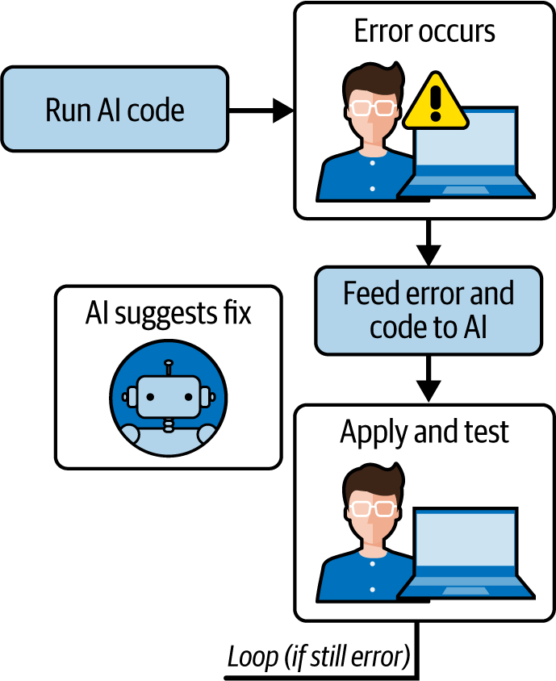

# 第五章：理解生成的代码：审查、精炼、掌握

你已经学会了如何提示 AI 生成代码，到这个阶段，你很可能已经使用这些技术生成了一些代码。现在进入一个关键阶段：确保代码是正确的、安全的和可维护的。

作为一名开发者，你不能仅仅接受 AI 的输出并随意发布。你需要审查它，测试它，可能还需要改进它，并将其集成到你的代码库中。本章重点介绍如何理解 AI 提供的内容，迭代编辑和调试它，并将代码作为项目的一部分完全掌握。

本章涵盖：

+   将 AI 的代码解释为你的原始意图

+   “多数解决方案”现象，或为什么 AI 生成的代码常常看起来像常见解决方案

+   代码清晰性和潜在问题审查的技术

+   当 AI 编写的代码不符合预期时进行调试

+   优化代码以改进风格或效率

+   编写测试以验证代码的行为

通过掌握这些技能，你将能够自信地将 AI 的贡献整合到你的项目中。

# 从意图到实现：理解 AI 的解释

当你得到 AI 的代码时，你的第一步应该是将其与你的意图（你给出的提示）进行比较。代码是否满足你设定的要求？有时 AI 可能会略微误解或只部分实现你所要求的。

仔细阅读代码。在心中或纸上逐步执行：

+   跟踪它对典型输入所做的事情。

+   如果你的提示有多个部分（“做 X 和 Y”），验证 AI 是否都完成了。

+   确保 AI 没有添加你未请求的功能——有时它会添加一个它认为有用的额外功能，比如添加日志或参数，这可能可以接受，也可能不行。

就像对待同事的代码一样，如果有什么不清楚的地方，记下来。如果你寻找一个合理的理由来解释它为什么在那里，你可能会找到一个。如果没有，查询它或考虑移除它。

例如，如果你要求一个素数检查器，而 AI 代码还打印出“检查 7...”这样的信息，这可能是因为你如何提示它或其训练数据中的模式（一些教程代码会打印其进度）。如果你不希望这样，计划移除它或提示 AI 移除它。

确保边缘情况按照你的预期处理。如果你打算处理空输入，它做到了吗？如果输入可能是`None`或负数，AI 考虑到了吗？

如果你的提示中有一些内容不明确，AI 不得不做出选择，确定发生这种情况的地方。也许你没有指定输出格式，它选择打印结果而不是返回结果。现在你必须决定是否接受它或修改代码。

这个理解阶段至关重要；不要跳过它。即使你打算测试代码，通过阅读来理解它也很重要，因为测试可能无法涵盖所有内容（而且阅读对于一些明显的事情来说更快）。

最后，考虑 AI 的假设。AI 通常倾向于“多数”或最常见的解释（这引出了下一个部分）。

# “多数”问题：最常见的不一定是最合适的

在大量代码上训练的 AI 模型通常会生成在训练数据中最常见（或最简单）的解决方案。我称之为“多数解决方案”效应。它在一般情况下是正确的，但可能不适合你的具体情况。

例如，如果你没有提供更多上下文就要求一个搜索算法，AI 可能会输出一个基本的线性搜索，因为这是直接且常见的。也许你实际上需要一个二分搜索，但 AI 不知道效率是关键，因为你没有说明。线性搜索对于许多适度的情况有效，但如果性能是关键，则不适用。

同样，AI 可能会使用全局变量，因为许多简单示例都这样做，但也许在你的项目中，这不是可接受的实践。

注意 AI 的解决方案可能针对通用场景进行优化。作为一个人类开发者，你拥有 AI 所缺乏的洞察力。

为了解决这个问题：

+   识别代码中的假设。如果它假设列表已排序或输入有效，这个假设是否合理？你是否指定了它？如果没有，也许它应该包含一个检查。

+   考虑替代方案：如果你知道解决这个问题的多种方法（如不同的算法），AI 是否选择了其中一个？这是否是你想要的？如果不是，你可以要求替代方案或直接更改它。

如果 AI 代码对于“常规”情况有效，但对于对你来说重要的边缘情况无效，那么这是一个需要解决的问题。例如，它可能没有考虑某些数学中的整数溢出。在许多训练示例中，这可能没有被解决，但在你的情况下，它可能很重要。

了解 AI 倾向于通用解决方案将使你在审查其代码时更加出色。它不是魔法或量身定制；它是对解决方案的一个非常明智的猜测。定制是你的工作。

# 代码可读性和结构：模式和潜在问题

AI 生成的代码通常有一些明显的模式。它可能：

+   比平常包含更多的注释或措辞奇怪的注释（因为它是从教程代码中学习的，而教程代码通常注释很多）

+   使用某些变量名保持一致（如 i、j、k 用于循环）

+   以某种冗长的风格布局代码（以覆盖通用情况）

检查这些并考虑它们是否与你的项目风格相符。代码可能在功能上没有问题，但可能需要可读性审查。在这个审查过程中，你可能想要：

+   将变量重命名为更具描述性或与你的代码库保持一致。

+   删除或精炼注释。如果它添加了一个注释，比如在自解释的`if`语句上方写`# check if number is prime`，你可以删除它。但如果它有一个解释复杂逻辑的注释，那很好——保留或改进它。

+   通过运行代码通过一个代码检查器或格式化工具（如 Python 的 Black 或 Go 的`gofmt`）来确保格式的一致性，以匹配你想要的间距和括号样式。

也要寻找任何不寻常的结构。当你预期只有一个类或函数时，AI 是否定义了多个？有时它可能会将问题分解成多个函数，因为训练示例就是这样做的。如果这样做过于冗余，你可以将它们内联（或反之亦然）。代码是否过于聪明或过于简单？AI 有时会提供一个非常直接或偶尔一个花哨的一行解决方案。这是否符合你团队的偏好？如果不一致，相应地调整。

其他需要留意的问题包括：

离谱的错误

是的，AI 也可以创建这些。例如，循环边界可能很棘手。如果你有时间，通过在循环中测试一个简单的案例来心理测试。

未处理的异常

代码是否假设文件可以成功打开或所有输入都是正确的格式？如果需要，添加错误处理。

性能陷阱

也许 AI 在大型数据集上使用内部循环进行成员资格检查，尽管存在更好的方法，比如使用集合。AI 解决方案可能是正确的，但不是最优的。

库的使用

如果代码使用了库，确保它是你想要使用的（并且它是可用的）。有时它可能会使用，比如说，`numpy`来进行简单的求和（因为它在训练数据中的示例中看到了这一点）。如果引入这个依赖项不值得，你可以切换到纯 Python 或你打算使用的库。

不一致性

有时，AI 代码可能会有一些小的不一致，比如函数文档字符串说了一件事，但代码做了另一件事（例如，如果它修改了逻辑但没有修改注释）。修复这些问题。

小型语法问题

这在经过良好测试的模型中很少见，但在可能混淆某些内容的语言中并非不可能。

使用过时的 API

AI 可能会使用库函数的旧版本，该版本已经更改。如果你看到一个你不认识的函数调用，请快速检查库文档，以确保它适用于你使用的版本。

占位符

如果 AI 输出使用了占位符，如“Your code here”（虽然很少见，但可能会在通用模板中发生），请填写这些占位符。

简而言之，将 AI 代码视为一个实习生编写并在当天离开的代码。你需要对其进行质量审查并正确集成。

# 调试策略：查找和修复错误

假设你运行了代码（或为其编写测试，我们将在不久的将来介绍），但某些东西不起作用。调试人工智能生成的代码与调试你自己的或他人的代码没有不同——除了你没有编写它，所以你可能不太熟悉。但因为你已经仔细阅读了它，所以你处于良好状态（见图 5-1）。

###### 图 5-1\. 人工智能代码调试周期：执行人工智能生成的代码，捕获错误，将错误上下文反馈给人工智能进行分析，实施建议的修复，并迭代直到解决。

这里有一个六步调试方法：

1.  *重现问题。*

    使用失败的输入运行函数或代码。观察输出或错误。

1.  *定位问题根源。*

    使用典型的调试技术，如打印语句，或者使用调试器逐步执行。如果是逻辑错误（错误的输出），手动或通过打印跟踪逻辑，看看它偏离了你的预期。

1.  *检查提示与代码的一致性。*

    有时候错误仅仅是代码没有完全实现要求，比如如果你要求对某物进行排序但排序不正确。这可能意味着人工智能的逻辑有缺陷，或者没有处理边缘情况（如空列表）。

1.  *利用人工智能进行调试！*

    你实际上可以将有问题的代码反馈给人工智能，并说：“这段代码在 X 上给出错误的结果。你能帮我找到错误吗？”通常，它将分析它（就像代码审查一样）并指出问题。例如，它可能看到循环应该跳到 `len(arr)` 但跳到了 `len(arr)-1`。它可能更快地捕捉到这一点。（但也要注意不要完全信任它——但它就像请求同事帮助你调试。）

1.  *修复代码。*

    现在你有选择：手动修复或提示人工智能提供一个修正版本。如果修复很明显，就做吧。如果不明显，你可以尝试像“上述函数在输入 X 上失败（预期 Y，得到 Z）。请修正它。”这样的提示。人工智能可能会相应地调整代码。

1.  *再次测试。*

    确保错误已解决，且没有引入新的问题。

我建议使用测试驱动调试。如果可能的话，为关键函数编写一些测试（关于测试的内容将在本章后面的测试部分详细说明）。任何失败的测试都会直接显示哪里出了问题。这比手动检查要快，除了最简单的函数之外。

最后，在调试时，务必问 *为什么*，而不仅仅是 *什么*。试图理解人工智能为什么会犯错误。在那个点上提示是否不清楚？这可以指导你下次如何提示，或者是否需要始终在人工智能输出中检查该方面。例如，如果你注意到人工智能通常不会处理除非被告知的空输入，你将开始在提示中始终指定这一点，并对其进行审查。

# 优化可维护性：将人工智能代码变成你的代码

一旦代码在功能上是正确的，考虑重构它以符合你的项目标准，并使其在未来更容易工作。AI 的工作是快速为你提供代码；你的工作是润色它。

这里是另一个六步过程，这次是关于重构的：

1.  *与风格指南保持一致。*

    运行代码通过你的格式化器或 lint 工具。修复任何警告，如“变量名应该是小写”或“行太长”。这立即使代码看起来像你的代码库中的其他代码。许多 AI 工具在风格方面做得相当不错，但可能需要稍作调整。

1.  *改进命名和结构。*

    如果 AI 在一个类中命名了函数`_helper1`和`_helper2`，而你更喜欢有意义的名称，请将它们重命名。如果它创建了一堆只使用一次的小函数，也许可以将其内联，除非它们增加了清晰度。

1.  *删除任何不必要的部分。*

    例如，也许 AI 在输出中包含了一些你不需要的主块或测试代码。如果你不需要它，请将其删除。相反，也许它将所有内容都写在一个函数中，但你希望将其拆分成更小的部分以提高清晰度；如果是这样，现在就进行拆分。

1.  *添加文档。*

    如果这段代码打算成为其他人将使用的库或模块的一部分，请在不适当的地方添加 docstrings 或注释。AI 可能已经注释了一些，但请确保它符合你的标准。例如，也许你的项目需要一种特定的 docstring 格式，其中参数和返回值都有记录。

1.  *如有需要，进行优化。*

    现在代码已经可以工作了，它是否足够高效？如果这段代码可能会在紧密循环或大量数据上被调用，检查其复杂度。AI 可能没有使用最优化方法（再次强调，“多数解决方案”可能只是一个简单的循环，而不是更优化的方法）。如果性能是关注点，重构以使用更好的算法。你还可以再次涉及 AI：

    > 通过使用集合而不是列表进行查找来优化这段代码，使其运行更快。

    但作为开发者，你通常知道你想要的模式，所以你可能只是实施这个更改。

1.  *如有需要，进行简化。*

    有时 AI 代码可能会过于冗长。例如，它可能使用 if-else 语句和返回，而一个带有条件的单一返回就足够了。虽然显式代码不一定不好，但你可能希望将其简化为更少的行数以提高可读性，同时不失清晰度。

重构的目标是，如果另一个开发者稍后查看这段代码，不应该明显看出“这是 AI 写的。”它应该看起来就像好的代码。这通常意味着给它添加一些小的人类触摸，使代码更干净。

当你重构时，你需要验证你没有破坏任何东西。所以让我们过渡到测试。

# 测试的重要性：单元测试、集成测试和端到端测试

测试始终很重要，但对于人工智能生成的代码来说，有两个特别重要的原因。首先，因为你不是从头开始编写的，你想要确保它在所有情况下都能工作。其次，如果你稍后提示人工智能进行更改或集成更多人工智能代码，测试可以帮助你确保任何新的更改不会破坏现有的功能。让我们快速看一下不同类型的测试：

单元测试

为从人工智能那里获得的每个函数或模块编写测试，特别是要涵盖边缘情况。以我们的主要示例来说，你可能用质数、非质数、1（一个边缘情况）、0 或负数（可能定义预期的行为）、一个大质数等进行测试。如果代码通过了所有这些测试，它很可能是正确的。

你甚至可以要求人工智能生成这些测试：

> 为上述函数编写 PyTest 单元测试，涵盖边缘情况。

它通常能做得相当不错。不过，还是要检查它们以确保它们是有效的，并且涵盖了你认为必要的所有内容。

集成测试

如果人工智能代码与代码库的其他部分交互，比如使用数据库的函数，编写一个在上下文中调用它的测试。它实际上是否存储了它应该存储到数据库中的内容？如果它产生被另一个函数消耗的输出，请在测试中链接它们。

端到端测试

如果这段代码是更大工作流程的一部分，从开始到结束运行一个场景。例如，如果人工智能代码是 Web 路由的一部分，在一个测试环境中对该路由进行测试请求，看看格式、错误处理以及所有其他内容是否保持一致。

你需要进行的测试级别取决于代码的重要性和复杂性。但即使是快速的手动测试运行或脚本中的简单断言语句，对于验证来说也比没有好。记住，测试不仅仅是找到错误；它还锁定行为。如果你稍后更改了某些内容（或者人工智能做了），测试可以帮助你确保代码的功能没有退化。

测试也是一种主张所有权的好方法。一旦你测试并修复了任何问题，你就可以对代码有信心。在这个时候，可以说代码是“你的”，就像代码库中的任何其他代码一样。你理解它，信任它，并且有测试来保护它。

# 关于人工智能和测试的注意事项

一些人工智能编码工具开始整合测试建议。例如，CodeWhisperer 有时会在一段代码后建议使用断言。将这些建议作为起点，但不要假设它们是 100%全面的。考虑创造性的边缘情况——这是人类直觉仍然非常有价值的一个地方。

# 概述和下一步行动

我们已经经历了生成、理解、调试和重构代码的过程。这个循环可能在短时间内发生（对于一个小函数来说，在几分钟内）或者需要更长的时间（对于复杂的模块，可能需要数小时或数天，并有间歇的人工智能辅助）。

重要的是要承认**你，作为开发者，对最终代码负责**。AI 是一个加速创作的工具，但如果出现问题，它不会承担责任。还存在许可或版权风险：[一些 AI 提供商](https://oreil.ly/kYyO_)表示，超过一定长度的输出可能统计上很可能包含复制的内容。这种情况很少见，提供商已经大大减轻了这个问题，但就像你扫描 Stack Overflow 答案以查找任何显然受版权保护的文本或归属一样，快速检查一下——特别是如果输出很大或过于干净。例如，如果你提示“实现快速排序”，AI 给你 20 行纯净的代码，那可能没问题，这是常识。但如果你要求一些不常见的东西，得到一大块代码，尝试从其中搜索一个独特的字符串，看看它是否是从某个地方直接复制过来的。这个问题最近变得更加明显，因为[有记录的案例](https://oreil.ly/h_BzA)显示 AI 系统从期刊文章和其他受版权保护的来源复制文本。作为负责任的代码所有权的一部分，开发者应该验证任何看似超出通用模式或似乎特别针对特定来源的 AI 生成内容的来源。

最后，将代码集成到你的项目中：将其添加到你的版本控制系统，也许在提交信息中提到 AI 的帮助。这不是强制性的，但一些团队喜欢跟踪它。

随着时间的推移，你可能会根据需求的变化修改这个 AI 生成的代码。把它当作任何其他代码一样处理：不要想，“哦，那是 AI 的代码；我会让 AI 来修改它。”如果你想，你可以，但你也可以自由地手动修改它。做最有效率和最易于维护的事情。

通过仔细审查和测试，AI 生成的代码只是你项目中更多的代码。在那个阶段，无论是 AI 编写了第 10 行还是你编写的，这并不重要——重要的是它符合项目的需求和标准。

通过遵循这些实践，你利用了 AI 编码的速度，同时确保了质量。你避免了盲目信任 AI 输出的陷阱，而是将其整合到专业开发工作流程中。

接下来，第六章探讨了 AI 工具如何从根本上改变软件开发的原型阶段。我将探讨利用 AI 助手加速从初始概念到工作原型的旅程的实际技术，这通常可以将开发时间从几天缩短到几小时。讨论涵盖了特定的 AI 驱动原型工具，包括 Vercel v0 和截图转代码工具，以及 AI 指导下的迭代改进策略。

我还将探讨从 AI 生成的原型到生产就绪代码的关键过渡过程，分析当 AI 成为开发工作流程的核心部分时出现的机遇和潜在挑战。通过实际案例研究，我将展示开发者如何成功利用 AI 快速测试想法，同时保持代码质量——并避免在从概念到实施过渡过快时可能出现的常见陷阱。
