# 第二章：贝叶斯优化简介

本章内容包括

+   是什么促使了贝叶斯优化以及它是如何工作的

+   贝叶斯优化问题的实际例子

+   贝叶斯优化的一个玩具示例

你选择阅读本书是一个很棒的选择，我对你即将开始的旅程感到兴奋！从高层次来看，*贝叶斯优化*是一种优化技术，当我们试图优化的函数（或者一般情况下，当输入一个值时产生输出的过程）是一个黑盒且评估起来时间、金钱或其他资源成本很高时，可以应用此技术。这个设置涵盖了许多重要的任务，包括超参数调优，我们将很快定义它。使用贝叶斯优化可以加速搜索过程，并帮助我们尽快找到函数的最优解。

尽管贝叶斯优化在机器学习研究界一直受到持久的关注，但在实践中，它并不像其他机器学习话题那样常用或广为人知。但为什么呢？有些人可能会说贝叶斯优化具有陡峭的学习曲线：使用者需要理解微积分、使用概率，并且需要是一个经验丰富的机器学习研究者，才能在应用中使用贝叶斯优化。本书的目标是打破贝叶斯优化难以使用的观念，并展示该技术比想象的更直观、更易用。

在本书中，我们会遇到许多插图、图表和代码，旨在使讨论的主题更加简单明了和具体。你将了解贝叶斯优化的每个组成部分在高层次上是如何工作的，并学会如何使用 Python 中的最先进的库来实现它们。配套的代码还可帮助你快速上手你自己的项目，因为贝叶斯优化框架非常通用和“即插即用”。这些练习对此也非

总的来说，我希望这本书对你的机器学习需求有所帮助，并且是一本有趣的阅读。在我们深入讨论实际内容之前，让我们花点时间来讨论贝叶斯优化试图解决的问题。

## 1.1 寻找一个昂贵黑盒函数的最优解

如前所述，超参数调优是贝叶斯优化在机器学习中最常见的应用之一。我们在本节中探讨了这个问题以及其他一些问题，作为黑盒优化问题的一个例子。这将帮助我们理解为什么需要贝叶斯优化。

### 1.1.1 超参数调优作为昂贵黑盒优化问题的一个示例

假设我们想在一个大数据集上训练神经网络，但我们不确定这个神经网络应该有多少层。我们知道神经网络的架构是深度学习中的一个成功因素，因此我们进行了一些初步测试，并得到了表格 1.1 中显示的结果。

表格 1.1 超参数调优任务的示例

| 层数 | 测试集准确率 |
| --- | --- |
| 5 | 0.72 |
| 10 | 0.81 |
| 20 | 0.75 |

我们的任务是决定神经网络在寻找最高准确率时应该有多少层。很难决定我们应该尝试下一个数字是多少。我们找到的最佳准确率为 81%，虽然不错，但我们认为通过不同数量的层，我们可以做得更好。不幸的是，老板已经设定了完成模型实施的截止日期。由于在我们的大型数据集上训练神经网络需要几天时间，我们只剩下几次试验的机会，然后就需要决定我们的网络应该有多少层。考虑到这一点，我们想知道我们应该尝试哪些其他值，以便找到提供最高可能准确率的层数。

这项任务旨在找到最佳设置（超参数值），以优化模型的某些性能指标，如预测准确率，在机器学习中通常被称为*超参数调整*。在我们的示例中，神经网络的超参数是其深度（层数）。如果我们使用决策树，常见的超参数包括最大深度、每个节点的最小数据点数和分裂标准。对于支持向量机，我们可以调整正则化项和核函数。由于模型的性能很大程度上取决于其超参数，超参数调整是任何机器学习流水线的重要组成部分。

如果这是一个典型的真实世界数据集，这个过程可能需要大量的时间和资源。来自 OpenAI 的图 1.1（[`openai.com/blog/ai-and-compute/`](https://openai.com/blog/ai-and-compute/)）显示，随着神经网络变得越来越大和越来越深，所需的计算量（以 petaflop/s-days 为单位）呈指数增长。

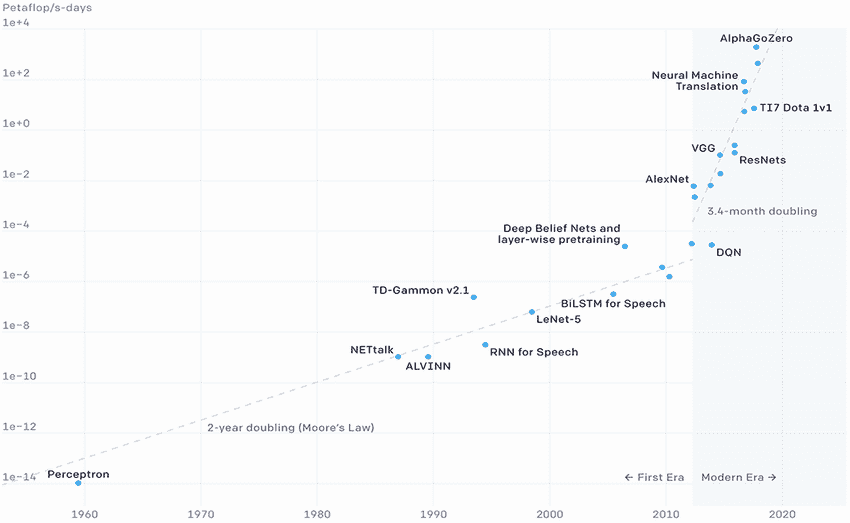

图 1.1 训练大型神经网络的计算成本一直在稳步增长，使得超参数调整变得越来越困难。

这意味着在大型数据集上训练模型是相当复杂的，并且需要大量的工作。此外，我们希望确定能够提供最佳准确率的超参数值，因此需要进行多次训练。我们应该如何选择数值来对我们的模型进行参数化，以便尽快找到最佳组合？这是超参数调整的核心问题。

回到我们在第 1.1 节中的神经网络示例，我们应该尝试多少层才能找到高于 81%的准确度？在 10 层和 20 层之间的某个数值是有前途的，因为在 10 层和 20 层，我们的性能比在 5 层时更好。但我们应该检查哪个确切的数值仍然不明显，因为在 10 和 20 之间的数值仍然可能有很大变异性。当我们说*变异性*时，我们隐含地谈论了我们关于模型测试准确性如何随层数变化而变化的不确定性。即使我们知道 10 层导致 81%，20 层导致 75%，我们仍然不能确定例如 15 层会产生什么值。这就是说，当我们考虑 10 和 20 之间的这些值时，我们需要考虑我们的不确定性水平。

此外，如果某个大于 20 的数值为我们提供了最高可能的准确度怎么办？这对于许多大型数据集来说是一种情况，其中足够的深度对于神经网络学习任何有用的东西都是必要的。或者，尽管不太可能，少于 5 层的小层数实际上是我们需要的吗？

我们应该如何以有原则的方式探索这些不同的选择，以便在时间耗尽和我们必须向老板汇报时，我们可以充分自信地认为我们已经找到了我们模型的最佳层数？该问题是*昂贵黑盒优化*问题的一个例子，我们接下来会讨论这个问题。

### 1.1.2 昂贵黑盒优化问题

在这个子章节中，我们正式介绍了昂贵黑盒优化问题，这是贝叶斯优化的目标。理解为什么这个问题很难有助于我们理解，为什么贝叶斯优化比更简单的、更天真的方法更受欢迎，比如网格搜索（我们将搜索空间分为相等的段）或随机搜索（我们使用随机性来指导我们的搜索）。

在这个问题中，我们可以黑匣子方式访问函数（一些输入-输出机制），我们的任务是找到最大化此函数输出的输入。该函数通常称为*目标函数*，因为优化它是我们的目标，并且我们希望找到目标函数的*最优解*——产生最高函数值的输入。

目标函数的特点

术语*黑盒*意味着我们不知道目标的底层公式；我们唯一能够访问的是通过在某个输入处计算函数值进行观察时得到的函数输出。在我们的神经网络示例中，我们不知道如果我们逐层增加层数，我们的模型的准确性将如何变化（否则，我们将只选择最佳层）。

这个问题很昂贵，因为在许多情况下，做出观察（在某个位置评估目标）的成本非常高昂，使得像穷举搜索这样的天真方法难以处理。在机器学习和尤其是深度学习中，时间通常是主要的约束条件，正如我们之前讨论过的那样。

超参数调整属于这一类昂贵的黑盒优化问题，但不是唯一的！任何试图找到一些设置或参数来优化一个过程，而不知道不同设置如何影响和控制过程结果的程序都属于黑盒优化问题。此外，尝试特定设置并观察其对目标过程（目标函数）的结果是耗时的、昂贵的或在某种程度上成本高昂的。

定义 尝试特定设置的行为——即，在某个输入处评估目标函数的值——称为*发出查询*或*查询目标函数*。整个过程总结如图 1.2。

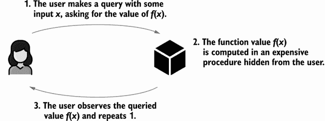

图 1.2 黑盒优化问题的框架。我们反复查询不同位置的函数值以找到全局最优解。

### 1.1.3 其他昂贵的黑盒优化问题的实际例子

现在，让我们考虑一些属于昂贵的黑盒优化问题类别的实际例子。我们会发现这样的问题在这个领域中很常见；我们经常会遇到想要优化但只能评估少数次的函数。在这些情况下，我们希望找到一种方法来智能地选择在哪里评估函数。

第一个例子是药物发现——科学家和化学家识别具有理想化学特性的化合物，可以合成成药物的过程。正如你可以想象的那样，实验过程非常复杂并且成本很高。使这项药物发现任务令人生畏的另一个因素是近年来已经观察到的药物发现研发生产力下降趋势。这种现象被称为*艾尔姆定律*——*摩尔定律*的反转——它大致说明了每十亿美元批准的新药物数量在固定时间内减半。艾尔姆定律在杰克·W·斯坎内尔（Jack W. Scannell）、亚历克斯·布兰克利（Alex Blanckley）、海伦·波尔登（Helen Boldon）和布莱恩·沃灵顿（Brian Warrington）撰写的自然杂志论文“诊断药物研发效率下降”（[`www.nature.com/articles/nrd3681`](https://www.nature.com/articles/nrd3681)）的第 1 张图片中有可视化。（或者，你也可以简单地在谷歌上搜索“艾尔姆定律”的图像。）

赫尔姆斯定律显示，每十亿美元的药物研究与开发（R&D）投资所得到的药物发现能力，经过对数尺度上的线性下降。换句话说，对于固定数量的 R&D 投资，药物发现能力在最近几年呈指数级下降。虽然在不同年份存在局部趋势的起伏，但从 1950 年到 2020 年，指数下降趋势是明显的。

实际上，同样的问题适用于任何科学发现任务，其中科学家们通过使用需要顶级设备和可能需要几天或几周才能完成的实验，搜索罕见、新颖和有用的新化学品、材料或设计，用于某种度量标准。换句话说，他们试图针对极为昂贵的数据评估来优化它们各自的目标函数。

以表 1.2 为例，展示了真实数据集中的几个数据点。目标是找到具有最低混合温度的合金组成（来自四个母元素）。这是一个黑盒优化问题。在这里，材料科学家们研究了铅（Pb）、锡（Sn）、锗（Ge）和锰（Mn）的合金组成。每个给定的组合百分比对应于一个可以在实验室中合成和实验的潜在合金。

表 1.2 来自材料发现任务的数据

| Pb 的百分比 | Sn 的百分比 | Ge 的百分比 | Mn 的百分比 | 混合温度（°F） |
| --- | --- | --- | --- | --- |
| 0.50 | 0.50 | 0.00 | 0.00 | 192.08 |
| 0.33 | 0.33 | 0.33 | 0.00 | 258.30 |
| 0.00 | 0.50 | 0.50 | 0.00 | 187.24 |
| 0.00 | 0.33 | 0.33 | 0.33 | 188.54 |
| *来源*: 作者的研究工作。 |

由于低的混合温度表示合金结构稳定、有价值，目标是找到混合温度尽可能低的组成。但是有一个瓶颈：通常需要数天时间才能确定给定合金的混合温度。我们要算法地解决的问题是类似的：给定我们看到的数据集，我们应该尝试下一个组合（在铅、锡、锗和锰的含量上如何）以找到最低的混合温度？

另一个例子是在采矿和石油钻探中，或者更具体地说，在一个大区域内找到具有最高价值矿物或石油产量的地区。这需要大量的规划、投资和劳动力，是一项昂贵的事业。由于挖掘作业对环境有重大负面影响，因此有相应的法规来减少采矿活动，在这个优化问题中对可以进行的*函数评估*数量设定了限制。

昂贵的黑盒优化中的中心问题是：如何决定在哪里评估这个目标函数，以便在搜索结束时找到其最优值？正如我们在后面的例子中看到的，简单的启发式方法——如随机或网格搜索，这些方法是流行的 Python 包（如 scikit-learn）实现的——可能会导致对目标函数的浪费性评估，从而导致整体优化性能较差。这就是贝叶斯优化发挥作用的地方。

## 1.2 介绍贝叶斯优化

考虑到昂贵的黑盒优化问题，现在我们介绍贝叶斯优化作为这个问题的解决方案。这给了我们一个高层次的关于贝叶斯优化是什么以及它如何使用概率机器学习来优化昂贵的黑盒函数的概念。

贝叶斯优化（BayesOpt）的定义是一种机器学习技术，它同时维护一个预测模型来学习关于目标函数的信息*并且*通过贝叶斯概率和决策理论决定如何获取新数据来完善我们对目标的知识。

通过*数据*，我们指的是输入输出对，每个对应一个输入值到该输入处的目标函数值的映射。在超参数调优的具体案例中，这些数据与我们旨在调整的机器学习模型的训练数据不同。

在贝叶斯优化过程中，我们根据贝叶斯优化算法的建议做出决定。一旦我们采取了贝叶斯优化建议的行动，贝叶斯优化模型将根据该行动的结果进行更新，并继续推荐下一步要采取的行动。这个过程重复进行，直到我们有信心找到了最优行动。

这个工作流程有两个主要组成部分：

+   一个从我们所做的观察中学习并对未见数据点上的目标函数值进行预测的机器学习模型

+   通过评估目标以定位最优值的优化策略

我们在以下小节中介绍每个组件。

### 1.2.1 用高斯过程建模

贝叶斯优化首先在我们试图优化的目标函数上拟合一个预测的机器学习模型——有时，这被称为替代模型，因为它充当我们从观察中相信的函数和函数本身之间的替代。这个预测模型的作用非常重要，因为它的预测结果会影响贝叶斯优化算法的决策，并且直接影响优化性能。

几乎在所有情况下，高斯过程（GP）被用于这种预测模型的角色，我们在本小节中对此进行了研究。在高层次上，与任何其他机器学习模型一样，高斯过程（GP）的运行原则是相似的数据点产生相似的预测。与岭回归、决策树、支持向量机或神经网络等其他模型相比，GPs 可能不是最受欢迎的模型类别。然而，正如我们在本书中一再看到的那样，GPs 带有一个独特且至关重要的特性：它们不像其他提到的模型那样产生点估计预测；相反，它们的预测是以概率分布的形式。以概率分布或概率预测的形式进行的预测在贝叶斯优化中是关键的，它使我们能够量化我们的预测不确定性，进而改善我们在做出决策时的风险-回报折衷。

首先让我们看看当我们在数据集上训练一个 GP 时它是什么样子的。比如说，我们有兴趣训练一个模型来从表 1.3 的数据集中学习，该数据集在图 1.3 中被可视化为黑色的 *x*。

表 1.3 对应于图 1.3 的一个示例回归数据集

| 训练数据点 | 标签 |
| --- | --- |
| 1.1470 | 1.8423 |
| -4.0712 | 0.7354 |
| 0.9627 | 0.9627 |
| 1.2471 | 1.9859 |

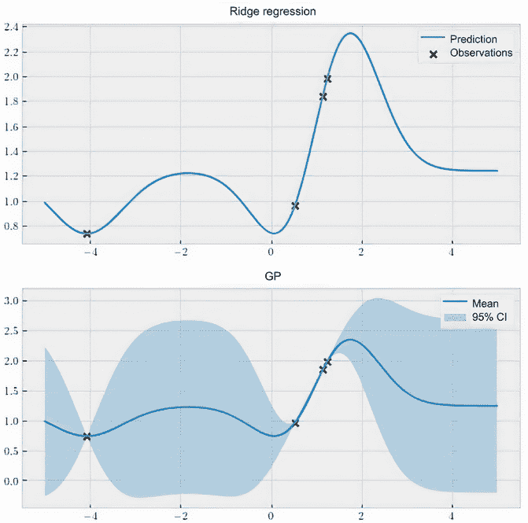

图 1.3 非贝叶斯模型，比如岭回归器，做出的是点估计，而高斯过程则产生概率分布作为预测。因此，高斯过程提供了一个校准的不确定性量化，这是在做出高风险决策时的一个重要因素。

我们首先在这个数据集上拟合了一个岭回归模型，并在 -5 和 5 的范围内做出预测；图 1.3 的顶部面板显示了这些预测。*岭回归模型*是线性回归模型的改进版本，其中模型的权重被正则化，以便更偏爱较小的值，以防止过拟合。该模型在给定测试点时所做的每个预测都是一个单值数字，它并没有捕获我们对所学习函数行为的不确定性水平的认识。例如，给定 2 的测试点，该模型简单地预测为 2.2。

我们不需要过多地了解这个模型的内部工作原理。关键在于岭回归器产生没有不确定性度量的点估计，这也是许多机器学习模型的情况，比如支持向量机、决策树和神经网络。

那么，高斯过程是如何做出预测的呢？如图 1.3 的底部面板所示，高斯过程的预测是以概率分布的形式（具体来说，是正态分布）进行的。这意味着在每个测试点，我们有一个平均预测（实线）以及所谓的 95% 置信区间（CI）（阴影区域）。

需要注意的是，“CI”这个缩写词在统计学的频率主义中常用来缩写“置信区间”（confidence interval）；在本书中，我只使用“CI”来指代“可信区间”（credible interval）。虽然这两个概念在技术上有许多不同之处，但从高层次上来看，我们仍然可以将本书中的 CI 视为一个区间，这个区间内有可能包含一个感兴趣的数量（在这种情况下，就是我们正在预测的函数的真实值）。

GP vs. 岭回归

有趣的是，当使用相同的协方差函数（也称为“核”）时，“高斯过程”（GP）和“岭回归模型”产生了相同的预测结果（对于 GP 来说是均值预测），如图 1.3 所示。我们会在第三章更深入地讨论协方差函数。这意味着，GP 具有岭回归模型所有的好处，同时还提供了额外的 CI 预测。

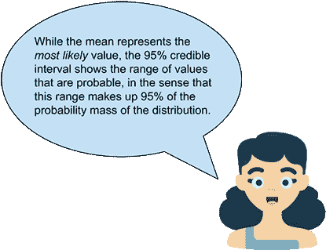

在实际测试位置上，这个 CI 有效地度量了我们对每个测试位置的价值的不确定性水平。如果一个位置的预测 CI 较大（比如图 1.3 中的-2 或 4），则这个值的可能值范围更广。换句话说，我们对这个值的确定性更低。如果一个位置的 CI 较小（图 1.3 中的 0 或 2），则我们对这个位置的值更有信心。GP 的一个很好的特点是，对于训练数据的每个点，预测 CI 接近于 0，这表示我们对其值没有任何不确定性。这是有道理的；毕竟，我们已经从训练集中知道了该值。

带噪音的函数评估

虽然在图 1.3 中不是这种情况，但是在我们的数据集中，数据点的标签可能是有噪声的。在实际世界中，观察数据的过程很可能会受到噪声的干扰。在这种情况下，我们可以使用 GP 进一步指定噪声水平，观察数据点的 CI 将不会降为 0，而是降至指定的噪声水平。这表明了使用 GP 建模所具有的灵活性。

能够将我们对不确定性的水平进行量化的能力（称为“不确定性量化”）在任何高风险的决策过程中都非常有用，比如贝叶斯优化。在 1.1 节中出现的情景再次设想一下，我们调整神经网络中的层数，并且只有时间尝试一个更多的模型。假设在那些数据点上训练之后，GP 预测 25 层的平均精度将为 0.85，相应的 95% CI 为 0.81 至 0.89。另一方面，对于 15 层，GP 预测我们的精度平均也是 0.85，但是 95% CI 为 0.84 至 0.86。在这种情况下，即使这两个数字具有相同的期望值，选择 15 层是相当合理的，因为我们更“确定”15 层将给我们带来好的结果。

清楚地说，GP 不会为我们做出任何决定，但它确实通过其概率预测为我们提供了一种方法。决策留给 BayesOpt 框架的第二部分：策略。

### 使用 BayesOpt 策略做决策

除了作为预测模型的 GP 之外，在 BayesOpt 中，我们还需要一个决策过程，我们将在本小节中探讨这个问题。这是 BayesOpt 的第二个组成部分，它接受 GP 模型所做的预测，并推理如何最好地评估目标函数，以便有效地找到最优解。

如前所述，95% CI 为 0.84 至 0.86 的预测要比 95% CI 为 0.81 至 0.89 的预测更好，特别是如果我们只有一次尝试的机会。这是因为前者更像是一件确定的事情，保证为我们带来一个好结果。在两个点的预测均值和预测不确定性可能不同的更一般情况下，我们应该如何做出这个决定？

这正是 BayesOpt 策略帮助我们做的事情：量化一个点的有用性，考虑到其预测概率分布。策略的工作是接受 GP 模型，该模型代表我们对目标函数的信念，并为每个数据点分配一个分数，表示该点在帮助我们识别全局最优解方面的帮助程度。这个分数有时被称为*获取分数*。我们的工作是选择最大化这个获取分数的点，并在该点评估目标函数。

我们在图 1.4 中看到与图 1.3 中相同的 GP，在底部面板中显示了一个名为*Expected Improvement*的特定 BayesOpt 策略如何在*x*-轴上的每个点（在我们的搜索空间内的-5 到 5 之间）得分。我们将在第四章学习这个名称的含义以及该策略如何对数据点进行评分。现在，让我们先记住，如果一个点具有较大的获取分数，这个点对于定位全局最优解是有价值的。

图 1.4 BayesOpt 策略通过其在定位全局最优解中的有用性对每个单独的数据点进行评分。该策略倾向于高预测值（其中回报更有可能）以及高不确定性（其中回报可能较大）。

在图 1.4 中，最佳点在 1.8 左右，这是有道理的，因为根据我们在顶部面板中的 GP，在那里我们也实现了最高的预测均值。这意味着我们将选择在 1.8 处评估我们的目标，希望从我们收集到的最高值中得到改进。

我们应该注意到，这不是一个一次性的过程，而是一个*学习循环*。在循环的每一次迭代中，我们根据我们从目标中观察到的数据训练一个高斯过程（GP），在这个高斯过程上运行贝叶斯优化策略，以得到一个希望帮助我们确定全局最优的建议，然后在推荐位置进行观察，将新点添加到我们的训练数据中，并重复整个过程，直到达到某个终止条件。事情可能变得有点混乱，所以是时候退后一步，看看贝叶斯优化的大局了。

与实验设计的联系

此时，贝叶斯优化的描述可能让你想起了统计学中的*实验设计*（DoE）的概念，它旨在通过调整可控设置来解决优化目标函数的问题。这两种技术之间存在许多联系，但是贝叶斯优化可以被看作是一种更一般的方法，它由机器学习模型高斯过程（GP）驱动。

### 1.2.3 组合高斯过程和优化策略形成优化循环

在本小节中，我们总结了我们迄今为止所描述的内容，并使过程更加具体。我们全面地看到了贝叶斯优化的工作流程，并更好地理解了各个组成部分是如何相互配合的。

我们从一个初始数据集开始，就像表 1.1、1.2 和 1.3 中的那样。然后，贝叶斯优化的工作流程在图 1.5 中进行了可视化，总结如下：

1.  我们在这个数据集上训练了一个高斯过程（GP）模型，根据我们从训练数据中观察到的内容给出了对我们的目标在每个地方的信念。这种信念由实线和阴影区域表示，就像图 1.3 和 1.4 中的那样。

1.  然后，贝叶斯优化策略接收这个高斯过程，并根据该点在域中的价值对每个点进行评分，这如图 1.4 中的下曲线所示。

1.  最大化该分数的点是我们选择下一个要评估目标的点，然后将其添加到我们的训练数据集中。

1.  这个过程会重复进行，直到我们无法再评估目标。

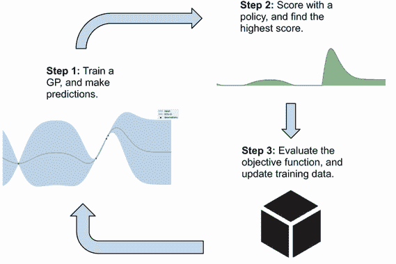

图 1.5 贝叶斯优化循环，结合了高斯过程（GP）建模和决策制定的策略。现在可以使用这个完整的工作流程来优化黑盒函数。

与监督学习任务不同，我们只需在训练数据集上拟合一个预测模型并在测试集上进行预测（只包括步骤 1 和 2），贝叶斯优化工作流程通常被称为*主动学习*。主动学习是机器学习中的一个子领域，我们可以决定我们的模型从哪些数据点中学习，而这个决策过程则由模型本身来决定。

正如我们所说，GP 和政策是这个 BayesOpt 过程的两个主要组成部分。如果 GP 没有很好地对客观函数进行建模，那么我们将无法很好地将训练数据中的信息通知给政策。另一方面，如果政策不能很好地给“好”点分配高分和给“坏”点分配低分（其中*好*意味着有助于找到全局最优解），那么我们的后续决策将是错误的，并且很可能会取得糟糕的结果。

换句话说，如果没有一个好的预测模型，比如一个 GP，我们就无法通过校准的不确定性做出良好的预测。没有政策，我们可以做出良好的*预测*，但我们不会做出良好的*决策*。

我们在本书中多次考虑的一个例子是天气预报。想象一下这样一个情景，你要决定在离开家去上班前是否带伞，并查看手机上的天气预报应用程序。

不用说，应用程序的预测需要准确可靠，这样你就可以自信地根据它们做出决定。一个总是预测晴天的应用程序是不够的。此外，你需要一种明智的方式来根据这些预测做出决策。无论多么可能下雨，永远不带伞都是一个糟糕的决策政策，当下雨时会让你陷入麻烦。另一方面，即使天气预报有 100% 的晴天可能性，也不是一个明智的决定。你希望根据天气预报*自适应地*决定是否带伞。

自适应地做出决策是 BayesOpt 的核心，为了有效地实现这一点，我们需要一个好的预测模型和一个好的决策政策。在这个框架的两个组成部分都需要注意；这就是为什么本章后面的两个主要部分分别涵盖了用 GP 进行建模和用 BayesOpt 政策进行决策。

### 1.2.4 BayesOpt 的实际应用

此时，你可能想知道所有这些复杂的机器真的是否有效—或者是否比一些简单的策略如随机抽样更有效。为了找出答案，让我们看一下 BayesOpt 在一个简单函数上的“演示”。这也是我们从抽象到具体的好方法，并揭示了我们在后续章节中能做什么。

假设我们试图优化的黑盒客观函数（特别是在这种情况下，最大化）是图 1.6 中的一维函数，从 -5 到 5 定义。同样，这个图片仅供参考；在黑盒优化中，我们实际上不知道客观函数的形状。我们看到客观函数在 -5（大约 -2.4 和 1.5）附近有几个局部极大值，但全局最大值在右侧大约是 4.3。此外，假设我们被允许最多评估客观函数 10 次。

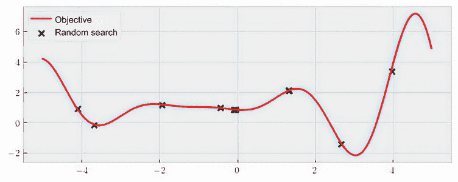

图 1.6 要最大化的目标函数，在随机搜索中浪费资源于不利区域

在看到贝叶斯优化如何解决这个优化问题之前，让我们看看两种基准策略。第一种是随机搜索，在–5 到 5 之间均匀采样；我们得到的任何点都是我们将评估目标的位置。图 1.6 是这样一个方案的结果。这里找到的价值最高的点大约在*x* = 4 处，其值为*f*(*x*) = 3.38。

随机搜索的工作原理

随机搜索涉及在我们的目标函数域内均匀随机选择点。也就是说，我们最终到达域内某点的概率等于我们最终到达其他任何点的概率。如果我们认为搜索空间中有重要区域应该更加关注，我们可以从非均匀分布中抽取这些随机样本，而不是均匀采样。然而，这种非均匀策略需要在开始搜索之前知道哪些区域是重要的。

你可能会觉得不满意的是，这些随机抽样的点中有许多恰好落入 0 周围的区域。当然，许多随机样本聚集在 0 周围只是偶然的，而在另一个搜索实例中，我们可能会发现在另一个区域有许多样本。然而，我们仍然可能浪费宝贵的资源来检查函数的一个小区域，其中包含许多评估。直觉上，扩展我们的评估更有利于我们了解目标函数。

这种*扩散*评估的想法将我们带到了第二个基准：网格搜索。在这里，我们将搜索空间划分为均匀间隔的段，并在这些段的端点进行评估，就像图 1.7 所示。

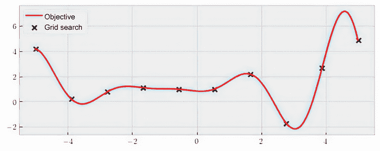

图 1.7 网格搜索仍然无法有效缩小好的区域。

这次搜索中的最佳点是最右边的最后一个点，在 5 处进行评估，大约为 4.86。这比随机搜索更好，但仍然错过了实际的全局最优点。

现在，我们准备看贝叶斯优化如何运作！贝叶斯优化从一个随机抽样的点开始，就像随机搜索一样，如图 1.8 所示。

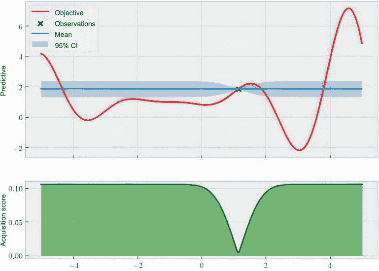

图 1.8 贝叶斯优化的开始与随机搜索相似。

图 1.8 的顶部面板表示对评估点进行训练的高斯过程，而底部面板显示了由期望改进策略计算的分数。请记住，这个分数告诉我们应该如何评价我们搜索空间中的每个位置，我们应该选择下一个评估分数最高的位置。有趣的是，在这一点上，我们的策略告诉我们，我们搜索的-5 到 5 之间的几乎整个范围都很有前景（除了围绕 1 的区域，我们已经进行了一次查询）。这应该是直观的，因为我们只看到了一个数据点，而且我们还不知道其他区域的目标函数是什么样子的。我们的策略告诉我们我们应该探索更多！现在让我们看看从第一个查询到第四个查询时我们模型的状态如何在图 1.9 中。

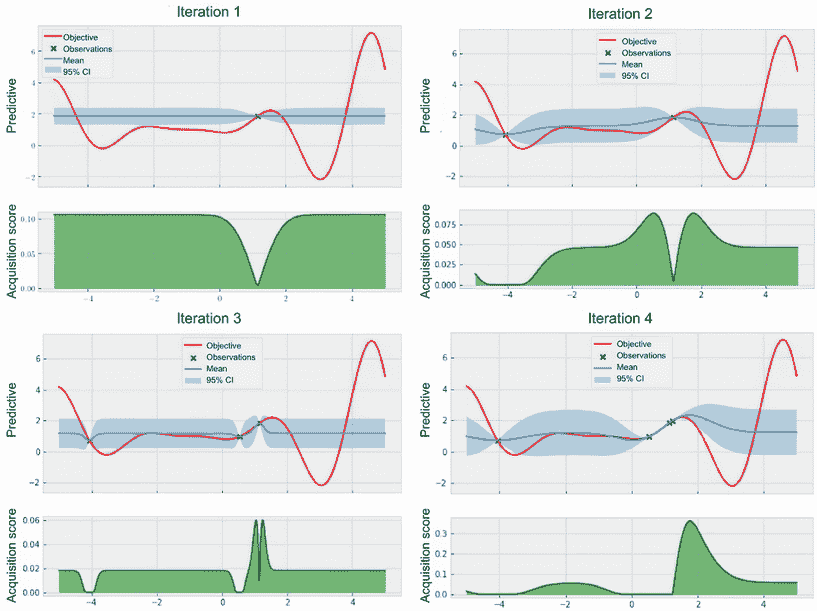

图 1.9 在四次查询之后，我们确定了第二个最佳点。

四次查询中有三次集中在点 1，这里有一个局部最优点，我们还看到我们的策略建议我们下一步查询这个区域的另一个点。此时，你可能担心我们会陷入这个局部最优区域无法摆脱，无法找到真正的最优点，但我们会看到情况并非如此。让我们快进到图 1.10 中的接下来两次迭代。

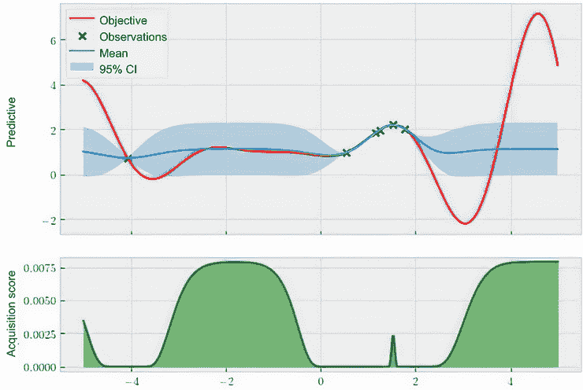

图 1.10 在充分探索局部最优点后，我们被鼓励看看其他区域。

在对这个局部最优区域进行五次查询后，我们的策略决定有其他更有前景的区域可供探索——即左边约为-2 和右边约为 4 的区域。这非常令人放心，因为它表明一旦我们足够探索一个区域，贝叶斯优化就不会陷入那个区域。现在让我们看看图 1.11 中进行八次查询后会发生什么。

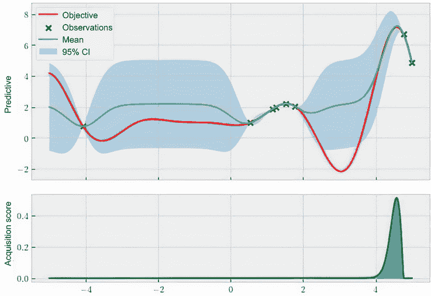

图 1.11 贝叶斯优化成功地忽略了左边的大区域。

在这里，我们观察到了右边的另外两个点，这些点更新了我们的高斯过程模型和我们的策略。观察均值函数（实线，表示最可能的预测），我们看到它几乎与真实目标函数从 4 到 5 的情况完全匹配。此外，我们的策略（底部曲线）现在非常接近全局最优点，基本上没有其他区域。这很有趣，因为我们并没有彻底检查左边的区域（我们只有一个观察到左边的 0），但我们的模型认为与当前区域相比，无论那个区域的函数长什么样子，都不值得调查。在我们的情况下，这实际上是正确的。

最后，在进行了 10 次查询的搜索结束时，我们的工作流现在在图 1.12 中可视化。现在几乎没有疑问，我们已经确定了约为 4.3 的全局最优点。

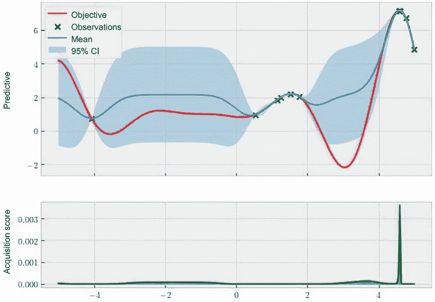

图 1.12 贝叶斯优化在搜索结束时找到了全局最优点。

这个例子清楚地向我们展示了贝叶斯优化比随机搜索和网格搜索要好得多。这对我们来说应该是一个非常鼓舞人心的迹象，因为后两种策略是许多机器学习实践者在面临超参数调优问题时使用的方法。

例如，scikit-learn 是 Python 中最流行的机器学习库之一，它提供了`model_selection`模块用于各种模型选择任务，包括超参数调优。然而，随机搜索和网格搜索是该模块实现的唯一超参数调优方法。换句话说，如果我们确实使用随机或网格搜索调整超参数，我们有很大的提升空间。

总的来说，使用 BayesOpt 可能会导致优化性能显著提高。我们可以快速看几个真实世界的例子：

+   一份名为“贝叶斯优化优于随机搜索的机器学习超参数调优”的 2020 年研究论文（[`arxiv.org/pdf/2104.10201.pdf`](https://arxiv.org/pdf/2104.10201.pdf)）是 Facebook、Twitter、英特尔等公司的联合研究成果，发现 BayesOpt 在许多超参数调优任务中都非常成功。

+   弗朗西斯·阿诺德（2018 年诺贝尔奖获得者，加州理工学院教授）在她的研究中使用 BayesOpt 来引导寻找高效催化理想化学反应的酶。

+   一项名为“通过高通量虚拟筛选和实验方法设计高效的分子有机发光二极管”的研究（[`www.nature.com/articles/nmat4717`](https://www.nature.com/articles/nmat4717)）发表在*自然*上，将 BayesOpt 应用于分子有机发光二极管（一种重要类型的分子）的筛选问题，并观察到效率大幅提高。

还有很多类似的例子。

不适用 BayesOpt 的情况

同样重要的是要知道问题设置不合适的情况以及何时*不*使用 BayesOpt。正如我们所说，当我们的有限资源阻止我们多次评估目标函数时，BayesOpt 是有用的。如果不是这种情况，评估目标函数是廉价的，我们没有理由在观察目标函数时吝啬。

如果我们能够彻底检查密集网格上的目标，那将确保找到全局最优解。否则，可能会使用其他策略，例如 DIRECT 算法或进化算法，这些算法在评估成本较低时通常擅长优化。此外，如果目标梯度的信息可用，梯度算法将更适合。

我希望这一章能激发你的兴趣，让你对即将发生的事情感到兴奋。在下一节中，我们将总结你将在本书中学到的关键技能。

## 1.3 你将在本书中学到什么？

本书深入理解 GP 模型和 BayesOpt 任务。您将学习如何使用最先进的工具和库在 Python 中实现 BayesOpt 流水线。您还将接触到一系列建模和优化策略，当处理 BayesOpt 任务时。到本书结束时，您将能够做到以下几点：

+   使用 GPyTorch 实现高性能的 GP 模型，这是 Python 中的首选 GP 建模工具；可视化和评估它们的预测；为这些模型选择适当的参数；并实现扩展，例如变分 GP 和贝叶斯神经网络，以适应大数据

+   使用最先进的 BayesOpt 库 BoTorch 实现各种 BayesOpt 策略，并与 GPyTorch 很好地集成，并检查以及理解它们的决策策略

+   使用 BayesOpt 框架处理不同的专业化设置，例如批处理、约束和多目标优化

+   将 BayesOpt 应用于真实任务，例如调整机器学习模型的超参数

进一步地，我们在练习中使用真实世界的例子和数据来巩固我们在每一章学到的知识。在整本书中，我们在许多不同的环境中运行我们的算法在相同的数据集上，以便我们可以比较和分析不同的方法。

## 摘要

+   现实世界中的许多问题可以被看作是昂贵的黑盒优化问题。在这些问题中，我们只观察到函数值，没有任何额外的信息。此外，观察一个函数值是昂贵的，使得许多盲目的优化算法无法使用。

+   BayesOpt 是一种机器学习技术，通过设计目标函数的智能评估来解决这个黑盒优化问题，以便尽快找到最优解。

+   在 BayesOpt 中，GP 充当预测模型，预测给定位置的目标函数的值。GP 不仅生成均值预测，还通过正态分布表示不确定性的 95% CI。

+   要优化黑盒函数，BayesOpt 策略会迭代地决定在哪里评估目标函数。该策略通过量化每个数据点在优化方面的帮助程度来实现这一点。

+   在 BayesOpt 中，GP 和策略是相辅相成的。前者用于进行良好的预测，后者用于做出良好的决策。

+   通过以自适应的方式做出决策，BayesOpt 在优化方面比随机搜索或网格搜索更好，后者通常用作黑盒优化问题中的默认策略。

+   BayesOpt 在机器学习和其他科学应用中，如药物发现中的超参数调优中取得了显著的成功。
