# 第三章：高斯过程作为函数分布

本章内容包括

+   对多元高斯分布及其属性的速成课程

+   将 GPs 理解为无限维度中的多元高斯分布

+   在 Python 中实现 GP

现在我们已经看到贝叶斯优化可以帮助我们做什么，我们已经准备好踏上掌握贝叶斯优化的旅程。正如我们在第一章中看到的，贝叶斯优化工作流程由两个主要部分组成：高斯过程（GP）作为预测模型或替代模型，以及用于决策的策略。使用 GP，我们不仅获得测试数据点的点估计作为预测，而且我们有一个完整的*概率分布*表示我们对预测的信念。

使用 GP，我们从相似的数据点产生相似的预测。例如，在天气预报中，当估计今天的温度时，GP 会查看与今天相似的几天的气候数据，即最近几天或一年前的这一天。另一个季节的天数不会在进行此预测时通知 GP。同样，当预测房屋价格时，GP 将会说预测目标所在地区的相似房屋比另一个州的房屋更具信息量。

数据点之间的相似程度是使用 GP 的协方差函数来编码的，此外，该函数还模拟了 GP 预测的不确定性。请记住，在第一章中我们对比了岭回归模型和 GP 的模型，再次显示在图 2.1 中。在这里，虽然岭回归器只产生单值预测，但 GP 在每个测试点输出一个正态分布。不确定性量化是将 GP 与其他 ML 模型区分开来的因素，特别是在不确定性决策的背景下。


图 2.1 岭回归和 GP 的预测。尽管 GP 的平均预测与岭回归的预测相同，但 GP 还提供了表示预测不确定性的 CI。

我们将看到如何通过高斯分布在数学上实现相关建模和不确定性量化，并学习如何在 GPyTorch 中实际实现 GP，这是 Python 中首选的 GP 建模工具。能够用 GP 对函数进行建模是迈向贝叶斯优化的第一步，我们将在本章中完成这一步。

为什么选择 GPyTorch？

在 Python 中还有其他的 GP 建模库，如 GPy 或 GPflow，但我们选择了 GPyTorch 作为本书的工具。基于 PyTorch 构建且处于积极维护状态，GPyTorch 提供了从数组操作到 GP 建模再到使用 BoTorch 进行贝叶斯优化的简化工作流程，我们将在第四章开始使用 BoTorch。

该库也在积极维护，并且已实现了许多最先进的方法。例如，第十二章介绍了使用 GPyTorch 对大型数据集进行缩放的方法，在第十三章中，我们学习将神经网络集成到 GP 模型中。

## 2.1 如何以贝叶斯方式出售您的房屋

在我们立即进入高斯过程之前，让我们考虑一个房价建模领域的示例场景，以及房子价格如何与其他房子相关确定的例子。这个讨论作为多元高斯分布中相关性如何工作的示例，是高斯过程的核心部分。

假设你是密苏里州的一位房主，正打算出售你的房子。你正在尝试确定一个合适的要价，并与朋友讨论如何做到这一点：

**你：**     我不确定该怎么办。我只是不知道我的房子值多少钱。

**朋友：** 你有个大概的估算吗？

**你：**     我猜大概在 15 万到 30 万之间。

**朋友：** 这个范围挺大的。

**你：**     是啊，我希望我认识已经卖掉房子的人。我需要一些参考。

**朋友：** 我听说爱丽丝卖了她的房子 25 万。

**你：**     在加利福尼亚的阿利克斯吗？这真让人吃惊！而且，我不认为加利福尼亚的房子会帮助我更好地估算自己的房子。它可能仍然在 15 万到 30 万之间。

**朋友：** 不，是住在你隔壁的爱丽丝。

**你：**     哦，我明白了。这实际上非常有用，因为她的房子和我的非常相似！现在，我猜我的房子估价在 23 万到 27 万之间。是时候和我的房地产经纪人谈谈了！

**朋友：** 很高兴我能帮上忙。

在这次对话中，你说使用你的邻居爱丽丝的房子作为参考是估算你自己价格的好策略。这是因为这两个房子在属性上相似，并且彼此物理上靠近，所以你期望它们卖出的价格相似。另一方面，阿利克斯的房子位于加利福尼亚，与我们的房子毫不相关，所以即使你知道她的房子卖了多少钱，你也无法获得任何关于你感兴趣的新信息：你自己的房子值多少钱。

我们刚刚进行的计算是关于我们对房子价格的信念的贝叶斯更新。你可能熟悉贝叶斯定理，如图 2.2 所示。有关贝叶斯定理和贝叶斯学习的优秀介绍，请参阅路易斯·塞拉诺的《精通机器学习》（Manning，2021）第八章。

贝叶斯定理给了我们一种更新我们对我们感兴趣的数量的信念的方法，这种数量在这种情况下是我们房子的合适价格。在应用贝叶斯定理时，我们从先验信念，即我们的第一个猜测，到关于所讨论数量的后验信念。这个后验信念结合了先验信念和我们观察到的任何数据的可能性。

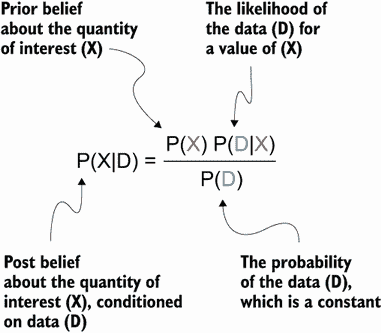

图 2.2 贝叶斯定理，它提供了一种更新对感兴趣的数量的信念的方法，表示为一个随机变量的概率分布。在观察到任何数据之前，我们对 X 有先验信念。在使用数据更新后，我们获得了关于 X 的后验信念。

在我们的例子中，我们首先有一个先验置信度，认为房价在 150k 到 300k 之间。正如你的朋友所说的那样，150k 到 300k 的范围很大，所以在这个初始先验置信度中没有太多信息，任何在 150k 到 300k 之间的价格都是可能的。当我们根据两个房子中任意一个的价格的新信息*更新*这个范围到后验置信度时，一件有趣的事情发生了。

首先，假设 Alix 在加利福尼亚的房子价值为 250k，我们对我们自己房子的后验置信度保持不变：从 150k 到 300k。同样，这是因为 Alix 的房子与我们的房子无关，她的房子的价格也无法告诉我们我们感兴趣的东西的数量。

其次，如果新的信息是 Alice 的房子，它就在我们的旁边，价值为 250k，那么我们的后验置信度就会从先验置信度大幅改变：变为 230k 到 270k 的范围。有了 Alice 的房子作为参考，我们已经根据观察值 250k 更新了我们的置信度，同时缩小了置信度的范围（从 150k 的差异缩小到 40k 的差异）。这是非常合理的事情，因为 Alice 的房子对我们房子的价格非常具有信息量。图 2.3 可视化了整个过程。

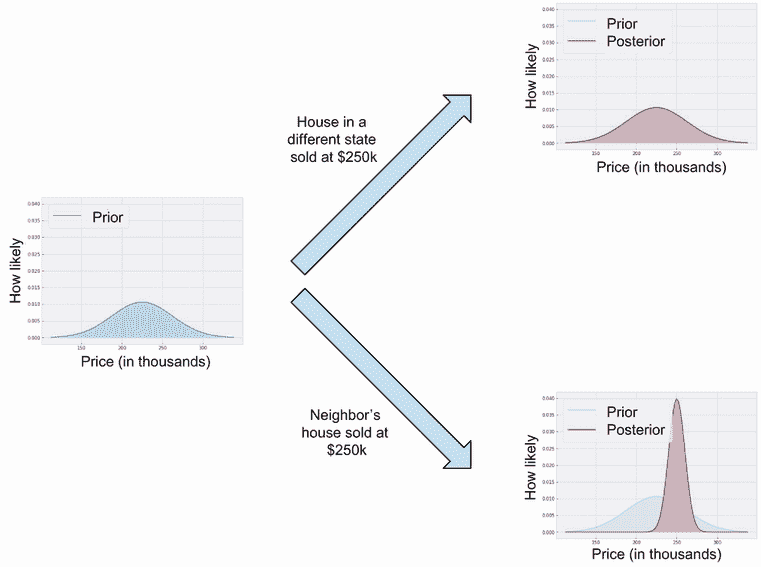

图 2.3 以贝叶斯方式更新我们房价的置信度。根据观察的房价与我们房子的相似程度，后验置信度要么保持不变，要么发生 drastīc 更新。

注意，示例中的数字不是精确的，只是为了使例子更具直观性。然而，我们将看到，使用多元高斯分布来建模我们的置信度，可以以可量化的方式实现这种直观的更新过程。此外，利用这样的高斯分布，我们可以确定一个变量（某人的房子）是否与我们感兴趣的变量（我们自己的房子）足够相似，以影响我们的后验置信度的程度。

## 2.2 用多元高斯分布和贝叶斯更新建模相关性

在本节中，我们学习多元高斯分布（或多元高斯分布，或简称高斯分布）以及它们如何促进我们之前看到的更新规则。这为我们后续讨论高斯过程奠定了基础。

### 2.2.1 使用多元高斯分布共同建模多个变量

在这里，我们首先介绍了多元高斯分布是什么以及它们可以模拟的内容。我们将看到，通过使用协方差矩阵，多元高斯分布描述了不仅是单个随机变量的行为，而且还描述了这些变量之间的相关性。

首先，让我们来考虑正态分布，也叫钟形曲线。正态分布在现实世界中非常常见，被用来模拟各种量，比如身高、智商、收入和出生体重。

当我们想要建模多于一个量时，我们将使用 MVN 分布。为此，我们将这些量聚合成一个随机变量向量，然后称此向量遵循 MVN 分布。这个聚合如图 2.4 所示。

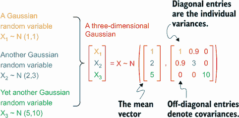

图 2.4 MVN 分布将多个正态分布的随机变量组合在一起。虽然 MVN 的均值向量连接了均值，但协方差矩阵模拟了各个变量之间的相关性。

定义 考虑一个随机向量*X* = [*X*[1]*X*[2] ... *X*[n]]，它遵循一个被标记为*N*(*μ*, Σ)的高斯分布，其中*μ*是长度为*n*的向量，Σ是一个*n*乘以*n*的矩阵。在这里，*μ*被称为均值向量，其各个元素表示*X*中相应随机变量的期望值，Σ是协方差矩阵，描述了各个变量的方差以及变量之间的相关性。

让我们花一点时间解析 MVN 分布的定义：

+   首先，由于 MVN 的便利性质，向量*X*中的每个随机变量都遵循正态分布。具体来说，第*i*个变量*X[i]*的平均值为*μ[i]*，这是 MVN 的均值向量*μ*的第*i*个元素。

+   此外，*X[i]*的方差是协方差矩阵Σ的第*i*个*对角*条目。

+   如果我们有一个遵循 MVN 的随机变量向量，那么每个单独的变量对应于一个已知的正态分布。

如果协方差矩阵Σ中的对角线条目是各个变量的方差，那么非对角线条目呢？该矩阵中第*i*行和第*j*列的条目表示*X[i]*和*X[j]*之间的协方差，这与两个随机变量之间的相关性有关。假设相关性为正，则以下结论成立：

+   如果这种相关性很高，那么两个随机变量*X[i]*和*X[j]*被认为是相关的。这意味着如果一个值增加，另一个值也倾向于增加，如果一个值减少，另一个值也会减少。你的邻居爱丽丝的房子和你自己的房子就是相关变量的例子。

+   另一方面，如果这种相关性很低且接近零，则无论*X[i]*的值是什么，我们关于*X[j]*值的了解很可能不会发生太大变化。这是因为两个变量之间没有相关性。加利福尼亚州的阿利克斯的房子和我们的房子属于这个类别。

负相关性

前面的描述是针对正相关性的。相关性也可以是负的，表示变量朝相反的方向移动：如果一个变量增加，另一个变量就会减少，反之亦然。正相关性展示了我们在这里想要学习的重要概念，所以我们不会担心负相关性的情况。

为了使我们的讨论更具体，让我们定义一个 MVN 分布，同时对三个随机变量进行建模：我们房子的价格 A；邻居爱丽丝房子的价格 B；以及加利福尼亚的阿利克斯房子的价格 C。这个三维高斯分布的协方差矩阵也在图 2.4 中描述。

注意 通常方便假设这个高斯分布的均值向量归一化为零向量。这种归一化通常在实践中完成，以简化许多数学细节。

再次，对角线单元格告诉我们单个随机变量的方差。B 的方差（3）略大于 A（1），这意味着我们对 B 的值更不确定，因为我们对邻居的房子不了解所有情况，所以不能做出更准确的估计。另一方面，第三个变量 C 具有最大的方差，表示加利福尼亚的房屋价格范围更广。

注意 这里使用的值（1, 3, 10）是示例值，目的是说明随机变量方差越大，我们对该变量的值越不确定（在了解其值之前）。

我们家（A）和邻居家（B）之间的协方差为 0.9，这意味着两栋房子的价格存在着显著的相关性。这是有道理的，因为如果我们知道邻居房子的价格，我们就能更好地估算出我们自己房子的价格，因为它们位于同一条街上。还要注意的是，无论是 A 还是 B 与加利福尼亚房价都没有任何相关性，因为位置上来看，C 与 A 或 B 没有任何共同之处。另一种说法是，即使我们知道加利福尼亚房子的价格，我们也不会对我们自己房子的价格了解多少。现在让我们在图 2.5 中使用平行坐标图来可视化这个三维高斯分布。

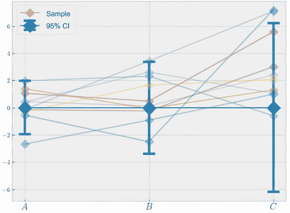

图 2.5 平行坐标图可视化了来自房价示例的均值归一化 MVN。误差条表示相应正态分布的 95% CI，而淡化的线显示了从多元高斯中绘制的样本。

注意图中的粗体菱形和相应的误差条：

+   粗体菱形代表我们高斯分布的均值向量，即零向量。

+   误差条表示三个单独变量的 95%可信区间（CI）。从 A 到 B 到 C，我们观察到越来越大的 CI，对应着相应方差的增加。

可信区间

正态分布随机变量*x*的(1 – α) CI 是一个范围，其中*x*落入这个范围的概率恰好为(1 – α)。统计学家通常对正态分布使用 95% CI。这里并没有什么特别之处，只是因为 95% 是许多统计程序用来确定某事是否有意义的阈值。例如，一个*t*检验通常使用置信水平 1 – α = 0.95，对应着*p*值小于 α = 0.05 表示显著结果。关于正态分布的一个方便事实是*μ* ± 1.96σ是一个 95% CI（有些甚至使用*μ* ± 2σ），其中*μ*和σ是变量*x*的均值和标准差，这是一个容易计算的量。

图 2.5 表示我们关于三栋房子标准化价格的*先验信念*。从这个先验开始，我们猜测所有三栋房子的标准化价格都为零，并且对我们的猜测有不同程度的不确定性。此外，由于我们正在处理一个随机分布，我们可以从这个 MVN 中抽取样本。这些样本显示为相连的半透明菱形。

### 2.2.2 更新 MVN 分布

有了一个 MVN 分布，我们将看到如何在本小节中观察到一些数据后更新这个分布。具体地说，跟随本章开头的示例，我们想要根据观察到的 B 或 C 的值推导出关于这些价格的*后验信念*。这是一个重要的任务，因为这是 MVN 以及 GP 从数据中学习的方式。

定义 这个更新过程有时被称为*条件设定*：推导出一个变量的*条件分布*，在我们已知某个其他变量的值的情况下。更具体地说，我们正在将我们的信念——一个联合三元高斯——条件设定为 B 或 C 的值，获得这三个变量的联合后验分布。

在这里，利用图 2.2 中的贝叶斯定理，我们可以得出这个后验分布的闭式形式。然而，推导过程相当数学密集，所以我们不会在这里详细介绍。我们只需要知道，我们有一个公式，可以插入我们想要条件的 B 或 C 的值，然后这个公式会告诉我们 A、B 和 C 的后验分布是什么。令人惊讶的是，高斯的后验分布是根据同样是高斯的数据进行条件设定的，我们可以获得指定后验高斯的确切后验均值和方差。（在本章后面，我们会看到当我们在 Python 中实现 GP 时，GPyTorch 会为我们处理这个数学密集的更新。）

注意 对于感兴趣的读者，这个公式及其推导可以在 Carl Edward Rasmussen 和 Christopher K. I. Williams（MIT Press，2006）的书籍*Gaussian Processes for Machine Learning*的第二章第二部分中找到，这本书通常被认为是 GP 的圣经。

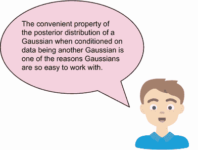

现在让我们重新生成平行坐标图，以 B = 4 作为 B 的示例值进行条件限制。结果如图 2.6 所示。

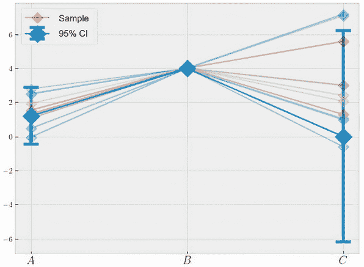

图 2.6 平行坐标图可视化了图 2.5 中 MVN 在 B = 4 条件下的情况。在这里，A 的分布被更新，所有绘制的样本都插值为 B = 4。

在用关于 B 的观察更新我们的信念后，我们的后验信念发生了一些变化：

+   A 的分布会发生变化，由于 A 和 B 之间的正相关关系，其均值会略微增加。此外，其误差范围现在变得更小。

+   B 的后验分布简单地变成了一个具有零方差的特殊正态分布，因为我们现在对后验中的 B 值完全确定。换句话说，对于 B 的值不再存在不确定性。

+   与此同时，C 的分布在更新后保持不变，因为它与 B 没有相关性。

所有这些都是有道理的，并且与我们从房价示例中得到的直觉相符。具体来说，当我们得知邻居的房子价格时，关于我们自己房子的信念被更新为类似于观察到的价格，并且我们的不确定性也减少了。

当我们以 C 为条件时会发生什么？正如您可能猜到的那样，由于在 B 的值上进行条件限制后 C 保持不变的原因，当我们以 C 为条件时，A 和 B 的后验分布都保持不变。图 2.7 展示了 C = 4 的情况。


图 2.7 平行坐标图可视化了图 2.5 中 MVN 在 C = 4 条件下的情况。在这里，没有其他边缘分布改变。所有绘制的样本都插值为 C = 4。

当我们得知加利福尼亚州的一栋房子被卖掉时，我们发现这栋房子与我们在密苏里州的房子无关，因此对我们房子价格的信念保持不变。

图 2.6 和图 2.7 还有另一个有趣之处。请注意，在图 2.6 中，当我们以 B = 2 为条件时，我们绘制的所有后验 MVN 的样本都经过点 (B, 2)。这是因为在我们的后验信念中，我们对于 B 取值不再有任何不确定性，因此从后验分布中绘制的任何样本都需要满足此条件的约束。图 2.7 中的点 (C, 2) 也是同样道理。

从视觉上来看，您可以将这理解为当我们对一个变量进行条件限制时，我们将从先验分布（在图 2.5 中）绘制的样本在相应的变量条件处“绑定”成一个结，如图 2.8 所示。

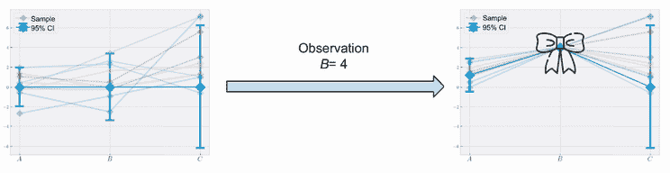

图 2.8 在观察上对高斯进行条件限制类似于在该观察周围打结。后验分布中的所有样本都需要通过这个结，且在观察点没有不确定性。

最后，我们可以通过类似于图 2.3 的图表来描述我们刚刚进行过的贝叶斯条件过程。这在图 2.9 中显示。

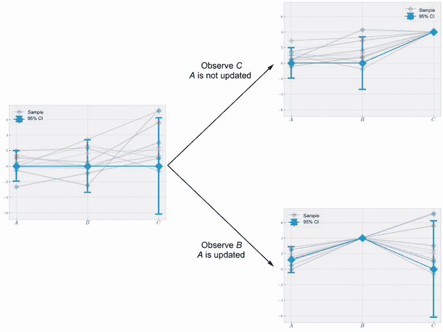

图 2.9：以贝叶斯方式更新关于我们房子价格的信念。根据观察到的房价与我们房子的相似程度，后验信念要么保持不变，要么得到极大更新。

再次，如果我们将高斯分布条件设置为 C，则不相关变量的后验分布保持不变。然而，如果我们将其设置为 B，与之相关的变量 A 会得到更新。

### 2.2.3：用高维高斯分布建模多个变量

MVN 分布不仅需要包含三个随机变量；事实上，它可以同时模拟任意数量的变量。在本小节中，我们了解到高维高斯分布的工作方式与我们迄今所见的相同。所以，我们可以说，一个代表三座房子的 3 维高斯分布，我们可以将其替换为一个编码街道上一系列房屋信息的 20 维高斯分布。甚至更高维的高斯分布可以模拟城市或国家中的房屋。

此外，通过这些平行坐标图，我们可以同时可视化高维高斯分布的所有单个变量。这是因为每个变量对应一个单独的误差条，只占用*x*轴上的一个位置。

我们再次将其均值向量归一化为零向量，虽然显示其 20×20 的协方差矩阵不方便，但我们可以绘制一个热图来可视化这个矩阵，就像图 2.10 中所示的那样。

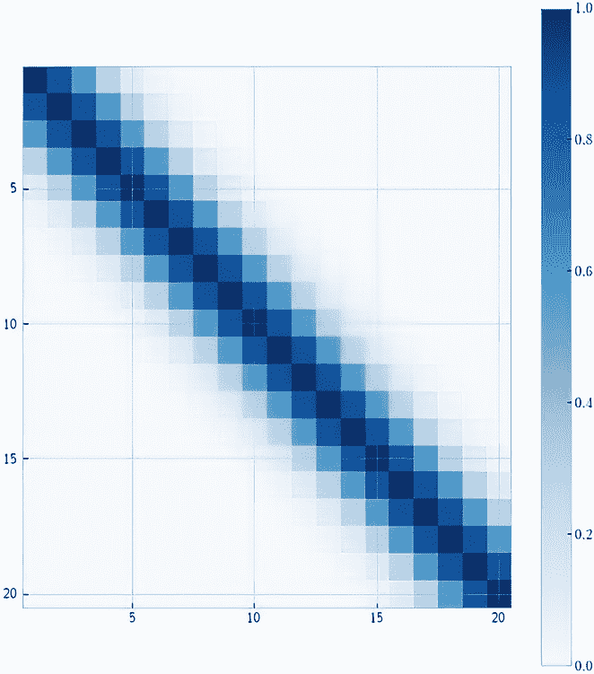

图 2.10：显示 20 维高斯分布的协方差矩阵的热图。相邻变量之间的相关性比远离的变量更大，这由较深的色调表示。

对角线条目，或者单个变量的方差，在这种情况下都是 1。此外，变量被排序，使得彼此靠近的变量是相关的；也就是说，它们的协方差取值较大。相反，彼此远离的变量则不太相关，它们的协方差接近于零。例如，在这个高斯分布中的任意一对连续变量（第一个和第二个，第二个和第三个等等）的协方差大约为 0.87。也就是说，任意两个相邻的房子的协方差为 0.87。如果我们考虑第 1 个和第 20 个变量——也就是，街道一端的房子和另一端的房子——它们的协方差实际上是零。

这非常直观，因为我们期望附近的房子价格相似，所以一旦我们知道一座房子的价格，我们就可以更多地了解该地区周围房屋的价格，而不是远处房屋的价格。

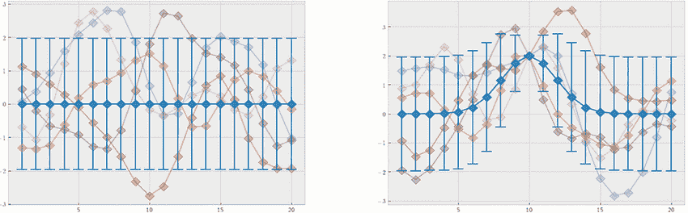

图 2.11 误差线和从先验（左）和后验（右）高斯分布中抽取的样本，以第 10 个变量的值为 2 条件。接近第 10 个变量的变量在后验中的不确定性减少，其均值更新为接近 2。

这在平行坐标图中如何体现？图 2.11 显示了我们左侧的先验高斯和右侧第 10 个变量的值为 2 的后验高斯。基本上，我们正在模拟以下事件，即我们发现第 10 座房子的价格为 2（其确切单位被省略）：

+   首先，我们再次看到这种现象，在后验分布中，误差线和样本围绕我们条件观察到的观察点打成结。

+   其次，由于协方差矩阵施加的相关结构，接近第 10 个变量的变量其均值被“拉高”，以便均值向量现在平滑地插值到点 (10, 2)。这意味着我们更新了我们的信念，因为周围的房屋现在其价格增加以反映我们学到的信息。

+   最后，在这一点 (10, 2) 条件之后，围绕这一点的不确定性（由误差线表示）减小。这是一个非常好的属性，因为直觉上，如果我们知道一个变量的值，我们应该对与我们所知变量相关的其他变量的值更加确定。也就是说，如果我们知道一座房子的价格，我们就会更加确定附近房屋的价格。这个属性是高斯过程提供的校准不确定性量化的基础，我们在本章的下一节中会看到。

## 2.3 从有限到无限的高斯分布

现在我们准备讨论什么是高斯过程。与前面三个变量 A、B 和 C，或者之前章节中的 20 个变量相同的方式，我们假设现在有无限多个变量，所有这些变量都属于多元正态分布。这个 *无限维* 高斯被称为 *高斯过程*。

想象一下在一个非常大而密集的区域内预测房价。整个区域的规模如此之大，以至于如果我们离一座房子移动了一个非常小的距离，我们就会到达另一座房子。鉴于高斯分布中变量（房屋）的高密度，我们可以将整个区域视为有无限多个房屋；也就是说，高斯分布有无限多个变量。

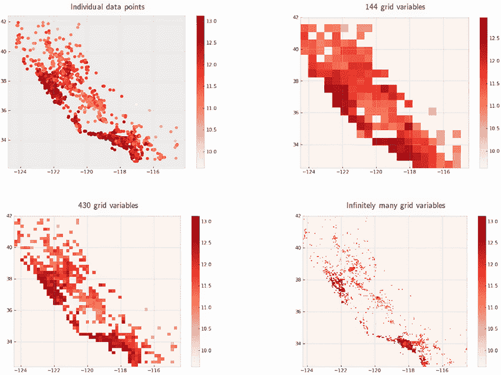

图 2.12 使用不同数量的变量对加州房价建模。我们拥有的变量越多，我们的模型就越平滑，我们越接近无限维模型。

这在图 2.12 中使用一个包含加利福尼亚州 5,000 个房价的数据集进行了说明。在左上角的面板中，我们展示了散点图中的个别数据点。在其余的面板中，我们使用各种数量的变量来对数据进行建模，其中每个变量对应于加利福尼亚地图内的一个区域。随着变量数量的增加，我们的模型变得更加精细。当这个数量是无限的时候——也就是说，当我们可以在这张地图上的任何区域进行预测，无论多么小——我们的模型存在于一个无限维空间中。

这正是高斯过程的含义：在无限维空间中的高斯分布。在任何区域进行预测的能力帮助我们摆脱了有限维多元正态分布，并获得了一个机器学习模型。严格来说，当变量有无穷多个时，高斯分布的概念并不适用，因此技术上的定义如下。

定义 高斯过程是一组随机变量，使得这些变量的任意有限子集的联合分布是一个多元正态分布。

这个定义意味着，如果我们有一个高斯过程模型来描述一个函数 *ƒ*，那么在*任何*一组点处的函数值都由一个多元正态分布来建模。例如，变量向量 [*ƒ*(1) *ƒ*(2) *ƒ*(3)] 遵循一个三维高斯分布；[*ƒ*(1) *ƒ*(0) *ƒ*(10) *ƒ*(5) *ƒ*(3)] 遵循另一个不同的、五维的高斯分布；以及 [*ƒ*(0.1) *ƒ*(0.2) ... *ƒ*(9.9) *ƒ*(10)] 遵循另一个高斯分布。

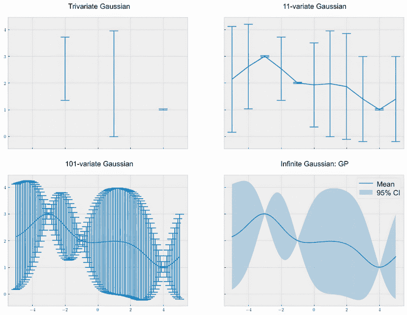

图 2.13 不同高斯分布的平行坐标图。高斯过程的任何有限子集都是多元正态分布。随着变量数量趋于无穷，我们得到一个高斯过程，并且可以在域中的任何地方进行预测。

这在图 2.13 中有所说明。前三个面板显示了平行坐标图中的三元高斯分布，分别为 [*ƒ*(–2) *ƒ*(1) *ƒ*(4)]，一个 11 元高斯分布，对应 [*ƒ*(–4.5) *ƒ*(–4) ... *ƒ*(4) *ƒ*(4.5)]，以及一个在更密集的网格上的 101 元高斯分布。最后，在最后一个面板中，我们有无限多个变量，这给了我们一个高斯过程。

由于我们现在处于无限维空间，讨论均值向量和协方差矩阵已经没有意义了。相反，我们在高斯过程中有的是一个均值 *函数* 和一个协方差 *函数*，但这两个对象的角色仍然与多元正态分布相同：

+   首先是均值函数，它接受一个输入 *x*，计算函数值 *ƒ*(*x*) 的期望。

+   第二，协方差函数接受两个输入，*x*[1] 和 *x*[2]，并计算两个变量 *ƒ*(*x*[1]) 和 *ƒ*(*x*[2]) 之间的协方差。如果 *x*[1] 等于 *x*[2]，那么这个协方差值就是 *ƒ*(*x*) 的正态分布的方差。如果 *x*[1] 不同于 *x*[2]，协方差表示两个变量之间的相关性。

由于均值和协方差是函数，我们不再受限于固定数量的变量——相反，我们有效地拥有无限数量的变量，并且可以在*任何地方*进行我们的预测，如图 2.13 所示。这就是为什么尽管高斯过程具有多元正态分布的所有特性，但高斯过程存在于无限维度的原因。

出于同样的原因，高斯过程可以被视为对函数的分布，就像本章的标题所暗示的那样。本章我们经历的从一维正态分布到高斯过程的过程，在表 2.1 中总结。

表 2.1 高斯分布对象及其模拟对象。使用高斯过程时，我们在无限维度下操作，模拟函数而不是数字或向量。

| 分布类型 | 模拟变量数量 | 描述 |
| --- | --- | --- |
| 一维正态分布 | 一个 | 数字的分布 |
| 多元正态分布 | 有限数量 | 有限长度向量的分布 |
| 高斯过程 | 无限数量 | 函数的分布 |

要看高斯过程的实际应用，让我们重新审视本章开头图 2.1 中的曲线拟合过程，我们将我们的域限制在-5 到 5 之间。如图 2.14 所示。

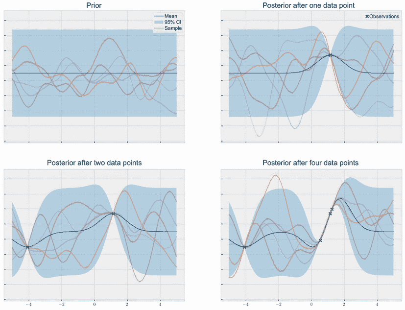

图 2.14 高斯过程对零、一个、两个和四个观测条件下的预测

在每个面板中，以下内容为真：

+   中间的实线是平均函数，类似于图 2.11 中连接菱形的实线。

+   另一方面，阴影区域是域上的 95% CI，对应于图 2.11 中的误差条。

+   各种曲线是从相应高斯过程中抽取的样本。

在观察任何数据之前，我们从左上角的*先验高斯过程*开始。就像先验多元正态分布一样，在没有训练数据的情况下，我们的先验高斯过程产生恒定的均值预测和不确定性。这是一个合理的行为。

当我们将高斯过程与各种数据点进行条件化时，有趣的部分就出现了。这在图 2.14 剩余的面板中进行了可视化。正如多元正态分布的离散情况一样，高斯过程在连续域中工作时，均值预测以及从后验分布中抽取的样本在训练集的数据点之间平滑插值，而关于函数值的不确定性，由置信区间(CI)量化，在这些观测点周围的区域平滑减少。这就是我们所说的*校准不确定性量化*，这是高斯过程的最大卖点之一。

高斯过程的平滑性

*平滑性* 特性是指要求相似点彼此相关的约束。换句话说，相似的点应该产生相似的函数值。这也是为什么当我们在顶部右侧面板的数据点处于 3 时，2.9 和 3.1 处的平均预测会更新为比它们的先验均值大的原因。这些点，2.9 和 3.1，与 3 相似，因为它们彼此接近。这种平滑性是通过 GP 的协方差函数来设置的，这是第三章的主题。虽然我们迄今为止看到的示例都是一维的，但当我们的搜索空间是更高维度时，这种平滑性仍然保持，正如我们后面看到的那样。

总的来说，我们已经看到，GP 在扩展到无限维度时是多元正态分布，由于高斯分布具有许多便利的数学特性，GP 不仅产生平均预测，而且通过其预测协方差以一种原则性的方式量化了我们对函数值的不确定性。平均预测正好通过训练数据点，并且不确定性在这些数据点处收敛。

建模非高斯数据

在现实生活中，并不是所有的数据都遵循高斯分布。例如，对于限制在数值范围内的值或不遵循钟形分布的变量，高斯分布是不合适的，可能会导致低质量的预测。

在这些情况下，我们可以应用各种数据处理技术来“转换”我们的数据点以遵循高斯分布。例如，Box-Muller 变换是一个从均匀分布的随机数生成一对正态分布的随机数的算法。有兴趣的读者可以在 Wolfram 的 MathWorld 上找到有关此算法的更多详细信息 ([`mathworld.wolfram.com/Box-MullerTransformation.xhtml`](https://mathworld.wolfram.com/Box-MullerTransformation.xhtml))。

## 2.4 在 Python 中实现 GPs

在本章的最后一节中，我们迈出了实现 Python 中高斯过程（GPs）的第一步。我们的目标是熟悉我们将用于此任务的库的语法和 API，并学习如何重新创建我们迄今为止看到的可视化效果。这个动手实践部分还将帮助我们更深入地理解 GPs。

首先，确保您已经下载了本书的附带代码并安装了必要的库。关于如何做到这一点的详细说明包含在前言中。我们使用包含在 Jupyter 笔记本 CH02/01 - Gaussian processes.ipynb 中的代码。  

### 2.4.1 设置训练数据

在我们开始实现 GP 模型的代码之前，让我们先花一些时间创建我们想要建模的目标函数和训练数据集。为此，我们需要导入 PyTorch 用于计算和操作张量，以及 Matplotlib 用于数据可视化：

```py
import torch
import matplotlib.pyplot as plt
```

在本示例中，我们的目标函数是一维的 Forrester 函数。Forrester 函数是具有一个全局最大值和一个局部最大值的多模式函数（[`www.sfu.ca/~ssurjano/forretal08.xhtml`](https://www.sfu.ca/~ssurjano/forretal08.xhtml)），使得拟合和找到函数的最大值成为一个非平凡的任务。该函数具有以下公式：

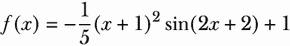

这是如下实现的：

```py
def forrester_1d(x):
    y = -((x + 1) ** 2) * torch.sin(2 * x + 2) / 5 + 1
    return y.squeeze(-1)
```

让我们快速在图表中绘制此函数。在这里，我们限制自己在-3 到 3 之间的域，并在此范围内的 100 个点的密集网格上计算此 Forrester 函数。我们还需要一些用于训练的样本点，我们通过`torch.rand()`进行随机采样并将其存储在`train_x`中；`train_y`包含这些训练点的标签，可以通过评估`forrester_1d(train_x)`获得。此图由以下代码生成，产生图 2.15：

```py
xs = torch.linspace(-3, 3, 101).unsqueeze(1)
ys = forrester_1d(xs)

torch.manual_seed(0)
train_x = torch.rand(size=(3, 1)) * 6 - 3
train_y = forrester_1d(train_x)

plt.figure(figsize=(8, 6))

plt.plot(xs, ys, label="objective", c="r")
plt.scatter(train_x, train_y, marker="x", c="k", label="observations")

plt.legend(fontsize=15);
```

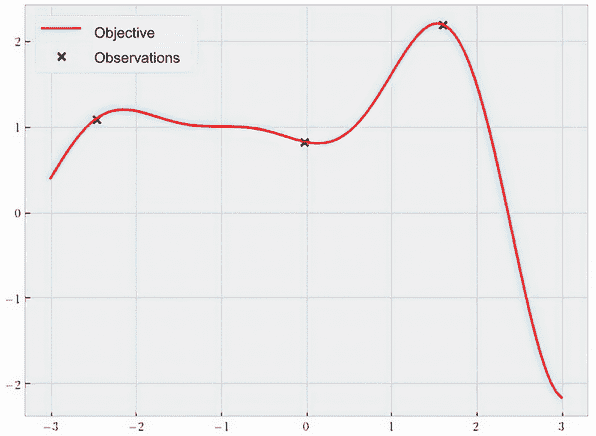

图 2.15 显示的是当前示例中使用的目标函数，如实线所示。标记表示训练数据集中的点。

我们看到的三个标记是我们随机选择包含在我们的训练数据集中的点。这些训练数据点的位置存储在`train_x`中，它们的标签（这些位置处的 Forrester 函数的值）存储在`train_y`中。这设置了我们的回归任务：在这三个数据点上实现和训练一个 GP，并在范围在-3 到 3 之间的点上可视化其预测。在这里，我们还创建了`xs`，这是在此范围内的密集网格。

### 2.4.2 实现 GP 类

在本小节中，我们将学习如何在 Python 中实现 GP 模型。我们使用 GPyTorch 库，这是一种现代 GP 建模的最先进工具。

重要提示：GPyTorch 的设计理念是遵循 DL 库 PyTorch，并使其所有模型类扩展基础模型类。如果您熟悉在 PyTorch 中实现神经网络，您可能会知道这个基类是`torch.nn.Module`。使用 GPyTorch，我们通常扩展`gpytorch.models.ExactGP`类。

要实现我们的模型类，我们使用以下结构：

```py
import gpytorch

class BaseGPModel(gpytorch.models.ExactGP):
    def __init__(self, train_x, train_y, likelihood):
        ...

    def forward(self, x):
        ...
```

在这里，我们实现了一个名为`BaseGPModel`的类，它有两个特定方法：`__init__()`和`forward()`。我们的 GP 模型的行为在很大程度上取决于我们如何编写这两个方法，无论我们想要实现什么样的 GP 模型，我们的模型类都需要具有这些方法。

让我们首先讨论`__init__()`方法。它的作用是接收由第一个和第二个参数`train_x`和`train_y`定义的训练数据集，以及存储在变量`likelihood`中的似然函数，并初始化 GP 模型，即一个`BaseGPModel`对象。我们实现该方法如下：

```py
def __init__(self, train_x, train_y, likelihood):
        super().__init__(train_x, train_y, likelihood)
        self.mean_module = gpytorch.means.ZeroMean()
        self.covar_module = gpytorch.kernels.RBFKernel()
```

在这里，我们简单地将三个输入参数传递给我们的超类的`__init__()`方法，而`gpytorch.models.ExactGP`的内置实现则为我们处理了繁重的工作。剩下的是均值和协方差函数的定义，正如我们所说的，这是高斯过程的两个主要组成部分。

在 GPyTorch 中，对于均值和协方差函数都有广泛的选择，我们将在第三章中进行探讨。现在，我们使用 GP 的最常见选项：

+   对于均值函数，我们使用`gpytorch.means.ZeroMean()`，在先验模式下输出零均值预测

+   对于协方差函数，我们使用`gpytorch.kernels.RBFKernel()`，它实现了*径向基函数*（RBF）核——这是高斯过程中最常用的协方差函数之一，它实现了数据点彼此接近时彼此相关的思想。

我们分别将这些对象存储在`mean_module`和`covar_module`类属性中。这就是我们对`__init__()`方法需要做的全部。现在，让我们将注意力转向`forward()`方法。

`forward()`方法非常重要，因为它定义了模型如何处理其输入。如果您在 PyTorch 中使用过神经网络，那么您知道网络类的`forward()`方法会依次将其输入通过网络的层，并且最终层的输出就是神经网络产生的内容。在 PyTorch 中，每个层都被实现为一个*模块*，这是一个表示 PyTorch 中任何处理数据的对象的基本构建块的术语。

在 GPyTorch 中，高斯过程的`forward()`方法工作方式类似：高斯过程的均值和协方差函数被实现为模块，并且该方法的输入被传递给这些模块。我们不是将结果依次通过不同的模块传递，而是同时将输入传递给均值和协方差函数。这些模块的输出然后被组合以创建一个多变量正态分布。PyTorch 和 GPyTorch 之间的这种差异在图 2.16 中说明。

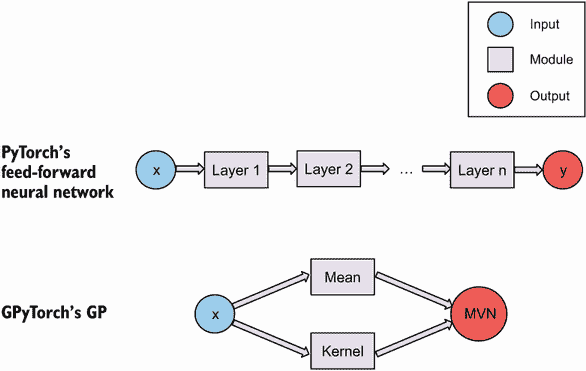

图 2.16 PyTorch 和 GPyTorch 如何在其各自的`forward()`方法中处理数据的过程。输入由不同的模块处理以产生最终输出，对于前馈神经网络来说，输出是一个数字，对于 GP 来说是一个多变量正态分布。

`forward()`方法在以下代码中实现：

```py
def forward(self, x):
        mean_x = self.mean_module(x)
        covar_x = self.covar_module(x)
        return gpytorch.distributions.MultivariateNormal(mean_x, covar_x)
```

这里的逻辑非常简单：因为我们有一个均值函数和一个协方差函数，所以我们只需在输入`x`上调用它们来计算均值和协方差预测。最后，我们需要返回的是一个 MVN 分布，由`gpytorch.distributions.MultivariateNormal`类实现，带有相应的均值和协方差。换句话说，我们只是根据模型类的`mean_ module`和`covar_module`属性计算出的均值向量和协方差矩阵创建了一个 MVN 分布。

就是这样！用 GPyTorch 实现 GP 模型是多么容易，令人惊讶。对我们来说最大的收获是，我们需要在 `__init__()` 方法中实现均值和协方差函数。在 `forward()` 方法中，当我们需要进行预测时，我们只需在输入上调用这两个函数即可。

### 2.4.3 用 GP 进行预测

有了 `BaseGPModel` 类，我们可以开始用 GP 进行预测了！回想一下，在 `__init__()` 方法中，我们需要传递一个似然函数 `likelihood`，以及我们的训练数据。在许多回归任务中，`gpytorch.likelihoods.GaussianLikelihood` 对象就足够了。我们可以这样创建这个对象：

```py
likelihood = gpytorch.likelihoods.GaussianLikelihood()
```

现在，我们可以初始化我们的 `BaseGPModel` 对象了。但在我们将其初始化为我们的三项训练数据之前，我们首先想要用先验 GP 进行预测。

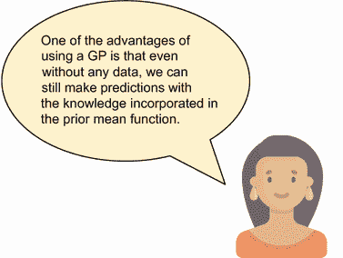

要初始化一个没有任何训练数据的 GP 对象，我们将 `None` 传递给训练特征 (`train_x`) 和标签 (`train_y`)。因此，我们的先验 GP 被创建如下：

```py
model = BaseGPModel(None, None, likelihood)
```

最后，在我们进行任何预测之前，需要进行一些簿记工作。首先，我们设置 GP 的超参数：

```py
lengthscale = 1
noise = 1e-4

model.covar_module.lengthscale = lengthscale
model.likelihood.noise = noise

model.eval()
likelihood.eval()
```

我们将在第三章讨论每个超参数控制的内容。目前，我们只使用我个人喜欢的默认值：长度尺度为 1，噪声方差为 0.0001。最后一个细节是通过调用相应对象的 `eval()` 方法在 GP 模型和其似然性中启用预测模式。

处理完这些簿记任务后，我们现在终于可以在我们的测试数据上调用这个 GP 模型进行预测了。我们可以这样做：

```py
with torch.no_grad():
    predictive_distribution = likelihood(model(xs))
```

请记住，在模型类的 `forward()` 方法中，我们返回 MVN 分布，因此当我们通过 `model(xs)` 使用我们的模型传递一些测试数据时，这就是输出。（在 PyTorch 的语法中，调用 `model(xs)` 是对测试数据 `xs` 调用 `forward()` 方法的一种简写。）我们还将相同的输出通过似然函数 `likelihood`，将噪声方差合并到我们的预测中。简而言之，我们在 `predictive_distribution` 中存储的是代表测试点 `xs` 的预测的 MVN 分布。此外，我们在 `torch.no_grad()` 上下文中计算此对象，当我们不希望 PyTorch 跟踪这些计算的梯度时，这是一个好的做法。

注意 我们只想在优化模型参数时计算操作的梯度。但是当我们想要进行预测时，我们应该完全固定我们的模型，因此禁用梯度检查是适当的。

### 2.4.4 可视化 GP 的预测

有了这个预测的高斯分布，我们现在可以重新创建我们迄今为止见过的 GP 图。这些图中的每一个都包括一个均值函数 *μ*，我们可以从 MVN 中获取

```py
predictive_mean = predictive_distribution.mean
```

另外，我们想显示 95% 置信区间。从数学上讲，这可以通过提取预测协方差矩阵Σ的对角元素来完成（请记住，这些元素表示单个方差σ²），取这些值的平方根以计算标准差σ，并计算 *μ* ± 1.96σ 的置信区间范围。

幸运的是，当我们使用 GP 时，计算 95% 置信区间是一个常见的操作，所以 GPyTorch 提供了一个方便的辅助方法，称为 `confidence_ region()`，我们可以直接从 MVN 分布对象中调用该方法：

```py
predictive_lower, predictive_upper =
    ➥    predictive_distribution.confidence_region()
```

此方法返回两个 Torch 张量的元组，分别存储置信区间的下限和上限端点。

最后，我们可能希望从当前 GP 模型中为我们的图形绘制样本。我们可以通过直接从高斯对象 `predictive_distribution` 调用方法 `sample()` 来完成这个操作。如果我们不传入任何输入参数，该方法将返回一个样本。在这里，我们希望从我们的 GP 中抽取五次样本，操作如下：

```py
torch.manual_seed(0)
    samples = predictive_distribution.sample(torch.Size([5]))
```

我们传递一个 `torch.Size()` 对象以表示我们希望返回五个样本。在抽样之前设置随机种子是一种确保代码可重现性的良好实践。有了这些，我们就可以开始绘制一些图形了！

第一件事是简单地绘制均值函数：

```py
plt.plot(xs, predictive_mean.detach(), label="mean")
```

至于 95% 置信区间，我们通常使用像我们到目前为止看到的那样的阴影区域，这可以使用 Matplotlib 的 `fill_between()` 函数完成：

```py
plt.fill_between(
    xs.flatten(),
    predictive_upper,
    predictive_lower,
    alpha=0.3,
    label="95% CI"
)
```

最后，我们绘制单独的样本：

```py
for i in range(samples.shape[0]):
    plt.plot(xs, samples[i, :], alpha=0.5)
```

此代码将生成图 2.17 中的图形。

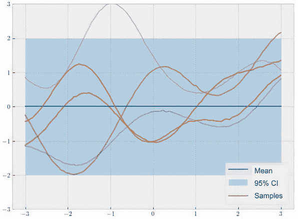

图 2.17 先验 GP 的预测，具有零均值和 RBF 核。虽然均值和置信区间是恒定的，但单个样本表现出复杂的非线性行为。

我们看到，在整个域上，我们的先验 GP 产生的均值函数在零处保持恒定，我们的 95% 置信区间也是恒定的。这是可以预期的，因为我们使用了一个 `gpytorch .means.ZeroMean()` 对象来实现均值函数，并且在没有任何训练数据的情况下，我们的先验预测默认为此 0 值。

话虽如此，均值和置信区间只是期望的测量值：它们表示我们预测的平均行为在许多不同的实现中的平均行为。然而，当我们绘制单个样本时，我们会看到每个样本都有一个非常复杂的形状，根本不是恒定的。所有这些都是说，虽然我们在任何点的预测期望值为零，但它可能取值范围很广。这表明 GP 可以以灵活的方式对复杂的非线性行为进行建模。

到目前为止，我们已经学会了在没有任何训练数据的情况下生成和可视化预测的先前 GP 的过程。现在，让我们实际上在我们随机生成的训练集上训练一个 GP 模型，并观察预测结果的变化。迄今为止，我们编码的好处就是这一切可以完全重复进行，只不过现在我们要用我们的训练数据来初始化 GP（请记住，之前我们在第一个和第二个参数中使用了 `None`）：

```py
model = BaseGPModel(train_x, train_y, likelihood)
```

重新运行代码将给我们 Figure 2.18。

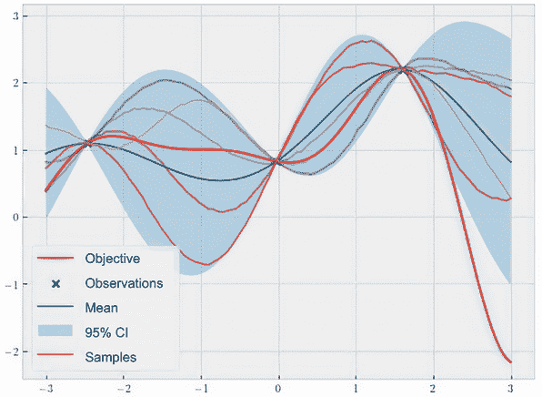

图 2.18 由后验 GP 生成的预测。均值函数和随机绘制样本能很好地插值训练数据点，同时不确定性在这些数据点周围消失。

这正是我们想要看到的预测类型：均值线和样本完美地插值了我们观测到的数据点，并且我们的不确定性（由 CI 表示）在这些数据点周围也减小了。

我们已经可以看到这种不确定性量化在建模目标函数方面的作用。在仅观测到三个数据点之后，我们的 GP 对真实目标函数有一个相当好的近似。实际上，几乎所有的目标函数都在 95% CI 内，表明我们的 GP 成功地考虑了目标函数的行为方式，即使在我们尚未从函数中获得任何数据的区域也是如此。这种校准的量化在我们实际需要根据 GP 模型做出决策的情况下特别有益——也就是说，在我们决定在哪些点上观察函数值以找到最优值时——但是让我们将其保留到本书的下一部分。

### 2.4.5 超越一维目标函数

到目前为止，我们只看到了在一维目标函数上训练的 GP 的示例。然而，GP 并不局限于一个维度。实际上，只要我们的均值和协方差函数能够处理高维输入，GP 就可以在高维上高效地运算。在本小节中，我们将学习如何训练一个基于二维数据集的 GP。

我们按照前一节的步骤进行。首先，我们需要一个训练数据集。在这里，我将自行创建一个带有点(0, 0)，(1, 2)，和(–1, 1)以及相应标签为 0，–1 和 0.5 的虚拟集合。换句话说，我们从中学习的目标函数在(0, 0)处的值为 0，在(1, 2)处的值为–1，在(–1, 1)处的值为 0.5。我们希望在[–3, 3]-by-[–3, 3]的正方形内进行预测。

在 Python 中的设置如下：

```py
# training data
train_x = torch.tensor(
    [
        [0., 0.],
        [1., 2.],
        [-1., 1.]
    ]
)

train_y = torch.tensor([0., -1., 0.5])

# test data
grid_x = torch.linspace(-3, 3, 101)               ❶

grid_x1, grid_x2 = torch.meshgrid(grid_x, grid_x,
➥indexing="ij")                                  ❷
xs = torch.vstack([grid_x1.flatten(), grid_x2.flatten()]).transpose(-1, -2)
```

❶ 一维点阵

❷ 二维点阵

变量 `xs` 是一个 10,201×2 的矩阵，其中包含了我们希望进行预测的正方形上的点阵。

重要提示：这里有 10,201 个点，因为我们在两个维度中各取了一个 101 点的网格。现在，我们只需重新运行之前用于训练 GP 并对这个二维数据集进行预测的 GP 代码。请注意，不需要修改我们的`BaseGPModel`类或任何预测代码，这非常了不起！

不过，我们确实需要更改的一件事是如何可视化我们的预测。由于我们正在操作二维空间，因此在单个图中绘制预测均值和 CI 变得更加困难。在这里，一个典型的解决方案是绘制预测均值的热力图和预测标准差的另一个热力图。虽然标准差不完全等于 95% CI，但这两个对象实质上量化了同样的内容：我们对函数值的不确定性。

因此，我们现在不再调用`predictive_distribution.confidence_region()`，而是这样提取预测标准差：

```py
predictive_stddev = predictive_distribution.stddev
```

现在，要绘制热力图，我们使用 Matplotlib 中的`imshow()`函数。我们需要注意`predictive_mean`和`predictive_stddev`的形状。这里是一个长度为 10,000 的张量，因此在传递给`imshow()`函数之前，需要将其重塑为一个方阵。可以按如下方式完成：

```py
fig, ax = plt.subplots(1, 2)

ax[0].imshow(
    predictive_mean.detach().reshape(101, 101).transpose(-1, -2),
    origin="lower",
    extent=[-3, 3, -3, 3]
)                           ❶

ax[1].imshow(
    predictive_stddev.detach().reshape(101, 101).transpose(-1, -2),
    origin="lower",
    extent=[-3, 3, -3, 3]
)                           ❷
```

❶ 预测均值的第一个热力图

❷ 预测标准差的第二个热力图

此代码生成了图 2.19 中的两个热力图。

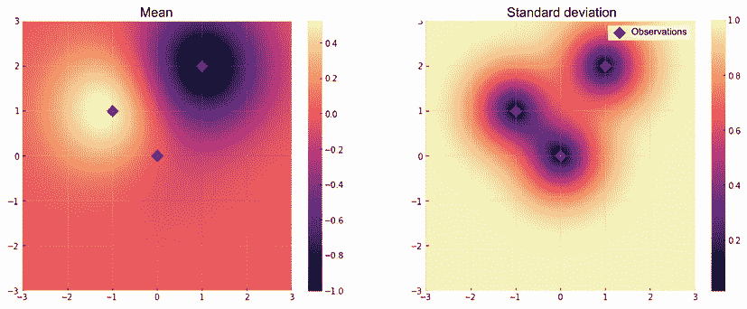

图 2.19 由二维 GP 进行的预测。均值函数仍然与训练数据一致，并且在这些数据点周围的区域，不确定性再次消失。

我们看到，在一维情况下我们所拥有的东西在这个例子中也有所延续：

+   左侧面板显示我们的均值预测与训练数据一致：左侧的亮斑点对应于 (-1, 1)，其值为 0.5，而右侧的暗斑点对应于 (1, 2)，其值为 -1（我们在 (0, 0) 处的观测值为 0，这也是先验均值，因此在左侧面板中并不像其他两个那样明显）。

+   我们的不确定性（由预测标准差测量）在我们的训练数据的三个点周围接近零，如右面板所示。远离这些数据点，标准差平滑地增加到归一化的最大不确定性 1。

这意味着在高维情况下，GP 的所有良好属性，如平滑插值和不确定性量化，都得以保留。

这标志着第二章的结束。我们已经对 GP 的概念有了理解，并学会了如何使用 GPyTorch 在 Python 中实现基本的 GP 模型。如前所述，我们将在第三章深入探讨 GP 的均值和协方差函数，包括它们的超参数，以及每个组件如何控制我们的 GP 模型的行为。

## 2.5 练习

在这个练习中，我们在第一章中看到的一个真实数据集上训练了一个高斯过程（GP），该数据集在表 2.2 中再次显示。每个数据点（行）对应于通过在不同比例下混合铅（Pb）、锡（Sn）、锗（Ge）和锰（Mn）—这些称为*父化合物*—创建的合金（一种金属）。特征包含在前四列中，这些是父化合物的百分比。预测目标，混合温度，在最后一列中，表示合金形成的最低温度。任务是根据合金的组成百分比预测混合温度。

表 2.2 来自材料发现任务的数据。特征是材料结构以父化合物百分比表示，预测目标是混合温度。

| Pb 的% | Sn 的% | Ge 的% | Mn 的% | 混合温度（°F） |
| --- | --- | --- | --- | --- |
| 0.50 | 0.50 | 0.00 | 0.00 | 192.08 |
| 0.33 | 0.33 | 0.33 | 0.00 | 258.30 |
| 0.00 | 0.50 | 0.50 | 0.00 | 187.24 |
| 0.00 | 0.33 | 0.33 | 0.33 | 188.54 |

有多个步骤：

1.  创建表 2.2 中包含的四维数据集。

1.  将第五列标准化，方法是减去所有值的均值并将结果除以它们的标准差。

1.  将前四列视为特征，第五列视为标签。在这些数据上训练一个高斯过程（GP）。您可以重复使用我们在该章中实现的 GP 模型类。

1.  创建一个测试数据集，其中含有零百分比的锗和锰的组合。换句话说，测试集是一个在单位正方形上的网格，其轴是铅和锡的百分比。

    测试集应该如下 PyTorch 张量所示：

    ```py
    tensor([[0.0000, 0.0000, 0.0000, 0.0000],
            [0.0000, 0.0100, 0.0000, 0.0000],
            [0.0000, 0.0200, 0.0000, 0.0000],
            ...,
            [1.0000, 0.9800, 0.0000, 0.0000],
            [1.0000, 0.9900, 0.0000, 0.0000],
            [1.0000, 1.0000, 0.0000, 0.0000]])
    ```

    注意第三列和第四列都是零。

1.  对此测试集预测混合温度。也就是说，计算测试集中每个点的标准化混合温度的后验均值和标准差。

1.  可视化预测。这涉及以与图 2.19 相同的方式将均值和标准差显示为热图。解决方案包含在 CH02/02 - Exercise.ipynb 中。

## 总结

+   多元高斯分布（MVN）模型化了许多随机变量的联合分布。均值向量表示变量的期望值，而协方差矩阵模拟了这些变量的方差和它们之间的协方差。

+   通过应用贝叶斯定理，我们可以计算 MVN 的后验分布。通过这种贝叶斯更新，与观察变量相似的变量被更新以反映这种相似性。总的来说，相似的变量产生相似的预测。

+   高斯过程（GP）将多元正态分布（MVN）扩展到无限维，使其成为函数的分布。然而，GP 的行为仍然类似于 MVN 分布。

+   即使没有任何训练数据，GP 仍然可以根据先验 GP 产生预测。

+   训练完成后，高斯过程（GP）的平均预测平滑地插值了训练数据点。

+   使用高斯过程的最大优势之一是模型提供的不确定性的校准量化：对于观察到的数据点周围的预测更加自信；另一方面，远离训练数据的预测则更不确定。

+   使用多变量正态分布或高斯过程进行条件化在视觉上类似于在观察点处打结。这迫使模型确切地经过观察，并将不确定性减少到零。

+   使用 GPyTorch 实现 GP 时，我们可以以模块化的方式编写一个扩展基类的模型类。具体来说，我们实现了两个特定的方法：`__init__()`，声明了 GP 的均值和协方差函数；`forward()`，为给定输入构造了一个多变量正态（MVN）分布。
