# 第四章：使用均值和协方差函数自定义高斯过程

本章涵盖内容

+   使用均值函数控制 GP 的预期行为

+   使用协方差函数控制 GP 的平滑度

+   使用梯度下降学习 GP 的最优超参数

在第二章中，我们了解到均值和协方差函数是高斯过程 (GP) 的两个核心组成部分。即使在实现我们的 GP 时使用了零均值和 RBF 协方差函数，你在这两个组成部分上可以选择很多选项。

通过选择均值或协方差函数的特定选择，我们实际上在为我们的 GP 模型指定先验知识。将先验知识纳入预测是我们在任何贝叶斯模型中都需要做的事情，包括 GP。虽然我说我们需要这样做，但将先验知识纳入模型中总是一件好事，特别是在数据获取昂贵的情况下，比如贝叶斯优化。

例如，在天气预报中，如果我们想要估计一月份在密苏里的典型天气的温度，我们不必进行任何复杂的计算就能猜到温度会相当低。在温度较高的加州的夏天，我们也可以猜到天气会相对炎热。这些粗略的估计可以用作贝叶斯模型中的初始猜测，实质上就是模型的先验知识。如果我们没有这些初始猜测，我们将需要进行更复杂的建模来进行预测。

正如我们在本章中学到的，将先验知识纳入 GP 中可以大大改变模型的行为，从而带来更好的预测性能（最终带来更有效的决策）。只有当我们对函数的行为没有任何好的猜测时，才应该不使用先验知识；否则，这等同于浪费信息。

在本章中，我们将讨论均值和协方差函数的不同选项，以及它们如何影响生成的 GP 模型。与第二章不同，我们在这里采用了一种实践的方法，并围绕 Python 中的代码实现展开讨论。到本章结束时，我们将开发一种选择适当的均值和协方差函数以及优化它们的超参数的流程。

## 3.1 先验概率对于贝叶斯模型的重要性

问题：为什么你似乎无法改变一些人的想法？答案：因为他们的先验概率。为了说明先验概率在贝叶斯模型中有多么重要，请考虑以下情景。

假设你和你的朋友鲍勃和爱丽丝在嘉年华上闲逛，你正在和一个声称自己是灵媒的人交谈。他们允许你通过以下程序来测试这一说法：你和你的朋友们每个人都想一个 0 到 9 之间的数字，而“灵媒”将告诉你们每个人在想什么数字。你可以重复这个过程任意次数。

现在，你们三个人都对这个所谓的灵媒感到好奇，你们决定进行这个测试 100 次。令人惊讶的是，在这 100 次测试之后，嘉年华上的这位自称的灵媒准确地猜出了你们每个人心里想的数字。然而，测试结束后，你们每个人的反应却各不相同，如图 3.1 所示。


图 3.1 显示了你们朋友中看到一个人连续猜对一个秘密数字 100 次后的反应。由于他们的先验信念不同，每个人得出了不同的结论。

关于贝叶斯定理的进一步阅读

如果你需要恢复记忆，请随时返回图 2.2，我们在那里研究了贝叶斯定理。在本书中，我们只是大致概述了这一过程，但我建议你阅读威尔·库尔特（Will Kurt）的《贝叶斯统计学的有趣方法》（No Starch Press，2019）的第 1 和第二章，如果你想深入研究这个过程。

你们三个人怎么可能观察同样的事件（嘉年华上的人连续猜对 100 次）却得出不同的结论呢？要回答这个问题，考虑使用贝叶斯定理更新信念的过程：

1.  每个人都从特定的先验概率开始，认为这个人是个灵媒。

1.  然后，你们每个人都观察到他们猜对你的数字一次的事件。

1.  然后，你们每个人都计算可能性项。首先，鉴于他们确实是灵媒，他们的猜测正确的可能性是完全的 1，因为真正的灵媒总是能通过这个测试。其次，鉴于他们 *不是* 灵媒，他们的猜测正确的可能性是 10 个中的 1，因为每次，你们都是在 0 到 9 之间随机选择一个数字，所以这 10 个选项中的任何一个猜测都有相等的可能性：10 分之 1。

1.  最后，通过将先验与这些可能性项相结合来计算这个人不是灵媒的后验概率，你们更新了自己的信念。具体来说，这个后验概率将与先验和第一个可能性项 *相乘* 成比例。

1.  你们然后重复这个过程 100 次，每次使用前一次迭代的后验概率作为当前迭代的先验概率。

这里高层次的重要性在于，经过每次测试，你和你的朋友对这个人是灵媒的后验信念 *从未减少*，因为这个陈述与你观察到的数据不符。具体来说，图 3.2 显示了你们小组中每个人的渐进后验概率，作为“嘉年华中的灵媒”通过了多少次测试的函数。

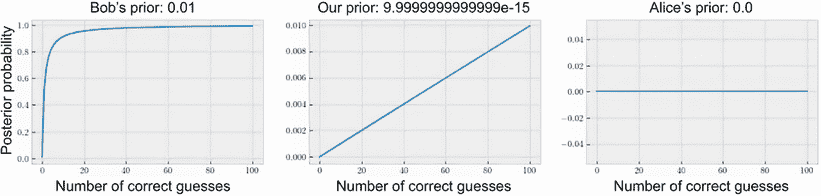

图 3.2 进展后验概率，即在成功猜测次数的函数中，卡尼瓦尔上的女士是一个灵媒的概率。这个后验概率从不下降，但根据初始先验的不同而行为也不同。

如图所示，三条曲线中的每一条要么增加，要么保持不变——没有一条曲线实际下降，因为一个减少的成为灵媒的概率不符合 100 次连续成功猜测。但为什么这三条曲线看起来如此不同呢？你可能已经猜到了，曲线的起始位置——即每个人认为女士是灵媒的先验概率——是原因。

在鲍勃的案例中，在左侧面板上，他最初的先验相对较高，认为那个人是灵媒的概率为 1%。鲍勃是一个信徒。随着他观察到越来越多与这一信念一致的数据，他的后验概率也越来越高。

在你自己的情况下，在中间，作为怀疑论者，你的先验要低得多：10 的 14 次方中的 1。然而，由于你的观察确实表明女士是灵媒，随着更多数据的输入，你的后验概率也增加到最后的 1%。

另一方面，艾丽斯的情况则不同。从一开始，她不相信灵媒是真实存在的，因此她给了她的先验概率精确的零。现在，请记住，根据贝叶斯定理，后验概率与先验概率乘以似然性成比例。由于艾丽斯的先验概率恰好为零，贝叶斯更新中的这种乘法将总是产生另一个零。

由于艾丽斯最初的概率为零，在一次成功测试后，这个概率保持不变。一次正确的猜测后，艾丽斯的后验概率为零。两次猜测后，仍为零。所有 100 次正确的猜测后，这个数字仍然是零。所有的一切都符合贝叶斯更新规则，但由于艾丽斯的先验不允许灵媒存在的可能性，任何数据都无法说服她相反。

这突显了贝叶斯学习的一个重要方面——我们的先验确定了学习的方式（见图 3.3）：

+   鲍勃的先验相当高，因此在 100 次测试结束时，他完全相信那个人是灵媒。

+   另一方面，你更加怀疑，你的初始先验比鲍勃低得多。这意味着你需要更多的证据才能得出高后验。 

+   艾丽斯对可能性的完全忽视，用她的零先验表示，使她的后验概率保持在零。

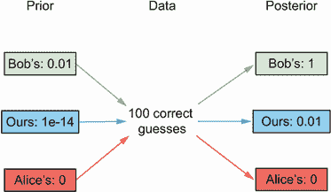

图 3.3 各人的先验信念如何被相同的数据更新。与鲍勃相比，你的先验更低，增长速度更慢。艾丽斯的先验为 0，始终保持为 0。

虽然我们的例子中的主张是关于某个人是否是通灵者的事件，但是同样的贝叶斯更新过程适用于所有情形，其中我们对某个事件有概率信念，并经常根据数据进行更新。事实上，这正是我们有时似乎无法改变某个人的想法的原因：因为他们的先验概率为零，没有任何东西可以将后验概率更新为非零。

从哲学角度来看，这个讨论非常有趣，因为它表明，为了能够说服某个人做某事，他们需要至少想到一种可能性，即指定事件的非零先验概率。更具体地说，这个例子说明了对贝叶斯模型拥有良好的先前知识的重要性。正如我们所说，我们通过均值和协方差函数来指定高斯过程的先验知识。每个选择都会在高斯过程的预测中产生不同的行为。

## 3.2 将先前已知内容并入高斯过程

在本节中，我们将确定在高斯过程中指定先前知识的重要性。这个讨论为我们在本章剩余部分的讨论下了动力。

先验高斯过程可能一开始具有恒定的平均值和 CI。如图 3.4 所示，该高斯过程然后被更新为平稳地内插观测到的数据点。也就是说，均值预测恰好穿过数据点，并且 95%的 CI 在那些区域消失。


图 3.4 先验高斯过程和后验高斯过程的比较。先验高斯过程包含有关目标函数的先前信息，而后验高斯过程将该信息与实际观测值相结合。

图 3.4 中的先验高斯过程不对我们正在建模的目标函数做出任何假设。这就是为什么这个高斯过程的平均预测值在任何地方都是零。但是，在许多情况下，即使我们不知道目标函数的确切形式，我们也了解目标的某些方面。

以以下为例：

+   在超参数调整应用程序中模拟模型准确性时，我们知道目标函数的范围在 0 到 1 之间。

+   在我们从第 2.1 节中的住房价格示例中，函数值（价格）严格为正，当房屋的理想属性（例如生活区）增加时，应该增加。

+   在住房示例中，函数值对某些特征更加敏感。例如，与生活区面积的函数相比，房屋价格随着层数的增加更快——多一层楼会增加房屋价格，而多一个平方英尺的生活区则不会。

这种信息正是我们希望用 GP 表示的先验知识，使用 GP 的最大优势之一是我们有许多方法来融入先验知识。这样做有助于缩小 GP 代理与其建模的实际目标函数之间的差距，这也将更有效地引导后续的优化。

用 GP 结合先验知识

我们通过选择适当的平均和协方差函数以及设置它们的参数值来融入先验知识。特别是

+   平均函数定义了目标函数的预期行为。

+   协方差函数定义了目标的结构，或者更具体地说，定义了任意一对数据点之间的关系，以及目标函数在其定义域内变化的速度和平滑程度。

前面的每个选择都会导致生成的 GP 的行为发生 drastical 不同。例如，线性平均函数将导致 GP 预测中的线性行为，而二次平均函数将导致二次行为。通过在协方差函数中使用不同的参数，我们还可以控制 GP 的变异性。

## 3.3 使用平均函数定义函数行为

首先，我们介绍了 GP 的平均函数，它定义了 GP 的预期行为，或者说我们相信函数在所有可能的情况下平均情况下的样子。正如我们将要看到的，这有助于我们指定与函数的一般行为和形状相关的任何先验知识。本节中使用的代码包含在 CH03/01 - Mean functions.ipynb 中。为了使我们的讨论具体化，我们使用了一个房价数据集，其中表 3.1 中有五个数据点。

表 3.1 示例训练数据集。预测目标（价格）随特征（居住面积）的增加而增加。

| 居住面积（以 1000 平方英尺为单位） | 价格（以 10 万美元为单位） |
| --- | --- |
| 0.5 | 0.0625 |
| 1 | 0.25 |
| 1.5 | 0.375 |
| 3 | 2.25 |
| 4 | 4 |

在这个数据集中，我们建模的函数值是房价，它们是严格正的，并且随着居住面积的增加而增加。这些性质是直观的，即使不知道未观察到的房屋的价格，我们也确信这些未见价格也具有这些性质。

我们的目标是将这些性质纳入我们的平均函数中，因为它们描述了我们对函数行为的预期。在我们开始建模之前，我们首先编写一个辅助函数，该函数接受一个 GP 模型（以及其似然函数），并在范围从 0 到 10（即，一个 10,000 平方英尺的居住面积）内可视化其预测。实现如下：

```py
def visualize_gp_belief(model, likelihood):
    with torch.no_grad():                                ❶
        predictive_distribution = likelihood(model(xs))  ❶
        predictive_mean = predictive_distribution.mean   ❶
        predictive_upper, predictive_lower =             ❶
        ➥ predictive_distribution .confidence_region()  ❶

    plt.figure(figsize=(8, 6))

    plt.plot(xs, ys, label="objective", c="r")
    plt.scatter(train_x, train_y, marker="x", c="k", label="observations")

    plt.plot(xs, predictive_mean, label="mean")          ❷
    plt.fill_between(
        xs.flatten(), predictive_upper, predictive_lower, alpha=0.3,
        label="95% CI"
    )                                                    ❸

    plt.legend(fontsize=15);
```

❶ 计算预测

❷ 绘制平均线

❸ 绘制 95% CI 区域

我们在第 2.4.3 节中看到了这段代码是如何工作的，现在我们将其放入一个方便的函数中。有了这个，我们就准备好实现我们的 GP 模型，并看看我们的选择如何影响所产生的预测。

### 3.3.1 使用零均值函数作为基本策略

均值的最简单形式是一个在零处的常数函数。在没有数据的情况下，此函数将产生零作为其默认预测。当没有关于我们可能将其作为先验知识合并到 GP 中的目标函数的额外信息时，将使用零均值函数。

使用零均值函数实现的 GP 如下所示：

```py
class ConstantMeanGPModel(gpytorch.models.ExactGP):
    def __init__(self, train_x, train_y, likelihood):
       super().__init__(train_x, train_y, likelihood)
       self.mean_module = gpytorch.means.ConstantMean()   ❶
       self.covar_module = gpytorch.kernels.RBFKernel()

    def forward(self, x):
       mean_x = self.mean_module(x)
       covar_x = self.covar_module(x)
       return gpytorch.distributions.MultivariateNormal(mean_x, covar_x)
```

❶ 默认值为零的常数均值函数

请记住，根据第 2.4.2 节的内容，要构建一个使用 GPyTorch 的 GP 模型，我们实现 `__init__()` 和 `forward()` 方法。在第一个方法中，我们初始化我们的均值和协方差函数；在第二个方法中，我们将输入 `x` 通过这些函数，并返回相应的多元高斯分布。

注意：在我们从第 2.4.2 节中的实现中，我们使用 `gpytorch.means.ZeroMean` 类，而在这里，我们使用 `gpytorch.means.ConstantMean` 类来初始化我们的均值函数。然而，这个常数均值函数的默认值是零，因此实际上，我们仍然在实现相同的 GP 模型。尽管这两种选择目前导致相同的模型，但在本章中，我们将展示如何使用 `gpytorch.means.ConstantMean` 来调整常数均值值，以获得更好的模型。

现在让我们初始化该类的一个对象，在我们的训练数据上对其进行训练，并可视化其预测。我们用以下代码来实现这个：

```py
lengthscale = 1
noise = 1e-4

likelihood = gpytorch.likelihoods.GaussianLikelihood()     ❶
model = ConstantMeanGPModel(train_x, train_y, likelihood)  ❶

model.covar_module.lengthscale = lengthscale               ❷
model.likelihood.noise = noise                             ❷

model.eval()
likelihood.eval()

visualize_gp_belief(model, likelihood)
```

❶ 声明 GP

❷ 修复超参数

在这里，我们初始化 GP 模型并设置其超参数——长度尺度和噪声方差分别为 1 和 0.0001。我们将在本章后面看到如何适当设置这些超参数的值；现在，让我们只使用这些值。最后，我们在我们的 GP 模型上调用我们刚刚编写的辅助函数 `visualize_gp_belief()`，它将生成图 3.5。

所有我们在第 2.4.4 节中指出的 GP 的良好性质仍然存在：

+   后验均值函数平滑地插值出我们的训练数据点。

+   95% CI 在这些数据点周围消失，表示了一个良好校准的不确定性量化。

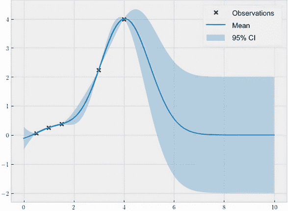

图 3.5 使用零均值函数的 GP 的预测。后验均值函数插值了观察到的数据点，并在远离这些观测点的区域回归到零。

从这个图表中我们还注意到，一旦我们足够远离我们的训练数据点（图表的右侧），我们的后验均值函数就会*恢复*到先验均值，即零。这实际上是高斯过程的一个重要特征：在没有数据的情况下（在没有观测到的区域），先验均值函数是推断过程的主要驱动力。这在直觉上是有道理的，因为没有实际观察，预测模型能做的最好的事情就是简单地依赖于其均值函数中编码的先验知识。

注意：在这一点上，我们看到为什么将先验知识明确定义地编码到先验高斯过程中是如此重要：在没有数据的情况下，预测的唯一驱动因素就是先验高斯过程。

然后自然地提出了一个问题：是否可以使用非零均值函数来诱导我们的高斯过程在这些未探索的区域中产生不同的行为，如果可以，我们有哪些选择？本节的剩余部分旨在回答这个问题。我们首先使用一个不为零的常数均值函数。

### 使用梯度下降法使用常数函数 3.3.2

如果一个常数均值函数不为零，那么当我们期望我们正在建模的目标函数具有我们*先验*知道的一些值范围时，这是合适的。由于我们正在建模房价，使用一个常数均值函数，其常数大于零，是有意义的，因为我们确实期望价格是正的。

当然，在许多情况下，我们不可能知道目标函数的平均值是多少。那么，我们应该如何为我们的均值函数找到一个合适的值呢？我们使用的策略是依赖于一个特定的数量：给定我们均值函数的值时，训练数据集有多大可能性。粗略地说，这个数量衡量了我们的模型解释其训练数据的能力。我们展示了如何在这一小节中使用这个数量来选择我们的高斯过程的最佳均值函数。


如果给定一些值*c*[1]时训练数据的似然性高于给定另一个值*c*[2]时的情况，那么我们更喜欢使用*c*[1]而不是使用*c*[2]。这量化了我们先前关于使用非零均值函数来建模正函数的直觉：一个常数均值函数，其值为正，比值为零（或负值）的函数更好地解释了来自完全正函数的观测。

我们如何计算这个似然性呢？GPyTorch 提供了一个方便的类，`gpytorch.mlls.ExactMarginalLogLikelihood`，它接受一个高斯过程模型并计算其训练数据的边际对数似然性，给定模型的超参数。

要看到这个似然数量在量化数据拟合方面的有效性，考虑图 3.6。这个图可视化了两个不同 GP 模型的预测：一个我们在前面子段中看到的零均值 GP，在左边，以及均值函数值为 2 的 GP，在右边。注意在第二个面板中，均值函数在图的右侧恢复到 2 而不是 0。在这里，第二个 GP 的（对数）似然性比第一个高，这意味着值 2 比值 0 更好地解释了我们的训练数据。

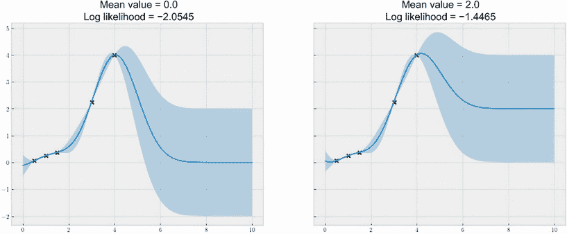

图 3.6 GP 预测，给出两个不同常数均值函数。值 2 比值 0 给出了更高的似然值，表明前者的均值函数比后者更合适。

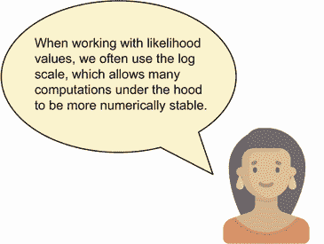

有了这个对数似然计算，我们的最后一步就是简单地找到我们的均值函数的值，使得对数似然被最大化。换句话说，我们的目标是寻找最能解释我们训练数据的均值。由于我们可以访问对数似然计算，我们可以使用基于梯度的优化算法，例如梯度下降，来迭代地优化我们的均值。当收敛时，我们将得到一个很好的均值，它给出了高数据似然度。如果您需要恢复一下梯度下降的工作原理，我推荐 Luis Serrano 的《Grokking Machine Learning》（Manning，2021）的附录 B，它很好地解释了这个概念。

现在，让我们看看如何用代码实现这个过程。由于我们用`gpytorch.means.ConstantMean`类为我们的均值函数实现了 GP 模型，所以我们这里不需要做任何更改。所以，现在，让我们再次初始化我们的 GP 模型：

```py
# declare the GP
lengthscale = 1
noise = 1e-4

likelihood = gpytorch.likelihoods.GaussianLikelihood()
model = ConstantMeanGPModel(train_x, train_y, likelihood)

# fix the hyperparameters
model.covar_module.lengthscale = lengthscale
model.likelihood.noise = noise
```

这个过程的核心步骤是定义对数似然函数以及梯度下降算法。如前所述，前者是`gpytorch.mlls.ExactMarginalLogLikelihood`类的一个实例，实现如下：

```py
mll = gpytorch.mlls.ExactMarginalLogLikelihood(likelihood, model)
```

对于梯度下降算法，我们使用 Adam，这是一种在许多 ML 任务中取得了很大成功的最先进算法，尤其是 DL。我们用 PyTorch 声明如下：

```py
optimizer = torch.optim.Adam([model.mean_module.constant], lr=0.01)
```

请注意，我们正在传递给`torch.optim.Adam`类的是`model.mean_module.constant`，这是我们希望优化的均值。当我们运行梯度下降过程时，Adam 算法会迭代地更新`model.mean_module.constant`的值，以改善似然函数。

现在我们需要做的最后一件事是运行梯度下降，其实现如下：

```py
model.train()                         ❶
likelihood.train()                    ❶

losses = []
constants = []
for i in tqdm(range(500)):
    optimizer.zero_grad()

    output = model(train_x)
    loss = -mll(output, train_y)      ❷

    loss.backward()                   ❸

    losses.append(loss.item())
    constants.append(model.mean_module.constant.item())

    optimizer.step()                  ❸

model.eval()                          ❹
likelihood.eval()                     ❹
```

❶ 启用训练模式

❷ 损失作为负边缘对数似然

❸ 损失上的梯度下降

❹ 启用预测模式

开始时的`train()`调用和最后的`eval()`调用是我们总是需要进行的记录步骤，分别启用我们 GP 模型的训练模式和预测模式。每一步都使用`optimizer.zero_grad()`重置梯度是另一个记录任务，以确保我们不会错误地计算梯度。

在中间，我们有一个 500 步的梯度下降过程，通过迭代计算损失（即我们的负对数似然）并根据梯度下降来降低这个损失。在这个` for`循环过程中，我们跟踪所获得的负对数似然值以及在每一步中调整的平均值。这是为了在训练之后，我们可以可视化检查这些值以确定它们是否收敛。

图 3.7 展示了这种可视化，显示了我们希望最小化的负对数似然的运行值以及 GP 的均值函数值。我们的损失一直降低（这是件好事！）随着均值常数的增加，显示出正常数比零更有可能性。两条曲线在 500 次迭代后都趋于平稳，表明我们已经收敛到均值常数的最优值。

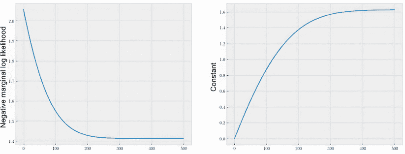

图 3.7 展示了梯度下降过程中的负对数似然（较低的值为更好）和均值值。在这两个面板中，这些值已经收敛，表明我们已经到达了最优解。

注意，在使用梯度下降时，我建议您始终绘制出渐进损失的图像，就像我们刚才在这里所做的那样，以查看您是否已经收敛到最优值。在收敛之前停止可能会导致模型性能不佳。虽然在本章节中我们不会再展示这些渐进损失图，但附带的代码中包含了它们。

到目前为止，我们已经学会了在我们的 GP 模型中使用零均值函数作为默认值，并优化相对于数据似然的平均常数值。然而，在许多使用情况下，您可能对目标函数的行为有先验知识，因此更喜欢将更多结构纳入您的均值函数中。

例如，我们如何实现房屋价格随着更大的居住面积而增加的想法？向前迈进，我们学会了使用线性或二次均值函数来实现这一点。

### 3.3.3 使用带梯度下降的线性函数

我们继续使用线性均值函数，其形式为*μ* = *w^T**x* + *b*。这里，*μ*是测试点*x*上的预测均值，而*w*是连接*x*中每个特征的系数的权重向量，*b*是一个常数偏置项。

通过使用线性平均函数，我们对我们的目标函数的预期行为进行编码，即它等于数据点*x*的特征的线性组合。对于我们的住房价格示例，我们只有一个特征，即生活区域，我们期望它有一个正权重，因此通过增加生活区域，我们的模型将预测出更高的价格。

另一种思考线性平均模型的方式是，我们有一个线性回归模型（也假设目标标签为特征的线性组合），然后我们在预测上加上一个概率信念，一个 GP 模型。这给予我们线性回归模型的能力，同时保持使用 GP 建模的所有好处，即不确定性量化。

注意 在一个常数均值函数下，权重向量*w*固定为零向量，偏差*b*是我们学会在上一小节优化的平均值。换句话说，线性函数比常数均值函数是一个更一般的模型。

关于实施，使用具有线性平均函数的 GP 模型相当简单。我们只需用`gpytorch.means.LinearMean`实例取代我们的常数均值，这样（我们的`forward()`方法保持不变）：

```py
class LinearMeanGPModel(gpytorch.models.ExactGP):
    def __init__(self, train_x, train_y, likelihood):
        super().__init__(train_x, train_y, likelihood)
        self.mean_module = gpytorch.means.LinearMean(1)    ❶
        self.covar_module = gpytorch.kernels.RBFKernel()
```

❶ 线性平均

在这里，我们使用`1`来初始化我们的均值模块，表示我们正在处理一维目标函数。当处理高维函数时，你可以简单地在这里传递该函数的维度。除此之外，我们模型的其它部分与之前的相似。在我们的三个点数据集上拟合和训练这个新模型，我们得到图 3.8 中的预测。

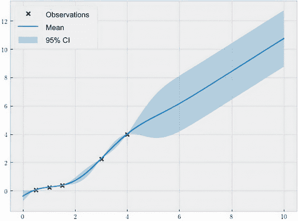

图 3.8 GP 带有线性平均函数的预测。GP 有一个上升趋势，这直接是线性平均函数的正斜率的结果。

与我们到目前为止看到的恒定平均值不同，我们在这里使用的线性平均函数驱使整个 GP 模型具有上升趋势。这是因为我们在训练数据中的五个数据点的最佳拟合线是具有正斜率的线，这正是我们希望作为生活区域和价格之间关系的建模。

### 3.3.4 通过实施自定义均值函数使用二次函数

我们这里的线性平均函数成功捕捉到了价格的上涨趋势，但它假定价格增长率是恒定的。也就是说，对生活区域增加一个额外的平方英尺，预期上会导致价格的恒定增加。

然而，在许多情况下，我们可能有先验知识，即我们的目标函数以非恒定的速率增长，而线性均值无法建模。事实上，我们使用的数据点是这样生成的，即价格是生活区域的二次函数。这就是为什么我们看到较大的房子比较小的房子更快地变得更贵。在本小节中，我们将将我们的 GP 均值实现为一个二次函数。

在撰写本文时，GPyTorch 仅提供了常数和线性均值函数的实现。但是，正如我们将在本书中一次又一次地看到的那样，这个软件包的美妙之处在于其模块化：GP 模型的所有组件，如均值函数、协方差函数、预测策略，甚至边缘对数似然函数，都被实现为模块，因此，它们可以以面向对象的方式进行修改、重新实现和扩展。当我们实现自己的二次均值函数时，我们首先亲自体会到这一点。

我们要做的第一件事是定义一个均值函数类：

```py
class QuadraticMean(gpytorch.means.Mean):
    def __init__(self, batch_shape=torch.Size(), bias=True):
        ...

    def forward(self, x):
        ...
```

这个类扩展了 `gpytorch.means.Mean` 类，它是所有 GPyTorch 均值函数实现的基类。为了实现我们的自定义逻辑，我们需要重新编写两个方法：`__init__()` 和 `forward()`，这与我们实现 GP 模型时完全相同！

在 `__init__()` 中，我们需要声明我们的均值函数包含哪些参数。这个过程称为 *参数注册*。

虽然线性函数有两个参数，斜率和截距，而二次函数有三个参数：一个二阶项 *x*[2] 的系数；一个一阶项 *x* 的系数；和一个零阶项的系数，通常称为偏差。这在图 3.9 中有所说明。

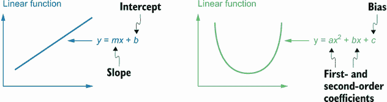

图 3.9 线性函数和二次函数的函数形式。线性函数有两个参数，而二次函数有三个。当这些函数用作 GP 的均值函数时，相应的参数是 GP 的超参数。

在这个基础上，我们这样实现 `__init__()` 方法：

```py
class QuadraticMean(gpytorch.means.Mean):
    def __init__(self, batch_shape=torch.Size(), bias=True):
        super().__init__()
        self.register_parameter(
            name="second",
            parameter=torch.nn.Parameter(torch.randn(*batch_shape, 1, 1))
        )                                                                 ❶

        self.register_parameter(
            name="first",
            parameter=torch.nn.Parameter(torch.randn(*batch_shape, 1, 1))
        )                                                                 ❷

        if bias:
            self.register_parameter(
                name="bias",
                parameter=torch.nn.Parameter(torch.randn(*batch_shape, 1))
            )                                                             ❸
        else:
            self.bias = None
```

❶ 二阶系数

❷ 一阶系数

❸ 偏差

我们按顺序调用 `register_parameter()` 来注册二阶系数、一阶系数和偏差。由于我们不清楚这些系数应该取什么值，我们只需使用 `torch.randn()` 随机初始化它们。

注意 我们需要将这些参数注册为 `torch.nn .Parameter` 类的实例，这允许它们的值在梯度下降期间进行调整（训练）。

对于 `forward()` 方法，我们需要定义我们的均值函数如何处理输入。正如我们所说的，二次函数的形式为 *ax² + bx + c*，其中 *a*、*b* 和 *c* 分别是二阶系数、一阶系数和偏差。所以我们只需要实现这个逻辑，如下所示：

```py
class QuadraticMean(gpytorch.means.Mean):
    def __init__(self, train_x, train_y, likelihood):
        ...                                               ❶

    def forward(self, x):
        res = x.pow(2).matmul(self.second).squeeze(-1) \
            + x.matmul(self.first).squeeze(-1)            ❷
        if self.bias is not None:
            res = res + self.bias
        return res
```

❶ 已省略

❷ 二次函数的公式

有了这个二次均值函数，我们现在可以编写一个初始化其均值模块的高斯过程模型，使用的是我们刚刚实现的自定义 `QuadraticMean` 类：

```py
class QuadraticMeanGPModel(gpytorch.models.ExactGP):
    def __init__(self, train_x, train_y, likelihood):
        super().__init__(train_x, train_y, likelihood)
        self.mean_module = QuadraticMean()
        self.covar_module = gpytorch.kernels.RBFKernel()

    def forward(self, x):
        ...                 ❶
```

❶ 省略

通过梯度下降重新运行整个训练过程，我们得到了图 3.10 中的预测。

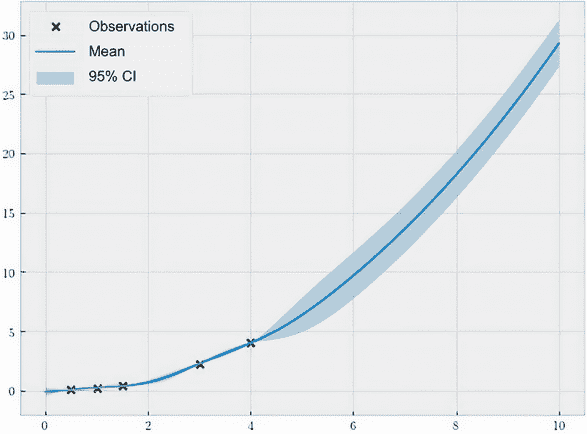

图 3.10 由具有二次均值函数的高斯过程进行的预测。该高斯过程预测随着较大的居住面积，价格增长速度更快。

在这里，我们成功地模拟了房屋价格相对于居住面积的非恒定增长率。我们的预测在图的右侧增长得比左侧快得多。

我们可以对我们希望假设的任何功能形式进行这样的操作，例如更高阶的多项式或次线性函数。我们需要做的是实现一个具有适当参数的均值函数类，并使用梯度下降为这些参数分配值，以便为我们的训练数据提供良好的拟合。

到目前为止，我们的讨论展示了高斯过程模型的数学灵活性，即它们可以利用任何结构的均值函数，并且仍然能够产生概率预测。这种灵活性激发并推动了 GPyTorch 的设计，其对模块化的强调帮助我们轻松地扩展和实现自己的自定义均值函数。在接下来我们将讨论的 GPyTorch 的协方差函数中，我们看到了同样的灵活性和模块化。

## 3.4 用协方差函数定义变异性和平滑度

虽然均值函数定义了我们对目标函数整体行为的期望，但高斯过程的协方差函数或核函数扮演着更复杂的角色：定义了域内数据点之间的关系，并控制了高斯过程的结构和平滑度。在本节中，我们比较了高斯过程对模型不同组成部分进行更改时的预测。通过这样做，我们能够实际洞察如何为高斯过程模型选择适当的协方差函数。我们使用的代码在 CH03/02 - Covariance functions.ipynb 中。

在这些示例中，我们使用了在第 2.4.1 节中看到的 Forrester 函数作为我们的目标函数。我们再次在 -3 到 3 之间随机采样三个数据点，并将它们用作我们的训练数据集。本节中可视化的所有预测都来自于在这三个点上训练的高斯过程。

### 3.4.1 设置协方差函数的尺度

通过其协方差函数来控制高斯过程行为的第一种方法是设置长度尺度和输出尺度。这些尺度，就像均值函数中的常数或系数一样，是协方差函数的超参数：

+   长度尺度控制着高斯过程输入的尺度，因此，高斯过程沿轴变化的速度有多快—也就是说，我们相信目标函数在输入维度上的变化程度有多大。

+   输出尺度定义了 GP 的输出范围或者说是其预测范围。

通过设置这些尺度的不同值，我们可以增加或减少 GP 预测的不确定性，以及缩放我们的预测范围。我们使用以下代码实现：

```py
class ScaleGPModel(gpytorch.models.ExactGP):
    def __init__(self, train_x, train_y, likelihood):
        super().__init__(train_x, train_y, likelihood)
        self.mean_module = gpytorch.means.ZeroMean()
        self.covar_module =
        ➥ gpytorch.kernels.ScaleKernel(
          gpytorch.kernels.RBFKernel())     ❶

    def forward(self, x):
        ...                                 ❷
```

❶ gpytorch.kernels.ScaleKernel 实现了输出尺度。

❷ 忽略

注意，这里的 `covar_module` 属性代码与之前不同：我们将一个 `gpytorch.kernels.ScaleKernel` 对象放在了通常的 RBF 内核之外。这实际上实现了输出尺度，它通过某个定值因子对 RBF 内核的输出进行了缩放。而长度尺度则已经包含在了 `gpytorch.kernels.RBFKernel` 内核中。

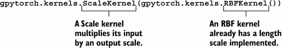

在我们迄今为止使用的代码中，我们有一行代码用于设置我们内核的长度尺度，即 `model.covar_module.base_kernel.lengthscale = lengthscale`。这就是长度尺度的值所保存的位置。使用类似的 API，我们可以使用 `model.covar_module.outputscale = outputscale` 来设置内核的输出尺度。现在，为了验证长度尺度确实可以控制函数变化的速度，我们将比较两个 GP 的预测，一个长度尺度为 1，另一个为 0.3，如图 3.11 所示。

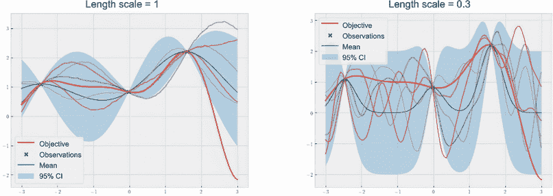

图 3.11 显示了 GP 以长度尺度为 1（左边）和 0.3（右边）进行预测的结果。长度尺度越小，GP 的预测就越不确定，变异性越高。

这两个面板的巨大差异清晰地表明了长度尺度的效果：

+   一个较短的长度尺度相当于给定输入常量变化情况下客观函数更多的变异性。

+   相反，一个较长的长度尺度强制函数更加光滑，也就是说给定输入更少的变化会使其变异性减少。

例如，沿着 *x* 轴移动一个单位，在图 3.11 左侧面板中的样本的变化幅度小于右侧面板的样本。

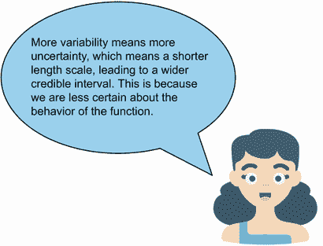

那么输出尺度呢？我们之前说这个参数将协方差函数的输出值缩放到一个不同的范围。这是通过将协方差输出结果乘以这个参数来实现的。因此，较大的输出尺度会使 GP 的预测范围更宽，而较小的输出尺度则会使预测范围缩小。为了验证这一点，让我们再次运行代码并重新生成预测，这次将输出尺度设置为 3。生成的输出结果如图 3.12 所示。

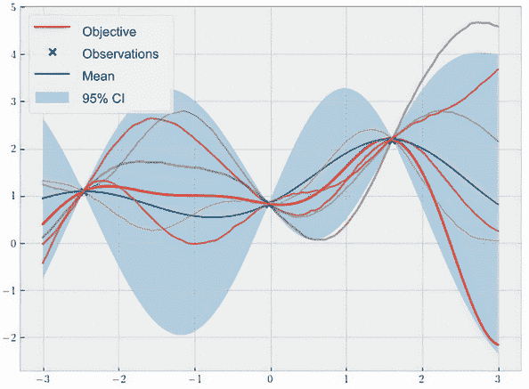

图 3.12 显示了 GP 的输出尺度为 3 的预测结果。较大的输出尺度使 GP 模拟的函数范围更宽，也容许更多的预测不确定性。

尽管图 3.11 和图 3.12 的左侧面板看起来相同，因为 GP 及其样本在两个图中具有相同的形状，但我们注意到图 3.12 的 *y*-轴更大，因为它的预测值和样本值都取得了较大的值（负值和正值都有）。这是使用具有较大输出尺度的 RBF 核对协方差值进行缩放的直接结果。

通过我们的协方差函数的两个超参数，我们已经看到我们可以解释由我们的 GP 模型建模的各种功能行为，我们在表 3.2 中总结了这些行为。我邀请您使用不同的长度和输出尺度重新运行此代码，以查看其效果并验证表格！

表 3.2 GP 的长度和输出尺度的角色总结

| 参数 | 大值 | 小值 |
| --- | --- | --- |
| 长度尺度 | 更平滑的预测，较少的不确定性 | 更多的变异性，更多的不确定性 |
| 输出尺度 | 较大的输出值，更多的不确定性 | 较窄的输出范围，较少的不确定性 |

注意 这种建模的灵活性引发了一个自然的问题：你应该如何适当地设置这些超参数的值？幸运的是，我们已经知道了一种设置 GP 模型超参数的好方法。我们可以通过选择最好地解释我们的数据的值，或者换句话说，通过梯度下降来最大化边缘对数似然，从而实现这一目标。

就像我们希望优化均值函数的超参数一样，我们现在只需将我们希望优化的变量 - 协方差函数的参数 - 传递给 Adam 即可实现：

```py
optimizer = torch.optim.Adam(model.covar_module.parameters(), lr=0.01)
```

通过运行梯度下降，我们可以获得这些参数的良好值。具体来说，我获得了大约 1.3 的长度尺度和大约 2.1 的输出尺度。也就是说，为了很好地拟合这三点训练数据集，我们希望 GP 稍微更平滑一些（具有大于 1 的长度尺度），并且还希望我们的预测范围更大一些（具有较大的输出尺度）。这无疑是一个让人放心的结果，因为我们的目标函数具有广泛的数值范围 - 在输入 3 处，它的值将达到 -2，这远超出了具有输出尺度 1 的 CI。

### 3.4.2 使用不同的协方差函数控制平滑度

到目前为止，我们仅仅使用了 RBF 核作为我们的协方差函数。然而，如果 RBF 不合适，完全可以使用不同的核函数用于我们的 GP。在本小节中，我们将学习使用另一种核函数家族，即马特恩核，并看看这种核函数对我们的 GP 会产生什么影响。

注意 通过使用马特恩核，我们正在指定 GP 模型函数的平滑度。这里的 "平滑度" 是一个技术术语，指的是函数的可微性；函数可微性越多次，它就越平滑。我们可以大致将其视为函数值以曲折方式 "跳动" 的程度。

RBF 核模拟的函数具有*无限*可微性，这是现实世界中很少有的函数特性。与此同时，Matérn 核生成的函数是有限可微的，这些函数可以被微分的次数（即这些函数的平滑度）由可设置的参数控制，我们马上就会讨论到。

要看到 Matérn 核的实际效果，我们首先重新实现我们的 GP 模型类：

```py
class MaternGPModel(gpytorch.models.ExactGP):
    def __init__(self, train_x, train_y, likelihood, nu):
        super().__init__(train_x, train_y, likelihood)
        self.mean_module = gpytorch.means.ZeroMean()
        self.covar_module = gpytorch.kernels.MaternKernel(nu)

    def forward(self, x):
        ...                  ❶
```

❶ 省略

在这里，我们的 `covar_module` 属性被初始化为 `gpytorch .kernels.MaternKernel` 类的实例。这个初始化接受一个参数 `nu`，定义了我们的 GP 将具有的平滑程度，这也是我们 `__init__()` 方法的一个参数。

重要提示：在撰写本文时，GPyTorch 支持三个 `nu` 值，1/2、3/2 和 5/2，对应函数分别是不可微分、一次可微分和两次可微分的。换句话说，这个 `nu` 参数越大，我们的 GP 越平滑。

让我们首先尝试 `nu = 0.5`，通过在初始化 GP 时设置该值来实现：

```py
likelihood = gpytorch.likelihoods.GaussianLikelihood()
model = MaternGPModel(train_x, train_y, likelihood, 0.5)

...     ❶

visualize_gp_belief(model, likelihood)
```

❶ 修正超参数并启用预测模式

这段代码生成图 3.13。

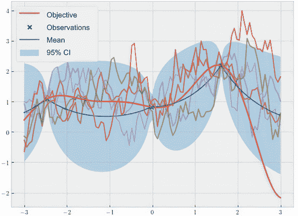

图 3.13 中 Matérn 1/2 核的 GP 预测，这表明目标函数不可微分，对应非常粗糙的样本

与我们之前在 RBF 中看到的情况不同，这个 Matérn 核的样本都非常参差不齐。事实上，它们都不可微分。当建模时间序列数据时，比如股票价格，`nu = 0.5` 是 Matérn 核的一个好值。

然而，在 BayesOpt 中通常不使用这个值，因为像图 3.13 中那样的参差不齐的函数非常不稳定（它们可以以不可预测的方式上下跳动），通常不是自动优化技术的目标。我们需要目标函数具有一定的平滑度，以便进行优化；否则，有效的优化是不切实际的目标。

Matérn 5/2 核通常是首选。它的预测结果与 Matérn 3/2 生成的结果在图 3.14 中可视化。

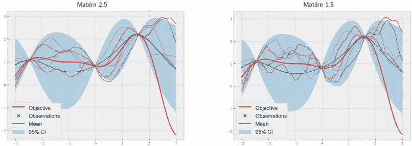

图 3.14 中 Matérn 5/2（左）和 Matérn 3/2（右）核的 GP 预测。这里的样本足够平滑，以便 GP 有效地从数据中学习，但也足够参差不齐，以真实地模拟现实生活中的过程。

我们看到这个 5/2 核的样本要平滑得多，这导致 GP 更有效地学习。然而，这些样本也足够粗糙，以至于它们类似于我们在现实世界中可能看到的函数。因此，BayesOpt 中的大多数工作，无论是研究还是应用，都使用这个 Matérn 5/2 核。在未来的章节中，当我们讨论 BayesOpt 的决策时，我们将相应地默认使用这个核。

注意 虽然我们在这里没有包含相应的细节，但 Matérn 核函数有自己的长度尺度和输出尺度，可以像前面的小节一样指定，以进一步定制生成的 GP 的行为。

通过将均值函数与核函数配对，我们可以在 GP 的预测中诱发复杂的行为。就像我们的先验影响了我们朋友圈中每个人在看到有人正确猜出一个秘密数字 100 次后的结论一样，我们对均值函数和核函数的选择决定了 GP 的预测。图 3.15 展示了三个例子，其中每种均值函数和核函数的组合导致了截然不同的行为。

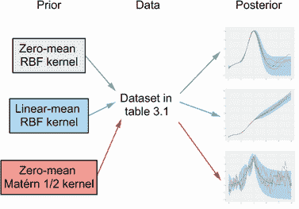

图 3.15 展示了在相同数据集上训练时，均值函数和核函数的三种不同选择以及它们各自后验 GP 的预测，每种选择都导致不同的预测行为。

### 3.4.3 用多个长度尺度建模不同级别的变异性

因为我们一直只考虑一维目标函数（其输入具有一个特征），所以我们只需要考虑一个长度尺度。然而，我们可以想象到一种情况，在这种情况下，高维目标函数（其输入具有多个特征）在某些维度上具有更多的变异性，在其他维度上较为平滑。也就是说，某些维度具有小的长度尺度，而其他维度具有大的长度尺度。还记得本章开头的启发性例子吗：房屋价格的预测增加一个楼层的幅度比增加一个平方英尺的生活面积更大。在本小节中，我们探讨了如何在 GP 中维护多个长度尺度以对这些函数进行建模。

如果我们只使用一个长度尺度来处理所有维度，那么我们将无法忠实地对目标函数进行建模。这种情况需要 GP 模型为每个维度维护一个单独的长度尺度，以完全捕获它们各自的变异性。在本章的最后一节中，我们学习如何在 GPyTorch 中实现这一点。

为了帮助我们的讨论，我们使用一个具体的二维目标函数，称为 Ackley，它可以修改为在不同维度中具有各种级别的变异性。我们将该函数实现如下：

```py
def ackley(x):
    # a modification of https:/ /www.sfu.ca/~ssurjano/ackley.xhtml
    return -20 * torch.exp(
        -0.2 * torch.sqrt((x[:, 0] ** 2 + x[:, 1] ** 2) / 2)
    )
    ➥ - torch.exp(torch.cos(2 * pi * x[:, 0] / 3)
    ➥ + torch.cos(2 * pi * x[:, 1]))
```

我们特别将该函数的定义域限制为两个维度上的方形区域，即 -3 到 3，通常表示为 [-3, 3]²。为了可视化这个目标函数，我们在图 3.16 中使用热图。

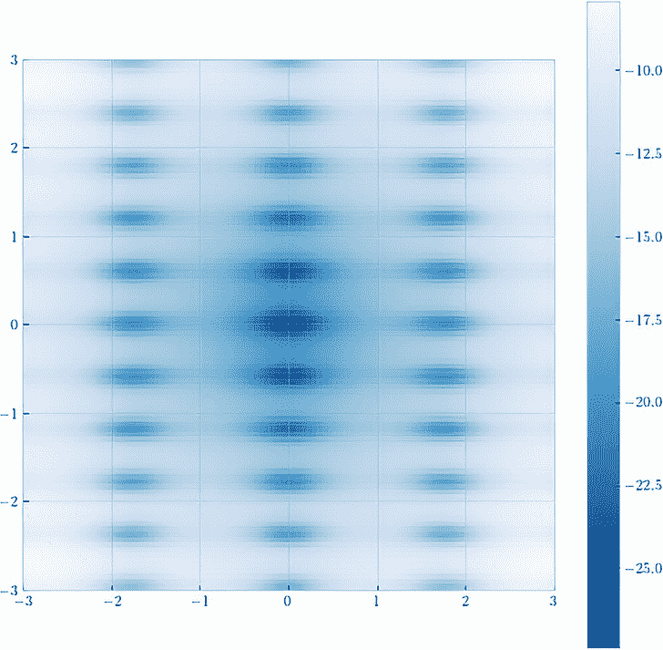

图 3.16 作为我们的目标使用的二维 Ackley 函数。在这里，*x* 轴的变异性比 *y* 轴小（变化较少），需要不同的长度尺度。

热图中的每个暗斑点都可以被看作是目标函数表面上具有低值的山谷。在这里，沿*y*轴有更多的山谷，而沿*x*轴则没有那么多，这表明第二个维度的变异性更大——也就是说，目标函数沿*y*轴上下波动的次数比沿*x*轴多得多。

再次强调，这意味着仅使用一个长度尺度来描述两个维度并不是一个好选择。相反，我们应该为*每个*维度（在本例中为两个）有一个长度尺度。然后，可以使用梯度下降独立地优化每个长度尺度。

使用每个维度的长度尺度的内核称为*自动相关确定*（ARD）。这个术语表示，在使用梯度下降优化这些长度尺度之后，我们可以推断出目标函数的每个维度与函数值相关的程度。具有较大长度尺度的维度具有较低的变异性，因此，在建模目标函数值时比具有较小长度尺度的维度不太相关。

使用 GPyTorch 实现 ARD 非常容易：我们只需在初始化协方差函数时将 `ard_num_dims` 参数指定为我们的目标函数具有的维度数即可。像这样使用 RBF 内核：

```py
class ARDGPModel(gpytorch.models.ExactGP):
    def __init__(self, train_x, train_y, likelihood):
        super().__init__(train_x, train_y, likelihood)
        self.mean_module = gpytorch.means.ZeroMean()
        self.covar_module = gpytorch.kernels.ScaleKernel(
            gpytorch.kernels.RBFKernel(ard_num_dims=2)
        )

    def forward(self, x):
        ...                 ❶
```

❶ 省略

让我们看看，当在我们的 Ackley 函数上训练时，这个模型是否为两个维度给出了不同的长度尺度。为此，我们首先构造一个包含 100 个点的随机抽样训练数据集：

```py
torch.manual_seed(0)
train_x = torch.rand(size=(100, 2)) * 6 - 3
train_y = ackley(train_x)
```

在使用梯度下降训练模型后，我们可以通过打印出优化后的长度尺度的值来检查它们。

```py
>>> model.covar_module.base_kernel.lengthscale
tensor([[0.7175, 0.4117]])
```

这确实是我们预期的结果：第一个维度的长度尺度较大，函数值的变异性较低，而第二个维度的长度尺度较小，函数值的变异性较高。

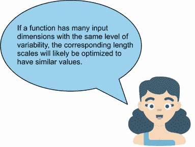

更多关于内核的阅读

内核本身已经受到了 ML 社区的极大关注。除了我们迄今所涵盖的内容之外，还有一点需要注意的是，内核还可以编码复杂的结构，如周期性、线性和噪声。对于更全面和技术性的内核讨论，感兴趣的读者可以参考 David Duvenaud 的 *内核菜谱* ([`www.cs.toronto.edu/~duvenaud/cookbook/`](https://www.cs.toronto.edu/~duvenaud/cookbook/))。

这个讨论标志着第三章的结束。在本章中，我们广泛地研究了我们的 GP 模型是如何受到均值和协方差函数的影响，特别是它们的各个参数。我们将这视为将我们对目标函数的了解（即先验信息）融入到我们的 GP 模型中的一种方式。我们还学会了使用梯度下降来估计这些参数的值，以获得最佳解释我们数据的 GP 模型。

这也标志着本书的第一部分的结束，我们将重点放在了 GP 上。从下一章开始，我们开始学习 BayesOpt 框架的第二个组成部分：决策制定。我们从两种最常用的 BayesOpt 策略开始，这两种策略旨在改善已见到的最佳点：概率改进和期望改进。

## 3.5 练习

这个练习是为了练习使用 ARD 实现 GP 模型。为此，我们创建一个目标函数，沿一个轴变化的程度比沿另一个轴变化的程度更大。然后，我们使用来自该函数的数据点训练一个有或没有 ARD 的 GP 模型，并比较学习到的长度尺度值。解决方案包含在 CH03/03 - Exercise.ipynb 中。

这个过程有多个步骤：

1.  使用 PyTorch 在 Python 中实现以下二维函数：

    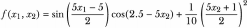

    这个函数模拟了一个支持向量机（SVM）模型在超参数调整任务中的准确性曲面。*x*轴表示惩罚参数*c*的值，*y*轴表示 RBF 核参数*γ*的值。（我们在未来的章节中也将使用该函数作为我们的目标函数。）

1.  在区间[`0, 2`]²上可视化该函数。热图应该看起来像图 3.17。

    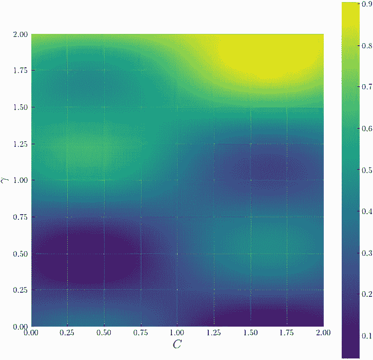

    图 3.17 SVM 模型在测试数据集上的准确率作为惩罚参数*c*和 RBF 核参数*γ*的函数。函数对*γ*的变化比对*c*的变化更快。

1.  在区间[`0, 2`]²中随机选择 100 个数据点，作为我们的训练数据。

1.  使用常数均值函数和 Matérn 5/2 卷积核来实现一个 GP 模型，其中输出规模作为`gpytorch.kernels.ScaleKernel`对象实现。

1.  在初始化核对象时不要指定`ard_num_dims`参数，或将该参数设置为`None`。这将创建一个没有 ARD 的 GP 模型。

1.  使用梯度下降训练 GP 模型的超参数，并在训练后检查长度尺度。

1.  重新定义 GP 模型类，这次设置`ard_num_dims = 2`。使用梯度下降重新训练 GP 模型，并验证两个长度尺度具有显著不同的值。

## 总结

+   先验知识在贝叶斯模型中起着重要作用，可以极大地影响模型的后验预测结果。

+   使用 GP 模型可以通过均值和协方差函数来指定先验知识。

+   均值函数描述了高斯过程模型的预期行为。在没有数据的情况下，高斯过程的后验均值预测回归到先验均值。

+   高斯过程的均值函数可以采用任何函数形式，包括常数、线性函数和二次函数，这可以通过 GPyTorch 实现。

+   高斯过程的协方差函数控制了高斯过程模型的平滑度。

+   长度尺度指定了输出与函数输入之间的变异性水平。较大的长度尺度导致更加平滑，因此预测的不确定性较小。

+   高斯过程中的每个维度都可以有自己的长度尺度。这被称为自动相关性确定（ARD），用于模拟在不同维度上具有不同变异程度的目标函数。

+   输出尺度指定了函数输出的范围。较大的输出尺度导致更大的输出范围，因此在预测中有更多的不确定性。

+   Matérn 核类是 RBF 核类的泛化。通过指定其参数 `nu`，我们可以模拟高斯过程预测中的各种平滑程度。

+   高斯过程的超参数可以通过最大化使用梯度下降的数据的边际似然来进行优化。
