# 第五章：通过基于改进的政策优化最佳结果

本章包括

+   BayesOpt 循环

+   在 BayesOpt 政策中开发开发和探索之间的权衡

+   以改进为标准来寻找新数据点。

+   使用改进的 BayesOpt 政策

在本章中，我们首先提醒自己 BayesOpt 的迭代性质：我们在已收集的数据上交替训练高斯过程（GP）并使用 BayesOpt 政策找到下一个要标记的数据点。这形成了一个良性循环，在这个循环中，我们的过去数据指导未来的决策。然后我们谈论我们在 BayesOpt 政策中寻找什么：一个决策算法，它决定标记哪个数据点。一个好的 BayesOpt 政策需要平衡足够探索搜索空间并集中在高性能区域。

最后，我们了解了两种政策，这两种政策旨在改进到目前为止 BayesOpt 循环中见过的最佳数据点：改进概率和最常用的 BayesOpt 政策之一，即期望改进。例如，如果我们有一个超参数调整应用程序，我们想要识别在数据集上提供最高验证准确性的神经网络，并且到目前为止我们见过的最高准确性为 90％，那么我们很可能想要改进这个 90％的阈值。本章中学到的策略试图创建这种改进。在我们在表 1.2 中看到的材料发现任务中，我们想要搜索混合温度低（对应高稳定性）的金属合金，而我们找到的最低温度为 187.24，上述两种政策将寻求找到低于这个 187.24 基准的值。

令人惊讶的是，由于我们对目标函数的信念的高斯性质，我们可以期望从最佳观察点的改进程度可以通过封闭形式计算。也就是说，虽然我们不知道未见位置的目标函数的样子，但是在 GP 下，仍然可以轻松地计算基于改进的数量。到本章结束时，我们深入了解了 BayesOpt 政策需要做什么以及如何使用这两个基于改进的政策来完成此操作。我们还学习了如何集成 BoTorch，即我们从本章到本书结束时使用的 Python 中的 BayesOpt 库（[`botorch.org/docs/introduction`](https://botorch.org/docs/introduction)），以实现 BayesOpt 政策。

## 4.1 在 BayesOpt 中导航搜索空间

我们如何确保我们正确利用过去的数据来指导未来的决策？我们在 BayesOpt 政策中寻找什么作为自动决策程序？本节回答了这些问题，并为我们清楚地说明了在使用 GP 时 BayesOpt 的工作原理。

具体来说，在下一小节中，我们将重新检查在第 1.2.2 节中简要介绍的贝叶斯优化循环，以了解如何通过贝叶斯优化策略与高斯过程的训练同时进行决策。然后，我们将讨论贝叶斯优化策略需要解决的主要挑战：在具有高不确定性的区域和在搜索空间中利用良好区域之间的平衡。

以图 4.1 为例，该图显示了在 1 和 2 处训练的两个数据点的高斯过程。在这里，贝叶斯优化策略需要决定我们应该在 -5 和 5 之间的哪个点评估下一个目标函数。探索和利用的权衡是明显的：我们需要决定是否在搜索空间的左右极端（大约在 -5 和 5 附近）检查目标函数，在这些位置，我们的预测存在相当大的不确定性，或者留在平均预测值最高的区域周围。探索和利用的权衡将为我们讨论的不同贝叶斯优化策略奠定基础，这些策略分布在本章和后续章节中。

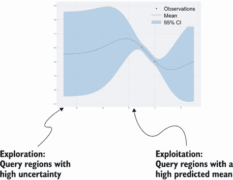

图 4.1 贝叶斯优化中的探索和利用的权衡。每个策略都需要决定是否查询具有高不确定性的区域（探索），还是查询具有高预测平均值的区域（利用）。

### 4.1.1 贝叶斯优化循环和策略

首先，让我们回顾一下贝叶斯优化循环的外观以及贝叶斯优化策略在此过程中的作用。在本章中，我们还实现了这个循环的框架，我们将在以后的章节中用来检查贝叶斯优化策略。回顾图 4.2，它是图 1.6 的重复，显示了贝叶斯优化在高层次上的工作方式。

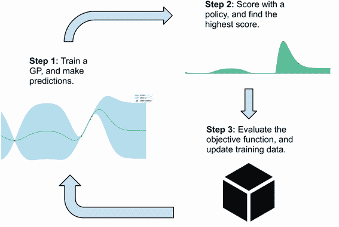

图 4.2 贝叶斯优化循环，结合了模拟高斯过程和决策制定策略。此完整工作流现在可以用于优化黑盒函数。

具体来说，贝叶斯优化是通过一个循环完成的，该循环在以下几个方面交替进行：

+   对当前训练集进行高斯过程（GP）训练。我们已经在以前的章节中彻底讨论了如何做到这一点。

+   使用训练有素的高斯过程（GP）对搜索空间中的数据点进行评分，评估它们在帮助我们确定目标函数最优值时的价值（图 4.2 中的步骤 2）。选择最大化此分数的点进行标记，并添加到训练数据中（图 4.2 中的步骤 3）。如何进行此评分由使用的贝叶斯优化策略决定。我们在本章和第 5 和第六章中了解更多有关不同策略的信息。

我们重复此循环，直到达到终止条件，通常是一旦我们已经评估了目标函数达到目标循环迭代次数。这个过程是端到端的，因为我们不仅仅是使用高斯过程进行预测，而是利用这些预测来决定下一步收集哪些数据点，进而推动未来预测的生成。

定义 BayesOpt 循环是模型训练（GP）和数据收集（策略）的良性循环，彼此互相帮助和受益，目标是找到目标函数的最优解。BayesOpt 的良性循环是一个反馈循环，向着具有期望性质的平衡状态迭代；其组件协同作用以实现期望的结果，而不是在导致不良结果的恶性循环中相互恶化。

决定数据点如何根据其在帮助我们实现这一目标的价值方面得分的规则由 BayesOpt 策略决定，因此对于优化性能至关重要。一个好的策略会将高分分配给对优化真正有价值的数据点，从而更快、更高效地指引我们走向目标函数的最优点，而一个设计不良的策略可能会误导我们的实验，并浪费宝贵的资源。

定义 *BayesOpt 策略* 根据其价值对每个潜在的查询进行评分，从而决定我们应该在下一步查询目标函数的位置（评分最高的地方）。由策略计算的此评分被称为*获取分*，因为我们将其用作数据获取的方法。

连接到强化学习策略

如果你有强化学习（RL）的经验，你可能会注意到 BayesOpt 策略和 RL 策略之间的联系。在这两种技术中，策略告诉我们在决策问题中应该采取哪些行动。而在 RL 中，策略可能为每个动作分配一个分数，然后我们选择分数最高的动作，或者策略可能只是输出我们应该采取的动作。在 BayesOpt 中，它始终是前者，策略输出一个量化每个可能查询价值的分数，因此我们的工作是确定最大化此分数的查询。

不幸的是，设计一个好的 BayesOpt 策略的问题没有完美的解决方案。也就是说，并没有一种单一的 BayesOpt 策略能够在所有目标函数上始终表现出色。正如我们在本章和后续章节中所见，不同的策略使用不同的焦点和启发式方法。虽然某些启发式方法在某种类型的目标函数上效果良好，但其他启发式方法可能在不同类型的函数上有效。这意味着我们需要接触广泛的 BayesOpt 策略，并了解它们的目的，以便将它们应用于适当的情况——这正是我们将在第 4 至 6 章中所做的。

什么是策略？

每个 BayesOpt 策略都是一个决策规则，根据给定的标准或启发式评分数据点，以确定其在优化中的有用性。不同的标准和启发式导致不同的策略，而没有预先确定的一组 BayesOpt 策略。事实上，BayesOpt 研究人员仍然发布提出新策略的论文。在本书中，我们只讨论实践中最流行和常用的策略。

现在让我们花点时间来实现一个占位的贝叶斯优化循环，从现在开始我们将使用它来检查各种贝叶斯优化策略。这段代码在 CH04/01 - BayesOpt loop.ipynb 中实现。我们需要的第一个组件是一个我们想要使用贝叶斯优化来优化的目标函数。在这里，我们使用熟悉的一维 Forrester 函数作为要最大化的目标函数，它被定义在 -5 到 5 之间。我们还使用 `xs` 和 `ys` 作为基本事实，在其定义域 [–5, 5] 内计算 Forrester 函数的值：

```py
def forrester_1d(x):                                              ❶
    y = -((x + 1) ** 2) * torch.sin(2 * x + 2) / 5 + 1            ❶
    return y.squeeze(-1)                                          ❶

bound = 5                                                         ❷

xs = torch.linspace(-bound, bound, bound * 100 + 1).unsqueeze(1)  ❷
ys = forrester_1d(xs)                                             ❷
```

❶ 目标函数的形式，假设未知

❷ 在 -5 到 5 之间的网格上计算的测试数据

我们需要做的另一件事是修改 GP 模型的实现方式，以便它们可以与 BoTorch 中的贝叶斯优化策略一起使用。实现 GP 构成了我们的贝叶斯优化循环的第一步。

由于 BoTorch 就建立在 GPyTorch 之上，因此只需要进行最小的修改。具体来说，我们使用以下 GP 实现，其中除了我们通常的 `gpytorch.models.ExactGP` 类之外，我们还继承了 `botorch.models.gpytorch.GPyTorchModel` 类。此外，我们声明了类特定属性 `num_outputs` 并将其设置为 1。这些是我们需要进行的最小修改，以便将我们的 GPyTorch 模型与 BoTorch 一起使用，后者实现了本章后面我们使用的贝叶斯优化策略：

```py
class GPModel(gpytorch.models.ExactGP,
  botorch.models.gpytorch.GPyTorchModel):  ❶
    num_outputs = 1                        ❶

    def __init__(self, train_x, train_y, likelihood):
        super().__init__(train_x, train_y, likelihood)
        self.mean_module = gpytorch.means.ConstantMean()
        self.covar_module = gpytorch.kernels.ScaleKernel(
            gpytorch.kernels.RBFKernel()
        )
    def forward(self, x):
        mean_x = self.mean_module(x)
        covar_x = self.covar_module(x)
        return gpytorch.distributions.MultivariateNormal(mean_x, covar_x)
```

❶ 用于 BoTorch 集成的修改

除此之外，我们 GP 实现中的其他一切都保持不变。现在我们编写一个帮助函数，用于在我们的训练数据上训练 GP：

```py
def fit_gp_model(train_x, train_y, num_train_iters=500):
    noise = 1e-4                                     ❶

    likelihood = gpytorch.likelihoods
    ➥.GaussianLikelihood()                          ❷
    model = GPModel(train_x, train_y, likelihood)    ❷
    model.likelihood.noise = noise                   ❷

    optimizer = torch.optim.Adam(model.parameters(),
    ➥lr=0.01)                                       ❸
    mll = gpytorch.mlls.ExactMarginalLogLikelihood
    ➥(likelihood, model)                            ❸

    model.train()                                    ❸
    likelihood.train()                               ❸

    for i in tqdm(range(num_train_iters)):           ❸
        optimizer.zero_grad()                        ❸

        output = model(train_x)                      ❸
        loss = -mll(output, train_y)                 ❸

        loss.backward()                              ❸
        optimizer.step()                             ❸

    model.eval()                                     ❸
    likelihood.eval()                                ❸

    return model, likelihood
```

❶ 使用梯度下降训练 GP

❷ 声明 GP

❸ 使用梯度下降训练 GP

注意 我们在前几章中使用了所有先前的代码。如果您对某段代码有困难理解，请参考第 3.3.2 节以获取更多细节。

这涵盖了图 4.2 的第 1 步。现在，我们跳过第 2 步，即实现贝叶斯优化策略，并将其留待下一节和未来章节。要实现的下一个组件是可视化到目前为止收集的数据，当前 GP 信念以及一个贝叶斯优化策略如何评分其余数据点。该可视化的目标显示在图 4.3 中，我们在第一章中见过。具体来说，图的顶部面板显示了 GP 模型对真实目标函数的预测，而底部面板显示了由贝叶斯优化策略计算的收购分数。

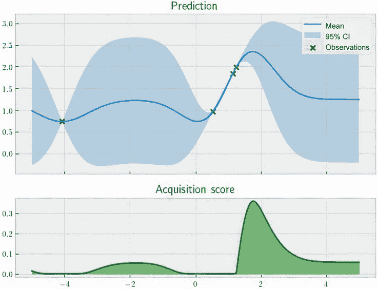

图 4.3 贝叶斯优化进展的典型可视化。顶部面板显示了 GP 预测和真实的目标函数，而底部面板显示了一个名为期望改进（Expected Improvement）的贝叶斯优化策略所做的收购分数，我们将在第 4.3 节中学习到。

我们已经熟悉如何生成顶部面板，生成底部面板同样简单。这将使用类似于我们在第 3.3 节中使用的辅助函数来完成。该函数接受一个 GP 模型及其似然函数以及两个可选输入：

1.  `policy` 指的是 BayesOpt 策略对象，可以像调用任何 PyTorch 模块一样调用。在这里，我们将它调用在代表我们搜索空间的网格 `xs` 上，以获取整个空间的获取分数。我们将在下一节中讨论如何使用 BoTorch 实现这些策略对象，但我们现在不需要更多了解这些对象。

1.  `next_x` 是使获取分数最大化的数据点的位置，将其添加到正在运行的训练数据中：

```py
def visualize_gp_belief_and_policy(
    model, likelihood, policy=None, next_x=None
):
    with torch.no_grad():
        predictive_distribution = likelihood(model(xs))  ❶
        predictive_mean = predictive_distribution.mean   ❶
        predictive_upper, predictive_lower =             ❶
          ➥predictive_distribution.confidence_region()  ❶

        if policy is not None:                           ❷
            acquisition_score = policy(xs.unsqueeze(1))  ❷

    ...                                                  ❸
```

❶ GP 预测

❷ 获取分数

❸ 省略

在这里，我们从 GP 和测试数据 `xs` 中生成预测。请注意，如果未传入 `policy`，我们不会计算获取分数，在这种情况下，我们也以我们已经熟悉的方式可视化 GP 预测-散点表示训练数据，平均预测的实线，95% CI 的阴影区域：

```py
    if policy is None:
        plt.figure(figsize=(8, 3))

        plt.plot(xs, ys, label="objective", c="r")         ❶
        plt.scatter(train_x, train_y, marker="x", c="k",
            label="observations")                          ❷

        plt.plot(xs, predictive_mean, label="mean")        ❸
        plt.fill_between(                                  ❸
            xs.flatten(),                                  ❸
            predictive_upper,                              ❸
            predictive_lower,                              ❸
            alpha=0.3,                                     ❸
            label="95% CI",                                ❸
        )                                                  ❸

        plt.legend()
        plt.show()
```

❶ 真实值

❷ 训练数据

❸ 平均预测和 95% CI

请参考第 2.4.4 节以了解这个可视化的基础知识。

另一方面，如果传入了策略对象，我们将创建另一个子图以显示搜索空间中的获取分数：

```py
    else:
        fig, ax = plt.subplots(
            2,
            1,
            figsize=(8, 6),
            sharex=True,
            gridspec_kw={"height_ratios": [2, 1]}
        )

        ...                                                    ❶

        if next_x is not None:                                 ❷
            ax[0].axvline(next_x, linestyle="dotted", c="k")   ❷

        ax[1].plot(xs, acquisition_score, c="g")               ❸
        ax[1].fill_between(                                    ❸
          xs.flatten(),                                        ❸
          acquisition_score,                                   ❸
          0,                                                   ❸
          color="g",                                           ❸
          alpha=0.5                                            ❸
        )                                                      ❸

        if next_x is not None:                                 ❷
            ax[1].axvline(next_x, linestyle="dotted", c="k")   ❷

        ax[1].set_ylabel("acquisition score")

        plt.show()
```

❶ GP 预测（与以前相同）

❷ 最大化获取分数的点，使用虚线垂直线进行可视化

❸ 获取分数

当传入 `policy` 和 `next_x` 时，此函数将创建一个显示根据 BayesOpt 策略的获取分数的较低面板。最后，我们需要实现图 4.2 中 BayesOpt 循环的第 3 步，即(1)找到具有最高获取分数的点，并(2)将其添加到训练数据并更新 GP。对于识别给出最高获取分数的点的第一个任务，虽然在我们的 Forrester 示例中可能在一维搜索空间上进行扫描，但随着目标函数维数的增加，穷举搜索变得越来越昂贵。

请注意，我们可以使用 BoTorch 的辅助函数 `botorch.optim.optimize .optimize_acqf()`，该函数找到最大化任何 BayesOpt 策略得分的点。辅助函数使用 L-BFGS，一种准牛顿优化方法，通常比梯度下降方法更有效。

我们这样做：

+   `policy` 是 BayesOpt 策略对象，我们很快就会了解更多。

+   `bounds` 存储了我们搜索空间的边界，在本例中为-5 和 5。

+   `q = 1` 指定我们希望辅助函数返回的点数，这是一个。 (在第七章中，我们学习了允许同时对目标函数进行多次查询的设置。)

+   `num_restarts` 和 `raw_samples` 分别表示在搜索给出最高获取分数的最佳候选项时 L-BFGS 使用的重复次数和初始数据点数。一般来说，我建议分别使用这些参数的维数的 20 倍和 50 倍。

+   返回的值，`next_x` 和 `acq_val`，分别是给出最高获取分数的点的位置和相应的最大化获取分数：

```py
next_x, acq_val = botorch.optim.optimize_acqf(
    policy,
    bounds=torch.tensor([[-bound * 1.0], [bound * 1.0]]),
    q=1,
    num_restarts=20,
    raw_samples=50,
)
```

设置重新启动和原始样本的数量

`num_restarts` 和 `raw_samples` 的值越高，当搜索最大化获取分数的最佳候选项时，L-BFGS 的穷举程度就越高。这也意味着 L-BFGS 算法运行的时间将更长。如果发现 L-BFGS 在最大化获取分数时失败，或者算法运行时间太长，可以增加这两个数字；反之，可以减少它们。

作为最后一步，我们在贝叶斯优化循环中汇总了我们到目前为止实现的内容。在该循环的每次迭代中，我们执行以下操作：

1.  我们首先打印出迄今为止我们看到的最佳值（`train_y.max()`），这显示了优化的进展情况。

1.  然后，我们重新在当前训练数据上训练 GP，并重新声明贝叶斯优化策略。

1.  使用 BoTorch 中的辅助函数 `botorch.optim.optimize_acqf()`，我们确定在搜索空间中最大化获取分数的点。

1.  我们调用辅助函数 `visualize_gp_belief_and_policy()`，该函数可视化我们当前的 GP 信念和优化进展。

1.  最后，我们在确定的点（`next_x`）查询函数值并更新我们观察到的数据。

整个过程总结在图 4.4 中，该图显示了贝叶斯优化循环中的步骤及实现这些步骤的相应代码。每个步骤都由我们的辅助函数或 BoTorch 的模块化代码实现，使得整个过程易于跟踪。

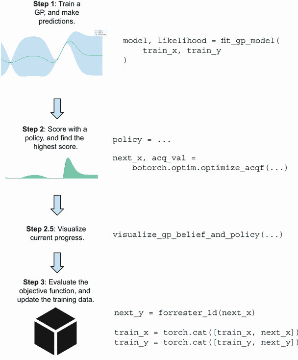

图 4.4 贝叶斯优化循环中的步骤及相应的代码。每个步骤的代码是模块化的，这使得整个循环易于跟踪。

实际的代码实现如下：

```py
num_queries = 10                                         ❶

for i in range(num_queries):
    print("iteration", i)
    print("incumbent", train_x[train_y.argmax()], train_y.max())

    model, likelihood = fit_gp_model(train_x, train_y)   ❷

    policy = ...                                         ❸

    next_x, acq_val = botorch.optim.optimize_acqf(       ❹
        policy,                                          ❹
        bounds=torch.tensor([[-bound * 1.0],             ❹
        ➥[bound * 1.0]]),                               ❹
        q=1,                                             ❹
        num_restarts=20,                                 ❹
        raw_samples=50,                                  ❹
    )                                                    ❹

    visualize_gp_belief_and_policy(model, likelihood, policy,
        next_x=next_x)                                   ❺

    next_y = forrester_1d(next_x)                        ❻

    train_x = torch.cat([train_x, next_x])               ❻
    train_y = torch.cat([train_y, next_y])               ❻
```

❶ 可以进行的目标函数评估次数

❷ 更新当前数据上的模型

❸ 初始化贝叶斯优化策略，稍后讨论

❹ 找到给出最高获取分数的点

❺ 可视化当前 GP 模型和获取分数

❻ 在确定的点观察并更新训练数据

有了这一点，我们已经实现了一个 BayesOpt 循环的框架。现在唯一要做的就是用我们想要使用的实际 BayesOpt 策略来填充`policy`的初始化，然后笔记本就能在 Forrester 函数上运行 BayesOpt 了。请注意，虽然调用`visualize_gp_belief_and_policy()`不是必需的（也就是说，之前的 BayesOpt 循环仍然能够运行而不需要那一行代码），但是这个函数对我们观察 BayesOpt 策略的行为和特性以及诊断任何潜在问题是有用的，正如我们后面在本章中讨论的那样。

BayesOpt 策略最重要的特征之一是探索和利用之间的平衡，这是许多人工智能和机器学习问题中的一个经典权衡。在这里，发现我们目前不知道的高性能区域（探索）的可能性与集中在已知的良好区域（利用）的机会之间进行权衡。我们将在下一小节中更详细地讨论这种权衡。

### 4.1.2 平衡探索和利用

在这一小节中，我们讨论了决策过程中固有的一个问题，包括 BayesOpt 在内：在充分探索整个搜索空间和及时利用产生良好结果的区域之间的平衡。这一讨论将帮助我们形成对什么是一个好的 BayesOpt 策略的理解，并让我们意识到我们所学到的每个策略如何解决这种权衡。

为了说明探索和利用的权衡，想象一下你正在一家你之前只去过几次的餐厅用餐（见图 4.5）。你知道这家餐厅的汉堡很棒，但你不确定他们的鱼和牛排是否好吃。在这里，你面临着一个探索与利用的问题，你需要在尝试点可能是一道很好的菜肴（探索）和点你经常吃但可靠的餐点（利用）之间做出选择。


图 4.5 在餐厅点菜具有固有的探索（尝试新事物）与利用（点常吃的）的权衡。

过度的探索可能会导致你点到你不喜欢的东西，而持续的利用则可能会导致你错过你真正喜欢的一道菜。因此，两者之间的合理平衡至关重要。

这个无处不在的问题不仅存在于点餐中，也存在于人工智能的常见问题中，比如强化学习、产品推荐和科学发现。在 BayesOpt 中，我们面临着同样的权衡：我们需要充分探索搜索空间，以便不错过一个好的区域，但我们也应该专注于具有高客观价值的区域，以确保我们在优化方面取得进展。

注意：“具有高目标值的区域”指的是由输入 *x* 产生高输出 *f*(*x*) 值的区域，这是我们优化（特别是最大化）任务的目标。

让我们回到我们的代码示例，并假设当我们刚开始时，我们的训练数据集包含 Forrester 目标函数的两个观察值，分别为 *x* = 1 和 *x* = 2：

```py
train_x = torch.tensor([
    [1.],
    [2.]
])
train_y = forrester_1d(train_x)

model, likelihood = fit_gp_model(train_x, train_y)

print(torch.hstack([train_x, train_y.unsqueeze(1)]))
```

这给出了输出

```py
tensor([[1.0000, 1.6054],
        [2.0000, 1.5029]])
```

这表明点 1 处的评估大约为 1.6，而点 2 处的评估为 1.5。通过可视化训练好的 GP 所做出的预测，我们获得了图 4.6 中熟悉的样式。该图显示了我们面临的探索与利用之间的权衡：我们应该在不确定性较高的地方评估目标函数，还是应该留在平均预测较高的区域？


图 4.6：由 GP 训练的两个数据点的预测来自 Forrester 函数

每个 BayesOpt 策略都有一种不同的方式来处理这种权衡，因此，在如何最好地探索搜索空间方面提供了不同的建议。在图 4.6 中，一些策略可能会导致我们进一步探索未知区域，而另一些策略可能会建议我们聚焦于已知的高价值区域。同样，通常没有一种一刀切的方法（即，没有一种策略始终表现良好）。

## 4.2 寻找 BayesOpt 中的改进

我们几乎已经准备好在给定目标函数上运行 BayesOpt 了。现在我们需要一个具有关于我们搜索目标中每个潜在标记数据点的价值的评分规则的策略。同样，我们将看到的每个策略都提供了一个不同的评分规则，这些规则是受到不同的优化启发式的驱使的。

在这一部分，我们学习了一种在优化目标时具有直观意义的启发式方法。当我们寻求优化时，这种方法的形式是寻求从迄今为止所见过的最佳点开始改进。在即将到来的小节中，我们将了解到 GPs 有助于促进这一改进度量的计算。然后，我们将介绍不同定义改进的方式如何导致两种最常见的 BayesOpt 策略：提高概率和期望改进。

### 4.2.1 用 GP 测量改进

在本小节中，我们将讨论改进 BayesOpt 的定义、它如何构成一个良好的效用度量，并且使用正态分布处理与改进相关的量是直接的。因为我们在 BayesOpt 中的最终目标是确定目标函数的全局最优值——给出最高目标值的点——所以我们在评估目标函数时所观察到的值越高，我们的效用就应该越高。假设当我们在某个点*x*[1]处评估目标函数时，我们观察到值为 2。在另一种情况下，当我们评估另一个点*x*[2]时，我们观察到值为 10。直观地说，我们应该更重视第二个点，因为它给了我们一个更高的函数值。

但是，如果在观察到*x*[1]和*x*[2]之前，我们已经看到一个*x*[0]的点，它的值为 20 呢？在这种情况下，自然会认为即使*x*[2]比*x*[1]好，但两个点都不会带来任何额外的效用，因为我们在*x*[0]上已经有了一个更好的观察结果。另一方面，如果我们有一个*x*[3]的点，它的值为 21，那么我们会更高兴，因为我们已经找到了比*x*[0]更好的值。这在图 4.7 中有所说明。

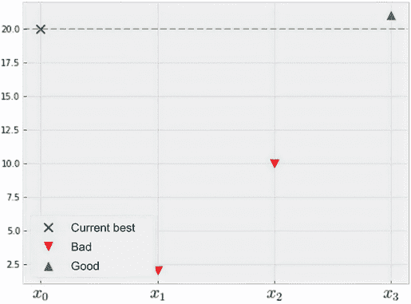

图 4.7 寻求从观察到的最佳点改进。虽然点*x*[2]优于点*x*[1]，但两者都“不好”意味着它们没有改进点*x*[0]。

这些比较指出了在 BayesOpt 中，我们关心的不仅仅是我们观察到的观察值的原始值，还有新发现的观察是否比我们的观察更好。在这种情况下，由于*x*[0]在函数值方面设定了一个非常高的标准，无论*x*[1]还是*x*[2]都不构成改进——至少不是我们在优化中关心的那种改进。换句话说，在优化中一个合理的目标是寻求从迄今为止我们见过的最佳点改进，因为只要我们从观察到的最佳点改进，我们就在取得进步。

定义 观察到的最佳点，或者产生了迄今为止我们找到的最高函数值的点，通常被称为*现任*。这个术语表示，这个点目前在我们搜索期间查询的所有点中持有最高值。

假设我们对目标函数有一个 GP 的信念，那么检查我们可以期望从观察到的最佳点改进多少可能会很容易。让我们从我们正在运行的 Forrester 函数的示例开始，我们的当前 GP 如图 4.6 所示。

在我们的训练集中的两个数据点中，(*x* = 1，*y* = 1.6) 是更好的一个，因为它有一个更高的函数值。这是我们当前的现任。同样，我们正在专注于从这个 1.6 的阈值改进；也就是说，我们希望找到的数据点会产生高于 1.6 的函数值。

从视觉上来看，我们可以将这个基于改进的方法想象为将高斯过程水平切断在现有解处，如图 4.8 所示。较暗颜色突出显示的部分对应于“改进现有解”（在 1.6 处）。任何低于这条线的点都不能构成改进，因此不会给我们带来额外的优化效益。虽然我们不知道某个点-比如*x*=0-是否会产生更高的函数值，但我们仍然可以尝试通过从高斯过程模型中得知的信息来推理它的可能性。

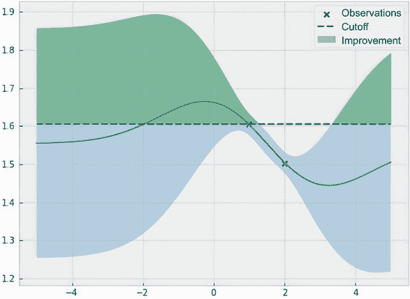

图 4.8 从高斯过程的角度看改进自现有解。高斯过程预测对应的改进自现有解的部分在较深的颜色中突出显示。

推理 *x* = 0 的概率将产生更高的函数值很容易做到，因为通过查询点 *x* = 0，我们观察到的改进自现有解正好对应于一个被部分截断的*正态分布*，如图 4.9 所示。

图 4.9 的左面板包含与图 4.8 相同的高斯过程，该过程在现有解处被切断，并额外显示了在*x*=0 处的正态分布预测的 CI。在此点 0 处垂直切割高斯过程，我们获得了图 4.9 的右面板，两个面板中的 CI 相同。我们看到，在右面板中正态分布的只有突出显示的部分代表我们可以从现有解中观察到的改进，这是我们关心的。这突出显示的部分是正态分布的一部分，正如我们在接下来的小节中所介绍的那样，这导致了许多数学的便利。

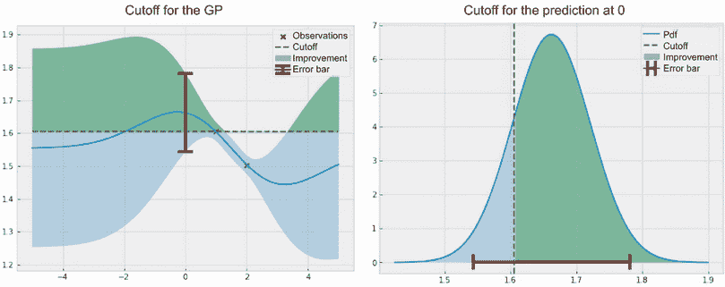

图 4.9 在 0 处对现有解的改进，以较深的颜色突出显示。左面板显示整个高斯过程，而右面板仅显示与 0 处的预测相对应的正态分布（误差栏在两个面板上相同）。在这里，对现有解的改进遵循一个被截断的正态分布。

这些便利不仅适用于 *x* = 0 。由于高斯过程在任何给定点处的预测是正态分布，因此在任何点处的改进也遵循被截断的正态分布，如图 4.10 所示。

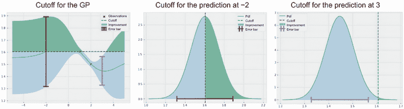

图 4.10 在–2 和 3 处对现有解的改进，以较深的颜色突出显示。左面板显示整个高斯过程，中心面板显示-2 处的预测，右面板显示 3 处的预测。突出显示的部分显示可能的改进，这取决于给定点上的正态分布。

我们看到与图 4.9 相比，在 0 处突出显示了大部分正态分布为可能的改进，以下是正确的：

+   -2 处的预测（中心面板）更糟，因为它只有一半被突出显示为可能改进。这是因为 -2 处的平均预测值大致等于现有值，因此，在 -2 处的函数值改进为 1.6 的可能性是 50-50。

+   作为另一个例子，右侧面板显示了在 3 处的预测，根据我们关于客观情况的高斯过程的信念，几乎不可能从现有情况改进，因为几乎整个正态分布在 3 处都低于现有门槛。

这表明不同的点将导致不同的可能改进，这取决于高斯过程的预测。

### 4.2.2 计算改进的概率

在 BayesOpt 中，我们的目标特别明确，即从当前的现有情况中提高。现在，我们终于准备开始讨论旨在实现这一目标的 BayesOpt 策略。在本小节中，我们了解*改进概率*（PoI），这是一种衡量候选点可能改进的策略。

衡量候选点从现有情况改进的可能性的想法对应于图 4.7 中一个点是“好”的概率的概念。这在第 4.2.1 节中与高斯过程中也有所提及，我们说：

1.  0 处的点（图 4.9）的正态分布的大部分被突出显示为可能改进。换句话说，它有很高的改进可能性。

1.  -2 处的点（图 4.10 的中心面板）有 0.5 的改进概率，因为其正态分布的一半超过了现有状态。

1.  3 处的点（图 4.10 的右侧面板）的正态分布大部分在门槛以下，因此它几乎不可能改进。

通过注意到从现有情况改进的概率等于图 4.9 和 4.10 中突出显示部分的面积，我们可以使这一计算更具体。

定义 任何正态曲线下的整个面积都为 1，因此图 4.9 和 4.10 中突出显示部分的面积恰好衡量了该正态随机变量（给定点的函数值）超过现有情况的可能性。

与突出显示的区域的面积对应的量与*累积密度函数*（CDF）有关，它被定义为一个随机变量取得小于或等于目标值的概率。换句话说，CDF 衡量了*未*突出显示的区域的面积，即突出显示的区域的面积为 1 减去突出显示的区域的面积。

多亏了数学上的便利性，正态分布和高斯过程，我们可以轻松地使用累积分布函数计算此突出区域的面积，这需要相关正态分布的均值和标准差。在计算上，我们可以利用 PyTorch 的`torch.distributions.Normal`类，该类实现了正态分布并提供了有用的`cdf()`方法。具体来说，假设我们有兴趣计算 0 点的点能够改进现有情况的可能性。我们将按照图 4.11 中描述的过程进行操作：

1.  首先，我们使用高斯过程来计算 0 点的均值和标准差预测。

1.  接着，我们计算以先前的均值和标准差定义的正态曲线下的面积，以现有值为截止点。我们使用累积分布函数进行此计算。

1.  最后，我们从 1 中减去 CDF 值，以获得候选点的 PoI。

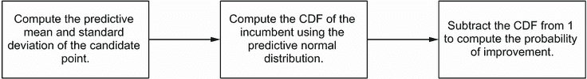

图 4.11 PoI 分数计算的流程图。通过按照此过程，我们可以计算任何候选点能够从现有情况中改进的可能性。

注释 技术上，累积分布函数计算正态分布左侧的部分的面积，因此我们需要从 1 中减去 CDF 的输出，以获取阈值右侧的部分的面积，这对应于可能的改进。

我们首先生成该点处高斯过程的预测：

```py
with torch.no_grad():
    predictive_distribution = likelihood(model(torch.tensor([[0.]])))
    predictive_mean = predictive_distribution.mean     ❶
    predictive_sd = predictive_distribution.stddev     ❷
```

❶ 0 点处的预测均值

❷ 0 点处的预测标准差

首先，我们使用相应的均值和标准差初始化一个一维正态分布：

```py
normal = torch.distributions.Normal(predictive_mean, predictive_sd)
```

此正态分布是图 4.9 右侧面板中可视化的正态分布。最后，为了计算突出显示部分的面积，我们调用带有现有值的`cdf()`方法（即`train_y.max()`，我们的训练数据的最大值），并从 1 中减去结果：

```py
>>> 1 - normal.cdf(train_y.max())

tensor([0.8305])
```

在这里，我们的代码显示，在 0 点处，我们有超过 80%的机会从现有情况中改进，这与图 4.9 中突出显示的正态分布的大部分一致。使用相同的计算，我们可以发现-2 点的 PoI 为 0.4948，3 点的 PoI 为 0.0036。通过观察图 4.10，我们可以看到这些数字是合理的。除了这三个点（0、-2 和 3）之外，我们还可以使用相同的公式计算给定点能够改进的可能性，即给定点的 PoI，跨越我们的搜索空间。

定义 图 4.11 中的过程给出了 PoI 策略的评分规则，其中搜索空间中每个点的得分等于该点能够改进现有情况的可能性。同样，这个分数也称为*收集分数*，因为我们将其用作数据收集的方法。

我们可以看到，此 PoI 策略使用了`cdf()`方法，但使用*BoTorch*更干净，这是一个实现 BayesOpt 策略的 Python 库。BoTorch 建立在 PyTorch 和 GPyTorch 之上，并与其无缝合作。正如我们之前所看到的，我们只需更改 GP 类中的两行代码，即可使模型与 BoTorch 兼容。此外，BoTorch 将其策略实现为*模块*，使我们能够以模块化的方式在 BayesOpt 循环中交换不同的策略。

BoTorch 策略的模块化

通过*模块化*，我们指的是我们可以在 BayesOpt 循环中用另一个策略替换当前正在使用的策略，只需更改策略的初始化。BayesOpt 循环的其余部分（训练 GP 模型、可视化优化进度和更新训练数据）不必更改。我们在 3.3 和 3.4.2 节中也观察到了与 GPyTorch 的均值函数和核函数类似的模块化。

要使用 BoTorch 实现 PoI 策略，我们执行以下操作：

```py
policy = botorch.acquisition.analytic.ProbabilityOfImprovement( ❶
    model, best_f=train_y.max()                                 ❶
)                                                               ❶

with torch.no_grad():                                           ❷
    scores = policy(xs.unsqueeze(1))                            ❷
```

❶ 声明 PoI 策略

❷ 计算分数

BoTorch 类`ProbabilityOfImprovement`将 PoI 实现为 PyTorch 模块，将 GP 作为第一个参数，现有结果值作为第二个参数。变量`scores`现在存储`xs`中点的 PoI 分数，`xs`是-5 到 5 之间的密集网格。

再次，每个点的获取分数等于该点从现有结果改善的概率，根据我们的高斯过程信念。图 4.12 显示了我们的搜索空间中的这个分数，以及我们的高斯过程。

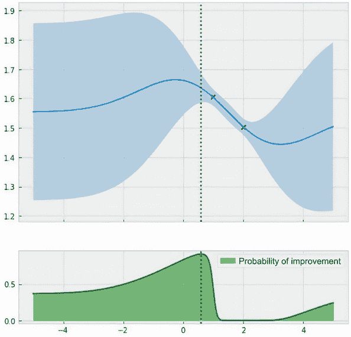

图 4.12 高斯过程预测（顶部）和 PoI（底部），虚线表示最大化 PoI 分数的点。这一点是我们在优化的下一次迭代中查询目标函数的地方。

我们观察到一些有趣的 PoI 分数行为：

+   在现有结果的左侧区域（从 0 到 1）的 PoI 分数相对较高。这对应于此区域的高均值预测。

+   绘图左侧区域的得分稍低。这是因为均值预测不那么高，但在这个区域存在足够的不确定性，仍然有相当大的改善概率。

+   2 周围的区域的 PoI 接近 0。正如我们所见，此处的点的预测正态分布大多位于现有结果阈值下方。

现在，我们要做的就是确定在-5 到 5 之间具有最高 PoI 分数的点，即最大化从现有结果改善的概率的点。如前所述，我们利用 BoTorch 的辅助函数`botorch.optim.optimize.optimize_acqf()`，该函数找到最大化任何 BayesOpt 策略得分的点。我们使用以下代码执行此操作，该代码是实现 BayesOpt 循环的代码的一部分：

```py
next_x, acq_val = botorch.optim.optimize.optimize_acqf(
    policy,
    bounds=torch.tensor([[-bound], [bound]], dtype=torch.float),
    q=1,
    num_restarts=10,
    raw_samples=20,
)
```

返回的值是 L-BFGS 找到的给出最高获取分数的点的位置以及相应的最大化获取分数。经过检查，我们有以下结果：

```py
>>> next_x, acq_val

(tensor([[0.5985]]), tensor(0.9129))
```

此输出表明，最大化 PoI 分数的候选点在 0.91 PoI 处大约在 0.6 附近，这对应于图 4.12 中的点线。这个点就是我们将查询目标函数（即评估函数）以收集 BayesOpt 中的下一个数据点的地方。

具有最高预测均值的候选点

有趣的是，我们选择查询的点（大约在 0.6 附近）*并不是*具有最高预测均值的点（大约在 -0.5 左右）。后者的 PoI 稍低一些，因为此点的不确定性很高，因此事实上，与现有点相比，它不太可能得到改善，尽管其预测均值很高。

这就是在 BayesOpt 的单次迭代中决定使用 PoI 策略查询哪个点的全部内容。但是请记住图 4.2 中的 BayesOpt 循环，在该循环中我们在寻找下一个要查询的数据点（步骤 2）和使用新数据更新我们的 GP（步骤 1 和 3）之间交替。我们将在第 4.2.3 节中执行此操作。

### 运行 PoI 策略

在本小节中，我们最终运行 PoI 策略并分析其行为。我们再次重复整个过程——训练模型、声明 PoI 策略，并使用 `optimize_acqf()` 多次找到最佳点，直到达到终止条件为止。正如我们所见，这个循环在 CH04/01 - BayesOpt loop.ipynb 笔记本中实现。现在，我们需要在适当的 `for` 循环中初始化 PoI 策略。

此代码生成了一系列由辅助函数 `visualize_gp_belief_and_policy()` 生成的图，每个图显示了我们 BayesOpt 循环在我们进行的 10 次查询中的当前状态。这些图看起来类似于图 4.12，但增加了我们参考的目标函数：

```py
num_queries = 10

for i in range(num_queries):
    print("iteration", i)
    print("incumbent", train_x[train_y.argmax()], train_y.max())

    model, likelihood = fit_gp_model(train_x, train_y)

    policy = botorch.acquisition.analytic.ProbabilityOfImprovement( ❶
        model, best_f=train_y.max()                                 ❶
    )                                                               ❶

    next_x, acq_val = botorch.optim.optimize_acqf(
    ...                                                             ❷
```

❶ 我们的 PoI 策略

❷ 已省略

BayesOpt 中的函数评估次数

我们在 BayesOpt 中使用的查询次数完全取决于我们能够承担的函数评估次数。第 1.1 节定义了昂贵的黑盒优化问题，这假设我们可以进行的查询次数相对较低，因为函数评估的成本很高。

还有其他标准可以用来确定何时终止 BayesOpt 循环。例如，当我们达到目标值或最近的 5 或 10 次查询中没有显著改进时，我们可以停止。在整本书中，我们坚持假设我们有一定数量的函数评估是可以进行的。

我们使用 10 次查询作为默认值来运行一维 Forrester 函数的 BayesOpt 策略，并检查策略的行为。本章的练习 2 处理二维函数并使用 20 次查询。

图 4.13 显示了第一、第五和最后一次迭代的绘图。我们发现 PoI 策略始终保持在 0 和 2 之间的区域内，在第 10 次和最后一次迭代中，我们已经收敛到局部最优点。这意味着我们未能充分探索搜索空间，因此错过了右侧区域中目标函数的全局最优点，即约为 4。

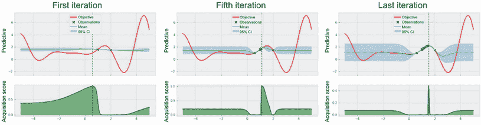

图 4.13 是 PoI 策略的进展情况。由于该策略旨在追求任何数量的改进，进展停滞在接近 2 的局部最优点，我们未能探索其他搜索空间区域。

当使用优化辅助函数 optimize_acqf()时，BoTorch 会发出警告。

当在上一页中运行 BayesOpt 与 PoI 的代码时，您可能会收到 BoTorch 发出的以下警告：

```py
RuntimeWarning: Optimization failed in
`gen_candidates_scipy` with the following warning(s):
[OptimizationWarning('Optimization failed within `scipy.optimize.minimize`
with status 2 and message ABNORMAL_TERMINATION_IN_LNSRCH.')]
Trying again with a new set of initial conditions.
  warnings.warn(first_warn_msg, RuntimeWarning)
```

当帮助函数 optimize_acqf()（具体来说是线搜索子程序）未能成功优化收集得分（在这种情况下为 PoI 得分）时，会显示此警告。当收集得分函数高度不平滑时（例如，在图 4.13 的最后一个面板中，*x*=1.5 周围出现了一个尖峰），数值优化不稳定，这种故障经常发生。

不用详细了解优化例行程序，我们可以在使用 optimize_acqf()时增加重启次数(num_restarts 参数)和原始样本数(raw_samples 参数)，这样可以增加发现拥有最高收集得分的数据点的机会。

为了便于讲解，从现在开始，在我们的代码中运行帮助函数 optimize_acqf()时，我们关闭此警告，使用警告模块中的上下文管理器：

```py
with warnings.catch_warnings():
    warnings.filterwarnings('ignore', category=RuntimeWarning)
    next_x, acq_val = botorch.optim.optimize_acqf(...)
```

注意 尽管图 4.13 中的 PoI 表现可能令人失望（毕竟，我们已经花了很多时间构建这个看起来过度利用的 PoI 策略），但分析发生的情况将为我们提供改进性能的见解。

我们注意到，虽然 PoI 停留在局部最优点，但它正在实现其所需的功能。具体来说，由于 PoI 旨在改善当前的 incumbent，因此策略发现缓慢向右移动将以较高的概率实现这一目标。虽然 PoI 通过缓慢移动不断发现更多的改进，但我们将这种行为视为过度利用，因为该策略没有充分探索其他区域。

重要 换句话说，即使 PoI 正在做的事情符合我们最初想要实现的目标——即从在职者中进行改进，但结果的行为并不是我们想要的。这意味着，单纯追求从在职者处的任何改进都不是我们所关心的。

修复这种过度利用行为有两种方法。第一种是限制我们所说的 *改进* 的含义。我们对 PoI 的实验表明，在每次迭代中，策略只会通过缓慢朝着 GP 认为函数向上移动的方向移动，从现有状况中找到微小的改进。

如果我们重新定义所谓的 *改进*，即只有当改进比当前现有状况值至少大 *ε* 时才有效，并相应修改 PoI，那么策略将更有可能更有效地探索搜索空间。这是因为 GP 将知道停留在局部最优点不会导致与现有状况的显著改进。图 4.14 说明了这个想法。

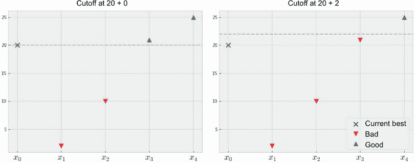

图 4.14 通过要求改进至少为 *ε* = 0（左）和 *ε* = 2（右）来定义对 *改进* 更严格的定义。要求越大，PoI 策略就越具有探索性。更多细节请参见练习 1。

我们不会在这里深入讨论，但练习 1 探讨了这种方法。有趣的是，我们会观察到要求 PoI 观察到的改进越多，策略就越具有探索性。

## 4.3 优化改进的预期值

如前一节所示，天真地试图从现有状况中寻求改进会导致来自 PoI 的过度利用。这是因为简单地沿着适当方向微移离开现有状况就能获得高的 PoI。因此，优化这个 PoI *并不* 是我们想要做的。在本节中，我们将学习进一步考虑我们可能观察到的改进的 *幅度*。换句话说，我们也关心我们能从现有状况中获得多少改进。这将引导我们进入最流行的贝叶斯优化策略之一：*期望改进*（EI）。

寻求考虑改进幅度的动机是明确的。考虑图 4.15 中的例子。

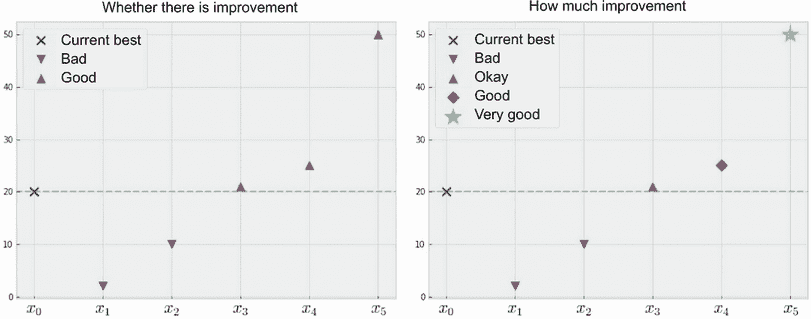

图 4.15 PoI（左）和 EI（右）之间的差异。前者只关心我们是否从现有状况改进，而后者考虑了改进的幅度。

左侧面板显示了 PoI 策略的计算，它只考虑每个候选数据点是否从现有状况改进。因此，稍微改进和显着从现有状况改进的点被平等地对待。

另一方面，右侧面板展示了如果我们还考虑可能改进的幅度会发生什么。在这里，虽然点 *x*[1] 和 *x*[2] 仍然被视为不理想（因为它们并未从现有状况 *x*[0] 改进），但 *x*[4] 被认为比 *x*[3] 更好，因为前者提供了更大的改进。同样，*x*[5] 被认为是五个候选点中最好的。

当然，这并不意味着我们现在可以简单地设计选择从现有指标获得最大改进的策略。我们仍然需要知道我们将观察到多少（如果有的话）改进，这只有当我们实际查询目标函数时才能发现。

注意 尽管我们不知道我们将观察到的改进的确切值，但我们可以以概率的方式推断每个候选点的改进量的大小。

回想一下，在图 4.9 和 4.10 中，我们有一个表示在给定点观察到的改进的截断正态分布。通过计算突出显示区域的面积，我们获得了一个点将从现有指标改进的概率，从而得到了 PoI 策略。然而，我们也可以执行其他计算。

定义 除了 PoI 之外，我们还可以计算与突出显示区域对应的随机变量的*期望值*。我们处理截断正态分布的事实使我们能够以封闭形式计算这个期望值。使用这个度量来评分数据点的 BayesOpt 策略被称为*期望改进*（EI）。

虽然 EI 得分的闭式公式不像 PoI 那样简单，但 EI 的评分公式仍然很容易计算。直观地说，使用改进的期望值可能比 PoI 更好地平衡探索和利用。毕竟，周围的点可能以很高的概率改进，但它们的改进可能很小（这是我们在实验中经验性地观察到的）。

一个远离我们不太了解的点可能会给出较低的改进概率，但因为有机会这个点会有较大的改进，EI 可能会给它分配较高的分数。换句话说，虽然 PoI 可能被认为是一种风险规避的 BayesOpt 策略，它关心的是从现有指标改进，无论改进有多小，但 EI 在风险和回报之间平衡，找到最好平衡权衡的点。图 4.16 对比了使用相同数据集和训练的 GP 的 PoI 和 EI。

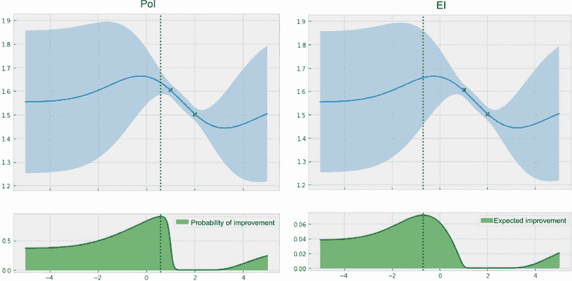

图 4.16 显示了 PoI（左）和 EI（右）之间的区别。EI 更好地平衡了探索和利用。

我们看到 PoI 选择的候选数据点（大约在 0.6 附近）与 EI 选择的数据点（大约在 –0.7 附近）不同。前者接近当前的指标，因此查询它有助于我们改进的可能性较大。然而，EI 看到远离现有指标的其他区域存在更大的不确定性，这可能导致更大的改进。由于这种推理，EI 更倾向于提供更好的探索和利用平衡的数据点。

EI 的另一个好的特性是它如何给具有相同预测均值或标准差的数据点分配获取分数。具体而言，它通过以下方式来实现:

+   如果两个数据点具有相同的预测均值但不同的预测标准差，那么具有更高不确定性的数据点将获得更高的分数。因此，该策略奖励探索。

+   如果两个数据点具有相同的预测标准差但不同的预测均值，那么具有更高均值的数据点将获得更高的分数。因此，该策略奖励开发。

这是 BayesOpt 策略的一个期望，因为它表达了我们在一切相等时对探索的偏好（即当预测均值相等时）但也表达了我们在一切相等时对开发的偏好（即不确定性相等时）。我们在第五章中再次可以看到这一特性，另一种 BayesOpt 策略称为*置信上界*。

从计算上讲，我们可以使用几乎与 PoI 代码相同的代码将 EI 初始化为 BayesOpt 策略对象:

```py
policy = botorch.acquisition.analytic.ExpectedImprovement(
    model, best_f=train_y.max()
)
```

现在，让我们使用 EI 策略重新运行整个 BayesOpt 循环，确保我们从相同的初始数据集开始。这产生了图 4.17，与 PoI 的图 4.13 进行比较。

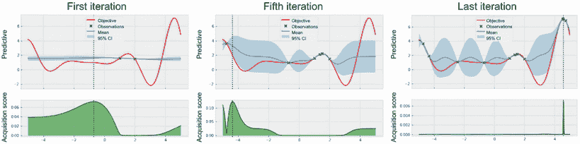

图 4.17 显示了 EI 策略的进展。与 PoI 相比，该策略在探索和开发之间取得了更好的平衡，并在最后找到了全局最优解。

在这里，我们可以看到，尽管 EI 最初仍然集中在 2 附近的局部最优区域，但策略很快探索了搜索空间中的其他区域，以寻找对现有情况的更大改进。在第五次迭代中，我们可以看到我们现在正在检查左侧的区域。最后，在使用了所有的 10 个查询之后，EI 成功地确定了目标函数的全局最优解，优于上一节的 PoI。

注意：由于其简单性和在探索和开发之间的自然平衡，EI 是 BayesOpt 中最常用的策略之一，如果没有其他原因可以优先选择其他策略，该策略是一个很好的默认选择。

## 4.4 练习

本章中有两个练习:

1.  第一个练习涵盖了使用 PoI 进行探索，通过改变我们对改进的定义。

1.  第二个示例涵盖了使用 BayesOpt 进行超参数调整，目标函数模拟了 SVM 模型的精度曲面。

### 4.4.1 练习 1：通过 PoI 促进探索

解决 PoI 过度开发的一个方法是设定更高的标准来确定什么是*改进*。具体来说，我们发现单纯地找到最大化从现状改进的可能性的点会阻止我们摆脱局部最优解。

作为解决方案，我们可以修改策略以指定我们仅接受至少 *ε* 的改进。这将指导 PoI 在局部区域已经足够覆盖后，在搜索空间中寻找改进的其他区域。在 CH04/02 - Exercise 1.ipynb 中实现此练习，并演示其对 PoI 的积极影响。其步骤如下：

1.  重新创建 CH04/01 - BayesOpt loop.ipynb 中的 BayesOpt 循环，其中将一维的 Forrester 函数作为优化目标。

1.  在实现 BayesOpt 的 `for` 循环之前，声明一个名为 `epsilon` 的变量。此变量将作为鼓励探索的最小改进阈值。暂时将此变量设置为 0.1。

1.  在 `for` 循环内，像以前一样初始化 PoI 策略，但这次指定由 `best_f` 参数设置的现任阈值为现任值 *加上* 存储在 `epsilon` 中的值。

1.  重新运行笔记本，并观察此修改是否比原始 PoI 策略更好地促进了更多的探索。

1.  PoI 变得更具探索性的程度在很大程度上取决于存储在 `epsilon` 中的最小改进阈值。将此变量设置为 0.001，观察当改进阈值不够大时是否能成功促进探索。当此值设置为 0.5 时会发生什么？

1.  在上一步中，我们看到将改进阈值设置为适当的值对 PoI 非常关键。然而，如何在多个应用和目标函数中进行这样的设置并不明显。一个合理的启发式方法是将其动态设置为现任值的某个 α 百分比，指定我们希望看到现任值增加 1 + α。在代码中实现这一点，并设置 110% 的改进要求。

### 4.4.2 练习 2：用于超参数调整的 BayesOpt

此练习，在 CH04/03 - Exercise 2.ipynb 中实现，将 BayesOpt 应用于模拟 SVM 模型超参数调整任务的准确度表面的目标函数。*x*-轴表示惩罚参数 *C* 的值，而 *y*-轴表示 RBF 核参数 *γ* 的值。有关更多详细信息，请参阅第三章中的练习。步骤如下：

1.  重新创建 CH04/01 - BayesOpt loop.ipynb 中的 BayesOpt 循环：

    1.  我们不再需要 Forrester 函数；相反，复制第三章中练习描述的二维函数的代码，并将其用作目标函数。

    1.  请注意，此函数的定义域为 [0, 2]²。

1.  使用 `xs` 声明相应的测试数据，表示域的二维网格，`ys` 表示 `xs` 的函数值。

1.  修改可视化优化进展的辅助函数。对于一维目标函数，很容易可视化 GP 预测以及收购积分。对于这个二维目标，该辅助函数应生成两个面板的绘图：一个显示基本事实，另一个显示获得分数。两个面板也应显示标记数据。绘图应类似于图 4.18。

    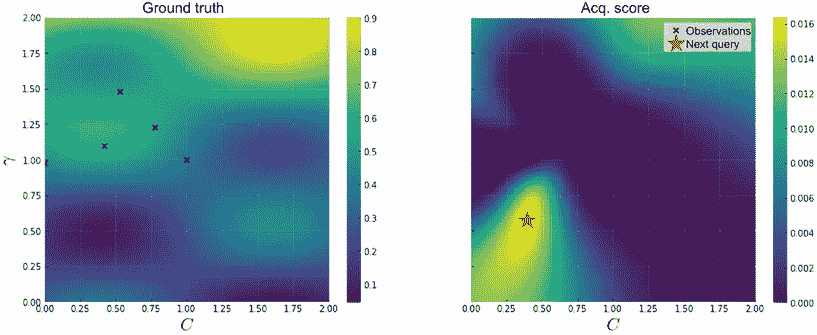

    图 4.18 一个参考，显示可视化 BayesOpt 进展的辅助函数应该是什么样子。左面板显示真实的目标函数，而右面板显示收购分数。

1.  从第三章的练习中复制 GP 类，该类使用 ARD 实现 Matérn 2.5 核。进一步修改此类，使其与 BoTorch 集成。

1.  复用辅助函数 `fit_gp_model()` 和实现 BayesOpt 的 `for` 循环：

    1.  初始培训数据集应包含域中心的点：(1, 1)。

    1.  由于我们的搜索空间是二维的，请在 `botorch.optim.optimize_acqf()` 中设置 `num_restarts=40` 和 `raw_samples=100`，以更详尽地搜索最大化收购分数的点。

    1.  将我们可以查询的数量设置为 20（我们可以评估目标函数的次数）。

1.  对这个目标函数运行 PoI 策略。注意到该策略再次陷入了局部最优。

1.  运行修改后的 PoI，其中最小改进阈值设置为 0.1：

    1.  参见练习 1，了解有关为 PoI 设置最小改进阈值的更多详细信息。

    1.  注意到此修改再次导致更好的优化性能。

    1.  在哪一轮迭代中达到了至少 90% 准确度？实现此准确度的模型参数是什么？

1.  对这个目标函数运行 EI 策略：

    1.  注意到这种策略优于 PoI。

    1.  在达到至少 90% 的准确度的第一轮迭代是什么？实现此准确度的模型参数是什么？

1.  检查基于单次 BayesOpt 运行的策略的性能可能会引导错误结论。更好地进行多次 BayesOpt 实验，使用不同的起始数据重复实验：

    1.  实现重复实验的想法，并可视化 10 个实验中的平均入职价值和误差线。

    1.  每个实验都应从搜索空间中均匀抽样的单个数据点开始。

    1.  运行我们列出的策略，比较它们的性能。

这标志着我们关于改进的基于 BayesOpt 策略的章节的结束。重要的是要记住在这里使用 Forrester 函数实现 BayesOpt 循环的代码，因为我们将在未来的章节中再次使用它来基准测试其他策略。具体来说，在第五章中，我们将了解受多臂老虎机问题启发的 BayesOpt 策略。

## 总结

+   贝叶斯优化策略使用训练后的高斯过程来评分每个数据点在我们寻找目标函数最优解的过程中的价值。策略计算的得分被称为获取得分。

+   在贝叶斯优化循环的每次迭代中，基于观察到的数据来训练高斯过程，策略建议一个新的数据点来查询，并且将此点的标签添加到训练集中。这个过程重复进行，直到我们不能再进行任何函数评估为止。

+   GPyTorch 模型只需要进行最小的修改就可以集成到实现贝叶斯优化策略的 BoTorch 中。

+   BoTorch 提供了一个名为`optimize_acqf()`的帮助函数，该函数来自优化模块`optim .optimize`，它接受一个策略对象，并返回最大化获取得分的数据点。

+   一个好的贝叶斯优化策略需要平衡探索（学习高度不确定的区域）和利用（缩小高绩效区域）。

+   不同的贝叶斯优化策略以不同的方式处理探索-利用的权衡。检查优化进度以分析和调整所使用策略的性能是很重要的。

+   在贝叶斯优化中可能使用的一种启发式方法是找到比最佳值更好的点。

+   寻找能够最有可能从最佳值改进的点得到了 PoI 策略。

+   寻找从最佳值改进的期望提高最高的点得到了 EI 策略。

+   PoI 可以被认为是一种过度的利用和风险规避的策略，因为该策略仅仅旨在从最佳值改进，无论改进多小。没有任何进一步的修改，EI 往往比 PoI 更好地平衡探索和利用。

+   由于对函数值的高斯信念，通过 PoI 和 EI 计算分数可以在闭合形式下完成。因此，我们可以轻松地计算和优化这些策略定义的分数。
