# 第六章：使用老虎机风格策略探索搜索空间

本章涵盖了

+   多臂老虎机问题及其与 BayesOpt 的关系

+   在 BayesOpt 中的上限置信度策略

+   在 BayesOpt 中的 Thompson 抽样策略

在赌场应该玩哪台老虎机以最大化你的收益？你如何制定一个策略，智能地尝试多台老虎机并缩小最有利可图的机器？这个问题与 BayesOpt 有什么关系？这些是本章将帮助我们回答的问题。

第四章是我们对 BayesOpt 策略的介绍，它决定了如何探索和检查搜索空间。BayesOpt 策略的探索策略应该指导我们朝着我们想要优化的目标函数的最优解前进。我们学到的两个特定策略是改进概率（PoI）和期望改进（EI），它们利用了我们希望从到目前为止看到的最佳目标值中改进的想法。这种基于改进的思维方式只是一种启发式方法，因此并不构成 BayesOpt 的唯一方法。

在本章中，我们学习了另外两个直接来自于与决策制定问题密切相关的 *多臂老虎机*（MAB）的 BayesOpt 策略。作为在赌场玩哪台老虎机最有利可图的问题，MAB 问题为许多决策不确定性问题设置了舞台。MAB 有着悠久的历史和广泛的研究，为这个问题开发了许多良好的解决方案。正如我们在本章中所学到的，MAB 和 BayesOpt 是非常相似的问题——都处理决策不确定性的优化——因此预期是 MAB 问题的解决方案也将在 BayesOpt 上表现良好。

首先，我们简要讨论 MAB 问题及其与 BayesOpt 的关系。这个讨论提供了一些关于问题的背景，并将 BayesOpt 与 AI 中的其他问题联系起来。然后，我们学习了 MAB 中两个最流行的策略，并将它们应用到 BayesOpt 中。第一个是 *上限置信度* 策略，它使用 *面对不确定性的乐观主义* 原则来推断其决策。第二个策略被称为 *Thompson 抽样*，它是一种主动利用我们预测模型的概率性质的随机化解决方案。然后，我们在我们的运行示例上实现并运行这些策略，并分析它们的性能。

通过本章末尾，我们对 MAB 问题及其与 BayesOpt 的关系有了了解。更重要的是，我们将 BayesOpt 策略的投资组合增加了两项，使我们暴露于在黑盒优化问题中探索搜索空间的更多方式。

## 5.1 MAB 问题简介

在本节中，我们从高层次学习 MAB 问题。我们首先讨论它的问题陈述和设置在第一小节。

重要提示 在 MAB 问题中，我们需要在一个长时间段内每一步选择一个要采取的动作。每个动作根据未知的奖励率产生奖励，我们的目标是在长时间段结束时最大化我们获得的总奖励。

我们还探讨了它与 BayesOpt 的关系，以及 AI 和 ML 中的其他问题。这为我们提供了背景，将 MAB 与文本的其余部分联系起来。

### 5.1.1 寻找赌场最好的老虎机

虽然*多臂老虎机*可能在你的脑海中勾起神秘的形象，但这个术语实际上指的是一个赌徒在赌场选择玩哪些老虎机以获取最大奖励的问题。想象一下，你在一家赌场，有一台可以拉动“手臂”的老虎机。

拉动老虎机的手臂时，你可能会得到硬币作为奖励；但是，这个过程中存在随机性。具体来说，在这台老虎机的内部机制中编程了一个奖励概率*p*。每次拉动机器的手臂时，机器都会根据该概率返回硬币。这台老虎机在图 5.1 中可视化。如果*p*=0.5，则该机器向其玩家奖励一半的时间。如果*p*=0.01，则大约只有 100 次拉动中的 1 次会导致返回硬币。由于这个概率被编程在机器内部——因此隐藏在我们看不见的地方——我们无法确定这个概率是多少。

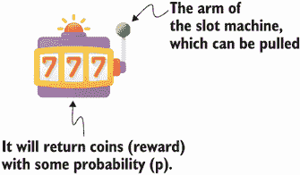

图 5.1 一个带有可以拉动手臂的老虎机。当拉动手臂时，根据其奖励概率，该机器可能返回硬币。

在这个假设的情景中，赌场调整其老虎机的程序，以便这些机器向玩家奖励硬币的速度低于玩家所玩的机器和收到硬币的机器。换句话说，即使偶尔会有赢家从这些老虎机中获得奖励，平均而言，赚取利润的是赌场。

定义 特别不成功的玩家，他们比赢得硬币的速度更快地失去硬币，可能会不情愿地称呼他们一直在玩的老虎机为“强盗”，认为机器在偷他们的钱。由于这台机器有一个可以拉动的手臂，因此可以称为*单臂强盗*。

现在，想象一下，不只是一个老虎机，而是一排我们可以选择玩的老虎机，每个都有自己的奖励概率*p*，如图 5.2 所示。

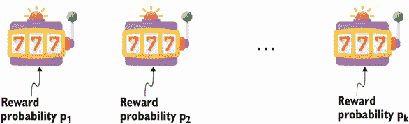

图 5.2 一个带有可以拉动手臂的老虎机。当拉动手臂时，根据其奖励概率，该机器可能返回硬币。

对于这一排老虎机，一个有战略眼光的玩家可能会将这种设置转化为一个决策挑战，并试图以某种智能的方式尝试这些老虎机，以便尽快确定哪台老虎机具有最高的奖励概率。他们的目的是在只能拉动这些机器的手臂特定次数的情况下最大化他们获得的奖励量。

定义 这个决策问题被称为*多臂老虎机*（或 MAB），因为我们可以拉动多个手臂。目标是设计一个策略，决定接下来应该拉动哪个机器的手臂，以最大化我们最终获得的总奖励。

我们发现 MAB 具有许多不确定性优化问题的特征，例如 BayesOpt：

+   *我们可以采取具体的行动*。每个行动对应于拉动特定老虎机的手臂。

+   *我们有限的预算*。我们只能在特定次数内拉动这些手臂，直到我们不得不停止。

+   *在可能采取的行动的结果中存在不确定性*。我们不知道每台老虎机的奖励概率是多少，甚至在我们多次拉动其手臂之前我们也无法估计。此外，拉动手臂后，我们不能确定是否会收到硬币，因为奖励中存在随机性。

+   *我们想要为一个目标进行优化*。我们的目标是最大化*累积奖励*，即我们在拉动这些机器的手臂直到停止时收到的硬币总数。

或许最重要的是，在 MAB 中，我们面临与我们在 4.1.2 节中讨论的探索-利用权衡相同的问题。特别是，每次我们决定拉动一台机器的手臂时，我们需要在迄今为止给我们较好成功率的机器（利用）和其他奖励概率我们了解不多的机器（探索）之间做出选择。

我们面临的问题是一个权衡，因为通过探索，我们可能会冒着将我们的拉动浪费在奖励概率低的机器上的风险，但过度利用意味着我们可能会完全错过一个奖励率比我们目前观察到的更高的机器。图 5.3 展示了一个例子，其中以下情况为真：

1.  我们在第一台机器上拉了 100 次手臂，收集了 70 枚硬币。也就是说，迄今为止第一台机器提供的经验成功率最高，为 70%。

1.  我们从第二台机器收集了更多数据，因此我们对其奖励率的不确定性最小，大约为 50%。

1.  尽管第三台机器的经验成功率最低（0%），但我们可能需要尝试更多次拉动它的手臂，以更确定其奖励率。


图 5.3 一个展示探索-利用困境的 MAB 数据集示例。MAB 策略必须在一个成功率持续高的机器和一个奖励率不确定的机器之间做出选择。

与贝叶斯优化策略类似，多臂老虎机策略的工作是查看过去奖励的数据，并决定我们接下来应该拉动哪个臂，同时平衡探索和开发之间的权衡。多臂老虎机问题模拟了你可能在现实世界中看到的广泛应用的一系列应用场景：

+   在产品推荐中，引擎需要从商店中的许多产品中选择一个向用户推荐。每个产品都可以看作是一个老虎机的臂，拉动臂意味着引擎选择该产品向用户展示。如果用户点击了该产品的广告，我们可以视为收到了奖励，因为用户的点击是我们想要实现的目标。

+   许多资源管理问题可以被构建为多臂老虎机问题，其中我们需要考虑如何最好地将不同资源分配给不同的组织，以最佳地优化一些高级目标（例如，利润或生产力），而不知道每个组织的运作效果。投资组合管理也可以以同样的方式构建为多臂老虎机问题。

+   多臂老虎机问题也在临床试验设计中得到应用，其中每个患者需要被分配到特定的治疗中。我们希望优化所有患者的治疗结果，但需要处理有限的资源以及确定每个患者从给定治疗中受益的可能性。

在这些应用中，我们可以采取一组行动——也就是说，一组可以拉动的臂——以在不确定性下优化一个目标。

### 5.1.2 从多臂老虎机到贝叶斯优化

我们已经看到多臂老虎机和贝叶斯优化具有许多共同的特征。在这两个问题中，我们需要思考我们应该采取什么决策，以便我们可以最大化我们关心的数量。此外，每个行动的结果都不是确定的。这意味着我们不知道一个行动是否会产生好的结果，直到我们真正采取行动为止。

但是，这两个问题并不相等。在多臂老虎机问题中，我们的目标是随着时间的推移最大化*累积奖励*——也就是说，接收到的硬币总数。而在贝叶斯优化中，我们只是寻找一个导致高价值的函数输入；只要我们收集的数据集中有一个良好的目标值，我们就会成功优化。这种单值目标有时被称为*简单奖励*。这种差异意味着我们需要确保在多臂老虎机问题中频繁地获得奖励，以维持良好的累积奖励，而在贝叶斯优化中，我们可以更加勇于探索，以潜在地找到一个良好的目标值。

定义术语*简单奖励*并不意味着目标更容易或更简单地优化，而是目标是一个单一的数字，而不是累积奖励的总和。

此外，在多臂老虎机中只有有限数量的动作可供选择（我们可以拉动的手臂数量有限）。在 BayesOpt 中，由于我们试图优化连续域中的目标函数，有无限多个动作。由于我们假设使用 GP 时接近点的函数值彼此相似，我们可以将这看作是彼此接近的动作产生类似的奖励率。这在图 5.4 中有所说明，其中每个微不足道的点都是我们可以拉动其手臂的老虎机（即，查询目标函数值），彼此接近的机器具有相似的颜色。

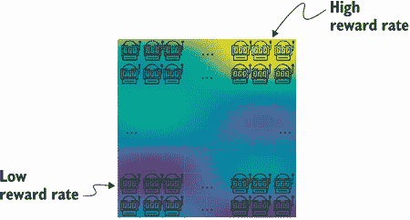

图 5.4 BayesOpt 类似于具有无限多个动作的 MBA 问题。每个微不足道的点都是一个老虎机，我们可以拉动其手臂。此外，彼此接近的机器在某种意义上是相关的，因为它们具有类似的奖励率。

大多数多臂老虎机问题的形式化考虑了二进制设置，即拉动老虎机时，要么返回一个硬币，要么什么也不返回。另一方面，在 BayesOpt 中我们可能观察到的函数值可以取任意实数值。

多臂老虎机和 BayesOpt 之间的主要区别在表 5.1 中总结。虽然这些是根本性的差异，但在决策中探索和利用之间的权衡在两个问题中都存在，因此将多臂老虎机策略重新用于 BayesOpt 是合理的。

表 5.1 多臂老虎机和 BayesOpt 之间的区别

| 标准 | 多臂老虎机 | BayesOpt |
| --- | --- | --- |
| 要最大化的目标 | 累积奖励 | 简单奖励 |
| 观察/奖励类型 | 二进制 | 实值 |
| 动作数量 | 有限 | 无限 |
| 动作之间的相关性 | 否 | 是对于相似的动作 |

在本章的其余部分，我们将学习两种这样的策略，它们背后的动机以及如何使用 BoTorch 实现它们。我们将在下一节从上置信界限策略开始。

## 5.2 在上置信界限策略下面对不确定性的乐观主义

我们应该如何考虑在特定位置评估目标函数时可能观察到的无限多种可能性的值？此外，我们应该如何以简单、高效的方式推理这些可能性，以促进决策？在本节中，我们探讨了多臂老虎机中的*上置信界限*（UCB）策略，该策略导致了同名的 BayesOpt 策略。

UCB 遵循*面对不确定性的乐观主义*原则。在多臂老虎机中，思想是使用每个老虎机奖励率的估计上界作为真实的未知奖励率的替代品。也就是说，我们乐观地估计每台机器的奖励率，使用我们认为的奖励率的上界，最后选择具有最高上界的机器。

我们首先讨论这个原则以及它如何辅助我们的决策推理。然后，我们学习如何使用 BoTorch 实现 UCB 策略并分析其行为。

### 5.2.1 不确定情况下的乐观主义

让我们举个简单的例子来具体说明这个想法。假设你某一天醒来发现外面虽然是晴天，但地平线上有乌云。你查看手机上的天气应用程序，看看今天是否会一直晴朗，以及是否应该带伞上班以防下雨。不幸的是，该应用程序无法确切地告诉你天气是否会晴朗。相反，你只能看到晴天的概率估计在 30%到 60%之间。

你心里想，如果晴天的概率低于 50%，那么你会带伞。然而，这里并不是一个单一值的估计，而是一个介于 30%到 60%之间的范围。那么，你应该如何决定是否需要带伞呢？

悲观主义者可能会说，因为晴天的概率可能只有 30%，所以你应该采取保险措施，做最坏的打算。考虑平均情况的人可能会进一步研究应用程序，看看晴天的平均估计概率是多少，然后做出相应的决定。而从乐观主义者的角度来看，60%的机会足以让人相信天气会晴朗，所以这个人不会打算带伞去上班。这些思考方式如图 5.5 所示。

在图 5.5 中，第三个人的推理对应于 UCB 策略背后的思想：对未知事件的结果持乐观态度，并根据这种信念做出决策。在多臂老虎机问题中，UCB 会构建每个老虎机奖励率的上限，并选择具有最高上限的老虎机。


图 5.5 关于未来思考和做出决策的不同方式。最后一个人对应于 UCB 策略，以乐观的方式推理一个未知量。

注：在 BayesOpt 中实现这一策略的方式特别简单，因为我们使用高斯过程作为目标函数的预测模型，我们已经有了每个动作的奖励率的上限。也就是说，我们已经有了在任何给定输入位置的目标值的上限。

具体来说，我们知道给定位置的目标值遵循正态分布，而量化正态分布不确定性的常用度量是 95% CI，其中包含分布的 95% 的概率质量。使用 GP，我们将该 95% CI 在输入空间中可视化为图 5.6 中粗线。该 95% CI 的上限，也就是图 5.6 中突出显示的阴影区域的上边界，正是 UCB 策略将用作搜索空间中数据点的获取分数的上边界，并且给出最高分数的点是我们将评估下一个目标函数的位置，这在本例中是由虚线围绕的位置约为 –1.3。

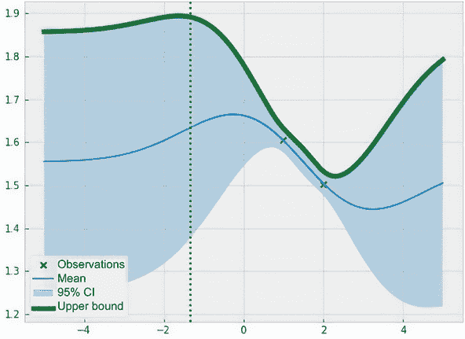

图 5.6 对应于 95% CI 的 GP 的 UCB。此边界可用作 UCB 策略的获取分数。

*获取分数* 的定义量化了数据点在引导我们朝着目标函数的最优值的过程中的价值。我们首次在 4.1.1 节了解到了获取分数。

您可能认为这种决策方式可能不合适，特别是在决策成本高昂的高风险情况下。在我们的伞例子中，通过乐观地低估下雨的概率，您可能会冒着没有伞就被雨淋的风险。

然而，这是一种特别高效的推理方式，因为我们只需要提取我们对感兴趣数量的估计的一个上界，并将该边界用于决策。此外，正如我们在下一小节中看到的那样，通过选择我们想要使用的 CI（而不是坚持使用 95% CI），我们完全控制 UCB 有多乐观。这种控制还允许策略平衡探索和利用，这是任何 BayesOpt 策略需要解决的核心问题。

### 5.2.2 平衡探索和利用

在本小节中，我们进一步讨论了我们，BayesOpt 用户，如何调整 UCB 策略。这提供了一种在高不确定性区域（探索）和高预测均值区域（利用）之间平衡的控制水平。这次讨论旨在在下一小节 BoTorch 实现之前更深入地理解 UCB。

请记住，对于正态分布，从平均值（即，均值 *μ* 加/减 2 倍标准差 σ）偏离两个标准偏差会给我们带来 95% CI。这个区间的上限（*μ* + 2σ）就是我们在上一小节中看到的 UCB 的获取分数。

95% 置信区间（CI）不是正态分布的唯一 CI。通过在公式 *μ* + βσ 中设置标准差 σ 的乘法器（表示为 β），我们可以获得其他 CI。例如，在一维正态分布中，如图 5.7 所示，以下结论成立：

+   离均值上一个标准差（*μ* + σ）——即设置β = 1——给出了 68%的置信区间：正态分布的 68%的概率质量位于*μ* - σ和*μ* + σ之间。

+   同样，距离均值三个标准差（β = 3）给出了 99.7%的置信区间。

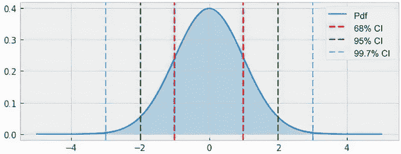

图 5.7 展示了标准正态分布的不同置信区间。从均值偏离一个、两个和三个标准差，我们得到了 68%、95%和 99.7%的置信区间。UCB 策略使用这些间隔的上界。

实际上，任何β的值都可以给我们一个唯一的正态分布置信区间。由于 UCB 只指示我们应该使用来自预测模型的上界来做决策，所以形如*μ* + βσ的任何值都可以作为 UCB 中使用的上界。通过设置此参数β，我们可以控制 UCB 策略的行为。

图 5.8 展示了对应于β = 1、2、3 的三个不同的上界，而事实上，均值函数对应于设置β = 0\. 我们可以看到，尽管上界的形状大致相同，但这些上界以不同的速率上下波动。此外，由于最大化此上界的数据点是 UCB 选择进行优化查询的点，不同的上界，即不同的β值，将导致不同的优化行为。

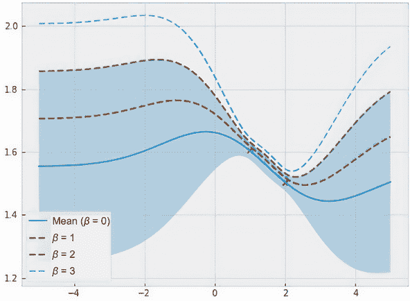

图 5.8 展示了 GP 的不同上界，对应不同的置信区间和β值。β越大，UCB 策略就越趋向于探索性。

重要的是，β越小，UCB 就越趋向于剥削性。相反，β越大，UCB 就越趋向于探索性。

我们可以通过检查获取分数的公式*μ* + βσ来看到β值控制 UCB 行为的方式。当β值很小时，平均值*μ*对获取分数做出的贡献最大。因此，具有最高预测均值的数据点将最大化此分数。此选择对应纯粹的剥削性，因为我们只是选择具有最大预测值的点。另一方面，当β值很大时，标准差σ，即量化我们的不确定性，在 UCB 分数中变得更加重要，强调了探索的需求。

我们可以从图 5.8 中看出这个差异，其中 0 附近是我们实现最高预测均值的地方，表明这是开发区域。随着β的增加，不同上界峰值所在的点逐渐向左移动，在这里我们的预测更加不确定。

注意有趣的是，在β → ∞的极限情况下，最大化 UCB 获取分数的点是使标准差σ最大化的点，即我们的不确定性最大化的点。这种行为对应纯粹的探索性，因为我们选择具有高度不确定性的数据点。

最后，UCB 正确地为提供在探索和开发之间提供更好平衡的数据点分配更高的分数：

+   如果两个数据点具有相同的预测均值但不同的预测标准差，则具有较高不确定性的数据点将具有更高的分数。因此，该策略奖励探索。

+   如果两个数据点具有相同的预测标准差但不同的预测均值，则具有较高均值的数据点将具有更高的分数。因此，该策略奖励利用。

记住，在第四章讨论的策略中，EI 也具有这种特性，这是任何贝叶斯优化策略的期望。

总的来说，这个参数 β 控制 UCB 以及策略如何探索和利用搜索空间。这意味着通过设置该参数的值，我们可以直接控制其行为。不幸的是，除了 β 的值对应于探索程度这一事实之外，没有一种直观的、原则性的方法来设置该参数，某些值可能在某些问题上有效，但在其他问题上却无效。本章的练习 1 进一步讨论了一种更为复杂的设置 β 的方法，该方法可能通常工作得足够好。

注意 BoTorch 的文档通常显示 UCB 的 β = 0.1，而许多使用 UCB 进行贝叶斯优化的研究论文选择 β = 3。所以，如果你更偏向利用，0.1 可以是你使用该策略的首选值，如果你更倾向于探索，3 应该是默认值。

### 5.2.3 在 BoTorch 中实现

在充分讨论了 UCB 的动机和数学之后，我们现在学习如何使用 BoTorch 实现该策略。我们在这里看到的代码包含在 CH05/01 - BayesOpt loop.ipynb 中。请记住，虽然我们可以手动实现 PoI 策略，但声明 BoTorch 策略对象，将其与 GP 模型一起使用，并使用 BoTorch 的辅助函数 `optimize_acqf()` 优化获取分数，这样可以更轻松地实现我们的贝叶斯优化循环。

出于这个原因，我们在这里做同样的事情，并使用内置的 UCB 策略类，尽管我们可以简单地自己计算 μ + βσ 的数量。这可以通过以下方式完成

```py
policy = botorch.acquisition.analytic.UpperConfidenceBound(
    model, beta=1
)
```

在这里，BoTorch 中的 UCB 类实现将 GP 模型作为其第一个输入，并将正值作为其第二个输入 `beta`。正如你所料，这第二个输入表示 UCB 参数 β 在评分公式 μ + βσ 中的值，该公式在探索和利用之间进行权衡。在这里，我们暂时将其设置为 1。

注意 信不信由你，这就是我们需要从上一章的贝叶斯优化代码中更改的全部内容，以在我们拥有的目标函数上运行 UCB 策略。这展示了 BoTorch 模块化的好处，它允许我们将任何我们想要使用的策略插入我们的贝叶斯优化流程中。

使用 β = 1 运行我们的 UCB 策略在我们熟悉的 Forrester 目标函数上生成图 5.9，它显示了在 10 个函数评估过程中的优化进展。我们看到，与 PoI 策略发生的情况类似，对于 Forrester 函数来说，β = 1 的 UCB 未能充分探索搜索空间，并且在一个局部最优解上停滞不前。这意味着 β 的值太小。

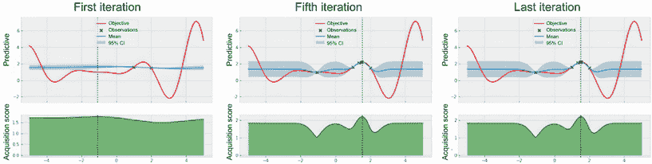

图 5.9 UCB 策略在权衡参数 β = 1 时的进展。参数值不足以鼓励探索，导致进展停滞在局部最优解。

注意：我们在第 4.2 节了解到了改进概率策略。

让我们再试一次，这次将这个权衡参数设置为一个更大的值：

```py
policy = botorch.acquisition.analytic.UpperConfidenceBound(
    model, beta=2
)
```

这个版本的 UCB 策略的进展如图 5.10 所示。这次，由于更大的 β 值引起的探索水平更高，UCB 能够找到全局最优解。然而，如果 β 太大，以至于 UCB 只花费预算来探索搜索空间，那么我们的优化性能也可能会受到影响。（我们稍后在本章练习中会看到一个例子。）

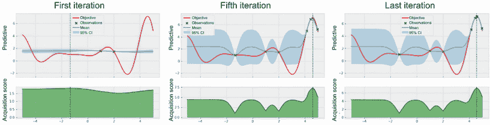

图 5.10 UCB 策略在权衡参数 β = 2 时的进展。该策略成功找到了全局最优解。

总的来说，使用 UCB 策略时，使用一个好的权衡参数值的重要性是明显的。然而，同样地，很难说什么值会对给定的目标函数起作用良好。本章的练习 1 探索了一种调整这个参数值的策略，随着搜索的进行。

这标志着我们对 UCB 的讨论结束了。我们已经看到，通过从多臂赌博问题中采用*面对不确定性的乐观态度*思维模式，我们得到了一个贝叶斯优化策略，其探索行为可以直接通过一个权衡参数进行控制和调整。在下一节中，我们将继续介绍从多臂赌博问题中采用的第二个策略，它具有完全不同的动机和策略。

## 5.3 使用 Thompson 采样策略进行智能采样

在这一节中，我们将学习关于多臂赌博问题中的另一种启发式方法，它直接转化为一个被广泛使用的贝叶斯优化策略，称为*Thompson 采样*（TS）。正如我们将看到的，这个策略使用了与 UCB 完全不同的动机，因此会引发不同的优化行为。与第 5.2 节中的 UCB 类似，我们先学习这个贝叶斯优化策略的一般思想，然后再进入其代码实现。

### 5.3.1 用一个样本来代表未知

使用 UCB，我们根据我们关心的未知量的乐观估计来做出决策。这提供了一种简单的方式来推理我们所采取的行动和我们所获得的奖励的后果，这种方式在探索和开发之间进行权衡。那么 TS 呢？

定义 Thompson sampling 的理念是首先维持我们关心的数量的概率信念，然后*从该信念中抽样*，并将该样本视为我们感兴趣的真实未知量的替代。然后使用这个抽样替代物来选择我们应该做出的最佳决策。

让我们回到我们的天气预报示例，看看这是如何运作的。同样，我们对是否应该带雨伞去工作的问题感兴趣，在这个问题中，我们得到了一份天气将全天保持晴朗的概率估计。请记住，UCB 依赖于这个估计的上限来指导其决策，但 TS 策略会做什么呢？

TS 首先从我们用来模拟未知数量的概率分布中抽取一个样本——在这种情况下，是否会晴朗——然后根据这个样本做出决策。假设我们手机上的天气应用现在宣布有 66%（大约三分之二）的机会天气会保持晴朗。这意味着在遵循 TS 策略时，我们首先抛一枚硬币，其正面有三分之二的倾向：

+   如果硬币是正面（有 66% 的几率），那么我们会把它视为天气全天晴朗，并得出我们不需要雨伞的结论。

+   如果硬币是反面（有 34% 的几率），那么我们会把它视为会下雨，并得出我们应该带雨伞去工作的结论。

这个 TS 过程在图 5.11 中被可视化为一个决策树，在开始时，我们抛一个有偏的硬币，以获取晴天的概率分布样本。根据硬币是正面（代表晴天的样本）还是反面（代表下雨的样本），我们决定是否要带雨伞去工作。

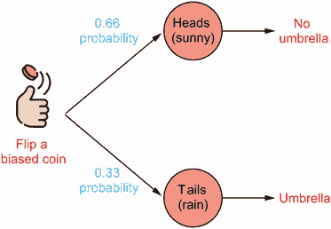

图 5.11 TS 策略作为决策树。我们抛一个有偏的硬币以获取晴天的概率分布样本，并根据此样本决定是否带雨伞。

虽然这乍一看可能是一种任意的决策方法，但 TS 在 MAB 和 BayesOpt 中特别有效。首先，鉴于表示感兴趣数量的概率分布，该分布的样本是该数量的可能实现，因此该样本可以用作分布的表示。在不确定性优化问题中，TS 提供了与 UCB 相同的好处，即从概率分布中抽样通常很容易。就像 UCB 对奖励率的乐观估计可能以高效的方式生成一样，抽样也可以同样高效地完成。

让我们考虑 TS 在 BayesOpt 中的工作原理。从在当前观察到的数据上训练的 GP 中绘制一个样本。从第三章记得，从 GP 中绘制的样本是表示我们的 GP 信念下目标函数特定实现的函数。然而，与在没有观察到数据的区域中未知的真实目标函数不同，从 GP 中绘制的样本是完全已知的。这意味着我们可以找到使得这个样本被最大化的位置。

图 5.12 显示了我们在 Forrester 函数上训练的 GP 及其绘制的三个样本作为虚线。此外，沿着每个样本，我们使用一个菱形来指示最大化样本的位置。正如我们所看到的，一个样本在 –3.2 处最大化，另一个在 –1.2 处最大化，第三个在 5 处。

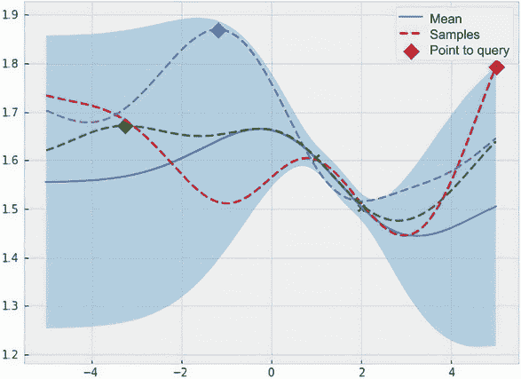

图 5.12 绘制自 GP 的样本和最大化相应样本的数据点。无论绘制哪个样本，TS 都会选择最大化该样本的数据点作为下一个要评估目标函数的点。

当使用 TS 策略时，完全是由偶然决定我们从 GP 中绘制这三个样本中的哪一个（或者一个完全不同的样本）。然而，无论我们绘制哪个样本，最大化样本的数据点都是我们将要查询的下一个点。也就是说，如果我们绘制出在 –3.2 处最大化的样本，那么我们将在 –3.2 处评估目标函数。如果我们绘制出在 5 处最大化的样本，那么我们将查询点 *x* = 5。

定义 TS 计算的获取分数是从 GP 中绘制的随机样本的值。最大化此样本的数据点是我们将要查询的下一个点。

与我们迄今为止见过的其他策略不同，TS 是一种*随机*策略，这意味着当面对相同的训练数据和 GP 时，不保证策略会做出相同的决定（除非我们在计算上设置了随机种子）。然而，这种随机性并不是一种不利。我们已经说过，从 GP 中绘制样本是很容易的，因此可以有效地计算 TS 获取分数。此外，对随机样本的最大化本质上在探索和利用之间取得平衡，这正是我们在 BayesOpt 中的主要关注点：

+   如果数据点有很高的预测均值，那么该数据点处的随机样本的值很可能很高，使其更有可能是最大化样本的那个数据点。

+   如果数据点具有较高的预测标准偏差（即不确定性），那么该数据点处的随机样本也将具有较高的变异性，因此更有可能具有较高的值。因此，这种更高的变异性也使得更有可能选择该数据点作为下一个要查询的点。

TS 可能利用具有高预测均值的区域中最大化的随机样本，但在相同情况下，该策略也可能利用另一个样本进行探索。我们在图 5.12 中看到了这一点，其中一个样本在–1.2 左右最大化，具有相对较高的预测均值。如果这是我们抽取的样本，那么通过在–1.2 处评估目标函数，我们将在利用函数。然而，如果我们抽取另外两个样本中的任何一个，那么我们将在探索，因为样本最大化的区域具有高的不确定性。

这是一个相当优雅的权衡方案。通过使用样本的随机性，TS 直接利用了我们预测模型 GP 的概率性质来探索和利用搜索空间。TS 的随机性意味着在 BayesOpt 循环的任何给定迭代中，该策略可能不会做出最佳决策以权衡探索和利用，但随着时间的推移，在其决策的聚合中，该策略将能够充分探索空间并缩小高性能区域。

### 5.3.2 使用 BoTorch 实现

现在让我们转而在 Python 中实现这个 TS 策略。再次提醒，代码包含在 CH05/01 - BayesOpt loop.ipynb 笔记本中。请记住，对于我们见过的 BayesOpt 策略，实现归结为声明一个 BoTorch 策略对象并指定相关信息。然后，为了找到下一个应该查询的数据点，我们优化策略计算出的获取分数。然而，这与 TS 不同。

实现 TS 作为通用的 PyTorch 模块的主要挑战是，从 GP 中取样只能使用有限数量的点。过去，我们用密集网格上的高维 MVN 分布的样本来表示 GP 的样本。当绘制这些密集高斯的样本时，它们看起来像是具有平滑曲线的实际函数，但实际上它们是在网格上定义的。

所有这些都是为了说，从 GP 中绘制函数样本在计算上是不可能的，因为这将需要无限数量的比特。一个典型的解决方案是在跨越输入空间的大量点上绘制相应的 MVN，以便搜索空间中的所有区域都得到表示。

重要提示：这正是我们实现 TS 的方法：在搜索空间中生成大量点，并从这些点上的 GP 预测中绘制 MVN 分布的样本。

TS 的流程总结在图 5.13 中，我们使用 *Sobol 序列* 作为跨度搜索空间的点。 （我们稍后讨论为什么 Sobol 序列优于其他采样策略。）然后，我们从这些点上的 GP 中抽取一个样本，并挑选出从样本中产生的值最高的点。 然后，该样本用于表示 GP 本身的样本，并且我们在下一步中评估目标函数在采样值最大化的位置处。

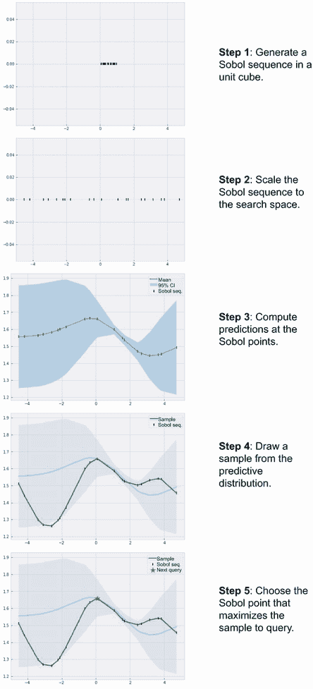

图 5.13 BoTorch 中 TS 实现的流程图。我们使用 Sobol 序列填充搜索空间，在序列上从 GP 中抽取一个样本，并选择使样本最大化的点以评估目标函数。

定义 *Sobol 序列* 是欧几里得空间中一个无限点列表，旨在均匀覆盖该区域。

让我们首先讨论为什么我们需要使用 Sobol 序列来生成跨度搜索空间的点。 一个更简单的解决方案是使用密集网格。 但是，随着搜索空间维数的增长，生成密集网格很快变得难以处理，因此这种策略是不可行的。 另一个潜在的解决方案是从该空间均匀采样，但是统计理论表明均匀采样实际上不是生成均匀覆盖空间的最佳方法，而 Sobol 序列则做得更好。

图 5.14 显示了一个由 100 个点组成的 Sobol 序列与在二维单位正方形内均匀采样的相同数量的点的比较。 我们看到 Sobol 序列覆盖正方形更均匀，这是我们希望使用 TS 实现的目标。 在更高维度中，这种对比更加明显，这更加增加了我们更喜欢 Sobol 序列而不是均匀采样数据点的理由。 我们这里不详细讨论 Sobol 序列； 对我们重要的是要知道 Sobol 序列是覆盖空间均匀的标准方法。

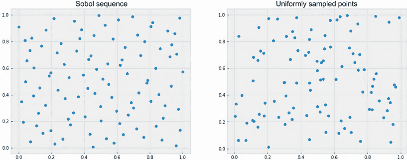

图 5.14 Sobol 序列中的点与二维单位正方形中均匀采样的点的比较。Sobol 序列覆盖正方形更均匀，因此应该被 TS 使用。

PyTorch 提供了 Sobol 序列的实现，可以如下使用：

```py
dim = 1                   ❶
num_candidates = 1000     ❷

sobol = torch.quasirandom.SobolEngine(dim, scramble=True)
candidate_x = sobol.draw(num_candidates)
```

❶ 空间的维数

❷ 要生成的点的数量

在这里，`sobol` 是 `SobolEngine` 类的一个实例，它实现了单位立方体中 Sobol 序列的采样逻辑，而 `candidate_x` 是形状为 `(num_candidates, dim)` 的 PyTorch 张量，其中包含了具有正确维度的生成点。

注意 重要的是要记住 `SobolEngine` 生成覆盖单位立方体的点。 要使 `candidate_x` 覆盖我们想要的空间，我们需要相应地调整此张量的大小。

Sobol 序列应该包含多少个点（即 `num_ candidates` 的值）由我们（用户）决定；前面的例子展示了我们使用的是 1,000。在典型情况下，您会想要一个足够大的值，以便搜索空间被足够覆盖。然而，一个值太大会使从后验 GP 中采样数值上不稳定。

绘制 GP 样本时的数值不稳定问题

在绘制 GP 样本时的数值不稳定性可能会导致我们在运行 TS 时出现以下警告：

```py
NumericalWarning: A not p.d., added jitter of 1.0e−06 to the diagonal
  warnings.warn(
```

这个警告表明，代码遇到了数值问题，因为 GP 的协方差矩阵不是正定 (`p.d.`) 的。然而，这个代码也应用了自动修复，其中我们向这个协方差矩阵中添加了 1e–6 的“抖动”，使矩阵成为正定的，所以我们用户不需要再做任何事情。

与我们在 4.2.3 节中所做的一样，我们使用 `warnings` 模块来禁用此警告，使我们的代码输出更干净，如下所示：

```py
with warnings.catch_warnings():
    warnings.filterwarnings('ignore', category=RuntimeWarning)
    ...            ❶
```

❶ TS 代码

您可以玩耍数千个点来找到最适合您的用例、目标函数和训练 GP 的数量。然而，您应该至少使用 1,000 个点。

接下来，我们转向 TS 的第二个组成部分，即从我们的后验 GP 中采样 MVN 并最大化它的过程。首先，实现取样的采样器对象可以被声明为：

```py
ts = botorch.generation.MaxPosteriorSampling(model, replacement=False)
```

BoTorch 中的 `MaxPosteriorSampling` 类实现了 TS 的逻辑：从 GP 后验中采样并最大化该样本。这里，`model` 指的是所观察数据上训练的 GP。重要的是将 `replacement` 设为 `False`，确保我们是无替换采样（替换采样不适用于 TS）。最后，为了获得在 `candidate_x` 中最大样本值的数据点，我们将其传递给采样器对象：

```py
next_x = ts(candidate_x, num_samples=1)
```

返回的值确实是最大化样本的点，这是我们下一个查询的点。有了这一点，我们的 TS 策略实现就完成了。我们可以将这个代码插入到迄今为止我们用于 Forrester 函数的贝叶斯优化循环中，并使用以下代码：

```py
for i in range(num_queries):
  print("iteration", i)
  print("incumbent", train_x[train_y.argmax()], train_y.max())

  sobol = torch.quasirandom.SobolEngine(1, scramble=True)           ❶
  candidate_x = sobol.draw(num_candidates)                          ❶
  candidate_x = 10 * candidate_x − 5                                ❷

  model, likelihood = fit_gp_model(train_x, train_y)

  ts = botorch.generation.MaxPosteriorSampling(model,
  ➥replacement=False)                                              ❸
  next_x = ts(candidate_x, num_samples=1)                           ❸

  visualize_gp_belief_and_policy(model, likelihood, next_x=next_x)  ❹

  next_y = forrester_1d(next_x)

  train_x = torch.cat([train_x, next_x])
  train_y = torch.cat([train_y, next_y])
```

❶ 从 Sobol 引擎生成点

❷ 调整生成的点的大小为 −5 到 5，即我们的搜索空间。

❸ 生成下一个要查询的 TS 候选

❹ 在没有采集函数的情况下可视化我们的当前进度

请注意，我们的 BayesOpt 循环的总体结构仍然相同。不同的是，我们现在有一个 Sobol 序列来生成涵盖我们搜索空间的点集，然后将其馈送到实现 TS 策略的 `MaxPosteriorSampling` 对象中，而不是 BoTorch 策略对象。变量 `next_x`，就像之前一样，包含我们将查询的数据点。

注意：由于在使用 `visualize_gp_belief_and_policy()` 辅助函数可视化过程中，我们没有 BoTorch 策略对象，因此不再指定 `policy` 参数。因此，该函数仅显示每个迭代中的训练好的 GP，而没有获取分数。

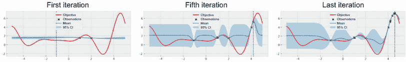

图 5.15 TS 策略的进展。该策略探索搜索空间一段时间后逐渐将关注点锁定在全局最优解上。

图 5.15 显示了 TS 的优化进展，我们可以观察到该策略成功地将关注点锁定在全局最优解上但不是不花费探索空间查询次数。这展示了 TS 在 BayesOpt 中协调探索和开发的能力。

我们讨论了基于 MAB 设置的策略所启发的 BayesOpt 策略。我们已经看到，我们学习的两个策略，UCB 和 TS，每个都使用自然启发式，以高效的方式推理未知量并相应地做出决策。BayesOpt 中的一个挑战，即探索和开发之间的平衡问题，也由这两种策略解决，使这些策略具有良好的优化性能。在本书第二部分的下一章节中，我们将学习另一种常用的启发式决策方法，即使用信息论。

## 5.4 练习

本章有两个练习：

1.  第一个练习探索了为 UCB 策略设置权衡参数的潜在方法，该方法考虑了我们在优化过程中的进展情况。

1.  第二个练习将本章中学习到的两个策略应用于先前章节中看到的超参数调整问题。

### 5.4.1 练习 1: 为 UCB 设置探索计划

此练习在 CH05/02 - Exercise 1.ipynb 中实现，讨论了一种自适应设置 UCB 策略的权衡参数 β 的方法。正如 UCB 部分中提到的那样，策略的表现严重依赖于此参数，但我们不清楚该如何设置其值。一个值在某些目标函数上可能效果很好，但在其他目标函数上效果很差。

BayesOpt 从业者已经注意到，随着我们收集越来越多的数据，UCB 可能会过于开发。这是因为随着训练数据集的大小增加，我们对目标函数的了解更多，GP 预测的不确定性也会减少。这意味着 GP 产生的 CI 将变得更紧，将 UCB 使用的获取分数的上限移动到了平均预测附近。

然而，如果 UCB 收获分数与平均预测相似，则该策略是开发性的，因为它只查询具有高预测平均值的数据点。这种现象表明，我们观察到的数据越多，我们对 UCB 的探索应该越多。这里，一种渐进的鼓励 UCB 更多探索的自然方式是慢慢增加权衡参数 β 的值，这是我们在这个练习中学习的，按照以下步骤进行：

1.  重新创建 CH04/02 - Exercise 1.ipynb 中的 BayesOpt 循环，将一维 Forrester 函数用作优化目标。

1.  我们旨在通过在循环的每个迭代中将其乘以一个常量来逐渐增加权衡参数 β 的值。也就是说，在每次迭代结束时，我们需要使用 `beta *= multiplier` 更新参数。

    假设我们希望β的值从 1 开始，并在搜索结束时（第十次迭代）达到 10。乘数β的值是多少？

1.  实现这个调度逻辑，并观察所得的优化性能：

    1.  特别是，尽管这个版本的 UCB 从β=1 开始，但它是否会像参数固定在 1 的版本一样陷入局部最优？

### 5.4.2 练习 2：BayesOpt 用于超参数调整

这个练习在 CH05/03 - Exercise 2.ipynb 中实现，将 BayesOpt 应用于超参数调整任务中支持向量机模型的准确率表面。*x*-轴表示罚项参数*C*的值，*y*-轴表示 RBF 核参数*γ*的值。有关更多详细信息，请参见第三章和第四章的练习。按照以下步骤进行：

1.  重新创建 CH04/03 - Exercise 2.ipynb 中的 BayesOpt 循环，包括实施重复实验的外层循环。

1.  运行 UCB 策略，并将权衡参数的值设置为 β ∈ { 1, 3, 10, 30 }，观察结果的总体表现：

    1.  哪个值导致了过度开发，哪个导致了过度探索？哪个值效果最好？

1.  运行 UCB 的自适应版本（参见练习 1）：

    1.  权衡参数应该从 3 开始，并在 10 结束。

    1.  注意，将结束值从 10 改为 30 不会对优化性能产生太大影响。因此，我们认为这种策略对于该结束值的值是健壮的，这是一个期望。

    1.  比较此自适应版本与其他具有固定 β 的版本的性能。

1.  运行 TS 策略，并观察其总体表现。

## 总结

+   MAB 问题由可以执行的一组操作(可以拉动的老虎机的臂)组成，每个操作根据其特定的奖励率返回奖励。目标是在给定一定数量的迭代之后最大化我们接收到的奖励总和（累积奖励）。

+   MAB 策略根据过去的数据选择下一步要采取的行动。好的策略需要在未被探索的行动和高性能行动之间保持平衡。

+   与 MAB 问题不同，在 BayesOpt 中我们可以采取无限多的行动，而不是有限个部分。

+   BayesOpt 的目标是最大化观察到的最大回报，这通常被称为*简单回报*。

+   BayesOpt 的回报是相关的：相似的行动会产生相似的回报。这在 MAB 中不一定成立。

+   UCB 策略使用对感兴趣数量的乐观估计来做决策。这种*在面对不确定性的乐观主义*启发式方法可以平衡探索和利用，其中的权衡参数由我们用户设定。

+   UCB 策略的权衡参数越小，策略就越倾向于停留在已知有高回报的区域，变得更加自利。权衡参数越大，策略就越倾向于查询远离观测数据的区域，变得更加寻求探索。

+   TS 策略从感兴趣的数量的概率模型中抽取样本并使用这个样本来做决策。

+   TS 的随机性质使得策略可以适当地探索和利用搜索空间：TS 有可能选择高不确定性和高预测平均值的区域。

+   出于计算原因，在实现 TS 时需要更加谨慎。我们首先生成一组点以均匀覆盖搜索空间，然后为这些点从 GP 后验中抽取样本。

+   为了均匀地覆盖空间，我们可以使用 Sobol 序列生成单位立方体内的点，并将它们缩放到目标空间。
