# 第八章：在批处理优化中最大化吞吐量

本章涵盖了

+   批量进行函数评估

+   扩展贝叶斯优化到批处理设置

+   优化难以计算的获取分数

到目前为止，我们一直使用贝叶斯优化循环，该循环一次处理一个查询，并在进行下一个查询之前返回查询的函数评估结果。我们在函数评估必须按顺序进行的情况下使用该循环。但是，很多黑盒优化的实际场景都允许用户批量评估目标函数。例如，在调整 ML 模型的超参数时，如果我们可以访问多个处理单元或计算机，我们可以并行尝试不同的超参数组合，而不是逐个运行单独的组合。通过利用所有可用资源，我们可以增加进行的实验数量并最大限度地提高贝叶斯优化循环的函数评估吞吐量。

我们将同时可以进行多个查询的 BayesOpt 变体称为*批处理贝叶斯优化*。除了超参数调整之外，批处理 BayesOpt 的其他例子包括药物发现，科学家使用实验室中的多台机器来合成单个药物原型，以及产品推荐，推荐引擎同时向客户呈现多个产品。总的来说，在多个实验可以同时运行的黑盒优化情景下，批处理 BayesOpt 是一个非常常见的设置。

鉴于计算和物理资源通常可以并行化，批处理 BayesOpt 是贝叶斯优化在实际应用中最常见的设置之一。在本章中，我们介绍了批处理 BayesOpt，并了解到我们在前几章中学习的策略如何扩展到此设置。我们讨论了为什么将 BayesOpt 策略扩展到批处理设置不是一个简单的任务，为什么它需要仔细考虑。然后，我们学习了各种策略，以便在 Python 中使用 BoTorch 实现 BayesOpt 策略。

本章结尾时，你将理解批处理贝叶斯优化的概念，了解批处理贝叶斯优化的适用场景，以及如何在这种情况下实现贝叶斯优化策略。掌握在批处理贝叶斯优化中如何并行化贝叶斯优化，我们可以使贝叶斯优化在实际应用中更加实用和适用。

## 7.1 同时进行多个函数评估

在黑箱问题中同时进行多个函数评估的能力在许多实际场景中很常见，批次 BayesOpt 是 BayesOpt 的一种设置，其中考虑了函数评估的并行性。在本节中，我们将介绍批量 BayesOpt 的确切设置以及在使用 BayesOpt 策略向目标函数提出多个查询时可能面临的挑战。本节将激发将 BayesOpt 策略扩展到批量设置的各种策略。我们将在本章后面的章节中介绍这些策略，从第 7.2 节开始。

### 7.1.1 充分利用所有可用资源并行处理

昂贵的黑箱优化问题的一个定义性特征是进行函数评估可能成本过高。在第 1.1 节中，我们研究了在许多应用中进行函数评估的高成本；调整神经网络的超参数需要大量时间和计算资源，而创建新药物的成本近年来呈指数增长，这是两个例子。在黑箱优化中查询目标函数的成本促使我们需要使查询目标函数的过程更有效率。我们可以通过*并行性*来实现这一点的方式之一。

定义*并行性*指的是同时运行独立进程，以便完成这些进程所需的总时间缩短。

并行性的好处总结在图 7.1 中，其中三个过程（可以是要运行的程序，要完成的计算等）要么顺序运行，要么并行运行。当并行运行时，三个过程只需原本顺序运行所需总时间的三分之一。

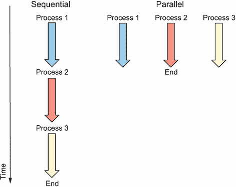

图 7.1 并行性的好处示意图。三个通用过程可以顺序运行（左）或并行运行（右）。当并行运行时，三个过程只需原本顺序运行所需总时间的三分之一。

并行性在计算机科学中特别常见，计算机可以并行使用多个处理单元同时处理多个程序。如果这些程序彼此独立（它们不使用彼此的数据或写入相同的文件），它们可以并行运行而不会出现任何问题。

相同的理念适用于使用 BayesOpt 的优化设置。例如，一位 ML 工程师调整神经网络可以利用他们可以访问的多个 GPU 同时训练多个模型。试图发现新药物的科学家可以使用实验室中的设备同时合成多个配方。同时进行多个查询可以在相同的学习目标函数所花费的时间内获取更多信息。

什么是 GPU？

*GPU*，即图形处理单元，是优化执行并行矩阵乘法的硬件。因此，它们通常用于训练神经网络。

以烤一批饼干为例。如果你愿意的话，你*可以*一次只烤一个饼干，但这样做会浪费诸如烤箱能源和时间等资源。相反，你更有可能一次性同时烤多个饼干。

烘焙饼干的贝叶斯优化

关于烘焙的话题，事实上，有一篇关于批次贝叶斯优化的研究论文（[`static.googleusercontent.com/media/research.google.com/en//pubs/archive/46507.pdf`](https://static.googleusercontent.com/media/research.google.com/en//pubs/archive/46507.pdf)）讨论了通过找到制作饼干面团时使用的最佳鸡蛋、糖和肉桂的量来优化饼干配方的问题。

在贝叶斯优化中，批次设置允许同时评估目标函数的多个输入。也就是说，我们可以一次性向评估目标的黑盒发送多个查询，*x*[1]，*x*[2]，...，*x*[k]，并一次性接收到相应的目标值*f*(*x*[1])，*f*(*x*[2])，...，*f*(*x[k]*)。相比之下，在经典的顺序贝叶斯优化设置中，只有在观察到*f*(*x*[1])后，我们才能继续在另一个位置*x*[2]处进行查询。

在每一次批次贝叶斯优化循环的迭代中，我们挑选出多个输入位置来评估目标函数，而不是像我们之前一直做的那样只评估单个位置。图 7.2 显示了这个批次贝叶斯优化循环。一次性需要多次查询的要求意味着我们需要新的贝叶斯优化策略来评分这些输入位置的有用性。我们将在下一节更多地讨论为什么我们学到的贝叶斯优化策略不能轻易扩展到批次设置中。贝叶斯优化循环的另一个组成部分，GP，保持不变，因为我们仍然需要一个产生概率预测的机器学习模型。换句话说，贝叶斯优化的决策组件需要修改以适应批次设置。

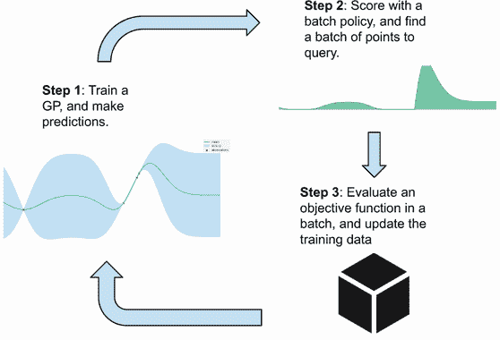

图 7.2 批次贝叶斯优化循环。与顺序贝叶斯优化相比，批次贝叶斯优化需要在步骤 2 中识别多个查询点，并在步骤 3 中同时评估这些点上的目标函数。

策略的收获分数

贝叶斯优化策略为搜索空间中的每个输入位置分配一个称为*收获分数*的分数，该分数量化了输入在寻找目标函数全局最优解过程中的有用程度。每个策略使用不同的启发式来计算这个分数，详情见第 4 到 6 章。

可以同时进行的查询数量——即批次的大小——取决于应用程序。例如，您可以同时烘烤多少块饼干取决于您的烤箱和烤盘的大小。您可用的计算资源（CPU 和 GPU 的数量）决定了调整模型超参数时可以并行训练多少神经网络。图 7.1 显示了同时运行三个进程的示例，因此批次大小为 3。

### 7.1.2 为什么我们不能在批处理设置中使用常规 BayesOpt 策略？

我们在上一节中说过，在顺序设置下学习的 BayesOpt 策略（其中对目标函数的查询是顺序地进行的，一个接一个地进行）不能重新用于批处理设置中而不经过修改。在本节中，我们将更详细地讨论为什么会出现这种情况，以及为什么我们需要专门针对批处理设置的策略。

从第 4.1 节我们知道，BayesOpt 策略会为搜索空间中的每个点分配一个分数，该分数量化了该点对我们寻找目标函数全局最优解的有用程度。然后，我们寻找给出最高分数的点，并将其选择为下一个查询的目标函数。图 7.3 显示了由预期改进（EI）策略（在第 4.3 节介绍）计算的分数，作为底部面板中的曲线，其中 1.75，如下所示的垂直标记在较低曲线上，最大化了分数，是我们的下一个查询。

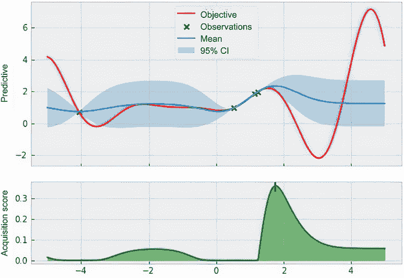

图 7.3 BayesOpt 的一个例子。顶部面板显示了 GP 预测和地面真实目标函数，而底部面板显示了 EI 产生的采集分数，这在第 4.3 节中讨论过。在较低曲线上的垂直刻度为 1.75，表示下一个查询。

如果我们使用相同的 EI 分数，即图 7.3 中的较低曲线，来挑选不止一个点来查询目标函数，会发生什么？我们需要确定许多给出最高 EI 分数的点。然而，这些给出高 EI 分数的点会简单地聚集在顺序设置下选择的点周围。这是因为沿着较低曲线，如果我们从 1.75 移动一个无穷小的距离，我们仍然会得到一个高的 EI 分数。也就是说，接近给出最高采集分数的点也会给出高的采集分数。

如果我们简单地挑选出获得分数最高的点，我们的查询将聚集在搜索空间的一个区域，实质上是把所有的鸡蛋放在一个篮子里。这在图 7.4 中有所说明，那些给出最高 EI 分数的查询聚集在 1.75 附近。这种聚集效应是不可取的，因为我们在本质上浪费了宝贵的资源，评估了目标函数在基本上是一个输入位置的值。这些聚集点比分散的点不那么有用。

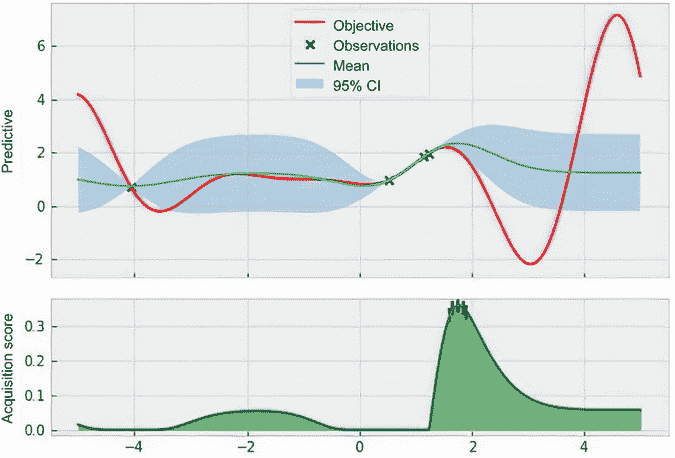

图 7.4 如果我们仅仅选择具有最高获得分数的点，并通过水平刻度线在下方图表上标识出来，那么在批量设置中所进行的查询会很接近，并且不如更分散排布的情况有用。

选择所有查询的点都聚集在一个位置附近会阻碍我们从批量设置中固有的并行性中受益。到目前为止，我们的讨论表明，设计一批查询并不像选择具有最高贝叶斯优化策略获得分数的顶点那样简单。在本章的剩余部分中，我们将讨论专门为批量设置设计的贝叶斯优化策略。方便的是，对我们来说，这些策略是对我们在第四章到第六章中所学习的贝叶斯优化策略的扩展，因此我们只需要学习如何将我们所学到的优化启发式扩展到批量设置中。

## 7.2 计算一批点的改进和上限置信度

我们将要扩展到批量设置的第一类策略是基于改进的策略，这是第四章的主题，以及在第 5.2 节讨论的 UCB 策略。这些策略使用的启发式方法可以被修改为在批量设置中工作，我们稍后会看到。

在下一节中，我们介绍这些启发式的数学修改，并讨论生成的批量策略的工作原理。之后，我们将学习如何使用 BoTorch 声明和运行这些批量策略。

### 7.2.1 将优化启发式扩展到批量设置

在第 7.1.2 节的讨论中，我们可以看出，选择一批点来评估目标函数并不像找到最大化顺序策略获得分数的顶点那样简单。相反，我们需要重新定义这些顺序策略的数学公式，以使它们适用于批量设置。

适用于我们所学到的三种贝叶斯优化策略（PoI，EI 和 UCB）的策略有一种策略，它们将其获取得分公式定义为各个正态分布上的平均值。也就是说，这三种策略中，每种策略分配给给定点的分数都可以写为顺序设置中数量的平均值。对于 PoI，这个数量是我们是否能观察到改进；对于 EI，这个数量是改进的大小。

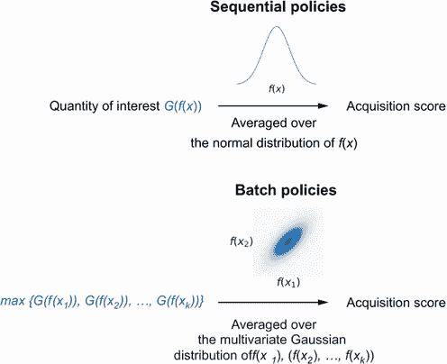

图 7.5 将贝叶斯优化策略的数学表达扩展到批量设置中。在两种情况下，我们使用的是感兴趣数量的平均值。在批量设置中，我们会在对整个批次的效用进行平均之前先选取批次中点的最大值来表示整个批次的效用。

正如图 7.5 顶部所示，顺序 BayesOpt 策略使用某个数量 *G*(*f*(*x*)) 在我们对目标函数 *f*(*x*) 的值的信念的正态分布上的平均值来对候选查询 *x* 进行评分。这个数量 *G* 取决于 BayesOpt 策略用于平衡探索和利用的启发式方法。对于查询批次 *x*[1]，*x*[2]，...，*x[k]*，我们相反地计算批次中点的数量 *G* 的最大值的平均值，如图 7.5 底部所示。这个平均值是在对应于目标值 *f*(*x*[1])，*f*(*x*[2])，...，*f*(*x[k]*) 的多元高斯分布上计算的。

探索与利用的平衡

所有的 BayesOpt 策略都需要解决在搜索空间中找到高性能区域（利用）和检查未探索区域（探索）之间的折衷。更深入地讨论此折衷，请参阅第 4.1.2 节。

这种使用兴趣量 *G* 的最大值来表示整个批次效用的策略在优化的背景下是直观的。*G* 的最大值越高，整个查询批次的价值就越高。有了一种方法来量化任何给定查询批次的价值，我们现在可以继续寻找最大化该数量的批次。我们使用的启发式方法类似于奥运会等体育比赛中的做法：每个国家可能在整年中训练很多运动员，但当时机成熟时，只选择最优秀的个人参加比赛。图 7.6 可视化了这个过程。

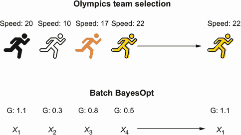

图 7.6 批量 BayesOpt 启发式选择具有最高 *G* 值的最佳元素来表示整个批次（底部）。这种策略类似于奥运会中的团队选拔，只选择最优秀的运动员代表一个国家。

如何利用上述三种政策实现这种策略？让我们首先讨论前两种：基于改进的策略。请记住，在第四章中，PoI 使用下一个查询将从最佳点（现任者）改进的概率作为获取分数。一个点更有可能比现任者产生更好的结果，PoI 给予该点的分数就越高。另一方面，EI 政策考虑改进的幅度，给出的获取分数较高，表明这些点很可能从现任者那里改进，而且改进幅度较大。

这两种策略的区别在图 7.7 中得到了可视化，其中不同的结果位于 *x* 轴上，*y* 轴显示了要优化的目标值。PoI 将所有在 *x* 轴上产生比现任者更高值的点视为平等，而 EI 则考虑每个点的改进程度。

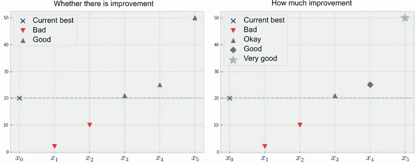

图 7.7 PoI（左）和 EI（右）之间的区别。前者仅考虑我们是否从现有值中提高，而后者考虑了提高多少。

在批次设置中，我们可以类似地推理出在 BayesOpt 循环的当前迭代后观察到的提高。与针对一批查询中的多个点推理不同，我们可以在这些点的函数评估中单独找出最大值。也就是说，如果我们的查询批次分别为 *x*[1]，*x*[2]，...，*x[k]*，我们不需要使用所有函数评估 *f*(*x*[1])，*f*(*x*[2])，...，*f*(*x[k]*) 来推理我们观察到的提高。我们只需使用最大值 `max {*f*(*x*[1]), *f*(*x*[2]), ... ,*f*(*x[k]*)}`，因为这个最大值定义了我们观察到的提高。

按照图 7.7 中的例子，假设我们的现有值具有 20 的目标值，并考虑图 7.8 中右侧可视化的以下情景：

+   如果我们的查询批次大小为 3，且返回的值全都低于 20（右板块中的 *X*[1]），那么我们将不会观察到提高。在 *X*[1] 中的最高函数评估是 3，意味着本批次中的函数评估都没有从现有值中提高。

+   如果所有返回值都超过了现有值（对应于 *X*[2]），那么我们将会观察到一个从现有值中提高的情况。特别地，这个批次中的最大值 *X*[2] 等于 30，导致了一个 10 的提高。

+   更重要的是，即使只有一些而不是所有返回的函数评估优于现有值（例如 *X*[3]），我们仍然会观察到一个提高。*X*[3] 的最大值是 22，这是从现有值 20 中的确有所提高的。

通过关注从一批次查询中返回的最大评估值，我们可以立即确定这个批次是否从现有值中提高。图 7.8 显示了 PoI 的这种基于提高的推理，其中批次 *X*[2] 和 *X*[3] 被平等地处理，因为它们（或更具体地说，它们的最大值）都导致了提高。现在，我们有了一种方法，将计算提高的概率从顺序扩展到批量设置。

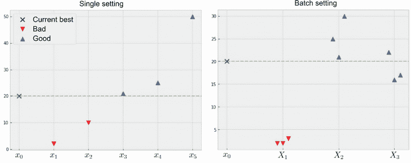

图 7.8 查询（左）还是一批查询（右）是否会从现有值中提高。在右侧的批量设置中，我们仅考虑每个批次中的最大值，以确定是否存在提高。

**收购分数（acquisition score）** 是指给定候选查询批次的概率，即返回的函数评估中最大值是否会超过现有值。

从计算函数评估 *f*(*x*) 将超出现有值 *f** 的概率，记为 *Pr*(*f*(*x*) > *f**)，在顺序设置下，我们推导出计算最大函数评估将超出现有值 *f** 的概率，*Pr*(max {*f*(*x*[1]), *f*(*x*[2]), ..., *f*(*x[k]*)} > *f**)。然后，我们将使用该概率 *Pr*(max {*f*(*x*[1]), *f*(*x*[2]), ..., *f*(*x[k]*)} > *f**) 作为批处理查询 *x*[1]、*x*[2]、...、*x[k]* 的 PoI 采集分数。

正如本节前面提到的，这些概率 *Pr*(*f*(*x*) > *f**) 和 *Pr*(max {*f*(*x*[1]), *f*(*x*[2]), ..., *f*(*x[k]*)} > *f**) 可以被视为高斯分布下对我们的优化进展重要性的量的平均值。具体而言，这些概率分别是二进制随机变量的平均值，指示 *f*(*x*) > *f** 和 max {*f*(*x*[1]), *f*(*x*[2]), ..., *f*(*x[k]*)} > *f** 是否为真。该比较在图 7.9 中可视化。

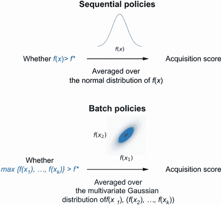

图 7.9 将 POI 政策扩展到批处理设置中。在顺序情况下（上），我们考虑下一个查询相比现有值是否有改进。在批处理设置下（下），我们考虑批处理中所有点的最大值相比现有值是否有改进。

要完成具有这种 PoI 政策的批处理 BayesOpt 循环，我们需要找到批处理 *x*[1]、*x*[2]、...、*x[k]* 来最大化采集分数 *Pr*(max {*f*(*x*[1]), *f*(*x*[2]), ..., *f*(*x[k]*)} > *f**)。正如我们在 4.1.1 节中所学到的，我们可以使用 BoTorch 的 `optim.optimize` 模块中的辅助函数 `optimize_acqf()` 来促进批处理 *x*[1]、*x*[2]、...、*x[k]* 的搜索，以优化采集分数，我们将在 7.2.2 节中看到。

我们现在进入 EI 政策，它计算从查询特定点得出的相对于现有值的改进的预期值。由于我们已经有了一种方式来推理出在观察到一批函数评估后相对于现有值的改进，因此我们可以扩展 EI。即，我们只计算从返回批处理中的最大函数评估所得到的相对于现有值的改进的预期值，即 max {*f*(*x*[1]), *f*(*x*[2]), ..., *f*(*x[k]*)}。与 PoI 计算最大值是否超出现有值的概率不同，EI 则考虑最大值超出改进的程度。EI 和其批处理变体之间的差异在图 7.10 中可视化。

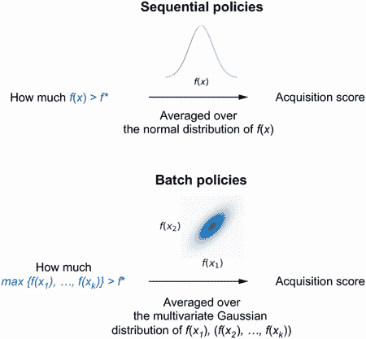

图 7.10 将 EI 政策扩展到批处理设置中。在顺序情况下（上），我们使用下一个查询相比现有值的平均提升量。在批处理设置下（下），我们计算批处理中所有点的最大值相比现有值的平均提升量。

为了说明这种推理，图 7.11 显示了顺序（左侧面板）和批处理设置（右侧面板）中 EI 评分不同结果的区别。右侧面板中以下内容为真：

+   不具有任何点能从 20 的现有值改进的批次（以*X*[1]为例）将构成零改进。

+   批次*X*[2]中的最大值为 22，所以即使这批次中的某些值低于现有值，我们也观察到了 2 的改进。

+   尽管批次*X*[3]中的值都高于现有值，但我们观察到的改进完全是由最大值 30 决定的。

+   最后，即使大多数批次*X*[4]低于现有值 20，*X*[4]的最大值为 50，使得这个批次成为一个非常好的结果。

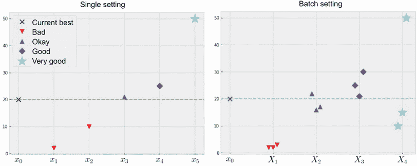

图 7.11 查询（左）或一批查询（右）是否导致从现有值的改进。在右侧的批处理设置中，我们只考虑每个批次中的最大值，以确定是否有改进。

要继续进行批量 EI，我们计算批次内最大值比现有值高多少的期望值。这种改进的期望值或预期改进是 EI 用于评估给定批次*x*[1]、*x*[2]、...、*x[k]*的价值的收购分数批次。辅助函数`optimize_acqf()`可以再次用于找到提供最高预期改进的批次。

到目前为止的讨论帮助我们将基于改进的两个政策，PoI 和 EI，扩展到批处理设置。我们现在剩下的是 UCB 政策。幸运的是，选择从一批查询中挑选出最大值的策略也适用于 UCB。为了将与兴趣函数*G*有关的批次的最大值挑选出来以计算改进的相同策略应用到 UCB 上，我们需要将 UCB 收购得分重新构建为正态分布的平均值。

UCB 政策的数学细节

在 5.2.2 节中，我们讨论了 UCB 收购分数为*μ* + *βσ*。在这里，术语*μ*和*σ*是*f*(*x*)的预测均值和标准差，β是一个可调参数，用于权衡勘探和开发。我们现在需要将*μ* + *βσ* 重写为正态分布*N*(*μ*, σ²)上某个数量的平均值，以扩展 UCB 到批处理设置。虽然可以进行这种重塑，但我们不在此处讨论数学。感兴趣的读者可以参考本文附录 A([`arxiv.org/pdf/1712.00424.pdf`](https://arxiv.org/pdf/1712.00424.pdf))，其中详细介绍了数学细节。

将 UCB 扩展到批处理设置的其余部分遵循相同的流程：

1.  我们取被重写的数量*μ* + *βσ* 在整个批次中的最大值的平均值，并将其用作批次 UCB 收购得分。

1.  然后，我们使用辅助函数 `optimize_acqf()` 找到给出最高分数的批次。

这就是我们需要了解如何将这三种 BayesOpt 策略扩展到批量设置的全部内容。我们将在下一节中学习如何在 BoTorch 中实现这些策略。

### 7.2.2 实施批量改进和 UCB 策略

与我们在第 4 至 6 章中看到的情况类似，BoTorch 使得在 Python 中实现和使用 BayesOpt 策略变得简单，并且前一节讨论的三种策略（PoI、EI 和 UCB）的批量变体也不例外。虽然我们需要了解这三种策略的数学公式，但我们将看到，使用 BoTorch，我们只需在我们的 Python 程序中替换一行代码就可以运行这些策略。本节中使用的代码可以在名为 CH07/01 - Batch BayesOpt loop.ipynb 的 Jupyter 笔记本中找到。

在新的设置下，我们现在将查询目标函数的操作批量执行，您可能会认为我们需要修改实现 BayesOpt 循环的代码（同时获取多个函数评估值，将多个点附加到训练集，训练 GP 模型）。然而，由于 BoTorch 能够无缝支持批处理模式，所需的修改很小。特别是，在使用辅助函数 `optimize_acqf()` 来找到最大化获取分数的下一个查询时，我们只需要指定参数 `q = k` 为批量大小（即可以并行运行的函数评估的数量）。

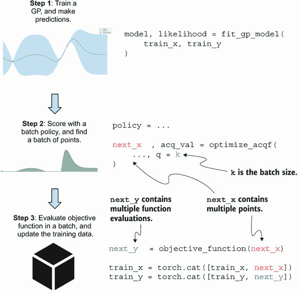

图 7.12 显示了批量 BayesOpt 循环的步骤及相应的代码。与顺序设置相比，当转移到批处理设置时，我们的代码需要最少的修改。

整个批量 BayesOpt 循环总结在图 7.12 中，它与图 4.4 非常相似。对少量更改进行了注释：

+   当使用辅助函数 `optimize_acqf()` 时，我们指定 `q = k` 为批量大小 *k*。

+   此辅助函数返回包含 *k* 个点的 `next_x`。变量 `next_x` 是一个 *k*-by-*d* PyTorch 张量，其中 *d* 是我们搜索空间中的维数（即数据集中的特征数）。

+   然后，我们在 `next_x` 指定的位置查询目标函数，并获得包含函数评估值的 `next_y`。与顺序设置不同，这里的 `next_y` 是一个包含 *k* 个元素的张量，对应于 `next_x` 的函数评估。

注意：在图 7.12 的第 1 步中，我们仍然需要一个 GP 模型的类实现和辅助函数 `fit_gp_model()`，该函数对训练数据进行训练。幸运的是，在顺序设置中使用的相同代码可以在不做任何修改的情况下重用。有关此代码的完整讨论，请参阅第 4.1.1 节。

为了方便我们的代码演示，我们使用了一个二维合成目标函数来模拟超参数调整应用程序的模型准确性。该函数首次出现在第三章的练习中，并且被实现如下，我们指定函数域，即我们的搜索空间，在两个维度的每一个上都在 0 和 2 之间：

```py
def f(x):                                                      ❶
  return (                                                     ❶
    torch.sin(5 * x[..., 0] / 2 - 2.5) * torch
    ➥.cos(2.5 - 5 * x[..., 1])                                ❶
    + (5 * x[..., 1] / 2 + 0.5) ** 2 / 10                      ❶
  ) / 5 + 0.2                                                  ❶

lb = 0                                                         ❷
ub = 2                                                         ❷
bounds = torch.tensor([[lb, lb], [ub, ub]], dtype=torch.float) ❷
```

❶ 函数定义。

❷ 函数域，每个维度在 0 和 2 之间。

此目标函数在图 7.13 中可视化，我们可以看到全局最优点位于空间的右上角附近，给出的准确性为 90%。

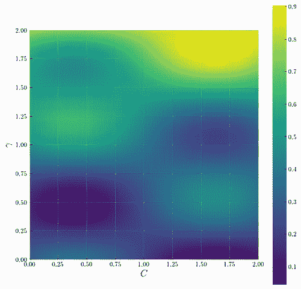

图 7.13 SVM 模型在测试数据集上的准确性，作为惩罚参数 *C* 和 RBF 核参数 *γ* 的函数。这是我们在本章中要优化的目标函数。

要设置我们的批量优化问题，我们假设我们可以同时在四个不同的进程中训练模型。换句话说，我们的批次大小是 4。此外，我们只能重新训练模型五次，因此我们批处理 BayesOpt 循环的迭代次数为 5，我们可以进行的总查询次数为 4 × 5 = 20：

```py
num_queries = 20
batch_size = 4
num_iters = num_queries // batch_size   ❶
```

❶ 此变量等于 5。

现在，唯一要做的就是运行批处理 BayesOpt 策略。我们使用以下代码来完成此操作，首先在搜索空间中随机选择一个点作为训练集：

```py
torch.manual_seed(0)
train_x = bounds[0] + (bounds[1] - bounds[0]) * torch.rand(1, 2)  ❶
train_y = f(train_x)                                              ❷
```

❶ 在搜索空间中随机选择一个点。

❷ 在随机选择的点处评估目标函数。

然后，我们对五个迭代中的每一个执行以下操作：

1.  记录迄今为止见过的最佳准确性。

1.  使用当前训练集重新训练 GP 模型。

1.  初始化一个批处理 BayesOpt 策略。

1.  使用辅助函数 `optimize_acqf()` 找到最佳的查询批次。

1.  在由查询批次指定的位置评估目标函数。

1.  将新的观察结果附加到训练集并重复：

```py
incumbents = torch.zeros(num_iters)
for i in tqdm(range(num_iters)):
    incumbents[i] = train_y.max()                      ❶

    model, likelihood = fit_gp_model(train_x, train_y) ❷

    policy = ...                                       ❸

    next_x, acq_val = botorch.optim.optimize_acqf(     ❹
        policy,
        bounds=bounds,
        q=batch_size,                                  ❺
        num_restarts=40,
        raw_samples=100,
    )

    next_y = f(next_x)                                 ❻

    train_x = torch.cat([train_x, next_x])             ❼
    train_y = torch.cat([train_y, next_y])             ❼
```

❶ 跟踪优化进展。

❷ 对当前训练集进行 GP 训练。

❸ 初始化一个即将讨论的批处理 BayesOpt 策略。

❹ 找到下一个要查询的批次。

❺ 将参数 q 设置为批处理大小。

❻ 在所选批次上评估目标函数。

❼ 更新训练数据。

再次，此代码几乎与我们在第四章的第 4.1.1 节中使用的代码相同，该代码实现了 BayesOpt 的顺序设置。我们需要注意的是将辅助函数 `optimize_acqf()` 的参数 `q` 设置为正确的批量大小。

要运行批处理 BayesOpt 策略，我们使用 BoTorch 的类实现该策略进行初始化。对于 PoI 策略，我们使用

```py
policy = botorch.acquisition.monte_carlo.qProbabilityOfImprovement(
    model, best_f=train_y.max()
)
```

同样地，对于 EI 策略，我们使用

```py
policy = botorch.acquisition.monte_carlo.qExpectedImprovement(
    model, best_f=train_y.max()
)
```

注意类名前面的 `q`，它表示这些类实现了批处理 BayesOpt 策略。类似于顺序 PoI 和 EI 所采用的参数 `best_f`，这里的参数 `best_f` 指定了当前的现任值，我们将其设置为 `train_y.max()`。

对于 UCB，我们使用等效的 API，其中参数 `beta` 设置收获分数 *μ* + *βσ* 中的权衡参数 *β*，其中 *μ* 和 σ 是给定点处预测的均值和标准差：

```py
policy = botorch.acquisition.monte_carlo.qUpperConfidenceBound(
    model, beta=2
)
```

参数 BayesOpt 策略所需

我们在相应的章节 4.2.2、4.3 和 5.2.3 中了解了顺序 POI、EI 和 UCB 的实现。这些策略的每个参数在其批次对应策略中是相同的，这使得在 BoTorch 中过渡到批次设置变得简单。

由于我们现在可以运行 PoI、EI 和 UCB 的批次版本，让我们花一点时间来检查这些策略的行为。特别是，假设我们当前的 BayesOpt 进展与图 7.3 中的一维目标函数相同。该图还显示了底部面板中 EI 计算的单点收获分数。我们感兴趣的是看看 EI 对两个点的批次的收获分数是什么样的——也就是说，对给定一对查询的现任者的预期改进。

我们在图 7.14 中用热图展示这些收获分数，其中方格上每个位置的亮度表示给定一对查询的预期改进，给出最高收获分数的位置标有星号。（热图的横纵坐标显示了观察到的数据和热图轴上目标函数的当前 GP 信念。）我们观察到一些有趣的趋势：

+   热图上有两条直线带，表示高收获分数。这些带接近数据点 *x* = 2，意味着任何一个接近 *x* = 2 的查询批次（大小为 2）都会获得高分。这是有道理的，因为在 *x* = 2 附近是 GP 的后验均值最大化的地方。

+   热图的对角线很暗，意味着查询批次 *x*[1] 和 *x*[2]，其中 *x*[1] 大致等于 *x*[2]，很可能会产生低改进。这一观察验证了我们在第 7.1.2 节中所说的内容：选择在一起聚集的查询批次是一种不好的策略，本质上是把所有的蛋都放在一个篮子里。

+   最后，由星号标出的两个最佳查询批次是相同的批次，因为位置相对于彼此对称。该批次包含 1.68 和 2.12，仍在 *x* = 2 的邻域内，GP 告诉我们目标函数在这里产生高值。此外，所选的两个查询 1.68 和 2.12 相距甚远，因此帮助我们摆脱了将查询聚集在一起的陷阱。

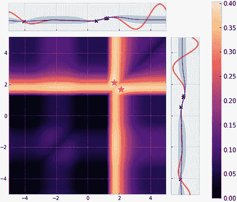

图 7.14 显示了一个热图，显示了一维目标函数的批处理 EI 策略的收获分数，批处理大小为 2。顶部和右侧面板显示了热图的轴上观察到的数据以及目标函数的当前 GP 信念。两个最优查询对，表示为两个星星，包含 1.68 和 2.12，它们彼此之间相对较远。

图 7.14 显示，批处理 EI 的批次版本以合理的方式评估给定的一批查询，优先考虑那些可能产生高目标值且足够分散的批次。

批处理与顺序 EI

有趣的是，批处理 EI 选择的两个点，1.68 和 2.12，与最大化顺序 EI 收获分数的点 1.75 不同。顺序设置中的最佳决策与批处理设置中的最佳决策不一定相同，这种差异展示了。

回到我们的超参数调整示例，我们准备使用这些初始化来运行批处理策略。在保存每个策略实现的运行现任值并将它们相互绘制后，我们可以生成图 7.15，该图显示了我们示例中每个策略所做的优化进展。首先我们观察到，这个进展是以四个一批进行绘制的，这是有道理的，因为我们使用的批处理大小为 4。在性能方面，我们看到 EI 和 UCB 能够在开始时比 PoI 更快地取得进展，但三者最终收敛到大致相同的准确性。

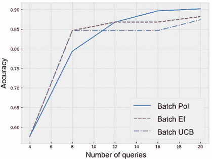

图 7.15 显示了在超参数调整示例中各种批处理 BayesOpt 策略所取得的进展。进展以四个一批进行，这是使用的批处理大小。

贝叶斯优化中的重复实验

要准确比较这些策略在超参数调整应用程序中的性能，我们需要使用随机生成的不同初始训练集重复此实验。请参阅第四章练习 2 的第 9 步，了解如何在 BayesOpt 中运行重复实验。

我们现在已经学会了如何在 BoTorch 中实现 PoI、EI 和 UCB 的批处理版本，并且已经看到从顺序到批处理设置的过渡需要对我们的代码进行最少的修改。现在让我们转向剩下的 BayesOpt 策略，TS 和 MES，它们需要不同的策略才能扩展到批处理设置。

## 7.3 练习 1：通过重新抽样将 TS 扩展到批处理设置

与其他贝叶斯优化策略不同，汤普森抽样（TS）由于其抽样策略的原因，可以很容易地扩展到批处理设置中。我们将在这个练习中探讨这个扩展是如何实现的。请记住，在顺序设置中，TS 会从当前高斯过程（GP）对目标函数的信念中抽取一个样本，并查询最大化该样本的数据点，正如我们在第 5.3 节中所学的那样。

在批量设置中，我们只需重复从 GP 中抽样并多次最大化样本，以组装出所需大小的一批查询。例如，如果我们的批量 BayesOpt 问题的批量大小为 3，则我们从 GP 中抽取三个样本，并且我们最终得到的查询批包含了这三个样本的极大值（每个样本一个极大值）。这一逻辑在图 7.16 中有所说明，在该图中我们不断从 GP 中抽样并将最新样本的极大点添加到运行批次中，直到批次满为止——也就是说，直到达到适当的批量大小。

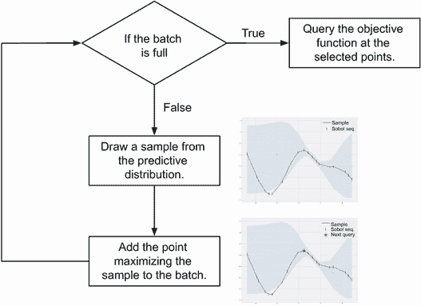

图 7.16 批量 TS 实现的流程图。我们不断从 GP 中抽样并将最新样本的极大点添加到运行批次中，直到批次满为止。

每次我们从 GP 中抽样，我们都得到目标函数可能的不同实现。通过优化从 GP 中抽取的多个样本，我们有一种简单的方法来选择多个可能引导我们到达目标函数全局最优解的点。为了在超参数调整示例中实现和运行此策略，我们采取如下步骤，这些步骤在 CH07/02 - 练习 1.ipynb 笔记本中实现：

1.  重新在 CH07/01 - 批量 BayesOpt 循环.ipynb 中重现批量 BayesOpt 循环。

1.  按照第 5.3 节中的描述，实现带有 Sobol 抽样器的 TS：

    1.  使用 2,000 个候选点进行 Sobol 抽样。

    1.  在调用 TS 对象时，请指定样本数等于批量大小：

    ```py
    ts = botorch.generation.MaxPosteriorSampling(model, replacement=False)
    next_x = ts(candidate_x, num_samples=batch_size)
    ```

1.  在超参数调整目标函数上运行此 TS 策略，并观察其性能。

Sobol 序列

Sobol 抽样器生成 Sobol 序列，该序列可以比均匀抽样序列更好地覆盖空间。关于 Sobol 序列的更多讨论可以在第 5.3.2 节中找到。

## 7.4 使用信息论计算一批点的值

现在我们学习如何将我们工具包中的最终 BayesOpt 策略扩展到批量设置中，即最大值熵搜索（MES）。与基于改进和老虎机的策略不同，MES 在批量设置中需要更加谨慎的考虑才能有效运行。我们将在下一节中讨论 MES 的批量版本以及在将其扩展到批量设置时遇到的问题，最后讨论如何在 BoTorch 中实现该策略。

注意 MES 是第六章的主题，在该章中我们学习有关信息论的基础知识以及如何使用 BoTorch 实现 MES 策略。

### 7.4.1 使用循环精化找到最具信息量的一批点

在顺序设置中，MES 根据我们在查询候选点后将获得的关于目标函数最大值 *f* 的信息量来评估每个候选查询的分数。候选点提供的关于最大值的信息量越多，该点引导我们朝向目标函数的全局最优解 *x* 的可能性就越大。

我们希望在批处理设置中使用相同的策略。也就是说，我们想要计算在查询候选点批处理之后我们将获得多少关于最大目标值*f*的信息。一批点的信息论价值是一个明确定义的数学数量，我们可以在理论上计算和使用它作为批处理设置中的采集得分。但是，在实践中计算这个信息理论数量是非常昂贵的。

主要的瓶颈在于我们必须考虑批处理中所有可能的函数评估，以知道我们将获得有关*f*的信息量有多少。尽管这些函数评估遵循多元高斯分布，这提供了许多数学上的便利，但计算* f *的信息增益是高斯性无法简化的任务之一。这种计算成本意味着，尽管我们可以计算一批点的采集分数，但这种计算成本昂贵而且不易优化。也就是说，找到最大化*f*信息的批次点是非常困难的。

注意 查找最大化采集得分的查询是通过 L-BFGS 完成的， L-BFGS 是一种拟牛顿优化方法，通常比梯度下降更好，在辅助函数`optimize_acqf()`中完成。但是，由于信息理论采集分数的批处理版本计算方式，既不是 L-BFGS 也不是梯度下降能够有效地优化该得分。

BayesOpt 中的采集得分

请记住，采集得分量化了查询或一批查询的价值，以帮助我们找到目标函数的全局最优解，因此在 BayesOpt 循环的每次迭代中，我们需要识别最大化采集得分的查询或查询批次。请查看第 4.1 节以讨论最大化采集得分。

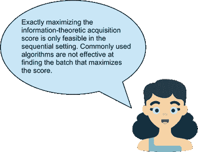

如果我们通常用来根据信息理论找到下一个最佳查询的方法 L-BFGS，在顺序设置中仅适用于一个候选点，那么我们如何在批设置中仍然使用它？我们的策略是以循环方式，一次一个成员地使用该方法找到批次的各个成员，直到收敛。具体而言，我们执行以下操作：

1.  我们从起始批次*x*[1]，*x*[2]，...，*x[k]*开始。这个批次可以从搜索空间随机选择。

1.  由于 L-BFGS 无法同时运行*x*[1]，*x*[2]，...，*x[k]*的所有成员，因此我们仅在固定批处理的其他成员*x*[2]，*x*[3]，...，*x[k]*时在*x*[1]上运行它。 L-BFGS 确实可以单独优化*x*[1]，因为这个任务类似于在顺序设置中最大化采集得分。

1.  一旦 L-BFGS 返回*x*[1]的值，我们在固定*x*[1]和其他成员*x*[3]，*x*[4]，...，*x[k]*的情况下运行 L-BFGS 在*x*[2]上。

1.  我们重复这些单独的例程，直到我们完成处理批处理的最后一个成员*x[k]*，此时我们返回到*x*[1]并重复整个过程。

1.  我们运行这些优化循环直到收敛，即，直到我们获得的收获分数不再增加为止。这些步骤总结在图 7.17 中。

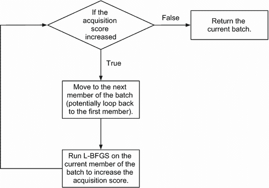

图 7.17 循环优化流程图，用于找到最大化批处理 MES 中最大目标值信息的批处理。该过程是循环的，因为我们按顺序在循环中逐步完善批处理的每个成员，直到收敛于良好的收获分数。

定义 整个过程称为*cyclic optimization*，因为我们按顺序在循环中逐步完善批处理的每个成员，直到收敛于良好的收获分数。

循环优化策略使我们能够避开在多个点的批处理上运行 L-BFGS 的挑战，相反，我们只在单个点上运行 L-BFGS，对收获分数进行个别的完善。借助此优化策略，我们可以在批处理设置中实现 MES 策略。

注意 我们可以将循环优化与艺术家绘画的方式进行类比。艺术家可能会分别处理绘画的各个部分，并随着进展而切换。他们可能会先处理前景，然后暂时转向背景，然后再回到前景，每次对每个部分进行小幅改进。

### 7.4.2 使用 BoTorch 实现批量熵搜索

现在我们学习如何在 BoTorch 中声明批量 MES 策略，并将其连接到我们的批处理 BayesOpt 循环中。幸运的是，前一节讨论的循环优化细节被 BoTorch 抽象化了，我们可以以直观的方式初始化批量 MES。以下代码包含在 CH07/03 - Max-value Entropy Search.ipynb 笔记本中。

我们仍然使用超参数调整示例。首先，我们需要对我们的 GP 模型进行一些微小修改。具体来说，为了推理后验 GP 的熵（即“幻想”未来观察结果），我们的 GP 模型的类实现需要从`botorch.models.model`模块中继承`FantasizeMixin`类：

```py
class GPModel(
    gpytorch.models.ExactGP,
    botorch.models.gpytorch.GPyTorchModel,
    botorch.models.model.FantasizeMixin      ❶
):
    _num_outputs = 1

    ...                                      ❷
```

❶ 从 FantasizeMixin 继承使我们能够更有效地推理后验 GP。

❷ 其余代码保持不变。

此类实现的其余代码保持不变。现在，在实现 BayesOpt 的`for`循环内部，我们以与顺序设置相同的方式声明 MES：

1.  我们从 Sobol 序列中抽取样本，并将它们用作 MES 策略的候选集。这些样本最初在单位立方体内抽取，然后调整大小以跨越我们的搜索空间。

1.  MES 策略使用 GP 模型和先前生成的候选集初始化：

```py
num_candidates = 2000

sobol = torch.quasirandom.SobolEngine(2, scramble=True)   ❶
candidate_x = sobol.draw(num_candidates)
candidate_x = (bounds[1] - bounds[0]) * candidate_x +
➥bounds[0]                                               ❷
policy = botorch.acquisition.max_value_entropy_search.qMaxValueEntropy(
    model, candidate_x
)
```

❶ 我们的搜索空间是二维的。

❷ 调整候选集的大小以跨越搜索空间

Sobol 序列

Sobol 序列首次在第 5.3.2 节中讨论了 TS 策略。 MES 策略的实现还需要 Sobol 序列，我们在第 6.2.2 节中了解到了它。

虽然批量 MES 策略的初始化与我们在顺序设置中所做的完全相同，但我们需要一个辅助函数来替代`optimize_acqf()`，以便进行前一节中描述的循环优化过程，以识别最大化关于*f*的后验信息的批次。

具体来说，我们使用辅助函数`optimize_acqf_cyclic()`，可以从相同的 BoTorch 模块`botorch.optim`中访问。在这里，我们只需将`optimize_acqf()`替换为`optimize_acqf_cyclic()`；其余的参数，例如边界和批量大小，保持不变：

```py
next_x, acq_val = botorch.optim.optimize_acqf_cyclic(
    policy,
    bounds=bounds,
    q=batch_size,
    num_restarts=40,
    raw_samples=100,
)
```

BoTorch 维度警告

在运行批量 MES 的代码时，您可能会遇到警告：

```py
BotorchTensorDimensionWarning:

Non-strict enforcement of botorch tensor conventions. Ensure that target 
tensors Y has an explicit output dimension.
```

此警告表示，我们没有根据 BoTorch 的约定格式化包含观察值 `train_y` 的张量。但是，这不是一个导致代码错误的错误，因此为了能够继续使用与其他策略相同的 GP 实现，我们简单地使用`warnings`模块忽略此警告。

由于其算法复杂性，批量 MES 策略可能需要相当长的时间来运行。可以跳过运行优化循环的代码部分并继续进行章节。

有了这些，我们现在准备在我们的超参数调整示例中运行批量 MES。使用相同的初始训练数据，批量 MES 的进展在图 7.18 中可视化，该图显示该策略与本次运行中的其他策略相当。

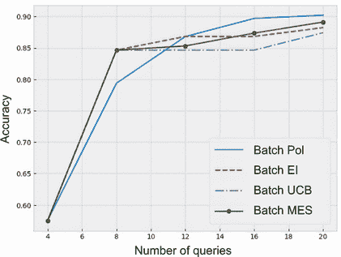

图 7.18：超参数调整示例中各种批量 BayesOpt 策略的进展，包括 MES

我们现在已经学会了将 BayesOpt 策略转换为批量设置，在该设置中，可以并行进行多个查询。根据策略的不同，此转换需要考虑各种不同的级别。对于基于改进的策略和 UCB，我们使用这样一个启发式方法：表现最好的成员应该代表整个批次。在练习 1 中，我们看到 TS 可以通过简单地重复抽样过程来扩展到批量设置，以组装所需大小的批次。另一方面，MES 需要一个修改后的例程，该例程使用循环优化来搜索最大化其收购得分的批次。在下一章中，我们将学习另一种专门的 BayesOpt 设置，在该设置中，在优化目标函数时需要考虑约束。

## 7.5 练习 2：优化飞机设计

在这个练习中，我们在物理学中的一个模拟优化问题上运行了本章中探讨的批处理贝叶斯优化策略。这个问题是我们遇到的维度最高的问题，将为我们提供一个机会观察贝叶斯优化如何处理一个高维度的通用黑盒优化问题。更具体地说，我们将看到各种批处理贝叶斯优化策略在一个真实世界优化问题上的表现。

我们对飞机工程师常常处理的一种气动结构优化问题感兴趣。在这种优化问题中，我们有各种可调参数（每个参数都构成了我们搜索空间中的一个维度），这些参数控制着飞机的工作方式。这些参数可能是飞机的长度和宽度，翼与机身的形状和角度，或者涡轮叶片的角度和旋转速度。优化工程师的工作是调整这些参数的值，使飞机正常运行或优化某些性能指标，如速度或能源效率。

尽管工程师们可能对某些变量如何影响飞机性能有一定了解，但测试一个实验飞机设计的好方法是运行各种计算机模拟并观察飞机的模拟行为。通过这些模拟，我们根据飞机在各种性能指标上的表现来评分。有了模拟程序，我们可以将这个调整过程视为一个黑盒优化问题。也就是说，我们不知道每个可调参数如何影响模拟飞机的最终性能，但我们希望优化这些参数以获得最佳结果。

这个练习提供了一个模拟飞机设计性能基准测试过程的目标函数。代码在 CH07/04 - Exercise 2.ipynb 笔记本中提供。有多个步骤：

1.  实现模拟性能基准测试的目标函数。这是一个四参数函数，其代码如下，用于计算以四个输入参数指定的飞机的效用的分数。由于我们将这个函数视为黑盒，我们假设我们不知道函数内部的运行方式和输出是如何产生的：

    ```py
    def flight_utility(X):
      X_copy = X.detach().clone()
      X_copy[:, [2, 3]] = 1 - X_copy[:, [2, 3]]
      X_copy = X_copy * 10 - 5

      return -0.005 * (X_copy**4 - 16 * X_copy**2 + 5 * X_copy).sum(dim=-1) + 3
    ```

    四个参数是飞机的各种设置，缩放到 0 和 1 之间。也就是说，我们的搜索空间是四维单位超立方体。虽然这对我们的黑盒优化方法并不重要，但这些参数的名称如下：

    ```py
    labels = [
        "scaled body length",
        "scaled wing span",
        "scaled ρ",
        "scaled ω"
    ]
    ```

    虽然很难可视化一个完整的四维函数，但我们可以展示这个函数在二维空间中的行为。图 7.19 展示了我们的目标函数在我们可以调整的各种参数对中的行为，显示了这些二维空间中的复杂非线性趋势。

    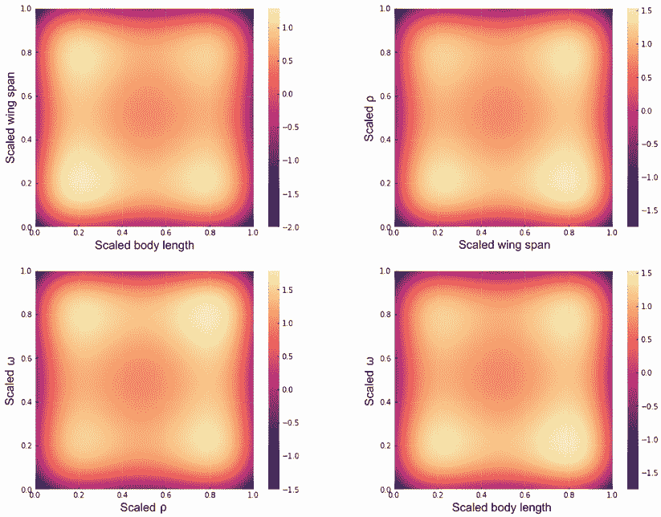

    图 7.19 在不同的二维子空间中，虚拟飞机设计优化问题的目标函数对应于可调参数对，显示为轴标签。明亮的点表示高目标值，即我们的优化目标；黑暗的点表示低目标值。

    再次强调，我们的目标是使用 BayesOpt 找到该函数的最大值。

1.  使用一个具有恒定均值函数和 Matérn 2.5 核函数的 GP 模型，输出尺度为一个 `gpytorch.kernels.ScaleKernel` 对象：

    1.  在初始化核函数时，我们需要指定参数 `ard_num_dims = 4` ，以考虑到我们的目标函数是四维的。

    注意：在第 3.4.2 节以及第三章练习中，我们学习了如何使用 Matérn 核函数。

1.  实现一个辅助函数，该函数在给定的训练数据集上训练 GP。该函数应该接收一个训练集，在使用梯度下降最小化负对数似然的同时训练 GP，并返回该 GP 及其似然函数。有关如何实现这个辅助函数的刷新，请参见第 4.1.1 节。

1.  定义我们优化问题的设置：

    1.  搜索空间是四维单位超立方体，因此我们应该有一个名为 `bounds` 的变量，其中存储以下张量：

        ```py
        tensor([[0., 0., 0., 0.],
                [1., 1., 1., 1.]])
        ```

        我们将这些边界传递给我们在本练习后面运行的 BayesOpt 策略。

    1.  在每次运行中，BayesOpt 策略可以在总共 100 次查询目标函数（即 100 次函数评估）中进行，每次批量为 5 次。我们还对每个策略重复实验五次。

1.  在刚刚实现的目标函数上运行本章学习到的每个批次的 BayesOpt 策略：

    1.  每个实验应该以一个随机选择的函数评估作为训练集开始。

    1.  记录在搜索中找到的最佳值。

    1.  使用一个 5,000 点的 Sobol 序列进行 TS 和 MES。

    1.  在高维问题中运行 MES 计算代价很高。缓解这一负担的常见策略是限制循环优化的次数。例如，要在五个周期后终止 MES 采集分数的优化，我们可以将 `cyclic_options={"maxiter": 5}` 传递给辅助函数 `optimize_acqf_cyclic()` 。在实验中运行这个更轻量化的 MES 版本。

1.  绘制我们运行过的 BayesOpt 策略的优化进程，并观察它们的性能。每个策略应该有一条曲线，显示作为查询次数的函数的平均最佳观测点及其标准误差。有关如何进行这种可视化的更多详细信息，请参见第四章练习 2 的最后一步。

## 总结

+   在现实世界中，许多黑盒优化设置允许多个实验（函数评估）同时并行进行。通过利用这种并行性，我们可以在 BayesOpt 中进行更多的实验，并可能获得更好的性能。

+   在批处理 BayesOpt 设置的每次迭代中，会选择一批查询，并在这些查询上评估目标函数。这种设置要求所使用的 BayesOpt 策略能够根据查询在帮助我们定位全局最优解方面的效用来评分一批查询。

+   将 BayesOpt 策略扩展到批处理设置并不像在顺序设置中选择得分最高的顶部数据点那样简单。这样做会导致所选查询之间的距离非常接近，从而违背了并行性的目的。

+   三种 BayesOpt 策略——PoI、EI 和 UCB——可以使用相同的策略扩展到批处理设置。该策略使用批次查询中的最大值来量化整个批次的价值。从数学上讲，使用最大值来代表整个批次的策略需要将收益分数重写为某种感兴趣数量的平均值。

+   由于其随机性质，TS 策略可以很容易地扩展到批处理设置中。批处理 TS 不是仅从 GP 中抽样并仅最大化一次样本，而是重复这个抽样和最大化过程，直到达到目标批次大小。

+   计算多个点的信息论价值在计算上是具有挑战性的。这一困难阻碍了助手函数`optimize_acqf()`所使用的算法 L-BFGS 在批处理设置中与 MES 策略一起找到最大化给定策略的收益分数的点或批次的使用。

+   为了避免使用 L-BFGS 与批处理 MES 的计算挑战，我们使用循环优化。这种策略涉及以循环方式优化我们当前查询批次中的各个成员，直到收益分数收敛。在 BoTorch 中，可以使用助手函数`optimize_acqf_cyclic()`来使用循环优化。

+   为了最大化我们的优化吞吐量，在使用助手函数`optimize_acqf()`和`optimize_acqf_cyclic()`搜索最大化给定策略的收益分数的批次时，设置正确的批次大小非常重要。我们通过将参数`q`设置为所需的批次大小来做到这一点。

+   大多数 BayesOpt 策略的 BoTorch 实现都遵循与顺序设置中的实现相同的接口。这种一致性使程序员可以在不需要显着修改其代码的情况下转换到批处理设置。
