# 第九章：满足额外约束的满意条件优化

本章包括

+   带约束的黑盒优化问题

+   在 BayesOpt 中考虑约束时做出决策

+   实施考虑约束的 BayesOpt 策略

在前几章中，我们解决了黑盒优化问题，其中我们仅旨在最大化客观函数，没有其他考虑因素。这被称为*无约束*优化问题，因为我们可以自由地探索搜索空间以寻找客观函数的全局最优解。然而，许多现实情况并不遵循这种无约束的制定，客观函数的全局最优解可能存在成本，使实践中无法实现这种最优解。

例如，当调整神经网络的架构时，您可能会发现增加网络层数通常会产生更高的准确性，并且拥有数百万和数十亿层的网络将表现最佳。然而，除非我们有昂贵的、强大的计算资源，否则运行这样的大型神经网络是不切实际的。也就是说，在这种超参数调整任务中，运行大型神经网络会有成本，这在实践中可能对应于客观函数的全局最优解。因此，在调整此神经网络时，我们需要考虑这种计算成本，并且只寻找实际可实现的架构。

我们需要考虑额外约束的另一个黑盒优化问题是科学发现，例如在化学和材料科学中。例如，科学家的目标是设计出优化所需特性的化学品和材料，比如对抗疾病有效的药物，抵御压力的玻璃，或者易于操作的可塑金属。不幸的是，对抗疾病最有效的药物可能会有许多副作用，使其使用起来有危险，或者最具韧性的玻璃可能在大规模生产上成本过高。

这些都是*受限*优化问题的示例，我们需要在满足其他约束的同时优化客观函数。仅寻求优化客观函数可能会导致我们找到的解决方案违反重要约束，使我们找到的解决方案在实践中无用。相反，我们需要识别搜索空间中的其他区域，这些区域既能产生高客观值，又能满足这些重要约束。

在本章中，我们了解约束优化问题，并看到在某些情况下，额外的约束可能会完全改变优化问题的解。考虑到这些约束的需要引发了 BayesOpt 中的约束感知优化策略。我们介绍了一种考虑约束的预期改进（EI）策略的变体，并学习了如何在 BoTorch 中实现它。到本章结束时，您将了解约束优化问题，学习如何使用 BayesOpt 解决它，并看到我们使用的约束感知策略要比不考虑约束的策略表现得更好。本章所学将帮助我们在现实生活中解决更多实际的 BayesOpt 问题，并因此做出更有效的决策。

## 8.1 在约束优化问题中考虑约束

正如介绍中提到的，现实世界中存在许多约束优化问题：制造具有高效性和最小副作用的药物，寻找最大化理想特性并且廉价生产的材料，或者在保持计算成本低的同时进行超参数调整。

注意 我们关注*不等式约束*，其中我们要求结果*y*在预定的数值范围*a* ≤ *y* ≤ *b*内。

我们首先在接下来的一节中更仔细地看看约束优化问题，并了解为什么它在数学上与我们在前几章中看到的无约束问题不同。然后，我们重新定义了迄今为止一直使用的 BayesOpt 框架以考虑额外的约束条件。

### 8.1.1 约束条件可能改变优化问题的解

约束如何使黑盒函数的优化变得复杂？在许多情况下，搜索空间内部给出高目标值的区域可能会违反随优化问题而来的约束条件。

注意 在优化问题中，我们的目标是找到给出高目标值的区域，因为我们想要最大化目标函数的值。

如果高目标值区域违反给定的约束条件，我们需要排除这些违反约束的区域，并仅在满足约束的其他区域内进行搜索。

违反预定义约束条件的数据点在约束优化问题中被称为*不可行*点，因为将该点作为优化问题的解是不可行的。另一方面，满足约束条件的数据点被称为*可行*点。我们的目标是找到最大化目标函数值的可行点。

约束条件可能会影响无约束优化问题的最优解质量，或者完全改变最优解。考虑图 8.1 中的示例，我们的目标函数（实线）是我们在前几章中使用过的福雷斯特函数。除了这个目标函数之外，我们还有一个成本函数，如虚线所示。假设在这个约束优化问题中，约束是成本需要最大为零——也就是说，成本 *c* ≤ 0\. 这个约束意味着只有图 8.1 右侧面板中阴影区域内的可行点可以作为优化结果使用。

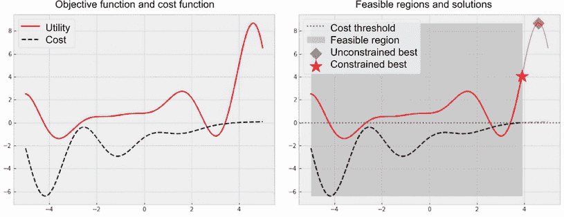

图 8.1 一维约束优化问题的示例。实线是我们希望最大化的目标函数，虚线是约束优化问题的成本函数。只有产生负成本的阴影区域（右侧面板）是可行的。在这里，非正成本的约束导致最高目标值从超过 8 减少到 4 左右。

注意：我们在 BayesOpt 的 2.4.1 节中首次使用了福雷斯特函数作为示例目标函数。

因此，包含 *x* > 4 的区域，其中包含目标值的真实全局最优解（在右侧面板中用钻石标记）被切断。也就是说，产生目标值超过 8 的全局最优解是不可行的，而约束最优解（用星号标记）只能达到大约 4 的目标值。这种“截断”情况的一个例子是当有效药物有太严重的副作用时，药品公司决定使用同一化学成分的效果较差的变体来使产品安全。

另一个具有相同目标函数但成本函数略有不同的示例显示在图 8.2 中，这个额外的成本约束改变了我们优化问题的最优解。在没有约束的情况下，目标函数的全局最优解位于 *x* = 4.6\. 然而，这个点是一个不可行的点，会产生正成本，因此违反了我们的约束。约束问题的最优解在 *x* = 1.6\. 这种现象可能会发生，例如当某种高效药物的整个家族对患者有危险而不能生产时，因此我们需要寻找与危险药物化学成分不同的其他解决方案。

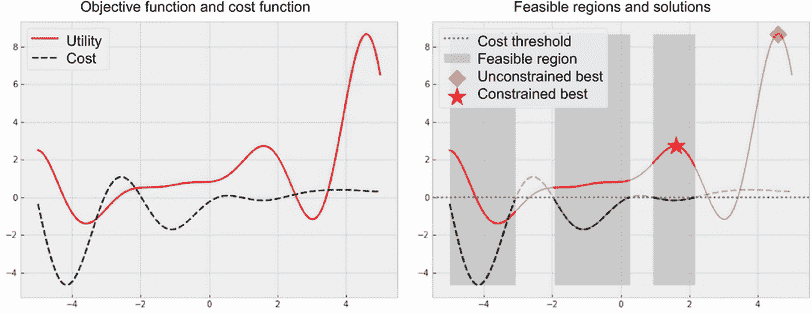

图 8.2 一维约束优化问题的示例。在这里，由于非正成本约束排除了 *x* > 3 的区域，最优解变为不同的局部最优解。

总的来说，不等式约束可能对优化问题施加复杂的要求，并改变其最优解。也就是说，约束可能排除函数的全局最优解作为不可行点——这在现实世界中是常见的情况：

+   成本过高的神经网络倾向于实现良好的预测性能，但在实践中无法实现。

+   最有效的药物通常太过激进和危险，无法生产。

+   最好的材料价格太高，无法使用。

我们需要修改我们的优化策略来考虑约束并找到最佳可行解，而不是使用违反我们约束的无约束最优点。也就是说，我们需要追求两个目标：优化目标函数并满足给定的约束。单纯优化目标函数而不考虑约束会导致无法使用的不可行解。相反，我们需要找到既产生高目标值又满足约束的点。

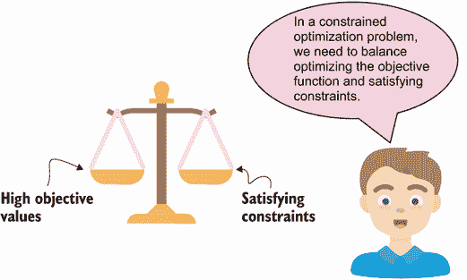

### 8.1.2 约束感知的贝叶斯优化框架

我们应该如何从贝叶斯优化的角度解决这个受约束的优化问题？在本节中，我们学习如何修改我们的贝叶斯优化框架以考虑在受约束优化问题中给定的约束。

在贝叶斯优化中，我们使用高斯过程（GP）来训练我们从目标函数观察到的数据点，并对未见数据进行预测。在受约束优化中，除了我们需要满足的一个或多个定义约束的函数之外，我们还有一个或多个定义约束的函数。例如，在第 8.1.1 节中，成本函数如图 8.1 和 8.2 中的虚线所示，定义了解决方案需要具有非正成本的约束。

注意你可以参考第 1.2.3 节和第 4.1.1 节来重新了解贝叶斯优化框架。

我们假设，就像目标函数一样，我们不知道真实的成本函数是什么样的。换句话说，成本函数是一个黑盒。我们只能观察到我们查询目标函数的数据点处的成本值，从那里，我们确定这些数据点是否满足约束。

注意如果我们知道定义约束的函数的样子，我们可以简单地确定可行区域，并将我们的搜索空间限制在这些可行区域内。在我们的受约束优化问题中，我们假设我们的约束也是黑盒。

由于我们只能黑盒访问定义约束的函数，我们还可以使用 GP 来模拟每个这些函数。也就是说，除了模拟我们目标函数的 GP 外，我们使用更多的 GP，每个函数定义一个约束，以指导我们下一步在哪里查询目标函数。我们遵循相同的程序来训练每个 GP——只是使用每个 GP 的适当训练集：

+   模拟目标函数的 GP 是在观察到的目标数值上进行训练。

+   模拟定义约束函数的 GP 是在观察到的成本数值上进行训练。

我们的受限贝叶斯优化框架，是图 1.6 的修改版本，在图 8.3 中进行了可视化：

+   在步骤 1 中，我们在来自目标函数的数据和定义约束函数的每个函数的数据上训练一个 GP。

+   在步骤 3 中，我们使用贝叶斯优化策略确定的点查询目标函数和定义约束函数。

图 8.3 的步骤 1 和 3 很容易实现：我们只需要同时维护多个 GP，跟踪相应的数据集，并保持这些数据集的更新。更有趣的问题出现在步骤 2 中：决策制定。也就是说，我们应该如何设计一个贝叶斯优化策略，以指导我们朝向产生高客观价值的可行区域？这是我们在下一节讨论的主题。

## 8.2 贝叶斯优化中的约束感知决策

一个有效的受限贝叶斯优化策略需要同时追求优化和满足约束条件。设计这样一个策略的一种简单方法是将约束条件纳入非受限贝叶斯优化策略做出决策的方式中。也就是说，我们希望修改一个我们已经知道的策略，以考虑受限制条件的约束优化问题，并得出一种约束感知的决策程序。

我们选择用于这种修改的策略是 EI，我们在第 4.3 节学到了它。（我们稍后在本节中讨论其他贝叶斯优化策略。）请记住，EI 策略将每个未见过的数据点的预期值得到评分，以表明如果我们在这个未见点查询目标函数，我们会观察到多少改进。

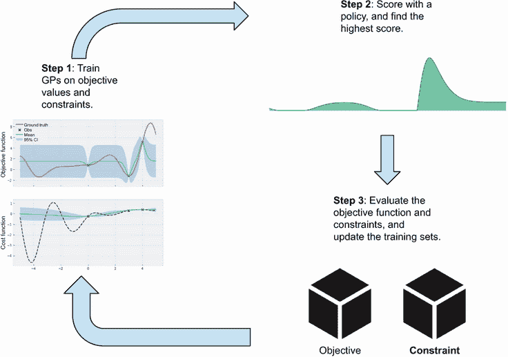

图 8.3 受限贝叶斯优化循环。一个单独的 GP 模型对目标函数或定义约束的函数进行建模。一个贝叶斯优化策略推荐下一个点，我们可以查询目标函数和定义约束的函数。

定义 *在任职者* 这个术语指的是我们训练集中具有最高客观价值的点，这是我们需要“超越”的点，以便在优化过程中取得进展。

EI 使用的收获得分，再次，计算每个潜在查询的改进的平均值，忽略约束优化问题中的不等式约束，因此在优化受约束的目标函数时我们不能直接使用 EI。幸运的是，有一种简单的方法来考虑这些约束：我们可以通过未见点满足约束的概率来缩放每个未见点的 EI 收购得分，即数据点是可行点的概率：

+   如果数据点可能满足约束条件，则其 EI 分数将乘以一个大数（可行性的高概率），从而保持 EI 分数较高。

+   如果数据点不太可能满足约束条件，那么它的 EI 得分将乘以一个较小的值（较低的可行性概率），从而降低该数据点的优先级。

提示 约束变种的 EI 获取得分是正常的 EI 得分和数据点满足约束条件的概率的乘积。

约束感知的 EI 获取得分的公式如图 8.4 所示。这个获取得分是两个术语的乘积：EI 得分鼓励优化目标函数，而可行性概率鼓励停留在可行区域内。正是这种在优化目标函数和满足约束条件之间平衡的方式，正如 8.1.1 节所述，我们希望实现的。

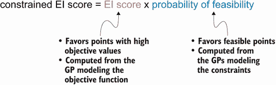

图 8.4 所示的公式是约束 EI 获取得分的公式，它是正常的 EI 得分和可行性概率的乘积。这个策略旨在同时优化目标值并满足约束条件。

我们已经知道如何计算 EI 得分，但是如何计算第二个术语-给定数据点是可行点的概率？正如图 8.4 所述，我们使用对约束进行建模的高斯过程完成此操作。具体而言，每个高斯过程提供有关定义约束函数形状的概率信念。从这种概率信念中，我们可以计算未见过数据点满足相应不等式约束的概率。

例如，当解决图 8.2 中定义的约束优化问题时，假设我们已经在*x*=0，*x*=3 和*x*=4 处观察到了目标函数和成本函数。从此培训集中，我们训练了一个用于目标函数和另一个用于成本函数的高斯过程，并获得了图 8.5 中可视化的预测结果。

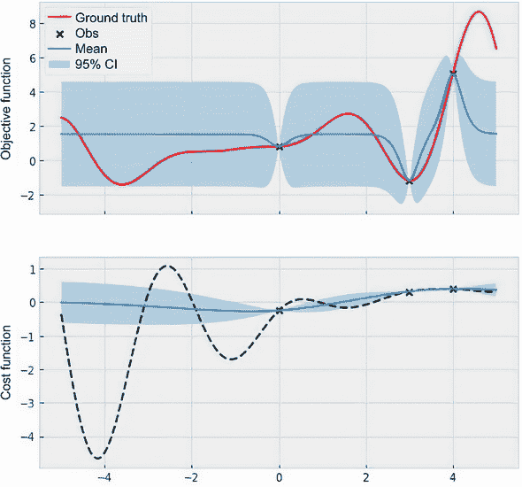

图 8.5 所示的是相应高斯过程的目标函数和成本函数的预测。每个高斯过程都可以让我们以概率方式推理相应函数的形状。

现在，假设我们想计算*x*=1 的约束 EI 得分。我们已经找到了计算任何数据点的正常 EI 得分的方法，现在我们需要做的就是计算*x*=1 是可行数据点的概率。为了做到这一点，我们查看表示我们对*x*=1 成本值的预测的正态分布，如图 8.6 所示。

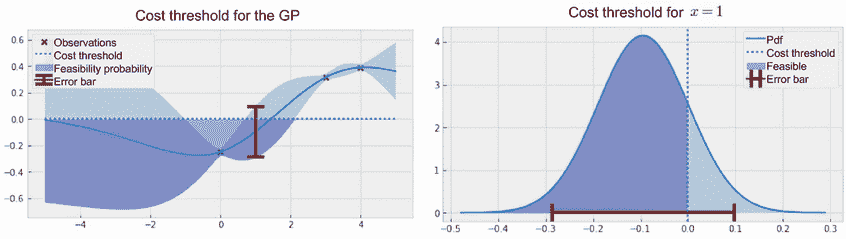

图 8.6 展示了*x*=1 是可行点的概率，用较深的颜色突出显示。左侧显示整个高斯过程，右侧则仅显示与*x*=1（误差条在两个面板中相同）预测相对应的正态分布。在此，可行性遵循一个被截断的正态分布。

图 8.6 的左面板包含与图 8.5 底部面板相同的 GP，它被截断在约束阈值 0，另外还显示了 *x* = 1 处正态分布预测的 CI。在这一点 *x* = 1 垂直切割 GP，我们得到图 8.6 的右面板，在这两个面板中的 CI 是相同的。换句话说，从图 8.6 的左面板到右面板，我们已经放大了垂直刻度，而不是显示成本函数，我们只保留了成本约束（虚线）和 *x* = 1 处的 GP 预测，它是一个正态分布。我们看到右面板中正态分布的突出部分表示 *x* = 1 遵守成本约束的概率，这是我们关心的内容。

如果图 8.6 让你想起了图 4.9 和 4.10，涵盖了 PoI 策略，那是因为我们在这两种情况下的思考过程是相同的：

+   对于 PoI，我们计算给定数据点产生的目标值高于现任的概率。因此，我们使用现任值作为下界，指定我们只关心目标值高于现任的情况。

+   通过可行性概率，我们计算给定数据点产生的成本值低于 0 的概率。我们使用 0 作为上界来指定我们只针对成本值低于阈值的情况（以遵守我们的成本约束）。

处理不同的不等式约束

在我们当前的示例中，约束要求成本低于 0。如果我们有一个要求函数值高于某个阈值的约束条件，那么可行性的概率将是给定点产生函数值高于某个阈值的概率，而图 8.6 中的阴影区域将位于截止线的右侧。

如果存在一个约束条件，要求数值在一个范围内（*a* ≤ *y* ≤ *b*），那么可行性的概率将是数据点给出一个在范围的下限和上限之间的值的概率。

在我们的情况下，我们想要计算 *x* = 1 处成本值低于 0 的概率，这是图 8.6 中右侧面板下曲线阴影区域的面积。正如我们在第 4.2.2 节的第四章中看到的，正态分布允许我们使用累积密度函数（CDF）计算曲线下面积。在图 8.6 中，*x* = 1 可行的概率大约为 84% —— 这是我们用于计算受约束 EI 采集分数的图 8.4 中的第二项。

此外，我们可以计算搜索空间内任何点的可行性概率。例如，图 8.7 显示了 *x* = –1（中心面板）和 *x* = 2（右侧面板）的截断正态分布。正如我们所见，给定点可行的概率取决于该点的预测正态分布：

+   在 *x* = –1 处，几乎整个预测正态分布都位于成本阈值 0 以下，因此这里的可行性概率很高，几乎为 98%。

+   在 *x* = 2 处，只有一小部分正态分布落在成本阈值以下，导致可行性概率较低，大约为 6%。

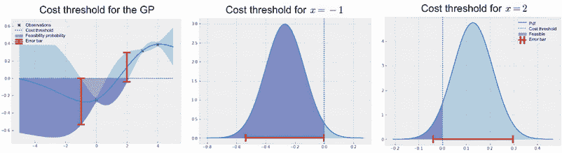

图 8.7 在 *x* = –1 和 *x* = 2 处突出显示的可行性概率，呈深色。左侧面板显示了整个 GP，中间面板显示了 *x* = –1 的预测，右侧面板显示了 *x* = 2 的预测。突出显示的部分显示了可行性概率，这取决于给定点的正态分布。

有了计算任意给定点可行性概率的能力，我们现在可以计算图 8.4 中描述的受约束 EI 采集分数。再次强调，此分数在潜在的高目标值（由常规 EI 分数量化）和满足不等式约束（由可行性概率量化）之间平衡。

图 8.8 在右下面板显示了此分数，以及常规 EI 分数和当前 GPs。我们看到受约束 EI 意识到我们需要满足的成本约束，并且对空间右侧（其中 *x* > 2）的区域分配了大约零分。这是因为成本 GP（右上面板）认为这是一个应该避免的不可行区域。最终，常规 EI 策略建议将具有不可行点 *x* = 4 作为下一个要查询的点。受约束 EI，另一方面，建议 *x* = –0.8，这确实满足了我们的成本约束。

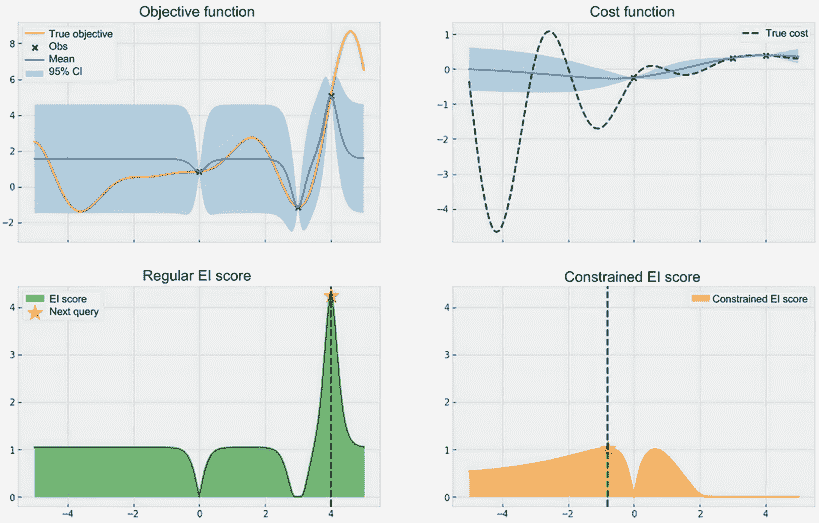

图 8.8 EI 的采集分数（左下）和受约束 EI 的采集分数（右下），以及我们对目标函数（左上）和成本函数（右上）的当前信念。通过意识到成本约束，受约束 EI 可以避免不可行的区域，并建议从常规 EI 完全不同的点进行查询。

我们已经找到了从常规策略中推导出具有约束感知的 BayesOpt 策略的一个很好的启发式方法：将策略的收购分数与可行性概率相乘以考虑不等式约束。有趣的是，将可行性概率因子添加到 EI 中并不简单是一种启发式方法——图 8.4 中的公式可以从一个无启发式、更具数学严谨性的过程中得到。感兴趣的读者可以参考一篇定义了约束 EI 策略的研究论文以获取更多细节（[`proceedings.mlr.press/v32/gardner14.pdf`](http://proceedings.mlr.press/v32/gardner14.pdf)）。

虽然我们可以将相同的启发式方法应用于我们已学习的其他 BayesOpt 策略，例如 UCB、TS 和 Entropy Search，但数学上严格的过程将不再适用。此外，在撰写本文时，BoTorch 仅支持受约束 EI，这也被广泛用于实践中解决受约束优化问题。因此，我们只关注受约束 EI 及其优化结果在本章的其余部分。

## 8.3 练习 1：手动计算受约束的 EI

我们在图 8.4 中看到，受约束 EI 策略的收购得分是 EI 得分和可行性概率的乘积。虽然 BoTorch 的`ConstrainedExpectedImprovement`类提供了受约束 EI 得分的实现，但实际上我们可以手动进行计算。在这个练习中，我们将探索这种手动计算，并将我们的结果与`ConstrainedExpectedImprovement`类的结果进行验证。此练习的解决方案在 CH08/02 - Exercise 1.ipynb 笔记本中：

1.  重新创建在 CH08/01 - Constrained optimization.ipynb 中使用的约束 BayesOpt 问题，包括目标函数、成本函数、GP 实现以及训练 GP 的辅助函数`fit_gp_model()`。

1.  使用例如`torch.linspace()`方法创建一个在-5 到 5 之间的密集网格的 PyTorch 张量。此张量将作为我们的测试集。

1.  通过从我们的搜索空间（在-5 和 5 之间）随机抽样 3 个数据点，创建一个玩具训练数据集，并评估这些点的目标和成本函数。

1.  使用辅助函数`fit_gp_model()`在目标函数数据和成本函数数据上训练一个 GP。

1.  使用从成本函数数据中训练的 GP 来计算测试集中每个点的可行性概率。您可以使用`torch.distributions`的`.Normal`类来初始化一个正态分布对象，并在 0 上调用此对象的`cdf()`方法（实现为`torch.zeros(1)`）来计算每个数据点产生低于 0 的成本的概率。

1.  使用`model`参数初始化一个常规 EI 策略，其中 GP 是由数据从目标函数训练的，并且`best_f`参数是当前可行的候选者：

    1.  计算测试集中每个点的 EI 得分。

    1.  有关实现 EI 策略的更多详细信息，请参见 4.3 节。

1.  初始化受约束 EI 策略，为测试集中的每个点计算受约束 EI 分数。

1.  计算 EI 分数和可行性概率的乘积，并验证此手动计算是否导致与 BoTorch 实现相同的结果。您可以使用`torch.isclose（a，b，atol = 1e-3）`，它在两个张量`a`和`b`之间执行逐元素比较，指定`atol = 1e-3`以考虑数值不稳定性，以验证所有相应分数是否匹配。

1.  在图表中绘制 EI 分数和受约束 EI 分数，并通过图 8.4 视觉验证前者始终大于或等于后者。

## 8.4 在 BoTorch 中实现受约束 EI

虽然我们可以手动乘以两个量，即 EI 分数和可行性概率，以生成新的收购分数，但 BoTorch 已经处理了低级别的簿记。这意味着我们可以从 BoTorch 中导入受约束 EI 策略，并像使用任何其他 BayesOpt 策略一样使用它，而没有太多开销。我们在本节中学习如何这样做，并且我们使用的代码已包含在 CH08/01-Constrained optimization.ipynb 笔记本中。

首先，我们需要实现图 8.2 中定义约束的目标函数和成本函数。在以下代码中，目标函数实现为`objective（）`，成本函数为`cost（）`。我们的搜索空间介于-5 和 5 之间，并且我们制作包含这些数字的变量`bounds`，将在以后传递给 BayesOpt 策略：

```py
def objective(x):                                       ❶
    y = -((x + 1) ** 2) * torch.sin(2 * x + 2)
    ➥/ 5 + 1 + x / 3                                   ❶
    return y                                            ❶

def cost(x):                                            ❷
    return -(0.1 * objective(x) + objective(x - 4))
    ➥/ 3 + x / 3 - 0.5                                 ❷

lb = -5                                                 ❸
ub = 5                                                  ❸
bounds = torch.tensor([[lb], [ub]], dtype=torch.float)  ❸
```

❶ 要最大化的目标函数

❷ 成本函数

❸ 搜索空间的边界

我们还需要 GP 模型的类实现和一个 helper 函数`fit_ gp_model（）`，该函数训练给定训练数据集的 GP。由于受限制的优化不需要对 GP 以及我们如何训练它进行任何更改，因此我们可以重复使用之前章节中使用的类实现和助手函数。有关此实现的更深入讨论，请参见 4.1.1 节。

为了基准测试我们使用的策略的优化性能，我们指定每个 BayesOpt 运行具有 10 个查询，并且总共有 10 个运行：

```py
num_queries = 10
num_repeats = 10
```

注意 我们会多次运行每个 BayesOpt 策略，以全面了解策略的表现。有关重复实验的讨论，请参见第四章练习 2。

最后，我们需要修改我们的 BayesOpt 循环以考虑图 8.3 中可视化的更改。在图 8.3 的第 1 步（即 BayesOpt 循环中的每个步骤开始时），我们需要重新训练多个 GP：一个用于目标函数，另一个（s）用于约束条件。

由于我们已经有了训练高斯过程的辅助函数`fit_gp_model()`，这一步只需要将适当的数据集传递给该辅助函数即可。在我们的当前例子中，我们只有一个定义约束的成本函数，所以总共有两个可以用以下代码重新训练的高斯过程：

```py
utility_model, utility_likelihood = fit_gp_model(   ❶
    train_x, train_utility.squeeze(-1)              ❶
)                                                   ❶

cost_model, cost_likelihood = fit_gp_model(         ❷
    train_x, train_cost.squeeze(-1)                 ❷
)                                                   ❷
```

❶ 在目标函数的数据上训练一个高斯过程（GP）。

❷ 在成本函数的数据上训练一个高斯过程（GP）。

在这里，变量`train_x`包含我们评估目标和成本函数的位置；`train_utility`是相应的目标值，`train_cost`是成本值。

图 8.3 的步骤 2 是指运行 BayesOpt 策略，我们很快就会学习到如何运行。图 8.3 的步骤 3 中，我们评估由所选 BayesOpt 策略推荐的数据点处的目标和成本函数，该数据点存储在变量`next_x`中。我们通过在`next_x`处评估目标和成本函数来完成这一点：

```py
next_utility = objective(next_x)                           ❶
next_cost = cost(next_x)                                   ❶

train_x = torch.cat([train_x, next_x])                     ❷
train_utility = torch.cat([train_utility, next_utility])   ❷
train_cost = torch.cat([train_cost, next_cost])            ❷
```

❶ 在推荐点处评估目标和成本函数

❷ 更新各种数据集

我们还需要做一个额外的记账步骤，跟踪我们的优化进展。与无约束优化问题不同，在每个步骤中，我们只需记录最优解（迄今为止见到的最高目标值），而在这里，我们需要在取最大值之前过滤掉不可行的观察结果。我们首先创建一个张量，张量具有`num_repeats`行（每次重复运行一个）和`num_queries`列（每个时间步骤一个）。此张量默认只包含一个值，如果 BayesOpt 期间未找到可行点，则表示我们的效用:

检查图 8.2，我们可以看到在我们的搜索空间内（在-5 到 5 之间），我们的目标函数在任何地方都大于-2，所以我们将-2 作为默认值：

```py
default_value = -2     ❶
feasible_incumbents = torch.ones((num_repeats, num_queries)) * default_value
```

❶ 检查是否找到可行点

然后，在每个 BayesOpt 循环的步骤中，我们只记录通过取筛选后观测结果的最大值找出的可行的最优解：

```py
feasible_flag = (train_cost <= 0).any()    ❶

if feasible_flag:
    feasible_incumbents[trial, i] = train_utility[train_cost <= 0].max()
```

❶ 检查是否找到可行点

上述代码完成了我们的约束 BayesOpt 循环。我们只需要声明我们要用来解决约束优化问题的 BayesOpt 策略。我们使用在第 8.2 节中讨论的约束 EI 策略，使用 BoTorch 类`ConstrainedExpectedImprovement`。该类需要一些重要参数：

+   `model` - `ModelListGP(utility_model, cost_model)`-目的函数的 GP 模型列表（在我们的例子中是`utility_model`）和定义约束的函数（在我们的例子中是`cost_model`）。我们使用 BoTorch 的`models`模块中的`model_list_gp_regression.ModelListGP`类来创建此列表。

+   `objective_index` - model 列表`model`中模型目标函数的索引。由于`utility_model`是我们传递给`ModelListGP`的第一个 GP，所以在我们的例子中该索引为 0。

+   `constraints` — 将定义约束函数的每个函数的索引映射到存储约束的下限和上限的两元素列表的字典。如果一个约束没有下限或上限，我们使用 `None` 代替实际数值。我们的示例要求与 `cost_model` 对应的成本最大为 0，因此我们设置 `constraints={1: [None, 0]}`。

+   `best_f` — 当前可行的最佳解决方案，如果我们找到至少一个可行点，则为 `train_utility[train_cost <= 0].max()`，否则为默认值 -2。

总的来说，我们如下初始化受约束 EI 策略：

```py
policy = botorch.acquisition.analytic.ConstrainedExpectedImprovement(
    model=botorch.models.model_list_gp_regression.ModelListGP(  ❶
        utility_model, cost_model                               ❶
    ),                                                          ❶
    best_f=train_utility[train_cost <= 0].max(),                ❷
    objective_index=0,                                          ❸
    constraints={1: [None, 0]}                                   ❹
)
```

❶ GP 模型列表

❷ 当前可行的最佳解决方案。

❸ 目标函数在模型列表中的索引

❹ 将每个约束的索引映射到下限和上限的字典。

现在我们手头有了受约束 EI 的实现，让我们在一维受约束优化问题上运行这个策略并观察其性能。作为基线，我们还可以运行不考虑约束的常规 EI 版本。

图 8.9 显示了这两种策略找到的平均可行最优解值以及时间函数的误差条。我们看到，与常规 EI 相比，约束变体平均找到更好的可行解，并且几乎总是收敛到最佳解。图 8.9 强调了我们的受约束优化策略相对于不考虑约束的方法的好处。

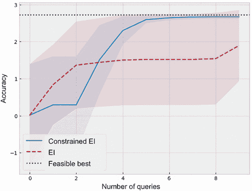

图 8.9 一维约束 EI 优化问题的优化进展。与常规 EI 相比，约束变体平均找到更好的可行解。

对于不考虑优化问题的约束的 EI 策略，往往会偏离不可行最优解。检查此策略找到的最佳解值，我们注意到在许多运行中，该策略未能从其初始值中取得进展：

```py
torch.set_printoptions(precision=1)
print(ei_incumbents)

Output:
tensor([[ 0.8,  0.8,  0.8,  0.8,  0.8,  0.8,  0.8,  0.8,  0.8,  0.8],
        [-2.0, -2.0, -2.0, -2.0, -2.0, -2.0, -2.0, -2.0, -2.0, -2.0],
        [ 2.2,  2.2,  2.7,  2.7,  2.7,  2.7,  2.7,  2.7,  2.7,  2.7],
        [ 2.5,  2.5,  2.5,  2.5,  2.5,  2.5,  2.5,  2.5,  2.5,  2.5],
        [-2.0,  0.2,  1.9,  2.3,  2.6,  2.7,  2.7,  2.7,  2.7,  2.7],
        [-2.0,  0.5,  2.1,  2.4,  2.5,  2.5,  2.5,  2.5,  2.7,  2.7],
        [-2.0,  1.5,  2.5,  2.5,  2.5,  2.5,  2.5,  2.5,  2.5,  2.5],
        [-2.0, -2.0, -2.0, -2.0, -2.0, -2.0, -2.0, -2.0, -2.0, -2.0],
        [ 1.9,  1.9,  2.5,  2.5,  2.7,  2.7,  2.7,  2.7,  2.7,  2.7],
        [ 2.7,  2.7,  2.7,  2.7,  2.7,  2.7,  2.7,  2.7,  2.7,  2.7]])
```

本章我们学习了黑盒约束优化问题，并且了解到它与前几章讨论的经典黑盒优化问题有何不同。我们知道一个有效的优化策略需要追求优化目标函数和满足约束条件两者兼顾。然后我们设计了这样一种策略，即将一个等于可行性概率的因子添加到获取分数中的方法的变体。这个新的获取分数会偏向于可行区域，从而更好地引导我们朝着可行最优解前进。

在下一章中，我们将讨论一个新的 BayesOpt 设置，即多信任度优化，其中查询目标函数的成本不同。这种设置要求我们平衡寻找高目标值和保留查询预算。

## 8.5 练习 2：飞机设计的受约束优化

在这个练习中，我们使用了第七章练习 2 中的飞机效用目标函数来解决受约束的优化问题。这个过程允许我们在一个高维问题上运行受约束的 BayesOpt，其中不明显的是可行的最优解在哪里。这个练习的解决方案包括在 CH08/03 - Exercise 2.ipynb 笔记本中。

1.  重新创建在 CH07/04 - Exercise 2.ipynb 笔记本中使用的 BayesOpt 问题，包括名为`flight_utility()`的飞机效用目标函数，我们搜索空间的边界（四维单位超立方体），GP 实现以及训练一些训练数据的 GP 的辅助函数`fit_gp_model()`。

1.  实现以下成本函数，模拟通过四维输入指定的飞机设计的成本：

    ```py
    def flight_cost(X):
      X = X * 20 - 10

      part1 = (X[..., 0] - 1) ** 2
      i = X.new(range(2, 5))
      part2 = torch.sum(i * (2.0 * X[..., 1:] ** 2 - X[..., :-1]) ** 2, dim=-1)

      return -(part1 + part2) / 100_000 + 2
    ```

    图 8.10 可视化了我们可以调整的各个参数对应的成本函数，显示了跨越这些二维空间的复杂非线性趋势。

    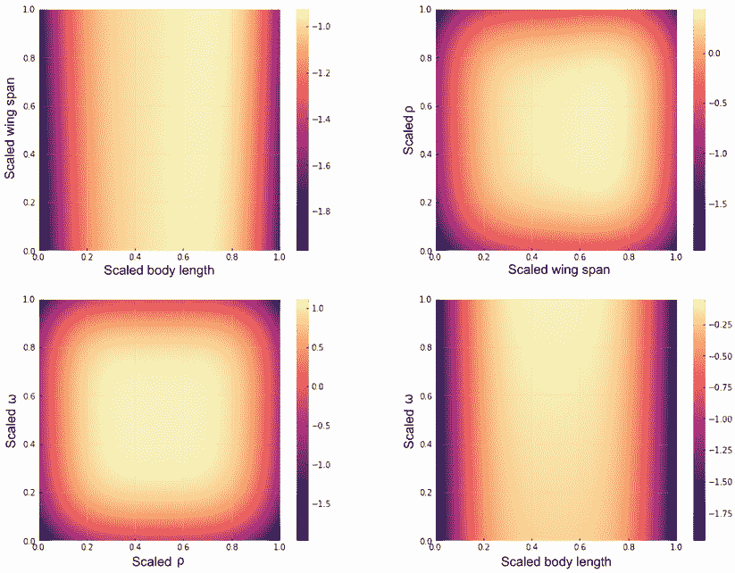

    图 8.10 在各种二维子空间中模拟飞机设计优化问题的成本函数，对应于可调参数的成对显示为坐标轴标签。

1.  我们的目标是在遵循`flight_cost()`计算出的成本小于或等于 0 的约束条件的情况下，最大化目标函数`flight_utility()`：

    1.  为此，我们将每次实验中 BayesOpt 策略可以进行的查询次数设置为 50，并指定每个策略需要运行 10 次重复实验。

    1.  如果找不到可行解决方案，刻画优化进展的默认值应该设置为-2。

1.  在此问题上运行受约束的 EI 策略以及常规 EI 策略，然后可视化并比较它们的平均进展（以及误差条）。绘图应该类似于图 8.9。

## 总结

+   约束优化是一种优化问题，除了优化目标函数外，我们需要满足其他约束条件以获得实际解决方案。约束优化在材料和药物发现以及超参数调整中很常见，其中目标函数的最优解在实践中太难或太危险而无法使用。

+   在受约束的优化问题中满足约束的数据点称为可行点，而违反约束的数据点称为不可行点。我们的目标是在可行点中找到最大化目标函数的点。

+   约束条件可以极大地改变优化问题的解，切断或者排除具有高目标值的区域。因此，在优化目标函数时，我们需要积极考虑约束条件。

+   在约束 BayesOpt 框架中，我们对定义约束的每个函数训练一个 GP。这些 GP 允许我们以概率方式推理出数据点是否满足约束。具体来说，由于 GP 的预测分布是正态分布，因此很容易计算给定数据点可行性的概率。

+   我们可以通过将可行性的概率添加到 EI 策略的获取得分中来修改 EI 策略以考虑约束。约束 EI 策略可以平衡优化目标函数和满足约束条件。

+   BoTorch 提供了一个约束 EI 策略的类实现。在实现约束 EI 时，我们需要传入建模目标和约束函数的 GP，以及声明约束的下界和上界。
