# 第十章：在多信度优化中平衡效用和成本

本章涵盖了

+   变成本的多信度优化问题

+   对来自多个来源的数据进行高斯过程训练

+   实施一个考虑成本的多信度贝叶斯优化策略

考虑以下问题：

+   你是否应该相信在线评论，说你最喜欢的电视剧的最新季度不如以前的好，你应该停止观看这部剧，还是应该花费下个周末的时间观看，以便自己找出你是否会喜欢这个新季度？

+   在看到他们的神经网络模型经过几个时期的训练后表现不佳之后，机器学习工程师是否应该放弃，转而使用其他模型，还是应该继续训练更多时期，希望能够获得更好的性能？

+   当物理学家想要理解一个物理现象时，他们能否使用计算机模拟来获得见解，或者真实的物理实验对于研究这一现象是必要的？

这些问题相似，因为它们要求被问及的人在两种可能的行动之间选择，这些行动可以帮助他们回答他们感兴趣的问题。一方面，这个人可以采取一个相对低成本的行动，但从这个行动中产生的答案可能会被噪声破坏，因此不一定是真实的。另一方面，这个人可以选择成本更高的行动，这将帮助他们得出更确定的结论：

+   阅读有关你喜欢的电视剧的最新季度的在线评论只需几分钟，但评论者可能和你的口味不同，你仍然可能喜欢这部剧。确定的方法是亲自观看，但这需要巨大的时间投入。

+   经过几个时期的训练后，神经网络的性能可能会表现出来，但不一定能反映出其真正的性能。然而，更多的训练意味着更多的时间和资源花费在一个可能没有价值的任务上，如果模型最终表现不佳的话。

+   计算机模拟可以告诉物理学家有关现象的许多信息，但不能捕捉到现实世界中的一切，因此模拟可能无法提供正确的见解。另一方面，进行物理实验肯定会回答物理学家的问题，但会耗费大量的金钱和精力。

这些情况属于一类称为*多保真度*决策的问题，我们可以决定以各种粒度和成本观察某些现象。以浅层次观察现象可能廉价且易于实现，但它并不能给我们尽可能多的信息。另一方面，仔细检查现象可能需要更多的努力。这里的*保真度*一词指的是一个观察如何与所讨论现象的真相密切相关。廉价的、低保真度的观察是嘈杂的，因此可能导致我们得出错误的结论，而高质量（或高保真度）的观察是昂贵的，因此不能随意进行。黑盒优化有自己的多保真度变体。

*多保真度优化*的定义是一个优化问题，除了要最大化的真实目标函数之外，我们还可以观察到并不完全匹配但仍然提供关于目标函数的信息的近似值。这些低保真度的近似值可以以比真实目标函数更低的成本进行评估。

在多保真度优化中，我们需要同时使用这些多源数据来获取关于我们感兴趣的内容（即目标函数的最优值）的最多信息。在本章中，我们将更详细地探讨多保真度优化问题以及如何从贝叶斯优化的角度来解决它。我们将了解一种平衡对目标函数和成本学习的策略，这导致了多保真度设置下的成本感知贝叶斯优化策略。然后我们看看如何在 Python 中实现这个优化问题和成本感知策略。通过本章的学习，我们将学会如何进行多保真度贝叶斯优化，并看到我们的成本感知策略比仅使用基本真相函数的算法更有效。

## 9.1 使用低保真度近似值研究昂贵现象

我们首先讨论了多保真度贝叶斯优化问题的动机、设置以及问题的实际示例。这个讨论将有助于澄清我们在这种情况下寻找决策策略的目标。

在贝叶斯优化的最简单设置中，我们在每个搜索迭代中评估目标函数，每次都仔细考虑在哪里进行这个评估，以取得最大的优化进展。这种仔细的推理的需要源于进行函数评估的高成本，这在昂贵的黑盒优化问题中是典型的。这个成本可以指的是我们花费在等待一个大型神经网络完成训练时所花费的时间，同时在寻找最佳网络架构，或者在药物发现过程中，合成实验药物和进行测试其有效性所需的金钱和精力。

但是，如果有办法在不实际评估目标函数的情况下评估函数评估结果，表示为*f*(*x*)？也就是说，除了目标函数外，我们可以查询一个廉价的替代 *f̄*(*x*)。这个替代 *f̄*(*x*) 是目标函数的一个不精确的近似，因此评估它并不能告诉我们关于真实目标函数*f*(*x*)的一切。然而，由于 *f̄*(*x*) 是 *f*(*x*) 的近似，对前者的了解仍然为我们提供了对后者的洞察。我们需要问自己的问题是：我们应该如何平衡使用昂贵但提供精确信息的真实目标函数 *f*(*x*) 和使用不精确但查询成本低的替代 *f̄*(*x*)？这种平衡在图 9.1 中有所体现，其中地面真实数据源 *f*(*x*) 是高保真度，而替代 *f̄* *(x)* 是低保真度的近似。

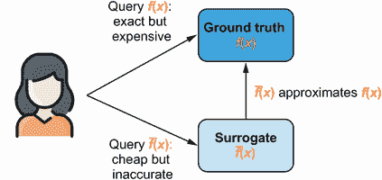

图 9.1 多保真度决策问题模型，在该模型中，代理需要在查询真实目标函数 *f*(*x*) 获取准确信息和查询廉价替代 *f̄*(*x*) 之间进行平衡。

正如在引言中所指出的，在现实世界中使用低保真度近似是很常见的，如以下示例所示：

+   *只对神经网络进行少数次数的训练，以评估其在某个数据集上的性能。* 例如，在 5 个时期内神经网络的性能是其在 50 个时期后可以实现的性能的低保真逼近。

+   *以计算机模拟代替真实实验来研究某些科学现象。* 这种计算机模拟模仿了真实世界中发生的物理过程，并近似了物理学家想要研究的现象。然而，这种近似是低保真度的，因为计算机不能准确地模拟真实世界。

在多保真度优化问题中，我们旨在优化目标函数 *f*(*x*)，我们可以选择查询高保真度 *f*(*x*) 还是低保真度 *f̄*(*x*) 来最好地了解和优化 *f*(*x*)。当然，查询 *f*(*x*) 将提供更多关于 *f*(*x*) 本身的信息，但查询成本阻止我们多次进行这样的查询。相反，我们可以选择利用低保真度近似 *f̄*(*x*) 尽可能多地了解我们的目标 *f*(*x*)，同时最小化查询成本。

拥有多个低保真逼近

为了保持简单，我们在本章的示例中只使用一个低保真度近似 *f̄*(*x*)。然而，在许多实际场景中，我们提供多个低保真度近似 *f̄* 1，*f̄* 2，...，*f̄[k]*(*x*) 给目标函数，每个近似都有自己的查询成本和准确性。

我们在下一节学习的贝叶斯方法不限制我们可以访问的低保真近似数量，并且我们在本章练习 2 中解决了一个具有两个低保真近似*f̄* 1 和*f̄* 2 的多保真优化问题。

当例如近似实验的计算机模拟具有控制近似质量的设置时，拥有多个低保真近似是适用的。如果将模拟质量设置为低，计算机程序将运行对实际世界进行粗略模拟并更快返回结果。另一方面，如果模拟质量设置为高，程序可能需要运行更长时间才能更好地近似实验。目前，我们只使用一个目标函数和一个低保真近似。

考虑图 9.2，除了作为贝叶斯优化示例目标函数的弗雷斯特函数，表示为实线外，我们还有一个对目标的低保真近似，表示为虚线。在这里，虽然低保真近似不完全匹配实际情况，但它捕捉到了后者的大致形状，因此在搜索目标最优解时可能会有所帮助。

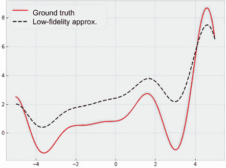

图 9.2 弗雷斯特函数（实线）和函数的低保真近似（虚线）。尽管低保真近似不完全匹配实际情况，但前者提供了关于后者的信息，因为这两个函数大致具有相同的形状。

例如，由于低保真近似对真实目标函数具有信息性，我们可以多次查询近似以研究其在搜索空间中的行为，只有在想要“缩小”目标最优解时才查询真实情况。本章的目标是设计一个贝叶斯优化策略，以便我们导航这个搜索，并决定在哪里以及查询哪个函数以尽快和尽可能廉价地优化我们的目标函数。

多保真贝叶斯优化循环在图 9.3 中总结，与图 1.6 中传统的贝叶斯优化循环相比，有以下显著变化：

+   在步骤 1 中，高保真或实际情况下的函数以及低保真近似的数据都用于训练高斯过程。也就是说，我们的数据分为两组：在实际情况下评估的数据点集*f*(*x*)和在近似情况下评估的点集*f̄*(*x*)。在两个数据集上进行训练可以确保预测模型能够推理出在低保真数据但没有高保真数据的区域的目标函数情况。

+   在第 2 步中，贝叶斯优化策略为搜索空间中的每个数据点生成一个获取分数，以量化数据点在帮助我们识别目标最优解方面的价值。然而，不仅仅对数据点进行评分，而是对数据点-保真度对进行评分；也就是说，策略量化查询给定数据点在特定函数（高保真或低保真函数）上的价值。此分数需要平衡目标的优化和查询成本。

+   在第 3 步中，我们查询与最大化贝叶斯优化策略获取分数相对应的保真度上的数据点。然后，我们使用新观察更新我们的训练数据集，并回到第 1 步继续我们的贝叶斯优化过程。

在本章的剩余部分，我们将学习多保真度贝叶斯优化循环的组成部分以及如何在 Python 中实现它们，从训练一个包含高保真和低保真观测的数据集的 GP 开始。

## 9.2 使用 GP 进行多保真度建模

如图 9.3 所示，我们的 GP 模型是在包含多个保真度观测的组合数据集上进行训练的。这种组合训练使得 GP 能够对目标函数做出预测，即使在只有低保真观测的区域也是如此，这随后会通知贝叶斯优化策略做出与优化相关的决策。在接下来的一节中，我们将学习如何表示多保真度数据集并在数据集上训练 GP 的特殊变体；我们使用的代码包含在 CH09/01 - Multifidelity modeling.ipynb 中。

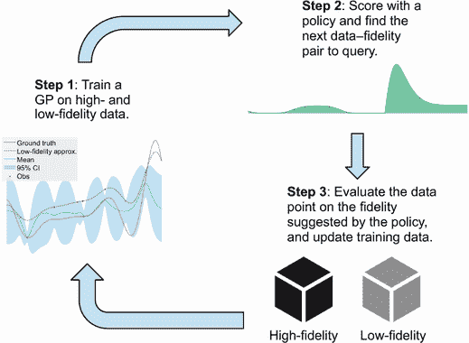

图 9.3 多保真度贝叶斯优化循环。GP 在高保真函数和低保真函数的数据上进行训练，并且贝叶斯优化策略决定循环的每次迭代在哪里以及查询哪个函数。

### 9.2.1 格式化多保真数据集

为了建立多保真度优化问题，我们使用以下代码来描述我们的一维福瑞斯特目标函数及其在图 9.2 中的低保真近似；我们的搜索空间介于 -5 和 5 之间：

```py
def objective(x):                                               ❶
    y = -((x + 1) ** 2) * torch.sin(2 * x + 2) / 5 + 1 + x / 3  ❶
    return y                                                    ❶

def approx_objective(x):                                        ❷
    return 0.5 * objective(x) + x / 4 + 2                       ❷

lb = -5                                                         ❸
ub = 5                                                          ❸
bounds = torch.tensor([[lb], [ub]], dtype=torch.float)          ❸
```

❶ 真实的目标函数

❷ 目标函数的低保真近似

❸ 搜索空间的边界，供后续优化策略使用

特别重要的是一个 PyTorch 张量，它存储我们可以访问的每个保真度函数与我们试图最大化的真实目标函数之间的相关信息。我们假设我们知道这些相关性的值，并声明此张量 `fidelities` 如下所示：

```py
fidelities = torch.tensor([0.5, 1.0])
```

此张量有两个元素，对应于我们可以访问的两个保真度：0.5，我们用它来表示福瑞斯特函数 *f*(*x*) 与其低保真近似 *f̄*(*x*) 之间的相关性（图 9.2 中的实线和虚线），以及确切地是 1，这是福瑞斯特函数与其自身之间的相关性。

这些相关性值很重要，因为它们告诉我们 GP（高斯过程）在后续训练中应该对来自特定关联性的数据依赖多少：

+   如果低保真度近似值与真实目标函数的相关性很高，则该近似值提供了关于目标的大量信息。一个极端的例子是目标函数本身，它提供了完美的关于我们感兴趣的内容的信息，因此具有相关性值等于 1。

+   我们在示例中使用了一个相关性值为 0.5 的低保真度近似值，它提供了关于目标的不精确但仍然有价值的信息。

+   在相关性值为 0 的近似值的另一端，它对目标函数不提供任何信息；一个完全水平的线就是一个例子，因为这个“近似值”在整个定义域上都是常数。

图 9.4 展示了相关性的尺度：相关性越高，低保真度近似值提供的关于真实情况的信息越多。

设置关联性变量

通常，`fidelities`是一个具有*k*个元素的张量，其中*k*是我们可以查询的函数数目，包括目标函数。这些元素是介于 0 和 1 之间的数字，表示函数与目标之间的相关性。对于后续的学习和决策任务来说，将真实目标与自身之间的相关性 1 放置在张量的末尾更加方便。

不幸的是，关于如何设置这些关联性值并没有明确的规定；这个决定留给 BayesOpt 工程师决定。如果在您自己的用例中不知道这些值，您可以根据图 9.4 做出粗略估计，估计您的低保真度函数位于高保真度函数（真实情况）和无信息数据源之间的位置。

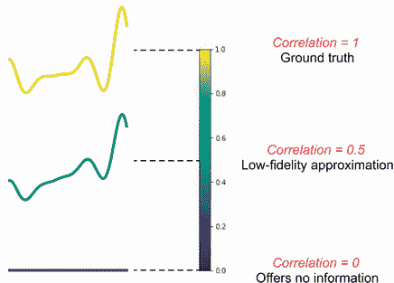

图 9.4 展示了低保真度近似值与真实情况之间的 0 到 1 之间的相关性尺度。相关性越高，低保真度近似值提供的关于真实情况的信息越多。

有了函数和相关性值，现在让我们创建一个示例训练数据集。我们首先在搜索空间内随机选择 10 个位置，并将它们存储为张量`train_x`：

```py
n = 10                                                             ❶

torch.manual_seed(0)                                               ❷
train_x = bounds[0] + (bounds[1] - bounds[0]) * torch.rand(n, 1)   ❸
```

❶ 训练集的大小

❷ 为了可重复性固定随机种子

❸ 从空间中均匀随机抽取点

张量`train_x`有 10 行 1 列，因为我们在一维空间中有 10 个数据点。其中的每个数据点都与一个关联性相关，表明观测结果来自高保真度还是低保真度（也就是说，每个数据点是高保真度或低保真度观测）。我们通过在`train_x`中添加一列来表示每个数据点的关联性来将这些信息编码到我们的数据集中，如图 9.5 所示。

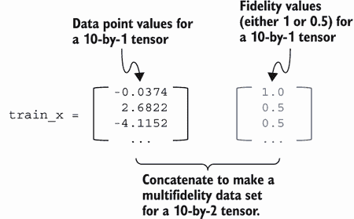

图 9.5 是对多保真度数据集中的特征进行格式化说明。每个数据点都与正确度相关联；这些正确度的值存储在训练集的额外列中。

注意要记住，我们的目标是对来自两个来源的数据进行高斯过程训练：地面真实信息和低保真度函数。为此，我们将为我们拥有的 10 个数据点随机分配每个数据点的正确度。

我们使用`torch.randint(2)`来随机选择介于 0（包含）和 2（不包含）之间的整数，有效地在 0 和 1 之间进行选择。这个数字确定每个数据点来自于哪个函数：0 表示数据点在低保真度近似*f̄*(*x*)上进行评估；1 表示数据点在目标函数*f*(*x*)上进行评估。然后，我们提取`fidelities`中每个数据点对应的相关值，并将这个相关值的数组连接到我们的训练数据中：

```py
train_f = fidelities[torch.randint(2, (n, 1))]         ❶
train_x_full = torch.cat([train_x, train_f], dim=1)    ❷
```

❶ 随机选择每个数据点的正确度（因此也是相关值）

❷ 将相关值添加到训练数据中

查看完整的训练数据`train_x_full`，我们可以看到前两个数据点是

```py
tensor([[-0.0374,  1.0000],   ❶
        [ 2.6822,  0.5000],   ❷
        ...
```

❶ 第一个数据点在 f(x)上进行评估。

❷ 第二个数据点在*f̄* (x)上进行评估。

`train_x_full`的第一列包含数据点在-5 到 5 之间的位置，而第二列包含相关值。这个输出意味着我们的第一个训练点在-0.0374 处，并且在*f*(*x*)上进行评估。另一方面，第二个训练点在 2.6822 处，这次在*f̄*(*x*)上进行评估。

现在，我们需要适当地生成观测值`train_y`，以便使用正确的函数计算观测值：`train_y`的第一个元素等于*f*(–0.0374)，第二个元素等于*f̄* (2.6822)，依此类推。为了做到这一点，我们编写了一个辅助函数，该函数接受完整的训练集，其中最后一列包含相关值，并调用适当的函数来生成`train_y`。即，如果相关值为 1，则调用`objective()`，即*f*(*x*)，如前所定义；如果相关值为 0.5，则调用`approx_objective()`求解*f̄*(*x*)：

```py
def evaluate_all_functions(x_full):
    y = []
    for x in x_full:                             ❶
        if torch.isclose(x[-1], torch.ones(1)):  ❷
            y.append(objective(x[:-1]))          ❷
        else:                                    ❸
            y.append(approx_objective(x[:-1]))   ❸

    return torch.tensor(y).unsqueeze(-1)         ❹
```

❶ 迭代遍历数据点

❷ 如果相关值为 1，则查询 f(x)

❸ 如果相关值为 0.5，则查询*f̄* (x)

❹ 重新调整观测张量的形状以符合正确的形状要求

在`train_x_full`上调用`evaluate_all_functions()`会给我们提供通过适当的函数评估得到的观测值`train_y`。我们的训练集在图 9.6 中可视化，其中包含三个高保真观测结果和七个低保真度观测结果。

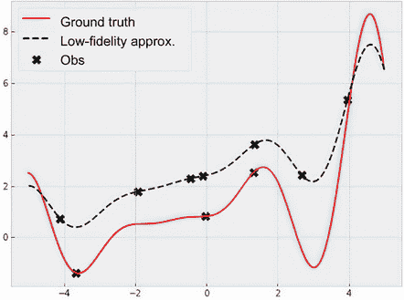

图 9.6 是一个从 Forrester 函数及其低保真度近似中随机抽样得到的训练数据集。此训练集包含三个高保真观测结果和七个低保真度观测结果。

这就是我们在多精度贝叶斯优化中生成和格式化训练集的方法。我们的下一个任务是以一种同时使用基本事实和低精度近似的方式在这个数据集上训练 GP。

### 9.2.2 训练多精度 GP

我们在本节的目标是拥有一个接收一组多精度观测并输出关于目标函数的概率预测的 GP——即要最大化的目标函数*f*(*x*)。

请记住，在第 2.2 节中，GP 是无限多个变量的 MVN 分布。GP 使用协方差函数模拟任意一对变量之间的协方差（因此也是相关性）。正是通过任意两个变量之间的这种相关性，GP 可以在观察到另一个变量的值时对一个变量进行预测。

关于变量的相关性和更新信念的提醒

假设有三个变量*A*、*B*和*C*，用三元高斯分布联合建模，其中*A*和*B*之间的相关性很高，但*A*和*C*以及*B*和*C*之间的相关性都很低。

现在，当我们观察到*A*的值时，我们关于*B*的更新信念的不确定性（表示为*B*值的后验分布）显著减少。这是因为*A*和*B*之间的相关性很高，因此观察到*A*的值给了我们关于*B*值的很多信息。然而，对于*C*来说情况并非如此，因为*A*和*C*之间的相关性很低，所以对*C*的更新信念仍然存在相当大的不确定性。请参阅第 2.2.2 节，了解关于房价的类似且详细的讨论。

正如我们在第 2.2.2 节中学到的，只要我们有一种方法来模拟任意一对变量之间的相关性（即任意两个给定位置的函数值），我们就可以相应地更新 GP，以反映我们关于域中任何位置函数的更新信念。在多精度设置中，这仍然是正确的：只要我们有一种方法来模拟两个观察之间的相关性，即使其中一个来自高精度*f*(*x*)，另一个来自低精度*f̄*(*x*)，我们也可以更新 GP 上的目标函数*f*(*x*)。

我们需要使用一个协方差函数，它可以计算两个给定观测之间的协方差，这些观测可能来自同一精度，也可能不是。幸运的是，对于我们来说，BoTorch 提供了一个修改过的 Matérn 核函数，考虑了我们训练集中每个数据点关联的精度相关值：

+   如果数据点的相关值很高，核函数将在观察到的数据点和任何附近点之间产生高协方差，从而使我们能够通过一个信息丰富的观察来减少 GP 的不确定性。

+   如果相关值很低，核函数将输出低协方差，后验不确定性将保持较高。

注意：我们首次在第 3.4.2 节了解到 Matérn 内核。虽然我们不会在这里详细介绍多保真度 Matérn 内核，但感兴趣的读者可以在 BoTorch 的文档中找到更多信息（[`mng.bz/81ZB`](http://mng.bz/81ZB)）。

由于具有多保真度内核的 GP 被实现为特殊的 GP 类，我们可以从 BoTorch 中导入它，而不必编写自己的类实现。具体来说，这个 GP 是`SingleTaskMultiFidelityGP`类的一个实例，它接受一个多保真度训练集`train_x_full`和`train_y`。初始化还有一个`data_fidelity`参数，应设置为包含相关值的`train_x_full`中的列的索引；在我们的情况下，这是`1`：

```py
from botorch.models.gp_regression_fidelity
➥import SingleTaskMultiFidelityGP         ❶

model = SingleTaskMultiFidelityGP(
➥train_x_full, train_y, data_fidelity=1)  ❷
```

❶ 导入 GP 类实现

❷ 初始化多保真度 GP

初始化模型后，我们现在需要通过最大化观察数据的似然来训练它。（有关为什么选择最大化似然来训练 GP 的更多信息，请参见第 3.3.2 节。）由于我们拥有的 GP 是来自 BoTorch 的一个特殊类的实例，我们可以利用 BoTorch 的辅助函数`fit_gpytorch_mll()`，它在幕后促进了训练过程。我们需要做的就是初始化一个（对数）似然对象作为我们的训练目标，并将其传递给辅助函数：

```py
from gpytorch.mlls.exact_marginal_log_likelihood import  ❶
➥ExactMarginalLogLikelihood                             ❶
from botorch.fit import fit_gpytorch_mll                 ❶

mll = ExactMarginalLogLikelihood(model.likelihood,
➥model)                                                 ❷
fit_gpytorch_mll(mll);                                   ❸
```

❶ 导入对数似然目标和用于训练的辅助函数

❷ 初始化对数似然目标

❸ 训练 GP 以最大化对数似然

这些令人惊讶的几行代码是我们需要训练一组观测的多保真度 GP 的全部内容。

BoTorch 关于数据类型和缩放的警告

当运行上述代码时，较新版本的 GPyTorch 和 BoTorch 可能会显示两个警告，第一个警告是

```py
UserWarning: The model inputs are of type torch.float32\. It is strongly 
recommended to use double precision in BoTorch, as this improves both 
precision and stability and can help avoid numerical errors. See 
https:/ /github.com/pytorch/botorch/discussions/1444
  warnings.warn(
```

此警告指示我们应该为`train_x`和`train_y`使用不同的数据类型，默认为`torch.float32`，以提高数值精度和稳定性。为此，我们可以在代码中添加以下内容（在脚本开头）：

```py
torch.set_default_dtype(torch.double)
```

第二个警告涉及将输入特征`train_x`缩放到单位立方体（每个特征值介于 0 和 1 之间）以及将响应值`train_y`标准化为零均值和单位方差：

```py
InputDataWarning: Input data is not 
 contained to the unit cube. Please consider min-max scaling the input data.
  warnings.warn(msg, InputDataWarning)
InputDataWarning: Input data is not standardized. Please consider scaling 
the input to zero mean and unit variance.
  warnings.warn(msg, InputDataWarning)
```

缩放`train_x`和`train_y`有助于我们更容易地适应 GP，并且更加数值稳定。为了保持我们的代码简单，我们不会在这里实现这样的缩放，而是使用`warnings`模块过滤掉这些警告。感兴趣的读者可以参考第二章的练习以获取更多细节。

现在，为了验证这个训练过的 GP 能否学习关于训练集的信息，我们使用均值和 95% CI 可视化 GP 对 *f*(*x*) 在 -5 和 5 之间的预测。

我们的测试集`xs`是一个密集网格（超过 200 个元素），位于 -5 和 5 之间：

```py
xs = torch.linspace(−5, 5, 201)
```

与我们在之前章节中看到的情况不同，我们需要用额外的一列来增强这个测试集，表示我们想要预测的保真度。换句话说，测试集`xs`需要与训练集`train_x_full`的格式相同。由于我们对 GP 对*f*(*x*)的预测感兴趣，所以我们添加了一列额外的全为 1 的列（因为 1 是*f*(*x*)的相关值）：

```py
with torch.no_grad():                                             ❶
    pred_dist = model(torch.vstack([xs, torch.ones_like(xs)]).T)  ❷
    pred_mean = pred_dist.mean                                    ❸
    pred_lower, pred_upper = pred_dist.confidence_region()        ❹
```

❶ 禁用梯度跟踪

❷ 用保真度列增强测试集并将其传递给模型

❸ 计算均值预测

❹ 计算 95%置信区间

这些预测在图 9.7 中进行了可视化，该图展示了关于我们的多保真度 GP 的一些重要特征：

1.  关于*f*(*x*)的均值预测大致经过大约–3.6，0 和 1.3 的高保真度观测点。这种插值是有意义的，因为这些数据点确实是在*f*(*x*)上评估的。

1.  在我们只有低保真度观测但没有高保真度观测的区域（例如，在–2 和大约 2.7 附近），我们对*f*(*x*)的不确定性仍然减少了。这是因为低保真度观测提供了关于*f*(*x*)的信息，即使它们没有在*f*(*x*)上进行评估。

1.  在这些低保真度观测中，我们发现在 4 处的数据点可能为优化策略提供有价值的信息，因为该数据点捕捉到了该区域目标函数的上升趋势。通过利用这些信息，优化策略可以在附近发现全局最优点，大约在 4.5 附近。

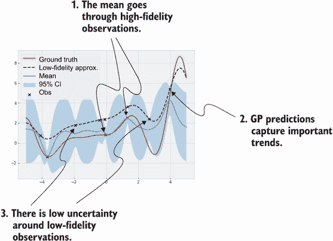

图 9.7 多保真度 GP 对客观函数（地面真相）的预测。均值预测适当地经过高保真度观测，但在低保真度观测周围的不确定性仍然减少。

图 9.7 显示，GP 成功地从多保真度数据集中学习。为了将我们从低保真度观测中学习和预测*f*(*x*)的能力推向极限，我们可以修改生成训练集的方式，使其只包含低保真度观测。我们通过将`train_x_full`中的额外列中的相关值设置为`0.5`来实现这一点：

```py
train_f = torch.ones_like(train_x) * fidelities[0]     ❶
train_x_full = torch.cat([train_x, train_f], dim=1)    ❷
```

❶ 所有相关值均为 0.5。

❷ 将相关值添加到训练集

重新运行迄今为止的代码将生成图 9.8 的左侧面板，在那里我们看到所有数据点确实来自低保真度逼近*f̄*(*x*)。与图 9.7 相比，我们在这里对我们的预测更不确定，这是适当的，因为仅观察到低保真度观测，GP 对客观函数*f*(*x*)的学习不如图 9.7 那样多。

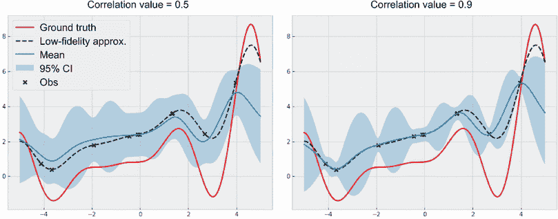

图 9.8 由只基于低保真度观测训练的 GP 对客观函数（地面真相）的预测。左侧显示相关值为 0.5 时的结果；右侧显示相关值为 0.9 时的结果，表现出较少的不确定性。

为了进一步展示我们多适应性高斯过程的灵活性，我们可以玩弄存储在`fidelities`中的相关值（假设我们知道如何适当地设置这些相关值）。正如我们在第 9.2.1 节中所学到的，这个张量中的第一个元素表示*f*(*x*)和*f̄*(*x*)之间的相关性，大致对应于高斯过程应该“相信”低保真度观测的程度。通过将这个第一个元素设置为 0.9（而不是我们当前的 0.5），我们可以更重视低保真度的观测。也就是说，我们告诉高斯过程从低保真度数据中学到更多，因为它提供了关于*f*(*x*)的大量信息。图 9.8 的右侧显示了产生的高斯过程，其中我们的不确定性确实比左侧面板低。

除了多适应性高斯过程模型的灵活性之外，图 9.8 还展示了在`fidelities`张量中具有正确相关值的重要性。比较图 9.8 中的两个面板，我们发现 0.5 是两个保真度之间的相关值的较好值，而不是 0.9：

+   在右面板中，由于我们过度依赖和信任低保真度的观测，我们的预测在大部分空间中错过了真实目标*f*(*x*)。

+   在左面板中，95%的置信区间适当地更宽以反映我们对*f*(*x*)的不确定性。

换句话说，我们不希望过高估计低保真度近似*f̄*(*x*)对目标*f*(*x*)的信息量。

到目前为止，我们已经学会了如何用多适应性高斯过程建模一个函数。在本章的其余部分，我们讨论多适应性优化问题的第二部分：决策。更具体地说，我们学习如何设计一个多适应性优化策略，该策略在贝叶斯优化循环的每一步选择在哪个位置和查询哪个函数。

## 9.3 在多适应性优化中平衡信息和成本

为了能够在查询的信息性（低或高保真度）和运行该查询的成本之间进行权衡，我们需要一种方法来对查询成本进行建模和推理。在下一节中，我们学习如何用线性模型表示查询给定保真度的成本。使用这个成本模型，我们然后实现一个多适应性贝叶斯优化策略，平衡成本和进行优化进展。我们使用的代码存储在 CH09/02 - Multi-fidelity optimization.ipynb 笔记本中。

### 9.3.1 建模不同保真度查询的成本

在多保真度优化问题中，我们假设我们知道查询每个我们可以访问的函数的成本，无论是目标函数*f*(*x*)本身还是低保真度近似*f̄*(*x*)。为了促进模块化的优化工作流程，我们需要将关于查询每个函数成本的信息表示为一个成本模型。该模型接受一个给定的数据点（其中包含一个额外的特征，包含相关值，正如我们在第 9.2.1 节中看到的那样），并返回在指定保真度上查询该数据点的已知成本。

注意，由于已知在保真度上查询的成本，因此这个成本模型中没有涉及预测。我们只需要这个模型公式来保持我们在下一节学习的优化过程。

BoTorch 提供了一个名为`AffineFidelityCostModel`的线性成本模型的类实现，来自于`botorch.models.cost`模块。这个线性成本模型假设查询成本遵循图 9.9 所示的关系，其中查询在保真度上的成本与该保真度和地面真实值*f*(*x*)之间的相关性呈线性关系。这个线性趋势的斜率是图 9.9 中的权重参数，而进行任何查询都有一个固定成本。

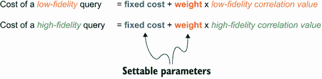

图 9.9 多保真度优化的线性成本模型。在保真度上查询数据点的成本与该保真度和地面真实值*f*(*x*)之间的相关性呈线性关系。

我们使用以下代码初始化这个线性成本模型，其中我们将固定成本设为 0，权重设为 1。这意味着查询低保真度数据点将花费我们确切的低保真度近似的相关值，即 0.5（成本单位）。类似地，查询高保真度数据点将花费 1（成本单位）。在这里，`fidelity_weights`参数接受一个字典，将`train_x_full`中包含相关值的列的索引映射到权重（在我们的案例中为`1`）：

```py
from botorch.models.cost import AffineFidelityCostModel

cost_model = AffineFidelityCostModel(
  fixed_cost=0.0,              ❶
  fidelity_weights={1: 1.0},   ❷
)
```

❶ 固定的查询成本

❷ 与相关值相乘的线性权重

注意，正在使用的成本单位取决于具体的应用。这个成本归结为查询目标和查询低保真度近似之间的“便利性”差异，这可以是时间（单位可以是分钟、小时或天）、金钱（以美元计算）或某种努力的度量，并应由用户设置。

线性趋势捕捉了相关值与成本之间的关系：具有高相关值的高信度函数应具有较高的查询成本，而低信度函数的查询成本应较低。两个可设置的参数——固定成本和权重——允许我们灵活地建模许多类型的查询成本。（我们将看到不同类型的查询成本如何导致下一节做出不同的决策。）有了这个成本模型，我们现在准备好学习如何在多信度优化问题中平衡成本和进展了。

建模非线性查询成本

本章中我们只使用线性成本模型。如果您的用例要求将查询成本建模为非线性趋势（例如二次或指数趋势），您可以实现自己的成本模型。

这是通过扩展我们正在使用的`AffineFidelityCostModel`类并重写其`forward()`方法来完成的。`AffineFidelityCostModel`类的实现在 BoTorch 的官方文档中显示（[`botorch.org/api/_modules/botorch/models/cost.xhtml`](https://botorch.org/api/_modules/botorch/models/cost.xhtml)），在那里我们看到`forward()`方法实现了查询成本与相关值之间的线性关系，如图 9.9 所示：

```py
def forward(self, X: Tensor) -> Tensor:
    lin_cost = torch.einsum(                                      ❶
        "...f,f", X[..., self.fidelity_dims], self.weights.to(X)  ❶
    )                                                             ❶
    return self.fixed_cost + lin_cost.unsqueeze(-1)               ❷
```

❶ 将相关值与权重相乘

❷ 添加了固定成本

在自定义成本模型的新类中，您可以重写此`forward()`方法来实现您需要的查询成本与相关值之间的关系。即使使用自定义成本模型，我们在本章中使用的其他代码也不需要修改，这说明了 BoTorch 的模块化设计的好处。

### 9.3.2 优化每美元的信息量以指导优化

我们现在回到本章开头提出的问题：我们应该如何平衡通过查询函数获得的信息量和查询该函数的成本？在多信度优化中，高信度函数（真实值）为我们提供了关于要优化的目标*f*(*x*)的精确信息，但查询成本很高。另一方面，低信度近似评估成本低廉，但只能提供关于*f*(*x*)的不精确信息。多信度贝叶斯优化策略的工作是决定如何平衡这一点。


我们已经从第 9.3.1 节得到了一个模型，计算了查询任何给定数据点的成本。至于另一方面，我们需要一种方法来量化我们将从给定查询中学到的目标函数的信息量，这可以来自于目标*f*(*x*)本身，也可以来自于低信度近似*f̄*(*x*)。

注意：关于 *f*(*x*) 或者更具体地说，关于 *f*(*x*) 最优解的信息量，正是我们在第六章学到的 Max-value Entropy Search（MES）策略用来对其查询进行排序的。MES 选择给出最多关于 *f*(*x*) 最高值的信息的查询，在单保真度设置中，我们只能查询目标。

由于这个信息增益度量是一个通用的信息论概念，因此它也可以应用于多信度设置。换句话说，我们使用 MES 作为基本策略来计算在优化过程中每个查询中关于 *f*(*x*) 最优解的信息量。现在，有了成本和信息增益这两个组成部分，我们现在需要设计一种方法来平衡这两者，从而得到一个成本感知的查询效用度量。

投资回报数量

为了量化查询的成本感知效用，我们使用经济学中的一个常见指标，称为投资回报（ROI）度量，该度量是通过将投资的利润除以投资成本来计算的。在多信度优化中使用 MES 时，利润是从查询数据点中获得的信息量，成本是查询成本。

记住，贝叶斯优化策略的收购分数是指策略为量化搜索空间内的每个数据点分配的分数，以量化该点在帮助我们优化目标函数方面的价值。在这里我们使用的 ROI 收购分数，是通过每个数据点提供关于目标最优解的信息量来评分，每个单位成本计算。这个计算在图 9.10 中可视化。

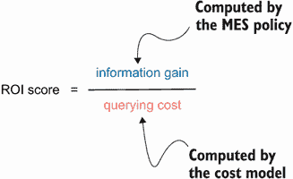

图 9.10 多信度优化的 ROI 收购分数公式。该分数量化了每个单位成本中查询提供的关于目标最优解的信息量。

我们看到，这个 ROI 分数是一个适当的度量，通过查询所获得的信息量与进行该查询的成本加权：

+   如果我们可以潜在地进行的两个查询具有相同的成本但产生不同的信息增益，我们应该选择提供更多信息的那一个。

+   如果两个查询提供了相同数量的关于目标最优解的信息，我们应该选择成本较低的那一个。

这种权衡允许我们从廉价的、低保真度的近似中获取关于目标函数 *f*(*x*) 的信息，如果这些近似确实是有信息的。另一方面，如果低保真度查询停止提供关于 *f*(*x*) 的信息，我们将转向高保真度数据点。基本上，我们始终选择最佳的成本感知决策，以确保“物有所值”。

要实现这种成本感知的 MES 变体，我们可以利用 BoTorch 的 `qMultiFidelityMaxValueEntropy` 类实现。该实现需要一些组件作为参数传入：

+   *在图 9.10 中进行 ROI 计算的成本效用对象*。该对象使用 `InverseCostWeightedUtility` 类实现，通过其成本的倒数对查询的效用进行加权。初始化时需要我们之前创建的成本模型：

    ```py
    from botorch.acquisition.cost_aware import InverseCostWeightedUtility

    cost_aware_utility = InverseCostWeightedUtility(cost_model=cost_model)
    ```

+   *用作 MES 的熵计算候选集的 Sobol 序列。*我们首次了解到在第 6.2.2 节中使用 Sobol 序列与 MES，并且这里的过程与之前相同，我们从单位立方体中抽取一个 1,000 元素的 Sobol 序列（在我们的一维情况下，它只是从 0 到 1 的段），并将其缩放到我们的搜索空间。在多保真设置中，我们需要做的另一件事是用额外的列来增强此候选集，以表示我们想要在目标 *f*(*x*) 中测量熵的相关值为 1：

    ```py
    torch.manual_seed(0)                                   ❶

    sobol = SobolEngine(1, scramble=True)                  ❷
    candidate_x = sobol.draw(1000)                         ❷

    candidate_x = bounds[0] + (bounds[1] - bounds[0]) *
    ➥candidate_x                                          ❸

    candidate_x = torch.cat([candidate_x, torch.ones_like(
    ➥candidate_x)], dim=1)                                ❹
    ```

    ❶ 为了可重现性而固定随机种子

    ❷ 在单位立方体内从 Sobol 序列中抽取 1,000 个点

    ❸ 将样本缩放到我们的搜索空间

    ❹ 用地面实况的指数增强样本

+   *最后，将给定数据点从任何保真度投影到地面实况的辅助函数。*此投影在我们的策略用于计算采集分数的熵计算中是必要的。在这里，BoTorch 提供了该辅助函数 `project_to_target_fidelity`，如果我们的训练集中的最后一列包含相关值，并且地面实况的相关值为 1，那么它就不需要任何进一步的参数化，这两个条件在我们的代码中都成立。

使用上述组件，我们实现我们的成本感知、多保真 MES 策略如下所示：

```py
from botorch.acquisition.utils import project_to_target_fidelity

policy = qMultiFidelityMaxValueEntropy(
    model,
    candidate_x,                             ❶
    num_fantasies=128,
    cost_aware_utility=cost_aware_utility,   ❷
    project=project_to_target_fidelity,      ❸
)
```

❶ 来自 Sobol 序列的样本

❷ 通过成本的倒数对效用进行加权的成本效用对象

❸ 投影辅助函数

到此为止，我们可以使用此策略对象根据任何保真度对每个数据点进行评分，评估其在帮助我们找到目标最优解方面的成本调整值。拼图的最后一块是我们用来优化此策略的采集分数，以找到每次搜索迭代中 ROI 分数最高的点的辅助函数。在以前的章节中，我们使用 `botorch.optim.optimize` 模块中的 `optimize_acqf` 来优化单一保真度情况下的采集分数，这仅在我们的搜索空间是连续的情况下有效。

注意：在我们当前的多保真设置中，用于查询位置的搜索空间仍然是连续的，但用于查询的函数选择是离散的。换句话说，我们的搜索空间是混合的。幸运的是，BoTorch 为混合搜索空间提供了类似的辅助函数：`optimize_acqf_mixed`。

除了`optimize_acqf`通常接受的参数外，新的辅助函数`optimize_acqf_mixed`还有一个`fixed_features_list`参数，它应该是一个字典列表，每个字典将`train_x_`的一个离散列的索引映射到列包含的可能值。在我们的情况下，我们只有一个离散列，即包含相关值的最后一列，因此我们使用`[{1: cost.item()} for cost in fidelities]`作为`fixed_features_list`参数。此外，我们通常传递给辅助函数的`bounds`变量现在也需要包含相关值的边界。总的来说，我们使用以下方式优化我们的多保真 MES 获取分数：

```py
from botorch.optim.optimize import optimize_acqf_mixed

next_x, acq_val = optimize_acqf_mixed(
    policy,
    bounds=torch.cat(                                                ❶
        [bounds, torch.tensor([0.5, 1.0]).unsqueeze(-1)], dim=1      ❶
    ),                                                               ❶
    fixed_features_list=[{1: cost.item()} for cost in fidelities],   ❷
    q=1,
    num_restarts=20,
    raw_samples=50,
)
```

❶ 搜索空间的边界，包括相关值的边界

❷ 相关列可能包含的离散值

这个辅助函数完成了我们需要使用多保真 MES 策略的代码。图 9.11 的底部面板可视化了通过我们在第 9.2.2 节中训练的多保真 GP 计算的获取分数。在这个底部面板中，阴影区域的边界（表示低保真查询的分数）超过了斜纹图案区域的边界（高保真查询的分数），这意味着在当前知识条件下，低保真查询比高保真查询更具成本效益。最终，我们进行的最佳查询，表示为星号，约为低保真近似*f̄*(*x*)的 3.5。


图 9.11 对于目标函数的当前 GP 信念（顶部）和通过多保真 MES 策略计算的获取分数（底部）。在这个例子中，由于其低成本，低保真查询优于高保真查询。

在图 9.11 中，低保真查询是最佳的类型，因为相对于任何高保真查询，它提供了更多的信息。然而，情况并非总是如此。通过修改我们从第 9.2.2 节中的数据生成过程以生成所有低保真观测训练集并重新运行我们的代码，我们得到了图 9.12 的左面板，这次，最优决策是查询高保真函数*f*(*x*)。这是因为根据我们的高斯过程信念，我们已经充分从低保真数据中学到了东西，现在是时候我们检查地面真相*f*(*x*)了。

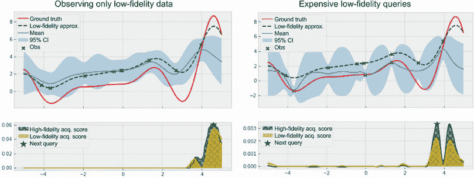

图 9.12 高保真查询优于低保真查询的情况。左侧，训练集仅包含低保真观测。右侧，低保真查询的成本几乎与高保真查询相同。

通过研究查询成本对决策的影响来最终分析我们策略的行为。为此，我们改变了查询成本，使低保真度的查询比高保真度的查询便宜得不多，具体方法是将第 9.3.1 节中描述的固定查询成本从 0 增加到 10。这种改变意味着低保真度的查询现在需要 10.5 个成本单位，而高保真度的查询现在需要 11 个。与之前的 0.5 和 1 的成本相比，10.5 和 11 更接近，使得图 9.10 中的两个保真度的分母几乎相等。这意味着低保真度的近似值*f̄*(*x*)的查询成本几乎和目标函数*f*(*x*)本身一样高。鉴于这些查询成本，图 9.12 的右面板显示了 MES 策略如何对潜在查询打分。这一次，因为高保真度查询并不比低保真度查询昂贵得多，所以更倾向于前者，因为它们能够给我们更多关于*f*(*x*)的知识。

这些示例表明，MES 可以确定在信息和成本适当平衡的情况下的最优决策。也就是说，当低保真度查询成本低且能够提供关于目标函数的实质性信息时，策略会给低保真度查询分配更高的分数。另一方面，如果高保真度查询要么显著更具信息量，要么成本差不多，那么策略将更倾向于高保真度查询。

## 9.4 在多保真度优化中测量性能

我们之前的讨论表明，多保真度 MES 策略能够在选择两个保真度进行查询时做出恰当的决策。但是这个策略比只查询地面真相*f*(*x*)的常规 BayesOpt 策略好吗？如果是这样，它究竟好多少呢？在本节中，我们学习如何在多保真度设置中对 BayesOpt 策略的性能进行基准测试，这需要额外的考虑。我们显示的代码可以在 CH09/03-测量性能.ipynb 笔记本中找到。

注意在前面的章节中，为了衡量优化进展，我们记录了训练集中收集到的最高目标值（即“现有值”）。如果策略*A*收集的现有值超过了策略*B*收集的现有值，我们就说策略*A*在优化方面比策略*B*更有效。

在多保真度的设置中，记录现有值是不起作用的。首先，如果我们要在训练集中记录现有值，只有选择最大标记值的高保真度数据点才有意义。然而，这个策略忽略了低保真度查询对于学习目标*f*(*x*)的任何贡献。例如，以图 9.13 中可视化的两种可能场景为例：

+   在左边的第一种情况中，我们进行了三次高保真度的观察，而最高观察值大约为 0.8。客观地说，在这种情况下我们没有进行优化进展；我们甚至没有探索过 *x* 大于 0 的区域。

+   在右边的第二种情况中，我们只进行了低保真度的观察，因此记录高保真度现任值甚至都不适用。然而，我们看到我们非常接近找到目标函数的最优解，因为我们的查询已经发现了函数在 4.5 左右的峰值。


图 9.13 在多保真度优化中使用高保真度现任者来衡量性能是不合适的。在左边，高保真度现任者大约为 0.8，而我们还没有发现目标的最优解。在右边，即使我们接近找到目标的最优解，也没有高保真度查询来记录现任值。

换句话说，我们应该更喜欢第二种情况而不是第一种，因为第二种情况表明了接近优化成功，而第一种情况则几乎没有优化进展。然而，使用高保真度的现任者作为进展度量并不能帮助我们区分这两种情况。因此，我们需要另一种衡量优化进展的方法。

BayesOpt 社区中常见的进展度量标准是当前给出最高后验均值的位置处的目标函数值。这个度量标准对应着以下问题的答案：如果我们停止运行 BayesOpt 并推荐一个点作为优化问题的解，我们应该选择哪个点？直觉上，我们应该选择在最合理的情况下（根据我们的 GP 信念），能够给出最高值的点，也就是后验均值最大化者。

我们看到后验均值最大化者促使我们在图 9.13 中进行的比较，左边的情况下，后验均值最大化者为 0，而目标值为 0.8（在单保真度情况下，均值最大化者通常对应于现任者），而右边的情况下，均值最大化者在 4.5 左右。换句话说，后验均值最大化者度量成功地帮助我们区分了这两种情况，并显示出左边的情况不如右边的情况。

为了实现这个度量标准，我们制作了一个辅助策略，该策略使用后验均值作为其收购分数。然后，就像我们在 BayesOpt 中优化常规策略的收购分数一样，我们使用这个辅助策略来优化后验均值。这个策略需要两个组件：

+   使用后验均值作为其收购分数的 BayesOpt 策略的类实现。这个类是 `PosteriorMean`，可以从 `botorch.acquisition` 导入。

+   一个*包装*策略，仅优化高保真度指标。这个包装器是必需的，因为我们的 GP 模型是多保真度的，当将该模型传递给优化策略时，我们总是需要指定要使用哪个保真度。此包装器策略实现为来自`botorch.acquisition.fixed_feature`的`FixedFeatureAcquisitionFunction`的一个实例。

总的来说，我们用以下辅助策略制定后验均值最大化器度量标准，其中包装策略接受`PosteriorMean`的一个实例，并且我们将其他参数指定如下：

+   *搜索空间的维度是* `d = 2`—我们的实际搜索空间是一维的，并且还有一个附加维度用于相关值（即查询的保真度）。

+   *要在优化期间固定的维度的索引,* `columns = [1]` *及其固定值* `values = [1]`—由于我们只想找到对应于目标函数、即高保真函数的后验均值最大化器，我们指定第二列（索引`1`）始终应为值 1：

```py
from botorch.acquisition.fixed_feature
➥import FixedFeatureAcquisitionFunction
from botorch.acquisition import PosteriorMean

post_mean_policy = FixedFeatureAcquisitionFunction(
    acq_function=PosteriorMean(model),   ❶
    d=2,                                 ❷
    columns=[1],                         ❸
    values=[1],                          ❹
)
```

❶ 优化后验均值

❷ 搜索空间的维度数

❸ 固定列的索引

❹ 固定列的数值

然后，我们使用熟悉的辅助函数`optimize_acqf`来找到最大化收获分数的点，即目标函数的后验均值（我们在 4.2.2 节首次了解到此辅助函数）：

```py
final_x, _ = optimize_acqf(
    post_mean_policy,       ❶
    bounds=bounds,          ❷
    q=1,                    ❷
    num_restarts=20,        ❷
    raw_samples=50,         ❷
)
```

❶ 优化后验均值。

❷ 其他参数与我们优化另一个策略时相同。

这个`final_x`变量是最大化目标函数后验均值的位置。在我们的 Jupyter 笔记本中，我们将这段代码放在一个辅助函数中，该函数返回`final_x`，并增加了一个相关值为 1，表示真实的目标函数：

```py
def get_final_recommendation(model):
    post_mean_policy = FixedFeatureAcquisitionFunction(...)  ❶
    final_x, _ = optimize_acqf(...)                          ❷

    return torch.cat([final_x, torch.ones(1, 1)], dim=1)     ❸
```

❶ 制作包装策略

❷ 优化收获分数

❸ 使用相关值为 1 增强最终推荐

现在，在 BayesOpt 循环期间，我们不再记录 incumbent 值作为优化进度的指示，而是调用此`get_final_recommendation`辅助函数。此外，我们现在没有每次运行中要进行的最大查询次数，而是有一个最大预算，可以用于低保真度或高保真度查询。换句话说，我们会一直运行我们的优化算法，直到累计成本超过我们的预算限制。我们的多保真 BayesOpt 循环的框架如下：

```py
budget_limit = 10                                  ❶

recommendations = []                               ❷
spent_budget = []                                  ❸

...                                                ❹

current_budget = 0

while current_budget < budget_limit:
    ...                                            ❺

    rec_x = get_final_recommendation(model)        ❻
    recommendations.append(evaluate_all_functions  ❻
    ➥(rec_x).item())                              ❻
    spent_budget.append(current_budget)            ❻

    ...                                            ❼

    current_budget += cost_model(next_x).item()    ❽

    ...                                            ❾
```

❶ 每次优化运行的最大成本

❷ 跟踪整个优化过程中最大化后验均值的推荐

❸ 跟踪每次迭代中已花费的预算

❹ 生成一个随机的起始观察

❺ 对当前数据进行 GP 训练

❻ 使用最新推荐更新记录

❼ 初始化策略并优化其收获分数

❽ 跟踪已花费的预算

❾ 更新训练数据

我们现在准备运行多保真度 MES 来优化 Forrester 目标函数。作为基准，我们还将运行单保真度 MES 策略，该策略仅查询地面实况 *f*(*x*)。我们拥有的 GP 模型是多保真度的，因此，要使用此模型运行单保真度的 BayesOpt 策略，我们需要 `FixedFeatureAcquisitionFunction` 类的包装策略来限制策略可以查询的保真度：

```py
policy = FixedFeatureAcquisitionFunction(
  acq_function=qMaxValueEntropy(model, candidate_x, num_fantasies=128), ❶
  d=2,
  columns=[1],                                                          ❷
  values=[1],                                                           ❷
)

next_x, acq_val = optimize_acqf(...)                                    ❸
```

❶ 包装策略是单保真度 MES。

❷ 将第二列（索引 1）中的相关值固定为 1

❸ 使用辅助函数 optimize_acqf 优化收购分数

运行这两种策略会生成图 9.14 中的结果，我们观察到多保真度 MES 明显优于单保真度版本。多保真度 MES 的成本效益性说明了在信息和成本之间取得平衡的好处。然而，我们注意到这只是一次运行的结果；在练习 1 中，我们多次以不同的初始数据集运行此实验，并观察这些策略的平均性能。

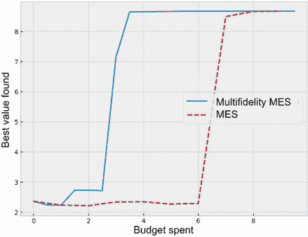

图 9.14 后验均值最大化器的目标值作为两种 BayesOpt 策略花费预算的函数。在这里，多保真度 MES 明显优于单保真度版本。

在本章中，我们学习了多保真度优化问题，即在优化目标函数与获取关于目标的知识成本之间取得平衡。我们学习了如何实现一个能够从多个数据源中学习的 GP 模型。然后，这个模型允许我们根据信息理论价值来推理查询的优化值。通过将这个信息理论量与查询成本结合在一起形成的投资回报率度量，我们设计了一个成本感知的多保真度 MES 策略的变体，可以自动权衡知识和成本。

## 9.5 练习 1：可视化多保真度优化中的平均性能

为了比较我们的策略的性能，图 9.14 可视化了在优化过程中后验均值最大化器的目标值与花费预算的关系。然而，这只是一次优化运行的结果，我们想要展示每个策略在多次实验中的平均性能。（我们在第四章的练习 2 中首次讨论了重复实验的想法。）在这个练习中，我们多次运行优化循环，并学习如何取得平均性能以获得更全面的比较。到练习结束时，我们将看到，多保真度 MES 在信息和成本之间取得了良好的平衡，并比其单保真度的对应物更有效地优化了目标函数。解决方案存储在 CH09/04 - Exercise 1.ipynb 笔记本中。

按照以下步骤进行：

1.  复制 CH09/03 - Measuring performance.ipynb 笔记本中的问题设置和多信度优化循环，并添加另一个变量表示我们要运行的实验次数（默认为 10）。

1.  为了方便重复实验，在优化循环代码中添加一个外部循环。这应该是一个有 10 次迭代的`for`循环，每次生成一个不同的随机观察结果。（这个随机生成可以通过将 PyTorch 的随机种子设置为迭代编号来完成，这样可以确保随机数生成器在具有相同种子的不同运行中返回相同的数据。）

1.  CH09/03 - Measuring performance.ipynb 笔记本中的代码使用两个列表，`recommendations`和`spent_budget`，来跟踪优化进度。将这些变量中的每一个变量都变成一个列表的列表，其中每个内部列表都承担与 CH09/03 - Measuring performance.ipynb 笔记本中相应列表相同的目的。这些列表的列表允许我们跟踪 10 次实验的优化进度，并在后续步骤中比较不同的优化策略。

1.  在我们的优化问题上运行多信度 MES 策略及其单信度版本。

1.  由于查询低信度函数的成本与查询高信度函数的成本不同，`spend_budget`中的列表可能与彼此不完全匹配。换句话说，在图 9.14 中曲线中的点在不同运行中没有相同的*x*坐标。这种不匹配阻止我们在多个运行中获取存储在`recommendations`中的平均进度。

    为了解决这个问题，我们对每个进度曲线使用线性插值，这使我们能够在规则网格上“填充”进度值。就是在这个规则网格上，我们将对每个策略在运行中的表现进行平均。对于线性插值，使用 NumPy 中的`np.interp`，它以规则网格作为其第一个参数；这个网格可以是一个介于 0 和`budget_limit`之间的整数数组：`np.arange(budget_limit)`。第二个和第三个参数是组成每个进度曲线的点的*x*和*y*坐标，即`spend_budget`和`recommendations`中的每个内部列表。

1.  使用线性插值的值来绘制我们运行的两种策略的平均性能和误差条，并比较它们的性能。

1.  由于我们当前正在测量优化性能的方式，我们可能会发现我们在每次运行中跟踪的推荐列表不是单调递增的。（也就是说，我们可能会得到一个比上一次迭代的推荐性能更差的推荐。）为了检查这种现象，我们可以绘制代表各个运行的优化进度的线性插值曲线，以及平均性能和误差条。为我们运行的两种策略实现此可视化，并检查结果曲线的非单调性。

## 9.6 练习 2：使用多个低保真度近似进行多保真度优化

我们在本章中学到的方法可以推广到存在多个我们可以查询的目标函数的低保真度近似的场景中。我们的策略是相同的：将我们从每个查询中获得的信息量除以其成本，然后选择提供最高投资回报率的查询。这个练习向我们展示了我们的多保真度 MES 策略可以在多个低保真度函数之间取得平衡。解决方案存储在 CH09/05 - Exercise 2.ipynb 笔记本中。

接下来执行以下步骤：

1.  对于我们的目标函数，我们使用名为 `Branin` 的二维函数，它是优化的常见测试函数，就像 Forrester 函数一样。BoTorch 提供了 Branin 的多保真度版本，因此我们使用 `from botorch.test_functions.multi_fidelity import AugmentedBranin` 将其导入到我们的代码中。为了方便起见，我们使用以下代码对该函数的域和输出进行缩放，这使 `objective` 成为我们评估查询时要调用的函数：

    ```py
    problem = AugmentedBranin()                              ❶

    def objective(X):
        X_copy = X.detach().clone()                          ❷
        X_copy[..., :-1] = X_copy[..., :-1] * 15 - 5         ❷
        X_copy[..., -2] = X_copy[..., -2] + 5                ❷
        return (-problem(X_copy) / 500 + 0.9).unsqueeze(-1)  ❷
    ```

    ❶ 从 BoTorch 中导入 Branin 函数

    ❷ 处理函数的输入和输出，将值映射到一个好的范围内

1.  将我们的搜索空间的边界定义为单位正方形。也就是说，两个下界为 0，两个上界为 1。

1.  声明存储我们可以查询的不同函数的相关值的 `fidelities` 变量。在这里，我们可以访问两个相关值分别为 0.1 和 0.3 的低保真度近似，因此 `fidelities` 应包含这两个数字和最后一个元素为 1。

    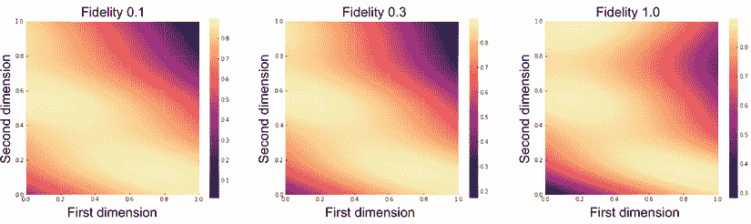

    图 9.15 目标函数 Branin（右侧）和两个低保真度近似

    这三个函数在图 9.15 中可视化，明亮的像素表示高目标值。我们可以看到，两个低保真度的近似都遵循地面真相展示的一般趋势，并且与真实情况的相似程度随着保真度值的增加而增加。也就是说，保真度为 0.3 的第二个近似（中间）与真实的目标函数（右侧）更相似，比保真度为 0.1 的第一个近似（左侧）更相似。

1.  将线性成本模型的固定成本设置为 0.2，权重设置为 1。这意味着在图 9.15 左侧查询低保真度函数的成本为 0.2 + 1 × 0.1 = 0.3。类似地，中间函数的成本为 0.5，真实目标函数的成本为 1.2。将每个实验的预算限制设置为 10，并将重复实验的次数也设置为 10。

1.  从 Sobol 序列中抽取的候选人数设置为 5,000，并且在使用辅助函数优化给定策略的获取分数时，使用 100 次重启和 500 个原始样本。

1.  重新定义助手函数 `get_final_recommendation`，以便为我们的二维目标函数设置适当的参数：`d = 3` 和 `columns = [2]`。

1.  运行多保真度最大值熵搜索策略及其单保真度版本的优化问题，并使用练习 1 中描述的方法绘制每个策略的平均优化进展和误差线。注意，在为单保真度策略创建包装器策略时，参数 `d` 和 `columns` 需要与上一步骤中设置的方式相同。验证多保真度策略的表现优于单保真度策略。

## 摘要

+   多保真度优化是一种优化设置，我们可以访问多个信息源，每个信息源具有自己的准确度和成本水平。在这种情况下，我们需要平衡从行动中获得的信息量和采取该行动的成本。

+   在多保真度优化中，高保真度函数提供确切的信息，但评估代价高，而低保真度函数查询成本低，但可能提供不准确的信息。在优化循环的每次迭代中，我们需要决定在哪里和哪个函数进行查询，以尽快找到目标函数的最优值。

+   每个保真度提供的信息水平通过其与真实值之间的相关性来量化，该相关性是一个介于 0 和 1 之间的数字。相关性越高，保真度与真实值越接近。在 Python 中，我们将每个数据点的相关性值存储为特征矩阵中的额外列。

+   基于可以处理训练数据点的相关性值的内核，可以对多保真度数据集进行训练，我们可以使用多保真度变体的 Matérn 内核来完成此任务。GP 对于预测的不确定性取决于每个观测点所来自的函数，以及如果它来自于低保真度函数，则该函数的相关性值如何。

+   我们使用线性模型来编码优化过程中每个保真度的查询成本。通过设置此模型的参数-固定成本和权重，我们可以建模查询成本与数据质量之间的正相关关系。也可以使用 BoTorch 实现非线性成本模型。

+   为了在信息性和成本之间取得平衡，我们使用 MES 策略的变体，通过查询成本的倒数对每个查询的信息量进行加权。该度量类似于经济学中的投资回报概念，并使用 BoTorch 中的 `InverseCostWeightedUtility` 类进行实现。

+   对于目标函数的最优值的信息增益的精确计算，即 MES 的核心任务，由于最优值的非高斯分布，因此是棘手的。为了近似计算信息增益，我们使用 Sobol 序列来表示整个搜索空间，减轻计算中的计算负担。

+   多信度 MES 策略成功平衡了信息和成本，并优先考虑成本效益高的查询。

+   为了优化多信度策略的收购分数，我们使用`optimize_ acqf_mixed`辅助函数，该函数可以处理混合搜索空间，其维度可以是连续的或离散的。

+   在多信度设置中准确测量性能，我们使用每次迭代中后验均值的最大化者作为终止前的最终建议。这一数量比高保真现有值更好地捕捉了我们对目标函数的了解。

+   在多信度设置中优化单信度收购分数，我们使用`FixedFeatureAcquisitionFunction`类的一个实例作为包装策略。为了初始化一个包装策略，我们声明搜索空间中的哪个维度是固定的，以及其值是多少。
