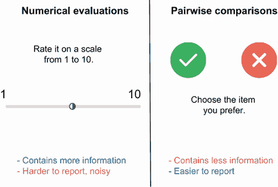
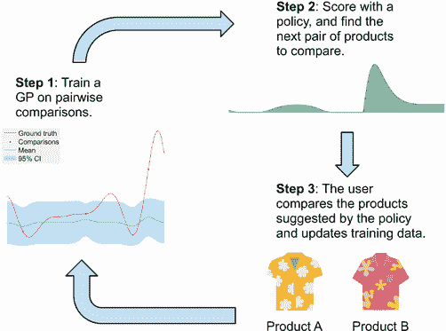
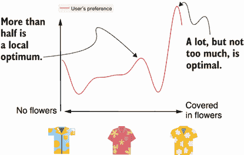
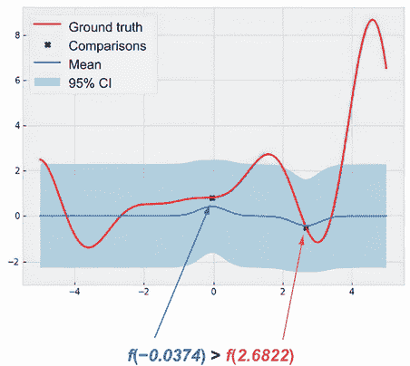
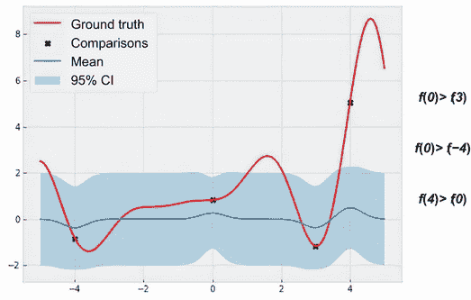
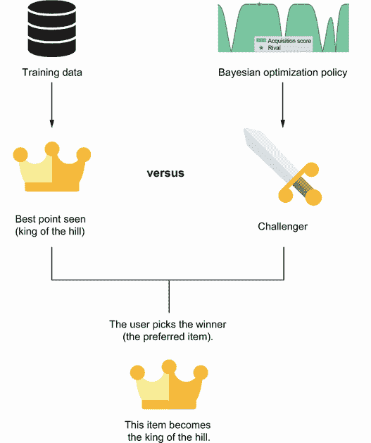
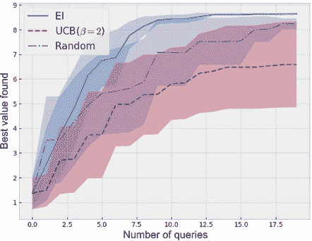

# 第十一章：通过偏好优化进行成对比较学习

本章涵盖

+   仅使用成对比较数据学习和优化偏好的问题

+   在成对比较上训练 GP

+   成对比较的优化策略

你是否曾经发现难以为某物（食物、产品或体验）打分？在 A/B 测试和产品推荐工作流程中，询问客户对产品的数值评分是一个常见任务。

定义术语 *A/B 测试* 指的是通过随机实验在两个环境（称为 *A* 和 *B*）中测量用户体验，并确定哪个环境更理想的方法。 A/B 测试通常由技术公司进行。

A/B 测试人员和产品推荐工程师经常需要处理从客户收集的反馈中的高水平噪音。通过*噪音*，我们指的是客户反馈所受到的任何类型的损坏。产品评分中的噪音示例包括在线流媒体服务上提供的广告数量，包裹的送货服务质量，或客户在消费产品时的一般心情。这些因素影响客户对产品的评分方式，可能会破坏客户对产品的真实评价。

不可控的外部因素使客户难以报告他们对产品的真实评价。因此，当在评分时难以选择数值评分作为对产品的评价时，客户通常会发现这很困难。在 A/B 测试和产品推荐中的反馈噪音的普遍存在意味着服务平台不能仅依靠从用户那里收集到的少量数据来了解其偏好。相反，平台需要从客户那里收集更多数据，以更加确定客户真正想要的是什么。

然而，正如在其他黑盒优化设置中一样，比如超参数调整和药物发现，查询目标函数是昂贵的。在产品推荐中，每当我们询问客户对产品的评分时，我们都面临着侵入客户体验和阻止他们继续使用平台的风险。因此，需要大量数据来更好地了解客户的偏好和具有侵入性之间存在自然紧张关系，可能导致客户流失。

幸运的是，有一种方法可以解决这个问题。心理学领域的研究（[`mng.bz/0KOl`](http://mng.bz/0KOl)）发现了一个直观的结果，即我们人类在进行成对比较的偏好反应方面要比在评分产品时更擅长（例如，“产品 A 比产品 B 更好”）。

定义 成对比较是一种收集偏好数据的方法。每次我们想要获取有关客户偏好的信息时，我们都会要求客户从两个项目中选择他们更喜欢的项目。成对比较不同于数值评分，其中我们要求客户在一定比例上对项目进行评分。

成对比较和评分之间难度差异的原因在于，比较两个项目是一项认知要求较低的任务，因此，我们可以在比较两个对象时更好地与我们的真实偏好保持一致，而不是提供数值评分。在图 10.1 中，考虑一个在线购物网站的两个示例界面，该网站正在尝试了解您对夏威夷衬衫的偏好：

+   第一个界面要求您按照从 1 到 10 的比例为衬衫评分。这可能很难做到，特别是如果您没有一个参考框架的话。

+   第二个界面要求您选择您更喜欢的衬衫。这个任务更容易完成。


图 10.1 生产推荐中用户偏好引导的示例。左侧，用户被要求对推荐产品进行评分。右侧，用户被要求选择他们更喜欢的产品。后者有助于更好地引导用户的偏好。

鉴于我们可以使用成对比较收集高质量数据的潜力，我们希望将这种偏好引导技术应用于用户偏好的 BayesOpt。问题是，“我们如何在成对比较数据上训练 ML 模型，然后，如何向用户呈现新的比较以最好地学习和优化他们的偏好？”我们在本章中回答了这些问题，首先使用一个能够有效地从成对比较中学习的 GP 模型。然后，我们开发了策略，将迄今为止我们找到的最佳数据点（代表一个产品）与一个有希望的竞争对手相比较，从而使我们能够尽快优化用户的偏好。换句话说，我们假设用户的偏好是定义在搜索空间上的目标函数，我们希望优化这个目标函数。

从成对比较中学习和优化用户偏好的这种设置是一个独特的任务，位于黑盒优化和产品推荐的交集处，两个社区都对此产生了兴趣。通过本章末尾，我们了解了如何从 BayesOpt 的角度解决这个问题，通过从用户那里收集数据来权衡开发和探索。

## 10.1 使用成对比较进行黑盒优化

在这一部分中，我们进一步讨论了成对比较在引导偏好任务中的有用性。然后，我们研究了为这种基于偏好的优化设置修改过的 BayesOpt 循环。

除了将精确的数字评估作为评级外，成对比较还提供了一种在生产推荐应用中收集有关客户信息的方法。与数字评级相比，成对比较对用户的认知负担较小，因此可能会产生更高质量的数据（即与用户真实偏好一致的反馈）。

多目标优化中的成对比较

成对比较特别有用的一个场景是在需要考虑多个标准的决策中。例如，假设你想买一辆车，正在选择 A 车和 B 车。为了做出决定，你列出了你在一辆车上关心的不同特征：外观、实用性、能效、成本等。然后你为两辆车在每个标准上评分，希望找到一个明显的赢家。不幸的是，A 车在某些标准上得分比 B 车高，但并不是所有标准都是如此，而 B 车在其余标准上的得分高于 A 车。

所以，在这两辆车之间没有明显的赢家，将不同标准的分数合并成一个单一分数可能会很困难。你关心某些标准胜过其他标准，所以在将这些标准与其他标准相结合以产生单一数字时，需要更加重视这些标准的权重。然而，确定这些权重的确切值可能比选择这两辆车本身更具挑战性！忽视具体细节，将每辆车作为一个整体，并将两辆车进行“头对头”比较可能更容易一些。

因此，在需要考虑多个标准的优化情况下，利用成对比较的便利性已经被利用起来。例如，Edward Abel、Ludmil Mikhailov 和 John Keane 的一个研究项目 ([`mng.bz/KenZ`](http://mng.bz/KenZ)) 使用成对比较来解决群体决策问题。

当然，成对比较并不一定比数字评估更好。虽然前者更容易从用户那里获取，但它们所包含的信息明显比后者少得多。比如，在图 10.1 中，你喜欢橙色衬衫胜过红色衬衫的回答正好包含一位信息（比较的结果是二元的；要么橙色比红色好，要么红色比橙色好，所以观察结果信息理论上构成了一位信息）。而如果你报告说你给橙色衬衫评了 8 分，红色衬衫评了 6 分，那么我们获得的信息就比仅仅知道橙色被高估要多得多。

换句话说，在选择从用户那里引出反馈的方法时总是存在权衡。数值评估包含更多信息，但容易受到噪声影响，并且可能给用户带来更大的认知负担。另一方面，两两比较提供的信息较少，但用户报告起来更容易。这些优缺点在图 10.2 中总结。



图 10.2 数值评分和两两比较在信息量和报告难度方面的差异。每种偏好引出方法都有其优缺点。

在考虑信息和报告难度之间的权衡时，如果我们愿意让用户完成更具认知要求的任务以获取更多信息，并且可以考虑到噪声，那么我们应该坚持使用数值评估。另一方面，如果我们更注重客户准确表达他们真实的偏好，并且愿意获取更少的信息，那么两两比较应该是我们引出客户反馈的首选方法。

其他引出客户偏好的方法

两两比较并不是减轻数值评估认知负担的唯一形式。例如，在线流媒体服务 Netflix 通过要求观众在三个选项中进行选择来收集观众的评分：“向下拇指”表示他们不喜欢某物，“向上拇指”表示他们喜欢某物，“双向上拇指”表示他们*喜欢*某物 ([`mng.bz/XNgl`](http://mng.bz/XNgl))。这种设置构成了一种有序分类问题，其中项目被分类到不同的类别中，并且类别之间存在固有的顺序。在这种情况下，产品推荐问题同样值得考虑，但在本章中我们将重点放在两两比较上。

在本章中，我们学习如何利用 BayesOpt 来促进使用两两比较来学习和优化客户偏好的任务。首先，我们研究了一个修改过的 BayesOpt 循环版本，如图 1.6 所示，如图 10.3 所示：

1.  在第一步中，GP 是根据两两比较数据而不是数值评估进行训练的。关键挑战在于确保 GP 对于目标函数（用户真实偏好函数）的信念反映了观察到的比较中的信息。

1.  在第二步中，BayesOpt 策略计算获取分数，以量化对用户每个潜在新查询的有用程度。用户的查询需要以一对产品的形式提供给用户进行比较。就像在其他情况下一样，策略需要平衡利用我们知道用户偏好高的区域和探索我们对用户偏好了解不多的其他区域。

1.  在第 3 步中，用户比较了由贝叶斯优化策略呈现给他们的两种产品，并报告他们更喜欢的产品。然后，将此新信息添加到我们的训练集中。



图 10.3 使用成对比较进行偏好优化的贝叶斯优化循环。高斯过程根据成对比较数据进行训练，而贝叶斯优化策略决定应该要求用户比较哪一对数据点。

我们在本章的剩余部分试图解决两个主要问题：

1.  我们如何仅根据成对比较训练高斯过程？高斯过程在数值响应上进行训练时，会产生具有量化不确定性的概率预测，这在决策中至关重要。我们能否在这里使用相同的模型来处理成对比较响应？

1.  我们应该如何生成新的产品对供用户比较，以便尽快确定用户偏好的最大化者？也就是说，我们如何通过成对比较最好地引出用户的反馈以优化他们的偏好？

## 10.2 制定偏好优化问题和格式化成对比数据

在我们开始解决这些问题之前，本节介绍了我们将在整章中解决的产品推荐问题以及我们如何在 Python 中模拟这个问题。正确设置问题将帮助我们更轻松地整合我们将在随后章节学习到的贝叶斯优化工具。我们在此处使用的代码包含在 CH10/01 - 从成对比较中学习.ipynb Jupyter 笔记本的第一部分中。

正如图 10.1 和 10.3 所示的，我们现在面临的情景是夏威夷衬衫的产品推荐问题。也就是说，想象我们经营一家夏威夷衬衫的在线购物网站，我们试图确定一款特定客户在购物时最大化偏好的产品。

为了简单起见，让我们假设在简要调查之后，我们得知对客户最重要的因素是衬衫上印花的数量。其他因素，如款式和颜色，也很重要，但对于这个客户来说，夏威夷衬衫最重要的是衬衫上的花朵有多少。此外，假设我们库存中有许多夏威夷衬衫，花朵数量各异，因此我们大致可以找到任何指定“花朵程度”的衬衫。因此，我们的目标是找到符合客户偏好的衬衫，这对我们来说是未知的。我们在一维搜索空间中进行这一搜索，其中空间的下限对应于没有花纹的衬衫，空间的上限包含覆盖着花朵的衬衫。

图 10.4 更详细地展示了我们的设置。在图的顶部部分，显示了客户的真实偏好以及随着衬衫花朵程度的变化而变化的情况：

+   *x*轴表示衬衫的花朵数量。在光谱的一端，我们有没有花朵的衬衫；另一端是满是花朵的衬衫。

+   *y*轴是每个衬衫的客户偏好度。客户对衬衫的偏好度越高，表示客户越喜欢这件衬衫。



图 10.4 在一个产品推荐问题中搜索具有最佳花朵数量的衬衫。我们的搜索空间是一维的，因为我们只搜索衬衫上花朵的数量。一件半面覆盖花朵的衬衫是一个局部最优点，而几乎完全覆盖的衬衫最大化了用户的偏好。

我们可以看到这个客户喜欢花纹衬衫：在衬衫的中间点过后有一个局部最优点，而偏好函数的全局最优点位于搜索空间的上界附近。这意味着一件有很多花朵但不完全覆盖的衬衫最大化了客户的偏好。

由于我们处理的是一个黑盒优化问题，在实际世界中我们实际上无法获得图 10.4 中客户的偏好曲线，我们需要使用成对比较来学习这个偏好函数，并尽快对其进行优化。现在，让我们看看如何在 Python 中设置这个优化问题。

你可能已经注意到，在图 10.4 中我们使用了前几章中使用的 Forrester 函数来模拟客户的目标函数，也就是客户的真实偏好。因此，这个函数的代码与前几章没有任何区别，其定义如下（定义范围是我们搜索空间的下界-5 和上界 5 之间）：

```py
def objective(x):                                       ❶
    y = -((x + 1) ** 2) * torch.sin(2 * x + 2) /
    ➥5 + 1 + x / 3                                     ❶
    return y                                            ❶

lb = -5                                                 ❷
ub = 5                                                  ❷
bounds = torch.tensor([[lb], [ub]], dtype=torch.float)  ❷
```

❶ 目标函数

❷ 搜索空间的边界

从前几章可以记得，当我们的数据标签具有数值值时，在变量`train_x`中的每个数据点都有对应的`train_y`标签。我们当前的设置有点不同。由于我们的数据以成对比较的形式存在，每个观察结果都来自于对`train_x`中的两个数据点进行比较，并且观察的标签指示了客户更看重哪个数据点。

注意：我们遵循 BoTorch 的规定，用一个包含两个元素的 PyTorch 张量来编码在 `train_x` 中每对数据点之间的每个配对比较的结果：第一个元素是在 `train_x` 中被偏好的数据点的索引，第二个元素是未被偏好的数据点的索引。

举个例子，假设根据两次用户查询，我们知道用户更喜欢*x* = 0 而不是*x* = 3（也就是说，*f*（0）>*f*（3），其中*f*（*x*）是目标函数），用户也更喜欢*x* = 0 而不是*x* = -4（所以*f*（0）>*f*（-4））。我们可以用`train_x`来表示这两个信息作为训练数据集，`train_x`的取值如下:

```py
tensor([[ 0.],   ❶
        [ 3.],   ❷
        [-4.]])  ❸
```

❶ 表示 x = 0

❷ 表示 x = 3

❸ 表示 x = −4

这些值是我们用来查询用户的三个*x*值。而训练标签`train_comp`则应该

```py
tensor([[0, 1],   ❶
        [0, 2]])  ❷
```

❶ 表示 f(0) > f(3)

❷ 表示 f(0) > f(−4)

`train_comp`中的每一行都是表示成对比较结果的两个元素张量。在第一行中，`[0,``1]`表示`train_x`中索引为`0`的数据点（即*x* = 0）优先于索引为`1`的点（即*x* = 3）。同样，第二行`[0,``2]`编码了比较*f*(0) > *f*(-4)。

为了简化在我们的搜索空间内比较任意一对数据点的过程，我们编写了一个辅助函数，该函数接受任意两个数据点的目标值，并在第一个目标值大于第二个值时返回`[0,``1]`，否则返回`[1,``0]`：

```py
def compare(y):
    assert y.numel() == 2                     ❶

    if y.flatten()[0] > y.flatten()[1]:       ❷
        return torch.tensor([[0, 1]]).long()  ❷
    else:                                     ❷
        return torch.tensor([[1, 0]]).long()  ❷
```

❶ 确保我们只有两个目标值进行比较

❷ 如果第一个值较大

❸ 如果第二个值较大

让我们使用这个函数来生成一个样本训练集。我们首先在我们的搜索空间内随机绘制两个数据点：

```py
torch.manual_seed(0)                                              ❶
train_x = bounds[0] + (bounds[1] - bounds[0]) * torch.rand(2, 1)  ❷
```

❶ 为了可重现性，修正随机种子

❷ 在 0 和 1 之间绘制两个数字，并将它们缩放到我们的搜索空间

此处的变量`train_x`包含以下两个点：

```py
tensor([[-0.0374],
        [ 2.6822]])
```

现在，我们通过评估用户的真实偏好函数并调用`compare()`来获得这两个点之间的比较结果：

```py
train_y = objective(train_x)    ❶
train_comp = compare(train_y)   ❷
```

❶ 计算实际的目标值，这些值对我们是隐藏的

❷ 获取比较结果

将`train_x`中数据点的目标值的比较结果存储在`train_comp`中，即

```py
tensor([[0, 1]])
```

这个结果意味着`train_x`中的第一个数据点比第二个点受到客户的更高评价。

我们还编写了另一个名为`observe_and_append_data()`的辅助函数，其作用是接受一对数据点，比较它们，并将比较结果添加到运行的训练集中：

1.  该函数首先调用辅助函数`compare()`来获得`[0,``1]`或`[1,``0]`，然后调整存储在两个元素张量中的索引值，以便这些索引指向训练集中数据点的正确位置：

    ```py
    def observe_and_append_data(x_next, f, x_train, comp_train, tol=1e-3):
        x_next = x_next.to(x_train)              ❶
        y_next = f(x_next)                       ❶
        comp_next = compare(y_next)              ❶

        n = x_train.shape[-2]                    ❷
        new_x_train = x_train.clone()            ❷
        new_comp_next = comp_next.clone() + n    ❷
    ```

    ❶ 根据用户的偏好评估比较

    ❷ 跟踪索引

1.  该函数还检查训练集中彼此接近到可以视为相同点的数据点（例如，*x* = 1 和 *x* = 1.001）。这些非常相似的数据点可能会导致我们在下一节学习的基于偏好的高斯过程的训练变得数值不稳定。我们的解决方案是标记这些相似的数据点，将它们视为重复项，并删除其中一个：

    ```py
    n_dups = 0

      dup_ind = torch.where(                                   ❶
          torch.all(torch.isclose(x_train, x_next[0],
          ➥atol=tol), axis=1)                                 ❶
      )[0]                                                     ❶
      if dup_ind.nelement() == 0:                              ❷
          new_x_train = torch.cat([x_train, x_next[0]
          ➥.unsqueeze(-2)])                                   ❷
      else:                                                    ❸
          new_comp_next = torch.where(                         ❸
              new_comp_next == n, dup_ind, new_comp_next - 1   ❸
          )                                                    ❸
          n_dups += 1

      dup_ind = torch.where(                                   ❹
          torch.all(torch.isclose(new_x_train, x_next[1],
          ➥atol=tol), axis=1)                                 ❹
      )[0]                                                     ❹
      if dup_ind.nelement() == 0:                              ❷
          new_x_train = torch.cat([new_x_train, x_next[1]
          ➥.unsqueeze(-2)])                                   ❷
      else:                                                    ❺
          new_comp_next = torch.where(                         ❺
              new_comp_next == n + 1 - n_dups, dup_ind,
              ➥new_comp_next                                  ❺
          )                                                    ❺

      new_comp_train = torch.cat([comp_train,
      ➥new_comp_next])                                        ❻
      return new_x_train, new_comp_train                       ❻
    ```

    ❶ 检查新对中第一个数据点的重复项

    ❷ 如果没有重复，则将数据点添加到 train_x 中

    ❸ 如果至少有一个重复项，则跟踪重复项的索引

    ❹ 检查新对中第二个数据点的重复项

    ❺ 如果至少有一个重复项，请跟踪重复项的索引

    ❻ 返回更新后的训练集

我们在训练 GP 和优化用户偏好函数的下游任务中利用这两个辅助函数，我们将在下一节中探讨第一个辅助函数。

## 10.3 训练基于偏好的高斯过程

我们将继续使用 CH10/01 - 从成对比较中学习.ipynb 笔记本中的代码，在本节中实现我们的 GP 模型。

我们在第 2.2.2 节中学到，在贝叶斯更新规则下（这使我们能够根据数据更新我们对数据的信念），我们可以在观察到一些变量的值的情况下获得 MVN 分布的精确后验形式。准确计算后验 MVN 分布的能力是根据新观测更新 GP 的基础。不幸的是，这种精确更新仅适用于数值观测。也就是说，我们只能使用形式为 *y* = *f*(*x*) 的观测精确更新 GP，其中 *x* 和 *y* 是实数。

在我们当前的设置下，观测结果以成对比较的形式出现，当以这种类型的基于偏好的数据为条件时，GP 的后验形式再也不是 GP，这排除了我们在本书中开发的大部分依赖于我们的预测模型是 GP 这一事实的方法。然而，这并不意味着我们必须放弃整个项目。

在成对比较下近似后验 GP

机器学习（以及计算机科学一般）中的一个共同主题是在无法准确完成任务时尝试近似解决任务。在我们的上下文中，这种近似等同于为我们的 GP 找到一个后验形式，该后验形式为我们观察到的成对比较提供了最高的可能性。对此方法感兴趣的读者可以在 Wei Chu 和 Zoubin Ghahramani 提出的研究论文中找到更多细节：[`mng.bz/9Dmo`](http://mng.bz/9Dmo)。

当然，真正最大化数据可能性的分布是非 GP 后验分布。但是由于我们希望将 GP 作为我们的预测模型，从而实现我们已学到的贝叶斯优化策略，我们的目标是找到具有最高数据可能性的 GP。请注意，找到最大化数据可能性的 GP 也是我们训练 GP 时所做的事情：我们找到最佳的 GP 超参数（例如，长度尺度和输出尺度），以最大化数据可能性。（请参见第 3.3.2 节，我们首先讨论了这种方法。）

在实现方面，我们可以使用以下代码对成对比较进行初始化和训练 GP：

+   BoTorch 为这个 GP 模型提供了一个特殊的类实现，命名为 `PairwiseGP`，可以从 `botorch.models.pairwise_gp` 模块中导入。

+   两两比较数据的可能性需要与实值数据的可能性不同的计算。对于这种计算，我们使用从同一模块导入的 `PairwiseLaplaceMarginalLogLikelihood`。

+   为了能够可视化和检查 GP 进行的预测，我们固定其输出比例，使其在训练期间保持其默认值 1。我们通过使用 `model.covar_module.raw_outputscale.requires_grad_(False)` 来禁用其梯度来实现这一点。这一步仅用于可视化目的，因此是可选的；在本章后面运行优化策略时我们不会这样做。

+   最后，我们使用 `botorch.fit` 中的辅助函数 `fit_gpytorch_mll` 来获得最大化我们训练数据可能性的后验 GP：

```py
from botorch.models.pairwise_gp import PairwiseGP,        ❶
➥ PairwiseLaplaceMarginalLogLikelihood                   ❶
from botorch.fit import fit_gpytorch_mll                  ❶

model = PairwiseGP(train_x, train_comp)                   ❷
model.covar_module.raw_outputscale.requires_grad_(False)  ❸
mll = PairwiseLaplaceMarginalLogLikelihood(model)         ❹
fit_gpytorch_mll(mll);                                    ❺
```

❶ 导入必要的类和辅助函数

❷ 初始化 GP 模型

❸ 固定输出比例以获得更易读的输出（可选）

❹ 初始化（对数）可能性对象

❺ 通过最大化可能性训练模型

使用这个训练好的 GP 模型，我们现在可以在图 10.5 中跨我们的搜索空间进行预测并可视化。关于这些预测，我们注意到一些有趣的点：

+   均值预测遵循训练数据中表示 *f*(-0.0374) > *f*(2.6822) 的关系，在这个关系中，在 *x* = –0.0374 处的均值预测大于 0，而在 *x* = 2.6822 处小于 0。

+   在–0.0374 和 2.6822 处的预测不确定性也比其余预测低。这种不确定性的差异反映了观察到 *f*(-0.0374) > *f*(2.6822) 后，我们对 *f*(-0.0374) 和 *f*(2.6822) 有了一些信息，我们对这两个目标值的了解应该增加。

    然而，在这些点上的不确定性并没有显著减少到零，正如我们在训练数值观测时看到的情况（例如，图 2.14 中）。这是因为，正如我们在第 10.1 节中所述，两两比较没有提供与数值评估相同数量的信息，因此仍然存在显著水平的不确定性。图 10.5 显示了我们训练的 GP 可以有效地从两两比较中学习，其中均值函数遵循观察到的比较，并且不确定性是良好校准的。

在进行预测时的 BoTorch 警告

当使用我们刚刚训练的 GP 进行预测时，您可能会遇到 BoTorch 类似以下的警告：

```py
NumericalWarning: A not p.d., added jitter of 1.0e-06 to the diagonal
  warnings.warn(
```

这个警告表示 GP 生成的协方差矩阵不是正定的，导致数值稳定性相关的问题，BoTorch 已经自动向矩阵的对角线添加了“抖动”作为修复措施，所以我们用户不需要再做进一步的操作。有关我们遇到此警告的示例，请参阅第 5.3.2 节。



图 10.5 展示了由 GP 训练出的对比 *f*(–0.0374) > *f*(2.6822) 的预测。后验均值反映了这个比较的结果，而围绕两个数据点的后验标准偏差从先验中略微减小。

要进一步玩弄这个模型，并看看它如何从更复杂的数据中学习，让我们创建一个稍大一点的训练集。具体来说，假设我们想要训练 GP 在三个单独的比较上：*f*(0) > *f*(3)，*f*(0) > *f*(–4)，和 *f*(4) > *f*(–0)，所有这些对于我们在图 10.5 中有的目标函数都是正确的。为此，我们将我们的训练数据点存储在 `train_x` 中

```py
train_x = torch.tensor([[0.], [3.], [-4.], [4.]])
```

这个集合包含了前面观察到的所有比较中涉及的所有数据点。至于 `train_comp`，我们使用我们在第 10.2 节中讨论过的方式，使用两元张量来编码这三个比较：

```py
train_comp = torch.tensor(
    [
        [0, 1],    ❶
        [0, 2],    ❷
        [3, 0],    ❸
    ]
)
```

❶ [0, 1] 表示 f(train_x[0]) > f(train_x[1])，或者 f(0) > f(3)。

❷ [0, 2] 表示 f(train_x[0]) > f(train_x[2])，或者 f(0) > f(−4)。

❸ [3, 0] 表示 f(train_x[3]) > f(train_x[0])，或者 f(4) > f(0)。

现在，我们简单地重新声明 GP 并在这个新的训练数据上重新拟合它：

```py
model = PairwiseGP(train_x, train_comp)              ❶
mll = PairwiseLaplaceMarginalLogLikelihood(model)    ❷
fit_gpytorch_mll(mll)                                ❸
```

❶ 初始化 GP 模型

❷ 初始化（对数）似然对象

❸ 通过最大化似然来训练模型

GP 模型产生了图 10.6 中显示的预测，在这里我们看到训练数据中的所有三个比较结果都反映在平均预测中，并且不确定性再次在训练数据点周围减小。



图 10.6 展示了由对比训练的 GP 进行的预测，右侧显示了后验均值反映了这个比较的结果，而在训练集中数据点周围的后验标准偏差从先验中减小了。

图 10.6 显示了我们的 GP 模型可以有效地在对比数据上进行训练。我们现在有了一种方法来从基于偏好的数据中学习，并对用户的偏好函数进行概率预测。这引导我们来到本章的最后一个话题：偏好优化中的决策制定。也就是说，我们应该如何选择数据对让用户将它们进行比较以尽快找到最受欢迎的数据点？

优先学习中目标函数的范围

在将 GP 训练成对比较的方式与使用数值评估进行比较时，一个有趣的优势是，在训练过程中不需要考虑目标函数的范围。这是因为我们只关心目标值之间的*相对比较*。换句话说，了解 *f*(*x*) 等同于了解 *f*(*x*) + 5，或者 2 *f*(*x*)，或者 *f*(*x*) / 10。

与此同时，当训练传统的 GP 时，使用数值评估是至关重要的，因为只有这样我们才能拥有一个具有良好校准的不确定性量化的模型。 （例如，要对范围从-1 到 1 的目标函数建模，适当的输出尺度为 1，而对于范围从-10 到 10 的目标函数，我们需要更大的输出尺度。）

## 10.4 通过玩“山顶之王”进行偏好优化

在本节中，我们学习将 BayesOpt 应用于偏好学习。 我们使用的代码包含在 CH10/02 - 优化偏好.ipynb 笔记本中。

我们需要解决的问题是如何选择最佳的一对数据点，呈现给用户，并询问他们的偏好，以找到用户最喜欢的数据点。 与任何 BayesOpt 优化策略一样，我们的策略需要在利用（将搜索空间中用户价值高的区域归零）和探索（检查我们不太了解的区域）之间取得平衡。

我们在第四章到第六章学到的 BayesOpt 策略有效地使用各种启发式方法来解决利用-探索的权衡。 因此，我们将开发一种策略来重新利用这些策略，以适应我们基于偏好的设置。 请记住，在前几章中，BayesOpt 策略为搜索空间中的每个数据点计算一个收获分数，量化帮助我们优化目标函数的数据点的价值。 通过找到最大化此收获分数的数据点，我们获得下一个要评估目标函数的点。

使用 BayesOpt 策略建议成对比较

在我们当前的基于偏好的设置中，我们需要向用户展示一对数据点以供他们比较。 在优化循环的每次迭代中，我们首先组装这一对数据点，第一个是最大化给定 BayesOpt 策略的收获分数的数据点，第二个是我们迄今为止看到的最佳点。

我们使用的策略类似于流行的儿童游戏“山顶之王”，在每次迭代中，我们试图“击败”迄今为止收集到的最佳数据点（当前的“山顶之王”），使用一个由 BayesOpt 策略选择的挑战者，如图 10.7 所示。



图 10.7 在贝叶斯偏好优化中“山顶之王”策略的示意图。我们将迄今为止看到的最佳点与由 BayesOpt 策略确定的一个有希望的候选点进行比较。

通过使用这种“山顶之王”策略，我们将构造一对数据点的任务外包给了一个常规的 BayesOpt 策略，该策略能够很好地平衡利用-探索的权衡，并且我们已经知道如何使用它了。

从代码的角度来看，这个策略实现起来很简单。我们只需声明一个 BayesOpt 策略对象，并使用辅助函数`optimize_acqf()`优化其收获分数。例如，以下代码使用了我们在 5.2 节中学到的上置信度界（UCB）策略。UCB 策略使用由 GP 生成的预测正态分布的上界作为收获分数，以量化检查数据点的价值：

```py
policy = UpperConfidenceBound(model, beta=2)   ❶

challenger, acq_val = optimize_acqf(           ❷
    policy,                                    ❷
    bounds=bounds,                             ❷
    q=1,                                       ❷
    num_restarts=50,                           ❷
    raw_samples=100,                           ❷
)                                              ❷
```

❶ 初始化 BayesOpt 策略

❷ 找到最大化收获分数的数据点

另一个我们使用的策略是期望改善（EI），我们在 4.3 节中学到了这个策略。EI 的一个特点使得它适用于我们的环境，就是该策略的动机与我们采用的“山顶之王”策略完全匹配。也就是说，EI 旨在搜索数据点，这些数据点平均而言可以从迄今为止看到的最佳点导致最大的改进（就目标函数的值而言，我们的优化目标）。超过迄今为止找到的最佳值恰恰是“山顶之王”策略的全部内容。为了在我们的环境中实现 EI，我们使用了一种不同的类实现，它可以处理嘈杂的观测值，命名为`qNoisyExpectedImprovement`。

BayesOpt 中的嘈杂观测

BayesOpt 中的*嘈杂观测*一词指的是我们怀疑观察到的标签可能受到与本章开头描述的方式相同的噪声的污染。

正如图 10.5 和 10.6 所示，在包括在我们的训练数据`train_x`中的位置上，我们的 GP 预测仍然存在相当大的不确定性。在这里应该使用嘈杂的 EI 版本，因为这个策略处理这种类型的不确定预测比常规 EI 策略更好。我们实现嘈杂的 EI 如下：

```py
policy = qNoisyExpectedImprovement(model, train_x)  ❶

challenger, acq_val = optimize_acqf(                ❷
    policy,                                         ❷
    bounds=bounds,                                  ❷
    q=1,                                            ❷
    num_restarts=50,                                ❷
    raw_samples=100,                                ❷
)                                                   ❷
```

❶ 初始化 BayesOpt 策略

❷ 找到最大化收获分数的数据点

作为比较的一点，让我们还包括一个简单的策略，即在搜索空间内均匀随机选择挑战者来挑选到目前为止看到的最佳点：

```py
challenger = bounds[0] + (bounds[1] - bounds[0]) * torch.rand(1, 1)   ❶
```

❶ 在 0 和 1 之间随机选择一个点，并将该点缩放到我们的搜索空间

这个随机策略作为一个基准，用来确定我们手头的 BayesOpt 策略是否比随机选择更好。有了这些策略，我们现在准备好运行我们的 BayesOpt 循环，以优化我们示例问题中用户的偏好。这个循环的代码类似于我们在之前章节中使用的，除了将数据点对呈现给用户以获取他们的反馈并将结果附加到我们的训练集的步骤。这是通过我们在 10.2 节中编写的`observe_and_ append_data()`辅助函数完成的：

```py
incumbent_ind = train_y.argmax()                   ❶

next_x = torch.vstack([train_x[incumbent_ind,
➥:], challenger])                                 ❷

train_x, train_comp = observe_and_append_data(     ❸
    next_x, objective, train_x, train_comp         ❸
)                                                  ❸
train_y = objective(train_x)                       ❸
```

❶ 找到迄今为止看到的最佳点

❷ 组装最佳点和策略建议的点的批次

❸ 更新我们的训练数据

在 CH10 / 02-Optimizing preferences.ipynb 笔记本中的代码中，每个 BayesOpt 运行都始于随机生成的一对数据点，以及比较这两个点的目标函数的反馈。然后，每个运行都进行 20 个成对比较（即，向用户查询 20 个问题）。我们还为每个策略重复实验 10 次，以便观察每种策略的汇总表现。

图 10.8 显示了我们使用的优化策略找到的平均最佳值（和误差条）。EI 性能最佳，不断发现全局最优解。也许 EI 的成功很大程度上归功于我们的“国王山”方法与 EI 背后的算法动机之间的一致性。更令人惊讶的是，UCB 未能优于随机策略；也许对于权衡参数β的不同值可以改善 UCB 的性能。



图 10.8 汇总了 10 个实验的各种 BayesOpt 策略的优化性能。EI 性能最佳，不断发现全局最优解。令人惊讶的是，UCB 未能优于随机策略。

注意，UCB 的权衡参数β直接控制策略在探索和利用之间的平衡。有关此参数的更多讨论，请参见第 5.2.2 节。

在本章中，我们介绍了使用成对比较进行偏好学习和优化的问题。我们了解了数据收集的这种特定方法背后的动机以及它优于要求用户报告数字评估的优点。然后，我们使用 BayesOpt 解决了优化问题，首先使用近似方法在成对比较上训练 GP。该 GP 模型可以有效地了解在训练集中表达的数据点之间的关系，同时仍然提供良好校准的不确定性量化。最后，我们学习将 BayesOpt 策略应用于该问题，进行最佳数据点与给定 BayesOpt 策略推荐的点之间的竞争。在下一章中，我们将了解一个黑盒优化问题的多目标变体，其中我们在优化过程中需要平衡多个竞争目标函数。

## 摘要

+   在生产推荐应用中，比较两个物品可以帮助我们获得比数字评级更符合用户真实偏好的反馈。这是因为前者提出的任务量较小。

+   成对比较包含较少的信息，因此在选择两种引出偏好的方法时，存在减轻用户认知负担和获得信息之间的权衡。

+   可以训练 GP，使其最大化成对比较数据集的似然。当在成对比较数据上进行条件化时，此模型近似为真实的后验非 GP 模型。

+   在成对比较上训练的高斯过程产生的均值预测与训练集中的比较结果一致。特别是在首选位置的均值预测大于非首选位置的均值预测。

+   对于在成对比较上训练的高斯过程，其不确定性略微减小于先验高斯过程，但并未降至零，这恰如其分地反映了我们对用户偏好函数的不确定性，因为成对比较比数值评估提供的信息较少。

+   使用贝叶斯优化优化用户偏好的策略涉及将找到的最佳数据点与由贝叶斯优化策略推荐的候选数据点进行比较。这一策略的动机是不断尝试从迄今为止找到的最佳点进行改进。

+   成对比较的结果在 BoTorch 中表示为一个两元张量，其中第一个元素是首选的数据点在训练集中的索引，第二个元素是不被偏好的数据点的索引。

+   在使用成对比较的优化设置中使用 EI 策略时，我们使用可以更好处理训练的高斯过程中高不确定性的噪声版本的策略，而不是常规的 EI。
