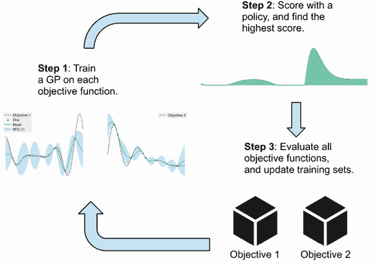
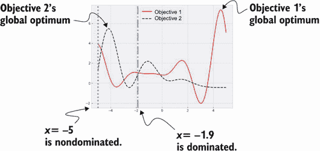
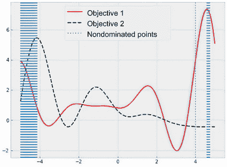
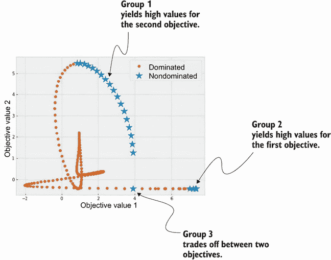
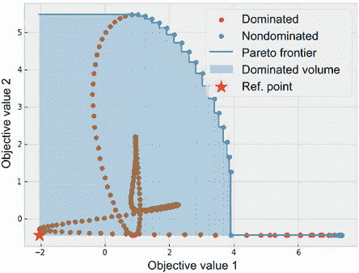
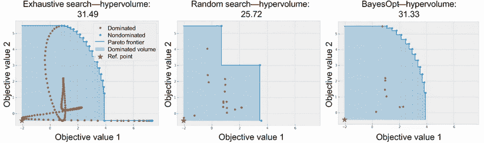
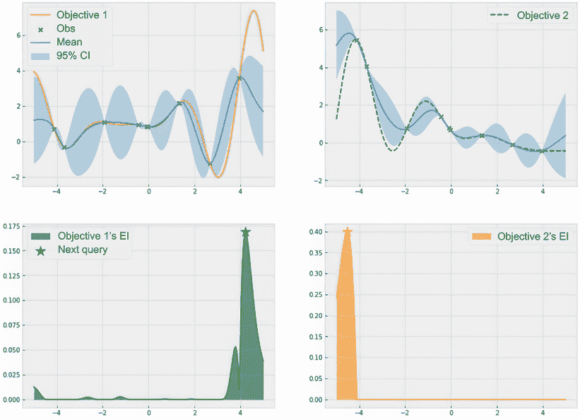
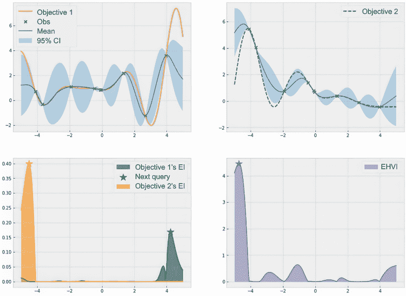
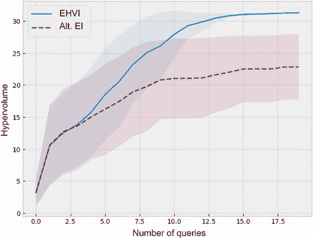

# 第十二章：同时优化多个目标

本章涵盖内容

+   同时优化多个目标的问题

+   训练多个 GP 同时学习多个目标

+   共同优化多个目标

每天，我们都面临着优化的权衡：

+   “这杯咖啡尝起来不错，但糖太多了。”

+   “那件衬衫看起来很棒，但超出了我的价格范围。”

+   “我刚训练的神经网络准确率很高，但太大了，训练时间太长。”

为了在某个目标上取得良好的性能，我们牺牲了另一个同样重要的标准：一个喜欢甜食的咖啡饮用者可能会优化咖啡的味道，同时使用不健康数量的糖；购物者在外观上打分高而在价格上打分低的服装；ML 工程师开发出具有良好预测性能但太大以至于无法在实时应用中使用的神经网络。通过专注于一个优化目标，我们可能在需要考虑的另一个目标上表现不佳。相反，我们应该将所有要优化的目标函数建模到我们的优化过程中，并尝试联合优化它们所有。例如，我们应该寻找既美味又低糖的咖啡配方，时尚又实惠的服装，或者性能良好且实用的 ML 模型。这种类型的优化问题称为多目标优化。

定义 多目标优化问题，正如其名称所示，涉及到多个要同时优化的目标函数。其目标是找到在所有目标上都达到高值的数据点。

当然，在任何非平凡的多目标优化问题中，我们可能会有竞争的目标，为了在一个目标函数上获得良好的性能，唯一的方法是牺牲另一个目标上的性能。这种优化目标之间的固有冲突导致了需要平衡这些目标的需求（非常类似于需要平衡探索和开发，讨论在第 4.1.2 节中，这是 BayesOpt 循环内需要优化的两个“目标”）。

在本章中，我们学习多目标优化，如何通过找到在一个目标上表现无法改善而不牺牲另一个目标的数据点成功地解决它，以及如何在目标函数是昂贵的黑箱的情况下将 BayesOpt 应用于这个问题。多目标优化是许多领域都面临的共同问题，到本章结束时，我们将使用贝叶斯方法来解决这个问题的能力添加到我们的工具包中。

## 11.1 使用 BayesOpt 平衡多个优化目标

多目标优化的应用无处不在：

+   在工程和制造领域，工程师经常面临多个目标之间的权衡，比如产品质量与制造成本之间的权衡。例如，汽车制造商不断优化生产线以最大化质量，同时最小化成本。

+   在资源分配问题中，如在贫困社区或自然灾害受灾人群之间分配货币和医疗援助，决策者需要在对这些社区产生最大影响和各种物流分配困难之间取得平衡。

+   与我们在第 8.1.1 节中讨论的成本受限优化问题类似，开发治疗某种疾病的药物的科学家需要在最大化疗效和最小化对患者的副作用之间取得平衡。

+   对于机器学习工程师更相关的是，一个可以在现实世界中部署的实用机器学习模型需要在保持低训练成本的同时实现良好的性能。

与之前章节讨论的优化设置不同，我们不再有单一的优化目标可以专注。在许多这些问题中，我们需要优化的目标之间存在冲突：只有牺牲一个指标的性能我们才能在另一个指标上取得提高。思考这些优化目标之间固有的冲突的一种方式是，我们必须同时“权衡”各种目标：我们不能简单地专注于某些目标而忽略其他目标。这种同时权衡多个目标的需求在图 11.1 中可视化。幸运的是，现在有多个目标函数不会影响我们在本书中开发的大部分贝叶斯优化工作流程。


图 11.1：漫画说明我们在多目标优化中需要取得的平衡，我们需要同时权衡不同的目标函数。

使用多个高斯过程模型建模多个目标函数

在之前的章节中，我们根据观察到的数据训练了一个高斯过程模型以建模我们对单一优化目标函数的信念。在本章中，我们需要建模多个目标函数，但每个这些目标仍然可以被建模为高斯过程。通过维护这些多个高斯过程，我们有一种以概率方式推理所有目标函数的方法。

图 11.2 展示了贝叶斯优化循环，其中有两个需要优化的目标函数。与图 1.6 相比，第 1 步现在针对每个目标都有一个高斯过程，而贝叶斯优化策略识别的每个数据点在第 3 步都要对所有目标函数进行评估。



图 11.2：多目标贝叶斯优化循环，具有两个目标函数。每个目标函数的数据进行高斯过程训练，而贝叶斯优化策略决定下一步评估目标函数的数据点。

对每个目标的数据进行 GP 训练非常容易实现；事实上，我们已经在第八章对约束优化进行了这样的训练，在那里我们对目标函数进行了一次 GP 训练，对约束函数进行了另一次 GP 训练。换句话说，我们只需要专注于图 11.2 中第 2 步中贝叶斯优化策略的设计，以帮助我们在优化过程中做出有效的决策。我们重点研究了贝叶斯优化策略如何应对多个目标之间的平衡，以便在本章的其余部分尽快找到性能优异的数据点。

## 11.2 寻找最优数据点的边界

在本节中，我们学习了在多目标优化中常用于量化我们在优化过程中取得多大进展的数学概念。这些概念帮助我们建立本章后面我们开发的优化策略的目标。为了使我们的讨论具体化，我们使用了 CH11/01 - 计算超体积.ipynb 笔记本中的代码。

我们从需要同时优化的两个目标函数开始：

+   第一个目标是在以前章节中使用的熟悉的 Forrester 函数。该目标函数的全局最优解位于搜索空间的右侧。该函数在以下代码中实现为`objective1()`。

+   我们还有另一个目标函数，实现为`objective2()`，其具有与 Forrester 不同的功能形式和行为。关键是，该目标的全局最优解位于搜索空间的左侧——两个目标函数的全局最优解位置的不匹配模拟了多目标优化问题中常见的权衡。

+   我们编写一个辅助函数`joint_objective()`，它返回给定输入数据点`x`的两个目标函数的值的 PyTorch 张量。这个函数有助于保持我们的代码简洁。

+   最后，我们将我们的优化问题的搜索空间定义为-5 到 5 之间。

```py
def objective1(x):                                     ❶
    return -((x + 1) ** 2) * torch.sin(2 * x + 2)
    ➥/ 5 + 1 + x / 20                                 ❶

def objective2(x):                                     ❷
    return (0.1 * objective1(x) + objective1(x - 4))
    ➥/ 3 - x / 3 + 0.5                                ❷

def joint_objective(x):                                ❸
    y1 = objective1(x)                                 ❸
    y2 = objective2(x)                                 ❸
    return torch.vstack([y1.flatten(), y2.flatten()])  ❸
    ➥.transpose(-1, -2)                               ❸

lb = -5                                                ❹
ub = 5                                                 ❹
bounds = torch.tensor([[lb], [ub]], dtype=torch.float) ❹
```

❶ 第一个目标函数

❷ 第二个目标函数

❸ 调用两个目标函数的辅助函数

❹ 搜索空间的边界

图 11.3 显示了我们搜索空间中的这两个目标函数。我们看到最大化这两个目标的数据点彼此不同：实线曲线在*x*=4.5 附近最大化，而虚线曲线在*x*=-4.5 附近最大化。这种差异意味着我们有两个相互冲突的目标，并且这两个函数的联合优化需要权衡它们的目标值。



图 11.3 我们当前的多目标优化问题的两个目标函数。最大化这两个目标的数据点彼此不同，因此在优化这两个目标时存在权衡。

通过“权衡”，我们指的是存在搜索空间中的点*x*，其第一个目标的值（表示为*f*1）无法提高，除非第二个目标的值（表示为*f*2）降低。换句话说，存在一些数据点在优化一个目标函数方面，其值无法超过，除非我们牺牲另一个目标函数。

例如，考虑图 11.3 中标示的*x* = –5。这是搜索空间的最左边的数据点。这个点的目标值*f*1 大约为 4，目标值*f*2 大约为 1.5。现在，*x* = –5 是一个数据点，如果我们想在第一个目标*f*1 上做得比 4 更好，我们将不得不在第二个目标*f*2 上做得不如 1.5。事实上，我们要实现高于 4 的*f*1 值的唯一方式是查询空间的最右侧，其中*x* > 4。在这里，*f*2 的值下降到 0 以下。

相反，右侧的区域（*x* > 4）也是*f*1 和*f*2 之间的紧张存在的地方：要增加*f*2 的值，我们必须向空间左侧移动，这样*f*1 的值就会受到影响。

定义：数据点其一个目标的值无法超过，除非另一个目标的值降低，称为*非支配*。相反，*支配*点*x*[1]是指存在另一个点*x*[2]，其所有目标值都超过*x*[1]的点。非支配点也可以称为*帕累托最优*、*帕累托有效*或*非劣*。

因此，点*x* = –5 是一个非支配点，一些点当*x* > 4 也是非支配点。图 11.3 中的一个支配点的例子是*x* = –1.9，它给出了*f*1 ≈ *f*2 ≈ 1。这个点被*x* = –5 支配，因为前者的目标值低于后者：*f*1 < *f*1 和*f*2 < *f*2。

在许多情况下，我们有无限多个非支配点。图 11.4 展示了我们当前问题中的非支配点作为虚线阴影区域（我们将在本节稍后讨论如何找到这些非支配点；现在，让我们关注这些非支配点的行为）：

+   我们发现*x* = –5 确实是一个非支配点，以及该区域周围许多点给出了较高的第二个目标*f*2 的值。超出此区域的点不会产生更高的*f*2 值，因此该区域内的点是非支配的。我们将这些点称为*group 1*。

+   右侧的小区域为第一个目标*f*1 提供了较高的值，同样是非支配的。这些点称为*group 2*。

+   在*x*=4 周围还有一个第三个最小区域，它也是非支配的，在搜索空间的左侧没有被非支配点的*f*1 值超过。尽管这个区域不包含任何目标函数的全局最优解，但该区域在两个目标的值之间进行权衡，因此是非支配的。我们称这些点为“群组 3”。



图 11.4 两个目标函数和非支配点。在这个多目标优化问题中有无穷多个非支配点。

非支配点在多目标优化中非常有价值，因为它们本身就是优化问题的解，除非牺牲至少一个目标，否则我们无法改进它们。通过研究非支配点，它们之间的关系以及它们在搜索空间中的分布，我们可以更加了解优化问题中多个目标之间的权衡。因此，多目标优化的一个合理目标是找到尽可能多的非支配点。

然而，我们并不立即清楚如何具体量化找到非支配点的目标。我们不应该简单地寻求揭示尽可能多的非支配点，因为它们可能是无限多的。相反，我们使用一个更容易思考的量，如果我们通过将数据点可视化到一个不同的空间来观察它。

在图 11.3 和 11.4 中，*x*-轴对应于数据点本身，*y*-轴对应于这些数据点的目标值。为了研究两个冲突目标之间的权衡，我们还可以使用散点图，其中给定数据点*x*的*x*-坐标是第一个目标函数*f*1 的值，*y*-坐标是第二个目标函数*f*2 的值。

图 11.5 展示了在-5 和 5 之间的 201 个等距点的密集网格中每个点的散点图，被支配的点用点表示，非支配点用星号表示。我们可以看出，在这个空间中，一个点是否被支配更容易确定：对于每个数据点*x*[1]，如果存在另一个数据点*x*[2]，它位于*x*[1]的上方且右侧，则*x*[1]是一个被支配的点；相反，如果不存在同时位于*x*[1]的上方且右侧的点*x*[2]，则*x*[1]是非支配的。在图 11.5 中我们还可以看到三个非支配点的组，与图 11.4 相关的讨论相符。



图 11.5 基于两个目标函数值的数据点的散点图。被支配的点用点表示，非支配点用星号表示。非支配点的三个组对应于图 11.4 中的讨论。

从可视化的目标值空间中的非支配点集合中，我们现在引入另一个概念：Pareto 前沿。图 11.6 可视化了当前优化问题的 Pareto 前沿。


图 11.6 通过非支配点绘制的 Pareto 前沿。没有数据点位于此 Pareto 前沿的右侧（上方和右侧）。

定义 跟踪非支配点的曲线称为 *Pareto 前沿*。它被称为 *前沿*，因为当我们将所有数据点视为一个集合时，非支配点的这条曲线构成了集合的边界或前沿，在该边界或前沿之外没有数据点。

Pareto 前沿的概念在多目标优化中至关重要，因为前沿直接导致可以量化多目标优化问题中的进展的度量标准。特别是，我们关注 Pareto 前沿覆盖的空间——由多个目标的收集目标值定义的空间——的大小；也就是说，Pareto 前沿内部（下方和左侧）的区域。该区域显示为图 11.7 的左侧面板中的阴影区域。

定义 我们使用术语 *支配超体积*（有时简称为 *超体积*）来表示 Pareto 前沿覆盖了多少空间。在我们的示例中有两个目标函数，因此空间是二维的，支配超体积是支配区域的面积。当有两个以上的目标时，支配超体积以更高维度度量相同的数量。

左侧图 11.7 中显示的分散点是使用密集的网格在搜索空间中生成的，以便我们可以详细研究 Pareto 前沿及其超体积的行为。换句话说，这个密集的网格代表了对空间的穷尽搜索，以完全绘制出 Pareto 前沿。

作为比较的一点，图 11.7 的右侧面板显示了在 -5 到 5 之间均匀选择的 20 个点的结果。从所选点中，我们再次找到在 20 个点集内没有被任何其他点支配的点，并绘制此第二个数据集的 Pareto 前沿。


图 11.7 密集网格的支配超体积（左侧），等效于穷举搜索，以及随机选择的 20 个数据点（右侧）。第一个数据集具有更大的支配体积，因此在多目标优化方面的表现比第二个数据集好。

与左侧情况不同，左侧完全覆盖搜索空间，而右侧的小数据集只有四个非支配点。在多目标优化的背景下，我们使用第一个数据集（来自穷举搜索）比使用第二个数据集（来自随机搜索）取得更多进展。

与穷尽搜索得到的数据集相比，这四个非支配点构成了一个更加锯齿状的帕累托前沿，进而拥有一个更小的被支配超体积。换句话说，这个被支配超体积的度量可以用来量化多目标优化问题中的优化进展。

注意 在多目标优化问题中，我们通过当前收集的数据产生的被支配区域的超体积来衡量优化进展。我们收集的数据的被支配超体积越大，我们同时优化目标函数的进展就越大。

根据超体积度量，图 11.7 显示，穷尽搜索比随机搜索（查询更少）在优化方面做得更好，这是一个预期结果。但是要量化前者搜索策略比后者好多少，我们需要一种计算这个超体积度量的方法。对于这个计算，需要一个参考点；这个参考点充当被支配区域的终点，为该区域设置了一个左下边界。我们可以将这个参考点视为在多目标优化设置下我们能观察到的最差结果，因此该区域与帕累托前沿之间的超体积量化了我们从这个最差结果改进了多少。（如果我们不知道每个目标函数的最差结果，BayesOpt 用户可以将每个查询可以达到的最低值设定为我们认为的最低值。）

注意 在多目标优化中，一个常见的参考点是一个 *数组*，其中的每个元素对应于要最大化的目标函数的最低值。

例如，我们当前优化问题的参考点为[–2.0292, –0.4444]，因为第一个元素–2.0292 是第一个目标函数的最小值（图 11.3 中的实线曲线），–0.4444 是第二个目标的最小值（图 11.3 中的虚线曲线）。这个参考点在图 11.8 中被可视化为星号，再次为被支配空间设定了一个下限。



图 11.8 在多目标优化问题中的参考点，它为被支配空间设定了一个下限。超体积计算为参考点与帕累托前沿之间区域的体积。

有了这个参考点，我们可以计算由多目标优化策略收集的数据集占优区域的超体积。完成这个计算的算法涉及将占优区域分成多个不相交的超矩形，这些超矩形共同构成了占优区域。从那里，我们可以容易地计算每个超矩形的超体积，并将它们相加以获得整个区域的超体积。有兴趣的读者可以参考 Renaud Lacour、Kathrin Klamroth 和 Carlos M. Fonseca 等人提出的此算法的研究论文（[`mng.bz/jPdp`](http://mng.bz/jPdp)）。

使用 BoTorch，我们可以导入和运行此算法，而无需实现底层细节。具体而言，假设我们已将优化期间找到的收集标签存储在变量`train_y`中。因为我们的示例中有两个目标函数，所以`train_y`的形状应为*n*-by-2，其中*n*是收集集合中数据点的数量。然后，我们可以使用下面的代码来计算超体积度量，其中

+   `DominatedPartitioning`类实现了占优区域的分区。为了初始化此对象，我们传入参考点和收集标签`train_y`。

+   然后我们调用占优区域对象的`compute_hypervolume()`方法来计算其超体积度量：

```py
from botorch.utils.multi_objective
➥.box_decompositions.dominated import                ❶
➥DominatedPartitioning                               ❶

dominated_part = DominatedPartitioning
➥(ref_point, train_y)                                ❷
volume = dominated_part.compute_hypervolume().item()  ❷
```

❶ 导入占优区域类的实现

❷ 计算相对于参考点的占优区域的超体积度量

使用此方法，我们可以计算完全搜索和随机搜索的超体积度量，如图 11.9 左侧和中间面板所示。我们看到，与随机搜索的超体积度量（25.72）相比，完全搜索确实实现了更高的超体积度量（31.49）。



图 11.9 各种搜索策略的多目标优化结果及相应的超体积度量。BayesOpt 几乎达到了完全搜索的超体积度量，但查询少了很多。

在图 11.9 的右侧面板中，我们还可以看到我们在下一节学习的 BayesOpt 策略仅使用了 20 个数据点就实现了相应的结果。只有预算的十分之一（20 与 201），BayesOpt 就几乎达到了完全搜索的超体积度量。与具有相同预算的随机搜索相比，BayesOpt 能够更全面地映射出真正的 Pareto 前沿，并实现更高的超体积度量。

## 11.3 寻求改进最佳数据边界

贝叶斯优化策略应如何最大化其收集数据中受支配区域的超体积？一个简单的策略是在迭代方式下交替优化每个目标：在贝叶斯优化循环的这一次迭代中，我们试图最大化第一个目标 *f*1；在下一次迭代中，我们则试图最大化第二个目标 *f*2；依此类推。在一个迭代中，我们有一个特定的目标要优化，我们可以通过使用我们在第 4 至 6 章学到的各种贝叶斯优化策略来实现这一点。在本章的其余部分中，我们使用了期望改进（EI），这是我们在第 4.3 节中学到的。EI 是一种在实践中常用的策略，因为它的算法简单且性能稳定。

假设在我们的多目标优化问题中，我们观察到图 11.10 顶部面板中 X 标记的数据点。通过对属于每个目标函数的数据集进行 GP 训练，我们得到了第一个目标的 GP 预测（左上角面板）和第二个目标的 GP 预测（右上角面板）。

在图 11.10 的底部面板中，我们展示了各个 EI 策略在相应目标函数上的收购分数。左下角的 EI 试图最大化第一个目标 *f*1，而右下角的 EI 则寻找第二个目标 *f*2 的最优解。我们可以看到，当第一个 EI 关注搜索空间的右侧区域，即 *f*1 最大化的区域时，而第二个 EI 则关注左侧区域，即 *f*2 最大化的区域时，两个目标之间的冲突在这里是明显的。



图 11.10：关于两个目标函数的当前 GP 信念（顶部）和相应的 EI 收购分数（底部）。每个 EI 策略都试图优化自己的目标函数，并关注不同的区域。

注意：由贝叶斯优化策略计算的数据点的收购分数 quantifies 了数据点对我们搜索目标函数最优解的价值。收购分数越高，数据点越有价值，而给出最高收购分数的点是策略建议查询的点。

在我们之前提出的交替策略中，我们要么遵循第一个 EI 策略并查询 *x* = 4.5 附近的点，要么遵循第二个 EI 并查询 *x* = –4.5 附近的点，这取决于是 *f*1 还是 *f*2 被优化的轮次。我们将这种交替策略作为基准，用来与我们最终的解决方案进行比较。

为了比简单交替不同目标函数的策略做得更好，这个解决方案应该是什么？我们注意到，通过让每个要最大化的目标都有一个 GP 模型，我们可以概率地推理出每个潜在新查询在每个目标上的值*同时*。具体来说，我们知道每个潜在新查询在每个目标上的价值都遵循一个已知的正态分布；这个正态分布是我们对查询价值的预测。

这个预测让我们能够推理出每个潜在新查询是否是一个无支配点，如果是的话，它将如何增加被支配区域的超体积。每个新观察到的无支配点都会延伸被支配区域的边界（即 Pareto 边界），因此增加了支配超体积。因此，我们可以使用每个新查询导致的超体积增加的期望值作为收购分数，来量化查询的价值。我们能够期望从查询获得的超体积增加越大，它对我们进行优化的帮助就越大。

当然，我们无法确定通过查询会获得多少超体积的增加，直到我们真正对目标函数进行查询。然而，我们可以通过一种概率方式来推理这个超体积增加。也就是说，我们可以计算可能查询产生的超体积增加的*期望值*。

同样，类似于确定被支配区域的超体积的算法，这个对超体积增加的期望计算涉及将被支配区域分成超矩形，非常复杂。再一次地，我们这里不会详细介绍数学细节，但是你可以参考杨凯锋、米歇尔·埃默里奇、安德烈·德茨和托马斯·贝克提出的相应 BayesOpt 策略的研究论文，该论文称为*预期超体积增加*（EHVI）以获取更多详情（[`mng.bz/WzYw`](http://mng.bz/WzYw)）。

定义 预期超体积增加策略使用新数据点导致的被支配区域超体积增加的期望值作为该数据点的收购分数。这个策略是将 EI 推广到了多目标设置的结果，其中我们的目标是最大化被支配超体积。

图 11.11 显示了与图 11.10 中相同数据集的 EHVI 的收购分数在底部右侧面板中。我们可以看到，与单个 EI 策略相比，EHVI 通过将高收购分数分配给可能扩展 Pareto 边界的多个区域来很好地平衡了两个目标：搜索空间的最左侧区域的得分最高，但最右侧区域以及中间的其他区域也有非常可观的收购分数。



图 11.11 当前 GP 对每个目标函数的信念（顶部）、对应的 EI 获取分数（左下角）和 EHVI 获取分数（右下角）的看法。EHVI 平衡了这两个目标，将高获取分数分配给可能延伸 Pareto 边界的多个区域。

为了验证这个 EHVI 策略确实在多目标优化中给我们带来了优势，我们实现了这个策略并在当前问题上运行它。我们使用的代码包含在 CH11/02 - Multi-objective BayesOpt loop.ipynb 笔记本中。

首先，我们需要 GP 模型的类实现和一个帮助函数 `fit_gp_model()`，它有助于在观察到的数据上训练每个 GP。由于我们在前几章中已经实现了这些组件，所以我们不会再次在这里展示它们的代码；您可以参考第 4.1.1 节来复习这些代码。在 BayesOpt 循环的每一步中，我们调用帮助函数在每个目标函数的数据上初始化和训练一个 GP。在我们的情况下，我们有两个目标函数，所以我们分别调用帮助函数两次，每次分别使用 `train_y[:, 0]`（从第一个目标 *f*1 观察到的标签）或 `train_y[:, 1]`（从第二个目标 *f*2 观察到的标签）。

```py
model1, likelihood1 = fit_gp_model(train_x, train_y[:, 0])
model2, likelihood2 = fit_gp_model(train_x, train_y[:, 1])
```

然后我们使用 `botorch.acquisition.multi_objective.analytic` 模块中的 `ExpectedHypervolumeImprovement` 类来实现 EHVI 策略。为了初始化策略对象，我们设置以下参数：

+   参数 `model` 接受一系列的 GPs，每个 GP 建模一个目标函数。这个 GP 列表被实现为 `ModelListGP` 类的一个实例，接受单独的 GP 对象 (`model1`, `model2`)。

+   参数 `ref_point` 接受参考点，这对于计算 HV 和潜在 HV 增加量是必要的。

+   最后，参数 `partitioning` 接受 `FastNondominatedPartitioning` 类的一个实例，它有助于计算 HV 增加量。这个对象的初始化与我们之前看到的 `DominatedPartitioning` 对象类似，接受一个参考点和观察标签 `train_y`：

```py
from botorch.acquisition.multi_objective
➥.analytic import                                    ❶
➥ExpectedHypervolumeImprovement                      ❶
from botorch.utils.multi_objective.box_decompositions
➥.non_dominated import                               ❶
➥FastNondominatedPartitioning                        ❶
from botorch.models.model_list_gp_regression import ModelListGP

policy = ExpectedHypervolumeImprovement(
    model=ModelListGP(model1, model2),                ❷
    ref_point=ref_point,                              ❸
    partitioning=FastNondominatedPartitioning
    ➥(ref_point, train_y)                            ❹
)
```

❶ 导入必要的类

❷ GP 模型列表，每个模型对应一个目标函数

❸ 参考点

❹ 无支配分区对象用于计算 HV 增加量

使用 EHVI 策略的 `policy` 对象，我们可以计算获取分数，表示由潜在新观测引起的预期 HV 增加量。然后我们可以使用辅助函数 `optimize_acqf()` 找到给出最高分数的数据点：

```py
next_x, acq_val = optimize_acqf(
    policy,
    bounds=bounds,
    q=1,
    num_restarts=20,
    raw_samples=50
)
```

变量 `next_x` 存储我们将在下一步中使用的查询位置：`next_y = joint_objective(next_x)`。

这就是我们在当前优化问题上运行 EHVI 所需的一切。作为参考，我们还测试了之前讨论过的交替优化策略，在这种策略中，我们使用常规的 EI 来优化选择的目标函数。由于我们有两个目标，我们只需在两个目标之间来回切换（这里的`num_queries`是贝叶斯优化运行中可以进行的总评估次数）：

```py
for i in range(num_queries):
    if i % 2 == 0:                        ❶
        model = model1                    ❶
        best_f = train_y[:, 0].max()      ❶
    else:                                 ❷
        model = model2                    ❷
        best_f = train_y[:, 1].max()      ❷

    policy = ExpectedImprovement(model=model,
    ➥best_f=best_f)                      ❸
```

❶ 如果当前迭代次数为偶数，则优化第一个目标

❷ 如果当前迭代次数为奇数，则优化第二个目标

❸ 相应地创建 EI 策略

最后，为了量化我们的优化进展，我们记录了由当前数据集在搜索过程中收集的支配区域的超体积。这个记录是用一个名为`hypervolumes`的张量完成的，它在实验过程中在每一步存储当前的支配超体积，跨多个实验。总的来说，我们的贝叶斯优化循环如下，对于每个策略，我们运行实验多次，每次都使用均匀随机选择的初始数据集：

```py
hypervolumes = torch.zeros((num_repeats, num_queries))   ❶

for trial in range(num_repeats):
  torch.manual_seed(trial)                               ❷
  train_x = bounds[0] + (bounds[1] - bounds[0]) * torch  ❷
  ➥.rand(1, 1)                                          ❷
  train_y = joint_objective(train_x)                     ❷
  for i in range(num_queries):
    dominated_part = DominatedPartitioning(ref_point,
    ➥train_y)                                           ❸
    hypervolumes[trial, i] = dominated_part
    ➥.compute_hypervolume().item()                      ❸

    ...                                                  ❹
```

❶ 优化过程中发现的超体积历史

❷ 初始化一个随机初始训练集

❸ 记录当前的超体积

❹ 重新训练模型，初始化一个策略，并找到下一个查询

CH11/02 - 多目标贝叶斯优化循环.ipynb 笔记本对我们有两个 20 个查询的实验，每个实验都有 10 次贝叶斯优化策略进行运行。图 11.12 显示了两个策略所进行的查询次数与平均超体积和误差棒的关系。我们看到 EHVI 一直优于交替 EI 策略，这说明了基于超体积的方法的好处。



图 11.12 两个贝叶斯优化策略所进行的查询次数与平均超体积和误差棒的关系。EHVI 一直优于交替 EI 策略。

在本章中，我们学习了多目标优化问题以及如何使用贝叶斯优化方法来解决它。我们讨论了超体积的概念作为优化性能的衡量标准，量化了我们在优化目标函数方面取得的进展。通过使用 EI 策略的变体来优化超体积的增加，我们得到了一个表现强劲的 EHVI 策略。

不幸的是，本章无法涵盖多目标贝叶斯优化的其他方面。具体来说，除了 EHVI 之外，我们还可以考虑其他优化策略。一种常见的技术是*标量化*，它通过取加权和将多个竞争目标合并为一个目标。该策略是交替 EI 策略的一般化，我们可以认为在每次迭代中将一个目标的权重设置为 1，另一个目标的权重设置为 0。感兴趣的读者可以参考 BoTorch 文档（请参阅[`botorch.org/docs/multi_objective`](https://botorch.org/docs/multi_objective)和[`botorch.org/tutorials/multi_objective_bo`](https://botorch.org/tutorials/multi_objective_bo)），该文档提供了 BoTorch 提供的不同多目标优化策略的简要摘要。

## 11.4 练习：飞机设计的多目标优化

在这个练习中，我们将所学的多目标优化技术应用于优化飞机的航空结构设计问题。这个问题首次在第七章的练习 2 中介绍，并在第八章的练习 2 中修改为成本约束问题。我们在这里重用第八章的代码。这个练习使我们能够观察到期望超体积改进（EHVI）策略在多维问题中的性能。解决方案包含在 CH11/03 - Exercise 1.ipynb 笔记本中。

执行以下步骤：

1.  从第八章的练习 2 中复制目标函数`flight_utility()`和`flight_cost()`的代码。取反第二个函数`flight_cost()`返回值的符号。我们将这两个函数用作多目标优化问题的目标。

1.  编写一个辅助函数，该函数接受一个输入`X`（可能包含多个数据点），并返回在两个目标函数上评估的`X`的值。返回的值应该是一个大小为*n*-by-2 的张量，其中*n*是`X`中数据点的数量。

1.  声明搜索空间为四维单位正方形。即，四个下限为 0，四个上限为 1。

1.  要计算由优化算法收集的数据集的超体积，我们需要一个参考点。声明此参考点为[–1.5, –2]，这是两个目标函数的对应最低值。

1.  实现 GP 模型的类，该类应具有常数均值和一个四维 Matérn 2.5 核，并具有自动相关性确定（ARD；参见 3.4.2 节），以及一个辅助函数`fit_gp_model()`，该函数在训练集上初始化和训练 GP 模型。有关实现这些组件的详细信息，请参见 4.1.1 节。

1.  将要运行的实验次数设置为 10，每次实验的预算（要进行的查询数量）设置为 50。

1.  运行 EHVI 策略来优化我们拥有的两个目标函数，以及第 11.3 节中讨论的交替 EI 策略。绘制这两个策略所实现的平均超体积和误差条形图（类似于图 11.2），并比较它们的性能。

## 总结

+   当存在多个潜在的冲突目标需要同时优化时，多目标优化问题就会出现。这个问题在现实世界中很常见，因为我们经常在许多真实任务中与多个竞争目标相争。

+   在使用 BayesOpt 进行多目标优化时，我们使用多个高斯过程来模拟我们对目标函数的信念（每个目标函数使用一个模型）。我们可以使用这些高斯过程以概率方式同时推理目标函数。

+   非支配点实现的目标值不能得到改善，除非我们牺牲至少一个目标函数的性能。发现非支配数据点是多目标优化的目标，因为它们允许我们研究目标函数之间的权衡。

+   无支配数据点构成帕累托前沿，它设置了代表多目标优化中最优的边界。没有数据点位于所有非支配点的帕累托前沿之外。

+   支配空间的超体积（即由帕累托前沿覆盖的区域）测量算法收集的数据集的优化性能。超体积越大，算法的性能就越好。可以通过在 BoTorch 的"DominatedPartitioning"类的实例上调用`compute_hypervolume()`方法来计算数据集的超体积。

+   要计算数据集的超体积，我们需要一个作为支配空间结束点的参考点。我们通常将参考点设置为要优化的目标函数的最低值。

+   由于高斯过程允许我们对目标函数进行预测，因此我们可以寻求改进当前数据集的超体积。这种策略对应于 EHVI 策略，是多目标优化中 EI 的一种变体。这种策略成功平衡了竞争性目标。
