# 第十三章：将高斯过程扩展到大型数据集

本章介绍：

+   训练大型数据集上的 GP

+   在训练 GP 时使用小批量梯度下降。

+   采用高级梯度下降技术来更快地训练 GP。

到目前为止，我们已经看到 GP 提供了极高的建模灵活性。在第三章中，我们学习了如何使用 GP 的均值函数来模拟高级别趋势，并使用协方差函数来模拟变异性。GP 还提供了校准的不确定性量化。也就是说，训练数据集中接近观测值的数据点的预测比远离观测值的点的预测具有更低的不确定性。这种灵活性使 GP 与其他只产生点估计（如神经网络）的 ML 模型区别开来。然而，它也导致了速度问题。

训练和预测 GP（具体来说，计算协方差矩阵的逆）与训练数据的规模呈立方级扩展关系。也就是说，如果我们的数据集大小翻倍，GP 将需要花费八倍的时间进行训练和预测。如果数据集增加十倍，GP 将需要花费 1,000 倍的时间。这给将 GP 扩展到大型数据集的应用带来了挑战。

+   如果我们的目标是对整个国家（例如美国）的房价进行建模，其中每个数据点表示给定时间的单个住宅的价格，则我们的数据集大小将包含数亿个点。例如，在线数据库 Statista 记录了自 1975 年至 2021 年美国住房单位数量的变化；该报告可在 [`www.statista.com/statistics/240267/number-of-housing-units-in-the-united-states/`](https://www.statista.com/statistics/240267/number-of-housing-units-in-the-united-states/) 上访问。我们可以看到，自 1975 年以来，这个数字一直在稳步增长，1990 年超过了 1 亿，现在已经超过 1.4 亿。

+   在我们在第 1.1.3 节中讨论的药物发现应用程序中，一个可能被合成为药物的可能分子的数据库可能会拥有数十亿个条目。

+   在天气预报中，低成本的监测设备使得大规模收集天气数据变得容易。数据集可以包含跨多年的每分钟测量结果。

考虑到正常 GP 模型的立方运行时间，将其应用于这种规模的数据集是不可行的。在本章中，我们将学习如何利用一类称为“变分高斯过程”（VGPs）的 GP 模型来解决从大型数据中学习的问题。

定义变分高斯过程选择一小部分数据，很好地表示整个集合。它通过寻求最小化它本身和完整数据集上训练的普通 GP 之间的差异来实现这一点。术语“变分”是指研究函数式优化的数学子领域。

选择仅对这些代表性点的小型子集进行训练的想法是相当自然和直观的。图 12.1 展示了 VGP 的运行情况，通过从少数精选数据点中学习，该模型产生了几乎与普通 GP 产生的预测相同的预测。

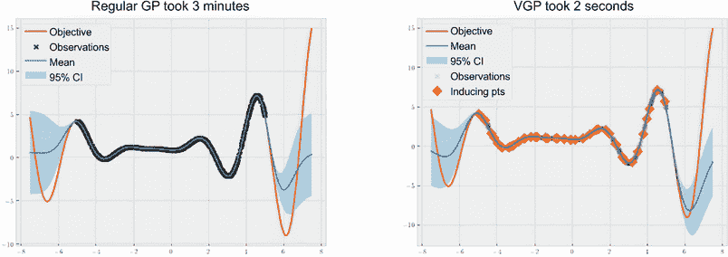

图 12.1 显示了普通 GP 和 VGP 的预测。VGP 产生了几乎与 GP 相同的预测，同时训练时间显著缩短。

我们在本章介绍如何实现这个模型，并观察其在计算上的优势。此外，当使用 VGP 时，我们可以使用更高级的梯度下降版本，正如我们在第 3.3.2 节中看到的，它用于优化 GP 的超参数。我们学会使用这个算法的版本来更快、更有效地训练，并最终将我们的 GPs 扩展到大型数据集。本章附带的代码可以在 CH11/01 - 近似高斯过程推理.ipynb 笔记本中找到。

## 12.1 在大型数据集上训练高斯过程模型

在本节中，为了直观地看到在大型数据集上训练高斯过程模型面临的困难挑战，我们试图将我们在第二章和第三章中使用的 GP 模型应用于一个包含 1,000 个点的中型数据集。这个任务将清楚地表明使用普通 GP 是不可行的，并激发我们在下一节学习的内容：变分 GPs。

### 12.1.1 设置学习任务

在这个小节中，我们首先创建我们的数据集。我们重新使用了在第二章和第三章中看到的一维目标函数，即 Forrester 函数。我们再次按照以下方式实现它：

```py
def forrester_1d(x):
    y = -((x + 1) ** 2) * torch.sin(2 * x + 2) / 5 + 1
    return y.squeeze(-1)
```

类似于我们在第 3.3 节中所做的，我们还将拥有一个辅助函数，该函数接收一个 GP 模型，并在整个域上可视化其预测。该函数具有以下头部，并接受三个参数——GP 模型、相应的似然函数和一个布尔标志，表示模型是否为 VGP：

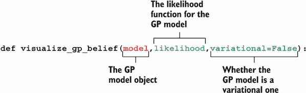

此辅助函数的逻辑概述在图 12.2 中草绘出来，它包括四个主要步骤：计算预测、绘制真实函数和训练数据、绘制预测，最后，如果模型是 VGP，则绘制诱导点。

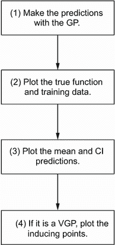

图 12.2 是可视化 GP 预测的辅助函数的流程图。该函数还显示了 VGP 的诱导点（如果传入的是该模型）。

定义：诱导点是 VGP 模型选择的表示整个数据集的小型子集，用于训练。顾名思义，这些点旨在“诱导”关于所有数据的知识。

现在我们更详细地介绍这些步骤。在第一步中，我们使用 GP 计算均值和 CI 预测：

```py
with torch.no_grad():
    predictive_distribution = likelihood(model(xs))
    predictive_mean = predictive_distribution.mean
    predictive_upper, predictive_lower =
    ➥predictive_distribution.confidence_region()
```

在第二步中，我们制作 Matplotlib 图并显示存储在 `xs` 和 `ys` 中的真实函数（我们稍后生成）以及我们的训练数据 `train_x` 和 `train_y`：

```py
plt.figure(figsize=(8, 6))

plt.plot(xs, ys, label="objective", c="r")  ❶
plt.scatter(                                ❷
    train_x,                                ❷
    train_y,                                ❷
    marker="x",                             ❷
    c="k",                                  ❷
    alpha=0.1 if variational else 1,        ❷
    label="observations",                   ❷
  )                                         ❷
```

❶ 绘制真实目标函数

❷ 为训练数据制作散点图

在这里，如果模型是一个 VGP（如果 `variational` 设置为 `True`），那么我们会用较低的不透明度绘制训练数据（通过设置 `alpha = 0.1`），使它们看起来更透明。这样我们可以更清楚地绘制后面学习到的 VGP 的代表性点。

GP 所做的预测随后在第三步中以实线均值线和阴影 95% CI 区域的形式显示：

```py
plt.plot(xs, predictive_mean, label="mean")
plt.fill_between(
    xs.flatten(),
    predictive_upper,
    predictive_lower,
    alpha=0.3,
    label="95% CI"
)
```

最后，我们通过提取 `model.variational_strategy.inducing_points` 来绘制 VGP 选择的代表性点：

```py
if variational:
  inducing_points =
  ➥model.variational_strategy.inducing_points.detach().clone()
  with torch.no_grad():
      inducing_mean = model(inducing_points).mean

  plt.scatter(
      inducing_points.squeeze(-1),
      inducing_mean,
      marker="D",
      c="orange",
      s=100,
      label="inducing pts"
  )                         ❶
```

❶ 散布感应点

现在，为了生成我们的训练和数据集，我们在-5 和 5 之间随机选择了 1,000 个点，并计算了这些点的函数值：

```py
torch.manual_seed(0)
train_x = torch.rand(size=(1000, 1)) * 10 - 5
train_y = forrester_1d(train_x)
```

为了生成我们的测试集，我们使用 `torch.linspace()` 函数在-7.5 和 7.5 之间计算了一个密集的网格。该测试集包括-7.5、7.4、-7.3 等，直到 7.5：

```py
xs = torch.linspace(-7.5, 7.5, 151).unsqueeze(1)
ys = forrester_1d(xs)
```

要可视化我们的训练集的样子，我们可以再次制作一个散点图如下：

```py
plt.figure(figsize=(8, 6))
plt.scatter(
    train_x,
    train_y,
    c="k",
    marker="x",
    s=10,
    label="observations"
)
plt.legend();
```

这段代码产生了图 12.3，其中黑点表示我们训练集中的个别数据点。

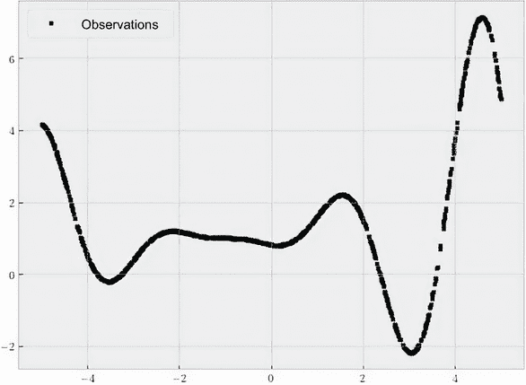

图 12.3 我们学习任务的训练数据集，包含 1,000 个数据点。在这个集合上训练一个常规的 GP 需要相当长的时间。

### 12.1.2 训练常规 GP

我们现在准备在这个数据集上实现并训练一个 GP 模型。首先，我们实现 GP 模型类，其具有常数函数（`gpytorch.means .ConstantMean` 的一个实例）作为其均值函数，以及具有输出尺度的 RBF 核函数（使用 `gpytorch.kernels.ScaleKernel(gpytorch.kernels.RBFKernel())` 实现）作为其协方差函数：

```py
class GPModel(gpytorch.models.ExactGP):
    def __init__(self, train_x, train_y, likelihood):
        super().__init__(train_x, train_y, likelihood)
        self.mean_module = gpytorch.means.
        ➥ConstantMean()                                  ❶
        self.covar_module = gpytorch.kernels.
        ➥ScaleKernel(                                    ❷
            gpytorch.kernels.RBFKernel()                  ❷
        )                                                 ❷

    def forward(self, x):                                 ❸
        mean_x = self.mean_module(x)                      ❸
        covar_x = self.covar_module(x)                    ❸
        return gpytorch.distributions.MultivariateNormal  ❸
        ➥(mean_x, covar_x)                               ❸
```

❶ 常数均值函数

❷ 具有输出尺度的 RBF 核函数

❸ 创建 MVN 分布作为预测

现在，我们使用我们的训练数据和一个 `GaussianLikelihood` 对象初始化了这个 GP 模型：

```py
likelihood = gpytorch.likelihoods.GaussianLikelihood()
model = GPModel(train_x, train_y, likelihood)
```

最后，我们通过运行梯度下降来训练我们的 GP，以最小化由数据的可能性定义的损失函数。在训练结束时，我们得到了模型的超参数（例如，均值常数、长度尺度和输出尺度），这些超参数给出了一个较低的损失值。梯度下降是使用 Adam 优化器（`torch .optim.Adam`）实现的，这是最常用的梯度下降算法之一：

```py
optimizer = torch.optim.Adam(model.parameters(), lr=0.01)          ❶
mll = gpytorch.mlls.ExactMarginalLogLikelihood(likelihood, model)  ❷

model.train()                                                      ❸
likelihood.train()                                                 ❸

for i in tqdm(range(500)):                                         ❹
    optimizer.zero_grad()                                          ❹

    output = model(train_x)                                        ❹
    loss = -mll(output, train_y)                                   ❹

    loss.backward()                                                ❹
    optimizer.step()                                               ❹

model.eval()                                                       ❺
likelihood.eval()                                                  ❺
```

❶ 梯度下降算法 Adam

❷ 损失函数，计算由超参数确定的数据的可能性

❸ 启用训练模式

❹ 运行 500 次梯度下降迭代

❺ 启用预测模式

注意：作为提醒，当训练 GP 时，我们需要为模型和可能性都启用训练模式（使用 `model.train()` 和 `likelihood .train()`）。在训练后和进行预测之前，我们需要启用预测模式（使用 `model.eval()` 和 `likelihood.eval()`）。

使用 GPU 训练 GPs

一个将 GP 扩展到大型数据集的方法，本章不重点讨论，是使用图形处理单元（GPU）。GPU 通常用于并行化矩阵乘法并加速训练神经网络。

同样的原则也适用于此处，而 GPyTorch 通过遵循 PyTorch 的语法将 GP 训练简化到了 GPU 上（通过在对象上调用 `cuda()` 方法）。具体来说，我们调用 `train_x = train_x.cuda()` 和 `train_y = train_y.cuda()` 将我们的数据放到 GPU 上，然后调用 `model = model.cuda()` 和 `likelihood = likelihood.cuda()` 将 GP 模型和其似然放到 GPU 上。

您可以在 GPyTorch 的文档中找到有关此主题的更多详细信息，链接地址为 [`mng.bz/lW8B`](http://mng.bz/lW8B)。

我们还对梯度下降进行了 500 次迭代，但由于我们当前的数据集明显更大，这个循环可能需要一段时间才能完成（所以在等待时来杯咖啡吧！）。训练完成后，我们调用了之前编写的 `visualize_gp_belief()` 辅助函数来显示我们训练好的 GP 所做的预测，生成了图 12.4：

```py
visualize_gp_belief(model, likelihood)
```

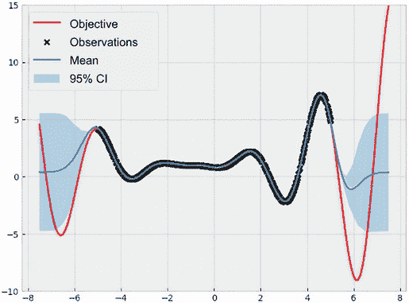

图 12.4 由普通 GP 进行的预测。预测很好地匹配了训练数据，但训练时间很长。

我们看到我们的 GP 的预测很好地匹配了训练数据点——这是一个鼓舞人心的迹象，表明我们的模型成功地从数据中学习了。然而，这个过程中存在一些问题。

### 12.1.3 普通 GP 训练中的问题

在这一小节中，我们讨论了在大型数据集上训练 GP 面临的一些挑战。首先，正如我们之前提到的，训练需要相当长的时间。在我的 MacBook 上，500 次梯度下降可能需要长达 45 秒的时间，这明显比我们在第二章和第三章观察到的情况要长。这直接是我们之前提到的 GP 的立方运行时间的结果，随着数据集的不断增大，这种长时间的训练只会变得更加禁锢，正如表 12.1 所示。

表 12.1 给定训练数据集大小的 GP 预计训练时间。训练很快变得困难。 

| 训练集大小 | 训练时间 |
| --- | --- |
| 500 个点 | 45 秒 |
| 2,000 个点 | 48 分钟 |
| 3,000 个点 | 2.7 小时 |
| 5,000 个点 | 12.5 小时 |
| 10,000 个点 | 4 天 |

第二个，也许更令人担忧的问题源于这样一个事实，即随着训练数据的规模增加，计算损失函数（用于梯度下降的训练数据的边际对数似然）变得越来越困难。这可以通过 GPyTorch 在训练过程中打印的警告信息来看出：

```py
NumericalWarning: CG terminated in 1000 iterations with average
  residual norm...
```

这些信息告诉我们，在计算损失时遇到了数值不稳定性。

注意，计算许多数据点之间的损失是一个计算上不稳定的操作。

数值不稳定性阻止我们正确计算损失，因此无法有效地最小化该损失。这在梯度下降的 500 次迭代中损失的变化中得到了说明，如图 12.5 所示。

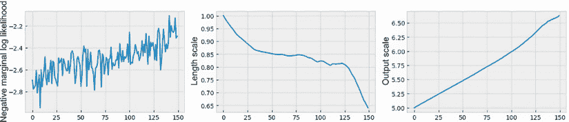

图 12.5 在梯度下降过程中普通高斯过程的逐渐损失。由于数值不稳定性，损失曲线崎岖不平，无法有效地最小化。

与第二章和第三章中所见不同，我们这里的损失上下波动，表明梯度下降未能很好地最小化该损失。事实上，随着我们进行更多的迭代，我们的损失实际上增加了，这意味着我们得到了一个次优模型！这种现象是可以理解的：如果我们误计算了模型的损失，那么通过使用该误计算项来指导梯度下降中的学习，我们可能得到一个次优解。

你可能对梯度下降类比为下山的比喻很熟悉。假设你在山顶，想下山。沿途的每一步，你找到一个朝向能让你到达更低处的方向（即下降）。最终，经过足够的步骤，你抵达山脚。类似地，在梯度下降中，我们从一个相对较高的损失开始，并在每次迭代中调整我们模型的超参数，逐步降低损失。经过足够的迭代，我们到达最佳模型。

注 涵盖了对梯度下降以及它如何类比为下山的出色讨论，可参考路易斯·塞拉诺的《深入理解机器学习》。

只有在我们能够准确计算损失时，这个过程才能正常运行，也就是说，我们可以清楚地看到哪个方向会让我们到达山上的更低处。然而，如果这个计算容易出错，我们自然无法有效地最小化模型的损失。这就好比戴着眼罩下山一样！正如我们在图 12.5 中看到的，我们实际上停留在山上的更高处（我们的损失高于梯度下降之前的值）。


图 12.6 使用数值不稳定的损失计算运行梯度下降类似于戴着眼罩下山。

总的来说，在大型数据集上训练常规高斯过程并不是一个好的方法。训练不仅随着训练数据规模的立方级增长，而且损失值的计算也不稳定。在本章的其余部分，我们将了解到变分高斯过程或 VGPs 是解决这个问题的方案。

## 12.2 从大型数据集中自动选择代表性点

VGPs 的思想是选择一组代表整个数据集的点，并在这个较小的子集上训练 GP。我们已经学会了如何在小数据集上训练 GP。希望这个较小的子集能捕捉到整个数据集的一般趋势，这样当在子集上训练 GP 时，仅有最少的信息会丢失。

这个方法非常自然。大数据集通常包含冗余信息，如果我们只从最信息丰富的数据点中学习，就可以避免处理这些冗余性。我们在 2.2 节中指出，像任何 ML 模型一样，GP 工作的假设是相似的数据点会产生相似的标签。当大数据集包含许多相似的数据点时，GP 只需要关注其中一个数据点来学习其趋势。例如，即使有按分钟的天气数据可用，天气预报模型也可以从仅有的小时测量中有效地进行学习。在这个小节中，我们将学习如何通过确保从小子集中学习相对于从大集合中学习时信息损失最小的方式来自动实现这一点，以及如何使用 GPyTorch 实现这个模型。

### 12.2.1 最小化两个 GP 之间的差异

我们如何选择这个小子集，使得最终的 GP 模型能够从原始数据集中获得最多的信息。在这个小节中，我们讨论了如何通过 VGP 来实现这一高级想法。这个过程等同于找到诱导点的子集，当在这个子集上训练 GP 时，诱导出的后验 GP 应该尽可能接近在整个数据集上训练的后验 GP。

当训练 VGP 时，深入一些数学细节，我们的目标是最小化在诱导点上条件化的后验 GP 和在整个数据集上条件化的后验 GP 之间的差异。这需要一种方法来衡量两个分布（两个 GP）之间的差异，而为此选择的衡量标准是 Kullback-Leibler（KL）散度。

定义*Kullback-Leibler（KL）散度*是一种统计距离，用于衡量两个分布之间的距离，也就是 KL 散度计算概率分布与另一个分布之间的不同程度。

KL 散度的补充材料

Will Kurt 的博客文章“Kullback-Leibler Divergence Explained”中提供了 KL 散度的直观解释（[`www.countbayesie.com/blog/2017/5/9/kullback-leibler-divergence-explained`](https://www.countbayesie.com/blog/2017/5/9/kullback-leibler-divergence-explained)）。有数学背景的读者可以参考 David MacKay 的《信息论、推理和学习算法》第二章（剑桥大学出版社，2003 年）。

正如欧几里得空间中点 A 和点 B 之间的欧几里得距离（即连接两点的线段的长度）衡量了这两点在欧几里得空间中的距离一样，KL 散度衡量了概率分布空间中两个给定分布之间的距离，即它们彼此之间的差异有多大。这在图 12.7 中有所说明。


图 12.7 欧几里得距离衡量了平面上两点之间的距离，而 KL 散度衡量了两个概率分布之间的距离。

注 作为一个数学上有效的距离度量，KL 散度是非负的。换句话说，任意两个分布之间的距离至少为零，当距离等于零时，两个分布完全匹配。

因此，如果我们能够轻松计算在诱导点上训练的后验 GP 与整个数据集上训练的后验 GP 之间的 KL 散度，我们应该选择使得 KL 散度为零的诱导点。不幸的是，类似于计算边际对数似然的计算不稳定性，计算 KL 散度也不容易。然而，由于其数学特性，我们可以将 KL 散度重写为两个量之间的差异，如图 12.8 所示。


图 12.8 KL 散度被分解为边际对数似然和证据下界（ELBO）之间的差异。ELBO 易于计算，因此被选择为要优化的度量。

这个方程中的第三项，也就是证据下界（ELBO），是边际对数似然和 KL 散度之间的精确差异。尽管边际对数似然和 KL 散度这两项很难计算，但 ELBO 具有简单的形式并且可以轻松计算。因此，我们可以最大化 ELBO 来间接最大化边际对数似然，而不是最小化 KL 散度，使得在诱导点上训练的后验 GP 尽可能接近在完整数据集上训练的后验 GP。

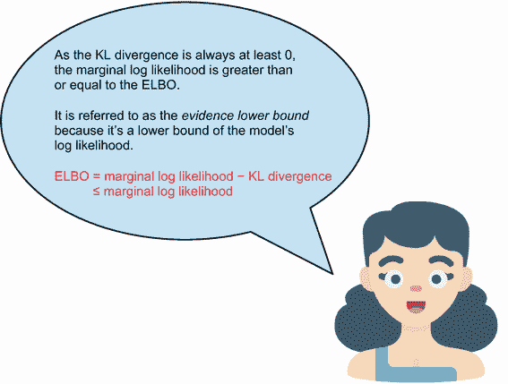

综上所述，为了找到一组诱导点，使得后验 GP 尽可能与我们能够在大数据集上训练时获得的 GP 相似，我们的目标是最小化两个 GP 之间的 KL 散度。然而，这个 KL 散度很难计算，所以我们选择优化 KL 散度的代理，即模型的 ELBO，这样更容易计算。正如我们在下一小节中看到的，GPyTorch 提供了一个方便的损失函数，用于计算这个 ELBO 项。在我们讨论实现之前，还有一件事情需要讨论：在最大化 ELBO 项时如何考虑大型训练集中的所有数据点。

### 12.2.2 在小批量中训练模型

由于我们的目标是找到最能代表整个训练数据集的一组感兴趣的点，我们仍然需要在计算 ELBO 时包含训练集中的所有点。但是我们之前说过，跨多个数据点计算边际对数似然是数值不稳定的，因此梯度下降变得无效。我们在这里面对相同的问题吗？在本小节中，我们看到当通过优化 ELBO 项来训练 VGP 时，我们可以通过使用更适合大型数据集的梯度下降的修改版本来避免这个数值不稳定性问题。

在许多数据点上计算 ML 模型的损失函数的任务并不是 GP 独有的。例如，神经网络通常在数千和数百万的数据点上进行训练，计算网络的损失函数对于所有数据点也是不可行的。对于这个问题的解决方法，对于神经网络和 VGP 都是*近似*通过对随机点的损失值计算跨所有数据点的真实损失值。例如，以下代码片段来自官方 PyTorch 文档，并显示了如何在图像数据集上训练神经网络（[`mng.bz/8rBB`](http://mng.bz/8rBB)）。在这里，内部循环迭代训练数据的小子集，并在这些子集上计算的损失值上运行梯度下降：

```py
for epoch in range(2):                        ❶

    running_loss = 0.0
    for i, data in enumerate(trainloader, 0):
        inputs, labels = data                 ❷

        optimizer.zero_grad()                 ❸

        outputs = net(inputs)                 ❹
        loss = criterion(outputs, labels)     ❹
        loss.backward()                       ❹
        optimizer.step()                      ❹
```

❶ 对数据集进行多次循环

❷ 获取输入；数据是一个 [输入，标签] 的列表

❸ 归零参数梯度

❹ 前向 + 反向 + 优化

当我们在少量点上计算模型的损失时，计算可以稳定有效地进行。此外，通过多次重复这个近似，我们可以很好地近似真实损失。最后，我们在这个近似损失上运行梯度下降，希望也最小化所有数据点上的真实损失。

定义 在使用数据的随机子集计算的损失上运行梯度下降的技术有时被称为*小批量梯度下降*。在实践中，我们通常不会在梯度下降的每次迭代中随机选择一个子集，而是将训练集分成小的子集，并通过每个这些小的子集迭代计算近似损失。

例如，如果我们的训练集包含 1,000 个点，我们可以将其分成 10 个小子集，每个子集包含 100 个点。然后，我们对每个包含 100 个点的子集计算梯度下降的损失，并迭代重复所有 10 个子集。（这恰好是我们后面代码示例中所做的。）同样，虽然从数据子集计算的这种近似损失并不完全等于真实损失，但在梯度下降中，我们重复这个近似很多次，这在聚合中指引我们朝着正确的下降方向。

图 12.9 中说明了梯度下降最小化真实损失和小批量梯度下降最小化近似损失之间的区别。与梯度下降相比（再次强调，无法在大数据上运行），小批量版本可能不会指向最有效的下降方向，但通过多次重复近似，我们仍然能够达到目标。

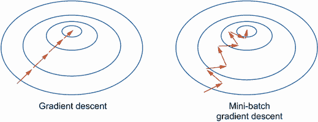

图 12.9 梯度下降和小批量梯度下降在损失“谷底”中的示意图，其中谷底的中心给出最低的损失。梯度下降，如果可以计算，直接导向目标。小批量梯度下降朝着不是最优的方向前进，但最终仍然到达目标。

如果我们用盲目下山的比喻来思考，小批量梯度下降类似于戴着一块可以部分看穿的薄布的盲目。并不能保证我们每迈出一步就到达一个更低的位置，但是给定足够的时间，我们将能够成功下降。

注意并非所有的损失函数都可以通过对数据子集的损失来近似。换句话说，并非所有的损失函数都可以通过小批量梯度下降来最小化。GP 的负边际对数似然就是一个例子；否则，我们可以在这个函数上运行小批量梯度下降。幸运的是，小批量梯度下降适用于 VGP 的 ELBO。

总之，训练一个 VGP 遵循大致相似的程序，就像训练一个常规的 GP 一样，我们使用梯度下降的一个版本来最小化模型的适当损失。表 12.2 总结了两个模型类之间的关键差异：常规 GP 应该通过运行梯度下降来最小化精确的负边际对数似然在小数据集上训练，而 VGP 可以通过运行小批量梯度下降来优化 ELBO，在大数据集上训练，这是真实对数似然的一个近似。

表 12.2 训练一个 GP 与训练一个 VGP。高层次的过程是相似的；只有具体的组件和设置被替换。

| 训练过程 | GP | VGP |
| --- | --- | --- |
| 训练数据大小 | 小 | 中等到大 |
| 训练类型 | 精确训练 | 近似训练 |
| 损失函数 | 负边际对数似然 | ELBO |
| 优化 | 梯度下降 | 小批量梯度下降 |

### 12.2.3 实现近似模型

*我们现在准备在 GPyTorch 中实现一个 VGP。我们的计划是编写一个 VGP 模型类，这类似于我们已经使用的 GP 模型类，并使用小批量梯度下降最小化其 ELBO。我们在表 12.2 中描述的工作流程的不同之处反映在了本小节中的代码中。表 12.3 显示了在 GPyTorch 中实现 GP 与 VGP 时所需的组件。除了均值和协方差模块外，VGP 还需要另外两个组件：*

+   *变分分布*—*定义了 VGP 中诱导点的分布。正如我们在上一节中学到的，此分布要进行优化，以使 VGP 类似于在完整数据集上训练的 GP。*

+   *变分策略*—*定义了如何从诱导点产生预测。在第 2.2 节中，我们看到多元正态分布可以根据观测结果进行更新。这种变分策略促使对变分分布进行相同的更新。*

*表 12.3 在 GPyTorch 中实现 GP 与 VGP 时所需的组件。VGP 需要像 GP 一样的均值和协方差模块，但还需要变分分布和变分策略。*

| 组件 | GP | VGP |
| --- | --- | --- |
| 均值模块 | 是 | 是 |
| 协方差模块 | 是 | 是 |
| 变分分布 | 否 | 是 |
| 变分策略 | 否 | 是 |

*考虑到这些组件，我们现在实现了 VGP 模型类，我们将其命名为* `ApproximateGPModel`。*我们不再在* `__init__()` *方法中接受训练数据和似然函数。相反，我们接受一组诱导点，这些点将用于表示整个数据集。* `__init__()` *方法的其余部分包括声明将用于学习哪组诱导点最佳的学习流程：*

+   *变分分布* `variational_distribution` *变量是* `CholeskyVariationalDistribution` *类的一个实例，在初始化期间接受诱导点的数量。* *变分分布是 VGP 的核心。*

+   *变分策略* `variational_strategy` *变量是* `VariationalStrategy` *类的一个实例。它接受一组诱导点以及变分分布。我们将* `learn_inducing_locations = True` *以便在训练过程中学习这些诱导点的最佳位置。如果将此变量设置为* `False`，*则传递给* `__init__()` *的点（存储在* `inducing` *中）将用作诱导点：*

```py
class ApproximateGPModel(gpytorch.models.ApproximateGP):             ❶
  def __init__(self, inducing_points):                               ❷
    variational_distribution =                                       ❸
    ➥gpytorch.variational.CholeskyVariationalDistribution(          ❸
        inducing_points.size(0)                                      ❸
    )                                                                ❸
    variational_strategy = gpytorch.variational.VariationalStrategy( ❸
        self,                                                        ❸
        inducing_points,                                             ❸
        variational_distribution,                                    ❸
        learn_inducing_locations=True,                               ❸
    )                                                                ❸
    super().__init__(variational_strategy)                           ❸

    ...                                                              ❹
```

❶ *我们的 VGP 不是一个 ExactGP 对象，而是一个近似 GP。*

❷ *接受一组初始诱导点*

❸ *设置训练所需的变分参数*

❹ *待续*

*在* `__init__()` *方法的最后一步中，我们声明了 VGP 的均值和协方差函数。它们应该与在数据上训练的普通 GP 中要使用的函数相同。在我们的情况下，我们使用常数均值和具有输出比例的 RBF 核：*

```py
class ApproximateGPModel(gpytorch.models.ApproximateGP):
    def __init__(self, inducing_points):
        ...

        self.mean_module = gpytorch.means.ConstantMean()
        self.covar_module = gpytorch.kernels.ScaleKernel(
            gpytorch.kernels.RBFKernel()
        )
```

我们还以与常规 GP 相同的方式声明 `forward()` 方法，这里不再展示。现在，让我们用训练集中的前 50 个数据点来初始化这个模型作为引入点：

```py
model = ApproximateGPMod1el(train_x[:50, :])            ❶
likelihood = gpytorch.likelihoods.GaussianLikelihood()
```

❶ 切片张量 `train_x[:50, :]` 给出了 `train_x` 中的前 50 个数据点。

前 50 个数据点没有什么特别之处，它们的值，在 VGP 模型内部存储，将在训练过程中被修改。这种初始化最重要的部分是，我们指定模型应该使用 50 个引入点。如果我们想要使用 100 个，我们可以将 `train_x[:100, :]` 传递给初始化。

很难准确地说，多少个引入点足以用于 VGP。我们使用的点越少，模型训练就越快，但是这些引入点在表示整个集合时的效果就越不好。随着点数的增加，VGP 有更多的自由度来展开引入点以覆盖整个集合，但训练会变慢。

一般规则是不超过 1,000 个引入点。正如我们马上要讨论的，50 个点足以让我们以高保真度近似前一小节中训练的 GP。

要设置小批量梯度下降，我们首先需要一个优化器。我们再次使用 Adam 优化器：

```py
optimizer = torch.optim.Adam(
    [
        {"params": model.parameters()},
        {"params": likelihood.parameters()}    ❶
    ],
    lr=0.01
)
```

❶ 优化似然函数的参数以及 GP 的参数

要优化的参数

之前，我们只需要将 `model.parameters()` 传递给 Adam。在这里，似然函数没有与 VGP 模型耦合——常规 GP 使用似然函数初始化，而 VGP 则没有。因此，在这种情况下，有必要将 `likelihood.parameters()` 传递给 Adam。

对于损失函数，我们使用 `gpytorch.mlls.VariationalELBO` 类，该类实现了我们希望通过 VGP 优化的 ELBO 量。在初始化期间，此类的一个实例接受似然函数、VGP 模型和完整训练集的大小（我们可以通过 `train_y.size(0)` 访问）。有了这些，我们声明这个对象如下：

```py
mll = gpytorch.mlls.VariationalELBO(
    likelihood,
    model,
    num_data=train_y.size(0)    ❶
)
```

❶ 训练数据的大小

有了模型、优化器和损失函数设置好了，我们现在需要运行小批量梯度下降。为此，我们将训练数据集分成批次，每个批次包含 100 个点，使用 PyTorch 的 `TensorDataset` 和 `DataLoader` 类：

```py
train_dataset = torch.utils.data.TensorDataset(train_x, train_y)
train_loader = torch.utils.data.DataLoader(train_dataset, batch_size=100)
```

这个 `train_loader` 对象允许我们以干净的方式迭代大小为 100 的数据集的小批量，当运行梯度下降时。损失—即 ELBO—通过以下语法计算：

```py
output = model(x_batch)
loss = -mll(output, y_batch)
```

这里，`x_batch` 和 `y_batch` 是完整训练集的一个给定批次（小子集）。总的来说，梯度下降的实现如下：

```py
model.train()                                 ❶
likelihood.train()                            ❶

for i in tqdm(range(50)):                     ❷
    for x_batch, y_batch in train_loader:     ❸
        optimizer.zero_grad()                 ❹

        output = model(x_batch)               ❹
        loss = -mll(output, y_batch)          ❹

        loss.backward()                       ❹
        optimizer.step()                      ❹

model.eval()                                  ❺
likelihood.eval()                             ❺
```

❶ 启用训练模式

❷ 迭代整个训练数据集 50 次

❸ 在每次迭代中，迭代 `train_loader` 中的小批次

❹ 小批量梯度下降，在批次上运行梯度下降

❺ 启用预测模式

在运行这个小批量梯度下降循环时，你会注意到它比使用普通 GP 的循环要快得多。（在同一台 MacBook 上，这个过程只需不到一秒钟，速度大幅提升！）

VGP 的速度

你可能认为我们在普通 GP 中进行的 500 次迭代与 VGP 中进行的 50 次小批量梯度下降的比较不公平。但是请记住，在小批量梯度下降的外部`for`循环的每次迭代中，我们还要在`train_loader`中迭代 10 个小批量，所以最终总共进行了 500 次梯度步骤。此外，即使我们运行了 500 次小批量梯度下降的迭代，也只需要不到 1 秒乘以 10，仍然比 45 秒快 4 倍。

因此，通过小批量梯度下降，我们的 VGP 模型可以更高效地训练。但是对于训练质量如何呢？图 12.10 的左侧面板可视化了我们小批量梯度下降运行期间的逐渐 ELBO 损失。与图 12.5 相比，尽管损失并没有在每一步时持续减小（存在锯齿趋势），但损失在整个过程中有效地最小化了。

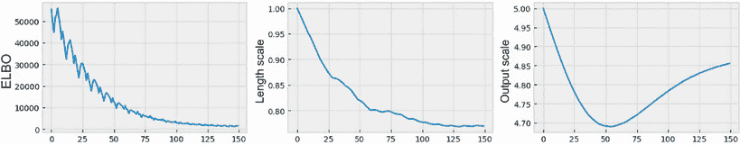

图 12.10 VGP 在小批量梯度下降期间逐步损失服从的长度尺度和输出尺度的对应关系

这表明，在优化过程中的每一步可能不是最小化损失的最佳方向，但小批量梯度下降确实是有效地减小了损失。这在图 12.11 中更清楚地显示出来。

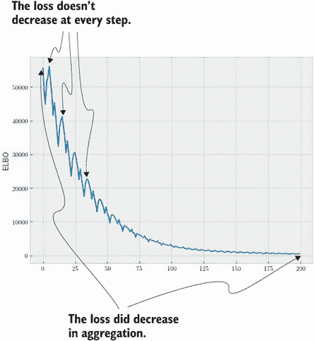

图 12.11 过程中 VGP 的逐步损失在小批量梯度下降中逐渐减小。尽管存在一定的变异性，但损失有效地最小化了。

现在，让我们可视化这个 VGP 模型产生的预测结果，看看它是否产生了合理的结果。使用`visualize_gp_belief()`助手函数，我们得到图 12.12，显示我们以较小的时间成本获得了对真实损失进行训练的 GP 的高质量近似。


图 12.12 由 GP 和 VGP 进行的预测。VGP 进行的预测与 GP 的预测大致相同。

结束我们对 VGP 的讨论，让我们可视化 VGP 模型学到的诱导点的位置。我们已经说过这些诱导点应该代表整个数据集并很好地捕捉其趋势。要绘制诱导点，我们可以使用`model.variational_strategy.inducing_points.detach()`访问它们的位置，并将它们作为散点沿着均值预测进行绘制。当调用这个函数时，我们只需要将`variational`设置为`True`：

```py
visualize_gp_belief(model, likelihood, variational=True)
```

这产生了图 12.13，在其中我们看到这些感应点的非常有趣的行为。它们并不均匀分布在我们的训练数据之间；相反，它们聚集在数据的不同部分。这些部分是目标函数上升或下降或呈现某些非平凡行为的地方。通过将感应点分配到这些位置，VGP 能够捕捉嵌入大型训练数据集中最重要的趋势。

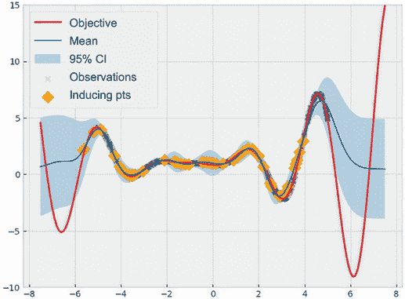

图 12.13 VGP 的感应点。这些点被放置在整个数据中，捕捉最重要的趋势。

我们已经学习了如何使用小批量梯度下降来训练 VGP，并且已经看到这有助于以更低的成本近似于不可训练的常规 GP。在接下来的部分，我们将学习另一种梯度下降算法，可以更有效地训练 VGP。

## 12.3 通过考虑损失表面的几何特性来进行更好的优化

在本节中，我们将学习一种名为*自然梯度下降*的算法，这是梯度下降的另一种版本，在计算下降步骤时更仔细地推理损失函数的几何结构。正如我们很快会看到的那样，这种谨慎的推理使我们能够快速降低损失函数，最终导致更有效的优化，迭代次数更少（也就是更快的收敛）。

要理解自然梯度下降的动机以及为什么它比我们已经拥有的更好，我们首先区分 VGP 的两种参数类型：

+   第一种类型是 GP 的常规参数，例如均值常数和协方差函数的长度和输出比例。这些参数取得常规的数值，存在于欧几里得空间中。

+   第二种类型包括只有 VGP 才有的*变分*参数。这些与感应点和促使变分分布近似所需的各种组件有关。换句话说，这些参数与概率分布相关，并且具有无法在欧几里得空间内很好表示的值。

注意：这两种参数之间的差异有些相似，尽管不完全类似于欧几里得距离可以衡量该空间中两点之间的距离，但无法衡量两个概率分布之间的差异。

尽管我们在前一节中使用的小批量梯度下降效果已经足够好，但该算法假设所有参数存在于欧几里得空间中。例如，从算法的角度来看，长度尺度从 1 变到 2 的差异与诱导点的均值从 1 变到 2 的差异是相同的。然而，事实并非如此：从长度尺度从 1 变到 2 会对 VGP 模型产生非常不同的影响，而从诱导点的均值从 1 变到 2 的影响也不同。这在图 12.14 的示例中有所体现，其中损失对长度尺度的行为与对诱导均值的行为非常不同。

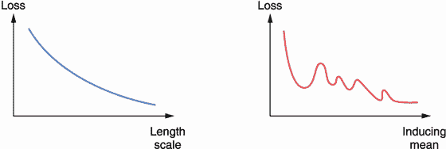

图 12.14 一个示例，说明了要最小化的损失可能在正常参数和变分参数方面的行为非常不同。这就需要考虑损失的几何形状。

正常参数和 VGP 的变分参数的损失函数的几何形状之间存在这种行为差异是因为。如果小批量梯度下降能够在计算损失的下降方向时考虑到这种几何差异，那么该算法在最小化损失时将更有效。这就是自然梯度下降的作用所在。

*自然梯度下降* 的定义利用了关于损失函数对于变分参数的几何特性的信息，以计算这些参数更好的下降方向。

通过采用更好的下降方向，自然梯度下降可以更有效地帮助我们优化 VGP 模型，而且更快。最终的结果是我们能够在更少的步骤中收敛到我们的最终模型。继续我们对不同梯度下降算法的二维图示，图 12.15 展示了这种几何推理如何帮助自然梯度下降比小批量梯度下降更快地达到目标。也就是说，自然梯度下降在训练过程中往往需要更少的步骤来达到与小批量梯度下降相同的损失。在我们下山的类比中，使用自然梯度下降时，我们在试图下山时仍然被一块薄布蒙住了眼睛，但现在我们穿着特制的登山鞋，可以更有效地穿越地形。

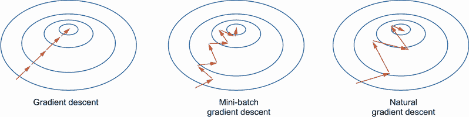

图 12.15 展示了在损失“谷底”中进行梯度下降、小批量梯度下降和自然梯度下降的插图，在谷底的中心给出了最低的损失。通过考虑损失函数的几何特性，自然梯度下降比小批量梯度下降更快地达到了损失最小值。

自然梯度下降的补充材料

对于更加数学化的自然梯度下降解释，我推荐阅读 Agustinus Kristiadi 的优秀博文“自然梯度下降”：[`mng.bz/EQAj`](http://mng.bz/EQAj)。

注意 需要注意的是，自然梯度下降算法仅优化 VGP 的变分参数。常规参数，例如长度和输出尺度，仍然可以通过常规小批量梯度下降算法优化。在接下来实现新的训练过程时，我们将看到这一点。

因此，让我们使用自然梯度下降来训练我们的 VGP 模型。与之前部分的相同一维目标函数一样，我们实现了一个能够与自然梯度下降一起工作的 VGP 模型。这种情况下的模型类似于我们在上一节为小批量梯度下降实现的`ApproximateGPModel`，它

+   仍然扩展`gpytorch.models.ApproximateGP`

+   需要一个变分策略来管理学习过程

+   具有类似常规 GP 模型的均值函数、协方差函数和`forward()`方法

这里唯一的区别是，当训练模型时，变分分布需要是`gpytorch.variational.NaturalVariationalDistribution`的一个实例，以便我们在使用自然梯度下降时进行训练。整个模型类实现如下：

```py
class NaturalGradientGPModel(gpytorch.models.ApproximateGP):
  def __init__(self, inducing_points):
    variational_distribution =                         ❶
      gpytorch.variational.                            ❶
      ➥NaturalVariationalDistribution(                ❶
        inducing_points.size(0)                        ❶
    )                                                  ❶

    variational_strategy = gpytorch.variational.
    ➥VariationalStrategy(                             ❷
        self,                                          ❷
        inducing_points,                               ❷
        variational_distribution,                      ❷
        learn_inducing_locations=True,                 ❷
    )                                                  ❷
    super().__init__(variational_strategy)             ❷
    self.mean_module = gpytorch.means.ConstantMean()   ❷
    self.covar_module = gpytorch.kernels.ScaleKernel(  ❷
        gpytorch.kernels.RBFKernel()                   ❷
    )                                                  ❷
  def forward(self, x):
        ...                                            ❸
```

❶ 变分分布需要是自然的才能与自然梯度下降一起工作。

❷ 声明剩余的变分策略与以前相同。

❸ `forward()`方法与以前相同。

我们再次使用 50 个引导点初始化此 VGP 模型：

```py
model = NaturalGradientGPModel(train_x[:50, :])         ❶
likelihood = gpytorch.likelihoods.GaussianLikelihood()
```

❶ 50 个引导点

现在是重要的部分，我们为训练声明优化器。请记住，我们使用自然梯度下降算法来优化模型的变分参数。然而，其他参数，例如长度和输出尺度，仍然必须由 Adam 优化器优化。因此，我们使用以下代码：

```py
ngd_optimizer = gpytorch.optim.NGD(                  ❶
  model.variational_parameters(), num_data=train_y.  ❶
  ➥size(0), lr=0.1                                  ❶
)                                                    ❶

hyperparam_optimizer = torch.optim.Adam(             ❷
  [{"params": model.parameters()}, {"params":        ❷
  ➥likelihood.parameters()}],                       ❷
  lr=0.01                                            ❷
)                                                    ❷
mll = gpytorch.mlls.VariationalELBO(
  likelihood, model, num_data=train_y.size(0)
)
```

❶ 自然梯度下降接受 VGP 的变分参数，`model.variational_parameters()`。

❷ Adam 接受 VGP 的其他参数，`model.parameters()`和`likelihood.parameters()`。

现在，在训练期间，我们仍然使用以下方式计算损失

```py
output = model(x_batch)
loss = -mll(output, y_batch)
```

在计算损失时，我们循环遍历我们训练数据的小批量（`x_batch`和`y_batch`）。然而，现在我们有两个优化器同时运行，我们需要通过在每次训练迭代时调用`zero_grad()`（清除前一步的梯度）和`step()`（执行一步下降）来管理它们：

```py
model.train()                              ❶
likelihood.train()                         

for i in tqdm(range(50)):
    for x_batch, y_batch in train_loader:
        ngd_optimizer.zero_grad()          ❷
        hyperparam_optimizer.zero_grad()   ❷

        output = model(x_batch)
        loss = -mll(output, y_batch)

        loss.backward()

        ngd_optimizer.step()               ❸
        hyperparam_optimizer.step()        ❸

model.eval()                               ❹
likelihood.eval()                          ❹
```

❶ 启用训练模式

❷ 清除前一步的梯度

❸ 使用每个优化器执行下降步骤

❹ 启用预测模式

注意 像往常一样，在梯度下降之前，我们需要调用`model.train()`和`likelihood.train()`，在训练完成后需要调用`model.eval()`和`likelihood.eval()`。

请注意，我们在自然梯度下降优化器和 Adam 上都调用了 `zero_grad()` 和 `step()`，以优化 VGP 模型的相应参数。训练循环再次只需很短的时间即可完成，并且训练得到的 VGP 产生的预测结果如图 12.16 所示。我们看到的预测结果与图 12.4 中的普通 GP 和使用小批量梯度下降训练的 VGP 在图 12.13 中的预测结果非常相似。

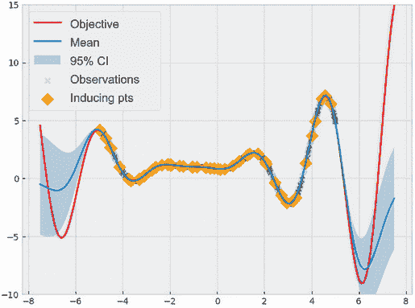

图 12.16 由 VGP 和通过自然梯度下降训练的感应点所做出的预测。这些预测的质量很高。

我们可以进一步检查训练过程中 ELBO 损失的逐步进展。其进展在图 12.17 的左侧面板中可视化。

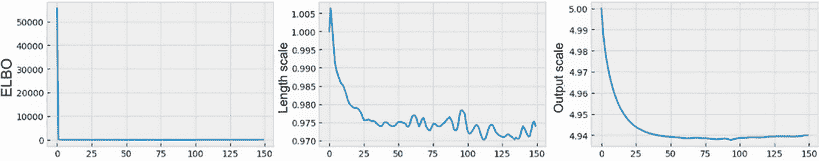

图 12.17 VGP 在自然梯度下降期间的逐步损失。经过少数迭代后，损失得到了有效最小化。

令人惊讶的是，在训练过程中，我们的 ELBO 损失几乎立即降至一个较低的值，这表明自然梯度下降能够帮助我们快速收敛到一个良好的模型。这说明了当训练 VGP 时，这种梯度下降算法的变体的好处。

我们现在已经到达第十二章的结尾。在本章中，我们学习了如何通过使用感应点将 GP 模型扩展到大型数据集，感应点是一组代表性点，旨在捕获大型训练集所展现的趋势。由此产生的模型称为 VGP，它适用于小批量梯度下降，因此可以在不计算所有数据点的模型损失的情况下进行训练。我们还研究了自然梯度下降作为小批量算法的更有效版本，使我们能够更有效地优化。在第十三章中，我们将涵盖 GP 的另一种高级用法，将其与神经网络结合以建模复杂的结构化数据。

## 12.4 练习

此练习演示了在加利福尼亚房价的真实数据集上，从普通 GP 模型转换为 VGP 模型时效率的提高。我们的目标是观察 VGP 在实际环境中的计算优势。

完成以下步骤：

1.  使用 Pandas 库中的 `read_csv()` 函数读取存储在名为 `data/housing.csv` 的电子表格中的数据集，该数据集来自 Kaggle 的加利福尼亚房价数据集（[`mng.bz/N2Q7`](http://mng.bz/N2Q7)），使用的是创意共用公共领域许可证。一旦读取，Pandas dataframe 应该看起来类似于图 12.18 中的输出。

    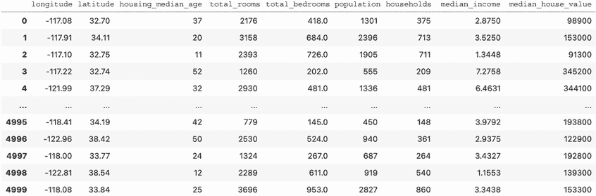

    图 12.18 作为 Pandas dataframe 显示的房价数据集。这是本练习的训练集。

1.  在散点图中可视化`median_house_value`列，这是我们的预测目标，其*x*-和*y*-轴对应于`longitude`和`latitude`列。一个点的位置对应于一个房子的位置，点的颜色对应于价格。可视化效果应该类似于图 12.19。

    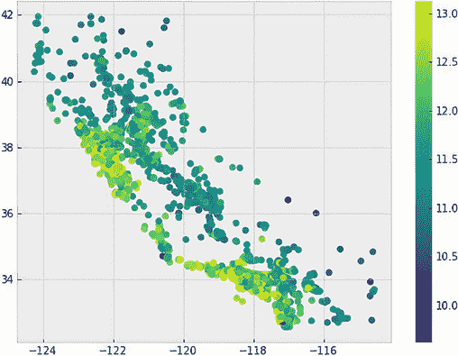

    图 12.19 房价数据集的散点图表示

1.  提取除最后一列（`median_house_value`）以外的所有列，并将它们存储为 PyTorch 张量。这将用作我们的训练特征，`train_x`。

1.  提取`median_house_value`列，并将其对数变换存储为另一个 PyTorch 张量。这是我们的训练目标，`train_y`。

1.  通过减去均值并除以标准差来归一化训练标签`train_y`。这将使训练更加稳定。

1.  使用具有恒定均值函数和具有自动相关性确定（ARD）的 Matérn 5/2 核实现常规 GP 模型。关于 Matérn 核和 ARD 的详细内容，请参阅第 3.4.2 和第 3.4.3 节。

1.  使用以下代码创建一个噪声至少为 0.1 的似然性：

    ```py
    likelihood = gpytorch.likelihoods.GaussianLikelihood(
        noise_constraint=gpytorch.constraints.GreaterThan(1e-1)  ❶
    )
    ```

    ❶该约束强制噪声至少为 0.1。

    此约束有助于通过提高噪声容限来平滑训练标签。

1.  初始化之前实现的 GP 模型，并使用梯度下降对其进行 10 次迭代训练。观察总训练时间。

1.  实现具有与 GP 相同的均值和协方差函数的变分 GP 模型。这个模型看起来类似于我们在本章中实现的`ApproximateGPModel`类，只是现在我们需要 Matérn 5/2 核和 ARD。

1.  使用类似初始化的似然性和 100 个诱导点对此 VGP 进行训练，使用自然梯度下降进行 10 次迭代。对于小批量梯度下降，您可以将训练集分成大小为 100 的批次。

1.  验证训练 VGP 所需的时间是否少于训练 GP 的时间。对于计时功能，您可以使用`time.time()`来记录每个模型训练的开始和结束时间，或者您可以使用`tqdm`库来跟踪训练持续时间，就像我们一直在使用的代码一样。

解决方案包含在`CH11/02 - Exercise.ipynb`笔记本中。

## 摘要

+   GP 的计算成本与训练数据集的大小呈立方比例。因此，随着数据集的大小增长，训练模型变得不可行。

+   在大量数据点上计算 ML 模型的损失在数值上是不稳定的。以不稳定的方式计算损失可能会误导梯度下降过程中的优化，导致预测性能不佳。

+   VGP 通过仅对一小组诱导点进行训练来扩展到大型数据集。这些诱导点需要代表数据集，以便训练的模型尽可能地与在整个数据集上训练的 GP 相似。

+   为了产生一个尽可能接近在所有训练数据上训练的模型的近似模型，Kullback-Leibler 散度，它度量两个概率分布之间的差异，被用于 VGP 的制定中。

+   当训练一个 VGP 时，证据下界（ELBO）充当真实损失的代理。更具体地说，ELBO 限制了模型的边际对数似然，这是我们的优化目标。通过优化 ELBO，我们间接优化了边际对数似然。

+   训练一个 VGP 可以通过小批量进行，从而实现更稳定的损失计算。在该过程中使用的梯度下降算法是小批量梯度下降。

+   尽管小批量梯度下降的每一步都不能保证完全最小化损失，但是当运行大量迭代时，该算法可以有效降低损失。这是因为许多小批量梯度下降的步骤在聚合时可以指向最小化损失的正确方向。

+   自然梯度下降考虑了相对于 VGP 的变分参数的损失函数的几何性质。这种几何推理使得算法能够更新训练模型的变分参数并更有效地最小化损失，从而实现更快的收敛。

+   自然梯度下降优化了 VGP 的变分参数。诸如长度和输出比例等常规参数由小批量梯度下降进行优化。
