# 第十四章：将高斯过程与神经网络结合

本章涵盖

+   使用常见协方差函数处理复杂结构化数据的困难

+   使用神经网络处理复杂结构化数据

+   将神经网络与 GP 结合

在第二章中，我们学到了高斯过程（GP）的均值和协方差函数作为我们希望在模型中融入的先验信息，当进行预测时。因此，这些函数的选择极大地影响了训练后的 GP 的行为。因此，如果均值和协方差函数被错误地指定或不适用于手头的任务，那么得到的预测就不会有用。

例如，记住*covariance function*，或*kernel*，表示两个点之间的相关性——即相似性。两个点越相似，它们的标签值可能越相似，我们试图预测的标签值。在我们的房价预测示例中，相似的房子可能会有类似的价格。

核到底如何计算两个给定房子之间的相似性？我们考虑两种情况。在第一种情况中，核函数仅考虑前门的颜色，并对于任何具有相同门颜色的两个房子输出 1，否则输出 0。换句话说，如果两个房子的前门颜色相同，这个核函数认为它们相似。

正如图 13.1 所示，这个核函数对于房价预测模型来说是一个糟糕的选择。核函数认为左边的房子和中间的房子应该有相似的价格，而右边的房子和中间的房子应该有不同的价格。这是不合适的，因为左边的房子比其他两个大得多，而其他两个房子的大小相似。误差发生的原因是核函数错误地判断了房子的哪个特征是房子成本的良好预测特征。


图 13.1 由不合适的核函数计算的房屋之间的协方差。因为它只关注前门的颜色，所以这个核函数无法产生合适的协方差。

另一个核函数更加复杂，并考虑了相关因素，比如位置和居住面积。这个核函数更加合适，因为它可以更合理地描述两个房子之间的价格相似性。拥有合适的核函数——即正确的相似度度量——对于 GP 来说至关重要。如果核函数能够正确地描述给定数据点之间的相似性或差异性，那么使用协方差的 GP 将能够产生良好校准的预测。否则，预测将具有较低的质量。

你可能会认为一个只考虑门颜色的房屋核函数是不合适的，并且在 ML 中没有合理的核函数会表现出这种行为。然而，正如我们在本章中所展示的，到目前为止我们使用的一些常见核函数（例如，RBF 和 Matérn）在处理结构化输入数据（例如图像）时会出现相同的问题。具体来说，它们未能充分描述两个图像之间的相似性，这给在这些结构化数据类型上训练 GPs 带来了挑战。我们采取的方法是使用神经网络。神经网络是灵活的模型，可以在有足够数据的情况下很好地逼近任何函数。我们学会使用神经网络来转换 GP 的核函数无法很好地处理的输入数据。通过这样做，我们既得到了神经网络的灵活建模，*又*从 GP 中获得了不确定性校准的预测。

在本章中，我们展示了我们通常的 RBF 核函数不能很好地捕捉常见数据集的结构，从而导致 GP 的预测不佳。然后我们将一个神经网络模型与此 GP 结合起来，看到新的核函数可以成功地推理相似性。到本章结束时，我们获得了一个框架，帮助 GP 处理结构化数据类型并提高预测性能。

## 13.1 包含结构的数据

在本节中，我们解释了*结构化数据*的确切含义。与我们在之前章节中用来训练 GPs 的数据类型不同，在那些数据类型中，数据集中的每个特征（列）可以取得连续范围内的值，而在许多应用中，数据具有更复杂性。比如说：

+   房子的楼层数只能是正整数。

+   在计算机视觉任务中，图像中的像素值是 0 到 255 之间的整数。

+   在分子 ML 中，分子通常被表示为图形。

那就是，这些应用中的数据点中嵌入了*结构*，或者需要数据点遵循的要求：没有房子可以有负数的楼层；像素不能以分数作为其值；表示分子的图形将具有表示化学物质和结合物的节点和边缘。我们称这些类型的数据为*结构化数据*。在本章中，我们将使用流行的 MNIST 手写数字数据集（见[`huggingface.co/datasets/mnist`](https://huggingface.co/datasets/mnist)）作为我们讨论的案例研究。

定义 修改后的美国国家标准与技术研究所（MNIST）数据集包含手写数字的图像。每个图像是一个 28×28 的整数矩阵，取值范围在 0 到 255 之间。

这个数据集中的一个示例数据点如图 13.2 所示，其中像素的阴影对应于其值；0 对应于白色像素，255 对应于黑色像素。我们看到这个数据点是数字五的图像。

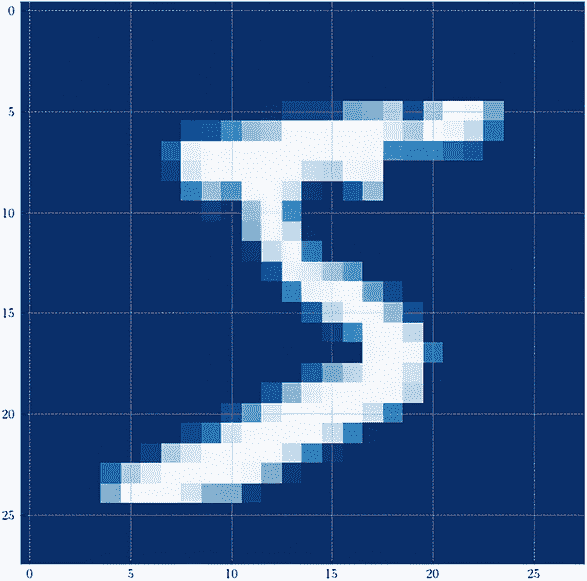

图 13.2 来自 MNIST 数据集的数据点，这是一个由 28 行和 28 列像素组成的图像，表示为一个 PyTorch 张量

注意 虽然这个手写数字识别任务在技术上是一个分类问题，但我们使用它来模拟一个回归问题（这是我们在 BayesOpt 中要解决的问题类型）。由于每个标签都是一个数字（一个数字），我们假装这些标签存在于一个连续的范围内，并直接将它们用作我们的预测目标。

我们的任务是在一个图像标签数据集上训练一个 GP（每个标签都是对应图像中写的数字的值），然后在一个测试集上进行预测。这个区别在图 13.3 中有所体现，它显示与分类不同，在分类中，我们选择一个类作为每个数据点的预测，而在回归任务中，这里的每个预测是一个连续范围内的数字。 

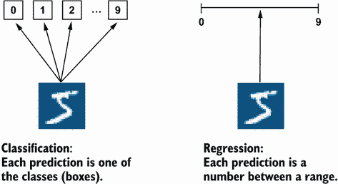

图 13.3 在 MNIST 数据的上下文中的分类与回归。每个预测是一个分类任务，对应于其中的一个类别；在回归中的每个预测是一个连续范围内的数字。

有许多现实世界的应用遵循这种结构化数据的回归问题的形式：

+   在产品推荐中，我们希望预测某人点击自定义广告的概率。广告是可以自定义的图片，是结构化数据，点击概率是预测目标。这个概率可以是 0 到 1 之间的任何数字。

+   在材料科学中，科学家可能希望在实验室中合成某种分子组合时预测其能量水平。每种分子组合都可以表示为具有节点和边的特定结构的图，并且能量水平可以是理论最小和最大能量水平之间的任何数字，一个组合可能表现出的。

+   在药物发现中，我们希望预测可能产生的药物的有效性。如图 13.4 所示，每种药物对应于一种化合物，它也可以表示为一个图。其有效性可以是一个实数，介于某个范围内（比如从 0 到 10）。

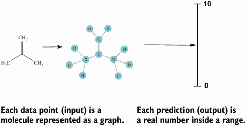

图 13.4 药物发现作为一个结构化回归问题的例子。每个化合物都表示为一个结构化图，并且我们的目标是预测这种化合物在治疗某种疾病方面的有效性，其范围从 0 到 10。

在所有这些应用中，我们想要进行预测的输入数据是结构化的，我们的预测目标是一个实数值。简而言之，它们是结构化数据的回归问题。使用 MNIST 数据集，我们模拟了这样一个问题。

## 13.2 捕捉结构化数据内的相似性

在本节中，我们将探讨常见内核（如径向基函数内核）如何无法描述结构化数据中的相似性。量化两个输入的协方差的内核输出，*x*[1] 和 *x*[2] 的输出定义如下：

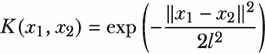

这个输出是两个变量之间的协方差，是两个输入之间差异的负指数除以一个标度。输出始终在 0 和 1 之间，而且越大的差异，输出越小。

这在许多情况下是有道理的，因为如果两个输入具有类似的值，因此差异很小，则它们的协方差将很高；而如果它们具有不同的值，则协方差将很低。两栋面积大致相等的房屋可能会有类似的价格，也就是说，它们的价格具有高的协方差；另一方面，非常大和非常小的房子的价格可能会具有较低的协方差。

### 13.2.1 使用 GPyTorch 的内核

让我们用代码验证一下。当我们创建 GP 模型时，通常会初始化一个 `RBFKernel` 对象。这里，我们直接使用这个内核对象进行工作。为此，我们首先使用 GPyTorch 创建一个 RBF 内核对象：

```py
import gpytorch

rbf_kernel = gpytorch.kernels.RBFKernel()
```

请注意，作为 Python 中实现 GP 相关对象的首选库，我们一如既往地使用 GPyTorch。有关如何在 GPyTorch 中使用内核对象的详细信息，请参见第 2.4 节。

要计算两个输入之间的协方差，我们只需将它们传递给该内核对象即可。例如，让我们计算 0 和 0.1 之间的协方差：

```py
>>> rbf_kernel(torch.tensor([0.]), torch.tensor([0.1])).evaluate().item()
0.9896470904350281
```

这两个数字在实数线上非常接近（也就是说，它们是相似的），因此它们的协方差非常高，几乎为 1。现在让我们计算 0 和 10 之间的协方差，这是两个不同的数字：

```py
>>> rbf_kernel(torch.tensor([0.]), torch.tensor([10.])).evaluate().item()
0.0
```

这次，由于两个数字之间的差异要大得多，它们的协方差降为 0。这种对比是合理的行为，并且通过图 13.5 进行说明。

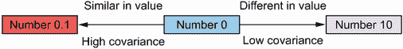

图 13.5 各种数字之间的协方差。两个数字之间的差异较小时，协方差增加；差异较大时，协方差降低。

当两个输入之间的值差异不能捕捉到数据结构差异时，问题就出现了。这通常是对结构化数据（如图像）的情况。接下来，我们将看到像径向基函数（RBF）这样的常见内核如何无法描述结构化数据中的相似性。

### 13.2.2 在 PyTorch 中处理图像

在这一小节中，我们将看到如何将图像导入和存储为 PyTorch 张量，以及如何处理此类数据时，基于值的相似度度量（如 RBF 内核）如何失效。首先，我们重新定义我们的 RBF 内核，使其具有较大的长度尺度，因此更有可能出现较高的协方差：

```py
rbf_kernel = gpytorch.kernels.RBFKernel()
rbf_kernel.lengthscale = 100               ❶
```

❶ 长度尺度越大，协方差越高。

现在，我们需要将 MNIST 数据集中的图像导入到我们的 Python 代码中。我们可以使用 PyTorch 及其流行的附加库 torchvision 来实现：

```py
import torch
from torchvision import datasets, transforms

transform = transforms.Compose([                               ❶
    transforms.ToTensor(),                                     ❶
    transforms.Normalize((0.1307,), (0.3081,))                 ❶
])                                                             ❶

dataset = datasets.MNIST(                                      ❷
    "../data", train=True, download=True, transform=transform  ❷
)                                                              ❷

train_x = dataset.data.view(-1, 28 * 28)                       ❸
```

❶ 定义规范化像素值的转换

❷ 下载并导入数据集

❸ 提取像素值作为一个扁平化的张量

我们不会深入研究这段代码，因为它不是我们讨论的重点。我们只需要知道 `train_x` 包含 MNIST 数据集中的图像，每个图像都存储为一个 PyTorch 张量，其中包含表示手写数字图像的像素值。

由于数据点是图像，我们可以将它们可视化为热图，使用 Matplotlib 中熟悉的 `imshow()` 函数。例如，以下代码可视化了 `train_x` 中的第一个数据点：

```py
plt.figure(figsize=(8, 8))

plt.imshow(train_x[0, :].view(28, 28));    ❶
```

❶ 每个图像有 28 行和 28 列的像素，因此我们需要将其重塑为一个 28×28 的方形张量。

这段代码生成了图 13.2，我们看到它是数字 5 的图像。当我们打印出这个第一个数据点的实际值时，我们看到它是一个 28 × 28 = 784 元素的 PyTorch 张量：

```py
>>> train_x[0, :]
tensor([ 0,   0,   0,   0,   0,   0,   0,   0,   0,   0,   0,   0,   0,   0,
         0,   0,   0,   0,   0,   0,   0,   0,   0,   0,   0,   0,   0,   0,
         0,   0,   0,   0,   0,   0,   0,   0,   0,   0,   0,   0,   0,   0,
         0,   0,   0,   0,   0,   0,   0,   0,   0,   0,   0,   0,   0,   0,
         0,   0,   0,   0,   0,   0,   0,   0,   0,   0,   0,   0,   0,   0,
         0,   0,   0,   0,   0,   0,   0,   0,   0,   0,   0,   0,   0,   0,
         0,   0,   0,   0,   0,   0,   0,   0,   0,   0,   0,   0,   0,   0,
         0,   0,   0,   0,   0,   0,   0,   0,   0,   0,   0,   0,   0,   0,
         0,   0,   0,   0,   0,   0,   0,   0,   0,   0,   0,   0,   0,   0,
         0,   0,   0,   0,   0,   0,   0,   0,   0,   0,   0,   0,   0,   0,
         0,   0,   0,   0,   0,   0,   0,   0,   0,   0,   0,   0,   3,  18,
        18,  18, 126, 136, 175,  26, 166, 255, 247, 127,   0,   0,   0,   0,
         0,   0,   0,   0,   0,   0,   0,   0,  30,  36,  94, 154, 170, 253,
       253, 253, 253, 253, 225, 172, 253, 242, 195,  64,   0,   0,   0,   0,
         0,   0,   0,   0,   0,   0,   0,  49, 238, 253, 253, 253, 253, 253,
       253, 253, 253, 251,  93,  82,  82,  56,  39,   0,   0,   0,   0,   0,
         0,   0,   0,   0,   0,   0,   0,  18, 219, 253, 253, 253, 253, 253,
       198, 182, 247, 241,   0,   0,   0,   0,   0,   0,   0,   0,   0,   0,
         0,   0,   0,   0,   0,   0,   0,   0,  80, 156, 107, 253, 253, 205,
        11,   0,  43, 154,   0,   0,   0,   0,   0,   0,   0,   0,   0,   0,
         0,   0,   0,   0,   0,   0,   0,   0,   0,  14,   1, 154, 253,  90,
[output truncated]
```

此张量中的每个元素范围在 0 到 255 之间，表示我们在图 13.2 中看到的像素。值为 0 对应于最低信号，即图中的背景，而较高的值对应于亮点。

### 13.2.3 计算两个图像的协方差

这就是我们探索普通 GP 核处理结构化数据时所需要的所有背景信息。为了突出问题，我们单独提出了三个特定的数据点，分别称为点 A、点 B 和点 C，它们的索引如下：

```py
ind1 = 304    ❶
ind2 = 786    ❷
ind3 = 4      ❸
```

❶ 点 A

❷ 点 B

❸ 点 C

在检查这些图像实际显示的数字之前，让我们使用我们的 RBF 核来计算它们的协方差矩阵：

```py
>>> rbf_kernel(train_x[[ind1, ind2, ind3], :]).evaluate()
tensor([[1.0000e+00, 4.9937e-25, 0.0000e+00],
        [4.9937e-25, 1.0000e+00, 0.0000e+00],
        [0.0000e+00, 0.0000e+00, 1.0000e+00]], ...)
```

这是一个 3×3 协方差矩阵，具有熟悉的结构：对角线元素取值为 1，表示各个变量的方差，而非对角线元素表示不同的协方差。我们看到点 A 和 C 完全不相关，协方差为零，而点 A 和 B 稍微相关。根据 RBF 核，点 A 和 B 相似，并且与点 C 完全不同。

我们应该期望点 A 和 B 具有相同的标签。然而，事实并非如此！再次将这些数据点可视化为热图，我们得到图 13.6。

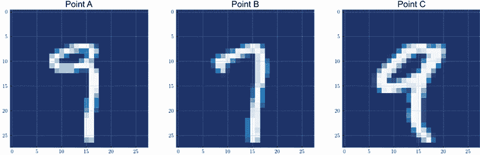

图 13.6 MNIST 数据集中的三个特定数据点。第一个和第二个点具有非零协方差，尽管标签不同。第一个和第三个点具有零协方差，尽管标签相同。

在这里，点 A 和 C 共享相同的标签（数字 9）。那么为什么 RBF 核会认为点 A 和 B 有相关性呢？看图 13.6，我们可以猜测，虽然点 A 和 B 有不同的标签，但图像本身在很多像素上是相似的。事实上，构成数字尾巴的笔画在这两幅图像中几乎完全相同。因此，在某种程度上，RBF 核正在做它的工作，根据这种差异计算图像之间的差异并输出代表它们协方差的数字。然而，这种差异是通过比较像素本身来计算的，这不是我们试图学习的指标：数字的值。

通过仅仅查看像素值，RBF 核高估了点 A 和 B 之间的协方差，这两个点具有不同的标签，并低估了点 A 和 C 之间的协方差，它们具有相同的标签，正如图 13.7 所示。这里可以使用类比来演示我们在本章开头提到的不恰当的 house 核：这个核只看前门的颜色来决定两个房屋是否相关，导致对它们价格的不准确预测。类似地（但不如此极端），RBF 核在比较两幅图像时只考虑像素的值，而不考虑更高级别的模式，这导致了较差的预测性能。


图 13.7 由 RBF 核计算的手写数字之间的协方差。因为它只看像素值，所以 RBF 核无法产生适当的协方差。

### 13.2.4 在图像数据上训练 GP

通过使用错误的相似度度量标准，RBF 混淆了点 B 和 C 中哪个与点 A 相关联，这导致在训练 GP 时产生了不良结果。我们再次使用 MNIST 数据集，这次提取 1,000 个数据点作为训练集，另外 500 个数据点作为测试集。我们的数据准备和学习工作流程总结在图 13.8 中，我们将详细介绍其中的不同步骤。

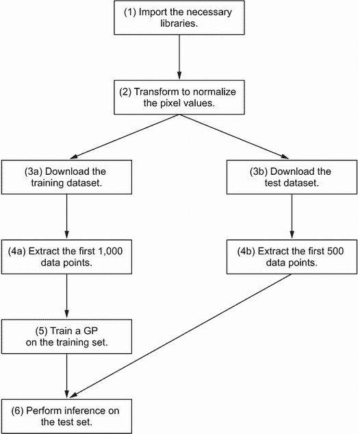

图 13.8 在 MNIST 上进行 GP 学习案例的流程图。我们提取 1,000 个数据点作为训练集，另外 500 个数据点作为测试集。

首先，我们导入 PyTorch 和 torchvision——后者是 PyTorch 的一个扩展，管理与计算机视觉相关的功能和数据集，如 MNIST。从 torchvision 中，我们导入模块 `datasets` 和 `transforms`，它们帮助我们下载和操作 MNIST 数据，分别是：

```py
import torch
from torchvision import datasets, transforms
```

在第二个数据准备步骤中，我们再次使用将图像转换为 PyTorch 张量的对象（这是 GPyTorch 中实现的 GP 可以处理的数据结构）并规范化像素值。此规范化通过将像素值减去 0.1307（数据的平均值）并将值除以 0.3081（数据的标准差）来完成。这种规范化被认为是 MNIST 数据集的常见做法，有关此步骤的更多详细信息可以在 PyTorch 的官方论坛讨论中找到（[`mng.bz/BmBr`](http://mng.bz/BmBr)）：

```py
transform = transforms.Compose([
    transforms.ToTensor(),                       ❶
    transforms.Normalize((0.1307,), (0.3081,))   ❷
])
```

❶ 将数据转换为 PyTorch 张量

❷ 规范化张量

存储在 `transform` 中的此转换对象现在可以传递给对任何 torchvision 数据集初始化的调用，并且将应用转换（转换为 PyTorch 张量和规范化）到我们的数据上。我们使用此转换对象初始化 MNIST 数据集如下。请注意，我们创建数据集两次，一次将 `train` 设置为 `True` 以创建训练集，另一次将 `train` 设置为 `False` 以创建测试集：

```py
dataset1 = datasets.MNIST(                                       ❶
    "../data", train=True, download=True, transform=transform    ❶
)                                                                ❶

dataset2 = datasets.MNIST(                                       ❷
    "../data", train=False, download=True, transform=transform   ❷
)                                                                ❷
```

❶ 下载并导入训练集

❷ 下载并导入测试集

作为数据准备的最后一步，我们从训练集中提取前 1,000 个数据点和测试集中的 500 个点。我们通过从数据集对象 `dataset1` 和 `dataset2` 中访问来实现这一点：

+   使用 `data` 属性获取特征，即构成每个数据点图像的像素值

+   使用 `targets` 属性获取标签，即手写数字的值：

```py
train_x = dataset1.data[:1000, ...].view(1000, -1)
➥.to(torch.float)                   ❶
train_y = dataset1.targets[:1000]    ❶

test_x = dataset2.data[:500, ...].view(500, -1)
➥.to(torch.float)                   ❷
test_y = dataset2.targets[:500]      ❷
```

❶ 获取训练集中的前 1,000 个点

❷ 获取测试集中的前 500 个点

我们还实现了一个简单的 GP 模型，具有恒定均值和带有输出比例的 RBF 核：

```py
class GPModel(gpytorch.models.ExactGP):
    def __init__(self, train_x, train_y, likelihood):
        super().__init__(train_x, train_y, likelihood)
        self.mean_module = gpytorch.means.ConstantMean()                  ❶
        self.covar_module = gpytorch.kernels.ScaleKernel(                 ❷
            gpytorch.kernels.RBFKernel()                                  ❷
        )                                                                 ❷

    def forward(self, x):                                                 ❸
        mean_x = self.mean_module(x)                                      ❸
        covar_x = self.covar_module(x)                                    ❸
        return gpytorch.distributions.MultivariateNormal(mean_x, covar_x) ❸
```

❶ 一个恒定均值函数

❷ 具有输出比例的 RBF 协方差函数

❸ 以输入 x 的预测制作 MVN 分布

注意 GPyTorch GP 模型的 `forward()` 方法首次讨论于第 2.4 节。

然后，我们初始化我们的 GP 并在 1,000 个点的训练集上进行训练，使用 Adam 优化器的梯度下降。此代码将优化 GP 的超参数值（例如，均值常量和长度和输出比例），以便我们获得观察到的数据的高边际似然度：

```py
likelihood = gpytorch.likelihoods.GaussianLikelihood()     ❶
model = GPModel(train_x, train_y, likelihood)              ❶

optimizer = torch.optim.Adam(model.parameters(), lr=0.01)  ❷
mll = gpytorch.mlls.ExactMarginalLogLikelihood             ❷
➥(likelihood, model)                                      ❷

model.train()                                              ❸
likelihood.train()                                         ❸

for i in tqdm(range(500)):                                 ❹
    optimizer.zero_grad()                                  ❹

    output = model(train_x)                                ❹
    loss = -mll(output, train_y)                           ❹

    loss.backward()                                        ❹
    optimizer.step()                                       ❹

model.eval()                                               ❺
likelihood.eval()                                          ❺
```

❶ 声明似然函数和 GP 模型

❷ 声明梯度下降算法和损失函数

❸ 启用训练模式

❹ 运行五百次梯度下降迭代

❺ 启用预测模式

注意 参考第 2.3.2 节，了解梯度下降如何优化我们观察到的数据的似然度，即梯度下降如何训练 GP。

最后，为了查看我们的模型在测试集上的表现如何，我们计算 GP 预测值与地面实况（每个数据点的标签值）之间的平均绝对差异。这个指标通常被称为 *平均绝对误差*。

注意 MNIST 数据集的典型指标是该模型正确预测测试集的百分比（即准确度），这是分类问题的规范。由于我们使用这个数据集来模拟一个回归问题，因此均方误差是合适的。

这是通过将均值预测与存储在`test_y`中的真实标签进行比较来完成的：

```py
with torch.no_grad():
    mean_preds = model(test_x).mean

print(torch.mean(torch.abs(mean_preds - test_y)))

Output: 2.7021167278289795
```

这个输出意味着，平均而言，高斯过程对图像中描绘的数字的值的预测误差几乎达到了 3。考虑到这项任务只有 10 个值需要学习，这个表现相当差。这个结果强调了常规高斯过程模型处理结构化数据（如图像）的无能。

## 13.3 使用神经网络处理复杂的结构化数据

我们所看到的高斯过程表现较差的根本原因是核不具备处理输入数据的复杂结构的装备，从而导致协方差计算不良。特别是，径向基核具有一个简单的形式，只考虑两个输入之间的数字值的差异。在本节中，我们学习如何通过使用神经网络处理结构化数据，然后将处理后的数据馈给高斯过程的均值函数和核来解决这个问题。

### 13.3.1 为什么使用神经网络进行建模？

我们在本书开始时指出，神经网络在进行昂贵的数据获取时，特别是在进行不确定性校准的预测方面表现不佳。（这是为什么 BayesOpt 中使用高斯过程的全部原因。）然而，神经网络擅长学习复杂结构。这种灵活性是由于神经网络中有多个计算层（具体来说，是矩阵乘法），如图 13.9 所示。


图 13.9 神经网络是一组层计算的集合。通过将多个计算层链接在一起，神经网络可以很好地模拟复杂函数。

在神经网络中，每个层都对应于一个矩阵乘法，其输出然后经过非线性激活函数处理。通过在一次前向传递中将多个这样的层链在一起，可以以灵活的方式处理和操作网络的输入。最终结果是神经网络可以很好地模拟复杂函数。有关神经网络及其用法的详细解释，请参阅 François Chollet 的优秀著作*Deep Learning with Python, Second Edition*（Manning, 2021）。


神经网络具有的灵活性可以帮助我们解决上一节中描述的问题。如果高斯过程的核，如径向基核，不能很好地处理复杂的数据结构，我们可以让神经网络来处理这项工作，并将处理后的输入仅馈送给高斯过程的核。这个过程在图 13.10 中进行了可视化，其中输入的*x*首先通过神经网络层，然后再传递给高斯过程的均值函数和核。

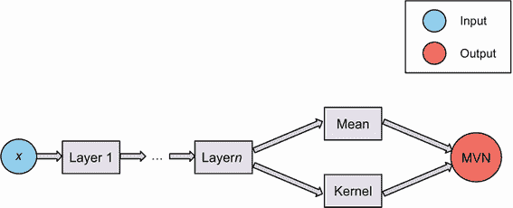

图 13.10 结合了神经网络和 GP。 神经网络首先处理结构化数据输入*x*，然后将输出馈送到 GP 的均值函数和核。

尽管最终结果仍然是一个 MVN 分布，但均值函数和核函数的输入现在是由神经网络产生的*处理过的输入*。 这种方法很有前途，因为它具有灵活的建模能力，神经网络将能够从结构化输入数据中提取重要特征（在提供相似性计算信息方面很重要）并将其化简为适合 GP 核的数值。

定义 神经网络通常被称为组合模型的*特征提取器*，因为网络从结构化数据中*提取*有利于 GP 建模的特征。

通过这种方式，我们可以利用神经网络的灵活学习能力，同时保持使用 GP 进行不确定性校准预测的能力。 这是两全其美！ 此外，训练这个组合模型的过程与训练常规 GP 的过程相同：我们定义我们的损失函数，即负对数似然，然后使用梯度下降来找到最能解释我们的数据的超参数值（通过最小化损失）。 现在，我们不仅优化均值常数、长度和输出比例，还要额外优化神经网络的权重。 在下一小节中，我们将看到，使用 GPyTorch 实现这个学习过程几乎不需要做任何改动。

注意：这种组合框架是一种*动态学习*如何处理结构化数据的方法，纯粹来自我们的训练数据集。 以前，我们只使用固定的核来处理数据，在多个应用程序中以相同的方式进行处理。 在这里，我们“动态地”学习处理我们的输入数据的最佳方式，这对于手头的任务是独一无二的。 这是因为神经网络的权重是相对于训练数据进行优化的。

### 13.3.2 在 GPyTorch 中实现组合模型

最后，我们现在实现这个框架并将其应用于我们的 MNIST 数据集。 在这里，定义我们的模型类更加复杂，因为我们需要实现神经网络并将其连接到 GP 模型类中。 让我们先解决第一部分——先实现神经网络。 我们设计一个简单的神经网络，其架构如图 13.11 所示。 此网络具有四个层，节点数分别为 1,000、5,000、50 和 2，如图中所示。 这是一个常见的 MNIST 数据集架构。

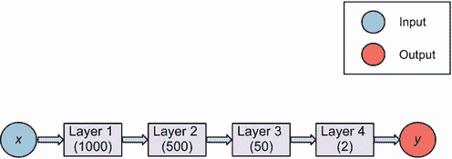

图 13.11 要实现的神经网络架构。 它有四层，并为每个输入数据点产生一个大小为两个的数组。

注意，我们需要关注最后一层（2）的大小，它表示要馈入高斯过程的均值函数和核函数的处理输出的维度。将该层的大小设置为 2，目的是学习存在于二维空间中的图像表示。其他值也可以使用，但为了可视化的目的，我们选择了 2。

我们使用 PyTorch 中的`Linear()`和`ReLU()`类实现该体系结构。在这里，我们的网络的每一层都被实现为一个带有相应大小的`torch.nn.Linear`模块，如图 13.11 所定义的。每个模块还与一个`torch.nn.ReLU`激活函数模块相耦合，该模块实现了前面提到的非线性变换。这在图 13.12 中得到了说明，其中注释了网络体系结构的每个组件对应于实现它的相应代码。

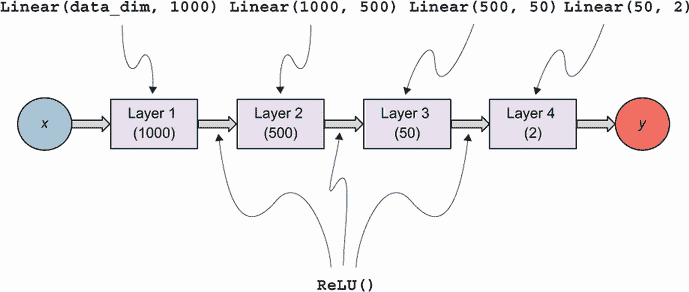

图 13.12 中实现的神经网络体系结构及其相应的 PyTorch 代码。每个层都使用`torch.nn.Linear`实现，每个激活函数都使用`torch.nn.ReLU`实现。

通过使用方便的`add_module()`方法，我们隐含定义了神经网络模型的`forward()`方法的逻辑。接下来，我们使用`LargeFeatureExtractor`类实现模型。该类将其输入`x`依次通过我们在`__init__()`方法中实现的层中，该方法接收`data_dim`，即输入数据的维数。在我们的情况下，该数字为 28×28=784，我们使用`train_x.size(-1)`进行计算：

```py
data_dim = train_x.size(-1)                            ❶

class LargeFeatureExtractor(torch.nn.Sequential):
    def __init__(self, data_dim):
        super(LargeFeatureExtractor, self).__init__()

        self.add_module('linear1', torch.nn.Linear
        ➥(data_dim, 1000))                            ❷
        self.add_module('relu1', torch.nn.ReLU())      ❷
        self.add_module('linear2', torch.nn.Linear
        ➥(1000, 500))                                 ❸
        self.add_module('relu2', torch.nn.ReLU())      ❸

        self.add_module('linear3', torch.nn.Linear
        ➥(500, 50))                                   ❹
        self.add_module('relu3', torch.nn.ReLU())      ❹

        self.add_module('linear4', torch.nn.Linear
        ➥(50, 2))                                     ❺

feature_extractor = LargeFeatureExtractor(data_dim)    ❻
```

❶ 数据的维度

❷ 网络的第一层

❸ 第二层

❹ 第三层

❺ 第四层

❻ 初始化网络

接下来，我们讨论组合模型——一种利用我们刚刚初始化的神经网络特征提取器`feature_extractor`的高斯过程模型类。我们首先实现它的`__init__()`方法，该方法由几个组件组成：

1.  协方差模块被包装在`gpytorch.kernels.GridInterpolationKernel`对象中，为我们的中等大小训练集（1,000 个点）提供计算速度加速。我们声明输入数据的维数为二，因为这是特征提取器生成的输出的维度。

1.  特征提取器本身就是我们之前声明的`feature_extractor`变量。

1.  如果神经网络的权重初始化得不好，特征提取器的输出值可能会取极端值（负无穷或正无穷）。为解决这个问题，我们使用`gpytorch.utils.grid.ScaleToBounds`模块将这些输出值缩放到-1 和 1 之间的范围内。

`__init__()`方法的实现如下：

```py
class GPRegressionModel(gpytorch.models.ExactGP):
  def __init__(self, train_x, train_y, likelihood):
      super(GPRegressionModel, self).__init__(train_x, train_y, likelihood)

      self.mean_module = gpytorch.means.ConstantMean()

      self.covar_module = gpytorch.kernels
      ➥.GridInterpolationKernel(                    ❶
          gpytorch.kernels.ScaleKernel(              ❶
              gpytorch.kernels.RBFKernel             ❶
              ➥(ard_num_dims=2)                     ❶
          ),                                         ❶
          num_dims=2,                                ❶
          grid_size=100                              ❶
      )                                              ❶

      self.feature_extractor = feature_extractor     ❷

      self.scale_to_bounds = gpytorch.utils.grid
      ➥.ScaleToBounds(-1., 1.)                      ❸
```

❶ 具有两个维度的 RBF 核函数，具有计算速度加速

❷ 神经网络特征提取器

❸ 一个用于将神经网络的输出缩放至合理值的模块

在我们的`forward()`方法中，我们将所有这些组件结合在一起。首先，我们使用我们的神经网络特征提取器处理输入。然后，我们将处理后的输入馈送到我们的 GP 模型的平均值和协方差模块中。最后，我们仍然得到一个 MVN 分布，就是`forward()`方法返回的结果：

```py
class GPRegressionModel(gpytorch.models.ExactGP):
  def forward(self, x):
    projected_x = self.feature_extractor(x)            ❶
    projected_x = self.scale_to_bounds(projected_x)    ❶

    mean_x = self.mean_module(projected_x)             ❷
    covar_x = self.covar_module(projected_x)           ❷
    return gpytorch.distributions.MultivariateNormal   ❷
    ➥(mean_x, covar_x)                                ❷
```

❶ 缩放后的神经网络特征提取器的输出

❷ 从处理后的输入创建一个 MVN 分布对象

最后，为了使用梯度下降训练这个组合模型，我们声明了以下对象。在这里，除了常规的 GP 超参数，如平均常数和长度和输出尺度，我们还想优化神经网络特征提取器的权重，这些权重存储在`model.feature_extractor.parameters()`中：

```py
likelihood = gpytorch.likelihoods.GaussianLikelihood()             ❶
model = GPRegressionModel(train_x, train_y, likelihood)            ❶
mll = gpytorch.mlls.ExactMarginalLogLikelihood(likelihood, model)  ❶

optimizer = torch.optim.Adam([
    {'params': model.feature_extractor.parameters()},              ❷
    {'params': model.covar_module.parameters()},                   ❷
    {'params': model.mean_module.parameters()},                    ❷
    {'params': model.likelihood.parameters()},                     ❷
], lr=0.01)
```

❶ 同之前一样，似然函数、GP 模型和损失函数保持不变。

❷ 现在，梯度下降优化器 Adam 需要优化特征提取器的权重和 GP 的超参数。

现在我们可以像之前一样运行梯度下降：

```py
model.train()                      ❶
likelihood.train()                 ❶

for i in tqdm(range(500)):         ❷
    optimizer.zero_grad()          ❷

    output = model(train_x)        ❷
    loss = -mll(output, train_y)   ❷

    loss.backward()                ❷
    optimizer.step()               ❷

model.eval()                       ❸
likelihood.eval()                  ❸
```

❶ 启用训练模式

❷ 运行 500 次梯度下降迭代

❸ 启用预测模式

注意：提醒一下，当训练 GP 模型时，我们需要同时为模型和似然函数启用训练模式（使用`model.train()`和`likelihood.train()`）。在训练之后并在进行预测之前，我们需要启用预测模式（使用`model.eval()`和`likelihood.eval()`）。

现在，我们已经训练了与神经网络特征提取器结合的 GP 模型。在使用该模型对测试集进行预测之前，我们可以查看模型的内部，看看神经网络特征提取器是否学会了很好地处理我们的数据。请记住，每个图像都被特征提取器转化为一个二元数组。因此，我们可以将训练数据通过该特征提取器，并使用散点图可视化输出。

注意：训练这个组合模型比训练普通的 GP 模型需要更多时间。这是因为我们现在要优化的参数更多。然而，正如我们马上会看到的那样，这个成本是非常值得的，因为我们获得了更高的性能提升。

在这个散点图中，如果我们看到相同标签的点（即，描绘相同数字的图像）聚在一起，这将表明特征提取器能够有效地从数据中学习。同样，我们通过将训练数据通过特征提取器的方式进行处理来做到这一点，这与模型类的`forward()`方法中的数据处理方式相同：

```py
with torch.no_grad():
    extracted_features = model.feature_extractor(train_x)
    extracted_features = model.scale_to_bounds(extracted_features)
```

在这里，`extracted_features`是一个大小为 1,000x2 的 PyTorch 张量，存储了我们训练集中 1,000 个数据点的二维提取特征。为了在散点图中可视化这个张量，我们使用 Matplotlib 库的`plt.scatter()`方法，确保每个标签对应一个颜色：

```py
for label in range(10):
    mask = train_y == label           ❶

    plt.scatter(                      ❷
        extracted_features[mask, 0],  ❷
        extracted_features[mask, 1],  ❷
        c=train_y[mask],              ❷
        vmin=0,                       ❷
        vmax=9,                       ❷
        label=label,                  ❷
    )                                 ❷
```

❶ 过滤具有特定标签的数据点

❷ 为当前数据点创建一个散点图，它们具有相同的颜色

此代码生成图 13.13，尽管你的结果可能会有所不同，这取决于库版本和代码运行的系统。正如我们所预期的，相同标签的数据点围绕在一起。这意味着我们的神经网络特征提取器成功地将具有相同标签的点分组在一起。经过网络处理后，具有相同标签的两个图像变成了二维平面上彼此靠近的两个点，如果由 RBF 核计算，则它们将具有高的协方差。这正是我们希望我们的特征提取器帮助我们做的事情！

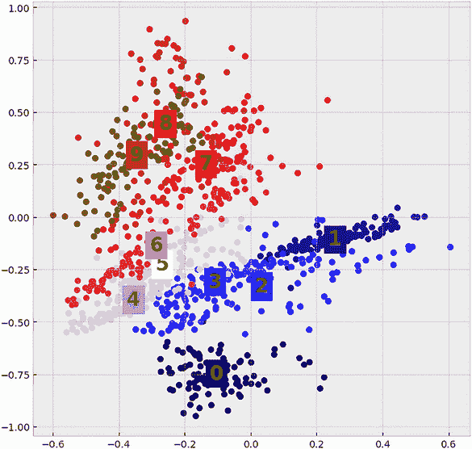

图 13.13 由神经网络从 MNIST 数据集中提取的特征。不仅相同标签的数据点聚集在一起，而且在图中还存在一个标签梯度：从底部到顶部，标签值逐渐增加。

图 13.13 另一个有趣的方面是，与标签值相关的梯度明显：从底部到顶部的聚类，相应标签的值从 0 逐渐增加到 9。这是特征提取器中很好的特性，因为它表明我们的模型已经找到了一种平滑的 MNIST 图像表示，符合标签值。


例如，考虑图 13.14 中的比较，左侧面板显示图 13.13，右侧面板显示相同散点图标签的随机交换，使特征变得“粗糙”。所谓“粗糙”，是指标签值在不规律地跳动：底部聚类包含 0，中间某些聚类对应于 7 和 9，顶部聚类包含 5。换句话说，具有粗糙特征的标签趋势不是单调的，这使得训练 GP 更加困难。

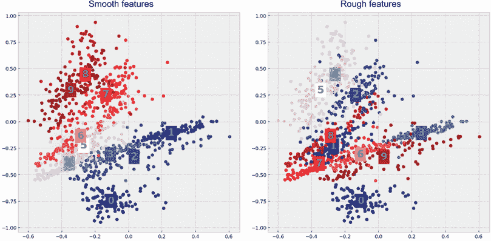

图 13.14 图 13.13 中提取的平滑特征与标签随机交换的比较，使特征变得不那么平滑。平滑的特征比粗糙的特征更容易通过 GP 学习。

看起来神经网络在从图像中提取有用特征方面表现不错。为了确定这是否确实导致更好的预测性能，我们再次计算平均绝对误差（MAE）：

```py
with torch.no_grad():
    mean_preds = model(test_x).mean

print(torch.mean(torch.abs(mean_preds - test_y)))

Output: 0.8524129986763
```

这个结果告诉我们，平均而言，我们的预测偏差为 0.85；这是对前一节中我们拥有的普通 GP 的显着改进，其 MAE 大约为 2.7。这种改进说明了联合模型的卓越性能，这源于神经网络灵活的建模能力。

正如我们在开始时所说，这个框架不仅适用于手写数字，还适用于各种类型的结构化数据，神经网络可以从中学习，包括其他类型的图像和图形结构，如分子和蛋白质。我们所要做的就是定义一个合适的 DL 架构，从这些结构化数据中提取特征，然后将这些特征传递给 GP 的均值函数和核函数。

这就结束了第十二章。在本章中，我们了解了从结构化数据中学习的困难，例如图像，在这些数据中，常见的核无法有效地计算数据点之间的协方差。通过在 GP 前面附加一个神经网络特征提取器，我们学会将这些结构化数据转换成 GP 的核函数可以处理的形式。最终结果是一个结合模型，可以灵活地从结构化数据中学习，但仍然产生具有不确定性量化的概率预测。

## 总结

+   结构化数据是指其特征需要满足约束条件的数据，例如必须是整数或者非负数，并且不能被视为连续的实值数据。例如，常见应用程序中的数据，如计算机视觉中的图像和药物发现中的蛋白质结构。

+   结构化数据对于 GP 的常见核构成挑战。这是因为这些核只考虑输入数据的数值，这可能是不良的预测特征。

+   使用错误特征计算协方差的核可能会导致生成的 GP 的预测质量低下。使用错误特征在结构化数据中特别常见。

+   对于图像数据特别是，像素的原始值不是一个信息量丰富的特征。使用原始像素值计算协方差的核可能导致低质量的 GP。

+   由于具有多层非线性计算，神经网络能够有效地学习复杂函数，并且可以从结构化数据中提取特征。通过使用神经网络从结构化数据中提取连续的实值特征，GP 仍然可以有效地学习。

+   在将神经网络与 GP 结合时，我们动态学习一种处理问题的数据方式。这种灵活性使得该模型可以推广到许多种结构化数据。

+   在将输出缩放到小范围之前，将神经网络的输出传递给 GP 是很重要的。通过这样做，我们避免了由于神经网络特征提取器初始化不良而导致的极端值。

+   从神经网络特征提取器学习到的表示对标签具有平滑的梯度。这种平滑的梯度使得提取的特征更容易通过 GP 学习。
