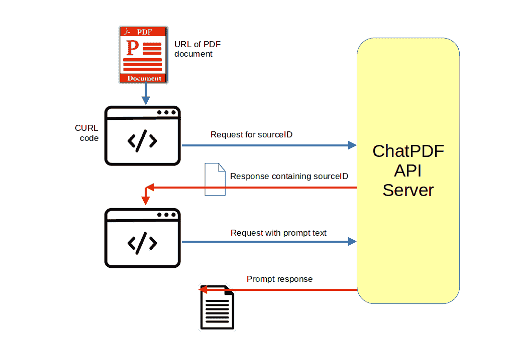
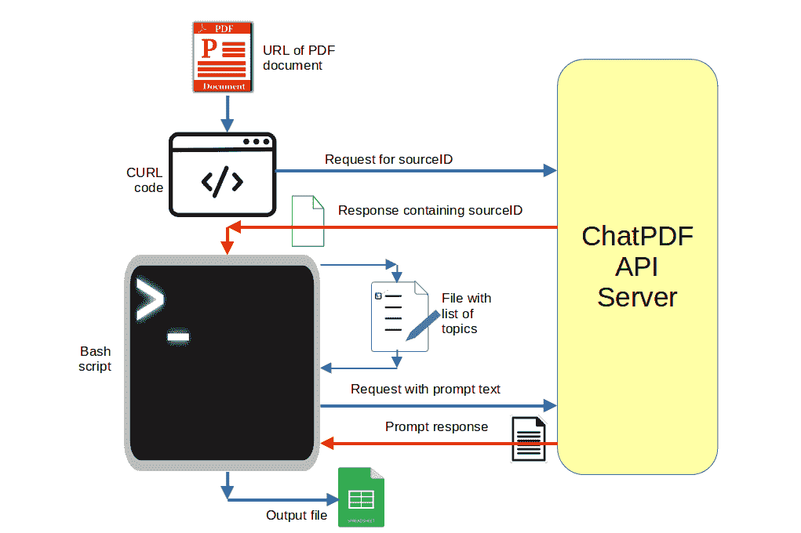

# 第五章：将数据提供给您的生成式 AI 模型

### 本章涵盖了

+   基于本地数据存档构建索引，然后进行查询。

+   将 PDF 文档上传到 ChatPDF 服务以像使用 ChatGPT 一样查询它。

+   使用 ChatPDF API 对 PDF 查询过程进行脚本编制。

+   使用 AutoGPT 工具让 GPT 引擎代理访问完整和开放的互联网。

在你不断试图从一直友好（偶尔令人震惊）的 AI 中挖掘秘密的新鲜感消失之前，只能持续那么长时间。毕竟，你实际上需要多少个完美简历的版本呢？你真的*想*听到约翰·列侬唱着莎士比亚十四行诗会是什么样子吗？

一个 LLM 的真正力量在于它能够多快地处理 - 并且“理解” - 庞大的数据量。将其范围限制在训练期间显示的内容上将是一种遗憾。而且无论如何，你从你的 AI 处理*你的*数据的方式中所获得的价值要比从别人那里获得的更多。想象一下通过识别以下内容可以释放多少价值：

+   健康记录中的模式和趋势

+   数字网络访问日志中的威胁和攻击

+   银行记录中的潜在金融机会或风险

+   在供应链、基础设施和治理运营中引入效率的机会

+   保险、税收或程序欺诈

+   政府腐败（以及运营改进的机会）

所以，将 GPT 暴露给计算机上的东西，甚至更好的是暴露给互联网上的东西，是可能的吗？简短的答案是“是的”。对于长答案，也是如此。事实上，至少在我坐下来写这一章的几个小时前，有几种方法可以完成这项工作。在本章中，我将向您展示如何将 LLMs 深入到您的数据丰富的文档中，并将其传播到互联网上。

## 5.1 索引本地数据存档

即使是当前可用的 AI 系统的全部力量也很难想象。过去一年左右的时间里，我每天都听说有一些新的、疯狂创造性的使用方式的发现。但从我的角度来看 - 至少在历史的这一时刻 - 生成式 AI 的最大潜力在于其即时阅读、消化、组织然后解释大量原始数据的能力。

大型组织花费数百万美元建立和维护用于管理、解析和监视其运营定期产生的数百万字节数据的系统。数据库管理员和安全分析师不是便宜货。但是这些组织有什么选择呢？如果没有正确理解数据的方法，为什么一开始要生成所有这些数据呢？

那么，我们这些为不是“谷歌”、“亚马逊”或“xxxx 政府”命名的组织工作的人怎么办呢？我们的设备和数字活动可能产生它们自己的数据，这些数据可能会被读取。嗯，我们可能负担不起我们自己的 DB 管理员、安全分析师或数据分析师团队，但我们确实拥有大量的数据。LLMs 时代官方已经到来。

迭代的关键是将我们的数据连接到一个友好的 AI。我们将如何做到这一点呢？这将是 LlamaIndex 项目（我们在第三章已经见过了）。LlamaIndex 维护了开源的 GPTSimpleVectorIndex 模块以及一整套用于暴露您自己的数据给 GPT 的资源。

您可以在 LlamaIndex 的 Read the Docs 网站上阅读完整的文档指南。但是这里是一个简明的版本，将演示它在 Python 环境中的工作方式。

很有可能您已经安装了 Python 编程语言以及 Python 包管理器`pip`。您可以通过从命令行运行以下两个命令来确认这一点。以下是我运行它们时的样子：

```py
$ python --version
Python 3.10.12
$ pip --version
pip 22.0.2 from /usr/lib/python3/dist-packages/pip (python 3.10)
```

如果您的系统还没有准备好，您应该转到本书末尾的安装 Python 附录。

一旦所有准备就绪，我们将为这个特定项目安装两个模块（`os` 和 `llama-index`）：

```py
pip install os llama-index
```

##### 专业提示！

如果 llama-index 操作失败，首先要解决的故障排除步骤是确保您安装了最新版本。您可以使用以下命令来执行这个步骤：

```py
pip install llama-index --upgrade
```

现在我们将开始编写我们的 Python 代码。您可以通过导入`os`模块并添加您的 OpenAI 密钥来搭建您的启用了 GPT 的环境。由于 LlamaIndex 使用公共 OpenAI API，没有这个就什么都不会发生。

```py
import os
os.environ['OPENAI_API_KEY'] = "Your_Key"
```

如果您还没有有效的 OpenAI API 密钥，请转到 API 参考页面并单击注册按钮。

下面的代码将导入所有的重活儿都交给的模块。`pathlib`将使我们的代码能够轻松找到我们在本地文件系统中保存数据的位置，`GPTVectorStoreIndex`处理由`llama_index`生成的表示我们数据的嵌入，`download_loader`处理我们将要使用的加载器文件。

```py
from pathlib import Path
from llama_index import GPTVectorStoreIndex
from llama_index import download_loader
```

为了简化操作，您应该将想要进行 GPT 分析的所有文档都复制到 Python 代码运行的目录下的一个目录中。我选择将我的目录称为`data`，但您也可以使用任何您喜欢的名称。在本示例中，我从 Kaggle 网站下载了一个包含世界各国人口数量的 CSV 文件。 (这是我使用的数据集，尽管我将其重命名为`population.csv`。)

该代码将从`population.csv`文件中读取一个名为`documents`的变量，然后使用该数据构建一个适用于 GPT 的索引，该索引的名称将为`index`。

```py
SimpleCSVReader = download_loader("SimpleCSVReader")
loader = SimpleCSVReader(encoding="utf-8")
documents = loader.load_data(file=Path('./data/population.csv'))

index = GPTVectorStoreIndex.from_documents(documents)
```

然后我将我的查询作为`query_engine.query`方法的参数提交。只是为了演示 GPT 理解 CSV（“逗号分隔值”）数据和我提出的问题，我将询问 2010 年加拿大的人口。请注意，我的提示包含对 LLM 的说明，说明`pop2010`列包含何种类型的数据。这将大大增加它理解如何回答我的问题的可能性。

```py
query_engine = index.as_query_engine()
response = query_engine.query("Given that the column with the \
	header `pop2010` contains country population data for the \
	year 2021, what was Canada's population in 2010")
print(response)
```

反应是正确的 - 尽管逗号有点奇怪：

```py
Canada's population in 2010 was 3,396,341,2
```

让我们再进行一次请求。继续使用`pop2010`列，我想知道在 2010 年，哪个国家的人口最接近所有国家的人口的中位数。

```py
query_engine = index.as_query_engine()
response = query_engine.query("Given that the column with the \
	header `pop2010` contains country population data for the \
	year 2010, which country in 2010 had the population that \
	was closest to the median of all countries?")
print(response)
```

这就是反馈的内容：*波兰在 2010 年的人口最接近所有国家的中位数，有 38,597,353 人。*

好吧，波兰 2010 年的人口确实是 38,597,353。但所有国家的实际中位数人口实际上超过 4900 万，这意味着缅甸是最接近的国家。公平地说，缅甸距离波兰只有八个位置。而 GPT 更倾向于文本分析而不是简单的数学运算是众所周知的。我想随着时间的推移，情况只会变得更好。

尽管如此，这是另一个看起来*似乎*理解我们意图的 LLM 的例子，但没有完全正确地完成任务。当然，这也是一个健康的提醒，始终手动确认您从人工智能获取的内容是否真实可信。

深入挖掘，你会发现 LllamaIndex 项目的更多内容。例如，Llama Hub 是一个包含代码片段的“加载器”存档，您可以使用这些代码片段将 Llama 连接到您自己维护在数百个流行框架中的数据，包括维基百科、Trello、Reddit 和 Jira。这些加载器简化了在广泛环境中为 GPT 提供对真实世界数据的访问的过程。

这不仅仅是对独立电子表格进行摘要。记住我在本章开头列出的用例场景，想象一下这种工具如何用于聚合多种格式的数据，然后对数据进行深度洞察。

## 5.2 使用私人数据启动聊天会话（ChatPDF）

让我给你举个例子，说明 GPT 在处理文本时比处理数字要好得多 - 至少目前是这样。我们将利用数不尽的企业之一，他们正在争相提供增值的基于 GPT 的服务。ChatPDF 提供了一个基于浏览器的界面，您可以上传并“与之交谈”任何 PDF 文档。

只需将浏览器指向 chatpdf.com，将 PDF 文档拖到下图中可见的标有“将 PDF 文件拖到此处”的框中，然后开始提问。它的工作原理就像 ChatGPT 会话一样。

##### 图 5.1 ChatPDF 网页


但是那样有什么乐趣呢？相反，你完全可以将提示自动化并集成到复杂而高效的脚本中。为此，你需要通过单击页面底部的`API`链接时出现的对话框向 ChatPDF 请求 API 密钥。如果你获得了访问权限，你就可以准备好进行一些严肃的脚本编写了。

ChatPDF API 文档 - 至少在当前版本中 - 提供了 Node.js、Python 和 curl 请求的代码片段。对于本例，我将使用我们在第二章中看到的`curl`命令行数据传输工具。

在我们的情况下，使用`curl`发送 API 请求将需要两个步骤，这意味着你将运行两种`curl`命令的变体。以下是该过程的示意图：

##### 图 5.2 使用 ChatPDF API 的请求/响应过程



这是第一步的工作原理：

+   使用指向 ChatPDF API 地址的 POST 方法进行 ChatPDF API 服务器的身份验证

+   包含包含你的 API 密钥的`-H`参数（替换为`sec_xxxxxx`虚拟代码）

+   添加`-d`参数以传递 ChatPDF 可以找到你想查询的 PDF 文档的 URL

这就是实际的代码：

```py
curl -X POST 'https://api.chatpdf.com/v1/sources/add-url' \
     -H 'x-api-key: sec_xxxxxx' \
     -H 'Content-Type: application/json' \
     -d '{"url": \
     	"https://bootstrap-it.com/slidedeck_lpi_security.pdf"}'
```

在我示例代码中的那个 URL 指向一个真实的 PDF 文档。顺便说一下，这只是我最近发布的关于 LPI 安全基础认证的视频课程的一些幻灯片。但是，由于那个文档里面并没有太多的文本，你可能想用你自己的 PDF 替换它。

你也可以将该命令作为单行运行，但是将其格式化为多行使其更易读。在 Bash shell 会话中，请确保每行末尾的`\`反斜杠（告诉解释器命令将继续到下一行）是该行的最后一个字符。即使是一个不可见的空格字符也会搞乱一切。

如果该命令成功，它将返回一个`sourceID`值，这是你在以后查询 PDF 时将要使用的会话标识符。你将把该标识符粘贴到第二个`curl`命令中。在这个例子中，我们使用`-d`参数发送一个问题（"这个文档的主要话题是什么？"）

```py
curl -X POST 'https://api.chatpdf.com/v1/chats/message' \
	-H 'x-api-key: sec_xxxxxx' \
	-H 'Content-Type: application/json' \
	-d '{"sourceId": "src_xxxxx", "messages": [{"role": "user", \
	"content": "What is the main topic of this document?"}]}'
```

这是我收到的响应：

##### 响应

{"content":"这个文档的主要话题没有在给定的页面上指定。但是，根据第 50 页列出的主题，似乎与网络协议、路由、风险类别和最佳实践有关。"}

这是一个更复杂的例子，基于我最近自己做的事情。

这一切都是为了解决一个长期存在的个人问题，这个问题让我受苦已经三十年了。你知道，我一直讨厌想出评估问题。这在我教高中的那些年里是真的，在现在更是如此。

AI 来拯救！为什么不将我正在创建的新视频课程的文字记录转换为一个 PDF 文档，看看 ChatPDF 的反馈是什么？

没问题，我按照之前展示的方法，精确地为 ChatPDF 添加了那个新的 PDF 文档。但这次请求有点复杂。你看，我需要确保获得的评估问题涵盖所有课题，并符合一些基本的格式要求。

我需要创建一个 Bash 脚本，用来逐个为*每组*课题发送 ChatPDF API 提示，然后将输出追加到一个文件中。这个图示可以帮助你理解我们这里正在做什么：

##### 图 5.3 是使用具有独特、针对课题的请求来提供输入给 ChatPDF API 的流程。



为了解决第一个问题，我创建了一个包含所有课题的单个文本文件，每行大约有四到五个课题。然后我创建了一个 Bash 脚本，该脚本希望以该文本文件的名称作为单个参数来运行。从命令行运行脚本会像这样：

```py
$ my_script.sh myfile.txt
```

下面是脚本本身：

```py
# Read the file line by line
while IFS= read -r line; do
  # Construct the command using a heredoc
  command=$(cat <<EOF
    curl -X POST 'https://api.chatpdf.com/v1/chats/message' \
      -H 'x-api-key: sec_xxxxxx' \
      -H 'Content-Type: application/json' \
      -d '{
        "sourceId": "src_xxxxxx",
        "messages": [
          {
            "role": "user",
            "content": "Based on the information in the PDF file at \
            https://bootstrap-it.com/[...].pdf, create multi-select \
            assessment questions that include the question, five \
            possible answers, the correct answers (identified only \
            by number), and an explanation. The questions should \
            cover each of these topics: $line"
          }
        ]
      }' >> multi_select_raw
EOF
  )

  echo "Executing: $command"
  eval "$command"
done < "$1"
```

让我们将其分解为几个步骤。由于 `curl` 命令非常复杂，脚本将在 `while` 循环的一部分中遍历文本文件的所有行。

```py
while IFS= read -r line; do
```

对于每次迭代，脚本会在 `heredoc` 格式的内部执行我们的 `curl` 命令。

`curl` 命令中的 `content` 参数定义了我希望 ChatPDF 格式化评估问题的方式。

```py
"content": "Based on the information in the PDF file at \
	https://bootstrap-it.com/[...].pdf, create...
```

顺便说一句，我没有包含 PDF 的实际 URL - 你只能自己为这门课程付费！

最后，这个脚本将把每次迭代返回的评估问题追加到一个名为 `multi_select_raw` 的文件中（`>> multi_select_raw`）。输出是以 JSON 格式返回的，我需要对其进行一些处理才能使其达到我想要的格式。但我想这就是为什么他们付给我高额薪酬的原因吧。

仔细想想，我可能可以以一种形式或另一种形式使用 GPT 来为我进行格式设置。看看你能否自己弄清楚。

##### 要点

在短聊天提示提供的上下文之外，你不必受限于使用 llama_index 和 ChatPDF（包括其 API）工具的使用。你可以使用尽可能多的源材料来训练 LLMs，以便获得对请求的知情回复。

## 5.3 连接你的 AI 到互联网（Auto-GPT）

这一章的最后一站将是大互联网本身。没错，我们要看看 GPT 在浪费宝贵时间观看可爱小猫视频方面是否比我们更擅长。此外，我们将看到是否让一台非常智能的 GAI 访问全球所有的知识能够带来一些有价值的回报。

我们将使用非常流行的 Auto-GPT 项目的 Python 代码 - 这些代码可以通过名为 `Significant-Gravitas` 的 GitHub 账户获得。

##### 注意：

**Git**，如果您还没有正式介绍过，是一种去中心化的版本控制系统，用于跟踪软件项目中的文件更改。它允许多个开发人员协作，同时处理不同的功能，并无缝合并其更改。它提供了项目的完整历史记录，促进了代码审查，并在小型和大型软件开发项目中实现了高效的协作。**GitHub**是建立在 Git 之上的用于版本控制和协作的基于 Web 的平台。它为托管存储库、管理代码和促进开发人员之间的协作提供了一个集中的枢纽。

如果您尚未安装 Git，您可以在许多地方找到优秀的指南。

一旦这一切都完成了，运行以下`git clone`命令以下载和解压 Auto-GPT 软件：

```py
git clone -b \
	stable https://github.com/Significant-Gravitas/Auto-GPT.git
```

对于许多操作而言，最少的配置就足够了，您将进入由`git clone`命令创建的`Auto-GPT`目录并编辑名为`.env.template`的隐藏文件。

在该文件中查找包含文本`OPENAI_API_KEY=`的行。确保该行已取消注释（即，在开头没有`#`），然后添加您的 OpenAI API 密钥。最后，将保存的`.env.template`文件的名称更改为`.env`（即，删除`.template`扩展名）。

有了这些，您就可以准备好了。虽然有许多配置设置可供您调整性能。您会在根目录（`Auto-GPT`）和其下的`autogpt`目录中找到配置文件。请记住有关诸如您在第二章（我们如何控制生成人工智能）中已经了解的`Temperature`等设置的详细信息。

启动 AutoGPT 可能就像这样简单：

```py
python -m autogpt
```

但是，您可能想要查看`Auto-GPT`目录中的`run.sh`或`run.bat`文件以查看备选方案。而且，和往常一样，官方文档将会很有帮助。

当 AutoGPT 启动时，您将被询问是否要重新加载先前会话的设置（如果这是您第一次使用该程序，则为预设默认值），还是您是否更喜欢开始新的。如果选择“new”，则将要求您提供“AI 名称”，您希望此 AI 扮演的角色的描述，然后是最多五个目标。抱歉。这在几天前确实是真的。但是，稳定性和可预测性并不与 AI 相容，不是吗？相反，只需输入一个（详细的）提示，您就可以开始了。

一旦您输入了您的目标，AutoGPT 将开始思考如何解决问题，并带着它的思考和建议回来。AutoGPT 很啰嗦。它会告诉您它对您给予它的任务的看法，它可能面临的潜在问题以及如何解决这些问题的方法。它还会呈现一个多步计划。所有这些讨论，默认情况下，都会保存到名为`auto-gpt.json`的 JSON 格式文件中的`AutoGPT`目录中。

默认情况下，它会等待您批准其计划的每个新步骤。或者，虽然存在一些风险，但您可以允许它执行，比如，下一个十个步骤而不需要询问许可，只需回复类似以下的内容：

```py
Input: y -10
```

我应该指出，我即将描述的过程最终花费了我大约 3.00 美元的 OpenAI API 费用。

那么让我们看看我们能做些什么。我最近为我的业务进行了一些严肃的研究。我一直在考虑是否应该创建一本书和一门课程，涵盖相对较新的技术认证的目标。我的疑虑集中在这样一个问题上，即是否会有足够的学生需求来使我的新内容有用。

我要求 AutoGPT 使用互联网对这个特定认证的受欢迎程度进行排名，与其他几个较老的认证进行对比（我更有能力评估其价值）。以下是我提出请求的稍作修改的方式：

*AI 名称：评估[...] 认证的受欢迎程度描述：评估[...] 认证的相对受欢迎程度，以了解哪一个可能对新认证学习指南课程最有利目标 1：比较以下认证计划的受欢迎程度：[...] 目标 2：估计潜在学生对每个认证计划的未来需求。 目标 3：估计每个认证计划的培训计划（如 Udemy 课程、图书）的潜在需求。 目标 4：使用 0-100 的比例估计每个认证的受欢迎程度，并将结果保存到本地文件中。 目标 5：关闭。*

经过大约四个小时的独立思考、浏览和搜索后，AutoGPT 给了我一个文件，其中排名了三个认证（包括我正在考虑的新认证），得分介于 0 到 100 之间。为了了解背景，我复制了它生成的庞大原始输出（接近 20 万字节）并将其转换为 PDF 格式。然后我将 PDF 上传到 ChatPDF 以尝试了解更多关于方法论的内容。

在所有尘埃落定之后，我实际上对结果印象深刻。根据 AutoGPT 的过程中输出，它似乎利用了广泛的在线资源，包括社交媒体讨论、亚马逊评论以及深藏在各种相关组织网站中的内容。那四个小时似乎过得很慢，但我对所获得的内容很满意。

话虽如此，AutoGPT 有时会迷失方向。我面临的最常见（也是最令人沮丧）的问题是它倾向于一遍又一遍地失败于同样无益的操作。此时，如果代理程序只是在原地打转，那么最好的办法就是简单地关闭它。

谈到让 LLMs 访问互联网，ChatGPT（使用 GPT-4）偶尔可以被说服访问实时互联网 URL。尽管它有时候会在心情不好时变得暴躁。

## 5.4 总结

+   我们使用 LlamaIndex 的`GPTVectorStoreIndex`来让 GPT 读取和分析本地托管的数据 - 这些数据可以包括 CSV 和 PDF 文件（等等）。

+   我们使用 ChatPDF 来评估和查询我们自己的 PDF 文档，无论是通过网络界面还是通过 ChatPDF API 进行编程。

+   我们使用 AutoGPT 创建了一个以 GPT 为引擎的代理，能够搜索互联网上的各种数据，以回答复杂的问题序列。

## 5.5 亲自尝试

确定一个包含 IT 相关认证计划的多个目标的 PDF 文件（也许是类似于 AWS 认证云从业者的东西）。

+   将 PDF 文件提供给 ChatPDF 和 LlamaIndex，并要求详细总结考试目标。

+   比较您得到的结果。

+   请求 AutoGPT 总结该认证的目标。
