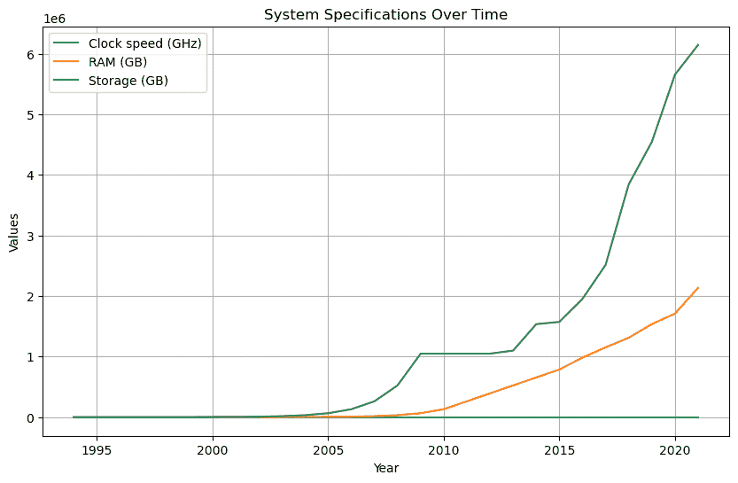
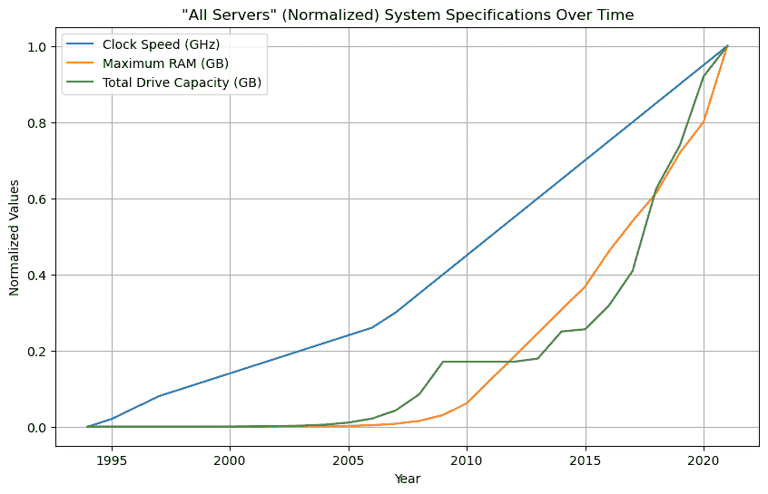

# 第六章：提示工程：优化您的生成式 AI 体验

### 本章内容包括

+   什么是提示工程

+   提示工程最佳实践

+   零样本和少样本提示

+   为历史时间序列数据集提示 LLMs

我打赌，在真正打开这本书之前，许多 - 也许大多数 - 人都期望*提示工程*成为主要焦点。然而，我们现在已经到了第六章（*书已经过半！*）了，我们才刚刚涉及到这个话题？这是怎么回事？

作为我的辩护，我会说这在一定程度上取决于我们使用该术语的含义。对于一些人来说，“提示工程”包含了你通过与 ChatGPT 或 MidJourney 玩得开心来自己摸索出来的许多内容。这很重要，但不需要一整本书。

但我也会认为，到目前为止我给你的东西 - 以及剩下的章节 - 远远超出了提示。当然，你使用的措辞很重要，但我们正在发现的 API 和编程工具将大大拓展你的提示。

这里还有一件事。根据我的经验，随着 GPT 和其他生成式 AI 模型的改进，它们越来越擅长在你提供一个弱提示时找出你想要的东西。我数不清有多少次 GPT 成功地看穿了我的拼写和语法错误，措辞不当，甚至有时甚至是明显的技术错误。因此，许多流行的“提示工程”建议试图防止的问题，AI 本身已经可以轻松处理。

尽管如此，没有人想看起来像个白痴 - 即使唯一能看到的只是一个机器人。而且你永远不知道，甚至 AI 都无法弄清楚你真正想要什么。所以我会把整个章节都献给精心设计你的提示的艺术。我们将从一个有用的定义开始。

## 6.1 什么是提示工程？

在像 GPT 这样的语言模型的背景下使用的提示工程是一种有效引导模型响应并提高其性能的技术。它涉及制定特定的指令或查询，称为提示，以鼓励（甚至强制）模型产生所需的输出。

提示工程可以通过向模型提供明确的指令、上下文或约束来塑造模型的行为。通过精心构建提示，研究人员和开发人员可以影响模型的输出，并使其更一致、准确或与特定标准更好地对齐。

根据你想要实现的目标，有各种各样的提示工程策略。这些策略可能涉及：

+   要求模型扮演特定角色（“你是一位专业的投资顾问”）

+   指定模型响应的格式（“给我一个 .CSV 格式的响应”）

+   要求模型逐步思考（“你能逐步向我介绍安装软件包 X 的过程吗？”）

+   提供额外的上下文或背景信息（“这假定变量`my_number`的值是 10”）。

+   使用系统消息（如错误消息）来指导模型的行为。

一个常见的技巧是使用“通过示范进行提示工程”，即开发者手动为一组示例输入生成期望的模型输出。然后根据这些数据对模型进行微调，使其能够泛化，并为将来的输入产生类似的响应。

重要的是要记住，提示工程是一个*迭代的过程*。这意味着你不能指望在第一次尝试时就得到想要的结果。相反，你需要进行实验，分析模型的初始行为，并根据反馈和评估来完善后续的提示。渐进式迭代的过程让你可以在保持输出控制的同时，利用语言模型的强大功能，确保其与您的意图和要求一致。

举个例子，如果你的 LLM 返回的编程代码不能正常工作，你可能需要使用迭代提示，而不是重复提出同样的问题。你可以复制并粘贴收到的任何错误消息，并询问如何避免这些错误。

## 6.2 提示工程最佳实践

这些建议基于官方 OpenAI 文档中找到的指导原则。

### 6.2.1 要具体

在提示中要慷慨地提供详细信息和描述。

告诉我关于量子力学的事情。

这样做可能不如这样：

在 200 字以内并且用 12 岁儿童可以理解的术语解释量子力学。

类似地，

给我的老板写一封电子邮件，要求加薪。

不如使用类似这样的提示更可能产生良好的结果：

给我的老板写一封礼貌但坚定的电子邮件，解释我辛勤工作和按时完成的项目如何为公司赢得了新客户。

### 6.2.2 要清晰

人工智能和人类一样喜欢清晰明了的提示。提示越明确，得到意外结果的可能性就越小。这个例子不一定是坏的：

根据提供的数据，列举所有提到的关键主题、论点和人名。

但你更有可能在第一次就获得成功，使用类似下面这样的提示：

根据提供的数据，列举所有提到的关键主题，然后是呈现的论点，最后是提到的每个人。

期望的格式：

主题：<用逗号分隔的列表>

论点：

人物：

### 6.2.3 避免不必要的词语

使用这种过于冗长的提示会增加误解和产生不佳结果的风险：

我在寻找关于 1970 年代早期最受欢迎的十款乘用车（按美国国内销售量）的相当长且详细的描述。

反而试试这样：

列举并描述 1970 年代早期美国销售量最高的十款汽车。

当我将这两个示例 - “额外冗长”和“简洁有力”的版本 - 都传递给 ChatGPT 时，我得到的结果都同样令人印象深刻。所以我认为这是我之前提到的 GPT 改进的很好说明。这也表明了提示工程这个话题作为一个整体的日益无关紧要。

### 6.2.4 将参考文本与您的说明分开。

您应该明确说明您的说明的结束位置以及任何您包含的参考文本的开始位置。这个例子可能行不通：

以下文本的作者是谁：我们只能看到前方的一小段距离，但我们可以看到有许多事情需要做。

但这可能会（注意使用了三重引号 - 虽然我不确定它们是否像以前那样重要）。

以下文本的作者是谁：

文本：“““我们只能看到前方的一小段距离，但我们可以看到有许多事情需要做。”””

顺便说一句，我相信你一定很好奇，这段文字的作者是阿兰·图灵。

### 6.2.5 要积极，而不是消极。

这在个人关系中也适用。但现在我们更关心您与您喜爱的生成式 AI 的相处方式。看起来 GPT 及其兄弟姐妹有时会因为这样的否定句而感到困惑：

当回应来自被锁定帐户的客户的以下请求寻求帮助时，请勿建议他们更新密码。

重新将提示转述为积极的可能会有所不同：

当回应来自被锁定帐户的客户的以下请求寻求帮助时，请不要建议他们更新密码，而是引导他们查阅可用的在线文档。

还有一些其他的 LLM 训练方法，可以应用在提升完成质量的具体提示上。我们接下来会看看这些。

##### 总结

在撰写提示时，请记住要具体、清晰、简明，并且是积极的，并清晰地划分您的参考文本。

### 6.2.6 控制温度（随机性）

您可以直接在提示中嵌入温度：

生成一个以句子“这是一个黑暗而多雨的夜晚。”开始的创意独特的故事。使用温度设置为 0.8 以增加故事的一些随机性和创造力。

在这个例子中，温度设置为 0.8 表示生成的响应将具有适度的随机性和创造力。温度值越高，输出的变化和不可预测性就越多。您可以调整温度值来控制生成文本中随机性的数量。像 0.8 这样较高的值将产生更多样化和富有想象力的响应，而像 0.2 这样较低的值将产生更集中和确定性的响应。

## 6.3 零射和少射提示

零射和少射提示是自然语言处理（NLP）中用于生成响应或执行任务的技术，而无需对特定示例进行显式训练或仅使用有限数量的训练数据。

零样本提示是指模型能够为其尚未明确训练的任务提供有意义的响应或执行任务的能力。该模型能够从其训练数据中泛化以理解和响应新的输入或任务。通过使用提示或指令来引导模型的行为来实现这一点。例如，如果语言模型已经在各种主题上进行了训练，那么它仍然可以通过提供指定所需主题的提示来对新主题生成连贯的响应。

另一方面，少样本提示涉及使用仅有的少量标记数据或示例对模型进行训练。通过利用这些有限的训练数据，期望模型学会如何泛化并在未见过或新颖的示例上执行任务。当标记数据的可用性稀缺或需要快速调整模型以适应新任务时，这种方法就很有用。

零样本和少样本提示都利用了预训练和微调的方法论。在预训练阶段，模型在大型文本语料库上进行训练，以学习通用语言模式和表示。接着是微调，将预训练的模型进一步训练到特定任务或领域，使用有限的标记数据或提示。这种组合使模型能够表现出适应性，并以零样本或少样本的方式生成有意义的响应或执行任务。

这些技术已被证明在各种自然语言处理任务中非常强大，比如：

+   文本分类

+   问答

+   总结

+   语言翻译

+   文本生成

它们使模型能够展示一定程度的理解，并且即使没有在特定示例上进行广泛训练，也能够在新的或未见过的输入上表现良好。

这是一个零样本提示的示例。

假设您有一个语言模型，已经在各种主题上进行了训练，但尚未明确在太空探索主题上进行过训练。使用零样本提示，您仍然可以生成关于太空的问题的连贯响应。例如，您可以提供以下提示：

太空探索中的关键挑战和成就是什么？

即使没有针对太空探索进行特定训练，该模型也可以通过利用其对该主题的一般知识和理解生成响应。

这是一个少样本提示的示例。

假设您有一个在大型文本语料库上进行了预训练但尚未进行情感分析微调的模型。但是，通过少样本提示，您可以在包含一些正面和负面情感示例的小型标记数据集上对模型进行训练。然后，该模型可以从这些有限的训练数据中泛化，并对新的、未见过的文本进行情感分析。

这是一个更通用的示例，展示了少样本提示可能的形式。我们首先会使用这些提示/完成示例来训练模型。

英文句子："I love to travel."

法语翻译："J’adore voyager."

英文句子："The cat is sleeping."

法语翻译："Le chat dort."

英文句子："Where is the nearest train station?"

法语翻译："Où se trouve la gare la plus proche?"

在这一点上，你已经“训练”了模型以预测你想要的结果类型。现在你已经准备好提交一个实际的提示了：

英文句子："Can you recommend a good restaurant?"

法语翻译：

零样本和少样本提示都利用了模型从其预训练中概括的能力，并对新的输入或任务进行预测或执行任务，无论是最少还是没有具体训练。当 AI 工程师设计他们的 LLMs 时，它们是基本的工具，但相同的基本原则也可以用于我们自己的日常 AI 交互。

## 6.4 时间序列数据的提示：一个实际示例

当你认识一个碰巧完全掌握整个互联网的人时，从你们关系中创造新价值通常只是要足够有创意地提出正确的问题。正如一个人所做的，我最近有一种难以抑制的冲动，想要可视化服务器硬件组件的历史改进。容量增长是否在多年来保持一致？所有组件类别的容量增长速度是否相似？

但是我应该在哪里找到数据呢？我的好奇心不足以证明为了这个目的连续几个小时搜索供应商网站的存档版本是合理的。我的聪明“朋友”（我的意思是 GPT 或它的 LLM 堂兄弟之一）能帮我吗？

没有理由不尝试。这是我的提示：

给我每年 1994 年至 2021 年的开箱即用、顶级机架式服务器的基本规格。使用以下列显示输出：年份，时钟速度（GHz），最大内存（GB），总存储容量（GB）

由于我期望将输出加载到 Python 程序中，我想省点事，直接要求以逗号分隔的值（CSV）格式提供数据，使用我喜欢的确切列标题。我尝试过使用 ChatGPT 和 Perplexity Labs 的 LLM 服务器。令我惊讶的是，GPT 给了我看起来至少是合理的格式化 CSV 数据。出于某种原因，Perplexity 将"CSV"解释为"Markdown"，但修复这个问题并不是什么大问题。

数据本身（以及以下示例中使用的代码）可在该书的 GitHub 存储库的一部分中找到。

### 6.4.1 数据可视化

当然，正确地可视化我的数据对于评估输出是否合理以及如果合理的话可能给我带来什么见解至关重要。但是，正如我将向您展示的，您可视化这些数据的方式将决定您对其的理解程度。让我通过向您展示如何使用归一化和非归一化数据生成图表来解释一下。

标准化指的是将数据值调整到一个共同的比例或标准，通常是为了方便不同数据点之间的有意义比较。这是数据可视化和分析中常用的技术，可以消除数据中不同比例或单位的影响，从而更容易识别出模式和趋势。在我们的案例中，这很重要，因为用于测量 CPU 时钟频率（GHz）的单位的*规模*与用于测量内存（GB）和存储（也是 GB）的单位非常不同。

标准化有助于确保保留数据中的相对关系和变化程度，同时消除不同比例的影响。这在比较来自不同来源的数据或在同一图表上可视化具有不同单位或比例的数据时特别有用。

**最小最大缩放**，也被称为**最小最大标准化**，是一种数据标准化方法，用于将数据转化为特定范围，通常在 0 到 1 之间。最小最大缩放的目的是标准化数据的值，使其更具可比性，并适用于各种数据分析和机器学习技术。

最小最大缩放的工作原理如下：

1.  找到要标准化的特征数据集中的最小值（min）和最大值（max）。

1.  对于该特征中的每个数据点，应用以下公式将其缩放到范围[0,1]：

1.  缩放值 = （原始值 - 最小值）/（最大值 - 最小值）

每个数据点的结果“缩放值”将落在 0 到 1 的范围内，其中 0 表示数据集中的最小值，1 表示最大值。

最小最大缩放在想要保留数据点之间的关系和比例同时确保所有值都在一致比例上时特别有用。它广泛应用于各种数据分析和机器学习任务中，特别是在神经网络、k-means 聚类或支持向量机等算法对输入特征的比例敏感时。

为了说明，假设您有一个数据集，代表了员工的薪水范围从 40,000 美元到 100,000 美元。您还有代表每个员工的工作年限的数据 - 范围从 2 到 20 年。您想使用最小最大缩放对这些值进行标准化。

没有最小最大缩放，薪水值可能在 40,000 到 100,000 的范围内，而工作经验可能在 2 到 20 的范围内。薪水和工作经验的数据点将处于非常不同的比例上。

现在，如果您将最小最大缩放应用于这两个特征，您可能会将值缩放到 0 到 1 的范围内。因此，50,000 美元的薪水可能缩放为 0.25，而 10 年的工作经验可能缩放为 0.5。

这是我们将在此处使用的工具。但首先，我将向您展示使用非标准化数据进行绘图后得到的结果，这样您就可以亲眼看到为什么标准化是有帮助的。

### 6.4.2 在不进行标准化的情况下绘制时间序列数据

列表 6.1. 展示了生成我们数据的非标准化图形的完整代码。自己仔细看一下，试着理解正在发生的事情，然后我们将逐个部分地进行解释。

##### 列表 6.1 可视化时间序列而不进行归一化

```py
import pandas as pd
from matplotlib import pyplot as plt

df_all = pd.read_csv('AllServers.csv')

plt.figure(figsize=(10, 6))  # Set the figure size

#1
years = df_all['Year'].to_numpy()
clock_speed = df_all['Clock Speed (GHz)'].to_numpy()
max_ram = df_all['Maximum RAM (GB)'].to_numpy()
drive_capacity = df_all['Total Drive Capacity (GB)'].to_numpy()

#2
plt.plot(years, clock_speed, label='Clock speed (GHz)')
plt.plot(years, max_ram, label='RAM (GB)')
plt.plot(years, drive_capacity, label='Storage (GB)')

#3
plt.xlabel('Year')
plt.ylabel('Values')
plt.title('System Specifications Over Time')

#4
plt.legend()

#5
plt.grid(True)
plt.show()
```

让我们逐步了解该代码。像往常一样，我们首先导入所需的库。Pandas 将处理数据本身，matplotlib 将帮助我们制作图形。然后我们将 CSV 数据文件导入到数据框中。

```py
import pandas as pd
from matplotlib import pyplot as plt
df_all = pd.read_csv('AllServers.csv')
```

我将定义图形的尺寸（或者*图*，因为通常是这样描述的），最终我会生成。尽管可以尝试使用替代值来进行实验，看看会有什么变化。但这些应该是完全可行的。

```py
plt.figure(figsize=(10, 6))  # Set the figure size
```

我们将使用 NumPy 工具来获取每列并将其转换为 NumPy 数组 - 这是一种可用于绘制图形/图的数据格式。我们将从每列数据创建的数组命名。例如，列 `df_all['Year']` 将被称为 `years`。

```py
years = df_all['Year'].to_numpy()
clock_speed = df_all['Clock Speed (GHz)'].to_numpy()
max_ram = df_all['Maximum RAM (GB)'].to_numpy()
drive_capacity = df_all['Total Drive Capacity (GB)'].to_numpy()
```

由于 `years` 将被用作我们的 x 轴，现在我将绘制其他三个 NumPy 数组。每个数组都将与 `years` 值关联，并被赋予一个显示标签，如：`label='时钟速度 (GHz)'`。

```py
plt.plot(years, clock_speed, label='Clock speed (GHz)')
plt.plot(years, max_ram, label='RAM (GB)')
plt.plot(years, drive_capacity, label='Storage (GB)')
```

为了使图形更易读，我们将在 x 轴和 y 轴上添加标签，并给图形本身加上一个标题。我们还将添加一个彩色编码的图例，这样我们就能迅速理解哪条图线代表哪列数据。

```py
plt.xlabel('Year')
plt.ylabel('Values')
plt.title('System Specifications Over Time')

plt.legend()
```

最后，我们将触发并生成图形本身：

```py
plt.grid(True)
plt.show()
```

这就是它的全部内容：

##### 图 6.1 使用非标准化数据可视化的硬件组件数据



除了在纸质书籍中阅读本书的人很难区分彩色编码的图线外，这里还有另一个更严重的问题。粗略一看，我们会得出结论，自 1994 年以来处理器时钟速度根本没有改进。但这是荒谬的。

数据本身显示的是在那段时间内平均时钟速度从 1 GHz 增加到 11 GHz。最后那个数字 (11) 很奇怪。我不知道地球上有哪款处理器能以 11 GHz 运行。我怀疑 Perplexity LLM 正在考虑多核系统的扩展，并简单地将每个可能安装在系统上的并行核心的最大速度相加。但无论如何，为什么这种增长没有显示在我们的图线上呢？

答案是 1 GHz 和 11 GHz 之间的差异与 32 GB 和 6,144,960 GB 之间的差异完全不同。这一切都与*规模*有关。要解决*这个*问题，我们需要对数据进行归一化处理。

### 6.4.3 对时间序列数据进行归一化处理的图形化

您会立即注意到列表 6.2 中的代码与之前的非标准化示例有很大的不同。第一个区别是我们从 Sclikit-learn 库中导入了`MinMaxScaler`模块。然后请浏览整个代码，然后我们将逐个部分地处理其余的代码。

##### 列表 6.2 使用标准化可视化时间序列

```py
import pandas as pd
from matplotlib import pyplot as plt
from sklearn.preprocessing import MinMaxScaler

df_servers = pd.read_csv("AllServers.csv")

#1
years = df_servers['Year'].values
scaler = MinMaxScaler()
normalized_data = scaler.fit_transform\
	(df_servers.drop(columns=['Year']))

#2
plt.figure(figsize=(10, 6))

#3
for i, column_name in enumerate(df_servers.columns[1:]):
    plt.plot(years, normalized_data[:, i], label=column_name)

#4
plt.xlabel('Year')
plt.ylabel('Normalized Values')
plt.title('"All Servers" (Normalized) Specs Over Time')

#5
plt.legend()

#6
plt.grid(True)
plt.show()
```

我们以与之前相同的方式从`Year`列中提取数据。这些值作为它们本身就可以使用。但是我们将通过应用`MinMaxScaler`模块（标识为`scaler`）将其他列的数据进行标准化。我们将将经过神奇变换的数据赋给变量`normalized_data`。

```py
years = df_servers['Year'].values
scaler = MinMaxScaler()
normalized_data = scaler.fit_transform\
	(df_servers.drop(columns=['Year']))
```

然后，我们将遍历每列数据（`for i, column_name`）并将它们的数据与`years`数据绘制在一起。然后生成这些数据（`plt.plot`）。`label=column_name`参数将每个三个常规数据列的现有名称应用于我们正在生成的标准化数据。

```py
for i, column_name in enumerate(df_servers.columns[1:]):
    plt.plot(years, normalized_data[:, i], label=column_name)
```

最后，和以前一样，我们设定标签和标题，添加图例，然后生成图形。下面是它的样子：

##### 图 6.2 使用标准化数据可视化的硬件组件数据



这是一个巨大的改进。我们展示了三个组件类别的相对稳定的增长趋势。需要记住的是，绘图线的标准化也是不完美的。这是因为所有三条绘图线的起点和终点分别设定为 0 和 1。因此，通过观察这个图表，将无法判断任何一个类别是否比其他类别增长得更快。但是，鉴于这个限制，我们应该能够在视觉上发现任何显著的趋势-比如 2009 年至 2013 年左右存储能力看似未增长。

当然，这是人工智能生成的数据，所以不要认为它们全部正确。不要根据这些数字来进行投资。

## 6.5 总结

+   提示工程技术可用于准确引导 LLM 以满足我们特定的需求。

+   基本的提示工程最佳实践包括具体、清晰、简洁和积极。

+   少数示例提示可以使用示例来教导模型你想要的结果种类。

+   LLM 可以要求估计真实世界的时间序列数据，然后可以探索两种方式对数据进行可视化（标准化和非标准化）。

## 6.6 请你自己试试

用一个简单的“一次性”问题（例如“为 IT 支持专业人员和无经验的客户之间的对话编写一个剧本”）来提示您最喜欢的 LLM。然后，再次要求相同的对话，但这次使用一个少数示例前缀开始请求。
