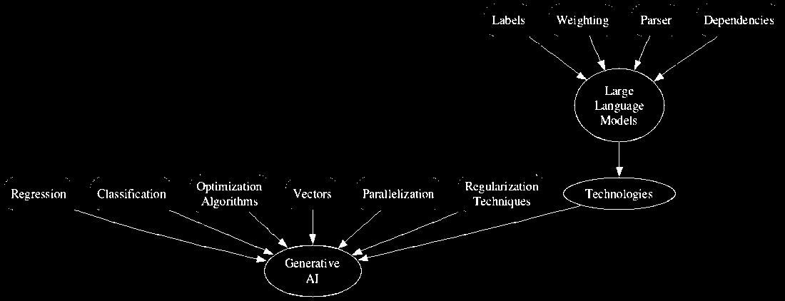

# 附录 A：重要的定义

恐怕这是不可避免的：如果我们想要获得 AI 的*全部*好处，我们就必须咬紧牙关，吸收一些严肃的概念。技术是经过设计复杂的，而人工智能是技术的一个特别复杂的子集。好消息是，我们并不打算成为物理学家和工程师，所以对这些想法及其历史的基本了解就足够了。但是还是要做好一些动荡的准备。

## A.1 一些关键的 AI 定义

要帮助你入门，这里有一张有用的图表，展示了生成式人工智能模型背后众多计算元素之间的复杂关系。

##### 图 A.1 AI 关系的从左到右的思维导图

话虽如此，即使你选择完全跳过本节，你仍然可以成功地跟着本书的其他内容走。但你可能会有些难以确定所得到的 AI 响应中的一些微妙之处（和弱点）。而且一些指示和流程可能会感觉有些随意。

我应该注意到，许多概念的定义将参考其他概念。我会尽力只参考先前定义过的事物，但是由于扭曲（和递归）关系太多，这不可能每次都做到。在提醒了这一点之后，下面是一些基本知识，它将使您更有效地处理生成式人工智能。

**机器学习**是人工智能的一个分支，专注于开发能够自动从数据中学习和改进而无需明确编程的算法和模型。它涉及在大型数据集上训练系统以识别模式、进行预测或执行任务。通过迭代调整模型参数，机器学习使计算机能够从经验中学习并适应新的输入，使其能够做出明智的决策并在最小的人工干预下执行复杂的任务。

在 AI 的背景下，**模型**指的是从数据中学习模式、结构或关系的数学表示或计算系统。它是一个经过训练的算法或网络，可以根据其学到的知识或训练参数接收输入并生成有意义的输出。在生成式人工智能中，模型特指能够生成类似训练数据的新数据样本的系统，无论是生成图像、文本、音乐还是其他形式的创造性内容。模型封装了学到的信息以及基于该知识生成新实例的能力。

**标签**是分配给数据点的分类或注释。它们提供了与输入相关的特征或属性的明确信息。标签作为指导信号，帮助模型学习并生成与所需属性或特性相符的输出。标签通常用于情感分析的一个地方。情感分析涉及训练模型根据文本的情感色调将其分类为正面、负面或中性。为执行此任务，我们需要使用适当的情感对我们的训练数据进行标记（例如，“这篇评论是积极的”，“这条推文是消极的”）。

**加权**是指分配给模型中神经元或特征之间连接的数值。这些权重确定了每个连接的强度或重要性，并在模型的学习和决策过程中发挥关键作用。在训练过程中，权重根据观察到的错误或预测与实际输出之间的差异进行迭代调整，使模型能够从数据中学习，并通过为不同的输入和连接分配适当的权重来提高其性能。加权通常用于命名实体识别（NER），它涉及将文本中提及的实体识别和分类到预定义的类别，如人物、组织和地点。例如，加权的 NER 模型可用于聊天机器人应用程序，以提取和响应用户对特定主题或实体的查询。

**解析器**是分析给定输入的结构的软件组件或算法，通常以符号或文本序列的形式出现，并根据预定义的语法或一组规则生成结构化表示。它通常用于自然语言处理中解析句子并提取句法或语义信息。解析器将输入分解为组成部分，如单词或短语，并建立它们之间的关系，从而实现进一步分析、理解或处理输入数据。

通过理解单词、句子或视觉元素之间的**依赖关系**，生成式人工智能模型可以生成保持上下文一致性的有意义的序列或图像。建模依赖关系允许生成的输出展现逻辑流、语义一致性，并遵循训练数据中观察到的模式。准确捕捉依赖关系对于在生成式人工智能应用程序中生成高质量和连贯的输出至关重要。

**回归**（Regression）是一种监督学习技术，用于根据输入特征预测或估计连续的输出变量。它通过将数学函数拟合到训练数据来建模输入变量和输出变量之间的关系。目标是找到最佳拟合函数，使预测值与实际值之间的差异最小化。回归算法分析数据中的模式和趋势，以进行预测或推断关系。对于情感分析，回归可以是另一个工具。例如，对于与客户服务相关的任务，能够自动对客户投诉或表扬进行分类是很重要的，这样组织就能够准确地将问题路由到适当的支持代理那里。

**分类**（Classification）是机器学习中的一项基本任务，其目标是将输入数据点分配给预定义的类别或类。它涉及对带有标签的数据进行模型训练，其中每个数据点都与已知类相关联。模型学习训练数据中的模式和关系，以便对新的、未见过的数据进行预测。分类模型的输出是一个离散的类标签，表示输入所属的预测类别。

**优化算法**（Optimization algorithms）是用于找到给定问题的最优解的数学过程。在机器学习和神经网络的背景下，这些算法用于最小化一个目标函数，通常由损失或成本函数表示。目标是通过迭代调整模型的参数，达到最小化目标函数的最佳值组合。在优化模型的世界中，有一些流行的技术，如“随机梯度下降”及其变体。这些方法通过根据模型的改善或恶化程度调整其内部设置，帮助模型变得更好。通过这样做，模型更接近于找到最佳解决方案，并在其任务上表现得更好。

**向量**（Vectors）是用于表示多维空间中的大小和方向的数学实体。在机器学习和数据分析的背景下，向量通常用于表示特征或数据点。向量的每个维度对应于一个特定的属性或变量，允许数据的高效存储和操作。向量可以使用数学运算（如加法、减法和点积）进行操作，从而实现相似性、距离和转换的计算。向量在各种算法和模型中起着基本作用，如聚类、分类和降维。

**向量嵌入（Vector embeddings）**帮助 LLMs 在相似的单词和短语上推广知识，即使它们在训练期间没有遇到。这使得模型能够有效地处理未出现在词汇表中的单词。预训练的嵌入可以用作各种自然语言处理任务的起点，实现转移学习，并提高在有限数据的下游任务上的性能。所有这些的一个实际应用是在医学影像学中，向量嵌入可以用来分析和比较器官或组织的图像。可以训练深度学习模型将脑部扫描映射到向量空间中，在那里类似的扫描聚集在一起。这使医生能够快速识别病人扫描中的模式和异常，从而早期诊断和治疗癌症或神经系统疾病。

**词嵌入（Word embeddings）**是将单词表示为高维向量的一种方式，使得相似的单词在该空间中靠近。词嵌入通常表示为张量，其中每个维度表示单词含义的不同方面。例如，一个词嵌入张量可能具有单词的同义词、反义词和词性的维度。

**并行计算（Parallelization）**指将计算任务分成较小的子任务，可以在多个计算资源上同时执行的技术。它利用并行处理的能力来加速整个计算和提高效率。在并行计算中，任务被分配给不同的处理器、线程或计算单元，允许它们同时运行。这种方法通过将工作负载分布到多个资源上来实现更快地完成任务。并行计算广泛应用于各个领域，包括机器学习、科学模拟和数据处理，以实现显著的性能提升和有效处理大规模计算。

**正则化技术（Regularization techniques）**是用来提高模型泛化性能的方法。这些技术在训练期间向损失函数添加惩罚项，防止模型过度依赖复杂或嘈杂的数据模式。正则化技术有助于控制模型复杂度，减少过拟合，并提高模型对未见过数据的泛化能力。

正则化技术的一个常见实际应用是在文本分类中，特别是处理不均衡数据集时。假设我们有一个电影评论数据集，其中大多数属于正面评价（比如“好电影”），少部分是负面评价（比如“烂电影”）。如果没有正则化，模型可能会对正面评价产生偏见，并无法准确分类负面评价。为了解决这种不平衡，我们可以在损失函数中添加正则化项，惩罚模型误分类负面评论。

**收敛**是指在相同数据集上训练多个模型直到它们产生相似的输出的过程。这样做是为了减少过拟合的风险并提高模型的泛化能力。收敛通常使用诸如验证损失或准确率等指标进行评估，并且一旦模型收敛到稳定解决方案，训练过程就会停止。

所有这些都带领我们来到：

**自然语言处理（NLP）**专注于计算机与人类语言之间的交互。它涉及开发算法和模型，使计算机能够以有意义的方式理解、解释和生成人类语言。NLP 包括诸如文本分类、情感分析、机器翻译、信息提取和问答等任务。它利用来自各种学科的技术，包括计算语言学、机器学习和深度学习，来处理和分析文本数据。

最后，到最后：

**大型语言模型（LLM）**是自然语言处理（NLP）中的一种工具，利用深度学习技术来理解和生成类似人类的文本。它分析给定文本语料库中的模式、上下文和语义，以学习语言的潜在结构。通过其理解和生成连贯且上下文相关的响应的能力，LLM 可用于各种任务，如聊天机器人、语言翻译、文本补全和摘要。通过捕捉语言的复杂性，LLM 允许机器直接与人类进行交流。

或者换句话说，它实现了生成式人工智能。
