# 第三章：构建因果图形模型

### 本章涵盖

+   构建因果 DAG 来模拟 DGP

+   使用你的因果图作为沟通、计算和推理工具

+   在 pgmpy 和 Pyro 中构建因果 DAG

+   使用因果 DAG 作为支架训练概率机器学习模型

在本章中，我们将使用*因果有向无环图*（因果 DAG）构建数据生成过程（DGP）的第一个模型——一个没有环的有向图，其中边代表因果关系。我们还将探讨如何使用因果 DAG 作为支架来训练统计模型。

## 3.1 引入因果 DAG

假设我们可以将 DGP 划分为一组变量，其中给定的一组变量值代表 DGP 的可能状态。这些变量可以是离散的或连续的。它们可以是单变量，也可以是多变量向量或矩阵。

因果 DAG 是一个有向图，其中节点是这组变量，有向边代表它们之间的因果关系。当我们使用因果 DAG 来表示 DGP 时，我们假设边反映了 DGP 中的真实因果关系。

为了说明，回想一下第二章中的投掷石头 DGP。我们开始时，珍妮和布莱恩有一定倾向去砸窗户，窗户有一定的强度。如果其中任何一个人的砸窗倾向超过了一个阈值，他们就会砸。窗户是否破碎取决于他们是否砸或者两者都砸，以及窗户的强度。

##### 设置你的环境

本章中的代码是用 pgmpy 版本 0.1.24，pyro-ppl 版本 1.8.6，和 DoWhy 版本 0.11.1 编写的。Python 的 Graphviz 库的版本 0.20.1 用于绘制 DAG 的图像，这取决于是否安装了核心 Graphviz 软件。如果你现在不想设置 Graphviz，请注释掉 Graphviz 代码。

请参阅本书的笔记[`www.altdeep.ai/p/causalaibook`](https://www.altdeep.ai/p/causalaibook)，以获取包含代码的 Jupyter 笔记本的链接。

我们现在将创建一个因果 DAG 来可视化这个过程。作为一个 Python 函数，DGP 在下面的列表中展示。

##### 列表 3.1 DAG 投掷石头示例

```py
def true_dgp(jenny_inclination, brian_inclination, window_strength):     #1
    jenny_throws_rock = jenny_inclination > 0.5     #2
    brian_throws_rock = brian_inclination > 0.5   #2
    if jenny_throws_rock and brian_throws_rock:     #3
        strength_of_impact = 0.8    #3
    elif jenny_throws_rock or brian_throws_rock:     #4
        strength_of_impact = 0.6    #4
    else:     #5
        strength_of_impact = 0.0   #5
    window_breaks = window_strength < strength_of_impact     #6
    return jenny_throws_rock, brian_throws_rock, window_breaks
```

#1 输入变量是介于 0 和 1 之间的数字。

#2 如果珍妮和布莱恩有砸石头的倾向，他们会砸石头。

#3 如果两人都砸石头，冲击力为 0.8。

#4 如果其中一个人砸，冲击力为 0.6。

#5 如果两人都不砸，冲击力为 0。

#6 如果冲击力大于窗户强度，窗户会破碎。

图 3.1 展示了作为因果 DAG 的投掷石头 DGP。

在图 3.1 中，每个节点对应 DGP 中的一个随机变量。有向边对应因果关系（源节点是原因，目标节点是结果）。


##### 图 3.1 表示投掷石头 DGP 的因果 DAG。在这个例子中，每个节点对应 DGP 中的一个随机变量。

### 3.1.1 案例研究：交通的因果模型

在本章中，我们将探讨人们日常通勤选择交通方式的模型。这个例子将做出过于强烈的假设（以至于接近冒犯），这将有助于说明模型构建的核心思想。你可以在[`www.altdeep.ai/p/causalaibook`](https://www.altdeep.ai/p/causalaibook)找到相关的代码和教程链接。

假设你是一名城市规划顾问，试图模拟人们的人口背景、他们居住的城市规模、他们的工作状态以及他们每天如何通勤到工作的决策之间的关系。

你可以将系统中的关键变量分解如下：

+   *年龄 (A)*—个人的年龄

+   *性别 (S)*—个人报告的性别（使用“S”而不是“G”，因为“G”通常保留用于 DAG）

+   *教育 (E)*—个人完成的教育或培训的最高水平

+   *职业 (O)*—个人的职业

+   *居住地 (R)*—个人居住的城市规模

+   *出行 (T)*—个人偏好的交通方式

然后，你可以考虑这些变量之间的因果关系，使用对该领域的了解。以下是一个可能的叙述：

+   教育标准在不同代人之间是不同的。对于老年人来说，高中学位就足以实现中产阶级的生活方式，但年轻人至少需要大学学位才能达到同样的生活方式。因此，年龄 (*A*) 是教育 (*E*) 的原因。

+   类似地，一个人的性别通常是他们决定追求更高教育水平的一个因素。因此，性别 (*S*) 是教育 (*E*) 的原因。

+   许多白领工作需要较高的教育水平。许多认证职业（例如，医生、律师或会计师）肯定需要较高的教育水平。因此，教育 (*E*) 是职业 (*O*) 的原因。

+   依赖于较高教育水平的白领工作往往集中在城市地区。因此，教育 (*E*) 是人们居住地点 (*R*) 的原因。

+   自雇人士可能在家工作，因此不需要通勤，而雇佣他人的人则需要。因此，职业 (*O*) 是交通 (*T*) 的原因。

+   大城市的人可能发现步行或使用公共交通通勤更方便，而小城市和镇上的人则依赖汽车出行。因此，居住地 (*R*) 是交通 (*T*) 的原因。

你可以根据你对该领域的了解，或者基于对该领域的研究来构建这个叙述。或者，你也可以咨询该领域的专家，例如专门研究这个领域的社会科学家。最后，你可以将这个叙述简化为图 3.2 所示的因果 DAG。


##### 图 3.2 代表人们通勤到工作背后的因果因素的因果 DAG

你可以使用以下代码构建这个因果 DAG。

##### 列表 3.2 在 pgmpy 中构建运输 DAG

```py
from pgmpy.models import BayesianNetwork
model = BayesianNetwork(    #1
       [
        ('A', 'E'),    #2
        ('S', 'E'),   #2
        ('E', 'O'),   #2
        ('E', 'R'),   #2
        ('O', 'T'),   #2
        ('R', 'T')    #2
     ]
)
```

#1 pgmpy 提供了一个 BayesianNetwork 类，我们可以将边添加到模型中。

#2 将ΔAG 作为边（元组）列表输入。

#3 将ΔAG 作为边（元组）列表输入。

pgmpy 中的`BayesianNetwork`对象建立在 NetworkX 的`DiGraph`类之上，NetworkX 是 Python 中首屈一指的图建模库。

##### 因果抽象和因果表示学习

在建模中，*抽象级别*指的是模型中变量的详细程度和粒度。在图 3.2 中，数据中的变量和因果 DAG 中的变量之间存在映射，因为 DGP 生成数据的抽象级别和因果 DAG 的抽象级别是相同的。但是，数据中的变量可能处于不同的抽象级别。这在机器学习中尤为常见，我们经常处理低级特征，如像素。

当数据的抽象级别低于建模者想要工作的级别时，建模者必须使用领域知识推导出将作为 DAG 节点出现的高级抽象。例如，医生可能对像“肿瘤（存在/不存在）”这样的高级二元变量节点感兴趣，而数据本身包含来自医学成像技术的像素矩阵等低级变量。

那位医生必须查看数据集中的每一张图像，并手动标记高级肿瘤变量。或者，建模者可以使用分析手段（例如数学或逻辑）将低级抽象映射到高级抽象。此外，他们必须以保留 DGP 因果假设的方式来做。

从低级变量以因果严谨的方式创建高级变量的任务被称为*因果抽象*。在机器学习中，术语“特征工程”适用于从低级特征计算*有用*的高级特征的任务。因果抽象与因果严谨性的要求不同。你可以在本书的注释中找到一些因果抽象的信息，网址为[`www.altdeep.ai/p/causalaibook`](https://www.altdeep.ai/p/causalaibook)。

从数据中的低级抽象学习高级因果抽象的另一种方法是使用深度学习——这被称为*因果表示学习*。我们将在第五章简要介绍这个主题。

### 3.1.2 为什么使用因果 DAG？

因果 DAG 是因果性最著名的表示，但要理解其价值，思考其他建模因果性的方法是有用的。一种替代方法是使用数学模型，例如一组常微分方程或偏微分方程，这在物理学和工程学中很常见。另一种选择是使用计算模拟器，如气象学和气候科学中使用的。

与那些替代方案相比，因果 DAG 对 DGP 的数学理解要求要少得多。因果 DAG 只要求你以图形的形式指定什么导致什么。图形对人类来说很容易思考；它们是理解复杂领域的方法。

事实上，使用因果 DAG 作为 DGP 表示的几个好处包括：

+   DAGs 在沟通和可视化因果假设方面很有用。

+   我们有许多工具可以用于在 DAG 上进行计算。

+   因果 DAG 表示时间。

+   DAGs 将因果关系与条件独立性联系起来。

+   DAGs 可以为概率机器学习模型提供支架。

+   那些概率机器学习模型中的参数是模块化参数，并且它们编码了因果不变性。

让我们逐一回顾这些好处。

### 3.1.3 DAGs 在沟通和可视化因果假设方面很有用

因果 DAG 是一种强大的沟通工具。信息视觉沟通涉及以牺牲其他信息为代价突出重要信息。作为一个类比，考虑图 3.3 中的两个伦敦地铁图。左边的地图在地理上是准确的。右边的简单地图忽略了地理细节，专注于每个车站相对于其他车站的位置，这可能是找到在伦敦周围路线所需的所有信息。


##### 图 3.3 图形表示是视觉沟通的一个强大用例。例如，左边的伦敦地铁图在地理上是准确的，而右边的则为了更清晰地表示每个车站相对于其他车站的位置而牺牲了这种准确性。对于乘客来说，后者比地理准确性的地图更有用。同样，因果 DAG 抽象掉了因果机制的大部分细节，以创建一个简单且易于视觉推理的表示。

类似地，因果有向图（DAG）突出了因果关系，而忽略了其他事物。例如，投掷石头的 DAG 忽略了珍妮和布莱恩的投掷如何结合在一起打破窗户的 if-then 条件逻辑。运输 DAG 没有提及我们正在处理的变量类型。我们应该将年龄（*A*）视为连续时间、整数年、如年轻/中年/老年这样的类别，还是 18-29、30-44、45-64 和>65 这样的区间？运输变量（*T*）的分类是什么？职业变量（*O*）是否可以是如{就业、工程师、在家工作}这样的多维元组？DAG 还未能捕捉到这些变量中哪些在数据中被观察到，以及该数据中的数据点数量。

#### 因果 DAG 没有说明机制

因果有向图也没有可视化原因之间的交互。例如，在上一代人中，女性上大学的机会比男性少。在年轻一代中，情况相反。虽然年龄(*A*)和性别(*S*)都是教育(*E*)的原因，但你无法从 DAG 中看到关于年龄和性别如何相互作用影响教育的内容。

更普遍地说，DAGs 无法传达关于因果机制或*如何*原因影响效果的任何信息。它们只建立了因果的*什么*，即*什么*导致*什么*。以图 3.4 中的各种逻辑门为例。*A*和*B*的输入二进制值根据逻辑门类型的不同而决定输出不同。但如果我们用一个因果有向图来表示逻辑门，那么所有逻辑门都有相同的因果有向图。我们可以使用因果有向图作为捕捉这种逻辑的因果图形模型的支架，但我们无法*看到*在图中逻辑。

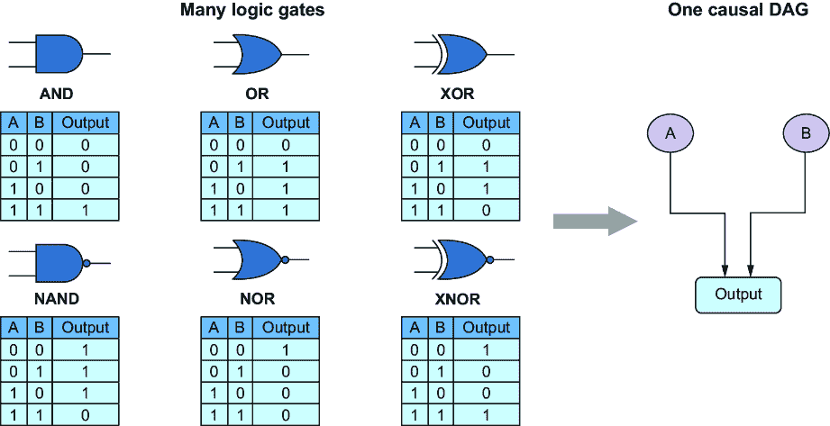

##### 图 3.4 各种逻辑门都有相同的因果有向图。

这既是优点也是缺点。因果有向图（DAG）通过说明什么导致什么来简化问题，但并不说明*如何*。然而，在某些情况下（例如逻辑门），可视化*如何*将是可取的。

#### 因果有向图代表了因果假设

因果有向图代表了模型者对 DGP 的假设和信念，因为我们大多数时候无法访问那个过程。因此，因果有向图使我们能够可视化我们的假设并将它们传达给他人。

除了这种可视化和沟通之外，因果有向图的益处是数学的和计算的（我将在下一个小节中解释这些）。因果推断研究人员在因果有向图的数学和计算属性在实践中的益处程度上意见不一。然而，大多数人同意可视化和沟通因果假设的基本益处。

因果有向图中编码的假设是强烈的。让我们再次看看图 3.2 中的运输 DAG，再次在图 3.5 中展示。考虑那个 DAG 的替代方案；在这个简单的六个节点系统中，我们可能画出多少个可能的 DAG？答案是 3,781,503，所以当我们使用因果有向图来沟通我们对这个系统的假设时，我们是在沟通我们对 3,781,502 个替代方案中的首选。

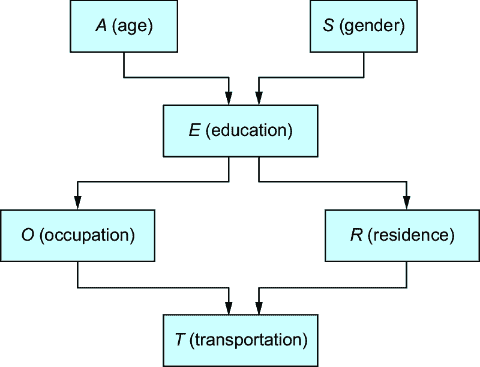

##### 图 3.5 运输选择的因果有向图模型。这个 DAG 编码了关于这些变量如何以及如何不相互关联的强烈假设。

那么关于那些竞争的 DAG 呢？其中一些看起来是合理的。也许婴儿潮一代更喜欢小镇生活，而千禧一代更喜欢城市生活，这意味着应该有一个*A* → *R*的边。也许性别规范决定了某些职业和行业中的偏好和机会，这意味着有一个*S* → *O*的边。年龄和性别通过教育间接导致职业和居住地的假设是一个强大的假设，如果它是正确的，将提供有用的推理。

但如果我们的因果 DAG 是错误的怎么办？考虑到它有 3,781,502 个竞争对手，它很可能是错误的。在第四章中，我们将使用数据来展示我们选择的 DAG 中的因果假设何时不成立。

### 3.1.4 我们有许多工具可以用于在 DAG 上进行计算

有向图在数学和计算机科学中是研究得很好的对象，它们是一个基本的数据结构。计算机科学家已经使用图算法解决了许多具有理论保证的实用问题，这些保证了他们找到解决方案所需的时间。在数据科学和机器学习中常用的编程语言都有实现这些算法的库，例如 Python 中的 NetworkX。这些流行的库使得编写与因果 DAG 一起工作的代码变得更加容易。

我们可以将所有这些理论和工具应用于因果建模问题，当我们以因果有向无环图（DAG）的形式表示因果模型时。例如，在 pgmpy 中，我们可以使用数据来训练一个因果 DAG，从而得到一个有向因果图模型。有了这个模型，我们可以应用基于图的概率推理算法，例如*信念传播*，来估计图上变量定义的条件概率。有向图结构使得这些算法能够在典型设置下工作，而无需我们针对特定问题或任务进行配置。

在下一章中，我将介绍*d-separation*的概念，它是条件独立性的图形抽象，也是因果推理的 do-calculus 理论的基本思想。D-separation 完全是关于在有向图中寻找节点之间的路径，这是任何有价值的图形库默认情况下都使其变得容易的事情。实际上，条件独立性是因果 DAG 的第三个主要益处的关键思想。

### 3.1.5 因果 DAG 可以表示时间

因果 DAG 隐含地表示了时间。更技术地说，因果 DAG 提供了一个*部分时间顺序*，因为原因在时间上先于效果。

例如，考虑图 3.6 中的图。这个图描述了一个 DGP，其中云量的变化（多云）导致天气激活的喷水装置（喷水装置）和雨（雨）的状态发生变化，这两者又导致草地湿润状态（湿草）的变化。我们知道天气状态的变化会导致下雨和喷水装置激活，这两者又导致草地湿润状态的变化。然而，这只是一个*部分*时间排序，因为图没有告诉我们哪个先发生：喷水装置激活还是下雨。

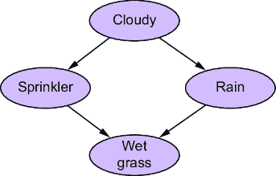

##### 图 3.6 表示某些草（湿或干）状态的因果 DAG。DAG 给出了其节点的一个部分时间排序，因为原因在时间上先于效果。

图 3.6 中的部分排序可能看起来很平凡，但考虑图 3.7 中的 DAG。可视化库可以使用图 3.7 左侧毛线球状 DAG 中的部分排序来创建右侧的更易读形式。

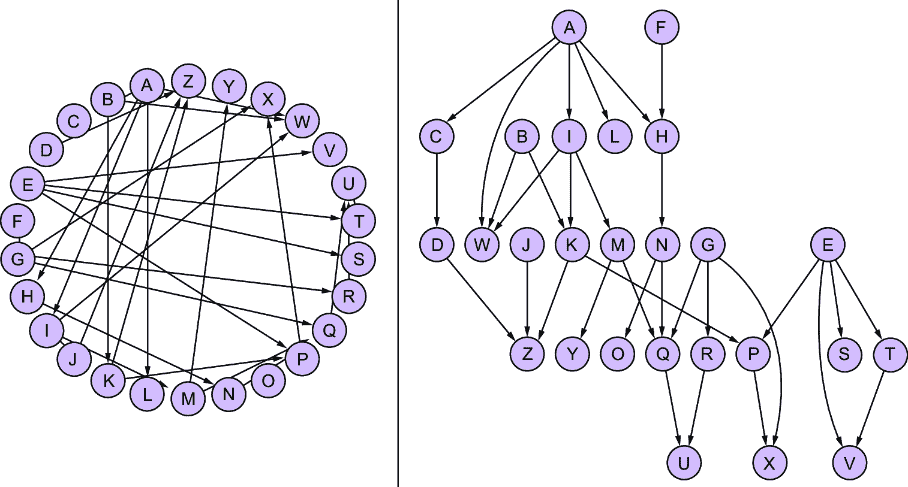

##### 图 3.7 一个可视化库可以使用 DAG 的部分排序将左侧的毛线球状 DAG 展开成右侧更易读的形式。

有时我们需要一个因果 DAG 来更明确地表示时间。例如，我们可能在动态环境中建模因果关系，如强化学习中使用的模型。在这种情况下，我们可以通过定义和标记模型的变量来使时间明确，如图 3.8 所示。我们可以用像“Δ”这样的区间变量表示连续时间。第十二章将提供一些具体例子。


##### 图 3.8 如果我们需要一个因果 DAG 来明确表示时间，我们可以在变量的定义和节点标记中使时间明确。我们可以用像“Δ”这样的区间变量表示连续时间。

因果 DAG 不允许有任何循环。在一些因果系统中，放松无环性约束是有意义的，例如具有反馈循环的系统，一些高级因果模型允许循环。但坚持简单的无环假设使我们能够利用因果 DAG 的好处。

如果你有循环，有时你可以通过时间展开循环并使时间明确来得到无环性。一个图*X* ⇄ *Y*可以展开为*X*[0]→*Y*[0] →*X*[1]→*Y*[1] . . . 。例如，你可能存在供应、价格和需求之间的循环，但也许你可以将其重写为时间 0 的价格影响时间 1 的供应和需求，然后这些又影响时间 2 的价格，等等。

### 3.1.6 DAGs 将因果关系与条件独立性联系起来

因果 DAG 的另一个好处是它允许我们利用因果关系来推理条件独立性。人类天生具有基于因果关系的推理能力——这就是因果 DAG 的第一个和第二个好处。但是，概率推理并不那么容易。因此，利用因果关系来推理条件独立性（一个来自概率的概念）是 DAG 的一个显著特征。


##### 图 3.9 运输 DAG 中的因果关系编码了关于条件独立性的关键假设。

考虑运输 DAG，如图 3.9 所示。

DAG 中的六个变量具有联合分布 *P*(*A*,*S*,*E*,*O*,*R*,*T*)。回忆第二章中的链式法则，它说我们可以将任何联合概率分解为一系列条件概率因子。例如，

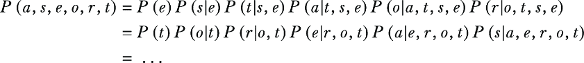

链式法则适用于任何变量的顺序。但我们将选择因果 DAG 的（部分）顺序，因为这种顺序与我们对 DGP 中变量因果流动的假设相一致。查看图 3.9，变量的顺序是 {(*A*, *S*), *E*, (*O*, *R*), *T*}。(*A*, *S*) 和 (*O*, *R*) 这对是无序的。如果我们任意选择一个顺序，让 *A* 在 *S* 之前，*O* 在 *R* 之前，我们得到以下结果：

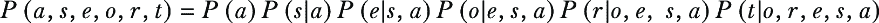

接下来，我们将使用因果 DAG 进一步简化这个分解。每个因子都是一个条件概率，因此我们将通过在 DAG 中仅对每个节点进行其父节点的条件化来简化这些因子。换句话说，对于每个变量，我们将查看该变量在图中的直接父节点，然后我们将丢弃条件化符号（|）右侧的所有不是直接父节点的元素。如果我们只对父节点进行条件化，我们得到以下简化：

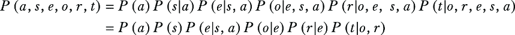

这里发生了什么？为什么因果 DAG 神奇地意味着我们可以说 *P*(*s|a*) 等于 *P*(*s*)，并且 *P*(*r|o,e,s,a*) 简化为 *P*(*r**|e*)？如第二章所述，断言 *P*(*s*|*a*)*=**P*(*s*) 和 *P*(*t*|*o,r,e,s,a*)*=**P*(*t*|*o,r*) 等价于说 *S* 和 *A* 是独立的，且 *T* 在给定 *O* 和 *R* 的条件下独立于 *E*、*S* 和 *A*。换句话说，因果 DAG 为我们提供了一种在 DGP 中变量的联合概率分布上施加条件独立性约束的方法。

我们为什么要关心事物之间的条件独立性呢？条件独立性使得作为模型构建者的人生更加容易。例如，假设你想要用预测模型来建模运输变量*T*。由*P*(t|o,r,e,s,a)隐含的预测模型需要具有特征*O*、*R*、*E*、*S*和*A*，而由*P*(t|o,r*)隐含的预测模型只需要特征*O*和*R*来预测*T*。后者模型将具有更少的参数需要学习，具有更多的自由度，在内存中占用的空间更少，训练速度更快等。

但为什么因果有向图（DAG）让我们有权施加条件独立性呢？让我们对因果关系和条件独立性之间的联系建立一些直觉。考虑使用家庭成员的遗传数据来得出关于个人的结论的例子。例如，金州杀手是一个在加利福尼亚州被捕的连环杀手，他使用遗传家谱学被捕获。调查人员使用杀手在犯罪现场留下的 DNA 来识别公共数据库中的遗传亲属。然后，他们从那些亲属那里进行三角测量以找到杀手。

假设你有一个近亲和一个远亲在同一条血统线上。在我们已经考虑了那个近亲之后，远亲还能提供关于你的任何额外的遗传信息吗？让我们通过只关注血型来简化一下。假设近亲是你的父亲，而远亲是你的父亲的父亲，如图 3.10 所示。确实，你祖父的血型是你血型的原因。如果我们看到一组祖父/孙子血型对的大数据集，我们会看到相关性。然而，你父亲的血型是一个更直接的原因，你祖父的血型和你之间的联系是通过你的父亲传递的。所以，如果我们目标是预测你的血型，而我们已经有你父亲的血型作为预测因子，你父亲的父亲的血型就不能提供任何额外的预测信息。因此，你的血型和你的父亲的父亲的血型在给定你父亲的血型的情况下是条件独立的。

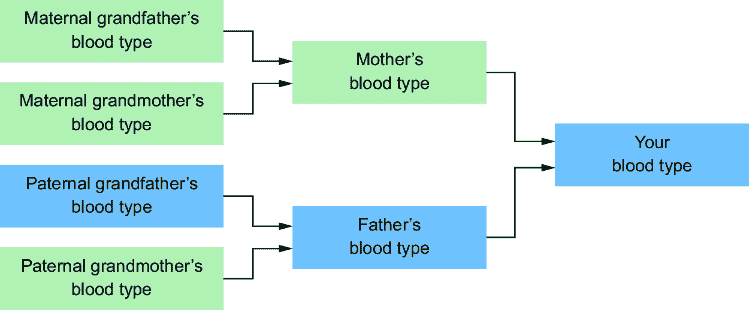

##### 图 3.10 因果关系意味着条件独立性。你父亲的血型是祖父的血型的原因，而祖父的血型又是你血型的原因。给定你父亲的血型，你和你的父亲的父亲的血型在条件上是独立的，因为你的父亲的血型已经包含了祖父的血型关于你血型可能提供的一切信息。

因果关系使相关变量条件独立的方式被称为*因果马尔可夫性质*。在图形术语中，因果马尔可夫性质意味着在图中，变量在给定其父母的情况下，与其非后代（例如，祖先、叔叔/阿姨、堂兄弟姐妹等）条件独立。

这种“非后裔”定义的因果马尔可夫属性有时被称为*局部马尔可夫属性*。一个等效的表述被称为*马尔可夫分解属性*，这是如果你的因果 DAG 是真实的，你可以将联合概率分解为变量在因果 DAG 中给定其父变量的条件概率的性质：


如果我们的运输 DAG 是 DGP 的真实表示，那么局部马尔可夫属性应该成立。在下一章中，我们将看到如何使用数据来测试这个假设。

### 3.1.7 DAGs 可以为概率 ML 模型提供脚手架

在概率机器学习中，许多建模方法使用有向无环图（DAG）作为模型结构。例如，包括有向图模型（也称为贝叶斯网络）和潜在变量模型（例如，主题模型）。深度生成模型，如变分自编码器，通常有一个底层的有向图。

在因果图上构建概率机器学习模型的优势，显然是，你有一个概率*因果*机器学习模型。你可以在数据上训练它，你可以用它进行预测和其他推理，就像任何概率机器学习模型一样。此外，因为它建立在因果 DAG 之上，所以它是一个因果模型，你可以用它来进行因果推理。

从提供脚手架中获得的益处是，*这些模型中的参数是模块化的，并编码了因果不变性*。在探讨这一益处之前，让我们首先在运输 DAG 上构建一个图形模型。

```py
Building a probabilistic machine learning model on a causal DAG
```

回想一下我们在运输 DAG 中关于变量排序的联合概率分布的分解。


我们有一组因子，{*P*(*a*)*, P*(*s*)*, P*(*e*|*s,a*)*, P*(*o*|*e*)*, P*(*r*|*e*)*, P*(*t*|*o,r*)}*。从现在起，我们将从第二章中的“马尔可夫核”术语出发，并称这些因子为*因果马尔可夫核*。

我们将通过在代码中实现这些因果马尔可夫核并将它们组合成一个模型来构建我们的概率机器学习模型。我们为每个核的实现将能够返回一个概率值，给定输入参数。例如，*P*(*a*)将接受一个关于*A*的结果值并返回该结果的概率值。同样，*P*(*t*|*o,r*)将接受*T*，*O*和*R*的值并返回*T*=*t*的概率值，其中*t*是查询值。我们的实现还将能够从因果马尔可夫核中生成。为此，这些实现将需要将输入映射到输出的参数。我们将使用标准的统计学习方法来从数据中拟合这些参数。

### 3.1.8 在因果 DAG 上训练模型

考虑运输 DAG 的 DGP。这个过程会生成什么样的数据？

假设我们进行了一项涵盖 500 个人的调查，得到了这个 DAG 中每个变量的值。数据按照以下方式编码我们 DAG 中的变量：

+   *年龄 (A)*—记录为年轻（“年轻”）对于 29 岁及以下的人，成年（“成年”）对于 30 至 60 岁的人（包括 60 岁），以及 61 岁及以上的人为老年（“老年”）

+   *性别 (S)*—个人的自我报告性别，记录为男性（“M”）、女性（“F”）或其他（“O”）

+   *教育 (E)*—个人完成的教育或培训的最高水平，记录为高中（“高中”）或大学学位（“大学”）

+   *职业 (O)*—雇员（“雇员”）或自雇工人（“自雇”）

+   *居住地 (R)*—个人居住的城市的人口规模，记录为小（“小”）或大（“大”）

+   *旅行 (T)*—个人偏好的交通方式，记录为汽车（“汽车”）、火车（“火车”）或其他（“其他”）

##### 标记因果抽象

在机器学习中，我们如何概念化模型中的变量非常重要。例如，ImageNet，一个包含 1400 万张图片的数据库，包含种族类别的时代错误和冒犯性标签。即使更名为不那么冒犯，种族类别本身在时间和文化中是流动的。在预测算法中应该使用哪些“正确”的标签？

我们如何定义我们的变量不仅仅是政治和人口普查表的问题。哲学家纳尔逊·古德曼的一个简单的思想实验展示了简单的标签变化如何将预测变为矛盾的预测。假设你经常寻找宝石并记录你找到的每一颗宝石的颜色。结果发现你数据集中的 100%的宝石都是绿色的。现在让我们定义一个新的标签“grue”，表示“如果在此之前观察到，则为绿色，否则为蓝色。”所以你的 100%的数据是“绿色”或“grue”，这取决于你的标签选择。现在假设你根据过去的数据进行预测。那么你可以根据所有过去翡翠都是绿色的数据预测下一颗翡翠将是绿色的，或者你可以根据所有过去翡翠都是“grue”（即蓝色）的数据预测下一颗翡翠将是“grue”。显然，你永远不会发明这样的荒谬标签，但这个思想实验足以表明推理取决于抽象。

在数据科学和机器学习中，我们经常被鼓励盲目地建模数据，不要考虑 DGP。我们被鼓励将变量名称视为电子表格中的列或数据库表中的属性。当可能时，最好选择适合推理问题的抽象，并根据该抽象收集或编码数据。当不可能时，请记住，你的分析结果将取决于其他人如何定义变量。

在第七章中，我将介绍“无操纵则无因果关系”这一概念——这一概念为如何定义因果变量提供了一个有用的启发式方法。

运输数据中的变量都是 *分类* 变量。在这个简单的分类情况下，我们可以依赖像 pgmpy*.* 这样的图形建模库。

##### 列表 3.3 加载运输数据

```py
import pandas as pd
url='https://raw.githubusercontent.com/altdeep/causalML/master/datasets
↪/transportation_survey.csv'    #1
data = pd.read_csv(url)
data
```

#1 我们将使用 read_csv 方法将数据加载到 pandas ΔataFrame 中。

这产生了图 3.11 中的 DataFrame。

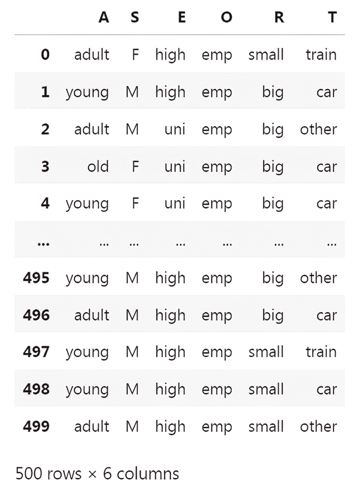

##### 图 3.11 运输模型下 DGP 数据的一个示例。在这种情况下，数据是 500 份调查回复。

我们在列表 3.2 中初始化的 `BayesianNetwork` 类有一个 `fit` 方法，它将学习我们的因果马尔可夫核的参数。由于我们的变量是分类的，我们的因果马尔可夫核将以 pgmpy 的 `TabularCPD` 类表示的条件概率表的形式存在。`fit` 方法将使用数据来拟合（学习）那些条件概率表的参数估计。

##### 列表 3.4 为因果马尔可夫核学习参数

```py
from pgmpy.models import BayesianNetwork
model = BayesianNetwork(
      [
        ('A', 'E'),
        ('S', 'E'),
        ('E', 'O'),
        ('E', 'R'),
        ('O', 'T'),
        ('R', 'T')
     ]
)
model.fit(data)    #1
causal_markov_kernels = model.get_cpds()     #2
print(causal_markov_kernels)  #2
```

#1 BayesianNetwork 对象上的 fit 方法将从数据（pandas ΔataFrame）中估计参数。

#2 检索并查看通过 fit 学习到的因果马尔可夫核。

这返回以下输出：

```py
[<TabularCPD representing P(A:3) at 0x7fb030dd1050>,
 <TabularCPD representing P(E:2 | A:3, S:2) at 0x7fb0318121d0>,
 <TabularCPD representing P(S:2) at 0x7fb03189fe90>,
 <TabularCPD representing P(O:2 | E:2) at 0x7fb030de85d0>,
 <TabularCPD representing P(R:2 | E:2) at 0x7fb030dfa890>,
 <TabularCPD representing P(T:3 | O:2, R:2) at 0x7fb0316c9110>]
```

让我们看看运输变量 *T* 的因果马尔可夫核的结构。我们可以从打印 `causal_markov_kernels` 列表看到，*T* 是列表中的最后一个项目。

```py
cmk_T = causal_markov_kernels[-1]
print(cmk_T)
```

我们得到以下输出：

```py
+----------+---------+----------+---------+----------+
| O        | O(emp)  | O(emp)   | O(self) | O(self)  |
+----------+---------+----------+---------+----------+
| R        | R(big)  | R(small) | R(big)  | R(small) |
+----------+---------+----------+---------+----------+
| T(car)   | 0.70343 | 0.52439  | 0.44444 | 1.0      |
+----------+---------+----------+---------+--------- +
| T(other) | 0.13480 | 0.08536  | 0.33333 | 0.0      |
+----------+---------+----------+---------+----------+
| T(train) | 0.16176 | 0.39024  | 0.22222 | 0.0      |
+----------+---------+----------+---------+----------+
```

注意，在这个打印输出中，我截断了数字，以便表格能适应页面。

`cmk_T` 是因果马尔可夫核 *P*(*T**|O,R*) 作为条件概率表（一种查找表）的实现，给定 *T*，*O* 和 *R* 的值，我们得到相应的概率质量值。例如，*P*(*T*=car|*O*=emp, *R*=big) = 0.7034。注意，这些都是条件概率。对于 *O* 和 *R* 的每一组值，都有三个 *T* 的结果的条件概率，它们的和为 1。例如，当 *O*=emp 和 *R*=big 时，*P*(*T*=car| *O*=emp, *R*=big) + (*P*(*T*=other| *O*=emp, *R*=big) + *P*(*T*=train| *O*=emp, *R*=big) = 1。

对于没有父节点的节点，因果马尔可夫核只是一个简单的概率表。例如，`print(causal_markov_kernels[2])` 打印了 `causal_markov_kernels` 列表中的第三个项目，即性别 (*S*) 的因果马尔可夫核。

```py
+------+-------+
| S(F) | 0.517 |
+------+-------+
| S(M) | 0.473 |
+------+-------+
| S(O) | 0.010 |
+------+-------+
```

`fit` 方法通过计算数据中每个类的比例来学习参数。或者，我们也可以使用其他参数学习技术。

### 3.1.9 参数学习的不同技术

我们有几种方法可以用来训练这些参数。让我们看看在条件概率表中训练参数的几种常见方法。

#### 最大似然估计

我在`BayesianNetwork`模型对象上的`fit`方法中使用的学习算法是**最大似然估计**（在第二章中讨论）。它是默认的参数学习方法，因此我在调用`fit`时没有指定“最大似然”。一般来说，最大似然估计寻求最大化我们用于训练模型的观测数据的似然度的参数。在分类数据的上下文中，最大似然估计等同于取数据中计数的比例。例如，*P*(*O*=emp|*E*=high)的参数计算如下：

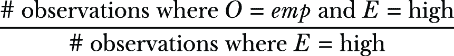

#### 贝叶斯估计

在第二章中，我也介绍了贝叶斯估计。它通常在数学上难以处理，并且依赖于计算成本高昂的算法（例如，采样算法和变分推断）。一个关键例外是**共轭先验**的情况，其中先验分布和目标（后验）分布具有相同的规范形式。这意味着代码实现只需用简单的数学计算目标分布的参数值，无需复杂的贝叶斯推断算法。

例如，pgmpy 实现了用于分类结果的*Dirichlet 共轭先验*。对于*P*(*O*|*E*=high)中的每个*O*值，我们都有一个概率值，我们希望从数据中推断这些概率值。贝叶斯方法为这些值分配一个先验分布。对于概率值集合的先验，一个好的选择是*Dirichlet 分布*，因为它定义在*单纯形*上，即介于零和一之间的数字之和为 1。此外，它对分类分布（如*P*(*O*|*E*=high)）是**共轭的**，这意味着参数值的后验分布也是一个 Dirichlet 分布。这意味着我们可以使用简单的数学计算概率值的点估计，结合数据中的计数和先验中的参数。pgmpy 为我们做这个数学计算。

##### 列表 3.5 使用 Dirichlet 共轭先验的贝叶斯点估计

```py
from pgmpy.estimators import BayesianEstimator #1
model.fit(
    data,
    estimator=BayesianEstimator,    #2
    prior_type="dirichlet",
    pseudo_counts=1    #3
) 
causal_markov_kernels = model.get_cpds()      #4
cmk_T = causal_markov_kernels[-1]     #4
print(cmk_T)  #4
```

#1 导入 BayesianEstimator 并在模型和数据上初始化它。

#2 将估计器对象传递给 fit 方法。

#3 pseudo_counts 指的是Δirichlet 先验的参数。

#4 提取因果马尔可夫核并查看 P(T|O,R)。

上述代码打印以下输出：

```py
+----------+--------------------+-----+--------------------+----------+
| O        | O(emp)             | ... | O(self)            | O(self)  |
+----------+--------------------+-----+--------------------+----------+
| R        | R(big)             | ... | R(big)             | R(small) |
+----------+--------------------+-----+--------------------+----------+
| T(car)   | 0.7007299270072993 | ... | 0.4166666666666667 | 0.5      |
+----------+--------------------+-----+--------------------+----------+
| T(other) | 0.1362530413625304 | ... | 0.3333333333333333 | 0.25     |
+----------+--------------------+-----+--------------------+----------+
| T(train) | 0.1630170316301703 | ... | 0.25               | 0.25     |
+----------+--------------------+-----+--------------------+----------+
```

与最大似然估计相比，具有 Dirichlet 先验的分类参数的贝叶斯估计作用像一个平滑机制。例如，最大似然参数估计表明，在小镇上的自雇人士中有 100%的人开车上班。这可能是极端的。当然，一些自雇人士骑自行车上班——我们只是没有设法调查他们中的任何一个人。一些小城市，如美国弗吉尼亚州的 Crystal City（人口 22,000），有地铁站。我敢打赌，那些城市中的至少几位企业家使用火车。

##### 因果模型构建者和贝叶斯主义者

贝叶斯哲学超越了仅仅参数估计的范围。事实上，贝叶斯哲学与基于 DAG 的因果建模有很多共同之处。贝叶斯主义者试图将主观信念、不确定性和先验知识编码到模型中变量的“先验”概率分布上。因果模型者试图将关于 DGP（数据生成过程）的主观信念和先验知识编码成因果 DAG 的形式。这两种方法是可以兼容的。给定一个因果 DAG，你可以对在因果 DAG 之上构建的概率模型进行贝叶斯推断。你甚至可以对 DAG 本身进行贝叶斯推断，并计算可能 DAG 的概率分布！

我在这本书中专注于因果性，并将贝叶斯讨论保持在最低限度。但我们将使用 Pyro 库（及其 NumPy-JAX 替代库 NumPyro）来实现因果模型；这些库为模型以及参数提供了完整的贝叶斯推断支持。在第十一章中，我们将查看一个使用我们从零开始构建的因果图模型进行因果效应贝叶斯推断的例子。

#### 其他参数估计技术

我们不需要使用条件概率表来表示因果马尔可夫核。在广义线性建模框架内存在用于建模分类结果的模型。对于运输模型中的某些变量，我们可能使用了非分类结果。例如，年龄可能在调查中被记录为整数结果。对于具有数值结果的变量，我们可能使用其他建模方法。您还可以使用神经网络架构来建模个体因果马尔可夫核。

*参数假设*指的是我们如何指定 DAG（有向无环图）中一个节点的结果（例如，类别或实数）以及我们如何将父节点映射到结果（例如，表格或神经网络）。请注意，因果 DAG 中编码的因果假设与因果马尔可夫核的参数假设是解耦的。例如，当我们假设年龄是教育水平的直接原因并将其编码到我们的 DAG 中作为一条边时，我们不必决定是否将年龄视为有序的类别集合、整数或自出生以来经过的秒数等。此外，我们也不必知道是否要使用条件分类分布或回归模型。这一步骤是在我们指定因果 DAG 并想要实现 *P*(*E*|*A*, *S*) 之后进行的。

类似地，当我们对一个训练好的因果模型进行预测和概率推理时，关于使用哪种推理或预测算法的考虑，虽然很重要，但与我们的因果问题相分离。这种分离简化了我们的工作。通常，我们可以在因果建模和推理方面独立于我们对统计学、计算贝叶斯和应用的机器学习的知识来构建我们的知识和技能集。

### 3.1.10 存在潜在变量时的参数学习

由于我们正在建模 DGP 而不是数据，因此因果 DAG 中的某些节点可能不会在数据中观察到。幸运的是，概率机器学习为我们提供了学习潜在变量因果马尔可夫核参数的工具。

#### 使用 pgmpy 学习潜在变量

为了说明，假设交通调查数据中的教育变量没有被记录。pgmpy 通过使用一种称为结构化期望最大化的算法，为我们提供了一个学习潜在 *E* 的因果马尔可夫核参数的实用工具，这是一种最大似然参数学习的一个变体。

##### 列表 3.6 使用潜在变量训练因果图模型

```py
import pandas as pd
from pgmpy.models import BayesianNetwork
from pgmpy.estimators import ExpectationMaximization as EM
url='https://raw.githubusercontent.com/altdeep/causalML/master/datasets
↪/transportation_survey.csv'     #1
data = pd.read_csv(url)    #1
data_sans_E = data[['A', 'S', 'O', 'R', 'T']]    #2
model_with_latent = BayesianNetwork(
       [
        ('A', 'E'),
        ('S', 'E'),
        ('E', 'O'),
        ('E', 'R'),
        ('O', 'T'),
        ('R', 'T')
     ],
     latents={"E"}    #3
)
estimator = EM(model_with_latent, data_sans_E)     #4
cmks_with_latent = estimator.get_parameters(latent_card={'E': 2})    #4
print(cmks_with_latent[1].to_factor())    #5
```

#1 下载数据并将其转换为 pandas DataFrame。

#2 保留除教育（E）之外的所有列。

#3 训练模型时指出哪些变量是潜在的。

#4 运行结构化期望最大化算法来学习 E 的因果马尔可夫核。你必须指出潜在变量的基数。

#5 打印出学习到的 E 的因果马尔可夫核。为了可读性，将其打印为因子对象。

`print` 行打印一个因子对象。

```py
+------+----------+------+--------------+
| E    | A        | S    |   phi(E,A,S) |
+======+==========+======+==============+
| E(0) | A(adult) | S(F) |       0.1059 |
+------+----------+------+--------------+
| E(0) | A(adult) | S(M) |       0.1124 |
+------+----------+------+--------------+
| E(0) | A(old)   | S(F) |       0.4033 |
+------+----------+------+--------------+
| E(0) | A(old)   | S(M) |       0.2386 |
+------+----------+------+--------------+
| E(0) | A(young) | S(F) |       0.4533 |
+------+----------+------+--------------+
| E(0) | A(young) | S(M) |       0.6080 |
+------+----------+------+--------------+
| E(1) | A(adult) | S(F) |       0.8941 |
+------+----------+------+--------------+
| E(1) | A(adult) | S(M) |       0.8876 |
+------+----------+------+--------------+
| E(1) | A(old)   | S(F) |       0.5967 |
+------+----------+------+--------------+
| E(1) | A(old)   | S(M) |       0.7614 |
+------+----------+------+--------------+
| E(1) | A(young) | S(F) |       0.5467 |
+------+----------+------+--------------+
| E(1) | A(young) | S(M) |       0.3920 |
+------+----------+------+--------------+
```

*E* 的结果为 0 和 1，因为算法不知道结果名称。也许 0 是“高”（高中）而 1 是“uni”（大学），但将默认结果从潜在变量估计方法映射到这些结果名称需要进一步的假设。

当存在潜在变量时，还有其他算法用于学习参数，包括一些使用特殊参数假设（即关于潜在变量如何与观测变量相关的函数假设）的算法。

#### 潜在变量和识别

在统计推断中，我们说一个参数是“可识别的”，当理论上在给定数据中的无限多个示例的情况下，可以学习到它的真实值。如果更多的数据不能让你更接近学习它的真实值，那么它是“不可识别的”。不幸的是，你的数据可能不足以学习你的因果 DAG 中潜在变量的因果马尔可夫核。如果我们不关心表示因果关系，我们可以限制自己使用可从数据中识别的潜在变量的潜在变量图模型。但我们必须构建一个表示 DGP 的因果 DAG，即使我们无法根据数据识别潜在变量和参数。

话虽如此，即使你在你的因果模型中有不可识别的参数，你仍然可能能够识别出回答你因果问题的数量。实际上，因果推断方法的大部分内容都集中在稳健地估计因果效应（一个原因对效应的影响程度）上，即使存在潜在的“混杂因素”。我们将在第十一章中详细讨论这一点。另一方面，即使你的参数被识别，回答你因果问题的数量可能没有被识别。我们将在第十章中详细讨论因果识别。

### 3.1.11 使用训练好的因果概率机器学习模型进行推理

一组变量的概率机器学习模型可以使用计算推理算法来推断任何变量子集的条件的概率，给定其他变量的结果。我们使用变量消除算法来处理具有分类结果的定向图形模型（在第二章中介绍）。

例如，假设我们想要比较汽车驾驶员和火车乘客的教育水平。我们可以通过变量消除，一个表格图形模型的推理算法，来计算并比较当 *T*=car 和当 *T*=train 时的 *P*(*E*|*T*)。

##### 列表 3.7 在训练好的因果图形模型上进行推理

```py
from pgmpy.inference import VariableElimination    #1
inference = VariableElimination(model)     
query1 = inference.query(['E'], evidence={"T": "train"})
query2 = inference.query(['E'], evidence={"T": "car"})
print("train")
print(query1)
print("car")
print(query2)
```

#1 VariableElimination 是一种针对图形模型的特定推理算法。

这将打印出“train”和“car”的概率表。

```py
"train"
+---------+----------+
| E       |   phi(E) |
+=========+==========+
| E(high) |   0.6162 |
+---------+----------+
| E(uni)  |   0.3838 |
+---------+----------+
"car"
+---------+----------+
| E       |   phi(E) |
+=========+==========+
| E(high) |   0.5586 |
+---------+----------+
| E(uni)  |   0.4414 |
+---------+----------+
```

看起来汽车驾驶员比火车乘客更有可能拥有大学教育：(*P*(*E*='uni'|*T*='car') > *P*(*E*='uni'|*T*='train')。这个推断基于我们的基于 DAG 的因果假设，即大学教育间接决定了人们如何去工作。

在 Pyro 这样的工具中，您需要对推理算法进行更多手动操作。以下列表说明了使用名为重要性采样的概率推理算法推断 *P*(*E*|*T*="train") 的过程。首先，我们将指定模型。我们不会拟合参数，而是明确指定我们使用 pgmpy 拟合的参数值。

##### 列表 3.8 在 Pyro 中实现训练好的因果模型

```py
import torch
import pyro
from pyro.distributions import Categorical

A_alias = ['young', 'adult', 'old']     #1
S_alias = ['M', 'F']     #1
E_alias = ['high', 'uni']    #1
O_alias = ['emp', 'self']   #1
R_alias = ['small', 'big']    #1
T_alias = ['car', 'train', 'other']    #1

A_prob = torch.tensor([0.3,0.5,0.2])    #2
S_prob = torch.tensor([0.6,0.4])    #2
E_prob = torch.tensor([[[0.75,0.25], [0.72,0.28], [0.88,0.12]],    #2
                     [[0.64,0.36], [0.7,0.3], [0.9,0.1]]])     #2
O_prob = torch.tensor([[0.96,0.04], [0.92,0.08]])     #2
R_prob = torch.tensor([[0.25,0.75], [0.2,0.8]])     #2
T_prob = torch.tensor([[[0.48,0.42,0.1], [0.56,0.36,0.08]],     #2
                     [[0.58,0.24,0.18], [0.7,0.21,0.09]]])     #2

def model():    #3
   A = pyro.sample('age', Categorical(probs=A_prob))    #3
   S = pyro.sample('gender', Categorical(probs=S_prob))    #3
   E = pyro.sample('education', Categorical(probs=E_prob[S][A]))    #3
   O = pyro.sample('occupation', Categorical(probs=O_prob[E]))    #3
   R = pyro.sample('residence', Categorical(probs=R_prob[E]))   #3
   T = pyro.sample('transportation', Categorical(probs=T_prob[R][O]))   #3  
   Return {'A': A, 'S': S, 'E': E, 'O': O, 'R': R, 'T': T}     #3

pyro.render_model(model)     #4
```

#1 分类分布只返回整数，因此将整数映射到分类结果名称是有用的。

#2 为了简单起见，我们将使用 pgmpy 中 fit 方法学习到的参数的舍入版本（列表 3.4），尽管我们可以在训练过程中学习参数。

#3 当我们在 Pyro 中实现模型时，我们通过代码逻辑隐式地指定了因果 ΔAG。

#4 然后，我们可以使用 pyro.render_model() 生成隐含 ΔAG 的图。请注意，我们需要安装 Graphviz。

`pyro.render_model` 函数从 Pyro 模型中绘制了图 3.12 所示的隐含因果 DAG。


##### 图 3.12 您可以使用 `pyro.render_model()` 函数在 Pyro 中可视化因果 DAG。这假设您已安装 Graphviz。

Pyro 提供了概率推理算法，例如重要性采样，我们可以将其应用于我们的因果模型。

##### 列表 3.9 在 Pyro 中的因果模型上进行推理

```py
import numpy as np
import pyro
from pyro.distributions import Categorical
from pyro.infer import Importance, EmpiricalMarginal  #1
import matplotlib.pyplot as plt

conditioned_model = pyro.condition(    #2
    model,    #3
    data={'transportation':torch.tensor(1.)}    #3
)

m = 5000     #4
posterior = pyro.infer.Importance(    #5
    conditioned_model,    #5
    num_samples=m
).run()     #6

E_marginal = EmpiricalMarginal(posterior, "education")     #7
E_samples = [E_marginal().item() for _ in range(m)]   #7
E_unique, E_counts = np.unique(E_samples, return_counts=True)     #8
E_probs = E_counts / m    #8

plt.bar(E_unique, E_probs, align='center', alpha=0.5)     #9
plt.xticks(E_unique, E_alias)    #9
plt.ylabel('probability')    #9
plt.xlabel('education')     #9
plt.title('P(E | T = "train") - Importance Sampling')    #9
```

#1 我们将使用两个与推理相关的类，即 Importance 和 EmpiricalMarginal。

#2 pyro.condition 是对模型的一种条件操作。

#3 它接受模型和用于条件化的证据。证据是一个将变量名称映射到值的字典。在推理过程中需要指定变量名称，这就是为什么我们在 pyro.sample 的调用中有了名称参数。这里我们条件化 T="train"。

#4 我们将运行一个推理算法，该算法将生成 m 个样本。

#5 我使用一个名为重要性采样的推理算法。Importance 类构建了这个推理算法。它接受条件化模型和样本数量。

#6 使用 run 方法运行随机过程算法。推理算法将从我们未条件化的变量的联合概率（除了 T 以外的所有变量）生成，给定我们条件化的变量（T）。

#7 我们对教育条件的概率分布感兴趣，因此我们从后验中提取教育值。

#8 基于这些样本，我们对 P(E|T=“train”）中的概率进行蒙特卡洛估计。

#9 绘制学习概率的可视化。

这产生了图 3.13 中的图表。显示的概率接近于 pgmpy 模型的结果，尽管由于不同的算法和参数估计四舍五入到两位小数，它们略有不同。

这种概率推理还不是因果推理——我们将在第七章开始查看结合因果推理和概率推理的示例。在第八章中，你将看到如何使用概率推理来实现因果推理。现在，我们将探讨参数模块化的好处，以及参数如何编码因果不变性。


##### 图 3.13 P(E|T=“train”)分布的可视化

## 3.2 因果不变性和参数模块化

假设我们感兴趣于建模海拔和温度之间的关系。这两者显然是相关的；你爬得越高，天气就越冷。然而，你知道温度不会导致海拔，或者加热城市内的空气不会使城市飞起。海拔是原因，温度是结果。

我们可以提出一个简单的因果 DAG，我们认为它捕捉了温度和海拔之间的关系，以及其他原因，如图 3.14 所示。让我们让*A*代表海拔，*C*代表云量，*L*代表纬度，*S*代表季节，*T*代表温度。图 3.14 中的 DAG 有五个因果马尔可夫核：{*P*(*A*), *P*(*C*), *P*(*L*), *P*(*S*), *P*(*T*|*A*, *C*, *L*, *S*)}。


##### 图 3.14 室外温度的简单模型

要在 DAG 之上训练因果图模型，我们需要学习每个因果马尔可夫核的参数。

### 3.2.1 机制独立性和参数模块化

在我们温度有向无环图（DAG）中因果马尔可夫核的 DGP 中存在一些基本的动力学机制。例如，因果马尔可夫核*P*(*T*|*A*, *C*, *L*, *S*)是由基于物理机制的物理条件概率诱导的，其中海拔、云层覆盖、纬度和季节驱动温度。这种机制与确定云层覆盖的机制（根据我们的 DAG）是不同的。"机制独立性"指的是这种机制之间的区别。

机制的独立性导致了一种称为*参数模块化*的特性。在我们的模型中，对于每个因果马尔可夫核，我们选择因果马尔可夫核的参数化表示。如果*P*(*T*|*A*, *C*, *L*, *S*)和*P*(*C*)是不同的机制，那么我们对*P*(*T*|*A*, *C*, *L*, *S*)和*P*(*C*)的表示是不同机制的表示。这意味着我们可以改变一个表示，而不用担心这种改变如何影响其他表示。这种模块化在统计模型中是不常见的；你通常不能改变模型的一部分并期望另一部分不受影响。

这种独立性在训练过程中很有用。通常，当你训练一个模型时，你同时优化所有参数。参数模块化意味着你可以分别训练每个因果马尔可夫核的参数，或者将它们作为解耦集同时训练，这允许你在训练过程中享受一些维度降低。在贝叶斯术语中，参数集是先验独立的（尽管它们在后验中通常是相关的）。这为使用每个因果马尔可夫核参数集的独立先验分布提供了一个很好的因果理由。

### 3.2.2 因果迁移学习、数据融合和不变预测

你可能不是气候学家或气象学家。然而，你知道温度和海拔之间的关系与气压、气候、阳光等因素有关。你也知道，无论这种关系的物理性质是什么，在卡塔曼杜和埃尔帕索的物理性质是相同的。因此，当我们仅在卡塔曼杜收集的数据上训练因果马尔可夫核时，我们学习到的机制表示在卡塔曼杜和埃尔帕索之间是不变的。这种不变性有助于迁移学习；我们应该能够使用训练好的因果马尔可夫核来对埃尔帕索的温度进行推理。

当然，利用这种因果不变性的概念也有一些注意事项。例如，这假设你的因果模型是正确的，并且关于卡塔曼杜数据中潜在机制的足够信息可以有效地应用你在埃尔帕索学到的关于该机制的知识。

几种高级方法在很大程度上依赖于因果不变性和机制独立性。例如，*因果数据融合* 通过结合多个数据集来学习因果模型。*因果迁移学习* 使用因果不变性来使用训练数据域之外的数据进行因果推断。*因果不变性预测* 在预测任务中利用因果不变性。有关参考文献，请参阅[`www.altdeep.ai/p/causalaibook`](https://www.altdeep.ai/p/causalaibook)章节注释。

### 3.2.3 使用常识拟合参数

在温度模型中，我们对引起 *P*(*T*|*A*, *C*, *L*, *S*) 的机制有物理直觉。在非自然科学领域，如计量经济学和其他社会科学中，系统的“物理”更抽象，更难描述。幸运的是，我们可以在这些非自然科学领域依赖类似的基于不变性的直觉。在这些领域，我们仍然可以假设因果马尔可夫核对应于现实世界中的不同因果机制，假设模型是真实的。例如，回忆一下我们交通模型中的 *P*(*T*|*O*, *R*)。我们仍然假设潜在机制与其他机制不同；如果 *P*(*T*|*O*, *R*) 的潜在机制发生变化，只有 *P*(*T*|*O*, *R*) 应该改变——模型中的其他核不应该改变。如果某种东西改变了 *P*(*R*|*E*)（*R* 的因果马尔可夫核）的潜在机制，这种变化应该影响 *P*(*R*|*E*) 但不应影响 *P*(*T*|*O*, *R*) 的参数。

这种不变性可以帮助我们通过推理潜在的因果机制来估计参数，而无需进行统计学习。例如，让我们再次看看因果马尔可夫核 *P*(*R*|*E*)（回忆 *R* 是居住地，*E* 是教育）。让我们尝试通过推理来估计这个分布的参数，而不使用统计学习。

没有获得高中以上学位的人更有可能留在他们的家乡。然而，那些来自小镇并取得大学学位的人可能会搬到大城市，在那里他们可以应用他们的资历来获得更高薪的工作。

现在让我们来思考一下美国的 demographics。假设一个网络搜索告诉你，80% 的美国人口居住在城市地区（*P*(*R*=big) = .8），而 95% 的拥有大学学位的人居住在城市地区（*P*(*R*=big|*E*=uni) = .95）。此外，美国总体成年人口中有 25% 拥有大学学位（*P*(*E*=uni) = .25）。然后，通过一些简单的估算数学，你计算出你的概率值为 *P*(*R*=small|*E*=high)=.25，*P*(*R*=big|*E*=high) = .75，*P*(*R*=small|*E*=uni) = .05，和 *P*(*R*=big|*E*=uni) = .95。以这种方式计算参数的能力在数据不可用于参数学习时尤其有用。

## 3.3 你的因果问题定义了 DAG

当模型师第一次遇到问题时，通常已经有一组可用的数据，一个常见的错误是仅使用该数据中的变量来定义你的 DAG。让数据范围决定你的 DAG 是有吸引力的，因为你不必决定在 DAG 中包含哪些变量。但因果模型师建模的是 DGP，而不是数据。世界中的真实因果结构并不关心你的数据集中发生了什么。在你的因果 DAG 中，你应该包括与因果相关的变量，无论它们是否在你的数据集中。

但如果数据没有定义 DAG 的范围，那是什么定义的呢？虽然你的数据有一组固定的变量，但可能构成你的 DGP 的变量只受你的想象力所限。给定一个变量，你可以包括它的原因，这些原因的原因，这些原因的原因的原因，一直追溯到亚里士多德的“第一推动者”，即一切事物的单一原因。幸运的是，我们不需要追溯到那么远。让我们看看你可以用来选择在因果 DAG 中包含的变量的一个程序。

### 3.3.1 选择要包含在 DAG 中的变量

回想一下，存在几种类型的因果推断问题。正如我在第一章中提到的，因果效应推断是最常见的因果问题类型。我以因果效应推断为例，但这个工作流程适用于所有类型的因果问题。

1.  *包含与你的因果问题（s）相关的变量*——第一步是包含所有与你的因果问题相关的变量。如果你打算问多个问题，包括与这些问题相关的所有变量。作为一个例子，考虑图 3.15。假设我们打算询问*V*对*U*和*Y*的因果效应。这些就成为我们在 DAG 中首先包含的变量。

1.  *在第 1 步中包含任何变量的共同原因*——添加你在第一步中包含的变量的任何共同原因。在我们的例子中，你将从图 3.15 中的变量*U*、*V*和*Y*开始，追溯它们的因果谱系并识别共同的祖先。这些共同的祖先就是共同原因。在图 3.16 中，*W*[0]、*W*[1]和*W*[2]是*V*、*U*和*Y*的共同原因。

    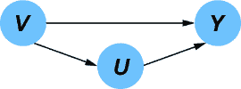

    ##### 图 3.15 首先包括与你的因果问题（s）相关的变量。在这里，假设你感兴趣的是询问关于*V*、*U*和*Y*的问题。

    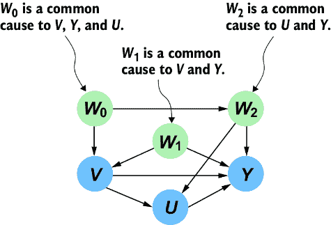

    ##### 图 3.16 满足因果充分性；包含来自第 1 步的变量的共同原因。

    在正式术语中，一个变量是变量对 *X* 和 *Y* 的共同原因 *Z*，如果存在从 *Z* 到 *X* 的有向路径，该路径不包括 *Y*，以及从 *Z* 到 *Y* 的有向路径，该路径不包括 *X*。包括共同原因的正式原则称为 *因果充分性*。一组变量是因果充分的，如果它不排除该组中任何一对变量之间的任何共同原因。此外，一旦包含了一个共同原因，就不必在相同路径上包含更早的共同原因。例如，图 3.17 展示了我们可以如何排除变量的早期共同原因。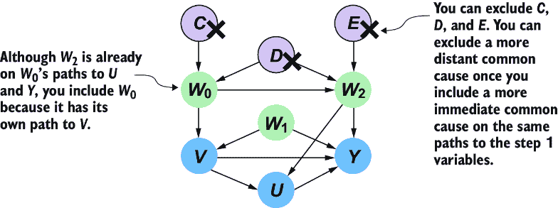

    ##### 图 3.17 一旦包含了一个共同原因，就不必在通往步骤 1 变量的相同路径上包含任何更早的共同原因。

    在图 3.17 中，*W*[2] 在 *W*[0] 通向 *Y* 和 *U* 的路径上，但我们包含 *W*[0]，因为它有自己的路径通向 *V*。相比之下，虽然 *C* 是 *V*、*Y* 和 *U* 的共同原因，但 *W*[0] 在 *C* 到 *V*、*Y* 和 *U* 的所有路径上，因此我们在包含 *W*[0] 后可以排除它。同样，*W*[2] 让我们可以排除 *E*，而 *W*[0] 和 *W*[2] 一起让我们可以排除 *D*。

1.  *包含在因果推断统计分析中可能有用的变量*——现在我们包含在您想要进行的因果推断统计方法中可能有用的变量。例如，在图 3.18 中，假设您对估计 *V* 对 *Y* 的因果效应感兴趣。您可能希望包括可能的“工具变量”。我们将在本书的第四部分正式定义这些变量，但就目前而言，在因果效应问题中，*工具* 是一个感兴趣变量的父变量，并且它可以帮助统计估计因果效应。在图 3.18 中，*Z* 可以作为工具变量。您不需要包含 *Z* 以满足因果充分性，但您可能选择包含它以帮助量化因果效应。

    ##### 图 3.18 包含在因果推断统计分析中可能有用的变量。*W* 是混杂因素，*Z* 是工具变量，*X* 是效应修饰因子，*Y* 是结果，*V* 是治疗，而 U 是前门中介。

    类似地，*X*[0] 和 *X*[1] 在分析 *Y* 的其他变异来源时也可能有用。我们可能可以利用它们来减少因果效应统计估计中的方差。或者，我们可能对因果效应的 *异质性*（因果效应在由 *X*[0] 和 *X*[1] 定义的群体子集中如何变化）感兴趣。我们将在第十一章中更详细地研究因果效应异质性。

1.  *包含帮助 DAG 传达完整故事的变量*——最后，包含任何有助于 DAG 更好地作为沟通工具的变量。考虑图 3.19 中的共同原因 *D*。

    ##### 图 3.19 包含帮助 DAG 讲述完整故事的变量。在这个例子中，尽管在第二步（图 3.17）中排除了*D*，但我们仍然可能希望包含*D*，如果它具有沟通价值的话。

    在图 3.17 中，我们得出结论，在包含共同原因*W*[0]和*W*[2]之后，可以排除共同原因*D*。但也许*D*是领域专家概念化领域的重要变量。虽然它对量化*V*对*U*和*Y*的因果效应没有帮助，但省略它可能会感觉有些不自然。如果是这样，包含它可能有助于 DAG 讲述更好的故事，通过展示关键变量如何与您包含的变量相关联。当您的因果 DAG 讲述一个令人信服的故事时，您的因果分析就更有说服力。

### 3.3.2 通过变量在推理中的作用包括因果 DAG 中的变量

许多因果推理专家倾向于不将他们的假设以因果 DAG 的形式写出，而是根据它们在因果推理计算中的*角色*指定一组相关变量。在计量经济学教学中，关注变量-角色-推理而不是因果 DAG 是常见的。这样的角色包括我之前已经介绍过的，如“共同原因”、“工具变量”和“效应调节因子”。同样，我们将在第十一章中正式定义这些。

目前，我想明确指出这并不是一个竞争性的范式。经济学家可能会说他们对*V*对*U*的因果效应感兴趣，条件是在某些“*效应调节因子*”下，并且他们计划使用“*工具变量*”来“*调整*”共同原因的影响。这些角色都对应于因果 DAG 中的结构；图 3.19 中*U*和*V*的共同原因包括*W*[0]、*W*[1]和*W*[2]。*Z*是一个工具变量，而*X*[0]和*X*[1]是效应调节因子。假设具有这些角色的变量对您的因果效应估计分析很重要，这隐含地假设您的 DGP 遵循具有这种结构的因果 DAG。

事实上，给定一组变量及其角色，我们可以在该集合上构建隐含的因果 DAG。DoWhy 因果推理库展示了如何做到这一点。

##### 列表 3.10 基于因果效应推理中的角色创建 DAG

```py
from dowhy import datasets

import networkx as nx
import matplotlib.pyplot as plt

sim_data = datasets.linear_dataset(     #1
    beta=10.0,
    num_treatments=1,    #2
    num_instruments=2,     #3
    num_effect_modifiers=2,     #4
    num_common_causes=5,     #5
    num_frontdoor_variables=1,   #6
    num_samples=100,

)

dag = nx.parse_gml(sim_data['gml_graph'])     #7
pos = {    #7
 'X0': (600, 350),    #7
 'X1': (600, 250),    #7
 'FD0': (300, 300),   #7
 'W0': (0, 400),   #7
 'W1': (150, 400),   #7
 'W2': (300, 400),   #7
 'W3': (450, 400),   #7
 'W4': (600, 400),   #7
 'Z0': (10, 250),    #7
 'Z1': (10, 350),    #7
 'v0': (100, 300),   #7
 'y': (500, 300)     #7
}    #7
options = {    #7
    "font_size": 12,    #7
    "node_size": 800,   #7
    "node_color": "white",   #7
    "edgecolors": "black",   #7
    "linewidths": 1,    #7
    "width": 1,    #7
}    #7
nx.draw_networkx(dag, pos, **options)    #7
ax = plt.gca()   #7
ax.margins(x=0.40)    #7
plt.axis("off")   #7
plt.show() #7
```

#1 datasets.linear_ dataset 从指定的变量生成ΔAG。

#2 添加一个处理变量，例如图 3.19 中的 V。

#3 图 3.19 中的 Z 是一个工具变量的例子；一个导致处理的原因，但其到达结果的单一路径是通过处理。在这里，我们创建了两个工具变量。

#4 图 3.19 中的 X [0]和 X [1]是帮助模型因果效应异质性的“效应调节因子”的例子。ΔoWhy 将这些定义为结果的其他原因（尽管它们不必是）。在这里，我们创建了两个效应调节因子。

#5 我们添加了 5 个共同原因，例如图 3.19 中的三个 W [0]、W [1]和 W [2]。与图 3.19 中这些变量之间微妙的结构不同，这里的结构将会简单。

#6 前门变量位于处理和效应之间的路径上，如图 3.19 中的 U。这里我们添加一个。

#7 此代码提取图，创建绘图布局，并绘制图形。

#8 此代码提取图，创建绘图布局，并绘制图形。

此代码生成图 3.20 中所示的 DAG。

这种基于角色的方法产生了一个简单的模板因果 DAG。它不会给你像图 3.19 中那样的细微差别，并且会排除我们在步骤 4 中添加的好的叙事变量，如图 3.19 中的*D*。但它足以应对预定义的因果效应查询。当与对 DAG 持怀疑态度但乐于讨论变量角色的人合作时，这是一个非常好的工具。但不要相信这种方法是无 DAG 的。DAG 只是隐含在角色指定的假设背后的。


##### 图 3.20 通过指定变量在因果效应推理中的作用构建的因果 DAG

这种模板方法也可以用于其他因果查询。你还可以使用这种方法在第一步中获得一个基本的因果 DAG，然后你可以在此基础上构建一个更细微的图。

## 3.4 展望：模型测试和将因果图与深度学习相结合

在构建因果有向无环图（DAG）时，最大的问题是“如果我的因果 DAG 是错误的怎么办？”我们如何对我们的选定的 DAG 有信心？在下一章中，我们将探讨如何使用数据来对因果 DAG 进行压力测试。一个关键的见解是，虽然数据永远不能证明因果 DAG 是正确的，但它可以帮助显示它何时是错误的。你还将了解因果发现，这是一组从数据中学习因果 DAG 的算法。

在本章中，我们探讨了使用 pgmpy 在 DAG 结构上构建简单的因果图形模型。在整个书中，你将看到如何构建更复杂的因果图形模型，这些模型利用神经网络和自动微分。即使在那些更复杂的模型中，因果马尔可夫性质和 DAG 的好处，包括因果不变性和参数模块化，仍然会存在。

## 摘要

+   因果有向无环图（DAG）可以表示我们对数据生成过程（DGP）的因果假设。

+   因果 DAG 是可视化并传达你的因果假设的有用工具。

+   DAGs 是计算机科学中的基本数据结构，并且允许我们使用许多快速算法来处理因果推断任务。

+   DAGs 通过因果马尔可夫性质将因果关系与条件独立性联系起来。

+   DAGs 可以为概率机器学习模型提供支架。

+   我们可以使用各种统计参数学习方法在 DAG 之上训练概率模型。这包括最大似然估计和贝叶斯估计。

+   给定一个因果有向无环图（DAG），模型构建者可以从 DAG 中因果马尔可夫核的各种参数化中选择，范围从条件概率表到回归模型再到神经网络。

+   一个因果充分集包含该集合中所有对之间的共同原因。

+   你可以通过从一组感兴趣的变量开始，将其扩展到因果充分集，添加对因果推断分析有用的变量，最后添加任何有助于有向无环图（DAG）传达完整故事的变量来构建一个因果有向无环图（DAG）。

+   每个因果马尔可夫核代表一种独特的因果机制，它决定了子节点如何由其父节点决定（假设有向无环图（DAG）是正确的）。

+   “机制独立性”指的是机制如何与其他机制区分开来——对一个机制的更改不会影响其他机制。

+   当你在因果有向无环图（DAG）上构建生成模型时，每个因果马尔可夫核的参数代表了对潜在因果机制的编码。这导致了“参数模块化”，这使得你可以单独学习每个参数集，甚至可以使用常识推理来估计参数而不是数据。

+   每个因果马尔可夫核代表一个独特的因果机制，这为高级任务（如迁移学习、数据融合和不变预测）提供了可利用的不变性来源。

+   你可以通过变量在特定因果推断任务中扮演的角色来指定一个 DAG。
