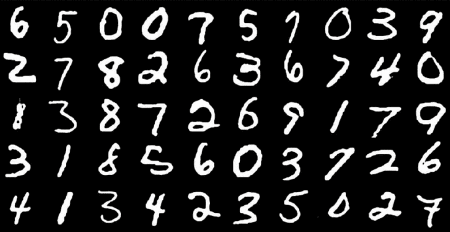
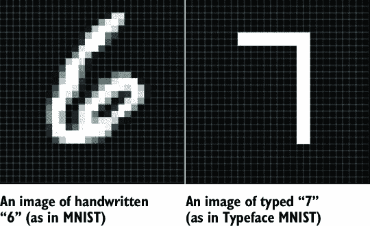
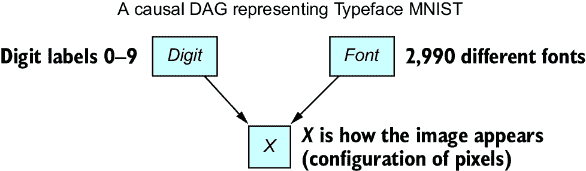
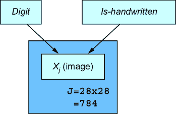
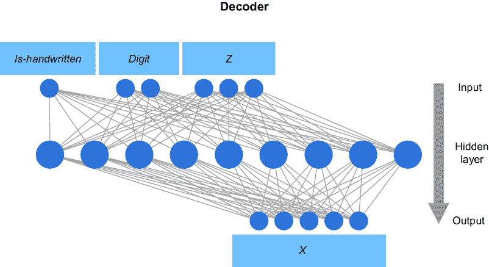
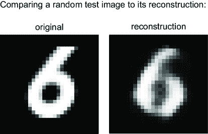
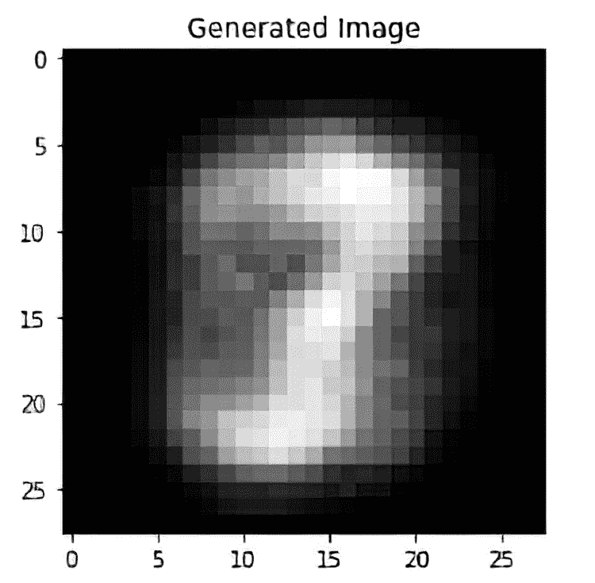
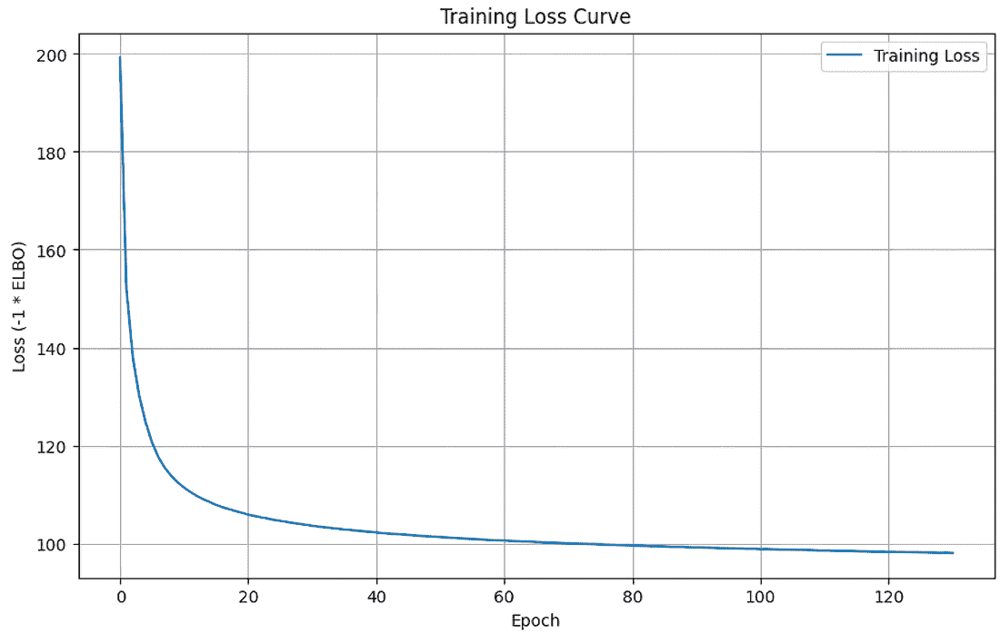

# 第五章：连接因果性和深度学习

### 本章涵盖

+   将深度学习融入因果图模型

+   使用变分自动编码器训练因果图模型

+   使用因果方法来增强机器学习

这本书的标题是《因果 AI》，但因果性究竟是如何与 AI 联系起来的？更具体地说，因果性是如何与深度学习联系起来的，深度学习是 AI 的主导范式？在本章中，我从两个角度来探讨这个问题：

+   *如何将深度学习融入因果模型*——我们将研究一个计算机视觉问题的因果模型（第 5.1 节），然后训练深度因果图像模型（第 5.2 节）。

+   *如何利用因果推理进行更好的深度学习*——我们将研究关于机制独立性和半监督学习的案例研究（第 5.3.1 节和 5.3.2 节），并使用因果性来揭示深度学习的神秘面纱（第 5.3.3 节）。

“深度学习”一词广泛指代深度神经网络的运用。这是一种机器学习方法，通过在序列层中堆叠许多非线性模型，模拟大脑中神经元的连接。“深度”指的是堆叠许多层以实现更强的建模能力，尤其是在建模高维和非线性数据方面，如视觉媒体和自然语言文本。“深度”一词指的是堆叠许多层以达到更强的建模能力，尤其是在建模高维和非线性数据方面，如视觉媒体和自然语言文本。神经网络已经存在了一段时间，但相对较近的硬件和自动微分技术的进步使得深度神经网络可以扩展到极其大的规模。正是这种扩展使得近年来，深度学习在许多高级推理和决策任务上超越了人类，例如图像识别、自然语言处理、游戏、医疗诊断、自动驾驶以及生成逼真的文本、图像和视频。

但询问深度学习如何与因果性联系起来可能会得到令人沮丧的答案。AI 公司的首席执行官和大型科技公司的领导者们炒作深度学习模型的力量，甚至声称它们可以学习世界的因果结构。另一方面，一些领先的研究人员声称这些模型仅仅是“随机鹦鹉”，它们可以回声相关模式，尽管这些模式细微而复杂，但仍然不足以达到真正的因果理解。

本章的目标是调和这些观点。但跳过前面的内容，主要的收获是深度学习架构可以集成到因果模型中，我们可以使用深度学习训练技术来训练模型。但不仅如此，我们还可以使用因果推理来构建更好的深度学习模型，并改进我们的训练方法。

我们将通过两个案例研究来巩固这一想法：

+   使用变分自动编码器为计算机视觉构建因果 DAG

+   利用机制独立性实现更好的半监督学习

在本书的其余部分，你将看到的因果与 AI 相互作用的其他示例将建立在我们从这些案例研究中获得的直觉之上。例如，第九章将使用本章我们将构建的变分自动编码器来展示反事实推理。在第十一章中，我们将探讨因果效应推断的机器学习和概率深度学习方法。第十三章将展示如何结合大型语言模型和因果推理。

我们将首先考虑如何将深度学习融入因果模型中。

## 5.1 计算机视觉问题的因果模型

让我们看看我们可以用因果 DAG 来处理的一个计算机视觉问题。回忆一下第一章中的 MNIST 数据，由数字图像及其标签组成，如图 5.1 所示。



##### 图 5.1 MNIST 数据，包括手写数字图像及其数字标签

有一个相关的数据集叫做 Typeface MNIST（TMNIST），它也包含数字图像及其数字标签。然而，与手写数字不同，图像是渲染在 2,990 种不同字体中的数字，如图 5.2 所示。对于每个图像，除了数字标签外，还有一个字体标签。字体标签的例子包括“GrandHotel-Regular”、“KulimPark-Regular”和“Gorditas-Bold”。


##### 图 5.2 Typeface MNIST 的示例，它由不同字体的数字组成。除了每个数字的数字标签外，还有一个标签表示 2,990 种不同字体（字体）中的一种。

在这次分析中，我们将将这些数据集合并为一个，并在该数据上构建一个简单的深度因果生成模型。我们将“字体”标签简化为一个样本二进制标签，表示 MNIST 图像为“手写”，TMNIST 图像为“打字”。

我们已经看到了如何在 DAG 之上构建因果生成模型。我们将联合分布分解为表示每个节点条件概率分布的因果马尔可夫核的乘积，这些核在 DAG 中基于其父节点。在我们之前的 pgmpy 示例中，我们为这些核中的每一个都拟合了一个条件概率表。

你可以想象使用条件概率表来表示图像中像素的条件概率分布会有多困难。但是，没有任何阻止我们用深度神经网络来建模因果马尔可夫核，我们知道它足够灵活，可以处理像像素这样的高维特征。在本节中，我将演示如何使用深度神经网络来建模由因果 DAG 定义的因果马尔可夫核。

### 5.1.1 利用通用函数逼近器

深度学习是一种高度有效的通用函数逼近器。让我们想象有一个函数将一组输入映射到一组输出，但我们要么不知道这个函数，要么很难用数学或代码表达它。给定足够的输入和输出的例子，深度学习可以以高精度近似该函数。即使该函数是非线性和高维的，只要有足够的数据，深度学习将学会一个好的近似。

我们经常在因果建模和推理中使用函数，有时对它们进行近似是有意义的，只要这些近似保留了我们关心的因果信息。例如，因果马尔可夫性质使我们感兴趣的是将因果有向图中节点父节点的值映射到该节点值（或概率值）的函数。

在本节中，我们将使用变分自编码器（VAE）框架来执行节点与其父节点之间的映射。在 VAE 中，我们将训练两个深度神经网络，其中一个将父原因变量映射到结果变量的分布，另一个将结果变量映射到原因变量的分布。这个例子将展示在因果是非线性和高维时深度学习的应用；效应变量将是一个表示为高维数组的图像，原因变量将代表图像的内容。

### 5.1.2 因果抽象和板模型

但构建图像的因果模型意味着什么呢？图像由排列成网格的像素组成。作为数据，我们可以将像素网格表示为数值矩阵，这些数值对应于颜色。在 MNIST 和 TMNIST 的情况下，图像是一个 28 × 28 的灰度值矩阵，如图 5.3 所示。



##### 图 5.3 展示了“6”的 MNIST 图像（左侧）和“7”的 TMNIST 图像。在它们的原始形式中，这些是 28 × 28 的数值矩阵，对应于灰度值。

一个典型的机器学习模型将这个 28 × 28 的像素矩阵视为 784 个特征。机器学习算法学习将像素及其标签连接起来的统计模式。基于这个事实，人们可能会倾向于将每个单独的像素视为朴素因果有向图中的一个节点，如图 5.4 所示，为了视觉上的简单，我画了 16 个像素（一个任意数）而不是所有的 784 个。


##### 图 5.4 一个由 4 × 4 矩阵表示的图像的朴素因果有向图可能看起来是什么样子

在图 5.4 中，存在从*数字*和*手写*变量到每个像素的边缘。此外，还有一些表示像素之间可能因果关系的边缘示例。像素之间的因果边缘意味着一个像素的颜色是另一个像素的原因。也许这些关系大多数都在节点之间，只有少数是远距离的。但我们如何知道一个像素是否导致另一个像素？如果两个像素相连，我们如何知道因果关系的方向？

#### 在正确的抽象层次上工作

仅用 16 个像素之间的这些连接，图 5.4 中的朴素 DAG 就已经相当难以处理了。如果用 784 个像素，情况会更糟。除了 DAG 的难以处理之外，像素级模型的问题在于我们的因果问题通常不是在像素级别——我们可能永远不会问“这个像素对这个像素的因果效应是什么？”换句话说，像素的抽象层次太低，这就是为什么考虑单个像素之间的因果关系感觉有点荒谬。

在应用统计学领域，如计量经济学、社会科学、公共卫生和商业，我们的数据有诸如人均收入、收入、位置、年龄等变量。这些变量通常已经是我们获取数据时想要思考的抽象层次。但现代机器学习专注于从原始媒体（如图像、视频、文本和传感器数据）中提取的许多感知问题。我们通常不希望在低级特征上进行因果推理。我们的因果问题通常关于这些低级特征背后的高级抽象。我们需要在这些更高抽象层次上建模。

我们不会考虑单个像素，而是会考虑整个图像。我们将定义一个变量*X*来表示图像的外观；即，*X*是一个表示像素的矩阵随机变量。图 5.5 说明了 TMNIST 案例的因果 DAG。简单来说，数字（0-9）和字体（2,990 种可能值）是原因，图像是结果。



##### 图 5.5 表示 Typeface MNIST 背后隐含 DGP 的简单因果 DAG

在这种情况下，我们使用因果 DAG 来做出一个断言，即标签导致图像。这并不总是情况，正如我们将在 5.3 节讨论的半监督学习案例研究中讨论的那样。与所有因果模型一样，它取决于一个领域内的数据生成过程（DGP）。

##### 为什么说数字*导致*了图像？

柏拉图的洞穴寓言描述了一群人，他们一生都在洞穴中生活，从未见过世界。他们面对一个空白的洞穴墙壁，并观看从他们身后火堆前经过的物体在墙壁上投射的影子。这些影子是真实物体经过火堆前的简化且有时扭曲的表示。在这种情况下，我们可以认为物体的形式是影子的原因。

类似地，数字标签的真实形式导致图像中的表示。MNIST 图像是由人们书写的，他们心中有一个想要渲染到纸上的数字的柏拉图理想。在这个过程中，这个理想受到手的运动变化、纸张的角度、笔在纸上的摩擦以及其他因素的影响——渲染的图像是那个“理想”的“影子”。

这个想法与计算机视觉中称为“视觉作为逆图形”的概念相关（有关更多信息，请参阅[`www.altdeep.ai/p/causalaibook`](https://www.altdeep.ai/p/causalaibook)）。在因果的术语中，要点是当我们分析从环境原始信号渲染的图像时，如果任务是推断导致这些信号的实际物体或事件，因果性从这些物体或事件流向信号。推断任务是使用观察到的信号（洞穴墙壁上的影子）来推断原因的性质（火堆前的物体）。

话虽如此，图像也可以是原因。例如，如果你正在模拟人们在移动应用中看到图像后的行为（例如，他们是否“点击”、“点赞”或“向左滑动”），你可以将图像建模为导致该行为的原因。

#### 板模型

在我们的 TMNIST 数据中建模 2,990 种字体对于我们的目的来说过于冗余。相反，我将这些数据集合并为一个——一半来自 MNIST，一半来自 Typeface MNIST。除了“数字”标签外，我还要有一个简单的二进制标签，称为“is-handwritten”，对于 MNIST 的手写数字图像为 1（真实），对于 TMNIST 的“打字”数字图像为 0（假）。我们可以修改我们的因果 DAG 以获得图 5.6。


##### 图 5.6 表示 MNIST 和 TMNIST 数据组合的因果 DAG，其中“is-handwritten”为 1（MNIST 图像）或 0（TMNIST 图像）

板模型是一种在概率机器学习中使用的可视化技术，它提供了一种在保留低级维度细节的同时，可视化高级抽象的绝佳方法。板符号是一种在 DAG（例如，图 5.4 中的*X*[1]到*X*[16]）中视觉表示重复变量的方法——在我们的情况下，我们有像素的重复。

我们不是将每个 784 个像素作为单独的节点来绘制，而是使用矩形或“板”将重复变量分组到子图中。然后我们在板上写一个数字来表示板上实体的重复次数。板可以嵌套在另一个板中，以表示嵌套在重复实体中的重复实体。每个板都有一个字母下标，用于索引该板上的元素。图 5.7 中的因果 DAG 代表一个图像。



##### 图 5.7 展示了因果 DAG 的板模型表示。板代表重复变量，在这种情况下是 28 × 28 = 784 像素。*X**[j]*是第*j*个像素。

在训练过程中，我们将有一大批训练图像。接下来，我们将修改 DAG 以捕获训练数据中的所有图像。

## 5.2 训练神经因果模型

为了训练我们的神经因果模型，我们需要加载数据并准备，创建我们模型的架构，编写训练过程，并实现一些评估训练进展的工具。我们将首先加载数据并准备。

### 5.2.1 设置训练数据

我们的训练数据包含*N*个示例图像，因此我们需要我们的板模型来表示训练数据中的所有*N*个图像，一半是手写的，一半是打印的。我们将在图 5.8 中添加另一个板，对应于重复*N*组图像和标签。


##### 图 5.8 展示了包含数据中*N*个图像的因果模型，并添加了一个额外的板。

现在我们有一个因果 DAG，它展示了我们希望达到的因果抽象水平以及我们开始训练模型中的神经网络所需的维度信息。

让我们先加载 Pyro 和其他一些库，并设置一些超参数。

##### 设置你的环境

这段代码使用 Python 3.10.12 版本编写，并在 Google Colab 中进行测试。主要库的版本包括 Pyro (pyro-ppl) 1.8.4、torch 2.2.1、torchvision 0.18.0+cu121 和 pandas 2.0.3。我们还将使用 matplotlib 进行绘图。

访问[`www.altdeep.ai/p/causalaibook`](https://www.altdeep.ai/p/causalaibook)获取一个笔记本的链接，该笔记本将在 Google Colab 中加载。

如果您的设备上有 GPU，使用 CUDA（一个在 GPU 上并行计算的平台）训练神经网络将更快。我们将运行一些代码来切换它。如果您没有 GPU 或者不确定是否有，请将`USE_CUDA`设置为`False`。

##### 列表 5.1 设置 GPU 训练

```py
import torch   
USE_CUDA = False   #1
DEVICE_TYPE = torch.device("cuda" if USE_CUDA else "cpu")
```

#1 如果可用，使用 CUDA。

首先，我们将创建一个`Dataset`类的子类（用于加载数据和预处理数据的类），这将使我们能够结合 MNIST 和 TMNIST 数据集。

##### 列表 5.2 合并数据

```py
from torch.utils.data import Dataset

import numpy as np
import pandas as pd
from torchvision import transforms

class CombinedDataset(Dataset):    #1
    def __init__(self, csv_file):
        self.dataset = pd.read_csv(csv_file)

    def __len__(self):
        return len(self.dataset)

    def __getitem__(self, idx):
        images = self.dataset.iloc[idx, 3:]     #2
        images = np.array(images, dtype='float32')/255\.   #2
        images = images.reshape(28, 28)    #2
        transform = transforms.ToTensor()     #2
        images = transform(images)     #2
        digits = self.dataset.iloc[idx, 2]     #3
        digits = np.array([digits], dtype='int')     #3
        is_handwritten = self.dataset.iloc[idx, 1]     #4
        is_handwritten = np.array([is_handwritten], dtype='float32')    #4
        return images, digits, is_handwritten    #5
```

#1 此类加载并处理结合 MNIST 和 Typeface MNIST 的数据集。输出是一个 torch.utils.data.Dataset 对象。

#2 加载、归一化和重塑图像为 28 × 28 像素。

#3 获取和处理数字标签，0–9。

#4 1 对于手写数字（MNIST），以及 0 对于“输入”数字（TMNIST）

#5 返回一个包含图像、数字标签和 is_handwritten 标签的元组。

接下来，我们将使用 `DataLoader` 类（它允许在训练期间高效地进行数据迭代和批处理）从 GitHub 中的 CSV 文件加载数据，并将其分为训练集和测试集。

##### 列表 5.3 下载、分割和加载数据

```py
from torch.utils.data import DataLoader
from torch.utils.data import random_split

def setup_dataloaders(batch_size=64, use_cuda=USE_CUDA):     #1
    combined_dataset = CombinedDataset(
"https://raw.githubusercontent.com/altdeep/causalML/master/datasets
↪/combined_mnist_tmnist_data.csv"
    )
    n = len(combined_dataset)     #2
    train_size = int(0.8 * n)    #2
    test_size = n - train_size    #2
    train_dataset, test_dataset = random_split(     #2
        combined_dataset,   #2
        [train_size, test_size],    #2
        generator=torch.Generator().manual_seed(42)   #2
    )     #2
    kwargs = {'num_workers': 1, 'pin_memory': use_cuda} #2
    train_loader = DataLoader(     #3
        train_dataset,     #3
        batch_size=batch_size,     #3
        shuffle=True,     #3
        **kwargs    #3
    )     #3
    test_loader = DataLoader(   #3
        test_dataset,    #3
        batch_size=batch_size,    #3
        shuffle=True,     #3
        **kwargs   #3
    )     #3
    return train_loader, test_loader
```

#1 设置数据加载器，用于加载数据并将其分为训练集和测试集。

#2 将 80% 的数据分配给训练数据，剩余的 20% 分配给测试数据。

#3 创建训练和测试加载器。

接下来，我们将设置完整的变分自编码器。

### 5.2.2 设置变分自编码器

变分自编码器（VAE）可能是最简单的深度概率机器学习建模方法。在将 VAE 应用于图像的典型设置中，我们引入一个比图像数据维度小的潜在连续变量 *Z*。在这里，*维度*指的是数据向量表示中的元素数量。例如，我们的图像是一个 28 × 28 的像素矩阵，或者也可以是一个维度为 28 × 28 = 784 的向量。由于比图像维度小得多，潜在变量 *Z* 代表了图像信息的压缩编码。对于数据集中的每个图像，都有一个相应的潜在 *Z* 值，它代表了该图像的编码。这种设置如图 5.9 所示。


##### 图 5.9 因果 DAG 盘模型，扩展以包括一个“编码”变量 *Z*。在训练期间，该变量是潜在的，由虚线表示。（在模型部署后，*digit* 和 *is-handwritten* 也都是潜在的）。

*Z* 在因果 DAG 中表现为一个新的父节点，但需要注意的是，经典的 VAE 框架并没有将 *Z* 定义为因果的。现在我们正在进行因果思考，我们将 *Z* 给予因果解释。具体来说，作为 DAG 中图像节点的父节点，我们将 *digit* 和 *is-handwritten* 视为图像中我们所看到的因果驱动因素。然而，图像中还有其他元素（例如，手写字符的笔画粗细或输入字符的字体）也是我们所看到的图像的因果因素。我们将 *Z* 视为所有这些我们未明确建模的图像因果因素的连续潜在“替身”，例如 *digit* 和 *is-handwritten*。这些因果因素的例子包括 TMNIST 标签中各种字体的细微差别以及由于不同作者和书写时的运动方式而导致的书写数字的所有变化。考虑到这一点，我们可以将 *P*(*X*| *digit*, *is-handwritten*, *Z*) 视为 *X* 的因果马尔可夫核。话虽如此，重要的是要记住，我们为 *Z* 学习到的表示是潜在因果的替身，并不等同于学习实际的潜在因果。

VAE 设置将训练两个深度神经网络：一个称为“编码器”，它将图像编码为 *Z* 的一个值。另一个神经网络，称为“解码器”，将与我们的 DAG 对齐。解码器将从 *digit* 标签、*is-handwritten* 标签和 *Z* 值生成图像，如图 5.10 所示。

解码器的作用像一个渲染引擎；给定一个 *Z* 编码值和 *digit* 以及 *is-handwritten* 的值，它将渲染一个图像。



##### 图 5.10 解码器神经网络从输入 *Z* 和标签 *is-handwritten* 以及 *digit* 生成输出图像 *X*。与任何神经网络一样，输入通过一个或多个“隐藏层”进行处理。

##### 到目前为止的关键 VAE 概念

*变分自编码器 (VAE)*——深度生成建模中的一种流行框架。我们正在使用它来模拟因果马尔可夫核中的因果模型。

*解码器*——我们使用解码器作为因果马尔可夫核的模型。它将观察到的原因 *is-handwritten* 和 *digit* 以及潜在变量 *Z* 映射到我们的图像结果变量 *X*。

这种 VAE 方法允许我们使用神经网络，类似于解码器，来捕捉建模图像作为由 *digit* 和 *is-handwritten* 造成的效应所需的复杂和非线性关系。使用我们之前讨论过的条件概率表和其他简单的因果马尔可夫核参数化来建模图像将是困难的。

首先，让我们实现解码器。我们将传递 `z_dim` 作为 *Z* 的维度和 `hidden_dim` 作为隐藏层（宽度）的维度。当我们实例化完整的 VAE 时将指定这些变量。解码器将潜在向量 *Z* 与额外的输入相结合——代表 *digit* 的变量和 *is-handwritten*（一个指示数字是否手写的二进制指示符）。它将生成一个 784 维的输出向量，代表大小为 28 × 28 像素的图像。这个输出向量包含每个像素的伯努利分布的参数，本质上是对每个像素“开启”的可能性的建模。该类使用两个全连接层（`fc1` 和 `fc2`），并采用 `Softplus` 和 `Sigmoid` “激活函数”，这是神经网络模拟神经元的特点。

##### 列表 5.4 实现解码器

```py
from torch import nn

class Decoder(nn.Module):    #1
    def __init__(self, z_dim, hidden_dim):
        super().__init__()
        img_dim = 28 * 28     #2
        digit_dim = 10    #3
        is_handwritten_dim = 1    #4
        self.softplus = nn.Softplus()     #5
        self.sigmoid = nn.Sigmoid()    #5
        encoding_dim = z_dim + digit_dim + is_handwritten_dim     #6
        self.fc1 = nn.Linear(encoding_dim, hidden_dim)   #6
        self.fc2 = nn.Linear(hidden_dim, img_dim)    #7

    def forward(self, z, digit, is_handwritten):     #8
        input = torch.cat([z, digit, is_handwritten], dim=1) #9
        hidden = self.softplus(self.fc1(input))    #10
        img_param = self.sigmoid(self.fc2(hidden))    #11
        return img_param
```

#1 用于 VAE 中的解码器的类

#2 图像大小为 28 × 28 像素。

#3 数字是 0-9 的一热编码数字，即长度为 10 的向量。

#4 一个指示数字是否手写的指示符，大小为 1

#5 Softplus 和 sigmoid 是在层之间映射时使用的非线性变换（激活函数）。

#6 fc1 是一个线性函数，它将 Z 向量、数字和 is_handwritten 映射到一个线性输出，该输出通过 softplus 激活函数传递，创建一个隐藏层——其长度由 hidden_layer 给出。

#7 fc2 线性地将隐藏层映射到传递给 sigmoid 函数的输出。得到的值介于 0 和 1 之间。

#8 定义从潜在变量 Z 的值到生成变量 X 的值的正向计算。

#9 结合 Z 和标签。

#10 计算隐藏层。

#11 将隐藏层传递给线性变换，然后传递给 sigmoid 变换以输出长度为 784 的参数向量。向量的每个元素对应于图像像素的伯努利参数值。

我们在因果模型中使用解码器。我们的因果 DAG 作为因果概率机器学习模型的支架，该模型在解码器的帮助下定义了关于{*is-handwritten*，*digit*，*X*，*Z*}的联合概率分布，其中*Z*是潜在的。我们可以使用该模型来计算给定*Z*值的训练数据的似然。

潜在变量`z`，以一位热向量`digit`表示的数字身份，以及二进制指示符`is_handwritten`被建模为来自标准分布的样本。然后这些变量被输入到解码器中，以产生表示图像单个像素概率的伯努利分布的参数（`img_param`）。

注意，使用伯努利分布来模拟像素是一种折衷的方法。像素不是二进制的黑白结果——它们有灰度值。`dist.enable_validation(False)`这一行让我们通过解码器的`img_param`输出为图像获得伯努利对数似然而作弊。

以下模型代码是 PyTorch 神经网络模块的一个类方法。我们稍后会看到整个类。

##### 列表 5.5 因果模型

```py
import pyro
import pyro.distributions as dist

dist.enable_validation(False)    #1
def model(self, data_size=1):     #2
    pyro.module("decoder", self.decoder)    #2
    options = dict(dtype=torch.float32, device=DEVICE_TYPE)
    z_loc = torch.zeros(data_size, self.z_dim, **options)    #3
    z_scale = torch.ones(data_size, self.z_dim, **options)   #3
    z = pyro.sample("Z", dist.Normal(z_loc, z_scale).to_event(1))    #3
    p_digit = torch.ones(data_size, 10, **options)/10     #4
    digit = pyro.sample(     #4
        "digit",    #4
        dist.OneHotCategorical(p_digit)     #4
    )    #4
    p_is_handwritten = torch.ones(data_size, 1, **options)/2     #5
    is_handwritten = pyro.sample(    #5
        "is_handwritten",     #5
        dist.Bernoulli(p_is_handwritten).to_event(1)     #5
    )     #5
    img_param = self.decoder(z, digit, is_handwritten)   #6
    img = pyro.sample("img", dist.Bernoulli(img_param).to_event(1))   #7
    return img, digit, is_handwritten
```

#1 禁用分布验证使 Pyro 能够在像素不是二进制值的情况下计算对数似然。

#2 单个图像的模型。在方法内部，我们将解码器，一个 PyTorch 模块，注册到 Pyro。这使 Pyro 了解解码器网络内部的参数。

#3 我们对 Z、数字和 is_handwritten 的联合概率进行建模，每个都从标准分布中进行采样。我们从具有位置参数 z_loc（所有为零）和尺度参数 z_scale（所有为一）的多变量正态分布中采样 Z。

#4 我们还从一位热分类分布中采样数字。每个数字被分配相同的概率。

#5 我们同样从伯努利分布中采样 is_handwritten 变量。

#6 解码器将数字、is_handwritten 和 Z 映射到一个概率参数向量。

#7 参数向量被传递到伯努利分布，该分布模拟数据中的像素值。像素在技术上不是伯努利二元变量，但我们将放宽这个假设。

前面的`model`方法表示一个图像的 DGP。以下列表中的`training_model`方法将`model`方法应用于训练数据中的*N*个图像。

##### 列表 5.6 应用`model`到数据中*N*个图像的方法

```py
def training_model(self, img, digit, is_handwritten, batch_size):     #1
    conditioned_on_data = pyro.condition(     #2
        self.model,
        data={
            "digit": digit,
            "is_handwritten": is_handwritten,
            "img": img
        }
    )
    with pyro.plate("data", batch_size): #3
        img, digit, is_handwritten = conditioned_on_data(batch_size)
    return img, digit, is_handwritten
```

#1 模型表示一个图像的 DGP。`training_model`方法将此模型应用于训练数据中的 N 个图像。

#2 现在我们将模型条件化在训练数据中的证据上。

#3 此上下文管理器代表图 5.9 中数据中重复的独立同分布(IID)示例的 N 大小板。在这种情况下，N 是批大小。它像一个 for 循环，遍历批处理中的每个数据单元。

我们的概率机器学习模型建模了联合分布{*Z*, *X*, *digit*, *is-handwritten*}。但由于*Z*是潜在的，该模型将需要学习*P*(*Z*|*X*, *digit*, *is-handwritten*)。鉴于我们使用解码器神经网络从*Z*和标签到*X*，给定*X*和标签的*Z*的分布将是复杂的。我们将使用*变分推断*，这是一种技术，我们首先定义一个近似分布*Q*(*Z*|*X*, *digit*, *is-handwritten*)，并尝试使该分布尽可能接近*P*(*Z*|*X*, *digit*, *is-handwritten*)。

近似分布的主要成分是 VAE 框架中的第二个神经网络，即编码器，如图 5.11 所示。编码器将训练数据中的观察图像及其标签映射到潜在*Z*变量。


##### 图 5.11 编码器将实际图像作为输入映射到潜在*Z*变量作为输出。

编码器负责将图像中的信息压缩到低维编码。

##### 到目前为止的关键 VAE 概念

*变分自动编码器(VAE)*—深度生成建模中流行的框架。我们正在使用它来模拟因果马尔可夫核。

*解码器*—我们将解码器用作因果马尔可夫核的模型。它将观察到的原因*is-handwritten*和*digit*，以及潜在变量*Z*，映射到我们的图像结果变量*X*。

*编码器*—编码器将图像、*digit*和*is-handwritten*指示符映射到分布的参数，我们可以从中抽取*Z*的样本。

在以下代码中，编码器将图像、数字标签和*is-handwritten*指示符作为输入。这些输入被连接并通过一系列具有 Softplus 激活函数的全连接层传递。编码器的最终输出由两个向量组成，分别代表潜在空间分布*Z*上的位置(`z_loc`)和尺度(`z_scale`)参数，给定观察到的*image*(`img`)、*digit*(`digit`)和*is-handwritten*(`is_handwritten`)值。

##### 列表 5.7 实现编码器

```py
class Encoder(nn.Module):     #1
    def __init__(self, z_dim, hidden_dim):
        super().__init__()
        img_dim = 28 * 28     #2
        digit_dim = 10  #3
        is_handwritten_dim = 1
        self.softplus = nn.Softplus()    #4
        input_dim = img_dim + digit_dim + is_handwritten_dim     #5
        self.fc1 = nn.Linear(input_dim, hidden_dim)   #5
        self.fc21 = nn.Linear(hidden_dim, z_dim) #6
        self.fc22 = nn.Linear(hidden_dim, z_dim)    #6

    def forward(self, img, digit, is_handwritten):    #7
        input = torch.cat([img, digit, is_handwritten], dim=1)     #8
        hidden = self.softplus(self.fc1(input))    #9
        z_loc = self.fc21(hidden)     #10
        z_scale = torch.exp(self.fc22(hidden))  #10
        return z_loc, z_scale
```

#1 编码器是 PyTorch 模块的一个实例。

#2 输入图像是 28 × 28 = 784 像素。

#3 数字维度为 10。

#4 在编码器中，我们只使用 softplus 变换（激活函数）。

#5 线性变换 fc1 与 softplus 结合，将 784 维像素向量、10 维数字标签向量和 2 维 is_handwritten 向量映射到隐藏层。

#6 线性变换 fc21 和 fc22 将与 softplus 结合，将隐藏向量映射到 Z 的向量空间。

#7 定义从观察到的 X 变量值到潜在 Z 变量值的反向计算。

#8 将图像向量、数字标签和 is_handwritten 标签合并为一个输入。

#9 将输入映射到隐藏层。

#10 VAE 框架将从近似 P(Z|img, digit, is_handwritten)的正态分布中采样 Z。最终的转换将隐藏层映射到该正态分布的位置和尺度参数。

编码器的输出产生*Z*上的分布的参数。在训练过程中，给定一个图像及其标签（*is-handwritten*和*digit*），我们希望得到一个良好的*Z*值，因此我们编写了一个*指导函数*，该函数将使用编码器来采样*Z*的值。

##### 列表 5.8 指导函数

```py
def training_guide(self, img, digit, is_handwritten, batch_size):     #1
    pyro.module("encoder", self.encoder)    #2
    options = dict(dtype=torch.float32, device=DEVICE_TYPE)
    with pyro.plate("data", batch_size):     #3
        z_loc, z_scale = self.encoder(img, digit, is_handwritten)    #4
        normal_dist = dist.Normal(z_loc, z_scale).to_event(1)    #4
        z = pyro.sample("Z", normal_dist)     #5
```

#1 training_guide 是 VAE 的一个方法，它将使用编码器。

#2 注册编码器，使 Pyro 了解其权重参数。

#3 这是迭代批处理数据的相同 plate 上下文管理器，我们在 training_model 中看到。

#4 使用编码器将图像及其标签映射到正态分布的参数。

#5 从该正态分布中采样 Z。

我们将这些元素组合成一个表示 VAE 的 PyTorch 神经网络模块。我们将*Z*的潜在维度初始化为 50。我们将编码器和解码器的隐藏层维度都设置为 400。这意味着对于图像的维度 28 × 28，二进制*is-handwritten*为 1，以及 one-hot 编码的*digit*变量为 10，我们将一个 28 × 28 + 1 + 10 = 795 维的特征向量压缩到 400 维的隐藏层，然后将其压缩到*Z*的多变量正态（高斯）分布的 50 维位置和尺度参数。解码器将*digit*、*is-handwritten*和*Z*的值作为输入，并将这些映射到 400 维的隐藏层和 28 × 28 维的图像。这些关于潜在变量维度、层数、激活函数和隐藏层维度的架构选择取决于问题，通常是通过惯例或通过尝试不同的值来选择的。

现在，我们将这些部分组合成完整的 VAE 类。

##### 列表 5.9 完整的 VAE 类

```py
class VAE(nn.Module):
    def __init__(
        self,
        z_dim=50,    #1
        hidden_dim=400,    #2
        use_cuda=USE_CUDA,
    ):
        super().__init__()
        self.use_cuda = use_cuda
        self.z_dim = z_dim
        self.hidden_dim = hidden_dim
        self.setup_networks()

    def setup_networks(self):     #3
        self.encoder = Encoder(self.z_dim, self.hidden_dim)
        self.decoder = Decoder(self.z_dim, self.hidden_dim)
        if self.use_cuda:
            self.cuda()

    model = model     #4
    training_model = training_model    #4
    training_guide = training_guide    #4
```

#1 将潜在维度设置为 50。

#2 将隐藏层设置为 400 维。

#3 设置编码器和解码器。

#4 添加模型、训练模型和训练指南的方法。

在指定了 VAE 之后，我们现在可以继续进行训练。

### 5.2.3 训练过程

当编码器可以将图像编码为潜在值*Z*，然后解码成图像的*重构*版本时，我们知道我们有一个好的生成模型。我们可以在训练数据中最小化*重构误差*——原始图像和重构图像之间的差异。

##### 对“变分推断”训练算法的一些看法

在本节中，您将看到许多与变分推断相关的术语，这是我们用于训练的算法。了解我们为什么使用这个算法是有帮助的。对于拟合神经网络权重和其他参数以及因果推断，有许多统计估计量和算法。其中之一就是变分推断。

为了明确起见，变分推断不是一个“因果”概念。它只是另一种概率推断算法。在这本书中，我更倾向于这种推断算法，因为它即使在 DAG 中的变量在训练数据中是潜在的情况下也能很好地扩展，并且可以与深度神经网络一起工作，利用像 PyTorch 这样的深度学习框架。这为对更丰富的模态（如文本、图像、视频等）进行因果推理打开了大门，而传统的因果推断估计器是为数值数据开发的。此外，我们可以根据不同的问题调整这种方法（参见第一章中关于“推断的商品化”的讨论），并在推断过程中利用领域知识（例如，通过在指南中使用条件独立性的知识）。最后，变分推断的核心概念出现在许多深度生成建模方法中（如潜在扩散模型）。

在实践中，仅仅最小化重建误差会导致过拟合和其他问题，因此我们将选择一种概率方法：给定一个图像，我们将使用我们的指南函数从*P*(*Z*|*image*, *is-handwritten*, *digi**t*)中采样一个*Z*的值。然后我们将该值插入到我们模型的解码器中，输出参数化*P*(*image*|*is-handwritten*, *digit*, *Z*)。我们最小化重建误差的概率方法优化了编码器和解码器，以便我们最大化*Z*相对于*P*(*Z*|*image*, *is-handwritten*, *digit*)的似然性，以及原始图像相对于*P*(*image*|*is-handwritten*, *digit*, *Z*)的似然性。

但通常我们无法直接从分布*P*(*Z*|*image*, *is-handwritten*, *digit*)中采样或获取似然性。因此，我们的指南函数试图近似它。指南代表一个*变分分布*，表示为*Q*(*Z*|*X*, *is-handwritten*, *digit*)。编码器权重的变化代表变分分布的移动。训练将优化编码器的权重，使变分分布向*P*(*Z*|*image*, *is-handwritten*, *digit*)移动。这种训练方法被称为*变分推断*，它通过最小化两个分布之间的*Kullback–Leibler 散度*（KL 散度）来实现；KL 散度是一种量化两个分布差异的方法。

我们的可变推断过程优化了一个称为 *ELBO* 的量，它表示 *数据的对数似然期望下界*。间接最小化负 ELBO 损失可以最小化重建误差和 *Q*(*Z*|…) 与 *P*(*Z*|…) 之间的 KL 散度。Pyro 在一个名为 `Trace_ELBO` 的实用工具中实现了 ELBO。

我们的程序将使用 *随机* 可变推断 (SVI)，这意味着使用与随机选择的数据子集（或“批次”）一起工作的训练程序进行可变推断，而不是整个数据集，这可以减少内存使用并有助于扩展到更大的数据。

##### 到目前为止的关键 VAE 概念

*变分自动编码器 (VAE)*—深度生成模型中的一种流行框架。我们正在使用它来模拟因果模型中的因果马尔可夫核。

*解码器*—我们将解码器作为因果马尔可夫核的模型。它将观察到的原因 *is-handwritten* 和 *digit*，以及潜在变量 *Z*，映射到我们的图像结果变量 *X*。

*编码器*—编码器将 *图像*、*digit* 和 *is-handwritten* 映射到我们可以从中抽取 *Z* 样本的分布的参数。

*引导函数*—在训练过程中，我们希望 *Z* 的值代表一个图像，给定 *is-handwritten* 和 *digit*；即，我们希望从 *P*(*Z*|*image*，*is-handwritten*，*digit*) 中生成 *Z*。但我们不能直接从这个分布中采样。因此，我们编写了一个 *引导函数*，该函数使用编码器和方便的正态分布等标准分布来采样 *Z* 的值。

*变分分布*—引导函数表示一个称为 *变分分布* 的分布，表示为 *Q*(*Z*|*image*，*is-handwritten*，*digit*）。在推理过程中，我们希望以代表 *P*(*Z*|*image*，*is-handwritten*，*digit*) 的方式从 *Q*(*Z*|…) 中采样。

*变分推断*—这是寻求最大化 *Q*(*Z*|…) 和 *P*(*Z*|…) 之间接近度的训练过程，以便从 *Q*(*Z*|…) 中采样的样本代表 *P*(*Z*|…)（例如，通过最小化 KL 散度）。

*随机变分推断 (SVI)*—变分推断，其中训练依赖于随机选择的数据子集，而不是整个数据，以便使训练更快、更可扩展。

在我们开始之前，我们将创建一个用于绘制图像的辅助函数，这样我们就可以在训练过程中看到我们的进展情况。

##### 列表 5.10 绘制图像的辅助函数

```py
def plot_image(img, title=None):     #1
    fig = plt.figure()
    plt.imshow(img.cpu(), cmap='Greys_r', interpolation='nearest')
    if title is not None:
        plt.title(title)
    plt.show()
```

#1 用于绘制图像的辅助函数

接下来，我们将创建一个 `reconstruct_img` 辅助函数，它将根据其标签 *重建* 一个图像，其中“重建”意味着将图像编码到潜在表示中，然后解码潜在表示回到图像。然后我们可以比较原始图像及其重建，以查看编码器和解码器训练得有多好。我们将创建一个 `compare_images` 函数来进行该比较。

##### 列表 5.11 定义一个用于重建和查看图像的辅助函数

```py
import matplotlib.pyplot as plt

def reconstruct_img(vae, img, digit, is_hw, use_cuda=USE_CUDA):     #1
    img = img.reshape(-1, 28 * 28)
    digit = F.one_hot(torch.tensor(digit), 10)
    is_hw = torch.tensor(is_hw).unsqueeze(0)
    if use_cuda:
        img = img.cuda()
        digit = digit.cuda()
        is_hw = is_hw.cuda()
    z_loc, z_scale = vae.encoder(img, digit, is_hw)
    z = dist.Normal(z_loc, z_scale).sample()
    img_expectation = vae.decoder(z, digit, is_hw)
    return img_expectation.squeeze().view(28, 28).detach()

def compare_images(img1, img2):    #2
    fig = plt.figure()
    ax0 = fig.add_subplot(121)
    plt.imshow(img1.cpu(), cmap='Greys_r', interpolation='nearest')
    plt.axis('off')
    plt.title('original')
    ax1 = fig.add_subplot(122)
    plt.imshow(img2.cpu(), cmap='Greys_r', interpolation='nearest')
    plt.axis('off')
    plt.title('reconstruction')
    plt.show()
```

#1 给定一个输入图像，此函数通过编码器然后通过解码器传递它来重建图像。

#2 将两个图像并排绘制以进行比较。

接下来，我们将创建一些处理数据的辅助函数。我们将使用`get_random_example`从数据集中获取随机图像。`reshape_data`函数将图像及其标签转换为编码器的输入。我们将使用`generate_data`和`generate_coded_data`从模型中模拟图像。

##### 列表 5.12 训练数据处理的辅助函数

```py
import torch.nn.functional as F

def get_random_example(loader):    #1
    random_idx = np.random.randint(0, len(loader.dataset))    #1
    img, digit, is_handwritten = loader.dataset[random_idx]     #1
    return img.squeeze(), digit, is_handwritten    #1

def reshape_data(img, digit, is_handwritten):     #2
    digit = F.one_hot(digit, 10).squeeze()     #2
    img = img.reshape(-1, 28*28)     #2
    return img, digit, is_handwritten     #2

def generate_coded_data(vae, use_cuda=USE_CUDA):     #3
    z_loc = torch.zeros(1, vae.z_dim)     #3
    z_scale = torch.ones(1, vae.z_dim)     #3
    z = dist.Normal(z_loc, z_scale).to_event(1).sample()     #3
    p_digit = torch.ones(1, 10)/10     #3
    digit = dist.OneHotCategorical(p_digit).sample()     #3
    p_is_handwritten = torch.ones(1, 1)/2     #3
    is_handwritten = dist.Bernoulli(p_is_handwritten).sample()    #3
    if use_cuda:     #3
        z = z.cuda() #3
        digit = digit.cuda() #3
        is_handwritten = is_handwritten.cuda()     #3
    img = vae.decoder(z, digit, is_handwritten)     #3
    return img, digit, is_handwritten    #3

def generate_data(vae, use_cuda=USE_CUDA):     #4
    img, digit, is_handwritten = generate_coded_data(vae, use_cuda)    #4
    img = img.squeeze().view(28, 28).detach()    #4
    digit = torch.argmax(digit, 1)   #4
    is_handwritten = torch.argmax(is_handwritten, 1)     #4
    return img, digit, is_handwritten     #4
```

#1 从数据集中选择一个随机示例。

#2 重新塑形数据。

#3 生成已编码的数据。

#4 生成（未编码）数据。

最后，我们可以运行训练过程。首先，我们将设置随机变分推理。我们首先设置一个 Adam 优化器的实例，该实例将处理`training_guide`中的参数优化。然后我们将`training_model`、`training_guide`、优化器和 ELBO 损失函数传递给 SVI 构造函数以获取 SVI 实例。

##### 列表 5.13 设置训练过程

```py
from pyro.infer import SVI, Trace_ELBO
from pyro.optim import Adam

pyro.clear_param_store()     #1
vae = VAE()    #2
train_loader, test_loader = setup_dataloaders(batch_size=256)    #3
svi_adam = Adam({"lr": 1.0e-3})     #4
model = vae.training_model    #5
guide = vae.training_guide    #5
svi = SVI(model, guide, svi_adam, loss=Trace_ELBO())     #5
```

#1 清除指南内存中参数的任何值。

#2 初始化 VAE。

#3 加载数据。

#4 初始化优化器。

#5 初始化 SVI 损失计算器。损失负“期望下界”（ELBO）。

在训练生成模型时，设置一个使用测试数据来评估训练进展的流程是有用的。你可以包括你认为在训练期间有用的任何内容。在这里，我计算并打印测试数据上的损失函数，只是为了确保测试损失随着训练损失的逐渐降低而逐渐降低（测试损失平坦化而训练损失继续降低将表明过拟合）。

确定我们的模型训练得有多好的一种更直接的方法是生成并查看图像。在我的测试评估过程中，我生成了两个可视化。首先，我检查它从测试数据中重建随机图像的能力。我将图像通过编码器然后通过解码器传递，创建了一个“重建”的图像。然后我将原始图像和重建图像并排绘制并比较它们，看它们是否非常相似。

接下来，我通过从头生成并绘制图像来可视化它作为一个整体生成模型的性能。每次运行一定数量的 epoch 时，我都会运行此代码一次。

##### 列表 5.14 设置测试评估过程

```py
def test_epoch(vae, test_loader):
    epoch_loss_test = 0     #1
    for img, digit, is_hw in test_loader:    #1
        batch_size = img.shape[0]    #1
        if USE_CUDA:    #1
            img = img.cuda()    #1
            digit = digit.cuda()     #1
            is_hw = is_hw.cuda()  #1
        img, digit, is_hw = reshape_data(     #1
            img, digit, is_hw     #1
        )   #1
        epoch_loss_test += svi.evaluate_loss(     #1
            img, digit, is_hw, batch_size    #1
        )    #1
    test_size = len(test_loader.dataset)    #1
    avg_loss = epoch_loss_test/test_size     #1
    print("Epoch: {} avg. test loss: {}".format(epoch, avg_loss))     #1
    print("Comparing a random test image to its reconstruction:")    #2
    random_example = get_random_example(test_loader)     #2
    img_r, digit_r, is_hw_r = random_example    #2
    img_recon = reconstruct_img(vae, img_r, digit_r, is_hw_r)     #2
    compare_images(img_r, img_recon)     #2
    print("Generate a random image from the model:")    #3
    img_gen, digit_gen, is_hw_gen = generate_data(vae)    #3
    plot_image(img_gen, "Generated Image")     #3
    print("Intended digit: ", int(digit_gen))    #3
    print("Intended as handwritten: ", bool(is_hw_gen == 1))     #3
```

#1 计算并打印测试损失。

#2 将随机测试图像与其重建图像进行比较。

#3 从模型中生成一个随机图像。

现在我们将运行训练。对于单个 epoch，我们将从训练数据加载器中迭代地获取一批数据并将其传递到 step 方法中，运行一个训练步骤。在一定的 epoch 数（由`TEST_FREQUENCY`设置）之后，我们将使用辅助函数将随机图像与其重建图像进行比较，以及从头模拟图像并绘制它。

##### 列表 5.15 运行训练和绘制进度

```py
NUM_EPOCHS = 2500
TEST_FREQUENCY = 10

train_loss = []
train_size = len(train_loader.dataset)

for epoch in range(0, NUM_EPOCHS+1):   #1
    loss = 0
    for img, digit, is_handwritten in train_loader:
        batch_size = img.shape[0]
        if USE_CUDA:
            img = img.cuda()
            digit = digit.cuda()
            is_handwritten = is_handwritten.cuda()
        img, digit, is_handwritten = reshape_data(
            img, digit, is_handwritten
        )
        loss += svi.step(    #2
            img, digit, is_handwritten, batch_size     #2
        )     #2
    avg_loss = loss / train_size
    print("Epoch: {} avgs training loss: {}".format(epoch, loss))
    train_loss.append(avg_loss)
    if epoch % TEST_FREQUENCY == 0:    #3
        test_epoch(vae, test_loader)    #3
```

#1 运行一定数量的 epoch 的训练过程。

#2 在一个 epoch 中对一个批次运行一个训练步骤。

#3 测试数据评估过程每 10 个 epoch 运行一次。

再次，参见[`www.altdeep.ai/p/causalaibook`](https://www.altdeep.ai/p/causalaibook)获取一个包含完整 VAE、编码器/解码器和训练代码的 Jupyter 笔记本链接，包括在 Google Colab 中运行的链接。

### 5.2.4 评估训练

在训练的某些点上，我们随机选择一个图像，并通过将图像通过编码器来“重构”它以获得*Z*的潜在值，然后将该值通过解码器返回。在一次运行中，我看到的第一个图像是一个非手写的数字 6。图 5.12 显示了这张图像及其重构。

在训练过程中，我们还从生成模型中模拟随机图像并绘制出来。图 5.13 显示了在一次运行中生成的第一张模拟图像——在这种情况下，数字 3。



##### 图 5.12 训练过程中第一次尝试重构图像显示了模型已经学到了一些东西，但仍有很大的进步空间。



##### 图 5.13 训练过程中从生成模型生成的第一个图像实例

但模型学习得很快。到 130 个 epoch 时，我们在图 5.14 中得到了结果。

训练完成后，我们可以在图 5.15 中看到训练过程中的损失可视化（负 ELBO）。

代码将训练将图像和标签映射到潜在变量的编码器参数。它还将训练将潜在变量和标签映射到图像的解码器。这个潜在变量是 VAE 的基本特征，但我们应该更仔细地看看如何从因果角度解释潜在变量。


##### 图 5.14 经过 130 个 epoch 的训练后，模型重构和随机生成的图像看起来要好得多。



##### 图 5.15 随着训练的进行，测试损失。*x*轴是 epoch。

### 5.2.5 我们应该如何因果解释 Z？

我说过我们可以将*Z*视为图像中所有独立潜在原因的“替身”。*Z*是从图像像素中学习到的表示。将其视为那些潜在原因的高级因果抽象的诱惑很大，但它可能并不是一个好的因果抽象。自动编码器范式训练一个编码器，可以将图像嵌入到低维表示*Z*中。它试图以能够尽可能好地重构原始图像的方式做到这一点。为了以最小的损失重构图像，框架试图在低维表示中尽可能多地编码原始图像的信息。

然而，一个好的*因果*表示不应该试图捕捉尽可能多的信息。相反，它应该努力只捕捉图像中的*因果*信息，忽略其他所有信息。实际上，当*Z*是无监督的（意味着我们缺乏*Z*的标签）时，通常无法在*Z*中“分离”因果和非因果因素。然而，领域知识、干预和半监督可以帮助。有关*因果表示学习*和*因果因素的分离*的参考文献，请参阅[`www.altdeep.ai/p/causalaibook`](https://www.altdeep.ai/p/causalaibook)。随着我们继续阅读本书，我们将对这种表示中的“因果信息”应该是什么样子形成直觉。

### 5.2.6 这种因果解释的优势

我们 VAE 的设置和训练过程并没有固有的因果性；这在许多机器学习场景中常见的普通监督 VAE 中很典型。我们方法中唯一的因果元素是我们的解释。我们说*数字*和*是否手写*是原因，*Z*是潜在原因的替代品，图像是结果。应用因果马尔可夫性质，我们的因果模型将联合分布分解为*P*(*Z*)、*P*(*is-handwritten*)、*P*(*digit*)和*P*(*image*|*Z*, *is-handwritten*, *digit*)，其中后者是图像的因果马尔可夫核。

我们可以用这种因果解释做什么？首先，我们可以用它来改进深度学习和通用机器学习的工作流程和任务。我们将在下一节中看到一个关于*半监督学习*的例子。

##### 在因果模型中融入生成式 AI 不仅限于 VAE

我演示了如何使用 VAE 框架来拟合由因果有向无环图（DAG）蕴含的因果马尔可夫核，但 VAE 只是实现这一目标的一种方法。我们还可以使用其他深度概率机器学习框架，例如生成对抗网络（GAN）或扩散模型。

在本节中，我们将深度学习融入了因果图模型。接下来，我们将探讨如何利用因果思想来增强深度学习。

## 5.3 利用因果推理增强深度学习

我们可以利用因果洞察来改进我们设置和训练深度学习模型的方式。这些洞察往往导致诸如提高样本效率（即用更少的数据做更多的事情）、进行迁移学习（使用模型在解决一个任务中学到的知识来提高另一个任务的性能）、数据融合（结合不同的数据集）以及使预测更加鲁棒等好处。

深度学习的大部分工作都是试错。例如，在训练 VAE 或其他深度学习模型时，你通常会在得到好结果之前尝试不同的方法（VAE 与其他框架的比较）、架构选择（潜在变量和隐藏层维度、激活函数、层数等）以及训练方法（损失函数的选择、学习率、优化器等）。这些实验耗费时间、精力和资源。在某些情况下，因果建模可以帮助你更好地选择可能有效和可能无效的方法，从而节省成本。在本节中，我们将探讨半监督学习背景下这种特定情况的例子。

### 5.3.1 机制的独立性作为归纳偏差

假设我们有一个包含两个变量的 DAG（有向无环图）：“原因” *C* 和“结果” *O*。该 DAG 简单地是 *C* → *O*。我们的因果马尔可夫核是 *P*(*C*) 和 *P*(*O*|*C*)。回忆一下第三章中关于 *机制独立性* 的概念——因果马尔可夫核 *P*(*O*|*C*) 代表了原因 *C* 导致结果 *O* 的机制。这种机制与系统中的其他机制不同，即对这些机制的改变不会影响 *P*(*O*|*C*)。因此，了解 *P*(*O*|*C*) 并不会告诉你关于原因分布 *P*(*C*) 的任何信息，反之亦然。然而，了解关于结果分布 *P*(*O*) 的某些信息可能会告诉你关于给定结果的原因分布 *P*(*C*|*O*) 的某些信息，反之亦然。

为了说明这一点，考虑一个场景，其中 *C* 代表防晒霜的使用，而 *O* 表示某人是否晒伤。你理解防晒霜防止晒伤的机制（紫外线、SPF 水平、定期涂抹、汗水和游泳的潜在危险等），并且通过扩展，根据一个人如何使用防晒霜，由 *P*(*O*|*C*) 捕获的晒伤的可能性。然而，这种对机制的这种理解并不提供任何关于防晒霜使用有多普遍的信息，这由 *P*(*C*) 表示。

现在，假设你正在尝试猜测一个晒伤的人是否使用了防晒霜，即你正在心理上建模 *P*(*C*|*O*)。在这种情况下，了解晒伤的普遍性，*P*(*O*)，可能会有所帮助。考虑晒伤的个体是否是那种使用了防晒霜但仍然晒伤的情况。如果晒伤是一个常见问题，那么这种情况更有可能发生，如果晒伤很少见，那么人们就会对预防措施不那么谨慎。

同样，假设 *C* 代表学习努力程度，*O* 代表考试成绩。你知道学习更多导致更高考试成绩的因果机制，这由 *P*(*O*|*C*) 捕获。但这并不告诉你学生努力学习有多普遍，这由 *P*(*C*) 捕获。假设一个学生考试成绩低，你正在尝试推断他们是否努力学习——你正在心理上建模 *P*(*C*|*O*)。再次，知道考试成绩的典型分布 *P*(*O*) 可以有所帮助。如果低分很少见，学生可能会自满，因此不太可能努力学习。你可以利用这个洞察作为 *归纳偏差*——一种约束你心理模型 *P*(*C*|*O*) 的方法。

##### 因果归纳偏差

“归纳偏差”指的是导致推理算法偏好某些推理或预测而不是其他推理或预测的假设（显式或隐式）。归纳偏差的例子包括奥卡姆剃刀和预测中过去趋势将继续到未来的假设。

现代深度学习依赖于使用神经网络架构和训练目标来编码归纳偏差。例如，“卷积”和“最大池化”是计算机视觉卷积神经网络中的架构元素，它们编码了一个称为“平移不变性”的归纳偏差；即，无论一只小猫出现在图像的左边还是右边，它仍然是一只小猫。

因果模型以因果假设的形式提供归纳偏差，这些假设关于 DGP（例如因果图）。深度学习可以利用这些因果归纳偏差，就像它利用其他类型的归纳偏差一样，以获得更好的结果。例如，机制的独立性表明，知道 *P*(*O*) 可以在学习 *P*(*C*|*O*) 时提供有用的归纳偏差。

现在考虑两个变量 *X* 和 *Y*（可以是向量）的联合分布 *P*(*X*, *Y*)。我们希望设计一个算法，通过从观察到的 *P*(*X*, *Y*) 数据中学习来解决问题。概率的链式法则告诉我们 *P*(*X*=*x*, *Y*=*y*) = *P*(*X*=*x*|*Y*=*y*)*P*(*Y*=*y*) = *P*(*Y*=*y*|*X*=*x*)*P*(*X*=*x*)。因此，从基本概率的角度来看，对集合 {*P*(*X*|*Y*), *P*(*Y*)} 的建模等同于对集合 {*P*(*Y*|*X*), *P*(*X*)} 的建模。但是考虑以下情况：要么 *X* 是 *Y* 的原因，要么 *Y* 是 *X* 的原因。在这些情况下，机制的独立性在集合 {*P*(*X*|*Y*), *P*(*Y*)} 和 {*P*(*Y*|*X*), *P*(*X*)} 之间产生了不对称性（具体来说，集合 {*P*(*Y*|*X*), *P*(*X*)} 代表了 *X* 对 *Y* 的因果影响背后的独立机制，而集合 {*P*(*X*|*Y*), *P*(*Y*)} 则没有），我们可以在这些算法中利用这种不对称性作为归纳偏差。半监督学习是一个很好的例子。

### 5.3.2 案例研究：半监督学习

回到我们的基于 TMNIST-MNIST VAE 的因果模型，假设除了我们的原始数据外，我们还有一个大量未标记的数字图像集（即，*digit*和*is-handwritten*没有被观察到）。我们模型因果解释的暗示表明，我们可以在训练过程中利用这些数据，使用半监督学习。

机制独立性可以帮助你确定何时半监督学习将有效。在*监督学习*中，训练数据由*N*个*X*，*Y*对的样本组成；（*x*[1]，*y*[1]），（*x*[2]，*y*[2]），…，（*x*[*N*]，*y*[*N*]）。*X*是用于预测*标签* *Y* 的*特征数据*。数据是“监督的”，因为每个*x*都与一个*y*配对。我们可以使用这些对来学习*P*(*Y*|*X*)。在*无监督学习*中，数据*X*是无监督的，这意味着我们没有标签，没有观察到*y*的值。我们的数据看起来像（*x*[1]），（*x*[2]），…，（*x*[*N*]）。仅凭这些数据，我们无法直接学习有关*P*(*Y*|*X*)的任何内容；我们只能学习有关*P*(*X*)的内容。半监督学习提出的问题是，假设我们有一个监督和无监督数据的组合。这两组数据能否以某种方式结合，使得我们预测*y*的能力比仅使用监督数据时更好？换句话说，从无监督数据中更多地了解*P*(*X*)是否能够以某种方式增强我们从监督数据中学习*P*(*Y*|*X*)的能力？

半监督问题非常实用。如果标记这些示例的成本很高，通常会有大量的无监督示例。例如，假设你在一家社交媒体网站上工作，并被分配构建一个算法来分类上传的图像是否描绘了无节制的暴力。第一步是通过让人类手动标记图像为无节制的暴力或不暴力来创建监督数据。这不仅需要很多人工时，而且对标记者来说精神压力很大。一个成功的半监督方法意味着你可以最小化你需要做的标记工作。

我们的任务是学习 *P*(*X*，*Y*) 的表示，并使用它来预测 *P*(*Y*|*X*)。为了使半监督学习起作用，*X* 的未标记值必须以提供关于 *P*(*Y*|*X*) 的信息的方式更新 *P*(*X*，*Y*) 的表示。然而，机制独立性意味着学习 *P*(*X*，*Y*) 的任务分解为学习因果马尔可夫核的独立表示，其中每个表示的参数向量与其他参数向量正交。这种参数模块化（见第 3.2 节）可以阻止参数更新信息从 *X* 的未标记观察结果流向学习到的 *P*(*Y*|*X*) 表示。为了说明，让我们考虑两种可能性，一种情况是 *Y* 是 *X* 的原因，另一种情况是 *X* 是 *Y* 的原因。如果 *Y* 是 *X* 的原因，例如在我们的 MNIST-TMNIST 例子中（*Y* 是手写和数字变量，*X* 是图像），那么我们的学习任务分解为学习 *P*(*X*|*Y*) 和 *P*(*Y*) 的独立表示。未标记的 *X* 观察结果可以给我们一个更好的 *P*(*X*) 表示，我们可以通过贝叶斯规则将其转换为 *P*(*Y*|*X*)。然而，当 *X* 是 *Y* 的原因时，我们的学习任务分解为学习 *P*(*X*) 和 *P*(*Y*|*X*) 的独立表示。这种参数模块化意味着那些未标记的 *X* 值将帮助我们更新 *P*(*X*) 的表示，但不会更新 *P*(*Y*|*X*) 的表示。


##### 图 5.16 在因果学习中，特征导致标签。在反因果学习中，标签导致特征。

当特征导致标签的情况有时被称为 *因果学习*，因为预测的方向是从原因到效果。*反因果学习*指的是标签导致特征的情况。这两种情况在图 5.16 中得到了说明。

机制独立性的假设表明，半监督学习只能在反因果情况下实现性能提升（相对于仅对标记数据进行监督学习的基线）。有关更详细解释和参考文献，请参阅 www.altdeep.ai/causalAIbook 中的章节注释。但直观上，我们可以看到这反映了防晒霜和晒伤的例子——知道晒伤的普遍性 *P*(*O*) 有助于在知道某人是否晒伤 *P*(*C*|*O*) 的情况下猜测防晒霜的使用情况。在这个相同的反因果学习案例中，仅从 *P*(*X*) 的观察结果中仍然可以帮助学习一个良好的 *P*(*Y*|*X*) 模型。但在因果学习案例中，这将是一种浪费努力和资源。

在实践中，X 和 Y 之间的因果结构可能比这些简单的 X→Y 和 X←Y 案例更为复杂和微妙。例如，可能存在 X 和 Y 未观察到的共同原因。这里的启示是，当你了解机器学习问题中变量之间的因果关系时，你可以利用这些知识来更有效地建模，即使任务不是因果推理任务（例如，仅根据 X 预测 Y）。这可以帮助你避免在不太可能有效的方法上浪费时间和资源，就像半监督学习的情况一样。或者它可能使推理更加高效、鲁棒或表现更好。

### 5.3.3 通过因果性揭开深度学习的神秘面纱

我们的半监督学习示例突出了因果视角如何解释我们何时期望半监督学习能够成功，何时会失败。换句话说，它在某种程度上*揭开了*半监督学习的神秘面纱。

深度学习方法有效性的神秘性导致 AI 研究人员阿里·拉希米将现代机器学习与炼金术进行比较。

> 炼金术成功了。炼金术士发明了冶金术、染料纺织的方法、现代玻璃制造工艺和药物。然而，炼金术士也相信他们可以用蜥蜴治愈疾病，将普通金属转化为黄金。

换句话说，炼金术是有效的，但炼金术士缺乏理解其工作背后的科学原理，这使其在有效时有效。这种*神秘性*使得很难知道它何时会失败。因此，炼金术士在死胡同（哲学家石，长生不老药等）上浪费了大量的努力。

##### 章节检查点

*将深度学习融入因果模型：*

✓ 计算机视觉问题的因果模型

✓ 训练深度因果图像模型

*使用因果推理来增强机器学习：*

✓ 机制独立与半监督学习案例研究

👉 通过因果性揭开深度学习的神秘面纱

类似地，深度学习“有效”是因为它在广泛的预测和推理任务上取得了良好的性能。但我们通常对为什么以及何时有效缺乏完整理解。这种*神秘性*导致了可重复性、鲁棒性和安全性的问题。它还导致了 AI 的不负责任应用，例如试图从个人资料照片预测行为（例如犯罪性）的发表工作。这种努力是机器学习中的炼金术长生不老药类似物，其中含有水银等毒素；它们不仅不工作，而且还会造成伤害。

我们经常听到深度学习的“超人类”性能。说到超人类能力，想象一下超人起源故事的另一种说法。想象一下，当超人第一次公开露面时，他的超人类能力是不可靠的？假设他展示了惊人的超人类壮举，如飞行、超级力量和激光视力，但有时他的飞行能力会失败，他的超级力量会减弱。有时他的激光视力会极度不聚焦，造成严重的附带损害。公众会感到印象深刻，并希望他能做一些好事，但不确定在高风险的情况下是否可以依赖他。

现在想象一下，他的养父母，来自中西部的因果推断专家，用因果分析来模拟他能力的**如何**和**为什么**。在揭开了他超能力背后的机制之后，他们能够制造出一种稳定这些能力的药片。这种药片并不会赋予超人新的能力；它只是让他的现有能力更加可靠。开发这种药片的工作可能不会像飞行和激光视力那样成为头条新闻，但它却是仅仅拥有超能力与成为超人之间的区别。

这个类比帮助我们理解使用因果方法来揭示深度学习和其他机器学习方法的影响。减少神秘感导致更稳健的方法，并帮助我们避免浪费或有害的应用。

## 摘要

+   深度学习可以用来增强因果建模和推理。因果推理可以增强深度学习模型的设置、训练和性能。

+   因果模型可以利用深度学习扩展和操作高维非线性关系的能力。

+   你可以使用变分自动编码器等生成式 AI 框架，在 DAG 上构建因果生成模型，就像我们使用 pgmpy 一样。

+   解码器将直接父代（图像的标签）的结果映射到子代（图像）的结果。

+   换句话说，解码器为我们提供了因果马尔可夫核的非线性高维表示，用于图像。

+   编码器将图像变量和原因（标签）映射回潜在变量 *Z*。

+   我们可以将潜在变量的学习表示视为未建模原因的替代品，但它仍然缺乏我们期望的理想因果表示所具有的品质。学习潜在因果表示是一个活跃的研究领域。

+   因果性通常通过帮助阐明使其工作的基本原理来增强深度学习和其他机器学习方法。例如，因果分析表明，在**反因果学习**的情况下（当特征**由**标签引起时），半监督学习应该有效，但在**因果学习**的情况下（当特征引起标签时）则不适用。

+   这样的因果洞察可以帮助模型构建者避免在某个算法不太可能在给定问题设置中工作的情况下，浪费时间、计算资源、人力小时和其他资源。

+   因果洞察可以揭开构建和训练深度学习模型元素的面纱，从而使它们变得更加稳健、高效和安全。
